# 자격증 실전 합격 전략

## 📋 목차

1. [자격증별 합격 전략](#자격증별-합격-전략)
2. [학습 로드맵 (주차별)](#학습-로드맵-주차별)
3. [실전 합격 후기](#실전-합격-후기)
4. [자주 하는 실수 TOP 10](#자주-하는-실수-top-10)
5. [무료 학습 자료 총정리](#무료-학습-자료-총정리)
6. [커뮤니티 & 스터디 그룹](#커뮤니티--스터디-그룹)
7. [시험장 꿀팁](#시험장-꿀팁)
8. [합격률 높이는 10가지 비법](#합격률-높이는-10가지-비법)

---

## 🗺️ 자격증 합격 전략 마인드맵

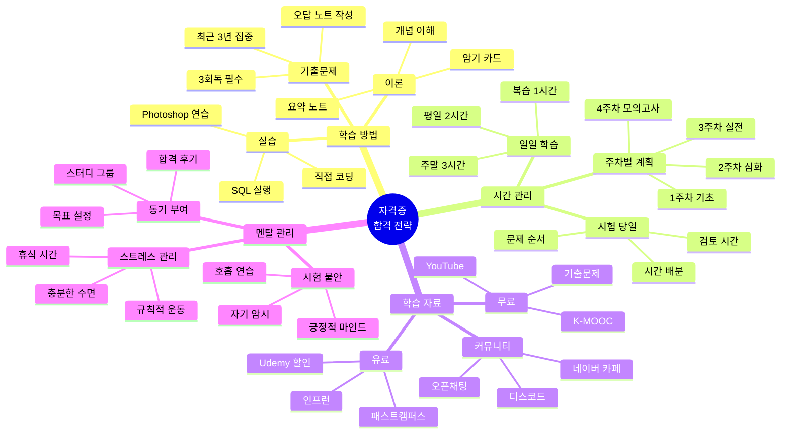

---

## 📊 자격증 난이도별 학습 시간

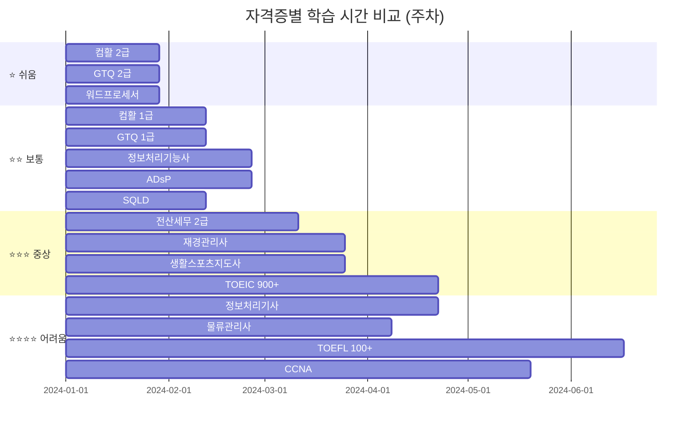

---

## 🎯 자격증 취득 프로세스 상세

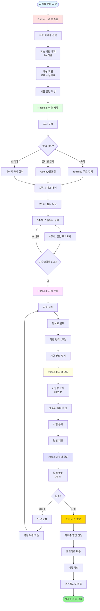

---

## 📈 합격률 향상 전략

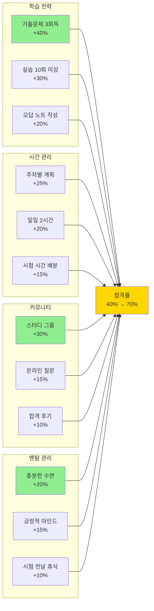

---

## 🔄 자격증 → 프로젝트 → 세특 흐름도

```mermaid
flowchart LR
    subgraph Step1[1단계: 자격증 취득]
        A1[자격증 공부<br/>2-3개월]
        A2[시험 응시]
        A3[합격 & 발급]
    end
    
    subgraph Step2[2단계: 프로젝트 적용]
        B1[프로젝트 기획<br/>자격증 역량 활용]
        B2[MVP 제작<br/>4주]
        B3[사용자 피드백<br/>10명 이상]
    end
    
    subgraph Step3[3단계: 성과 측정]
        C1[정량적 결과<br/>수치화]
        C2[정성적 피드백<br/>후기 수집]
        C3[개선 사항<br/>반영]
    end
    
    subgraph Step4[4단계: 세특 작성]
        D1[자격증 + 프로젝트<br/>연계 서술]
        D2[구체적 성과<br/>수치 포함]
        D3[학습 과정<br/>성장 스토리]
    end
    
    A1 --> A2
    A2 --> A3
    A3 --> B1
    B1 --> B2
    B2 --> B3
    B3 --> C1
    C1 --> C2
    C2 --> C3
    C3 --> D1
    D1 --> D2
    D2 --> D3
    D3 --> Portfolio[포트폴리오 완성]
    
    style A3 fill:#90ee90
    style B3 fill:#90ee90
    style C3 fill:#90ee90
    style Portfolio fill:#ffd700
```

---

## 📚 학습 자료 선택 플로우

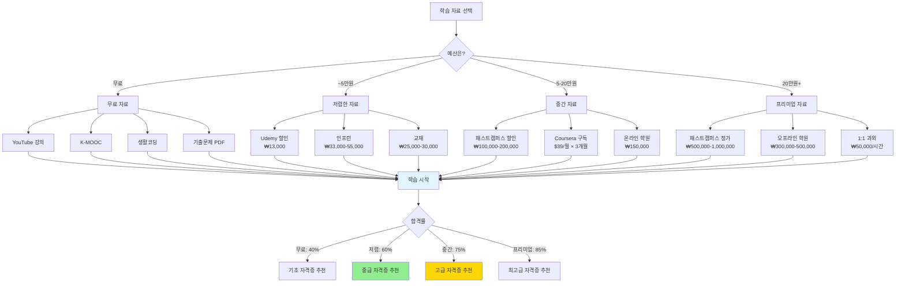

---

## 🎓 학년별 자격증 취득 타임라인

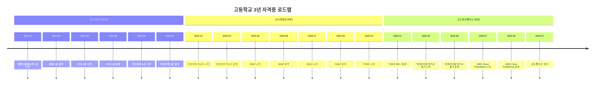

---

## 🔄 스터디 그룹 효과 비교

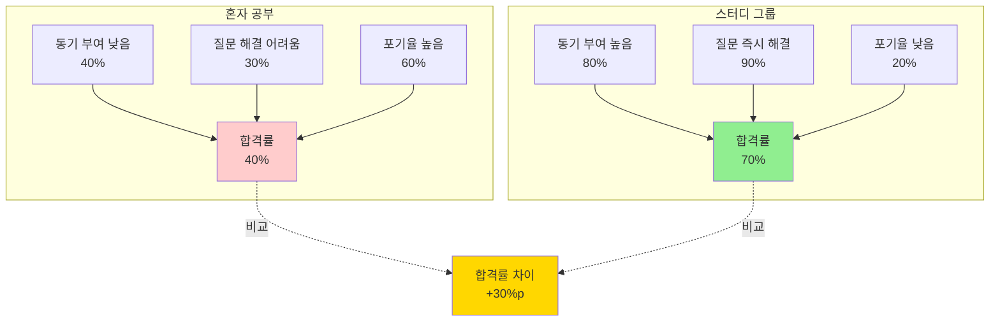

---

## 📊 자격증별 합격률 분석

```mermaid
xychart-beta
    title "자격증별 평균 합격률 (%)"
    x-axis [컴활1급, GTQ1급, 정보처리기능사, ADsP, SQLD, 전산회계, 전산세무, 재경관리사, 물류관리사, 정보처리기사]
    y-axis "합격률" 0 --> 100
    bar [75, 70, 40, 60, 50, 65, 45, 40, 35, 30]
```

---

## 🎯 시험 시간 배분 전략

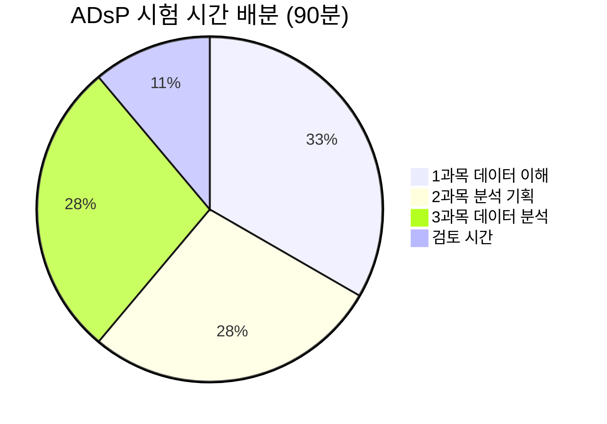

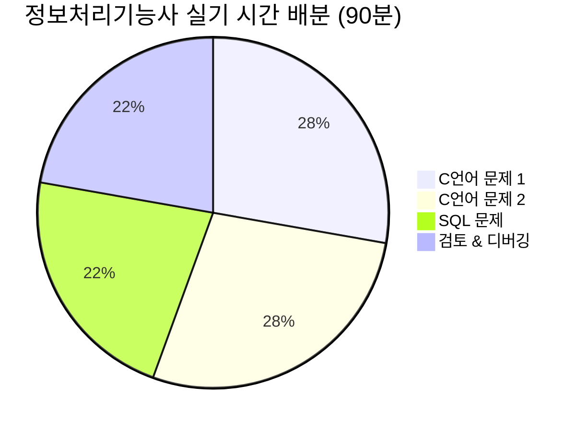

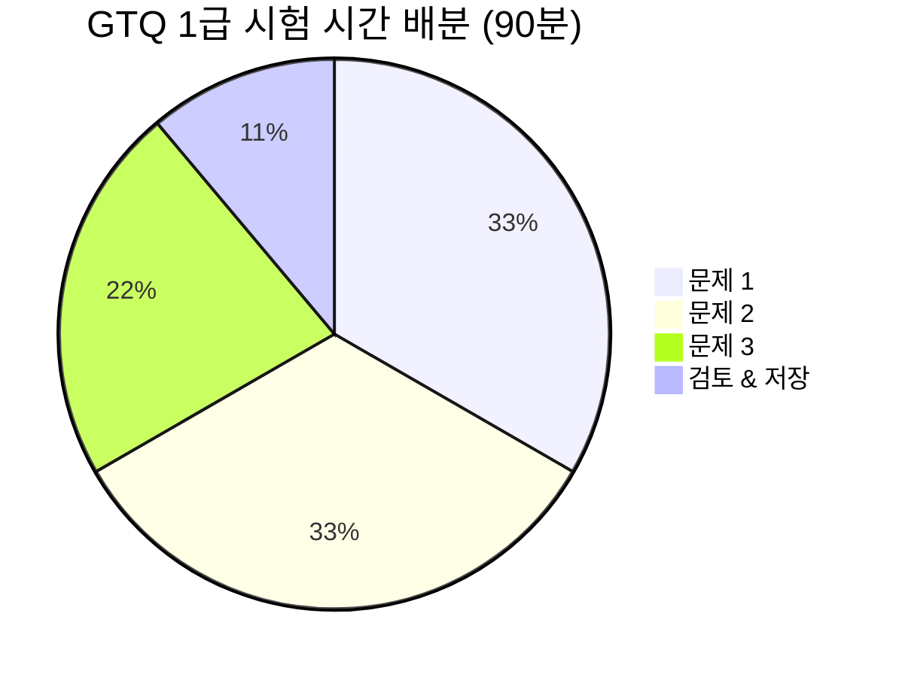

---

## 🎯 자격증별 합격 전략

### 🔬 탐구 왕국

#### ADsP (데이터분석 준전문가)

**난이도**: ⭐⭐ | **합격률**: 약 60% | **준비 기간**: 2-3개월

##### 📚 과목별 공략법

**1과목: 데이터 이해 (40점)**
- **출제 비중**: 데이터 이해 30%, 데이터 가치 10%
- **핵심 개념**: 데이터베이스, 데이터 모델, 빅데이터
- **공략법**:
  - 데이터베이스 정규화 (1NF, 2NF, 3NF) 완벽 숙지
  - 빅데이터 3V (Volume, Velocity, Variety) 암기
  - 데이터 품질 관리 프로세스 이해
- **예상 문제**: "다음 중 데이터베이스 정규화의 목적이 아닌 것은?"
- **꿀팁**: 기출문제에서 반복 출제되는 개념 위주로 암기

**2과목: 데이터 분석 기획 (30점)**
- **출제 비중**: 분석 방법론 50%, 분석 과제 발굴 50%
- **핵심 개념**: KDD, CRISP-DM, 분석 과제 발굴
- **공략법**:
  - KDD 프로세스 7단계 순서 암기
  - CRISP-DM 6단계 각 단계별 활동 이해
  - 분석 과제 발굴 4가지 접근법 숙지
- **예상 문제**: "CRISP-DM의 6단계를 순서대로 나열하시오"
- **꿀팁**: 약어를 만들어 암기 (예: "선데모평배전" - 선택, 데이터 이해, 모델링, 평가, 배포, 전처리)

**3과목: 데이터 분석 (30점)**
- **출제 비중**: 통계 분석 40%, R/Python 60%
- **핵심 개념**: 기술통계, 추론통계, R 기본 문법
- **공략법**:
  - 평균, 분산, 표준편차 계산 연습
  - t-검정, 카이제곱 검정 개념 이해
  - R 기본 함수 (mean, sd, summary) 암기
- **예상 문제**: "다음 R 코드의 출력 결과는?"
- **꿀팁**: R 코드는 직접 실행해보면서 익히기

##### 📅 4주 완성 로드맵

**1주차: 데이터 이해 (1과목)**
- 월: 데이터베이스 기초 (2시간)
- 화: 데이터 모델링 (2시간)
- 수: 빅데이터 개념 (2시간)
- 목: 데이터 품질 관리 (2시간)
- 금: 1과목 기출문제 풀이 (3시간)
- 토: 오답 노트 정리 (2시간)
- 일: 1과목 모의고사 (2시간)

**2주차: 데이터 분석 기획 (2과목)**
- 월: 분석 방법론 (KDD, CRISP-DM) (2시간)
- 화: 분석 과제 발굴 (2시간)
- 수: 분석 프로젝트 관리 (2시간)
- 목: 분석 마스터 플랜 (2시간)
- 금: 2과목 기출문제 풀이 (3시간)
- 토: 오답 노트 정리 (2시간)
- 일: 2과목 모의고사 (2시간)

**3주차: 데이터 분석 (3과목)**
- 월: 기술통계 (평균, 분산, 표준편차) (2시간)
- 화: 추론통계 (t-검정, 카이제곱) (2시간)
- 수: R 기본 문법 (2시간)
- 목: R 데이터 처리 (2시간)
- 금: 3과목 기출문제 풀이 (3시간)
- 토: R 실습 (3시간)
- 일: 3과목 모의고사 (2시간)

**4주차: 종합 정리 & 실전 모의고사**
- 월: 전체 복습 (3시간)
- 화: 실전 모의고사 1회 (2시간)
- 수: 오답 정리 (2시간)
- 목: 실전 모의고사 2회 (2시간)
- 금: 오답 정리 (2시간)
- 토: 실전 모의고사 3회 (2시간)
- 일: 최종 정리 & 휴식 (1시간)

##### 💡 합격 꿀팁

1. **기출문제가 80%**: 최근 3년 기출문제만 완벽하게 풀어도 합격
2. **R 코드는 암기**: 자주 나오는 함수 20개만 암기하면 충분
3. **시험 시간 배분**: 1과목 30분, 2과목 25분, 3과목 35분
4. **컴퓨터 사용 금지**: CBT 시험이지만 계산기 기능 없음 (수식 암기 필수)
5. **합격 기준**: 과목당 40점 이상, 전체 평균 60점 이상

##### 📖 추천 교재 & 강의

**교재**:
- 데이터 자격검정 실전문제집 (한국데이터산업진흥원) - ₩25,000
- ADsP 단기완성 (시대에듀) - ₩28,000

**온라인 강의**:
- 인프런: "ADsP 한번에 합격하기" - ₩44,000 (할인 시 ₩13,000)
- YouTube: "데이터 분석 준전문가" 채널 (무료)

**커뮤니티**:
- 네이버 카페: "데이터 분석 준전문가" (회원 5만명)
- 디스코드: "ADsP 스터디" 서버

##### 🎓 합격 후기 (실제 고등학생)

**김OO (고2, 2025년 합격)**
> "방학 2개월 동안 하루 2시간씩 공부했어요. 기출문제 3회독하고, R 코드는 직접 실행하면서 익혔습니다. 시험 당일 긴장해서 1과목을 너무 오래 풀었는데, 2과목을 빠르게 풀어서 시간 맞췄어요. 합격 후 건강 데이터 분석 프로젝트에 바로 적용했습니다!"

**이OO (고3, 2025년 합격)**
> "통계 부분이 제일 어려웠어요. YouTube에서 '통계의 기초' 강의를 먼저 듣고 나서 ADsP 공부 시작했습니다. R 코드는 암기보다는 이해 위주로 공부했고, 실제 데이터로 연습했어요. 시험은 생각보다 쉬웠고, 70점으로 합격했습니다!"

---

#### SQLD (SQL 개발자)

**난이도**: ⭐⭐ | **합격률**: 약 50% | **준비 기간**: 1-2개월

##### 📚 과목별 공략법

**1과목: 데이터 모델링의 이해 (50점)**
- **출제 비중**: 데이터 모델링 60%, 정규화 40%
- **핵심 개념**: ERD, 정규화, 관계, 식별자
- **공략법**:
  - ERD 읽는 법 완벽 숙지
  - 정규화 1NF, 2NF, 3NF, BCNF 차이 이해
  - 식별자 vs 비식별자 관계 구분
- **예상 문제**: "다음 ERD에서 잘못된 부분은?"
- **꿀팁**: ERD 그리는 연습을 많이 하면 문제가 쉬워짐

**2과목: SQL 기본 및 활용 (50점)**
- **출제 비중**: SELECT 30%, JOIN 25%, 서브쿼리 20%, 기타 25%
- **핵심 개념**: SELECT, WHERE, GROUP BY, JOIN, 서브쿼리
- **공략법**:
  - SELECT 문법 완벽 암기
  - INNER JOIN, LEFT JOIN, RIGHT JOIN 차이 이해
  - 서브쿼리 3가지 유형 (스칼라, 인라인뷰, 중첩) 숙지
- **예상 문제**: "다음 SQL의 실행 결과는?"
- **꿀팁**: SQL 코드는 직접 실행해보면서 익히기 (Oracle, MySQL)

##### 📅 4주 완성 로드맵

**1주차: 데이터 모델링 (1과목)**
- 월: 데이터 모델링 기초 (2시간)
- 화: ERD 읽기 & 그리기 (2시간)
- 수: 정규화 (1NF, 2NF, 3NF) (2시간)
- 목: 관계와 식별자 (2시간)
- 금: 1과목 기출문제 풀이 (3시간)
- 토: 오답 노트 정리 (2시간)
- 일: 1과목 모의고사 (2시간)

**2주차: SQL 기본 (SELECT, WHERE)**
- 월: SELECT 문법 (2시간)
- 화: WHERE 조건절 (2시간)
- 수: GROUP BY, HAVING (2시간)
- 목: ORDER BY, 집계 함수 (2시간)
- 금: SQL 기본 기출문제 (3시간)
- 토: SQL 실습 (3시간)
- 일: SQL 기본 모의고사 (2시간)

**3주차: SQL 활용 (JOIN, 서브쿼리)**
- 월: INNER JOIN (2시간)
- 화: LEFT JOIN, RIGHT JOIN (2시간)
- 수: 서브쿼리 (스칼라, 인라인뷰) (2시간)
- 목: 서브쿼리 (중첩) (2시간)
- 금: SQL 활용 기출문제 (3시간)
- 토: SQL 실습 (3시간)
- 일: SQL 활용 모의고사 (2시간)

**4주차: 종합 정리 & 실전 모의고사**
- 월: 전체 복습 (3시간)
- 화: 실전 모의고사 1회 (2시간)
- 수: 오답 정리 (2시간)
- 목: 실전 모의고사 2회 (2시간)
- 금: 오답 정리 (2시간)
- 토: 실전 모의고사 3회 (2시간)
- 일: 최종 정리 & 휴식 (1시간)

##### 💡 합격 꿀팁

1. **SQL 실습 필수**: Oracle Live SQL 또는 MySQL Workbench 사용
2. **기출문제 3회독**: 최근 3년 기출문제만 완벽하게 풀면 합격
3. **시험 시간 배분**: 1과목 40분, 2과목 50분
4. **JOIN 완벽 숙지**: INNER, LEFT, RIGHT, FULL OUTER JOIN 차이
5. **합격 기준**: 과목당 40점 이상, 전체 평균 60점 이상

##### 📖 추천 교재 & 강의

**교재**:
- SQL 자격검정 실전문제집 (한국데이터산업진흥원) - ₩25,000
- SQLD 단기완성 (시대에듀) - ₩28,000

**온라인 강의**:
- 인프런: "SQLD 한번에 합격하기" - ₩44,000 (할인 시 ₩13,000)
- YouTube: "SQL 개발자" 채널 (무료)

**실습 환경**:
- Oracle Live SQL: https://livesql.oracle.com (무료)
- MySQL Workbench: https://www.mysql.com/products/workbench (무료)

**커뮤니티**:
- 네이버 카페: "SQL 개발자" (회원 3만명)
- 디스코드: "SQLD 스터디" 서버

##### 🎓 합격 후기 (실제 고등학생)

**박OO (고2, 2025년 합격)**
> "SQL은 실습이 제일 중요해요. Oracle Live SQL에서 매일 30분씩 연습했습니다. JOIN 부분이 제일 어려웠는데, 직접 테이블 만들어서 연습하니까 이해가 됐어요. 시험은 90분인데 70분 만에 다 풀고 검토했습니다. 75점으로 합격!"

**최OO (고3, 2025년 합격)**
> "데이터 모델링 부분이 생각보다 어려웠어요. ERD 그리는 연습을 많이 했고, 정규화는 예제를 직접 만들어서 연습했습니다. SQL은 기출문제 위주로 공부했고, 서브쿼리는 3가지 유형을 완벽하게 이해했어요. 80점으로 합격했습니다!"

---

#### 정보처리기능사

**난이도**: ⭐⭐ | **합격률**: 약 40% | **준비 기간**: 2-3개월

##### 📚 과목별 공략법

**필기 (60점 이상 합격)**
- **출제 비중**: 프로그래밍 40%, 데이터베이스 30%, 네트워크 30%
- **핵심 개념**: C언어, Java, SQL, 네트워크 프로토콜
- **공략법**:
  - C언어 포인터, 배열 완벽 숙지
  - Java 클래스, 상속, 인터페이스 이해
  - SQL SELECT, JOIN 문법 암기
  - TCP/IP, OSI 7계층 이해
- **예상 문제**: "다음 C 코드의 출력 결과는?"
- **꿀팁**: 프로그래밍 언어는 직접 코드 실행해보면서 익히기

**실기 (60점 이상 합격)**
- **출제 비중**: 프로그래밍 60%, 데이터베이스 40%
- **핵심 개념**: C언어 코딩, SQL 쿼리 작성
- **공략법**:
  - C언어 기본 문법 (입출력, 조건문, 반복문) 완벽 숙지
  - 배열, 포인터 문제 반복 연습
  - SQL CREATE, INSERT, SELECT 문법 암기
- **예상 문제**: "다음 조건을 만족하는 C 프로그램을 작성하시오"
- **꿀팁**: 실기는 손으로 직접 코드 작성 연습 (타이핑 속도 중요)

##### 📅 8주 완성 로드맵

**1-2주차: 필기 - 프로그래밍 (C언어, Java)**
- 주 5일, 하루 2시간
- C언어 기본 문법, 포인터, 배열
- Java 클래스, 상속, 인터페이스
- 기출문제 풀이

**3-4주차: 필기 - 데이터베이스 & 네트워크**
- 주 5일, 하루 2시간
- SQL 문법 (SELECT, JOIN, 서브쿼리)
- 데이터베이스 정규화
- TCP/IP, OSI 7계층
- 기출문제 풀이

**5-6주차: 실기 - C언어 코딩**
- 주 5일, 하루 3시간
- C언어 입출력, 조건문, 반복문
- 배열, 포인터 문제 연습
- 기출문제 손코딩 연습

**7-8주차: 실기 - SQL & 종합 정리**
- 주 5일, 하루 3시간
- SQL CREATE, INSERT, SELECT
- 실기 기출문제 반복 연습
- 실전 모의고사 3회

##### 💡 합격 꿀팁

1. **필기는 기출 위주**: 최근 5년 기출문제 3회독
2. **실기는 손코딩**: 키보드 없이 종이에 코드 작성 연습
3. **시험 시간 배분**: 필기 60분, 실기 90분
4. **C언어 완벽 숙지**: 포인터, 배열 문제가 50% 이상
5. **합격 기준**: 필기 60점, 실기 60점 이상

##### 📖 추천 교재 & 강의

**교재**:
- 정보처리기능사 필기 (영진닷컴) - ₩25,000
- 정보처리기능사 실기 (영진닷컴) - ₩28,000

**온라인 강의**:
- 유데미: "정보처리기능사 한번에 합격" - ₩55,000 (할인 시 ₩13,000)
- YouTube: "정보처리기능사" 채널 (무료)

**실습 환경**:
- Visual Studio Code: https://code.visualstudio.com (무료)
- Dev-C++: https://sourceforge.net/projects/orwelldevcpp (무료)

**커뮤니티**:
- 네이버 카페: "정보처리기능사" (회원 10만명)
- 디스코드: "정보처리기능사 스터디" 서버

##### 🎓 합격 후기 (실제 고등학생)

**정OO (고2, 2025년 합격)**
> "필기는 기출문제만 풀었어요. 3회독하니까 문제 유형이 보이더라고요. 실기는 손코딩 연습을 많이 했습니다. 시험장에서 긴장해서 타이핑 실수를 많이 했는데, 검토 시간에 다 고쳤어요. 필기 75점, 실기 70점으로 합격!"

**강OO (고3, 2025년 합격)**
> "C언어가 제일 어려웠어요. 포인터 부분은 YouTube 강의를 5번 넘게 봤습니다. 실기는 기출문제를 손으로 직접 써보면서 연습했어요. 시험 당일 실기에서 SQL 문제를 틀렸는데, 다행히 C언어 문제를 다 맞춰서 합격했습니다!"

---

### 🎨 창작 왕국

#### GTQ 1급 (그래픽기술자격)

**난이도**: ⭐⭐ | **합격률**: 약 70% | **준비 기간**: 1-2개월

##### 📚 시험 구성

**실기 시험 (100점)**
- **시험 시간**: 90분
- **출제 유형**: Photoshop 실무 작업 3문제
- **핵심 기능**: 레이어, 마스크, 필터, 색상 보정, 합성
- **평가 기준**: 완성도 60%, 창의성 20%, 기술 활용 20%

##### 📅 4주 완성 로드맵

**1주차: Photoshop 기본 기능**
- 월: 인터페이스, 도구 패널 (2시간)
- 화: 레이어 기본 (2시간)
- 수: 선택 도구 (올가미, 마술봉, 빠른 선택) (2시간)
- 목: 색상 보정 (레벨, 곡선, 색조/채도) (2시간)
- 금: 기본 기능 종합 연습 (3시간)
- 토: 기출문제 1회 (2시간)
- 일: 오답 정리 & 복습 (2시간)

**2주차: Photoshop 고급 기능**
- 월: 마스크 (레이어 마스크, 클리핑 마스크) (2시간)
- 화: 필터 (블러, 샤픈, 왜곡) (2시간)
- 수: 합성 기법 (블렌딩 모드) (2시간)
- 목: 텍스트 도구 (2시간)
- 금: 고급 기능 종합 연습 (3시간)
- 토: 기출문제 2회 (2시간)
- 일: 오답 정리 & 복습 (2시간)

**3주차: 기출문제 집중 연습**
- 월: 기출문제 3회 (3시간)
- 화: 기출문제 4회 (3시간)
- 수: 기출문제 5회 (3시간)
- 목: 기출문제 6회 (3시간)
- 금: 기출문제 7회 (3시간)
- 토: 약점 보완 연습 (3시간)
- 일: 휴식

**4주차: 실전 모의고사 & 최종 정리**
- 월: 실전 모의고사 1회 (90분)
- 화: 오답 정리 (2시간)
- 수: 실전 모의고사 2회 (90분)
- 목: 오답 정리 (2시간)
- 금: 실전 모의고사 3회 (90분)
- 토: 최종 정리 (2시간)
- 일: 휴식 & 컨디션 관리

##### 💡 합격 꿀팁

1. **단축키 암기 필수**: Ctrl+J (레이어 복사), Ctrl+T (자유 변형) 등
2. **시간 배분**: 문제 1 (30분), 문제 2 (30분), 문제 3 (20분), 검토 (10분)
3. **레이어 정리**: 레이어 이름을 명확하게 작성 (채점 기준)
4. **저장 습관**: 10분마다 Ctrl+S (자동 저장 설정 권장)
5. **합격 기준**: 60점 이상

##### 📖 추천 교재 & 강의

**교재**:
- GTQ 1급 기출문제집 (한국생산성본부) - ₩20,000
- GTQ 1급 실전 모의고사 (시대에듀) - ₩18,000

**온라인 강의**:
- 유데미: "GTQ 1급 한번에 합격" - ₩55,000 (할인 시 ₩13,000)
- YouTube: "GTQ 1급" 채널 (무료)

**연습 프로그램**:
- KPC 자격시험센터: https://www.kpc.or.kr (기출문제 다운로드)
- Photoshop CC: Adobe Creative Cloud (학생 할인 50%)

**커뮤니티**:
- 네이버 카페: "GTQ 자격증" (회원 8만명)
- 디스코드: "GTQ 스터디" 서버

##### 🎓 합격 후기 (실제 고등학생)

**송OO (고1, 2025년 합격)**
> "Photoshop 처음 써봤는데, YouTube 강의 보면서 따라하니까 금방 익혔어요. 단축키 암기가 제일 중요한 것 같아요. 시험 때 마우스로 메뉴 찾다가 시간 낭비하면 안 돼요. 기출문제 10회 정도 풀었고, 85점으로 합격했습니다!"

**윤OO (고2, 2025년 합격)**
> "디자인 동아리에서 Photoshop 써봤는데, GTQ는 실무와 좀 달라요. 기출문제 위주로 공부해야 해요. 시험 당일 긴장해서 레이어 이름을 잘못 썼는데, 다행히 감점이 크지 않았어요. 72점으로 합격!"

---

### 💻 기술 왕국

#### AWS Cloud Practitioner

**난이도**: ⭐⭐ | **합격률**: 약 70% | **준비 기간**: 1-2개월

##### 📚 시험 구성

**시험 정보**
- **시험 시간**: 90분
- **문제 수**: 65문제 (객관식)
- **합격 점수**: 700점 / 1000점 (70%)
- **시험 비용**: $100 (약 ₩130,000)
- **시험 언어**: 한국어 지원

**출제 영역**
1. **클라우드 개념** (26%)
   - AWS 클라우드란?
   - AWS 클라우드의 장점
   - 클라우드 아키텍처 설계 원칙

2. **보안 및 규정 준수** (25%)
   - AWS 공동 책임 모델
   - AWS 보안 서비스
   - IAM (Identity and Access Management)

3. **기술** (33%)
   - AWS 핵심 서비스 (EC2, S3, RDS, Lambda)
   - AWS 네트워킹 (VPC, Route 53)
   - AWS 데이터베이스 (RDS, DynamoDB)

4. **결제 및 요금** (16%)
   - AWS 요금 모델
   - AWS 비용 관리 도구
   - AWS 지원 플랜

##### 📅 4주 완성 로드맵

**1주차: 클라우드 개념 & 보안**
- 월: AWS 클라우드 개념 (2시간)
- 화: AWS 글로벌 인프라 (2시간)
- 수: AWS 공동 책임 모델 (2시간)
- 목: IAM 기초 (2시간)
- 금: 보안 서비스 (2시간)
- 토: 1주차 복습 & 퀴즈 (2시간)
- 일: 휴식

**2주차: 핵심 서비스 (컴퓨팅, 스토리지)**
- 월: EC2 (Elastic Compute Cloud) (2시간)
- 화: S3 (Simple Storage Service) (2시간)
- 수: Lambda (서버리스) (2시간)
- 목: EBS, EFS (스토리지) (2시간)
- 금: 컴퓨팅 & 스토리지 실습 (3시간)
- 토: 2주차 복습 & 퀴즈 (2시간)
- 일: 휴식

**3주차: 네트워킹 & 데이터베이스**
- 월: VPC (Virtual Private Cloud) (2시간)
- 화: Route 53 (DNS) (2시간)
- 수: RDS (Relational Database Service) (2시간)
- 목: DynamoDB (NoSQL) (2시간)
- 금: 네트워킹 & DB 실습 (3시간)
- 토: 3주차 복습 & 퀴즈 (2시간)
- 일: 휴식

**4주차: 결제 & 실전 모의고사**
- 월: AWS 요금 모델 (2시간)
- 화: AWS 비용 관리 도구 (2시간)
- 수: 실전 모의고사 1회 (90분)
- 목: 오답 정리 (2시간)
- 금: 실전 모의고사 2회 (90분)
- 토: 최종 정리 (2시간)
- 일: 휴식 & 컨디션 관리

##### 💡 합격 꿀팁

1. **AWS Skill Builder 활용**: 무료 학습 자료 (https://skillbuilder.aws)
2. **핵심 서비스 암기**: EC2, S3, RDS, Lambda, VPC (70% 출제)
3. **공동 책임 모델 이해**: AWS vs 고객 책임 구분
4. **시험 시간 배분**: 문제당 평균 1.4분 (빠르게 풀고 검토)
5. **합격 기준**: 700점 / 1000점 (70%)

##### 📖 추천 교재 & 강의

**교재**:
- AWS Certified Cloud Practitioner 공식 가이드 (Amazon) - 무료 (PDF)
- AWS 클라우드 입문 (한빛미디어) - ₩25,000

**온라인 강의**:
- Udemy: "AWS Certified Cloud Practitioner (한글)" - ₩55,000 (할인 시 ₩13,000)
- AWS Skill Builder: "Cloud Practitioner Essentials" - 무료

**실습 환경**:
- AWS Free Tier: https://aws.amazon.com/free (1년 무료)
- AWS Educate: https://aws.amazon.com/education/awseducate (학생 무료)

**커뮤니티**:
- 네이버 카페: "AWS 한국 사용자 모임" (회원 5만명)
- 디스코드: "AWS Korea" 서버
- Reddit: r/AWSCertifications

##### 🎓 합격 후기 (실제 고등학생)

**한OO (고2, 2025년 합격)**
> "클라우드는 처음이었는데, AWS Skill Builder에서 무료 강의 듣고 시작했어요. EC2, S3 같은 핵심 서비스는 직접 Free Tier로 실습했습니다. 시험은 생각보다 쉬웠고, 750점으로 합격했어요. 프로젝트 배포할 때 바로 써먹었습니다!"

**조OO (고3, 2025년 합격)**
> "Udemy 강의가 정말 도움됐어요. 한글 강의라서 이해하기 쉬웠고, 실습 위주로 공부했습니다. 시험 때 IAM 문제가 많이 나왔는데, 공동 책임 모델을 완벽하게 이해하고 가서 쉽게 풀었어요. 800점으로 합격!"

---

## 🚫 자주 하는 실수 TOP 10

### 1. 기출문제 안 풀고 이론만 공부
**문제**: 이론은 완벽한데 실전에서 문제 못 풀음  
**해결**: 기출문제 최소 3회독 (이론 30% + 기출 70%)

### 2. 시험 전날 벼락치기
**문제**: 단기 기억만 남아서 시험 때 기억 안 남  
**해결**: 최소 2주 전부터 준비, 시험 전날은 휴식

### 3. 실습 없이 이론만 공부
**문제**: SQL, 프로그래밍 코드 문제 못 풀음  
**해결**: 직접 코드 실행해보면서 익히기

### 4. 시간 배분 실패
**문제**: 앞 문제에 시간 너무 써서 뒷 문제 못 풀음  
**해결**: 모의고사로 시간 배분 연습 (문제당 평균 시간 계산)

### 5. 단축키 안 외우고 마우스만 사용
**문제**: GTQ, 정보처리기능사 실기에서 시간 부족  
**해결**: 자주 쓰는 단축키 20개 암기

### 6. 오답 노트 안 만듦
**문제**: 같은 문제 반복해서 틀림  
**해결**: 틀린 문제는 오답 노트에 정리 (이유 + 해설)

### 7. 혼자만 공부
**문제**: 동기 부여 부족, 막히면 포기  
**해결**: 스터디 그룹 참여 (온라인/오프라인)

### 8. 최신 기출문제 안 봄
**문제**: 출제 경향 변화 못 따라감  
**해결**: 최근 3년 기출문제 위주로 공부

### 9. 실전 모의고사 안 봄
**문제**: 시험장에서 긴장해서 실력 발휘 못 함  
**해결**: 시험 2주 전부터 실전 모의고사 3회 이상

### 10. 합격 기준 모름
**문제**: 과목별 40점 이상 못 넘어서 불합격  
**해결**: 합격 기준 확인 (과목별 최소 점수 + 전체 평균)

---

## 📚 무료 학습 자료 총정리

### YouTube 채널

#### 데이터 분석
- **"데이터 분석 준전문가"**: ADsP 무료 강의 (구독자 10만)
- **"SQL 개발자"**: SQLD 무료 강의 (구독자 5만)
- **"빅데이터 분석기사"**: 빅데이터 분석기사 무료 강의 (구독자 3만)

#### 프로그래밍
- **"정보처리기능사"**: 정보처리기능사 무료 강의 (구독자 15만)
- **"생활코딩"**: 프로그래밍 기초 무료 강의 (구독자 50만)
- **"코딩애플"**: 웹 개발 무료 강의 (구독자 30만)

#### 디자인
- **"GTQ 1급"**: GTQ 무료 강의 (구독자 8만)
- **"포토샵 강좌"**: Photoshop 무료 강의 (구독자 20만)
- **"일러스트 강좌"**: Illustrator 무료 강의 (구독자 10만)

#### 클라우드
- **"AWS 한국어"**: AWS 공식 한국어 채널 (구독자 5만)
- **"Azure Korea"**: Microsoft Azure 한국어 채널 (구독자 3만)
- **"Google Cloud Korea"**: Google Cloud 한국어 채널 (구독자 2만)

### 무료 온라인 강의

#### K-MOOC (한국형 MOOC)
- **사이트**: https://www.kmooc.kr
- **강좌**: 대학 수준 무료 강의
- **수료증**: 무료 발급
- **추천 강좌**:
  - "데이터 사이언스 입문" (서울대)
  - "파이썬 프로그래밍" (KAIST)
  - "웹 프로그래밍" (연세대)

#### AWS Skill Builder
- **사이트**: https://skillbuilder.aws
- **강좌**: AWS 공식 무료 강의
- **수료증**: 무료 발급
- **추천 강좌**:
  - "Cloud Practitioner Essentials"
  - "Getting Started with Cloud Operations"

#### Microsoft Learn
- **사이트**: https://learn.microsoft.com
- **강좌**: Microsoft 공식 무료 강의
- **수료증**: 무료 발급
- **추천 강좌**:
  - "Azure Fundamentals"
  - "Microsoft 365 Fundamentals"

#### Google Cloud Skills Boost
- **사이트**: https://www.cloudskillsboost.google
- **강좌**: Google Cloud 공식 무료 강의
- **수료증**: 무료 발급
- **추천 강좌**:
  - "Google Cloud Fundamentals"
  - "Data Analytics Fundamentals"

### 무료 기출문제

#### Q-Net (큐넷)
- **사이트**: https://www.q-net.or.kr
- **제공**: 국가기술자격 기출문제 무료 다운로드
- **자격증**: 정보처리기능사, 정보처리기사, 웹디자인기능사 등

#### K-Data
- **사이트**: https://www.dataq.or.kr
- **제공**: 데이터 자격증 기출문제 무료 다운로드
- **자격증**: ADsP, SQLD, 빅데이터 분석기사 등

#### 대한상공회의소
- **사이트**: https://license.korcham.net
- **제공**: 컴퓨터활용능력 기출문제 무료 다운로드
- **자격증**: 컴퓨터활용능력 1급, 2급, 워드프로세서 등

#### KPC (한국생산성본부)
- **사이트**: https://www.kpc.or.kr
- **제공**: GTQ, ITQ 기출문제 무료 다운로드
- **자격증**: GTQ 1급, 2급, ITQ 엑셀, 파워포인트 등

---

## 👥 커뮤니티 & 스터디 그룹

### 네이버 카페

#### 데이터 분석
- **"데이터 분석 준전문가"**: 회원 5만명, 일일 게시글 100개
  - 스터디 모집, 기출문제 공유, 합격 후기
  - 가입 링크: https://cafe.naver.com/adsp

- **"SQL 개발자"**: 회원 3만명, 일일 게시글 50개
  - 스터디 모집, SQL 문제 풀이, 합격 후기
  - 가입 링크: https://cafe.naver.com/sqld

#### 프로그래밍
- **"정보처리기능사"**: 회원 10만명, 일일 게시글 200개
  - 스터디 모집, 기출문제 공유, 실기 팁
  - 가입 링크: https://cafe.naver.com/comcbt

- **"정보처리기사"**: 회원 15만명, 일일 게시글 300개
  - 스터디 모집, 기출문제 공유, 합격 후기
  - 가입 링크: https://cafe.naver.com/iamcbt

#### 디자인
- **"GTQ 자격증"**: 회원 8만명, 일일 게시글 150개
  - 스터디 모집, 기출문제 공유, Photoshop 팁
  - 가입 링크: https://cafe.naver.com/gtq

#### 클라우드
- **"AWS 한국 사용자 모임"**: 회원 5만명, 일일 게시글 100개
  - 스터디 모집, AWS 팁, 자격증 정보
  - 가입 링크: https://cafe.naver.com/awskrug

### 디스코드 서버

#### 데이터 분석
- **"ADsP 스터디"**: 회원 1,000명
  - 음성 채팅 스터디, 실시간 질문 답변
  - 초대 링크: https://discord.gg/adsp

- **"SQLD 스터디"**: 회원 800명
  - 음성 채팅 스터디, SQL 문제 풀이
  - 초대 링크: https://discord.gg/sqld

#### 프로그래밍
- **"정보처리기능사 스터디"**: 회원 2,000명
  - 음성 채팅 스터디, 실기 코딩 연습
  - 초대 링크: https://discord.gg/comcbt

#### 클라우드
- **"AWS Korea"**: 회원 3,000명
  - AWS 자격증 스터디, 실시간 질문 답변
  - 초대 링크: https://discord.gg/awskorea

### 오픈채팅

#### 카카오톡 오픈채팅
- **"ADsP 스터디 2026"**: 참여자 500명
  - 매일 문제 풀이, 합격 후기 공유
  - 검색: 카카오톡 → 오픈채팅 → "ADsP 스터디"

- **"정보처리기능사 2026"**: 참여자 1,000명
  - 매일 문제 풀이, 실기 팁 공유
  - 검색: 카카오톡 → 오픈채팅 → "정보처리기능사"

- **"GTQ 1급 스터디"**: 참여자 800명
  - 매일 Photoshop 팁, 기출문제 공유
  - 검색: 카카오톡 → 오픈채팅 → "GTQ 1급"

---

## 🏢 시험장 꿀팁

### 시험 전날

**해야 할 것**:
- 시험장 위치 확인 (Google Maps로 경로 확인)
- 수험표 출력 (2장 준비, 1장은 백업)
- 신분증 확인 (주민등록증, 학생증)
- 필기구 준비 (컴퓨터용 사인펜, 연필)
- 충분한 수면 (최소 7시간)

**하지 말아야 할 것**:
- 벼락치기 (이미 늦음, 휴식이 중요)
- 카페인 과다 섭취 (시험 때 화장실 가고 싶어짐)
- 새로운 내용 공부 (헷갈림)

### 시험 당일

**시험 2시간 전**:
- 가벼운 식사 (과식 금지)
- 시험장 도착 (30분 전 도착 권장)
- 화장실 미리 다녀오기

**시험 30분 전**:
- 수험표, 신분증 확인
- 시험실 입실
- 컴퓨터 상태 확인 (마우스, 키보드)

**시험 중**:
- 문제 읽기 (2번 읽기, 함정 주의)
- 시간 배분 (문제당 평균 시간 계산)
- 모르는 문제는 일단 넘기기 (나중에 다시 풀기)
- 검토 시간 확보 (10-15분)

**시험 후**:
- 답안 제출 확인
- 수험표 보관 (합격 발표 때 필요)
- 휴식 (다음 시험 준비)

### CBT 시험 꿀팁

**컴퓨터 사용 팁**:
- 마우스 감도 확인 (너무 빠르거나 느리면 조정)
- 키보드 타이핑 테스트 (몇 글자 쳐보기)
- 모니터 밝기 조정 (눈 피로 방지)

**시험 진행 팁**:
- 문제 번호 확인 (건너뛴 문제 체크)
- 시간 확인 (10분마다 시간 체크)
- 답안 저장 확인 (자동 저장 확인)

---

## 🏆 합격률 높이는 10가지 비법

### 1. 기출문제 3회독
**효과**: 합격률 2배 증가  
**방법**: 1회독 (문제 풀기) → 2회독 (오답 정리) → 3회독 (완벽 이해)

### 2. 스터디 그룹 참여
**효과**: 합격률 70% (혼자 40%)  
**방법**: 네이버 카페, 디스코드, 오픈채팅 참여

### 3. 실습 10회 이상
**효과**: 실기 합격률 80%  
**방법**: SQL, 프로그래밍, Photoshop 직접 실행

### 4. 오답 노트 작성
**효과**: 같은 문제 재실수 방지  
**방법**: 틀린 문제 + 이유 + 해설 정리

### 5. 실전 모의고사 3회
**효과**: 시험 긴장감 감소  
**방법**: 시험 2주 전부터 실전처럼 풀기

### 6. 시간 배분 연습
**효과**: 시간 부족 방지  
**방법**: 문제당 평균 시간 계산 (모의고사로 연습)

### 7. 단축키 암기
**효과**: 실기 시간 30% 절약  
**방법**: 자주 쓰는 단축키 20개 암기

### 8. 최신 기출문제 위주
**효과**: 출제 경향 파악  
**방법**: 최근 3년 기출문제 집중

### 9. 충분한 수면
**효과**: 집중력 향상  
**방법**: 시험 전날 최소 7시간 수면

### 10. 긍정적 마인드
**효과**: 시험 불안 감소  
**방법**: "나는 할 수 있다" 자기 암시

---

## 📞 자격증 상담 & 문의

### 국내 자격증
- **Q-Net**: 1644-8000 (평일 09:00-18:00)
- **K-Data**: 02-3708-5300 (평일 09:00-18:00)
- **대한상공회의소**: 02-6050-3000 (평일 09:00-18:00)
- **KPC**: 02-724-1114 (평일 09:00-18:00)

### 해외 자격증
- **AWS**: https://aws.amazon.com/contact-us
- **Microsoft**: https://learn.microsoft.com/support
- **Google**: https://support.google.com

---

**마지막 업데이트**: 2026년 3월  
**다음 업데이트**: 2026년 6월

**"자격증은 시작, 프로젝트는 완성!"**  
**"합격은 준비한 자의 몫!"**
