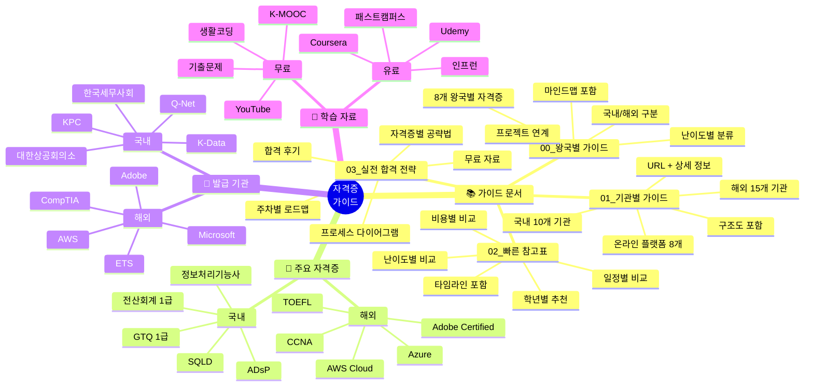
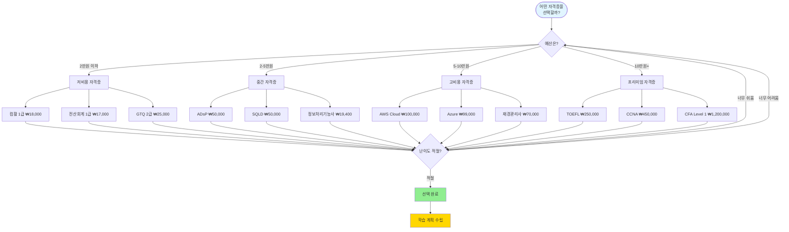
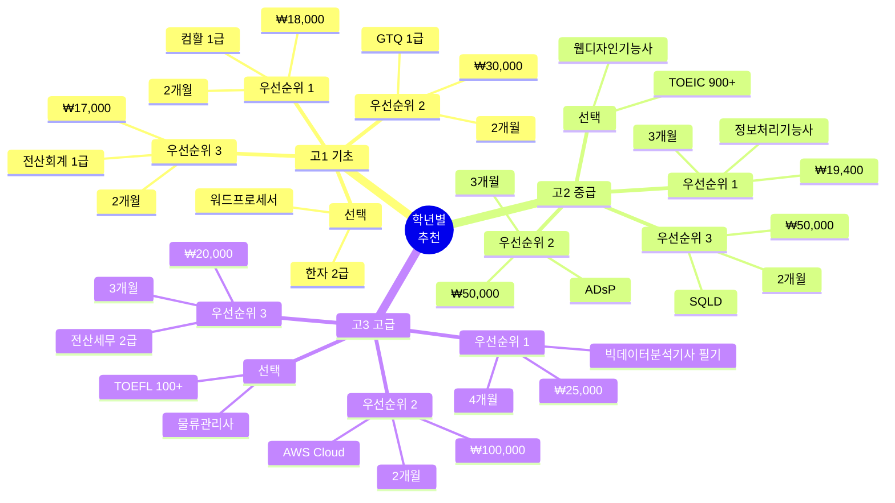
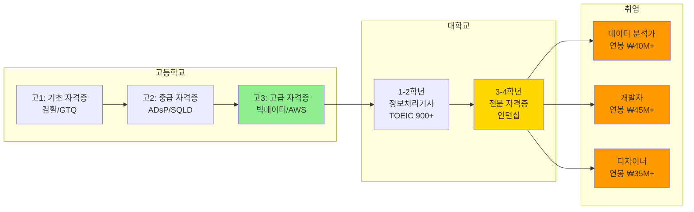

# 8개 왕국별 자격증 가이드

## 📚 개요

각 왕국별로 고등학생이 취득 가능하거나 준비할 수 있는 자격증을 체계적으로 정리한 가이드입니다.

---

## 📂 파일 구조

```
자격증/
├── README.md (이 파일 - 빠른 참고)
├── 00_왕국별_자격증_가이드.md (왕국별 자격증 기본 가이드 + 마인드맵)
├── 01_자격증_기관별_상세가이드.md (기관별 상세 정보 + URL + 구조도)
├── 02_자격증_빠른_참고표.md (한눈에 보는 비교표 + 타임라인)
└── 03_자격증_실전_합격_전략.md (합격 전략 + 학습 로드맵 + 프로세스)
```

---

## 🗺️ 자격증 가이드 전체 구조 마인드맵



---

## 📊 자격증 선택 의사결정 트리



---

## 🎓 학년별 자격증 추천 맵



---

## 🔄 자격증 → 대학 → 취업 경로



---

### 🎯 난이도별 분류

## 🔗 빠른 링크

### 📖 가이드 문서
- **[왕국별 자격증 가이드](./00_왕국별_자격증_가이드.md)**: 8개 왕국별 추천 자격증 (기본)
- **[기관별 상세 가이드](./01_자격증_기관별_상세가이드.md)**: 국내/해외 기관별 자격증 + URL (상세)
- **[빠른 참고표](./02_자격증_빠른_참고표.md)**: 난이도/비용/일정별 비교표 (요약)
- **[실전 합격 전략](./03_자격증_실전_합격_전략.md)**: 자격증별 합격 전략 + 주차별 로드맵 + 실제 합격 후기 ⭐ NEW

### 🎯 추천 읽는 순서
1. **처음 시작**: [빠른 참고표](./02_자격증_빠른_참고표.md) → 난이도/비용 확인
2. **자격증 선택**: [왕국별 가이드](./00_왕국별_자격증_가이드.md) → 내 왕국에 맞는 자격증 찾기
3. **상세 정보**: [기관별 가이드](./01_자격증_기관별_상세가이드.md) → 시험 일정/비용/URL 확인
4. **합격 준비**: [실전 합격 전략](./03_자격증_실전_합격_전략.md) → 주차별 로드맵 + 꿀팁

### 🌐 주요 자격증 사이트

#### 국내 자격증
- **[Q-Net (큐넷)](https://www.q-net.or.kr)**: 국가기술자격 통합 (정보처리기능사, 빅데이터 분석기사 등)
- **[K-Data](https://www.dataq.or.kr)**: 데이터 분석 자격증 (ADsP, SQLD 등)
- **[대한상공회의소](https://license.korcham.net)**: 컴퓨터활용능력, 워드프로세서
- **[한국생산성본부](https://www.kpc.or.kr)**: GTQ, ITQ, 멀티미디어
- **[한국세무사회](https://license.kacpta.or.kr)**: 전산회계, 전산세무
- **[삼일회계법인](https://www.samili.com)**: 재경관리사
- **[한국정보통신진흥협회](https://www.ihd.or.kr)**: 리눅스마스터, 네트워크관리사
- **[국민체육진흥공단](https://www.kspo.or.kr)**: 생활스포츠지도사

#### 해외 자격증
- **[AWS 자격증](https://aws.amazon.com/certification)**: 클라우드 (Cloud Practitioner 등)
- **[Microsoft 자격증](https://learn.microsoft.com/certifications)**: Azure, Office (AZ-900, MOS 등)
- **[Google 자격증](https://grow.google/certificates)**: Data Analytics, IT Support (Coursera)
- **[Adobe 자격증](https://www.adobe.com/certification)**: Photoshop, Premiere Pro
- **[CompTIA](https://www.comptia.org)**: A+, Network+, Security+
- **[Cisco](https://www.cisco.com)**: CCNA
- **[ETS](https://www.ets.org)**: TOEIC, TOEFL
- **[British Council](https://www.britishcouncil.org/exam/ielts)**: IELTS

#### 온라인 교육 플랫폼
- **[K-MOOC](https://www.kmooc.kr)**: 무료 대학 강의
- **[Coursera](https://www.coursera.org)**: 세계 유명 대학 강의
- **[Udemy](https://www.udemy.com)**: 실무 중심 강의 (할인 시 ₩13,000)
- **[인프런](https://www.inflearn.com)**: 한국 개발자 강의
- **[패스트캠퍼스](https://fastcampus.co.kr)**: 국내 최대 교육 플랫폼
- **[생활코딩](https://opentutorials.org)**: 무료 프로그래밍 강의

---

## 🎯 왕국별 핵심 자격증 요약

### 🔬 01. 탐구 왕국
**핵심 키워드**: 데이터 분석, 연구, 실험, 과학

**추천 자격증 TOP 3**
1. **데이터분석 준전문가 (ADsP)** ⭐⭐
   - 난이도: 중하
   - 준비 기간: 2-3개월
   - 프로젝트 연계: 건강 데이터 분석, 학습 패턴 분석

2. **SQL 개발자 (SQLD)** ⭐⭐
   - 난이도: 중하
   - 준비 기간: 1-2개월
   - 프로젝트 연계: 데이터베이스 설계 및 관리

3. **빅데이터 분석기사 (필기)** ⭐⭐⭐
   - 난이도: 중상
   - 준비 기간: 3-4개월
   - 프로젝트 연계: 대규모 데이터 분석 프로젝트

**관련 프로젝트**: EXP-01 (퀴즈 게임), EXP-02 (헬스 RPG), EXP-10 (논문 읽기)

---

### 🎨 02. 창작 왕국
**핵심 키워드**: 디자인, 영상, 음악, 콘텐츠 제작

**추천 자격증 TOP 3**
1. **GTQ (그래픽기술자격) 1급** ⭐⭐
   - 난이도: 중하
   - 준비 기간: 1-2개월
   - 프로젝트 연계: 학교 굿즈 디자인, 포스터 제작

2. **웹디자인기능사** ⭐⭐
   - 난이도: 중하
   - 준비 기간: 2-3개월
   - 프로젝트 연계: 웹사이트 디자인, 반응형 웹

3. **멀티미디어콘텐츠제작전문가** ⭐⭐
   - 난이도: 중하
   - 준비 기간: 2-3개월
   - 프로젝트 연계: 숏폼 영상, 교육 콘텐츠

**국제 자격증**: Adobe Certified Professional (Photoshop, Premiere Pro)

**관련 프로젝트**: CRE-02 (학교 굿즈), CRE-03 (숏폼 영상), CRE-01 (AI 그림)

---

### 💻 03. 기술 왕국
**핵심 키워드**: 프로그래밍, IoT, 네트워크, 클라우드

**추천 자격증 TOP 3**
1. **정보처리기능사** ⭐⭐
   - 난이도: 중하
   - 준비 기간: 2-3개월
   - 프로젝트 연계: 모든 개발 프로젝트

2. **리눅스마스터 2급** ⭐⭐
   - 난이도: 중하
   - 준비 기간: 1-2개월
   - 프로젝트 연계: IoT, 서버 관리

3. **네트워크관리사 2급** ⭐⭐
   - 난이도: 중하
   - 준비 기간: 2-3개월
   - 프로젝트 연계: 네트워크 분석, Wi-Fi 프로젝트

**국제 자격증**: AWS Cloud Practitioner, CompTIA A+

**관련 프로젝트**: TECH-01 (NFC 출석), TECH-05 (스마트 사물함), TECH-02 (AI 노트)

---

### 🌿 04. 자연 왕국
**핵심 키워드**: 환경, 생태, 식물, 동물, 지속가능성

**추천 자격증 TOP 3**
1. **환경기능사** ⭐⭐
   - 난이도: 중하
   - 준비 기간: 2-3개월
   - 프로젝트 연계: 공기질 측정, 환경 모니터링

2. **산림기능사** ⭐⭐
   - 난이도: 중하
   - 준비 기간: 2-3개월
   - 프로젝트 연계: 학교 숲 관리, 생태 조사

3. **생물분류기사 (필기)** ⭐⭐⭐
   - 난이도: 중상
   - 준비 기간: 3-4개월
   - 프로젝트 연계: 생태 보물찾기, 수종 조사

**관련 프로젝트**: NAT-06 (공기질 지도), NAT-08 (생태 보물찾기), NAT-02 (텃밭 게임)

---

### 🤝 05. 연결 왕국
**핵심 키워드**: 상담, 멘토링, 커뮤니티, 매칭

**추천 자격증 TOP 3**
1. **직업상담사 2급** ⭐⭐⭐
   - 난이도: 중상
   - 준비 기간: 3-4개월
   - 프로젝트 연계: 또래 진로 상담, 멘토링

2. **청소년상담사 3급** (대학 졸업 후)
   - 난이도: 중상
   - 고교 준비: 또래 상담 활동
   - 프로젝트 연계: 고민 상담, 심리 지원

3. **사회복지사 2급** (대학 졸업 후)
   - 난이도: 중상
   - 고교 준비: 봉사 활동 300시간
   - 프로젝트 연계: 동네 도움, 독거노인 돌봄

**관련 프로젝트**: CONN-01 (멘토 매칭), CONN-04 (고민 상담), CONN-09 (진로 매칭)

---

### ⚖️ 06. 질서 왕국
**핵심 키워드**: 회계, 관리, 시스템, 효율화

**추천 자격증 TOP 3**
1. **전산회계 1급** ⭐⭐
   - 난이도: 중하
   - 준비 기간: 1-2개월
   - 프로젝트 연계: 동아리 회계, 용돈 관리

2. **전산세무 2급** ⭐⭐⭐
   - 난이도: 중상
   - 준비 기간: 2-3개월
   - 프로젝트 연계: 학생 창업 세무 관리

3. **물류관리사** ⭐⭐⭐
   - 난이도: 중상
   - 준비 기간: 3-4개월
   - 프로젝트 연계: 교과서 배송, 물류 최적화

**국제 자격증**: CPA (AICPA), CFA Level 1

**관련 프로젝트**: ORD-02 (용돈 관리), ORD-05 (동아리 회계), ORD-06 (교과서 배송)

---

### 🗣️ 07. 소통 왕국
**핵심 키워드**: 언어, 번역, 발표, 글쓰기

**추천 자격증 TOP 3**
1. **TOEIC 900점 이상** ⭐⭐⭐
   - 난이도: 중상
   - 준비 기간: 3-6개월
   - 프로젝트 연계: 번역 게임, 외국인 가이드

2. **TOEFL iBT 100점 이상** ⭐⭐⭐⭐
   - 난이도: 상
   - 준비 기간: 6-12개월
   - 프로젝트 연계: 논문 읽기, 영어 콘텐츠

3. **한국어능력시험 (TOPIK) 6급** ⭐⭐⭐
   - 난이도: 중상 (외국인 기준)
   - 준비 기간: 6-12개월
   - 프로젝트 연계: 다문화 통역, 한국어 교육

**국제 자격증**: IELTS 7.0+, JLPT N1, HSK 6급

**관련 프로젝트**: COMM-01 (번역 게임), COMM-03 (언어 교환), COMM-05 (발표 코치)

---

### 🏆 08. 도전 왕국
**핵심 키워드**: 스포츠, 경쟁, 리더십, 목표 달성

**추천 자격증 TOP 3**
1. **생활스포츠지도사 2급** ⭐⭐⭐
   - 난이도: 중상
   - 준비 기간: 3-4개월
   - 프로젝트 연계: 운동 게임, 홈트 배틀

2. **레크리에이션 지도자 2급** ⭐⭐
   - 난이도: 중하
   - 준비 기간: 1-2개월
   - 프로젝트 연계: 등산 챌린지, 체육대회

3. **응급구조사 2급** (대학 졸업 후)
   - 난이도: 중상
   - 고교 준비: CPR 자격증
   - 프로젝트 연계: 안전 지도, 응급처치 교육

**국제 자격증**: CPT (NASM), CSCS, Wilderness First Responder

**관련 프로젝트**: CHAL-01 (체력 RPG), CHAL-02 (마라톤), CHAL-07 (도전 챌린지)

---

## 📊 난이도별 분류

### ⭐ 쉬움 (1-2개월)
- 컴퓨터활용능력 1급
- GTQ 1급
- 전산회계 1급
- 한자능력검정 2급
- 레크리에이션 지도자 2급

### ⭐⭐ 보통 (2-3개월)
- 정보처리기능사
- ADsP
- SQLD
- 웹디자인기능사
- 리눅스마스터 2급
- 환경기능사
- 산림기능사

### ⭐⭐⭐ 중상 (3-4개월)
- 빅데이터 분석기사 (필기)
- 전산세무 2급
- 물류관리사
- 직업상담사 2급
- 생활스포츠지도사 2급
- TOEIC 900+
- 생물분류기사 (필기)

### ⭐⭐⭐⭐ 어려움 (6-12개월)
- TOEFL iBT 100+
- IELTS 7.0+
- JLPT N1
- HSK 6급
- CFA Level 1

### ⭐⭐⭐⭐⭐ 매우 어려움 (1년 이상)
- 공인회계사 (CPA)
- 세무사
- CPA (AICPA)

---

## 💰 비용별 분류

### 저비용 (5만원 이하)
- 정보처리기능사: 약 2만원
- 컴퓨터활용능력: 약 2만원
- GTQ: 약 3만원
- 전산회계: 약 3만원
- ADsP: 약 5만원
- SQLD: 약 5만원

### 중비용 (5-10만원)
- 리눅스마스터: 약 5만원
- 웹디자인기능사: 약 7만원
- 환경기능사: 약 7만원
- 산림기능사: 약 7만원

### 고비용 (10만원 이상)
- 빅데이터 분석기사: 약 15만원
- 물류관리사: 약 20만원
- 직업상담사: 약 20만원
- 생활스포츠지도사: 약 30만원 (교육 포함)

### 국제 자격증 (고비용)
- AWS Cloud Practitioner: $100 (약 13만원)
- Adobe Certified Professional: $180 (약 24만원)
- TOEFL iBT: $250 (약 33만원)
- CPT (NASM): $799 (약 105만원)
- CPA (AICPA): $3,000-5,000 (약 400-650만원)

---

## 🎓 학년별 추천 로드맵

### 고1 (기초 다지기)
**목표**: 기초 자격증 1-2개 + 프로젝트 시작

**추천 자격증**:
- 컴퓨터활용능력 1급
- GTQ 1급
- 전산회계 1급
- 한자 2급

**프로젝트**:
- 간단한 앱/웹사이트 제작
- 학교 문제 해결 아이디어
- 동아리 활동 기록

---

### 고2 (전문성 강화)
**목표**: 전문 자격증 1-2개 + 프로젝트 심화

**추천 자격증**:
- 정보처리기능사
- ADsP
- SQLD
- 웹디자인기능사
- TOEIC 900+
- 환경기능사

**프로젝트**:
- 수익 모델 구축
- 사용자 확보 (50명 이상)
- 실제 문제 해결 증명

---

### 고3 (포트폴리오 완성)
**목표**: 고급 자격증 도전 + 프로젝트 완성

**추천 자격증**:
- 빅데이터 분석기사 (필기)
- 전산세무 2급
- 물류관리사
- 직업상담사 2급
- TOEFL 100+

**프로젝트**:
- 포트폴리오 정리
- 세특 작성
- 대학 입시 준비

---

## 📝 세특 작성 팁

### 기본 템플릿
```
"[자격증명] 취득 후 [프로젝트명]을 통해 [구체적 성과].
[도구/기술] 활용으로 [정량적 결과] 달성."
```

### 예시 1 (탐구 왕국)
```
"데이터분석 준전문가(ADsP) 취득 후 건강 데이터 분석 프로젝트 수행.
Python과 Pandas로 학급 수면 패턴 분석, 평균 수면시간 6시간 → 7.5시간 증가 제안."
```

### 예시 2 (창작 왕국)
```
"GTQ 1급 취득 후 학교 굿즈 디자인 마켓플레이스 개발.
Photoshop과 Illustrator로 키링 디자인 150개 판매, 순수익 210만원 달성."
```

### 예시 3 (기술 왕국)
```
"정보처리기능사 취득 후 NFC 기반 출석 시스템 개발.
React Native와 Firebase로 학급 출석률 92% → 98% 향상, 3개 학교 라이선스 판매."
```

---

## 🔗 유용한 링크

### 자격증 정보
- **Q-Net (큐넷)**: www.q-net.or.kr
- **자격증 정보 포털**: license.korcham.net
- **국가자격 정보**: www.pqi.or.kr

### 학습 자료
- **YouTube**: 자격증 강의 무료
- **에듀윌**: www.eduwill.net
- **시대에듀**: www.sdedu.co.kr

### 국제 자격증
- **AWS**: aws.amazon.com/ko/certification
- **Adobe**: www.adobe.com/kr/certification
- **Microsoft**: learn.microsoft.com/certifications
- **ETS (TOEIC/TOEFL)**: www.ets.org

---

## 📞 문의처

### 국가 자격증
- **한국산업인력공단**: 1644-8000
- **한국데이터산업진흥원**: 02-3708-5300
- **대한상공회의소**: 02-6050-3000

### 민간 자격증
- **한국생산성본부**: 02-724-1114
- **한국세무사회**: 02-597-3100
- **삼일회계법인**: 02-3781-9000

---

## ✅ 자격증 준비 체크리스트

### 시험 3개월 전
- [ ] 시험 일정 확인 및 접수
- [ ] 교재 구매 및 학습 계획 수립
- [ ] 관련 프로젝트 시작
- [ ] 스터디 그룹 구성 (선택)

### 시험 1개월 전
- [ ] 기출문제 3회 이상 풀이
- [ ] 약점 보완 집중 학습
- [ ] 실기 연습 (해당 시)
- [ ] 모의고사 응시

### 시험 1주일 전
- [ ] 최종 정리 노트 작성
- [ ] 기출문제 재풀이
- [ ] 컨디션 관리
- [ ] 시험장 위치 확인

### 시험 후
- [ ] 합격 시: 자격증 발급 신청
- [ ] 프로젝트에 자격증 역량 적용
- [ ] 세특 작성 (자격증 + 프로젝트)
- [ ] 다음 자격증 계획 수립

---

## 🎯 왕국별 자격증 + 프로젝트 조합 추천

### 최고의 조합 TOP 5

#### 1. 기술 왕국 (개발자 트랙)
**자격증**: 정보처리기능사 + ADsP + AWS Cloud Practitioner
**프로젝트**: NFC 출석 시스템 + AI 노트 정리
**예상 효과**: 개발 역량 + 데이터 분석 + 클라우드 = 완벽한 개발자 포트폴리오

#### 2. 창작 왕국 (디자이너 트랙)
**자격증**: GTQ 1급 + 웹디자인기능사 + Adobe Certified Professional
**프로젝트**: 학교 굿즈 마켓 + 숏폼 영상
**예상 효과**: 디자인 역량 + 실제 판매 실적 = 미대 입시 경쟁력

#### 3. 탐구 왕국 (데이터 과학자 트랙)
**자격증**: ADsP + SQLD + 빅데이터 분석기사 (필기)
**프로젝트**: 건강 데이터 분석 + 논문 읽기 RPG
**예상 효과**: 데이터 분석 전문성 + 연구 경험 = 이공계 입시 강점

#### 4. 질서 왕국 (회계사 트랙)
**자격증**: 전산회계 1급 + 전산세무 2급 + 재경관리사
**프로젝트**: 학급 회비 관리 + 동아리 회계
**예상 효과**: 회계 전문성 + 실무 경험 = 경영학과 입시 우위

#### 5. 소통 왕국 (통번역 트랙)
**자격증**: TOEIC 900+ + TOEFL 100+ + JLPT N1
**프로젝트**: 번역 게임 + 언어 교환 플랫폼
**예상 효과**: 언어 역량 + 실전 경험 = 통번역학과 최강 포트폴리오

---

## 📈 자격증 취득 성공률 높이는 팁

### 1. 프로젝트와 연계하라
- 자격증 공부 → 프로젝트 적용 → 실전 경험
- 이론 + 실습 = 합격률 2배

### 2. 스터디 그룹 활용
- 혼자: 합격률 40%
- 스터디: 합격률 70%
- 온라인 커뮤니티 적극 활용

### 3. 기출문제 최소 3회
- 1회: 문제 파악
- 2회: 약점 보완
- 3회: 실전 감각

### 4. 실기는 손으로 익혀라
- 영상 강의만: 합격률 30%
- 직접 실습: 합격률 80%
- 최소 10회 이상 반복

### 5. 시험 전날은 쉬어라
- 벼락치기: 합격률 하락
- 충분한 수면: 집중력 향상
- 컨디션 = 합격의 50%

---

## 🏆 자격증 취득 후 활용법

### 1. 세특에 기록
- 자격증 취득 과정
- 프로젝트 적용 사례
- 구체적 성과 (정량적)

### 2. 자기소개서 소재
- 도전 과정
- 어려움 극복
- 성장 스토리

### 3. 면접 준비
- 자격증 관련 질문 대비
- 프로젝트 설명 연습
- 향후 계획 정리

### 4. 대학 진학 후 활용
- 학점 인정 (일부 대학)
- 장학금 신청
- 동아리/대회 참여

### 5. 취업 준비
- 이력서 기재
- 실무 역량 증명
- 경력 개발

---

**마지막 업데이트**: 2026년 3월  
**문의**: 각 왕국별 프로젝트 담당자

**다음 단계**: `00_왕국별_자격증_가이드.md` 파일을 읽고 상세 정보를 확인하세요!
