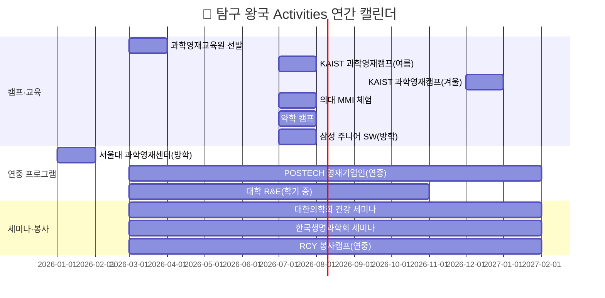
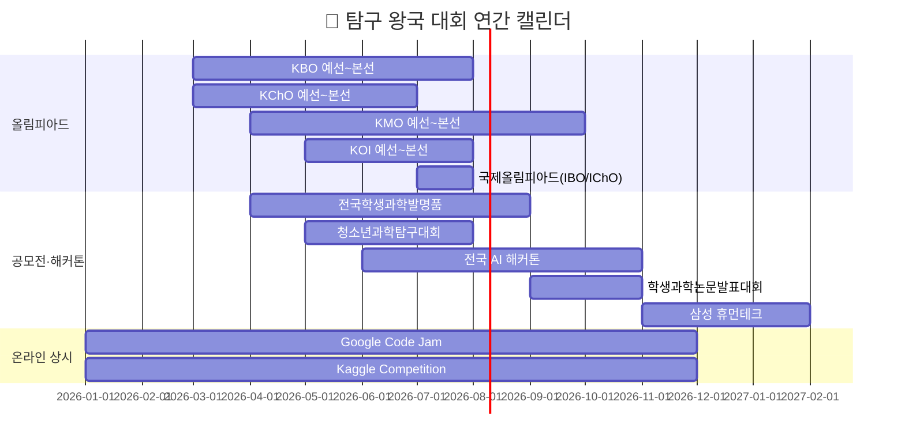
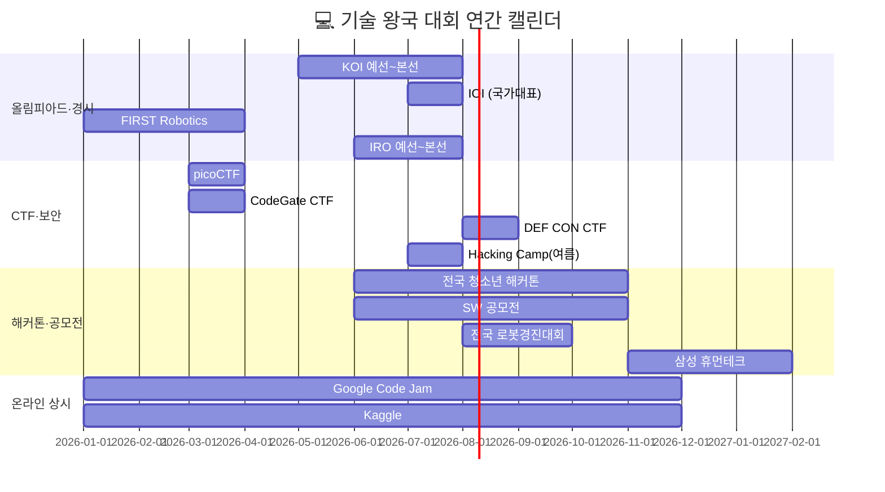
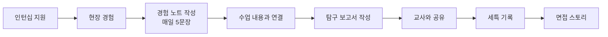

# 8개 왕국별 Activities · Awards · 자격증 종합 가이드 (상)
> **🔬 탐구 왕국 · 🎨 창작 왕국 · 💻 기술 왕국**
> 초·중·고별 / 난이도별 / 월별 / 지역별(국내·해외) / 제한별 / 과목별 / 온라인 — 다차원 정리

---

## 공통 URL·기사 레퍼런스 표 (자동완성 연동용)

### 🔬 탐구 왕국

| 분류 | 기관/프로그램 | 공식 URL | 관련 기사/리포트 | 활용 메모 |
|---|---|---|---|---|
| 캠프 | 국립과천과학관 | https://www.sciencecenter.go.kr | https://search.naver.com/search.naver?where=news&query=%EA%B5%AD%EB%A6%BD%EA%B3%BC%EC%B2%9C%EA%B3%BC%ED%95%99%EA%B4%80+%EC%B2%AD%EC%86%8C%EB%85%84+%EC%BA%A0%ED%94%84 | 과학 체험 활동 레퍼런스 |
| 영재교육 | 한국과학창의재단(KOFAC) | https://www.kofac.re.kr | https://www.kofac.re.kr/webzine | 영재교육/과학행사 공지 확인 |
| 연구체험 | KAIST 영재교육 | https://gifted.kaist.ac.kr | https://news.kaist.ac.kr | 과학영재캠프/멘토링 근거 |
| 연구체험 | POSTECH 영재기업인교육원 | https://gifted.postech.ac.kr | https://www.postech.ac.kr/kor/notice/ | 창업형 R&E 연결 |
| 세미나 | 대한의학회 | https://www.kams.or.kr | https://search.naver.com/search.naver?where=news&query=%EB%8C%80%ED%95%9C%EC%9D%98%ED%95%99%ED%9A%8C+%EC%B2%AD%EC%86%8C%EB%85%84 | 의학 진로 세미나 기사 |
| 대회 | 한국생물올림피아드(KBO) | https://kboinfo.or.kr | https://search.naver.com/search.naver?where=news&query=%ED%95%9C%EA%B5%AD%EC%83%9D%EB%AC%BC%EC%98%AC%EB%A6%BC%ED%94%BC%EC%95%84%EB%93%9C | 올림피아드 준비 레퍼런스 |
| 대회 | 한국화학올림피아드(KChO) | https://new.kcsnet.or.kr | https://search.naver.com/search.naver?where=news&query=%ED%95%9C%EA%B5%AD%ED%99%94%ED%95%99%EC%98%AC%EB%A6%BC%ED%94%BC%EC%95%84%EB%93%9C | 화학 탐구 활동 연결 |
| 국제대회 | Intel ISEF | https://www.societyforscience.org/isef/ | https://search.naver.com/search.naver?where=news&query=Intel+ISEF+%ED%95%9C%EA%B5%AD | 국제 연구대회 증빙 |
| 데이터학습 | Kaggle | https://www.kaggle.com | https://search.naver.com/search.naver?where=news&query=Kaggle+competition+student | 데이터 프로젝트 근거 |

### 🎨 창작 왕국

| 분류 | 기관/프로그램 | 공식 URL | 관련 기사/리포트 | 활용 메모 |
|---|---|---|---|---|
| 창작교육 | 서울시립미술관 | https://sema.seoul.go.kr | https://search.naver.com/search.naver?where=news&query=%EC%84%9C%EC%9A%B8%EC%8B%9C%EB%A6%BD%EB%AF%B8%EC%88%A0%EA%B4%80+%EC%B2%AD%EC%86%8C%EB%85%84 | 미술 워크숍 증빙 |
| 디자인 | 한국디자인진흥원(KIDP) | https://www.kidp.or.kr | https://search.naver.com/search.naver?where=news&query=%ED%95%9C%EA%B5%AD%EB%94%94%EC%9E%90%EC%9D%B8%EC%A7%84%ED%9D%A5%EC%9B%90+%EC%B2%AD%EC%86%8C%EB%85%84 | 디자인 캠프/공모전 연계 |
| 웹툰 | 네이버웹툰 | https://comic.naver.com | https://search.naver.com/search.naver?where=news&query=%EB%84%A4%EC%9D%B4%EB%B2%84%EC%9B%B9%ED%88%B0+%EB%8F%84%EC%A0%84%EB%A7%8C%ED%99%94 | 웹툰 포트폴리오 근거 |
| 영상 | 부산국제영화제(BIFF) | https://www.biff.kr | https://search.naver.com/search.naver?where=news&query=BIFF+%EC%B2%AD%EC%86%8C%EB%85%84+%ED%94%84%EB%A1%9C%EA%B7%B8%EB%9E%A8 | 영화 진로 활동 기사 |
| 방송 | KBS | https://www.kbs.co.kr | https://search.naver.com/search.naver?where=news&query=KBS+%EB%AF%B8%EB%94%94%EC%96%B4+%EC%B2%B4%ED%97%98%EA%B4%80 | 방송 체험 증빙 |
| 국제디자인 | Red Dot | https://www.red-dot.org | https://search.naver.com/search.naver?where=news&query=Red+Dot+Design+Award+student | 국제 디자인 대회 연계 |
| 국제디자인 | Adobe Design Awards | https://adobeawards.com | https://blog.adobe.com | 작품 제출 전략 자료 |

### 💻 기술 왕국

| 분류 | 기관/프로그램 | 공식 URL | 관련 기사/리포트 | 활용 메모 |
|---|---|---|---|---|
| 교육 | 이솦(EBS SW) | https://www.ebssw.kr | https://search.naver.com/search.naver?where=news&query=EBS+SW+%EA%B5%90%EC%9C%A1 | 중학생 시작용 학습 링크 |
| 교육 | SW중심대학 사업 | https://www.software.kr | https://search.naver.com/search.naver?where=news&query=SW%EC%A4%91%EC%8B%AC%EB%8C%80%ED%95%99+%EC%82%AC%EC%97%85 | 대학 연계 활동 근거 |
| 대회 | KOI (한국정보올림피아드) | https://koi.or.kr | https://search.naver.com/search.naver?where=news&query=KOI+%ED%95%9C%EA%B5%AD%EC%A0%95%EB%B3%B4%EC%98%AC%EB%A6%BC%ED%94%BC%EC%95%84%EB%93%9C | 알고리즘 준비 증빙 |
| 대회 | CTFtime | https://ctftime.org | https://search.naver.com/search.naver?where=news&query=CTF+%EC%B2%AD%EC%86%8C%EB%85%84 | 보안 대회 일정 확인 |
| 오픈소스 | GitHub | https://github.com | https://github.blog | 오픈소스 활동 기록 근거 |
| 국제대회 | IOI | https://ioinformatics.org | https://search.naver.com/search.naver?where=news&query=IOI+%EA%B5%AD%EC%A0%9C%EC%A0%95%EB%B3%B4%EC%98%AC%EB%A6%BC%ED%94%BC%EC%95%84%EB%93%9C | 국제 알고리즘 경로 |
| 국제대회 | Google Code Jam | https://codingcompetitions.withgoogle.com | https://search.naver.com/search.naver?where=news&query=Google+Code+Jam+student | 코딩대회 레퍼런스 |
| 실전데이터 | Kaggle | https://www.kaggle.com | https://www.kaggle.com/blog | 프로젝트/리포트 자동완성 소스 |

### 🧩 대회·자격증 URL/기사 매핑 (상편 공통)

| 항목유형 | 항목명 | 공식 URL | 관련 기사/리포트 | 자동완성 키워드 |
|---|---|---|---|---|
| Awards | 한국생물올림피아드(KBO) | https://kboinfo.or.kr | https://search.naver.com/search.naver?where=news&query=KBO+%EC%83%9D%EB%AC%BC%EC%98%AC%EB%A6%BC%ED%94%BC%EC%95%84%EB%93%9C | `생물올림피아드`, `탐구심화` |
| Awards | 한국정보올림피아드(KOI) | https://koi.or.kr | https://search.naver.com/search.naver?where=news&query=KOI+%EC%A4%80%EB%B9%84 | `알고리즘`, `코딩대회` |
| Awards | Intel ISEF | https://www.societyforscience.org/isef/ | https://search.naver.com/search.naver?where=news&query=Intel+ISEF | `국제과학대회`, `연구포스터` |
| Awards | Red Dot Award | https://www.red-dot.org | https://search.naver.com/search.naver?where=news&query=Red+Dot+student | `디자인공모전`, `포트폴리오` |
| Certification | GTQ | https://license.kpc.or.kr | https://search.naver.com/search.naver?where=news&query=GTQ+%EC%9E%90%EA%B2%A9%EC%A6%9D | `그래픽툴`, `디자인역량` |
| Certification | 정보처리기능사 | https://www.q-net.or.kr | https://search.naver.com/search.naver?where=news&query=%EC%A0%95%EB%B3%B4%EC%B2%98%EB%A6%AC%EA%B8%B0%EB%8A%A5%EC%82%AC | `코딩기초`, `자격증` |
| Certification | TOEFL | https://www.ets.org/toefl | https://search.naver.com/search.naver?where=news&query=TOEFL+student | `영어논문`, `국제대회` |
| Certification | 컴퓨터활용능력 | https://license.korcham.net | https://search.naver.com/search.naver?where=news&query=%EC%BB%B4%ED%99%9C+%EC%9E%90%EA%B2%A9%EC%A6%9D | `문서역량`, `데이터정리` |

---

# 🔬 탐구 왕국 — Activities · Awards · 자격증

> **소속 직업**: 의사(01) · AI연구원(02) · 약사(17) · 생명공학연구원(18)

---

## 🔬-1. Activities (봉사 · 캠프 · 세미나 · 교육 프로그램)

### 초·중·고별 + 난이도별 Activities

| # | 프로그램명 | 대상 | 난이도 | 유형 | 주관 | 온/오프 | 비용 | URL |
|---|---------|------|-------|------|------|--------|------|-----|
| 1 | 국립과천과학관 실험 캠프 | 초·중·고 | ★☆☆☆☆ | 캠프 | 과기정통부 | 오프라인 | 3~5만원 | [과천과학관](https://www.sciencecenter.go.kr) |
| 2 | 과학영재교육원 (대학 부설) | 초5~고1 | ★★★☆☆ | 교육과정 | 한국과학창의재단 | 오프라인 | 무료~10만원 | [KOFAC 영재교육](https://www.kofac.re.kr) |
| 3 | SW영재교육원 | 초5~중3 | ★★★☆☆ | 교육과정 | 과기정통부 | 오프라인 | 무료 | [SW영재교육원](https://www.swcenter.kr) |
| 4 | KAIST 과학영재캠프 | 중1~고1 | ★★★☆☆ | 캠프 | KAIST | 오프라인 | 무료~10만원 | [KAIST 영재캠프](https://gifted.kaist.ac.kr) |
| 5 | 서울대 과학영재센터 | 중·고 | ★★★★☆ | 심화교육 | 서울대 | 오프라인 | 10만원 내외 | [서울대 영재센터](https://gifted.snu.ac.kr) |
| 6 | POSTECH 영재기업인교육원 | 중·고 | ★★★★☆ | 연중교육 | 포스텍 | 오프라인 | 무료 | [POSTECH 영재기업인](https://gifted.postech.ac.kr) |
| 7 | 의대 MMI 체험 프로그램 | 고2 | ★★★★☆ | 체험 | 주요 의대 | 오프라인 | 5만원 | 각 의대 입학처 홈페이지 |
| 8 | 약학 캠프 / 약학 체험 | 고1~2 | ★★★☆☆ | 체험 | 주요 약대 | 오프라인 | 3~5만원 | 각 약대 입학처 홈페이지 |
| 9 | 대학 연계 R&E (고교-대학 연구) | 고1~2 | ★★★★★ | 연구 | 각 대학·과학고 | 오프라인 | 무료 | 각 대학 연구처 홈페이지 |
| 10 | 고려대 R&E 멘토링 | 고1~2 | ★★★★★ | 멘토링 | 고려대 | 오프라인 | 무료 | [고려대 R&E](https://oia.korea.ac.kr) |
| 11 | 삼성 주니어 SW 아카데미 | 중·고 | ★★★☆☆ | 교육 | 삼성전자 | 오프라인 | 무료 | [삼성 주니어SW](https://www.juniorsw.com) |
| 12 | 대한의학회 청소년 건강 세미나 | 고 | ★★★☆☆ | 세미나 | 대한의학회 | 오프/온 | 무료 | [대한의학회](https://www.kams.or.kr) |
| 13 | 한국생명과학회 학생 세미나 | 고 | ★★★★☆ | 세미나 | 한국생명과학회 | 오프라인 | 무료~3만원 | [한국생명과학회](https://www.ksmb.or.kr) |
| 14 | 대한적십자사 RCY 캠프 | 중·고 | ★★☆☆☆ | 캠프·봉사 | 대한적십자사 | 오프라인 | 무료~5만원 | [대한적십자사](https://www.redcross.or.kr) |
| 15 | 한국직업능력연구원 진로캠프 | 중·고 | ★★☆☆☆ | 진로 | 고용노동부 | 오프라인 | 무료 | [커리어넷](https://www.career.go.kr) |

### 월별(시기별) Activities 캘린더

### 지역별(국내·해외) Activities

| 구분 | 프로그램명 | 지역 | 언어 | 비고 |
|------|---------|------|------|------|
| **국내 수도권** | 서울대 과학영재센터 | 서울 | 한국어 | 서울대 캠퍼스 |
| **국내 수도권** | 국립과천과학관 캠프 | 경기 과천 | 한국어 | 초·중·고 전 연령 |
| **국내 대전** | KAIST 과학영재캠프 | 대전 | 한국어 | 숙박 포함 |
| **국내 포항** | POSTECH 영재기업인 | 포항 | 한국어 | 연중 교육 |
| **국내 전국** | 과학영재교육원 (각 대학 부설) | 전국 16개 대학 | 한국어 | 거주지 기반 선발 |
| **국내 전국** | 대학 연계 R&E | 전국 주요 대학 | 한국어 | 지도교수 매칭 |
| **해외 온라인** | K-MOOC "인공지능 입문" | 온라인 | 한국어 | 무료 수료증 |
| **해외 온라인** | Coursera "Machine Learning" | 온라인 | 영어 | 스탠퍼드 Andrew Ng |
| **해외 온라인** | edX "CS50" (하버드) | 온라인 | 영어 | MIT·하버드 공개강좌 |
| **해외 온라인** | K-MOOC "생명과학 실험" | 온라인 | 한국어 | 실험 설계 이론 |

### 온라인 교육 플랫폼 (무료·저비용)

| 플랫폼 | 추천 강좌 | 비용 | 수료증 | 난이도 | 적합 직업 |
|-------|---------|------|-------|-------|---------|
| **K-MOOC** | 인공지능 입문, 생명과학 실험 | 무료 | ⭕ | ★★★☆☆ | AI연구원·생명공학 |
| **Coursera** | ML Specialization (Andrew Ng) | 무료 청강 | ⭕(유료) | ★★★★☆ | AI연구원 |
| **edX** | CS50 (하버드), 생명과학 개론 | 무료 청강 | ⭕(유료) | ★★★☆☆ | 4직업 공통 |
| **KOCW** | 전국 대학 공개강의 | 무료 | ❌ | ★★★☆☆ | 세특 심화용 |
| **이솦(EBS SW)** | Python, AI, 정보 교과 | 무료 | ⭕ | ★★☆☆☆ | AI연구원 |
| **SW중심대학 강좌** | AI·코딩·데이터 | 무료 | ⭕ | ★★★☆☆ | 4직업 공통 |

### 과목별 Activities 연결표

| 과목 | 추천 활동 | 세특 연결 키워드 | 적합 직업 |
|------|---------|-------------|---------|
| **생명과학Ⅱ** | KBO 준비, R&E, 대학 실험 | 유전학·세포생물학·면역 | 의사·약사·생명공학·수의사 |
| **화학Ⅱ** | KChO 준비, 약물 분석 프로젝트 | 유기화학·약물 합성·반응 | 약사·생명공학 |
| **수학(미적분)** | KMO 준비, AI 수학 탐구 | 경사하강법·확률·선형대수 | AI연구원 |
| **정보** | KOI 준비, AI 프로젝트 | Transformer·알고리즘 | AI연구원 |
| **보건** | 건강 데이터 분석, 공중보건 탐구 | 건강불평등·역학·예방의학 | 의사·약사 |

### 봉사활동 추천 (학교 교육과정 내)

| 봉사 유형 | 대상 | 시기 | 시간 | 적합 직업 | 세특 연결 |
|---------|------|------|------|---------|---------|
| 또래 과학 멘토링 | 초·중·고 | 학기 중 | 주 1~2시간 | 4직업 공통 | 교과 심화 + 소통 역량 |
| 보건실 봉사 | 중·고 | 학기 중 | 주 1시간 | 의사·약사 | 건강 관리 현장 이해 |
| 과학 실험 보조 | 중·고 | 학기 중 | 월 2회 | 생명공학·약사 | 실험 설계 역량 |
| 교내 건강 캠페인 | 중·고 | 학기 중 | 월 2~4시간 | 의사·약사 | 공중보건 프로젝트 |
| AI 코딩 교육 봉사 | 중·고 | 방학 | 누적 20시간+ | AI연구원 | 기술 나눔 + 리더십 |

### 제한별(참가 조건) Activities 분류

| 제한 유형 | 프로그램 | 선발 기준 | 경쟁률 |
|---------|---------|---------|-------|
| **선발형** (시험) | 과학영재교육원 | 교사 추천 + 캠프 선발 | 약 5:1 |
| **선발형** (시험) | SW영재교육원 | 코딩 테스트 + 면접 | 약 8:1 |
| **추천형** | 대학 연계 R&E | 지도교사 추천 + 자기소개서 | 약 3:1 |
| **선착순** | KAIST 캠프 | 온라인 접수 | 선착순 마감 |
| **무제한** | K-MOOC / Coursera | 누구나 수강 | 제한 없음 |
| **무제한** | 이솦(EBS SW) | 누구나 수강 | 제한 없음 |

### (추가) 국내·해외·온라인 Activities 확장 리스트 (초·중·고/난이도/월/지역/제한/과목)

| # | 활동/프로그램 | 대상 | 난이도 | 월(모집/진행) | 지역(국내/해외) | 제한 | 과목/분야 | 온/오프 | 산출물(기록 포인트) |
|---|---|---|---|---|---|---|---|---|---|
| 1 | 대학·연구소 **오픈랩/공개실험실 투어**(의생명·약학·AI) | 중·고 | ★★☆☆☆ | 3~11월 | 국내 | 선착/학교연계 | 생명·화학·정보 | 오프 | 방문 보고서 + 질문리스트 |
| 2 | **학회 학생세션 청강**(의학/생명/화학/AI) + 요약발표 | 고 | ★★★☆☆ | 연중(학회 시즌) | 국내/해외 | 유료(학생할인) | 전 과목 | 오프/온 | 논문 3편 리뷰 + 용어사전 |
| 3 | **의료데이터/공공데이터 분석 미니프로젝트**(질병·환경) | 중·고 | ★★★☆☆ | 연중 | 국내/해외 | 무제한 | 수학·정보·보건 | 온라인 | 분석 노트북/리포트(가설-결론) |
| 4 | **실험 설계 챌린지**(가설→변인통제→재현) | 초·중·고 | ★★☆☆☆ | 3~12월 | 국내 | 무제한 | 과학 전반 | 온/오프 | 실험계획서(통제변인 표 포함) |
| 5 | 해외 **Pre-College 온라인 트랙**(Bio/Neuro/AI) | 고 | ★★★★☆ | 6~8월 | 해외 | 선발/유료 | 생명·화학·정보 | 온라인 | 최종 프로젝트 포스터(영문) |
| 6 | **국제 청소년 연구 포스터 세션**(온라인 학술제 형태) | 중·고 | ★★★★☆ | 7~11월 | 해외 | 서류/발표 | 과학 전반 | 온라인 | 포스터+3분 피치 영상 |
| 7 | **메디컬/바이오 윤리 토론 라운드**(AI·유전자·임상) | 중·고 | ★★★☆☆ | 3~12월 | 국내/해외 | 팀 구성 | 보건·윤리·국어 | 오프/온 | 찬반 논증표 + 토론 기록 |
| 8 | **Bioinformatics 입문**(서열분석/단백질예측) 실습 | 고 | ★★★★☆ | 연중 | 해외 | 무제한 | 생명·정보·수학 | 온라인 | 실습 로그 + 결과 해석 |
| 9 | 학교 **탐구동아리 R&D 스프린트**(4주 단위) | 중·고 | ★★★☆☆ | 학기 중 | 국내 | 동아리 | 과학 전반 | 오프 | 주차별 실험노트/회고 |
| 10 | **멘토링 봉사 업그레이드**("가르치기"가 아닌 "실험 설계 코칭") | 고 | ★★★☆☆ | 연중 | 국내 | 학교연계 | 과학·수학 | 오프 | 멘티 결과물(계획서) + 피드백 루브릭 |
| 11 | **초등 과학탐구 캠프**(자연사·생명·화학 입문) | 초4~6 | ★☆☆☆☆ | 7~8월 | 국내 | 선착/무료 | 과학 | 오프 | 관찰일지 + 스케치(5종 이상) |
| 12 | **청소년 신약개발 아카데미**(KAIST·서울대 연계) | 고1~2 | ★★★★☆ | 6~8월 | 국내 | 선발 | 화학·생명 | 오프 | 표적-기전-한계 분석 리포트 |
| 13 | **Brilliant.org 수학·과학 과정**(게임형 학습) | 초·중·고 | ★★★☆☆ | 연중 | 해외 | 무제한(유료 선택) | 수학·물리·CS | 온라인 | 주차별 학습 스크린샷 + 연결 개념 노트 |
| 14 | **국제 뇌과학 온라인 강좌**(Society for Neuroscience 계열) | 중·고 | ★★★★☆ | 연중 | 해외 | 무제한 | 생명·심리 | 온라인 | 학습 노트 + 자기 질문 발전 기록 |
| 15 | **iNaturalist 시민과학 생태조사 봉사**(학교·지역 연계) | 초·중·고 | ★★☆☆☆ | 4~11월 | 국내/해외 | 무제한 | 생명·지구 | 오프/온 | 관찰 100건+ 로그 + 종 분류 근거 |
| 16 | **Khan Academy MCAT/AP Biology 자율학습** | 중·고 | ★★★☆☆ | 연중 | 해외 | 무료 | 생명·화학 | 온라인 | 단원별 퀴즈 결과 + 오답 정리 노트 |
| 17 | **지역 보건소·건강증진센터 봉사**(홍보물 제작·배부) | 중·고 | ★★☆☆☆ | 연중 | 국내 | 기관 승인 | 보건·국어 | 오프 | 활동일지 + 캠페인 전후 참여자 비교 |
| 18 | **초등생 대상 과학실험 교육 봉사**(복지관·방과후) | 중·고 | ★★★☆☆ | 학기 중 | 국내 | 학교연계 | 과학·교육 | 오프 | 실험 키트 설계서 + 학생 반응 기록 |
| 19 | **해외 의생명 Pre-College**(Johns Hopkins CTY·Stanford OHS) | 고1~2 | ★★★★★ | 6~8월 | 해외 | 선발/유료 | 생명·화학·의학 | 온/오프 | 최종 리서치 페이퍼(영문) |
| 20 | **바이오·의료 스타트업 현장 인터뷰 리서치** | 고 | ★★★★☆ | 연중 | 국내 | 개인 섭외 | 생명·경영 | 오프/온 | 인터뷰 Q&A + 산업동향 정리 |

### 초등 특화 Activities (탐구 왕국)

| # | 프로그램명 | 대상 | 난이도 | 월 | 지역 | 비용 | 목적 |
|---|---------|------|-------|---|------|------|------|
| 1 | 국립과천과학관 **어린이 과학실험 교실** | 초3~6 | ★☆☆☆☆ | 연중 | 경기 과천 | 무료~1만원 | 탐구 흥미 발화 |
| 2 | 국립중앙과학관 **사이언스데이** | 초 전체 | ★☆☆☆☆ | 4·10월 | 대전 | 무료 | 과학 체험 |
| 3 | **서울대 어린이병원 의학 체험** | 초5~6 | ★★☆☆☆ | 7~8월 | 서울 | 무료 | 의학 진로 탐색 |
| 4 | 한국항공우주연구원 **우주 캠프** | 초4~6 | ★★☆☆☆ | 방학 | 대전 | 3만원 | 이공계 흥미 확장 |
| 5 | **SciShow/Crash Course Biology 영상 탐구** | 초3~6 | ★★☆☆☆ | 연중 | 해외 온라인 | 무료 | 과학 개념 + 영어 노출 |
| 6 | 지역 **자연사박물관 도슨트 투어** + 탐구 기록 | 초 전체 | ★☆☆☆☆ | 연중 | 국내 전국 | 입장료 | 관찰 기록 습관 형성 |

---

## 🔬-2. Awards (대회 · 공모전)

### URL·기사 확장표 (🔬 Awards)

| 대회명 | 공식 URL | 관련 기사/리포트 | 자동완성 키 |
|---|---|---|---|
| 한국생물올림피아드(KBO) | https://kboinfo.or.kr | https://search.naver.com/search.naver?where=news&query=KBO+%EC%83%9D%EB%AC%BC%EC%98%AC%EB%A6%BC%ED%94%BC%EC%95%84%EB%93%9C | `생물올림피아드`, `심화탐구` |
| 한국화학올림피아드(KChO) | https://new.kcsnet.or.kr | https://search.naver.com/search.naver?where=news&query=KChO+%ED%99%94%ED%95%99%EC%98%AC%EB%A6%BC%ED%94%BC%EC%95%84%EB%93%9C | `화학심화`, `문제풀이` |
| 한국정보올림피아드(KOI) | https://koi.or.kr | https://search.naver.com/search.naver?where=news&query=KOI+%ED%95%9C%EA%B5%AD%EC%A0%95%EB%B3%B4%EC%98%AC%EB%A6%BC%ED%94%BC%EC%95%84%EB%93%9C | `알고리즘`, `코딩대회` |
| Intel ISEF | https://www.societyforscience.org/isef/ | https://search.naver.com/search.naver?where=news&query=Intel+ISEF+student | `국제과학대회`, `포스터발표` |
| 삼성 휴먼테크 논문대상 | https://www.samsunghumantech.com | https://search.naver.com/search.naver?where=news&query=%EC%82%BC%EC%84%B1+%ED%9C%B4%EB%A8%BC%ED%85%8C%ED%81%AC+%EB%85%BC%EB%AC%B8%EB%8C%80%EC%83%81 | `논문대회`, `연구성과` |

### 교내 수상 전략 (학생부 기재 가능 — 학기당 1개)

| 학기 | 추천 교내 대회 | 난이도 | 세특 연결 | 적합 직업 |
|------|------------|-------|---------|---------|
| 고1 1학기 | 과학탐구대회 | ★★★☆☆ | 생명과학·화학 탐구 과정 | 의사·약사·생명공학 |
| 고1 2학기 | 독서토론대회 | ★★☆☆☆ | 과학·의학 도서 토론 | 4직업 공통 |
| 고2 1학기 | 융합과학탐구대회 | ★★★★☆ | 교과 융합 연구 발표 | 4직업 공통 |
| 고2 2학기 | 학술제(연구 발표) | ★★★★☆ | R&E·소논문 발표 | 4직업 공통 |

### 교외 대회 — 국내 (학생부 미기재, 세특 소재화)

| # | 대회명 | 주관 | 대상 | 시기 | 난이도 | 온/오프 | 비용 | 적합 직업 | 공식 URL | 관련 기사/리포트 |
|---|-------|------|------|------|-------|--------|------|---------|---------|-------------------|
| 1 | **한국생물올림피아드(KBO)** | 한국생물과학협회 | 중·고 | 3~8월 | ★★★★★ | 오프라인 | 무료 | 의사·생명공학·수의사 |
| 2 | **한국화학올림피아드(KChO)** | 대한화학회 | 중·고 | 3~7월 | ★★★★★ | 오프라인 | 무료 | 약사·생명공학 |
| 3 | **한국수학올림피아드(KMO)** | 대한수학회 | 중·고 | 4~10월 | ★★★★★ | 오프라인 | 무료 | AI연구원·의사 |
| 4 | **한국정보올림피아드(KOI)** | 한국정보과학회 | 중·고 | 5~8월 | ★★★★★ | 오프라인 | 무료 | AI연구원 |
| 5 | **청소년과학탐구대회** | 한국과학교육단체총연합회 | 중·고 | 5~8월 | ★★★☆☆ | 오프라인 | 무료 | 4직업 공통 |
| 6 | **한국학생과학연구논문발표대회** | 한국과학교육단체총연합회 | 고 | 9~11월 | ★★★★☆ | 오프라인 | 무료 | 4직업 공통 |
| 7 | **전국학생과학발명품경진대회** | 한국과학창의재단 | 초·중·고 | 4~9월 | ★★★☆☆ | 오프라인 | 무료 | 생명공학·AI |
| 8 | **삼성 휴먼테크 논문대상** | 삼성전자 | 고·대 | 11~2월 | ★★★★★ | 온라인 제출 | 무료 | AI연구원·생명공학 |
| 9 | **전국 AI 해커톤** | 과기정통부·네이버 등 | 고 | 연중 | ★★★★☆ | 오프/온 | 무료 | AI연구원 |
| 10 | **대한민국 학생발명전시회** | 특허청 | 중·고 | 4~9월 | ★★★☆☆ | 오프라인 | 무료 | 4직업 공통 |
| 11 | **바이오 해커톤** | 각 대학·바이오기업 | 고 | 연중 | ★★★★☆ | 오프라인 | 무료 | 생명공학 |

### 교외 대회 — 해외 / 국제

| # | 대회명 | 주관 | 대상 | 시기 | 난이도 | 온/오프 | 언어 | 적합 직업 | 공식 URL | 관련 기사/리포트 |
|---|-------|------|------|------|-------|--------|------|---------|---------|-------------------|
| 1 | **국제생물올림피아드(IBO)** | 국제학술단체 | 고(국가대표) | 7월 | ★★★★★ | 오프라인(해외) | 영어 | 의사·생명공학 |
| 2 | **국제화학올림피아드(IChO)** | 국제학술단체 | 고(국가대표) | 7월 | ★★★★★ | 오프라인(해외) | 영어 | 약사·생명공학 |
| 3 | **국제물리올림피아드(IPhO)** | 국제학술단체 | 고(국가대표) | 7월 | ★★★★★ | 오프라인(해외) | 영어 | AI연구원(수학·물리) |
| 4 | **국제정보올림피아드(IOI)** | 국제학술단체 | 고(국가대표) | 7~8월 | ★★★★★ | 오프라인(해외) | 영어 | AI연구원 |
| 5 | **Google Code Jam** | Google | 전 연령 | 연중 | ★★★★☆ | 온라인 | 영어 | AI연구원 |
| 6 | **Google Kick Start** | Google | 전 연령 | 연중 | ★★★☆☆ | 온라인 | 영어 | AI연구원 |
| 7 | **Kaggle Competition** | Google(Kaggle) | 전 연령 | 상시 | ★★★~★★★★★ | 온라인 | 영어 | AI연구원 |
| 8 | **Intel ISEF (국제과학기술경진대회)** | Intel·SSP | 고(국가대표) | 5월 | ★★★★★ | 오프라인(미국) | 영어 | 4직업 공통 |

### 대회 월별 캘린더

### 과목별 추천 대회 매칭

| 과목 | 국내 대회 | 해외 대회 | 난이도 범위 |
|------|---------|---------|---------|
| 생명과학 | KBO, 청소년과학탐구, 바이오해커톤 | IBO, Intel ISEF | ★★★~★★★★★ |
| 화학 | KChO, 청소년과학탐구 | IChO | ★★★~★★★★★ |
| 수학 | KMO | IMO | ★★★★~★★★★★ |
| 정보(코딩) | KOI, AI 해커톤 | IOI, Google Code Jam, Kaggle | ★★★~★★★★★ |
| 융합(과학전반) | 발명품경진대회, 논문발표대회 | Intel ISEF | ★★★☆☆~★★★★★ |

### (추가) Awards 확장 리스트 (국내·해외/온라인/제한/과목)

| # | 대회/공모전 | 국내/해외 | 대상 | 시기 | 난이도 | 제한 | 과목/분야 | 온/오프 | “기록”으로 남길 핵심 |
|---|---|---|---|---|---|---|---|---|---|
| 1 | **뇌과학(Neuroscience) 경시/탐구 대회**(예: Brain Bee 계열) | 국내→해외 | 중·고 | 3~7월 | ★★★★☆ | 선발형 | 생명·보건 | 오프 | 실험/문헌 기반 “질문 10개” |
| 2 | **의학/바이오 데이터 스토리텔링 공모**(질병·공중보건) | 국내 | 중·고 | 5~10월 | ★★★☆☆ | 팀/개인 | 수학·정보·보건 | 온라인 | 데이터 전처리 근거 + 한계 |
| 3 | **청소년 논문·리서치 포스터 대회**(학교/지역/대학 주관) | 국내 | 고 | 8~11월 | ★★★★☆ | 서류/발표 | 과학 전반 | 오프/온 | 연구윤리(인용) 체크리스트 |
| 4 | **AI×헬스케어 아이디어톤/해커톤** | 국내 | 고 | 연중 | ★★★★☆ | 팀 | 정보·보건 | 오프/온 | 사용자(환자) 페르소나 + KPI |
| 5 | **국제 청소년 과학 포스터 경진**(온라인 제출형) | 해외 | 중·고 | 연중 | ★★★★☆ | 영어 | 과학 전반 | 온라인 | 1페이지 포스터 + 3분 발표 |
| 6 | **기후·보건(Heat/미세먼지) 연구 공모전** | 국내/해외 | 중·고 | 4~9월 | ★★★☆☆ | 팀/개인 | 지구·보건 | 온라인 | 지역 데이터와의 연결성 |
| 7 | **오픈 데이터 챌린지**(공공·의료·환경) | 국내/해외 | 중·고 | 연중 | ★★★☆☆ | 무제한 | 수학·정보 | 온라인 | “재현 가능” 코드/노트 |
| 8 | **과학 글쓰기/에세이(의생명 윤리 포함)** | 국내/해외 | 중·고 | 연중 | ★★~★★★★ | 영어 선택 | 국어·윤리·과학 | 온라인 | 반대 근거까지 포함한 균형 |
| 9 | **학생발명/특허 아이디어 고도화**(출원까지는 선택) | 국내 | 중·고 | 4~10월 | ★★★★☆ | 서류 | 융합 | 오프/온 | 문제정의(페인포인트) 명확화 |
| 10 | **국제 과학기술경진(ISEF 계열) 로컬/국가 페어** | 해외 | 고 | 1~5월 | ★★★★★ | 선발형 | 과학 전반 | 오프 | 실험노트 + 통계 검정 근거 |
| 11 | **아시아-태평양수학올림피아드(APMO)** | 국내→해외 | 고(대표) | 3월 | ★★★★★ | 선발형 | 수학 | 온/오프 | 풀이 과정의 논리 구조 완성도 |
| 12 | **주니어 한국생물올림피아드(JKBO)** | 중학생 | 3~6월 | ★★★★☆ | 선발 | 생명 | 오프 | 오답 분석 + 재학습 증거 |
| 13 | **한국초등수학경시대회(KMC)** | 초4~6 | 연중 | ★★★☆☆ | 무제한 | 수학 | 오프 | 오답 노트 + 유형별 분류 |
| 14 | **Regeneron Science Talent Search**(미국 최대 이공계 고교생 대회) | 해외 | 고 | 9~3월 | ★★★★★ | 영어/서류 | 과학 전반 | 온라인 제출 | 연구보고서(독창성·사회적 의의) |
| 15 | **한국청소년과학기술진흥회 소논문 발표 대회** | 국내 | 고 | 9~12월 | ★★★★☆ | 서류 | 과학 전반 | 오프/온 | 연구노트(날짜 기록) + 수정 이력 |
| 16 | **Google Science Fair**(구글 과학경진) | 해외 | 중·고 | 연중 | ★★★★★ | 무제한/영어 | 과학 전반 | 온라인 | 연구 요약 + 영어 영상 1분 |
| 17 | **의료 AI 해커톤**(서울대병원·세브란스 등) | 국내 | 고 | 연중 | ★★★★☆ | 팀 | 정보·보건 | 오프/온 | 모델 카드 + 임상적 해석 |
| 18 | **IPhO 준비 과정**(한국물리올림피아드 예선) | 국내 | 중·고 | 3~8월 | ★★★★★ | 선발 | 물리·수학 | 오프 | 개념 연결 지도 + 풀이 로그 |

---

## 🔬-3. 자격증 (Certification)

### URL·기사 확장표 (🔬 자격증)

| 자격증명 | 공식 URL | 관련 기사/리포트 | 자동완성 키 |
|---|---|---|---|
| DIAT | https://www.ihd.or.kr | https://search.naver.com/search.naver?where=news&query=DIAT+%EC%9E%90%EA%B2%A9%EC%A6%9D | `디지털기초`, `문서역량` |
| ITQ | https://license.kpc.or.kr | https://search.naver.com/search.naver?where=news&query=ITQ+%EC%9E%90%EA%B2%A9%EC%A6%9D | `오피스활용`, `기초역량` |
| 정보처리기능사 | https://www.q-net.or.kr | https://search.naver.com/search.naver?where=news&query=%EC%A0%95%EB%B3%B4%EC%B2%98%EB%A6%AC%EA%B8%B0%EB%8A%A5%EC%82%AC | `코딩기초`, `자격증` |
| BLS | https://www.kacpr.org | https://search.naver.com/search.naver?where=news&query=BLS+%EC%9E%90%EA%B2%A9%EC%A6%9D | `응급처치`, `의료기초` |
| TOEFL iBT | https://www.ets.org/toefl | https://search.naver.com/search.naver?where=news&query=TOEFL+iBT+student | `영어논문`, `국제활동` |

### 초·중·고별 + 난이도별 자격증 로드맵

| 취득 시기 | 자격증명 | 주관 | 난이도 | 비용 | 온/오프 | 적합 직업 | 공식 URL | 관련 기사/리포트 |
|---------|--------|------|-------|------|--------|---------|---------|-------------------|
| **중학교** | DIAT (디지털정보활용) | 한국정보통신진흥협회 | ★☆☆☆☆ | 1.8만원 | 오프라인 | 4직업 공통 |
| **중학교** | ITQ (한글·엑셀·PPT) | 한국생산성본부 | ★☆☆☆☆ | 1.8만원 | 오프라인 | 4직업 공통 |
| **중학교** | 워드프로세서 | 대한상공회의소 | ★★☆☆☆ | 1.9만원 | 오프라인 | 4직업 공통 |
| **중3~고1** | 컴퓨터활용능력 2급 | 대한상공회의소 | ★★☆☆☆ | 1.9만원 | 오프라인 | 4직업 공통 |
| **중3~고1** | BLS (기본생명구조술) | 대한심폐소생협회 | ★☆☆☆☆ | 5~8만원 | 오프라인 | 의사·약사 |
| **중3~고1** | 응급처치 자격 | 대한적십자사 | ★☆☆☆☆ | 3만원 | 오프라인 | 의사·약사 |
| **중3~고1** | 정보처리기능사 | 한국산업인력공단 | ★★☆☆☆ | 1.9만원 | 오프라인 | AI연구원 |
| **중3~고1** | COS Pro 2급 (Python) | YBM | ★★☆☆☆ | 3만원 | 오프라인 | AI연구원 |
| **고1~2** | COS Pro 1급 (Python/C) | YBM | ★★★☆☆ | 3만원 | 오프라인 | AI연구원 |
| **고1~2** | 컴퓨터활용능력 1급 | 대한상공회의소 | ★★★☆☆ | 2.2만원 | 오프라인 | 4직업 공통 |
| **고1~2** | TOEFL iBT | ETS | ★★★★☆ | 약 30만원 | 오프라인 | AI연구원 (논문) |
| **고2** | 위험물기능사 | 한국산업인력공단 | ★★★☆☆ | 1.9만원 | 오프라인 | 약사·생명공학 |

### 자격증 — 직업별 추천 조합

| 직업 | 중학교 필수 | 고1 추천 | 고2 추천 | 면접 활용 핵심 |
|------|---------|---------|---------|------------|
| **의사** | DIAT, 워드프로세서 | BLS, 컴활 2급 | TOEFL | "생명구조 실습 → 의료 진로 확신" |
| **AI연구원** | ITQ, COS Pro 2급 | 정보처리기능사, COS Pro 1급 | TOEFL, 컴활 1급 | "코딩 역량의 객관적 수치" |
| **약사** | DIAT, 워드프로세서 | BLS, 컴활 2급 | 위험물기능사, TOEFL | "화학 안전 역량 + 의료 진로" |
| **생명공학연구원** | ITQ, COS Pro 2급 | 정보처리기능사, 응급처치 | 위험물기능사, TOEFL | "실험실 안전 + 데이터 분석" |

### 자격증 과목별 분류

| 과목 계열 | 자격증 | 관련 교과 | 세특 연결 |
|---------|-------|---------|---------|
| **IT·코딩** | 정보처리기능사, COS Pro 1·2급 | 정보, 프로그래밍 | "AI 프로젝트 역량 증빙" |
| **의료·안전** | BLS, 응급처치, 위험물기능사 | 생명과학, 화학, 보건 | "의료 현장·실험실 안전 역량" |
| **어학** | TOEFL, TOEIC | 영어 | "영어 논문 독해력 증빙" |
| **디지털 기초** | DIAT, ITQ, 워드프로세서, 컴활 | 정보, 기술·가정 | "디지털 리터러시 기본" |

## 🔬-4. 역량(Competency) — 섹션별 서술(세특·면접 연결)

| 역량 섹션 | 무엇을 보여주나 | 활동/산출물(추천) | 학생부·면접 연결 문장(예시) |
|---|---|---|---|
| **문제정의·가설** | “왜 이 주제를 했는가”의 논리 | 연구 질문 1개를 **측정 가능**하게 재정의 | “관찰에서 출발해 변수 통제를 통해 가설을 검증했다.” |
| **실험 설계·안전·윤리** | 재현성/안전/윤리 감수성 | 통제변인표, 안전수칙, IRB 개념 정리(수준에 맞게) | “결과보다 과정의 안전·윤리를 우선순위로 두었다.” |
| **데이터 분석** | 근거 기반 사고 | 그래프 3종(분포/상관/추세) + 한계 분석 | “결론의 신뢰구간과 한계를 함께 제시했다.” |
| **문헌 조사(영어 포함)** | 지식의 출처와 확장 | 논문 3편 비교표(연구설계/결과/한계) | “선행연구의 빈틈을 찾아 내 탐구로 연결했다.” |
| **협업·멘토링** | 팀 연구/리더십 | 역할분담표 + 회의록 + 피드백 루프 | “팀의 가설을 합의하고 실험 루틴을 표준화했다.” |
| **커뮤니케이션(발표)** | 과학적 설명력 | 1페이지 포스터 + 3분 피치 + Q&A 로그 | “비전공자도 이해하도록 비유·시각화를 사용했다.” |

---

# 🎨 창작 왕국 — Activities · Awards · 자격증

> **소속 직업**: UX디자이너(03) · 웹툰작가(04) · 건축가(19) · 영화·영상감독(20)

---

## 🎨-1. Activities (봉사 · 캠프 · 세미나 · 교육 프로그램)

### 초·중·고별 + 난이도별 Activities

| # | 프로그램명 | 대상 | 난이도 | 유형 | 주관 | 온/오프 | 비용 | URL |
|---|---------|------|-------|------|------|--------|------|-----|
| 1 | 서울시립미술관 청소년 워크숍 | 중·고 | ★☆☆☆☆ | 워크숍 | 서울시립미술관 | 오프라인 | 무료~3만원 | [서울시립미술관](https://sema.seoul.go.kr) |
| 2 | Adobe Creative Camp | 중·고 | ★★☆☆☆ | 캠프 | Adobe | 오프라인 | 무료 | [Adobe Education](https://www.adobe.com/education.html) |
| 3 | 한국디자인진흥원 청소년 디자인캠프 | 중·고 | ★★★☆☆ | 캠프 | 한국디자인진흥원 | 오프라인 | 무료~5만원 | [KIDP](https://www.kidp.or.kr) |
| 4 | 네이버웹툰 아카데미 | 중·고 | ★★★☆☆ | 교육 | 네이버웹툰 | 오프라인 | 무료 | [네이버웹툰](https://comic.naver.com) |
| 5 | 한국만화영상진흥원 창작 교실 | 중·고 | ★★☆☆☆ | 교육 | 한국만화영상진흥원 | 오프라인 | 무료~3만원 | [한국만화영상진흥원](https://www.komacon.kr) |
| 6 | 서울 건축문화제 학생 워크숍 | 중·고 | ★★★☆☆ | 워크숍 | 서울시·건축사협회 | 오프라인 | 무료 | [서울도시건축비엔날레/행사](https://www.seoulbiennale.org) |
| 7 | 대학 건축학과 오픈 스튜디오 | 고1~2 | ★★★☆☆ | 체험 | 주요 대학 건축학과 | 오프라인 | 무료 | 각 대학 건축학과 홈페이지 |
| 8 | 부산국제영화제(BIFF) 청소년 프로그램 | 중·고 | ★★★☆☆ | 체험 | BIFF | 오프라인 | 5만원 | [BIFF](https://www.biff.kr) |
| 9 | KBS 미디어 체험관 | 중·고 | ★★☆☆☆ | 체험 | KBS | 오프라인 | 3만원 | [KBS](https://www.kbs.co.kr) |
| 10 | K-MOOC "UX 디자인 입문" | 고1~2 | ★★★☆☆ | 온라인강좌 | 교육부 | 온라인 | 무료 | [K-MOOC](https://www.kmooc.kr) |
| 11 | Coursera "Interaction Design" | 고1~2 | ★★★★☆ | 온라인강좌 | UCSD | 온라인 | 무료 청강 | [Coursera](https://www.coursera.org) |

### 월별(시기별) Activities 캘린더

| 월 | 프로그램 | 유형 | 대상 |
|----|---------|------|------|
| 1~2월 | 미술관 겨울 워크숍, Adobe Camp | 캠프 | 중·고 |
| 3~4월 | 만화영상진흥원 창작 교실 개강 | 교육 | 중·고 |
| 5~6월 | 대학 건축학과 오픈 스튜디오 | 체험 | 고1~2 |
| 7~8월 | 네이버웹툰 아카데미(여름), 디자인캠프 | 캠프·교육 | 중·고 |
| 10월 | 서울 건축문화제 워크숍, BIFF 청소년 | 워크숍·체험 | 중·고 |
| **연중** | K-MOOC, Coursera (온라인 상시) | 온라인 | 고1~2 |

### 지역별(국내·해외) Activities

| 구분 | 프로그램명 | 지역 | 비고 |
|------|---------|------|------|
| **국내 서울** | 서울시립미술관 워크숍, KBS 체험관 | 서울 | 접근성 우수 |
| **국내 서울** | 한국디자인진흥원 캠프 | 서울 코엑스 근처 | 여름·겨울 |
| **국내 부산** | BIFF 청소년 프로그램 | 부산 해운대 | 10월 |
| **국내 전국** | 네이버웹툰 아카데미 | 판교 + 온라인 병행 | 여름 |
| **국내 전국** | 한국만화영상진흥원 | 부천 | 연중 |
| **해외 온라인** | Coursera "Interaction Design" (UCSD) | 온라인 | 영어 |
| **해외 온라인** | K-MOOC "UX 디자인 입문" | 온라인 | 한국어 |
| **해외 온라인** | YouTube Creator Academy | 온라인 | 영어 |

### 과목별 Activities 연결표

| 과목 | 추천 활동 | 세특 연결 키워드 | 적합 직업 |
|------|---------|-------------|---------|
| **미술(창작)** | 미술관 워크숍, Figma 프로토타이핑 | HCD·색채론·구도 | UX디자이너·웹툰작가 |
| **기술·가정** | 건축 모형 제작, SketchUp 실습 | 인체공학·구조역학 | 건축가·UX디자이너 |
| **국어(문학)** | 시나리오 작성, 웹툰 서사 분석 | 서사구조·캐릭터 아크 | 웹툰작가·영화감독 |
| **영상제작** | 단편 영화 제작, 프리미어 편집 | 몽타주·색보정·연출 | 영화감독 |
| **물리학Ⅰ·Ⅱ** | 건축 구조역학 탐구 | 트러스·아치·힘 분산 | 건축가 |

### 봉사활동 추천

| 봉사 유형 | 대상 | 적합 직업 | 세특 연결 |
|---------|------|---------|---------|
| 학교 포스터·홍보물 디자인 | 중·고 | UX디자이너·웹툰작가 | 시각 디자인 역량 |
| 교내 영상 제작 봉사 | 중·고 | 영화감독 | 촬영·편집 실무 경험 |
| 지역 벽화 봉사 | 중·고 | 건축가·UX디자이너 | 공간 디자인 + 공동체 |
| 웹툰 교육 봉사 (저학년 대상) | 고 | 웹툰작가 | 창작 교육 + 소통 |

### (추가) 국내·해외·온라인 Activities 확장 리스트 (초·중·고/난이도/월/지역/제한/과목)

| # | 활동/프로그램 | 대상 | 난이도 | 월(모집/진행) | 지역(국내/해외) | 제한 | 과목/분야 | 온/오프 | 산출물(기록 포인트) |
|---|---|---|---|---|---|---|---|---|---|
| 1 | **DDP/디자인재단** 전시 연계 워크숍(리서치·서비스디자인) | 중·고 | ★★☆☆☆ | 연중 | 국내 | 선착/유료 | 미술·기술가정 | 오프 | 전시 리뷰 + 사용자 관찰 메모 |
| 2 | **국립현대미술관(MMCA)** 청소년 프로그램(큐레이터·비평) | 중·고 | ★★☆☆☆ | 3~12월 | 국내 | 선착 | 미술·국어 | 오프 | 작품 비평문 1편(구조화) |
| 3 | **Figma 커뮤니티 챌린지**(프로토타입) | 중·고 | ★★★☆☆ | 연중 | 해외 | 무제한 | 미술·정보 | 온라인 | 프로토타입 링크 + 테스트 결과 |
| 4 | **웹툰 ‘시리즈’ 제작 스프린트**(4주 1화) | 중·고 | ★★★☆☆ | 학기 중 | 국내 | 무제한 | 국어·미술 | 오프/온 | 콘티/스크립트/피드백 반영 |
| 5 | 해외 **Pre-College 아트/디자인**(온라인) | 고 | ★★★★☆ | 6~8월 | 해외 | 선발/유료 | 미술 | 온라인 | 포트폴리오 10컷 + 아티스트 스테이트먼트 |
| 6 | **단편영화 제작 랩**(각본→촬영→편집) | 중·고 | ★★★★☆ | 7~10월 | 국내 | 팀 | 영상·국어 | 오프 | 스토리보드 + 컷 편집 의도서 |
| 7 | **건축 답사 & 스케치 저널**(도시/공간) | 중·고 | ★★★☆☆ | 3~11월 | 국내/해외 | 무제한 | 미술·지리 | 오프 | 스케치+동선분석+사용자 시나리오 |
| 8 | **디자인 크리틱(피드백) 모임** 운영 | 고 | ★★★☆☆ | 연중 | 국내/해외 | 커뮤니티 | 미술·국어 | 온라인 | 전/후 비교(Iteration) 증거 |
| 9 | **접근성(Accessibility) 디자인 점검 프로젝트** | 고 | ★★★★☆ | 연중 | 해외 | 무제한 | 기술가정·정보 | 온라인 | WCAG 체크리스트 + 개선안 |
| 10 | **콘텐츠 저작권·윤리 학습 + 적용**(BGM/이미지) | 중·고 | ★★☆☆☆ | 연중 | 국내/해외 | 무제한 | 윤리·사회 | 온라인 | 출처표기 규칙 + 실제 적용 사례 |

---

## 🎨-2. Awards (대회 · 공모전)

### URL·기사 확장표 (🎨 Awards)

| 대회명 | 공식 URL | 관련 기사/리포트 | 자동완성 키 |
|---|---|---|---|
| 대한민국 학생미술대전 | https://www.kfaa.or.kr | https://search.naver.com/search.naver?where=news&query=%EB%8C%80%ED%95%9C%EB%AF%BC%EA%B5%AD+%ED%95%99%EC%83%9D%EB%AF%B8%EC%88%A0%EB%8C%80%EC%A0%84 | `미술공모전`, `작품활동` |
| 전국 청소년 디자인 공모전 | https://www.kidp.or.kr | https://search.naver.com/search.naver?where=news&query=%EC%B2%AD%EC%86%8C%EB%85%84+%EB%94%94%EC%9E%90%EC%9D%B8+%EA%B3%B5%EB%AA%A8%EC%A0%84 | `디자인공모전`, `브랜딩` |
| 네이버웹툰 도전만화 | https://comic.naver.com/challenge | https://search.naver.com/search.naver?where=news&query=%EB%84%A4%EC%9D%B4%EB%B2%84%EC%9B%B9%ED%88%B0+%EB%8F%84%EC%A0%84%EB%A7%8C%ED%99%94 | `웹툰연재`, `스토리보드` |
| BISFF | https://www.bisff.org | https://search.naver.com/search.naver?where=news&query=BISFF+%EC%B2%AD%EC%86%8C%EB%85%84 | `단편영화`, `영상제작` |
| Adobe Design Awards | https://adobeawards.com | https://blog.adobe.com | `국제디자인`, `포트폴리오` |

### 교내 수상 전략 (학기당 1개)

| 학기 | 추천 교내 대회 | 난이도 | 적합 직업 |
|------|------------|-------|---------|
| 고1 1학기 | 미술실기대회 / 영상제작대회 | ★★☆☆☆ | 웹툰·UX·영화 |
| 고1 2학기 | 포스터디자인대회 / UCC대회 | ★★☆☆☆ | UX·영화·건축 |
| 고2 1학기 | UX/영상 프로젝트 발표 | ★★★☆☆ | 4직업 공통 |
| 고2 2학기 | 학술제(작품 발표) | ★★★★☆ | 4직업 공통 |

### 교외 대회 — 국내

| # | 대회명 | 주관 | 대상 | 시기 | 난이도 | 온/오프 | 적합 직업 | 공식 URL | 관련 기사/리포트 |
|---|-------|------|------|------|-------|--------|---------|---------|-------------------|
| 1 | **대한민국 학생미술대전** | 한국미술협회 | 초·중·고 | 5~8월 | ★★★☆☆ | 오프라인 | 웹툰·UX |
| 2 | **전국 청소년 디자인 공모전** | 한국디자인진흥원 | 중·고 | 6~9월 | ★★★☆☆ | 온·오프 | UX·건축 |
| 3 | **네이버웹툰 도전만화** | 네이버 | 전 연령 | 상시 | ★★☆☆☆ | 온라인 | 웹툰작가 |
| 4 | **카카오 오픈 챌린지** | 카카오엔터 | 전 연령 | 상시 | ★★★☆☆ | 온라인 | 웹툰작가 |
| 5 | **전국 청소년 건축 모형 대회** | 대한건축사협회 | 중·고 | 9~11월 | ★★★★☆ | 오프라인 | 건축가 |
| 6 | **서울 청소년 영화제** | 서울시·영화진흥위 | 중·고 | 8~11월 | ★★★☆☆ | 오프라인 | 영화감독 |
| 7 | **KBS 청소년 영상공모전** | KBS | 중·고 | 6~10월 | ★★★☆☆ | 온라인 제출 | 영화·방송PD |
| 8 | **전국 학생 UCC 공모전** | 한국콘텐츠진흥원 | 중·고 | 연중 | ★★☆☆☆ | 온라인 제출 | 영화·유튜버 |
| 9 | **부산국제단편영화제 청소년** | BISFF | 고 | 4~6월 | ★★★★☆ | 오프라인 | 영화감독 |
| 10 | **캔바 디자인 어워즈** | Canva | 전 연령 | 연중 | ★★☆☆☆ | 온라인 | UX디자이너 |

### 교외 대회 — 해외 / 국제

| # | 대회명 | 주관 | 대상 | 온/오프 | 언어 | 난이도 | 적합 직업 | 공식 URL | 관련 기사/리포트 |
|---|-------|------|------|--------|------|-------|---------|---------|-------------------|
| 1 | **캔바 디자인 어워즈** | Canva(호주) | 전 연령 | 온라인 | 영어 | ★★☆☆☆ | UX디자이너 |
| 2 | **Adobe Design Achievement Awards** | Adobe(미국) | 고·대 | 온라인 | 영어 | ★★★★☆ | UX·건축 |
| 3 | **부산국제단편영화제** | BISFF | 고 | 오프라인 | 영어/한국어 | ★★★★☆ | 영화감독 |
| 4 | **서울국제만화애니메이션페스티벌(SICAF)** | 서울시 | 전 연령 | 오프라인 | 한/영 | ★★★☆☆ | 웹툰작가 |

### (추가) Awards 확장 리스트 (국내·해외/온라인/제한/과목)

| # | 대회/공모전 | 국내/해외 | 대상 | 시기 | 난이도 | 제한 | 과목/분야 | 온/오프 | “기록”으로 남길 핵심 |
|---|---|---|---|---|---|---|---|---|---|
| 1 | **서비스/UX 사례 공모**(공공·학교 문제 해결) | 국내 | 중·고 | 5~11월 | ★★★☆☆ | 팀/개인 | 기술가정·정보 | 온/오프 | 사용자 인터뷰 5명+ 인사이트 |
| 2 | **브랜딩/포스터 공모전**(지역축제·공공기관) | 국내 | 중·고 | 3~10월 | ★★~★★★★ | 서류 | 미술 | 온라인 | 콘셉트 보드 + 타이포 의도 |
| 3 | **청소년 영화/영상제**(단편·다큐) | 국내/해외 | 중·고 | 6~11월 | ★★★★☆ | 팀 | 영상 | 오프/온 | 연출 의도서 + 편집본 |
| 4 | **국제 아트/디자인 포트폴리오 콘테스트**(온라인 제출형) | 해외 | 고 | 연중 | ★★★★☆ | 영어 | 미술 | 온라인 | 작품 8~12점 + 자기평가 |
| 5 | **만화·웹툰 스토리 공모**(시놉시스/콘티) | 국내 | 중·고 | 연중 | ★★★☆☆ | 서류 | 국어·미술 | 온라인 | 캐릭터 시트 + 3막 구조 |
| 6 | **건축·도시 아이디어 공모**(공간 재생/주거) | 국내/해외 | 고 | 4~11월 | ★★★★☆ | 팀 | 지리·미술·물리 | 온라인 | 모델링+동선/채광 분석 |
| 7 | **접근성/포용 디자인 챌린지** | 해외 | 중·고 | 연중 | ★★★★☆ | 무제한 | 정보·윤리 | 온라인 | 문제정의(대상자) 명확성 |
| 8 | **사진·영상 스토리텔링 공모**(전시/온라인) | 국내/해외 | 중·고 | 연중 | ★★~★★★★ | 서류 | 미술·국어 | 온라인 | 작품 해설문(비평) 1편 |

---

## 🎨-3. 자격증 (Certification)

### URL·기사 확장표 (🎨 자격증)

| 자격증명 | 공식 URL | 관련 기사/리포트 | 자동완성 키 |
|---|---|---|---|
| GTQ | https://license.kpc.or.kr | https://search.naver.com/search.naver?where=news&query=GTQ+%EC%9E%90%EA%B2%A9%EC%A6%9D | `그래픽툴`, `디자인역량` |
| GTQi | https://license.kpc.or.kr | https://search.naver.com/search.naver?where=news&query=GTQi | `일러스트`, `시각표현` |
| 건축CAD기능사 | https://www.q-net.or.kr | https://search.naver.com/search.naver?where=news&query=%EA%B1%B4%EC%B6%95CAD%EA%B8%B0%EB%8A%A5%EC%82%AC | `CAD`, `설계기초` |
| 컬러리스트기사 | https://www.q-net.or.kr | https://search.naver.com/search.naver?where=news&query=%EC%BB%AC%EB%9F%AC%EB%A6%AC%EC%8A%A4%ED%8A%B8%EA%B8%B0%EC%82%AC | `색채전문`, `디자인심화` |

### 초·중·고별 + 난이도별 자격증

| 취득 시기 | 자격증명 | 주관 | 난이도 | 비용 | 온/오프 | 적합 직업 | 공식 URL | 관련 기사/리포트 |
|---------|--------|------|-------|------|--------|---------|---------|-------------------|
| **중2** | DIAT 멀티미디어 제작 | 한국정보통신진흥협회 | ★☆☆☆☆ | 1.8만원 | 오프라인 | 4직업 공통 |
| **중2~고1** | ITQ 파워포인트 | 한국생산성본부 | ★☆☆☆☆ | 1.8만원 | 오프라인 | 4직업 공통 |
| **중3~고1** | GTQ 1급 (그래픽기술) | 한국생산성본부 | ★★★☆☆ | 2.5만원 | 오프라인 | UX·웹툰 |
| **고1** | GTQi (일러스트레이터) | 한국생산성본부 | ★★★☆☆ | 2.5만원 | 오프라인 | 웹툰·UX |
| **고1~2** | 영상편집 자격 (프리미어/애펙) | 한국콘텐츠진흥원 | ★★★☆☆ | 3만원 | 오프라인 | 영화감독 |
| **고2** | 컬러리스트기사 | 한국산업인력공단 | ★★★☆☆ | 2.5만원 | 오프라인 | UX·건축 |
| **고2** | 건축CAD기능사 | 한국산업인력공단 | ★★★☆☆ | 1.9만원 | 오프라인 | 건축가 |

### 자격증 — 직업별 추천 조합

| 직업 | 중학교 | 고1 | 고2 | 면접 활용 |
|------|--------|-----|-----|---------|
| **UX디자이너** | DIAT, ITQ | GTQ 1급, GTQi | 컬러리스트기사 | "디자인 도구 숙련 + 색채 전문성" |
| **웹툰작가** | DIAT | GTQ 1급, GTQi | - | "그래픽 제작 역량 객관적 증빙" |
| **건축가** | DIAT, ITQ | GTQ 1급 | 건축CAD기능사, 컬러리스트 | "설계 도구 + 색채 전문성" |
| **영화감독** | DIAT | 영상편집 자격 | - | "편집 실무 역량 증빙" |

## 🎨-4. 역량(Competency) — 섹션별 서술(세특·면접 연결)

| 역량 섹션 | 무엇을 보여주나 | 활동/산출물(추천) | 학생부·면접 연결 문장(예시) |
|---|---|---|---|
| **사용자/관객 공감** | 타깃을 이해하는 힘 | 관찰일지(페르소나/여정지도) | “관객의 맥락을 분석해 디자인 결정을 내렸다.” |
| **콘셉트 기획** | 문제를 ‘콘셉트’로 묶는 능력 | 콘셉트 보드 + 레퍼런스 비교표 | “레퍼런스를 모방하지 않고 의도를 재구성했다.” |
| **제작 기술(툴)** | 실행력/완성도 | Figma/Illustrator/편집툴 작업 로그 | “작업 과정을 기록해 개선 속도를 높였다.” |
| **반복개선(Iteration)** | 피드백 수용·개선력 | 전/후 비교 3회(크리틱 반영) | “피드백을 기준으로 설계를 재검증했다.” |
| **스토리텔링** | 설득력/서사력 | 로그라인→시놉→콘티→결과물 | “서사 구조를 설계해 메시지를 명확히 했다.” |
| **저작권·윤리** | 창작자의 책임 | 출처표기 규칙 + 적용 사례 | “저작권과 인용 원칙을 지키며 창작했다.” |

---

# 💻 기술 왕국 — Activities · Awards · 자격증

> **소속 직업**: 앱개발자(05) · 데이터사이언티스트(06) · 정보보안전문가(21) · 로봇공학자(22)

---

## 💻-1. Activities (봉사 · 캠프 · 세미나 · 교육 프로그램)

### 초·중·고별 + 난이도별 Activities

| # | 프로그램명 | 대상 | 난이도 | 유형 | 주관 | 온/오프 | 비용 | URL |
|---|---------|------|-------|------|------|--------|------|-----|
| 1 | 이솦(EBS SW) AI 과정 | 중·고 | ★★☆☆☆ | 온라인 | EBS | 온라인 | 무료 | [EBS SW 이솦](https://www.ebssw.kr) |
| 2 | SW영재교육원 | 초5~중3 | ★★★☆☆ | 교육과정 | 과기정통부 | 오프라인 | 무료 | [SW영재교육원](https://www.swcenter.kr) |
| 3 | 삼성 주니어 SW 아카데미 | 중·고 | ★★★☆☆ | 교육 | 삼성전자 | 오프라인 | 무료 | [삼성 주니어SW](https://www.juniorsw.com) |
| 4 | 정보보호영재교육원 | 중1~고2 | ★★★★☆ | 교육과정 | KISA | 오프라인 | 무료 | [KISA 아카데미](https://academy.kisa.or.kr) |
| 5 | SW중심대학 온라인 코딩 캠프 | 중·고 | ★★☆☆☆ | 캠프 | 과기정통부 | 온/오프 | 무료 | [SW중심대학](https://www.software.kr) |
| 6 | 네이버 D2 해커톤 부트캠프 | 고 | ★★★★☆ | 해커톤 | 네이버 | 오프라인 | 무료 | [NAVER D2](https://d2.naver.com) |
| 7 | Google Developer Student Club 프렙 | 고2~대 | ★★★★☆ | 커뮤니티 | Google | 오프/온 | 무료 | [Google for Developers](https://developers.google.com) |
| 8 | 사이버보안 컨퍼런스 청소년 트랙 | 고 | ★★★★☆ | 컨퍼런스 | BoB·KISA | 오프라인 | 무료~3만원 | [BoB](https://www.kitribob.kr) |
| 9 | 로봇공학 캠프 (대학 부설) | 중·고 | ★★★☆☆ | 캠프 | 각 대학 | 오프라인 | 5~10만원 | 각 대학 공학캠프 홈페이지 |
| 10 | Coursera "CS50" (하버드) | 고1~2 | ★★★☆☆ | 온라인 | edX/하버드 | 온라인 | 무료 | [edX CS50](https://www.edx.org/cs50) |
| 11 | Coursera "Machine Learning" | 고2 | ★★★★☆ | 온라인 | 스탠퍼드 | 온라인 | 무료 청강 | [Coursera ML](https://www.coursera.org/learn/machine-learning) |
| 12 | K-MOOC "데이터사이언스 입문" | 고1~2 | ★★★☆☆ | 온라인 | 교육부 | 온라인 | 무료 | [K-MOOC](https://www.kmooc.kr) |

### 월별(시기별) Activities 캘린더

| 월 | 프로그램 | 유형 |
|----|---------|------|
| 1~2월 | SW중심대학 겨울 코딩 캠프, 로봇공학 캠프 | 캠프 |
| 3월 | 정보보호영재교육원 선발, SW영재교육원 선발 | 선발 |
| 7~8월 | 삼성 주니어 SW, 네이버 D2 부트캠프, 로봇캠프 | 캠프·해커톤 |
| 11월 | 사이버보안 컨퍼런스 청소년 트랙 | 컨퍼런스 |
| **연중** | 이솦, K-MOOC, Coursera, Google Developer | 온라인 |

### 지역별(국내·해외) Activities

| 구분 | 프로그램 | 지역 | 언어 |
|------|---------|------|------|
| **국내 수도권** | 삼성 주니어 SW, 네이버 D2 | 수원·판교 | 한국어 |
| **국내 전국** | SW영재교육원 (각 대학) | 전국 16개+ 대학 | 한국어 |
| **국내 전국** | 정보보호영재교육원 | 서울·대전·부산 등 | 한국어 |
| **해외 온라인** | CS50 (하버드), ML (스탠퍼드) | 온라인 | 영어 |
| **해외 온라인** | K-MOOC 데이터사이언스 | 온라인 | 한국어 |
| **해외 온라인** | Google Developer 프로그램 | 온라인 | 영어 |

### 과목별 Activities 연결표

| 과목 | 추천 활동 | 세특 연결 키워드 | 적합 직업 |
|------|---------|-------------|---------|
| **정보** | KOI 준비, SW영재, 코딩캠프 | RESTful API·알고리즘 | 앱개발자·보안전문가 |
| **프로그래밍** | 해커톤, GitHub 오픈소스 | 풀스택·React·Flask | 앱개발자 |
| **확률과통계** | 캐글, 데이터분석 프로젝트 | 베이즈 정리·회귀분석 | 데이터사이언티스트 |
| **수학Ⅱ·미적분** | KOI 알고리즘, PID 제어 | 경사하강법·최적화 | AI연구원·로봇공학 |
| **물리학Ⅱ** | 로봇 캠프, Arduino 프로젝트 | 역기구학·센서제어 | 로봇공학자 |

### 봉사활동 추천

| 봉사 유형 | 대상 | 적합 직업 | 세특 연결 |
|---------|------|---------|---------|
| 코딩 교육 봉사 (저학년·다문화) | 중·고 | 앱개발자·AI | 기술 나눔 + 소통 |
| 학교 홈페이지·앱 유지보수 | 중·고 | 앱개발자 | 실무 개발 경험 |
| 로봇 교실 봉사 (초등생 대상) | 고 | 로봇공학자 | 교육 + 기술 역량 |
| 정보보안 인식 캠페인 | 고 | 보안전문가 | 보안 윤리 + 공동체 |

### 제한별(참가 조건) Activities 분류

| 제한 유형 | 프로그램 | 선발 기준 | 경쟁률 |
|---------|---------|---------|-------|
| **선발형** (시험) | 정보보호영재교육원 | 코딩+보안 테스트 | 약 10:1 |
| **선발형** (추천) | SW영재교육원 | 교사 추천+캠프 | 약 5:1 |
| **서류** | 네이버 D2 부트캠프 | 포트폴리오+자소서 | 약 5:1 |
| **무제한** | 이솦, K-MOOC, Coursera | 누구나 | 없음 |
| **선착순** | 로봇공학 캠프 | 온라인 접수 | 선착순 |

### (추가) 국내·해외·온라인 Activities 확장 리스트 (초·중·고/난이도/월/지역/제한/과목)

| # | 활동/프로그램 | 대상 | 난이도 | 월(모집/진행) | 지역(국내/해외) | 제한 | 과목/분야 | 온/오프 | 산출물(기록 포인트) |
|---|---|---|---|---|---|---|---|---|---|
| 1 | **Hack Club**(고교 개발 커뮤니티/프로젝트) | 중·고 | ★★★☆☆ | 연중 | 해외 | 무제한 | 정보·프로그래밍 | 온라인 | 주간 빌드 로그 + 데모 |
| 2 | **오픈소스 기여(초급 이슈)** 스프린트 | 고 | ★★★★☆ | 연중 | 해외 | 무제한 | 정보 | 온라인 | PR 1~3개 + 리뷰 대응 기록 |
| 3 | **CTF 로드맵 실습**(TryHackMe/HTB 등) | 중·고 | ★★★☆☆ | 연중 | 해외 | 무제한 | 정보보안 | 온라인 | 풀이 리포트(윤리/범위 명시) |
| 4 | **ML 모델 재현(Reproduction) 프로젝트**(논문 1편) | 고 | ★★★★☆ | 6~11월 | 해외 | 무제한 | 수학·정보 | 온라인 | 재현 코드 + 실험표(하이퍼파라미터) |
| 5 | **로봇/IoT 메이커 프로젝트**(Arduino/ESP32) | 중·고 | ★★★☆☆ | 방학/연중 | 국내 | 팀/무제한 | 물리·정보 | 오프 | 회로도 + 펌웨어 + 시연영상 |
| 6 | **데이터 분석 동아리**(Kaggle/공공데이터) | 중·고 | ★★★☆☆ | 학기 중 | 국내 | 동아리 | 확통·정보 | 오프/온 | EDA 보고서 + 피드백 반영 |
| 7 | **클라우드 실습 랩**(서버 배포/보안 설정) | 고 | ★★★★☆ | 연중 | 해외 | 무제한 | 정보 | 온라인 | 배포 아키텍처 다이어그램 |
| 8 | **알고리즘 스터디 운영**(주 1문제+리뷰) | 중·고 | ★★★☆☆ | 연중 | 국내/해외 | 커뮤니티 | 수학·정보 | 오프/온 | 풀이노트 + 시간복잡도 비교 |
| 9 | **국제 온라인 해커톤/게임잼**(MLH/itch 등) | 고 | ★★★★☆ | 연중 | 해외 | 팀 | 정보 | 온라인 | 제출물 + 회고(역할/의사결정) |
| 10 | **보안·AI 윤리 케이스 스터디**(편향/프라이버시) | 고 | ★★★☆☆ | 연중 | 국내/해외 | 무제한 | 윤리·정보 | 온라인 | 케이스 분석표 + 개선 원칙 |

---

## 💻-2. Awards (대회 · 공모전)

### URL·기사 확장표 (💻 Awards)

| 대회명 | 공식 URL | 관련 기사/리포트 | 자동완성 키 |
|---|---|---|---|
| KOI | https://koi.or.kr | https://search.naver.com/search.naver?where=news&query=KOI+%EB%8C%80%ED%9A%8C | `알고리즘`, `문제해결` |
| picoCTF | https://picoctf.org | https://search.naver.com/search.naver?where=news&query=picoCTF+student | `보안입문`, `CTF` |
| CodeGate CTF | https://www.codegate.org | https://search.naver.com/search.naver?where=news&query=CodeGate+CTF | `침해대응`, `보안대회` |
| Kaggle Competition | https://www.kaggle.com/competitions | https://www.kaggle.com/blog | `데이터대회`, `ML실험` |
| FIRST Robotics | https://www.firstinspires.org/robotics/frc | https://search.naver.com/search.naver?where=news&query=FIRST+Robotics+Competition | `로봇경진`, `팀프로젝트` |

### 교내 수상 전략 (학기당 1개)

| 학기 | 추천 교내 대회 | 난이도 | 적합 직업 |
|------|------------|-------|---------|
| 고1 1학기 | 정보(코딩)경시대회 | ★★★☆☆ | 앱개발자·보안·AI |
| 고1 2학기 | 수학경시대회 | ★★★☆☆ | 데이터·로봇·AI |
| 고2 1학기 | SW·AI 프로젝트 대회 | ★★★★☆ | 4직업 공통 |
| 고2 2학기 | 학술제(프로젝트 발표) | ★★★★☆ | 4직업 공통 |

### 교외 대회 — 국내

| # | 대회명 | 주관 | 대상 | 시기 | 난이도 | 온/오프 | 적합 직업 | 공식 URL | 관련 기사/리포트 |
|---|-------|------|------|------|-------|--------|---------|---------|-------------------|
| 1 | **한국정보올림피아드(KOI)** | 한국정보과학회 | 중·고 | 5~8월 | ★★★★★ | 오프라인 | 앱개발자·보안·AI |
| 2 | **전국 청소년 해커톤** | 과기정통부·각 대학 | 고 | 연중 | ★★★★☆ | 오프라인 | 앱개발자·데이터 |
| 3 | **picoCTF** | 카네기멜론대학 | 전 연령 | 3월 | ★★★☆☆ | 온라인 | 정보보안전문가 |
| 4 | **Hacking Camp** | BoB 출신 운영진 | 고 | 여름·겨울 | ★★★★☆ | 오프라인 | 정보보안전문가 |
| 5 | **CodeGate CTF** | 한국인터넷진흥원 | 고·대 | 3~4월 | ★★★★★ | 온라인 | 정보보안전문가 |
| 6 | **전국 로봇경진대회** | 한국로봇산업협회 | 중·고 | 8~10월 | ★★★★☆ | 오프라인 | 로봇공학자 |
| 7 | **삼성 휴먼테크 논문대상** | 삼성전자 | 고·대 | 11~2월 | ★★★★★ | 온라인 | 4직업 공통 |
| 8 | **SW 공모전** | 중소벤처기업부 | 중·고 | 6~11월 | ★★★☆☆ | 온/오프 | 앱개발자·PM |

### 교외 대회 — 해외 / 국제

| # | 대회명 | 주관 | 대상 | 시기 | 온/오프 | 언어 | 난이도 | 적합 직업 | 공식 URL | 관련 기사/리포트 |
|---|-------|------|------|------|--------|------|-------|---------|---------|-------------------|
| 1 | **국제정보올림피아드(IOI)** | 국제학술단체 | 고(국가대표) | 7~8월 | 오프라인 | 영어 | ★★★★★ | 앱개발자·AI |
| 2 | **Google Code Jam** | Google | 전 연령 | 연중 | 온라인 | 영어 | ★★★★☆ | 앱개발자·AI |
| 3 | **Kaggle Competition** | Google(Kaggle) | 전 연령 | 상시 | 온라인 | 영어 | ★★★~★★★★★ | 데이터사이언티스트 |
| 4 | **picoCTF** | 카네기멜론대학 | 전 연령 | 3월 | 온라인 | 영어 | ★★★☆☆ | 정보보안전문가 |
| 5 | **DEF CON CTF** | DEF CON | 고·대 | 8월 | 온/오프 | 영어 | ★★★★★ | 정보보안전문가 |
| 6 | **국제 로봇 올림피아드(IRO)** | 국제로봇올림피아드위원회 | 중·고 | 6~8월 | 오프라인 | 영어 | ★★★★☆ | 로봇공학자 |
| 7 | **FIRST Robotics Competition** | FIRST | 고 | 1~4월 | 오프라인 | 영어 | ★★★★☆ | 로봇공학자 |

### 대회 월별 캘린더

### (추가) Awards 확장 리스트 (국내·해외/온라인/제한/과목)

| # | 대회/공모전 | 국내/해외 | 대상 | 시기 | 난이도 | 제한 | 과목/분야 | 온/오프 | “기록”으로 남길 핵심 |
|---|---|---|---|---|---|---|---|---|---|
| 1 | **온라인 알고리즘 리그**(랭킹/코드리뷰 기반) | 해외 | 중·고 | 연중 | ★★★☆☆ | 무제한 | 수학·정보 | 온라인 | 풀이 전략 변화(전/후) |
| 2 | **오픈 데이터 해커톤**(공공/환경/보건) | 국내/해외 | 고 | 연중 | ★★★★☆ | 팀 | 확통·정보 | 온/오프 | 데이터 정의서 + 피처 엔지니어링 |
| 3 | **청소년 AI 경진**(이미지/자연어/추천) | 국내 | 고 | 6~11월 | ★★★★☆ | 팀/개인 | 정보 | 온라인 | 실험표(베이스라인→개선) |
| 4 | **국제 CTF(청소년 트랙 포함)** | 해외 | 중·고 | 연중 | ★★★★☆ | 무제한 | 정보보안 | 온라인 | 범위/윤리 명시 + PoC 설명 |
| 5 | **로봇·메이커 경진**(자율주행/로봇팔) | 국내 | 중·고 | 8~11월 | ★★★★☆ | 팀 | 물리·정보 | 오프 | 설계의사결정 로그 + 테스트 케이스 |
| 6 | **게임잼/프로토타입 경진**(48~72h) | 해외 | 중·고 | 연중 | ★★★☆☆ | 팀 | 정보·미술 | 온/오프 | 기획서(룰/밸런스) + 데모 |
| 7 | **국제 데이터사이언스 대회**(Kaggle 계열) | 해외 | 중·고 | 상시 | ★★★~★★★★★ | 무제한 | 확통·정보 | 온라인 | 리더보드 변동 원인 분석 |
| 8 | **SW/AI 아이디어 공모**(교육·복지·환경) | 국내 | 중·고 | 5~10월 | ★★★☆☆ | 팀/개인 | 융합 | 온라인 | 문제정의(사용자) + MVP 범위 |

---

## 💻-3. 자격증 (Certification)

### URL·기사 확장표 (💻 자격증)

| 자격증명 | 공식 URL | 관련 기사/리포트 | 자동완성 키 |
|---|---|---|---|
| 정보처리기능사 | https://www.q-net.or.kr | https://search.naver.com/search.naver?where=news&query=%EC%A0%95%EB%B3%B4%EC%B2%98%EB%A6%AC%EA%B8%B0%EB%8A%A5%EC%82%AC | `개발기초`, `코딩자격` |
| COS Pro | https://www.ybmit.com | https://search.naver.com/search.naver?where=news&query=COS+Pro | `파이썬`, `코딩역량` |
| 리눅스마스터 | https://www.ihd.or.kr | https://search.naver.com/search.naver?where=news&query=%EB%A6%AC%EB%88%85%EC%8A%A4%EB%A7%88%EC%8A%A4%ED%84%B0 | `시스템`, `보안기초` |
| 네트워크관리사 | https://www.icqa.or.kr | https://search.naver.com/search.naver?where=news&query=%EB%84%A4%ED%8A%B8%EC%9B%8C%ED%81%AC%EA%B4%80%EB%A6%AC%EC%82%AC | `네트워크`, `인프라` |
| AWS Cloud Practitioner | https://aws.amazon.com/certification/ | https://search.naver.com/search.naver?where=news&query=AWS+Cloud+Practitioner+student | `클라우드`, `실무역량` |

### 초·중·고별 + 난이도별 자격증

| 취득 시기 | 자격증명 | 주관 | 난이도 | 비용 | 온/오프 | 적합 직업 | 공식 URL | 관련 기사/리포트 |
|---------|--------|------|-------|------|--------|---------|---------|-------------------|
| **중학교** | DIAT | 한국정보통신진흥협회 | ★☆☆☆☆ | 1.8만원 | 오프라인 | 4직업 공통 |
| **중학교** | ITQ | 한국생산성본부 | ★☆☆☆☆ | 1.8만원 | 오프라인 | 4직업 공통 |
| **중3~고1** | 정보처리기능사 | 한국산업인력공단 | ★★☆☆☆ | 1.9만원 | 오프라인 | 4직업 공통 |
| **중3~고1** | COS Pro 2급 (Python) | YBM | ★★☆☆☆ | 3만원 | 오프라인 | 4직업 공통 |
| **고1** | 컴퓨터활용능력 1급 | 대한상공회의소 | ★★★☆☆ | 2.2만원 | 오프라인 | 데이터 |
| **고1~2** | COS Pro 1급 (Python/C) | YBM | ★★★☆☆ | 3만원 | 오프라인 | 앱개발·AI·보안 |
| **고1~2** | 리눅스마스터 2급 | 한국정보통신진흥협회 | ★★★☆☆ | 2.2만원 | 오프라인 | 보안·앱개발 |
| **고2** | 네트워크관리사 2급 | 한국정보통신자격협회 | ★★★☆☆ | 3.1만원 | 오프라인 | 정보보안전문가 |
| **고2** | AWS Cloud Practitioner | Amazon | ★★★☆☆ | 약 13만원 | 온라인 | 앱개발·보안 |
| **고1~2** | TOEFL iBT | ETS | ★★★★☆ | 약 30만원 | 오프라인 | 4직업 공통 |

### 자격증 — 직업별 추천 조합

| 직업 | 중학교 | 고1 | 고2 | 면접 활용 |
|------|--------|-----|-----|---------|
| **앱개발자** | DIAT, COS Pro 2급 | 정보처리기능사, COS Pro 1급 | 리눅스마스터, AWS | "풀스택 역량 체계적 증빙" |
| **데이터사이언티스트** | ITQ, COS Pro 2급 | 컴활 1급, 정보처리기능사 | COS Pro 1급 | "데이터 분석 도구 숙련" |
| **정보보안전문가** | DIAT, COS Pro 2급 | 정보처리기능사, 리눅스마스터 | 네트워크관리사, AWS | "보안 인프라 역량 증빙" |
| **로봇공학자** | DIAT, ITQ | 정보처리기능사, COS Pro 2급 | COS Pro 1급, TOEFL | "SW+HW 융합 역량" |

### 포트폴리오 플랫폼 전략

| 플랫폼 | 용도 | 적합 직업 | 학종 활용 |
|-------|------|---------|---------|
| **GitHub** | 코드 포트폴리오, 오픈소스 기여 | 앱개발·AI·보안 | SW특기자 필수, 면접 소재 |
| **Kaggle** | 데이터 분석 포트폴리오 | 데이터사이언티스트 | 등급 시스템으로 역량 증빙 |
| **HackTheBox / TryHackMe** | 보안 실습 기록 | 정보보안전문가 | CTF 풀이 이력 |
| **Instructables / Hackster.io** | HW 프로젝트 기록 | 로봇공학자 | 로봇·IoT 프로젝트 문서화 |
| **Notion 포트폴리오** | 통합 정리 | 4직업 공통 | 프로젝트 과정 체계적 기록 |

## 💻-4. 역량(Competency) — 섹션별 서술(세특·면접 연결)

| 역량 섹션 | 무엇을 보여주나 | 활동/산출물(추천) | 학생부·면접 연결 문장(예시) |
|---|---|---|---|
| **문제분해·알고리즘** | 논리적 설계 | 시간복잡도 비교표 + 반례 테스트 | “복잡도와 예외 케이스로 풀이를 검증했다.” |
| **구현·품질** | 완성도/가독성 | 린트/테스트/리팩터링 로그 | “기능보다 유지보수를 우선해 구조를 개선했다.” |
| **데이터/모델링** | 실험 기반 개선 | 베이스라인→개선 실험표 | “지표 변화의 원인을 설명할 수 있었다.” |
| **보안·윤리** | 책임감 | 범위 명시, 취약점 재현·보고 연습 | “윤리적 경계 안에서만 실습했다.” |
| **협업(버전관리)** | 팀 개발 | 이슈/PR/리뷰 캡처 + 회고 | “의사결정이 기록으로 남는 협업을 했다.” |
| **커뮤니케이션(데모)** | 전달력 | 데모 영상 + README(문제/해결/한계) | “비개발자도 이해하도록 스토리로 설명했다.” |

---

## 상편 — 3개 왕국 종합 비교표

### Activities 핵심 비교

| 항목 | 🔬 탐구 왕국 | 🎨 창작 왕국 | 💻 기술 왕국 |
|------|-----------|-----------|-----------|
| **핵심 캠프** | 과학영재교육원, KAIST 캠프 | 디자인캠프, 네이버웹툰 아카데미 | SW영재, 정보보호영재 |
| **핵심 연구** | 대학 R&E, 소논문 | 포트폴리오 제작 프로젝트 | 해커톤, 오픈소스 기여 |
| **온라인 필수** | K-MOOC AI, Coursera ML | K-MOOC UX, Coursera Design | CS50, Kaggle, 이솦 |
| **봉사 연결** | 과학 멘토링, 보건실 | 포스터 디자인, 영상 제작 | 코딩 교육, 보안 캠페인 |

### Awards 핵심 비교

| 항목 | 🔬 탐구 왕국 | 🎨 창작 왕국 | 💻 기술 왕국 |
|------|-----------|-----------|-----------|
| **최고 국내** | KBO·KChO·KMO | 미술대전, 건축모형대회 | KOI, CTF, 로봇대회 |
| **최고 국제** | IBO·IChO·Intel ISEF | Adobe Awards, BISFF | IOI, DEF CON, FIRST |
| **온라인 상시** | Kaggle, Google Code Jam | 네이버 도전만화, 캔바 어워즈 | Kaggle, picoCTF, Code Jam |
| **난이도 범위** | ★★★~★★★★★ | ★★~★★★★☆ | ★★★~★★★★★ |

### 자격증 핵심 비교

| 항목 | 🔬 탐구 왕국 | 🎨 창작 왕국 | 💻 기술 왕국 |
|------|-----------|-----------|-----------|
| **중학교 필수** | DIAT, 워드프로세서 | DIAT, ITQ | DIAT, COS Pro 2급 |
| **고1 추천** | BLS, 정보처리기능사 | GTQ 1급, GTQi | COS Pro 1급, 리눅스마스터 |
| **고2 추천** | TOEFL, 위험물기능사 | 컬러리스트, 건축CAD | 네트워크관리사, AWS |
| **총비용 범위** | 10~45만원 | 8~15만원 | 12~55만원 |

---

# 🔬 탐구 왕국 — 심화 가이드

## 🔬-A. 인턴십·현장실습 가이드

### 탐구 왕국 인턴십 목록

| # | 기관명 | 대상 | 기간 | 급여 | 지원 방법 | 세특 연결 |
|---|-------|------|------|------|---------|---------|
| 1 | 서울대병원 의료봉사 | 고1~고3 | 방학 2주 | 없음 | 병원 홈페이지 신청 | 의료 현장 관찰 → 의학 세특 |
| 2 | 삼성서울병원 청소년 의료봉사 | 고2~고3 | 방학 1~2주 | 없음 | 병원 자원봉사센터 | 임상 현장 → 생명과학 세특 |
| 3 | 네이버 AI 인턴십 (대학생 우선) | 고3~대학생 | 방학 4~8주 | 유급 | 네이버 채용 포털 | AI 프로젝트 → 정보 세특 |
| 4 | 카카오 AI 인턴십 | 대학생 | 방학 8주 | 유급 | 카카오 채용 포털 | 머신러닝 → 정보 세특 |
| 5 | 한국생명공학연구원 고교생 연구체험 | 고1~고2 | 방학 1~2주 | 없음 | KRIBB 홈페이지 | 실험 설계 → 생명과학 세특 |
| 6 | 한국과학기술연구원(KIST) 고교생 인턴 | 고2~고3 | 방학 2~4주 | 소정의 수당 | KIST 홈페이지 | 연구 참여 → 화학·물리 세특 |
| 7 | 한국화학연구원 청소년 연구체험 | 고1~고2 | 방학 1주 | 없음 | KRICT 홈페이지 | 화학 실험 → 화학 세특 |
| 8 | 동아제약·유한양행 제약 인턴 | 대학생 | 방학 8주 | 유급 | 기업 채용 포털 | 약학 지식 → 화학·생물 세특 |

**인턴십 지원 전략**:

고등학생이 인턴십을 지원할 때 가장 중요한 것은 "왜 이 기관에서 배우고 싶은가"를 구체적으로 설명하는 것입니다. 병원 봉사를 지원한다면 단순히 "의사가 되고 싶어서"가 아니라 "수업 시간에 배운 항생제 내성 문제를 실제 임상 현장에서 확인하고 싶다"처럼 교과와 연결된 동기를 제시해야 합니다.

포트폴리오 구성 시 포함해야 할 항목:
- 자기소개서 (탐구 경험 + 지원 동기 + 향후 계획)
- 탐구 보고서 1~2편 (관련 분야)
- 수상 경력 또는 자격증 사본

**인턴 경험을 세특에 연결하는 방법**:
인턴십에서 배운 내용을 학교 수업과 연결하는 것이 핵심입니다. 예를 들어 병원 봉사에서 혈액 검사 과정을 관찰했다면, 생명과학 수업에서 "혈액 세포의 기능"을 탐구할 때 실제 관찰 경험을 근거로 제시할 수 있습니다. 교사에게 "인턴십에서 이런 것을 배웠고, 수업 내용과 이렇게 연결됩니다"라고 구체적으로 설명하면 세특에 기록될 가능성이 높아집니다.

---

## 🔬-B. 논문·연구 참여 가이드

### 고교생이 참여 가능한 논문·연구 프로그램

| # | 프로그램명 | 대상 | 주관 | 지원 방법 | 결과물 |
|---|---------|------|------|---------|-------|
| 1 | 대학 연계 R&E (고교-대학 공동연구) | 고1~고2 | 각 대학 | 학교 추천 또는 개인 지원 | 연구 보고서·논문 |
| 2 | 한국과학창의재단 학생 연구 지원 | 고1~고2 | 과기정통부 | KOFAC 홈페이지 | 탐구 보고서 |
| 3 | 한국청소년과학탐구대회 (KSYSA) | 중·고 | 과기정통부 | 학교 추천 | 연구 발표 |
| 4 | 삼성 휴먼테크 논문대상 (대학생 우선) | 고3~대학생 | 삼성전자 | 삼성 홈페이지 | 논문 |
| 5 | LG 사이언스홀 청소년 과학 탐구 | 중·고 | LG | LG 사이언스홀 홈페이지 | 탐구 보고서 |

**논문 읽기 방법 (단계별)**:

1단계: 논문 검색 방법
- **RISS** (riss.kr): 국내 학술 논문 무료 검색
- **DBpia** (dbpia.co.kr): 국내 학술지 논문 (일부 유료)
- **KISS** (kiss.kstudy.com): 한국 학술정보 검색
- **PubMed** (pubmed.ncbi.nlm.nih.gov): 의학·생명과학 논문 (무료)
- **arXiv** (arxiv.org): AI·물리·수학 논문 (무료)
- **Google Scholar** (scholar.google.com): 전 분야 논문 검색

2단계: 논문 읽는 순서
처음 논문을 읽을 때는 전체를 처음부터 읽지 말고, 다음 순서로 읽으세요.
- 제목과 초록(Abstract) 먼저 읽기 → 내용이 관심 분야인지 확인
- 결론(Conclusion) 읽기 → 핵심 발견이 무엇인지 파악
- 그림과 표 보기 → 데이터 구조 이해
- 서론(Introduction) 읽기 → 연구 배경 이해
- 방법(Methods) 읽기 → 실험 설계 이해

3단계: 논문 요약 양식
- 논문 제목, 저자, 발행 연도
- 연구 질문 (무엇을 알고 싶었는가?)
- 연구 방법 (어떻게 조사했는가?)
- 핵심 결과 (무엇을 발견했는가?)
- 나의 탐구와 연결점 (이 논문이 내 탐구에 어떻게 도움이 되는가?)

**탐구 보고서 → 논문 형식 업그레이드 방법**:

탐구 보고서를 논문 형식으로 업그레이드하면 학종 서류에서 차별화됩니다.

| 탐구 보고서 구조 | 논문 형식 구조 | 업그레이드 포인트 |
|--------------|------------|--------------|
| 주제 선정 이유 | 서론 (Introduction) | 선행 연구 2~3편 인용 추가 |
| 조사 방법 | 연구 방법 (Methods) | 변인 통제, 대조군 명시 |
| 결과 정리 | 결과 (Results) | 그래프·표로 시각화 |
| 느낀 점 | 고찰 (Discussion) | 선행 연구와 비교, 한계점 명시 |
| 참고 자료 | 참고문헌 (References) | APA 또는 MLA 형식으로 통일 |

---

## 🔬-C. 해외 프로그램·국제 대회

### 탐구 왕국 국제 대회 상세 정보

| # | 대회명 | 분야 | 대상 | 일정 | 준비 기간 | 언어 |
|---|------|------|------|------|---------|------|
| 1 | Intel ISEF (국제과학기술경진대회) | 과학 전 분야 | 고1~고3 | 매년 5월 | 6~12개월 | 영어 |
| 2 | IBO (국제생물올림피아드) | 생물 | 고1~고3 | 매년 7월 | 12~24개월 | 영어 |
| 3 | IChO (국제화학올림피아드) | 화학 | 고1~고3 | 매년 7월 | 12~24개월 | 영어 |
| 4 | IPhO (국제물리올림피아드) | 물리 | 고1~고3 | 매년 7월 | 12~24개월 | 영어 |
| 5 | IMO (국제수학올림피아드) | 수학 | 고1~고3 | 매년 7월 | 12~24개월 | 영어 |
| 6 | ISEF Korea (한국 대표 선발) | 과학 전 분야 | 고1~고3 | 매년 2~3월 | 6~12개월 | 한국어 |

**Intel ISEF 준비법 상세**:

Intel ISEF는 세계 최대 규모의 고교생 과학 경진대회입니다. 한국에서는 ISEF Korea를 통해 대표를 선발합니다.

준비 단계:
1. 탐구 주제 선정 (6~12개월 전): 독창적이고 실험 가능한 주제 선정
2. 실험 설계 및 실행 (4~8개월 전): 변인 통제, 반복 실험, 데이터 수집
3. 데이터 분석 (2~4개월 전): 통계 분석, 그래프 작성
4. 보고서 작성 (1~2개월 전): 영어 논문 형식으로 작성
5. 발표 준비 (1개월 전): 영어 발표 연습, 예상 질문 30개 준비

**국제 대회 참가를 세특에 연결하는 방법**:
국제 대회에 참가하면 결과보다 과정이 중요합니다. "IBO 준비를 위해 세포 신호 전달 경로를 심화 탐구했고, 이 과정에서 교과서 밖 개념인 MAPK 경로를 이해했다"처럼 탐구 과정을 세특에 기록하세요.

### 해외 캠프·교환학생 프로그램

| # | 프로그램명 | 국가 | 대상 | 기간 | 비용 | 언어 |
|---|---------|------|------|------|------|------|
| 1 | KAIST 글로벌 과학 캠프 | 한국 (국제 학생 참여) | 고1~고2 | 2주 | 50~100만원 | 영어 |
| 2 | MIT OpenCourseWare 온라인 | 미국 | 고1~고3 | 자유 | 무료 | 영어 |
| 3 | 하버드 Pre-College Program | 미국 | 고2~고3 | 2~8주 | 500만원+ | 영어 |
| 4 | 스탠퍼드 OHS (Online High School) | 미국 | 중·고 | 1학기 | 300만원+ | 영어 |
| 5 | 일본 RIKEN 고교생 연구 체험 | 일본 | 고1~고2 | 1~2주 | 무료~50만원 | 일본어·영어 |

---

## 🔬-D. 수상 대회 심화 가이드

### KBO·KChO·KMO 준비 12주 커리큘럼

**KMO (한국수학올림피아드) 12주 준비 커리큘럼**:

| 주차 | 학습 내용 | 목표 | 참고 자료 |
|------|---------|------|---------|
| 1~2주 | 정수론 기초 (소수, 약수, 배수, 모듈러 연산) | 기출 5문제 풀이 | KMO 기출 문제집 |
| 3~4주 | 조합론 기초 (순열, 조합, 이항계수) | 기출 5문제 풀이 | KMO 기출 문제집 |
| 5~6주 | 기하 기초 (삼각형, 원, 닮음) | 기출 5문제 풀이 | KMO 기출 문제집 |
| 7~8주 | 대수 기초 (부등식, 함수, 수열) | 기출 5문제 풀이 | KMO 기출 문제집 |
| 9~10주 | 심화 문제 풀이 (전 영역 통합) | 기출 10문제 풀이 | KMO 기출 문제집 |
| 11주 | 모의 시험 (실전 연습) | 시간 내 풀이 연습 | 기출 실전 모의 |
| 12주 | 오답 정리 + 취약 영역 보완 | 오답 0개 목표 | 오답 노트 |

**KBO (한국생물올림피아드) 12주 준비 커리큘럼**:

| 주차 | 학습 내용 | 목표 | 참고 자료 |
|------|---------|------|---------|
| 1~2주 | 세포 생물학 심화 (세포 구조, 세포 분열) | 기출 10문제 풀이 | KBO 기출 문제집 |
| 3~4주 | 유전학 심화 (멘델 유전, 분자 유전) | 기출 10문제 풀이 | KBO 기출 문제집 |
| 5~6주 | 생태학 심화 (생태계, 군집, 개체군) | 기출 10문제 풀이 | KBO 기출 문제집 |
| 7~8주 | 동물 생리학 심화 (신경, 호르몬, 면역) | 기출 10문제 풀이 | KBO 기출 문제집 |
| 9~10주 | 식물 생리학 심화 (광합성, 호흡, 생장) | 기출 10문제 풀이 | KBO 기출 문제집 |
| 11주 | 모의 시험 (실전 연습) | 시간 내 풀이 연습 | 기출 실전 모의 |
| 12주 | 오답 정리 + 취약 영역 보완 | 오답 0개 목표 | 오답 노트 |

**수상 실패 시 대처법**:
대회에서 수상하지 못했더라도 준비 과정이 세특 재료가 됩니다. "KMO 준비를 위해 정수론을 12주간 심화 학습했고, 모듈러 연산을 활용한 암호화 원리를 탐구했다"처럼 학습 과정 자체를 세특에 기록하세요. 수상 여부보다 탐구 깊이가 학종에서 더 중요합니다.

---

# 🎨 창작 왕국 — 심화 가이드

## 🎨-A. 인턴십·현장실습 가이드

### 창작 왕국 인턴십 목록

| # | 기관명 | 분야 | 대상 | 기간 | 급여 | 지원 방법 |
|---|-------|------|------|------|------|---------|
| 1 | 건축사무소 인턴 (소규모 사무소) | 건축 | 고2~대학생 | 방학 2~4주 | 없음~소정 | 직접 이메일 지원 |
| 2 | 삼성물산 건설 인턴십 | 건축·토목 | 대학생 | 방학 8주 | 유급 | 삼성 채용 포털 |
| 3 | 한국영화아카데미 (KAFA) 체험 | 영화 | 고2~고3 | 방학 1~2주 | 없음 | KAFA 홈페이지 |
| 4 | KBS·MBC·SBS 방송국 견학·체험 | 방송·영상 | 중·고 | 1일 | 없음 | 각 방송국 홈페이지 |
| 5 | 네이버 웹툰 인턴십 | 웹툰·만화 | 대학생 | 방학 8주 | 유급 | 네이버 채용 포털 |
| 6 | 패션 브랜드 인턴 (중소 브랜드) | 패션 | 고2~대학생 | 방학 2~4주 | 없음~소정 | 직접 이메일 지원 |
| 7 | 한국콘텐츠진흥원 청소년 멘토링 | 콘텐츠 전반 | 고1~고3 | 연중 | 없음 | KOCCA 홈페이지 |
| 8 | 서울디자인재단 청소년 디자인 캠프 | 디자인 | 중·고 | 방학 1주 | 없음 | 서울디자인재단 홈페이지 |

**창작 왕국 인턴십 지원 전략**:

창작 분야 인턴십은 포트폴리오가 자기소개서보다 중요합니다. 건축 인턴을 지원한다면 직접 설계한 모형 사진, 스케치, CAD 도면을 포트폴리오로 준비하세요. 웹툰 인턴이라면 완성된 단편 웹툰 1~3편을 PDF로 정리해서 제출합니다.

소규모 건축사무소나 디자인 스튜디오는 채용 공고 없이도 직접 이메일로 지원 가능합니다. "저는 고등학생이지만 건축에 깊은 관심이 있어 방학 중 2주간 무급으로 배우고 싶습니다"라는 진솔한 이메일이 효과적입니다.

---

## 🎨-B. 논문·연구 참여 가이드

### 창작 왕국 논문 읽기 방법

창작 분야는 이공계와 달리 논문보다 작품 분석과 비평이 중심이 됩니다. 하지만 건축·디자인·영화 분야에는 학술 논문이 있으며, 이를 활용하면 세특에서 차별화됩니다.

**추천 논문 데이터베이스**:
- **RISS** (riss.kr): 건축학·미술·디자인 논문 검색
- **DBpia** (dbpia.co.kr): 예술·문화 분야 논문
- **JSTOR** (jstor.org): 예술·인문학 국제 논문 (일부 무료)
- **Dezeen** (dezeen.com): 건축·디자인 최신 트렌드 (영어)

**탐구 보고서 → 포트폴리오 논문화 방법**:

| 단계 | 내용 | 예시 |
|------|------|------|
| 1단계 | 창작 주제 선정 | "한국 전통 건축의 자연 채광 원리" |
| 2단계 | 선행 연구 조사 | 관련 논문 3편 읽고 요약 |
| 3단계 | 직접 조사·분석 | 전통 건축물 방문 + 채광 각도 측정 |
| 4단계 | 창작 적용 | 채광 원리를 적용한 건축 모형 제작 |
| 5단계 | 보고서 작성 | 논문 형식으로 과정 기록 |

---

## 🎨-C. 해외 프로그램·국제 대회

### 창작 왕국 국제 대회 상세 정보

| # | 대회명 | 분야 | 대상 | 일정 | 준비 기간 | 언어 |
|---|------|------|------|------|---------|------|
| 1 | Red Dot Design Award | 디자인 전반 | 고2~대학생 | 매년 3~4월 접수 | 3~6개월 | 영어 |
| 2 | Adobe Design Achievement Awards | 디자인·영상 | 고2~대학생 | 매년 4~6월 접수 | 3~6개월 | 영어 |
| 3 | BISFF (부산국제단편영화제) 학생 부문 | 영화·영상 | 중·고·대학생 | 매년 4~5월 접수 | 3~6개월 | 한국어 |
| 4 | 서울국제만화애니메이션페스티벌 (SICAF) | 만화·애니 | 중·고·대학생 | 매년 3~4월 접수 | 3~6개월 | 한국어 |
| 5 | UIA (국제건축가연합) 학생 공모전 | 건축 | 대학생 우선 | 매년 상반기 | 6~12개월 | 영어 |
| 6 | 네이버 도전만화 (국내 최대 웹툰 플랫폼) | 웹툰 | 전 연령 | 상시 | 1~3개월 | 한국어 |

**Red Dot Design Award 준비법**:

Red Dot은 세계 3대 디자인 어워드 중 하나입니다. 고등학생도 지원 가능하며, 수상 시 포트폴리오에 강력한 증빙이 됩니다.

준비 단계:
1. 디자인 주제 선정: 사회 문제를 해결하는 디자인 (예: 장애인 접근성 개선 제품)
2. 리서치: 기존 제품 분석 + 사용자 인터뷰
3. 프로토타입 제작: 실제 모형 또는 3D 렌더링
4. 포트폴리오 작성: 영어로 디자인 과정 설명 (A4 10장 내외)
5. 온라인 제출: Red Dot 공식 사이트에서 제출

---

## 🎨-D. 수상 대회 심화 가이드

### 미술대전·건축모형대회 준비 전략

**전국학생미술대전 준비 전략**:

| 단계 | 내용 | 기간 |
|------|------|------|
| 주제 선정 | 심사위원이 선호하는 사회적 메시지 주제 | 3개월 전 |
| 스케치 | 10~20개 아이디어 스케치 | 2개월 전 |
| 본 작업 | 완성도 높은 작품 제작 | 1~2개월 전 |
| 마무리 | 작품 설명문 작성 (200자) | 1주 전 |

**심사 기준 이해**:
- 창의성 (40%): 기존 작품과 다른 독창적 아이디어
- 완성도 (30%): 기법의 숙련도와 작품 완성 수준
- 주제 표현 (30%): 주제를 얼마나 효과적으로 표현했는가

**수상 후 세특 연결 전략**:
수상 작품을 미술 수업에서 발표하고, "이 작품을 제작하면서 탐구한 내용"을 세특에 기록하도록 교사에게 요청하세요. 예를 들어 "기후변화를 주제로 한 작품을 제작하면서 탄소 순환 개념을 지구과학 수업과 연결했다"처럼 교과 연계성을 강조하세요.

---

# 💻 기술 왕국 — 심화 가이드

## 💻-A. 인턴십·현장실습 가이드

### 기술 왕국 인턴십 목록

| # | 기관명 | 분야 | 대상 | 기간 | 급여 | 지원 방법 |
|---|-------|------|------|------|------|---------|
| 1 | 스타트업 개발 인턴 (원티드·로켓펀치) | SW 개발 | 고3~대학생 | 방학 4~8주 | 유급 | 원티드·로켓펀치 |
| 2 | 카카오 테크 인턴십 | SW 개발 | 대학생 | 방학 8주 | 유급 | 카카오 채용 포털 |
| 3 | 라인 인턴십 | SW 개발 | 대학생 | 방학 8주 | 유급 | 라인 채용 포털 |
| 4 | 한국인터넷진흥원(KISA) 인턴 | 보안 | 대학생 | 방학 4~8주 | 유급 | KISA 홈페이지 |
| 5 | 국가보안기술연구소(NSR) 인턴 | 보안·암호 | 대학생 | 방학 4~8주 | 유급 | NSR 홈페이지 |
| 6 | 현대로보틱스 인턴십 | 로봇 | 대학생 | 방학 8주 | 유급 | 현대 채용 포털 |
| 7 | 삼성리서치 인턴십 | AI·로봇 | 대학생 | 방학 8~12주 | 유급 | 삼성 채용 포털 |
| 8 | 고교생 오픈소스 기여 (GitHub) | SW 개발 | 고1~고3 | 상시 | 없음 | GitHub 오픈소스 |

**기술 왕국 인턴십 지원 전략**:

기술 분야 인턴십은 GitHub 포트폴리오가 가장 중요합니다. 지원 전에 GitHub에 프로젝트 2~3개를 공개하고, README를 영어로 작성하세요. 스타트업 인턴은 "이 회사의 서비스를 사용해봤고, 이런 개선점을 발견했습니다"처럼 구체적인 기여 의지를 보여주면 효과적입니다.

고등학생은 유급 인턴보다 오픈소스 기여부터 시작하는 것이 현실적입니다. GitHub에서 관심 있는 프로젝트의 Issues를 찾아 "good first issue" 태그가 붙은 것부터 해결해보세요.

---

## 💻-B. 논문·연구 참여 가이드

### 기술 왕국 논문 읽기 방법

**추천 논문 데이터베이스**:
- **arXiv** (arxiv.org): AI·CS·물리 논문 (무료, 최신 논문)
- **Papers With Code** (paperswithcode.com): AI 논문 + 코드 함께 제공
- **IEEE Xplore** (ieeexplore.ieee.org): 전기·전자·컴퓨터 논문
- **ACM Digital Library** (dl.acm.org): 컴퓨터과학 논문
- **RISS** (riss.kr): 국내 SW·AI 논문

**AI 논문 읽기 입문 추천 순서**:
1. "Attention Is All You Need" (Transformer 논문) - AI 기초
2. "Deep Residual Learning for Image Recognition" (ResNet) - 딥러닝 기초
3. "BERT: Pre-training of Deep Bidirectional Transformers" - NLP 기초
4. "Playing Atari with Deep Reinforcement Learning" - 강화학습 기초

**GitHub 오픈소스 기여 방법**:

오픈소스 기여는 고등학생도 할 수 있는 가장 강력한 기술 포트폴리오입니다.

단계별 기여 방법:
1. 관심 있는 오픈소스 프로젝트 찾기 (GitHub Explore)
2. Issues 탭에서 "good first issue" 또는 "beginner" 태그 찾기
3. 로컬에서 프로젝트 Fork → Clone → 수정
4. Pull Request 제출
5. 코드 리뷰 후 Merge 완료

기여 내용을 세특에 연결하는 방법:
"정보 수업에서 알고리즘을 배우고, 실제 오픈소스 프로젝트에 버그 수정 기여를 했다. 이 과정에서 코드 리뷰 문화와 협업 방식을 이해했다"처럼 교과 연계성을 명시하세요.

---

## 💻-C. 해외 프로그램·국제 대회

### 기술 왕국 국제 대회 상세 정보

| # | 대회명 | 분야 | 대상 | 일정 | 준비 기간 | 언어 |
|---|------|------|------|------|---------|------|
| 1 | IOI (국제정보올림피아드) | 알고리즘 | 고1~고3 | 매년 7~8월 | 12~24개월 | 영어 |
| 2 | Google Code Jam | 알고리즘 | 전 연령 | 매년 3~4월 | 3~6개월 | 영어 |
| 3 | Google Summer of Code | 오픈소스 | 대학생 | 매년 3~9월 | 3~6개월 | 영어 |
| 4 | DEF CON CTF (해킹 대회) | 보안 | 전 연령 | 매년 8월 | 6~12개월 | 영어 |
| 5 | FIRST Robotics Competition | 로봇 | 고1~고3 | 매년 1~4월 | 6개월 | 영어 |
| 6 | Kaggle Competition | AI·데이터 | 전 연령 | 상시 | 1~3개월 | 영어 |

**IOI (국제정보올림피아드) 준비법 상세**:

IOI는 세계 최고 수준의 알고리즘 대회입니다. 한국에서는 KOI(한국정보올림피아드)를 통해 대표를 선발합니다.

준비 단계:
1. 기초 알고리즘 학습 (6~12개월 전): 정렬, 탐색, 동적 프로그래밍
2. 자료구조 심화 (6~12개월 전): 트리, 그래프, 세그먼트 트리
3. KOI 기출 문제 풀이 (3~6개월 전): 최근 5년 기출 전부 풀기
4. 모의 대회 참가 (1~3개월 전): Codeforces, AtCoder 정기 대회
5. 실전 대회 (KOI → IOI): 시간 관리 연습

**Kaggle 대회 참가 전략**:

Kaggle은 AI·데이터 분야 세계 최대 대회 플랫폼입니다. 고등학생도 참가 가능하며, 상위 10% 달성 시 포트폴리오에 강력한 증빙이 됩니다.

입문 추천 대회:
- Titanic: Machine Learning from Disaster (완전 입문)
- House Prices: Advanced Regression Techniques (회귀 분석)
- Digit Recognizer (이미지 분류 입문)

---

## 💻-D. 수상 대회 심화 가이드

### KOI·CTF 대회 준비 12주 커리큘럼

**KOI (한국정보올림피아드) 12주 준비 커리큘럼**:

| 주차 | 학습 내용 | 목표 | 플랫폼 |
|------|---------|------|-------|
| 1~2주 | 기초 알고리즘 (정렬, 이분탐색, 그리디) | 백준 실버 문제 10개 | 백준 온라인 저지 |
| 3~4주 | 동적 프로그래밍 기초 (DP) | 백준 실버~골드 문제 10개 | 백준 온라인 저지 |
| 5~6주 | 그래프 탐색 (BFS, DFS) | 백준 골드 문제 10개 | 백준 온라인 저지 |
| 7~8주 | 트리 알고리즘 (LCA, 세그먼트 트리) | 백준 골드~플래티넘 문제 10개 | 백준 온라인 저지 |
| 9~10주 | KOI 기출 문제 풀이 | 최근 3년 기출 전부 | KOI 공식 사이트 |
| 11주 | 모의 대회 (Codeforces) | 2시간 모의 대회 3회 | Codeforces |
| 12주 | 오답 정리 + 취약 유형 보완 | 오답 0개 목표 | 오답 노트 |

**CTF (Capture The Flag) 입문 가이드**:

CTF는 해킹 보안 대회입니다. 고등학생도 참가 가능하며, 보안 분야 진로를 목표로 한다면 필수입니다.

입문 플랫폼:
- **picoCTF** (picoctf.org): 고등학생 대상 입문 CTF (무료)
- **Hack The Box** (hackthebox.com): 중급 CTF 플랫폼
- **CTFtime** (ctftime.org): 전 세계 CTF 대회 일정

입문 학습 순서:
1. Linux 기초 명령어 학습
2. Python 기초 프로그래밍
3. 네트워크 기초 (TCP/IP, HTTP)
4. 암호학 기초 (XOR, RSA, AES)
5. picoCTF 문제 풀기 (초급부터)

---

> **📌 중편에서 이어집니다**
> - 🌱 자연 왕국: 환경공학자 / 수의사 / 스마트팜전문가 / 해양생물학자
> - 🤝 연결 왕국: 교사 / 심리상담사 / 간호사 / 사회복지사
> - 🏛️ 질서 왕국: 변호사 / 외교관 / 회계사·세무사 / 프로파일러

---

*작성일: 2026년 2월 | 8개 왕국별 Activities·Awards·자격증 종합 가이드 (상) v2.0*
