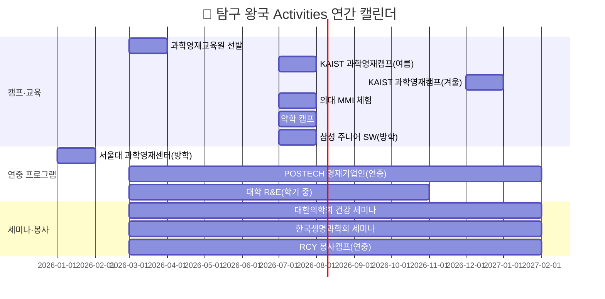
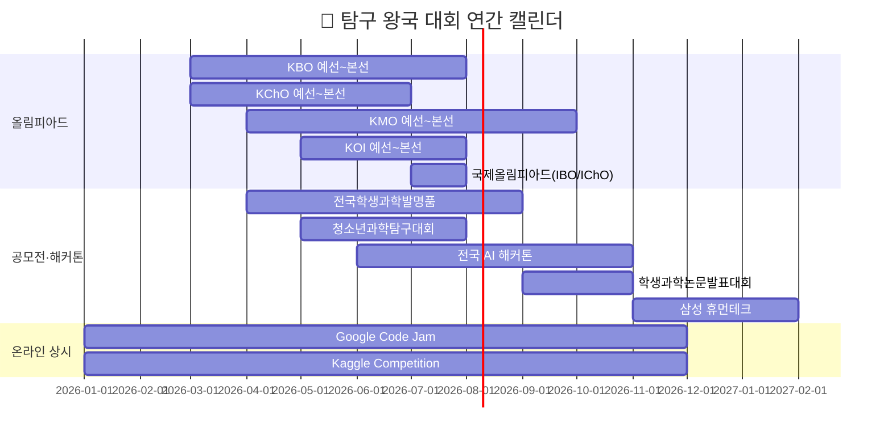
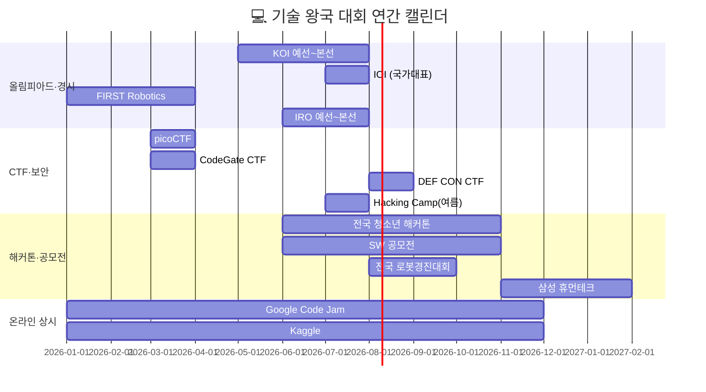

# 8개 왕국별 Activities · Awards · 자격증 종합 가이드 (상)
> **🔬 탐구 왕국 · 🎨 창작 왕국 · 💻 기술 왕국**
> 초·중·고별 / 난이도별 / 월별 / 지역별(국내·해외) / 제한별 / 과목별 / 온라인 — 다차원 정리

---

# 🔬 탐구 왕국 — Activities · Awards · 자격증

> **소속 직업**: 의사(01) · AI연구원(02) · 약사(17) · 생명공학연구원(18)

---

## 🔬-1. Activities (봉사 · 캠프 · 세미나 · 교육 프로그램)

### 초·중·고별 + 난이도별 Activities

| # | 프로그램명 | 대상 | 난이도 | 유형 | 주관 | 온/오프 | 비용 |
|---|---------|------|-------|------|------|--------|------|
| 1 | 국립과천과학관 실험 캠프 | 초·중·고 | ★☆☆☆☆ | 캠프 | 과기정통부 | 오프라인 | 3~5만원 |
| 2 | 과학영재교육원 (대학 부설) | 초5~고1 | ★★★☆☆ | 교육과정 | 한국과학창의재단 | 오프라인 | 무료~10만원 |
| 3 | SW영재교육원 | 초5~중3 | ★★★☆☆ | 교육과정 | 과기정통부 | 오프라인 | 무료 |
| 4 | KAIST 과학영재캠프 | 중1~고1 | ★★★☆☆ | 캠프 | KAIST | 오프라인 | 무료~10만원 |
| 5 | 서울대 과학영재센터 | 중·고 | ★★★★☆ | 심화교육 | 서울대 | 오프라인 | 10만원 내외 |
| 6 | POSTECH 영재기업인교육원 | 중·고 | ★★★★☆ | 연중교육 | 포스텍 | 오프라인 | 무료 |
| 7 | 의대 MMI 체험 프로그램 | 고2 | ★★★★☆ | 체험 | 주요 의대 | 오프라인 | 5만원 |
| 8 | 약학 캠프 / 약학 체험 | 고1~2 | ★★★☆☆ | 체험 | 주요 약대 | 오프라인 | 3~5만원 |
| 9 | 대학 연계 R&E (고교-대학 연구) | 고1~2 | ★★★★★ | 연구 | 각 대학·과학고 | 오프라인 | 무료 |
| 10 | 고려대 R&E 멘토링 | 고1~2 | ★★★★★ | 멘토링 | 고려대 | 오프라인 | 무료 |
| 11 | 삼성 주니어 SW 아카데미 | 중·고 | ★★★☆☆ | 교육 | 삼성전자 | 오프라인 | 무료 |
| 12 | 대한의학회 청소년 건강 세미나 | 고 | ★★★☆☆ | 세미나 | 대한의학회 | 오프/온 | 무료 |
| 13 | 한국생명과학회 학생 세미나 | 고 | ★★★★☆ | 세미나 | 한국생명과학회 | 오프라인 | 무료~3만원 |
| 14 | 대한적십자사 RCY 캠프 | 중·고 | ★★☆☆☆ | 캠프·봉사 | 대한적십자사 | 오프라인 | 무료~5만원 |
| 15 | 한국직업능력연구원 진로캠프 | 중·고 | ★★☆☆☆ | 진로 | 고용노동부 | 오프라인 | 무료 |

### 월별(시기별) Activities 캘린더

### 지역별(국내·해외) Activities

| 구분 | 프로그램명 | 지역 | 언어 | 비고 |
|------|---------|------|------|------|
| **국내 수도권** | 서울대 과학영재센터 | 서울 | 한국어 | 서울대 캠퍼스 |
| **국내 수도권** | 국립과천과학관 캠프 | 경기 과천 | 한국어 | 초·중·고 전 연령 |
| **국내 대전** | KAIST 과학영재캠프 | 대전 | 한국어 | 숙박 포함 |
| **국내 포항** | POSTECH 영재기업인 | 포항 | 한국어 | 연중 교육 |
| **국내 전국** | 과학영재교육원 (각 대학 부설) | 전국 16개 대학 | 한국어 | 거주지 기반 선발 |
| **국내 전국** | 대학 연계 R&E | 전국 주요 대학 | 한국어 | 지도교수 매칭 |
| **해외 온라인** | K-MOOC "인공지능 입문" | 온라인 | 한국어 | 무료 수료증 |
| **해외 온라인** | Coursera "Machine Learning" | 온라인 | 영어 | 스탠퍼드 Andrew Ng |
| **해외 온라인** | edX "CS50" (하버드) | 온라인 | 영어 | MIT·하버드 공개강좌 |
| **해외 온라인** | K-MOOC "생명과학 실험" | 온라인 | 한국어 | 실험 설계 이론 |

### 온라인 교육 플랫폼 (무료·저비용)

| 플랫폼 | 추천 강좌 | 비용 | 수료증 | 난이도 | 적합 직업 |
|-------|---------|------|-------|-------|---------|
| **K-MOOC** | 인공지능 입문, 생명과학 실험 | 무료 | ⭕ | ★★★☆☆ | AI연구원·생명공학 |
| **Coursera** | ML Specialization (Andrew Ng) | 무료 청강 | ⭕(유료) | ★★★★☆ | AI연구원 |
| **edX** | CS50 (하버드), 생명과학 개론 | 무료 청강 | ⭕(유료) | ★★★☆☆ | 4직업 공통 |
| **KOCW** | 전국 대학 공개강의 | 무료 | ❌ | ★★★☆☆ | 세특 심화용 |
| **이솦(EBS SW)** | Python, AI, 정보 교과 | 무료 | ⭕ | ★★☆☆☆ | AI연구원 |
| **SW중심대학 강좌** | AI·코딩·데이터 | 무료 | ⭕ | ★★★☆☆ | 4직업 공통 |

### 과목별 Activities 연결표

| 과목 | 추천 활동 | 세특 연결 키워드 | 적합 직업 |
|------|---------|-------------|---------|
| **생명과학Ⅱ** | KBO 준비, R&E, 대학 실험 | 유전학·세포생물학·면역 | 의사·약사·생명공학·수의사 |
| **화학Ⅱ** | KChO 준비, 약물 분석 프로젝트 | 유기화학·약물 합성·반응 | 약사·생명공학 |
| **수학(미적분)** | KMO 준비, AI 수학 탐구 | 경사하강법·확률·선형대수 | AI연구원 |
| **정보** | KOI 준비, AI 프로젝트 | Transformer·알고리즘 | AI연구원 |
| **보건** | 건강 데이터 분석, 공중보건 탐구 | 건강불평등·역학·예방의학 | 의사·약사 |

### 봉사활동 추천 (학교 교육과정 내)

| 봉사 유형 | 대상 | 시기 | 시간 | 적합 직업 | 세특 연결 |
|---------|------|------|------|---------|---------|
| 또래 과학 멘토링 | 초·중·고 | 학기 중 | 주 1~2시간 | 4직업 공통 | 교과 심화 + 소통 역량 |
| 보건실 봉사 | 중·고 | 학기 중 | 주 1시간 | 의사·약사 | 건강 관리 현장 이해 |
| 과학 실험 보조 | 중·고 | 학기 중 | 월 2회 | 생명공학·약사 | 실험 설계 역량 |
| 교내 건강 캠페인 | 중·고 | 학기 중 | 월 2~4시간 | 의사·약사 | 공중보건 프로젝트 |
| AI 코딩 교육 봉사 | 중·고 | 방학 | 누적 20시간+ | AI연구원 | 기술 나눔 + 리더십 |

### 제한별(참가 조건) Activities 분류

| 제한 유형 | 프로그램 | 선발 기준 | 경쟁률 |
|---------|---------|---------|-------|
| **선발형** (시험) | 과학영재교육원 | 교사 추천 + 캠프 선발 | 약 5:1 |
| **선발형** (시험) | SW영재교육원 | 코딩 테스트 + 면접 | 약 8:1 |
| **추천형** | 대학 연계 R&E | 지도교사 추천 + 자기소개서 | 약 3:1 |
| **선착순** | KAIST 캠프 | 온라인 접수 | 선착순 마감 |
| **무제한** | K-MOOC / Coursera | 누구나 수강 | 제한 없음 |
| **무제한** | 이솦(EBS SW) | 누구나 수강 | 제한 없음 |

### (추가) 국내·해외·온라인 Activities 확장 리스트 (초·중·고/난이도/월/지역/제한/과목)

| # | 활동/프로그램 | 대상 | 난이도 | 월(모집/진행) | 지역(국내/해외) | 제한 | 과목/분야 | 온/오프 | 산출물(기록 포인트) |
|---|---|---|---|---|---|---|---|---|---|
| 1 | 대학·연구소 **오픈랩/공개실험실 투어**(의생명·약학·AI) | 중·고 | ★★☆☆☆ | 3~11월 | 국내 | 선착/학교연계 | 생명·화학·정보 | 오프 | 방문 보고서 + 질문리스트 |
| 2 | **학회 학생세션 청강**(의학/생명/화학/AI) + 요약발표 | 고 | ★★★☆☆ | 연중(학회 시즌) | 국내/해외 | 유료(학생할인) | 전 과목 | 오프/온 | 논문 3편 리뷰 + 용어사전 |
| 3 | **의료데이터/공공데이터 분석 미니프로젝트**(질병·환경) | 중·고 | ★★★☆☆ | 연중 | 국내/해외 | 무제한 | 수학·정보·보건 | 온라인 | 분석 노트북/리포트(가설-결론) |
| 4 | **실험 설계 챌린지**(가설→변인통제→재현) | 초·중·고 | ★★☆☆☆ | 3~12월 | 국내 | 무제한 | 과학 전반 | 온/오프 | 실험계획서(통제변인 표 포함) |
| 5 | 해외 **Pre-College 온라인 트랙**(Bio/Neuro/AI) | 고 | ★★★★☆ | 6~8월 | 해외 | 선발/유료 | 생명·화학·정보 | 온라인 | 최종 프로젝트 포스터(영문) |
| 6 | **국제 청소년 연구 포스터 세션**(온라인 학술제 형태) | 중·고 | ★★★★☆ | 7~11월 | 해외 | 서류/발표 | 과학 전반 | 온라인 | 포스터+3분 피치 영상 |
| 7 | **메디컬/바이오 윤리 토론 라운드**(AI·유전자·임상) | 중·고 | ★★★☆☆ | 3~12월 | 국내/해외 | 팀 구성 | 보건·윤리·국어 | 오프/온 | 찬반 논증표 + 토론 기록 |
| 8 | **Bioinformatics 입문**(서열분석/단백질예측) 실습 | 고 | ★★★★☆ | 연중 | 해외 | 무제한 | 생명·정보·수학 | 온라인 | 실습 로그 + 결과 해석 |
| 9 | 학교 **탐구동아리 R&D 스프린트**(4주 단위) | 중·고 | ★★★☆☆ | 학기 중 | 국내 | 동아리 | 과학 전반 | 오프 | 주차별 실험노트/회고 |
| 10 | **멘토링 봉사 업그레이드**("가르치기"가 아닌 "실험 설계 코칭") | 고 | ★★★☆☆ | 연중 | 국내 | 학교연계 | 과학·수학 | 오프 | 멘티 결과물(계획서) + 피드백 루브릭 |
| 11 | **초등 과학탐구 캠프**(자연사·생명·화학 입문) | 초4~6 | ★☆☆☆☆ | 7~8월 | 국내 | 선착/무료 | 과학 | 오프 | 관찰일지 + 스케치(5종 이상) |
| 12 | **청소년 신약개발 아카데미**(KAIST·서울대 연계) | 고1~2 | ★★★★☆ | 6~8월 | 국내 | 선발 | 화학·생명 | 오프 | 표적-기전-한계 분석 리포트 |
| 13 | **Brilliant.org 수학·과학 과정**(게임형 학습) | 초·중·고 | ★★★☆☆ | 연중 | 해외 | 무제한(유료 선택) | 수학·물리·CS | 온라인 | 주차별 학습 스크린샷 + 연결 개념 노트 |
| 14 | **국제 뇌과학 온라인 강좌**(Society for Neuroscience 계열) | 중·고 | ★★★★☆ | 연중 | 해외 | 무제한 | 생명·심리 | 온라인 | 학습 노트 + 자기 질문 발전 기록 |
| 15 | **iNaturalist 시민과학 생태조사 봉사**(학교·지역 연계) | 초·중·고 | ★★☆☆☆ | 4~11월 | 국내/해외 | 무제한 | 생명·지구 | 오프/온 | 관찰 100건+ 로그 + 종 분류 근거 |
| 16 | **Khan Academy MCAT/AP Biology 자율학습** | 중·고 | ★★★☆☆ | 연중 | 해외 | 무료 | 생명·화학 | 온라인 | 단원별 퀴즈 결과 + 오답 정리 노트 |
| 17 | **지역 보건소·건강증진센터 봉사**(홍보물 제작·배부) | 중·고 | ★★☆☆☆ | 연중 | 국내 | 기관 승인 | 보건·국어 | 오프 | 활동일지 + 캠페인 전후 참여자 비교 |
| 18 | **초등생 대상 과학실험 교육 봉사**(복지관·방과후) | 중·고 | ★★★☆☆ | 학기 중 | 국내 | 학교연계 | 과학·교육 | 오프 | 실험 키트 설계서 + 학생 반응 기록 |
| 19 | **해외 의생명 Pre-College**(Johns Hopkins CTY·Stanford OHS) | 고1~2 | ★★★★★ | 6~8월 | 해외 | 선발/유료 | 생명·화학·의학 | 온/오프 | 최종 리서치 페이퍼(영문) |
| 20 | **바이오·의료 스타트업 현장 인터뷰 리서치** | 고 | ★★★★☆ | 연중 | 국내 | 개인 섭외 | 생명·경영 | 오프/온 | 인터뷰 Q&A + 산업동향 정리 |

### 초등 특화 Activities (탐구 왕국)

| # | 프로그램명 | 대상 | 난이도 | 월 | 지역 | 비용 | 목적 |
|---|---------|------|-------|---|------|------|------|
| 1 | 국립과천과학관 **어린이 과학실험 교실** | 초3~6 | ★☆☆☆☆ | 연중 | 경기 과천 | 무료~1만원 | 탐구 흥미 발화 |
| 2 | 국립중앙과학관 **사이언스데이** | 초 전체 | ★☆☆☆☆ | 4·10월 | 대전 | 무료 | 과학 체험 |
| 3 | **서울대 어린이병원 의학 체험** | 초5~6 | ★★☆☆☆ | 7~8월 | 서울 | 무료 | 의학 진로 탐색 |
| 4 | 한국항공우주연구원 **우주 캠프** | 초4~6 | ★★☆☆☆ | 방학 | 대전 | 3만원 | 이공계 흥미 확장 |
| 5 | **SciShow/Crash Course Biology 영상 탐구** | 초3~6 | ★★☆☆☆ | 연중 | 해외 온라인 | 무료 | 과학 개념 + 영어 노출 |
| 6 | 지역 **자연사박물관 도슨트 투어** + 탐구 기록 | 초 전체 | ★☆☆☆☆ | 연중 | 국내 전국 | 입장료 | 관찰 기록 습관 형성 |

---

## 🔬-2. Awards (대회 · 공모전)

### 교내 수상 전략 (학생부 기재 가능 — 학기당 1개)

| 학기 | 추천 교내 대회 | 난이도 | 세특 연결 | 적합 직업 |
|------|------------|-------|---------|---------|
| 고1 1학기 | 과학탐구대회 | ★★★☆☆ | 생명과학·화학 탐구 과정 | 의사·약사·생명공학 |
| 고1 2학기 | 독서토론대회 | ★★☆☆☆ | 과학·의학 도서 토론 | 4직업 공통 |
| 고2 1학기 | 융합과학탐구대회 | ★★★★☆ | 교과 융합 연구 발표 | 4직업 공통 |
| 고2 2학기 | 학술제(연구 발표) | ★★★★☆ | R&E·소논문 발표 | 4직업 공통 |

### 교외 대회 — 국내 (학생부 미기재, 세특 소재화)

| # | 대회명 | 주관 | 대상 | 시기 | 난이도 | 온/오프 | 비용 | 적합 직업 |
|---|-------|------|------|------|-------|--------|------|---------|
| 1 | **한국생물올림피아드(KBO)** | 한국생물과학협회 | 중·고 | 3~8월 | ★★★★★ | 오프라인 | 무료 | 의사·생명공학·수의사 |
| 2 | **한국화학올림피아드(KChO)** | 대한화학회 | 중·고 | 3~7월 | ★★★★★ | 오프라인 | 무료 | 약사·생명공학 |
| 3 | **한국수학올림피아드(KMO)** | 대한수학회 | 중·고 | 4~10월 | ★★★★★ | 오프라인 | 무료 | AI연구원·의사 |
| 4 | **한국정보올림피아드(KOI)** | 한국정보과학회 | 중·고 | 5~8월 | ★★★★★ | 오프라인 | 무료 | AI연구원 |
| 5 | **청소년과학탐구대회** | 한국과학교육단체총연합회 | 중·고 | 5~8월 | ★★★☆☆ | 오프라인 | 무료 | 4직업 공통 |
| 6 | **한국학생과학연구논문발표대회** | 한국과학교육단체총연합회 | 고 | 9~11월 | ★★★★☆ | 오프라인 | 무료 | 4직업 공통 |
| 7 | **전국학생과학발명품경진대회** | 한국과학창의재단 | 초·중·고 | 4~9월 | ★★★☆☆ | 오프라인 | 무료 | 생명공학·AI |
| 8 | **삼성 휴먼테크 논문대상** | 삼성전자 | 고·대 | 11~2월 | ★★★★★ | 온라인 제출 | 무료 | AI연구원·생명공학 |
| 9 | **전국 AI 해커톤** | 과기정통부·네이버 등 | 고 | 연중 | ★★★★☆ | 오프/온 | 무료 | AI연구원 |
| 10 | **대한민국 학생발명전시회** | 특허청 | 중·고 | 4~9월 | ★★★☆☆ | 오프라인 | 무료 | 4직업 공통 |
| 11 | **바이오 해커톤** | 각 대학·바이오기업 | 고 | 연중 | ★★★★☆ | 오프라인 | 무료 | 생명공학 |

### 교외 대회 — 해외 / 국제

| # | 대회명 | 주관 | 대상 | 시기 | 난이도 | 온/오프 | 언어 | 적합 직업 |
|---|-------|------|------|------|-------|--------|------|---------|
| 1 | **국제생물올림피아드(IBO)** | 국제학술단체 | 고(국가대표) | 7월 | ★★★★★ | 오프라인(해외) | 영어 | 의사·생명공학 |
| 2 | **국제화학올림피아드(IChO)** | 국제학술단체 | 고(국가대표) | 7월 | ★★★★★ | 오프라인(해외) | 영어 | 약사·생명공학 |
| 3 | **국제물리올림피아드(IPhO)** | 국제학술단체 | 고(국가대표) | 7월 | ★★★★★ | 오프라인(해외) | 영어 | AI연구원(수학·물리) |
| 4 | **국제정보올림피아드(IOI)** | 국제학술단체 | 고(국가대표) | 7~8월 | ★★★★★ | 오프라인(해외) | 영어 | AI연구원 |
| 5 | **Google Code Jam** | Google | 전 연령 | 연중 | ★★★★☆ | 온라인 | 영어 | AI연구원 |
| 6 | **Google Kick Start** | Google | 전 연령 | 연중 | ★★★☆☆ | 온라인 | 영어 | AI연구원 |
| 7 | **Kaggle Competition** | Google(Kaggle) | 전 연령 | 상시 | ★★★~★★★★★ | 온라인 | 영어 | AI연구원 |
| 8 | **Intel ISEF (국제과학기술경진대회)** | Intel·SSP | 고(국가대표) | 5월 | ★★★★★ | 오프라인(미국) | 영어 | 4직업 공통 |

### 대회 월별 캘린더

### 과목별 추천 대회 매칭

| 과목 | 국내 대회 | 해외 대회 | 난이도 범위 |
|------|---------|---------|---------|
| 생명과학 | KBO, 청소년과학탐구, 바이오해커톤 | IBO, Intel ISEF | ★★★~★★★★★ |
| 화학 | KChO, 청소년과학탐구 | IChO | ★★★~★★★★★ |
| 수학 | KMO | IMO | ★★★★~★★★★★ |
| 정보(코딩) | KOI, AI 해커톤 | IOI, Google Code Jam, Kaggle | ★★★~★★★★★ |
| 융합(과학전반) | 발명품경진대회, 논문발표대회 | Intel ISEF | ★★★☆☆~★★★★★ |

### (추가) Awards 확장 리스트 (국내·해외/온라인/제한/과목)

| # | 대회/공모전 | 국내/해외 | 대상 | 시기 | 난이도 | 제한 | 과목/분야 | 온/오프 | “기록”으로 남길 핵심 |
|---|---|---|---|---|---|---|---|---|---|
| 1 | **뇌과학(Neuroscience) 경시/탐구 대회**(예: Brain Bee 계열) | 국내→해외 | 중·고 | 3~7월 | ★★★★☆ | 선발형 | 생명·보건 | 오프 | 실험/문헌 기반 “질문 10개” |
| 2 | **의학/바이오 데이터 스토리텔링 공모**(질병·공중보건) | 국내 | 중·고 | 5~10월 | ★★★☆☆ | 팀/개인 | 수학·정보·보건 | 온라인 | 데이터 전처리 근거 + 한계 |
| 3 | **청소년 논문·리서치 포스터 대회**(학교/지역/대학 주관) | 국내 | 고 | 8~11월 | ★★★★☆ | 서류/발표 | 과학 전반 | 오프/온 | 연구윤리(인용) 체크리스트 |
| 4 | **AI×헬스케어 아이디어톤/해커톤** | 국내 | 고 | 연중 | ★★★★☆ | 팀 | 정보·보건 | 오프/온 | 사용자(환자) 페르소나 + KPI |
| 5 | **국제 청소년 과학 포스터 경진**(온라인 제출형) | 해외 | 중·고 | 연중 | ★★★★☆ | 영어 | 과학 전반 | 온라인 | 1페이지 포스터 + 3분 발표 |
| 6 | **기후·보건(Heat/미세먼지) 연구 공모전** | 국내/해외 | 중·고 | 4~9월 | ★★★☆☆ | 팀/개인 | 지구·보건 | 온라인 | 지역 데이터와의 연결성 |
| 7 | **오픈 데이터 챌린지**(공공·의료·환경) | 국내/해외 | 중·고 | 연중 | ★★★☆☆ | 무제한 | 수학·정보 | 온라인 | “재현 가능” 코드/노트 |
| 8 | **과학 글쓰기/에세이(의생명 윤리 포함)** | 국내/해외 | 중·고 | 연중 | ★★~★★★★ | 영어 선택 | 국어·윤리·과학 | 온라인 | 반대 근거까지 포함한 균형 |
| 9 | **학생발명/특허 아이디어 고도화**(출원까지는 선택) | 국내 | 중·고 | 4~10월 | ★★★★☆ | 서류 | 융합 | 오프/온 | 문제정의(페인포인트) 명확화 |
| 10 | **국제 과학기술경진(ISEF 계열) 로컬/국가 페어** | 해외 | 고 | 1~5월 | ★★★★★ | 선발형 | 과학 전반 | 오프 | 실험노트 + 통계 검정 근거 |
| 11 | **아시아-태평양수학올림피아드(APMO)** | 국내→해외 | 고(대표) | 3월 | ★★★★★ | 선발형 | 수학 | 온/오프 | 풀이 과정의 논리 구조 완성도 |
| 12 | **주니어 한국생물올림피아드(JKBO)** | 중학생 | 3~6월 | ★★★★☆ | 선발 | 생명 | 오프 | 오답 분석 + 재학습 증거 |
| 13 | **한국초등수학경시대회(KMC)** | 초4~6 | 연중 | ★★★☆☆ | 무제한 | 수학 | 오프 | 오답 노트 + 유형별 분류 |
| 14 | **Regeneron Science Talent Search**(미국 최대 이공계 고교생 대회) | 해외 | 고 | 9~3월 | ★★★★★ | 영어/서류 | 과학 전반 | 온라인 제출 | 연구보고서(독창성·사회적 의의) |
| 15 | **한국청소년과학기술진흥회 소논문 발표 대회** | 국내 | 고 | 9~12월 | ★★★★☆ | 서류 | 과학 전반 | 오프/온 | 연구노트(날짜 기록) + 수정 이력 |
| 16 | **Google Science Fair**(구글 과학경진) | 해외 | 중·고 | 연중 | ★★★★★ | 무제한/영어 | 과학 전반 | 온라인 | 연구 요약 + 영어 영상 1분 |
| 17 | **의료 AI 해커톤**(서울대병원·세브란스 등) | 국내 | 고 | 연중 | ★★★★☆ | 팀 | 정보·보건 | 오프/온 | 모델 카드 + 임상적 해석 |
| 18 | **IPhO 준비 과정**(한국물리올림피아드 예선) | 국내 | 중·고 | 3~8월 | ★★★★★ | 선발 | 물리·수학 | 오프 | 개념 연결 지도 + 풀이 로그 |

---

## 🔬-3. 자격증 (Certification)

### 초·중·고별 + 난이도별 자격증 로드맵

| 취득 시기 | 자격증명 | 주관 | 난이도 | 비용 | 온/오프 | 적합 직업 |
|---------|--------|------|-------|------|--------|---------|
| **중학교** | DIAT (디지털정보활용) | 한국정보통신진흥협회 | ★☆☆☆☆ | 1.8만원 | 오프라인 | 4직업 공통 |
| **중학교** | ITQ (한글·엑셀·PPT) | 한국생산성본부 | ★☆☆☆☆ | 1.8만원 | 오프라인 | 4직업 공통 |
| **중학교** | 워드프로세서 | 대한상공회의소 | ★★☆☆☆ | 1.9만원 | 오프라인 | 4직업 공통 |
| **중3~고1** | 컴퓨터활용능력 2급 | 대한상공회의소 | ★★☆☆☆ | 1.9만원 | 오프라인 | 4직업 공통 |
| **중3~고1** | BLS (기본생명구조술) | 대한심폐소생협회 | ★☆☆☆☆ | 5~8만원 | 오프라인 | 의사·약사 |
| **중3~고1** | 응급처치 자격 | 대한적십자사 | ★☆☆☆☆ | 3만원 | 오프라인 | 의사·약사 |
| **중3~고1** | 정보처리기능사 | 한국산업인력공단 | ★★☆☆☆ | 1.9만원 | 오프라인 | AI연구원 |
| **중3~고1** | COS Pro 2급 (Python) | YBM | ★★☆☆☆ | 3만원 | 오프라인 | AI연구원 |
| **고1~2** | COS Pro 1급 (Python/C) | YBM | ★★★☆☆ | 3만원 | 오프라인 | AI연구원 |
| **고1~2** | 컴퓨터활용능력 1급 | 대한상공회의소 | ★★★☆☆ | 2.2만원 | 오프라인 | 4직업 공통 |
| **고1~2** | TOEFL iBT | ETS | ★★★★☆ | 약 30만원 | 오프라인 | AI연구원 (논문) |
| **고2** | 위험물기능사 | 한국산업인력공단 | ★★★☆☆ | 1.9만원 | 오프라인 | 약사·생명공학 |

### 자격증 — 직업별 추천 조합

| 직업 | 중학교 필수 | 고1 추천 | 고2 추천 | 면접 활용 핵심 |
|------|---------|---------|---------|------------|
| **의사** | DIAT, 워드프로세서 | BLS, 컴활 2급 | TOEFL | "생명구조 실습 → 의료 진로 확신" |
| **AI연구원** | ITQ, COS Pro 2급 | 정보처리기능사, COS Pro 1급 | TOEFL, 컴활 1급 | "코딩 역량의 객관적 수치" |
| **약사** | DIAT, 워드프로세서 | BLS, 컴활 2급 | 위험물기능사, TOEFL | "화학 안전 역량 + 의료 진로" |
| **생명공학연구원** | ITQ, COS Pro 2급 | 정보처리기능사, 응급처치 | 위험물기능사, TOEFL | "실험실 안전 + 데이터 분석" |

### 자격증 과목별 분류

| 과목 계열 | 자격증 | 관련 교과 | 세특 연결 |
|---------|-------|---------|---------|
| **IT·코딩** | 정보처리기능사, COS Pro 1·2급 | 정보, 프로그래밍 | "AI 프로젝트 역량 증빙" |
| **의료·안전** | BLS, 응급처치, 위험물기능사 | 생명과학, 화학, 보건 | "의료 현장·실험실 안전 역량" |
| **어학** | TOEFL, TOEIC | 영어 | "영어 논문 독해력 증빙" |
| **디지털 기초** | DIAT, ITQ, 워드프로세서, 컴활 | 정보, 기술·가정 | "디지털 리터러시 기본" |

## 🔬-4. 역량(Competency) — 섹션별 서술(세특·면접 연결)

| 역량 섹션 | 무엇을 보여주나 | 활동/산출물(추천) | 학생부·면접 연결 문장(예시) |
|---|---|---|---|
| **문제정의·가설** | “왜 이 주제를 했는가”의 논리 | 연구 질문 1개를 **측정 가능**하게 재정의 | “관찰에서 출발해 변수 통제를 통해 가설을 검증했다.” |
| **실험 설계·안전·윤리** | 재현성/안전/윤리 감수성 | 통제변인표, 안전수칙, IRB 개념 정리(수준에 맞게) | “결과보다 과정의 안전·윤리를 우선순위로 두었다.” |
| **데이터 분석** | 근거 기반 사고 | 그래프 3종(분포/상관/추세) + 한계 분석 | “결론의 신뢰구간과 한계를 함께 제시했다.” |
| **문헌 조사(영어 포함)** | 지식의 출처와 확장 | 논문 3편 비교표(연구설계/결과/한계) | “선행연구의 빈틈을 찾아 내 탐구로 연결했다.” |
| **협업·멘토링** | 팀 연구/리더십 | 역할분담표 + 회의록 + 피드백 루프 | “팀의 가설을 합의하고 실험 루틴을 표준화했다.” |
| **커뮤니케이션(발표)** | 과학적 설명력 | 1페이지 포스터 + 3분 피치 + Q&A 로그 | “비전공자도 이해하도록 비유·시각화를 사용했다.” |

---

# 🎨 창작 왕국 — Activities · Awards · 자격증

> **소속 직업**: UX디자이너(03) · 웹툰작가(04) · 건축가(19) · 영화·영상감독(20)

---

## 🎨-1. Activities (봉사 · 캠프 · 세미나 · 교육 프로그램)

### 초·중·고별 + 난이도별 Activities

| # | 프로그램명 | 대상 | 난이도 | 유형 | 주관 | 온/오프 | 비용 |
|---|---------|------|-------|------|------|--------|------|
| 1 | 서울시립미술관 청소년 워크숍 | 중·고 | ★☆☆☆☆ | 워크숍 | 서울시립미술관 | 오프라인 | 무료~3만원 |
| 2 | Adobe Creative Camp | 중·고 | ★★☆☆☆ | 캠프 | Adobe | 오프라인 | 무료 |
| 3 | 한국디자인진흥원 청소년 디자인캠프 | 중·고 | ★★★☆☆ | 캠프 | 한국디자인진흥원 | 오프라인 | 무료~5만원 |
| 4 | 네이버웹툰 아카데미 | 중·고 | ★★★☆☆ | 교육 | 네이버웹툰 | 오프라인 | 무료 |
| 5 | 한국만화영상진흥원 창작 교실 | 중·고 | ★★☆☆☆ | 교육 | 한국만화영상진흥원 | 오프라인 | 무료~3만원 |
| 6 | 서울 건축문화제 학생 워크숍 | 중·고 | ★★★☆☆ | 워크숍 | 서울시·건축사협회 | 오프라인 | 무료 |
| 7 | 대학 건축학과 오픈 스튜디오 | 고1~2 | ★★★☆☆ | 체험 | 주요 대학 건축학과 | 오프라인 | 무료 |
| 8 | 부산국제영화제(BIFF) 청소년 프로그램 | 중·고 | ★★★☆☆ | 체험 | BIFF | 오프라인 | 5만원 |
| 9 | KBS 미디어 체험관 | 중·고 | ★★☆☆☆ | 체험 | KBS | 오프라인 | 3만원 |
| 10 | K-MOOC "UX 디자인 입문" | 고1~2 | ★★★☆☆ | 온라인강좌 | 교육부 | 온라인 | 무료 |
| 11 | Coursera "Interaction Design" | 고1~2 | ★★★★☆ | 온라인강좌 | UCSD | 온라인 | 무료 청강 |

### 월별(시기별) Activities 캘린더

| 월 | 프로그램 | 유형 | 대상 |
|----|---------|------|------|
| 1~2월 | 미술관 겨울 워크숍, Adobe Camp | 캠프 | 중·고 |
| 3~4월 | 만화영상진흥원 창작 교실 개강 | 교육 | 중·고 |
| 5~6월 | 대학 건축학과 오픈 스튜디오 | 체험 | 고1~2 |
| 7~8월 | 네이버웹툰 아카데미(여름), 디자인캠프 | 캠프·교육 | 중·고 |
| 10월 | 서울 건축문화제 워크숍, BIFF 청소년 | 워크숍·체험 | 중·고 |
| **연중** | K-MOOC, Coursera (온라인 상시) | 온라인 | 고1~2 |

### 지역별(국내·해외) Activities

| 구분 | 프로그램명 | 지역 | 비고 |
|------|---------|------|------|
| **국내 서울** | 서울시립미술관 워크숍, KBS 체험관 | 서울 | 접근성 우수 |
| **국내 서울** | 한국디자인진흥원 캠프 | 서울 코엑스 근처 | 여름·겨울 |
| **국내 부산** | BIFF 청소년 프로그램 | 부산 해운대 | 10월 |
| **국내 전국** | 네이버웹툰 아카데미 | 판교 + 온라인 병행 | 여름 |
| **국내 전국** | 한국만화영상진흥원 | 부천 | 연중 |
| **해외 온라인** | Coursera "Interaction Design" (UCSD) | 온라인 | 영어 |
| **해외 온라인** | K-MOOC "UX 디자인 입문" | 온라인 | 한국어 |
| **해외 온라인** | YouTube Creator Academy | 온라인 | 영어 |

### 과목별 Activities 연결표

| 과목 | 추천 활동 | 세특 연결 키워드 | 적합 직업 |
|------|---------|-------------|---------|
| **미술(창작)** | 미술관 워크숍, Figma 프로토타이핑 | HCD·색채론·구도 | UX디자이너·웹툰작가 |
| **기술·가정** | 건축 모형 제작, SketchUp 실습 | 인체공학·구조역학 | 건축가·UX디자이너 |
| **국어(문학)** | 시나리오 작성, 웹툰 서사 분석 | 서사구조·캐릭터 아크 | 웹툰작가·영화감독 |
| **영상제작** | 단편 영화 제작, 프리미어 편집 | 몽타주·색보정·연출 | 영화감독 |
| **물리학Ⅰ·Ⅱ** | 건축 구조역학 탐구 | 트러스·아치·힘 분산 | 건축가 |

### 봉사활동 추천

| 봉사 유형 | 대상 | 적합 직업 | 세특 연결 |
|---------|------|---------|---------|
| 학교 포스터·홍보물 디자인 | 중·고 | UX디자이너·웹툰작가 | 시각 디자인 역량 |
| 교내 영상 제작 봉사 | 중·고 | 영화감독 | 촬영·편집 실무 경험 |
| 지역 벽화 봉사 | 중·고 | 건축가·UX디자이너 | 공간 디자인 + 공동체 |
| 웹툰 교육 봉사 (저학년 대상) | 고 | 웹툰작가 | 창작 교육 + 소통 |

### (추가) 국내·해외·온라인 Activities 확장 리스트 (초·중·고/난이도/월/지역/제한/과목)

| # | 활동/프로그램 | 대상 | 난이도 | 월(모집/진행) | 지역(국내/해외) | 제한 | 과목/분야 | 온/오프 | 산출물(기록 포인트) |
|---|---|---|---|---|---|---|---|---|---|
| 1 | **DDP/디자인재단** 전시 연계 워크숍(리서치·서비스디자인) | 중·고 | ★★☆☆☆ | 연중 | 국내 | 선착/유료 | 미술·기술가정 | 오프 | 전시 리뷰 + 사용자 관찰 메모 |
| 2 | **국립현대미술관(MMCA)** 청소년 프로그램(큐레이터·비평) | 중·고 | ★★☆☆☆ | 3~12월 | 국내 | 선착 | 미술·국어 | 오프 | 작품 비평문 1편(구조화) |
| 3 | **Figma 커뮤니티 챌린지**(프로토타입) | 중·고 | ★★★☆☆ | 연중 | 해외 | 무제한 | 미술·정보 | 온라인 | 프로토타입 링크 + 테스트 결과 |
| 4 | **웹툰 ‘시리즈’ 제작 스프린트**(4주 1화) | 중·고 | ★★★☆☆ | 학기 중 | 국내 | 무제한 | 국어·미술 | 오프/온 | 콘티/스크립트/피드백 반영 |
| 5 | 해외 **Pre-College 아트/디자인**(온라인) | 고 | ★★★★☆ | 6~8월 | 해외 | 선발/유료 | 미술 | 온라인 | 포트폴리오 10컷 + 아티스트 스테이트먼트 |
| 6 | **단편영화 제작 랩**(각본→촬영→편집) | 중·고 | ★★★★☆ | 7~10월 | 국내 | 팀 | 영상·국어 | 오프 | 스토리보드 + 컷 편집 의도서 |
| 7 | **건축 답사 & 스케치 저널**(도시/공간) | 중·고 | ★★★☆☆ | 3~11월 | 국내/해외 | 무제한 | 미술·지리 | 오프 | 스케치+동선분석+사용자 시나리오 |
| 8 | **디자인 크리틱(피드백) 모임** 운영 | 고 | ★★★☆☆ | 연중 | 국내/해외 | 커뮤니티 | 미술·국어 | 온라인 | 전/후 비교(Iteration) 증거 |
| 9 | **접근성(Accessibility) 디자인 점검 프로젝트** | 고 | ★★★★☆ | 연중 | 해외 | 무제한 | 기술가정·정보 | 온라인 | WCAG 체크리스트 + 개선안 |
| 10 | **콘텐츠 저작권·윤리 학습 + 적용**(BGM/이미지) | 중·고 | ★★☆☆☆ | 연중 | 국내/해외 | 무제한 | 윤리·사회 | 온라인 | 출처표기 규칙 + 실제 적용 사례 |

---

## 🎨-2. Awards (대회 · 공모전)

### 교내 수상 전략 (학기당 1개)

| 학기 | 추천 교내 대회 | 난이도 | 적합 직업 |
|------|------------|-------|---------|
| 고1 1학기 | 미술실기대회 / 영상제작대회 | ★★☆☆☆ | 웹툰·UX·영화 |
| 고1 2학기 | 포스터디자인대회 / UCC대회 | ★★☆☆☆ | UX·영화·건축 |
| 고2 1학기 | UX/영상 프로젝트 발표 | ★★★☆☆ | 4직업 공통 |
| 고2 2학기 | 학술제(작품 발표) | ★★★★☆ | 4직업 공통 |

### 교외 대회 — 국내

| # | 대회명 | 주관 | 대상 | 시기 | 난이도 | 온/오프 | 적합 직업 |
|---|-------|------|------|------|-------|--------|---------|
| 1 | **대한민국 학생미술대전** | 한국미술협회 | 초·중·고 | 5~8월 | ★★★☆☆ | 오프라인 | 웹툰·UX |
| 2 | **전국 청소년 디자인 공모전** | 한국디자인진흥원 | 중·고 | 6~9월 | ★★★☆☆ | 온·오프 | UX·건축 |
| 3 | **네이버웹툰 도전만화** | 네이버 | 전 연령 | 상시 | ★★☆☆☆ | 온라인 | 웹툰작가 |
| 4 | **카카오 오픈 챌린지** | 카카오엔터 | 전 연령 | 상시 | ★★★☆☆ | 온라인 | 웹툰작가 |
| 5 | **전국 청소년 건축 모형 대회** | 대한건축사협회 | 중·고 | 9~11월 | ★★★★☆ | 오프라인 | 건축가 |
| 6 | **서울 청소년 영화제** | 서울시·영화진흥위 | 중·고 | 8~11월 | ★★★☆☆ | 오프라인 | 영화감독 |
| 7 | **KBS 청소년 영상공모전** | KBS | 중·고 | 6~10월 | ★★★☆☆ | 온라인 제출 | 영화·방송PD |
| 8 | **전국 학생 UCC 공모전** | 한국콘텐츠진흥원 | 중·고 | 연중 | ★★☆☆☆ | 온라인 제출 | 영화·유튜버 |
| 9 | **부산국제단편영화제 청소년** | BISFF | 고 | 4~6월 | ★★★★☆ | 오프라인 | 영화감독 |
| 10 | **캔바 디자인 어워즈** | Canva | 전 연령 | 연중 | ★★☆☆☆ | 온라인 | UX디자이너 |

### 교외 대회 — 해외 / 국제

| # | 대회명 | 주관 | 대상 | 온/오프 | 언어 | 난이도 | 적합 직업 |
|---|-------|------|------|--------|------|-------|---------|
| 1 | **캔바 디자인 어워즈** | Canva(호주) | 전 연령 | 온라인 | 영어 | ★★☆☆☆ | UX디자이너 |
| 2 | **Adobe Design Achievement Awards** | Adobe(미국) | 고·대 | 온라인 | 영어 | ★★★★☆ | UX·건축 |
| 3 | **부산국제단편영화제** | BISFF | 고 | 오프라인 | 영어/한국어 | ★★★★☆ | 영화감독 |
| 4 | **서울국제만화애니메이션페스티벌(SICAF)** | 서울시 | 전 연령 | 오프라인 | 한/영 | ★★★☆☆ | 웹툰작가 |

### (추가) Awards 확장 리스트 (국내·해외/온라인/제한/과목)

| # | 대회/공모전 | 국내/해외 | 대상 | 시기 | 난이도 | 제한 | 과목/분야 | 온/오프 | “기록”으로 남길 핵심 |
|---|---|---|---|---|---|---|---|---|---|
| 1 | **서비스/UX 사례 공모**(공공·학교 문제 해결) | 국내 | 중·고 | 5~11월 | ★★★☆☆ | 팀/개인 | 기술가정·정보 | 온/오프 | 사용자 인터뷰 5명+ 인사이트 |
| 2 | **브랜딩/포스터 공모전**(지역축제·공공기관) | 국내 | 중·고 | 3~10월 | ★★~★★★★ | 서류 | 미술 | 온라인 | 콘셉트 보드 + 타이포 의도 |
| 3 | **청소년 영화/영상제**(단편·다큐) | 국내/해외 | 중·고 | 6~11월 | ★★★★☆ | 팀 | 영상 | 오프/온 | 연출 의도서 + 편집본 |
| 4 | **국제 아트/디자인 포트폴리오 콘테스트**(온라인 제출형) | 해외 | 고 | 연중 | ★★★★☆ | 영어 | 미술 | 온라인 | 작품 8~12점 + 자기평가 |
| 5 | **만화·웹툰 스토리 공모**(시놉시스/콘티) | 국내 | 중·고 | 연중 | ★★★☆☆ | 서류 | 국어·미술 | 온라인 | 캐릭터 시트 + 3막 구조 |
| 6 | **건축·도시 아이디어 공모**(공간 재생/주거) | 국내/해외 | 고 | 4~11월 | ★★★★☆ | 팀 | 지리·미술·물리 | 온라인 | 모델링+동선/채광 분석 |
| 7 | **접근성/포용 디자인 챌린지** | 해외 | 중·고 | 연중 | ★★★★☆ | 무제한 | 정보·윤리 | 온라인 | 문제정의(대상자) 명확성 |
| 8 | **사진·영상 스토리텔링 공모**(전시/온라인) | 국내/해외 | 중·고 | 연중 | ★★~★★★★ | 서류 | 미술·국어 | 온라인 | 작품 해설문(비평) 1편 |

---

## 🎨-3. 자격증 (Certification)

### 초·중·고별 + 난이도별 자격증

| 취득 시기 | 자격증명 | 주관 | 난이도 | 비용 | 온/오프 | 적합 직업 |
|---------|--------|------|-------|------|--------|---------|
| **중2** | DIAT 멀티미디어 제작 | 한국정보통신진흥협회 | ★☆☆☆☆ | 1.8만원 | 오프라인 | 4직업 공통 |
| **중2~고1** | ITQ 파워포인트 | 한국생산성본부 | ★☆☆☆☆ | 1.8만원 | 오프라인 | 4직업 공통 |
| **중3~고1** | GTQ 1급 (그래픽기술) | 한국생산성본부 | ★★★☆☆ | 2.5만원 | 오프라인 | UX·웹툰 |
| **고1** | GTQi (일러스트레이터) | 한국생산성본부 | ★★★☆☆ | 2.5만원 | 오프라인 | 웹툰·UX |
| **고1~2** | 영상편집 자격 (프리미어/애펙) | 한국콘텐츠진흥원 | ★★★☆☆ | 3만원 | 오프라인 | 영화감독 |
| **고2** | 컬러리스트기사 | 한국산업인력공단 | ★★★☆☆ | 2.5만원 | 오프라인 | UX·건축 |
| **고2** | 건축CAD기능사 | 한국산업인력공단 | ★★★☆☆ | 1.9만원 | 오프라인 | 건축가 |

### 자격증 — 직업별 추천 조합

| 직업 | 중학교 | 고1 | 고2 | 면접 활용 |
|------|--------|-----|-----|---------|
| **UX디자이너** | DIAT, ITQ | GTQ 1급, GTQi | 컬러리스트기사 | "디자인 도구 숙련 + 색채 전문성" |
| **웹툰작가** | DIAT | GTQ 1급, GTQi | - | "그래픽 제작 역량 객관적 증빙" |
| **건축가** | DIAT, ITQ | GTQ 1급 | 건축CAD기능사, 컬러리스트 | "설계 도구 + 색채 전문성" |
| **영화감독** | DIAT | 영상편집 자격 | - | "편집 실무 역량 증빙" |

## 🎨-4. 역량(Competency) — 섹션별 서술(세특·면접 연결)

| 역량 섹션 | 무엇을 보여주나 | 활동/산출물(추천) | 학생부·면접 연결 문장(예시) |
|---|---|---|---|
| **사용자/관객 공감** | 타깃을 이해하는 힘 | 관찰일지(페르소나/여정지도) | “관객의 맥락을 분석해 디자인 결정을 내렸다.” |
| **콘셉트 기획** | 문제를 ‘콘셉트’로 묶는 능력 | 콘셉트 보드 + 레퍼런스 비교표 | “레퍼런스를 모방하지 않고 의도를 재구성했다.” |
| **제작 기술(툴)** | 실행력/완성도 | Figma/Illustrator/편집툴 작업 로그 | “작업 과정을 기록해 개선 속도를 높였다.” |
| **반복개선(Iteration)** | 피드백 수용·개선력 | 전/후 비교 3회(크리틱 반영) | “피드백을 기준으로 설계를 재검증했다.” |
| **스토리텔링** | 설득력/서사력 | 로그라인→시놉→콘티→결과물 | “서사 구조를 설계해 메시지를 명확히 했다.” |
| **저작권·윤리** | 창작자의 책임 | 출처표기 규칙 + 적용 사례 | “저작권과 인용 원칙을 지키며 창작했다.” |

---

# 💻 기술 왕국 — Activities · Awards · 자격증

> **소속 직업**: 앱개발자(05) · 데이터사이언티스트(06) · 정보보안전문가(21) · 로봇공학자(22)

---

## 💻-1. Activities (봉사 · 캠프 · 세미나 · 교육 프로그램)

### 초·중·고별 + 난이도별 Activities

| # | 프로그램명 | 대상 | 난이도 | 유형 | 주관 | 온/오프 | 비용 |
|---|---------|------|-------|------|------|--------|------|
| 1 | 이솦(EBS SW) AI 과정 | 중·고 | ★★☆☆☆ | 온라인 | EBS | 온라인 | 무료 |
| 2 | SW영재교육원 | 초5~중3 | ★★★☆☆ | 교육과정 | 과기정통부 | 오프라인 | 무료 |
| 3 | 삼성 주니어 SW 아카데미 | 중·고 | ★★★☆☆ | 교육 | 삼성전자 | 오프라인 | 무료 |
| 4 | 정보보호영재교육원 | 중1~고2 | ★★★★☆ | 교육과정 | KISA | 오프라인 | 무료 |
| 5 | SW중심대학 온라인 코딩 캠프 | 중·고 | ★★☆☆☆ | 캠프 | 과기정통부 | 온/오프 | 무료 |
| 6 | 네이버 D2 해커톤 부트캠프 | 고 | ★★★★☆ | 해커톤 | 네이버 | 오프라인 | 무료 |
| 7 | Google Developer Student Club 프렙 | 고2~대 | ★★★★☆ | 커뮤니티 | Google | 오프/온 | 무료 |
| 8 | 사이버보안 컨퍼런스 청소년 트랙 | 고 | ★★★★☆ | 컨퍼런스 | BoB·KISA | 오프라인 | 무료~3만원 |
| 9 | 로봇공학 캠프 (대학 부설) | 중·고 | ★★★☆☆ | 캠프 | 각 대학 | 오프라인 | 5~10만원 |
| 10 | Coursera "CS50" (하버드) | 고1~2 | ★★★☆☆ | 온라인 | edX/하버드 | 온라인 | 무료 |
| 11 | Coursera "Machine Learning" | 고2 | ★★★★☆ | 온라인 | 스탠퍼드 | 온라인 | 무료 청강 |
| 12 | K-MOOC "데이터사이언스 입문" | 고1~2 | ★★★☆☆ | 온라인 | 교육부 | 온라인 | 무료 |

### 월별(시기별) Activities 캘린더

| 월 | 프로그램 | 유형 |
|----|---------|------|
| 1~2월 | SW중심대학 겨울 코딩 캠프, 로봇공학 캠프 | 캠프 |
| 3월 | 정보보호영재교육원 선발, SW영재교육원 선발 | 선발 |
| 7~8월 | 삼성 주니어 SW, 네이버 D2 부트캠프, 로봇캠프 | 캠프·해커톤 |
| 11월 | 사이버보안 컨퍼런스 청소년 트랙 | 컨퍼런스 |
| **연중** | 이솦, K-MOOC, Coursera, Google Developer | 온라인 |

### 지역별(국내·해외) Activities

| 구분 | 프로그램 | 지역 | 언어 |
|------|---------|------|------|
| **국내 수도권** | 삼성 주니어 SW, 네이버 D2 | 수원·판교 | 한국어 |
| **국내 전국** | SW영재교육원 (각 대학) | 전국 16개+ 대학 | 한국어 |
| **국내 전국** | 정보보호영재교육원 | 서울·대전·부산 등 | 한국어 |
| **해외 온라인** | CS50 (하버드), ML (스탠퍼드) | 온라인 | 영어 |
| **해외 온라인** | K-MOOC 데이터사이언스 | 온라인 | 한국어 |
| **해외 온라인** | Google Developer 프로그램 | 온라인 | 영어 |

### 과목별 Activities 연결표

| 과목 | 추천 활동 | 세특 연결 키워드 | 적합 직업 |
|------|---------|-------------|---------|
| **정보** | KOI 준비, SW영재, 코딩캠프 | RESTful API·알고리즘 | 앱개발자·보안전문가 |
| **프로그래밍** | 해커톤, GitHub 오픈소스 | 풀스택·React·Flask | 앱개발자 |
| **확률과통계** | 캐글, 데이터분석 프로젝트 | 베이즈 정리·회귀분석 | 데이터사이언티스트 |
| **수학Ⅱ·미적분** | KOI 알고리즘, PID 제어 | 경사하강법·최적화 | AI연구원·로봇공학 |
| **물리학Ⅱ** | 로봇 캠프, Arduino 프로젝트 | 역기구학·센서제어 | 로봇공학자 |

### 봉사활동 추천

| 봉사 유형 | 대상 | 적합 직업 | 세특 연결 |
|---------|------|---------|---------|
| 코딩 교육 봉사 (저학년·다문화) | 중·고 | 앱개발자·AI | 기술 나눔 + 소통 |
| 학교 홈페이지·앱 유지보수 | 중·고 | 앱개발자 | 실무 개발 경험 |
| 로봇 교실 봉사 (초등생 대상) | 고 | 로봇공학자 | 교육 + 기술 역량 |
| 정보보안 인식 캠페인 | 고 | 보안전문가 | 보안 윤리 + 공동체 |

### 제한별(참가 조건) Activities 분류

| 제한 유형 | 프로그램 | 선발 기준 | 경쟁률 |
|---------|---------|---------|-------|
| **선발형** (시험) | 정보보호영재교육원 | 코딩+보안 테스트 | 약 10:1 |
| **선발형** (추천) | SW영재교육원 | 교사 추천+캠프 | 약 5:1 |
| **서류** | 네이버 D2 부트캠프 | 포트폴리오+자소서 | 약 5:1 |
| **무제한** | 이솦, K-MOOC, Coursera | 누구나 | 없음 |
| **선착순** | 로봇공학 캠프 | 온라인 접수 | 선착순 |

### (추가) 국내·해외·온라인 Activities 확장 리스트 (초·중·고/난이도/월/지역/제한/과목)

| # | 활동/프로그램 | 대상 | 난이도 | 월(모집/진행) | 지역(국내/해외) | 제한 | 과목/분야 | 온/오프 | 산출물(기록 포인트) |
|---|---|---|---|---|---|---|---|---|---|
| 1 | **Hack Club**(고교 개발 커뮤니티/프로젝트) | 중·고 | ★★★☆☆ | 연중 | 해외 | 무제한 | 정보·프로그래밍 | 온라인 | 주간 빌드 로그 + 데모 |
| 2 | **오픈소스 기여(초급 이슈)** 스프린트 | 고 | ★★★★☆ | 연중 | 해외 | 무제한 | 정보 | 온라인 | PR 1~3개 + 리뷰 대응 기록 |
| 3 | **CTF 로드맵 실습**(TryHackMe/HTB 등) | 중·고 | ★★★☆☆ | 연중 | 해외 | 무제한 | 정보보안 | 온라인 | 풀이 리포트(윤리/범위 명시) |
| 4 | **ML 모델 재현(Reproduction) 프로젝트**(논문 1편) | 고 | ★★★★☆ | 6~11월 | 해외 | 무제한 | 수학·정보 | 온라인 | 재현 코드 + 실험표(하이퍼파라미터) |
| 5 | **로봇/IoT 메이커 프로젝트**(Arduino/ESP32) | 중·고 | ★★★☆☆ | 방학/연중 | 국내 | 팀/무제한 | 물리·정보 | 오프 | 회로도 + 펌웨어 + 시연영상 |
| 6 | **데이터 분석 동아리**(Kaggle/공공데이터) | 중·고 | ★★★☆☆ | 학기 중 | 국내 | 동아리 | 확통·정보 | 오프/온 | EDA 보고서 + 피드백 반영 |
| 7 | **클라우드 실습 랩**(서버 배포/보안 설정) | 고 | ★★★★☆ | 연중 | 해외 | 무제한 | 정보 | 온라인 | 배포 아키텍처 다이어그램 |
| 8 | **알고리즘 스터디 운영**(주 1문제+리뷰) | 중·고 | ★★★☆☆ | 연중 | 국내/해외 | 커뮤니티 | 수학·정보 | 오프/온 | 풀이노트 + 시간복잡도 비교 |
| 9 | **국제 온라인 해커톤/게임잼**(MLH/itch 등) | 고 | ★★★★☆ | 연중 | 해외 | 팀 | 정보 | 온라인 | 제출물 + 회고(역할/의사결정) |
| 10 | **보안·AI 윤리 케이스 스터디**(편향/프라이버시) | 고 | ★★★☆☆ | 연중 | 국내/해외 | 무제한 | 윤리·정보 | 온라인 | 케이스 분석표 + 개선 원칙 |

---

## 💻-2. Awards (대회 · 공모전)

### 교내 수상 전략 (학기당 1개)

| 학기 | 추천 교내 대회 | 난이도 | 적합 직업 |
|------|------------|-------|---------|
| 고1 1학기 | 정보(코딩)경시대회 | ★★★☆☆ | 앱개발자·보안·AI |
| 고1 2학기 | 수학경시대회 | ★★★☆☆ | 데이터·로봇·AI |
| 고2 1학기 | SW·AI 프로젝트 대회 | ★★★★☆ | 4직업 공통 |
| 고2 2학기 | 학술제(프로젝트 발표) | ★★★★☆ | 4직업 공통 |

### 교외 대회 — 국내

| # | 대회명 | 주관 | 대상 | 시기 | 난이도 | 온/오프 | 적합 직업 |
|---|-------|------|------|------|-------|--------|---------|
| 1 | **한국정보올림피아드(KOI)** | 한국정보과학회 | 중·고 | 5~8월 | ★★★★★ | 오프라인 | 앱개발자·보안·AI |
| 2 | **전국 청소년 해커톤** | 과기정통부·각 대학 | 고 | 연중 | ★★★★☆ | 오프라인 | 앱개발자·데이터 |
| 3 | **picoCTF** | 카네기멜론대학 | 전 연령 | 3월 | ★★★☆☆ | 온라인 | 정보보안전문가 |
| 4 | **Hacking Camp** | BoB 출신 운영진 | 고 | 여름·겨울 | ★★★★☆ | 오프라인 | 정보보안전문가 |
| 5 | **CodeGate CTF** | 한국인터넷진흥원 | 고·대 | 3~4월 | ★★★★★ | 온라인 | 정보보안전문가 |
| 6 | **전국 로봇경진대회** | 한국로봇산업협회 | 중·고 | 8~10월 | ★★★★☆ | 오프라인 | 로봇공학자 |
| 7 | **삼성 휴먼테크 논문대상** | 삼성전자 | 고·대 | 11~2월 | ★★★★★ | 온라인 | 4직업 공통 |
| 8 | **SW 공모전** | 중소벤처기업부 | 중·고 | 6~11월 | ★★★☆☆ | 온/오프 | 앱개발자·PM |

### 교외 대회 — 해외 / 국제

| # | 대회명 | 주관 | 대상 | 시기 | 온/오프 | 언어 | 난이도 | 적합 직업 |
|---|-------|------|------|------|--------|------|-------|---------|
| 1 | **국제정보올림피아드(IOI)** | 국제학술단체 | 고(국가대표) | 7~8월 | 오프라인 | 영어 | ★★★★★ | 앱개발자·AI |
| 2 | **Google Code Jam** | Google | 전 연령 | 연중 | 온라인 | 영어 | ★★★★☆ | 앱개발자·AI |
| 3 | **Kaggle Competition** | Google(Kaggle) | 전 연령 | 상시 | 온라인 | 영어 | ★★★~★★★★★ | 데이터사이언티스트 |
| 4 | **picoCTF** | 카네기멜론대학 | 전 연령 | 3월 | 온라인 | 영어 | ★★★☆☆ | 정보보안전문가 |
| 5 | **DEF CON CTF** | DEF CON | 고·대 | 8월 | 온/오프 | 영어 | ★★★★★ | 정보보안전문가 |
| 6 | **국제 로봇 올림피아드(IRO)** | 국제로봇올림피아드위원회 | 중·고 | 6~8월 | 오프라인 | 영어 | ★★★★☆ | 로봇공학자 |
| 7 | **FIRST Robotics Competition** | FIRST | 고 | 1~4월 | 오프라인 | 영어 | ★★★★☆ | 로봇공학자 |

### 대회 월별 캘린더

### (추가) Awards 확장 리스트 (국내·해외/온라인/제한/과목)

| # | 대회/공모전 | 국내/해외 | 대상 | 시기 | 난이도 | 제한 | 과목/분야 | 온/오프 | “기록”으로 남길 핵심 |
|---|---|---|---|---|---|---|---|---|---|
| 1 | **온라인 알고리즘 리그**(랭킹/코드리뷰 기반) | 해외 | 중·고 | 연중 | ★★★☆☆ | 무제한 | 수학·정보 | 온라인 | 풀이 전략 변화(전/후) |
| 2 | **오픈 데이터 해커톤**(공공/환경/보건) | 국내/해외 | 고 | 연중 | ★★★★☆ | 팀 | 확통·정보 | 온/오프 | 데이터 정의서 + 피처 엔지니어링 |
| 3 | **청소년 AI 경진**(이미지/자연어/추천) | 국내 | 고 | 6~11월 | ★★★★☆ | 팀/개인 | 정보 | 온라인 | 실험표(베이스라인→개선) |
| 4 | **국제 CTF(청소년 트랙 포함)** | 해외 | 중·고 | 연중 | ★★★★☆ | 무제한 | 정보보안 | 온라인 | 범위/윤리 명시 + PoC 설명 |
| 5 | **로봇·메이커 경진**(자율주행/로봇팔) | 국내 | 중·고 | 8~11월 | ★★★★☆ | 팀 | 물리·정보 | 오프 | 설계의사결정 로그 + 테스트 케이스 |
| 6 | **게임잼/프로토타입 경진**(48~72h) | 해외 | 중·고 | 연중 | ★★★☆☆ | 팀 | 정보·미술 | 온/오프 | 기획서(룰/밸런스) + 데모 |
| 7 | **국제 데이터사이언스 대회**(Kaggle 계열) | 해외 | 중·고 | 상시 | ★★★~★★★★★ | 무제한 | 확통·정보 | 온라인 | 리더보드 변동 원인 분석 |
| 8 | **SW/AI 아이디어 공모**(교육·복지·환경) | 국내 | 중·고 | 5~10월 | ★★★☆☆ | 팀/개인 | 융합 | 온라인 | 문제정의(사용자) + MVP 범위 |

---

## 💻-3. 자격증 (Certification)

### 초·중·고별 + 난이도별 자격증

| 취득 시기 | 자격증명 | 주관 | 난이도 | 비용 | 온/오프 | 적합 직업 |
|---------|--------|------|-------|------|--------|---------|
| **중학교** | DIAT | 한국정보통신진흥협회 | ★☆☆☆☆ | 1.8만원 | 오프라인 | 4직업 공통 |
| **중학교** | ITQ | 한국생산성본부 | ★☆☆☆☆ | 1.8만원 | 오프라인 | 4직업 공통 |
| **중3~고1** | 정보처리기능사 | 한국산업인력공단 | ★★☆☆☆ | 1.9만원 | 오프라인 | 4직업 공통 |
| **중3~고1** | COS Pro 2급 (Python) | YBM | ★★☆☆☆ | 3만원 | 오프라인 | 4직업 공통 |
| **고1** | 컴퓨터활용능력 1급 | 대한상공회의소 | ★★★☆☆ | 2.2만원 | 오프라인 | 데이터 |
| **고1~2** | COS Pro 1급 (Python/C) | YBM | ★★★☆☆ | 3만원 | 오프라인 | 앱개발·AI·보안 |
| **고1~2** | 리눅스마스터 2급 | 한국정보통신진흥협회 | ★★★☆☆ | 2.2만원 | 오프라인 | 보안·앱개발 |
| **고2** | 네트워크관리사 2급 | 한국정보통신자격협회 | ★★★☆☆ | 3.1만원 | 오프라인 | 정보보안전문가 |
| **고2** | AWS Cloud Practitioner | Amazon | ★★★☆☆ | 약 13만원 | 온라인 | 앱개발·보안 |
| **고1~2** | TOEFL iBT | ETS | ★★★★☆ | 약 30만원 | 오프라인 | 4직업 공통 |

### 자격증 — 직업별 추천 조합

| 직업 | 중학교 | 고1 | 고2 | 면접 활용 |
|------|--------|-----|-----|---------|
| **앱개발자** | DIAT, COS Pro 2급 | 정보처리기능사, COS Pro 1급 | 리눅스마스터, AWS | "풀스택 역량 체계적 증빙" |
| **데이터사이언티스트** | ITQ, COS Pro 2급 | 컴활 1급, 정보처리기능사 | COS Pro 1급 | "데이터 분석 도구 숙련" |
| **정보보안전문가** | DIAT, COS Pro 2급 | 정보처리기능사, 리눅스마스터 | 네트워크관리사, AWS | "보안 인프라 역량 증빙" |
| **로봇공학자** | DIAT, ITQ | 정보처리기능사, COS Pro 2급 | COS Pro 1급, TOEFL | "SW+HW 융합 역량" |

### 포트폴리오 플랫폼 전략

| 플랫폼 | 용도 | 적합 직업 | 학종 활용 |
|-------|------|---------|---------|
| **GitHub** | 코드 포트폴리오, 오픈소스 기여 | 앱개발·AI·보안 | SW특기자 필수, 면접 소재 |
| **Kaggle** | 데이터 분석 포트폴리오 | 데이터사이언티스트 | 등급 시스템으로 역량 증빙 |
| **HackTheBox / TryHackMe** | 보안 실습 기록 | 정보보안전문가 | CTF 풀이 이력 |
| **Instructables / Hackster.io** | HW 프로젝트 기록 | 로봇공학자 | 로봇·IoT 프로젝트 문서화 |
| **Notion 포트폴리오** | 통합 정리 | 4직업 공통 | 프로젝트 과정 체계적 기록 |

## 💻-4. 역량(Competency) — 섹션별 서술(세특·면접 연결)

| 역량 섹션 | 무엇을 보여주나 | 활동/산출물(추천) | 학생부·면접 연결 문장(예시) |
|---|---|---|---|
| **문제분해·알고리즘** | 논리적 설계 | 시간복잡도 비교표 + 반례 테스트 | “복잡도와 예외 케이스로 풀이를 검증했다.” |
| **구현·품질** | 완성도/가독성 | 린트/테스트/리팩터링 로그 | “기능보다 유지보수를 우선해 구조를 개선했다.” |
| **데이터/모델링** | 실험 기반 개선 | 베이스라인→개선 실험표 | “지표 변화의 원인을 설명할 수 있었다.” |
| **보안·윤리** | 책임감 | 범위 명시, 취약점 재현·보고 연습 | “윤리적 경계 안에서만 실습했다.” |
| **협업(버전관리)** | 팀 개발 | 이슈/PR/리뷰 캡처 + 회고 | “의사결정이 기록으로 남는 협업을 했다.” |
| **커뮤니케이션(데모)** | 전달력 | 데모 영상 + README(문제/해결/한계) | “비개발자도 이해하도록 스토리로 설명했다.” |

---

## 상편 — 3개 왕국 종합 비교표

### Activities 핵심 비교

| 항목 | 🔬 탐구 왕국 | 🎨 창작 왕국 | 💻 기술 왕국 |
|------|-----------|-----------|-----------|
| **핵심 캠프** | 과학영재교육원, KAIST 캠프 | 디자인캠프, 네이버웹툰 아카데미 | SW영재, 정보보호영재 |
| **핵심 연구** | 대학 R&E, 소논문 | 포트폴리오 제작 프로젝트 | 해커톤, 오픈소스 기여 |
| **온라인 필수** | K-MOOC AI, Coursera ML | K-MOOC UX, Coursera Design | CS50, Kaggle, 이솦 |
| **봉사 연결** | 과학 멘토링, 보건실 | 포스터 디자인, 영상 제작 | 코딩 교육, 보안 캠페인 |

### Awards 핵심 비교

| 항목 | 🔬 탐구 왕국 | 🎨 창작 왕국 | 💻 기술 왕국 |
|------|-----------|-----------|-----------|
| **최고 국내** | KBO·KChO·KMO | 미술대전, 건축모형대회 | KOI, CTF, 로봇대회 |
| **최고 국제** | IBO·IChO·Intel ISEF | Adobe Awards, BISFF | IOI, DEF CON, FIRST |
| **온라인 상시** | Kaggle, Google Code Jam | 네이버 도전만화, 캔바 어워즈 | Kaggle, picoCTF, Code Jam |
| **난이도 범위** | ★★★~★★★★★ | ★★~★★★★☆ | ★★★~★★★★★ |

### 자격증 핵심 비교

| 항목 | 🔬 탐구 왕국 | 🎨 창작 왕국 | 💻 기술 왕국 |
|------|-----------|-----------|-----------|
| **중학교 필수** | DIAT, 워드프로세서 | DIAT, ITQ | DIAT, COS Pro 2급 |
| **고1 추천** | BLS, 정보처리기능사 | GTQ 1급, GTQi | COS Pro 1급, 리눅스마스터 |
| **고2 추천** | TOEFL, 위험물기능사 | 컬러리스트, 건축CAD | 네트워크관리사, AWS |
| **총비용 범위** | 10~45만원 | 8~15만원 | 12~55만원 |

---

> **📌 중편에서 이어집니다**
> - 🌱 자연 왕국: 환경공학자 / 수의사 / 스마트팜전문가 / 해양생물학자
> - 🤝 연결 왕국: 교사 / 심리상담사 / 간호사 / 사회복지사
> - 🏛️ 질서 왕국: 변호사 / 외교관 / 회계사·세무사 / 프로파일러

---

*작성일: 2026년 2월 | 8개 왕국별 Activities·Awards·자격증 종합 가이드 (상) v1.0*
