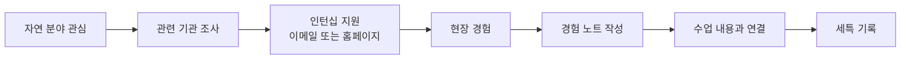

# 8개 왕국별 Activities · Awards · 자격증 종합 가이드 (중)
> **🌱 자연 왕국 · 🤝 연결 왕국 · 🏛️ 질서 왕국**
> 초·중·고별 / 난이도별 / 월별 / 지역별(국내·해외) / 제한별 / 과목별 / 온라인 — 다차원 정리

---

## 공통 URL·기사 레퍼런스 표 (자동완성 연동용)

### 🌱 자연 왕국

| 분류 | 기관/프로그램 | 공식 URL | 관련 기사/리포트 | 활용 메모 |
|---|---|---|---|---|
| 생태 | 국립생태원 | https://www.nie.re.kr | https://search.naver.com/search.naver?where=news&query=%EA%B5%AD%EB%A6%BD%EC%83%9D%ED%83%9C%EC%9B%90+%EC%B2%AD%EC%86%8C%EB%85%84 | 생태캠프 근거 링크 |
| 환경 | 국립환경과학원(NIER) | https://www.nier.go.kr | https://www.nier.go.kr/NIER/kor/board/list.do?menuNo=12001&bbsId=post | 환경 리포트 참조 |
| 해양 | 국립해양생물자원관(MABIK) | https://www.mabik.re.kr | https://search.naver.com/search.naver?where=news&query=%EA%B5%AD%EB%A6%BD%ED%95%B4%EC%96%91%EC%83%9D%EB%AC%BC%EC%9E%90%EC%9B%90%EA%B4%80 | 해양생물 활동 증빙 |
| 농업 | 농촌진흥청 | https://www.rda.go.kr | https://search.naver.com/search.naver?where=news&query=%EB%86%8D%EC%B4%8C%EC%A7%84%ED%9D%A5%EC%B2%AD+%EC%8A%A4%EB%A7%88%ED%8A%B8%ED%8C%9C | 스마트팜 진로 연계 |
| 수의 | 대한수의사회 | https://www.kvma.or.kr | https://search.naver.com/search.naver?where=news&query=%EB%8C%80%ED%95%9C%EC%88%98%EC%9D%98%EC%82%AC%ED%9A%8C+%EC%B2%AD%EC%86%8C%EB%85%84 | 수의 진로 특강 근거 |
| 국제 | Stockholm Junior Water Prize | https://www.siwi.org/prizes/stockholmjuniorwaterprize/ | https://search.naver.com/search.naver?where=news&query=Stockholm+Junior+Water+Prize | 국제 환경 대회 경로 |

### 🤝 연결 왕국

| 분류 | 기관/프로그램 | 공식 URL | 관련 기사/리포트 | 활용 메모 |
|---|---|---|---|---|
| 교육봉사 | 한국청소년활동진흥원(KYWA) | https://www.kywa.or.kr | https://search.naver.com/search.naver?where=news&query=%ED%95%9C%EA%B5%AD%EC%B2%AD%EC%86%8C%EB%85%84%ED%99%9C%EB%8F%99%EC%A7%84%ED%9D%A5%EC%9B%90 | 교육·봉사 활동 근거 |
| 상담 | 청소년상담복지개발원(KYCWA) | https://www.kyci.or.kr | https://search.naver.com/search.naver?where=news&query=%EC%B2%AD%EC%86%8C%EB%85%84%EC%83%81%EB%8B%B4%EB%B3%B5%EC%A7%80%EA%B0%9C%EB%B0%9C%EC%9B%90 | 또래상담/심리 활동 연동 |
| 봉사 | 1365 자원봉사포털 | https://www.1365.go.kr | https://search.naver.com/search.naver?where=news&query=1365+%EC%B2%AD%EC%86%8C%EB%85%84+%EB%B4%89%EC%82%AC | 봉사 이력 검증용 |
| 복지 | 사회복지협의회 | https://www.bokji.net | https://search.naver.com/search.naver?where=news&query=%EC%82%AC%ED%9A%8C%EB%B3%B5%EC%A7%80+%EC%B2%AD%EC%86%8C%EB%85%84 | 사회복지 진로 연계 |
| 국제봉사 | 유네스코한국위원회 | https://www.unesco.or.kr | https://search.naver.com/search.naver?where=news&query=%EC%9C%A0%EB%84%A4%EC%8A%A4%EC%BD%94+%EC%B2%AD%EC%86%8C%EB%85%84+%ED%94%84%EB%A1%9C%EA%B7%B8%EB%9E%A8 | 국제 봉사/교류 참고 |
| 보건 | 대한적십자사 | https://www.redcross.or.kr | https://search.naver.com/search.naver?where=news&query=%EC%A0%81%EC%8B%AD%EC%9E%90%EC%82%AC+%EC%B2%AD%EC%86%8C%EB%85%84+%EB%B3%B4%EA%B1%B4 | 보건봉사 연결 |

### 🏛️ 질서 왕국

| 분류 | 기관/프로그램 | 공식 URL | 관련 기사/리포트 | 활용 메모 |
|---|---|---|---|---|
| 법학 | 대한민국 법원 | https://www.scourt.go.kr | https://search.naver.com/search.naver?where=news&query=%EB%B2%95%EC%9B%90+%EC%B2%AD%EC%86%8C%EB%85%84+%EB%AA%A8%EC%9D%98%EC%9E%AC%ED%8C%90 | 모의재판 활동 근거 |
| 법교육 | 법무부 | https://www.moj.go.kr | https://search.naver.com/search.naver?where=news&query=%EB%B2%95%EB%AC%B4%EB%B6%80+%EC%B2%AD%EC%86%8C%EB%85%84+%EB%B2%95%EA%B5%90%EC%9C%A1 | 법교육 자료 출처 |
| 외교 | 외교부 | https://www.mofa.go.kr | https://search.naver.com/search.naver?where=news&query=%EC%99%B8%EA%B5%90%EB%B6%80+%EC%B2%AD%EC%86%8C%EB%85%84+%EC%99%B8%EA%B5%90 | 외교 아카데미 근거 |
| 의회 | 국회 | https://www.assembly.go.kr | https://search.naver.com/search.naver?where=news&query=%EA%B5%AD%ED%9A%8C+%EC%B2%AD%EC%86%8C%EB%85%84+%EC%B2%B4%ED%97%98 | 정책/입법 체험 자료 |
| 국제토론 | HMUN | https://www.harvardmun.org | https://search.naver.com/search.naver?where=news&query=HMUN+Korea | 국제 모의UN 경로 |
| 경제 | KDI | https://www.kdi.re.kr | https://www.kdi.re.kr/research/report | 경제·정책 리포트 참조 |

### 🧩 대회·자격증 URL/기사 매핑 (중편 공통)

| 항목유형 | 항목명 | 공식 URL | 관련 기사/리포트 | 자동완성 키워드 |
|---|---|---|---|---|
| Awards | 전국 청소년 토론대회 | https://www.koreadebate.or.kr | https://search.naver.com/search.naver?where=news&query=%EC%B2%AD%EC%86%8C%EB%85%84+%ED%86%A0%EB%A1%A0%EB%8C%80%ED%9A%8C | `토론`, `논증`, `발표` |
| Awards | HMUN | https://www.harvardmun.org | https://search.naver.com/search.naver?where=news&query=HMUN+student | `모의UN`, `외교`, `국제이슈` |
| Awards | Stockholm Junior Water Prize | https://www.siwi.org/prizes/stockholmjuniorwaterprize/ | https://search.naver.com/search.naver?where=news&query=Stockholm+Junior+Water+Prize | `수질연구`, `환경탐구` |
| Awards | 사회문제 해결 공모전 | https://www.semas.or.kr | https://search.naver.com/search.naver?where=news&query=%EC%82%AC%ED%9A%8C%EB%AC%B8%EC%A0%9C+%ED%95%B4%EA%B2%B0+%EA%B3%B5%EB%AA%A8%EC%A0%84 | `사회참여`, `프로젝트` |
| Certification | 또래상담사 | https://www.kyci.or.kr | https://search.naver.com/search.naver?where=news&query=%EB%98%90%EB%9E%98%EC%83%81%EB%8B%B4%EC%82%AC | `상담`, `공감`, `리더십` |
| Certification | BLS | https://www.kacpr.org | https://search.naver.com/search.naver?where=news&query=BLS+%EC%9E%90%EA%B2%A9 | `응급처치`, `보건` |
| Certification | 한국사능력검정시험 | https://www.historyexam.go.kr | https://search.naver.com/search.naver?where=news&query=%ED%95%9C%EA%B5%AD%EC%82%AC%EB%8A%A5%EB%A0%A5%EA%B2%80%EC%A0%95%EC%8B%9C%ED%97%98 | `역사`, `사회` |
| Certification | 사회조사분석사 | https://www.q-net.or.kr | https://search.naver.com/search.naver?where=news&query=%EC%82%AC%ED%9A%8C%EC%A1%B0%EC%82%AC%EB%B6%84%EC%84%9D%EC%82%AC | `설문`, `통계`, `분석` |

---

# 🌱 자연 왕국 — Activities · Awards · 자격증

> **소속 직업**: 환경공학자(07) · 수의사(08) · 스마트팜전문가(23) · 해양생물학자(24)

---

## 🌱-1. Activities (봉사 · 캠프 · 세미나 · 교육 프로그램)

### 초·중·고별 + 난이도별 Activities

| # | 프로그램명 | 대상 | 난이도 | 유형 | 주관 | 온/오프 | 비용 | URL |
|---|---------|------|-------|------|------|--------|------|-----|
| 1 | 국립과천과학관 자연관찰 캠프 | 초·중 | ★☆☆☆☆ | 캠프 | 과기정통부 | 오프라인 | 3~5만원 | [국립과천과학관](https://www.sciencecenter.go.kr) |
| 2 | 국립생태원 청소년 생태캠프 | 중·고 | ★★☆☆☆ | 캠프 | 환경부·국립생태원 | 오프라인 | 3~5만원 | [국립생태원](https://www.nie.re.kr) |
| 3 | 환경부 환경교육 캠프 | 중·고 | ★★★☆☆ | 캠프 | 환경부·국립환경과학원 | 오프라인 | 무료~3만원 | [환경부](https://www.me.go.kr) |
| 4 | 국립해양생물자원관 캠프 | 중·고 | ★★★☆☆ | 캠프 | 해양수산부 | 오프라인 | 무료 | [국립해양생물자원관](https://www.mabik.re.kr) |
| 5 | 농촌진흥청 스마트팜 체험 | 중·고 | ★★★☆☆ | 체험 | 농촌진흥청 | 오프라인 | 무료 | [농촌진흥청](https://www.rda.go.kr) |
| 6 | 서울대공원 동물원 봉사 | 중·고 | ★★☆☆☆ | 봉사 | 서울대공원 | 오프라인 | 무료 | [서울대공원](https://grandpark.seoul.go.kr) |
| 7 | 수의대 견학 프로그램 | 고1~2 | ★★★☆☆ | 체험 | 주요 수의대 | 오프라인 | 무료~3만원 | 각 수의대 입학처 홈페이지 |
| 8 | 대학 환경공학과 오픈랩 | 고1~2 | ★★★☆☆ | 체험 | 각 대학 | 오프라인 | 무료 | 각 대학 공과대학 홈페이지 |
| 9 | 국립해양과학관 체험 프로그램 | 중·고 | ★★☆☆☆ | 체험 | 해양수산부 | 오프라인 | 무료~3만원 | [국립해양과학관](https://www.kosm.kr) |
| 10 | 대한수의사회 진로 특강 | 고 | ★★☆☆☆ | 특강 | 대한수의사회 | 오프/온 | 무료 | [대한수의사회](https://www.kvma.or.kr) |
| 11 | K-MOOC "환경과학 개론" | 고1~2 | ★★★☆☆ | 온라인 | 교육부 | 온라인 | 무료 | [K-MOOC](https://www.kmooc.kr) |
| 12 | K-MOOC "스마트 농업 입문" | 고1~2 | ★★★☆☆ | 온라인 | 교육부 | 온라인 | 무료 | [K-MOOC](https://www.kmooc.kr) |

### 월별(시기별) Activities 캘린더

| 월 | 프로그램 | 유형 | 대상 |
|----|---------|------|------|
| 1~2월 | 국립생태원 겨울캠프, 환경부 겨울캠프 | 캠프 | 중·고 |
| 3~5월 | 과학영재교육원 선발, 갯벌 생태조사 시즌 | 교육·탐구 | 초~고 |
| 6~8월 | 환경교육 캠프(여름), 해양생물자원관 캠프, 스마트팜 체험, 수의대 견학 | 캠프·체험 | 중·고 |
| 9~11월 | 대학 오픈랩, 수확 시즌 스마트팜 방문 | 체험 | 고 |
| **연중** | K-MOOC(환경·농업), 동물원 봉사, 수의사회 특강 | 온라인·봉사 | 중·고 |

### 지역별(국내·해외) Activities

| 구분 | 프로그램 | 지역 | 비고 |
|------|---------|------|------|
| **국내 수도권** | 서울대공원 동물원 봉사, 국립과천과학관 | 경기 | 접근성 좋음 |
| **국내 충남** | 국립생태원 생태캠프 | 서천 | 숙박 캠프 |
| **국내 전남** | 국립해양생물자원관 | 서천 | 해양 전문 |
| **국내 전국** | 환경부 환경교육 캠프 | 전국 권역별 | 무료~3만원 |
| **국내 전국** | 농촌진흥청 스마트팜 체험 | 전국 스마트팜 단지 | 무료 |
| **해외 온라인** | K-MOOC "환경과학 개론" | 온라인 | 한국어 |
| **해외 온라인** | K-MOOC "스마트 농업 입문" | 온라인 | 한국어 |
| **해외 온라인** | Coursera "Environmental Science" | 온라인 | 영어 |

### 과목별 Activities 연결표

| 과목 | 추천 활동 | 세특 연결 키워드 | 적합 직업 |
|------|---------|-------------|---------|
| **지구과학Ⅱ** | 환경 캠프, 해양과학관, 대기질 분석 | 기후변화·해양산성화·대기오염 | 환경공학·해양생물학자 |
| **생명과학Ⅱ** | 생태캠프, 동물원 봉사, KBO 준비 | 생태학·유전학·동물행동 | 수의사·해양생물학자 |
| **화학Ⅱ** | 수질 분석 프로젝트, 환경오염 실험 | 미세플라스틱·수질·대기 | 환경공학자 |
| **정보** | IoT 스마트팜 프로젝트, 데이터 분석 | 센서·라즈베리파이·Python | 스마트팜전문가 |
| **환경(선택)** | 환경부 캠프, 탄소발자국 프로젝트 | ESG·탄소중립·제로에너지 | 환경공학자 |
| **농업생명(선택)** | 스마트팜 체험, 텃밭 프로젝트 | 수경재배·LED 파장·식물호르몬 | 스마트팜·수의사 |

### 봉사활동 추천

| 봉사 유형 | 대상 | 적합 직업 | 세특 연결 |
|---------|------|---------|---------|
| 유기동물 보호소 봉사 | 초·중·고 | 수의사 | 동물 복지 + 공감 |
| 학교 텃밭 관리 봉사 | 중·고 | 스마트팜 | 식물 재배 + 데이터 |
| 해변 정화 봉사 | 중·고 | 해양생물학자·환경공학 | 해양 환경 보전 |
| 교내 환경 캠페인 (절전·분리수거) | 중·고 | 환경공학자 | 탄소 감축 + 공동체 |
| 지역 하천 수질 모니터링 | 고 | 환경공학자·해양 | 환경 데이터 수집 |

### (추가) 국내·해외·온라인 Activities 확장 리스트 (초·중·고/난이도/월/지역/제한/과목)

| # | 활동/프로그램 | 대상 | 난이도 | 월(모집/진행) | 지역(국내/해외) | 제한 | 과목/분야 | 온/오프 | 산출물(기록 포인트) |
|---|---|---|---|---|---|---|---|---|---|
| 1 | **국립공원/생태 조사 ‘시민과학’**(조류·식생·곤충) | 초·중·고 | ★★☆☆☆ | 3~11월 | 국내 | 신청/선착 | 생명·지구 | 오프 | 관찰 데이터 + 분류 기준 |
| 2 | **iNaturalist/GBIF** 기반 생물종 기록 프로젝트 | 초·중·고 | ★★☆☆☆ | 연중 | 해외 | 무제한 | 생명 | 온라인 | 관찰로그(사진/좌표) + 분석 |
| 3 | **NASA GLOBE Observer**(대기·수문) 참여 | 중·고 | ★★★☆☆ | 연중 | 해외 | 무제한 | 지구과학 | 온라인 | 관측 기록 + 지역 비교 |
| 4 | **해양 쓰레기/미세플라스틱** 샘플링(학교·지역 연계) | 중·고 | ★★★☆☆ | 4~10월 | 국내 | 팀/학교연계 | 지구·화학 | 오프 | 샘플링 프로토콜 + 결과표 |
| 5 | **스마트팜 센서 설치·데이터 수집**(온습도/조도/EC) | 중·고 | ★★★☆☆ | 학기/방학 | 국내 | 팀 | 정보·농업 | 오프 | 센서 로그 + 제어 규칙(If-Then) |
| 6 | 해외 **환경·해양 온라인 여름학교**(데이터·정책 트랙) | 고 | ★★★★☆ | 6~8월 | 해외 | 선발/유료 | 지구·경제 | 온라인 | 최종 리포트(영문 가능) |
| 7 | **동물복지/수의 윤리 케이스 스터디**(학습+토론) | 중·고 | ★★★☆☆ | 연중 | 국내/해외 | 무제한 | 생명·윤리 | 온/오프 | 케이스 분석표 + 대안 제시 |
| 8 | **지역 기후 데이터 분석**(기온·강수·열섬) | 중·고 | ★★★☆☆ | 연중 | 국내/해외 | 무제한 | 수학·지구 | 온라인 | 분석 노트북 + 한계 |
| 9 | **현장 인터뷰**(농업기술센터/어촌계/환경공단) | 고 | ★★★☆☆ | 3~11월 | 국내 | 연락/승인 | 사회·지리 | 오프 | 인터뷰 질문지 + 인사이트 정리 |
| 10 | **제로웨이스트/탄소발자국 프로젝트**(학교 운영 개선) | 중·고 | ★★☆☆☆ | 학기 중 | 국내 | 학교 | 환경·사회 | 오프 | 개선 전후 지표(전력/쓰레기) |

---

## 🌱-2. Awards (대회 · 공모전)

### URL·기사 확장표 (🌱 Awards)

| 대회명 | 공식 URL | 관련 기사/리포트 | 자동완성 키 |
|---|---|---|---|
| 전국환경탐구대회 | https://www.me.go.kr | https://search.naver.com/search.naver?where=news&query=%EC%A0%84%EA%B5%AD%ED%99%98%EA%B2%BD%ED%83%90%EA%B5%AC%EB%8C%80%ED%9A%8C | `환경탐구`, `생태조사` |
| 청소년 환경 UCC 공모전 | https://www.me.go.kr | https://search.naver.com/search.naver?where=news&query=%ED%99%98%EA%B2%BD+UCC+%EA%B3%B5%EB%AA%A8%EC%A0%84 | `환경콘텐츠`, `캠페인` |
| 전국학생과학발명품경진대회 | https://www.kosac.re.kr | https://search.naver.com/search.naver?where=news&query=%ED%95%99%EC%83%9D%EA%B3%BC%ED%95%99%EB%B0%9C%EB%AA%85%ED%92%88%EA%B2%BD%EC%A7%84%EB%8C%80%ED%9A%8C | `발명`, `과학설계` |
| Stockholm Junior Water Prize | https://www.siwi.org/prizes/stockholmjuniorwaterprize/ | https://search.naver.com/search.naver?where=news&query=Stockholm+Junior+Water+Prize | `수질연구`, `국제대회` |

### 교내 수상 전략 (학기당 1개)

| 학기 | 추천 교내 대회 | 난이도 | 적합 직업 |
|------|------------|-------|---------|
| 고1 1학기 | 과학탐구대회 | ★★★☆☆ | 수의사·환경·해양 |
| 고1 2학기 | 환경 포스터/에세이 | ★★☆☆☆ | 환경공학·해양 |
| 고2 1학기 | 융합과학탐구대회 | ★★★★☆ | 4직업 공통 |
| 고2 2학기 | 학술제(환경 연구) | ★★★★☆ | 4직업 공통 |

### 교외 대회 — 국내

| # | 대회명 | 주관 | 대상 | 시기 | 난이도 | 온/오프 | 적합 직업 | 공식 URL | 관련 기사/리포트 |
|---|-------|------|------|------|-------|--------|---------|---------|-------------------|
| 1 | **환경부 환경보전 공모전** | 환경부 | 중·고 | 5~9월 | ★★★☆☆ | 온/오프 | 환경공학·해양 |
| 2 | **한국생물올림피아드(KBO)** | 한국생물과학협회 | 중·고 | 3~8월 | ★★★★★ | 오프라인 | 수의사·해양 |
| 3 | **청소년과학탐구대회** | 과학교육단체총연합회 | 중·고 | 5~8월 | ★★★☆☆ | 오프라인 | 4직업 공통 |
| 4 | **전국학생과학발명품경진대회** | 한국과학창의재단 | 초·중·고 | 4~9월 | ★★★☆☆ | 오프라인 | 스마트팜·환경 |
| 5 | **해양수산부 해양환경 공모전** | 해양수산부 | 중·고 | 6~10월 | ★★★☆☆ | 온/오프 | 해양생물학자 |
| 6 | **농업테크 해커톤** | 농촌진흥청·민간 | 고 | 연중 | ★★★★☆ | 오프라인 | 스마트팜 |
| 7 | **기후테크 해커톤** | 환경부·민간 | 고 | 연중 | ★★★★☆ | 오프라인 | 환경공학 |
| 8 | **전국 청소년 환경 포스터 공모전** | 환경부 | 초·중·고 | 5~8월 | ★★☆☆☆ | 온라인 제출 | 환경공학 |
| 9 | **한국동물보호연합 사진·에세이** | 한국동물보호연합 | 전 연령 | 연중 | ★★☆☆☆ | 온라인 제출 | 수의사 |
| 10 | **Arduino/IoT 프로젝트 공모전** | 과기정통부·각 대학 | 중·고 | 연중 | ★★★☆☆ | 온/오프 | 스마트팜·로봇 |

### 교외 대회 — 해외 / 국제

| # | 대회명 | 주관 | 대상 | 시기 | 온/오프 | 언어 | 난이도 | 적합 직업 | 공식 URL | 관련 기사/리포트 |
|---|-------|------|------|------|--------|------|-------|---------|---------|-------------------|
| 1 | **국제생물올림피아드(IBO)** | 국제학술단체 | 고(국가대표) | 7월 | 오프라인 | 영어 | ★★★★★ | 수의사·해양 |
| 2 | **Intel ISEF** | Intel·SSP | 고(국가대표) | 5월 | 오프라인 | 영어 | ★★★★★ | 4직업 공통 |
| 3 | **UN 환경 청소년 공모전** | UNEP | 전 연령 | 연중 | 온라인 | 영어 | ★★★☆☆ | 환경공학·해양 |
| 4 | **Stockholm Junior Water Prize** | SIWI(스웨덴) | 고 | 3~5월(국내예선) | 온/오프 | 영어 | ★★★★☆ | 환경공학·해양 |
| 5 | **국제로봇올림피아드(IRO)** (AgTech 트랙) | 국제위원회 | 중·고 | 6~8월 | 오프라인 | 영어 | ★★★★☆ | 스마트팜 |

### 대회 월별 캘린더

| 월 | 국내 대회 | 해외 대회 |
|----|---------|---------|
| 3~5월 | KBO 예선, 환경 포스터, 발명품경진 | Stockholm Water Prize(국내예선) |
| 5~8월 | 청소년과학탐구, 환경보전 공모전, KBO 본선 | IBO(7월), Intel ISEF(5월) |
| 6~10월 | 해양환경 공모전, 농업테크 해커톤 | IRO(6~8월) |
| 연중 | 기후테크 해커톤, IoT 공모전, 동물보호 에세이 | UN 환경 공모전 |

### (추가) Awards 확장 리스트 (국내·해외/온라인/제한/과목)

| # | 대회/공모전 | 국내/해외 | 대상 | 시기 | 난이도 | 제한 | 과목/분야 | 온/오프 | “기록”으로 남길 핵심 |
|---|---|---|---|---|---|---|---|---|---|
| 1 | **Ocean Awareness Contest**(해양·기후) | 해외 | 중·고 | 연중 | ★★★☆☆ | 영어 | 지구·미술·국어 | 온라인 | 메시지(문제→해결) 구조 |
| 2 | **The Earth Prize**(청소년 환경 프로젝트) | 해외 | 중·고 | 1~5월 | ★★★★☆ | 팀 | 환경·융합 | 온라인 | 지역 문제의 ‘측정’ 지표 |
| 3 | **Zayed Sustainability Prize**(청소년/학교 프로젝트) | 해외 | 중·고 | 6~10월 | ★★★★☆ | 팀/학교 | ESG·환경 | 온라인 | 임팩트(확장성) 근거 |
| 4 | **International Green/Sustainability Challenge**(온라인 제출형) | 해외 | 중·고 | 연중 | ★★★☆☆ | 무제한 | 환경·공학 | 온라인 | 프로토타입/실험 근거 |
| 5 | **청소년 기후정책 제안 공모**(지자체/기관) | 국내 | 중·고 | 5~10월 | ★★★☆☆ | 서류 | 사회·환경 | 온라인 | 정책 대안의 비용/효과 |
| 6 | **동물복지·수의학 에세이/포스터 공모** | 국내/해외 | 중·고 | 연중 | ★★~★★★★ | 서류 | 생명·윤리 | 온라인 | 근거(인용) + 반대 논리 |
| 7 | **AgTech/스마트팜 아이디어 공모**(센서·데이터) | 국내/해외 | 중·고 | 연중 | ★★★★☆ | 팀 | 정보·농업 | 온/오프 | 데이터 설계(센서/주기) |
| 8 | **물·수질 프로젝트 경진**(지역 하천/정수) | 국내/해외 | 중·고 | 3~9월 | ★★★☆☆ | 팀 | 화학·지구 | 온/오프 | 샘플링·오차·재현성 |

---

## 🌱-3. 자격증 (Certification)

### URL·기사 확장표 (🌱 자격증)

| 자격증명 | 공식 URL | 관련 기사/리포트 | 자동완성 키 |
|---|---|---|---|
| 환경기능사 | https://www.q-net.or.kr | https://search.naver.com/search.naver?where=news&query=%ED%99%98%EA%B2%BD%EA%B8%B0%EB%8A%A5%EC%82%AC | `환경기초`, `오염관리` |
| 유기농업기능사 | https://www.q-net.or.kr | https://search.naver.com/search.naver?where=news&query=%EC%9C%A0%EA%B8%B0%EB%86%8D%EC%97%85%EA%B8%B0%EB%8A%A5%EC%82%AC | `스마트팜`, `농업기술` |
| 스쿠버다이빙 자격 | https://www.padi.com | https://search.naver.com/search.naver?where=news&query=%EC%8A%A4%EC%BF%A0%EB%B2%84+%EC%9E%90%EA%B2%A9 | `해양탐사`, `현장역량` |
| DIAT/ITQ | https://license.kpc.or.kr | https://search.naver.com/search.naver?where=news&query=ITQ+DIAT | `디지털기초`, `문서정리` |

### 초·중·고별 + 난이도별 자격증

| 취득 시기 | 자격증명 | 주관 | 난이도 | 비용 | 적합 직업 | 공식 URL | 관련 기사/리포트 |
|---------|--------|------|-------|------|---------|---------|-------------------|
| **중2~고1** | 컴퓨터활용능력 2급 | 대한상공회의소 | ★★☆☆☆ | 1.9만원 | 4직업 공통 |
| **중3~고1** | BLS (기본생명구조술) | 대한심폐소생협회 | ★☆☆☆☆ | 5~8만원 | 수의사 |
| **중2~고1** | 응급처치 자격 | 대한적십자사 | ★☆☆☆☆ | 3만원 | 수의사 |
| **고1** | 정보처리기능사 | 한국산업인력공단 | ★★☆☆☆ | 1.9만원 | 스마트팜·해양 |
| **고1** | COS Pro 2급 (Python) | YBM | ★★☆☆☆ | 3만원 | 스마트팜·환경·해양 |
| **고2** | 환경기능사 | 한국산업인력공단 | ★★☆☆☆ | 1.9만원 | 환경공학자 |
| **고2** | 유기농업기능사 | 한국산업인력공단 | ★★☆☆☆ | 1.9만원 | 스마트팜전문가 |
| **고1~2** | 스쿠버다이빙 (오픈워터) | PADI/SSI | ★★★☆☆ | 30~50만원 | 해양생물학자 |

### 자격증 — 직업별 추천 조합

| 직업 | 중학교 | 고1 | 고2 | 면접 활용 |
|------|--------|-----|-----|---------|
| **환경공학자** | 컴활 2급 | COS Pro 2급 | 환경기능사 | "환경 분석 전문성 + 데이터 역량" |
| **수의사** | 워드프로세서 | BLS, 응급처치 | TOEFL | "생명존중 + 응급 대응력" |
| **스마트팜** | 컴활 2급 | 정보처리기능사, COS Pro 2급 | 유기농업기능사 | "IoT+농업 융합 역량" |
| **해양생물학자** | 컴활 2급 | COS Pro 2급, 정보처리기능사 | 스쿠버다이빙 | "현장 연구 + 데이터 분석" |

## 🌱-4. 역량(Competency) — 섹션별 서술(세특·면접 연결)

| 역량 섹션 | 무엇을 보여주나 | 활동/산출물(추천) | 학생부·면접 연결 문장(예시) |
|---|---|---|---|
| **현장 관찰·기록** | 자연 기반 탐구의 출발점 | 관찰일지(장소·조건·사진) | “현장 관찰을 데이터로 바꾸어 탐구로 확장했다.” |
| **측정·데이터 처리** | 근거 중심 사고 | 샘플링 프로토콜 + 오차/한계 | “측정 오차를 통제하고 결과 해석의 한계를 제시했다.” |
| **지속가능·윤리** | 공공성/생명존중 | 탄소/생태 영향 평가 | “개선안이 실제 생활에서 지속가능한지 검증했다.” |
| **융합(생물·지구·정보)** | 다학제 연결 | 센서/데이터 + 생태 해석 | “기술을 목적이 아니라 관찰을 확장하는 도구로 썼다.” |
| **협업(현장·기관)** | 사회적 연결 | 기관 인터뷰/협력 기록 | “지역 이해관계자 관점까지 반영해 해결책을 설계했다.” |
| **커뮤니케이션** | 설득력 | 1페이지 인포그래픽/포스터 | “데이터를 시각화해 누구나 이해하도록 전달했다.” |

---

# 🤝 연결 왕국 — Activities · Awards · 자격증

> **소속 직업**: 교사(09) · 심리상담사(10) · 간호사(25) · 사회복지사(26)

---

## 🤝-1. Activities (봉사 · 캠프 · 세미나 · 교육 프로그램)

### 초·중·고별 + 난이도별 Activities

| # | 프로그램명 | 대상 | 난이도 | 유형 | 주관 | 온/오프 | 비용 | URL |
|---|---------|------|-------|------|------|--------|------|-----|
| 1 | 또래상담 교육 프로그램 | 중·고 | ★★☆☆☆ | 교육 | 여성가족부 | 오프라인 | 무료 | [청소년상담복지개발원](https://www.kyci.or.kr) |
| 2 | 대한적십자사 RCY 캠프 | 중·고 | ★★☆☆☆ | 캠프·봉사 | 대한적십자사 | 오프라인 | 무료~5만원 | [대한적십자사](https://www.redcross.or.kr) |
| 3 | 유니세프 청소년 봉사단 | 중·고 | ★★☆☆☆ | 봉사 | 유니세프한국위 | 오프/온 | 무료 | [유니세프한국위원회](https://www.unicef.or.kr) |
| 4 | 사범대 교육실습 체험 캠프 | 고1~2 | ★★★☆☆ | 체험 | 주요 사범대 | 오프라인 | 무료 | 각 대학 사범대 홈페이지 |
| 5 | 한국교육과정평가원 진로 세미나 | 고 | ★★★☆☆ | 세미나 | 한국교육과정평가원 | 오프/온 | 무료 | [KICE](https://www.kice.re.kr) |
| 6 | 대한심리학회 청소년 심리학 특강 | 고 | ★★★☆☆ | 특강 | 대한심리학회 | 오프/온 | 무료~3만원 | [대한심리학회](https://www.koreanpsychology.or.kr) |
| 7 | 간호대학 체험 프로그램 | 고1~2 | ★★★☆☆ | 체험 | 주요 간호대학 | 오프라인 | 무료~3만원 | 각 대학 간호대학 홈페이지 |
| 8 | 사회복지 현장실습 체험 | 고1~2 | ★★★☆☆ | 체험 | 각 지역 복지관 | 오프라인 | 무료 | [복지넷](https://www.bokji.net) |
| 9 | 에듀테크 앱 분석 워크숍 | 고 | ★★★☆☆ | 워크숍 | 각 교육기관 | 오프/온 | 무료~5만원 | [KERIS](https://www.keris.or.kr) |
| 10 | K-MOOC "교육심리학" | 고1~2 | ★★★☆☆ | 온라인 | 교육부 | 온라인 | 무료 | [K-MOOC](https://www.kmooc.kr) |
| 11 | K-MOOC "간호학 개론" | 고1~2 | ★★★☆☆ | 온라인 | 교육부 | 온라인 | 무료 | [K-MOOC](https://www.kmooc.kr) |
| 12 | K-MOOC "사회복지학 개론" | 고1~2 | ★★★☆☆ | 온라인 | 교육부 | 온라인 | 무료 | [K-MOOC](https://www.kmooc.kr) |

### 월별 Activities 캘린더

| 월 | 프로그램 | 유형 |
|----|---------|------|
| 3~5월 | 또래상담 교육, 유니세프 봉사단 모집 | 교육·봉사 |
| 7~8월 | 사범대 체험 캠프, 간호대 체험, RCY 여름캠프 | 캠프·체험 |
| 9~11월 | 심리학 특강, 교육과정평가원 세미나 | 세미나 |
| 12~2월 | RCY 겨울캠프, 복지관 방학 봉사 | 캠프·봉사 |
| **연중** | K-MOOC(교육심리·간호·복지), 또래상담, 봉사 | 온라인·봉사 |

### 지역별 Activities

| 구분 | 프로그램 | 지역 | 비고 |
|------|---------|------|------|
| **국내 수도권** | 서울 주요 사범대·간호대 체험 | 서울 | 여름 |
| **국내 전국** | 또래상담 교육 (각 학교) | 전국 | 학기 중 |
| **국내 전국** | RCY 캠프 | 전국 권역별 | 방학 |
| **국내 전국** | 지역 복지관 현장 체험 | 전국 | 방학 |
| **해외 온라인** | K-MOOC 교육심리·간호·복지 | 온라인 | 한국어 |
| **해외 온라인** | Coursera "Psychology" (예일대) | 온라인 | 영어 |

### 과목별 Activities 연결표

| 과목 | 추천 활동 | 세특 연결 키워드 | 적합 직업 |
|------|---------|-------------|---------|
| **심리학(선택)** | 또래상담, 심리학 특강, 봉사 | CBT·ZPD·인지발달 | 심리상담사·교사 |
| **교육학(선택)** | 사범대 체험, 멘토링 봉사 | 블룸 분류학·교육목표 | 교사 |
| **생명과학Ⅰ** | 간호대 체험, BLS 취득 | 면역체계·뇌과학 | 간호사·심리상담사 |
| **사회문화** | 복지관 봉사, 유니세프 | 아동빈곤·불평등·TIC | 사회복지사 |
| **보건(선택)** | 건강 캠페인, 간호 체험 | EBN·건강증진 | 간호사 |

### 봉사활동 추천 (연결 왕국 핵심!)

| 봉사 유형 | 대상 | 시간 목표 | 적합 직업 | 세특 연결 |
|---------|------|---------|---------|---------|
| 지역아동센터 학습 멘토링 | 중·고 | 누적 60시간+ | 교사 | 교육 격차 해소 경험 |
| 또래 상담 활동 | 중·고 | 주 1회 | 심리상담사·교사 | 공감·경청 역량 |
| 노인복지관 말벗 봉사 | 중·고 | 누적 30시간+ | 사회복지사 | 노인 고독 이해 |
| 다문화 학생 한국어 지도 | 중·고 | 주 1회 | 교사 | 문화공감·맞춤교육 |
| 병원·보건소 봉사 | 중·고 | 누적 50시간+ | 간호사 | 환자 돌봄 현장 |
| 장애인복지관 활동 보조 | 중·고 | 누적 30시간+ | 사회복지사 | 사회적 포용 |
| 푸드뱅크 봉사 | 중·고 | 누적 20시간+ | 사회복지사 | 빈곤 문제 이해 |

### (추가) 국내·해외·온라인 Activities 확장 리스트 (초·중·고/난이도/월/지역/제한/과목)

| # | 활동/프로그램 | 대상 | 난이도 | 월(모집/진행) | 지역(국내/해외) | 제한 | 과목/분야 | 온/오프 | 산출물(기록 포인트) |
|---|---|---|---|---|---|---|---|---|---|
| 1 | **청소년상담복지센터** 프로그램 참여/보조(지역별) | 중·고 | ★★★☆☆ | 연중 | 국내 | 기관 승인 | 심리·사회 | 오프 | 활동일지(윤리/비밀보장 포함) |
| 2 | **학습 설계 미니프로젝트**(수업안·평가지) 제작 | 중·고 | ★★★☆☆ | 학기 중 | 국내/해외 | 무제한 | 교육학 | 오프/온 | 수업안(목표-활동-평가) |
| 3 | **특수교육/다문화 교육 보조**(자료 제작) | 고 | ★★★☆☆ | 연중 | 국내 | 학교/기관 | 교육·사회 | 오프 | 자료(차시) + 피드백 반영 |
| 4 | **건강교육 콘텐츠 제작**(손씻기·영양·정신건강) | 중·고 | ★★☆☆☆ | 연중 | 국내/해외 | 무제한 | 보건·국어 | 온라인 | 카드뉴스/영상 + 근거 출처 |
| 5 | 해외 **Psychology/Teaching 온라인 코스**(프로젝트형) | 고 | ★★★★☆ | 연중 | 해외 | 무제한/유료 선택 | 심리·교육 | 온라인 | 과제(케이스 분석) |
| 6 | **돌봄기관 인터뷰 리서치**(아동/노인/장애) | 고 | ★★★☆☆ | 3~11월 | 국내 | 기관 승인 | 사회문화 | 오프 | 인터뷰 질문지 + 인사이트 |
| 7 | **갈등조정/또래중재 역할극**(루브릭 운영) | 중·고 | ★★★☆☆ | 학기 중 | 국내 | 동아리 | 윤리·국어 | 오프 | 루브릭 + 사후 성찰 |
| 8 | **정신건강/자살예방 캠페인**(학교 주관) | 중·고 | ★★★☆☆ | 3~11월 | 국내 | 학교 | 보건·윤리 | 오프 | 캠페인 KPI(참여/설문) |
| 9 | **국제 원격 봉사**(튜터링/번역/콘텐츠) | 고 | ★★★☆☆ | 연중 | 해외 | 영어 선택 | 영어·사회 | 온라인 | 활동 로그 + 대상자 변화 |

---

## 🤝-2. Awards (대회 · 공모전)

### URL·기사 확장표 (🤝 Awards)

| 대회명 | 공식 URL | 관련 기사/리포트 | 자동완성 키 |
|---|---|---|---|
| 전국 청소년 토론대회 | https://www.koreadebate.or.kr | https://search.naver.com/search.naver?where=news&query=%EC%A0%84%EA%B5%AD+%EC%B2%AD%EC%86%8C%EB%85%84+%ED%86%A0%EB%A1%A0%EB%8C%80%ED%9A%8C | `토론`, `논증` |
| 또래상담 우수 사례 발표 | https://www.kyci.or.kr | https://search.naver.com/search.naver?where=news&query=%EB%98%90%EB%9E%98%EC%83%81%EB%8B%B4+%EC%9A%B0%EC%88%98+%EC%82%AC%EB%A1%80 | `상담사례`, `공감역량` |
| 전국 자원봉사 공모전 | https://www.1365.go.kr | https://search.naver.com/search.naver?where=news&query=%EC%A0%84%EA%B5%AD+%EC%9E%90%EC%9B%90%EB%B4%89%EC%82%AC+%EA%B3%B5%EB%AA%A8%EC%A0%84 | `봉사`, `사회참여` |
| OECD 청소년 교육 정책 에세이 | https://www.oecd.org/education/ | https://search.naver.com/search.naver?where=news&query=OECD+youth+education+essay | `교육정책`, `영어에세이` |

### 교내 수상 전략 (학기당 1개)

| 학기 | 추천 교내 대회 | 난이도 | 적합 직업 |
|------|------------|-------|---------|
| 고1 1학기 | 토론대회 | ★★☆☆☆ | 교사·사회복지사 |
| 고1 2학기 | 독서토론대회 | ★★☆☆☆ | 교사·심리상담사 |
| 고2 1학기 | 사회탐구대회 | ★★★☆☆ | 4직업 공통 |
| 고2 2학기 | 학술제(연구 발표) | ★★★★☆ | 4직업 공통 |

### 교외 대회 — 국내

| # | 대회명 | 주관 | 대상 | 시기 | 난이도 | 온/오프 | 적합 직업 | 공식 URL | 관련 기사/리포트 |
|---|-------|------|------|------|-------|--------|---------|---------|-------------------|
| 1 | **전국 청소년 토론대회** | KBS·한국토론학회 | 중·고 | 5~11월 | ★★★☆☆ | 오프라인 | 교사·사회복지사 |
| 2 | **전국 독서토론대회** | 교육부·한국도서관협회 | 중·고 | 5~10월 | ★★★☆☆ | 오프라인 | 교사·심리상담사 |
| 3 | **또래 상담 우수 사례 발표** | 한국청소년상담복지개발원 | 고 | 10~11월 | ★★★☆☆ | 오프라인 | 심리상담사 |
| 4 | **전국 자원봉사 공모전** | 행정안전부 | 중·고 | 7~10월 | ★★☆☆☆ | 온/오프 | 사회복지사·간호사 |
| 5 | **사회문제 해결 아이디어 공모전** | 중소벤처기업부 | 중·고 | 6~10월 | ★★★☆☆ | 온/오프 | 사회복지사·교사 |
| 6 | **건강증진 캠페인 공모전** | 보건복지부 | 중·고 | 5~9월 | ★★★☆☆ | 온/오프 | 간호사 |
| 7 | **에듀테크 아이디어 공모전** | 교육부·에듀테크협회 | 고 | 연중 | ★★★★☆ | 온/오프 | 교사(에듀테크) |
| 8 | **심리학 에세이 공모전** | 대한심리학회 | 고 | 연중 | ★★★☆☆ | 온라인 | 심리상담사 |
| 9 | **전국 학생 멘토링 우수 사례** | 교육부 | 중·고 | 10~12월 | ★★☆☆☆ | 온/오프 | 교사 |
| 10 | **국제 봉사 에세이 공모전** | 유니세프·월드비전 | 중·고 | 연중 | ★★☆☆☆ | 온라인 | 사회복지사 |

### 교외 대회 — 해외 / 국제

| # | 대회명 | 주관 | 대상 | 온/오프 | 언어 | 난이도 | 적합 직업 | 공식 URL | 관련 기사/리포트 |
|---|-------|------|------|--------|------|-------|---------|---------|-------------------|
| 1 | **유니세프 세계시민 에세이** | 유니세프 | 중·고 | 온라인 | 한/영 | ★★☆☆☆ | 사회복지사·교사 |
| 2 | **월드비전 글로벌 봉사 에세이** | 월드비전 | 중·고 | 온라인 | 한/영 | ★★☆☆☆ | 사회복지사 |
| 3 | **OECD 청소년 교육 정책 에세이** | OECD | 고 | 온라인 | 영어 | ★★★★☆ | 교사·사회복지사 |

### (추가) Awards 확장 리스트 (국내·해외/온라인/제한/과목)

| # | 대회/공모전 | 국내/해외 | 대상 | 시기 | 난이도 | 제한 | 과목/분야 | 온/오프 | “기록”으로 남길 핵심 |
|---|---|---|---|---|---|---|---|---|---|
| 1 | **World Scholar’s Cup**(토론·퀴즈·에세이) | 해외 | 중·고 | 연중 | ★★★☆☆ | 팀 | 국어·영어·사회 | 온/오프 | 역할(토론/에세이) 분담 근거 |
| 2 | **청소년 심리·상담 에세이/사례 분석 공모** | 국내 | 고 | 연중 | ★★★☆☆ | 서류 | 심리 | 온라인 | 윤리(익명화) + 근거 |
| 3 | **사회문제 해결형 프로젝트 경진**(복지/교육/보건) | 국내/해외 | 중·고 | 5~11월 | ★★★★☆ | 팀 | 사회·보건 | 온/오프 | 문제정의(대상자) 명확성 |
| 4 | **건강/간호 스토리텔링 공모**(환자경험·커뮤니케이션) | 국내/해외 | 중·고 | 연중 | ★★~★★★★ | 서류 | 보건·국어 | 온라인 | 공감+정보 정확성 |
| 5 | **국제 시민교육/인권 에세이** | 해외 | 중·고 | 연중 | ★★~★★★★ | 영어 선택 | 사회·윤리 | 온라인 | 반대 논거까지 포함한 균형 |

---

## 🤝-3. 자격증 (Certification)

### URL·기사 확장표 (🤝 자격증)

| 자격증명 | 공식 URL | 관련 기사/리포트 | 자동완성 키 |
|---|---|---|---|
| 또래상담사 인증 | https://www.kyci.or.kr | https://search.naver.com/search.naver?where=news&query=%EB%98%90%EB%9E%98%EC%83%81%EB%8B%B4%EC%82%AC | `상담`, `의사소통` |
| BLS | https://www.kacpr.org | https://search.naver.com/search.naver?where=news&query=BLS+%EC%9E%90%EA%B2%A9 | `응급대응`, `보건` |
| 응급처치 자격 | https://www.redcross.or.kr | https://search.naver.com/search.naver?where=news&query=%EC%9D%91%EA%B8%89%EC%B2%98%EC%B9%98+%EC%A0%81%EC%8B%AD%EC%9E%90%EC%82%AC | `안전`, `간호기초` |
| 사회조사분석사 2급 | https://www.q-net.or.kr | https://search.naver.com/search.naver?where=news&query=%EC%82%AC%ED%9A%8C%EC%A1%B0%EC%82%AC%EB%B6%84%EC%84%9D%EC%82%AC+2%EA%B8%89 | `설문분석`, `복지데이터` |

### 초·중·고별 + 난이도별 자격증

| 취득 시기 | 자격증명 | 주관 | 난이도 | 비용 | 적합 직업 | 공식 URL | 관련 기사/리포트 |
|---------|--------|------|-------|------|---------|---------|-------------------|
| **중2~고1** | 또래상담사 인증 | 한국청소년상담복지개발원 | ★☆☆☆☆ | 무료 | 심리상담사·교사 |
| **중2~고1** | 워드프로세서 | 대한상공회의소 | ★★☆☆☆ | 1.9만원 | 4직업 공통 |
| **중3~고1** | 컴퓨터활용능력 2급 | 대한상공회의소 | ★★☆☆☆ | 1.9만원 | 4직업 공통 |
| **중3~고1** | BLS (기본생명구조술) | 대한심폐소생협회 | ★☆☆☆☆ | 5~8만원 | 간호사·교사 |
| **중2~고1** | 응급처치 자격 | 대한적십자사 | ★☆☆☆☆ | 3만원 | 간호사·사회복지사 |
| **중3~고1** | 한국사능력검정시험 1급 | 국사편찬위원회 | ★★★☆☆ | 1만원 | 교사(사회/역사) |
| **고1~2** | TOEIC | ETS | ★★★☆☆ | 5.2만원 | 4직업 공통 |
| **고2** | 사회조사분석사 2급 | 한국산업인력공단 | ★★★☆☆ | 1.9만원 | 사회복지사·심리상담사 |

### 자격증 — 직업별 추천 조합

| 직업 | 중학교 | 고1 | 고2 | 면접 활용 |
|------|--------|-----|-----|---------|
| **교사** | 또래상담사, 워드프로세서 | 한국사 1급, BLS | TOEIC | "교육 봉사 경험 + 인문학 소양" |
| **심리상담사** | 또래상담사, 컴활 2급 | TOEIC | 사회조사분석사 | "상담 인증 + 연구방법론 역량" |
| **간호사** | 워드프로세서, BLS | 응급처치, 컴활 2급 | TOEIC | "생명구조 실습 + 현장 대응력" |
| **사회복지사** | 또래상담사, 워드프로세서 | 응급처치, 컴활 2급 | 사회조사분석사 | "봉사 정신 + 데이터 분석 역량" |

## 🤝-4. 역량(Competency) — 섹션별 서술(세특·면접 연결)

| 역량 섹션 | 무엇을 보여주나 | 활동/산출물(추천) | 학생부·면접 연결 문장(예시) |
|---|---|---|---|
| **공감·윤리** | 대상자 존중/비밀보장 | 윤리 체크리스트 + 익명화 규칙 | “도움의 결과보다 과정의 윤리를 우선했다.” |
| **관찰·기록(리플렉션)** | 성장/메타인지 | 주간 성찰(문제-대응-개선) | “반복 봉사로 패턴을 발견하고 개선했다.” |
| **교육/상담 설계** | 구조화 능력 | 수업안/상담 대화 스크립트(역할극) | “목표-활동-평가로 프로그램을 설계했다.” |
| **현장 이해(보건·복지)** | 직업 이해도 | 기관 인터뷰 + 사례 요약 | “현장의 제약을 반영한 해결책을 제시했다.” |
| **협업·조정** | 팀워크/리더십 | 역할 분담표 + 갈등조정 기록 | “팀 내 갈등을 중재해 지속 가능한 운영을 만들었다.” |
| **커뮤니케이션** | 전달력/설득력 | 카드뉴스/발표 자료 | “전문용어를 쉬운 언어로 번역해 전달했다.” |

---

# 🏛️ 질서 왕국 — Activities · Awards · 자격증

> **소속 직업**: 변호사(11) · 외교관(12) · 회계사·세무사(27) · 프로파일러(28)

---

## 🏛️-1. Activities (봉사 · 캠프 · 세미나 · 교육 프로그램)

### 초·중·고별 + 난이도별 Activities

| # | 프로그램명 | 대상 | 난이도 | 유형 | 주관 | 온/오프 | 비용 | URL |
|---|---------|------|-------|------|------|--------|------|-----|
| 1 | 법무부 법교육 캠프 | 중·고 | ★★☆☆☆ | 캠프 | 법무부 | 오프라인 | 무료 | [법무부](https://www.moj.go.kr) |
| 2 | 헌법재판소 청소년 헌법교실 | 중·고 | ★★★☆☆ | 교육 | 헌법재판소 | 오프라인 | 무료 | [헌법재판소](https://www.ccourt.go.kr) |
| 3 | 대한변호사협회 청소년 법치교실 | 중·고 | ★★☆☆☆ | 교육 | 대한변호사협회 | 오프라인 | 무료 | [대한변호사협회](https://www.koreanbar.or.kr) |
| 4 | 외교부 청소년 외교캠프 | 고1~2 | ★★★★☆ | 캠프 | 외교부 | 오프라인 | 무료 | [외교부](https://www.mofa.go.kr) |
| 5 | 한국은행 경제캠프 | 중·고 | ★★★☆☆ | 캠프 | 한국은행 | 오프라인 | 무료 | [한국은행](https://www.bok.or.kr) |
| 6 | 금융감독원 금융교육 | 중·고 | ★★☆☆☆ | 교육 | 금융감독원 | 오프/온 | 무료 | [금융감독원 e-금융교육](https://www.fss.or.kr) |
| 7 | 국세청 세금교실 | 중·고 | ★★☆☆☆ | 교육 | 국세청 | 오프/온 | 무료 | [국세청](https://www.nts.go.kr) |
| 8 | 경찰청 프로파일러 진로 특강 | 고 | ★★★☆☆ | 특강 | 경찰청 | 오프라인 | 무료 | [경찰청](https://www.police.go.kr) |
| 9 | POSTECH 영재기업인교육원 | 중·고 | ★★★★☆ | 연중교육 | 포스텍 | 오프라인 | 무료 | [POSTECH 영재기업인](https://gifted.postech.ac.kr) |
| 10 | K-MOOC "형법 총론" | 고2 | ★★★★☆ | 온라인 | 교육부 | 온라인 | 무료 | [K-MOOC](https://www.kmooc.kr) |
| 11 | K-MOOC "국제관계론" | 고1~2 | ★★★☆☆ | 온라인 | 교육부 | 온라인 | 무료 | [K-MOOC](https://www.kmooc.kr) |
| 12 | K-MOOC "회계원리" | 고1~2 | ★★★☆☆ | 온라인 | 교육부 | 온라인 | 무료 | [K-MOOC](https://www.kmooc.kr) |

### 월별 Activities 캘린더

| 월 | 프로그램 | 유형 |
|----|---------|------|
| 1~2월 | 한국은행 겨울 경제캠프 | 캠프 |
| 3~5월 | 법무부 법교육, 헌법교실, 변호사회 법치교실 | 교육 |
| 7~8월 | 외교부 외교캠프, 한국은행 여름캠프, 법교육 캠프 | 캠프 |
| 9~11월 | 금융감독원 교육, 국세청 세금교실 | 교육 |
| **연중** | K-MOOC(형법·국제관계·회계), 경찰청 특강 | 온라인·특강 |

### 지역별 Activities

| 구분 | 프로그램 | 지역 | 비고 |
|------|---------|------|------|
| **국내 서울** | 헌법재판소 헌법교실, 법무부 법교육 | 서울 종로 | 현장 체험 |
| **국내 서울** | 외교부 외교캠프 | 서울 외교부 | 여름(고1~2) |
| **국내 서울** | 한국은행 경제캠프 | 서울 중구 | 방학 |
| **국내 전국** | 금융감독원 교육, 국세청 세금교실 | 전국 | 연중 |
| **국내 포항** | POSTECH 영재기업인 | 포항 | 연중 |
| **해외 온라인** | K-MOOC 형법·국제관계·회계 | 온라인 | 한국어 |
| **해외 온라인** | Coursera "International Relations" | 온라인 | 영어 |

### 과목별 Activities 연결표

| 과목 | 추천 활동 | 세특 연결 키워드 | 적합 직업 |
|------|---------|-------------|---------|
| **정치와법** | 법교육 캠프, 헌법교실, 모의재판 | 헌법 판례·법적 논증 | 변호사·프로파일러 |
| **세계사** | 외교캠프, MUN, 국제관계론 | 웨스트팔리아·UN개혁 | 외교관 |
| **경제** | 한국은행 캠프, 금융교육, 세금교실 | 재무제표·조세정의 | 회계사·세무사 |
| **심리학(선택)** | 프로파일러 특강, 범죄심리 독서 | 인지왜곡·도덕적이탈 | 프로파일러 |
| **영어** | 외교 에세이, 영문 판례 분석 | TED 수사학·법률영어 | 외교관·변호사 |
| **제2외국어** | 외교캠프, 어학 자격 | 프랑코포니·UN공용어 | 외교관 |

### 봉사활동 추천

| 봉사 유형 | 대상 | 적합 직업 | 세특 연결 |
|---------|------|---------|---------|
| 법률 교육 봉사 (저학년 인권교육) | 중·고 | 변호사 | 법적 논리 + 소통 |
| 다문화 학생 지원 봉사 | 중·고 | 외교관 | 다문화 공감 |
| 지역 세금 홍보 캠페인 | 고 | 회계사·세무사 | 조세 교육 + 공동체 |
| 시사 토론 동아리 운영 | 중·고 | 4직업 공통 | 논증·분석·설득 |

### (추가) 국내·해외·온라인 Activities 확장 리스트 (초·중·고/난이도/월/지역/제한/과목)

| # | 활동/프로그램 | 대상 | 난이도 | 월(모집/진행) | 지역(국내/해외) | 제한 | 과목/분야 | 온/오프 | 산출물(기록 포인트) |
|---|---|---|---|---|---|---|---|---|---|
| 1 | **모의재판/모의국회** 동아리 운영(케이스 기반) | 중·고 | ★★★★☆ | 학기 중 | 국내 | 동아리 | 정치와법·국어 | 오프 | 논증 구조도 + 판결문 초안 |
| 2 | **국회·법원·대사관** 견학 + 정책 브리프 작성 | 중·고 | ★★★☆☆ | 3~11월 | 국내 | 선착/승인 | 사회·역사 | 오프 | 1페이지 정책 브리프 |
| 3 | **경제·회계 데이터 실습**(재무제표 읽기) | 중·고 | ★★★☆☆ | 연중 | 국내/해외 | 무제한 | 경제 | 온라인 | 기업 1개 분석 리포트 |
| 4 | **MUN 훈련**(리서치→포지션페이퍼→협상) | 중·고 | ★★★★☆ | 4~11월 | 국내/해외 | 팀 | 세계사·영어 | 오프/온 | 포지션 페이퍼(영문) |
| 5 | 해외 **Debate/MUN 온라인 워크숍** | 고 | ★★★★☆ | 연중 | 해외 | 무제한/유료 선택 | 영어·사회 | 온라인 | 스피치 전/후 개선 비교 |
| 6 | **범죄 분석 미니프로젝트**(공공데이터 기반) | 고 | ★★★★☆ | 연중 | 국내 | 무제한 | 사회·수학 | 온라인 | 변수/가설/한계 포함 |
| 7 | **국제관계 시사 리딩클럽**(주 1회) | 중·고 | ★★★☆☆ | 연중 | 국내/해외 | 커뮤니티 | 영어·세계사 | 오프/온 | 기사 요약+입장문(찬반) |

---

## 🏛️-2. Awards (대회 · 공모전)

### URL·기사 확장표 (🏛️ Awards)

| 대회명 | 공식 URL | 관련 기사/리포트 | 자동완성 키 |
|---|---|---|---|
| 전국 학생 토론 대회 | https://www.koreadebate.or.kr | https://search.naver.com/search.naver?where=news&query=%ED%95%99%EC%83%9D+%ED%86%A0%EB%A1%A0+%EB%8C%80%ED%9A%8C | `찬반토론`, `논리력` |
| 전국 고교생 모의재판 경연 | https://www.moj.go.kr | https://search.naver.com/search.naver?where=news&query=%EB%AA%A8%EC%9D%98%EC%9E%AC%ED%8C%90+%EA%B3%A0%EA%B5%90%EC%83%9D | `모의재판`, `법리분석` |
| 외교부 청소년 외교 에세이 | https://www.mofa.go.kr | https://search.naver.com/search.naver?where=news&query=%EC%99%B8%EA%B5%90%EB%B6%80+%EC%B2%AD%EC%86%8C%EB%85%84+%EC%97%90%EC%84%B8%EC%9D%B4 | `외교`, `국제이슈` |
| HMUN | https://www.harvardmun.org | https://search.naver.com/search.naver?where=news&query=HMUN+Korea | `모의UN`, `결의안` |

### 교내 수상 전략 (학기당 1개)

| 학기 | 추천 교내 대회 | 난이도 | 적합 직업 |
|------|------------|-------|---------|
| 고1 1학기 | 토론대회 | ★★★☆☆ | 변호사·외교관 |
| 고1 2학기 | 영어 에세이대회 | ★★★☆☆ | 외교관·컨설턴트 |
| 고2 1학기 | 사회탐구대회 | ★★★★☆ | 4직업 공통 |
| 고2 2학기 | 학술제(정책 분석) | ★★★★☆ | 4직업 공통 |

### 교외 대회 — 국내

| # | 대회명 | 주관 | 대상 | 시기 | 난이도 | 온/오프 | 적합 직업 | 공식 URL | 관련 기사/리포트 |
|---|-------|------|------|------|-------|--------|---------|---------|-------------------|
| 1 | **전국 청소년 모의재판 대회** | 법무부·대한변호사협회 | 중·고 | 6~10월 | ★★★★☆ | 오프라인 | 변호사·프로파일러 |
| 2 | **전국 청소년 토론대회** | KBS·한국토론학회 | 중·고 | 5~11월 | ★★★☆☆ | 오프라인 | 변호사·외교관 |
| 3 | **전국 모의 유엔(MUN) 대회** | 각 대학 MUN 협회 | 중·고 | 연중 | ★★★★☆ | 오프라인 | 외교관 |
| 4 | **전국 영어 에세이 대회** | 각 대학·언론사 | 중·고 | 연중 | ★★★☆☆ | 온라인 | 외교관·컨설턴트 |
| 5 | **금융감독원 금융교육 공모전** | 금융감독원 | 중·고 | 6~10월 | ★★★☆☆ | 온/오프 | 회계사·세무사 |
| 6 | **경제 경시대회** | 매일경제·한국경제 | 중·고 | 연중 | ★★★☆☆ | 오프라인 | 회계사·투자분석 |
| 7 | **전국 시사 토론 대회** | 각 언론사 | 중·고 | 연중 | ★★★☆☆ | 오프라인 | 변호사·외교관 |
| 8 | **국제관계 에세이 공모전** | 외교부·각 대학 | 고 | 연중 | ★★★★☆ | 온라인 | 외교관 |
| 9 | **법학 에세이 공모전** | 각 법학전문대학원 | 고 | 연중 | ★★★★☆ | 온라인 | 변호사 |
| 10 | **범죄심리학 사례분석 대회** | 각 대학 심리학과 | 고 | 비정기 | ★★★★☆ | 오프라인 | 프로파일러 |

### 교외 대회 — 해외 / 국제

| # | 대회명 | 주관 | 대상 | 온/오프 | 언어 | 난이도 | 적합 직업 | 공식 URL | 관련 기사/리포트 |
|---|-------|------|------|--------|------|-------|---------|---------|-------------------|
| 1 | **Harvard World MUN** | 하버드 | 고·대 | 오프라인(해외) | 영어 | ★★★★★ | 외교관 |
| 2 | **THIMUN (The Hague MUN)** | 네덜란드 | 고 | 오프라인(해외) | 영어 | ★★★★☆ | 외교관 |
| 3 | **Global Essay Competition** | 각 글로벌 대학 | 고 | 온라인 | 영어 | ★★★☆☆ | 외교관·변호사 |
| 4 | **International Philosophy Olympiad** | 국제철학올림피아드 | 고 | 오프라인 | 영어 | ★★★★★ | 변호사 |

### (추가) Awards 확장 리스트 (국내·해외/온라인/제한/과목)

| # | 대회/공모전 | 국내/해외 | 대상 | 시기 | 난이도 | 제한 | 과목/분야 | 온/오프 | “기록”으로 남길 핵심 |
|---|---|---|---|---|---|---|---|---|---|
| 1 | **국제 정책/외교 에세이**(국제 분쟁·협력) | 해외 | 고 | 연중 | ★★★★☆ | 영어 | 영어·사회 | 온라인 | 주장-근거-반박 구조 |
| 2 | **경제/금융 케이스 경진**(청소년 트랙) | 국내/해외 | 중·고 | 연중 | ★★★★☆ | 팀 | 경제 | 온/오프 | 가정(Assumption) 명시 |
| 3 | **전국 모의국회/의회 토론** | 국내 | 중·고 | 5~11월 | ★★★★☆ | 팀 | 정치와법 | 오프 | 법안 초안 + 이해관계자 분석 |
| 4 | **국제 토론 대회(온라인)** | 해외 | 중·고 | 연중 | ★★★☆☆ | 팀 | 영어·국어 | 온라인 | 스피치 개선 로그 |
| 5 | **윤리/철학 에세이**(정의·인권) | 국내/해외 | 중·고 | 연중 | ★★~★★★★★ | 영어 선택 | 윤리 | 온라인 | 개념 정의의 정확성 |

---

## 🏛️-3. 자격증 (Certification)

### URL·기사 확장표 (🏛️ 자격증)

| 자격증명 | 공식 URL | 관련 기사/리포트 | 자동완성 키 |
|---|---|---|---|
| 한국사능력검정시험 | https://www.historyexam.go.kr | https://search.naver.com/search.naver?where=news&query=%ED%95%9C%EA%B5%AD%EC%82%AC%EB%8A%A5%EB%A0%A5%EA%B2%80%EC%A0%95%EC%8B%9C%ED%97%98 | `역사`, `공공이해` |
| 매경TEST | https://exam.mk.co.kr | https://search.naver.com/search.naver?where=news&query=%EB%A7%A4%EA%B2%BDTEST | `경제기초`, `시사` |
| TESAT | https://www.tesat.or.kr | https://search.naver.com/search.naver?where=news&query=TESAT | `경제분석`, `논리력` |
| TOEFL | https://www.ets.org/toefl | https://search.naver.com/search.naver?where=news&query=TOEFL+student | `국제토론`, `영어역량` |

### 초·중·고별 + 난이도별 자격증

| 취득 시기 | 자격증명 | 주관 | 난이도 | 비용 | 적합 직업 | 공식 URL | 관련 기사/리포트 |
|---------|--------|------|-------|------|---------|---------|-------------------|
| **중3~고1** | 한국사능력검정시험 1급 | 국사편찬위원회 | ★★★☆☆ | 1만원 | 변호사·외교관 |
| **중2~고1** | 워드프로세서 | 대한상공회의소 | ★★☆☆☆ | 1.9만원 | 4직업 공통 |
| **고1** | 컴퓨터활용능력 1급 | 대한상공회의소 | ★★★☆☆ | 2.2만원 | 회계사·세무사 |
| **고1~2** | TOEFL iBT | ETS | ★★★★☆ | 약 30만원 | 외교관 |
| **고1~2** | TOEIC 900+ | ETS | ★★★☆☆ | 5.2만원 | 4직업 공통 |
| **고1~2** | HSK 5급 (중국어) | 한반 | ★★★☆☆ | 7만원 | 외교관 |
| **고1~2** | DELF B1~B2 (프랑스어) | 프랑스교육부 | ★★★★☆ | 12~15만원 | 외교관 |
| **고1~2** | 매경TEST (우수 이상) | 매일경제 | ★★★☆☆ | 3만원 | 회계사·세무사 |
| **고1~2** | TESAT (S등급 목표) | 한국경제신문 | ★★★☆☆ | 3만원 | 회계사·투자분석 |

### 자격증 — 직업별 추천 조합

| 직업 | 중학교 | 고1 | 고2 | 면접 활용 |
|------|--------|-----|-----|---------|
| **변호사** | 한국사 1급, 워드프로세서 | TOEIC | TOEFL | "인문학 소양 + 논리 역량" |
| **외교관** | 한국사 1급 | TOEFL, HSK 시작 | DELF B2, HSK 5급 | "다언어 외교 역량" |
| **회계사·세무사** | 워드프로세서 | 컴활 1급, 매경TEST | TESAT S등급 | "재무 분석 + 경제 이해" |
| **프로파일러** | 한국사 1급, 워드프로세서 | TOEIC | 컴활 2급 | "논리·분석 + 기본 소양" |

### 어학 자격증 비교표 (외교관 특화)

| 자격증 | 언어 | 용도 | 비용 | 난이도 | UN 공용어 |
|-------|------|------|------|-------|---------|
| TOEFL iBT | 영어 | 필수 | 약 30만원 | ★★★★☆ | ⭕ |
| HSK 5급 | 중국어 | 권장 | 7만원 | ★★★☆☆ | ⭕ |
| DELF B2 | 프랑스어 | 우대 | 12~15만원 | ★★★★☆ | ⭕ |
| JLPT N2 | 일본어 | 선택 | 5만원 | ★★★☆☆ | ❌ |
| DELE B1 | 스페인어 | 선택 | 10만원 | ★★★☆☆ | ⭕ |

## 🏛️-4. 역량(Competency) — 섹션별 서술(세특·면접 연결)

| 역량 섹션 | 무엇을 보여주나 | 활동/산출물(추천) | 학생부·면접 연결 문장(예시) |
|---|---|---|---|
| **논증·비판적 사고** | 주장과 근거의 질 | 논증 구조도(Claim-Evidence-Warrant) | “근거의 신뢰도를 검토해 주장 강도를 조절했다.” |
| **정책/사례 분석** | 현실 적용력 | 1페이지 정책 브리프 + 비교표 | “대안의 비용·효과·부작용을 함께 분석했다.” |
| **협상·리더십** | 역할 기반 협업 | MUN 포지션페이퍼 + 협상 기록 | “상대국 이익을 고려해 합의안을 설계했다.” |
| **다언어 커뮤니케이션** | 글로벌 역량 | 영문 스피치/에세이 리비전 | “한국어 사고를 영어 논증으로 재구성했다.” |
| **정량 감각(회계/경제)** | 수치 기반 판단 | 재무제표 분석 리포트 | “숫자로 근거를 제시해 설득력을 높였다.” |
| **공공성·윤리** | 책임감 | 인권/윤리 쟁점 토론 정리 | “규범과 현실의 충돌을 균형 있게 다뤘다.” |

---

## 중편 — 3개 왕국 종합 비교표

### Activities 핵심 비교

| 항목 | 🌱 자연 왕국 | 🤝 연결 왕국 | 🏛️ 질서 왕국 |
|------|-----------|-----------|-----------|
| **핵심 캠프** | 환경캠프, 생태캠프, 스마트팜 | 사범대 체험, 간호대 체험 | 법교육, 외교캠프, 경제캠프 |
| **핵심 봉사** | 동물보호소, 해변정화, 텃밭 | 학습멘토링, 또래상담, 복지관 | 법률교육, 다문화 지원, 토론 |
| **온라인 필수** | K-MOOC 환경·농업 | K-MOOC 교육심리·간호·복지 | K-MOOC 형법·국제관계·회계 |
| **봉사 중요도** | ★★★★☆ | ★★★★★ (최고) | ★★★☆☆ |

### Awards 핵심 비교

| 항목 | 🌱 자연 왕국 | 🤝 연결 왕국 | 🏛️ 질서 왕국 |
|------|-----------|-----------|-----------|
| **최고 국내** | KBO, 환경보전 공모전, 농업해커톤 | 토론대회, 봉사 공모전 | 모의재판, MUN, 경제경시 |
| **최고 국제** | IBO, Stockholm Water Prize | 유니세프 에세이 | Harvard MUN, THIMUN |
| **온라인 상시** | UN 환경 공모전, IoT 공모전 | 봉사 에세이 | 영어 에세이, 법학 에세이 |
| **특징** | 현장 탐구 + 데이터 분석 | 봉사 경험 기반 | 논리·토론·에세이 중심 |

### 자격증 핵심 비교

| 항목 | 🌱 자연 왕국 | 🤝 연결 왕국 | 🏛️ 질서 왕국 |
|------|-----------|-----------|-----------|
| **핵심 자격증** | 환경기능사, 유기농업, 스쿠버 | 또래상담사, BLS, 응급처치 | 한국사 1급, TOEFL, 매경TEST |
| **어학 비중** | 낮음 | 보통 (TOEIC) | 높음 (TOEFL+제2외국어) |
| **총비용 범위** | 10~55만원 | 10~25만원 | 15~70만원 |
| **특징** | 현장 자격 + 코딩 | 봉사 인증 + 의료 | 어학 집중 + 경제 인증 |

---

# 🌱 자연 왕국 — 심화 가이드

## 🌱-A. 인턴십·현장실습 가이드

### 자연 왕국 인턴십 목록

| # | 기관명 | 분야 | 대상 | 기간 | 급여 | 지원 방법 |
|---|-------|------|------|------|------|---------|
| 1 | 환경부 국립환경과학원 고교생 체험 | 환경 | 고1~고2 | 방학 1~2주 | 없음 | NIER 홈페이지 |
| 2 | 국립생태원 청소년 연구 체험 | 생태 | 중·고 | 방학 1주 | 없음 | 국립생태원 홈페이지 |
| 3 | 동물병원 봉사 (개인 지원) | 수의 | 고1~고3 | 방학 2~4주 | 없음 | 직접 이메일 지원 |
| 4 | 서울대 수의대 오픈랩 | 수의 | 고2~고3 | 방학 1주 | 없음 | 서울대 수의대 홈페이지 |
| 5 | 농촌진흥청 스마트팜 현장실습 | 스마트팜 | 고1~고2 | 방학 1~2주 | 없음 | 농촌진흥청 홈페이지 |
| 6 | 한국해양과학기술원(KIOST) 고교생 인턴 | 해양 | 고2~고3 | 방학 2~4주 | 소정의 수당 | KIOST 홈페이지 |
| 7 | 국립해양생물자원관 체험 | 해양생물 | 중·고 | 방학 1주 | 없음 | MABIK 홈페이지 |
| 8 | 그린피스 청소년 봉사 | 환경 | 중·고 | 연중 | 없음 | 그린피스 홈페이지 |

**자연 왕국 인턴십 지원 전략**:

자연 분야 인턴십은 현장 경험이 핵심입니다. 동물병원 봉사를 지원할 때는 "단순히 동물을 좋아해서"가 아니라 "수업에서 배운 동물 생리학을 실제 임상에서 확인하고 싶다"처럼 학습 연계 동기를 제시하세요.

스마트팜 현장실습은 농촌진흥청 외에도 지역 스마트팜 단지에 직접 연락해서 방문 가능합니다. "고등학생인데 스마트팜 기술에 관심이 있어 하루 견학이 가능한지"라는 이메일만으로도 방문 기회를 얻을 수 있습니다.

---

## 🌱-B. 논문·연구 참여 가이드

### 자연 왕국 논문 읽기 방법

**추천 논문 데이터베이스**:
- **RISS** (riss.kr): 환경·생명·농업 논문 검색
- **PubMed** (pubmed.ncbi.nlm.nih.gov): 수의학·생명과학 논문 (무료)
- **Web of Science**: 환경·해양 국제 논문
- **국립환경과학원 보고서** (nier.go.kr): 환경 관련 국내 연구 보고서 (무료)
- **해양수산부 연구 보고서** (mof.go.kr): 해양 관련 국내 연구 (무료)

**생태 조사 보고서 → 논문화 방법**:

자연 왕국에서 가장 강력한 탐구 방법은 직접 생태 조사를 수행하는 것입니다.

| 단계 | 내용 | 예시 |
|------|------|------|
| 1단계 | 조사 지역 선정 | 학교 근처 하천, 공원, 산 |
| 2단계 | 조사 방법 설계 | 식물 종 조사, 수질 분석, 토양 분석 |
| 3단계 | 데이터 수집 | 월 1회 정기 조사, 사진 기록 |
| 4단계 | 데이터 분석 | 종 다양성 지수, 수질 변화 그래프 |
| 5단계 | 보고서 작성 | 논문 형식으로 결과 정리 |

**고교생 참여 가능한 시민과학 프로그램**:
- **국가생물다양성 정보공유체계** (nibr.go.kr): 생물 종 관찰 데이터 기여
- **기상청 기후변화 관측 자원봉사**: 기상 데이터 수집 참여
- **한국물환경학회 수질 모니터링**: 하천 수질 조사 참여

---

## 🌱-C. 해외 프로그램·국제 대회

### 자연 왕국 국제 대회 상세 정보

| # | 대회명 | 분야 | 대상 | 일정 | 준비 기간 | 언어 |
|---|------|------|------|------|---------|------|
| 1 | 국제환경올림피아드 (IEO) | 환경 | 고1~고3 | 매년 8월 | 12~24개월 | 영어 |
| 2 | 국제생물올림피아드 (IBO) | 생물 | 고1~고3 | 매년 7월 | 12~24개월 | 영어 |
| 3 | 스톡홀름 청소년 수질 상 (SYWP) | 수질·환경 | 고1~고3 | 매년 8월 | 6~12개월 | 영어 |
| 4 | 국제해양탐험대 (IODE) 청소년 캠프 | 해양 | 고1~고3 | 매년 여름 | 3~6개월 | 영어 |
| 5 | 세계청소년환경포럼 (WYEF) | 환경 | 중·고 | 매년 상반기 | 3~6개월 | 영어 |

**스톡홀름 청소년 수질 상 (SYWP) 준비법**:

SYWP는 수질·환경 분야 세계 최고 권위의 고교생 대회입니다. 직접 수행한 수질 연구 결과를 제출합니다.

준비 단계:
1. 연구 주제 선정: 지역 하천·호수의 수질 문제
2. 데이터 수집: 6개월 이상 정기적 수질 측정
3. 분석: 오염 원인 분석 + 해결 방안 제시
4. 영어 보고서 작성: 10~15쪽 논문 형식
5. 온라인 제출: SYWP 공식 사이트

---

## 🌱-D. 수상 대회 심화 가이드

### 환경 관련 대회 준비 전략

**주요 환경 대회 목록**:

| # | 대회명 | 주관 | 대상 | 일정 | 제출 형식 |
|---|------|------|------|------|---------|
| 1 | 전국환경탐구대회 | 환경부 | 중·고 | 매년 4~6월 | 탐구 보고서 |
| 2 | 청소년 환경 UCC 공모전 | 환경부 | 중·고 | 매년 상반기 | 영상 |
| 3 | 한국환경공단 환경 아이디어 공모전 | 한국환경공단 | 중·고·대 | 매년 상반기 | 아이디어 제안서 |
| 4 | 전국학생과학발명품경진대회 (환경 부문) | 교육부 | 초·중·고 | 매년 4~6월 | 발명품 |
| 5 | 수의사 진로 탐구 보고서 공모전 | 대한수의사회 | 고 | 매년 상반기 | 탐구 보고서 |

**전국환경탐구대회 준비 전략**:

| 단계 | 내용 | 기간 |
|------|------|------|
| 주제 선정 | 지역 환경 문제 (미세먼지, 수질, 쓰레기) | 3개월 전 |
| 사전 조사 | 관련 논문 3편 읽기 + 현장 조사 | 2개월 전 |
| 실험·조사 | 데이터 수집 + 분석 | 1~2개월 전 |
| 보고서 작성 | 논문 형식 탐구 보고서 (10~15쪽) | 1개월 전 |
| 발표 준비 | 5분 발표 + 질의응답 준비 | 2주 전 |

---

# 🤝 연결 왕국 — 심화 가이드

## 🤝-A. 인턴십·현장실습 가이드

### 연결 왕국 인턴십 목록

| # | 기관명 | 분야 | 대상 | 기간 | 급여 | 지원 방법 |
|---|-------|------|------|------|------|---------|
| 1 | 지역 아동센터 교육봉사 | 교육 | 중·고 | 연중 | 없음 | 지역 아동센터 직접 연락 |
| 2 | 한국청소년활동진흥원 청소년 지도 봉사 | 교육 | 고1~고3 | 연중 | 없음 | KYWA 홈페이지 |
| 3 | 학교 또래 상담 활동 | 심리 | 중·고 | 연중 | 없음 | 학교 Wee클래스 |
| 4 | 청소년 상담복지센터 봉사 | 심리 | 고1~고3 | 연중 | 없음 | 지역 청소년 상담센터 |
| 5 | 병원 원무 봉사 (적십자 연계) | 간호·의료 | 고1~고3 | 방학 1~2주 | 없음 | 대한적십자사 홈페이지 |
| 6 | 요양원·복지관 봉사 | 사회복지 | 중·고 | 연중 | 없음 | 1365 자원봉사포털 |
| 7 | 다문화가족지원센터 봉사 | 사회복지 | 고1~고3 | 연중 | 없음 | 다문화가족지원센터 직접 연락 |
| 8 | 장애인 활동 보조 봉사 | 사회복지 | 고1~고3 | 연중 | 없음 | 1365 자원봉사포털 |

**연결 왕국 인턴십 지원 전략**:

연결 왕국의 봉사·인턴십은 "진심"이 가장 중요합니다. 요양원 봉사를 지원할 때 "사회복지사가 되고 싶어서"보다 "노인 분들의 인지 기능 저하 문제를 직접 관찰하고, 이를 개선할 방법을 탐구하고 싶다"처럼 구체적인 탐구 목적을 제시하세요.

봉사 활동을 세특에 연결하는 핵심은 "관찰 → 질문 → 탐구"입니다. 요양원에서 치매 어르신을 만났다면, 생명과학 수업에서 "신경 퇴행성 질환의 원리"를 탐구하고 세특에 기록하세요.

---

## 🤝-B. 논문·연구 참여 가이드

### 연결 왕국 논문 읽기 방법

**추천 논문 데이터베이스**:
- **RISS** (riss.kr): 교육학·심리학·사회복지학 논문
- **DBpia** (dbpia.co.kr): 한국 교육·심리 학술지
- **한국교육학술정보원 KERIS** (keris.or.kr): 교육 연구 자료
- **한국심리학회** (koreanpsychology.or.kr): 심리학 논문
- **PubMed**: 간호학·의학 논문

**사례 연구 보고서 작성법**:

연결 왕국에서 가장 강력한 탐구 방법은 사례 연구입니다.

| 단계 | 내용 | 예시 |
|------|------|------|
| 1단계 | 관찰 대상 선정 | 봉사 현장에서 만난 특정 문제 |
| 2단계 | 문제 정의 | "요양원 어르신들의 고립감 문제" |
| 3단계 | 선행 연구 조사 | 관련 논문 3편 읽기 |
| 4단계 | 개입 방법 설계 | 음악 치료, 원예 치료 등 |
| 5단계 | 결과 분석 | 개입 전후 비교 |
| 6단계 | 보고서 작성 | 사례 연구 보고서 형식 |

---

## 🤝-C. 해외 프로그램·국제 대회

### 연결 왕국 국제 프로그램

| # | 프로그램명 | 분야 | 대상 | 기간 | 비용 | 언어 |
|---|---------|------|------|------|------|------|
| 1 | 유네스코 청소년 자원봉사 프로그램 | 봉사 | 고1~고3 | 2~4주 | 50~200만원 | 영어 |
| 2 | 국제 청소년 교류 프로그램 (한국청소년활동진흥원) | 교육·봉사 | 중·고 | 2~4주 | 무료~50만원 | 영어 |
| 3 | 해외 봉사단 (코이카 청소년 봉사단) | 봉사 | 고3~대학생 | 2~4주 | 무료 | 영어 |
| 4 | WHO 청소년 건강 포럼 | 보건·의료 | 고2~고3 | 3~5일 | 무료~50만원 | 영어 |
| 5 | 국제 모의 유엔 (HMUN·NMUN) | 외교·사회 | 고1~고3 | 3~5일 | 100~300만원 | 영어 |

**해외 봉사 프로그램을 세특에 연결하는 방법**:
해외 봉사에서 경험한 내용을 국어·사회·영어 수업과 연결하세요. "베트남 농촌 봉사에서 빈곤 문제를 직접 관찰했고, 사회 수업에서 개발도상국의 경제 성장 전략을 탐구했다"처럼 구체적으로 연결하면 세특에 기록됩니다.

---

## 🤝-D. 수상 대회 심화 가이드

### 교육·봉사 관련 대회 준비 전략

**주요 대회 목록**:

| # | 대회명 | 주관 | 대상 | 일정 | 제출 형식 |
|---|------|------|------|------|---------|
| 1 | 전국 청소년 자원봉사 대회 | 여성가족부 | 중·고 | 매년 상반기 | 봉사 활동 보고서 |
| 2 | 전국 또래상담 경진대회 | 한국청소년상담복지개발원 | 중·고 | 매년 상반기 | 상담 사례 발표 |
| 3 | 청소년 사회참여 발표대회 | 여성가족부 | 중·고 | 매년 상반기 | 사회 문제 해결 제안 |
| 4 | 전국 학생 글쓰기 대회 (교육 주제) | 교육부 | 중·고 | 매년 상반기 | 에세이 |
| 5 | 간호사의 날 청소년 에세이 공모전 | 대한간호협회 | 고 | 매년 5월 | 에세이 |

---

# 🏛️ 질서 왕국 — 심화 가이드

## 🏛️-A. 인턴십·현장실습 가이드

### 질서 왕국 인턴십 목록

| # | 기관명 | 분야 | 대상 | 기간 | 급여 | 지원 방법 |
|---|-------|------|------|------|------|---------|
| 1 | 법원 청소년 모의재판 체험 | 법학 | 중·고 | 1일 | 없음 | 각 지방법원 홈페이지 |
| 2 | 법무부 청소년 법교육 프로그램 | 법학 | 중·고 | 1~2일 | 없음 | 법무부 홈페이지 |
| 3 | 외교부 청소년 외교 아카데미 | 외교 | 고1~고3 | 방학 1주 | 없음 | 외교부 홈페이지 |
| 4 | 국회 청소년 의회 체험 | 정치·법학 | 중·고 | 1일 | 없음 | 국회 홈페이지 |
| 5 | 삼일회계법인 인턴십 | 회계 | 대학생 | 방학 8주 | 유급 | 삼일 채용 포털 |
| 6 | 딜로이트·KPMG 인턴십 | 회계·컨설팅 | 대학생 | 방학 8주 | 유급 | 각 기업 채용 포털 |
| 7 | 경찰청 청소년 경찰학교 | 경찰·범죄학 | 중·고 | 방학 1~2일 | 없음 | 경찰청 홈페이지 |
| 8 | 검찰청 청소년 법교육 | 법학 | 중·고 | 1일 | 없음 | 각 지방검찰청 홈페이지 |

**질서 왕국 인턴십 지원 전략**:

법학·외교 분야는 인턴십보다 모의재판·모의UN 활동이 더 현실적입니다. 법원 모의재판 체험에 참가한 후 "형사소송법에서 배운 무죄 추정의 원칙을 실제 재판 과정에서 확인했다"처럼 교과 연계성을 세특에 기록하세요.

회계·컨설팅 인턴십은 대학생 대상이 많지만, 고등학생도 지역 소규모 세무사 사무소에 방문 체험을 요청할 수 있습니다. "고등학생인데 세무사 업무에 관심이 있어 하루 견학이 가능한지"라는 이메일이 효과적입니다.

---

## 🏛️-B. 논문·연구 참여 가이드

### 질서 왕국 논문 읽기 방법

**추천 논문 데이터베이스**:
- **RISS** (riss.kr): 법학·경제학·행정학 논문
- **DBpia** (dbpia.co.kr): 한국 법학·경제학 학술지
- **한국법제연구원** (klri.re.kr): 법령 연구 보고서 (무료)
- **한국개발연구원 KDI** (kdi.re.kr): 경제 연구 보고서 (무료)
- **외교부 외교 연구** (mofa.go.kr): 외교 정책 보고서 (무료)

**모의재판 보고서 작성법**:

모의재판은 법학 탐구의 가장 강력한 방법입니다.

| 단계 | 내용 | 예시 |
|------|------|------|
| 1단계 | 사건 선정 | 실제 판례 또는 가상 사건 |
| 2단계 | 역할 분담 | 검사, 변호인, 판사, 증인 |
| 3단계 | 법리 조사 | 관련 법조문 + 판례 조사 |
| 4단계 | 재판 진행 | 증거 제출, 변론, 판결 |
| 5단계 | 보고서 작성 | 재판 과정 + 법리 분석 기록 |

---

## 🏛️-C. 해외 프로그램·국제 대회

### 질서 왕국 국제 프로그램

| # | 프로그램명 | 분야 | 대상 | 기간 | 비용 | 언어 |
|---|---------|------|------|------|------|------|
| 1 | HMUN (하버드 모의UN) | 외교·국제법 | 고1~고3 | 4일 | 300~500만원 | 영어 |
| 2 | NMUN (전국모의UN) | 외교·국제법 | 고·대 | 5일 | 200~400만원 | 영어 |
| 3 | 국제 모의재판 대회 (Philip C. Jessup) | 국제법 | 대학생 | 연중 | 100~300만원 | 영어 |
| 4 | 아시아 청소년 경제 포럼 | 경제·금융 | 고1~고3 | 3~5일 | 100~200만원 | 영어 |
| 5 | 한국 모의UN (KISMUN) | 외교 | 중·고 | 2~3일 | 5~10만원 | 한국어·영어 |

**HMUN (하버드 모의UN) 준비법**:

HMUN은 세계 최고 권위의 모의UN 대회입니다. 매년 1월 보스턴에서 개최됩니다.

준비 단계:
1. 담당 국가 선정: 관심 있는 국가 또는 배정된 국가
2. 국가 입장 연구: 해당 국가의 외교 정책 + 의제 관련 입장
3. 결의안 초안 작성: 영어로 결의안 작성
4. 영어 스피킹 연습: 2분 스피치 + 즉흥 토론
5. 현지 참가: 비행기, 숙박, 등록비 준비

한국 내에서는 KISMUN(한국 모의UN)으로 먼저 경험을 쌓은 후 HMUN에 도전하는 것이 현실적입니다.

---

## 🏛️-D. 수상 대회 심화 가이드

### 토론·논술 대회 준비 전략

**주요 대회 목록**:

| # | 대회명 | 주관 | 대상 | 일정 | 형식 |
|---|------|------|------|------|------|
| 1 | 전국 학생 토론 대회 | 교육부 | 중·고 | 매년 상반기 | 찬반 토론 |
| 2 | 전국 고교생 모의재판 경연대회 | 법무부 | 고 | 매년 상반기 | 모의재판 |
| 3 | 전국 학생 논술 대회 | 교육부 | 중·고 | 매년 상반기 | 논술 |
| 4 | 한국경제신문 경제논술 대회 | 한국경제신문 | 고 | 매년 상반기 | 경제 논술 |
| 5 | 외교부 청소년 외교 에세이 공모전 | 외교부 | 중·고 | 매년 상반기 | 에세이 |
| 6 | 법무부 헌법 에세이 공모전 | 법무부 | 중·고 | 매년 상반기 | 에세이 |

**전국 학생 토론 대회 준비 전략**:

| 단계 | 내용 | 기간 |
|------|------|------|
| 논제 파악 | 논제의 핵심 쟁점 분석 | 2개월 전 |
| 찬반 논거 수집 | 관련 논문·기사 20개 이상 | 1~2개월 전 |
| 반론 준비 | 상대방 논거에 대한 반론 10개 | 1개월 전 |
| 발표 연습 | 3분 입론 + 2분 반론 연습 | 2주 전 |
| 모의 토론 | 실전과 동일한 환경에서 연습 | 1주 전 |

---

> **📌 하편에서 이어집니다**
> - 📣 소통 왕국: 유튜버·크리에이터 / 디지털마케터 / 방송PD·작가 / 게임기획자
> - 🚀 도전 왕국: 스타트업창업가 / 투자분석가 / 프로덕트매니저 / 경영컨설턴트
> - 📊 8개 왕국 전체 종합 비교표 + 자가진단 워크시트

---

*작성일: 2026년 2월 | 8개 왕국별 Activities·Awards·자격증 종합 가이드 (중) v2.0*
