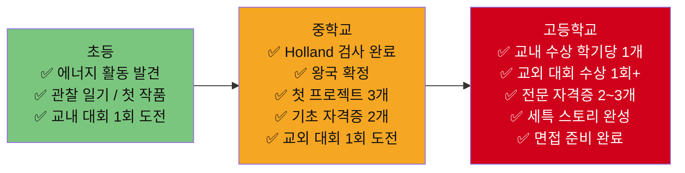

# 8개 왕국별 Activities · Awards · 자격증 종합 가이드 (하)
> **📣 소통 왕국 · 🚀 도전 왕국 + 📊 8개 왕국 전체 종합 비교**
> 초·중·고별 / 난이도별 / 월별 / 지역별(국내·해외) / 제한별 / 과목별 / 온라인 — 다차원 정리

---

# 📣 소통 왕국 — Activities · Awards · 자격증

> **소속 직업**: 유튜버·크리에이터(13) · 디지털마케터(14) · 방송PD·작가(29) · 게임기획자(30)

---

## 📣-1. Activities (봉사 · 캠프 · 세미나 · 교육 프로그램)

### 초·중·고별 + 난이도별 Activities

| # | 프로그램명 | 대상 | 난이도 | 유형 | 주관 | 온/오프 | 비용 |
|---|---------|------|-------|------|------|--------|------|
| 1 | YouTube Creator Academy | 전 연령 | ★★☆☆☆ | 온라인 | YouTube | 온라인 | 무료 |
| 2 | KBS 미디어 체험관 | 중·고 | ★★☆☆☆ | 체험 | KBS | 오프라인 | 3만원 |
| 3 | Adobe Creative Camp | 중·고 | ★★☆☆☆ | 캠프 | Adobe | 오프라인 | 무료 |
| 4 | 한국콘텐츠진흥원 콘텐츠 캠프 | 중·고 | ★★★☆☆ | 캠프 | 한국콘텐츠진흥원 | 오프라인 | 무료~5만원 |
| 5 | 부산국제영화제 청소년 프로그램 | 중·고 | ★★★☆☆ | 체험 | BIFF | 오프라인 | 5만원 |
| 6 | Google 디지털 마케팅 무료 강좌 | 고 | ★★★☆☆ | 온라인 | Google | 온라인 | 무료 |
| 7 | Meta Blueprint (SNS 광고) | 고 | ★★★☆☆ | 온라인 | Meta | 온라인 | 무료 |
| 8 | Unity 청소년 개발자 캠프 | 중·고 | ★★★☆☆ | 캠프 | Unity Korea | 오프/온 | 무료~5만원 |
| 9 | 네이버 커넥트재단 부스트캠프 | 고·대 | ★★★★☆ | 부트캠프 | 네이버 | 오프라인 | 무료 |
| 10 | K-MOOC "미디어 커뮤니케이션" | 고1~2 | ★★★☆☆ | 온라인 | 교육부 | 온라인 | 무료 |
| 11 | K-MOOC "게임 디자인 입문" | 고1~2 | ★★★☆☆ | 온라인 | 교육부 | 온라인 | 무료 |
| 12 | Coursera "Marketing Analytics" | 고2 | ★★★★☆ | 온라인 | 버지니아대 | 온라인 | 무료 청강 |

### 월별 Activities 캘린더

| 월 | 프로그램 | 유형 | 대상 |
|----|---------|------|------|
| 1월 | Global Game Jam | 게임잼 | 전 연령 |
| 3~5월 | 네이버 부스트캠프 선발 | 부트캠프 | 고·대 |
| 7~8월 | Adobe Camp, Unity 캠프, 콘텐츠 캠프, 부스트캠프 | 캠프 | 중·고 |
| 10월 | BIFF 청소년 프로그램 | 체험 | 중·고 |
| **연중** | YouTube Academy, Google·Meta 강좌, K-MOOC | 온라인 | 고 |
| **연중** | KBS 미디어 체험관 | 체험 | 중·고 |

### 지역별 Activities

| 구분 | 프로그램 | 지역 | 비고 |
|------|---------|------|------|
| **국내 수도권** | KBS 미디어 체험관, Adobe Camp | 서울·여의도 | 접근성 좋음 |
| **국내 판교** | 네이버 부스트캠프 | 판교 | 여름 |
| **국내 부산** | BIFF 청소년 프로그램 | 부산 해운대 | 10월 |
| **해외 온라인** | YouTube Creator Academy | 온라인 | 영어 |
| **해외 온라인** | Google 디지털 마케팅 | 온라인 | 한국어/영어 |
| **해외 온라인** | Meta Blueprint | 온라인 | 한국어/영어 |
| **해외 온라인** | Coursera Marketing Analytics | 온라인 | 영어 |
| **해외 온라인** | K-MOOC 미디어·게임 | 온라인 | 한국어 |

### 과목별 Activities 연결표

| 과목 | 추천 활동 | 세특 연결 키워드 | 적합 직업 |
|------|---------|-------------|---------|
| **영상제작(선택)** | KBS 체험, 영상 캠프, BIFF | 몽타주·편집·연출 | 유튜버·방송PD |
| **확률과통계** | YouTube Analytics, GA4, A/B테스트 | CTR·시청지속률·퍼널 | 유튜버·마케터 |
| **경제** | Google 마케팅, 소상공인 SNS 대행 | 가격탄력성·넛지이론 | 마케터 |
| **정보** | Unity 캠프, 게임잼, Python 분석 | A* 알고리즘·FSM | 게임기획자 |
| **심리학(선택)** | 소비자 심리 분석, Flow 이론 | 인지부하·게임몰입 | 마케터·게임기획자 |
| **사회문화** | 미디어 리터러시, OTT 산업 분석 | 숏폼·미디어소비 | 유튜버·방송PD |

### 봉사활동 추천

| 봉사 유형 | 대상 | 적합 직업 | 세특 연결 |
|---------|------|---------|---------|
| 교내 방송부 활동 | 중·고 | 방송PD·유튜버 | 방송 제작 실무 |
| 소상공인 SNS 홍보 봉사 | 고 | 디지털마케터 | 마케팅 실전 경험 |
| 학교 행사 영상 촬영·편집 | 중·고 | 유튜버·방송PD | 영상 콘텐츠 제작 |
| 초등생 코딩·게임 교육 봉사 | 고 | 게임기획자 | 교육+게임 설계 |

### (추가) 국내·해외·온라인 Activities 확장 리스트 (초·중·고/난이도/월/지역/제한/과목)

| # | 활동/프로그램 | 대상 | 난이도 | 월(모집/진행) | 지역(국내/해외) | 제한 | 과목/분야 | 온/오프 | 산출물(기록 포인트) |
|---|---|---|---|---|---|---|---|---|---|
| 1 | **지역 방송국/신문사 견학 + 기사/리포트 작성** | 중·고 | ★★☆☆☆ | 3~11월 | 국내 | 승인/선착 | 국어·사회 | 오프 | 질문지 + 제작/편집 과정 요약 |
| 2 | **팟캐스트/라디오 콘텐츠 제작 프로젝트**(기획→대본→녹음) | 중·고 | ★★★☆☆ | 연중 | 국내/해외 | 무제한 | 국어·미디어 | 오프/온 | 대본 + 에피소드 1편 |
| 3 | **틱톡/쇼츠 숏폼 실험**(A/B 테스트) | 중·고 | ★★★☆☆ | 연중 | 해외 | 무제한 | 확통·정보 | 온라인 | 썸네일/제목 A/B 결과표 |
| 4 | **브랜드 채널 운영 실습**(학교/동아리) | 중·고 | ★★★☆☆ | 학기 중 | 국내 | 동아리 | 경제·사회 | 오프/온 | 콘텐츠 캘린더 + KPI |
| 5 | **라이브 커머스/마케팅 퍼널 분석**(GA4/애널리틱스) | 고 | ★★★★☆ | 연중 | 국내/해외 | 무제한 | 확통·경제 | 온라인 | 퍼널(유입-전환) 분석 리포트 |
| 6 | 해외 **HubSpot Academy/Meta/Google 인증 코스**(심화) | 고 | ★★★☆☆ | 연중 | 해외 | 무제한 | 경제·정보 | 온라인 | 수료증 + 적용 사례(전후 비교) |
| 7 | **게임 기획 ‘밸런스’ 실험**(룰/아이템/경제) | 중·고 | ★★★★☆ | 연중 | 국내/해외 | 팀 | 수학·정보 | 오프/온 | 밸런스 시트 + 플레이테스트 로그 |
| 8 | **미디어 윤리/팩트체크 프로젝트**(허위정보 분석) | 중·고 | ★★★☆☆ | 연중 | 국내/해외 | 무제한 | 사회·윤리 | 온라인 | 팩트체크 체크리스트 + 사례 |

---

## 📣-2. Awards (대회 · 공모전)

### 교내 수상 전략 (학기당 1개)

| 학기 | 추천 교내 대회 | 난이도 | 적합 직업 |
|------|------------|-------|---------|
| 고1 1학기 | 영상제작대회 / UCC대회 | ★★☆☆☆ | 유튜버·방송PD |
| 고1 2학기 | 경제경시대회 / 창업아이디어 | ★★★☆☆ | 마케터 |
| 고2 1학기 | 방송콘텐츠대회 | ★★★☆☆ | 방송PD |
| 고2 2학기 | 학술제(미디어 비평) | ★★★★☆ | 4직업 공통 |

### 교외 대회 — 국내

| # | 대회명 | 주관 | 대상 | 시기 | 난이도 | 온/오프 | 적합 직업 |
|---|-------|------|------|------|-------|--------|---------|
| 1 | **전국 청소년 영상공모전** | 한국콘텐츠진흥원 | 중·고 | 연중 | ★★★☆☆ | 온라인 | 유튜버·방송PD |
| 2 | **KBS 청소년 영상 공모전** | KBS | 중·고 | 6~10월 | ★★★☆☆ | 온라인 | 방송PD·유튜버 |
| 3 | **전국 학생 UCC 공모전** | 한국콘텐츠진흥원 | 중·고 | 연중 | ★★☆☆☆ | 온라인 | 유튜버·방송PD |
| 4 | **전국 브랜드 마케팅 공모전** | 각 기업·대학 | 고 | 연중 | ★★★★☆ | 온/오프 | 디지털마케터 |
| 5 | **대학 광고 공모전** (대홍·제일) | 대홍기획·제일기획 | 고·대 | 6~10월 | ★★★★☆ | 온/오프 | 마케터 |
| 6 | **한국콘텐츠진흥원 게임잼** | 한국콘텐츠진흥원 | 고·대 | 연중 | ★★★★☆ | 오프라인 | 게임기획자 |
| 7 | **인디게임 공모전** | 한국게임산업협회 | 전 연령 | 연중 | ★★★☆☆ | 온/오프 | 게임기획자 |
| 8 | **소셜미디어 콘텐츠 공모전** | 각 기업·공공기관 | 중·고 | 연중 | ★★☆☆☆ | 온라인 | 유튜버·마케터 |
| 9 | **전국 학생 방송 콘텐츠 공모전** | 방송통신위원회 | 중·고 | 5~10월 | ★★★☆☆ | 온/오프 | 방송PD |

### 교외 대회 — 해외 / 국제

| # | 대회명 | 주관 | 대상 | 시기 | 온/오프 | 언어 | 난이도 | 적합 직업 |
|---|-------|------|------|------|--------|------|-------|---------|
| 1 | **Global Game Jam** | IGDA | 전 연령 | 1월 | 오프라인(글로벌) | 영어 | ★★★★☆ | 게임기획자 |
| 2 | **Ludum Dare** | 온라인 커뮤니티 | 전 연령 | 연 3회 | 온라인 | 영어 | ★★★☆☆ | 게임기획자 |
| 3 | **YouTube NextUp** | YouTube | 크리에이터 | 연중 | 온/오프 | 영어 | ★★★★☆ | 유튜버 |
| 4 | **Cannes Lions Young Lions** | 칸 광고제 | 고·대 | 6월 | 오프라인(프랑스) | 영어 | ★★★★★ | 마케터 |
| 5 | **itch.io Game Jam** | itch.io | 전 연령 | 수시 | 온라인 | 영어 | ★★~★★★★ | 게임기획자 |

### (추가) Awards 확장 리스트 (국내·해외/온라인/제한/과목)

| # | 대회/공모전 | 국내/해외 | 대상 | 시기 | 난이도 | 제한 | 과목/분야 | 온/오프 | “기록”으로 남길 핵심 |
|---|---|---|---|---|---|---|---|---|---|
| 1 | **청소년 미디어 페스티벌/영상제**(지역·대학 주관) | 국내 | 중·고 | 6~11월 | ★★★☆☆ | 팀/개인 | 영상 | 오프/온 | 기획-촬영-편집 의사결정 |
| 2 | **공공 캠페인 콘텐츠 공모**(환경·안전·인권) | 국내/해외 | 중·고 | 연중 | ★★~★★★★ | 서류 | 사회·미디어 | 온라인 | 근거 기반 메시지 설계 |
| 3 | **SNS 브랜디드 콘텐츠 공모**(숏폼/릴스) | 국내/해외 | 중·고 | 연중 | ★★★☆☆ | 개인 | 미디어·경제 | 온라인 | 도달/전환 지표와 개선 |
| 4 | **국제 단편/애니/웹콘텐츠 공모**(온라인 제출형) | 해외 | 중·고 | 연중 | ★★★★☆ | 영어 선택 | 영상·미술 | 온라인 | 1분 피치 + 포트폴리오 |
| 5 | **국제 게임잼(청소년 참여 가능)** | 해외 | 중·고 | 연중 | ★★★★☆ | 팀 | 정보·미술 | 온/오프 | 역할 분담 + 플레이테스트 |

---

## 📣-3. 자격증 (Certification)

### 초·중·고별 + 난이도별 자격증

| 취득 시기 | 자격증명 | 주관 | 난이도 | 비용 | 온/오프 | 적합 직업 |
|---------|--------|------|-------|------|--------|---------|
| **중2~고1** | DIAT 멀티미디어 제작 | 한국정보통신진흥협회 | ★☆☆☆☆ | 1.8만원 | 오프라인 | 4직업 공통 |
| **중3~고1** | 컴퓨터활용능력 2급 | 대한상공회의소 | ★★☆☆☆ | 1.9만원 | 오프라인 | 4직업 공통 |
| **중3~고1** | GTQ 1급 (그래픽기술) | 한국생산성본부 | ★★★☆☆ | 2.5만원 | 오프라인 | 유튜버·마케터·PD |
| **중3~고1** | 정보처리기능사 | 한국산업인력공단 | ★★☆☆☆ | 1.9만원 | 오프라인 | 게임기획자 |
| **고1** | Google 디지털 마케팅 수료증 | Google | ★★★☆☆ | 무료 | 온라인 | 마케터 |
| **고1** | COS Pro 2급 (Python) | YBM | ★★☆☆☆ | 3만원 | 오프라인 | 게임·마케터 |
| **고1~2** | 영상편집 자격 | 한국콘텐츠진흥원 | ★★★☆☆ | 3만원 | 오프라인 | 유튜버·방송PD |
| **고2** | Google Analytics 인증 | Google | ★★★☆☆ | 무료 | 온라인 | 마케터·PM |

### 자격증 — 직업별 추천 조합

| 직업 | 중학교 | 고1 | 고2 | 면접 활용 |
|------|--------|-----|-----|---------|
| **유튜버** | DIAT | GTQ 1급, 영상편집 | - | "콘텐츠 제작 전문 역량" |
| **디지털마케터** | 컴활 2급 | Google 마케팅 수료증 | GA 인증 | "Google 공인 마케팅 역량" |
| **방송PD** | DIAT | GTQ 1급, 영상편집 | - | "방송 제작 기술 역량" |
| **게임기획자** | DIAT, 정보처리기능사 | COS Pro 2급 | - | "게임 개발 SW 역량" |

### 포트폴리오 플랫폼 전략

| 플랫폼 | 용도 | 적합 직업 | 성과 지표 |
|-------|------|---------|---------|
| **YouTube** | 영상 포트폴리오 | 유튜버·방송PD | 구독자·조회수 |
| **Instagram / TikTok** | SNS 마케팅 | 마케터·유튜버 | 팔로워·도달률 |
| **Behance** | 디자인·영상 작품 | 방송PD·유튜버 | 조회수·좋아요 |
| **itch.io** | 인디 게임 배포 | 게임기획자 | 다운로드 수 |
| **GitHub** | 게임 코드 | 게임기획자 | Stars·커밋 |
| **Notion** | 통합 포트폴리오 | 4직업 공통 | 프로젝트 수 |

## 📣-4. 역량(Competency) — 섹션별 서술(세특·면접 연결)

| 역량 섹션 | 무엇을 보여주나 | 활동/산출물(추천) | 학생부·면접 연결 문장(예시) |
|---|---|---|---|
| **스토리텔링·기획** | 메시지/구성 | 로그라인→대본→콘티 | “목표 시청자에 맞게 구성과 톤을 설계했다.” |
| **제작 역량(툴)** | 실행력/완성도 | 촬영/편집 워크플로우 | “제작 공정을 표준화해 품질을 일정하게 유지했다.” |
| **데이터 기반 개선** | 성장/실험 | 썸네일·제목 A/B 테스트 | “감이 아니라 지표로 개선 포인트를 찾았다.” |
| **브랜딩** | 일관성/정체성 | 채널 가이드(컬러/톤/포맷) | “콘텐츠를 브랜드로 통합해 지속성을 만들었다.” |
| **커뮤니티·협업** | 관계/리더십 | 협업 기획서+역할 분담 | “시청자/팀 피드백을 반영해 운영을 개선했다.” |
| **미디어 윤리** | 책임감 | 저작권·팩트체크 체크리스트 | “저작권과 정보 신뢰도를 지키며 제작했다.” |

---

# 🚀 도전 왕국 — Activities · Awards · 자격증

> **소속 직업**: 스타트업창업가(15) · 투자분석가(16) · 프로덕트매니저(31) · 경영컨설턴트(32)

---

## 🚀-1. Activities (봉사 · 캠프 · 세미나 · 교육 프로그램)

### 초·중·고별 + 난이도별 Activities

| # | 프로그램명 | 대상 | 난이도 | 유형 | 주관 | 온/오프 | 비용 |
|---|---------|------|-------|------|------|--------|------|
| 1 | POSTECH 영재기업인교육원 | 중·고 | ★★★★☆ | 연중교육 | 포스텍 | 오프라인 | 무료 |
| 2 | 한국은행 경제캠프 | 중·고 | ★★★☆☆ | 캠프 | 한국은행 | 오프라인 | 무료 |
| 3 | 금융감독원 금융교육 | 중·고 | ★★☆☆☆ | 교육 | 금융감독원 | 오프/온 | 무료 |
| 4 | 중소벤처기업부 청소년 창업캠프 | 중·고 | ★★★☆☆ | 캠프 | 중소벤처기업부 | 오프라인 | 무료 |
| 5 | 한국창업보육협회 창업 멘토링 | 고 | ★★★★☆ | 멘토링 | 한국창업보육협회 | 오프/온 | 무료 |
| 6 | 증권사 청소년 모의투자 프로그램 | 중·고 | ★★☆☆☆ | 실습 | 주요 증권사 | 온라인 | 무료 |
| 7 | McKinsey Solve 사전 체험 | 고2~대 | ★★★★★ | 체험 | McKinsey | 온라인 | 무료 |
| 8 | Google for Startups | 고·대 | ★★★★☆ | 교육 | Google | 온라인 | 무료 |
| 9 | K-MOOC "경영학원론" | 고1~2 | ★★★☆☆ | 온라인 | 교육부 | 온라인 | 무료 |
| 10 | K-MOOC "투자론 입문" | 고2 | ★★★★☆ | 온라인 | 교육부 | 온라인 | 무료 |
| 11 | Coursera "Financial Markets" (예일대) | 고2 | ★★★★☆ | 온라인 | 예일대 | 온라인 | 무료 청강 |
| 12 | Coursera "Product Management" | 고2 | ★★★★☆ | 온라인 | 버지니아대 | 온라인 | 무료 청강 |

### 월별 Activities 캘린더

| 월 | 프로그램 | 유형 |
|----|---------|------|
| 1~2월 | 한국은행 겨울 경제캠프 | 캠프 |
| 3~5월 | POSTECH 영재기업인 학기 과정 | 교육 |
| 6~8월 | 청소년 창업캠프, 한국은행 여름캠프 | 캠프 |
| 9~11월 | 금융감독원 교육, 창업 멘토링 | 교육·멘토링 |
| **연중** | 모의투자, K-MOOC, Coursera, Google, McKinsey | 온라인 |

### 지역별 Activities

| 구분 | 프로그램 | 지역 | 비고 |
|------|---------|------|------|
| **국내 서울** | 한국은행 경제캠프, 금융감독원 | 서울 | 방학 |
| **국내 포항** | POSTECH 영재기업인 | 포항 | 연중 |
| **국내 전국** | 창업캠프, 모의투자 | 전국 | 방학·연중 |
| **해외 온라인** | K-MOOC 경영·투자 | 온라인 | 한국어 |
| **해외 온라인** | Coursera Financial Markets (예일) | 온라인 | 영어 |
| **해외 온라인** | Coursera Product Management | 온라인 | 영어 |
| **해외 온라인** | Google for Startups | 온라인 | 영어 |
| **해외 온라인** | McKinsey Solve | 온라인 | 영어 |

### 과목별 Activities 연결표

| 과목 | 추천 활동 | 세특 연결 키워드 | 적합 직업 |
|------|---------|-------------|---------|
| **경제** | 경제캠프, 모의투자, 금융교육 | 린스타트업·가격탄력성·포터5Forces | 4직업 공통 |
| **정보** | 해커톤, Figma PRD, 앱 기획 | GA4·A/B테스트·React | PM·창업가 |
| **미적분** | 금융수학, 옵션가격 모형 | Black-Scholes·복리 | 투자분석가 |
| **심리학(선택)** | UX심리학, 소비자행동 분석 | 인지부하·넛지이론 | PM·마케터 |
| **확률과통계** | 캐글, 금융 분석, 회귀분석 | 팩터투자·퍼널분석 | 투자분석가·컨설턴트 |
| **영어** | 영문 케이스 분석, 원서 독해 | McKinsey 7S·Inspired | 컨설턴트·PM |

### 봉사활동 추천

| 봉사 유형 | 대상 | 적합 직업 | 세특 연결 |
|---------|------|---------|---------|
| 소셜벤처 프로젝트 (사회문제 해결) | 고 | 창업가 | 사회적 가치 창출 |
| 소상공인 경영 컨설팅 봉사 | 고 | 컨설턴트·마케터 | 비즈니스 분석 실전 |
| 저학년 경제 교육 봉사 | 중·고 | 투자분석가·회계사 | 금융 리터러시 교육 |
| 비영리단체 IT 서비스 기획 봉사 | 고 | PM | 서비스 기획 실전 |

### (추가) 국내·해외·온라인 Activities 확장 리스트 (초·중·고/난이도/월/지역/제한/과목)

| # | 활동/프로그램 | 대상 | 난이도 | 월(모집/진행) | 지역(국내/해외) | 제한 | 과목/분야 | 온/오프 | 산출물(기록 포인트) |
|---|---|---|---|---|---|---|---|---|---|
| 1 | **문제발견 인터뷰 10명 프로젝트**(고객 리서치) | 중·고 | ★★★★☆ | 연중 | 국내/해외 | 무제한 | 사회·국어 | 오프/온 | 인터뷰 질문지 + 인사이트 |
| 2 | **MVP 제작 스프린트**(기획→개발→테스트) | 고 | ★★★★☆ | 4~11월 | 국내 | 팀 | 정보 | 오프/온 | PRD + 데모 + 회고 |
| 3 | **케이스 인터뷰 스터디**(MECE/가설검증) | 고 | ★★★★☆ | 연중 | 국내/해외 | 커뮤니티 | 수학·경제 | 온라인 | 케이스 풀이 프레임 정리 |
| 4 | **모의투자 리서치 노트**(기업 1개/월) | 중·고 | ★★★☆☆ | 연중 | 국내/해외 | 무제한 | 경제 | 온라인 | 투자 Thesis + 리스크 |
| 5 | 해외 **온라인 창업/PM 부트캠프(프로젝트형)** | 고 | ★★★★★ | 6~8월 | 해외 | 선발/유료 | 경영·정보 | 온라인 | 피치덱 + 사용자 지표 |
| 6 | **비즈니스 모델 캔버스(BMC) 워크숍** 운영 | 중·고 | ★★★☆☆ | 학기 중 | 국내 | 동아리 | 경제 | 오프 | BMC 3버전(개선) |
| 7 | **가격·수요 실험**(간단 설문/실험) | 고 | ★★★★☆ | 연중 | 국내/해외 | 무제한 | 확통·경제 | 온라인 | 가설-실험-결론 리포트 |
| 8 | **프로덕트 메이커 프로젝트**(노코드/피그마) | 중·고 | ★★★☆☆ | 연중 | 국내/해외 | 무제한 | 정보·기술가정 | 온라인 | 와이어프레임 + 사용자 테스트 |

---

## 🚀-2. Awards (대회 · 공모전)

### 교내 수상 전략 (학기당 1개)

| 학기 | 추천 교내 대회 | 난이도 | 적합 직업 |
|------|------------|-------|---------|
| 고1 1학기 | 경제경시대회 | ★★★☆☆ | 투자분석·컨설턴트 |
| 고1 2학기 | 토론대회 | ★★★☆☆ | 컨설턴트·창업가 |
| 고2 1학기 | 창업아이디어 대회 | ★★★★☆ | 창업가·PM |
| 고2 2학기 | 학술제(비즈니스 분석) | ★★★★☆ | 4직업 공통 |

### 교외 대회 — 국내

| # | 대회명 | 주관 | 대상 | 시기 | 난이도 | 온/오프 | 적합 직업 |
|---|-------|------|------|------|-------|--------|---------|
| 1 | **대한민국 학생 창업대회** | 중소벤처기업부 | 중·고 | 6~11월 | ★★★★☆ | 오프라인 | 창업가·PM |
| 2 | **청소년 비즈쿨 창업대회** | 중소벤처기업부 | 중·고 | 연중 | ★★★☆☆ | 오프/온 | 창업가 |
| 3 | **금융감독원 금융교육 공모전** | 금융감독원 | 중·고 | 6~10월 | ★★★☆☆ | 온/오프 | 투자분석가 |
| 4 | **증권사 모의투자 대회** | 주요 증권사 | 중·고 | 연중 | ★★★☆☆ | 온라인 | 투자분석가 |
| 5 | **전국 경영·경제 공모전** | 각 대학·언론사 | 고 | 연중 | ★★★★☆ | 온/오프 | 4직업 공통 |
| 6 | **전국 청소년 토론대회** | KBS·한국토론학회 | 중·고 | 5~11월 | ★★★☆☆ | 오프라인 | 컨설턴트·창업가 |
| 7 | **IT 서비스 기획 공모전** | 각 IT 기업 | 고 | 연중 | ★★★★☆ | 온/오프 | PM |
| 8 | **SW 공모전** | 과기정통부 | 중·고 | 연중 | ★★★☆☆ | 온/오프 | PM |
| 9 | **핀테크 해커톤** | 금융감독원·핀테크지원센터 | 고·대 | 연중 | ★★★★☆ | 오프라인 | 투자분석가·PM |
| 10 | **사회적기업 아이디어 공모전** | 한국사회적기업진흥원 | 중·고 | 연중 | ★★★☆☆ | 온/오프 | 창업가 |
| 11 | **전국 시사 경제 퀴즈 대회** | 각 언론사 | 중·고 | 연중 | ★★☆☆☆ | 온/오프 | 투자분석·컨설턴트 |

### 교외 대회 — 해외 / 국제

| # | 대회명 | 주관 | 대상 | 시기 | 온/오프 | 언어 | 난이도 | 적합 직업 |
|---|-------|------|------|------|--------|------|-------|---------|
| 1 | **Diamond Challenge** | 델라웨어대학 | 고 | 1~5월 | 온라인→오프 | 영어 | ★★★★☆ | 창업가 |
| 2 | **CFA Institute Research Challenge** (고교부) | CFA Institute | 고 | 연중 | 온/오프 | 영어 | ★★★★★ | 투자분석가 |
| 3 | **DECA (Distributive Education Clubs)** | DECA Inc | 고 | 연중 | 온/오프 | 영어 | ★★★★☆ | 마케터·컨설턴트 |
| 4 | **FBLA (Future Business Leaders)** | FBLA-PBL | 고 | 연중 | 온/오프 | 영어 | ★★★★☆ | 4직업 공통 |
| 5 | **Global Startup Weekend** | Techstars | 전 연령 | 수시 | 오프라인(글로벌) | 영어 | ★★★★☆ | 창업가·PM |

### (추가) Awards 확장 리스트 (국내·해외/온라인/제한/과목)

| # | 대회/공모전 | 국내/해외 | 대상 | 시기 | 난이도 | 제한 | 과목/분야 | 온/오프 | “기록”으로 남길 핵심 |
|---|---|---|---|---|---|---|---|---|---|
| 1 | **Wharton Global High School Investment Competition** | 해외 | 고 | 9~12월 | ★★★★★ | 팀/선발 | 경제·확통 | 온라인 | 리서치 노트 + 리스크 관리 |
| 2 | **Blue Ocean Competition**(창업/비즈니스 모델) | 해외 | 고 | 연중 | ★★★★★ | 팀 | 경영 | 온라인 | 고객/시장 검증 근거 |
| 3 | **Conrad Challenge**(혁신/창업) | 해외 | 중·고 | 10~4월 | ★★★★☆ | 팀 | 융합 | 온라인 | 문제정의 + 프로토타입 |
| 4 | **국내 청소년 IR/피치 대회**(지역·대학 주관) | 국내 | 중·고 | 5~11월 | ★★★★☆ | 팀/개인 | 경영 | 오프/온 | 5장 피치덱 + Q&A |
| 5 | **국제 케이스/전략 경진(온라인)** | 해외 | 고 | 연중 | ★★★★☆ | 팀 | 경제 | 온라인 | 가설-검증-결론 구조 |

---

## 🚀-3. 자격증 (Certification)

### 초·중·고별 + 난이도별 자격증

| 취득 시기 | 자격증명 | 주관 | 난이도 | 비용 | 온/오프 | 적합 직업 |
|---------|--------|------|-------|------|--------|---------|
| **중3~고1** | 한국사능력검정시험 1급 | 국사편찬위원회 | ★★★☆☆ | 1만원 | 오프라인 | 컨설턴트 |
| **중3~고1** | 정보처리기능사 | 한국산업인력공단 | ★★☆☆☆ | 1.9만원 | 오프라인 | PM |
| **고1** | 컴퓨터활용능력 1급 | 대한상공회의소 | ★★★☆☆ | 2.2만원 | 오프라인 | 4직업 공통 |
| **고1** | COS Pro 2급 (Python) | YBM | ★★☆☆☆ | 3만원 | 오프라인 | PM·투자분석 |
| **고1** | Google 디지털 마케팅 수료증 | Google | ★★★☆☆ | 무료 | 온라인 | PM·창업가 |
| **고1~2** | 매경TEST (최우수) | 매일경제 | ★★★☆☆ | 3만원 | 오프라인 | 4직업 공통 |
| **고1~2** | TESAT (S등급) | 한국경제신문 | ★★★☆☆ | 3만원 | 오프라인 | 투자분석·컨설턴트 |
| **고1~2** | TOEFL iBT | ETS | ★★★★☆ | 약 30만원 | 오프라인 | 컨설턴트·투자 |
| **고1~2** | TOEIC 900+ | ETS | ★★★☆☆ | 5.2만원 | 오프라인 | 4직업 공통 |

### 자격증 — 직업별 추천 조합

| 직업 | 중학교 | 고1 | 고2 | 면접 활용 |
|------|--------|-----|-----|---------|
| **스타트업창업가** | 한국사 1급 | Google 마케팅, 정보처리 | 매경TEST, TOEIC | "비즈니스+기술 융합 역량" |
| **투자분석가** | 컴활 2급 | COS Pro 2급, 매경TEST | TESAT S등급, TOEFL | "금융 분석 + 코딩 역량" |
| **PM** | 정보처리기능사 | Google 마케팅, 컴활 1급 | COS Pro 2급, TOEIC | "서비스 기획 전문 역량" |
| **경영컨설턴트** | 한국사 1급 | 컴활 1급, TOEIC | 매경TEST, TOEFL | "분석 + 영어 + 경제 역량" |

## 🚀-4. 역량(Competency) — 섹션별 서술(세특·면접 연결)

| 역량 섹션 | 무엇을 보여주나 | 활동/산출물(추천) | 학생부·면접 연결 문장(예시) |
|---|---|---|---|
| **문제정의·시장 이해** | 고객/시장 감각 | 인터뷰 10명 + 페인포인트 정리 | “고객의 언어로 문제를 정의해 MVP 범위를 줄였다.” |
| **가설·검증(데이터)** | 실험 기반 의사결정 | 설문/랜딩 테스트 결과 | “가설을 지표로 검증하고 방향을 바꿨다.” |
| **제품/프로젝트 실행** | 추진력 | PRD + 일정 + 리스크 | “일정을 쪼개 스프린트로 완주했다.” |
| **재무/논리** | 수치 기반 설득 | 단위경제(Unit economics) 계산 | “감이 아니라 숫자로 설득했다.” |
| **리더십·협업** | 팀 운영 | 역할 분담 + 회의록 | “역할을 명확히 해 갈등 비용을 줄였다.” |
| **윤리·책임** | 사회적 가치 | 개인정보/공정성 체크 | “성장보다 책임을 먼저 고려했다.” |

---

# 📊 8개 왕국 전체 종합 비교

---

## Activities 전체 왕국 비교표

| 왕국 | 핵심 캠프 TOP 3 | 핵심 봉사 | 온라인 필수 | 봉사 중요도 |
|------|-------------|---------|---------|---------|
| 🔬 탐구 | 과학영재교육원, KAIST 캠프, 대학 R&E | 과학 멘토링, 보건실 | K-MOOC AI, Coursera ML | ★★★☆☆ |
| 🎨 창작 | 디자인캠프, 웹툰아카데미, BIFF | 포스터 디자인, 영상 제작 | K-MOOC UX, Coursera Design | ★★☆☆☆ |
| 💻 기술 | SW영재, 정보보호영재, 해커톤 | 코딩 교육, 보안 캠페인 | CS50, Kaggle, 이솦 | ★★☆☆☆ |
| 🌱 자연 | 환경캠프, 생태캠프, 스마트팜체험 | 동물보호소, 해변정화, 텃밭 | K-MOOC 환경·농업 | ★★★★☆ |
| 🤝 연결 | 사범대 체험, 간호대 체험, RCY | 학습멘토링, 또래상담, 복지관 | K-MOOC 교육·간호·복지 | ★★★★★ |
| 🏛️ 질서 | 법교육캠프, 외교캠프, 경제캠프 | 법률교육, 다문화 지원 | K-MOOC 형법·국제·회계 | ★★★☆☆ |
| 📣 소통 | 콘텐츠캠프, Unity캠프, BIFF | 방송부, SNS 홍보 | Google 마케팅, YouTube | ★★☆☆☆ |
| 🚀 도전 | POSTECH 기업인, 경제캠프, 창업캠프 | 소셜벤처, 경영컨설팅 | Coursera 금융·PM | ★★★☆☆ |

## Awards 전체 왕국 비교표

| 왕국 | 국내 TOP 3 대회 | 해외 TOP 2 대회 | 온라인 상시 대회 | 최고 난이도 |
|------|-------------|-------------|-------------|---------|
| 🔬 탐구 | KBO, KChO, KOI | IBO/IChO, Intel ISEF | Kaggle, Code Jam | ★★★★★ |
| 🎨 창작 | 미술대전, 건축모형, 청소년영화제 | Adobe Awards, BISFF | 네이버도전만화, 캔바 | ★★★★☆ |
| 💻 기술 | KOI, CTF(CodeGate), 로봇대회 | IOI, DEF CON, FIRST | Kaggle, picoCTF | ★★★★★ |
| 🌱 자연 | KBO, 환경보전공모전, 농업해커톤 | IBO, Stockholm Water | UN 환경공모전, IoT | ★★★★★ |
| 🤝 연결 | 토론대회, 봉사공모전, 상담사례 | 유니세프 에세이 | 봉사 에세이 | ★★★☆☆ |
| 🏛️ 질서 | 모의재판, MUN, 경제경시 | Harvard MUN, THIMUN | 법학·국제 에세이 | ★★★★★ |
| 📣 소통 | 영상공모전, 광고공모전, 게임잼 | Global Game Jam, itch.io | UCC, 소셜미디어 | ★★★★☆ |
| 🚀 도전 | 학생창업대회, 핀테크해커톤, 모의투자 | Diamond Challenge, DECA | 모의투자, SW공모전 | ★★★★☆ |

## 자격증 전체 왕국 비교표

| 왕국 | 중학교 필수 | 고1 핵심 | 고2 핵심 | 총비용 범위 | 어학 비중 |
|------|---------|---------|---------|---------|---------|
| 🔬 탐구 | DIAT, 워드프로세서 | BLS, 정보처리 | TOEFL, 위험물 | 10~45만원 | 중 |
| 🎨 창작 | DIAT, ITQ | GTQ 1급, GTQi | 컬러리스트, CAD | 8~15만원 | 낮음 |
| 💻 기술 | DIAT, COS Pro 2급 | COS Pro 1급, 리눅스 | 네트워크, AWS | 12~55만원 | 중 |
| 🌱 자연 | 컴활 2급 | BLS, COS Pro 2급 | 환경기능사, 유기농업 | 10~55만원 | 낮음 |
| 🤝 연결 | 또래상담사, 워드프로세서 | BLS, 한국사 1급 | TOEIC, 사회조사분석 | 10~25만원 | 낮음 |
| 🏛️ 질서 | 한국사 1급, 워드프로세서 | TOEFL, 컴활 1급 | HSK/DELF, 매경TEST | 15~70만원 | **최고** |
| 📣 소통 | DIAT, 정보처리 | GTQ, Google마케팅 | GA인증, 영상편집 | 8~15만원 | 낮음 |
| 🚀 도전 | 한국사 1급, 정보처리 | 매경TEST, Google마케팅 | TESAT, TOEFL | 10~45만원 | 높음 |

---

## 8개 왕국 × 학년별 핵심 마일스톤 종합

## 왕국별 연간 투자 비용 비교

| 왕국 | 초등 (4~6) | 중등 (1~3) | 고등 (1~2) | 총계 | 비고 |
|------|---------|---------|---------|------|------|
| 🔬 탐구 | 약 5만원 | 약 10만원 | 약 30만원 | **약 45만원** | R&E 무료, 올림피아드 무료 |
| 🎨 창작 | 약 10만원 | 약 10만원 | 약 15만원 | **약 35만원** | 도구 비용 별도 (iPad 등) |
| 💻 기술 | 약 5만원 | 약 8만원 | 약 17만원 | **약 30만원** | 대부분 무료 도구 |
| 🌱 자연 | 약 5만원 | 약 8만원 | 약 17만원 | **약 30만원** | Arduino·센서 별도 |
| 🤝 연결 | 약 3만원 | 약 5만원 | 약 12만원 | **약 20만원** | 봉사 중심 = 저비용 |
| 🏛️ 질서 | 약 5만원 | 약 12만원 | 약 25만원 | **약 42만원** | 어학 자격증 비용 높음 |
| 📣 소통 | 약 3만원 | 약 8만원 | 약 15만원 | **약 26만원** | Google 무료 강좌 활용 |
| 🚀 도전 | 약 3만원 | 약 5만원 | 약 20만원 | **약 28만원** | 법인설립 시 추가 |

> **전체 평균**: 약 32만원 (초4~고2, 약 6~8년간)
> **핵심 메시지**: 비용보다 **시간 투자와 꾸준함**이 진정한 경쟁력

---

## 나에게 맞는 왕국 찾기 — 자가진단 체크리스트

| 에너지 패턴 | 1순위 왕국 | 2순위 왕국 |
|---------|---------|---------|
| "실험·연구할 때 몰입한다" | 🔬 탐구 | 🌱 자연 |
| "그림·디자인·만들기가 좋다" | 🎨 창작 | 📣 소통 |
| "코딩·수학 문제에 빠진다" | 💻 기술 | 🔬 탐구 |
| "자연·동물·환경에 끌린다" | 🌱 자연 | 🔬 탐구 |
| "사람을 돕고 가르칠 때 보람" | 🤝 연결 | 🌱 자연 |
| "토론·논리·설득을 잘한다" | 🏛️ 질서 | 🚀 도전 |
| "영상·SNS에 에너지가 생긴다" | 📣 소통 | 🎨 창작 |
| "사업 아이디어가 떠오른다" | 🚀 도전 | 📣 소통 |
| "범죄 추리·심리에 관심" | 🏛️ 질서 | 🤝 연결 |
| "게임 시스템을 분석한다" | 📣 소통 | 💻 기술 |
| "세계 뉴스·국제 문제 관심" | 🏛️ 질서 | 🚀 도전 |
| "로봇·하드웨어 만들기" | 💻 기술 | 🌱 자연 |

---

## 8개 왕국 공통 — 학생부 기재 규정 요약

| 구분 | 학생부 기재 | 활용 방법 |
|------|---------|---------|
| **교내 수상** | ⭕ 학기당 1개 | 진로와 가장 관련 깊은 1개 전략적 선택 |
| **교외 수상** | ❌ 미기재 | 세특에 참가 과정·탐구 내용 간접 기록 |
| **자격증** | ❌ 미기재 | 면접 소재, SW특기자 포트폴리오, 자기주도성 증빙 |
| **봉사(학교주관)** | ⭕ 실적만 기재 | 교내 캠페인·멘토링 등 교육과정 내 봉사 |
| **봉사(개인)** | ❌ 미기재 | 면접 소재, 인성 역량 간접 증빙 |
| **캠프(교외)** | ❌ 미기재 | 세특에 학습 내용 소재화, 면접 스토리 |

---

> **핵심 메시지**
> 8개 왕국 모두 **활동(Activity) → 수상(Awards) → 자격증(Certification) → 세특(기록)**의 순환 구조를 따릅니다.
> 왕국마다 강조점이 다를 뿐, **꾸준한 프로젝트 완성 + 전략적 세특 기록 + 면접 스토리**라는 3가지 공식은 동일합니다.
> 자격증과 교외 활동은 학생부에 직접 기재되지 않지만, 면접·포트폴리오·SW특기자 전형에서 강력한 무기가 됩니다.

---

*작성일: 2026년 2월 | 8개 왕국별 Activities·Awards·자격증 종합 가이드 (하) v1.0*
