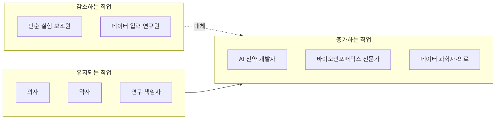
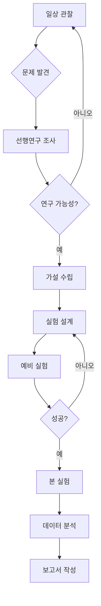
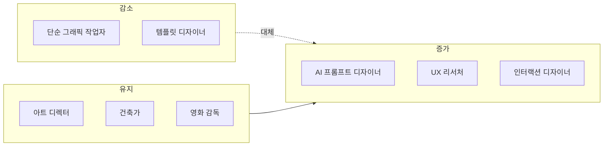
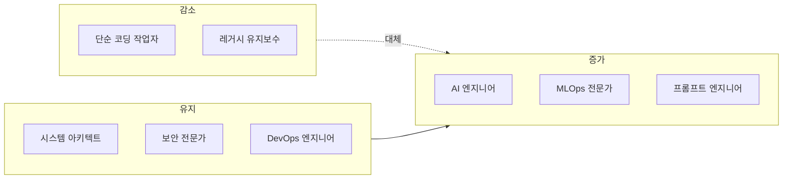
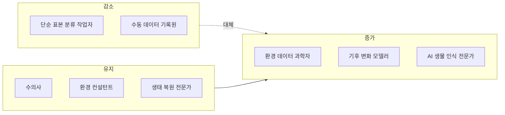
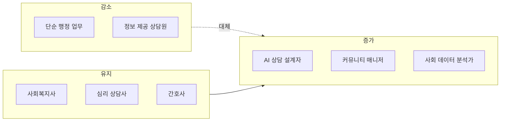
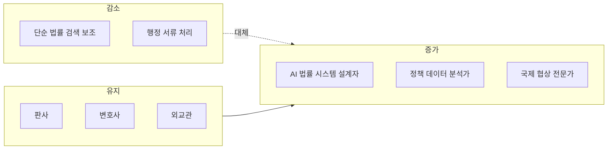
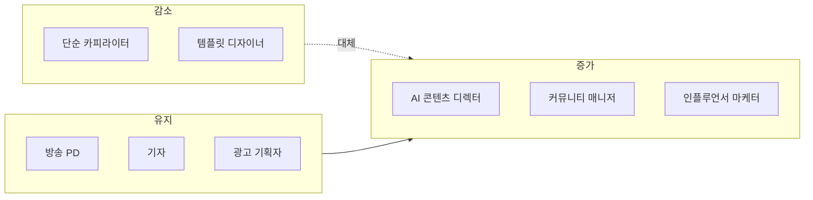
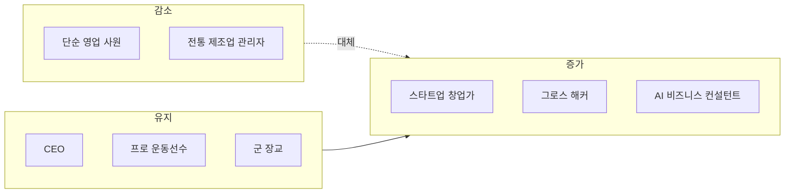
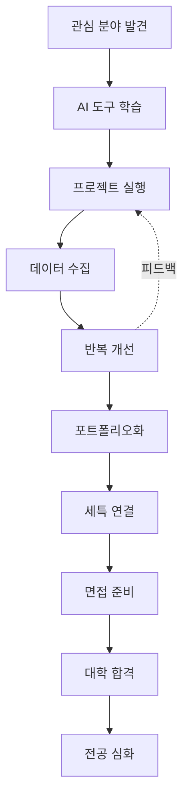

# 8개 왕국 심층 분석 — AI 시대 역량·직업 변동·학습 전략·커리어 패스

> **핵심 역량 · AI 시대 요구 역량 · 직업 변동 · 학습 전략 · 커리어 패스 작성법**

---

## 목차

1. [🔬 탐구 왕국](#-탐구-왕국-explore-kingdom)
2. [🎨 창작 왕국](#-창작-왕국-create-kingdom)
3. [💻 기술 왕국](#-기술-왕국-tech-kingdom)
4. [🌱 자연 왕국](#-자연-왕국-nature-kingdom)
5. [🤝 연결 왕국](#-연결-왕국-connect-kingdom)
6. [🏛️ 질서 왕국](#-질서-왕국-order-kingdom)
7. [📣 소통 왕국](#-소통-왕국-communicate-kingdom)
8. [🚀 도전 왕국](#-도전-왕국-challenge-kingdom)

---

## 🔬 탐구 왕국 (Explore Kingdom)

### 1. 전통적 핵심 역량 (Pre-AI Era)

| 역량 | 설명 | 평가 방법 |
|------|------|----------|
| **가설 수립** | 현상 관찰 → 원인 추론 → 검증 가능한 가설 도출 | 과학 탐구 보고서, 실험 설계서 |
| **실험 설계** | 독립변인·종속변인·통제변인 정의, 표본 크기 결정 | 실험 계획서, 변인 통제 능력 |
| **데이터 분석** | 통계 처리(평균, 표준편차, 상관계수), 그래프 시각화 | 데이터 해석 정확도, 오류 탐지 |
| **논리적 사고** | 귀납·연역 추론, 인과관계 파악, 반증 가능성 고려 | 논문 작성, 토의 능력 |
| **끈기와 인내** | 실험 반복, 실패 극복, 장기 프로젝트 완수 | 프로젝트 완성도, 반복 횟수 |

### 2. AI 시대 요구 역량 (New Skills)

| 신규 역량 | 중요도 | 이유 | 학습 방법 |
|----------|--------|------|----------|
| **AI 도구 활용** | ⭐⭐⭐⭐⭐ | 데이터 분석 자동화, 패턴 발견 가속화 | Python(pandas, scikit-learn), ChatGPT 프롬프트 |
| **대규모 데이터 처리** | ⭐⭐⭐⭐⭐ | 공공 데이터, 논문 DB 활용 필수 | SQL, 크롤링, API 연동 |
| **학제간 융합** | ⭐⭐⭐⭐ | 생물+AI, 화학+컴퓨팅 등 융합 연구 증가 | 타 왕국 프로젝트 협업 |
| **윤리적 판단** | ⭐⭐⭐⭐ | AI 실험 결과의 편향성, 생명윤리 고려 | 생명윤리 교육, 사례 연구 |
| **빠른 문헌 조사** | ⭐⭐⭐⭐ | AI로 논문 요약, 선행연구 파악 시간 단축 | Semantic Scholar, ChatGPT |

### 3. 직업 변동 (2024 → 2030)



**핵심 변화**:
- **감소**: 단순 반복 실험, 데이터 정리 작업 → AI 자동화
- **유지**: 환자 진료, 약물 상담, 연구 기획 → 인간 판단 필수
- **증가**: AI + 생물학, AI + 화학, AI + 의료 융합 분야

### 4. 학습 전략 (초·중·고 단계별)

| 학년 | 핵심 학습 | 추천 활동 | AI 도구 활용 |
|------|----------|----------|-------------|
| **초등 4~6** | 호기심 기반 관찰, 과학 독서 | 과학 실험 키트, 자연 관찰 일기 | ChatGPT로 "왜?"질문 답변 |
| **중등 1~3** | 기초 과학 심화, 실험 보고서 작성 | 과학 동아리, 탐구 대회 | Python 기초, 데이터 시각화 |
| **고등 1~2** | 심화 탐구, 논문 읽기, 대회 수상 | R&E, 과학 올림피아드, 봉사 | AI 논문 요약, 실험 로그 앱 |
| **고등 3** | 세특 정리, 면접 준비, 포트폴리오 | 탐구 발표, 교내 멘토링 | 면접 예상 질문 AI 생성 |

### 5. 커리어 패스 작성법 (탐구 왕국 특화)

#### Step 1: 관심 분야 구체화 (중1~중2)

```
질문 체크리스트:
□ 생물/화학/물리/지구과학 중 가장 흥미로운 분야는?
□ 의료/환경/에너지/우주 중 관심 있는 응용 분야는?
□ 이론 연구 vs 실험 연구 중 선호는?
□ 혼자 vs 팀 연구 중 선호는?
```

#### Step 2: 탐구 주제 선정 (중3~고1)



#### Step 3: 프로젝트 실행 (고1~고2)

| 월 | 활동 | 산출물 | AI 활용 |
|----|------|--------|---------|
| 3월 | 주제 선정, 문헌 조사 | 연구 계획서 | ChatGPT 논문 요약 |
| 4~5월 | 예비 실험 | 실험 노트 | Python 데이터 분석 |
| 6~7월 | 본 실험 반복 | 데이터 시트 | AI 패턴 분석 |
| 8월 | 데이터 분석 | 그래프, 통계 | 시각화 자동화 |
| 9~10월 | 보고서 작성 | 탐구 보고서 | AI 문법 교정 |
| 11월 | 발표 준비 | PPT, 포스터 | AI 슬라이드 디자인 |
| 12월 | 대회 출전 | 수상 실적 | - |

#### Step 4: 세특 연결 (고2~고3)

```
세특 작성 공식 (탐구 왕국):
[주제] + [가설] + [실험 방법] + [AI 활용] + [결과] + [한계 인식] + [확장 가능성]

예시:
"미세먼지가 식물 광합성에 미치는 영향 탐구" 프로젝트에서 
농도별(0, 50, 100㎍/㎥) 미세먼지 환경을 조성하고 4주간 광합성률 측정. 
Python으로 1,200개 데이터 포인트 분석 결과, 100㎍/㎥에서 광합성률 
35% 감소 확인. AI 회귀 모델로 농도-광합성률 관계식 도출. 
실험 과정에서 온도·습도 통제의 중요성을 깨달았으며, 
향후 실내 식물 공기정화 효율 연구로 확장 가능성 제시.
```

#### Step 5: 포트폴리오 구성

| 항목 | 내용 | 분량 | 형식 |
|------|------|------|------|
| 연구 계획서 | 주제, 가설, 방법론 | 3~5페이지 | PDF |
| 실험 노트 | 일자별 기록, 사진 | 20~30페이지 | Notion/OneNote |
| 데이터 시트 | 원본 데이터 | Excel/CSV | GitHub |
| 분석 코드 | Python/R 스크립트 | 100~300줄 | GitHub |
| 최종 보고서 | 논문 형식 | 10~15페이지 | PDF |
| 발표 자료 | PPT/포스터 | 10~15장 | PPT/Canva |

---

## 🎨 창작 왕국 (Create Kingdom)

### 1. 전통적 핵심 역량

| 역량 | 설명 | 평가 방법 |
|------|------|----------|
| **심미안** | 색상, 형태, 구도의 조화 감각 | 작품 포트폴리오, 전시 |
| **문제 정의** | 사용자 불편 → 디자인 과제 도출 | 리서치 보고서, 페르소나 |
| **콘셉트 설계** | 아이디어 → 시각/스토리 구조화 | 스케치, 무드보드 |
| **반복 개선** | 피드백 → 수정 → 재검증 | 버전 히스토리, A/B 테스트 |
| **도구 숙련도** | Figma, Photoshop, Premiere 등 | 작업 속도, 완성도 |

### 2. AI 시대 요구 역량

| 신규 역량 | 중요도 | 이유 | 학습 방법 |
|----------|--------|------|----------|
| **AI 프롬프트 디자인** | ⭐⭐⭐⭐⭐ | Midjourney, DALL-E로 아이디어 빠른 시각화 | 프롬프트 엔지니어링 실습 |
| **UX 데이터 분석** | ⭐⭐⭐⭐⭐ | 사용자 행동 데이터로 디자인 검증 | Google Analytics, Hotjar |
| **인간 중심 사고** | ⭐⭐⭐⭐⭐ | AI가 못하는 공감·맥락 이해 | 사용자 인터뷰, 관찰 조사 |
| **빠른 프로토타이핑** | ⭐⭐⭐⭐ | AI 도구로 MVP 제작 시간 단축 | Figma + AI 플러그인 |
| **스토리텔링** | ⭐⭐⭐⭐ | AI 생성 콘텐츠에 감정·맥락 부여 | 글쓰기, 영상 편집 |

### 3. 직업 변동



**핵심 변화**:
- **감소**: 배너, 로고 등 단순 그래픽 → AI 자동 생성
- **유지**: 전략 기획, 공간 설계, 스토리 연출 → 인간 창의성 필수
- **증가**: AI 협업 디자인, 사용자 경험 설계, 인터랙티브 콘텐츠

### 4. 학습 전략

| 학년 | 핵심 학습 | 추천 활동 | AI 도구 활용 |
|------|----------|----------|-------------|
| **초등 4~6** | 자유로운 표현, 다양한 매체 경험 | 미술 학원, 만화/애니 감상 | Canva Kids로 디자인 놀이 |
| **중등 1~3** | 기초 디자인 이론, 포트폴리오 시작 | 디자인 동아리, 공모전 | Figma 기초, Midjourney |
| **고등 1~2** | 전문 도구 숙련, 사용자 리서치 | UX 프로젝트, 전시회 | AI 피드백 도구, 프로토타이핑 |
| **고등 3** | 포트폴리오 완성, 면접 준비 | 개인전, 온라인 전시 | AI 포트폴리오 리뷰 |

### 5. 커리어 패스 작성법

#### Step 1: 관심 분야 구체화

```
질문 체크리스트:
□ 시각(그래픽/UI) vs 공간(건축/인테리어) vs 영상(영화/애니) vs 텍스트(소설/시나리오)?
□ 예술성 vs 실용성 중 선호는?
□ 개인 작업 vs 팀 협업 중 선호는?
□ 디지털 vs 아날로그 매체 중 선호는?
```

#### Step 2: 프로젝트 실행 (예: UX 디자인)

| 단계 | 활동 | 산출물 | AI 활용 |
|------|------|--------|---------|
| 1. 문제 정의 | 사용자 인터뷰 10명 | 페르소나 3개 | ChatGPT로 인터뷰 질문 생성 |
| 2. 아이디어 발산 | 브레인스토밍 | 아이디어 50개 | AI 아이디어 확장 |
| 3. 콘셉트 선정 | 투표, 평가 | 최종 콘셉트 1개 | - |
| 4. 와이어프레임 | 스케치, Figma | 화면 10개 | AI 레이아웃 제안 |
| 5. 프로토타입 | 인터랙션 구현 | 클릭 가능한 프로토타입 | Figma AI 플러그인 |
| 6. 사용성 테스트 | 사용자 10명 테스트 | 개선점 리스트 | AI 피드백 분석 |
| 7. 최종 디자인 | 수정 반영 | 최종 디자인 | AI 접근성 체크 |

#### Step 3: 세특 연결

```
세특 작성 공식 (창작 왕국):
[문제 상황] + [사용자 리서치] + [콘셉트] + [AI 활용] + [반복 개선] + [결과 지표]

예시:
"학교 급식실 키오스크 UX 개선" 프로젝트에서 학생 200명 설문조사 결과 
'메뉴 찾기 어려움(65%)'을 핵심 문제로 도출. Figma로 3가지 레이아웃 
프로토타입 제작 후 AI 피드백 도구로 색상 대비율, 터치 영역 크기 등 
접근성 문제 5가지 발견. 3회 반복 개선 결과 사용성 테스트 점수 
3.2/5.0 → 4.5/5.0으로 향상. 최종 디자인을 영양사 선생님께 제안하여 
실제 키오스크 도입 검토 중.
```

#### Step 4: 포트폴리오 구성

| 항목 | 내용 | 형식 |
|------|------|------|
| 프로젝트 개요 | 문제, 목표, 역할 | 1페이지 |
| 리서치 | 사용자 인터뷰, 경쟁사 분석 | 2~3페이지 |
| 아이디어 발산 | 스케치, 무드보드 | 1~2페이지 |
| 최종 디자인 | 고해상도 이미지 | 5~10페이지 |
| 프로세스 | 버전 히스토리, 피드백 | 2~3페이지 |
| 결과 | 사용자 반응, 지표 | 1페이지 |

---

## 💻 기술 왕국 (Tech Kingdom)

### 1. 전통적 핵심 역량

| 역량 | 설명 | 평가 방법 |
|------|------|----------|
| **알고리즘 사고** | 문제 → 단계별 해결 절차 설계 | 코딩 테스트, 알고리즘 대회 |
| **코드 작성** | 문법, 자료구조, 디버깅 | GitHub 커밋, 프로젝트 완성도 |
| **시스템 설계** | 아키텍처, DB 설계, API 설계 | 설계 문서, 확장성 |
| **문제 해결** | 버그 추적, 성능 최적화 | 디버깅 속도, 최적화 비율 |
| **협업** | Git, 코드 리뷰, 문서화 | PR 품질, 팀 평가 |

### 2. AI 시대 요구 역량

| 신규 역량 | 중요도 | 이유 | 학습 방법 |
|----------|--------|------|----------|
| **AI 모델 활용** | ⭐⭐⭐⭐⭐ | OpenAI API, Hugging Face 등 필수 | API 문서 읽기, 실습 |
| **프롬프트 엔지니어링** | ⭐⭐⭐⭐⭐ | AI 코드 생성, 디버깅 효율 극대화 | GitHub Copilot 활용 |
| **데이터 파이프라인** | ⭐⭐⭐⭐ | AI 모델 학습·배포 인프라 | Airflow, MLOps |
| **윤리·보안** | ⭐⭐⭐⭐ | AI 편향성, 개인정보 보호 | 보안 교육, 사례 연구 |
| **빠른 학습** | ⭐⭐⭐⭐⭐ | 기술 변화 속도 가속 | 공식 문서, 튜토리얼 |

### 3. 직업 변동



**핵심 변화**:
- **감소**: CRUD 반복 코딩, 단순 버그 수정 → AI 자동화
- **유지**: 아키텍처 설계, 보안 설계, 인프라 관리 → 전문성 필수
- **증가**: AI 모델 개발·배포, AI 서비스 기획, 프롬프트 최적화

### 4. 학습 전략

| 학년 | 핵심 학습 | 추천 활동 | AI 도구 활용 |
|------|----------|----------|-------------|
| **초등 4~6** | 블록 코딩, 게임 만들기 | 스크래치, 엔트리 | ChatGPT로 코드 설명 |
| **중등 1~3** | Python 기초, 알고리즘 | 정보 올림피아드, 앱 개발 | GitHub Copilot |
| **고등 1~2** | 웹/앱 개발, AI API 연동 | 해커톤, 오픈소스 기여 | AI 코드 리뷰 |
| **고등 3** | 포트폴리오 완성, 기술 블로그 | 개인 프로젝트 배포 | AI 문서 자동 생성 |

### 5. 커리어 패스 작성법

#### Step 1: 관심 분야 구체화

```
질문 체크리스트:
□ 프론트엔드(UI) vs 백엔드(서버) vs 풀스택 vs AI/ML?
□ 웹 vs 앱 vs 게임 vs 임베디드?
□ 개인 프로젝트 vs 팀 협업 vs 오픈소스?
□ 스타트업 vs 대기업 vs 프리랜서?
```

#### Step 2: 프로젝트 실행 (예: 학습 챗봇)

| 주차 | 활동 | 산출물 | AI 활용 |
|------|------|--------|---------|
| 1주 | 기획, 기술 스택 선정 | 기획서, 아키텍처 | ChatGPT 기획 검토 |
| 2주 | UI 개발 (React) | 화면 5개 | GitHub Copilot |
| 3주 | AI API 연동 (OpenAI) | 챗봇 기능 | API 문서 요약 |
| 4주 | 데이터베이스 연동 | 사용자 기록 저장 | AI SQL 쿼리 생성 |
| 5주 | 테스트, 버그 수정 | 테스트 케이스 10개 | AI 버그 탐지 |
| 6주 | 배포 (Vercel) | 배포 URL | AI 배포 가이드 |
| 7주 | 사용자 피드백 수집 | 설문 결과 | AI 피드백 분석 |
| 8주 | 개선 및 문서화 | README, 블로그 | AI 문서 작성 |

#### Step 3: 세특 연결

```
세특 작성 공식 (기술 왕국):
[문제] + [기술 스택] + [핵심 기능] + [AI 활용] + [사용자 수·만족도] + [오픈소스]

예시:
"교내 급식 메뉴 추천 앱" 개발 프로젝트에서 React Native로 
크로스 플랫폼 앱 구현. Firebase Realtime Database로 실시간 투표 기능 
추가하고, OpenAI API를 활용한 협업 필터링 알고리즘으로 개인 맞춤 
메뉴 추천 기능 구현. 베타 테스트에서 학생 150명 참여, 만족도 
4.2/5.0 달성. GitHub에 오픈소스로 공개하여 타 학교 3곳에서 포크.
```

#### Step 4: 포트폴리오 구성

| 항목 | 내용 | 플랫폼 |
|------|------|--------|
| GitHub 저장소 | 소스 코드, README | GitHub |
| 라이브 데모 | 실제 작동하는 앱/웹 | Vercel, Netlify |
| 기술 블로그 | 개발 과정, 트러블슈팅 | Velog, Medium |
| 발표 자료 | 아키텍처, 핵심 기능 | PPT, Notion |
| 사용자 피드백 | 설문 결과, 사용 통계 | Google Forms |

---

## 🌱 자연 왕국 (Nature Kingdom)

### 1. 전통적 핵심 역량

| 역량 | 설명 | 평가 방법 |
|------|------|----------|
| **관찰력** | 생태계 변화, 생물 행동 세밀 관찰 | 관찰 일지, 사진 기록 |
| **분류 능력** | 생물 종 동정, 환경 지표 분석 | 표본 수집, 분류 정확도 |
| **현장 조사** | 야외 데이터 수집, 표본 채집 | 조사 보고서, GPS 기록 |
| **생태 이해** | 먹이사슬, 생태계 균형, 순환 | 생태 지도, 다양성 지수 |
| **보존 의식** | 환경 문제 인식, 실천 방안 | 캠페인, 봉사 활동 |

### 2. AI 시대 요구 역량

| 신규 역량 | 중요도 | 이유 | 학습 방법 |
|----------|--------|------|----------|
| **AI 이미지 인식** | ⭐⭐⭐⭐⭐ | 생물 종 자동 분류, 빠른 동정 | TensorFlow, iNaturalist |
| **환경 데이터 분석** | ⭐⭐⭐⭐⭐ | 기후·수질·대기 빅데이터 처리 | Python, 공공 데이터 API |
| **GIS 활용** | ⭐⭐⭐⭐ | 생태 지도, 서식지 분석 | QGIS, Google Earth Engine |
| **IoT 센서** | ⭐⭐⭐⭐ | 실시간 환경 모니터링 | Arduino, Raspberry Pi |
| **시뮬레이션** | ⭐⭐⭐⭐ | 생태계 변화 예측 모델 | NetLogo, AI 예측 모델 |

### 3. 직업 변동



**핵심 변화**:
- **감소**: 단순 표본 분류, 수동 기록 → AI 자동화
- **유지**: 동물 진료, 현장 판단, 복원 설계 → 전문성 필수
- **증가**: 환경 빅데이터 분석, AI 생태 모델링, 스마트 농업

### 4. 학습 전략

| 학년 | 핵심 학습 | 추천 활동 | AI 도구 활용 |
|------|----------|----------|-------------|
| **초등 4~6** | 자연 관찰, 생물 다양성 | 숲 체험, 생태 캠프 | iNaturalist 앱 |
| **중등 1~3** | 생물·지구과학 심화 | 환경 동아리, 생태 조사 | AI 식물 인식 앱 |
| **고등 1~2** | 환경 데이터 분석, 보존 프로젝트 | R&E, 환경 대회 | Python 데이터 분석 |
| **고등 3** | 생태 지도 완성, 캠페인 | 환경 봉사, 발표회 | AI 시뮬레이션 |

### 5. 커리어 패스 작성법

#### Step 1: 관심 분야 구체화

```
질문 체크리스트:
□ 육상(숲·산) vs 수중(바다·강) vs 대기(기후) vs 토양?
□ 동물 vs 식물 vs 미생물 vs 생태계 전체?
□ 보존 vs 복원 vs 연구 vs 교육?
□ 현장 활동 vs 실험실 vs 데이터 분석?
```

#### Step 2: 프로젝트 실행 (예: 학교 숲 생태 조사)

| 월 | 활동 | 산출물 | AI 활용 |
|----|------|--------|---------|
| 3월 | 조사 지역 선정, 문헌 조사 | 조사 계획서 | ChatGPT 문헌 요약 |
| 4~6월 | 매주 관찰, 사진 촬영 | 관찰 일지 300장 | AI 종 인식 (iNaturalist) |
| 7월 | 데이터 정리, 분류 | 수종 목록 30종 | Python 데이터 정리 |
| 8월 | 생물 다양성 지수 계산 | 통계 분석 | AI 시각화 |
| 9~10월 | 생태 지도 제작 | GIS 지도 | QGIS + AI 분석 |
| 11월 | 보고서 작성 | 탐구 보고서 | AI 문법 교정 |
| 12월 | 환경 캠페인 | 포스터, 발표 | AI 디자인 도구 |

#### Step 3: 세특 연결

```
세특 작성 공식 (자연 왕국):
[조사 지역] + [방법론] + [AI 활용] + [결과 데이터] + [생태 해석] + [보존 제안]

예시:
"학교 숲 생태 조사" 프로젝트에서 3개월간 매주 관찰을 통해 
수종 30종, 조류 15종, 곤충 20종 기록. AI 식물 인식 앱(iNaturalist)으로 
분류 정확도 95% 달성. Python으로 생물 다양성 지수(Shannon Index) 
계산 결과 H'=2.8로 중간 수준 확인. GIS 지도로 서식지 분포 시각화하고, 
외래종 3종 발견하여 제거 캠페인 전개. 결과를 학교 홈페이지에 게시하여 
환경 보호 인식 개선.
```

#### Step 4: 포트폴리오 구성

| 항목 | 내용 | 형식 |
|------|------|------|
| 조사 계획서 | 목적, 방법, 일정 | PDF |
| 관찰 일지 | 사진, 메모, GPS | Notion |
| 데이터 시트 | 종 목록, 개체 수 | Excel/CSV |
| 생태 지도 | GIS 시각화 | PNG/PDF |
| 분석 보고서 | 다양성 지수, 해석 | PDF |
| 캠페인 자료 | 포스터, 영상 | JPG/MP4 |

---

## 🤝 연결 왕국 (Connect Kingdom)

### 1. 전통적 핵심 역량

| 역량 | 설명 | 평가 방법 |
|------|------|----------|
| **공감 능력** | 타인의 감정·상황 이해 | 상담 기록, 피드백 |
| **경청** | 적극적 듣기, 비언어 신호 파악 | 상담 평가, 관찰 |
| **문제 해결** | 사회문제 정의 → 개입 방안 | 프로젝트 보고서 |
| **네트워킹** | 자원 연결, 협력 구축 | 봉사 시간, 파트너십 |
| **지속 가능성** | 일회성 아닌 장기 효과 | 사후 평가, 재참여율 |

### 2. AI 시대 요구 역량

| 신규 역량 | 중요도 | 이유 | 학습 방법 |
|----------|--------|------|----------|
| **감정 분석** | ⭐⭐⭐⭐⭐ | AI로 상담 기록 요약, 위기 감지 | NLP, 감성 분석 API |
| **데이터 기반 개입** | ⭐⭐⭐⭐ | 효과 측정, 증거 기반 실천 | 설문 분석, 통계 |
| **매칭 알고리즘** | ⭐⭐⭐⭐ | 멘토-멘티, 봉사 매칭 자동화 | 추천 시스템 |
| **디지털 소통** | ⭐⭐⭐⭐ | 온라인 상담, 챗봇 활용 | 챗봇 설계, UX |
| **윤리·개인정보** | ⭐⭐⭐⭐⭐ | 상담 기록 보안, AI 편향 방지 | 윤리 교육 |

### 3. 직업 변동



**핵심 변화**:
- **감소**: 단순 정보 제공, 행정 처리 → AI 챗봇 대체
- **유지**: 심층 상담, 위기 개입, 간호 → 인간 공감 필수
- **증가**: AI 상담 시스템 설계, 온라인 커뮤니티 운영, 사회 데이터 분석

### 4. 학습 전략

| 학년 | 핵심 학습 | 추천 활동 | AI 도구 활용 |
|------|----------|----------|-------------|
| **초등 4~6** | 공감, 경청, 협력 놀이 | 또래 중재, 봉사 체험 | - |
| **중등 1~3** | 또래상담사, 봉사 시작 | 또래상담, 복지관 봉사 | 챗봇 체험 |
| **고등 1~2** | 사회문제 프로젝트, 효과 측정 | 멘토링, 캠페인 | AI 매칭, 감정 분석 |
| **고등 3** | 봉사 포트폴리오, 면접 준비 | 봉사 100시간+ | AI 상담 시뮬레이션 |

### 5. 커리어 패스 작성법

#### Step 1: 관심 분야 구체화

```
질문 체크리스트:
□ 아동 vs 청소년 vs 노인 vs 장애인 vs 다문화?
□ 상담 vs 복지 vs 교육 vs 의료?
□ 1:1 vs 집단 vs 지역사회?
□ 예방 vs 치료 vs 재활?
```

#### Step 2: 프로젝트 실행 (예: 학습 멘토링)

| 월 | 활동 | 산출물 | AI 활용 |
|----|------|--------|---------|
| 3월 | 멘티 모집, 매칭 | 멘토-멘티 30쌍 | AI 매칭 알고리즘 |
| 4~6월 | 주 1회 멘토링 | 학습 기록 360건 | AI 진도 추적 |
| 7월 | 중간 평가 | 설문 결과 | AI 피드백 분석 |
| 8~10월 | 멘토링 지속 | 학습 기록 360건 | AI 취약점 진단 |
| 11월 | 최종 평가 | 성적 향상 데이터 | 통계 분석 |
| 12월 | 보고서, 발표 | 멘토링 보고서 | AI 문서 작성 |

#### Step 3: 세특 연결

```
세특 작성 공식 (연결 왕국):
[대상] + [문제] + [개입 방법] + [AI 활용] + [효과 데이터] + [지속 가능성]

예시:
"교내 학습 멘토링 프로그램" 운영에서 AI 매칭 시스템을 개발해 
멘토-멘티 궁합도 85% 달성. 멘티 30명의 학습 데이터를 분석하고, 
취약 과목별 맞춤 학습 자료 추천 기능 추가. 6개월간 주 1회 멘토링 
진행 결과, 멘티 평균 성적 2.8등급 → 2.3등급 향상. 학기말 설문조사에서 
만족도 4.5/5.0 기록. 다음 학기 프로그램 확대 운영 확정.
```

#### Step 4: 포트폴리오 구성

| 항목 | 내용 | 형식 |
|------|------|------|
| 기획서 | 목적, 대상, 방법 | PDF |
| 매칭 시스템 | 알고리즘 설명 | 문서 + 코드 |
| 활동 기록 | 멘토링 일지 | Notion |
| 효과 분석 | 성적 변화, 설문 | Excel + 그래프 |
| 사진·영상 | 활동 모습 | JPG/MP4 |
| 봉사 확인서 | 봉사 시간 인증 | PDF |

---

## 🏛️ 질서 왕국 (Order Kingdom)

### 1. 전통적 핵심 역량

| 역량 | 설명 | 평가 방법 |
|------|------|----------|
| **논리적 사고** | 전제 → 추론 → 결론 구조화 | 논술, 토론 |
| **법률·정책 이해** | 법령, 판례, 정책 해석 | 모의재판, 정책 제안 |
| **근거 기반 논증** | 데이터, 사례로 주장 뒷받침 | 토론 대회, 논문 |
| **비판적 사고** | 다양한 관점, 반론 고려 | 찬반 토론, 에세이 |
| **공정성** | 편향 없는 판단, 절차 준수 | 모의UN, 재판 |

### 2. AI 시대 요구 역량

| 신규 역량 | 중요도 | 이유 | 학습 방법 |
|----------|--------|------|----------|
| **법률 AI 활용** | ⭐⭐⭐⭐⭐ | 판례·법령 검색 자동화 | LegalTech, RAG 시스템 |
| **데이터 기반 정책** | ⭐⭐⭐⭐⭐ | 증거 기반 정책 입안 | 공공 데이터 분석 |
| **시뮬레이션** | ⭐⭐⭐⭐ | 정책 효과 예측 모델 | 경제 모델링, AI |
| **빠른 정보 종합** | ⭐⭐⭐⭐ | AI로 시사 이슈 브리핑 | 뉴스 API, 요약 AI |
| **윤리적 AI 판단** | ⭐⭐⭐⭐ | AI 판결의 공정성 검증 | AI 윤리 교육 |

### 3. 직업 변동



**핵심 변화**:
- **감소**: 단순 법령 검색, 서류 작성 → AI 자동화
- **유지**: 판결, 변론, 외교 협상 → 인간 판단 필수
- **증가**: AI 법률 시스템 개발, 정책 시뮬레이션, 국제 분쟁 조정

### 4. 학습 전략

| 학년 | 핵심 학습 | 추천 활동 | AI 도구 활용 |
|------|----------|----------|-------------|
| **초등 4~6** | 규칙, 공정성 이해 | 학급 회의, 모의재판 | - |
| **중등 1~3** | 시사, 토론 시작 | 토론 동아리, 모의UN | ChatGPT 논거 정리 |
| **고등 1~2** | 법률·정책 심화, 대회 | 토론 대회, 정책 제안 | AI 브리핑, 법령 검색 |
| **고등 3** | 논술, 면접 준비 | 모의면접, 논술 | AI 논술 첨삭 |

### 5. 커리어 패스 작성법

#### Step 1: 관심 분야 구체화

```
질문 체크리스트:
□ 법률(민사/형사/행정) vs 정치(입법/행정) vs 경제(금융/무역) vs 외교?
□ 국내 vs 국제?
□ 이론 vs 실무?
□ 공공 vs 민간?
```

#### Step 2: 프로젝트 실행 (예: 청소년 노동권 탐구)

| 월 | 활동 | 산출물 | AI 활용 |
|----|------|--------|---------|
| 3월 | 주제 선정, 문헌 조사 | 연구 계획서 | ChatGPT 문헌 요약 |
| 4~5월 | 법령 분석 | 근로기준법 15조항 | AI 법령 검색 (RAG) |
| 6~7월 | 설문조사 | 아르바이트 경험 200명 | AI 설문 분석 |
| 8월 | 데이터 분석 | 권리 침해 사례 5가지 | Python 통계 |
| 9~10월 | 보고서 작성 | 탐구 보고서 | AI 문법 교정 |
| 11월 | 인포그래픽 제작 | 포스터 | AI 디자인 도구 |
| 12월 | 캠페인 | 학교 게시, 발표 | - |

#### Step 3: 세특 연결

```
세특 작성 공식 (질서 왕국):
[이슈] + [법령·정책 분석] + [데이터 수집] + [AI 활용] + [논거] + [제안]

예시:
"청소년 노동권 보호" 주제 탐구에서 AI 법령 검색 도구를 활용해 
근로기준법 관련 조항 15개 분석. 아르바이트 경험 설문조사(200명)와 
법령을 비교하여 권리 침해 사례 5가지 발견 (최저임금 미지급 35%, 
휴게시간 미보장 28% 등). Python으로 데이터 시각화하고, 
인포그래픽으로 제작해 학교 게시판 게시. 청소년 노동권 인식 개선 
캠페인 전개하여 학생 500명 참여.
```

#### Step 4: 포트폴리오 구성

| 항목 | 내용 | 형식 |
|------|------|------|
| 연구 계획서 | 주제, 방법론 | PDF |
| 법령 분석 | 조항별 해석 | 문서 |
| 설문 결과 | 원본 데이터 + 분석 | Excel + 그래프 |
| 탐구 보고서 | 논문 형식 | PDF |
| 인포그래픽 | 시각 자료 | JPG/PNG |
| 발표 자료 | PPT | PPT |

---

## 📣 소통 왕국 (Communicate Kingdom)

### 1. 전통적 핵심 역량

| 역량 | 설명 | 평가 방법 |
|------|------|----------|
| **콘텐츠 기획** | 주제 선정, 구성, 스토리텔링 | 기획서, 완성도 |
| **제작 기술** | 글쓰기, 영상 편집, 디자인 | 포트폴리오 |
| **타겟 이해** | 독자·시청자 분석 | 조회수, 반응 |
| **트렌드 감각** | 유행 파악, 빠른 적응 | 바이럴 성공률 |
| **설득력** | 메시지 전달, 행동 유도 | 전환율, 참여율 |

### 2. AI 시대 요구 역량

| 신규 역량 | 중요도 | 이유 | 학습 방법 |
|----------|--------|------|----------|
| **AI 콘텐츠 생성** | ⭐⭐⭐⭐⭐ | 스크립트, 썸네일 자동 생성 | ChatGPT, DALL-E |
| **데이터 기반 최적화** | ⭐⭐⭐⭐⭐ | A/B 테스트, 알고리즘 이해 | Analytics, 실험 설계 |
| **멀티 플랫폼** | ⭐⭐⭐⭐ | 유튜브, 인스타, 틱톡 동시 운영 | 크로스 포스팅 도구 |
| **커뮤니티 관리** | ⭐⭐⭐⭐ | 댓글, DM 응답, 팬 관리 | 챗봇, 자동 응답 |
| **진정성** | ⭐⭐⭐⭐⭐ | AI 생성 콘텐츠에 개성 부여 | 개인 스토리, 가치관 |

### 3. 직업 변동



**핵심 변화**:
- **감소**: 단순 카피, 템플릿 디자인 → AI 자동 생성
- **유지**: 프로그램 기획, 취재, 전략 수립 → 창의성 필수
- **증가**: AI 콘텐츠 관리, 커뮤니티 운영, 데이터 기반 마케팅

### 4. 학습 전략

| 학년 | 핵심 학습 | 추천 활동 | AI 도구 활용 |
|------|----------|----------|-------------|
| **초등 4~6** | 글쓰기, 발표, 영상 감상 | 글쓰기 대회, 방송부 | Canva로 포스터 |
| **중등 1~3** | 블로그, 유튜브 시작 | 교지 편집부, 영상 제작 | ChatGPT 스크립트 |
| **고등 1~2** | 채널 운영, 데이터 분석 | 개인 채널, 공모전 | AI 썸네일, Analytics |
| **고등 3** | 포트폴리오 완성 | 조회수 목표 달성 | AI 최적화 도구 |

### 5. 커리어 패스 작성법

#### Step 1: 관심 분야 구체화

```
질문 체크리스트:
□ 텍스트(블로그/기사) vs 영상(유튜브/틱톡) vs 이미지(인스타/핀터레스트)?
□ 정보 전달 vs 엔터테인먼트 vs 교육?
□ B2C vs B2B?
□ 개인 브랜드 vs 기업 마케팅?
```

#### Step 2: 프로젝트 실행 (예: 유튜브 채널)

| 월 | 활동 | 산출물 | AI 활용 |
|----|------|--------|---------|
| 3월 | 채널 기획, 콘셉트 | 기획서 | ChatGPT 아이디어 |
| 4~6월 | 영상 10개 제작 | 영상 10개 | AI 스크립트, 썸네일 |
| 7월 | 데이터 분석 | 조회수·체류시간 | Analytics |
| 8~10월 | 개선 반영, 영상 10개 | 영상 10개 | A/B 테스트 |
| 11월 | 목표 달성 확인 | 구독자 500명 | - |
| 12월 | 회고, 발표 | 포트폴리오 | AI 문서 작성 |

#### Step 3: 세특 연결

```
세특 작성 공식 (소통 왕국):
[채널 주제] + [콘텐츠 수] + [AI 활용] + [조회수·구독자] + [A/B 테스트] + [배움]

예시:
"고등학생 시간 관리" 주제 유튜브 채널 운영에서 AI 스크립트 생성 도구로 
3분 영상 20개 제작. 썸네일 10종을 A/B 테스트하여 클릭률 가장 높은 
디자인 선정 (클릭률 8.5%). 6개월간 구독자 500명, 평균 조회수 2,000회 
달성. Google Analytics로 시청자 연령·관심사 분석 후 콘텐츠 방향 조정. 
학교 입학 설명회 홍보 영상으로 활용되어 조회수 5,000회 기록.
```

#### Step 4: 포트폴리오 구성

| 항목 | 내용 | 플랫폼 |
|------|------|--------|
| 채널 링크 | 실제 채널 | YouTube, Instagram |
| 대표 콘텐츠 | 조회수 TOP 5 | 링크 |
| 데이터 분석 | 조회수, 구독자, 체류시간 | PDF |
| 기획서 | 콘셉트, 타겟, 전략 | PDF |
| 회고록 | 시행착오, 배움 | 블로그 |

---

## 🚀 도전 왕국 (Challenge Kingdom)

### 1. 전통적 핵심 역량

| 역량 | 설명 | 평가 방법 |
|------|------|----------|
| **실행력** | 계획 → 즉시 행동 | 프로젝트 완성률 |
| **위험 감수** | 실패 두려움 극복 | 도전 횟수 |
| **빠른 학습** | 시행착오로 개선 | 피벗 횟수, 속도 |
| **목표 지향** | 명확한 KPI 설정 | 목표 달성률 |
| **리더십** | 팀 동기부여, 방향 제시 | 팀 성과, 평가 |

### 2. AI 시대 요구 역량

| 신규 역량 | 중요도 | 이유 | 학습 방법 |
|----------|--------|------|----------|
| **AI 시장 조사** | ⭐⭐⭐⭐⭐ | 경쟁사 분석, 트렌드 파악 자동화 | 웹 크롤링, AI 요약 |
| **데이터 기반 의사결정** | ⭐⭐⭐⭐⭐ | KPI 추적, 피벗 판단 | Dashboard, Analytics |
| **빠른 프로토타이핑** | ⭐⭐⭐⭐ | AI 도구로 MVP 제작 가속 | No-code, AI 생성 |
| **네트워킹** | ⭐⭐⭐⭐ | 온라인 커뮤니티, 멘토 찾기 | LinkedIn, 커뮤니티 |
| **회복 탄력성** | ⭐⭐⭐⭐⭐ | AI 시대 변화 속도에 적응 | 마인드셋 교육 |

### 3. 직업 변동



**핵심 변화**:
- **감소**: 단순 영업, 전통 관리 → AI 자동화
- **유지**: 전략 수립, 체력·기술 경쟁, 지휘 → 인간 판단 필수
- **증가**: AI 기반 창업, 데이터 기반 성장, AI 컨설팅

### 4. 학습 전략

| 학년 | 핵심 학습 | 추천 활동 | AI 도구 활용 |
|------|----------|----------|-------------|
| **초등 4~6** | 도전 정신, 실패 경험 | 스포츠, 발표 대회 | - |
| **중등 1~3** | 소규모 프로젝트, 팀 협업 | 창업 동아리, 대회 | ChatGPT 사업 아이디어 |
| **고등 1~2** | 실제 창업 실험, KPI 추적 | 학교 축제 부스, 대회 | AI 시장 조사, Dashboard |
| **고등 3** | 피치덱, 면접 준비 | 창업 대회, 발표 | AI 피치덱 생성 |

### 5. 커리어 패스 작성법

#### Step 1: 관심 분야 구체화

```
질문 체크리스트:
□ 창업 vs 운동 vs 군대 vs 경영?
□ 제품 vs 서비스 vs 플랫폼?
□ B2C vs B2B?
□ 소셜 임팩트 vs 수익 극대화?
```

#### Step 2: 프로젝트 실행 (예: 학교 축제 창업)

| 주차 | 활동 | 산출물 | AI 활용 |
|------|------|--------|---------|
| 1주 | 아이디어 발산, 시장 조사 | 아이디어 10개 | AI 시장성 평가 |
| 2주 | 아이디어 선정, 사업 계획 | 사업 계획서 | ChatGPT 피드백 |
| 3주 | 제품/서비스 제작 | MVP | AI 디자인 도구 |
| 4주 | 마케팅, 사전 예약 | SNS 홍보 | AI 카피 생성 |
| 5주 | 축제 부스 운영 | 매출 기록 | 실시간 Dashboard |
| 6주 | 결산, 회고 | 손익 보고서 | AI 데이터 분석 |

#### Step 3: 세특 연결

```
세특 작성 공식 (도전 왕국):
[사업 아이디어] + [시장 조사] + [실행] + [매출·KPI] + [피벗] + [배움]

예시:
"학교 앞 카페 창업 시뮬레이션" 프로젝트에서 AI 시장 조사 도구로 
경쟁사 5곳 분석 및 차별화 전략 수립 (친환경 포장재, 학생 할인). 
학교 축제에서 팝업 스토어 운영 → 3일간 매출 80만원 달성 
(목표 50만원 대비 160%). 실시간 Dashboard로 시간대별 매출 추적하여 
점심시간 집중 마케팅 전략 수립. 손익분기점 분석 및 피벗 과정을 
기록하여 창업 동아리 발표회에서 최우수상 수상.
```

#### Step 4: 포트폴리오 구성

| 항목 | 내용 | 형식 |
|------|------|------|
| 사업 계획서 | 아이디어, 시장, 전략 | PDF |
| 시장 조사 | 경쟁사, 타겟 분석 | PDF |
| MVP | 제품/서비스 사진 | JPG |
| 매출 기록 | 일자별, 시간대별 | Excel |
| 피치덱 | 발표 자료 | PPT |
| 회고록 | 시행착오, 배움 | 블로그 |

---

## 📌 마무리 — 8개 왕국 공통 성공 공식

### 1. AI 시대 커리어 패스 핵심 원칙



### 2. 왕국별 학습 시간 배분 (주당 기준)

| 왕국 | 이론 학습 | 프로젝트 실행 | AI 도구 학습 | 포트폴리오 정리 |
|------|----------|--------------|-------------|----------------|
| 🔬 탐구 | 30% | 50% | 10% | 10% |
| 🎨 창작 | 20% | 60% | 10% | 10% |
| 💻 기술 | 25% | 55% | 15% | 5% |
| 🌱 자연 | 25% | 55% | 10% | 10% |
| 🤝 연결 | 20% | 60% | 5% | 15% |
| 🏛️ 질서 | 40% | 40% | 10% | 10% |
| 📣 소통 | 15% | 65% | 10% | 10% |
| 🚀 도전 | 10% | 70% | 10% | 10% |

### 3. 학종 합격 체크리스트 (왕국 공통)

- [ ] **프로젝트 3개 이상** 완성 (각 프로젝트 3개월 이상)
- [ ] **AI 도구 활용** 명확히 기록 (어떤 도구, 왜 사용, 결과)
- [ ] **정량적 결과** 확보 (사용자 수, 만족도, 성적 향상 등)
- [ ] **세특 연결** 3과목 이상 (프로젝트 → 교과 연계)
- [ ] **포트폴리오** GitHub/Notion/블로그 정리
- [ ] **면접 준비** 프로젝트별 질문 10개씩 답변 준비
- [ ] **추천서** 선생님께 프로젝트 설명 및 피드백 받기

---

**문서 버전**: v2.0  
**최종 업데이트**: 2024-03-16  
**작성자**: DreamPath 운영팀  
**연계 문서**: `8개왕국_운영전략_통합.md`
