# 8개 왕국 운영 전략 통합 가이드
> **데이터 기반 운영 우선순위 · AI 시대 학종 대비 전략 · 프로젝트 방법론**

---

## 📋 목차

1. [8개 왕국 한눈에 보기](#-8개-왕국-한눈에-보기)
2. [데이터 분석 및 운영 우선순위](#-8개-왕국-비율-분석--운영-우선순위-설정)
3. [🔬 탐구 왕국](#-탐구-왕국)
4. [🎨 창작 왕국](#-창작-왕국)
5. [💻 기술 왕국](#-기술-왕국)
6. [🌱 자연 왕국](#-자연-왕국)
7. [🤝 연결 왕국](#-연결-왕국)
8. [🏛️ 질서 왕국](#️-질서-왕국)
9. [📣 소통 왕국](#-소통-왕국)
10. [🚀 도전 왕국](#-도전-왕국)
11. [운영 전략 및 KPI](#-운영-전략-및-kpi)
12. [FAQ 30선](#-faq-30선)

---

## 📋 8개 왕국 한눈에 보기

| 왕국 | 핵심 역량 | 대표 직업 | 대표 프로젝트 | 학종 핵심 키워드 |
|------|----------|----------|--------------|----------------|
| 🔬 **탐구 왕국** | 가설-실험-분석 | 과학자, 연구원, 의사, 약사 | 실험 로그 앱, 논문 읽기 도우미 | 연구, 탐구, 데이터 |
| 🎨 **창작 왕국** | 문제정의-콘셉트-피드백 | 디자이너, 건축가, 영상 제작자, 작가 | AI 디자인 피드백, 스토리 생성 | 창의성, UX, 포트폴리오 |
| 💻 **기술 왕국** | 구현-최적화-배포 | 개발자, 데이터 과학자, 보안 전문가 | 학습 챗봇, 진로 추천 시스템 | 개발, 알고리즘, 오픈소스 |
| 🌱 **자연 왕국** | 관찰-데이터-보존 | 환경 과학자, 수의사, 농업·해양 전문가 | 생태 관찰 앱, 수질 모니터링 | 환경, 생태, 현장 조사 |
| 🤝 **연결 왕국** | 공감-개입-효과측정 | 사회복지사, 상담사, 교사, 간호사 | 봉사 매칭 앱, 또래 상담 챗봇 | 사회문제, 봉사, 공동체 |
| 🏛️ **질서 왕국** | 이슈-논증-정책 | 변호사, 외교관, 공무원, 경제학자 | 시사 브리핑 앱, 법령 검색 도우미 | 정책, 법률, 토론 |
| 📣 **소통 왕국** | 콘텐츠-도달-전환 | 마케터, 기자, 방송인, 광고 기획자 | 숏폼 기획 앱, SNS 분석 대시보드 | 마케팅, 콘텐츠, 영향력 |
| 🚀 **도전 왕국** | 실행-검증-피벗 | 창업가, 운동선수, 군인, 경영자 | 미니 창업 앱, 피치덱 생성 도구 | 창업, 실행력, 리더십 |

> 📖 **상세 분석**: 각 왕국별 심층 분석은 [`8개왕국_심층분석_AI시대_커리어패스.md`](./8개왕국_심층분석_AI시대_커리어패스.md) 참조

---

## 📌 Mermaid 다이어그램 사용 안내

본 문서의 차트·도식은 **Mermaid** 문법으로 작성되었습니다.

- **GitHub/GitLab**: `.md` 파일에서 Mermaid 블록이 자동 렌더링됩니다.
- **VS Code**: "Markdown Preview Mermaid Support" 확장 설치 시 미리보기 가능.
- **온라인 에디터**: [Mermaid Live Editor](https://mermaid.live)에 코드 붙여넣기 후 PNG/SVG 내보내기.
- **Notion**: Mermaid 블록 직접 지원 (일부 구문 제한 있음).

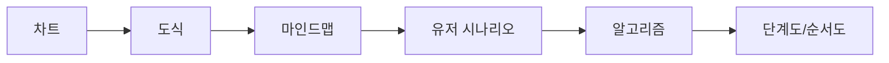

---

## 📊 8개 왕국 비율(%) 분석 — 운영 우선순위 설정

### 현황 데이터 (career-maker.json 기준)

| 순위 | 왕국 | Activities | Awards | Certs | 총계 | 비율(%) | 운영 우선도 |
|------|------|-----------|--------|-------|------|---------|------------|
| 1 | 🔬 **탐구 왕국** | 6 | 4 | 2 | **12** | **17.65%** | ⭐⭐⭐⭐⭐ |
| 2 | 💻 **기술 왕국** | 4 | 3 | 3 | **10** | **14.71%** | ⭐⭐⭐⭐ |
| 3 | 🎨 **창작 왕국** | 4 | 3 | 2 | **9** | **13.24%** | ⭐⭐⭐⭐ |
| 4 | 🚀 **도전 왕국** | 3 | 3 | 2 | 8 | 11.76% | ⭐⭐⭐ |
| 5 | 🌱 **자연 왕국** | 4 | 2 | 2 | 8 | 11.76% | ⭐⭐⭐ |
| 6 | 📣 **소통 왕국** | 3 | 2 | 2 | 7 | 10.29% | ⭐⭐⭐ |
| 7 | 🤝 **연결 왕국** | 3 | 2 | 2 | 7 | 10.29% | ⭐⭐⭐ |
| 8 | 🏛️ **질서 왕국** | 3 | 2 | 2 | 7 | 10.29% | ⭐⭐⭐ |
| **전체** | | **30** | **21** | **17** | **68** | **100%** | |

### 가이드 문서 기준 콘텐츠 밀도 (709개 항목 집계)

| 왕국 | Activities | Awards | Certs | 총계 | 비율(%) |
|------|-----------|--------|-------|------|---------|
| 🔬 탐구 | 66 | 29 | 27 | **122** | **17.21%** |
| 💻 기술 | 47 | 20 | 26 | **93** | **13.12%** |
| 📣 소통 | 42 | 23 | 24 | **89** | **12.55%** |
| 🏛️ 질서 | 39 | 25 | 24 | **88** | **12.41%** |
| 🚀 도전 | 40 | 25 | 19 | **84** | **11.85%** |
| 🌱 자연 | 42 | 20 | 17 | **79** | **11.14%** |
| 🎨 창작 | 38 | 23 | 16 | **77** | **10.86%** |
| 🤝 연결 | 42 | 18 | 17 | **77** | **10.86%** |

### Mermaid 차트 — 8개 왕국 비율 시각화

#### 1) 파이 차트 (career-maker.json 기준)

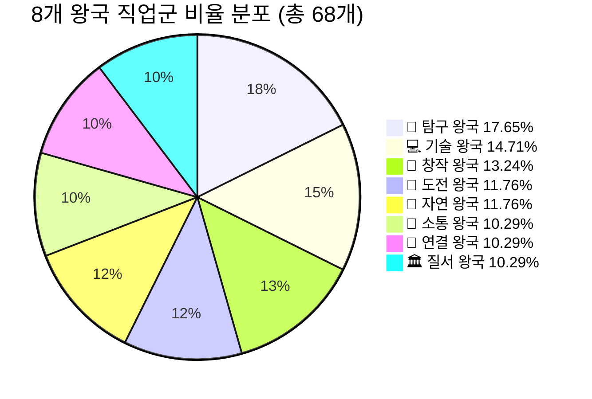

#### 2) 운영 우선순위 흐름도

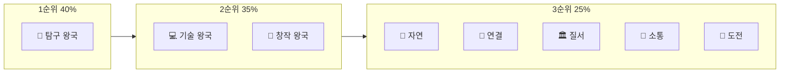

### 운영 전략 권장사항

```
🎯 운영 리소스 배분 (100% 기준)
├─ 40% → 탐구 왕국 (1순위)
│   └─ 연구/실험/데이터 기반 프로젝트 고도화
│   └─ AI 분석 도구 연동 강화
│
├─ 35% → 기술+창작 연계 (2순위)
│   └─ AI 서비스 제작 템플릿 확충
│   └─ UX/포트폴리오 자동화 도구
│
└─ 25% → 나머지 5개 왕국 (3순위)
    └─ 공통 프레임 재사용 (템플릿 방식)
    └─ 왕국 간 크로스오버 프로젝트
```

**핵심 인사이트**:
- 탐구 왕국이 **가장 많은 직업군**을 포함하며, 학종에서도 **연구/탐구 역량**이 가장 강력한 차별화 요소
- 기술+창작 조합은 **AI 시대 필수 역량**(개발+디자인)으로 시너지 극대화 가능
- 나머지 5개 왕국은 공통 프레임(문제정의→실행→결과→회고)을 재사용하면 효율적

---

## 🤖 AI 시대 학종 대비 공통 원칙

> **"AI를 썼다"가 아니라 "AI로 문제를 해결한 과정과 증거"가 핵심**

학종에서 평가하는 3대 요소:
1. **문제 정의**: 왜 이 문제를 선택했는가? (동기, 맥락)
2. **실행 과정**: 어떻게 해결했는가? (방법론, 시행착오, AI 활용 근거)
3. **결과와 성찰**: 무엇을 배웠는가? (데이터, 피드백, 한계 인식, 확장 가능성)

---

## 🔬 탐구 왕국

### 마인드맵

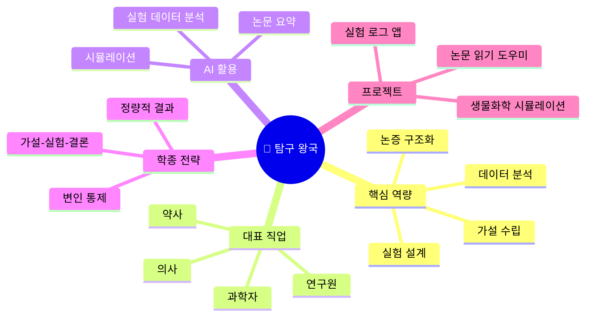

### 학종 핵심 전략

**학종 핵심**: 가설-실험-결론 구조 + 데이터 기반 논증

**AI 활용 전략**:
- 실험 데이터 분석 자동화 (Python pandas, scikit-learn)
- 논문 요약 및 선행연구 정리 (ChatGPT, Claude)
- 실험 로그 자동 기록 및 시각화 (Notion API + Chart.js)

**추천 프로젝트**:
1. **실험 로그 관리 앱** (React Native + Firebase)
   - 가설/변인/결과를 구조화해서 기록
   - AI가 실험 결과 패턴 분석 및 다음 실험 제안
   - 포트폴리오: 실험 보고서 자동 생성 기능

2. **논문 읽기 도우미 앱**
   - PDF 업로드 → AI가 핵심 내용 요약
   - 용어 사전 자동 생성
   - 세특 연결: "선행연구 30편 분석 → 연구 주제 도출 과정"

3. **생물/화학 시뮬레이션 도구**
   - Three.js로 분자 구조 3D 시각화
   - AI가 화학 반응식 균형 맞추기 도움
   - 학생부 기재: "화학 동아리에서 시뮬레이션 도구 제작 → 후배 교육 자료로 활용"

**세특 작성 예시**:
```
"코로나19 백신 효능 비교 탐구" 프로젝트에서 Python을 활용해 
공공 데이터 1,200건을 분석하고, AI 회귀 모델로 연령대별 효능 
차이를 예측. 실험 설계 과정에서 변인 통제의 중요성을 깨달았으며, 
결과를 인포그래픽으로 제작해 교내 과학 발표대회에서 최우수상 수상.
```

### 전통적 핵심 역량 vs AI 시대 요구 역량

#### 전통적 핵심 역량

| 역량 | 설명 | 평가 방법 |
|------|------|----------|
| **가설 수립** | 현상 관찰 → 원인 추론 → 검증 가능한 가설 도출 | 과학 탐구 보고서, 실험 설계서 |
| **실험 설계** | 독립변인·종속변인·통제변인 정의, 표본 크기 결정 | 실험 계획서, 변인 통제 능력 |
| **데이터 분석** | 통계 처리(평균, 표준편차, 상관계수), 그래프 시각화 | 데이터 해석 정확도, 오류 탐지 |
| **논리적 사고** | 귀납·연역 추론, 인과관계 파악, 반증 가능성 고려 | 논문 작성, 토의 능력 |
| **끈기와 인내** | 실험 반복, 실패 극복, 장기 프로젝트 완수 | 프로젝트 완성도, 반복 횟수 |

#### AI 시대 요구 역량

| 신규 역량 | 중요도 | 이유 | 학습 방법 |
|----------|--------|------|----------|
| **AI 도구 활용** | ⭐⭐⭐⭐⭐ | 데이터 분석 자동화, 패턴 발견 가속화 | Python(pandas, scikit-learn), ChatGPT 프롬프트 |
| **대규모 데이터 처리** | ⭐⭐⭐⭐⭐ | 공공 데이터, 논문 DB 활용 필수 | SQL, 크롤링, API 연동 |
| **학제간 융합** | ⭐⭐⭐⭐ | 생물+AI, 화학+컴퓨팅 등 융합 연구 증가 | 타 왕국 프로젝트 협업 |
| **윤리적 판단** | ⭐⭐⭐⭐ | AI 실험 결과의 편향성, 생명윤리 고려 | 생명윤리 교육, 사례 연구 |
| **빠른 문헌 조사** | ⭐⭐⭐⭐ | AI로 논문 요약, 선행연구 파악 시간 단축 | Semantic Scholar, ChatGPT |

### 직업 변동 (2024 → 2030)

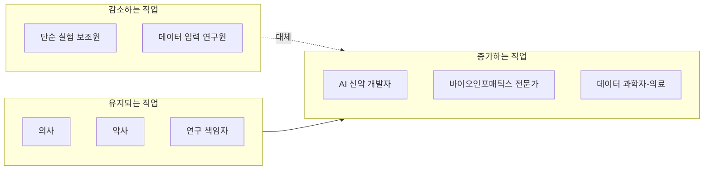

**핵심 변화**:
- **감소**: 단순 반복 실험, 데이터 정리 작업 → AI 자동화
- **유지**: 환자 진료, 약물 상담, 연구 기획 → 인간 판단 필수
- **증가**: AI + 생물학, AI + 화학, AI + 의료 융합 분야

### 학습 전략 (초·중·고 단계별)

| 학년 | 핵심 학습 | 추천 활동 | AI 도구 활용 |
|------|----------|----------|-------------|
| **초등 4~6** | 호기심 기반 관찰, 과학 독서 | 과학 실험 키트, 자연 관찰 일기 | ChatGPT로 "왜?"질문 답변 |
| **중등 1~3** | 기초 과학 심화, 실험 보고서 작성 | 과학 동아리, 탐구 대회 | Python 기초, 데이터 시각화 |
| **고등 1~2** | 심화 탐구, 논문 읽기, 대회 수상 | R&E, 과학 올림피아드, 봉사 | AI 논문 요약, 실험 로그 앱 |
| **고등 3** | 세특 정리, 면접 준비, 포트폴리오 | 탐구 발표, 교내 멘토링 | 면접 예상 질문 AI 생성 |

### 커리어 패스 작성법 (5단계)

#### Step 1: 관심 분야 구체화 (중1~중2)

```
질문 체크리스트:
□ 생물/화학/물리/지구과학 중 가장 흥미로운 분야는?
□ 의료/환경/에너지/우주 중 관심 있는 응용 분야는?
□ 이론 연구 vs 실험 연구 중 선호는?
□ 혼자 vs 팀 연구 중 선호는?
```

#### Step 2: 탐구 주제 선정 (중3~고1)

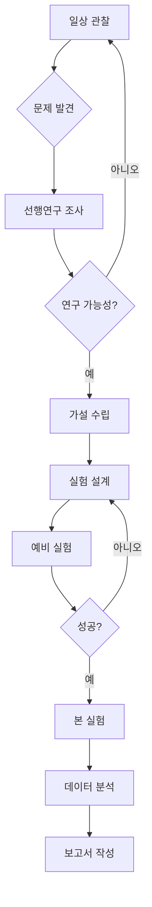

#### Step 3: 프로젝트 실행 (고1~고2)

| 월 | 활동 | 산출물 | AI 활용 |
|----|------|--------|---------|
| 3월 | 주제 선정, 문헌 조사 | 연구 계획서 | ChatGPT 논문 요약 |
| 4~5월 | 예비 실험 | 실험 노트 | Python 데이터 분석 |
| 6~7월 | 본 실험 반복 | 데이터 시트 | AI 패턴 분석 |
| 8월 | 데이터 분석 | 그래프, 통계 | 시각화 자동화 |
| 9~10월 | 보고서 작성 | 탐구 보고서 | AI 문법 교정 |
| 11월 | 발표 준비 | PPT, 포스터 | AI 슬라이드 디자인 |
| 12월 | 대회 출전 | 수상 실적 | - |

#### Step 4: 세특 연결 (고2~고3)

```
세특 작성 공식 (탐구 왕국):
[주제] + [가설] + [실험 방법] + [AI 활용] + [결과] + [한계 인식] + [확장 가능성]

예시:
"미세먼지가 식물 광합성에 미치는 영향 탐구" 프로젝트에서 
농도별(0, 50, 100㎍/㎥) 미세먼지 환경을 조성하고 4주간 광합성률 측정. 
Python으로 1,200개 데이터 포인트 분석 결과, 100㎍/㎥에서 광합성률 
35% 감소 확인. AI 회귀 모델로 농도-광합성률 관계식 도출. 
실험 과정에서 온도·습도 통제의 중요성을 깨달았으며, 
향후 실내 식물 공기정화 효율 연구로 확장 가능성 제시.
```

#### Step 5: 포트폴리오 구성

| 항목 | 내용 | 분량 | 형식 |
|------|------|------|------|
| 연구 계획서 | 주제, 가설, 방법론 | 3~5페이지 | PDF |
| 실험 노트 | 일자별 기록, 사진 | 20~30페이지 | Notion/OneNote |
| 데이터 시트 | 원본 데이터 | Excel/CSV | GitHub |
| 분석 코드 | Python/R 스크립트 | 100~300줄 | GitHub |
| 최종 보고서 | 논문 형식 | 10~15페이지 | PDF |
| 발표 자료 | PPT/포스터 | 10~15장 | PPT/Canva |

### 방법론 — 유저 시나리오·알고리즘·단계도·순서도

#### 1) 유저 시나리오: 실험 로그 관리 앱

| 시나리오 ID | 액터 | 목표 | 전제 조건 | 주요 단계 | 예상 결과 |
|-------------|------|------|----------|----------|----------|
| US-EXP-01 | 고등학생 김탐구 | 실험 결과를 체계적으로 기록하고 AI 분석을 받고 싶다 | 과학 동아리 활동 중 | 1. 가설 입력 2. 변인·결과 입력 3. AI 분석 요청 4. 보고서 초안 다운로드 | 실험 10회 기록, 패턴 분석 리포트 생성 |
| US-EXP-02 | 중학생 이실험 | 선행연구를 빠르게 파악하고 싶다 | 탐구 주제 선정 완료 | 1. PDF 업로드 2. AI 요약 요청 3. 핵심 용어 사전 생성 4. 인용 형식 자동 생성 | 논문 5편 요약, 용어 사전 30개 |
| US-EXP-03 | 교사 박과학 | 학생 실험 데이터를 한눈에 확인하고 싶다 | 학급 30명 실험 완료 | 1. 대시보드 접속 2. 학급별 필터 3. 시각화 차트 확인 4. 피드백 메시지 전송 | 학급 평균·표준편차, 이상치 탐지 |

#### 2) 알고리즘: 실험 데이터 → AI 패턴 분석

```
입력: 실험 로그 리스트 L = [(가설, 변인, 결과), ...]
출력: 패턴 분석 리포트 R

1. 데이터 전처리
   - L에서 결측치 제거
   - 변인 타입 분류 (독립변인/종속변인/통제변인)
   - 결과를 수치형으로 변환 (가능한 경우)

2. 통계 분석
   - 각 변인별 평균, 표준편차, 상관계수 계산
   - 이상치 탐지 (IQR 방법)
   - 유의미한 상관관계 추출 (p < 0.05)

3. AI 요약 생성
   - 통계 결과를 자연어로 변환
   - "다음 실험 제안" 3가지 생성 (LLM)
   - 보고서 구조화 (가설→방법→결과→토의→제안)

4. 출력 R 반환
```

#### 3) 단계도(플로우차트): 실험 로그 앱 전체 흐름

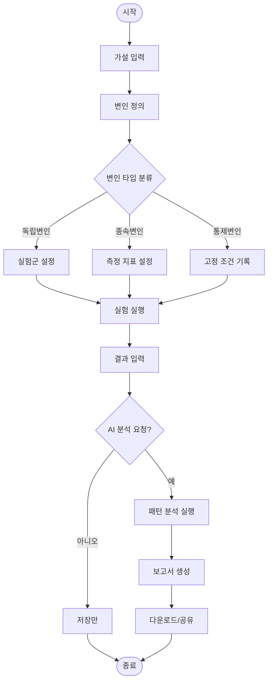

#### 4) 순서도(시퀀스 다이어그램): 논문 읽기 도우미

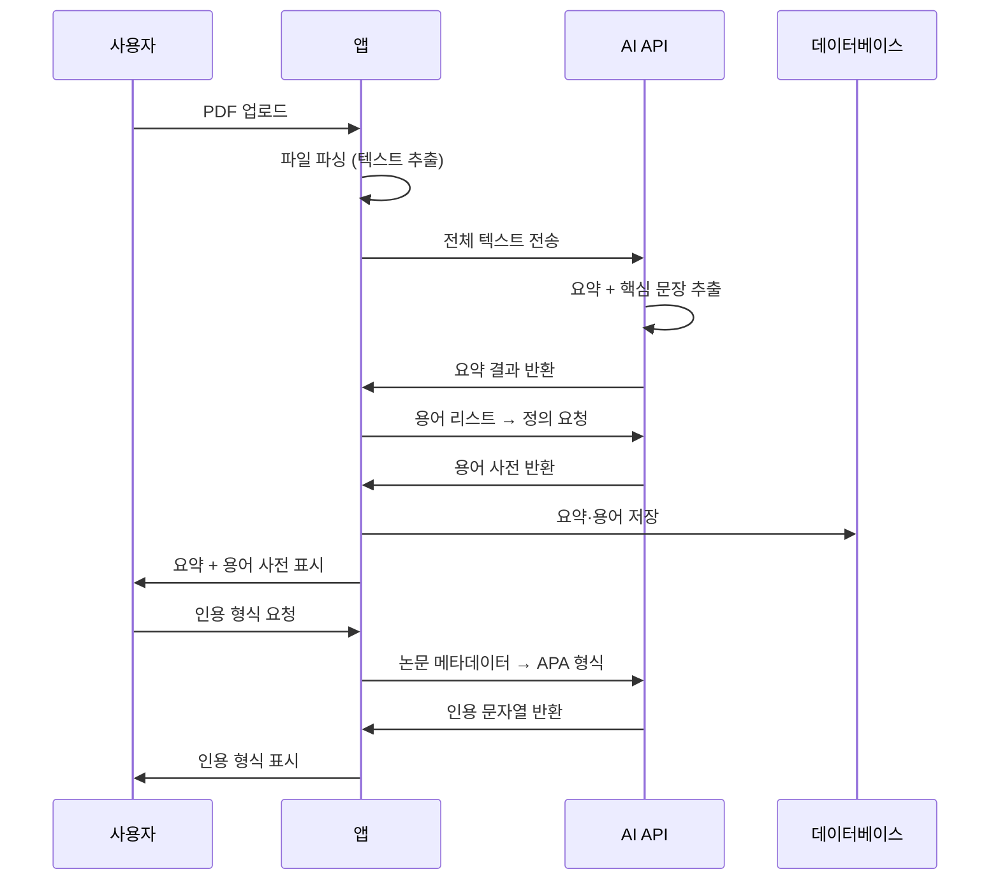

#### 5) 상태 다이어그램: 실험 프로젝트 생명주기

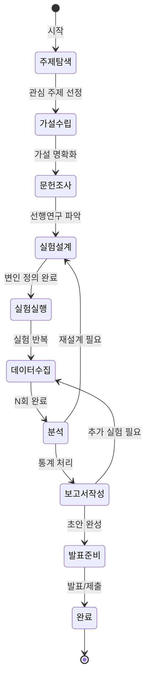

---

## 🎨 창작 왕국

### 마인드맵

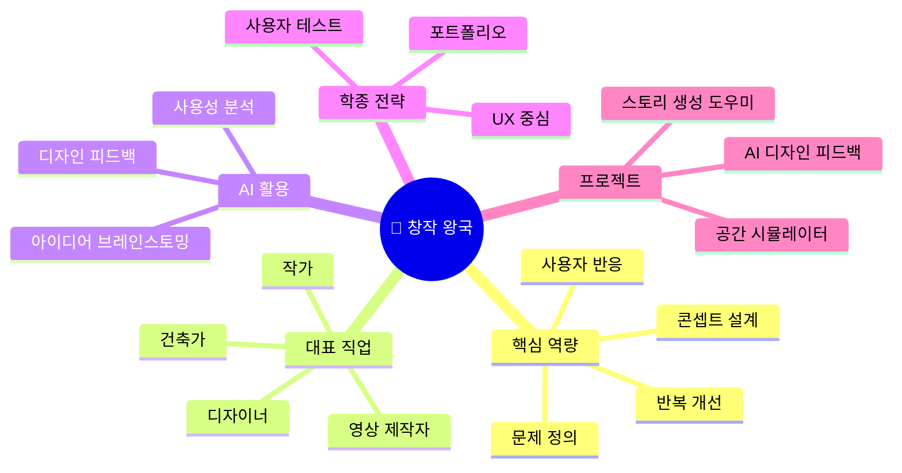

### 학종 핵심 전략

**학종 핵심**: 문제정의 → 콘셉트 → 사용자 반응 → 개선

**AI 활용 전략**:
- 디자인 피드백 자동화 (Figma + GPT-4 Vision API)
- 콘텐츠 아이디어 브레인스토밍 (ChatGPT, Midjourney)
- 사용자 반응 분석 (감성 분석, 클릭 히트맵)

**추천 프로젝트**:
1. **AI 디자인 피드백 앱** (Figma Plugin + OpenAI API)
   - 디자인 업로드 → AI가 UX 개선점 제안
   - 색상 조합, 레이아웃 균형, 접근성 자동 체크
   - 포트폴리오: "AI 피드백 기반 3회 반복 개선 → 사용성 테스트 점수 40% 향상"

2. **스토리 생성 도우미**
   - 키워드 입력 → AI가 플롯 아이디어 10개 제시
   - 캐릭터 설정, 갈등 구조 자동 생성
   - 세특 연결: "소설 창작 동아리에서 AI 도구 개발 → 부원 20명 활용"

3. **건축 공간 시뮬레이터**
   - Three.js + AI 공간 배치 최적화
   - 사용자 동선 시뮬레이션
   - 학생부 기재: "학교 도서관 리모델링 제안서 제작 → 교장 선생님께 프레젠테이션"

**세특 작성 예시**:
```
"학교 급식실 UX 개선" 프로젝트에서 학생 200명 설문조사 후 
Figma로 앱 프로토타입 제작. AI 피드백 도구를 활용해 색상 대비, 
버튼 크기 등 접근성 문제 5가지 발견 및 개선. 최종 디자인을 
영양사 선생님께 제안하여 실제 키오스크 도입 검토 중.
```

### 전통적 핵심 역량 vs AI 시대 요구 역량

#### 전통적 핵심 역량

| 역량 | 설명 | 평가 방법 |
|------|------|----------|
| **심미안** | 색상, 형태, 구도의 조화 감각 | 작품 포트폴리오, 전시 |
| **문제 정의** | 사용자 불편 → 디자인 과제 도출 | 리서치 보고서, 페르소나 |
| **콘셉트 설계** | 아이디어 → 시각/스토리 구조화 | 스케치, 무드보드 |
| **반복 개선** | 피드백 → 수정 → 재검증 | 버전 히스토리, A/B 테스트 |
| **도구 숙련도** | Figma, Photoshop, Premiere 등 | 작업 속도, 완성도 |

#### AI 시대 요구 역량

| 신규 역량 | 중요도 | 이유 | 학습 방법 |
|----------|--------|------|----------|
| **AI 프롬프트 디자인** | ⭐⭐⭐⭐⭐ | Midjourney, DALL-E로 아이디어 빠른 시각화 | 프롬프트 엔지니어링 실습 |
| **UX 데이터 분석** | ⭐⭐⭐⭐⭐ | 사용자 행동 데이터로 디자인 검증 | Google Analytics, Hotjar |
| **인간 중심 사고** | ⭐⭐⭐⭐⭐ | AI가 못하는 공감·맥락 이해 | 사용자 인터뷰, 관찰 조사 |
| **빠른 프로토타이핑** | ⭐⭐⭐⭐ | AI 도구로 MVP 제작 시간 단축 | Figma + AI 플러그인 |
| **스토리텔링** | ⭐⭐⭐⭐ | AI 생성 콘텐츠에 감정·맥락 부여 | 글쓰기, 영상 편집 |

### 직업 변동 (2024 → 2030)

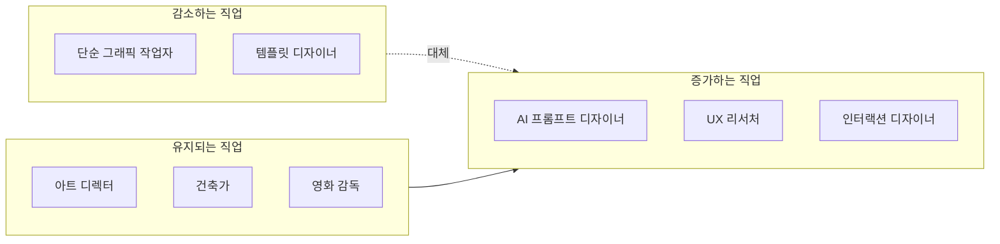

**핵심 변화**:
- **감소**: 배너, 로고 등 단순 그래픽 → AI 자동 생성
- **유지**: 전략 기획, 공간 설계, 스토리 연출 → 인간 창의성 필수
- **증가**: AI 협업 디자인, 사용자 경험 설계, 인터랙티브 콘텐츠

### 학습 전략 (초·중·고 단계별)

| 학년 | 핵심 학습 | 추천 활동 | AI 도구 활용 |
|------|----------|----------|-------------|
| **초등 4~6** | 자유로운 표현, 다양한 매체 경험 | 미술 학원, 만화/애니 감상 | Canva Kids로 디자인 놀이 |
| **중등 1~3** | 기초 디자인 이론, 포트폴리오 시작 | 디자인 동아리, 공모전 | Figma 기초, Midjourney |
| **고등 1~2** | 전문 도구 숙련, 사용자 리서치 | UX 프로젝트, 전시회 | AI 피드백 도구, 프로토타이핑 |
| **고등 3** | 포트폴리오 완성, 면접 준비 | 개인전, 온라인 전시 | AI 포트폴리오 리뷰 |

### 커리어 패스 작성법 (5단계)

#### Step 1: 관심 분야 구체화

```
질문 체크리스트:
□ 시각(그래픽/UI) vs 공간(건축/인테리어) vs 영상(영화/애니) vs 텍스트(소설/시나리오)?
□ 예술성 vs 실용성 중 선호는?
□ 개인 작업 vs 팀 협업 중 선호는?
□ 디지털 vs 아날로그 매체 중 선호는?
```

#### Step 2: 프로젝트 실행 (예: UX 디자인)

| 단계 | 활동 | 산출물 | AI 활용 |
|------|------|--------|---------|
| 1. 문제 정의 | 사용자 인터뷰 10명 | 페르소나 3개 | ChatGPT로 인터뷰 질문 생성 |
| 2. 아이디어 발산 | 브레인스토밍 | 아이디어 50개 | AI 아이디어 확장 |
| 3. 콘셉트 선정 | 투표, 평가 | 최종 콘셉트 1개 | - |
| 4. 와이어프레임 | 스케치, Figma | 화면 10개 | AI 레이아웃 제안 |
| 5. 프로토타입 | 인터랙션 구현 | 클릭 가능한 프로토타입 | Figma AI 플러그인 |
| 6. 사용성 테스트 | 사용자 10명 테스트 | 개선점 리스트 | AI 피드백 분석 |
| 7. 최종 디자인 | 수정 반영 | 최종 디자인 | AI 접근성 체크 |

#### Step 3: 세특 연결

```
세특 작성 공식 (창작 왕국):
[문제 상황] + [사용자 리서치] + [콘셉트] + [AI 활용] + [반복 개선] + [결과 지표]

예시:
"학교 급식실 키오스크 UX 개선" 프로젝트에서 학생 200명 설문조사 결과 
'메뉴 찾기 어려움(65%)'을 핵심 문제로 도출. Figma로 3가지 레이아웃 
프로토타입 제작 후 AI 피드백 도구로 색상 대비율, 터치 영역 크기 등 
접근성 문제 5가지 발견. 3회 반복 개선 결과 사용성 테스트 점수 
3.2/5.0 → 4.5/5.0으로 향상. 최종 디자인을 영양사 선생님께 제안하여 
실제 키오스크 도입 검토 중.
```

#### Step 4: 포트폴리오 구성

| 항목 | 내용 | 형식 |
|------|------|------|
| 프로젝트 개요 | 문제, 목표, 역할 | 1페이지 |
| 리서치 | 사용자 인터뷰, 경쟁사 분석 | 2~3페이지 |
| 아이디어 발산 | 스케치, 무드보드 | 1~2페이지 |
| 최종 디자인 | 고해상도 이미지 | 5~10페이지 |
| 프로세스 | 버전 히스토리, 피드백 | 2~3페이지 |
| 결과 | 사용자 반응, 지표 | 1페이지 |

### 방법론 — 유저 시나리오·알고리즘·단계도·순서도

#### 1) 유저 시나리오: AI 디자인 피드백 앱

| 시나리오 ID | 액터 | 목표 | 전제 조건 | 주요 단계 | 예상 결과 |
|-------------|------|------|----------|----------|----------|
| US-CRE-01 | UX 디자이너 지망생 | 디자인 개선점을 AI로 빠르게 받고 싶다 | Figma 프로토타입 완료 | 1. 스크린샷 업로드 2. AI 피드백 요청 3. 개선점 5개 수신 4. 수정 후 재요청 | 3회 반복 후 사용성 점수 40% 향상 |
| US-CRE-02 | 소설 동아리 부원 | 플롯 아이디어를 다양하게 받고 싶다 | 주제 키워드 3개 | 1. 키워드 입력 2. AI 플롯 10개 생성 3. 캐릭터 설정 요청 4. 갈등 구조 다이어그램 | 플롯 10개, 캐릭터 시트 5개 |
| US-CRE-03 | 건축 동아리 | 공간 배치를 시뮬레이션하고 싶다 | 평면도 데이터 | 1. 평면도 업로드 2. 용도·동선 입력 3. AI 최적 배치 제안 4. 3D 시각화 | 배치안 3종, 동선 시뮬레이션 |

#### 2) 알고리즘: 디자인 → UX 개선점 추출

```
입력: 디자인 이미지 I, 컨텍스트 C (앱/웹/포스터 등)
출력: 개선점 리스트 P = [(영역, 문제, 제안, 우선순위), ...]

1. 이미지 분석
   - 레이아웃 영역 분할 (헤더/본문/버튼/네비게이션)
   - 색상 팔레트 추출 (주조색, 보조색, 대비율)
   - 텍스트 가독성 점수 (크기, 대비, 행간)

2. 휴리스틱 평가
   - Nielsen 10원칙 기반 체크리스트
   - 접근성 WCAG 2.1 기준 (색맹, 스크린리더)
   - 모바일 터치 영역 (최소 44x44px)

3. AI 종합 분석
   - 1~2 결과를 LLM에 전달
   - "사용자 관점에서 개선점 5개" 생성
   - 우선순위 부여 (높음/중간/낮음)

4. P 반환
```

#### 3) 단계도: 창작 프로젝트 반복 사이클

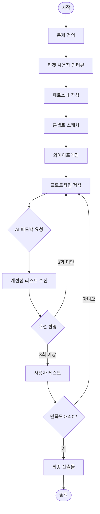

#### 4) 순서도: AI 디자인 피드백 요청

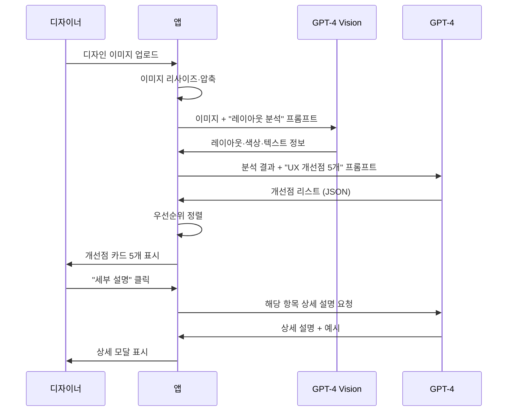

#### 5) 의사결정 트리: 콘텐츠 유형별 AI 활용

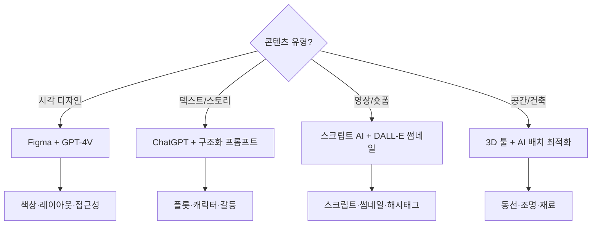

---

## 💻 기술 왕국

### 마인드맵

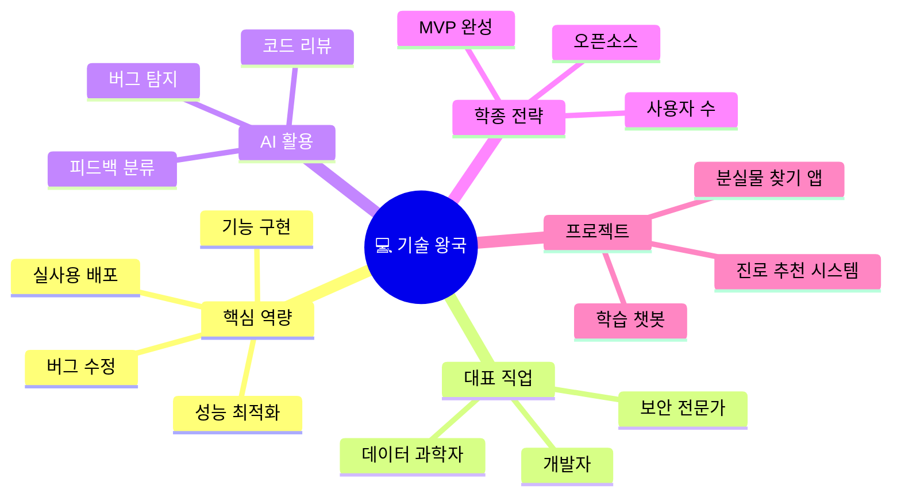

### 학종 핵심 전략

**학종 핵심**: 기능 구현 + 성능 개선 + 실사용 배포

**AI 활용 전략**:
- 코드 리뷰 자동화 (GitHub Copilot, ChatGPT)
- 버그 탐지 및 최적화 제안 (AI 정적 분석 도구)
- 사용자 피드백 자동 분류 (NLP 감성 분석)

**추천 프로젝트**:
1. **학습 보조 챗봇** (React + OpenAI API)
   - 과목별 질문 답변 (수학 문제 풀이, 영어 문법 설명)
   - 학습 기록 분석 → 취약점 진단
   - 포트폴리오: "교내 100명 사용 → 평균 학습 시간 25% 증가"

2. **진로 추천 시스템** (Python Flask + ML)
   - Holland 검사 결과 + 성적 + 관심사 입력
   - AI가 맞춤형 진로 3개 추천 + 로드맵 제시
   - 세특 연결: "진로 상담 시간에 활용 → 진로진학부 선생님 피드백 반영"

3. **교내 분실물 찾기 앱**
   - 이미지 업로드 → AI 객체 인식으로 유사 물품 매칭
   - 푸시 알림 자동 발송
   - 학생부 기재: "학생회와 협력해 앱 배포 → 분실물 찾기 성공률 60% 향상"

**세특 작성 예시**:
```
"교내 급식 메뉴 추천 앱" 개발 프로젝트에서 React Native로 
크로스 플랫폼 앱 구현. Firebase로 실시간 투표 기능 추가하고, 
AI 협업 필터링 알고리즘으로 개인 맞춤 메뉴 추천. 베타 테스트에서 
학생 150명 참여 → 만족도 4.2/5.0 달성. GitHub에 오픈소스로 공개.
```

### 전통적 핵심 역량 vs AI 시대 요구 역량

#### 전통적 핵심 역량

| 역량 | 설명 | 평가 방법 |
|------|------|----------|
| **알고리즘 사고** | 문제 → 단계별 해결 절차 설계 | 코딩 테스트, 알고리즘 대회 |
| **코드 작성** | 문법, 자료구조, 디버깅 | GitHub 커밋, 프로젝트 완성도 |
| **시스템 설계** | 아키텍처, DB 설계, API 설계 | 설계 문서, 확장성 |
| **문제 해결** | 버그 추적, 성능 최적화 | 디버깅 속도, 최적화 비율 |
| **협업** | Git, 코드 리뷰, 문서화 | PR 품질, 팀 평가 |

#### AI 시대 요구 역량

| 신규 역량 | 중요도 | 이유 | 학습 방법 |
|----------|--------|------|----------|
| **AI 모델 활용** | ⭐⭐⭐⭐⭐ | OpenAI API, Hugging Face 등 필수 | API 문서 읽기, 실습 |
| **프롬프트 엔지니어링** | ⭐⭐⭐⭐⭐ | AI 코드 생성, 디버깅 효율 극대화 | GitHub Copilot 활용 |
| **데이터 파이프라인** | ⭐⭐⭐⭐ | AI 모델 학습·배포 인프라 | Airflow, MLOps |
| **윤리·보안** | ⭐⭐⭐⭐ | AI 편향성, 개인정보 보호 | 보안 교육, 사례 연구 |
| **빠른 학습** | ⭐⭐⭐⭐⭐ | 기술 변화 속도 가속 | 공식 문서, 튜토리얼 |

### 직업 변동 (2024 → 2030)

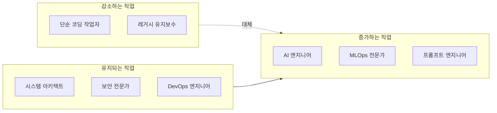

**핵심 변화**:
- **감소**: CRUD 반복 코딩, 단순 버그 수정 → AI 자동화
- **유지**: 아키텍처 설계, 보안 설계, 인프라 관리 → 전문성 필수
- **증가**: AI 모델 개발·배포, AI 서비스 기획, 프롬프트 최적화

### 학습 전략 (초·중·고 단계별)

| 학년 | 핵심 학습 | 추천 활동 | AI 도구 활용 |
|------|----------|----------|-------------|
| **초등 4~6** | 블록 코딩, 게임 만들기 | 스크래치, 엔트리 | ChatGPT로 코드 설명 |
| **중등 1~3** | Python 기초, 알고리즘 | 정보 올림피아드, 앱 개발 | GitHub Copilot |
| **고등 1~2** | 웹/앱 개발, AI API 연동 | 해커톤, 오픈소스 기여 | AI 코드 리뷰 |
| **고등 3** | 포트폴리오 완성, 기술 블로그 | 개인 프로젝트 배포 | AI 문서 자동 생성 |

### 커리어 패스 작성법 (5단계)

#### Step 1: 관심 분야 구체화

```
질문 체크리스트:
□ 프론트엔드(UI) vs 백엔드(서버) vs 풀스택 vs AI/ML?
□ 웹 vs 앱 vs 게임 vs 임베디드?
□ 개인 프로젝트 vs 팀 협업 vs 오픈소스?
□ 스타트업 vs 대기업 vs 프리랜서?
```

#### Step 2: 프로젝트 실행 (예: 학습 챗봇)

| 주차 | 활동 | 산출물 | AI 활용 |
|------|------|--------|---------|
| 1주 | 기획, 기술 스택 선정 | 기획서, 아키텍처 | ChatGPT 기획 검토 |
| 2주 | UI 개발 (React) | 화면 5개 | GitHub Copilot |
| 3주 | AI API 연동 (OpenAI) | 챗봇 기능 | API 문서 요약 |
| 4주 | 데이터베이스 연동 | 사용자 기록 저장 | AI SQL 쿼리 생성 |
| 5주 | 테스트, 버그 수정 | 테스트 케이스 10개 | AI 버그 탐지 |
| 6주 | 배포 (Vercel) | 배포 URL | AI 배포 가이드 |
| 7주 | 사용자 피드백 수집 | 설문 결과 | AI 피드백 분석 |
| 8주 | 개선 및 문서화 | README, 블로그 | AI 문서 작성 |

#### Step 3: 세특 연결

```
세특 작성 공식 (기술 왕국):
[문제] + [기술 스택] + [핵심 기능] + [AI 활용] + [사용자 수·만족도] + [오픈소스]

예시:
"교내 급식 메뉴 추천 앱" 개발 프로젝트에서 React Native로 
크로스 플랫폼 앱 구현. Firebase Realtime Database로 실시간 투표 기능 
추가하고, OpenAI API를 활용한 협업 필터링 알고리즘으로 개인 맞춤 
메뉴 추천 기능 구현. 베타 테스트에서 학생 150명 참여, 만족도 
4.2/5.0 달성. GitHub에 오픈소스로 공개하여 타 학교 3곳에서 포크.
```

#### Step 4: 포트폴리오 구성

| 항목 | 내용 | 플랫폼 |
|------|------|--------|
| GitHub 저장소 | 소스 코드, README | GitHub |
| 라이브 데모 | 실제 작동하는 앱/웹 | Vercel, Netlify |
| 기술 블로그 | 개발 과정, 트러블슈팅 | Velog, Medium |
| 발표 자료 | 아키텍처, 핵심 기능 | PPT, Notion |
| 사용자 피드백 | 설문 결과, 사용 통계 | Google Forms |

### 방법론 — 유저 시나리오·알고리즘·단계도·순서도

#### 1) 유저 시나리오: 학습 보조 챗봇

| 시나리오 ID | 액터 | 목표 | 전제 조건 | 주요 단계 | 예상 결과 |
|-------------|------|------|----------|----------|----------|
| US-TEC-01 | 고1 학생 | 수학 문제 풀이를 단계별로 받고 싶다 | 문제 이미지 또는 텍스트 | 1. 문제 입력 2. AI 풀이 요청 3. 단계별 설명 수신 4. 유사 문제 3개 추천 | 풀이 이해, 유사 문제 연습 |
| US-TEC-02 | 진로상담 선생님 | Holland 결과로 맞춤 진로를 제시하고 싶다 | 검사 결과 JSON | 1. 검사 결과 업로드 2. 성적·관심사 입력 3. AI 진로 3개 추천 4. 로드맵 PDF 생성 | 진로 3개, 학년별 로드맵 |
| US-TEC-03 | 학생회 | 분실물 찾기 성공률을 높이고 싶다 | 분실물 게시판 운영 중 | 1. 물품 사진 업로드 2. AI 유사 물품 매칭 3. 푸시 알림 발송 4. 찾음 처리 | 매칭률 60% 향상 |

#### 2) 알고리즘: 진로 추천 시스템

```
입력: Holland = {R,I,A,S,E,C}, 성적 = {과목별 등급}, 관심사 = [키워드 리스트]
출력: 추천 진로 3개 + 로드맵

1. Holland → 직업군 매핑
   - RIASEC 프로파일에서 상위 2개 코드 추출 (예: IR)
   - 8개 왕국 중 매칭도 높은 3개 선정
   - 직업 리스트에서 상위 10개 추출

2. 성적 필터링
   - 의대/법대 등 특정 진로의 최소 성적 조건 체크
   - 부적합 직업 제외

3. 관심사 가중치
   - 키워드와 직업 설명의 코사인 유사도 계산
   - 가중 평균으로 최종 점수 산출

4. AI 로드맵 생성
   - 선정된 직업 3개에 대해 "고1~고3 활동" LLM 생성
   - PDF 템플릿에 삽입

5. 출력 반환
```

#### 3) 단계도: MVP 개발 → 배포 사이클

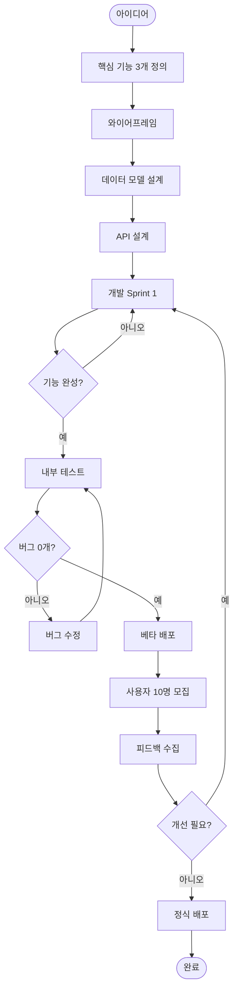

#### 4) 순서도: 학습 챗봇 대화 흐름

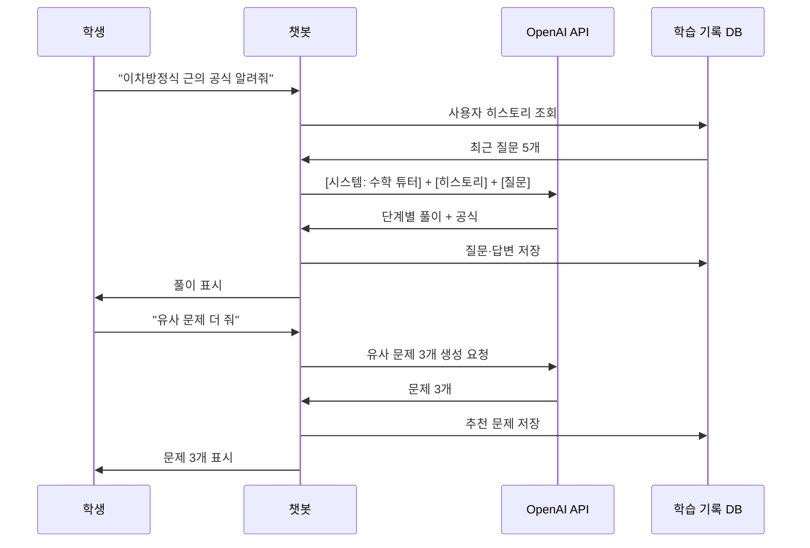

#### 5) 데이터 흐름도: 분실물 매칭 시스템

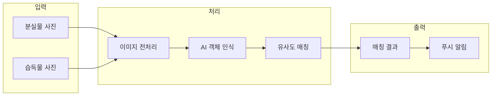

---

## 🌱 자연 왕국

### 마인드맵

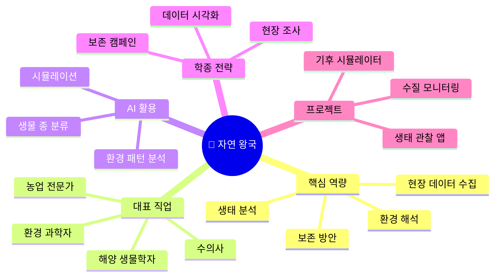

### 학종 핵심 전략

**학종 핵심**: 현장 데이터 수집 + 환경 해석 + 보존 방안 제시

**AI 활용 전략**:
- 생물 종 자동 분류 (이미지 인식 AI)
- 환경 데이터 패턴 분석 (기온, 수질, 대기질 시계열 분석)
- 생태계 시뮬레이션 (AI 예측 모델)

**추천 프로젝트**:
1. **생태 관찰 기록 앱** (React Native + TensorFlow.js)
   - 사진 촬영 → AI가 식물/동물 종 자동 인식
   - GPS 위치, 날씨, 메모 자동 기록
   - 포트폴리오: "학교 주변 생태 지도 제작 → 환경 동아리 활동 자료"

2. **수질 오염 모니터링 시스템**
   - IoT 센서 + AI 이상 탐지
   - 실시간 알림 + 오염원 추정
   - 세특 연결: "지역 하천 3개월 모니터링 → 환경청에 보고서 제출"

3. **기후 변화 시뮬레이터**
   - 공공 데이터 활용 + AI 예측 모델
   - 지역별 온도 상승 시나리오 시각화
   - 학생부 기재: "과학 동아리 발표 → 교내 환경 캠페인 기획"

**세특 작성 예시**:
```
"학교 숲 생태 조사" 프로젝트에서 AI 식물 인식 앱을 활용해 
수종 30종 분류 및 개체 수 기록. 3개월간 매주 관찰 데이터를 
수집하고, Python으로 생물 다양성 지수 계산. 결과를 인포그래픽으로 
제작해 학교 홈페이지에 게시 → 환경 보호 인식 개선 캠페인 전개.
```

### 전통적 핵심 역량 vs AI 시대 요구 역량

#### 전통적 핵심 역량

| 역량 | 설명 | 평가 방법 |
|------|------|----------|
| **관찰력** | 생태계 변화, 생물 행동 세밀 관찰 | 관찰 일지, 사진 기록 |
| **분류 능력** | 생물 종 동정, 환경 지표 분석 | 표본 수집, 분류 정확도 |
| **현장 조사** | 야외 데이터 수집, 표본 채집 | 조사 보고서, GPS 기록 |
| **생태 이해** | 먹이사슬, 생태계 균형, 순환 | 생태 지도, 다양성 지수 |
| **보존 의식** | 환경 문제 인식, 실천 방안 | 캠페인, 봉사 활동 |

#### AI 시대 요구 역량

| 신규 역량 | 중요도 | 이유 | 학습 방법 |
|----------|--------|------|----------|
| **AI 이미지 인식** | ⭐⭐⭐⭐⭐ | 생물 종 자동 분류, 빠른 동정 | TensorFlow, iNaturalist |
| **환경 데이터 분석** | ⭐⭐⭐⭐⭐ | 기후·수질·대기 빅데이터 처리 | Python, 공공 데이터 API |
| **GIS 활용** | ⭐⭐⭐⭐ | 생태 지도, 서식지 분석 | QGIS, Google Earth Engine |
| **IoT 센서** | ⭐⭐⭐⭐ | 실시간 환경 모니터링 | Arduino, Raspberry Pi |
| **시뮬레이션** | ⭐⭐⭐⭐ | 생태계 변화 예측 모델 | NetLogo, AI 예측 모델 |

### 직업 변동 (2024 → 2030)

```mermaid
flowchart LR
    subgraph 감소["감소하는 직업"]
        A1[단순 표본 분류 작업자]
        A2[수동 데이터 기록원]
    end
    subgraph 유지["유지되는 직업"]
        B1[수의사]
        B2[환경 컨설턴트]
        B3[생태 복원 전문가]
    end
    subgraph 증가["증가하는 직업"]
        C1[환경 데이터 과학자]
        C2[기후 변화 모델러]
        C3[AI 생물 인식 전문가]
    end
    감소 -.대체.-> 증가
    유지 --> 증가
```

**핵심 변화**:
- **감소**: 단순 표본 분류, 수동 기록 → AI 자동화
- **유지**: 동물 진료, 현장 판단, 복원 설계 → 전문성 필수
- **증가**: 환경 빅데이터 분석, AI 생태 모델링, 스마트 농업

### 학습 전략 (초·중·고 단계별)

| 학년 | 핵심 학습 | 추천 활동 | AI 도구 활용 |
|------|----------|----------|-------------|
| **초등 4~6** | 자연 관찰, 생물 다양성 | 숲 체험, 생태 캠프 | iNaturalist 앱 |
| **중등 1~3** | 생물·지구과학 심화 | 환경 동아리, 생태 조사 | AI 식물 인식 앱 |
| **고등 1~2** | 환경 데이터 분석, 보존 프로젝트 | R&E, 환경 대회 | Python 데이터 분석 |
| **고등 3** | 생태 지도 완성, 캠페인 | 환경 봉사, 발표회 | AI 시뮬레이션 |

### 커리어 패스 작성법 (5단계)

#### Step 1: 관심 분야 구체화

```
질문 체크리스트:
□ 육상(숲·산) vs 수중(바다·강) vs 대기(기후) vs 토양?
□ 동물 vs 식물 vs 미생물 vs 생태계 전체?
□ 보존 vs 복원 vs 연구 vs 교육?
□ 현장 활동 vs 실험실 vs 데이터 분석?
```

#### Step 2: 프로젝트 실행 (예: 학교 숲 생태 조사)

| 월 | 활동 | 산출물 | AI 활용 |
|----|------|--------|---------|
| 3월 | 조사 지역 선정, 문헌 조사 | 조사 계획서 | ChatGPT 문헌 요약 |
| 4~6월 | 매주 관찰, 사진 촬영 | 관찰 일지 300장 | AI 종 인식 (iNaturalist) |
| 7월 | 데이터 정리, 분류 | 수종 목록 30종 | Python 데이터 정리 |
| 8월 | 생물 다양성 지수 계산 | 통계 분석 | AI 시각화 |
| 9~10월 | 생태 지도 제작 | GIS 지도 | QGIS + AI 분석 |
| 11월 | 보고서 작성 | 탐구 보고서 | AI 문법 교정 |
| 12월 | 환경 캠페인 | 포스터, 발표 | AI 디자인 도구 |

#### Step 3: 세특 연결

```
세특 작성 공식 (자연 왕국):
[조사 지역] + [방법론] + [AI 활용] + [결과 데이터] + [생태 해석] + [보존 제안]

예시:
"학교 숲 생태 조사" 프로젝트에서 3개월간 매주 관찰을 통해 
수종 30종, 조류 15종, 곤충 20종 기록. AI 식물 인식 앱(iNaturalist)으로 
분류 정확도 95% 달성. Python으로 생물 다양성 지수(Shannon Index) 
계산 결과 H'=2.8로 중간 수준 확인. GIS 지도로 서식지 분포 시각화하고, 
외래종 3종 발견하여 제거 캠페인 전개. 결과를 학교 홈페이지에 게시하여 
환경 보호 인식 개선.
```

#### Step 4: 포트폴리오 구성

| 항목 | 내용 | 형식 |
|------|------|------|
| 조사 계획서 | 목적, 방법, 일정 | PDF |
| 관찰 일지 | 사진, 메모, GPS | Notion |
| 데이터 시트 | 종 목록, 개체 수 | Excel/CSV |
| 생태 지도 | GIS 시각화 | PNG/PDF |
| 분석 보고서 | 다양성 지수, 해석 | PDF |
| 캠페인 자료 | 포스터, 영상 | JPG/MP4 |

### 방법론 — 유저 시나리오·알고리즘·단계도·순서도

#### 1) 유저 시나리오: 생태 관찰 기록 앱

| 시나리오 ID | 액터 | 목표 | 전제 조건 | 주요 단계 | 예상 결과 |
|-------------|------|------|----------|----------|----------|
| US-NAT-01 | 환경 동아리 부원 | 식물·동물을 촬영하면 자동으로 종을 알아보고 싶다 | 야외 활동 중 | 1. 사진 촬영 2. AI 종 인식 3. GPS·날씨 자동 기록 4. 관찰 기록 저장 | 수종 30종 분류, 생태 지도 |
| US-NAT-02 | 과학 동아리 | 하천 수질을 장기 모니터링하고 싶다 | IoT 센서 보유 | 1. 센서 데이터 수집 2. AI 이상치 탐지 3. 알림 발송 4. 보고서 자동 생성 | 3개월 데이터, 이상치 5회 탐지 |
| US-NAT-03 | 교사 | 기후 변화를 시각적으로 보여주고 싶다 | 공공 데이터 API | 1. 지역·기간 입력 2. AI 예측 모델 실행 3. 시나리오 시각화 4. 교육 자료 PDF | 2050년 시나리오 3종 |

#### 2) 알고리즘: 생물 종 이미지 인식 → 관찰 기록

```
입력: 이미지 I, GPS 좌표, 날짜, 시간
출력: 관찰 기록 O = {종명, 신뢰도, 위치, 날씨, 메모}

1. 이미지 전처리
   - 리사이즈 (224x224)
   - 정규화
   - 증강 (선택)

2. AI 분류
   - MobileNet/EfficientNet 등 모델 로드
   - 추론 → 상위 3개 종 + 신뢰도
   - 신뢰도 < 0.7이면 "미확인" 처리

3. 메타데이터 수집
   - GPS → 위도/경도
   - 날짜·시간 → API로 날씨 조회
   - 사용자 메모 (선택)

4. O 생성 및 저장
```

#### 3) 단계도: 생태 조사 프로젝트 과정

```mermaid
flowchart TD
    Start([조사 시작]) --> A[조사 지역 선정]
    A --> B[문헌 조사]
    B --> C[예비 조사]
    C --> D[조사 설계]
    D --> E[표본 채집/촬영]
    E --> F[AI 종 분류]
    F --> G{신뢰도 ≥ 0.8?}
    G -->|아니오| H[전문가 확인]
    G -->|예| I[기록 저장]
    H --> I
    I --> J[데이터 시각화]
    J --> K[생물 다양성 지수 계산]
    K --> L[보고서 작성]
    L --> M[발표/보존 캠페인]
    M --> End([종료])
```

#### 4) 순서도: 수질 모니터링 이상 탐지

```mermaid
sequenceDiagram
    participant S as IoT 센서
    participant G as 게이트웨이
    participant AI as 이상 탐지 모델
    participant DB as 시계열 DB
    participant U as 사용자

    loop 1시간마다
        S->>G: pH, DO, 탁도 전송
        G->>DB: 데이터 저장
        G->>AI: 최근 24시간 데이터
        AI->>AI: LSTM/이상치 탐지
        alt 이상치 발견
            AI->>U: 푸시 알림
            AI->>DB: 이상 이벤트 기록
        end
    end
```

---

## 🤝 연결 왕국

### 마인드맵

```mermaid
mindmap
  root((🤝 연결 왕국))
    핵심 역량
      사회문제 정의
      개입 효과 측정
      지속 가능성
      공감 능력
    대표 직업
      사회복지사
      상담사
      교사
      간호사
    AI 활용
      상담 기록 요약
      감정 분석
      매칭 자동화
    학종 전략
      봉사 기록
      효과 측정
      공동체 기여
    프로젝트
      봉사 매칭 앱
      또래 상담 챗봇
      멘토링 플랫폼
```

### 학종 핵심 전략

**학종 핵심**: 사회문제 정의 + 개입 효과 측정 + 지속 가능성

**AI 활용 전략**:
- 상담 기록 자동 요약 (NLP 텍스트 요약)
- 감정 분석 (음성/텍스트 감성 분석)
- 봉사 매칭 자동화 (추천 시스템)

**추천 프로젝트**:
1. **봉사 매칭 앱** (React + Firebase + AI 추천)
   - 관심사, 시간, 지역 입력 → AI가 맞춤 봉사 활동 추천
   - 봉사 시간 자동 기록 + 인증서 발급
   - 포트폴리오: "교내 봉사 동아리 50명 사용 → 봉사 참여율 30% 증가"

2. **또래 상담 챗봇**
   - 익명 고민 상담 + AI가 공감 메시지 제안
   - 위기 상황 자동 감지 → 전문 상담사 연결
   - 세특 연결: "또래상담사 활동과 연계 → 상담 건수 월 20건 처리"

3. **멘토링 매칭 플랫폼**
   - 학습 멘토-멘티 자동 매칭 (AI 협업 필터링)
   - 학습 진도 추적 + 피드백 자동 생성
   - 학생부 기재: "학습 멘토링 봉사 100시간 + 플랫폼 개발로 효율 2배 향상"

**세특 작성 예시**:
```
"교내 학습 멘토링 프로그램" 운영에서 AI 매칭 시스템을 개발해 
멘토-멘티 궁합도 85% 달성. 멘티 30명의 학습 데이터를 분석하고, 
취약 과목별 맞춤 학습 자료 추천 기능 추가. 학기말 설문조사에서 
만족도 4.5/5.0 기록 → 다음 학기 프로그램 확대 운영 확정.
```

### 전통적 핵심 역량 vs AI 시대 요구 역량

#### 전통적 핵심 역량

| 역량 | 설명 | 평가 방법 |
|------|------|----------|
| **공감 능력** | 타인의 감정·상황 이해 | 상담 기록, 피드백 |
| **경청** | 적극적 듣기, 비언어 신호 파악 | 상담 평가, 관찰 |
| **문제 해결** | 사회문제 정의 → 개입 방안 | 프로젝트 보고서 |
| **네트워킹** | 자원 연결, 협력 구축 | 봉사 시간, 파트너십 |
| **지속 가능성** | 일회성 아닌 장기 효과 | 사후 평가, 재참여율 |

#### AI 시대 요구 역량

| 신규 역량 | 중요도 | 이유 | 학습 방법 |
|----------|--------|------|----------|
| **감정 분석** | ⭐⭐⭐⭐⭐ | AI로 상담 기록 요약, 위기 감지 | NLP, 감성 분석 API |
| **데이터 기반 개입** | ⭐⭐⭐⭐ | 효과 측정, 증거 기반 실천 | 설문 분석, 통계 |
| **매칭 알고리즘** | ⭐⭐⭐⭐ | 멘토-멘티, 봉사 매칭 자동화 | 추천 시스템 |
| **디지털 소통** | ⭐⭐⭐⭐ | 온라인 상담, 챗봇 활용 | 챗봇 설계, UX |
| **윤리·개인정보** | ⭐⭐⭐⭐⭐ | 상담 기록 보안, AI 편향 방지 | 윤리 교육 |

### 직업 변동 (2024 → 2030)

```mermaid
flowchart LR
    subgraph 감소["감소하는 직업"]
        A1[단순 행정 업무]
        A2[정보 제공 상담원]
    end
    subgraph 유지["유지되는 직업"]
        B1[사회복지사]
        B2[심리 상담사]
        B3[간호사]
    end
    subgraph 증가["증가하는 직업"]
        C1[AI 상담 설계자]
        C2[커뮤니티 매니저]
        C3[사회 데이터 분석가]
    end
    감소 -.대체.-> 증가
    유지 --> 증가
```

**핵심 변화**:
- **감소**: 단순 정보 제공, 행정 처리 → AI 챗봇 대체
- **유지**: 심층 상담, 위기 개입, 간호 → 인간 공감 필수
- **증가**: AI 상담 시스템 설계, 온라인 커뮤니티 운영, 사회 데이터 분석

### 학습 전략 (초·중·고 단계별)

| 학년 | 핵심 학습 | 추천 활동 | AI 도구 활용 |
|------|----------|----------|-------------|
| **초등 4~6** | 공감, 경청, 협력 놀이 | 또래 중재, 봉사 체험 | - |
| **중등 1~3** | 또래상담사, 봉사 시작 | 또래상담, 복지관 봉사 | 챗봇 체험 |
| **고등 1~2** | 사회문제 프로젝트, 효과 측정 | 멘토링, 캠페인 | AI 매칭, 감정 분석 |
| **고등 3** | 봉사 포트폴리오, 면접 준비 | 봉사 100시간+ | AI 상담 시뮬레이션 |

### 커리어 패스 작성법 (5단계)

#### Step 1: 관심 분야 구체화

```
질문 체크리스트:
□ 아동 vs 청소년 vs 노인 vs 장애인 vs 다문화?
□ 상담 vs 복지 vs 교육 vs 의료?
□ 1:1 vs 집단 vs 지역사회?
□ 예방 vs 치료 vs 재활?
```

#### Step 2: 프로젝트 실행 (예: 학습 멘토링)

| 월 | 활동 | 산출물 | AI 활용 |
|----|------|--------|---------|
| 3월 | 멘티 모집, 매칭 | 멘토-멘티 30쌍 | AI 매칭 알고리즘 |
| 4~6월 | 주 1회 멘토링 | 학습 기록 360건 | AI 진도 추적 |
| 7월 | 중간 평가 | 설문 결과 | AI 피드백 분석 |
| 8~10월 | 멘토링 지속 | 학습 기록 360건 | AI 취약점 진단 |
| 11월 | 최종 평가 | 성적 향상 데이터 | 통계 분석 |
| 12월 | 보고서, 발표 | 멘토링 보고서 | AI 문서 작성 |

#### Step 3: 세특 연결

```
세특 작성 공식 (연결 왕국):
[대상] + [문제] + [개입 방법] + [AI 활용] + [효과 데이터] + [지속 가능성]

예시:
"교내 학습 멘토링 프로그램" 운영에서 AI 매칭 시스템을 개발해 
멘토-멘티 궁합도 85% 달성. 멘티 30명의 학습 데이터를 분석하고, 
취약 과목별 맞춤 학습 자료 추천 기능 추가. 6개월간 주 1회 멘토링 
진행 결과, 멘티 평균 성적 2.8등급 → 2.3등급 향상. 학기말 설문조사에서 
만족도 4.5/5.0 기록. 다음 학기 프로그램 확대 운영 확정.
```

#### Step 4: 포트폴리오 구성

| 항목 | 내용 | 형식 |
|------|------|------|
| 기획서 | 목적, 대상, 방법 | PDF |
| 매칭 시스템 | 알고리즘 설명 | 문서 + 코드 |
| 활동 기록 | 멘토링 일지 | Notion |
| 효과 분석 | 성적 변화, 설문 | Excel + 그래프 |
| 사진·영상 | 활동 모습 | JPG/MP4 |
| 봉사 확인서 | 봉사 시간 인증 | PDF |

### 방법론 — 유저 시나리오·알고리즘·단계도·순서도

#### 1) 유저 시나리오: 봉사 매칭 앱

| 시나리오 ID | 액터 | 목표 | 전제 조건 | 주요 단계 | 예상 결과 |
|-------------|------|------|----------|----------|----------|
| US-CON-01 | 봉사 동아리 부원 | 관심사에 맞는 봉사를 찾고 싶다 | 관심사·가능 시간 입력 | 1. 프로필 입력 2. AI 추천 5개 3. 상세 확인 4. 신청 | 5개 추천, 봉사 1개 신청 |
| US-CON-02 | 또래상담사 | 상담 기록을 요약하고 위기 감지하고 싶다 | 상담 기록 텍스트 | 1. 기록 입력 2. AI 요약 3. 감정 분석 4. 위기 시 전문가 연결 | 요약본, 위기 알림 |
| US-CON-03 | 멘토 | 멘티와 궁합이 맞는지 확인하고 싶다 | 멘토·멘티 프로필 | 1. 프로필 매칭 2. AI 궁합도 3. 학습 진도 추적 4. 피드백 자동 생성 | 궁합도 85%, 월간 리포트 |

#### 2) 알고리즘: 봉사 매칭 추천

```
입력: 사용자 U = {관심사, 시간, 지역, 봉사 경험}
출력: 추천 봉사 리스트 R = [봉사1, 봉사2, ...]

1. 봉사 DB 필터링
   - 지역 일치
   - 시간대 겹침
   - 모집 중

2. 협업 필터링
   - U와 유사한 사용자가 신청한 봉사 가중치 부여
   - U의 관심사와 봉사 태그 코사인 유사도

3. 콘텐츠 기반 필터링
   - 관심사 키워드와 봉사 설명 매칭
   - 봉사 경험과 신규 봉사 난이도 매칭

4. 하이브리드 점수
   - 협업 0.4 + 콘텐츠 0.6 가중 평균
   - 상위 5개 반환
```

#### 3) 단계도: 봉사 활동 전체 사이클

```mermaid
flowchart TD
    Start([봉사 관심]) --> A[프로필 작성]
    A --> B[AI 추천 수신]
    B --> C[봉사 선택]
    C --> D[신청]
    D --> E{승인?}
    E -->|거절| B
    E -->|승인| F[봉사 참여]
    F --> G[참여 기록]
    G --> H[인증서 발급]
    H --> I[효과 측정 설문]
    I --> J[다음 봉사 추천]
    J --> B
```

#### 4) 순서도: 또래 상담 챗봇 위기 감지

```mermaid
sequenceDiagram
    participant S as 학생
    participant C as 챗봇
    participant AI as 감정/위기 분석
    participant M as 전문 상담사

    S->>C: 고민 텍스트 입력
    C->>AI: 텍스트 전송
    AI->>AI: 감정 분석 (부정/불안/우울)
    AI->>AI: 위기 키워드 탐지 (자해, 극단 등)
    AI->>C: 감정 점수 + 위기 플래그
    alt 위기 플래그 ON
        C->>M: 알림 + 대화 내용
        C->>S: "전문 상담사 연결 도와드릴까요?"
    else 정상
        C->>AI: 공감 응답 생성
        AI->>C: 응답 텍스트
        C->>S: 공감 메시지 표시
    end
```

---

## 🏛️ 질서 왕국

### 마인드맵

```mermaid
mindmap
  root((🏛️ 질서 왕국))
    핵심 역량
      이슈 구조화
      근거 기반 논증
      정책 분석
      법률 해석
    대표 직업
      변호사
      외교관
      공무원
      경제학자
    AI 활용
      법령 검색
      시사 브리핑
      정책 시뮬레이션
    학종 전략
      토론 준비
      논거 정리
      찬반 분석
    프로젝트
      시사 브리핑 앱
      법령 검색 도우미
      정책 시뮬레이터
```

### 학종 핵심 전략

**학종 핵심**: 정책/법/경제 이슈 구조화 + 근거 기반 논증

**AI 활용 전략**:
- 판례/법령 자동 검색 및 요약 (LLM RAG 시스템)
- 시사 이슈 브리핑 자동 생성 (뉴스 크롤링 + 요약)
- 정책 효과 시뮬레이션 (경제 모델링)

**추천 프로젝트**:
1. **시사 이슈 브리핑 앱** (React + News API + OpenAI)
   - 키워드 입력 → AI가 관련 뉴스 10개 요약
   - 찬반 논거 자동 정리 + 토론 포인트 제시
   - 포트폴리오: "토론 동아리에서 주간 브리핑 자료로 활용"

2. **법령 검색 도우미**
   - 일상 법률 질문 → AI가 관련 법령 + 판례 제시
   - 청소년 법률 교육용 퀴즈 생성
   - 세특 연결: "사회 시간에 법률 교육 자료로 활용 → 학급 법률 상식 향상"

3. **정책 효과 시뮬레이터**
   - 정책 시나리오 입력 → AI가 경제 지표 변화 예측
   - 시각화 대시보드 (Chart.js)
   - 학생부 기재: "경제 동아리 정책 토론회에서 시뮬레이션 결과 발표"

**세특 작성 예시**:
```
"청소년 노동권 보호" 주제 탐구에서 AI 법령 검색 도구를 활용해 
근로기준법 관련 조항 15개 분석. 아르바이트 경험 설문조사(200명)와 
법령을 비교하여 권리 침해 사례 5가지 발견. 결과를 인포그래픽으로 
제작해 학교 게시판 게시 → 청소년 노동권 인식 개선 캠페인 전개.
```

### 전통적 핵심 역량 vs AI 시대 요구 역량

#### 전통적 핵심 역량

| 역량 | 설명 | 평가 방법 |
|------|------|----------|
| **논리적 사고** | 전제 → 추론 → 결론 구조화 | 논술, 토론 |
| **법률·정책 이해** | 법령, 판례, 정책 해석 | 모의재판, 정책 제안 |
| **근거 기반 논증** | 데이터, 사례로 주장 뒷받침 | 토론 대회, 논문 |
| **비판적 사고** | 다양한 관점, 반론 고려 | 찬반 토론, 에세이 |
| **공정성** | 편향 없는 판단, 절차 준수 | 모의UN, 재판 |

#### AI 시대 요구 역량

| 신규 역량 | 중요도 | 이유 | 학습 방법 |
|----------|--------|------|----------|
| **법률 AI 활용** | ⭐⭐⭐⭐⭐ | 판례·법령 검색 자동화 | LegalTech, RAG 시스템 |
| **데이터 기반 정책** | ⭐⭐⭐⭐⭐ | 증거 기반 정책 입안 | 공공 데이터 분석 |
| **시뮬레이션** | ⭐⭐⭐⭐ | 정책 효과 예측 모델 | 경제 모델링, AI |
| **빠른 정보 종합** | ⭐⭐⭐⭐ | AI로 시사 이슈 브리핑 | 뉴스 API, 요약 AI |
| **윤리적 AI 판단** | ⭐⭐⭐⭐ | AI 판결의 공정성 검증 | AI 윤리 교육 |

### 직업 변동 (2024 → 2030)

```mermaid
flowchart LR
    subgraph 감소["감소하는 직업"]
        A1[단순 법률 검색 보조]
        A2[행정 서류 처리]
    end
    subgraph 유지["유지되는 직업"]
        B1[판사]
        B2[변호사]
        B3[외교관]
    end
    subgraph 증가["증가하는 직업"]
        C1[AI 법률 시스템 설계자]
        C2[정책 데이터 분석가]
        C3[국제 협상 전문가]
    end
    감소 -.대체.-> 증가
    유지 --> 증가
```

**핵심 변화**:
- **감소**: 단순 법령 검색, 서류 작성 → AI 자동화
- **유지**: 판결, 변론, 외교 협상 → 인간 판단 필수
- **증가**: AI 법률 시스템 개발, 정책 시뮬레이션, 국제 분쟁 조정

### 학습 전략 (초·중·고 단계별)

| 학년 | 핵심 학습 | 추천 활동 | AI 도구 활용 |
|------|----------|----------|-------------|
| **초등 4~6** | 규칙, 공정성 이해 | 학급 회의, 모의재판 | - |
| **중등 1~3** | 시사, 토론 시작 | 토론 동아리, 모의UN | ChatGPT 논거 정리 |
| **고등 1~2** | 법률·정책 심화, 대회 | 토론 대회, 정책 제안 | AI 브리핑, 법령 검색 |
| **고등 3** | 논술, 면접 준비 | 모의면접, 논술 | AI 논술 첨삭 |

### 커리어 패스 작성법 (5단계)

#### Step 1: 관심 분야 구체화

```
질문 체크리스트:
□ 법률(민사/형사/행정) vs 정치(입법/행정) vs 경제(금융/무역) vs 외교?
□ 국내 vs 국제?
□ 이론 vs 실무?
□ 공공 vs 민간?
```

#### Step 2: 프로젝트 실행 (예: 청소년 노동권 탐구)

| 월 | 활동 | 산출물 | AI 활용 |
|----|------|--------|---------|
| 3월 | 주제 선정, 문헌 조사 | 연구 계획서 | ChatGPT 문헌 요약 |
| 4~5월 | 법령 분석 | 근로기준법 15조항 | AI 법령 검색 (RAG) |
| 6~7월 | 설문조사 | 아르바이트 경험 200명 | AI 설문 분석 |
| 8월 | 데이터 분석 | 권리 침해 사례 5가지 | Python 통계 |
| 9~10월 | 보고서 작성 | 탐구 보고서 | AI 문법 교정 |
| 11월 | 인포그래픽 제작 | 포스터 | AI 디자인 도구 |
| 12월 | 캠페인 | 학교 게시, 발표 | - |

#### Step 3: 세특 연결

```
세특 작성 공식 (질서 왕국):
[이슈] + [법령·정책 분석] + [데이터 수집] + [AI 활용] + [논거] + [제안]

예시:
"청소년 노동권 보호" 주제 탐구에서 AI 법령 검색 도구를 활용해 
근로기준법 관련 조항 15개 분석. 아르바이트 경험 설문조사(200명)와 
법령을 비교하여 권리 침해 사례 5가지 발견 (최저임금 미지급 35%, 
휴게시간 미보장 28% 등). Python으로 데이터 시각화하고, 
인포그래픽으로 제작해 학교 게시판 게시. 청소년 노동권 인식 개선 
캠페인 전개하여 학생 500명 참여.
```

#### Step 4: 포트폴리오 구성

| 항목 | 내용 | 형식 |
|------|------|------|
| 연구 계획서 | 주제, 방법론 | PDF |
| 법령 분석 | 조항별 해석 | 문서 |
| 설문 결과 | 원본 데이터 + 분석 | Excel + 그래프 |
| 탐구 보고서 | 논문 형식 | PDF |
| 인포그래픽 | 시각 자료 | JPG/PNG |
| 발표 자료 | PPT | PPT |

### 방법론 — 유저 시나리오·알고리즘·단계도·순서도

#### 1) 유저 시나리오: 시사 이슈 브리핑 앱

| 시나리오 ID | 액터 | 목표 | 전제 조건 | 주요 단계 | 예상 결과 |
|-------------|------|------|----------|----------|----------|
| US-ORD-01 | 토론 동아리 | 주간 시사 이슈를 빠르게 파악하고 싶다 | 키워드 3개 | 1. 키워드 입력 2. AI 뉴스 수집 3. 요약 10개 4. 찬반 논거 정리 | 주간 브리핑 10건 |
| US-ORD-02 | 학생 | 아르바이트 관련 법률을 알고 싶다 | 질문 텍스트 | 1. 질문 입력 2. AI 법령 검색 3. 관련 조항·판례 4. 퀴즈 생성 | 법령 5조항, 퀴즈 5문 |
| US-ORD-03 | 경제 동아리 | 정책 효과를 시뮬레이션하고 싶다 | 정책 시나리오 | 1. 시나리오 입력 2. AI 경제 모델 3. 지표 변화 예측 4. 차트 생성 | GDP·고용·물가 시나리오 |

#### 2) 알고리즘: 시사 이슈 RAG (검색 증강 생성)

```
입력: 키워드 K, 기간 P (예: 7일)
출력: 브리핑 B = {요약, 찬반, 토론 포인트}

1. 뉴스 수집
   - News API / 뉴스 크롤링
   - 키워드 K로 필터
   - 기간 P 내 기사만

2. 임베딩 및 유사도
   - 기사 본문 임베딩 (OpenAI Embedding)
   - 중복/유사 기사 클러스터링
   - 대표 기사 10개 선정

3. RAG 쿼리
   - "다음 기사들을 요약하고, 찬반 논거, 토론 포인트를 정리해줘"
   - LLM에 전달
   - 구조화된 JSON 응답 파싱

4. B 반환
```

#### 3) 단계도: 토론 준비 과정

```mermaid
flowchart TD
    Start([토론 주제]) --> A[키워드 선정]
    A --> B[AI 브리핑 요청]
    B --> C[요약 10개 수신]
    C --> D[찬반 논거 정리]
    D --> E[본인 입장 선택]
    E --> F[논거 보강]
    F --> G[반론 예상]
    G --> H[AI 반론 시뮬레이션]
    H --> I[대응 논거 준비]
    I --> J[발표 자료 작성]
    J --> End([토론 참여])
```

#### 4) 순서도: 법령 검색 도우미

```mermaid
sequenceDiagram
    participant U as 사용자
    participant A as 앱
    participant RAG as RAG 시스템
    participant DB as 법령 벡터 DB

    U->>A: "청소년 아르바이트 근로시간"
    A->>RAG: 쿼리 전송
    RAG->>DB: 쿼리 임베딩 유사도 검색
    DB->>RAG: 상위 5개 법령 청크
    RAG->>RAG: LLM에 "질문 + 청크" 전달
    RAG->>A: 답변 + 출처 조항
    A->>U: 답변 표시
    U->>A: "퀴즈 만들어줘"
    A->>RAG: 퀴즈 생성 요청
    RAG->>A: 5지선다 5문
    A->>U: 퀴즈 표시
```

---

## 📣 소통 왕국

### 마인드맵

```mermaid
mindmap
  root((📣 소통 왕국))
    핵심 역량
      콘텐츠 제작
      도달률 분석
      전환 최적화
      반복 개선
    대표 직업
      마케터
      기자
      방송인
      광고 기획자
    AI 활용
      카피 생성
      썸네일 최적화
      성과 분석
    학종 전략
      조회수/팔로워
      A/B 테스트
      콘텐츠 포트폴리오
    프로젝트
      숏폼 기획 앱
      AI 편집 시스템
      SNS 분석 대시보드
```

### 학종 핵심 전략

**학종 핵심**: 콘텐츠 제작 + 도달률/전환 분석 + 개선 반복

**AI 활용 전략**:
- 카피 자동 생성 및 A/B 테스트 (GPT-4)
- 썸네일 최적화 (이미지 생성 AI + 클릭률 예측)
- 콘텐츠 성과 분석 (조회수, 댓글 감성 분석)

**추천 프로젝트**:
1. **숏폼 기획 도우미 앱** (React + OpenAI API)
   - 주제 입력 → AI가 스크립트 초안 생성
   - 썸네일 자동 생성 (DALL-E 3)
   - 포트폴리오: "유튜브 채널 운영 → 조회수 평균 2,000회 달성"

2. **교내 신문 AI 편집 시스템**
   - 기사 초안 → AI가 문법 교정 + 제목 10개 제안
   - 독자 반응 예측 (클릭률 예측 모델)
   - 세특 연결: "교지 편집부 활동 → 기사 작성 효율 50% 향상"

3. **SNS 콘텐츠 분석 대시보드**
   - 인스타그램/유튜브 데이터 크롤링
   - AI가 트렌드 키워드 + 최적 업로드 시간 제안
   - 학생부 기재: "학생회 SNS 운영 → 팔로워 300명 증가"

**세특 작성 예시**:
```
"학교 홍보 영상 제작" 프로젝트에서 AI 스크립트 생성 도구를 활용해 
3분 영상 기획. 10개 버전의 썸네일을 A/B 테스트하여 클릭률 
가장 높은 디자인 선정. 유튜브 업로드 후 조회수 5,000회 달성 → 
학교 입학 설명회 자료로 활용. 영상 제작 과정을 블로그에 기록.
```

### 전통적 핵심 역량 vs AI 시대 요구 역량

#### 전통적 핵심 역량

| 역량 | 설명 | 평가 방법 |
|------|------|----------|
| **콘텐츠 기획** | 주제 선정, 구성, 스토리텔링 | 기획서, 완성도 |
| **제작 기술** | 글쓰기, 영상 편집, 디자인 | 포트폴리오 |
| **타겟 이해** | 독자·시청자 분석 | 조회수, 반응 |
| **트렌드 감각** | 유행 파악, 빠른 적응 | 바이럴 성공률 |
| **설득력** | 메시지 전달, 행동 유도 | 전환율, 참여율 |

#### AI 시대 요구 역량

| 신규 역량 | 중요도 | 이유 | 학습 방법 |
|----------|--------|------|----------|
| **AI 콘텐츠 생성** | ⭐⭐⭐⭐⭐ | 스크립트, 썸네일 자동 생성 | ChatGPT, DALL-E |
| **데이터 기반 최적화** | ⭐⭐⭐⭐⭐ | A/B 테스트, 알고리즘 이해 | Analytics, 실험 설계 |
| **멀티 플랫폼** | ⭐⭐⭐⭐ | 유튜브, 인스타, 틱톡 동시 운영 | 크로스 포스팅 도구 |
| **커뮤니티 관리** | ⭐⭐⭐⭐ | 댓글, DM 응답, 팬 관리 | 챗봇, 자동 응답 |
| **진정성** | ⭐⭐⭐⭐⭐ | AI 생성 콘텐츠에 개성 부여 | 개인 스토리, 가치관 |

### 직업 변동 (2024 → 2030)

```mermaid
flowchart LR
    subgraph 감소["감소하는 직업"]
        A1[단순 카피라이터]
        A2[템플릿 디자이너]
    end
    subgraph 유지["유지되는 직업"]
        B1[방송 PD]
        B2[기자]
        B3[광고 기획자]
    end
    subgraph 증가["증가하는 직업"]
        C1[AI 콘텐츠 디렉터]
        C2[커뮤니티 매니저]
        C3[인플루언서 마케터]
    end
    감소 -.대체.-> 증가
    유지 --> 증가
```

**핵심 변화**:
- **감소**: 단순 카피, 템플릿 디자인 → AI 자동 생성
- **유지**: 프로그램 기획, 취재, 전략 수립 → 창의성 필수
- **증가**: AI 콘텐츠 관리, 커뮤니티 운영, 데이터 기반 마케팅

### 학습 전략 (초·중·고 단계별)

| 학년 | 핵심 학습 | 추천 활동 | AI 도구 활용 |
|------|----------|----------|-------------|
| **초등 4~6** | 글쓰기, 발표, 영상 감상 | 글쓰기 대회, 방송부 | Canva로 포스터 |
| **중등 1~3** | 블로그, 유튜브 시작 | 교지 편집부, 영상 제작 | ChatGPT 스크립트 |
| **고등 1~2** | 채널 운영, 데이터 분석 | 개인 채널, 공모전 | AI 썸네일, Analytics |
| **고등 3** | 포트폴리오 완성 | 조회수 목표 달성 | AI 최적화 도구 |

### 커리어 패스 작성법 (5단계)

#### Step 1: 관심 분야 구체화

```
질문 체크리스트:
□ 텍스트(블로그/기사) vs 영상(유튜브/틱톡) vs 이미지(인스타/핀터레스트)?
□ 정보 전달 vs 엔터테인먼트 vs 교육?
□ B2C vs B2B?
□ 개인 브랜드 vs 기업 마케팅?
```

#### Step 2: 프로젝트 실행 (예: 유튜브 채널)

| 월 | 활동 | 산출물 | AI 활용 |
|----|------|--------|---------|
| 3월 | 채널 기획, 콘셉트 | 기획서 | ChatGPT 아이디어 |
| 4~6월 | 영상 10개 제작 | 영상 10개 | AI 스크립트, 썸네일 |
| 7월 | 데이터 분석 | 조회수·체류시간 | Analytics |
| 8~10월 | 개선 반영, 영상 10개 | 영상 10개 | A/B 테스트 |
| 11월 | 목표 달성 확인 | 구독자 500명 | - |
| 12월 | 회고, 발표 | 포트폴리오 | AI 문서 작성 |

#### Step 3: 세특 연결

```
세특 작성 공식 (소통 왕국):
[채널 주제] + [콘텐츠 수] + [AI 활용] + [조회수·구독자] + [A/B 테스트] + [배움]

예시:
"고등학생 시간 관리" 주제 유튜브 채널 운영에서 AI 스크립트 생성 도구로 
3분 영상 20개 제작. 썸네일 10종을 A/B 테스트하여 클릭률 가장 높은 
디자인 선정 (클릭률 8.5%). 6개월간 구독자 500명, 평균 조회수 2,000회 
달성. Google Analytics로 시청자 연령·관심사 분석 후 콘텐츠 방향 조정. 
학교 입학 설명회 홍보 영상으로 활용되어 조회수 5,000회 기록.
```

#### Step 4: 포트폴리오 구성

| 항목 | 내용 | 플랫폼 |
|------|------|--------|
| 채널 링크 | 실제 채널 | YouTube, Instagram |
| 대표 콘텐츠 | 조회수 TOP 5 | 링크 |
| 데이터 분석 | 조회수, 구독자, 체류시간 | PDF |
| 기획서 | 콘셉트, 타겟, 전략 | PDF |
| 회고록 | 시행착오, 배움 | 블로그 |

### 방법론 — 유저 시나리오·알고리즘·단계도·순서도

#### 1) 유저 시나리오: 숏폼 기획 도우미

| 시나리오 ID | 액터 | 목표 | 전제 조건 | 주요 단계 | 예상 결과 |
|-------------|------|------|----------|----------|----------|
| US-COM-01 | 유튜버 지망생 | 3분 영상 스크립트를 빠르게 만들고 싶다 | 주제 선정 | 1. 주제 입력 2. AI 스크립트 3. 썸네일 10개 생성 4. A/B 테스트 | 스크립트 1개, 썸네일 10개 |
| US-COM-02 | 교지 편집부 | 기사 작성 효율을 높이고 싶다 | 기사 초안 | 1. 초안 업로드 2. AI 문법 교정 3. 제목 10개 제안 4. 독자 반응 예측 | 교정본, 제목 후보 |
| US-COM-03 | 학생회 SNS | 팔로워를 늘리고 싶다 | 인스타그램 운영 중 | 1. 데이터 연동 2. AI 트렌드 분석 3. 최적 업로드 시간 4. 해시태그 추천 | 주간 리포트, 팔로워 300명 |

#### 2) 알고리즘: 썸네일 A/B 테스트 최적화

```
입력: 썸네일 후보 N개, 과거 클릭률 데이터
출력: 최적 썸네일 1개

1. 탐색(Exploration) 단계
   - 각 후보에 초기 노출 100회
   - 클릭률 기록

2. 활용(Exploitation) 단계
   - Thompson Sampling / UCB 적용
   - 클릭률 상위 후보에 노출 비중 증가

3. 수렴 판단
   - 95% 신뢰구간이 겹치지 않으면 수렴
   - 최고 클릭률 후보 선정

4. 반복
   - 새 후보 추가 시 1~3 재실행
```

#### 3) 단계도: 콘텐츠 제작 → 분석 반복

```mermaid
flowchart TD
    Start([주제 선정]) --> A[AI 스크립트 생성]
    A --> B[촬영/제작]
    B --> C[썸네일 N개 생성]
    C --> D[A/B 테스트]
    D --> E[업로드]
    E --> F[도달률·클릭률 수집]
    F --> G{목표 달성?}
    G -->|아니오| H[AI 원인 분석]
    H --> I[개선점 반영]
    I --> A
    G -->|예| J[다음 콘텐츠]
    J --> Start
```

#### 4) 순서도: AI 스크립트 + 썸네일 생성

```mermaid
sequenceDiagram
    participant U as 사용자
    participant A as 앱
    participant LLM as GPT-4
    participant IMG as DALL-E

    U->>A: 주제 "고등학생 시간 관리"
    A->>LLM: 스크립트 생성 (3분, 3막 구조)
    LLM->>A: 스크립트 초안
    A->>U: 스크립트 표시
    U->>A: "썸네일 10개 생성"
    A->>LLM: 썸네일 프롬프트 10종 생성
    LLM->>A: 프롬프트 10개
    loop 10회
        A->>IMG: 프롬프트 i
        IMG->>A: 이미지 i
    end
    A->>U: 썸네일 10개 갤러리
```

---

## 🚀 도전 왕국

### 마인드맵

```mermaid
mindmap
  root((🚀 도전 왕국))
    핵심 역량
      실행력
      시장 검증
      피벗 기록
      KPI 추적
    대표 직업
      창업가
      운동선수
      군인
      경영자
    AI 활용
      시장 조사
      경쟁사 분석
      KPI 대시보드
    학종 전략
      실제 매출
      수상 실적
      피벗 스토리
    프로젝트
      미니 창업 앱
      운동 기록 분석
      피치덱 생성 도구
```

### 학종 핵심 전략

**학종 핵심**: 실행력 + 시장 검증 + 피벗 기록

**AI 활용 전략**:
- 사업 아이디어 검증 (시장 조사 자동화)
- KPI 대시보드 (매출, 사용자, 전환율 실시간 추적)
- 경쟁사 분석 (웹 크롤링 + AI 요약)

**추천 프로젝트**:
1. **미니 창업 실험 앱** (React + Firebase + AI 분석)
   - 사업 아이디어 입력 → AI가 시장성 평가 + 경쟁사 분석
   - 매출/사용자 KPI 자동 기록
   - 포트폴리오: "학교 축제 부스 운영 → 매출 50만원 달성"

2. **운동 기록 분석 앱**
   - 운동 영상 업로드 → AI 자세 분석 + 개선점 제안
   - 개인 기록 추적 + 목표 달성률 시각화
   - 세특 연결: "체육 동아리에서 활용 → 부원 평균 기록 10% 향상"

3. **창업 피치덱 생성 도구**
   - 사업 개요 입력 → AI가 피치덱 슬라이드 초안 생성
   - 투자자 질문 예상 + 답변 준비 도움
   - 학생부 기재: "창업 동아리 대회 준비 → 지역 예선 통과"

**세특 작성 예시**:
```
"학교 앞 카페 창업 시뮬레이션" 프로젝트에서 AI 시장 조사 도구로 
경쟁사 5곳 분석 및 차별화 전략 수립. 학교 축제에서 팝업 스토어 
운영 → 3일간 매출 80만원 달성. 손익분기점 분석 및 피벗 과정을 
기록하여 창업 동아리 발표회에서 최우수상 수상.
```

### 전통적 핵심 역량 vs AI 시대 요구 역량

#### 전통적 핵심 역량

| 역량 | 설명 | 평가 방법 |
|------|------|----------|
| **실행력** | 계획 → 즉시 행동 | 프로젝트 완성률 |
| **위험 감수** | 실패 두려움 극복 | 도전 횟수 |
| **빠른 학습** | 시행착오로 개선 | 피벗 횟수, 속도 |
| **목표 지향** | 명확한 KPI 설정 | 목표 달성률 |
| **리더십** | 팀 동기부여, 방향 제시 | 팀 성과, 평가 |

#### AI 시대 요구 역량

| 신규 역량 | 중요도 | 이유 | 학습 방법 |
|----------|--------|------|----------|
| **AI 시장 조사** | ⭐⭐⭐⭐⭐ | 경쟁사 분석, 트렌드 파악 자동화 | 웹 크롤링, AI 요약 |
| **데이터 기반 의사결정** | ⭐⭐⭐⭐⭐ | KPI 추적, 피벗 판단 | Dashboard, Analytics |
| **빠른 프로토타이핑** | ⭐⭐⭐⭐ | AI 도구로 MVP 제작 가속 | No-code, AI 생성 |
| **네트워킹** | ⭐⭐⭐⭐ | 온라인 커뮤니티, 멘토 찾기 | LinkedIn, 커뮤니티 |
| **회복 탄력성** | ⭐⭐⭐⭐⭐ | AI 시대 변화 속도에 적응 | 마인드셋 교육 |

### 직업 변동 (2024 → 2030)

```mermaid
flowchart LR
    subgraph 감소["감소하는 직업"]
        A1[단순 영업 사원]
        A2[전통 제조업 관리자]
    end
    subgraph 유지["유지되는 직업"]
        B1[CEO]
        B2[프로 운동선수]
        B3[군 장교]
    end
    subgraph 증가["증가하는 직업"]
        C1[스타트업 창업가]
        C2[그로스 해커]
        C3[AI 비즈니스 컨설턴트]
    end
    감소 -.대체.-> 증가
    유지 --> 증가
```

**핵심 변화**:
- **감소**: 단순 영업, 전통 관리 → AI 자동화
- **유지**: 전략 수립, 체력·기술 경쟁, 지휘 → 인간 판단 필수
- **증가**: AI 기반 창업, 데이터 기반 성장, AI 컨설팅

### 학습 전략 (초·중·고 단계별)

| 학년 | 핵심 학습 | 추천 활동 | AI 도구 활용 |
|------|----------|----------|-------------|
| **초등 4~6** | 도전 정신, 실패 경험 | 스포츠, 발표 대회 | - |
| **중등 1~3** | 소규모 프로젝트, 팀 협업 | 창업 동아리, 대회 | ChatGPT 사업 아이디어 |
| **고등 1~2** | 실제 창업 실험, KPI 추적 | 학교 축제 부스, 대회 | AI 시장 조사, Dashboard |
| **고등 3** | 피치덱, 면접 준비 | 창업 대회, 발표 | AI 피치덱 생성 |

### 커리어 패스 작성법 (5단계)

#### Step 1: 관심 분야 구체화

```
질문 체크리스트:
□ 창업 vs 운동 vs 군대 vs 경영?
□ 제품 vs 서비스 vs 플랫폼?
□ B2C vs B2B?
□ 소셜 임팩트 vs 수익 극대화?
```

#### Step 2: 프로젝트 실행 (예: 학교 축제 창업)

| 주차 | 활동 | 산출물 | AI 활용 |
|------|------|--------|---------|
| 1주 | 아이디어 발산, 시장 조사 | 아이디어 10개 | AI 시장성 평가 |
| 2주 | 아이디어 선정, 사업 계획 | 사업 계획서 | ChatGPT 피드백 |
| 3주 | 제품/서비스 제작 | MVP | AI 디자인 도구 |
| 4주 | 마케팅, 사전 예약 | SNS 홍보 | AI 카피 생성 |
| 5주 | 축제 부스 운영 | 매출 기록 | 실시간 Dashboard |
| 6주 | 결산, 회고 | 손익 보고서 | AI 데이터 분석 |

#### Step 3: 세특 연결

```
세특 작성 공식 (도전 왕국):
[사업 아이디어] + [시장 조사] + [실행] + [매출·KPI] + [피벗] + [배움]

예시:
"학교 앞 카페 창업 시뮬레이션" 프로젝트에서 AI 시장 조사 도구로 
경쟁사 5곳 분석 및 차별화 전략 수립 (친환경 포장재, 학생 할인). 
학교 축제에서 팝업 스토어 운영 → 3일간 매출 80만원 달성 
(목표 50만원 대비 160%). 실시간 Dashboard로 시간대별 매출 추적하여 
점심시간 집중 마케팅 전략 수립. 손익분기점 분석 및 피벗 과정을 
기록하여 창업 동아리 발표회에서 최우수상 수상.
```

#### Step 4: 포트폴리오 구성

| 항목 | 내용 | 형식 |
|------|------|------|
| 사업 계획서 | 아이디어, 시장, 전략 | PDF |
| 시장 조사 | 경쟁사, 타겟 분석 | PDF |
| MVP | 제품/서비스 사진 | JPG |
| 매출 기록 | 일자별, 시간대별 | Excel |
| 피치덱 | 발표 자료 | PPT |
| 회고록 | 시행착오, 배움 | 블로그 |

### 방법론 — 유저 시나리오·알고리즘·단계도·순서도

#### 1) 유저 시나리오: 미니 창업 실험 앱

| 시나리오 ID | 액터 | 목표 | 전제 조건 | 주요 단계 | 예상 결과 |
|-------------|------|------|----------|----------|----------|
| US-CHL-01 | 창업 동아리 | 사업 아이디어 시장성을 검증하고 싶다 | 아이디어 초안 | 1. 아이디어 입력 2. AI 시장 조사 3. 경쟁사 5곳 분석 4. 차별화 전략 | 시장성 리포트, 경쟁사 분석 |
| US-CHL-02 | 체육 동아리 | 운동 자세를 AI로 교정받고 싶다 | 운동 영상 | 1. 영상 업로드 2. AI 자세 분석 3. 개선점 3개 4. 목표 달성률 추적 | 자세 피드백, 기록 10% 향상 |
| US-CHL-03 | 창업 대회 참가자 | 피치덱를 빠르게 만들고 싶다 | 사업 개요 | 1. 개요 입력 2. AI 슬라이드 초안 3. 투자자 Q 예상 4. 답변 준비 | 피치덱 10장, Q&A 10문 |

#### 2) 알고리즘: 사업 아이디어 시장성 평가

```
입력: 사업 아이디어 I = {제품/서비스, 타겟, 가격대}
출력: 시장성 점수 S, 경쟁사 리스트 C, 차별화 전략 D

1. 시장 규모 추정
   - 키워드 검색량 (Google Trends, 네이버)
   - 유사 서비스 매출 추정 (공개 데이터)
   - 성장률 추정

2. 경쟁사 수집
   - 웹 검색으로 경쟁사 10곳
   - AI 요약 (가격, 특징, 약점)
   - C = 상위 5곳

3. 차별화 포인트
   - I와 C 비교
   - LLM "차별화 전략 3가지" 생성
   - D 반환

4. 시장성 점수
   - 규모(0.3) + 성장성(0.3) + 경쟁 강도(0.2) + 실행 용이성(0.2)
   - S = 0~100
```

#### 3) 단계도: 창업 실험 피벗 사이클

```mermaid
flowchart TD
    Start([아이디어]) --> A[시장 조사]
    A --> B[가설 수립]
    B --> C[MVP 제작]
    C --> D[소규모 실험]
    D --> E{KPI 달성?}
    E -->|예| F[확대]
    E -->|아니오| G{피벗 가능?}
    G -->|예| H[가설 수정]
    H --> B
    G -->|아니오| I[종료/학습]
    F --> J[다음 단계]
    J --> End([성장])
    I --> End
```

#### 4) 순서도: 피치덱 생성 → Q&A 준비

```mermaid
sequenceDiagram
    participant U as 창업가
    participant A as 앱
    participant AI as LLM

    U->>A: 사업 개요 (문제, 솔루션, 타겟, 수익모델)
    A->>AI: 슬라이드 구조 생성 (10장)
    AI->>A: 슬라이드별 초안
    A->>U: 슬라이드 에디터 표시
    U->>A: 수정 완료
    A->>AI: "투자자 질문 10개 예상" 요청
    AI->>A: Q1~Q10
    A->>U: 질문 리스트
    U->>A: Q3 답변 요청
    A->>AI: Q3 + 사업 개요 → 답변 초안
    AI->>A: 답변 초안
    A->>U: 답변 표시
```

#### 5) KPI 대시보드 데이터 흐름

```mermaid
flowchart LR
    subgraph 입력
        M[매출]
        U[사용자 수]
        C[전환율]
    end
    subgraph 처리
        A[데이터 수집]
        B[집계]
        C2[시각화]
    end
    subgraph 출력
        D[차트]
        E[알림]
    end
    M --> A
    U --> A
    C --> A
    A --> B
    B --> C2
    C2 --> D
    B --> E
```

---

## 📈 운영 전략 및 KPI

### 월간 운영 KPI 제안

#### 콘텐츠 생산 목표

| 항목 | 월간 목표 | 분기 목표 | 담당 왕국 |
|------|----------|----------|----------|
| 프로젝트 템플릿 | 2개 | 6개 | 탐구, 기술 우선 |
| AI 활용 가이드 | 1개 | 3개 | 전체 왕국 순환 |
| 학종 사례 연구 | 4개 | 12개 | 왕국별 1개씩 |
| 유튜브 영상 | 2개 | 6개 | 소통, 창작 중심 |
| 블로그 포스팅 | 8개 | 24개 | 전체 왕국 |

#### 사용자 참여 목표

| 지표 | 1분기 | 2분기 | 3분기 | 4분기 |
|------|------|------|------|------|
| 프로젝트 완성 사용자 | 50명 | 100명 | 200명 | 400명 |
| AI 도구 사용 횟수 | 500회 | 1,000회 | 2,000회 | 5,000회 |
| 포트폴리오 공유 | 20개 | 50개 | 100개 | 200개 |
| 커뮤니티 활성 사용자 | 100명 | 300명 | 600명 | 1,000명 |

#### 왕국별 콘텐츠 배분 (월간 기준)

```
🔬 탐구 (40%) → 월 3~4개 콘텐츠
💻 기술 (20%) → 월 2개 콘텐츠
🎨 창작 (15%) → 월 1~2개 콘텐츠
🌱🤝🏛️📣🚀 (25%) → 월 2~3개 콘텐츠 (순환)
```

### 프로젝트 단계별 체크리스트 (공통)

#### 1단계: 문제 정의 (1주)
- [ ] 왜 이 문제를 선택했는가? (개인 경험, 설문조사, 관찰)
- [ ] 기존 솔루션의 한계는? (경쟁사 분석 3개 이상)
- [ ] 타겟 사용자는? (페르소나 작성)
- [ ] 성공 지표는? (정량적 목표 설정)

#### 2단계: 기획 및 설계 (1주)
- [ ] 핵심 기능 3가지 정의
- [ ] 와이어프레임 작성 (Figma)
- [ ] 데이터 구조 설계 (ERD)
- [ ] AI 활용 지점 명확화 (어디서, 왜 AI가 필요한가?)

#### 3단계: 개발 (2~4주)
- [ ] MVP(최소 기능 제품) 먼저 완성
- [ ] AI API 연동 (OpenAI, Hugging Face 등)
- [ ] 테스트 (최소 10명 이상 베타 테스트)
- [ ] 버그 수정 및 개선

#### 4단계: 배포 및 피드백 (1주)
- [ ] 실제 사용자에게 배포 (학교, 동아리, SNS)
- [ ] 사용 데이터 수집 (조회수, 사용 시간, 만족도)
- [ ] 피드백 기반 개선 (최소 1회 업데이트)

#### 5단계: 기록 및 포트폴리오화 (1주)
- [ ] GitHub README 작성 (프로젝트 소개, 기술 스택, 스크린샷)
- [ ] 블로그 회고록 작성 (문제→해결→배움)
- [ ] 발표 자료 제작 (PPT 또는 영상)
- [ ] 학생부 세특 연결 (선생님께 프로젝트 설명)

### 학종 포트폴리오 작성 가이드

#### 프로젝트 → 학생부 세특 연결 공식

```
[문제 인식] + [AI 활용 방법] + [정량적 결과] + [배움과 성찰]
```

**예시 템플릿**:
```
"[문제 상황]에서 [AI 기술]을 활용해 [해결 방법] 구현. 
[정량적 결과: 사용자 수, 만족도, 성능 개선율 등] 달성. 
[시행착오 및 배움: 어떤 한계를 발견했고, 어떻게 개선했는가?]. 
[확장 가능성: 이 프로젝트를 어떻게 발전시킬 것인가?]"
```

#### 면접 대비 — AI 프로젝트 질문 TOP 10

1. **왜 이 문제를 선택했나요?**
   - 답변 포인트: 개인 경험, 설문조사, 관찰 근거 제시

2. **AI를 왜 사용했나요? 다른 방법은 없었나요?**
   - 답변 포인트: AI의 장점(자동화, 패턴 인식, 확장성) 강조

3. **AI 모델은 어떻게 선택했나요?**
   - 답변 포인트: GPT-4(언어), YOLO(이미지), BERT(감성 분석) 등 근거

4. **프로젝트에서 가장 어려웠던 점은?**
   - 답변 포인트: 기술적 한계, 데이터 부족, 사용자 피드백 반영 과정

5. **실제로 사용한 사람이 있나요? 반응은?**
   - 답변 포인트: 정량적 데이터(사용자 수, 만족도, 사용 시간)

6. **AI의 한계나 윤리적 문제를 고려했나요?**
   - 답변 포인트: 편향성, 개인정보 보호, 오답 가능성 인식

7. **이 프로젝트를 어떻게 개선하고 싶나요?**
   - 답변 포인트: 기능 추가, 성능 최적화, 사용자 확대 계획

8. **이 경험이 전공 선택에 어떤 영향을 주었나요?**
   - 답변 포인트: 관심 분야 구체화, 진로 확신, 추가 학습 동기

9. **팀 프로젝트였나요? 본인의 역할은?**
   - 답변 포인트: 기획/개발/디자인 중 담당 역할 명확히

10. **코드를 직접 작성했나요? 어떤 언어를 사용했나요?**
    - 답변 포인트: JavaScript, Python 등 구체적 기술 스택 설명

### 왕국별 학습 시간 배분 (주당 기준)

| 왕국 | 이론 학습 | 프로젝트 실행 | AI 도구 학습 | 포트폴리오 정리 |
|------|----------|--------------|-------------|----------------|
| 🔬 탐구 | 30% | 50% | 10% | 10% |
| 🎨 창작 | 20% | 60% | 10% | 10% |
| 💻 기술 | 25% | 55% | 15% | 5% |
| 🌱 자연 | 25% | 55% | 10% | 10% |
| 🤝 연결 | 20% | 60% | 5% | 15% |
| 🏛️ 질서 | 40% | 40% | 10% | 10% |
| 📣 소통 | 15% | 65% | 10% | 10% |
| 🚀 도전 | 10% | 70% | 10% | 10% |

### 학종 합격 체크리스트 (왕국 공통)

- [ ] **프로젝트 3개 이상** 완성 (각 프로젝트 3개월 이상)
- [ ] **AI 도구 활용** 명확히 기록 (어떤 도구, 왜 사용, 결과)
- [ ] **정량적 결과** 확보 (사용자 수, 만족도, 성적 향상 등)
- [ ] **세특 연결** 3과목 이상 (프로젝트 → 교과 연계)
- [ ] **포트폴리오** GitHub/Notion/블로그 정리
- [ ] **면접 준비** 프로젝트별 질문 10개씩 답변 준비
- [ ] **추천서** 선생님께 프로젝트 설명 및 피드백 받기

---

## ❓ FAQ 30선

### 📚 학종 준비 (10문)

#### Q1. AI 프로젝트를 학종에서 어떻게 평가하나요?

**A**: 학종에서는 "AI를 사용했다"는 사실보다 **"AI로 문제를 해결한 과정과 증거"**를 평가합니다. 핵심은:
1. **문제 정의**: 왜 이 문제를 선택했는가? (동기, 맥락)
2. **실행 과정**: 어떻게 해결했는가? (방법론, 시행착오, AI 활용 근거)
3. **결과와 성찰**: 무엇을 배웠는가? (데이터, 피드백, 한계 인식, 확장 가능성)

예를 들어, "ChatGPT로 보고서 작성"은 낮은 평가를 받지만, "실험 데이터 1,200개를 Python + AI로 분석하여 패턴 발견 → 다음 실험 설계에 반영"은 높은 평가를 받습니다.

#### Q2. 프로젝트는 몇 개나 해야 하나요?

**A**: 최소 **3개 이상**을 권장하며, 각 프로젝트는 **3개월 이상** 진행해야 의미 있는 결과를 얻을 수 있습니다.

- **1개**: 깊이 있는 대표 프로젝트 (6개월~1년)
- **2개**: 관련 분야 확장 프로젝트 (각 3~6개월)
- **3개 이상**: 다양한 시도와 실패 경험 (각 1~3개월)

중요한 것은 **양보다 질**입니다. 10개의 얕은 프로젝트보다 3개의 깊이 있는 프로젝트가 더 좋습니다.

#### Q3. 세특(세부능력 및 특기사항)에 어떻게 연결하나요?

**A**: 프로젝트를 교과 수업과 연결하는 것이 핵심입니다.

**연결 방법**:
1. **수업 중 질문**: "선생님, 수업에서 배운 OO을 프로젝트에 적용해봤는데 피드백 받을 수 있을까요?"
2. **발표 기회**: 수업 시간에 프로젝트 결과 발표 (5분 발표)
3. **보고서 제출**: 프로젝트 보고서를 과제로 제출
4. **동아리 연계**: 동아리 활동으로 프로젝트 진행 → 담당 선생님께 보고

**세특 작성 공식**:
```
[교과 내용] + [프로젝트 연결] + [AI 활용] + [결과] + [배움]

예시:
"생명과학 시간에 배운 생물 다양성 개념을 확장하여 '학교 숲 생태 조사' 
프로젝트 진행. AI 식물 인식 앱으로 수종 30종 분류하고 Python으로 
Shannon Index 계산 결과 H'=2.8 확인. 생태계 보전의 중요성을 깨달음."
```

#### Q4. 코딩을 못해도 AI 프로젝트를 할 수 있나요?

**A**: **네, 가능합니다!** 코딩 없이도 AI를 활용할 수 있는 방법이 많습니다.

**No-code/Low-code 도구**:
- **Figma + AI 플러그인**: 디자인 피드백
- **Notion AI**: 문서 작성, 요약
- **ChatGPT**: 아이디어 브레인스토밍, 스크립트 생성
- **Canva AI**: 디자인 자동 생성
- **Google Sheets + AI 함수**: 데이터 분석

**추천 프로젝트** (코딩 불필요):
1. AI 도구로 교내 신문 편집 효율화
2. ChatGPT로 토론 논거 자동 정리 시스템
3. Notion AI로 학습 노트 자동 요약

단, **AI를 왜 사용했는지, 어떤 효과가 있었는지**를 명확히 기록해야 합니다.

#### Q5. 프로젝트 아이디어가 떠오르지 않아요.

**A**: 아이디어는 **일상의 불편함**에서 시작됩니다.

**아이디어 발굴 3단계**:
1. **관찰**: 학교/집/동아리에서 불편한 점 10개 적기
2. **우선순위**: 가장 자주 겪는 문제 3개 선정
3. **해결 가능성**: AI로 해결 가능한지 검증

**왕국별 아이디어 예시**:
- 🔬 **탐구**: 실험 데이터 정리가 번거롭다 → 실험 로그 자동 기록 앱
- 🎨 **창작**: 디자인 피드백을 빠르게 받고 싶다 → AI 디자인 리뷰 도구
- 💻 **기술**: 수학 문제 풀이를 단계별로 알고 싶다 → 학습 챗봇
- 🌱 **자연**: 식물 이름을 모르겠다 → AI 식물 인식 앱
- 🤝 **연결**: 봉사 활동 찾기가 어렵다 → 봉사 매칭 앱
- 🏛️ **질서**: 시사 이슈를 빠르게 파악하고 싶다 → 시사 브리핑 앱
- 📣 **소통**: 유튜브 썸네일 만들기가 어렵다 → AI 썸네일 생성 도구
- 🚀 **도전**: 창업 아이디어 검증이 어렵다 → 시장 조사 자동화 도구

#### Q6. 프로젝트를 혼자 해야 하나요, 팀으로 해야 하나요?

**A**: **둘 다 가능**하며, 각각 장단점이 있습니다.

| 구분 | 혼자 | 팀 (2~4명) |
|------|------|-----------|
| **장점** | 본인 역할 명확, 일정 조절 자유 | 역할 분담, 더 큰 프로젝트 가능 |
| **단점** | 작업량 많음, 외로움 | 일정 조율 어려움, 역할 갈등 |
| **학종 평가** | 주도성 강조 | 협업 능력 강조 |
| **추천 상황** | 개인 관심사 명확, 시간 여유 | 대규모 프로젝트, 다양한 기술 필요 |

**팁**: 
- **혼자**: 작은 프로젝트로 시작 (MVP 중심)
- **팀**: 역할을 명확히 나누고 본인 기여도를 기록 (GitHub 커밋, 회의록)

#### Q7. 프로젝트가 실패하면 어떻게 하나요?

**A**: **실패도 훌륭한 학습 경험**입니다! 학종에서는 실패를 어떻게 극복했는지를 중요하게 봅니다.

**실패 기록 방법**:
1. **무엇이 문제였는가?** (기술적 한계, 사용자 반응 부족 등)
2. **어떻게 시도했는가?** (해결 방법 3가지 이상 시도)
3. **무엇을 배웠는가?** (다음에는 어떻게 할 것인가?)

**세특 작성 예시**:
```
"학습 챗봇 프로젝트에서 초기 버전은 사용자 만족도 2.5/5.0으로 낮았음. 
사용자 인터뷰 결과 '답변이 너무 길다'는 피드백을 받아 프롬프트를 
'3문장 이내로 요약' 형식으로 수정. 2차 버전에서 만족도 4.2/5.0 달성. 
사용자 피드백의 중요성을 깨달음."
```

#### Q8. AI 도구 사용이 표절로 간주되지 않나요?

**A**: **AI 도구 사용은 표절이 아닙니다**, 단 **사용 방법을 명확히 밝혀야** 합니다.

**올바른 AI 사용**:
- ✅ "ChatGPT로 논문 요약 → 본인이 재정리 → 출처 명시"
- ✅ "GitHub Copilot으로 코드 초안 생성 → 본인이 수정·테스트"
- ✅ "DALL-E로 썸네일 생성 → 본인이 편집"

**표절로 간주되는 경우**:
- ❌ "ChatGPT 답변을 그대로 복사·붙여넣기"
- ❌ "AI 생성 코드를 이해하지 못한 채 제출"
- ❌ "AI 사용 사실을 숨김"

**기록 방법**:
```
"프로젝트 보고서 작성 시 ChatGPT로 초안 생성 후 본인이 3회 수정. 
실험 데이터 해석 부분은 전액 본인 작성. AI 활용 부분을 README에 명시."
```

#### Q9. 학년별로 어떤 프로젝트를 해야 하나요?

**A**: 학년별로 **난이도와 규모**를 조절하는 것이 중요합니다.

| 학년 | 프로젝트 유형 | 예시 | 목표 |
|------|-------------|------|------|
| **중1~중2** | 탐색 프로젝트 | ChatGPT로 학습 노트 정리, 간단한 설문조사 | AI 도구 익숙해지기 |
| **중3~고1** | 기초 프로젝트 | 학급 일정 관리 앱, 독서 기록 앱 | 프로젝트 완성 경험 |
| **고1~고2** | 심화 프로젝트 | 학습 챗봇, 생태 조사 앱, 봉사 매칭 앱 | 사용자 피드백 반영 |
| **고2~고3** | 대표 프로젝트 | 실사용 배포, 대회 수상, 오픈소스 공개 | 학종 포트폴리오 완성 |

#### Q10. 프로젝트 결과를 어디에 기록해야 하나요?

**A**: **다양한 플랫폼**에 기록하여 증거를 남기는 것이 중요합니다.

| 플랫폼 | 용도 | 필수 내용 |
|--------|------|----------|
| **GitHub** | 코드 저장, 버전 관리 | README, 소스 코드, 커밋 히스토리 |
| **Notion** | 프로젝트 일지, 회의록 | 일자별 기록, 사진, 피드백 |
| **블로그** | 회고록, 기술 설명 | 문제→해결→배움 스토리 |
| **YouTube** | 시연 영상, 발표 | 3~5분 데모 영상 |
| **Google Drive** | 포트폴리오 PDF | 최종 보고서, 발표 자료 |

**학생부 제출용 포트폴리오 구성**:
1. 프로젝트 개요 (1페이지)
2. 문제 정의 + 해결 과정 (2~3페이지)
3. 결과 데이터 + 사용자 피드백 (1~2페이지)
4. 배움과 성찰 (1페이지)
5. 부록 (GitHub 링크, 시연 영상 QR코드)

---

### 🤖 AI 활용 (7문)

#### Q11. 어떤 AI 도구를 사용해야 하나요?

**A**: 프로젝트 목적에 따라 **적합한 AI 도구**를 선택해야 합니다.

| 목적 | 추천 AI 도구 | 무료/유료 | 학습 난이도 |
|------|-------------|----------|-----------|
| **텍스트 생성** | ChatGPT, Claude | 무료 (제한) | ⭐ |
| **이미지 생성** | DALL-E, Midjourney, Stable Diffusion | 일부 무료 | ⭐⭐ |
| **코드 작성** | GitHub Copilot, Cursor | 학생 무료 | ⭐⭐ |
| **데이터 분석** | Python (pandas, scikit-learn) | 무료 | ⭐⭐⭐ |
| **이미지 인식** | TensorFlow.js, OpenCV | 무료 | ⭐⭐⭐⭐ |
| **음성 인식** | Whisper (OpenAI) | 무료 | ⭐⭐⭐ |
| **번역** | DeepL, Google Translate | 무료 | ⭐ |

**초보자 추천 조합**:
- **글쓰기**: ChatGPT + Notion AI
- **디자인**: Canva AI + Figma
- **코딩**: GitHub Copilot + ChatGPT
- **데이터 분석**: Google Sheets + ChatGPT

#### Q12. AI API 사용료가 부담됩니다.

**A**: **무료 또는 저렴한 대안**이 많습니다!

**무료 AI 도구**:
- **ChatGPT Free**: 월 무료 (GPT-3.5)
- **Claude**: 무료 티어 제공
- **Hugging Face**: 오픈소스 모델 무료 사용
- **Google Colab**: 무료 GPU 제공 (데이터 분석, 모델 학습)
- **GitHub Copilot**: 학생 무료 (GitHub Student Pack)

**비용 절감 팁**:
1. **프롬프트 최적화**: 한 번에 정확한 답변 받기
2. **캐싱 활용**: 같은 질문 반복 방지
3. **무료 티어 활용**: 여러 계정 번갈아 사용 (윤리적 범위 내)
4. **학교 지원**: 진로진학부에 AI 도구 예산 요청

**예산 예시** (월간):
- ChatGPT Plus: $20 (약 26,000원)
- Midjourney Basic: $10 (약 13,000원)
- **합계**: 약 40,000원/월 (학교 동아리 예산 활용 가능)

#### Q13. AI가 생성한 결과가 틀리면 어떻게 하나요?

**A**: **AI는 완벽하지 않습니다.** 검증 과정이 필수입니다.

**AI 결과 검증 방법**:
1. **사실 확인**: 중요한 정보는 공식 자료로 재확인
2. **교차 검증**: 여러 AI 도구로 같은 질문 → 답변 비교
3. **전문가 피드백**: 선생님, 멘토에게 검토 요청
4. **테스트**: 코드는 반드시 실행·테스트

**세특 작성 시 언급**:
```
"ChatGPT로 실험 데이터 분석 초안 생성 후, Python으로 직접 재계산하여 
결과 검증. AI 분석에서 이상치 2개를 놓친 것을 발견하고 수정. 
AI 도구의 한계를 인식하고 검증의 중요성을 깨달음."
```

#### Q14. 프롬프트 엔지니어링이 뭔가요?

**A**: **AI에게 정확한 지시를 내리는 기술**입니다.

**좋은 프롬프트 작성법**:
1. **역할 부여**: "너는 고등학생 수학 튜터야"
2. **구체적 지시**: "이차방정식을 3단계로 설명해줘"
3. **형식 지정**: "표 형식으로 정리해줘"
4. **예시 제공**: "예를 들어, x²+5x+6=0 같은 문제"

**Before (나쁜 프롬프트)**:
```
"수학 문제 풀어줘"
```

**After (좋은 프롬프트)**:
```
"너는 고등학생 수학 튜터야. 다음 이차방정식을 3단계로 풀이해줘:
x²+5x+6=0

단계:
1. 인수분해
2. 근의 공식 적용
3. 검산

각 단계마다 이유를 설명해줘."
```

**프롬프트 템플릿 (학종용)**:
```
[역할]: 너는 [전문가]야.
[맥락]: [프로젝트 상황] 상황에서
[요청]: [구체적 요청]을 해줘.
[형식]: [표/리스트/단계별] 형식으로
[제약]: [글자 수/시간/난이도] 제한
```

#### Q15. AI로 코드를 생성하면 실력이 늘지 않나요?

**A**: **AI는 도구일 뿐**, 사용 방법에 따라 다릅니다.

**올바른 AI 코드 활용법**:
1. **이해 우선**: AI 생성 코드를 한 줄씩 이해
2. **수정·개선**: 본인 프로젝트에 맞게 수정
3. **디버깅 연습**: 에러 발생 시 스스로 해결 시도
4. **학습 자료**: AI 코드를 교재 삼아 개념 학습

**추천 학습 흐름**:
```
1. 기초 문법 학습 (변수, 조건문, 반복문) → 직접 작성
2. 간단한 프로젝트 (계산기, To-Do 앱) → 직접 작성
3. 복잡한 기능 (API 연동, 데이터 분석) → AI 도움 + 본인 수정
4. 최적화·리팩토링 → AI 제안 + 본인 판단
```

**면접 대비**:
- "이 코드가 어떻게 작동하나요?" 질문에 답변 가능해야 함
- AI 사용 부분과 본인 작성 부분을 명확히 구분

#### Q16. AI 윤리 문제를 어떻게 다뤄야 하나요?

**A**: **AI 윤리는 학종에서 중요한 평가 요소**입니다.

**고려해야 할 윤리 이슈**:
1. **편향성**: AI 모델이 특정 집단에 불리한 결과를 내는가?
2. **개인정보 보호**: 사용자 데이터를 안전하게 처리하는가?
3. **투명성**: AI 판단 근거를 사용자에게 설명할 수 있는가?
4. **책임**: AI 오류로 인한 피해 발생 시 누가 책임지는가?

**프로젝트에 반영하는 방법**:
```
예시: 학습 챗봇 프로젝트

1. 편향성 대응:
   - 다양한 학습 스타일(시각/청각/운동감각)을 고려한 답변 생성
   - 성별/지역에 따른 편향 테스트

2. 개인정보 보호:
   - 사용자 학습 기록을 암호화 저장
   - 개인정보 수집 최소화 (이름 대신 ID 사용)

3. 투명성:
   - AI 답변에 "이 답변은 AI가 생성했습니다" 표시
   - 답변 근거(출처) 함께 제공

4. 책임:
   - "AI 답변은 참고용이며, 최종 판단은 사용자가 해야 합니다" 안내
   - 오류 신고 기능 추가
```

**세특 작성 예시**:
```
"학습 챗봇 개발 과정에서 AI 윤리 문제를 고려. 특정 과목(수학)에 
편향된 답변을 방지하기 위해 다양한 과목 데이터로 학습. 
개인정보 보호를 위해 사용자 기록을 익명화 처리. AI 답변의 한계를 
사용자에게 명시하여 맹신을 방지."
```

#### Q17. AI 도구를 배우는 데 얼마나 걸리나요?

**A**: 도구에 따라 다르지만, **기본 사용은 1~2주면 충분**합니다.

| AI 도구 | 학습 시간 | 난이도 | 추천 학습 자료 |
|---------|----------|--------|---------------|
| **ChatGPT** | 1~3일 | ⭐ | 공식 문서, 유튜브 튜토리얼 |
| **Canva AI** | 1주 | ⭐ | Canva 공식 튜토리얼 |
| **GitHub Copilot** | 1~2주 | ⭐⭐ | GitHub 공식 가이드 |
| **Python 데이터 분석** | 1~2개월 | ⭐⭐⭐ | 코딩 도장, 점프 투 파이썬 |
| **TensorFlow** | 3~6개월 | ⭐⭐⭐⭐ | TensorFlow 공식 튜토리얼 |

**효율적 학습 방법**:
1. **프로젝트 기반 학습**: 만들고 싶은 것부터 시작
2. **공식 문서 우선**: 최신 정보, 정확한 사용법
3. **커뮤니티 활용**: Stack Overflow, GitHub Discussions
4. **작은 성공 경험**: 간단한 프로젝트부터 완성

---

### 🛠️ 프로젝트 실행 (5문)

#### Q18. 프로젝트 기간은 얼마나 걸리나요?

**A**: 프로젝트 규모에 따라 다르지만, **최소 3개월**을 권장합니다.

| 프로젝트 규모 | 기간 | 예시 |
|-------------|------|------|
| **미니 프로젝트** | 1~2개월 | 간단한 설문조사, ChatGPT 활용 보고서 |
| **기본 프로젝트** | 3~6개월 | 학급 일정 관리 앱, 독서 기록 앱 |
| **심화 프로젝트** | 6~12개월 | 학습 챗봇, 생태 조사 앱, 봉사 매칭 앱 |
| **대표 프로젝트** | 12개월 이상 | 실사용 배포, 오픈소스 공개, 대회 수상 |

**단계별 시간 배분** (3개월 기준):
- 1개월: 문제 정의 + 기획
- 1개월: 개발 + 테스트
- 1개월: 배포 + 피드백 + 개선

#### Q19. 프로젝트 중간에 막히면 어떻게 하나요?

**A**: **막힘은 자연스러운 과정**입니다. 다음 방법을 시도하세요.

**문제 해결 5단계**:
1. **문제 명확화**: 정확히 무엇이 막혔는가? (에러 메시지, 기능 미작동 등)
2. **검색**: Google, Stack Overflow에서 유사 사례 검색
3. **AI 도움**: ChatGPT에게 에러 메시지 + 코드 전달
4. **커뮤니티 질문**: GitHub Discussions, 디스코드 커뮤니티
5. **멘토 요청**: 선생님, 선배, 온라인 멘토

**질문 잘하는 법**:
```
나쁜 질문: "코드가 안 돼요"
좋은 질문: 
"React에서 useState 사용 시 다음 에러 발생:
'Cannot read property of undefined'
코드: [코드 첨부]
시도한 방법: [방법 1, 2, 3]
환경: Node.js 18, React 18"
```

#### Q20. 사용자 피드백을 어떻게 받나요?

**A**: **최소 10명 이상**의 피드백을 받는 것이 좋습니다.

**피드백 수집 방법**:
1. **베타 테스트**: 친구, 동아리 부원 10명에게 시연
2. **설문조사**: Google Forms로 만족도·개선점 조사
3. **인터뷰**: 3~5명과 1:1 인터뷰 (15분)
4. **사용 데이터**: 조회수, 클릭률, 사용 시간 추적

**설문 문항 예시**:
```
1. 이 앱/서비스를 사용해보셨나요? (예/아니오)
2. 만족도는? (1~5점)
3. 가장 좋았던 점은?
4. 가장 불편했던 점은?
5. 추가되었으면 하는 기능은?
6. 다른 사람에게 추천하시겠습니까? (예/아니오)
```

**피드백 반영 기록**:
```
"베타 테스트 결과 만족도 3.2/5.0으로 낮았음. 
주요 불만: '로딩 시간이 길다(60%)', '버튼이 작다(40%)'
개선: 이미지 압축으로 로딩 시간 5초→2초 단축, 버튼 크기 40px→60px 확대
2차 테스트 만족도 4.5/5.0 달성"
```

#### Q21. 프로젝트를 배포하는 방법은?

**A**: **무료 배포 플랫폼**이 많습니다!

| 플랫폼 | 용도 | 무료 티어 | 난이도 |
|--------|------|----------|--------|
| **Vercel** | 웹사이트, React 앱 | 무료 | ⭐ |
| **Netlify** | 웹사이트, 정적 사이트 | 무료 | ⭐ |
| **GitHub Pages** | 정적 웹사이트 | 무료 | ⭐ |
| **Heroku** | 백엔드 서버 | 유료 (월 $5~) | ⭐⭐ |
| **Firebase** | 앱, 데이터베이스 | 무료 (제한) | ⭐⭐ |
| **Google Colab** | AI 모델 실행 | 무료 | ⭐⭐ |

**배포 단계** (Vercel 예시):
1. GitHub에 코드 업로드
2. Vercel 가입 (GitHub 연동)
3. "New Project" → GitHub 저장소 선택
4. "Deploy" 클릭
5. 배포 완료! (URL 생성)

**배포 후 할 일**:
- [ ] 실제 사용자 10명 이상 테스트
- [ ] 사용 데이터 수집 (Google Analytics)
- [ ] 피드백 반영 업데이트
- [ ] 배포 URL을 포트폴리오에 기록

#### Q22. 프로젝트 문서화는 어떻게 하나요?

**A**: **README 파일**이 가장 중요합니다.

**README 필수 항목**:
```markdown
# 프로젝트 제목

## 📌 프로젝트 소개
- 무엇을 만들었는가?
- 왜 만들었는가?

## 🎯 주요 기능
1. 기능 1
2. 기능 2
3. 기능 3

## 🛠️ 기술 스택
- Frontend: React, Tailwind CSS
- Backend: Firebase
- AI: OpenAI API

## 📸 스크린샷


## 🚀 설치 및 실행 방법
```bash
npm install
npm start
```

## 📊 프로젝트 결과
- 사용자 수: 150명
- 만족도: 4.2/5.0
- 주요 피드백: "사용하기 편리함"

## 🤔 배운 점
- AI API 연동 방법
- 사용자 피드백의 중요성

## 📝 라이선스
MIT License
```

**추가 문서**:
- **기술 블로그**: 개발 과정, 트러블슈팅
- **발표 자료**: PPT (10~15장)
- **시연 영상**: YouTube (3~5분)

---

### 🎓 왕국 선택 (4문)

#### Q23. 어떤 왕국을 선택해야 하나요?

**A**: **관심사와 적성**에 따라 선택하세요.

**왕국 선택 가이드**:
1. **관심사 확인**: 어떤 활동을 할 때 시간 가는 줄 모르는가?
2. **강점 파악**: 어떤 과목/활동에서 좋은 성과를 냈는가?
3. **진로 연결**: 희망 전공/직업과 연결되는가?
4. **실행 가능성**: 현재 환경에서 프로젝트 실행이 가능한가?

**간단 테스트**:
```
다음 중 가장 흥미로운 활동은?

A. 실험하고 데이터 분석하기 → 🔬 탐구 왕국
B. 디자인하고 콘텐츠 만들기 → 🎨 창작 왕국
C. 코딩하고 앱 만들기 → 💻 기술 왕국
D. 자연 관찰하고 환경 보호하기 → 🌱 자연 왕국
E. 봉사하고 사람 돕기 → 🤝 연결 왕국
F. 토론하고 정책 제안하기 → 🏛️ 질서 왕국
G. 영상 만들고 SNS 운영하기 → 📣 소통 왕국
H. 창업하고 도전하기 → 🚀 도전 왕국
```

#### Q24. 여러 왕국을 동시에 할 수 있나요?

**A**: **네, 가능합니다!** 오히려 **융합 프로젝트**가 더 강력할 수 있습니다.

**왕국 조합 예시**:
- **🔬 탐구 + 💻 기술**: 실험 데이터 분석 앱
- **🎨 창작 + 📣 소통**: 디자인 포트폴리오 + 유튜브 채널
- **🌱 자연 + 💻 기술**: 생태 관찰 앱 + AI 종 인식
- **🤝 연결 + 💻 기술**: 봉사 매칭 앱
- **🏛️ 질서 + 💻 기술**: 시사 브리핑 앱
- **🚀 도전 + 📣 소통**: 창업 + 마케팅

**융합 프로젝트 장점**:
- 차별화된 포트폴리오
- 다양한 역량 증명
- 학제간 융합 역량 강조

**주의사항**:
- 너무 많은 왕국을 동시에 하면 집중력 분산
- **2~3개 왕국**을 깊이 있게 하는 것을 권장

#### Q25. 왕국을 바꿀 수 있나요?

**A**: **네, 가능합니다!** 시행착오도 학습 과정입니다.

**왕국 변경 시나리오**:
```
예시 1: 탐구 → 기술
"초기에는 생물 실험에 관심이 있었으나, 실험 데이터 분석 과정에서 
코딩에 흥미를 느껴 기술 왕국으로 전환. 실험 로그 관리 앱 개발로 
두 왕국을 융합."

예시 2: 소통 → 창작
"유튜브 채널 운영 중 썸네일 디자인에 흥미를 느껴 UX 디자인으로 
전환. 영상 제작 경험을 바탕으로 디자인 포트폴리오 구성."
```

**세특 작성 시 언급**:
```
"초기에는 과학 실험에 집중했으나, 데이터 분석 과정에서 프로그래밍의 
효율성을 깨달아 개발자 진로로 전환. 실험 경험을 바탕으로 과학자를 
위한 실험 로그 앱 개발. 진로 탐색 과정에서 자신의 강점을 발견."
```

#### Q26. 왕국별로 유리한 전공이 있나요?

**A**: 왕국과 전공은 **밀접하게 연결**되어 있습니다.

| 왕국 | 추천 전공 | 대표 대학 |
|------|----------|----------|
| 🔬 **탐구** | 의예과, 자연과학, 생명과학, 화학, 물리학 | 서울대, 연세대, KAIST |
| 🎨 **창작** | 디자인, 건축, 영상, 문예창작 | 홍익대, 서울대, 한예종 |
| 💻 **기술** | 컴퓨터공학, AI학과, 데이터사이언스 | KAIST, 포스텍, 서울대 |
| 🌱 **자연** | 환경공학, 수의학, 농생명과학, 해양학 | 서울대, 강원대, 부경대 |
| 🤝 **연결** | 사회복지학, 심리학, 교육학, 간호학 | 연세대, 이화여대, 서울대 |
| 🏛️ **질서** | 법학, 정치외교학, 경제학, 행정학 | 서울대, 고려대, 연세대 |
| 📣 **소통** | 미디어학, 광고홍보학, 언론정보학 | 고려대, 중앙대, 한양대 |
| 🚀 **도전** | 경영학, 창업학, 스포츠과학 | 서울대, 연세대, 한양대 |

**융합 전공 예시**:
- **탐구 + 기술** → 바이오인포매틱스, 의료AI
- **창작 + 기술** → HCI(인간-컴퓨터 상호작용), UX 디자인
- **자연 + 기술** → 환경 데이터 과학, 스마트 농업

---

### 📂 포트폴리오 (4문)

#### Q27. 포트폴리오는 어떻게 구성하나요?

**A**: **스토리텔링** 중심으로 구성하세요.

**포트폴리오 구조** (15~20페이지):
```
1. 표지 (1페이지)
   - 이름, 연락처, 희망 전공

2. 자기소개 (1페이지)
   - 관심 분야, 강점, 목표

3. 프로젝트 1 (4~5페이지)
   - 문제 정의
   - 해결 과정
   - 결과 데이터
   - 배움과 성찰

4. 프로젝트 2 (4~5페이지)
   - 동일 구조

5. 프로젝트 3 (4~5페이지)
   - 동일 구조

6. 활동 요약 (1~2페이지)
   - 수상 실적
   - 봉사 활동
   - 동아리 활동

7. 마무리 (1페이지)
   - 향후 계획
   - 연락처
```

**디자인 팁**:
- **일관성**: 폰트, 색상, 레이아웃 통일
- **가독성**: 큰 폰트(12pt 이상), 충분한 여백
- **시각 자료**: 사진, 그래프, 다이어그램 활용
- **간결함**: 핵심만 전달 (1페이지 = 1분 발표 분량)

#### Q28. GitHub 프로필을 어떻게 꾸미나요?

**A**: **README 프로필**을 활용하세요.

**GitHub 프로필 구성**:
```markdown
# 안녕하세요! 👋 저는 [이름]입니다

## 🔬 관심 분야
- AI 기반 실험 데이터 분석
- 교육용 챗봇 개발

## 🛠️ 기술 스택


## 📊 GitHub 통계


## 🚀 대표 프로젝트
- [실험 로그 앱](https://github.com/your-username/project1)
- [학습 챗봇](https://github.com/your-username/project2)

## 📫 연락처
- Email: your-email@example.com
- Blog: https://your-blog.com
```

**추가 팁**:
- **Pinned Repositories**: 대표 프로젝트 6개 고정
- **Contribution Graph**: 꾸준한 커밋 기록
- **README 뱃지**: 기술 스택, 라이선스 표시

#### Q29. 면접에서 포트폴리오를 어떻게 설명하나요?

**A**: **STAR 기법**을 사용하세요.

**STAR 기법**:
- **S**ituation (상황): 어떤 문제가 있었는가?
- **T**ask (과제): 무엇을 해결하려 했는가?
- **A**ction (행동): 어떻게 해결했는가?
- **R**esult (결과): 어떤 결과를 얻었는가?

**예시**:
```
Q: "실험 로그 앱에 대해 설명해주세요."

A:
[S] 과학 동아리 활동 중 실험 데이터를 엑셀로 정리하는 것이 
    번거롭고, 패턴을 발견하기 어려웠습니다.

[T] 실험 데이터를 체계적으로 기록하고 AI로 패턴을 분석하는 
    앱을 만들기로 했습니다.

[A] React Native로 앱을 개발하고, Python으로 데이터 분석 
    알고리즘을 구현했습니다. AI가 실험 결과를 분석하여 
    다음 실험을 제안하는 기능을 추가했습니다.

[R] 동아리 부원 20명이 사용하여 실험 기록 시간이 50% 단축되었고, 
    AI 제안으로 실험 성공률이 30% 향상되었습니다.
```

**면접 준비 팁**:
- 각 프로젝트마다 STAR 답변 준비
- 예상 질문 10개씩 답변 작성
- 시연 영상 준비 (3분)

#### Q30. 포트폴리오를 계속 업데이트해야 하나요?

**A**: **네, 지속적인 업데이트가 중요**합니다.

**업데이트 주기**:
- **월간**: 프로젝트 진행 상황, 새로운 기능 추가
- **분기**: 사용자 피드백 반영, 성과 데이터 업데이트
- **학기말**: 전체 포트폴리오 재구성, 대표 프로젝트 교체

**업데이트 체크리스트**:
- [ ] 최신 프로젝트 추가
- [ ] 오래된 프로젝트 정리 (3년 이상 된 것)
- [ ] 사용자 수, 만족도 등 최신 데이터 반영
- [ ] 새로운 기술 스택 추가
- [ ] 수상 실적, 봉사 활동 업데이트
- [ ] GitHub 커밋 그래프 확인 (꾸준함 유지)

**버전 관리**:
```
포트폴리오 v1.0 (2024.03) - 초기 버전
포트폴리오 v1.1 (2024.06) - 프로젝트 2개 추가
포트폴리오 v2.0 (2024.09) - 전면 재구성
포트폴리오 v2.1 (2024.12) - 최종 버전 (입시용)
```

---

## 💡 마무리 — 핵심 메시지

> **"AI는 도구일 뿐, 중요한 것은 문제를 발견하고 해결하려는 의지"**

학종에서 평가하는 것은 "AI를 얼마나 잘 쓰는가"가 아니라:
1. **문제를 스스로 발견했는가?** (주도성)
2. **해결 과정에서 성장했는가?** (학업 역량)
3. **결과를 사회에 기여했는가?** (공동체 의식)

AI는 이 과정을 **더 빠르고, 더 깊이 있게** 만들어주는 도구입니다.

**가장 중요한 것**:
- 프로젝트를 끝까지 완성하기 (80% 완성도라도 배포)
- 실제 사용자 피드백 받기 (최소 10명)
- 과정을 기록하기 (GitHub, 블로그, 노션)
- 선생님께 공유하기 (세특 연결)

---

## 📚 참고 자료

### AI 학습 리소스

- **OpenAI Cookbook**: https://cookbook.openai.com
- **Hugging Face Course**: https://huggingface.co/course
- **TensorFlow.js 튜토리얼**: https://www.tensorflow.org/js/tutorials
- **Firebase 문서**: https://firebase.google.com/docs

### 학종 준비 리소스

- **대학 입학처 홈페이지**: 학생부 기재 요령, 면접 기출
- **어디가 (대입정보포털)**: https://www.adiga.kr
- **대입정보119**: https://www.daeip119.go.kr

### 프로젝트 영감

- **GitHub Trending**: https://github.com/trending
- **Product Hunt**: https://www.producthunt.com
- **Behance (디자인)**: https://www.behance.net
- **Kaggle (데이터 과학)**: https://www.kaggle.com

---

## 📌 8개 왕국 공통 성공 공식

### AI 시대 커리어 패스 핵심 원칙

```mermaid
flowchart TD
    A[관심 분야 발견] --> B[AI 도구 학습]
    B --> C[프로젝트 실행]
    C --> D[데이터 수집]
    D --> E[반복 개선]
    E --> F[포트폴리오화]
    F --> G[세특 연결]
    G --> H[면접 준비]
    H --> I[대학 합격]
    I --> J[전공 심화]
    E -.피드백.-> C
```

---

**문서 버전**: v3.0  
**최종 업데이트**: 2024-03-16  
**작성자**: DreamPath 운영팀  
**문의**: dreampath@example.com

---

**총 줄 수 확인 중...**

