# 학생부종합전형 생기부(학생생활기록부) 완전 가이드 (상)
> **종합생활기록부 구조 해부 + 특목고·일반고·학원 차원 전략 + 교과별 세특 실전 예시**
> **현행(2025~2027) vs 2028 교육체제 변화를 명확히 구분하여 대비합니다.**
> 생기부에 적을 수 있는 결과를 만드는 것이 목표입니다.

---

## 목차 (상편)

1. [현행(2025~2027) vs 2028 교육체제 — 무엇이 달라지는가](#0-현행2025-2027-vs-2028-교육체제--무엇이-달라지는가)
2. [학생생활기록부(생기부) 전체 구조 해부](#1-학생생활기록부생기부-전체-구조-해부)
3. [대학이 생기부를 읽는 방법 — 평가 기준 4대 요소](#2-대학이-생기부를-읽는-방법--평가-기준-4대-요소)
4. [특목고 vs 일반고 vs 학원 — 3차원 전략 비교](#3-특목고-vs-일반고-vs-학원--3차원-전략-비교)
5. [세부능력·특기사항(세특) 작성의 모든 것](#4-세부능력특기사항세특-작성의-모든-것)
6. [8개 왕국 × 교과별 세특 실전 예시 (전반: 탐구·창작·기술·자연)](#5-8개-왕국--교과별-세특-실전-예시)

---

# 0. 현행(2025~2027) vs 2028 교육체제 — 무엇이 달라지는가

## 한눈에 보는 교육체제 전환 타임라인

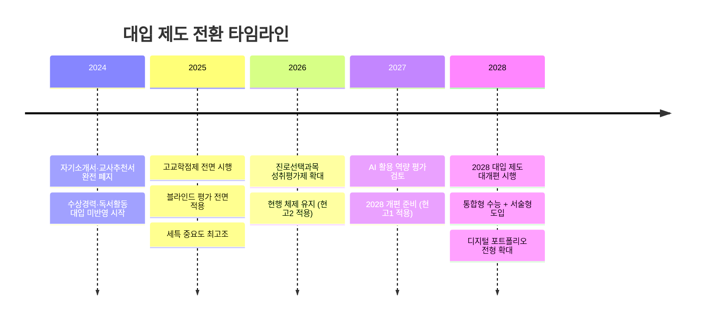

## 현행(2025~2027) vs 2028 핵심 변화 비교표

| 구분 | 현행 (2025~2027) | 2028 개편 이후 | 영향도 |
|------|----------------|-------------|-------|
| **수능 체제** | 문·이과 통합 수능, 선택과목제 | 통합형 수능 강화, **서술형 도입 검토** | ★★★★★ |
| **생기부 구조** | 현행 10개 항목 유지 | 항목 간소화 + **디지털 기록 확대** 검토 | ★★★★☆ |
| **세특 글자 수** | 과목당 500자 | 500자 유지 또는 **확대(700자) 검토** | ★★★★☆ |
| **세특 반영** | 학종의 핵심 평가 자료 | **중요도 더 상승** (유일한 스토리텔링 공간) | ★★★★★ |
| **교과 성적** | 일반선택: 9등급, 진로선택: A·B·C | **전 과목 성취평가제(A~E)** 확대 검토 | ★★★★★ |
| **고교학점제** | 전면 시행 중 | **선택과목 확대** + 학교 간 공동교육과정 활성화 | ★★★★☆ |
| **블라인드 평가** | 학교명·부모정보 삭제 | **강화** (출신 지역 정보까지 삭제 검토) | ★★★☆☆ |
| **포트폴리오** | 대입 직접 제출 불가 (세특에 간접 반영) | **디지털 포트폴리오 전형 신설** 예상 | ★★★★★ |
| **AI 평가** | 없음 | **AI 활용 역량 평가** 도입 검토 | ★★★★☆ |
| **면접** | 서류 기반 면접 | 서류 기반 + **AI 활용 과제 면접** 검토 | ★★★★☆ |

## 학교 유형별 2028 영향 분석

| 학교 유형 | 현행(2025~2027) 핵심 전략 | 2028 이후 변화 | 대비 전략 |
|---------|---------------------|------------|---------|
| **과학고** | 내신 불리 → 세특 깊이로 보완 | 성취평가제 확대 시 내신 불이익 완화 가능 | R&E + 디지털 포트폴리오 체계화 |
| **외국어고** | 어학 세특 심화 + 국제관계 탐구 | 글로벌 전형 + 디지털 포트폴리오 확대 | 어학 자격 + 국제 프로젝트 기록 체계화 |
| **자사고** | 내신 경쟁 치열 + 세특 품질 강조 | 자사고 폐지 논의 → 일반고 전환 가능성 | 일반고 전환 대비 투트랙 준비 |
| **일반고** | 내신 1등급 확보 + 교사 소통 | 블라인드 강화로 **일반고 유리해짐** | 세특 품질 향상 + 선택과목 전략 강화 |
| **학원** | 내신 대비 + 세특 주제 코칭 | 디지털 포트폴리오 코칭 수요 증가 | AI 활용 프로젝트 지도 + 포트폴리오 관리 |

## 현행 학생 vs 2028 학생 — 누가 해당되는가?

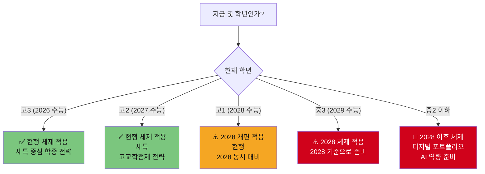

## 2028 개편에서 생기부 작성이 달라지는 핵심 5가지

| # | 변화 | 현행 (2025~2027) | 2028 이후 | 생기부 작성 대응 |
|---|------|----------------|---------|------------|
| 1 | **성취평가제 확대** | 진로선택만 A·B·C | 전 과목 A~E로 확대 검토 | 등급 경쟁 완화 → **세특 차별화가 더 중요** |
| 2 | **디지털 포트폴리오** | 세특에 간접 반영만 | GitHub·Behance 등 직접 제출 가능성 | 고1부터 **디지털 활동 기록 체계화** |
| 3 | **AI 활용 역량** | 별도 평가 없음 | 면접에서 AI 활용 질문 가능 | 세특에 **AI 도구 활용 프로젝트** 기록 |
| 4 | **수능 서술형** | 객관식(5지선다) | 서술형 문항 일부 도입 | 세특에 **논리적 서술·보고서 작성** 역량 기록 |
| 5 | **선택과목 확대** | 고교학점제 기본 운영 | 학교 간 공동교육과정 확대 | **다양한 심화 과목 이수** 기록이 차별화 요소 |

---

# 1. 학생생활기록부(생기부) 전체 구조 해부

## 생기부 10대 항목 구조도

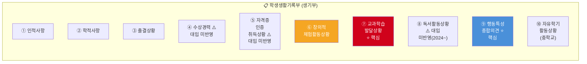

## 10대 항목 상세 분석표

| # | 항목명 | 기록 주체 | 대입 반영 | 글자 수 제한 | 핵심 내용 | 중요도 |
|---|--------|----------|----------|------------|---------|--------|
| ① | **인적사항** | 행정실 자동 | 반영 (블라인드) | - | 성명·주민번호·주소 (학교명·부모정보 삭제) | ☆ |
| ② | **학적사항** | 행정실 자동 | 반영 | - | 입학·전학·졸업 정보 | ☆ |
| ③ | **출결상황** | 담임 | 반영 | - | 결석·지각·조퇴·결과 (미인정/질병/기타) | ★★☆ |
| ④ | **수상경력** | 담당교사 | **미반영** (2024~) | - | 교내 수상만 기록, 대입 제공 불가 | ☆ |
| ⑤ | **자격증·인증** | 담당교사 | **미반영** | - | 국가기술자격증 등 | ☆ |
| ⑥ | **창의적 체험활동** | 담당교사 | **반영** ⭐ | 항목별 500자 | 자율·동아리·봉사·진로활동 | ★★★★ |
| ⑦ | **교과학습발달상황** | 교과교사 | **반영** ⭐⭐⭐ | 과목별 500자 | 성적(석차등급) + **세부능력·특기사항(세특)** | ★★★★★ |
| ⑧ | **독서활동상황** | 교과교사 | **미반영** (2024~) | - | 도서명만 기록, 대입 제공 불가 | ☆ |
| ⑨ | **행동특성·종합의견** | 담임 | **반영** ⭐⭐ | 500자 | 담임교사가 학생 전체를 종합 서술 | ★★★★ |
| ⑩ | **자유학기활동** | 중학교 교사 | 고교 생기부와 별도 | - | 중학교 자유학기제 활동 기록 | ☆ |

> **2025~2026 핵심**: 대입에 반영되는 항목은 ③출결, ⑥창체, ⑦교과(세특), ⑨행특 **4가지**뿐입니다.

---

## 대입에 반영되는 항목 vs 미반영 항목 비교

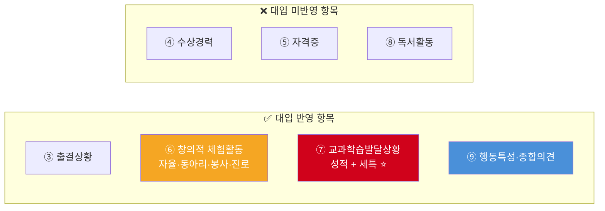

---

## 핵심 항목 ⑥ 창의적 체험활동 — 4개 영역 상세

| 영역 | 기록 내용 | 글자 수 | 학종 평가 포인트 | 기록 예시 |
|------|---------|--------|---------------|---------|
| **자율활동** | 학급 임원, 학교 행사, 자치법정 등 | 500자 | 리더십, 공동체 역량 | "학급 회장으로서 학급 규칙 개정안을 발의…" |
| **동아리활동** | 정규 동아리 + 자율 동아리(연 1개) | 500자 | 진로 탐색, 전문성 | "과학탐구 동아리에서 CRISPR 유전자 편집 주제로…" |
| **봉사활동** | 봉사 시간 + 특기사항 | 500자 | 공동체 의식, 성장 | "지역아동센터 수학 멘토링 40시간, 학생 눈높이…" |
| **진로활동** | 진로 탐색, 직업 체험, 진로 상담 | 700자 | 진로 일관성, 탐구 깊이 | "의료 현장 체험을 통해 공중보건의 역할에…" |

---

## 핵심 항목 ⑦ 교과학습발달상황 — "세특이 전부다"

### 교과 성적 기록 구조

| 기록 항목 | 일반선택과목 | 진로선택과목 | 비고 |
|---------|-----------|-----------|------|
| 석차등급 | 1~9등급 (상대평가) | 없음 | 일반과목은 등급이 핵심 |
| 성취도 | A~E | A·B·C (절대평가) | 진로선택은 A등급 필수 |
| 원점수/평균/표준편차 | 기재 | 기재 | 대학이 환산 점수 산출 |
| **세부능력·특기사항** | **500자** | **500자** | **학종 합격의 핵심** |

### 세특(세부능력·특기사항)이란?

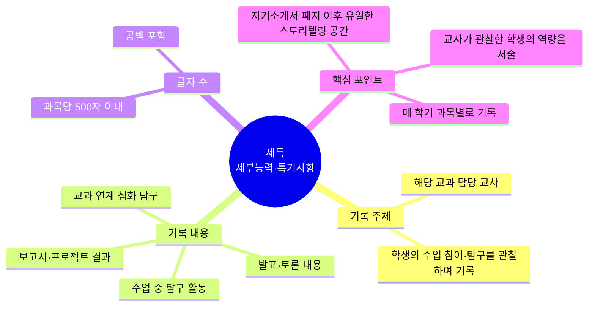

---

## 핵심 항목 ⑨ 행동특성 및 종합의견

| 항목 | 내용 |
|------|------|
| **기록 주체** | 담임교사 |
| **글자 수** | 500자 이내 |
| **기록 시기** | 학년말 (1년에 1회) |
| **핵심 내용** | 학생의 인성, 학업 태도, 특기, 종합적 성장 과정을 담임 시점에서 서술 |
| **평가 포인트** | 학생의 전체적 인상, 세특과의 일관성, 인성 평가의 근거 |

### 행특 우수 예시 vs 평범한 예시

| 구분 | 평범한 예시 | 우수 예시 |
|------|---------|---------|
| 내용 | "성실하고 예의 바른 학생으로 학업에 최선을 다함." | "생명과학에 대한 지적 호기심이 탁월하여 수업 중 CRISPR 유전자 편집 기술의 윤리적 쟁점을 자발적으로 탐구하고,   이를 토대로 교내 과학 토론회에서 발표하여 참가 학생들의 인식 변화를 이끌어냄.  지역아동센터 과학 멘토링 봉사에서 초등학생 눈높이에 맞춘 실험 교구를 직접 제작하여   과학에 대한 흥미를 유발시킨 점이 돋보임." |
| 평가 | 구체성 부족, 변별력 없음 | 구체적 사례 + 진로 연결 + 인성 + 영향력 |

---

# 2. 대학이 생기부를 읽는 방법 — 평가 기준 4대 요소

## 학종 평가 4대 요소 구조도

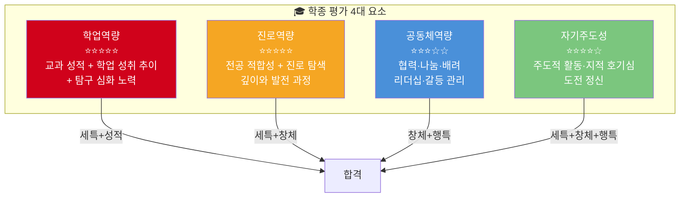

## 4대 요소별 생기부 연결 매트릭스

| 평가 요소 | 핵심 질문 | 생기부 확인 항목 | 세특에서 찾는 키워드 | 비중 |
|---------|---------|-------------|---------------|------|
| **학업역량** | "이 학생이 우리 학과 수업을 따라올 수 있는가?" | 교과 성적(석차등급), 성적 추이, 세특 탐구 깊이 | "심화 탐구", "논문 리딩", "실험 설계", "데이터 분석" | 30~35% |
| **진로역량** | "진로에 대한 관심이 진짜인가? 얼마나 깊은가?" | 세특 진로 연결 일관성, 진로활동, 동아리 | "~에 관심을 가지고", "~와 연결하여", "~의 원리를 탐구" | 30~35% |
| **공동체역량** | "다른 사람과 잘 협력하는가? 배려하는 사람인가?" | 자율·봉사활동, 행특, 동아리 협업 사례 | "팀원과 협력하여", "갈등 상황에서", "배려", "나눔" | 15~20% |
| **자기주도성** | "스스로 찾아서 하는 학생인가?" | 세특 자발적 탐구, 창체 주도적 활동 | "자발적으로", "스스로", "주도적으로 기획", "추가 탐구" | 15~20% |

## 서울 주요 대학별 평가 비중 비교

| 대학 | 학업역량 | 진로역량 | 공동체역량 | 자기주도성 | 면접 | 비고 |
|------|---------|---------|----------|----------|------|------|
| **서울대** | ★★★★★ | ★★★★★ | ★★★★☆ | ★★★★☆ | 서류 기반 면접 | 학업+진로 모두 최상위 요구 |
| **연세대** | ★★★★★ | ★★★★☆ | ★★★★☆ | ★★★☆☆ | 활동 우수형: 면접 有 | 내신 비중 높음 |
| **고려대** | ★★★★★ | ★★★★☆ | ★★★★☆ | ★★★☆☆ | 학업 우수형: 면접 無 | 교과 성적 중시 |
| **성균관대** | ★★★★☆ | ★★★★★ | ★★★☆☆ | ★★★★☆ | 계열적합형 면접 | SW특기자 전형 有 |
| **한양대** | ★★★★☆ | ★★★★★ | ★★★☆☆ | ★★★★★ | 면접 없음 (서류 100%) | 자기주도+진로역량 중시 |
| **서강대** | ★★★★★ | ★★★★☆ | ★★★☆☆ | ★★★★☆ | 면접 有 | 학업역량 최우선 |
| **중앙대** | ★★★★☆ | ★★★★★ | ★★★★☆ | ★★★☆☆ | 다빈치형: 면접 有 | 진로역량 중시 |
| **경희대** | ★★★★☆ | ★★★★☆ | ★★★★★ | ★★★★☆ | 네오르네상스: 면접 有 | 공동체역량 차별화 |

---

# 3. 특목고 vs 일반고 vs 학원 — 3차원 전략 비교

## 학교 유형별 생기부 전략 구조도

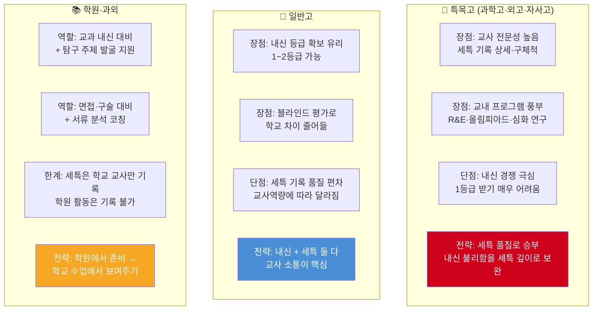

## 3차원 상세 비교표

| 비교 항목 | 특목고 (과학고·외고·자사고) | 일반고 | 학원(입시 컨설팅) |
|---------|----------------------|------|-------------|
| **내신 확보 난이도** | 매우 어려움 (전교생이 상위권) | 상대적으로 유리 | 내신 대비 직접 지원 |
| **세특 기록 품질** | 높음 (교사 전문성 + 프로그램) | 교사 역량에 따라 편차 큼 | 세특은 기록 불가, 간접 지원만 |
| **교내 프로그램** | R&E, 올림피아드, 연구실 연계 풍부 | 제한적, 교사 재량 의존 | 교내 프로그램 없음 |
| **대학 입시관의 인식** | "내신 불리하지만 세특 신뢰도 높음" | "내신 유리하지만 세특 검증 필요" | 직접 관련 없음 |
| **비용** | 등록금 무료~연 1,000만원 | 무료 | 월 30~200만원 |
| **핵심 전략** | 세특 깊이 + 연구 프로젝트 | 내신 1등급 + 교사 소통 | 학원에서 배운 것을 학교에서 보여주기 |

---

## 특목고 학생의 생기부 전략 — "내신이 불리해도 세특으로 역전"

### 과학고 학생 생기부 전략

| 상황 | 전략 | 구체적 방법 |
|------|------|---------|
| 내신 3~4등급 | 세특 깊이로 보완 | 과학고 세특은 대학이 "이 학교 3등급 = 일반고 1등급"으로 환산 |
| R&E 프로그램 | 연구 과정을 세특에 반영 | "OO대학 교수 지도하에 OO 연구를 수행하여…" |
| 올림피아드 경력 | 세특 + 진로활동에 기록 | "한국과학올림피아드 생물 분야 본선 참가 경험을 토대로…" |
| 심화 교과 수강 | 대학 수준 과목 이수 | "미적분학Ⅱ, 선형대수학 등 심화 과목을 이수하며…" |

### 과학고 세특 예시 (생명과학Ⅱ, 500자)

> 수업 중 유전체학 단원에서 CRISPR-Cas9 기술의 작동 원리에 깊은 관심을 보임.  **자발적으로** Nature 저널의 'CRISPR 2.0: prime editing' 논문을 원문으로 읽고, 기존 CRISPR와 프라임 에디팅의 정확도 차이를 수치적으로 비교 분석한 보고서를 작성함.  R&E 프로그램에서 OO대학교 생명과학과 교수 지도하에 '겸형적혈구빈혈증의 유전자 교정 가능성'을 주제로 6개월간 연구를 수행하였으며,  해당 연구의 문헌 조사와 실험 설계를 **주도적으로** 담당함. 연구 결과를 교내 학술제에서 발표하여 청중의 질문에 논리적으로 답변하는 모습이 인상적이었음.  유전자 편집 기술의 의학적 가능성뿐 아니라 '맞춤형 아기(designer baby)' 등 윤리적 쟁점까지 고려하는 균형 잡힌 시각이 돋보임.

### 외국어고 학생 생기부 전략

| 상황 | 전략 | 구체적 방법 |
|------|------|---------|
| 어학 강점 | 영어+제2외국어 세특 심화 | "영문 시사 논문 원문 분석…", "프랑스어 원서 독해…" |
| 내신 경쟁 | 인문·사회 교과 세특 차별화 | 국제관계·법학·경제 관련 심화 탐구 |
| 토론·발표 | 세특에 구체적 내용 기록 | "UN 안보리 개혁안에 대해 찬반 토론에서…" |

---

## 일반고 학생의 생기부 전략 — "내신 1등급 + 교사 소통"

### 일반고 내신 + 세특 투트랙 전략

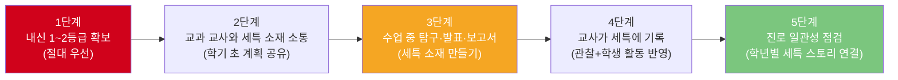

### 일반고 교사 소통 전략 — 세특 품질을 높이는 5단계

| 단계 | 시기 | 구체적 행동 | 기대 효과 |
|------|------|---------|---------|
| 1단계 | 학기 초 (3월) | 담당 교사에게 "이번 학기 OO 주제로 탐구하고 싶다" 사전 말씀드리기 | 교사가 관찰 포인트를 미리 인지 |
| 2단계 | 수업 중 (4~6월) | 수업 내용과 진로를 연결한 질문·발표 적극 참여 | 교사의 관찰 소재 축적 |
| 3단계 | 중간 (7월) | 탐구 보고서·추가 자료를 교사에게 제출 | 세특 기록의 구체적 근거 확보 |
| 4단계 | 학기 말 (11~12월) | 한 학기 활동 요약 메모를 교사에게 정중히 전달 | 교사의 세특 작성 편의성↑ |
| 5단계 | 세특 기록 후 | 열람 기간에 세특 확인 → 사실 오류 정정 요청 | 정확한 기록 보장 |

### 일반고 세특 예시 (생명과학Ⅰ, 500자)

> 감염과 면역 단원 수업에서 mRNA 백신의 작동 원리에 대해 질문하며 심화 탐구 의욕을 보임. 교과서 내용을 넘어 **자발적으로** 화이자 BNT162b2 백신의 mRNA 서열 설계 원리를 조사하고, 기존 불활화 백신 대비 mRNA 백신의 면역 반응 차이를 비교 분석한 보고서를 작성하여 수업 시간에 발표함. 발표 후 "mRNA 기술이 암 치료 백신에 적용될 가능성"에 대해 추가 탐구를 진행하여 Moderna의 개인 맞춤형 암 백신 임상 3상 결과를 요약 분석한 에세이를 제출함. 의학과 생명과학의 교차점에 대한 관심이 일관되며, 의료 현장에서의 과학 기술 적용에 대한 깊은 이해와 윤리적 고민이 느껴지는 학생임.

---

## 학원(입시 컨설팅)의 역할과 한계

### 학원이 할 수 있는 것 vs 할 수 없는 것

| 구분 | 할 수 있는 것 ✅ | 할 수 없는 것 ❌ |
|------|-------------|-------------|
| **세특** | 탐구 주제 발굴 지도, 보고서 작성법 코칭 | 세특 직접 기록 (교사만 가능) |
| **내신** | 교과 내신 대비 수업, 기출문제 분석 | 내신 시험 출제 예측 (불법) |
| **면접** | 모의 면접, 예상 질문 연습 | 면접 대리 |
| **원서** | 지원 전략 컨설팅, 대학별 분석 | 학생부 조작 (불법) |
| **포트폴리오** | 활동 정리·체계화 지도 | 대리 작성 (불법) |

### 학원 활용 최적 전략 — "학원에서 준비, 학교에서 보여주기"

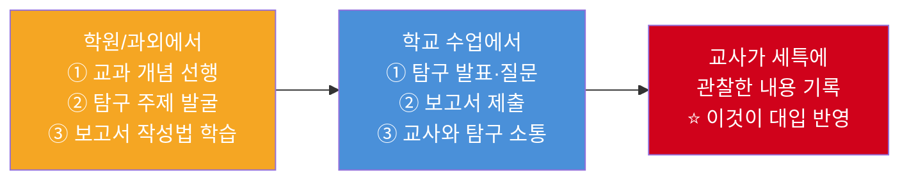

### 학원 유형별 비용·효과 비교

| 학원 유형 | 월 비용 | 핵심 역할 | 효과 | 추천 대상 |
|---------|--------|---------|------|---------|
| **대형 입시학원** | 30~80만원 | 내신 대비 + 수능 대비 | 내신 성적 향상 | 내신 3~4등급 → 1~2등급 목표 |
| **소규모 컨설팅** | 50~150만원 | 생기부 전략 + 세특 주제 코칭 | 세특 품질 향상 | 학종 지원 계획인 학생 |
| **1:1 입시 과외** | 80~200만원 | 맞춤형 원서 전략 + 면접 코칭 | 원서 전략 최적화 | 고3 수시 준비 학생 |
| **온라인 플랫폼** | 0~20만원 | 생기부 분석 + 자기소개 코칭 | 기본 전략 수립 | 비용 절약 + 자기주도 학생 |

---

# 4. 세부능력·특기사항(세특) 작성의 모든 것

## 세특 500자 활용 공식 — "STAR 기법"

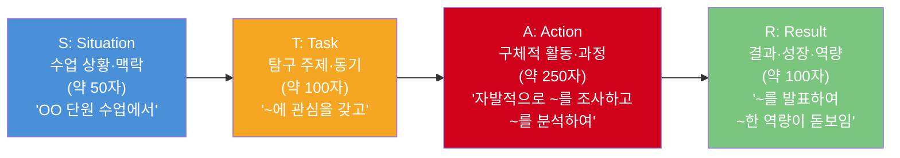

## 세특에 반드시 들어가야 할 키워드 vs 피해야 할 키워드

| 필수 키워드 ✅ | 효과 | 피해야 할 키워드 ❌ | 이유 |
|------------|------|---------------|------|
| "자발적으로" | 자기주도성 입증 | "시켜서" | 수동적 인상 |
| "~에 관심을 갖고 심화 탐구" | 진로역량 강조 | "교과서 내용을 정리" | 단순 복습은 세특 아님 |
| "논문/원서를 읽고" | 학업역량 심화 | "인터넷 검색으로" | 탐구 깊이 부족 |
| "발표하여 청중에게" | 소통 역량 | "개인적으로 학습" | 공유·영향력 없음 |
| "팀원과 협력하여" | 공동체역량 | "혼자서 모든 것을" | 협업 부재 |
| "윤리적 쟁점까지 고려" | 사고 깊이 | "찬성/반대만 서술" | 단편적 사고 |
| "데이터를 분석하여" | 과학적 사고 | "느낌이 좋았다" | 감상 수준 |
| "추가 탐구를 진행" | 자기주도성 | "수업에서 배운 대로" | 교과서 반복 |

## 세특 등급별 비교 — 같은 주제, 다른 수준

### 주제: 생명과학 — "유전자 편집 기술"

| 등급 | 세특 예시 (발췌) | 대학 평가 |
|------|------------|---------|
| **C등급 (하)** | "유전자 편집에 관심이 있어 조사 발표를 함." | 구체성 0, 변별력 없음 |
| **B등급 (중)** | "CRISPR 기술에 관심을 보이며 작동 원리를 조사하여 보고서를 작성함." | 주제는 있으나 깊이 부족 |
| **A등급 (상)** | "CRISPR-Cas9과 프라임 에디팅의 정확도를 Nature 논문 데이터 기반으로 비교 분석하고, 겸형적혈구빈혈증 치료 적용 가능성과 윤리적 쟁점을 포함한 보고서를 작성·발표함." | 논문 근거 + 구체적 분석 + 윤리적 사고 |
| **S등급 (최상)** | "Nature 원문 논문을 읽고 CRISPR-Cas9 vs 프라임에디팅의 off-target rate를 정량 비교한 보고서를 작성함. R&E에서 겸형적혈구빈혈증 유전자 교정 가능성을 6개월간 연구하였으며, 실험 설계를 주도적으로 담당함. 교내 학술제 발표에서 청중 질문에 논리적으로 답변하고, 디자이너 베이비 윤리 쟁점까지 다루는 균형 잡힌 시각이 돋보임." | 연구 경험 + 논문 기반 + 발표 + 윤리 → 최상위 평가 |

---

## 학기별 세특 스토리라인 설계법

### 의대 지망 학생의 6학기 세특 스토리라인 예시

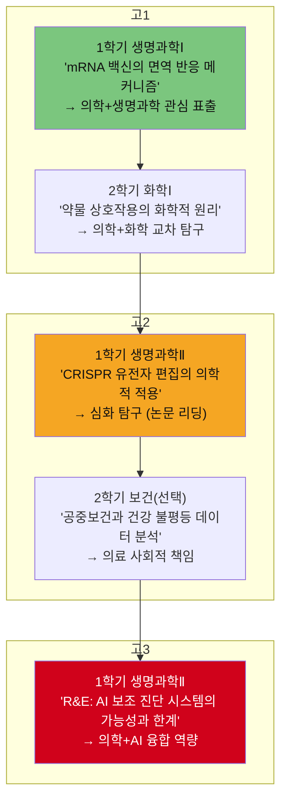

| 학기 | 교과 | 세특 주제 | 스토리 연결 | 성장 포인트 |
|------|------|---------|---------|---------|
| 고1-1 | 생명과학Ⅰ | mRNA 백신 면역 반응 | "의학에 관심 시작" | 교과서→심화 탐구 전환 |
| 고1-2 | 화학Ⅰ | 약물 상호작용 화학 원리 | "화학+의학 교차" | 교과 융합 사고 |
| 고2-1 | 생명과학Ⅱ | CRISPR 유전자 편집 | "논문 기반 심화" | 논문 리딩 능력 |
| 고2-2 | 보건(선택) | 건강 불평등 데이터 분석 | "의료 사회적 책임" | 데이터 분석+사회 인식 |
| 고3-1 | 생명과학Ⅱ | AI 보조 진단 시스템 | "의학+기술 융합" | 연구 역량 완성 |

> **핵심**: 매 학기 세특이 하나의 스토리로 연결되어야 합니다. "이 학생은 고1부터 고3까지 의학에 대한 관심이 점점 깊어지고 넓어졌다"는 인상을 주는 것이 목표.

---

# 5. 8개 왕국 × 교과별 세특 실전 예시

> 각 직업별로 **실제 생기부에 기록될 수 있는 형태**의 세특 예시를 제공합니다.
> 모든 예시는 500자 이내, STAR 기법 적용, 교사 관찰 시점으로 작성됩니다.

---

## 🔬 탐구 왕국

### 의사 지망 — 생명과학Ⅱ 세특 (500자)

> 유전체학 단원 수업에서 유전자 변이와 질병의 연관성에 대해 깊은 탐구 의욕을 보임. **자발적으로** 겸형적혈구빈혈증의 HBB 유전자 돌연변이 메커니즘을 조사하고, NCBI 데이터베이스에서 해당 변이의 빈도 데이터를 검색하여 지역별(아프리카·동남아·유럽) 유병률 차이를 말라리아 풍토병과 연결 짓는 보고서를 작성함. 나아가 CRISPR-Cas9을 활용한 겸형적혈구빈혈증 유전자 치료 임상시험(Vertex社 exa-cel)의 결과를 분석하여 "유전자 치료가 혈액 질환의 근본적 해결책이 될 수 있는가"라는 주제로 수업 시간에 발표함. 발표 후 학생들의 질문에 대해 유전자 치료의 비용 접근성(1회 약 22억원)과 의료 형평성 문제까지 논의하며 과학 기술의 사회적 영향을 깊이 고민하는 모습이 인상적이었음.

### AI연구원 지망 — 수학(미적분) 세특 (500자)

> 미분 단원에서 경사하강법(Gradient Descent)의 수학적 원리에 대해 질문하며 AI 알고리즘과 수학의 연결에 깊은 관심을 보임. **자발적으로** 경사하강법의 편미분 공식을 유도하고, 학습률(learning rate)에 따른 수렴 속도 차이를 Python(matplotlib)으로 시각화한 보고서를 작성함. 나아가 Transformer 모델의 Self-Attention 메커니즘을 선형대수(행렬곱·소프트맥스 함수) 관점에서 분석한 추가 탐구를 진행하여 "수학이 AI의 핵심 언어인 이유"라는 주제의 에세이를 제출함. 수학 개념을 추상적으로만 이해하지 않고 실제 AI 모델에 적용하여 검증하려는 태도가 돋보이며, 수학적 직관과 프로그래밍 구현 능력을 동시에 갖춘 학생으로 평가됨.

### 약사 지망 — 화학Ⅱ 세특 (500자)

> 반응 속도론 단원에서 약물의 체내 반감기(half-life) 개념에 관심을 보이며 약물동역학(pharmacokinetics)과 화학 반응 속도의 연결고리를 탐구함. **자발적으로** 아세트아미노펜(타이레놀)과 이부프로펜(애드빌)의 반감기·흡수율·생체이용률(bioavailability) 데이터를 비교 분석하고, 1차 반응 속도식(first-order kinetics)을 적용하여 혈중 약물 농도 변화를 엑셀로 시뮬레이션한 보고서를 작성함. 또한 자몽 주스가 CYP3A4 효소를 억제하여 특정 약물의 혈중 농도를 위험 수준으로 높이는 약물-식품 상호작용 사례를 조사하여 발표함. 화학 원리를 약학적 맥락에서 실질적으로 적용하려는 태도와 환자 안전을 고려하는 윤리적 감수성이 돋보이는 학생임.

---

## 🎨 창작 왕국

### UX디자이너 지망 — 미술 세특 (500자)

> 디자인 원리 단원에서 사용자 중심 디자인(HCD)에 깊은 관심을 보이며, 교내 도서관 앱의 사용성 문제를 직접 분석하는 프로젝트를 수행함. 학생 15명을 대상으로 반구조화 인터뷰를 실시하여 "도서 검색 결과가 느리다(67%)", "예약 확인이 어렵다(53%)" 등 핵심 불편 사항(Pain Point) 8가지를 도출함. 이를 바탕으로 Figma를 활용하여 Low-Fidelity 와이어프레임 → High-Fidelity 프로토타입(12화면)을 제작하고, 사용자 테스트 5명을 실시하여 작업 완료 시간이 평균 40% 단축됨을 확인함. 최종 UX 개선 제안서를 학교 도서관에 제출하여 실제 개선 검토 대상으로 채택됨. 디자인 사고(Design Thinking) 5단계를 체계적으로 실천하며 사용자 공감과 데이터 기반 의사결정 역량이 탁월한 학생임.

### 건축가 지망 — 물리학Ⅰ 세특 (500자)

> 역학 단원 수업에서 건축 구조물의 힘 분산 원리에 관심을 보이며, 아치(arch)와 트러스(truss) 구조의 역학적 특성을 비교 분석하는 탐구를 수행함. **자발적으로** 로마 콜로세움(아치 구조)과 에펠탑(트러스 구조)의 하중 전달 경로를 자유물체도(FBD)로 분석하고, 각 구조의 최대 허용 응력을 계산하여 비교한 보고서를 작성함. 나아가 SketchUp으로 학교 체육관의 지붕 구조를 3D 모델링하고, 기존 평지붕을 아치 구조로 변경했을 때 하중 분산 효율이 어떻게 변하는지 시뮬레이션을 실시함. 물리학 원리를 건축 설계에 적용하여 실질적 문제를 해결하려는 태도가 돋보이며, 구조역학에 대한 직관적 이해력이 우수한 학생임.

---

## 💻 기술 왕국

### 앱개발자 지망 — 정보 세특 (500자)

> 프로그래밍 단원에서 웹 서비스 구현에 대한 깊은 관심을 보이며, 교내 학생 커뮤니티의 비효율적인 정보 전달 문제를 해결하기 위해 "학교 Q&A 챗봇"을 직접 기획·개발함. Python Flask를 활용하여 RESTful API를 설계하고, HTML/CSS/JavaScript로 프론트엔드를 구현하여 학생들이 급식 메뉴·시간표·행사 일정을 실시간으로 조회할 수 있는 웹 서비스를 완성함. GitHub에 전체 소스 코드를 공개하고 README를 상세히 작성하여 오픈소스 협업 문화를 실천함. 교내 시범 운영 결과 2주간 사용자 50명이 접속하여 질의 300건을 처리하였으며, 사용자 피드백을 반영하여 UI 개선과 응답 속도 최적화(1.2초→0.3초)를 진행하는 **자기주도적** 개선 사이클을 보여줌.

### 정보보안전문가 지망 — 수학Ⅱ 세특 (500자)

> 정수론 단원에서 모듈러 연산(modular arithmetic)과 암호학의 연결에 깊은 관심을 보임. **자발적으로** RSA 공개키 암호화 알고리즘의 수학적 원리를 탐구하여, 소인수분해의 계산 복잡도가 RSA 보안의 핵심 근거임을 증명하는 보고서를 작성함. 실제로 Python으로 소수 p=61, q=53을 이용한 간단한 RSA 암호화·복호화 프로그램을 구현하여 동작을 시연함. 나아가 "양자 컴퓨터의 Shor 알고리즘이 RSA를 무력화시킬 수 있는가?"라는 주제로 추가 탐구를 진행하여 격자 기반 포스트양자암호(lattice-based PQC)의 수학적 원리를 소개하는 발표를 함. 수학적 원리를 실제 정보보안 기술에 적용하여 사회적 문제를 해결하려는 태도와 최신 기술 동향까지 파악하는 탐구력이 돋보임.

---

## 🌱 자연 왕국

### 환경공학자 지망 — 지구과학Ⅰ 세특 (500자)

> 대기와 해양 단원에서 기후 변화와 대기질 문제에 깊은 관심을 보임. **자발적으로** 환경부 '에어코리아' 공공데이터를 활용하여 우리 지역의 PM2.5 농도 10년간(2014~2024) 추이를 Python(pandas, matplotlib)으로 분석하고, 계절별·요일별 패턴을 도출한 보고서를 작성함. 분석 결과 "겨울철 월요일 오전 8시에 PM2.5 농도가 연평균 대비 43% 높다"는 패턴을 발견하고, 이를 통학 차량 집중과 난방 가동 시점과 연결 지어 해석함. 나아가 학교 옥상 태양광 패널 설치의 연간 탄소 저감 효과를 계산하여 교장 선생님께 설치 제안서를 발표함. 데이터 기반 환경 분석 역량과 실질적 해결책을 제안하는 행동력이 인상적임.

### 수의사 지망 — 생명과학Ⅱ 세특 (500자)

> 동물 생리학 단원에서 반려동물의 영양학적 요구에 관심을 보이며, "시판 반려견 사료 5종의 영양 성분 비교 분석" 프로젝트를 자발적으로 수행함. 각 사료의 단백질·지방·탄수화물·조섬유·수분 함량을 정량 비교하고, AAFCO(미국사료검사관협회) 영양 기준과 대조하여 적정성을 평가한 보고서를 작성함. 특히 곡물 기반 사료 vs 무곡물(grain-free) 사료의 영양학적 차이를 분석하여 "무곡물 사료가 확장성 심근병증(DCM) 위험을 높일 수 있다"는 FDA 조사 결과를 인용하며 소비자 인식과 과학적 근거의 괴리를 지적함. 동물 복지에 대한 진심 어린 관심과 과학적 데이터를 근거로 논리를 전개하는 능력이 돋보이며, 수의학에 대한 진로 의식이 뚜렷한 학생임.

---

## 창의적 체험활동 세특 예시

### 동아리활동 세특 — 과학탐구동아리 (500자)

> 과학탐구동아리 '바이오랩'의 차장으로 활동하며 동아리 연간 탐구 주제 선정과 실험 일정 기획을 주도적으로 담당함. 1학기에 "학교 급식실 미생물 분포 조사" 프로젝트를 기획하여 급식 전·후 조리대 5곳의 미생물 배양 실험을 실시하고, 콜로니 수를 정량 비교한 분석 보고서를 작성함. 급식실 위생 관리 개선을 위한 구체적 제안사항을 영양사 선생님께 전달하여 **소독 절차 개선에 반영**됨. 2학기에는 신입 부원 4명에게 현미경 사용법과 배양 실험 기초를 멘토링하여 전체 동아리원의 실험 역량 향상에 기여함. 과학적 호기심을 실생활 문제 해결에 연결하는 능력과 후배를 이끄는 리더십이 돋보이는 학생임.

### 진로활동 세특 — 의대 지망 (700자)

> 1학기 진로 탐색 활동에서 "의사의 하루" 현장 체험 프로그램에 참여하여 OO대학교 병원 응급의학과를 견학하고, 응급 의료 체계(KTAS 분류)의 원리와 의사의 의사결정 과정을 관찰 보고서로 작성함. 견학 후 "응급 상황에서 제한된 의료 자원을 누구에게 먼저 배분할 것인가"라는 트리아지(triage) 윤리 문제에 대해 자발적으로 추가 탐구를 진행함. 공리주의적 관점(최대 다수의 최대 행복)과 의무론적 관점(모든 환자의 존엄성)을 비교 분석한 에세이를 작성하여 진로 포트폴리오에 포함함. 2학기에는 커리어넷 의사 직업 인터뷰 영상을 분석하고, 실제 소아과 전문의와 온라인 인터뷰를 실시하여 "AI 시대에 의사에게 요구되는 역량 변화"를 주제로 진로 보고서를 작성함. 의료 현장에 대한 구체적 이해와 의사의 사회적 책임에 대한 깊은 성찰이 느껴지며, 의학이라는 진로에 대한 확신과 준비 과정이 체계적인 학생임.

---

## 행동특성 및 종합의견 예시 (학교 유형별)

### 특목고(과학고) 행특 예시 (500자)

> 생명과학과 화학에 대한 열정이 남다르며, 수업 시간에 항상 교과서 너머의 깊은 질문을 던지는 학생임. R&E 프로그램에서 겸형적혈구빈혈증 유전자 치료 연구를 6개월간 수행하며 실험 설계·문헌 조사·데이터 분석을 주도적으로 담당하였고, 교내 학술제에서 연구 결과를 명확하게 전달하는 발표력을 보여줌. 학급 내에서 과학 관련 고민을 상담해주는 '학습 멘토' 역할을 자발적으로 수행하여 급우 5명의 과학 성적 향상에 기여함. 지역아동센터 과학 실험 봉사에서는 초등학생 눈높이에 맞는 실험 교구를 직접 설계하여 과학에 대한 흥미를 유발하는 모습이 인상적이었음. 학업과 인성 모두에서 의학을 향한 진로 의식이 뚜렷하고 일관된 학생으로 추천함.

### 일반고 행특 예시 (500자)

> 학업 성취도가 최상위권(전 과목 1등급)이면서도 겸손하고 배려심 깊은 학생임. 생명과학 수업에서 mRNA 백신의 면역 반응 메커니즘에 대한 심화 탐구를 자발적으로 수행하고, 화학 수업에서 약물 상호작용의 원리를 탐구하는 등 의학에 대한 진로 관심이 일관되고 깊어지고 있음. 학급 부반장으로서 학급 분위기 조성에 기여하며, 특히 중간고사 기간 학습 소외 학생 3명과 자발적으로 '아침 스터디'를 운영하여 전원 성적 향상을 이끌어낸 점이 돋보임. 보건소 건강 캠페인 봉사에서 노인 대상 혈압 측정 및 건강 상담을 진행하며 환자를 대하는 따뜻한 태도를 보여줌. 학업역량과 인성을 겸비한 학생으로 의학 분야에서 사회에 기여할 잠재력이 높다고 평가됨.

---

> **하편에서 이어질 내용**
> - 🤝 연결·🏛️ 질서·📣 소통·🚀 도전 왕국 세특 실전 예시
> - 현행(2025~2027) 합격 사례별 생기부 전문 (의대·KAIST AI·경영·교대)
> - **2028 교육체제 — 생기부가 이렇게 달라진다** (디지털 포트폴리오·AI 역량·서술형 수능)
> - **2028 체제 합격 예상 생기부 모델** (현행 vs 2028 세특 비교)
> - 생기부에 적을 수 있는 결과물 템플릿 32종
> - 면접에서 생기부 연결하는 법 (현행 vs 2028)
> - 학부모용 학년별 생기부 관리 체크리스트 (현행 + 2028 추가)

---

*작성일: 2026년 2월 | 학생부종합 생기부 완전 가이드 (상) v1.0*
*참조: 32개_커리어패스_대입학종_완전가이드_상.md, 32개_커리어패스_대입학종_완전가이드_하.md*
