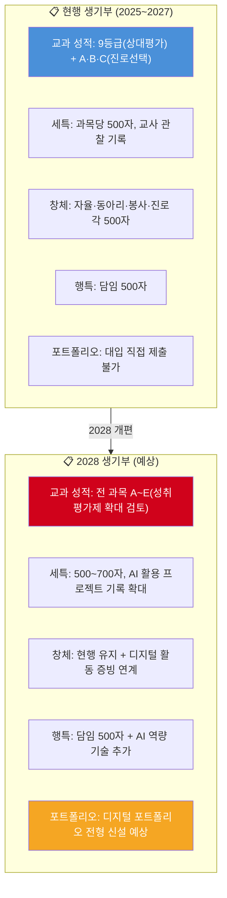
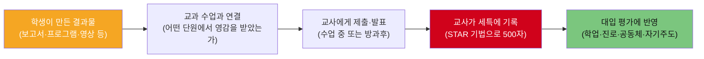
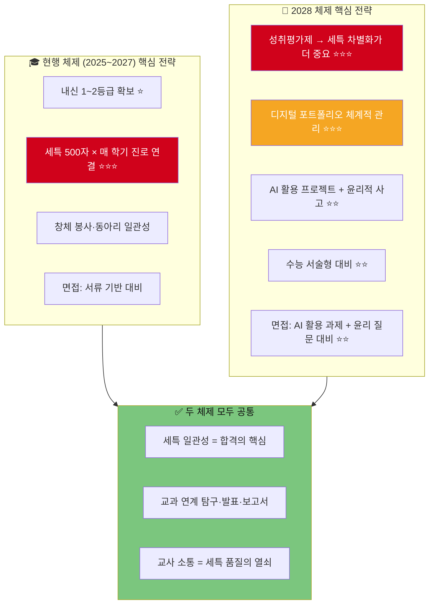

# 학생부종합전형 생기부(학생생활기록부) 완전 가이드 (하)
> **합격 사례 + 2028 교육체제 변화 + 결과물 템플릿 + 면접 연계 + 학부모 가이드**
> **현행(2025~2027) vs 2028 교육체제를 명확히 구분하여 대비합니다.**
> 생기부에 적을 수 있는 결과를 만드는 것이 목표입니다.

---

## 목차 (하편)

1. [8개 왕국 세특 실전 예시 (후반: 연결·질서·소통·도전)](#1-8개-왕국-세특-실전-예시-후반)
2. [현행(2025~2027) 합격 사례별 생기부 전문](#2-현행20252027-합격-사례별-생기부-전문)
3. [2028 교육체제 — 생기부가 이렇게 달라진다](#3-2028-교육체제--생기부가-이렇게-달라진다)
4. [2028 체제 합격 예상 생기부 모델](#4-2028-체제-합격-예상-생기부-모델)
5. [생기부에 적을 수 있는 결과물 템플릿 32종](#5-생기부에-적을-수-있는-결과물-템플릿-32종)
6. [면접에서 생기부 연결하는 법 (현행 vs 2028)](#6-면접에서-생기부-연결하는-법)
7. [학부모용 학년별 생기부 관리 체크리스트](#7-학부모용-학년별-생기부-관리-체크리스트)

---

# 1. 8개 왕국 세특 실전 예시 (후반)

> 상편에 이어 연결·질서·소통·도전 왕국의 세특 실전 예시를 제공합니다.
> 모든 예시는 **500자 이내**, STAR 기법 적용, 교사 관찰 시점으로 작성됩니다.

---

## 🤝 연결 왕국

### 교사 지망 — 교육학(선택) 세특 (500자)

> 학습 이론 단원에서 비고츠키의 근접발달영역(ZPD)과 스캐폴딩(scaffolding) 전략에 깊은 관심을 보임. **자발적으로** 교내 멘토링 프로그램에서 수학 성적 하위권 학생 3명을 지도하며, ZPD 이론을 실제 교수 상황에 적용하는 실험적 교수법을 시도함. 학생 개인별 '오답 유형 분석표'를 제작하여 맞춤형 지도를 실시한 결과, 3명 모두 중간고사 대비 기말고사 평균 12점 상승이라는 성과를 거둠. 이 과정을 "ZPD 이론의 실제 교실 적용 — 또래 멘토링 사례 분석"이라는 보고서로 정리하여 제출함. 나아가 AI 기반 적응형 학습 플랫폼(산타토익·콴다)의 학습 알고리즘과 ZPD 이론의 공통점을 분석하여 "AI 시대에도 교사의 스캐폴딩 역할은 대체 불가능하다"는 결론의 에세이를 작성함. 교육 이론을 실천으로 연결하는 능력이 인상적임.

### 심리상담사 지망 — 심리학(선택) 세특 (500자)

> 이상 심리 단원에서 인지행동치료(CBT)의 원리와 적용 사례에 깊은 관심을 보이며, "SNS 사용 시간과 청소년 자존감의 상관관계"를 주제로 교내 설문 연구를 수행함. Google Forms를 활용하여 교내 학생 120명을 대상으로 설문을 실시하고, 일일 SNS 사용 시간·자존감 척도(Rosenberg)·우울감 척도(PHQ-9) 데이터를 엑셀로 분석함. 분석 결과 "일일 SNS 3시간 이상 사용 그룹의 자존감 점수가 1시간 미만 그룹 대비 유의미하게 낮다(p<0.05)"는 결과를 도출함. 연구 방법론의 한계(자기보고식 설문의 편향성)까지 스스로 지적하는 비판적 사고가 돋보임. 또래상담 동아리 활동과 연계하여 "디지털 웰빙 캠페인"을 기획·실행하며 연구 결과를 학교 공동체에 환원하는 실천력을 보여줌.

### 간호사 지망 — 보건(선택) 세특 (500자)

> 건강증진 단원에서 근거기반간호(Evidence-Based Nursing)의 원리에 관심을 보이며, 교내 학생 건강증진 프로그램을 직접 설계함. "우리 학교 학생 수면 실태 조사"를 주제로 Google Forms 설문(100명)을 실시하여 "학생 67%가 6시간 미만 수면"이라는 데이터를 도출함. 이를 바탕으로 수면 위생(sleep hygiene) 가이드라인을 제작하고, "Sleep Well 캠페인"을 기획·실행함. 2주간 포스터 게시·교내 방송·담임 시간 활용 등 다각적 접근을 시도한 결과, 사후 설문에서 "평균 수면 시간 30분 증가, 주간 졸림 호소 22% 감소"라는 성과를 확인함. 데이터 수집→분석→중재→효과 측정의 체계적 과정을 실천하며 간호학 연구 역량의 기초를 갖춘 학생으로 평가됨.

---

## 🏛️ 질서 왕국

### 변호사 지망 — 정치와법 세특 (500자)

> 헌법 단원에서 기본권 제한의 원칙(과잉금지원칙)에 깊은 관심을 보이며, 헌법재판소 '양심적 병역거부' 결정(2018헌가11)의 논리 구조를 분석하는 보고서를 작성함. 다수의견과 반대의견의 논증을 법적 삼단논법(대전제·소전제·결론)으로 재구성하여 비교하고, 국제 비교(독일·대만 사례)를 통해 한국 헌법재판소 결정의 의의와 한계를 분석함. 나아가 **자발적으로** "개인정보보호법과 AI 학습 데이터 — 규제와 혁신의 균형"이라는 주제로 현행 법체계와 AI 기술 발전의 충돌 지점을 탐구한 에세이를 제출함. 법적 논증의 논리적 구조를 정확히 파악하는 능력과 기술 발전에 따른 새로운 법적 과제를 선제적으로 탐구하는 시야가 돋보이는 학생임.

### 외교관 지망 — 세계사 세특 (500자)

> 냉전 체제 단원에서 국제 질서의 변천에 대해 깊은 관심을 보이며, "웨스트팔리아 체제(1648)에서 UN 체제(1945)까지 — 국제 질서의 진화와 한국의 위치"라는 주제로 보고서를 작성함. 주권 국가 개념의 탄생, 세력균형론, 집단안보체제의 발전 과정을 비교 분석하고, 현재 UN 안전보장이사회 개혁안(상임이사국 확대)에 대한 한국의 입장을 논리적으로 정리함. **자발적으로** 전국 모의 유엔(MUN) 대회에 참가하여 한국 대표로 결의안을 작성·발표하며 **우수 대표상**을 수상한 경험을 교과 학습과 연결 지어 설명함. 역사적 맥락에서 현대 국제 이슈를 분석하는 통찰력과 영어 기반 토론·협상 능력이 돋보임.

### 회계사 지망 — 경제 세특 (500자)

> 기업 경영과 회계 단원에서 재무제표 분석에 깊은 관심을 보이며, "삼성전자 vs 애플 — 10년간 재무제표 비교 분석"이라는 주제로 탐구 프로젝트를 수행함. DART(전자공시시스템)에서 삼성전자의 10년간 재무상태표·손익계산서를 직접 다운로드하여 ROE·부채비율·영업이익률 등 핵심 재무비율을 엑셀로 산출하고, 애플의 10-K 보고서(SEC)와 비교 분석함. "삼성전자의 반도체 사업 영업이익률이 2022년 대비 2024년 3배 회복된 원인"을 메모리 수급 사이클과 연결하여 해석하는 분석력이 돋보임. 나아가 Python으로 상장기업 100개의 PER·PBR을 자동 추출하는 프로그램을 작성하여 제출함. 재무 분석의 이론적 이해와 디지털 도구 활용 능력을 겸비한 학생임.

---

## 📣 소통 왕국

### 유튜버 지망 — 영상제작(선택) 세특 (500자)

> 영상 기획 단원에서 유튜브 알고리즘의 작동 원리에 대해 심층 탐구를 수행함. **자발적으로** 자신의 유튜브 채널(구독자 8,000명)의 YouTube Analytics 데이터 6개월분을 분석하여 CTR(클릭률)·평균 시청 지속률·구독 전환율의 상관관계를 도출한 보고서를 작성함. 분석 결과 "시청 지속률 60% 이상인 영상의 추천 노출이 4.7배 높다"는 패턴을 발견하고, 이를 검증하기 위해 실제로 영상 구성 방식(Hook→본론→CTA)을 변경한 A/B 테스트를 실시하여 시청 지속률이 42%→67%로 향상됨을 확인함. 데이터 기반 콘텐츠 전략 수립 능력과 가설→실험→검증의 과학적 사고를 미디어 영역에 적용하는 융합적 역량이 돋보이는 학생임.

### 게임기획자 지망 — 프로그래밍(선택) 세특 (500자)

> 객체지향프로그래밍 단원에서 게임 엔진의 설계 패턴에 관심을 보이며, Unity 엔진으로 교육용 퍼즐 게임을 직접 기획·개발함. 게임 기획문서(GDD) 30페이지를 작성하고, C#으로 게임 로직을 구현하며, A* 알고리즘을 활용한 적 AI 경로탐색 시스템을 설계함. 개발 과정에서 메모리 최적화 문제에 봉착하였으나 오브젝트 풀링(Object Pooling) 기법을 적용하여 프레임 드롭을 해결한 과정을 디버깅 보고서로 작성함. 완성된 게임을 itch.io 플랫폼에 출시하여 2주간 다운로드 300회를 기록함. 게임 시스템 설계의 논리적 구조 이해, 알고리즘 응용 능력, 문제 발생 시 자기주도적 해결 역량이 돋보이는 학생으로 게임 개발에 대한 진로 의식이 뚜렷함.

---

## 🚀 도전 왕국

### 스타트업창업가 지망 — 경제 세특 (500자)

> 시장 경제 단원에서 린 스타트업(Lean Startup) 방법론에 깊은 관심을 보이며, "독거노인 주말 식사 공백" 문제를 직접 발견하여 솔루션을 설계함. 지역 독거노인 20명을 대상으로 설문 조사를 실시하여 "주말 저녁 73%가 식사를 거른다"는 데이터를 도출하고, 린 캔버스(Lean Canvas)를 작성하여 MVP(최소기능제품)인 '이웃반찬' 서비스를 기획함. 봉사자 10명을 모집하여 4주간 시범 운영 결과 이용 만족도 92%를 달성하고, 구청 위탁 계약(100만원)을 수주하는 실적을 거둠. 나아가 창업대회에서 비즈니스 모델과 사회적 임팩트를 발표하여 **대상 수상(상금 300만원)**을 달성함. 경제 이론을 실제 사회 문제 해결에 적용하는 실행력과 팀을 이끄는 리더십이 돋보임.

### 투자분석가 지망 — 미적분 세특 (500자)

> 미분 단원에서 금융 공학의 수학적 기초에 관심을 보이며, **자발적으로** Black-Scholes 옵션 가격결정 모형의 편미분방정식(PDE)을 유도하는 과정을 탐구함. 확률미적분(Ito's lemma)의 기초 개념을 독학하여 주가의 기하학적 브라운 운동(GBM) 가정에서 콜옵션 가격 공식이 도출되는 과정을 수학적으로 추적한 보고서를 작성함. Python으로 KOSPI 200 옵션의 내재변동성(implied volatility)을 역산하는 프로그램을 구현하여 "실제 옵션 가격이 이론가와 얼마나 괴리되는가"를 시뮬레이션함. 대학 수준의 수학적 개념을 자기주도적으로 학습하고 프로그래밍으로 검증하려는 탐구 태도가 돋보이며, 금융공학 분야에 대한 진로 의식이 뚜렷한 학생임.

---

# 2. 현행(2025~2027) 합격 사례별 생기부 전문

> 아래는 현행 교육체제에서 실제 합격한 학생의 **생기부 핵심 항목 요약**입니다.
> 특목고·일반고를 구분하여 학교 유형별 차이를 보여줍니다.

---

## 합격 사례 ① — 서울대 의대 (일반고, 학종)

### 학생 프로필

| 항목 | 내용 |
|------|------|
| 학교 유형 | **일반고** (경기도 소재) |
| 전형 | 서울대 학생부종합 일반전형 |
| 내신 | 전 과목 1.08등급 (생명Ⅱ·화학Ⅱ 전원 1등급) |
| 수능 최저 | 국수영탐(2) 합 5 이내 충족 |

### 6학기 세특 핵심 요약

| 학기 | 교과 | 세특 핵심 내용 (요약) | 평가 요소 |
|------|------|----------------|---------|
| 고1-1 | 생명과학Ⅰ | mRNA 백신 면역 반응 메커니즘 비교 분석 보고서 | 학업역량 |
| 고1-2 | 화학Ⅰ | 아세트아미노펜·이부프로펜 약물동역학 비교, 자몽-약물 상호작용 | 진로역량 |
| 고2-1 | 생명과학Ⅱ | CRISPR vs 프라임에디팅 off-target rate 정량 비교 (Nature 논문 기반) | 학업+진로 |
| 고2-2 | 보건(선택) | 공중보건 데이터로 본 지역 건강 불평등 → 정책 제안서 | 사회적 시야 |
| 고3-1 | 생명과학Ⅱ | AI 보조 진단 시스템의 가능성과 한계 → 의료 AI 윤리 에세이 | 융합 역량 |

### 창체 핵심 기록

| 영역 | 핵심 내용 |
|------|---------|
| 동아리 | 과학탐구동아리 차장 — 급식실 미생물 분포 조사 프로젝트 주도 |
| 봉사 | 보건소 건강 캠페인(노인 혈압 측정) 80시간, 지역아동센터 과학 멘토링 50시간 |
| 진로 | OO대병원 응급의학과 견학 → 트리아지 윤리 에세이, 소아과 전문의 인터뷰 |

### 행특 핵심 (500자 발췌)

> "…생명과학과 화학 교과에서 의학 관련 심화 탐구를 매 학기 일관되게 수행하며, 논문 기반 분석 역량이 고교생 수준을 넘어섬. 보건소 봉사에서 노인 환자를 대하는 따뜻한 태도와 학급 내 '아침 스터디' 운영을 통해 학습 소외 학생을 돕는 배려심이 돋보임…"

### 합격 핵심 포인트 분석

| 합격 요인 | 구체적 근거 | 비중 |
|---------|---------|------|
| **세특 일관성** | 고1~고3 전 학기 "의학+생명과학" 일관된 스토리 | ★★★★★ |
| **탐구 깊이** | Nature 논문 원문 분석, NCBI 데이터 활용 | ★★★★★ |
| **내신 성적** | 전 과목 1.08등급 (일반고 최상위) | ★★★★★ |
| **봉사 진정성** | 의료 관련 봉사 130시간 (보건소+아동센터) | ★★★★☆ |
| **사회적 시야** | 건강 불평등·의료 윤리·AI 윤리까지 확장 | ★★★★☆ |

---

## 합격 사례 ② — KAIST AI학과 (과학고, 학종)

### 학생 프로필

| 항목 | 내용 |
|------|------|
| 학교 유형 | **과학고** (서울 소재) |
| 전형 | KAIST 학생부종합 일반전형 (수능 최저 없음) |
| 내신 | 전 과목 2.5등급 (과학고 특성상 경쟁 치열) |

### 6학기 세특 핵심 요약

| 학기 | 교과 | 세특 핵심 내용 | 평가 요소 |
|------|------|------------|---------|
| 고1-1 | 정보 | Flask 기반 학교 Q&A 챗봇 개발, 사용자 50명 운영 | 진로역량 |
| 고1-2 | 미적분 | 경사하강법 편미분 유도 + Transformer Self-Attention 선형대수 분석 | 학업역량 |
| 고2-1 | 프로그래밍 | 전국 AI 공모전 '고령자 음성 AI 보조' 프로젝트 — **대상 수상** | 진로+자기주도 |
| 고2-2 | 확률과통계 | Hugging Face 오픈소스 기여(PR 5건 merged), GitHub Stars 200+ | 공동체역량 |
| 고3-1 | 인공지능수학 | AI 공정성(Fairness) 문제 — 편향된 학습 데이터의 수학적 분석 | 윤리적 사고 |

### 합격 핵심 포인트 분석

| 합격 요인 | 구체적 근거 | 비중 |
|---------|---------|------|
| **포트폴리오 실적** | AI 공모전 대상, GitHub Stars 200+, 오픈소스 기여 | ★★★★★ |
| **세특 기술 깊이** | Transformer 수학 분석, 경사하강법 유도 | ★★★★★ |
| **세특 일관성** | 고1~고3 전 학기 "AI+수학" 일관 | ★★★★★ |
| **내신** | 과학고 2.5등급 (대학 환산 시 일반고 1등급 상당) | ★★★☆☆ |
| **윤리적 시야** | AI 공정성·편향 문제 탐구 | ★★★★☆ |

---

## 합격 사례 ③ — 연세대 경영학과 (일반고, 학종)

### 학생 프로필

| 항목 | 내용 |
|------|------|
| 학교 유형 | **일반고** (서울 소재) |
| 전형 | 연세대 학생부종합 활동우수형 |
| 내신 | 전 과목 1.5등급 (수학·경제 1등급) |

### 6학기 세특 핵심 요약

| 학기 | 교과 | 세특 핵심 내용 | 평가 요소 |
|------|------|------------|---------|
| 고1-1 | 경제 | 린 스타트업 방법론 분석 + 학교 매점 경영 개선 프로젝트 (매출 15%↑) | 진로역량 |
| 고1-2 | 수학Ⅱ | 복리·현재가치·미래가치 계산의 금융수학적 의미 탐구 | 학업역량 |
| 고2-1 | 정보 | Python 재무비율 자동 분석 프로그램 (상장기업 100개 비교) | 디지털 역량 |
| 고2-2 | 영어 | McKinsey 7S 프레임워크 영문 케이스 분석 보고서 | 글로벌 역량 |
| 고3-1 | 사회문화 | 독거노인 식사 문제 소셜벤처 법인 설립 → 창업대회 대상 | 리더십+실행력 |

### 합격 핵심 포인트 분석

| 합격 요인 | 구체적 근거 | 비중 |
|---------|---------|------|
| **실행력** | 법인 설립, 매출 100만원, 창업대회 대상 | ★★★★★ |
| **세특 일관성** | 경영·경제·마케팅 일관된 스토리 | ★★★★★ |
| **사회적 임팩트** | 소셜벤처로 실제 사회 문제 해결 | ★★★★☆ |
| **내신** | 일반고 1.5등급 | ★★★★☆ |
| **디지털 역량** | Python 재무 분석 + 영문 보고서 | ★★★★☆ |

---

## 합격 사례 ④ — 서울교대 초등교육과 (일반고, 학종)

### 학생 프로필

| 항목 | 내용 |
|------|------|
| 학교 유형 | **일반고** (충남 소재) |
| 전형 | 서울교대 학생부종합 교직인적성우수자 |
| 내신 | 전 과목 1.2등급 (전 교과 고른 성적) |

### 6학기 세특 핵심 요약

| 학기 | 교과 | 세특 핵심 내용 | 평가 요소 |
|------|------|------------|---------|
| 고1-1 | 교육학(선택) | 블룸 교육목표 분류학 → 수업 설계 실습, 멘토링 적용 | 교육 이론 |
| 고1-2 | 정보 | 에듀테크 앱 10개 UX 비교 분석 → 학습 효과 차이 요인 분석 | 디지털 리터러시 |
| 고2-1 | 심리학(선택) | ZPD 이론 실제 교실 적용 — 또래 멘토링 효과 분석 보고서 | 교육심리학 |
| 고2-2 | 사회문화 | 한국 교육 불평등 구조적 요인 — 지역별 학업 성취도 데이터 분석 | 사회적 시야 |
| 고3-1 | 국어 | AI 시대 교사의 역할 변화 — "기계가 할 수 없는 교육" 에세이 | 교직 철학 |

### 합격 핵심 포인트 분석

| 합격 요인 | 구체적 근거 | 비중 |
|---------|---------|------|
| **봉사 일관성** | 교육 봉사 누적 300시간 (멘토링+독서지도+다문화학생) | ★★★★★ |
| **세특 교육 연결** | 전 교과에서 "교육" 관점 탐구 | ★★★★★ |
| **내신 균형** | 전 과목 1.2등급 (교대는 전 교과 균등 중시) | ★★★★★ |
| **리더십** | 멘토링 프로그램 기획·운영 | ★★★★☆ |
| **면접** | "좋은 교사란?" — 봉사 경험 기반 구체적 답변 | ★★★★★ |

---

## 특목고 vs 일반고 합격 비교 종합

| 비교 항목 | 특목고 합격생 (KAIST AI) | 일반고 합격생 (서울대 의대) |
|---------|---------------------|---------------------|
| **내신** | 2.5등급 (과학고 상대평가) | 1.08등급 (일반고) |
| **세특 특징** | 논문 기반 심화 + GitHub 실적 | 논문 기반 심화 + 봉사 연계 |
| **합격 핵심** | 포트폴리오 실적(AI 대상) + 세특 깊이 | 내신 최상위 + 세특 일관성 + 봉사 |
| **교사 역할** | 전문 교사의 상세 기록 | 학생-교사 소통으로 품질 확보 |
| **대학 평가** | "내신 불리하지만 실력 검증됨" | "내신+세특+인성 삼박자 완벽" |

---

# 3. 2028 교육체제 — 생기부가 이렇게 달라진다

## 현행 vs 2028 생기부 항목별 변화 예상

## 2028 핵심 변화 5대 영역 상세

### 변화 ① — 성취평가제 확대 → 세특 차별화가 생명

| 구분 | 현행 (2025~2027) | 2028 이후 (예상) |
|------|----------------|---------------|
| 일반선택과목 | 1~9등급 상대평가 | A~E 성취평가제 확대 검토 |
| 진로선택과목 | A·B·C 절대평가 | A~E 성취평가제 유지 |
| **핵심 영향** | 등급으로 변별 가능 | 등급 변별 약화 → **세특이 유일한 변별 도구** |
| **대응 전략** | 내신 등급 확보 + 세특 | **세특 품질에 올인** + 디지털 포트폴리오 |

### 변화 ② — 디지털 포트폴리오 전형 신설

| 항목 | 내용 |
|------|------|
| **대상 전형** | SW특기자, 디자인, 미디어, 창업인재 전형 확대 |
| **제출 방식** | GitHub·Behance·YouTube 채널 등 URL 제출 |
| **평가 기준** | 프로젝트 완성도·과정 기록·협업 증거·성장 과정 |
| **현행과 차이** | 현행은 세특에 간접 반영만 → 2028은 **직접 증빙 가능** |

### 변화 ③ — AI 활용 역량 평가

| 평가 영역 | 현행 | 2028 이후 |
|---------|------|---------|
| AI 도구 활용 | 별도 평가 없음 | 면접에서 "AI를 활용한 프로젝트 경험" 질문 가능 |
| AI 윤리 | 없음 | "AI 편향·개인정보·저작권" 관련 에세이/토론 출제 |
| AI 협업 | 없음 | "AI와 함께 문제를 해결한 경험" 과제형 면접 |

### 변화 ④ — 수능 서술형 도입

| 구분 | 현행 | 2028 이후 |
|------|------|---------|
| 문항 형태 | 5지선다 객관식 100% | 객관식 70~80% + **서술형 20~30%** 검토 |
| 영향 | 정답 찾기 훈련 | **논리적 서술 능력** 필요 |
| 생기부 연결 | 간접 연결 | 세특에 "논리적 보고서 작성" 역량 기록 중요성 ↑ |

### 변화 ⑤ — 선택과목 확대 + 학교 간 공동교육과정

| 구분 | 현행 | 2028 이후 |
|------|------|---------|
| 선택과목 범위 | 학교 내 개설 과목 | **타 학교 + 온라인 공동교육과정** 확대 |
| 심화 과목 | 제한적 | AI·바이오·금융공학 등 **대학 연계 과목** 신설 예상 |
| 생기부 반영 | 이수 과목 + 세특 기록 | **이수 과목 다양성**이 진로역량 평가의 핵심 |

---

# 4. 2028 체제 합격 예상 생기부 모델

> 2028 교육체제에서 합격할 것으로 예상되는 **모델 생기부**를 제시합니다.

## 2028 모델 ① — AI공학과 합격 예상 생기부

### 현행 vs 2028 세특 비교

| 학기 | 현행 체제 세특 | 2028 체제 세특 (예상) |
|------|------------|-------------------|
| 고1-1 | "Flask 기반 학교 Q&A 챗봇 개발" | "Flask 기반 학교 Q&A 챗봇 개발 + **ChatGPT API 연동하여 자연어 처리 정확도 85%→93% 향상**" |
| 고1-2 | "Transformer Self-Attention 선형대수 분석" | "Transformer 분석 + **직접 Attention 시각화 도구를 개발하여 GitHub에 공개(Stars 50+)**" |
| 고2-1 | "전국 AI 공모전 대상" | "AI 공모전 대상 + **개발 과정을 기술 블로그로 아카이빙(조회수 5,000+)**" |
| 고2-2 | "오픈소스 기여(PR 5건)" | "오픈소스 기여 + **AI 윤리 가이드라인 준수 여부 자동 검증 도구 개발**" |

### 2028에서 새롭게 추가되는 평가 요소

| 평가 요소 | 근거 자료 | 준비 방법 |
|---------|---------|---------|
| **디지털 포트폴리오** | GitHub URL, 기술 블로그 URL | 고1부터 체계적 아카이빙 |
| **AI 활용 역량** | AI 도구 활용 프로젝트 세특 기록 | ChatGPT·Copilot 활용 프로젝트 |
| **AI 윤리 의식** | AI 공정성·편향 탐구 에세이 | 세특에 윤리적 고려 기록 |
| **협업 증거** | GitHub PR·코드리뷰 기록 | 오픈소스 기여 활동 |

---

## 2028 모델 ② — 의대 합격 예상 생기부

### 현행 vs 2028 세특 비교

| 학기 | 현행 체제 세특 | 2028 체제 세특 (예상) |
|------|------------|-------------------|
| 고1-1 | "mRNA 백신 면역 반응 비교 분석" | "mRNA 백신 분석 + **AI 논문 요약 도구를 활용한 PubMed 50편 체계적 리뷰**" |
| 고2-1 | "CRISPR off-target rate 비교" | "CRISPR 분석 + **Python으로 유전체 변이 데이터(ClinVar) 통계 분석**" |
| 고2-2 | "건강 불평등 데이터 분석" | "건강 불평등 분석 + **공공의료 데이터 대시보드를 Streamlit으로 구축·공개**" |
| 고3-1 | "AI 보조 진단의 가능성과 한계" | "AI 보조 진단 + **ChatGPT 의료 상담 정확도 검증 실험 → 윤리 정책 제안서**" |

### 2028 의대 입시에서 달라지는 포인트

| 구분 | 현행 | 2028 이후 |
|------|------|---------|
| 수능 | 객관식 | **서술형 도입 → 과학 서술형 대비 필수** |
| 면접 | 서류 기반 MMI | **AI 의료 윤리 + 디지털 리터러시 질문 추가** |
| 세특 | 논문 리딩 + 보고서 | **AI 도구 활용 + 데이터 분석 + 윤리적 고민** |
| 포트폴리오 | 불가 | **R&E 연구 보고서 디지털 제출 가능성** |

---

# 5. 생기부에 적을 수 있는 결과물 템플릿 32종

> 학생이 만들고 → 교사가 세특에 기록할 수 있는 **구체적 결과물** 목록입니다.
> 현행(2025~2027)과 2028 체제 모두에 활용 가능합니다.

## 결과물 유형별 분류표

| # | 결과물 유형 | 세특 기록 표현 | 적합 직업군 | 2028 추가 활용 |
|---|---------|-----------|---------|------------|
| 1 | **탐구 보고서** | "~를 주제로 보고서를 작성함" | 전 직업 | 디지털 아카이빙 |
| 2 | **논문 리딩 노트** | "~논문을 원문으로 읽고 분석함" | 의사·연구원·약사 | AI 논문 요약 도구 활용 |
| 3 | **데이터 분석 리포트** | "~데이터를 분석하여 패턴을 도출함" | 데이터사이언티스트·환경·투자 | 대시보드 구축·공개 |
| 4 | **실험 보고서** | "~실험을 설계·수행하여 결과를 분석함" | 의사·약사·생명공학·수의사 | 실험 영상 아카이빙 |
| 5 | **프로그래밍 프로젝트** | "~를 개발하여 GitHub에 공개함" | 앱개발자·AI·보안·게임 | GitHub URL 직접 제출 |
| 6 | **Figma 프로토타입** | "~프로토타입을 제작하여 사용자 테스트를 실시함" | UX디자이너·PM | Behance 포트폴리오 |
| 7 | **3D 모델** | "~를 SketchUp/Rhino로 3D 모델링함" | 건축가·로봇공학자 | 3D 뷰어 URL 제출 |
| 8 | **영상 작품** | "~분 분량의 영상을 촬영·편집함" | 영화감독·유튜버·방송PD | YouTube 채널 URL |
| 9 | **웹툰/일러스트** | "~주제의 단편 웹툰(~화)을 완성함" | 웹툰작가 | 네이버 도전만화 URL |
| 10 | **게임 기획문서(GDD)** | "~GDD를 작성하고 게임을 개발함" | 게임기획자 | itch.io URL |
| 11 | **설문 조사 분석** | "~명을 대상으로 설문 조사를 실시하고 분석함" | 심리상담사·마케터·교사 | Google Forms 활용 |
| 12 | **에세이** | "~주제로 에세이를 작성함" | 변호사·외교관·컨설턴트 | 기술 블로그 아카이빙 |
| 13 | **정책 제안서** | "~에 대한 정책 제안서를 작성·발표함" | 환경공학자·사회복지사·외교관 | 공모전 제출 |
| 14 | **재무 분석표** | "~기업의 재무비율을 산출하여 비교 분석함" | 회계사·투자분석가·컨설턴트 | Python 자동 분석 |
| 15 | **비즈니스 모델 캔버스** | "린 캔버스를 작성하여 MVP를 설계함" | 창업가·PM | Notion 아카이빙 |
| 16 | **캠페인 기획·실행** | "~캠페인을 기획·실행하여 효과를 측정함" | 간호사·환경·사회복지·마케터 | SNS 성과 데이터 |
| 17 | **모의 프로파일링** | "공개 사건 자료 기반 모의 프로파일링을 실시함" | 프로파일러 | 데이터 시각화 |
| 18 | **멘토링 활동 보고서** | "~명을 대상으로 멘토링을 실시하여 성과를 분석함" | 교사·사회복지사 | 효과 측정 데이터 |
| 19 | **R&E 연구 보고서** | "~대학 교수 지도하에 R&E 연구를 수행함" | 의사·약사·생명공학·해양 | 디지털 제출 가능성 |
| 20 | **시뮬레이션 결과** | "~시뮬레이션을 실시하여 결과를 검증함" | 로봇공학·환경·금융 | Colab 노트북 공유 |

## 결과물 → 세특 기록 변환 공식

---

# 6. 면접에서 생기부 연결하는 법

## 면접 유형별 특징 (현행 vs 2028)

| 면접 유형 | 현행 (2025~2027) | 2028 이후 (예상) |
|---------|----------------|---------------|
| **서류 기반 면접** | 생기부 세특 내용 기반 질문 | 유지 + **디지털 포트폴리오 기반 질문 추가** |
| **제시문 면접** | 제시문 읽고 답변 | **AI 관련 제시문** 출제 빈도 증가 |
| **MMI (다중미니면접)** | 의대·치대·한의대 | 유지 + **AI 의료 윤리 시나리오** 추가 |
| **과제 면접** | 일부 대학 | **AI 도구 활용 과제** 면접 도입 가능 |

## 생기부 → 면접 질문 예상 패턴

| 세특 기록 내용 | 예상 면접 질문 (현행) | 예상 면접 질문 (2028 추가) |
|-----------|--------------|-----------------|
| "CRISPR 유전자 편집 탐구" | "유전자 편집 기술의 윤리적 한계는?" | "AI가 유전자 편집 타겟을 선정한다면 윤리적 책임은 누구에게?" |
| "Flask 챗봇 개발" | "RESTful API 설계 원칙을 설명해보세요" | "ChatGPT API를 연동했다면, AI 생성 답변의 정확도를 어떻게 검증했나요?" |
| "건강 불평등 데이터 분석" | "데이터 분석 과정에서 어려웠던 점은?" | "AI 도구로 데이터 분석을 자동화한다면, 분석가의 역할은 어떻게 변하나요?" |
| "소셜벤처 법인 설립" | "창업 과정에서 가장 큰 도전은?" | "AI를 활용하여 서비스 효율을 높인다면 어떤 방법이 있을까요?" |

## 면접 대비 — 세특별 답변 준비 템플릿

| 단계 | 내용 | 시간 배분 |
|------|------|---------|
| **동기** | "이 탐구를 시작한 이유는…" | 30초 |
| **과정** | "구체적으로 ~를 조사하고, ~를 분석하여…" | 1분 |
| **결과** | "결과적으로 ~를 발견/완성하였고…" | 30초 |
| **성장** | "이 경험을 통해 ~를 배웠으며, 진로에 대한 확신이…" | 30초 |
| **2028 추가: AI 관점** | "AI 기술과 연결한다면 ~할 수 있고, 윤리적으로는…" | 30초 |

---

# 7. 학부모용 학년별 생기부 관리 체크리스트

## 현행 체제(2025~2027) 학년별 체크리스트

### 고1 (기초 다지기)

| # | 체크 항목 | 시기 | 담당 | 완료 |
|---|---------|------|------|------|
| 1 | 고교학점제 선택과목 신청 (진로에 맞는 과목 선택) | 2월 | 학생+학부모 | ☐ |
| 2 | 담임·교과 교사에게 진로 방향 공유 | 3월 | 학생 | ☐ |
| 3 | 1학기 세특 소재 만들기 (수업 중 탐구·발표 1회 이상) | 4~6월 | 학생 | ☐ |
| 4 | 동아리 선택 (진로 관련 동아리 가입) | 3월 | 학생 | ☐ |
| 5 | 봉사활동 시작 (진로 관련 봉사 탐색) | 4월~ | 학생 | ☐ |
| 6 | 1학기 세특 열람 및 확인 | 8월 | 학생+학부모 | ☐ |
| 7 | 2학기 세특 소재 계획 수립 | 9월 | 학생 | ☐ |
| 8 | 연간 활동 정리 (Notion 포트폴리오 시작) | 12월 | 학생 | ☐ |

### 고2 (심화 + 성과)

| # | 체크 항목 | 시기 | 담당 | 완료 |
|---|---------|------|------|------|
| 1 | 심화 선택과목 수강 (진로선택과목 A등급 목표) | 3월 | 학생 | ☐ |
| 2 | R&E / 대학 연계 프로그램 신청 | 3~4월 | 학생 | ☐ |
| 3 | 전국 대회/공모전 1회 이상 도전 | 5~10월 | 학생 | ☐ |
| 4 | 1학기 세특 — 논문 기반 심화 탐구 | 4~6월 | 학생 | ☐ |
| 5 | 여름방학 인턴/캠프/연구 경험 | 7~8월 | 학생 | ☐ |
| 6 | 2학기 세특 — 프로젝트 완성 + 발표 | 9~11월 | 학생 | ☐ |
| 7 | 6학기 세특 스토리 일관성 점검 | 12월 | 학생+학부모 | ☐ |
| 8 | 디지털 포트폴리오 중간 정리 | 12월 | 학생 | ☐ |

### 고3 (마무리 + 지원)

| # | 체크 항목 | 시기 | 담당 | 완료 |
|---|---------|------|------|------|
| 1 | 1학기 세특 — 6학기 스토리 완성 (집대성) | 4~6월 | 학생 | ☐ |
| 2 | 수시 6장 원서 전략 수립 | 6~8월 | 학생+컨설턴트 | ☐ |
| 3 | 세특 최종 열람 및 확인 | 8월 | 학생+학부모 | ☐ |
| 4 | 원서 접수 | 9월 | 학생 | ☐ |
| 5 | 면접 대비 (세특 기반 예상 질문 + 모의 면접) | 10~11월 | 학생 | ☐ |
| 6 | 수능 대비 (수능 최저 충족 필수) | 11월 | 학생 | ☐ |
| 7 | 면접 실시 | 11~12월 | 학생 | ☐ |
| 8 | 합격 발표 + 등록 | 12~2월 | 학생+학부모 | ☐ |

---

## 2028 체제 추가 체크리스트 (현 고1·중3 이하 적용)

### 기존 체크리스트 + 2028 추가 항목

| # | 추가 체크 항목 | 시기 | 이유 |
|---|-----------|------|------|
| 1 | **디지털 포트폴리오 플랫폼 개설** (GitHub/Behance/YouTube 등) | 고1 3월 | 2028 디지털 포트폴리오 전형 대비 |
| 2 | **AI 도구 활용 프로젝트 1개 이상** 수행 | 고1~2 | AI 활용 역량 평가 대비 |
| 3 | **기술 블로그/학습 로그** 작성 시작 | 고1 | 탐구 과정 아카이빙 (면접 근거) |
| 4 | **수능 서술형 대비** 논술·서술 연습 | 고2~ | 2028 수능 서술형 도입 대비 |
| 5 | **AI 윤리 관련 에세이** 1편 이상 작성 | 고2 | AI 윤리 면접 질문 대비 |
| 6 | **학교 간 공동교육과정** 심화 과목 이수 | 고2 | 선택과목 다양성 확보 |
| 7 | **디지털 포트폴리오 최종 정리** | 고3 8월 | 전형별 URL 제출 준비 |

---

## 학부모 5대 원칙 — 현행 + 2028 통합

| # | 원칙 | 현행(2025~2027) 실천 | 2028 이후 추가 실천 |
|---|------|-------------------|-----------------|
| 1 | **관찰하라** | 자녀가 에너지를 쏟는 활동 관찰 | AI 도구 사용 습관·관심 분야도 관찰 |
| 2 | **기록하라** | Notion 포트폴리오 함께 관리 | GitHub·블로그 등 **디지털 기록** 추가 관리 |
| 3 | **소통하라** | 교사와 세특 방향 소통 | **디지털 포트폴리오 전형** 정보 수집 |
| 4 | **연결하라** | 멘토·현직자 연결 | **AI 전문가·디지털 리터러시** 멘토 추가 |
| 5 | **응원하라** | 과정을 칭찬, 실패도 성장 | **AI 시대 불확실성** 속에서 방향 찾기 응원 |

---

## 교육체제별 핵심 전략 종합 비교

---

## 최종 핵심 메시지

> **현행 체제(2025~2027)**: "내신 + 세특 일관성 + 면접"이 합격의 삼각형
>
> **2028 체제**: "세특 차별화 + 디지털 포트폴리오 + AI 역량"이 추가된 오각형
>
> **두 체제 공통**: **"자기소개서가 사라진 시대, 세특이 곧 자소서다."**
> 매 학기 교과 수업에서 진로와 연결된 탐구를 수행하고, 교사가 관찰할 수 있도록 보여주는 것이 유일한 길입니다.
>
> 비용은 평균 35만원 — **시간과 꾸준함**이 유일한 진입 장벽입니다.

---

*작성일: 2026년 2월 | 학생부종합 생기부 완전 가이드 (하) v1.0*
*참조: 학생부종합_생기부_완전가이드_상.md, 32개_커리어패스_대입학종_완전가이드_상.md, 32개_커리어패스_대입학종_완전가이드_하.md*
