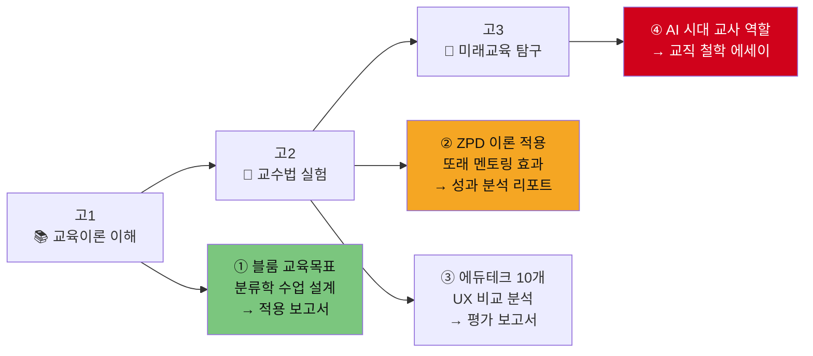
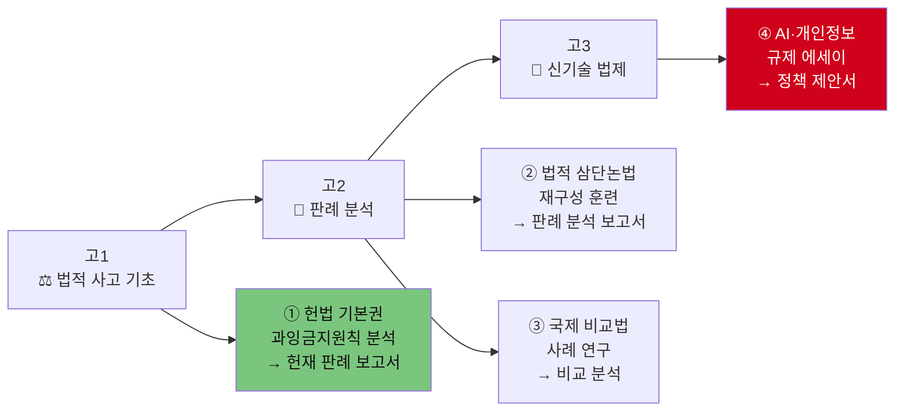
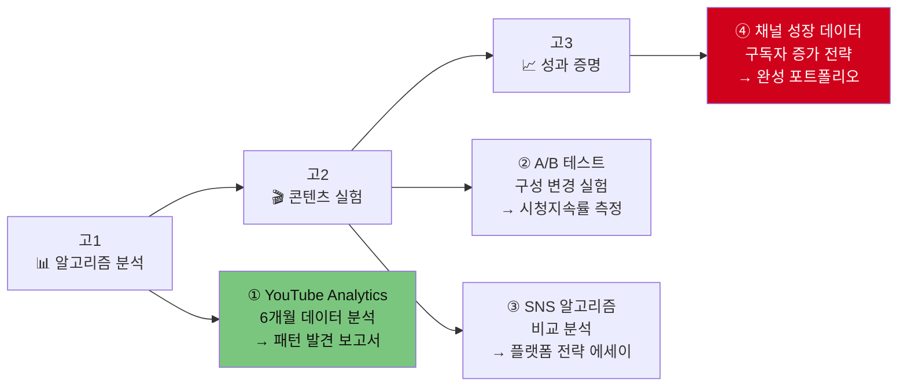
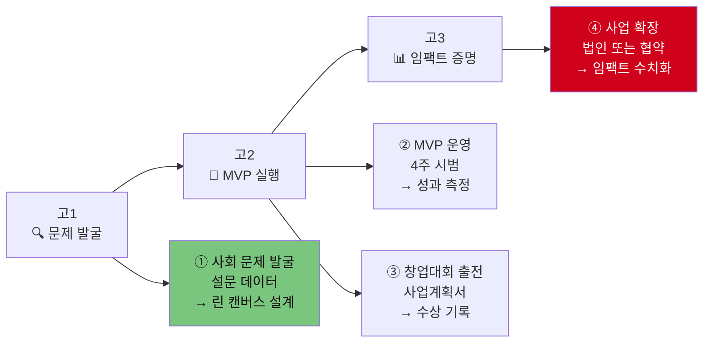
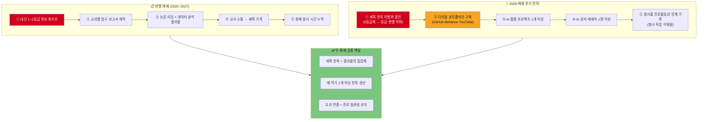
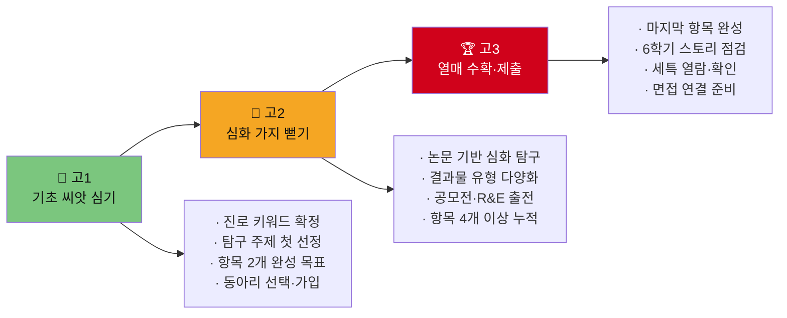
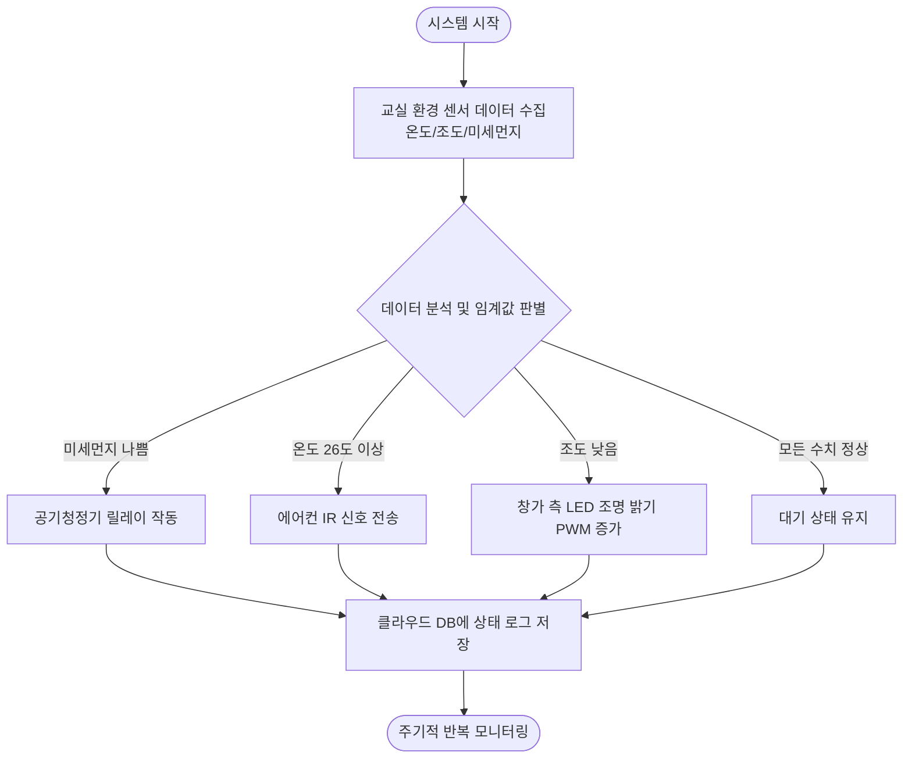

# 생기부 세특 콘텐츠 완성 전략 가이드 (하)
> **핵심 메시지: 커리어패스 = 세특 항목을 하나씩 완성해 나가는 로드맵**
> 연결·질서·소통·도전 왕국 + 합격 사례 항목 분석 + 2028 변화 + 학부모 체크리스트

---

## 목차

1. [커리어패스별 세특 콘텐츠 로드맵 — 연결 왕국](#1-연결-왕국-커리어패스-세특-콘텐츠-로드맵)
2. [커리어패스별 세특 콘텐츠 로드맵 — 질서 왕국](#2-질서-왕국-커리어패스-세특-콘텐츠-로드맵)
3. [커리어패스별 세특 콘텐츠 로드맵 — 소통 왕국](#3-소통-왕국-커리어패스-세특-콘텐츠-로드맵)
4. [커리어패스별 세특 콘텐츠 로드맵 — 도전 왕국](#4-도전-왕국-커리어패스-세특-콘텐츠-로드맵)
5. [합격 사례별 세특 항목 분석](#5-합격-사례별-세특-항목-분석)
6. [2028 체제 세특 콘텐츠 전략 변화](#6-2028-체제-세특-콘텐츠-전략-변화)
7. [학부모용 학년별 세특 항목 생산 체크리스트](#7-학부모용-학년별-세특-항목-생산-체크리스트)

---

# 1. 연결 왕국 커리어패스 세특 콘텐츠 로드맵

---

## 커리어 10 · 교사 (교육학·사범대)

### 세특 콘텐츠 생산 파이프라인

### 학기별 세특 항목 로드맵

| 학기 | 교과 | 세특 항목 (결과물) | 키워드 | 평가 요소 |
|------|------|-----------------|------|---------|
| 고1-1 | 교육학(선택) | ① 블룸 교육목표 분류학 6단계로 수업 설계 실습 보고서 | 블룸·교육목표·수업설계 | 학업역량 |
| 고1-2 | 정보 | ② 에듀테크 앱 10개 학습 효과 비교 분석 (콴다·산타토익·클래스팅) | 에듀테크·학습분석·디지털리터러시 | 진로역량 |
| 고2-1 | 심리학(선택) | ③ ZPD 이론 실제 적용 — 수학 하위권 학생 3명 멘토링 + 성과 분석 보고서 (12점 상승) | ZPD·스캐폴딩·또래멘토링 | 진로+공동체 |
| 고2-2 | 사회문화 | ④ 지역별 학업 성취도 공공데이터 분석 — 교육 불평등 구조 보고서 | 교육격차·공공데이터·교육정책 | 사회적 시야 |
| 고3-1 | 국어 | ⑤ AI 기반 적응형 학습 플랫폼과 ZPD 이론 공통점 분석 에세이 "기계가 할 수 없는 교육" | AI교육·적응형학습·교직철학 | 융합 역량 |

### 필수 결과물 체크리스트

| # | 결과물 항목 | 목표 | 완료 |
|---|---------|-----|------|
| 1 | 멘토링 활동 보고서 (성과 수치 포함) | 2편 이상 | ☐ |
| 2 | 교육 이론 적용 실험 보고서 | 2편 이상 | ☐ |
| 3 | 교육 봉사 (멘토링·독서지도·다문화학생) | 200시간 이상 | ☐ |
| 4 | 에듀테크 비교 분석 보고서 | 1편 이상 | ☐ |
| 5 | 교직 철학 에세이 | 1편 이상 | ☐ |

---

## 커리어 11 · 심리상담사 (심리학과·상담심리)

### 학기별 세특 항목 로드맵

| 학기 | 교과 | 세특 항목 (결과물) | 키워드 | 평가 요소 |
|------|------|-----------------|------|---------|
| 고1-1 | 심리학(선택) | ① SNS 사용 시간 × 자존감 상관관계 — 교내 120명 설문 조사 분석 (Rosenberg 척도 적용) | Rosenberg·자존감·상관관계·p값 | 학업역량 |
| 고1-2 | 사회 | ② 인지행동치료(CBT) 원리 분석 + 청소년 우울 개입 사례 비교 보고서 | CBT·인지왜곡·인지재구성 | 진로역량 |
| 고2-1 | 심리학(선택) | ③ 학교 스트레스 실태 설문 (100명) + 학교 맞춤형 스트레스 관리 프로그램 기획서 | PHQ-9·스트레스·중재프로그램 | 진로+공동체 |
| 고2-2 | 생명과학Ⅰ | ④ 세로토닌·도파민 신경전달물질과 우울장애 메커니즘 분석 보고서 | 신경전달물질·생물심리학·SSRI | 학업+진로 |
| 고3-1 | 심리학(선택) | ⑤ AI 기반 감정분석 도구와 전통적 심리 검사 비교 분석 — 상담사의 역할 변화 에세이 | 감정AI·자연어처리·상담윤리 | 융합 역량 |

---

## 커리어 12 · 간호사 (간호학과)

### 학기별 세특 항목 로드맵

| 학기 | 교과 | 세특 항목 (결과물) | 키워드 | 평가 요소 |
|------|------|-----------------|------|---------|
| 고1-1 | 보건(선택) | ① 교내 학생 수면 실태 100명 설문 + "Sleep Well 캠페인" 기획·실행 (수면 30분↑, 졸림 22%↓) | 수면위생·공중보건·캠페인 | 진로역량 |
| 고1-2 | 생명과학Ⅰ | ② 감염병 전파 경로 시뮬레이션 (SIR 모델) 보고서 | SIR모델·감염재생산수·역학 | 학업역량 |
| 고2-1 | 보건(선택) | ③ 근거기반간호(EBN) 원리 + 당뇨 예방 프로그램 설계 보고서 | EBN·근거중심의학·NIC·NOC | 학업+진로 |
| 고2-2 | 생명과학Ⅱ | ④ 항생제 내성 간호 프로토콜 분석 + WHO 글로벌 대응 비교 | AMR·손위생·감염관리 | 사회적 시야 |
| 고3-1 | 보건(선택) | ⑤ 노인 낙상 예방 프로그램 설계 + 보건소 협력 기획서 제출 | 낙상예방·고령화·지역사회간호 | 실행력 |

---

# 2. 질서 왕국 커리어패스 세특 콘텐츠 로드맵

---

## 커리어 13 · 변호사 (법학대학원·로스쿨)

### 세특 콘텐츠 생산 파이프라인

### 학기별 세특 항목 로드맵

| 학기 | 교과 | 세특 항목 (결과물) | 키워드 | 평가 요소 |
|------|------|-----------------|------|---------|
| 고1-1 | 정치와법 | ① 헌재 '양심적 병역거부' 결정(2018헌가11) — 다수·반대의견 법적 삼단논법 재구성 보고서 | 과잉금지원칙·헌법재판소·법적논증 | 학업역량 |
| 고1-2 | 정치와법 | ② 독일·대만·한국 병역거부 처우 비교 — 국제 비교법 분석 | 국제비교법·헌법·병역의무 | 진로역량 |
| 고2-1 | 정치와법 | ③ 개인정보보호법 vs AI 학습 데이터 — 규제와 혁신 균형 에세이 | GDPR·개인정보·AI규제 | 학업+진로 |
| 고2-2 | 사회문화 | ④ 딥페이크 처벌법 국내외 비교 분석 + 입법 제안서 | 딥페이크·디지털성범죄·형사법 | 사회적 시야 |
| 고3-1 | 정치와법 | ⑤ 자율주행차 사고 법적 책임 분석 — 제조물책임법·형사·민사 접근 비교 | 제조물책임·자율주행·법적책임 | 융합 역량 |

---

## 커리어 14 · 외교관 (국제정치학·외교학)

### 학기별 세특 항목 로드맵

| 학기 | 교과 | 세특 항목 (결과물) | 키워드 | 평가 요소 |
|------|------|-----------------|------|---------|
| 고1-1 | 세계사 | ① 웨스트팔리아 체제(1648)→UN 체제(1945) 국제 질서 진화 보고서 | 주권국가·세력균형·집단안보 | 학업역량 |
| 고1-2 | 영어 | ② 영문 국제기구 결의안 3편 원문 분석 + 한국 입장 정리 보고서 | UN결의안·외교문서·국제법 | 진로역량 |
| 고2-1 | 세계사 | ③ UN 안보리 개혁안 비교 분석 — 한국의 입장 논리 에세이 (MUN 출전 준비 연계) | 안보리개혁·거부권·다자외교 | 학업+진로 |
| 고2-2 | 정치와법 | ④ 전국 모의유엔(MUN) 참가 — 결의안 작성·발표 + 협상 과정 분석 보고서 | MUN·결의안·외교협상 | 자기주도 |
| 고3-1 | 사회 | ⑤ 한국 공공외교 전략 분석 + 외교부 인턴십 체험 보고서 | 공공외교·소프트파워·K-Culture | 실행력 |

---

## 커리어 15 · 회계사 (경영학·경제학)

### 학기별 세특 항목 로드맵

| 학기 | 교과 | 세특 항목 (결과물) | 키워드 | 평가 요소 |
|------|------|-----------------|------|---------|
| 고1-1 | 경제 | ① 삼성전자 10년 재무제표 분석 — ROE·부채비율·영업이익률 엑셀 산출 보고서 | ROE·재무비율·DART | 학업역량 |
| 고1-2 | 수학Ⅱ | ② 복리·현재가치·NPV 계산의 금융수학적 원리 탐구 보고서 | 복리·현재가치·NPV·IRR | 학업역량 |
| 고2-1 | 경제 | ③ 삼성전자 vs 애플 10-K·사업보고서 비교 분석 (반도체 이익률 회복 원인 해석) | 10-K·SEC·영업이익·메모리수급 | 진로역량 |
| 고2-2 | 정보 | ④ Python 상장기업 100개 PER·PBR 자동 추출 프로그램 제작 (GitHub 공개) | 크롤링·재무분석·자동화 | 디지털 역량 |
| 고3-1 | 경제 | ⑤ ESG 투자 기준 분석 — 국내외 ESG 평가지표 비교 + 투자 선별 모델 설계 | ESG·지속가능투자·SRI | 융합 역량 |

---

# 3. 소통 왕국 커리어패스 세특 콘텐츠 로드맵

---

## 커리어 16 · 유튜버·크리에이터 (미디어학과·광고홍보)

### 세특 콘텐츠 생산 파이프라인

### 학기별 세특 항목 로드맵

| 학기 | 교과 | 세특 항목 (결과물) | 키워드 | 평가 요소 |
|------|------|-----------------|------|---------|
| 고1-1 | 영상제작(선택) | ① YouTube Analytics 6개월 데이터 분석 — CTR·시청지속률·구독전환율 상관관계 보고서 | CTR·시청지속률·추천알고리즘 | 학업역량 |
| 고1-2 | 수학(확률통계) | ② 영상 구성 A/B 테스트 실험 — Hook 방식 변경 시청지속률 42%→67% 분석 보고서 | A/B테스트·대조실험·통계유의성 | 학업+진로 |
| 고2-1 | 사회 | ③ 알고리즘 편향이 정보 소비에 미치는 영향 — 유튜브·틱톡·인스타 비교 에세이 | 필터버블·에코챔버·미디어리터러시 | 사회적 시야 |
| 고2-2 | 영상제작(선택) | ④ 교육 채널 6편 제작·업로드 — 조회수·CTR 데이터로 개선 사이클 분석 보고서 | 콘텐츠전략·SEO·썸네일최적화 | 진로역량 |
| 고3-1 | 국어 | ⑤ 숏폼 vs 롱폼 콘텐츠의 정보 전달 효율 비교 — 미디어 교육 제안 에세이 | 숏폼·정보전달·미디어교육 | 융합 역량 |

### 필수 결과물 체크리스트

| # | 결과물 항목 | 목표 | 완료 |
|---|---------|-----|------|
| 1 | YouTube 채널 운영 (구독자·조회수 데이터 있는 것) | 1개 | ☐ |
| 2 | 미디어 데이터 분석 보고서 | 2편 이상 | ☐ |
| 3 | 영상 작품 포트폴리오 | 5편 이상 | ☐ |
| 4 | A/B 테스트 실험 기록 | 1편 이상 | ☐ |

---

## 커리어 17 · 게임기획자 (게임공학·컴퓨터공학)

### 학기별 세특 항목 로드맵

| 학기 | 교과 | 세특 항목 (결과물) | 키워드 | 평가 요소 |
|------|------|-----------------|------|---------|
| 고1-1 | 수학 | ① A* 알고리즘 수학적 원리 분석 + 게임 경로 탐색 적용 보고서 | A*알고리즘·휴리스틱·최단경로 | 학업역량 |
| 고1-2 | 정보 | ② 게임 기획문서(GDD) 30페이지 작성 + Unity 교육용 퍼즐 게임 개발 | GDD·Unity·C#·게임루프 | 진로역량 |
| 고2-1 | 프로그래밍(선택) | ③ 오브젝트 풀링 적용 전후 프레임 드롭 비교 — 최적화 디버깅 보고서 | 객체지향·오브젝트풀링·메모리최적화 | 학업+진로 |
| 고2-2 | 사회 | ④ 게임 중독 예방 시스템 법·기술 비교 분석 — 셧다운제 폐지 이후 대안 에세이 | 게임셧다운제·과몰입예방·게임복지 | 사회적 시야 |
| 고3-1 | 프로그래밍(선택) | ⑤ itch.io 게임 출시 후 300다운로드 분석 — 유저 피드백 기반 업데이트 보고서 | 게임출시·유저피드백·린개발 | 실행력 |

---

# 4. 도전 왕국 커리어패스 세특 콘텐츠 로드맵

---

## 커리어 18 · 스타트업 창업가 (경영학·사회적기업)

### 세특 콘텐츠 생산 파이프라인

### 학기별 세특 항목 로드맵

| 학기 | 교과 | 세특 항목 (결과물) | 키워드 | 평가 요소 |
|------|------|-----------------|------|---------|
| 고1-1 | 경제 | ① 독거노인 식사 공백 문제 발굴 — 20명 설문 (주말 저녁 73% 식사 거름) + 린 캔버스 작성 | 린스타트업·고객발견·Pain Point | 학업역량 |
| 고1-2 | 사회 | ② 사회적 기업 5개 비즈니스 모델 비교 분석 보고서 (임팩트 vs 수익 균형) | 사회적기업·BM캔버스·소셜임팩트 | 진로역량 |
| 고2-1 | 경제 | ③ '이웃반찬' MVP 4주 시범 운영 — 봉사자 10명, 이용 만족도 92%, 구청 협약 100만원 | MVP·PMF·지역사회협력 | 실행력 |
| 고2-2 | 국어·발표 | ④ 창업대회 사업계획서 발표 — 대상 수상(상금 300만원) + 언론 보도 | 피칭·투자유치·사회적가치 | 리더십 |
| 고3-1 | 경제 | ⑤ 서비스 AI 자동화 설계 — 챗봇 도입으로 주문 처리 효율 분석 보고서 | AI자동화·서비스확장·스케일업 | 융합 역량 |

### 필수 결과물 체크리스트

| # | 결과물 항목 | 목표 | 완료 |
|---|---------|-----|------|
| 1 | 린 캔버스 + MVP 운영 기록 | 1개 이상 | ☐ |
| 2 | 사회 문제 설문 조사 + 분석 보고서 | 1편 이상 | ☐ |
| 3 | 창업대회 출전 (수상 목표) | 1회 이상 | ☐ |
| 4 | 실제 서비스 운영 성과 데이터 | 수치화 필수 | ☐ |

---

## 커리어 19 · 투자분석가 (금융공학·경제학)

### 학기별 세특 항목 로드맵

| 학기 | 교과 | 세특 항목 (결과물) | 키워드 | 평가 요소 |
|------|------|-----------------|------|---------|
| 고1-1 | 수학(미적분) | ① Black-Scholes 옵션가격 결정 모형 편미분방정식 유도 탐구 보고서 | PDE·편미분·Black-Scholes | 학업역량 |
| 고1-2 | 경제 | ② KOSPI 200 주요 종목 PER·PBR 비교 분석 엑셀 보고서 | PER·PBR·밸류에이션·내재가치 | 진로역량 |
| 고2-1 | 수학(확률통계) | ③ 기하학적 브라운운동(GBM) 기반 주가 시뮬레이션 Python 구현 | GBM·확률과정·몬테카를로 | 학업+진로 |
| 고2-2 | 정보 | ④ Python으로 KOSPI 200 옵션 내재변동성(IV) 역산 프로그램 제작 (이론가 vs 실제 괴리 분석) | 내재변동성·옵션전략·VIX | 디지털 역량 |
| 고3-1 | 경제 | ⑤ ESG 등급 vs 5년 주가 수익률 상관분석 보고서 (Python pandas) | ESG·SRI·알파팩터·퀀트 | 융합 역량 |

---

# 5. 합격 사례별 세특 항목 분석

> 각 합격 사례를 "세특 항목 수 × 깊이 × 일관성" 기준으로 분석합니다.

---

## 합격 사례 ① — 서울대 의대 (일반고 학종)

### 학생 프로필

| 항목 | 내용 |
|------|------|
| 학교 유형 | **일반고** (경기도 소재) |
| 전형 | 서울대 학생부종합 일반전형 |
| 내신 | 전 과목 **1.08등급** |
| 수능 최저 | 국수영탐(2) 합 5 이내 충족 |

### 6학기 세특 항목 분석표

| 학기 | 교과 | 완성된 세특 항목 | 결과물 유형 | 키워드 |
|------|------|--------------|---------|------|
| 고1-1 | 생명과학Ⅰ | ① mRNA 백신 vs 불활화 백신 면역 반응 비교 | 비교 분석 보고서 | mRNA·면역·T세포 |
| 고1-2 | 화학Ⅰ | ② 약물동역학 반감기 시뮬레이션 + CYP3A4 상호작용 | 엑셀 모델·발표 | 약물동역학·CYP3A4 |
| 고2-1 | 생명과학Ⅱ | ③ CRISPR vs 프라임에디팅 off-target rate 정량 비교 (Nature 논문) | 논문 리딩 노트 | CRISPR·유전자편집 |
| 고2-2 | 보건(선택) | ④ 지역 건강 불평등 공공데이터 분석 + 정책 제안서 | 데이터 분석 리포트 | 공중보건·의료격차 |
| 고3-1 | 생명과학Ⅱ | ⑤ AI 보조 진단 가능성·한계·윤리 분석 에세이 | R&E 에세이 | 의료AI·딥러닝윤리 |

### 합격 포인트 항목 분석

| 합격 요인 | 항목 수 | 구체적 근거 | 비중 |
|---------|--------|---------|------|
| **세특 일관성** | 5개 전부 의학+생명과학 연결 | 고1~고3 스토리 완벽 | ★★★★★ |
| **결과물 다양성** | 보고서·시뮬레이션·논문리딩·데이터분석·R&E | 5가지 유형 | ★★★★★ |
| **수치·데이터 근거** | Nature 논문, NCBI 데이터, Python 분석 | 전 항목 수치화 | ★★★★★ |
| **사회적 시야** | 건강 불평등·의료 AI 윤리까지 확장 | 2개 항목 | ★★★★☆ |
| **봉사 연계** | 보건소(80h) + 과학 멘토링(50h) = 130시간 | 모두 의료 관련 | ★★★★☆ |

---

## 합격 사례 ② — KAIST AI학과 (과학고 학종)

### 학생 프로필

| 항목 | 내용 |
|------|------|
| 학교 유형 | **과학고** (서울 소재) |
| 전형 | KAIST 학생부종합 일반전형 (수능 최저 없음) |
| 내신 | 전 과목 **2.5등급** (과학고 특성) |

### 6학기 세특 항목 분석표

| 학기 | 교과 | 완성된 세특 항목 | 결과물 유형 | 키워드 |
|------|------|--------------|---------|------|
| 고1-1 | 수학(미적분) | ① 경사하강법 편미분 유도 + Python 수렴 시각화 | 코드+보고서 | 편미분·경사하강법 |
| 고1-2 | 정보 | ② Flask Q&A 챗봇 개발 (사용자 50명, 300건 처리) | 서비스 개발 | Flask·REST API |
| 고2-1 | 프로그래밍 | ③ 전국 AI 공모전 '고령자 음성AI 보조' 프로젝트 **대상 수상** | 공모전 수상 | 음성인식·NLP |
| 고2-2 | 확률과통계 | ④ Hugging Face 오픈소스 PR 5건 merged, GitHub Stars 200+ | 오픈소스 기여 | 협업·PR·Stars |
| 고3-1 | 인공지능수학 | ⑤ AI 공정성 편향 데이터 수학적 분석 보고서 | 수리 분석 보고서 | FPR·FNR·AI윤리 |

### 합격 포인트 항목 분석

| 합격 요인 | 항목 수 | 구체적 근거 | 비중 |
|---------|--------|---------|------|
| **포트폴리오 실적** | 5개 모두 외부 검증 가능 | 대상·GitHub·PR merged | ★★★★★ |
| **수학 기반 AI 탐구** | 2개 이상 (수학→AI 연결) | 편미분·선형대수·확률 | ★★★★★ |
| **실사용 서비스** | 1개 (50명 운영) | 사용자 데이터 보유 | ★★★★★ |
| **윤리적 사고** | 1개 | AI 공정성·편향 탐구 | ★★★★☆ |
| **협업 역량** | 1개 | 오픈소스 기여 기록 | ★★★★☆ |

---

## 합격 사례 ③ — 연세대 경영학과 (일반고 학종)

### 6학기 세특 항목 분석표

| 학기 | 교과 | 완성된 세특 항목 | 결과물 유형 | 키워드 |
|------|------|--------------|---------|------|
| 고1-1 | 경제 | ① 린 스타트업 + 학교 매점 경영 개선 (매출 15%↑) | 현장 프로젝트 | 린스타트업·매출분석 |
| 고1-2 | 수학Ⅱ | ② 복리·NPV·IRR 금융수학적 탐구 보고서 | 수학 탐구 보고서 | 복리·NPV·시간가치 |
| 고2-1 | 정보 | ③ Python 상장기업 100개 재무비율 자동 추출 프로그램 (GitHub) | 코드 프로젝트 | 크롤링·재무분석 |
| 고2-2 | 영어 | ④ McKinsey 7S 프레임워크 영문 케이스 분석 보고서 | 영문 분석 보고서 | 7S·전략경영·영어 |
| 고3-1 | 사회문화 | ⑤ 독거노인 소셜벤처 법인 설립 + 창업대회 **대상 수상** (상금 300만원) | 창업 프로젝트 | 소셜벤처·임팩트 |

---

## 합격 사례 ④ — 서울교대 초등교육과 (일반고 학종)

### 6학기 세특 항목 분석표

| 학기 | 교과 | 완성된 세특 항목 | 결과물 유형 | 키워드 |
|------|------|--------------|---------|------|
| 고1-1 | 교육학(선택) | ① 블룸 교육목표 6단계 수업 설계 실습 보고서 | 수업 설계안 | 블룸·교육목표 |
| 고1-2 | 정보 | ② 에듀테크 앱 10개 UX·학습 효과 비교 분석 | 비교 분석 보고서 | 에듀테크·UX |
| 고2-1 | 심리학(선택) | ③ ZPD 이론 멘토링 적용 + 3명 성적 12점 상승 성과 분석 | 멘토링 성과 보고서 | ZPD·스캐폴딩 |
| 고2-2 | 사회문화 | ④ 지역별 학업 성취도 데이터 분석 — 교육 불평등 구조 보고서 | 공공데이터 분석 | 교육격차·공공데이터 |
| 고3-1 | 국어 | ⑤ "기계가 할 수 없는 교육" — AI 시대 교직 철학 에세이 | 교직 철학 에세이 | AI교육·교직철학 |

### 교대 합격 특이 포인트

| 항목 | 내용 |
|------|------|
| **봉사 시간** | 교육 봉사 **누적 300시간** (멘토링·독서지도·다문화학생) |
| **교과 균형** | 전 교과 **1.2등급** (교대는 전 교과 균등 중시) |
| **세특 연결** | 전 교과에서 **"교육" 관점** 탐구 일관 |
| **면접 핵심** | "좋은 교사란?" — 봉사 경험 기반 구체적 답변 |

---

## 합격 사례 4개 종합 비교표

| 비교 항목 | 서울대 의대 | KAIST AI | 연대 경영 | 서울교대 |
|---------|---------|---------|---------|---------|
| **학교 유형** | 일반고 | 과학고 | 일반고 | 일반고 |
| **내신** | 1.08등급 | 2.5등급(과학고) | 1.5등급 | 1.2등급 |
| **세특 항목 수** | 5개 | 5개 | 5개 | 5개 |
| **결과물 유형** | 보고서·논문·데이터 | 코드·공모전·PR | 프로젝트·코드·창업 | 설계·분석·에세이 |
| **외부 검증** | 논문 출처·데이터 URL | GitHub·공모전 수상 | 창업대회 수상 | 성과 수치(12점↑) |
| **합격 핵심** | 내신+세특 일관성+봉사 | 포트폴리오 실적 | 실행력+사회 임팩트 | 봉사+교과 균형 |

---

# 6. 2028 체제 세특 콘텐츠 전략 변화

## 현행 vs 2028 세특 콘텐츠 전략 알고리즘

## 현행 vs 2028 세특 항목 비교 — 직업군별

| 직업군 | 현행 체제 세특 항목 | 2028 체제 추가 항목 |
|------|----------------|----------------|
| **의사** | ① 논문 리딩 보고서 / ② 데이터 분석 리포트 | ③ AI 진단 도구 활용 프로젝트 / ④ 의료 AI 윤리 에세이 |
| **AI연구원** | ① GitHub 코드 프로젝트 / ② 알고리즘 탐구 보고서 | ③ AI 공정성 분석 보고서 / ④ 오픈소스 기여 URL 제출 |
| **교사** | ① 멘토링 성과 보고서 / ② 교수법 실험 보고서 | ③ AI 보조 학습 도구 비교 분석 / ④ AI 시대 교직 철학 에세이 |
| **창업가** | ① 린 캔버스 + MVP 운영 / ② 창업대회 수상 | ③ AI 자동화 도입 효과 분석 / ④ 디지털 임팩트 측정 보고서 |
| **변호사** | ① 판례 분석 보고서 / ② 입법 제안서 | ③ AI 규제법 비교 에세이 / ④ 딥페이크·개인정보 법제 탐구 |

## 2028 적용 학생별 세특 항목 추가 전략

| 현재 학년 | 적용 체제 | 추가 해야 할 항목 | 우선순위 |
|---------|---------|--------------|---------|
| **고3** (2026 수능) | 현행 체제만 | 기존 항목 완성도 높이기 | 내신+세특 마무리 |
| **고2** (2027 수능) | 현행 체제 | 고3-1 항목에 AI 연계 추가 가능 | 세특 품질 강화 |
| **고1** (2028 수능) | **2028 체제** | 디지털 포트폴리오 + AI 활용 항목 필수 | 포트폴리오 구축 시작 |
| **중3 이하** | **2028 체제** | AI 프로젝트·윤리·디지털 리터러시 | 2028 전면 대비 |

---

# 7. 학부모용 학년별 세특 항목 생산 체크리스트

## 전략 마스터 알고리즘 — 학년별 핵심 임무

## 고1 체크리스트 — 기초 씨앗 심기

| # | 체크 항목 | 시기 | 담당 | 완료 |
|---|---------|------|------|------|
| 1 | 진로 키워드 3개 확정 (예: 의학·생명과학·데이터) | 2월 | 학생+학부모 | ☐ |
| 2 | 고교학점제 선택과목 신청 (진로 맞춤) | 2월 | 학생+학부모 | ☐ |
| 3 | 담임·교과 교사에게 진로 방향 공유 | 3월 | 학생 | ☐ |
| 4 | 1학기 탐구 주제 1개 선정 + 결과물 유형 결정 | 3월 | 학생 | ☐ |
| 5 | 진로 관련 동아리 가입 | 3월 | 학생 | ☐ |
| 6 | 탐구 결과물 완성 + 교사에게 제출·발표 | 4~6월 | 학생 | ☐ |
| 7 | **세특 항목 ① 완성** 확인 (1학기 세특 열람) | 8월 | 학생+학부모 | ☐ |
| 8 | 2학기 탐구 주제 선정 (1학기 항목과 연결 고리 설계) | 9월 | 학생 | ☐ |
| 9 | 봉사활동 시작 (진로 관련) | 4월~ | 학생 | ☐ |
| 10 | **세특 항목 ② 완성** 확인 (2학기 세특 열람) | 2월 | 학생+학부모 | ☐ |

## 고2 체크리스트 — 심화 가지 뻗기

| # | 체크 항목 | 시기 | 담당 | 완료 |
|---|---------|------|------|------|
| 1 | 심화 선택과목 수강 (진로선택과목 A등급 목표) | 3월 | 학생 | ☐ |
| 2 | 1학기 탐구 주제 선정 (논문 기반 심화) | 3월 | 학생 | ☐ |
| 3 | R&E / 대학 연계 프로그램 신청 | 3~4월 | 학생 | ☐ |
| 4 | **세특 항목 ③ 완성** (논문 리딩 노트 or 데이터 분석) | 4~6월 | 학생 | ☐ |
| 5 | 전국 대회·공모전 1회 이상 출전 | 5~10월 | 학생 | ☐ |
| 6 | 여름방학 인턴·캠프·연구 경험 | 7~8월 | 학생 | ☐ |
| 7 | **세특 항목 ④ 완성** (프로젝트 or 캠페인) | 9~11월 | 학생 | ☐ |
| 8 | 6학기 세특 스토리 일관성 점검 (고1→고2 연결 확인) | 12월 | 학생+학부모 | ☐ |

## 고3 체크리스트 — 열매 수확·제출

| # | 체크 항목 | 시기 | 담당 | 완료 |
|---|---------|------|------|------|
| 1 | **세특 항목 ⑤ 완성** (집대성 R&E·융합 프로젝트) | 4~6월 | 학생 | ☐ |
| 2 | 세특 최종 열람 — 전 항목 사실 오류 확인 | 8월 | 학생+학부모 | ☐ |
| 3 | 수시 6장 원서 전략 수립 | 6~8월 | 학생+컨설턴트 | ☐ |
| 4 | 원서 접수 | 9월 | 학생 | ☐ |
| 5 | 면접 대비 — 세특 항목별 예상 질문 준비 | 10~11월 | 학생 | ☐ |
| 6 | 수능 최저 충족 대비 | 11월 | 학생 | ☐ |
| 7 | 면접 실시 | 11~12월 | 학생 | ☐ |

## 2028 체제 추가 체크리스트 (고1·중3 이하 적용)

| # | 추가 체크 항목 | 시기 | 이유 |
|---|-----------|------|------|
| 1 | **디지털 포트폴리오 플랫폼 개설** (GitHub / Behance / YouTube) | 고1 3월 | 2028 포트폴리오 전형 대비 |
| 2 | **AI 활용 프로젝트** 1개 이상 세특 항목으로 완성 | 고1~2 | AI 활용 역량 평가 대비 |
| 3 | **기술 블로그·학습 로그** 작성 시작 | 고1 | 탐구 과정 아카이빙 |
| 4 | **AI 윤리 에세이** 1편 이상 작성 | 고2 | AI 윤리 면접 질문 대비 |
| 5 | **봉사활동을 진로활동 기록과 연계** (봉사 독립 삭제 대응) | 고1~ | 창체 3영역 체제 대응 |
| 6 | **수능 서술형 대비** 논술·서술 연습 | 고2~ | 2028 서술형 도입 대비 |
| 7 | **디지털 포트폴리오 최종 정리** (전형별 URL 목록) | 고3 8월 | 전형 제출 준비 |

---

## 학부모 5대 원칙 — 세특 항목 생산 지원

| # | 원칙 | 구체적 실천 방법 |
|---|------|--------------|
| 1 | **관찰하라** | 자녀가 에너지 쏟는 활동 관찰 → 탐구 주제 힌트 발견 |
| 2 | **기록하라** | 월별 활동 Notion 포트폴리오 함께 정리 |
| 3 | **소통하라** | 학기 초 담임 교사에게 자녀 진로 방향 직접 전달 |
| 4 | **연결하라** | 진로 관련 현직자·멘토 연결 → 인터뷰 보고서 소재 제공 |
| 5 | **응원하라** | 결과물 완성 과정 칭찬 → "항목 하나 더 완성!" |

---

## 세특 항목 완성 개수 × 합격 가능성 상관표

| 항목 수 | 수준 | 평가 | 전략 대응 |
|--------|------|------|---------|
| 0~1개 | 🔴 위험 | 변별 불가, 대입 불리 | 즉시 결과물 제작 시작 |
| 2~3개 | 🟡 보통 | 기본 충족, 최상위권 경쟁 어려움 | 심화 탐구 1~2개 추가 필수 |
| 4~5개 | 🟢 우수 | 학종 경쟁력 확보 | 깊이와 일관성 점검 |
| 6개 이상 | ⭐ 최상 | 서울대·KAIST 수준 | 결과물 외부 검증 (수상·URL·데이터) |

---

---

# 8. 세특 콘텐츠의 '함수 컴포넌트화(모듈화)' 전략

> **"프로그래밍의 함수 컴포넌트처럼, 생기부 활동도 모듈화하여 유지보수와 재사용을 쉽게 만듭니다."**
> 하나의 큰 프로젝트를 작고 독립적인 컴포넌트(기능)로 나누어, 학년이 올라갈 때마다 레고 블록처럼 조립하고 확장하는 전략입니다.

## 컴포넌트 기반 세특 설계 로드맵

| 모듈(컴포넌트) | 기능 설명 | 활용 예시 (재사용 및 확장) | 유지보수(업데이트) 전략 |
|--------------|---------|------------------------|-----------------------|
| **탐구 컴포넌트 (Research)** | 특정 현상/문제를 분석하고 데이터를 수집하는 기초 모듈 | 1학년 통합과학: '지역 미세먼지 데이터 분석' | 2학년 진학 시 변수(가중치)를 변경하여 '기후 변화 모델링'으로 재사용 |
| **해결 컴포넌트 (Action)** | 수집된 데이터를 기반으로 해결책(알고리즘, 정책)을 제시하는 모듈 | 2학년 정보: '공기청정기 자동 제어 알고리즘 설계' | 기존 코드를 바탕으로 'AI 기반 전력 최적화 알고리즘'으로 업그레이드 |
| **가치 컴포넌트 (Impact)** | 실제 사회나 공동체에 적용하여 임팩트를 만드는 모듈 | 3학년 사회문화: '교내 미세먼지 알림 앱 배포 및 캠페인' | 이전 컴포넌트(Research + Action)를 결합하여 최종 산출물 완성 |

---

# 9. 피지컬 컴퓨팅 & 메이커 프로젝트 세특 가이드

> **"하드웨어와 소프트웨어가 결합된 피지컬 컴퓨팅 교구재를 활용한 공학/IT 계열 세특 차별화 전략"**
> 직접 손으로 만들고 구동하는 메이커(Maker) 프로젝트는 문제해결력을 가장 명확하게 증명하는 방법입니다.

## 교구재 비교 및 준비사항 표

| 교구재 플랫폼 | 가격대 (기본 킷) | 프로그래밍 언어 | 난이도 | 장단점 및 특징 | 세특 프로젝트 예시 (준비사항) |
|-------------|--------------|--------------|-------|--------------|-------------------------|
| **아두이노(Arduino)** | 3~5만 원 | C/C++ | ⭐⭐ | **장점**: 압도적인 오픈소스 자료, 저렴함 **단점**: 복잡한 연산이나 AI 구동은 어려움 | **[스마트팜 시스템]** 온습도 센서, 워터펌프, 릴레이 모듈 준비. 하드웨어 제어 역량 증명. |
| **라즈베리파이(Raspberry Pi)** | 10~15만 원 | Python, C++ | ⭐⭐⭐⭐ | **장점**: 소형 컴퓨터 수준, AI/비전 처리 가능 **단점**: 리눅스 OS 지식 필요, 가격 다소 높음 | **[AI 자율주행 RC카]** 파이카메라, 모터 드라이버 준비. 딥러닝(OpenCV) 시각 처리 특화. |
| **마이크로비트(Micro:bit)** | 2~4만 원 | 블록코딩, Python | ⭐ | **장점**: 각종 센서 내장, 진입장벽 낮음 **단점**: 확장성에 한계, 고등학생용으론 쉬움 | **[웨어러블 만보기]** 기본 보드만으로 구현 가능. 창체(동아리) 입문용으로 적합. |
| **ESP32** | 1~2만 원 | C/C++, Python | ⭐⭐⭐ | **장점**: Wi-Fi/Bluetooth 내장, IoT에 최적 **단점**: 아두이노 대비 레퍼런스가 부족할 수 있음 | **[스마트 홈 IoT 제어기]** 스마트폰 연동 앱 기획. 통신 프로토콜(MQTT) 이해 특화. |

## 피지컬 컴퓨팅 동작 순서도 (교실 IoT 자동 제어 알고리즘)

## 메이커 프로젝트 세특 예시 (물리학Ⅰ + 프로그래밍 융합)

> 역학 단원에서 마찰력과 가속도 원리를 학습한 후, 피지컬 컴퓨팅에 관심을 가짐. **자발적으로** 아두이노와 초음파 센서, 서보 모터를 활용해 '충돌 회피 자율주행 로봇' 메이커 프로젝트를 기획함. 로봇 바퀴의 마찰계수와 모터의 토크(Torque)를 물리 공식으로 계산해 최적의 가속도를 구하고, C++ 코드로 제어함. 특히 **그림자 프로젝트(역공학) 전략**을 적용하여 상용 로봇 청소기의 회피 알고리즘을 분석한 뒤, 모서리 갇힘 문제를 해결하는 '랜덤 각도 후진' 알고리즘을 모듈화(함수 컴포넌트)하여 직접 추가함. 물리적 이론을 소프트웨어와 하드웨어로 융합 구현해내는 탁월한 공학적 문제해결력이 돋보임.

---

## 최종 핵심 메시지

> **현행 체제**: 내신 + 세특 항목 수·깊이 + 일관성 = 합격
>
> **2028 체제**: 세특 항목 차별화 + 디지털 포트폴리오 URL + AI 활용 역량 = 합격
>
> **두 체제 공통**: **"자소서가 사라진 시대, 세특 항목이 곧 자소서다."**
>
> 세특 활동을 하나의 '함수 컴포넌트'처럼 재사용 및 유지보수 가능하게 기획하고, 역공학 기반의 메이커 프로젝트로 자신만의 결과물을 꾸준히 생산하는 것이 핵심 전략입니다.

---

*작성일: 2026년 2월 | 생기부 세특 콘텐츠 완성 전략 가이드 (하) v2.1*
*핵심 관점: 커리어패스 = 세특 항목 생산 로드맵 | 함수 컴포넌트화 및 피지컬 컴퓨팅 활용*
*참조: 32개_커리어패스_대입학종_완전가이드_상.md, 하.md | 교육부 2028 개편안*
