# AI 시대 커리어패스 20대 우수 사례 벤치마킹
> **초등 ~ 고등학교 커리어패스 성공 스토리 20선 — 분야별 심층 분석**
> 적성 발견 → 목표 설정 → 체험 검증 → 성과 달성까지의 실전 여정

---

## 전체 분야 구조도

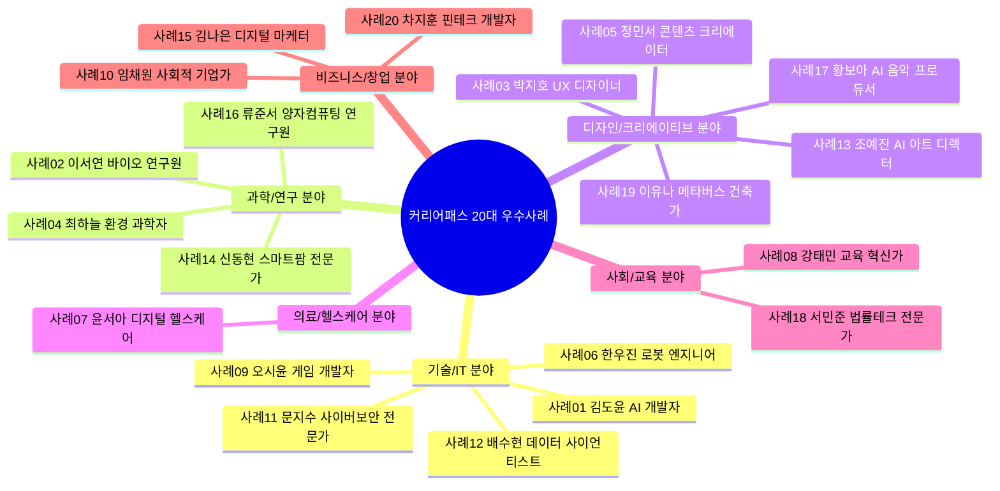

---

## 전체 20사례 총괄 비교표

| 번호 | 이름 | 분야 | Holland 유형 | 초등 핵심 | 중등 핵심 성과 | 고등 핵심 성과 | 대입 결과 |
|------|------|------|-------------|---------|------------|------------|---------|
| 01 | 김도윤 | 기술/IT | I+C | 스크래치 코딩 입문 | Python 앱 제작 공모전 장려 | AI 공모전 대상, GitHub 15개 | AI공학과 합격 |
| 02 | 이서연 | 과학/연구 | I | 과학탐구대회 금상 | 생물올림피아드 은상 | 연구 논문 저자, 국제 과학전 | 생명공학과 합격 |
| 03 | 박지호 | 디자인 | A+I | 미술대회 입상 | Figma 전문화,  학교 포스터 전담 | 스타트업 UX 인턴, 공모전 은상 | 디자인학과 합격 |
| 04 | 최하늘 | 과학/연구 | I+S | 하천 관찰 일기 | 탄소 측정 프로젝트 | 기후테크 해커톤 우승, 환경부 장관상 | 환경공학과 합격 |
| 05 | 정민서 | 디자인 | A+E | 동화 글쓰기 | 유튜브 구독자 3,000명 | 팔로워 5만, 월수익 50만원 | 미디어학과 합격 |
| 06 | 한우진 | 기술/IT | R+I | 레고 마인드스톰 대회 | 지역 로봇대회 은상 | 전국 로봇대회 금상, 특허 1건 | 로봇공학과 합격 |
| 07 | 윤서아 | 의료 | S+I | 병원 봉사 50시간 | 의료 AI 탐구  코딩 입문 | 건강관리 앱 200명 사용, 공모전 우수 | 보건정보학과 합격 |
| 08 | 강태민 | 사회/교육 | S+E | 또래 학습 멘토 | 교육 봉사 100시간  모의 창업 | 에듀테크 앱 창업대회 최우수 | 교육공학과 합격 |
| 09 | 오시윤 | 기술/IT | A+R | 게임 분석 블로그 | Unity 게임 제작  게임잼 입상 | 인디게임 출시, 다운로드 500+ | 게임공학과 합격 |
| 10 | 임채원 | 비즈니스 | E+S | 학급 반장, 사회 문제 관심 | 모의 창업대회 우승 | 소셜벤처 법인 설립, 창업대회 대상 | 경영학과 합격 |
| 11 | 문지수 | 기술/IT | C+I | 컴퓨터 조립 취미 | CTF 해킹대회 입상 | 화이트햇 보안 공모전 대상 | 정보보호학과 합격 |
| 12 | 배수현 | 기술/IT | I+C | 수학 경시대회 입상 | 데이터 분석 프로젝트 | 캐글 상위 5%, 기업 인턴 | 통계학과 합격 |
| 13 | 조예진 | 디자인 | A+I | 그림 그리기 3년 | AI 이미지 생성 탐구 | AI 아트 전시회 개최, 협찬 수익 | 디지털아트학과 합격 |
| 14 | 신동현 | 과학/연구 | R+I | 텃밭 가꾸기 일기 | 스마트 식물 재배 Arduino | 스마트팜 창업 아이디어 수상 | 농업생명과학과 합격 |
| 15 | 김나은 | 비즈니스 | E+A | 학급 홍보물 제작 | SNS 마케팅 실험 | 브랜드 컨설팅 인턴, 공모전 금상 | 경영/마케팅학과 합격 |
| 16 | 류준서 | 과학/연구 | I | 수학/물리 올림피아드 | 물리올림피아드 금상 | 양자컴퓨팅 논문 발표, 해외 학회 | 물리학과 합격 |
| 17 | 황보아 | 디자인 | A+I | 피아노 8년, 작곡 입문 | DAW 프로듀싱  AI 음악 실험 | AI 음악 앨범 발매, 저작권 등록 | 음악공학과 합격 |
| 18 | 서민준 | 사회/교육 | C+E | 모의재판 대회 입상 | 법률 AI 탐구  토론대회 | 리걸테크 해커톤 우수, 로스쿨 멘토 | 법학과 합격 |
| 19 | 이유나 | 디자인 | A+R | 건축 모형 만들기 | Blender 3D 모델링 | 메타버스 공간 설계 공모전 대상 | 건축학과/디지털 합격 |
| 20 | 차지훈 | 비즈니스 | C+E | 경제 일기, 용돈 투자 | 모의투자 대회 우승 | 핀테크 앱 개발, 금융 해커톤 수상 | 금융공학과 합격 |

---

## 분야별 성공 패턴 비교

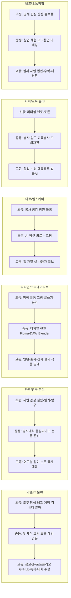

---

# 🖥️ 기술/IT 분야

---

## 사례 01: 김도윤 — AI 개발자

> **Holland**: 탐구형(I) + 관습형(C) | **에너지 키워드**: 논리 퍼즐, 코드 디버깅, 자동화
> **멘토**: 네이버 AI 연구소 현직 엔지니어 (고1부터 월 1회 1:1)
> **최종**: AI공학과 합격 + 입학 전 GitHub Stars 200+

### 초등 단계 (씨앗 심기)

| 학년 | 월별 계획 | 핵심 활동 | 도구/비용 | 성과물 |
|------|---------|---------|---------|------|
| 초4 | 3~4월 | 스크래치로 고양이 움직이기 (코딩 캠프 1주) | 스크래치 (무료), 코딩 캠프 5만원 | 첫 스크래치 게임 완성 |
| 초4 | 5~8월 | 방과후 코딩 수업 주 2회 | 엔트리 (무료), 방과후 월 1만원 | 엔트리 미니게임 5개 |
| 초4 | 9~12월 | 교내 코딩 대회 도전 | 스크래치 (무료) | **교내 코딩대회 3위** |
| 초5 | 1~6월 | Python 독학 (유튜브 '나도코딩') | Python (무료), 교재 1.5만원 | 사칙연산 계산기 완성 |
| 초5 | 7~12월 | 지역 코딩 대회 참가 | 코딩 교재 3만원 | **지역 코딩대회 입상**, GitHub 계정 개설 |
| 초6 | 연간 | Python 심화 + 첫 GitHub 커밋 | VSCode (무료), GitHub (무료) | GitHub 레포 5개, 커밋 100+ |

### 중등 단계 (싹 틔우기)

| 학기 | 주간 루틴 | 핵심 프로젝트 | 대회/외부 활동 | 성과 |
|------|---------|-----------|------------|------|
| 중1 1학기 | 월~금: Python 1시간, 주말: 프로젝트 | Holland 검사 (I+C 확인), 커리어넷 직업 탐색 | 커리어넷 검사 무료 | Holland 코드 확인, 방향 설정 |
| 중1 2학기 | API 공부 + 토이 프로젝트 | 날씨 API 활용 날씨 알림 앱 | IT 관련 유튜브 채널 팔로우 | **날씨 앱 완성**, Flask 서버 구축 |
| 중2 1학기 | 알고리즘 공부 (백준 1일 1문제) | 학교 급식 알림 텔레그램 봇 | IT 공모전 도전 | **공모전 장려상**, 봇 실제 사용 50명 |
| 중2 2학기 | K-MOOC AI 기초 수강 | 머신러닝 기초 프로젝트 | K-MOOC 무료 수강 | AI 기초 수료증, 첫 ML 모델 |
| 중3 1학기 | 코딩 동아리 회장 취임 | 후배 대상 Python 입문 수업 10회 | 동아리 활동 | 동아리 부원 12명 교육 |
| 중3 2학기 | Hugging Face 탐구 | 감정 분석 챗봇 프로토타입 | AI 입문 프로젝트 | 챗봇 프로토타입 완성 |

### 고등 단계 (열매 맺기)

| 학기 | 주간 루틴 (월~일) | 핵심 프로젝트 | 멘토링/외부 | 성과 |
|------|--------------|-----------|----------|------|
| 고1 1학기 | 월수금: AI 프로젝트 2h / 화목: 수학 강화 / 주말: GitHub 정리 | 학교 상담 AI 챗봇 (학교폭력 익명 신고 연결) | 네이버 AI 엔지니어 멘토 월 1회 | 챗봇 교내 시범 운영, 멘토 확보 |
| 고1 2학기 | 매일: 논문 1편 리딩 / 주 3회: 코딩 | Transformer 모델 이해 + 미니 NLP 프로젝트 | Hugging Face 튜토리얼 | 논문 리딩 노트 30편, NLP 프로젝트 |
| 고2 1학기 | 공모전 준비 집중 | **전국 AI 아이디어 공모전** (고령자 음성 AI 보조) | 공모전 팀 구성 (3인) | **대상 수상**, 상금 100만원 |
| 고2 2학기 | GitHub 정리 + 포트폴리오 | 오픈소스 기여 2건, 프로젝트 정리 | GitHub 오픈소스 | GitHub Stars 200+, 프로젝트 15개 |
| 고3 1학기 | 대입 준비 + AI 심화 | 자소서 핵심 스토리 3개 정리 | 학교 진로 선생님, 멘토 최종 리뷰 | 자소서 완성, 면접 준비 |
| 고3 2학기 | 수능 + 면접 | 포트폴리오 최종 정리 | - | **AI공학과 합격**, 장학금 수혜 |

### 핵심 성공 지표

| 지표 | 초등 달성 | 중등 달성 | 고등 달성 |
|------|---------|---------|---------|
| 코딩 시간 누적 | 약 200시간 | 약 600시간 | 약 1,000시간 |
| 완성 프로젝트 | 5개 | 6개 | 8개 |
| 수상 경력 | 지역 입상 | 공모전 장려상 | **전국 대상** |
| 포트폴리오 항목 | - | GitHub 레포 10개 | GitHub 레포 25개, Stars 200+ |
| 총 투자 비용 | 약 10만원 | 약 5만원 | 약 20만원 |

---

## 사례 06: 한우진 — AI 로봇 엔지니어

> **Holland**: 현실형(R) + 탐구형(I) | **에너지 키워드**: 기계 조립, 센서 제어, 물리 원리 이해
> **멘토**: KAIST 로봇공학 석사생 (고1부터 격주 1회 실습 동반)
> **최종**: 로봇공학과 합격 + 특허 1건 출원

### 초등~고등 핵심 여정

| 단계 | 시기 | 핵심 도구 | 비용 | 성과 |
|------|------|---------|------|------|
| 레고 마인드스톰 입문 | 초4 | LEGO Mindstorms EV3 | 30만원 (부모 구매) | 자율주행 미니카 완성 |
| 메이커스페이스 체험 | 초5 | 3D 프린터, 레이저 커터 | 무료 (지역 메이커스페이스) | 창작 로봇 설계도 제작 |
| 교내 로봇대회 우승 | 초6 | EV3 + 커스텀 센서 | 5만원 (센서 추가) | **교내 로봇대회 1위** |
| 아두이노 입문 | 중1 | Arduino Uno + 센서 키트 | 3만원 | 자동 물주기 화분 완성 |
| 라인 트레이서 로봇 | 중2 | Arduino + 모터 드라이버 | 5만원 | **지역 로봇대회 은상** |
| 전국대회 도전 | 중3 | 라즈베리파이 + 카메라 | 8만원 | 전국대회 동상 |
| ROS + 컴퓨터비전 | 고1 | ROS, OpenCV, Python | 무료 (소프트웨어) | AI 장애물 회피 로봇 프로토타입 |
| 전국대회 금상 + 특허 | 고2 | 3D 설계 (SolidWorks), 특허 출원 | 특허 출원 20만원 | **전국 금상**, 특허 1건 |
| 대입 완성 | 고3 | 제작 영상 포트폴리오 | - | 로봇공학과 합격 |

### 주간 루틴 (고2 기준 — 전국 대회 준비기)

| 요일 | 오전 | 오후 | 저녁 |
|------|------|------|------|
| 월 | 학교 수업 | ROS 알고리즘 공부 1.5h | 수학/물리 심화 1h |
| 화 | 학교 수업 | 로봇 하드웨어 제작 2h | 대회 규정 분석 30분 |
| 수 | 학교 수업 | 팀 미팅 (전략 회의) 1h | 코딩 1h |
| 목 | 학교 수업 | 센서 튜닝 + 테스트 2h | 논문/기술 문서 읽기 1h |
| 금 | 학교 수업 | KAIST 멘토 Zoom 미팅 1h | 주간 정리 노트 작성 |
| 토 | 로봇 집중 제작 4h | 팀 테스트 런 2h | 회고 기록 |
| 일 | 특허 출원 서류 준비 | 다음 주 계획 수립 | 충전/휴식 |

---

## 사례 09: 오시윤 — 인디 게임 개발자

> **Holland**: 예술형(A) + 현실형(R) | **에너지 키워드**: 게임 스토리 설계, 캐릭터 창작, 버그 수정
> **멘토**: 인디 게임 개발자 (itch.io 인기 개발자, 고2 게임잼에서 연결)
> **최종**: 게임공학과 합격 + Steam 출시 게임 보유

### 초등~고등 핵심 여정 및 월간 계획

| 단계 | 기간 | 주요 활동 | 도구/비용 | 산출물 |
|------|------|---------|---------|------|
| 게임 분석 습관 | 초3~4 | 플레이한 게임 메모 (스토리·UI·버그 기록) | 노트 (무료) | 게임 분석 노트 30권 |
| 게임 제작 입문 | 초5~6 | 스크래치 미니게임, 게임 리뷰 블로그 개설 | 스크래치 무료, 블로그 무료 | 스크래치 게임 12개, 블로그 포스팅 25편 |
| Unity 입문 | 중1 | Unity 2D 기초 강좌 (유튜브), C# 입문 | Unity 무료, C# 교재 2만원 | 첫 2D 퍼즐 게임 완성 |
| 팀 프로젝트 | 중2 | 게임 개발 동아리 창설, 팀 협업 | GitHub (무료), Unity | 팀 게임 2인 개발 1개 |
| 게임잼 도전 | 중3 | Global Game Jam (48h) 온라인 참가 | itch.io 무료 | 게임잼 작품 출품, 커뮤니티 피드백 50개 |
| 3D 게임 제작 | 고1 | Blender 3D 모델링, Unity 3D | Blender 무료, Blender 강좌 유료 5만원 | 3D 액션 게임 프로토타입 |
| 인디게임 출시 | 고2 | Steam 그린라이트 통과, itch.io 출시 | Steam 개발자 등록 10만원 | **게임 출시, 다운로드 500+, 리뷰 30개** |
| 대입 완성 | 고3 | 포트폴리오 사이트 (출시 게임+개발 과정) | 포트폴리오 사이트 무료 | 게임공학과 합격 |

### 고2 게임 출시 3개월 집중 플랜

| 월 | 핵심 작업 | 주간 목표 | 체크포인트 |
|----|---------|---------|---------|
| **출시 D-90** | 스토리+레벨 설계 완성 (GDD 문서화) | 주 1회 GDD 업데이트 | GDD 20페이지 완성 |
| **출시 D-60** | 코어 게임루프 구현, 버그 수정 | 주 3회 플레이테스트 | 지인 5명 테스트 피드백 반영 |
| **출시 D-30** | 사운드·UI 완성, Steam 페이지 제작 | 트레일러 영상 촬영 | 트레일러 200뷰 이상 |
| **출시일** | 출시 완료, 커뮤니티 공유 | Reddit/Discord 홍보 | 다운로드 100+ 첫 주 |

---

## 사례 11: 문지수 — 사이버보안 전문가

> **Holland**: 관습형(C) + 탐구형(I) | **에너지 키워드**: 시스템 취약점 탐지, 암호화 원리, 해킹 퍼즐
> **멘토**: KISA(한국인터넷진흥원) 보안 전문가 (고2 공모전에서 연결)
> **최종**: 정보보호학과 합격 + CTF 국내 TOP 10 경력

### 초등~고등 성장 로드맵

| 단계 | 시기 | 핵심 이야기 | 도구 | 성과 |
|------|------|---------|------|------|
| 컴퓨터 분해·조립 취미 | 초4~5 | 오래된 PC 분해, 부품 역할 이해, YouTube 하드웨어 영상 | 드라이버 세트, 중고 PC | 컴퓨터 조립 가능, 부품 지식 습득 |
| 리눅스 입문 | 초6 | Ubuntu 설치, 터미널 명령어 학습 | Ubuntu 무료, 교재 1.5만원 | 리눅스 기본 명령어 50개 숙달 |
| 네트워크 기초 | 중1 | TCP/IP, 패킷 분석 (Wireshark 입문) | Wireshark 무료, CCNA 교재 | 패킷 분석 능력, 네트워크 구조 이해 |
| 웹 해킹 기초 | 중2 | OWASP Top 10 학습, PortSwigger 랩 실습 | Burp Suite 무료, PortSwigger 무료 | SQL Injection, XSS 원리 이해 |
| CTF 첫 도전 | 중3 | Picoctf (미국 Carnegie Mellon 운영) | CTF 플랫폼 무료 | **Picoctf 상위 15% 달성** |
| 윤리적 해킹 심화 | 고1 | Hack The Box, TryHackMe 플랫폼 | TryHackMe 월 1.5만원 | HTB 레벨 Pro Hacker 달성 |
| 국내 CTF 대회 | 고2 | CODEGATE 학생부 CTF 참가 | - | **화이트햇 보안 공모전 대상**, KISA 멘토 연결 |
| 대입 완성 | 고3 | 보안 연구 보고서 5편, 포트폴리오 | Notion | 정보보호학과 합격 |

### 학습 로드맵 (분야별 단계)

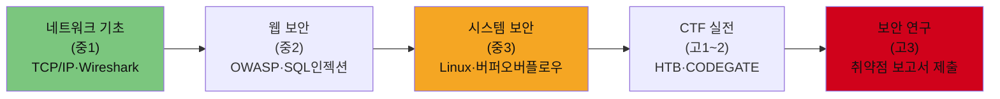

---

## 사례 12: 배수현 — 데이터 사이언티스트

> **Holland**: 탐구형(I) + 관습형(C) | **에너지 키워드**: 데이터에서 패턴 찾기, 통계 모델링, 시각화
> **멘토**: 카카오 데이터분석팀 시니어 (캐글 커뮤니티에서 연결)
> **최종**: 통계학과 합격 + 캐글 Expert 등급 보유

### 초등~고등 성장 로드맵

| 단계 | 시기 | 핵심 활동 | 도구 | 성과 |
|------|------|---------|------|------|
| 수학 경시대회 입상 | 초4~6 | KMO 예선 준비, 수학 심화 문제 | 올림피아드 교재 3만원 | **수학 경시대회 지역 입상** |
| Excel 데이터 분석 | 중1 | 학급 성적 데이터 분석, 그래프 제작 | Excel (무료) | 학급 성적 트렌드 분석 보고서 |
| Python + pandas | 중2 | 데이터 분석 기초, 공공 데이터 포털 활용 | Python 무료, 공공데이터포털 무료 | 서울시 미세먼지 데이터 분석 |
| 시각화 심화 | 중3 | Matplotlib, Seaborn, 대시보드 제작 | Python 라이브러리 무료 | 교내 과학전 데이터 시각화 우수상 |
| 캐글 입문 | 고1 | Titanic 생존 예측 (캐글 입문 대회) | Kaggle 무료 | 캐글 첫 메달 (Bronze) |
| ML 모델링 심화 | 고2 | 캐글 경진대회 3회, 팀 구성 | Colab 무료, XGBoost, LightGBM | **캐글 상위 5%**, Expert 등급 |
| 기업 인턴 | 고2 여름 | 카카오 데이터분석팀 방학 인턴 (4주) | 실무 환경 | 실무 데이터 분석 경험, 멘토 확보 |
| 대입 완성 | 고3 | 분석 포트폴리오 GitHub 정리 | GitHub, Notion | 통계학과 합격 |

---

# 🔬 과학/연구 분야

---

## 사례 02: 이서연 — 바이오테크 연구원

> **Holland**: 탐구형(I) | **에너지 키워드**: 실험 설계, 현미경 관찰, 데이터 패턴 이해
> **멘토**: 서울대 생명공학부 박사과정 (중3 연구실 견학에서 연결)
> **최종**: 생명공학과 합격 + 공동 논문 1편 저자

### 월간 학습 계획 (중2 올림피아드 준비기 예시)

| 월 | 학습 내용 | 주간 시간 | 교재/자료 | 목표 |
|----|---------|---------|---------|------|
| 3월 | 세포생물학 기초 복습 | 주 5h | 캠벨 생명과학 (고급) | 세포 분열 완벽 이해 |
| 4월 | 유전학 (멘델 ~ 분자유전학) | 주 6h | 올림피아드 기출문제 | 유전학 파트 80점 이상 |
| 5월 | 생태학 + 진화론 | 주 5h | 올림피아드 기출 | 전체 범위 1회독 완성 |
| 6월 | 모의 시험 3회 + 오답 | 주 7h | 기출 5개년 | 평균 85점 이상 |
| 7월 | 대회 참가 | 집중 2주 | - | **생물올림피아드 은상** |

### 고등 단계 연구 프로세스

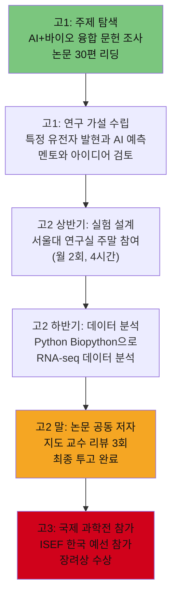

---

## 사례 04: 최하늘 — 기후테크 데이터 사이언티스트

> **Holland**: 탐구형(I) + 사회형(S) | **에너지 키워드**: 환경 데이터 시각화, 문제 해결, 캠페인
> **멘토**: 기후테크 스타트업 CTO (고1 환경 해커톤에서 연결)
> **최종**: 환경공학과 합격 + 환경부 장관상 수상

### 중등 핵심 프로젝트: 학교 탄소 배출 측정 (중2)

| 단계 | 내용 | 기간 | 도구 | 결과 |
|------|------|------|------|------|
| 문제 정의 | 학교 건물 에너지 사용 현황 파악 | 1주 | 전기 계량기, 메모 | 월간 전기 사용량 데이터 수집 |
| 데이터 수집 | 교실별 조명·PC·에어컨 사용 시간 기록 | 4주 | Excel, 설문조사 | 3개월 데이터 확보 |
| 분석 | 탄소 환산 계산, 가장 낭비 심한 구역 특정 | 2주 | Excel 그래프 | "3학년 복도 조명이 전체의 23% 차지" |
| 제안서 작성 | 교장 선생님께 에너지 절약 방안 제출 | 1주 | PPT, 보고서 | **제안서 채택, 교내 절전 캠페인 실시** |
| 결과 측정 | 3개월 후 에너지 10% 감소 확인 | 3개월 | 전기 계량기 | 학교 언론 보도 |

---

## 사례 14: 신동현 — 스마트팜 농업 전문가

> **Holland**: 현실형(R) + 탐구형(I) | **에너지 키워드**: 식물 키우기, 센서 제어, 데이터 기반 재배
> **멘토**: 국립농업과학원 스마트팜 연구원 (고1 농업 박람회에서 연결)
> **최종**: 농업생명과학과 합격 + 스마트팜 창업 아이디어 수상

### 성장 타임라인

| 단계 | 시기 | 핵심 활동 | 도구/비용 | 성과 |
|------|------|---------|---------|------|
| 텃밭 일기 시작 | 초3~4 | 베란다 텃밭 (토마토·상추), 성장 일기 매일 기록 | 씨앗·흙 1만원 | 텃밭 일기 2년 분량, 식물 생장 패턴 발견 |
| 식물 과학 탐구 | 초5~6 | 식물 성장 조건 실험 (빛·온도·수분), 과학전 출품 | 실험 도구 2만원 | **교내 과학전 금상** |
| 아두이노 스마트 화분 | 중1 | 토양 수분 센서 + 자동 물주기 시스템 | Arduino Uno 3만원, 센서 2만원 | 스마트 화분 완성, 물 절약 40% |
| 스마트팜 탐구 | 중2 | 유리온실 방문 견학, 스마트팜 관련 논문 읽기 | 견학 무료, 논문 무료 | 스마트팜 작동 원리 이해, 보고서 1편 |
| 농업 AI 입문 | 중3 | Python으로 식물 질병 이미지 분류 (전이학습) | Python·TensorFlow 무료 | 식물 질병 분류 모델 (정확도 82%) |
| 스마트팜 설계 | 고1 | IoT 기반 소형 스마트팜 직접 설계·제작 | 라즈베리파이 10만원, 재료 5만원 | 소형 스마트팜 실제 작동 (딸기 재배 성공) |
| 창업 아이디어 수상 | 고2 | 청소년 농업 창업대회 참가, 비즈니스 모델 발표 | 대회 참가 무료 | **농식품부 장관상**, 상금 50만원 |
| 대입 완성 | 고3 | 연구 포트폴리오, 농업 현장 인턴(여름방학) | 인턴 무급 | 농업생명과학과 합격 |

---

## 사례 16: 류준서 — 양자컴퓨팅 연구원

> **Holland**: 탐구형(I) | **에너지 키워드**: 수학적 증명, 물리 원리 탐구, 미지의 것 발견
> **멘토**: 성균관대 물리학과 교수 (고2 학술지 투고 과정에서 연결)
> **최종**: 물리학과 합격 + 해외 학회 구두 발표

### 특별 심화 학습 타임라인

| 시기 | 학습 내용 | 주간 시간 | 교재/수준 | 마일스톤 |
|------|---------|---------|---------|---------|
| 초4~6 | 수학 올림피아드 (수론, 기하) | 주 8h | KMO 교재 | 지역 수학 올림피아드 입상 |
| 중1 | 물리 기초 + 중등 수학 심화 | 주 6h | 고등 물리 선행 | 물리 모의 검사 90점+ |
| 중2 | 물리올림피아드 준비 (역학·전자기) | 주 8h | 물리올림피아드 교재 | **물리올림피아드 금상** |
| 중3 | 선형대수학 독학, 복소해석학 입문 | 주 6h | MIT 오픈코스웨어 | 선형대수 1학기 과정 이수 |
| 고1 | 양자역학 입문 (Griffiths 교재) | 주 6h | 대학 수준 교재 | 양자역학 파동함수 이해 |
| 고1 | Qiskit (IBM 양자 컴퓨팅 SDK) 학습 | 주 4h | IBM Quantum Learning (무료) | 양자 회로 기초 구현 |
| 고2 | 양자컴퓨팅 알고리즘 연구, 논문 작성 | 주 8h | arXiv 논문 | 논문 투고, 교수 멘토 연결 |
| 고2 | **해외 학술대회 참가** (싱가포르) | 집중 1주 | - | **구두 발표 선정**, 해외 연구자 네트워킹 |
| 고3 | 물리학과 지원, 포트폴리오 | - | - | 물리학과 합격, 연구 장학금 |

---

# 🎨 디자인/크리에이티브 분야

---

## 사례 03: 박지호 — UX/AI 디자이너

> **Holland**: 예술형(A) + 탐구형(I) | **에너지 키워드**: 사용자 공감, 인터페이스 설계, 프로토타이핑
> **멘토**: 카카오 UX팀 시니어 디자이너 (고1 디자인 공모전에서 연결)
> **최종**: 디자인학과 합격 + Behance 조회수 5,000+

### UX 그림자 프로젝트 상세 (중3 — 1개월 진행)

| 주차 | 활동 | 방법 | 결과물 |
|------|------|------|------|
| 1주 | 학교 도서관 앱 사용자 관찰 | 방과후 30분, 학생 5명 사용 행동 메모 | 사용자 행동 패턴 노트 5페이지 |
| 2주 | 인터뷰 실시 (학생 5명, 사서 1명) | 반구조화 인터뷰 각 20분 | 페인 포인트 목록 8개 도출 |
| 3주 | 와이어프레임 스케치 → Figma 프로토타입 | 손 스케치 → Figma 무료 | 개선 UI 프로토타입 (12화면) |
| 4주 | 사용자 테스트 (학생 3명) + 개선 | Figma 공유 링크 활용 | **최종 UX 개선 제안서 학교 제출, 채택** |

### 도구 학습 로드맵

| 도구 | 학습 시기 | 학습 방법 | 비용 | 숙련도 |
|------|---------|---------|------|------|
| Canva | 초6~중1 | 독학 (유튜브) | 무료 | 중급 |
| Figma | 중2~현재 | Figma 공식 튜토리얼 + 유튜브 | 무료 | 고급 |
| Adobe XD | 중3 | Adobe 학생 할인 | 월 2.4만원 | 중급 |
| Framer | 고1 | Framer 공식 문서 | 무료 | 입문 |
| Principle | 고2 | 인턴 현장 학습 | 회사 라이선스 | 중급 |
| After Effects | 고2 | 모션 디자인 독학 | 어도비 번들 | 입문 |

---

## 사례 05: 정민서 — 콘텐츠 크리에이터 / 미디어 프로듀서

> **Holland**: 예술형(A) + 기업형(E) | **에너지 키워드**: 스토리텔링, 편집, 시청자 반응 분석
> **멘토**: 100만 유튜버 '공부왕찐천재' 팀 편집자 (고1 DM으로 연결)
> **최종**: 미디어학과 합격 + 유튜브 채널 구독자 52,000명

### 유튜브 성장 분석 (월별 구독자 추이)

| 시기 | 구독자 수 | 핵심 전략 변화 | 인기 영상 |
|------|---------|------------|---------|
| 중1 개설 | 0 → 200명 | 주 1회 업로드, 학습법 콘텐츠 | "중학교 입학 준비 꿀팁" |
| 중1 말 | 200 → 500명 | 썸네일 A/B 테스트 시작 | "자유학기제 완벽 정리" |
| 중2 상반기 | 500 → 1,500명 | 편집 스타일 통일, 시리즈물 기획 | "중2 현실 공부 루틴" |
| 중2 하반기 | 1,500 → 3,000명 | YouTube Analytics 분석 반영 | "수학 포기자 탈출기 ep.1~5" |
| 중3 | 3,000 → 8,000명 | 릴스·쇼츠 멀티 플랫폼 진출 | "시험 D-7 최소한의 공부법" |
| 고1 | 8,000 → 20,000명 | 협찬 첫 수락, 영상 퀄리티 업그레이드 | "고등학교 진짜 공부법" |
| 고2 | 20,000 → 52,000명 | 스튜디오 셋업 완성, 장편 기획물 | "내가 서울대 간다면 이렇게 공부한다" |

### 월 수입 구조 (고2 기준)

| 수입원 | 금액 | 비중 |
|------|------|------|
| YouTube AdSense | 약 20만원 | 40% |
| 브랜드 협찬 (문구류, 교육앱) | 약 20만원 | 40% |
| 멤버십 | 약 5만원 | 10% |
| 전자책 판매 | 약 5만원 | 10% |
| **합계** | **약 50만원/월** | 100% |

---

## 사례 13: 조예진 — AI 아트 디렉터

> **Holland**: 예술형(A) + 탐구형(I) | **에너지 키워드**: AI 이미지 생성, 개념 미술, 디지털 전시
> **멘토**: 국내 NFT 아트 작가 (고2 온라인 아트 커뮤니티에서 연결)
> **최종**: 디지털아트학과 합격 + 전시회 개최, 협찬 수익 발생

### 초등~고등 성장 로드맵

| 단계 | 시기 | 핵심 활동 | 도구/비용 | 성과 |
|------|------|---------|---------|------|
| 그림 기초 습득 | 초3~5 | 수채화·색연필 미술 학원 3년 | 월 6만원 | 교내 미술대회 3회 입상 |
| 디지털 드로잉 입문 | 초6 | iPad + Procreate 독학 | iPad 60만원 (부모 생일선물), Procreate 1.5만원 | 디지털 드로잉 일상화 |
| AI 이미지 생성 탐구 | 중1 | Midjourney, DALL-E 실험 | Midjourney 월 1.2만원 | AI 이미지 프롬프트 기술 습득 |
| AI+전통 미술 융합 | 중2 | 자신의 그림 + AI로 변형하는 스타일 개발 | 도구 병행 사용 | 개인 아트 스타일 정립 |
| 온라인 전시 첫 도전 | 중3 | 인스타그램 아트 갤러리 운영, 팔로워 확보 | 무료 | 팔로워 2,000명, 작품 판매 첫 경험 (5만원) |
| AI 아트 기술 심화 | 고1 | Stable Diffusion 로컬 실행, ControlNet 학습 | 고사양 PC 100만원 (알바비 모아서) | 전문적 AI 아트 파이프라인 구축 |
| 전시회 개최 | 고2 | 지역 갤러리 대관, "AI와 인간" 주제 개인전 | 갤러리 대관 30만원 | **전시 3일, 관람객 300명, 협찬사 2개 연결** |
| 대입 완성 | 고3 | 포트폴리오 북 제작, 디지털아트학과 지원 | 포트폴리오 인쇄 5만원 | 합격 |

---

## 사례 17: 황보아 — AI 음악 프로듀서

> **Holland**: 예술형(A) + 탐구형(I) | **에너지 키워드**: 작곡, 음악 프로덕션, AI 음악 실험
> **멘토**: SM엔터테인먼트 출신 작곡가 (고1 음악 공모전에서 연결)
> **최종**: 음악공학과 합격 + AI 음악 앨범 발매, 저작권 등록

### 음악 학습 + AI 융합 타임라인

| 단계 | 시기 | 핵심 활동 | 도구/비용 | 성과 |
|------|------|---------|---------|------|
| 클래식 피아노 | 초1~5 | 피아노 레슨 주 2회, 학예회 독주 | 월 10만원 | 피아노 6급, 학예회 3회 독주 |
| 화성학·작곡 이론 | 초6 | 화성학 독학, 첫 곡 작곡 (피아노 소품) | 화성학 교재 2만원 | 자작곡 3편 |
| DAW 프로덕션 입문 | 중1 | GarageBand → Logic Pro X 학습 | GarageBand 무료, Logic Pro 29만원 | 첫 비트 제작 10곡 |
| AI 음악 도구 실험 | 중2 | Suno, Udio, AIVA 등 AI 작곡 도구 탐구 | 무료~월 1만원 | AI+자작 하이브리드 곡 5편 |
| 음악 프로덕션 심화 | 중3 | Ableton Live, 믹싱·마스터링 기초 | Ableton 교육용 6만원 | EP(4곡) 제작, SoundCloud 업로드 |
| AI 음악 기술 심화 | 고1 | MusicLM, AudioCraft 연구, 작곡 알고리즘 이해 | Python·오픈소스 무료 | AI 보조 작곡 파이프라인 완성 |
| AI 음악 앨범 발매 | 고2 | 8곡 AI 협업 앨범 발매 (멜론·스포티파이) | 유통사 수수료 10% | **앨범 발매, 저작권 등록, 스트리밍 수익 월 5만원** |
| 대입 완성 | 고3 | 음악공학과 지원, 포트폴리오 | - | 합격 |

---

## 사례 19: 이유나 — 메타버스 건축가

> **Holland**: 예술형(A) + 현실형(R) | **에너지 키워드**: 공간 설계, 3D 모델링, 가상 환경 구축
> **멘토**: 국내 메타버스 스튜디오 3D 아티스트 (고2 공모전에서 연결)
> **최종**: 건축학과/디지털미디어학과 합격 + 메타버스 공간 공모전 대상

### 성장 로드맵

| 단계 | 시기 | 핵심 활동 | 도구/비용 | 성과 |
|------|------|---------|---------|------|
| 건축 모형 만들기 | 초4~5 | 골판지·나무로 건물 모형 제작, 도시 미니어처 | 재료비 5만원 | 모형 15개, 교내 미술상 |
| 건축 그림 그리기 | 초6 | 투시도법 독학, 건물 스케치 | 투시도법 교재 1.5만원 | 스케치북 3권 분량 |
| Blender 3D 입문 | 중1 | YouTube Blender 강좌 (Blender Guru) | Blender 무료 | 도넛 튜토리얼 완성, 첫 방 인테리어 3D 모델 |
| 건축 3D 심화 | 중2 | 실제 학교 건물 3D 모델링, SketchUp 학습 | SketchUp 교육용 무료 | 학교 3D 모델 완성 |
| 메타버스 플랫폼 탐구 | 중3 | Roblox Studio, Gather.town, Decentraland | Roblox Studio 무료 | Roblox 가상 학교 공간 제작, 방문자 200명 |
| 건축+메타버스 융합 | 고1 | Unreal Engine 입문, 현실 공간의 메타버스 복제 | Unreal 무료 | 동네 공원 메타버스 복제 프로젝트 |
| 공모전 도전 | 고2 | 메타버스 공간 설계 공모전, 팀 구성 (3인) | - | **대상 수상**, 실제 기업 협업 제안 |
| 대입 완성 | 고3 | 건축학과+디지털미디어 지원, 포트폴리오 북 | 포트폴리오 인쇄 10만원 | 합격 |

---

# 🏥 의료/헬스케어 분야

---

## 사례 07: 윤서아 — 디지털 헬스케어 서비스 기획자

> **Holland**: 사회형(S) + 탐구형(I) | **에너지 키워드**: 환자 공감, AI 진단 보조, 앱 설계
> **멘토**: 서울아산병원 디지털헬스케어팀 PM (고1 헬스케어 해커톤 연결)
> **최종**: 보건정보학과 합격 + 교내 200명 사용 앱 개발

### 앱 개발 상세 과정 (고1~2, 18개월)

| 단계 | 기간 | 활동 내용 | 사용 도구 | 결과물 |
|------|------|---------|---------|------|
| 문제 정의 | 고1 3월 | "청소년 수면 부족 문제" — 설문 100명 | Google Forms | 수면 패턴 데이터 100명 분량 |
| 경쟁 앱 분석 | 고1 4월 | 수면 관련 앱 10개 분석 (Apple Health, Sleep Cycle 등) | 스프레드시트 | 차별화 포인트 3가지 도출 |
| 기획서 작성 | 고1 5월 | 앱 기능 정의서, 사용자 여정 지도 | Notion, Figma | 기획서 20페이지 |
| 프로토타입 제작 | 고1 6~8월 | Figma 고충실도 프로토타입 (40화면) | Figma 무료 | 프로토타입 완성, 멘토 피드백 |
| 개발 (Flutter) | 고1 9월~고2 2월 | Flutter + Firebase 학습 및 개발 | Flutter 무료, Firebase 무료 | 앱 기본 기능 완성 (v1.0) |
| 학교 시범 운영 | 고2 3~5월 | 교내 시범 운영 (200명), 사용자 피드백 수집 | Firebase Analytics | 월 DAU 80명, 평점 4.2/5.0 |
| 공모전 출품 | 고2 6월 | 디지털헬스케어 청소년 공모전 출품 | - | **우수상, 기업 파트너 연결** |
| 포트폴리오 완성 | 고3 | 앱 운영 데이터 + 개발 과정 Notion 정리 | Notion | 보건정보학과 합격 |

---

# 📚 사회/교육 분야

---

## 사례 08: 강태민 — 에듀테크 창업가

> **Holland**: 사회형(S) + 기업형(E) | **에너지 키워드**: 가르치기, 서비스 기획, 팀 운영
> **멘토**: 에듀테크 스타트업 '클래스101' 출신 PM (고2 창업대회에서 연결)
> **최종**: 교육공학과 합격 + 에듀테크 창업대회 최우수상

### 중등 교육 봉사 200시간 기록

| 봉사 기관 | 시기 | 내용 | 시간 | 배운 점 |
|---------|------|------|------|------|
| 지역아동센터 수학 멘토링 | 중1~2 | 초4~6학년 수학 주 2회 | 60시간 | 설명법, 눈높이 교육 |
| 도서관 독서 지도 | 중2 | 초등 독서 토론 진행 | 30시간 | 토론 퍼실리테이션 |
| 다문화 학생 한국어 지도 | 중3 | 주 1회 1:1 한국어 수업 | 40시간 | 문화 공감, 맞춤 교육 |
| 온라인 학습 콘텐츠 제작 | 중3 | 유튜브 수학 풀이 영상 20편 | 50시간 | 영상 제작, 콘텐츠 기획 |
| **총계** | - | - | **180시간** | 교육 현장 깊은 이해 |

### 에듀테크 앱 개발 및 창업 과정 (고2)

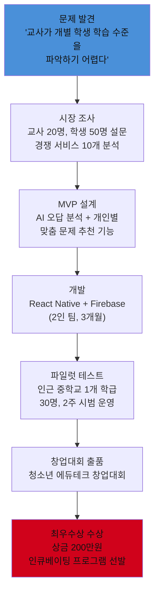

---

## 사례 18: 서민준 — 리걸테크 전문가

> **Holland**: 관습형(C) + 기업형(E) | **에너지 키워드**: 법률 논리, 사회 정의, AI 법률 자동화
> **멘토**: 변호사 + LegalTech 스타트업 대표 (고2 해커톤에서 연결)
> **최종**: 법학과 합격 + 리걸테크 해커톤 우수상

### 초등~고등 성장 로드맵

| 단계 | 시기 | 핵심 활동 | 도구/비용 | 성과 |
|------|------|---------|---------|------|
| 모의재판 첫 경험 | 초5 | 학교 법 교육 주간 모의재판, 검사 역할 | 교과서 무료 | "논리로 설득하는 것이 에너지" 발견 |
| 시사 토론 | 초6~중1 | 뉴스 읽기 + 가족 토론, 사회 문제 스크랩 | 신문 구독 월 1.5만원 | 사회 현안 이해, 논리 구성 능력 |
| 모의법정 동아리 | 중1 | 교내 모의법정 동아리 가입, 검사·변호인 역할 | 무료 | **전국 청소년 모의재판 대회 입상** |
| 법률 AI 탐구 | 중2 | ChatGPT 법률 Q&A 실험, 판례 검색 AI 탐구 | ChatGPT 무료 | "AI로 법률 서비스 민주화 가능" 인식 |
| 리걸테크 조사 | 중3 | 국내외 리걸테크 스타트업 20개 분석 보고서 | 인터넷 무료 | 리걸테크 시장 분석 보고서 20페이지 |
| 법률 AI 프로젝트 | 고1 | 부동산 계약서 자동 검토 AI (GPT-4 API 활용) | GPT-4 API 월 3만원 | 계약서 검토 AI 프로토타입 완성 |
| 리걸테크 해커톤 | 고2 | 법무부 주최 리걸테크 해커톤 참가 | 무료 | **우수상, 변호사 멘토 연결** |
| 대입 완성 | 고3 | 법학과 + 리걸테크 포트폴리오, 면접 | - | 법학과 합격 |

---

# 💼 비즈니스/창업 분야

---

## 사례 10: 임채원 — 소셜벤처 창업가

> **Holland**: 기업형(E) + 사회형(S) | **에너지 키워드**: 사회 문제 해결, 팀 이끌기, 임팩트
> **멘토**: 사회적기업진흥원 컨설턴트 (고1 멘토링 프로그램)
> **최종**: 경영학과 합격 + 소셜벤처 법인 설립 (고2)

### 모의창업대회 수상 아이디어 (중2 — 실제 발표 내용)

| 항목 | 내용 |
|------|------|
| **문제 발견** | 독거노인 식사 공백: 주말 저녁 배달 서비스 없음, 노인 73%가 주 2회 이상 식사 거름 |
| **솔루션** | '이웃반찬': 중학생 봉사자가 토요일 반찬 배달 + 안부 확인 서비스 |
| **비즈니스 모델** | 지역구청 위탁 운영 + 식품 기업 CSR 후원 |
| **실행 계획** | 3개월: 시범 동네 20가구 / 6개월: 지역 전체 100가구 |
| **차별점** | 기술이 아닌 "인간적 연결"에 집중 |
| **심사 결과** | **창업대회 최우수상** + 지역신문 보도 |

### 고2 법인 설립 과정

| 단계 | 내용 | 기간 | 지원 기관 |
|------|------|------|---------|
| 사업계획서 작성 | 사회적기업 인증 준비용 계획서 20페이지 | 2개월 | 사회적기업진흥원 |
| 창업 교육 이수 | 예비창업자 교육 40시간 (온라인) | 1개월 | 창업진흥원 무료 |
| 법인 설립 | 사회적협동조합 형태 법인 설립 | 2주 | 법무사 비용 30만원 |
| 첫 사업 수주 | 구청 독거노인 지원 사업 위탁 (100만원) | 계약 1주 | 지역구청 |
| 청소년 창업대회 | 중기부 청소년 창업경진대회 참가 | 1개월 | 중소기업부 |
| **대상 수상** | 상금 300만원, 창업 지원금 추가 | - | 중소기업부 |

---

## 사례 15: 김나은 — 디지털 마케터

> **Holland**: 기업형(E) + 예술형(A) | **에너지 키워드**: 브랜드 스토리, 소비자 심리, 데이터 광고
> **멘토**: 무신사 마케팅팀 팀장 (고2 브랜드 공모전에서 연결)
> **최종**: 경영/마케팅학과 합격 + 브랜드 컨설팅 인턴 경험

### 초등~고등 성장 로드맵

| 단계 | 시기 | 핵심 활동 | 도구/비용 | 성과 |
|------|------|---------|---------|------|
| 학급 홍보물 제작 | 초5~6 | 학급 잔치·행사 포스터, 학교 신문 편집 | Word, Canva | 학교 행사 홍보물 10건 |
| 소비자 관찰 일기 | 중1 | 쇼핑몰·광고 분석 노트 ("왜 이 광고가 효과적인가") | 노트 무료 | 광고 분석 노트 50편 |
| SNS 마케팅 실험 | 중2 | 학교 매점 인스타그램 운영 자원봉사 | Instagram 무료 | 팔로워 300→800명, 매출 20% 증가 |
| 브랜드 기획 | 중3 | 가상 브랜드 기획 프로젝트 (타겟·포지셔닝·로고) | Canva, Notion | 브랜드 기획서 30페이지 |
| Google Analytics 학습 | 고1 | 디지털 마케팅 무료 강좌 (Google 디지털 마케팅) | Google 강좌 무료 | Google 디지털 마케팅 수료증 |
| 실전 광고 운영 | 고1 | 지인 소상공인 SNS 광고 무료 대행 | Meta 광고 (5만원 예산) | ROAS 180%, 게시물 도달수 5배 |
| 브랜드 공모전 | 고2 | 전국 대학생·청소년 마케팅 공모전 | 무료 참가 | **금상 수상**, 무신사 멘토 연결 |
| 인턴 경험 | 고2 여름 | 브랜드 컨설팅사 방학 인턴 4주 | 인턴 무급 | 실무 캠페인 기획 보조 경험 |
| 대입 완성 | 고3 | 포트폴리오 사이트, 마케팅학과 지원 | Notion 무료 | 합격 |

---

## 사례 20: 차지훈 — 핀테크 개발자

> **Holland**: 관습형(C) + 기업형(E) | **에너지 키워드**: 금융 데이터 분석, 알고리즘 트레이딩, 결제 시스템
> **멘토**: 토스 개발팀 시니어 엔지니어 (고2 금융 해커톤에서 연결)
> **최종**: 금융공학과 합격 + 핀테크 앱 개발 경험

### 초등~고등 성장 로드맵

| 단계 | 시기 | 핵심 활동 | 도구/비용 | 성과 |
|------|------|---------|---------|------|
| 용돈 투자 실험 | 초5 | 용돈 5만원으로 주식 첫 경험, 경제 일기 시작 | 증권사 앱 무료 | 경제 일기 1년, 주식 수익 3,000원 (+6%) |
| 경제 공부 | 초6 | 어린이 경제 신문 구독, 가족 경제 토론 | 어린이 신문 월 1.5만원 | 경제 개념 이해, 뉴스 분석 능력 |
| 모의 투자 대회 | 중1 | 증권사 청소년 모의투자 대회 참가 | 무료 | **모의투자 대회 1위**, 수익률 38% |
| Python 금융 분석 | 중2 | Python + yfinance로 주가 분석, 백테스팅 | Python 무료, yfinance 무료 | 삼성전자 5년 주가 분석 보고서 |
| 알고리즘 트레이딩 | 중3 | 간단한 이동평균 기반 자동매매 시뮬레이션 | Python, Backtrader 무료 | 시뮬레이션 수익률 연 15% 전략 |
| 핀테크 탐구 | 고1 | 국내외 핀테크 서비스 분석 (토스·카카오페이) | 무료 | 핀테크 시장 분석 보고서 |
| 핀테크 앱 개발 | 고1~2 | 간편 가계부 + 지출 AI 분석 앱 개발 | React Native, Firebase 무료 | 앱 출시, 사용자 100명 |
| 금융 해커톤 수상 | 고2 | 금융감독원 주최 핀테크 해커톤 | 무료 참가 | **우수상, 토스 멘토 연결** |
| 대입 완성 | 고3 | 금융공학과 지원, 포트폴리오 | Notion | 합격 |

---

# 📊 통합 분석 및 벤치마킹 가이드

---

## 분야별 초등~고등 필수 준비 체크리스트

### 기술/IT 분야 (사례 01·06·09·11·12)

| 시기 | 필수 활동 | 권장 도구 | 비용 | 기간 |
|------|---------|---------|------|------|
| 초등 4학년 | 코딩 입문 (스크래치/엔트리) | 스크래치 (무료) | 0원 | 방과후 주 2회 |
| 초등 5학년 | Python/C 기초 학습 | Python 교재 1.5만원 | 1.5만원 | 주 3~4회 |
| 초등 6학년 | 첫 개인 프로젝트 완성 + GitHub 개설 | GitHub 무료 | 0원 | 방학 집중 |
| 중1 | Holland 검사 + 기술 분야 확정 | 커리어넷 무료 | 0원 | 1회 |
| 중2 | 관심 기술 심화 + 공모전 첫 도전 | 분야별 도구 | 5~10만원 | 연간 |
| 중3 | 동아리 활동 + 대회 준비 | 팀 협업 도구 | 5만원 | 연간 |
| 고1 | 멘토 확보 + 핵심 프로젝트 1개 | 멘토링 무료~유료 | 0~20만원 | 연간 |
| 고2 | 전국 공모전 도전 + 포트폴리오 | GitHub, Notion | 0~10만원 | 연간 |
| 고3 | 대입 준비 + 포트폴리오 완성 | Notion, 개인 사이트 | 0원 | 연간 |

### 과학/연구 분야 (사례 02·04·14·16)

| 시기 | 필수 활동 | 권장 도구 | 비용 |
|------|---------|---------|------|
| 초등 | 자연 관찰 일기 (최소 6개월) | 관찰 노트, 카메라 | 2만원 |
| 중1 | 분야별 올림피아드 준비 시작 | 올림피아드 교재 3만원 | 3만원 |
| 중2 | 경시대회 도전 (지역/전국) | 심화 교재 | 5만원 |
| 중3 | 대학 연구실 견학 + 연구원 인터뷰 | 교통비 | 3만원 |
| 고1 | 대학 연구실 정기 참여 시작 | 실험 재료 | 10만원 |
| 고2 | 논문 공동 작성 or 국제 학회 | 학회 등록비 | 20~50만원 |
| 고3 | 연구 포트폴리오 완성 | Notion, LaTeX | 0원 |

### 디자인/크리에이티브 분야 (사례 03·05·13·17·19)

| 시기 | 필수 활동 | 권장 도구 | 비용 |
|------|---------|---------|------|
| 초등 | 창작 활동 (그림·글·음악·만들기) 중 1개 집중 | 기초 도구 | 5~10만원 |
| 중1 | 디지털 도구 전환 (Canva/GarageBand/Blender) | 무료 도구 | 0~1.5만원 |
| 중2 | 전문 도구 입문 (Figma/Logic Pro/Ableton) | 교육용 할인 | 5~30만원 |
| 중3 | 온라인 포트폴리오 게시 + 팔로워 확보 | SNS 무료 | 0원 |
| 고1 | 실제 클라이언트 프로젝트 1건 | 전문 도구 | 10만원 |
| 고2 | 인턴/전시/출시 등 대외 성과 | 참가비 | 10~30만원 |
| 고3 | 포트폴리오 사이트 (Behance/개인 사이트) | 무료~월 2만원 | 연 0~24만원 |

---

## 20사례 투자 비용 vs 성과 분석

| 사례 | 총 투자 비용 (초~고) | 대입 성과 | ROI (성과 지표) |
|------|----------------|---------|-------------|
| 01 김도윤 (AI) | 약 35만원 | AI공학과 합격+장학금 | GitHub Stars 200+, 대상 수상 |
| 02 이서연 (바이오) | 약 30만원 | 생명공학과 조기합격 | 논문 저자, 올림피아드 은상 |
| 03 박지호 (UX) | 약 50만원 | 디자인학과 합격 | Behance 5,000뷰, 인턴 경험 |
| 04 최하늘 (환경) | 약 20만원 | 환경공학과 합격+장학금 | 장관상, 해커톤 우승 |
| 05 정민서 (콘텐츠) | 약 30만원 | 미디어학과 합격 | 구독자 5만, 월수익 50만원 |
| 06 한우진 (로봇) | 약 60만원 | 로봇공학과 합격 | 전국 금상, 특허 1건 |
| 07 윤서아 (헬스케어) | 약 30만원 | 보건정보학과 합격 | 앱 200명 사용, 공모전 수상 |
| 08 강태민 (교육) | 약 20만원 | 교육공학과 합격 | 봉사 180h, 창업대회 최우수 |
| 09 오시윤 (게임) | 약 45만원 | 게임공학과 합격 | 게임 출시, 다운로드 500+ |
| 10 임채원 (사회기업) | 약 35만원 | 경영학과 합격 | 법인 설립, 대상+상금 300만원 |
| 11 문지수 (보안) | 약 25만원 | 정보보호학과 합격 | CTF TOP10, 화이트햇 대상 |
| 12 배수현 (데이터) | 약 30만원 | 통계학과 합격 | 캐글 Expert, 기업 인턴 |
| 13 조예진 (AI 아트) | 약 95만원 | 디지털아트학과 합격 | 전시 300명, 협찬 수익 |
| 14 신동현 (스마트팜) | 약 25만원 | 농업생명과학과 합격 | 장관상, 창업 수상 |
| 15 김나은 (마케팅) | 약 15만원 | 경영/마케팅학과 합격 | 금상, 인턴 경험 |
| 16 류준서 (양자컴퓨팅) | 약 80만원 | 물리학과 합격+연구장학금 | 국제 학회 구두 발표 |
| 17 황보아 (AI 음악) | 약 55만원 | 음악공학과 합격 | 앨범 발매, 저작권 등록 |
| 18 서민준 (리걸테크) | 약 15만원 | 법학과 합격 | 해커톤 우수, 변호사 멘토 |
| 19 이유나 (메타버스) | 약 110만원 | 건축/디지털미디어 합격 | 공모전 대상, 기업 협업 제안 |
| 20 차지훈 (핀테크) | 약 20만원 | 금융공학과 합격 | 해커톤 우수, 앱 사용자 100명 |

> **평균 총 투자 비용**: 약 40만원 (초4~고3, 6~8년간)
> **비고**: 대부분의 도구가 무료 또는 저렴하며, 비용보다 **시간 투자와 꾸준함**이 핵심

---

## 나에게 맞는 사례 찾기 — 자가 진단 워크시트

| 질문 | 내 답변 | 추천 사례 |
|------|---------|---------|
| 코딩하거나 문제 풀 때 시간 가는 줄 모른다 | | 01·11·12·20 |
| 무언가 분해하거나 만드는 게 좋다 | | 06·09·14·19 |
| 그림 그리기, 음악, 글쓰기에서 에너지가 생긴다 | | 03·05·13·17·19 |
| 사람을 돕거나 가르칠 때 보람을 느낀다 | | 07·08·18 |
| 아이디어를 실현하고 팀을 이끄는 게 좋다 | | 10·15·20 |
| 수학·과학적 탐구를 깊게 파고드는 게 좋다 | | 02·04·16 |
| 사회 문제에 관심이 많고 바꾸고 싶다 | | 04·08·10·18 |

---

## 학교급별 공통 핵심 마일스톤

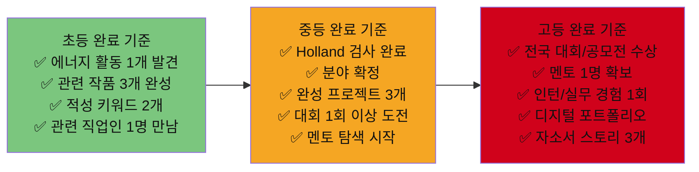

---

## 20가지 사례 — 1페이지 요약 카드

| # | 이름 | 분야 | 에너지 발견 시기 | 첫 프로젝트 | 대표 성과 | 핵심 메시지 |
|---|------|------|-------------|---------|---------|----------|
| 01 | 김도윤 | AI 개발 | 초4 스크래치 | 날씨 앱 (중2) | 전국 AI 공모전 대상 | "매일 1시간 코딩이 5년 후 대상을 만든다" |
| 02 | 이서연 | 바이오 연구 | 초3 실험 키트 | 세포 관찰 보고서 (중1) | 논문 공동저자 | "관찰 일기가 논문이 된다" |
| 03 | 박지호 | UX 디자인 | 초5 미술대회 | 학교 앱 UX 제안서 (중3) | 스타트업 UX 인턴 | "사용자 입장에서 생각하는 훈련" |
| 04 | 최하늘 | 환경 과학 | 초4 하천 관찰 | 학교 탄소 측정 (중2) | 기후테크 해커톤 우승 | "동네 문제가 세계 문제와 연결된다" |
| 05 | 정민서 | 콘텐츠 | 초3 동화 글쓰기 | 유튜브 채널 개설 (중1) | 구독자 5만, 월수익 50만 | "꾸준함이 구독자를 만든다" |
| 06 | 한우진 | 로봇 공학 | 초4 레고 조립 | 아두이노 화분 (중1) | 전국 로봇 금상+특허 | "손으로 만드는 것이 미래 직업이다" |
| 07 | 윤서아 | 디지털 헬스케어 | 초4 병원 봉사 | 건강관리 앱 기획 (고1) | 앱 200명 사용 | "공감이 기술보다 먼저다" |
| 08 | 강태민 | 에듀테크 | 초3 또래 멘토 | AI 학습 앱 기획 (고1) | 창업대회 최우수 | "가르치는 사람이 제일 많이 배운다" |
| 09 | 오시윤 | 게임 개발 | 초3 게임 분석 | Unity 2D 게임 (중1) | 인디게임 출시 | "플레이어의 눈이 개발자를 만든다" |
| 10 | 임채원 | 소셜벤처 | 초4 반장 경험 | 반찬 배달 프로젝트 (중3) | 법인 설립+대상 | "사회 문제가 비즈니스 기회다" |
| 11 | 문지수 | 사이버보안 | 초4 PC 분해 | CTF 첫 도전 (중3) | 화이트햇 보안 대상 | "공격을 이해해야 방어할 수 있다" |
| 12 | 배수현 | 데이터 사이언스 | 초4 수학 경시 | 미세먼지 데이터 분석 (중2) | 캐글 Expert+인턴 | "숫자 속에 이야기가 있다" |
| 13 | 조예진 | AI 아트 | 초3 그림 학원 | AI 이미지 실험 (중1) | 개인전 관람객 300명 | "AI는 창의성을 없애지 않는다, 확장한다" |
| 14 | 신동현 | 스마트팜 | 초3 텃밭 일기 | 아두이노 스마트 화분 (중1) | 농식품부 장관상 | "농업과 AI는 생각보다 가깝다" |
| 15 | 김나은 | 디지털 마케팅 | 초5 홍보물 제작 | 매점 인스타 운영 (중2) | 브랜드 공모전 금상 | "데이터로 광고하면 예술이 된다" |
| 16 | 류준서 | 양자컴퓨팅 | 초4 수학 올림피아드 | Qiskit 양자 회로 (고1) | 국제 학회 구두 발표 | "가장 어려운 것을 공부하면 가장 희소한 사람이 된다" |
| 17 | 황보아 | AI 음악 | 초1 피아노 | DAW 비트 제작 (중1) | AI 음악 앨범 발매 | "악기를 배운 10년이 AI와 만난다" |
| 18 | 서민준 | 리걸테크 | 초5 모의재판 | 법률 AI 프로토타입 (고1) | 리걸테크 해커톤 우수 | "법과 코딩의 교차점이 미래다" |
| 19 | 이유나 | 메타버스 건축 | 초4 건축 모형 | Blender 학교 모델링 (중2) | 메타버스 공모전 대상 | "공간을 설계하는 사람이 미래를 짓는다" |
| 20 | 차지훈 | 핀테크 | 초5 용돈 투자 | 주가 분석 스크립트 (중2) | 핀테크 해커톤 우수 | "돈의 흐름을 읽는 코더가 세상을 움직인다" |

---

> **핵심 메시지**
> 20가지 사례 모두 **초등에서 에너지 발견 → 중학교에서 검증 + 첫 완성물 → 고등에서 전문성 + 대외 성과** 패턴을 따른다.
> 분야는 달라도 **꾸준함, 프로젝트 완성, 포트폴리오 누적**이라는 세 가지 공식은 동일하다.
> 총 투자 비용은 평균 40만원 — 비용이 아닌 **시간과 의지가 유일한 진입 장벽**이다.

---

# 💻 기술 분야 상세 심화 가이드

---

## AI 시대 기술/IT 핵심 스킬 스택 비교표

| 분야 | 입문 도구 (중1~2) | 심화 도구 (중3~고1) | 전문 도구 (고2~3) | 비용 합계 |
|------|----------------|-----------------|----------------|---------|
| **AI/ML 개발** | Python, Scratch | TensorFlow, PyTorch, Hugging Face | MLflow, Docker, FastAPI | 0~5만원 |
| **웹 개발** | HTML/CSS, JavaScript | React, Node.js, Firebase | AWS/GCP, CI/CD | 0~10만원 |
| **앱 개발** | MIT App Inventor | Flutter, React Native | Firebase, 앱 스토어 등록 | 0~15만원 |
| **로봇/IoT** | LEGO Mindstorms, Arduino | Raspberry Pi, ROS | SolidWorks, 특허 출원 | 10~60만원 |
| **게임 개발** | Scratch, GameMaker | Unity (C#), Godot | Unreal Engine, Steam 출시 | 0~10만원 |
| **사이버보안** | 리눅스 기초, Wireshark | CTF 플랫폼, Hack The Box | Burp Suite Pro, KISA 대회 | 0~10만원 |
| **데이터 과학** | Excel, Python 기초 | Pandas, Matplotlib, Kaggle | XGBoost, SQL, Tableau | 0~5만원 |
| **AI 아트/창작** | Canva, Procreate | Midjourney, Stable Diffusion | ControlNet, ComfyUI | 5~15만원/월 |

---

## 기술 분야 학습 로드맵 — 단계별 프로젝트 상세

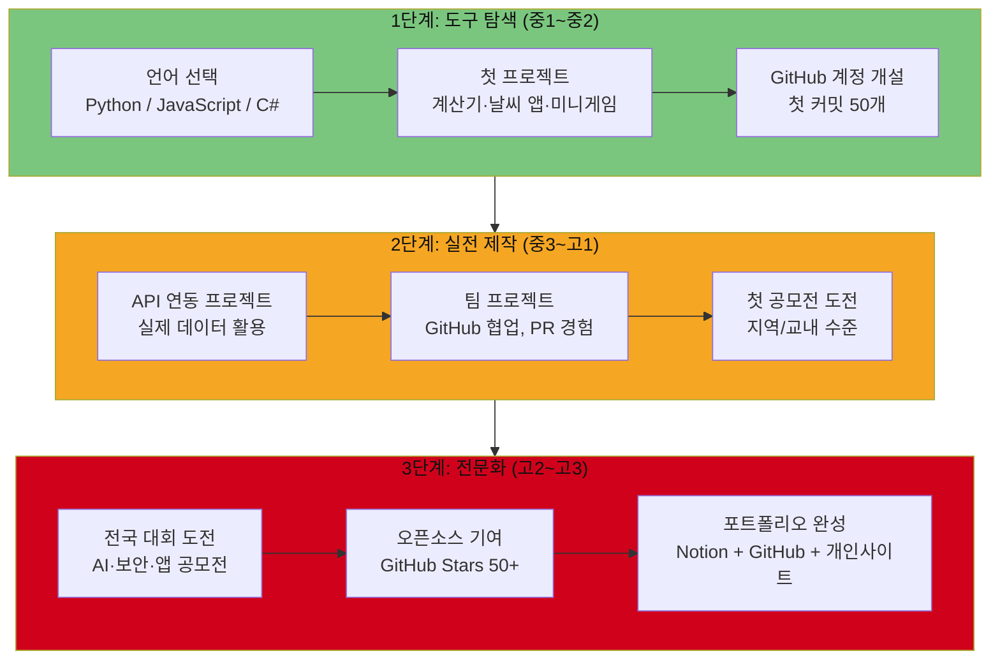

---

## 기술 분야별 무료 학습 플랫폼 비교표

| 플랫폼 | 분야 | 대상 | 비용 | 특징 | URL |
|--------|------|------|------|------|-----|
| **코드잇** | Python, 웹, 앱 | 중등~고등 | 무료~월 2만원 | 한국어, 단계별 커리큘럼 | codeit.kr |
| **생활코딩** | HTML, JS, Python | 중등~ | 완전 무료 | 이고잉 강사, 한국어 | opentutorials.org |
| **K-MOOC** | AI, 빅데이터 | 고등~ | 무료 | 대학 강의, 수료증 발급 | kmooc.kr |
| **Kaggle** | 데이터 과학 | 중등~ | 무료 | 실전 대회, 인증 | kaggle.com |
| **Coursera** | AI, ML, CS | 고등~ | 무료~월 4만원 | 구글·스탠포드 강좌 | coursera.org |
| **CS50** | 컴퓨터 과학 기초 | 중등~ | 무료 | 하버드 강좌, 한국어 자막 | cs50.harvard.edu |
| **Hack The Box** | 사이버보안 | 중3~ | 무료~월 1.5만원 | CTF 실습 환경 | hackthebox.com |
| **Unity Learn** | 게임 개발 | 중등~ | 무료 | 공식 튜토리얼 | learn.unity.com |
| **IBM Quantum** | 양자컴퓨팅 | 고등~ | 무료 | Qiskit, 양자 실습 환경 | learning.quantum.ibm.com |
| **TryHackMe** | 보안, 리눅스 | 중등~ | 무료~월 1.5만원 | 게임형 보안 학습 | tryhackme.com |

---

## 기술 분야 연간 학습 시간 권장표

| 학교급 | 평일 | 주말 | 연간 누적 | 핵심 목표 |
|--------|------|------|---------|---------|
| 중1 | 30분~1시간 | 2~3시간 | 약 200시간 | 언어 1개 기초 완성 |
| 중2 | 1~1.5시간 | 3~4시간 | 약 350시간 | 프로젝트 3개 완성 |
| 중3 | 1~2시간 | 4~5시간 | 약 450시간 | 공모전 1회 도전 |
| 고1 | 1.5~2시간 | 4~5시간 | 약 500시간 | 멘토 확보 + 핵심 프로젝트 |
| 고2 | 2~3시간 | 5~6시간 | 약 600시간 | 전국 대회 수상 |
| 고3 | 1~2시간 | 3~4시간 | 약 350시간 | 포트폴리오 완성 + 대입 |

---

## 기술 도구 단계별 학습 순서도 (AI/ML 기준)

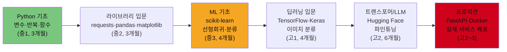

---

# 📚 분야별 추천 도서 완전 가이드

---

## 기술/IT 분야 추천 도서

### 중학생 (중1~중3) 추천 도서

| 단계 | 도서명 | 저자 | 가격 | 난이도 | 핵심 내용 |
|------|--------|------|------|--------|---------|
| **입문** | 『파이썬으로 배우는 프로그래밍』 | 이고잉 | 2.5만원 | ★☆☆ | Python 기초, 한국어, 예제 풍부 |
| **입문** | 『Do it! 엔트리로 게임 만들기』 | 장문철 | 1.8만원 | ★☆☆ | 블록코딩 → Python 전환 |
| **중급** | 『점프 투 파이썬』 | 박응용 | 2만원 | ★★☆ | Python 실습 중심, 무료 온라인 버전 있음 |
| **중급** | 『혼자 공부하는 머신러닝 + 딥러닝』 | 박해선 | 3만원 | ★★☆ | ML 입문 최강 한국어 교재 |
| **프로젝트** | 『파이썬을 이용한 자동화 교과서』 | Al Sweigart | 2.5만원 | ★★☆ | 실생활 자동화 프로젝트 50개 |
| **게임** | 『유니티로 만드는 나의 첫 게임』 | 한빛미디어 | 2.8만원 | ★★☆ | Unity 2D 게임 개발 입문 |

### 고등학생 (고1~고3) 추천 도서

| 단계 | 도서명 | 저자 | 가격 | 난이도 | 핵심 내용 |
|------|--------|------|------|--------|---------|
| **AI 심화** | 『밑바닥부터 시작하는 딥러닝』 | 사이토 고키 | 2.5만원 | ★★★ | 딥러닝 수학적 원리, 코드로 구현 |
| **알고리즘** | 『이것이 코딩 테스트다』 | 나동빈 | 3.2만원 | ★★★ | 알고리즘 + 코딩테스트 대비 |
| **보안** | 『해킹: 공격의 예술』 | Jon Erickson | 3.5만원 | ★★★ | 시스템 보안 심화 이론 |
| **데이터** | 『파이썬 머신러닝 완벽 가이드』 | 권철민 | 4만원 | ★★★ | Kaggle 대회 준비 최적 교재 |
| **CS 기초** | 『컴퓨터 과학이 보이는 그림책』 | 나카무라 아쓰시 | 1.5만원 | ★★☆ | CS 전공 개념 시각화 |
| **진로** | 『소프트웨어 장인』 | Sandro Mancuso | 2.2만원 | ★★★ | 개발자 커리어 설계 바이블 |

---

## 과학/연구 분야 추천 도서

| 단계 | 도서명 | 저자 | 대상 | 핵심 내용 |
|------|--------|------|------|---------|
| **중1~2 입문** | 『과학이 재미있어지는 화학 이야기』 | 사마키 다케오 | 중등 | 과학 흥미 유발, 일상 속 화학 |
| **중2~3 중급** | 『캠벨 생명과학 (고급편)』 | Neil Campbell | 중3~고1 | 생물올림피아드 필수 교재 |
| **고1~2 심화** | 『파인만 씨, 농담도 잘 하시네』 | 리처드 파인만 | 고등 | 과학자 마인드셋, 흥미로운 자서전 |
| **고2 전문** | 『왜 세상의 절반은 굶주리는가』 | 장 지글러 | 고등 | 환경·식량 문제 연결, 논문 주제 발굴 |
| **데이터 과학** | 『통계학이 필요한 순간』 | 김용대 | 중3~고등 | 통계 개념 스토리텔링, 쉬운 수식 |
| **양자/물리** | 『퀀텀 스토리』 | 짐 배것 | 고등 | 양자역학 역사, 류준서 사례와 연결 |

---

## 디자인/크리에이티브 분야 추천 도서

| 단계 | 도서명 | 저자 | 대상 | 핵심 내용 |
|------|--------|------|------|---------|
| **중1~2 입문** | 『UI/UX 디자인 첫걸음』 | 한빛미디어 | 중등~ | Figma 기초, 사용자 경험 개념 |
| **중3~고1** | 『그리드 시스템』 | Josef Müller-Brockmann | 중3~ | 레이아웃 디자인 원칙 |
| **고1~2 심화** | 『Don't Make Me Think』 | Steve Krug | 고등 | UX 디자인 바이블, 영어 원서 |
| **AI 아트** | 『AI 이미지 생성의 모든 것』 | 이준호 | 중3~ | Midjourney, SD 프롬프트 완전 가이드 |
| **음악** | 『음악 프로듀서가 되는 법』 | 제이크 홀더 | 중3~ | DAW, 작곡 실전 가이드 |
| **3D** | 『블렌더 3D 모델링』 | 유리 | 중2~ | Blender 완전 입문서 |

---

## 비즈니스/창업 분야 추천 도서

| 단계 | 도서명 | 저자 | 대상 | 핵심 내용 |
|------|--------|------|------|---------|
| **중1~2 경제 입문** | 『10대를 위한 경제학 콘서트』 | 팀 하포드 | 중등 | 경제학 재미있게 입문 |
| **중3~고1 창업** | 『린 스타트업』 | 에릭 리스 | 중3~ | MVP, 빠른 실험 창업 방법론 |
| **고1~2 마케팅** | 『포지셔닝』 | 알 리스, 잭 트라우트 | 고등 | 브랜드 마케팅 전략 고전 |
| **고2~3 진로** | 『더 나은 세상을 위한 창업 교과서』 | 강신장 | 고등 | 소셜벤처, 임팩트 창업 사례 |
| **핀테크** | 『돈의 심리학』 | 모건 하우절 | 중3~ | 투자·금융 심리, 차지훈 사례와 연결 |
| **리걸테크** | 『AI 변호사의 탄생』 | 리처드 서스킨드 | 고등 | 법률 AI 미래 직업 지형 |

---

## 학년별 독서 로드맵 — 12권 필독 리스트

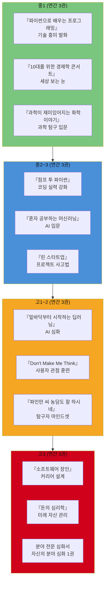

---

# 🎓 중학생·고등학생 단계별 커리어패스 완전 가이드

---

## 왜 중학교부터 시작해야 하는가?

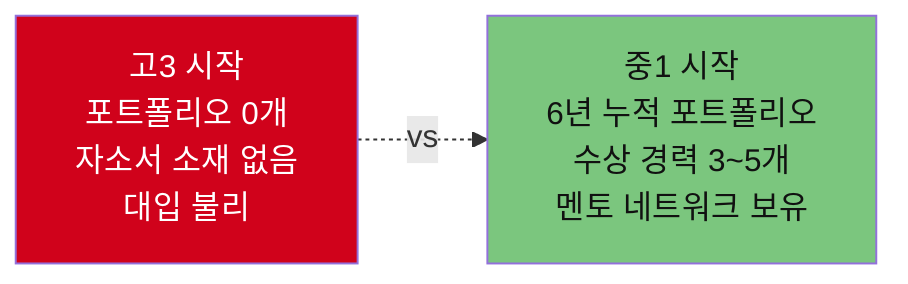

> **핵심**: 대입 학생부종합전형(학종)은 **1학년부터 3학년까지 일관된 스토리**를 요구한다.
> 중학교부터 시작하면 고등학교에서 **검증된 방향으로 집중 투자**할 수 있다.

---

## 중학생 커리어패스 단계별 로드맵

### 중학교 1학년 — 탐색과 발견

| 영역 | 해야 할 일 | 구체적 방법 | 도구/비용 | 기간 |
|------|---------|---------|---------|------|
| **적성 발견** | Holland 직업 흥미 검사 | 커리어넷(www.career.go.kr) 무료 검사 | 무료 | 3~4월 |
| **에너지 탐색** | "시간 가는 줄 모르는 활동" 기록 | 에너지 일기 30일 쓰기 | 노트 | 1학기 |
| **분야 체험** | 관심 분야 직업인 1명 인터뷰 | 부모님·선생님 네트워크 활용 | 무료 | 2학기 |
| **도구 입문** | 관심 분야 도구 1개 시작 | 코딩·그림·음악·실험 중 선택 | 0~3만원 | 연간 |
| **독서** | 분야 관련 책 2권 읽기 | 학교 도서관 활용 | 무료 | 연간 |
| **자유학기제 활용** | 진로탐색 활동 최대 활용 | 직업 체험, 프로젝트 수업 적극 참여 | 무료 | 1~2학기 |

**자유학기제 200% 활용 전략:**

| 활동 유형 | 전략 | 기대 성과 |
|---------|------|---------|
| 직업 체험 | 관심 분야 기업 현장 체험 신청 (1~2개) | 실제 직업인 만남, 현실 확인 |
| 주제 선택 | 코딩·디자인·음악·과학 중 1개 집중 | 첫 작품 완성 |
| 동아리 | 관심 분야 동아리 창설 or 가입 | 팀 협업 경험 |
| 예술·체육 | 창작 활동 병행 (소진 방지) | 균형적 성장 |

---

### 중학교 2학년 — 검증과 첫 성과

| 영역 | 해야 할 일 | 구체적 방법 | 도구/비용 | 기간 |
|------|---------|---------|---------|------|
| **분야 확정** | Holland 재검사 + 분야 최종 결정 | 커리어넷 + 직업가치관 검사 | 무료 | 3월 |
| **첫 프로젝트** | 완성 프로젝트 1개 만들기 | "그림자 프로젝트" — 기존 작품 따라 만들기 | 5~10만원 | 상반기 |
| **공모전 도전** | 교내·지역 공모전 1회 | 수상보다 "도전 경험" 목적으로 | 무료 | 하반기 |
| **포트폴리오 시작** | 작품·활동 기록 시작 | Notion 포트폴리오 페이지 개설 | 무료 | 연간 |
| **멘토 탐색** | 관심 분야 현직자 1명 찾기 | 링크드인·유튜브·학교 진로 프로그램 | 무료 | 연간 |

**그림자 프로젝트 방법 (Shadow Project):**

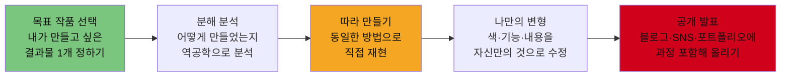

---

### 중학교 3학년 — 성과 축적과 고등 준비

| 영역 | 해야 할 일 | 구체적 방법 | 기대 성과 |
|------|---------|---------|---------|
| **전문성 강화** | 심화 도구 1개 마스터 | Python·Figma·Blender·Logic Pro 등 | 중급 이상 숙련도 |
| **팀 프로젝트** | 2~3인 팀 협업 프로젝트 | 친구와 함께 공모전 출품 | 협업 경험 + 수상 가능성 ↑ |
| **전국 공모전** | 전국 규모 공모전 1회 도전 | 수상 목적이 아닌 "레벨 확인"용 | 전국 수준 파악 |
| **고등 전략 수립** | 목표 학과 3개 + 학교 3개 조사 | 대학별 학종 사례 분석 | 고등 1학년 활동 방향 확정 |
| **포트폴리오 중간 점검** | Notion 포트폴리오 1차 완성 | 프로젝트 3개 이상, 수상 1개 이상 | 대입 소재 확보 시작 |

---

## 고등학생 커리어패스 단계별 로드맵

### 고등학교 1학년 — 방향 확정과 멘토 확보

| 영역 | 해야 할 일 | 구체적 방법 | 비용 | 우선순위 |
|------|---------|---------|------|---------|
| **목표 대학/학과 확정** | 목표 학과 입시 결과 3년치 분석 | 어디가(adiga.kr) 활용 | 무료 | ★★★ |
| **멘토 확보** | 현직자 멘토 1명 연결 | 링크드인, 대학 진로 프로그램, 공모전 | 0~10만원/월 | ★★★ |
| **핵심 프로젝트 착수** | 자소서 스토리가 될 대표 프로젝트 | 사회 문제 해결 or 기술 심화 프로젝트 | 5~20만원 | ★★★ |
| **동아리 선택** | 학교 동아리 or 자율 동아리 창설 | 분야 전문 동아리 회장 목표 | 무료 | ★★☆ |
| **교과 성적 관리** | 주요 교과 1등급 유지 전략 | 수능 과목 + 전공 관련 과목 집중 | - | ★★☆ |

**멘토 찾는 5가지 방법:**

| 방법 | 접근법 | 성공률 | 비용 |
|------|--------|--------|------|
| 공모전 시상식 | 수상 후 심사위원·선배 수상자와 연결 | 높음 | 무료 |
| 링크드인 DM | "학생입니다, 10분만 조언 구해도 될까요?" | 중간 | 무료 |
| 유튜버 크리에이터 | 영상 댓글·이메일 | 낮음 | 무료 |
| 학교 진로 프로그램 | 학교 진로 선생님 통해 현직자 섭외 요청 | 높음 | 무료 |
| 해커톤·오픈행사 | 현장에서 직접 명함 교환 | 매우 높음 | 참가비 0~5만원 |

---

### 고등학교 2학년 — 전국 수준 성과 달성

| 영역 | 해야 할 일 | 목표 성과 | 기간 |
|------|---------|---------|------|
| **전국 공모전 수상** | 분야별 전국 공모전 1개 이상 | 장려상 이상 | 상반기 집중 |
| **인턴/실무 경험** | 방학 중 기업/연구실 인턴 4~6주 | 실무 경험 + 추천서 | 여름방학 |
| **포트폴리오 완성** | GitHub + Notion + 개인 사이트 | 프로젝트 5개 이상 | 연간 |
| **자소서 소재 발굴** | 스토리 3개 (도전·성장·진로) 초안 | 자소서 1차 초안 완성 | 2학기 |

**고2 주간 루틴 (학종 준비 최적화):**

| 요일 | 오전 | 오후 (하교 후) | 저녁 |
|------|------|------------|------|
| 월 | 학교 수업 | 핵심 프로젝트 1.5h | 교과 공부 1h |
| 화 | 학교 수업 | 교과 공부 + 탐구 활동 | 독서 30분 |
| 수 | 학교 수업 | 동아리 활동 or 팀 미팅 | 프로젝트 1h |
| 목 | 학교 수업 | 멘토링 or 강의 수강 | 교과 공부 1h |
| 금 | 학교 수업 | 주간 회고 + 다음 주 계획 | 자유 시간 |
| 토 | 프로젝트 집중 3h | 공모전 준비 2h | 독서 or 영상 |
| 일 | 교과 공부 2h | 포트폴리오 업데이트 1h | 충전 |

---

### 고등학교 3학년 — 대입 완성

| 시기 | 핵심 활동 | 구체적 To-Do | 마감 |
|------|---------|------------|------|
| **3월~5월** | 자소서 완성 + 면접 준비 | 자소서 10고 이상 퇴고, 멘토 피드백 | 6월 |
| **6월~7월** | 수시 원서 전략 수립 | 합·적·추 6개 대학 확정 | 8월 |
| **8월** | 수시 원서 접수 | 학생부 최종 확인, 원서 제출 | 9월 초 |
| **9월~10월** | 면접 집중 준비 | 예상 질문 50개 + 실전 모의 면접 | 면접일 |
| **11월** | 수능 응시 | 정시 대비 병행 | 수능일 |
| **12월~1월** | 최종 합격 확인 + 대학 준비 | 입학 전 선행 학습 계획 수립 | 2월 |

---

## 중학생 vs 고등학생 커리어패스 비교표

| 구분 | 중학교 (중1~중3) | 고등학교 (고1~고3) |
|------|----------------|----------------|
| **핵심 목표** | 방향 탐색 + 첫 완성물 | 전문성 심화 + 대외 성과 |
| **주요 활동** | 체험·탐색·입문 프로젝트 | 공모전·인턴·멘토링·포트폴리오 |
| **공모전 전략** | 교내·지역 수준 (경험 목적) | 전국·국제 수준 (수상 목적) |
| **포트폴리오** | Notion 기록 시작 | GitHub + 개인사이트 완성 |
| **독서** | 흥미 유발 + 입문서 위주 | 전문 심화 + 트렌드 분석 |
| **네트워크** | 선생님·부모 네트워크 | 현직 멘토 1명 이상 확보 |
| **비용** | 월 1~3만원 (도구 학습 위주) | 월 3~10만원 (도구+활동비) |
| **주간 학습 시간** | 1~2시간/일 | 2~3시간/일 |
| **자율 vs 구조** | 자유롭게 탐색 | 목표 역산 계획 필수 |

---

## 분야별 중학생 첫 시작 추천 프로젝트 10선

| # | 분야 | 첫 프로젝트 | 기간 | 비용 | 결과물 |
|---|------|---------|------|------|------|
| 1 | AI/코딩 | 내 학교 급식 알림 텔레그램 봇 | 2개월 | 무료 | 실제 사용되는 봇 |
| 2 | 로봇/IoT | 아두이노로 자동 물주기 스마트 화분 | 1.5개월 | 3만원 | 동작하는 화분 |
| 3 | 게임 개발 | Unity로 2D 퍼즐 게임 1개 완성 | 3개월 | 무료 | itch.io 업로드 |
| 4 | 사이버보안 | picoCTF 입문 대회 참가 | 1개월 | 무료 | 점수 + 경험 |
| 5 | 데이터 과학 | 우리 학교 날씨 데이터 분석 보고서 | 2개월 | 무료 | 시각화 보고서 |
| 6 | UX 디자인 | 학교 도서관 앱 UX 개선 제안서 | 1개월 | 무료 | Figma 프로토타입 |
| 7 | 콘텐츠 | 유튜브 학습 채널 10편 업로드 | 3개월 | 무료 | 유튜브 채널 |
| 8 | AI 아트 | Midjourney로 단편 만화 웹툰 1화 | 1개월 | 1.2만원/월 | 웹툰 1화 |
| 9 | 과학/연구 | 우리 집 화분 성장 조건 실험 보고서 | 2개월 | 2만원 | 실험 보고서 |
| 10 | 소셜벤처 | 우리 동네 문제 1개 발견 + 해결 아이디어 발표 | 1개월 | 무료 | 5분 발표 영상 |

---

## 커리어패스 3단계 핵심 공식 요약

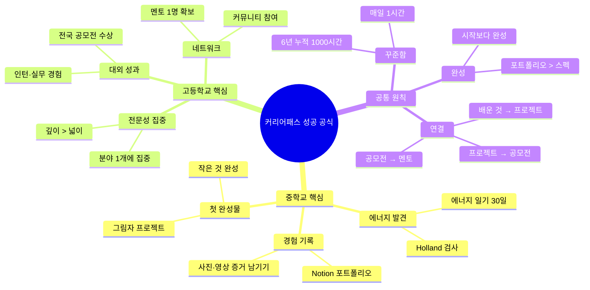

---

*작성일: 2026년 2월 | AI 시대 커리어패스 20대 우수사례 벤치마킹 v2.0*
*참조: AI시대_청소년_진로교육_가이드.md*
