# AI 시대 청소년 진로 교육 가이드 v2.0
> **"직업을 먼저 고르지 말고, 나를 먼저 발견하라"**
> 학교 진로 교육 → 부족한 부분 진단 → 외부 탐색 → 적성 기반 직업 연결까지

---

## 📌 전체 가이드 구조 마인드맵

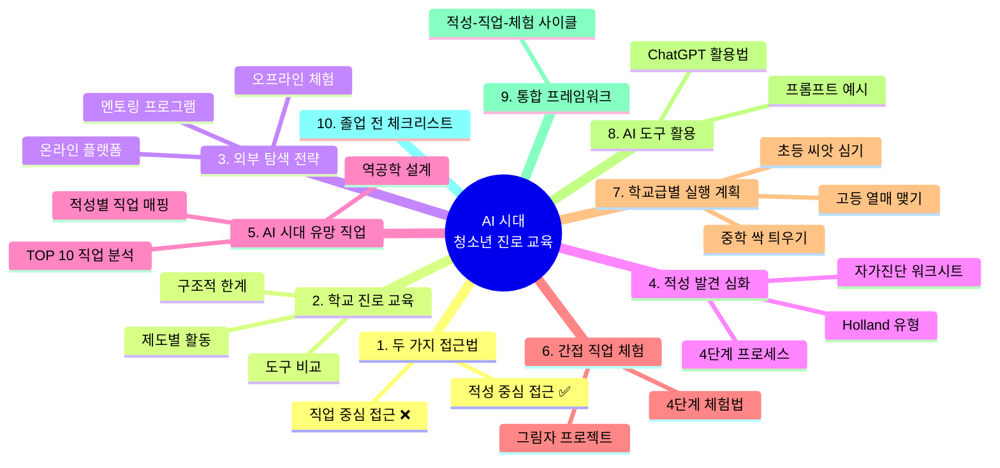

---

## 핵심 질문: 어떤 순서로 진로를 탐색해야 하는가?

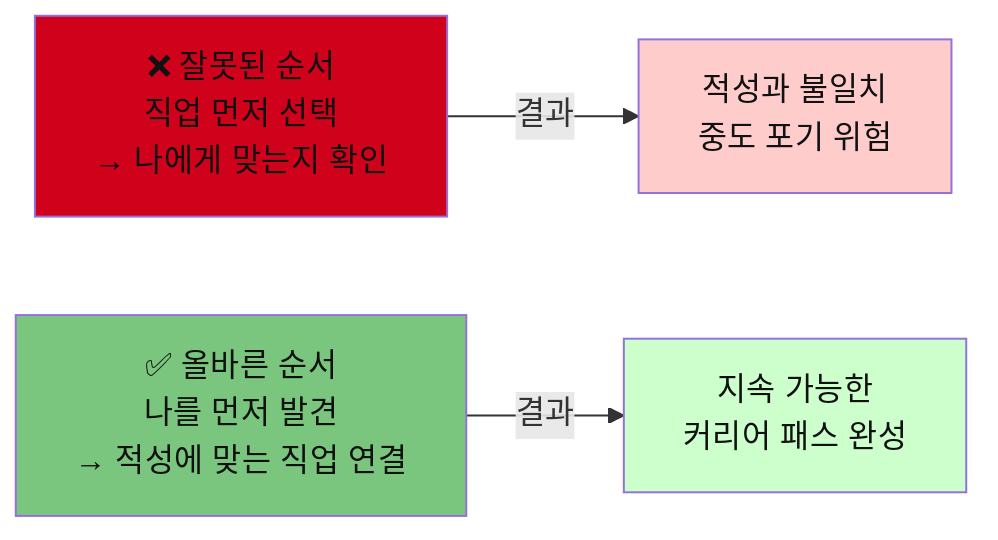

---

## 1. 두 가지 접근법 비교: 무엇이 더 나은가?

### 🗺️ 두 접근법 마인드맵

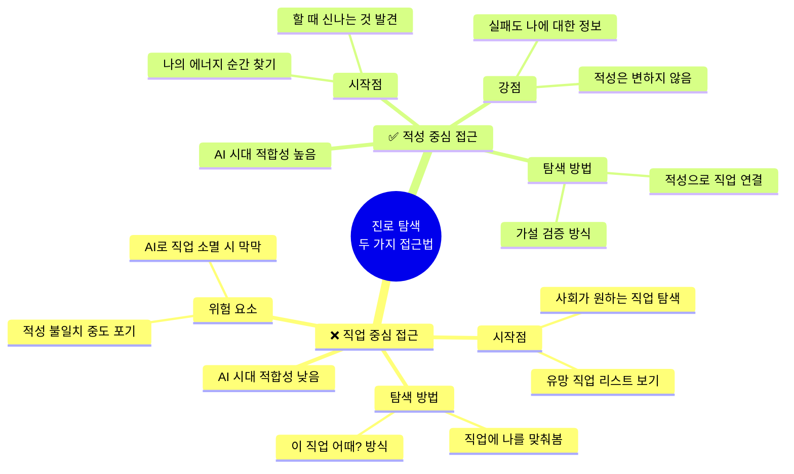

| 비교 항목 | ❌ 직업 중심 접근법 | ✅ 적성 중심 접근법 |
|---------|----------------|----------------|
| **시작점** | 유망 직업 리스트 보기 | 내가 에너지를 얻는 순간 찾기 |
| **탐색 방법** | "이 직업 어때?" → 맞춰보기 | "내가 뭘 할 때 신나지?" → 직업 연결 |
| **체험 목적** | 직업이 어떤 곳인지 확인 | 나의 강점과 약점 발견 |
| **실패 의미** | 잘못된 선택 | 나에 대한 정보 획득 |
| **결과** | 사회가 원하는 직업 선택 | 내가 지속할 수 있는 직업 선택 |
| **AI 시대 적합성** | 낮음 (직업이 빠르게 변함) | 높음 (적성은 변하지 않음) |
| **추천 여부** | 보조 수단으로만 활용 | ⭐ 핵심 방법론으로 활용 |

> **결론**: 간접 직업 체험과 유망 직업 탐색은 **적성을 발견한 후 검증 도구**로 활용해야 한다.
> 적성 발견 없이 직업만 탐색하면 "좋아 보이는 직업" → "막상 해보니 아닌 직업" 사이클이 반복된다.

---

## 2. 현재 학교 진로 교육 현황

### 🗺️ 학교 진로 교육 전체 구조 마인드맵

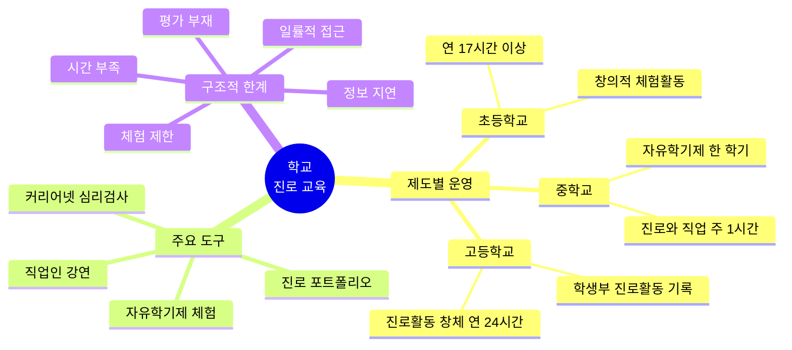

### 2.1 학교에서 제공하는 진로 교육 (학교급별)

| 학교급 | 제도·제도 | 주요 활동 | 시간·횟수 | 법적 근거 |
|------|---------|---------|---------|---------|
| **초등학교** | 창의적 체험활동 내 진로 활동 | 직업 그림책, 직업인 초청 강연 | 연 17시간 이상 | 진로교육법 제13조 |
| **중학교** | 자유학기제 (1학년 한 학기) | 직업 탐방, 적성 검사, 프로젝트 | 한 학기 집중 | 자유학기제 운영 지침 |
| **중학교** | 진로와 직업 (선택 과목) | 흥미·적성 검사, 직업 정보 탐색 | 주 1시간 | 교육과정 편제 |
| **고등학교** | 진로활동 (창체) | 학과 탐방, 진로 설계, 포트폴리오 | 연 24시간 이상 | 진로교육법 제15조 |
| **고등학교** | 학교생활기록부 진로활동 | 진로 희망, 활동 기록 | 연간 누적 | 학교생활기록부 기재요령 |

### 2.2 학교 진로 교육의 구조적 한계

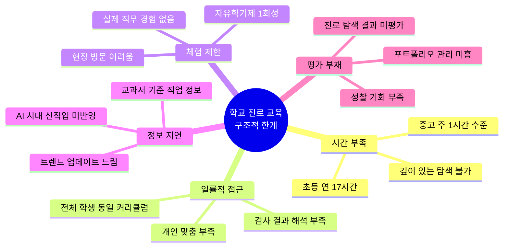

### 2.3 학교 진로 교육 도구 비교

| 도구/제도 | 제공 내용 | 학교에서 활용 여부 | 실제 한계 |
|---------|---------|---------------|---------|
| **커리어넷 심리검사** | 흥미·적성·가치관 검사 | ⭕ 중학교 위주 활용 | 결과 해석 교사 역량 편차 |
| **자유학기제** | 직업 체험, 프로젝트 | ⭕ 중1 한 학기 | 1회성, 학교별 질 편차 큼 |
| **직업인 강연** | 현직 직업인 강연 | 🔺 연 1~2회 수준 | 제한된 직업군, 깊이 부족 |
| **진로 포트폴리오** | 활동 기록 관리 | 🔺 일부 학교만 | 체계적 관리 미흡 |
| **창업 교육** | 모의 창업 프로그램 | 🔺 특수 학교 위주 | 일반학교 적용 미흡 |
| **AI 진로 탐색** | AI 도구 활용 진로 탐색 | ❌ 거의 없음 | 교사 역량 미비 |

---

## 3. 학교에서 못 찾은 것 — 외부 탐색 전략

### 🗺️ 외부 탐색 전략 마인드맵

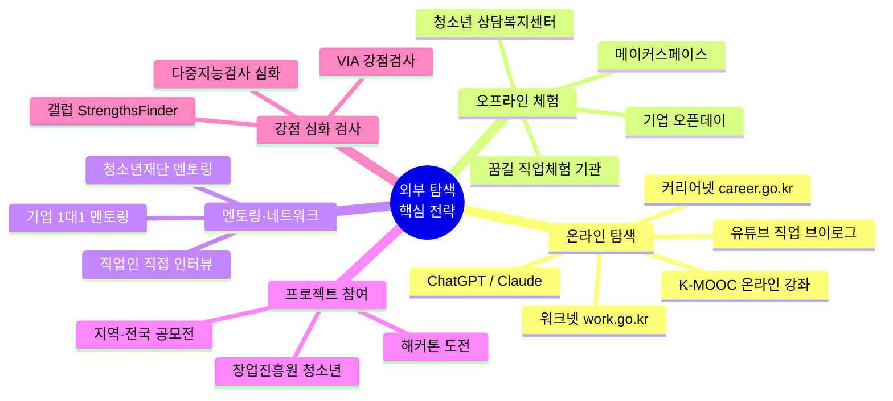

### 3.1 학교 vs 외부 탐색 비교

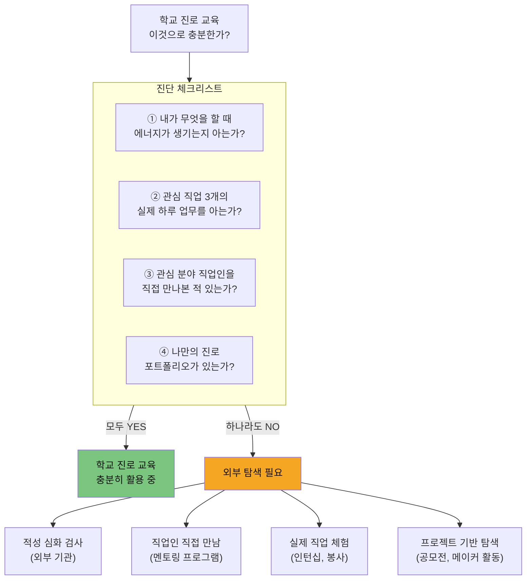

### 3.2 학교에서 부족한 부분별 외부 탐색 방법

| 학교에서 부족한 부분 | 외부 탐색 방법 | 구체적 경로 | 비용 | 효과 |
|----------------|------------|---------|------|------|
| **개인 맞춤 적성 분석** | 전문 심리 검사 / AI 분석 | 청소년 상담복지센터, 커리어넷 심화 | 무료 | ⭐⭐⭐ |
| **실제 직업 세계 경험** | 직업 체험 / 인턴십 | 꿈길(ggoomgil.go.kr), 기업 CSR | 무료 | ⭐⭐⭐ |
| **직업인 직접 네트워크** | 멘토링 프로그램 | 청소년재단, 기업 멘토링 | 무료 | ⭐⭐⭐ |
| **최신 AI 직업 정보** | AI 도구 + 온라인 강좌 | ChatGPT, K-MOOC, Coursera | 무료~저렴 | ⭐⭐ |
| **프로젝트 결과물** | 공모전 / 메이커 활동 | 각 기관 공모전, 메이커스페이스 | 무료 | ⭐⭐⭐ |
| **창업·기업가 정신** | 모의 창업 프로그램 | 창업진흥원 청소년 프로그램 | 무료 | ⭐⭐ |
| **글로벌 직업 트렌드** | 해외 온라인 강좌 | Coursera, edX, LinkedIn Learning | 무료~유료 | ⭐⭐ |
| **포트폴리오 제작** | 디지털 포트폴리오 | Notion, Canva, 개인 블로그 | 무료 | ⭐⭐ |

### 3.3 외부 탐색 핵심 플랫폼 비교

| 플랫폼 | 주소 | 대상 | 핵심 기능 | 비용 | 추천도 |
|------|-----|------|---------|------|------|
| **커리어넷** | career.go.kr | 초·중·고 | 심리검사, 직업·학과 정보 | 무료 | ⭐⭐⭐ |
| **꿈길** | ggoomgil.go.kr | 중·고 | 직업 체험 기관 연결 | 무료 | ⭐⭐⭐ |
| **워크넷** | work.go.kr | 중·고 | 직업 정보, 채용 트렌드 | 무료 | ⭐⭐⭐ |
| **청소년 상담복지센터** | 지역별 운영 | 초·중·고 | 개인 진로 상담 | 무료 | ⭐⭐⭐ |
| **창업진흥원 청소년 창업** | k-startup.go.kr | 중·고 | 창업 교육, 멘토링 | 무료 | ⭐⭐ |
| **K-MOOC** | kmooc.kr | 고 | 대학 수준 강좌 선수 학습 | 무료 | ⭐⭐ |
| **유튜브 직업 채널** | youtube.com | 초·중·고 | 직업인 일상, 브이로그 | 무료 | ⭐⭐⭐ |
| **ChatGPT / Claude** | openai.com | 중·고 | 진로 정보 탐색, 질문 | 무료 | ⭐⭐⭐ |

---

## 4. 나의 적성 발견 심화 과정 (핵심)

> **적성(Aptitude)**이란 단순히 "잘하는 것"이 아니라
> **"할 때 에너지가 생기고, 시간이 빨리 가는 것"**이다.

### 🗺️ 적성 발견 전체 마인드맵

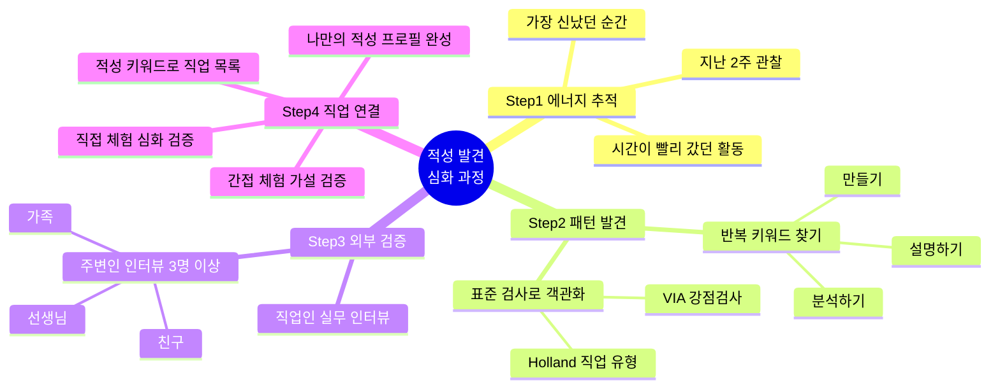

### 4.1 적성 발견 4단계 프로세스

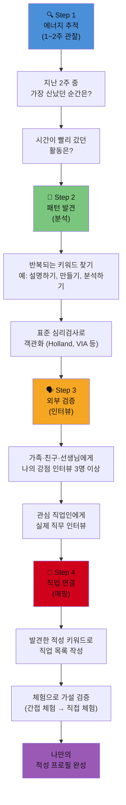

### 4.2 학교급별 적성 탐색 도구 비교

| 검사·도구 | 초등 | 중학교 | 고등학교 | 비용 | 어디서 하나? |
|---------|------|--------|---------|------|------------|
| **커리어넷 흥미검사** | 🔺 교사 안내 필요 | ⭕ 핵심 도구 | ⭕ | 무료 | career.go.kr |
| **Holland 직업 유형** | ❌ | ⭕ 중1 권장 | ⭕ | 무료 | 커리어넷 |
| **다중지능검사** | ⭕ 그림 형식 | ⭕ | ⭕ | 무료~유료 | 학교, 상담센터 |
| **VIA 강점검사** | ❌ | ⭕ 중2 이상 | ⭕ | 무료 | viacharacter.org |
| **MBTI (16Personalities)** | ❌ | 🔺 참고용 | ⭕ 참고용 | 무료 | 16personalities.com |
| **갤럽 StrengthsFinder** | ❌ | ❌ | ⭕ 고2 이상 | 유료 ($20) | gallup.com |
| **에너지 일기** | ⭕ 매일 1줄 | ⭕ 주간 기록 | ⭕ 월간 패턴 분석 | 무료 | 직접 작성 |
| **강점 인터뷰 (주변인)** | ⭕ 가족 3명 | ⭕ 친구+선생님 5명 | ⭕ 멘토+직업인 | 무료 | 직접 인터뷰 |

### 4.3 적성 유형별 특징 (Holland 6각형 모델)

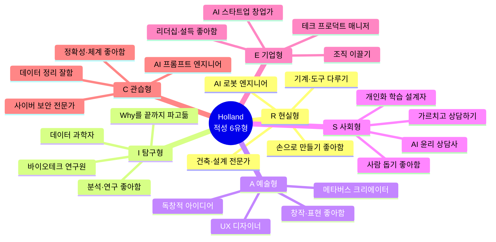

### 4.4 나의 적성 자가 진단 워크시트

| 질문 | 내 답변 (직접 작성) | 발견한 적성 키워드 |
|-----|----------------|---------------|
| 시간 가는 줄 모르고 했던 활동은? | | |
| 친구들이 나에게 "넌 ~을 잘한다"고 말하는 것은? | | |
| 학교 수업 중 가장 집중했던 과목/활동은? | | |
| 쉬는 시간에 혼자 하는 것은? | | |
| 무언가를 완성했을 때 가장 뿌듯했던 경험은? | | |
| 다른 사람을 도왔을 때 기뻤던 경험은? | | |
| 꼭 보상이 없어도 하고 싶은 활동은? | | |

---

## 5. 적성별 AI 시대 유망 직업 연결

### 🗺️ 적성 × AI 유망 직업 마인드맵

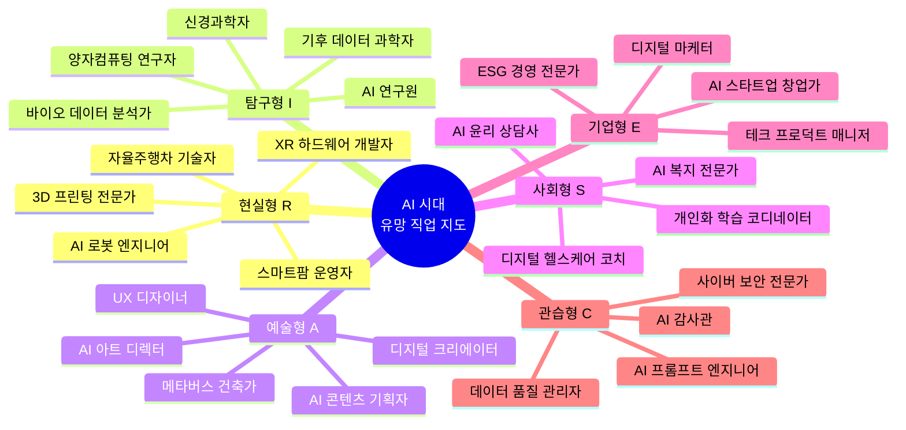

### 5.1 적성 유형 × AI 시대 유망 직업 매핑

| Holland 유형 | 핵심 적성 키워드 | AI 시대 유망 직업 (TOP 5) | 10년 전망 |
|------------|--------------|------------------------|---------|
| **현실형 (R)** | 만들기, 제작, 설치 | AI 로봇 엔지니어, 3D 프린팅 전문가, 자율주행차 기술자, 스마트팜 운영자, XR 하드웨어 개발자 | ⭐⭐⭐ 매우 유망 |
| **탐구형 (I)** | 분석, 연구, 논리 | AI 연구원, 바이오 데이터 분석가, 양자컴퓨팅 연구자, 기후 데이터 과학자, 신경과학자 | ⭐⭐⭐ 매우 유망 |
| **예술형 (A)** | 창작, 표현, 디자인 | AI 아트 디렉터, 메타버스 건축가, UX 디자이너, 디지털 크리에이터, AI 콘텐츠 기획자 | ⭐⭐⭐ 매우 유망 |
| **사회형 (S)** | 돕기, 가르치기, 상담 | AI 윤리 상담사, 디지털 헬스케어 코치, 개인화 학습 코디네이터, 사회 문제 해결사, AI 복지 전문가 | ⭐⭐ 유망 |
| **기업형 (E)** | 리더십, 설득, 기획 | AI 스타트업 창업가, 디지털 마케터, 테크 프로덕트 매니저, ESG 경영 전문가, 글로벌 비즈니스 개발자 | ⭐⭐⭐ 매우 유망 |
| **관습형 (C)** | 정확성, 데이터, 체계 | AI 프롬프트 엔지니어, 데이터 품질 관리자, 사이버 보안 전문가, AI 감사관, 디지털 법무사 | ⭐⭐⭐ 매우 유망 |

### 5.2 AI 시대 TOP 10 유망 직업 상세 분석

| 순위 | 직업명 | 핵심 업무 | 필요 적성 | 관련 학과 | 현재 준비법 |
|-----|------|---------|---------|---------|-----------|
| 1 | **AI 프롬프트 엔지니어** | AI에 최적 명령어 설계 | 창의성 + 논리 | 컴퓨터공학, 국어국문학 | ChatGPT 매일 실험 |
| 2 | **데이터 사이언티스트** | 데이터 수집·분석·시각화 | 수학 + 분석력 | 통계학, AI학과 | Python, 수학 공부 |
| 3 | **UX/AI 디자이너** | 인간 중심 AI 인터페이스 설계 | 공감 + 창작 | 디자인학과, HCI | Figma, 사용자 관찰 |
| 4 | **바이오테크 연구원** | AI + 생명과학 융합 연구 | 탐구 + 생물학 | 생명공학, 의대 | 생물·화학 심화 |
| 5 | **메타버스 크리에이터** | 가상 세계 콘텐츠 제작 | 창의성 + 기술 | 게임학과, 미디어학 | 3D 툴 입문 |
| 6 | **AI 윤리 전문가** | AI 시스템 윤리 감사 | 철학 + 법학 + 기술 | 철학, 법학, 컴공 | 사회 이슈 관심 |
| 7 | **기후테크 전문가** | 기후 데이터 분석 + 솔루션 | 과학 + 공학 | 환경공학, 에너지학 | 환경 프로젝트 참여 |
| 8 | **개인화 학습 설계자** | AI 기반 교육 콘텐츠 설계 | 교육 + 기술 | 교육공학, 에듀테크 | 교육 봉사 + 코딩 |
| 9 | **로봇 공정 엔지니어** | 제조업 AI 로봇 설계·운영 | 공학 + 수학 | 기계공학, 로봇공학 | 아두이노, 레고 마인드 |
| 10 | **디지털 헬스케어 코치** | AI 기반 건강 관리 서비스 | 의학 + 공감 | 간호학, 보건학 | 운동·영양 공부 |

### 5.3 내 적성으로 역공학 진로 설계 예시

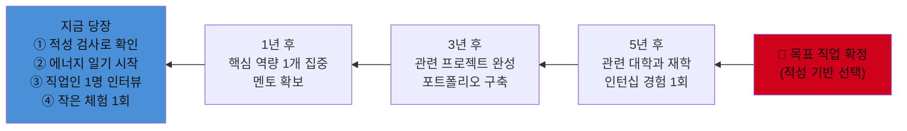

---

## 6. 간접 직업 체험 — 학교 내외 방법

> 적성을 발견했다면, 이제 **체험으로 가설을 검증**해야 한다.
> 체험의 목적은 "이 직업이 멋있어 보이는지"가 아니라
> **"내 적성이 이 직업에서 발휘되는가"**를 확인하는 것이다.

### 🗺️ 간접 직업 체험 마인드맵

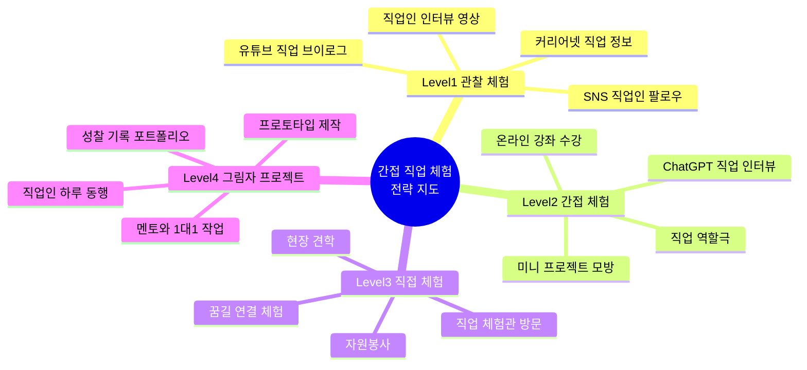

### 6.1 간접 체험 방법 4단계

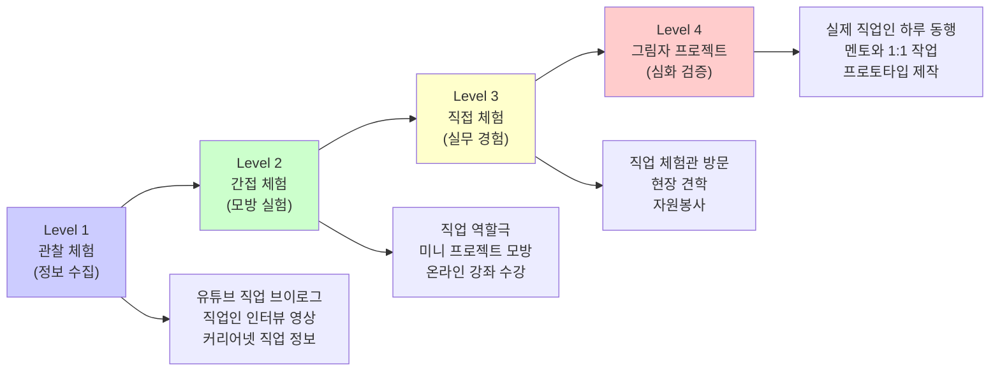

### 6.2 학교 내 간접 체험 활동 비교

| 체험 유형 | 활동명 | 내용 | 학교급 | 언제/어떻게 신청 |
|---------|------|-----|------|-------------|
| **직업인 강연** | 직업인 초청 수업 | 다양한 직업인 강연, Q&A | 초·중·고 | 담임 or 진로교사 요청 |
| **자유학기 체험** | 직업 체험 프로그램 | 기관 방문 또는 직업 시뮬레이션 | 중1 | 자유학기제 일정 따름 |
| **진로 캠프** | 학교 진로 캠프 | 1~2일 집중 진로 탐색 | 중·고 | 학교 행사 참여 |
| **동아리 활동** | 관심 분야 동아리 | 해당 분야 지속적 활동 | 중·고 | 연초 동아리 선택 |
| **창업 동아리** | 모의 창업팀 | 아이디어→제품→판매 경험 | 고 | 창업 동아리 개설 또는 가입 |
| **멘토 초청** | 직업인 멘토링 | 소그룹 멘토 연결 | 중·고 | 진로교사 통해 연결 |

### 6.3 학교 밖 간접 체험 활동 비교 (학교급별)

| 체험 유형 | 초등 추천 활동 | 중학교 추천 활동 | 고등학교 추천 활동 | 신청 경로 | 비용 |
|---------|------------|--------------|---------------|---------|------|
| **온라인 탐색** | 유튜브 직업 브이로그 시청 | ChatGPT로 직업 인터뷰 모의 | LinkedIn 직업인 프로필 분석 | 직접 | 무료 |
| **현장 방문** | 소방서·병원·방송국 견학 | 꿈길 직업 체험관 방문 | 기업 오픈데이 참가 | 꿈길, 직접 연락 | 무료 |
| **봉사 체험** | 도서관 도우미 | 관심 분야 기관 봉사 | NGO·복지관 인턴 봉사 | 1365봉사포털 | 무료 |
| **프로젝트** | 메이커스페이스 방문 | 지역 공모전 참여 | 전국 공모전·해커톤 도전 | 각 기관 홈페이지 | 무료 |
| **멘토링** | 부모 직업 인터뷰 | 청소년재단 멘토링 | 기업 1:1 멘토링 프로그램 | 지역 청소년센터 | 무료 |
| **온라인 강좌** | 스크래치 코딩 입문 | K-MOOC 기초 과정 | Coursera·edX 수료증 과정 | 각 플랫폼 | 무료~저렴 |
| **창업 체험** | 플리마켓 참여 | 모의 창업 대회 | 청소년 창업 경진대회 | 창업진흥원 | 무료 |

### 6.4 그림자 프로젝트 (Shadow Project) 실행 가이드

> **그림자 프로젝트란**: 관심 직업인의 하루를 관찰하고, 그 직업의 실제 업무 일부를 직접 모방하는 체험

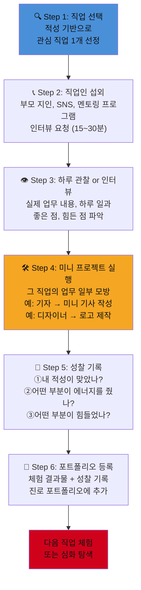

### 6.5 직업군별 그림자 프로젝트 미니 프로젝트 예시

| 관심 직업 | 관찰 방법 | 미니 프로젝트 | 확인할 적성 | 기간 |
|---------|---------|-----------|----------|------|
| **AI 개발자** | 개발자 유튜브/블로그 팔로우 | 간단한 Python 코드 작성, AI API 사용해보기 | 논리적 사고, 문제 해결 | 2주 |
| **의사** | 의대생/의사 유튜브 시청 | 병원 봉사 + 의학 드라마 사례 분석 보고서 | 과학적 관심, 사람에 대한 공감 | 1개월 |
| **기자/작가** | 신문 기사 분석 | 주제 정해 600자 기사 3개 작성 | 글쓰기, 관찰력, 호기심 | 2주 |
| **디자이너** | 브랜드 디자인 분석 | Canva로 포스터 or 로고 제작 | 심미안, 창의성, 표현력 | 1주 |
| **창업가** | 스타트업 창업자 인터뷰 영상 | 문제 발견 → 아이디어 → 1페이지 사업계획서 | 문제 해결력, 리더십 | 3주 |
| **교사** | 교육 유튜버 채널 분석 | 10분 수업 기획 → 친구에게 가르쳐보기 | 설명력, 인내심, 사람 돕기 | 2주 |
| **환경 과학자** | 기후 관련 다큐멘터리 시청 | 우리 동네 환경 문제 조사 보고서 작성 | 과학적 탐구, 사회 문제 관심 | 3주 |

---

## 7. 학교급별 통합 실행 계획

### 🗺️ 학교급별 진로 로드맵 마인드맵

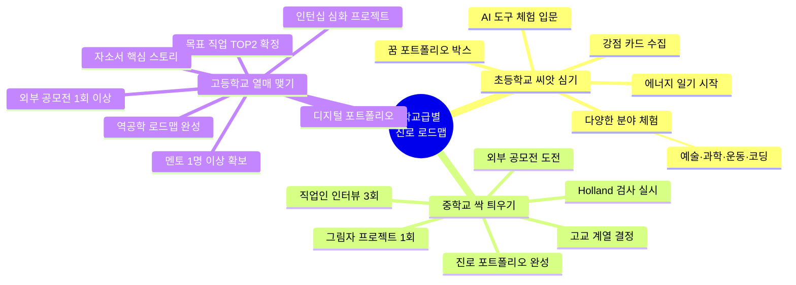

### 7.1 전체 진로 탐색 로드맵

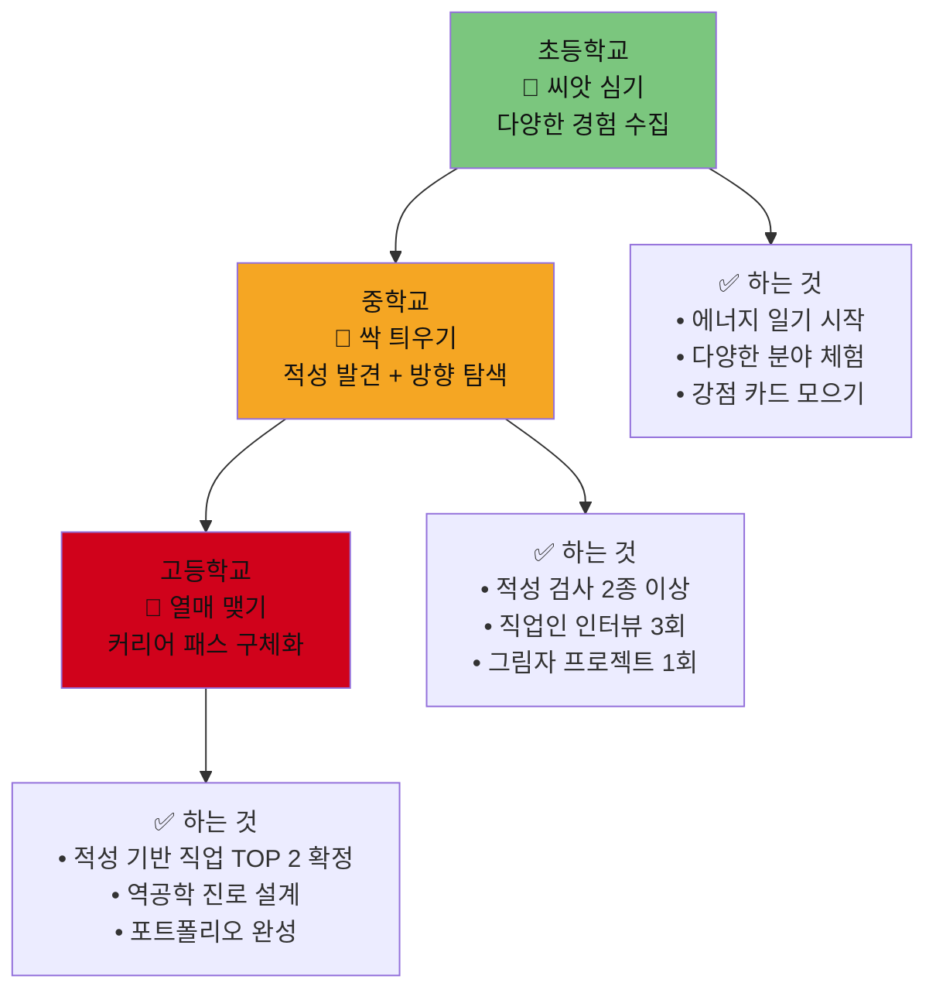

### 7.2 초등학교 단계별 실행 계획

| 학년 | 적성 발견 활동 | 간접 체험 활동 | 외부 탐색 활동 | 기록 방법 |
|-----|------------|------------|------------|---------|
| **1~2학년** | 좋아하는 것 그림 그리기, 에너지 일기 1줄 | 직업 역할극, 그림책 속 직업 탐색 | 가족 직업 인터뷰, 동네 탐방 | 꿈 그림 일기 |
| **3~4학년** | 강점 카드 만들기, 가족 3명 강점 인터뷰 | 과학관·박물관 체험, 메이커스페이스 방문 | 지역 문화 센터 클래스 체험 | 체험 스티커 지도 |
| **5~6학년** | 다중지능 검사 입문, 에너지 패턴 찾기 | 직업 체험관 방문, AI 그림 도구 체험 | 유튜브 직업 브이로그 탐색, 스크래치 코딩 | 꿈 포트폴리오 박스 |

### 7.3 중학교 단계별 실행 계획

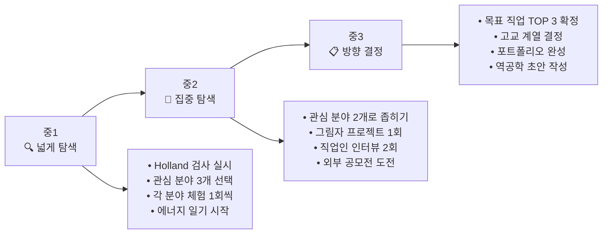

| 단계 | 활동 | 학교 내 | 학교 밖 | 체크포인트 |
|-----|-----|------|------|---------|
| **중1** | 적성 검사 | 커리어넷 Holland 검사 | 청소년 상담센터 추가 검사 | 내 Holland 코드 파악 |
| **중1** | 직업 탐색 | 직업인 강연 청취 | 유튜브 직업 브이로그 5개 탐색 | 관심 직업 3개 선정 |
| **중2** | 직접 체험 | 자유학기 직업 체험 | 꿈길 직업 체험 추가 참여 | 체험 후 에너지 점수 기록 |
| **중2** | 그림자 프로젝트 | 진로 수업 미니 프로젝트 | 관심 직업인 인터뷰 실행 | 미니 프로젝트 결과물 완성 |
| **중3** | 방향 결정 | 고교 탐방, 진로 포트폴리오 | 목표 고교 오픈캠퍼스 | 고교 계열 확정 |

### 7.4 고등학교 단계별 실행 계획

| 학년 | 핵심 목표 | 학교 내 활동 | 학교 밖 활동 | 완성 산출물 |
|-----|---------|-----------|-----------|----------|
| **고1** | 적성 기반 직업 확정 | 진로활동 집중, 학과 탐방 | 목표 대학 오픈캠퍼스, 직업인 멘토링 | 역공학 진로 로드맵 v1 |
| **고2** | 경쟁력 구축 | AI 프로젝트 동아리, 공모전 준비 | 인턴십 지원, 외부 공모전 참가 | 디지털 포트폴리오 |
| **고3** | 실행·완성 | 자소서 클리닉, 모의 면접 | 최종 공모전 도전, 멘토 최종 피드백 | 합격 전략서 + 자소서 |

---

## 8. AI 도구를 활용한 적성 기반 진로 탐색

### 🗺️ AI 도구 활용 마인드맵

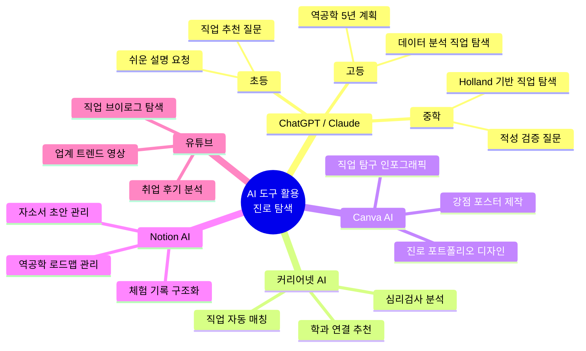

### 8.1 학교급별 추천 AI 활용법

| AI 도구 | 초등 활용법 | 중학교 활용법 | 고등학교 활용법 |
|-------|----------|-----------|------------|
| **ChatGPT / Claude** | "나는 그림 그리기를 좋아해. 어떤 직업이 맞아?" | "Holland 검사 결과 AI형이야. AI 시대에 맞는 직업 10개 추천해줘" | "적성: 분석+창의. 데이터 사이언티스트 역공학 5년 계획 짜줘" |
| **유튜브** | 직업 브이로그 탐색 (검색: "○○ 직업 하루 일과") | 직업인 인터뷰 영상 + 직업 일상 관찰 | 업계 트렌드 분석 영상 + 취업 후기 |
| **커리어넷 AI** | 어린이 직업 탐색 | 심리검사 + AI 직업 매칭 | 학과-직업 연결 분석 |
| **Canva AI** | 나의 강점 포스터 만들기 | 직업 탐구 인포그래픽 | 진로 포트폴리오 디자인 |
| **Notion AI** | 꿈 일기 관리 | 체험 기록 + 포트폴리오 구조화 | 역공학 로드맵 + 자소서 관리 |

### 8.2 적성 발견을 위한 AI 프롬프트 예시

```markdown
📌 초등학생용 (에너지 파악)
"나는 레고 만들기를 좋아하고, 수학 시간에 도형 문제가 재미있어.
나 같은 아이에게 맞는 직업 5가지를 알려줘. 쉽게 설명해줘."

📌 중학생용 (적성 검증)
"나의 Holland 검사 결과는 탐구형(I)이야.
수학과 과학을 좋아하고, 혼자 집중해서 문제 푸는 걸 좋아해.
AI 시대에 이 적성에 맞는 직업 10개와, 각 직업을 실제로 체험해볼 수 있는
방법을 구체적으로 알려줘."

📌 고등학생용 (역공학 설계)
"나의 적성: 데이터 분석을 좋아하고, 사회 문제를 해결하고 싶어.
관심 직업: 기후테크 데이터 사이언티스트.
현재 고등학교 1학년.
역공학 방식으로 지금부터 대학 입학까지 해야 할 일을
연도별로 구체적으로 알려줘. AI 시대 이 직업의 전망도 포함해줘."
```

---

## 9. 적성 발견 vs 직업 탐색 통합 프레임워크

> **결론**: 두 가지가 분리된 게 아니라, 아래 사이클로 통합된다.

### 🗺️ 통합 프레임워크 마인드맵

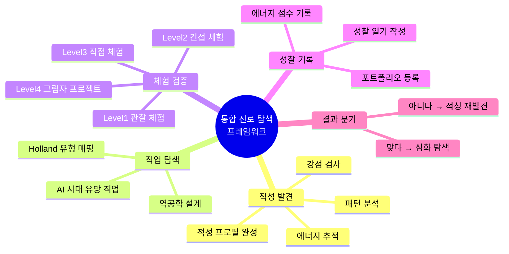

```mermaid
flowchart LR
    A["🔍 적성 발견<br/>(나는 무엇을<br/>할 때 에너지가 생기나?)"] --> B
    B["📊 직업 후보 탐색<br/>(이 적성에 맞는<br/>유망 직업은?)"] --> C
    C["👁️ 간접 체험<br/>(그 직업을 온라인/<br/>오프라인으로 관찰)"] --> D
    D["🛠️ 직접 체험<br/>(미니 프로젝트,<br/>봉사, 인턴십)"] --> E
    E["📝 성찰<br/>(내 적성이 맞았나?<br/>에너지가 생겼나?)"] --> F
    F{"검증 결과"}
    F -->|"✅ 맞다"| G["심화 탐색<br/>커리어 패스 강화"]
    F -->|"❌ 아니다"| A

    style A fill:#4A90D9,color:#111
    style B fill:#7BC67E,color:#111
    style C fill:#F5A623,color:#111
    style D fill:#E8703A,color:#111
    style E fill:#9B59B6,color:#111
    style G fill:#D0021B,color:#111
```

---

## 10. 졸업 전 완료 체크리스트

### 🗺️ 졸업 전 완료 목표 마인드맵

```mermaid
mindmap
  root((졸업 전<br>완료 체크리스트))
    초등학교 졸업
      에너지 일기 1개월 이상
      좋아하는 것 10개 목록
      3가지 분야 체험 완료
        예술 과학 운동 코딩
      직업인 1명 인터뷰
      AI 도구 1가지 체험
      꿈 포트폴리오 박스 완성
    중학교 졸업
      Holland + VIA 검사 2종
      적성 키워드 3개 발견
      직업 체험 2회 이상
      그림자 프로젝트 1회
      직업인 인터뷰 2명
      외부 활동 2회 이상
      진로 포트폴리오 완성
      목표 고교 계열 결정
    고등학교 졸업
      목표 직업 TOP2 확정
      역공학 로드맵 완성
      그림자 프로젝트 2회 심화
      외부 공모전 1회 참가
      인턴십 프로젝트 1회
      멘토 1명 이상 확보
      디지털 포트폴리오 완성
      자소서 핵심 스토리 3개
```

### 초등학교 졸업 전 ✅

- [ ] 에너지 일기 1개월 이상 작성
- [ ] "내가 좋아하는 것" 목록 10개 이상 작성
- [ ] 3가지 이상 다른 분야 체험 (예술, 과학, 운동, 코딩 등)
- [ ] 직업인 1명 이상 직접 인터뷰 (가족 포함)
- [ ] AI 도구 1가지 이상 체험 (그림 AI, 음악 AI 등)
- [ ] 꿈 포트폴리오 박스 완성

### 중학교 졸업 전 ✅

- [ ] Holland + VIA 강점검사 2종 이상 완료 및 해석
- [ ] 에너지 일기로 나의 적성 키워드 3개 발견
- [ ] 직업 체험 2회 이상 (학교 내 + 꿈길 외부 체험)
- [ ] 그림자 프로젝트 1회 이상 완성
- [ ] 직업인 인터뷰 2명 이상 완료
- [ ] 관심 분야 외부 활동 (공모전, 캠프, 멘토링) 2회 이상
- [ ] 진로 포트폴리오 완성 (적성 + 체험 기록 + 방향 설정)
- [ ] 목표 고교 계열 결정

### 고등학교 졸업 전 ✅

- [ ] 적성 기반 목표 직업 TOP 2 확정
- [ ] 역공학 진로 로드맵 완성
- [ ] 그림자 프로젝트 2회 이상 (심화)
- [ ] 외부 공모전·대회 1회 이상 참가 (결과 관계없이)
- [ ] 인턴십 or 심화 프로젝트 1회 이상
- [ ] 멘토 1명 이상 확보 (관심 직업 현직자)
- [ ] 디지털 포트폴리오 완성 (Notion or 개인 사이트)
- [ ] 자소서에 담을 적성 기반 핵심 스토리 3개 이상 확보

---

## 참고 자료 및 탐색 경로

| 분류 | 자료명 | 주소/방법 | 활용 목적 |
|-----|------|---------|---------|
| **진로 검사** | 커리어넷 심리검사 | career.go.kr | Holland, 가치관, 학과 적합도 |
| **직업 체험** | 꿈길 직업 체험 | ggoomgil.go.kr | 기관별 직업 체험 연결 |
| **직업 정보** | 워크넷 | work.go.kr | 직업별 상세 정보, 채용 트렌드 |
| **상담** | 청소년 상담복지센터 | 지역별 운영 | 1:1 개인 진로 상담 (무료) |
| **강점 검사** | VIA 강점검사 | viacharacter.org | 24가지 강점 중 나의 TOP 5 |
| **온라인 강좌** | K-MOOC | kmooc.kr | 대학 강좌 선수 학습 |
| **창업 교육** | 창업진흥원 청소년 | k-startup.go.kr | 창업 교육, 멘토링 프로그램 |
| **글로벌 강좌** | Coursera / edX | coursera.org / edx.org | 글로벌 직업 역량 학습 |
| **미래 직업 트렌드** | WEF 미래직업보고서 | weforum.org | AI 시대 유망 직업 분석 |

---

> 📌 **핵심 메시지**
> 학교 진로 교육은 **출발점**이지 **완성점**이 아니다.
> 학교에서 제공하는 검사와 체험을 기반으로,
> **나의 적성을 발견**하고,
> **외부 탐색으로 채우고**,
> **간접 체험으로 검증**하는 것이
> AI 시대에 가장 지속 가능한 진로 탐색법이다.

---
*작성일: 2026년 2월 | AI 시대 청소년 진로 교육 연구 v2.0*
