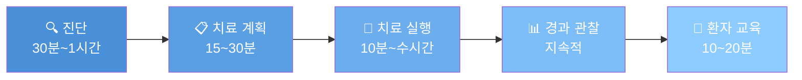
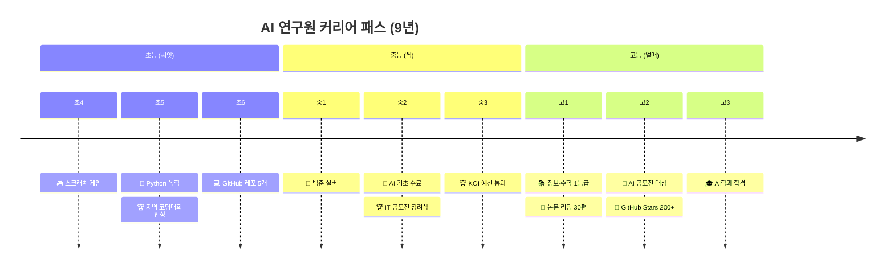

# 🌟 별(Star) 기반 직업 탐험 시스템

## 핵심 개선사항

### 1. 왕국 → 별 (Star) 용어 변경
- UI 전체에서 "별" 표현 사용
- 더 게임스럽고 우주 테마에 맞는 용어

### 2. 직무 프로세스 중심 설계
**기존**: 하루 일과 (시간대별 6장면)
**개선**: 직업 프로세스 (단계별 워크플로우)

#### 직무 프로세스 구조
```
직업 = 하나의 프로젝트
각 단계마다:
  - phase: 단계명 (예: 진단, 치료 계획)
  - icon: 이모지
  - title: 단계 제목
  - description: 상세 설명
  - duration: 소요 시간
  - tools: 사용 도구 배열
  - skills: 필요 스킬 배열
  - example: 실제 예시 (선택)
```

### 3. 커리어 패스 타임라인
**초4 → 고3까지 시간순 정리**

각 마일스톤:
- period: 학년 (예: 초4, 중1, 고2)
- semester: 학기 (1학기/2학기)
- icon: 이모지
- title: 단계 제목
- activities: 활동 배열
- awards: 수상 경력 (선택)
- subjects: 선택 과목 (고등만)
- setak: 세특 예시 (고등만)
- cost: 예상 비용
- achievement: 달성 목표

## 의사 직업 프로세스 예시



## AI 연구원 커리어 패스 예시



## UI 개선사항

### 별 카드 (Star Card)
- 크기: 더 크게 (h-48)
- 애니메이션: hover 시 glow 효과
- 정보: 직업 개수 배지
- 상호작용: 클릭 시 scale 애니메이션

### 직업 카드 (Job Card)
- 아이콘: 더 크게 (w-16 h-16)
- 정보 표시:
  - Holland 유형 배지
  - 연봉 범위 (💰)
  - 미래 성장성 (⭐)
- 호버 효과: scale 애니메이션

### 직업 상세 모달
**2개 탭 구조:**

#### 1️⃣ 직무 프로세스 탭
- 진행 바 (현재 단계 표시)
- 단계 카드:
  - 큰 이모지 아이콘
  - 단계명 배지
  - 제목 + 설명
  - 소요 시간
  - 실제 예시 (💡)
- 사용 도구 섹션
- 필요 스킬 섹션
- 마지막 단계: 연봉·입직경로·핵심역량 표시

#### 2️⃣ 커리어 패스 탭
- 타임라인 형식 (초4 → 고3)
- 각 마일스톤:
  - 학년·학기 배지
  - 비용 표시
  - 활동 내역
  - 수상 경력 (🏆)
  - 세특 예시 (고등)
  - 달성 목표 (✓)
- 연결선으로 시간 흐름 표현
- 하단: 핵심 성공 지표

## 데이터 확장 로드맵

### 현재 상태
- ✅ explore-star.json (3개 직업 샘플)
- ⏳ 나머지 7개 별 (준비 중)

### 다음 단계
1. 각 별마다 15개 직업 완성
2. 8개 별 × 15개 = 총 120개 직업
3. 동적 로딩 시스템 구현

## 기술 스택

- **데이터**: JSON 파일 (별마다 분리)
- **UI**: React + Tailwind CSS
- **애니메이션**: CSS transitions + keyframes
- **상태 관리**: useState (로컬)
- **라우팅**: Next.js App Router
