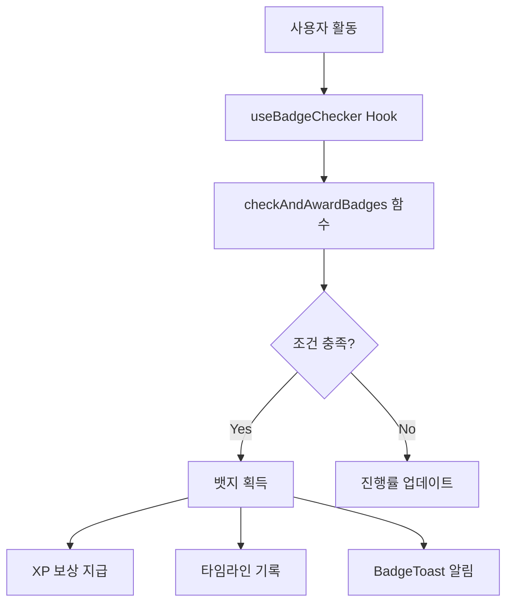

# 🏅 DreamPath 뱃지 시스템

## 개요

DreamPath의 뱃지 시스템은 우주 탐험 컨셉의 게임화된 업적 시스템입니다. 사용자의 활동을 추적하고 보상하며, 진행 상황을 시각화합니다.

---

## 뱃지 등급 (Rarity)

| 등급 | 색상 | 획득 난이도 | XP 보상 범위 | 특징 |
|------|------|------------|-------------|------|
| **일반** (Normal) | 🩶 회색 | 쉬움 | 50-150 XP | 기본 활동 완료 시 획득 |
| **레어** (Rare) | 💙 파란색 | 보통 | 200-400 XP | 여러 활동 누적 필요 |
| **에픽** (Epic) | 💜 보라색 | 어려움 | 500-800 XP | 상당한 노력 필요 |
| **전설** (Legend) | 💛 금색 | 매우 어려움 | 1000+ XP | 최고 난이도 업적 |

---

## 뱃지 카테고리

### 1. 탐험 (Exploration) 🧭
- **목적**: 직업 탐색 활동 장려
- **예시**:
  - `first-swipe`: 첫 직업 카드 스와이프
  - `explorer-3`: 3개 직업 탐색
  - `explorer-10`: 10개 직업 탐색 (레어)
  - `kingdom-visitor`: 첫 별 방문
  - `all-kingdoms`: 8개 별 모두 방문 (전설)

### 2. 시뮬레이션 (Simulation) 🎮
- **목적**: 직업 체험 참여 유도
- **예시**:
  - `first-sim`: 첫 시뮬레이션 완료
  - `sim-master`: 5개 시뮬레이션 완료 (에픽)
  - `camp-complete`: 1주일 체험 캠프 완주 (레어)

### 3. 커리어 (Career) 🛤️
- **목적**: 진로 설계 활동 촉진
- **예시**:
  - `path-starter`: 첫 커리어 패스 시작

### 4. 클루 (Clue) 👥
- **목적**: 팀 협업 및 프로젝트 활동 장려
- **예시**:
  - `clue-formed`: 첫 클루 팀 결성 (레어)
  - `project-deploy`: 프로젝트 배포 (에픽)

### 5. 특수 (Special) ⭐
- **목적**: 특별한 성취 인정
- **예시**:
  - `first-quiz`: RIASEC 검사 완료
  - `all-kingdoms`: 모든 별 방문 (전설)

---

## 뱃지 효과 시스템

### 1. XP 부스트 (xp_boost)
```typescript
{
  type: 'xp_boost',
  value: 10,  // 10% 증가
  description: '탐험 활동 XP +10%'
}
```

- **적용 방식**: 특정 카테고리 활동 시 XP 증가
- **누적**: 여러 뱃지의 부스트 효과 누적 가능
- **예시**:
  - `explorer-3`: 탐험 활동 +10%
  - `sim-master`: 시뮬레이션 +25%
  - `all-kingdoms`: 모든 활동 +50% (전설)

### 2. 기능 해금 (unlock)
```typescript
{
  type: 'unlock',
  value: 'career_path',
  description: '커리어 패스 기능 해금'
}
```

- **적용 방식**: 새로운 기능이나 콘텐츠 접근 권한 부여
- **예시**:
  - `first-quiz`: 직업 추천 시스템 활성화
  - `kingdom-visitor`: 별 지도 기능 해금
  - `first-sim`: 직업 상세 정보 L3 해금

---

## 자동 획득 시스템

### 동작 원리



### 체크 타이밍
1. **페이지 로드 시**: `useBadgeChecker` 훅이 자동 실행
2. **주요 활동 완료 후**: 
   - RIASEC 검사 완료
   - 직업 스와이프
   - 시뮬레이션 완료
   - 별 방문
   - 커리어 패스 시작

### 획득 조건 예시

| 뱃지 ID | 조건 체크 로직 |
|---------|---------------|
| `first-quiz` | `riasecResult !== null` |
| `explorer-3` | `swipeLogs.length >= 3` |
| `sim-master` | `simulations.length >= 5` |
| `all-kingdoms` | `visitedKingdoms >= 8` |

---

## UI/UX 디자인

### 뱃지 갤러리 (BadgesGalaxy)

#### 레이아웃
- **그리드**: 3열 그리드 (모바일 최적화)
- **정렬**: 획득한 뱃지 우선, 등급 순
- **필터**: 전체 / 획득 / 미획득

#### 시각적 요소

**획득한 뱃지**:
- ✨ 빛나는 테두리 (등급별 색상)
- 🌀 궤도를 도는 입자 애니메이션
- 💫 부드러운 float 애니메이션
- 🌟 Glow 효과 (등급별 강도)

**미획득 뱃지**:
- 🔒 잠금 아이콘
- 회색 처리 (grayscale)
- 진행률 바 표시 (해당 시)
- 반투명 처리

#### 상세 모달
- 뱃지 정보 (이름, 설명, 조건)
- 진행률 (미획득 시)
- 보상 (XP, 특수 효과)
- 획득 상태

### 뱃지 토스트 알림

#### 표시 조건
- 새로운 뱃지 획득 시 자동 표시
- 화면 상단 중앙에 5초간 표시
- 여러 뱃지 동시 획득 시 순차 표시

#### 애니메이션
- 🎯 Scale bounce 등장 애니메이션
- 🌀 궤도 입자 효과
- 💫 배경 glow pulse
- ⬆️ Slide up 퇴장

---

## 구현 파일 구조

```
frontend/
├── lib/
│   └── badge-system.ts          # 뱃지 로직 핵심
├── hooks/
│   └── use-badge-checker.ts     # 자동 체크 훅
├── components/
│   ├── badges-galaxy.tsx        # 뱃지 갤러리 UI
│   └── badge-toast.tsx          # 획득 알림 토스트
├── data/
│   └── badges.json              # 뱃지 데이터
└── app/
    ├── home/page.tsx            # 뱃지 체커 적용
    └── portfolio/page.tsx       # 뱃지 갤러리 표시
```

---

## 사용 방법

### 1. 뱃지 체커 적용 (자동 획득)

```tsx
import { useBadgeChecker } from '@/hooks/use-badge-checker';
import { BadgeToastManager } from '@/components/badge-toast';

function MyPage() {
  const { newBadges } = useBadgeChecker();
  
  return (
    <div>
      {/* 페이지 콘텐츠 */}
      <BadgeToastManager badgeIds={newBadges.map(b => b.badgeId)} />
    </div>
  );
}
```

### 2. 뱃지 갤러리 표시

```tsx
import { BadgesGalaxy } from '@/components/badges-galaxy';

function PortfolioPage() {
  const earnedBadges = storage.badges.getAll();
  
  return <BadgesGalaxy earnedBadges={earnedBadges} />;
}
```

### 3. 수동 뱃지 획득

```tsx
import { storage } from '@/lib/storage';

// 특정 뱃지 획득
const wasNew = storage.badges.earn('first-quiz');

if (wasNew) {
  // XP 보상 및 타임라인은 badge-system.ts에서 자동 처리
  console.log('New badge earned!');
}
```

### 4. XP 부스트 적용

```tsx
import { calculateXPBoost } from '@/lib/badge-system';

const baseXP = 100;
const source = 'exploration'; // 'exploration', 'simulation', 'career', etc.
const boostedXP = calculateXPBoost(baseXP, source);

storage.xp.add(boostedXP, '직업 탐색', source);
```

---

## 진행률 추적

### 추적 가능한 뱃지

| 뱃지 | 현재 / 목표 | 표시 |
|------|------------|------|
| `explorer-3` | 스와이프 수 / 3 | 진행률 바 |
| `explorer-10` | 스와이프 수 / 10 | 진행률 바 |
| `sim-master` | 시뮬레이션 수 / 5 | 진행률 바 |
| `all-kingdoms` | 방문한 별 / 8 | 진행률 바 |

### 다음 획득 추천

```tsx
import { getNextBadgeSuggestions } from '@/lib/badge-system';

const nextBadges = getNextBadgeSuggestions(3); // 상위 3개
// 진행률이 높은 순으로 정렬된 미획득 뱃지 반환
```

---

## 애니메이션 상세

### CSS Keyframes

```css
/* 부유 애니메이션 */
@keyframes float {
  0%, 100% { transform: translateY(0px) rotate(0deg); }
  50% { transform: translateY(-14px) rotate(3deg); }
}

/* 궤도 회전 */
@keyframes orbit {
  0% { transform: rotate(0deg) translateX(60px) rotate(0deg); }
  100% { transform: rotate(360deg) translateX(60px) rotate(-360deg); }
}

/* 스케일 바운스 */
@keyframes scale-bounce {
  0% { transform: scale(0.5); opacity: 0; }
  60% { transform: scale(1.1); }
  100% { transform: scale(1); opacity: 1; }
}
```

### 적용 예시

```tsx
// 획득한 뱃지: 부유 + 궤도
<div 
  className="animate-float"
  style={{
    animation: `float ${3 + (idx % 3)}s ease-in-out infinite`,
    animationDelay: `${idx * 0.1}s`,
  }}
>
  {/* 뱃지 아이콘 */}
  <div className="relative">
    {icon}
    {/* 궤도 입자 */}
    <div style={{ animation: 'orbit 4s linear infinite' }}>
      <div className="particle" />
    </div>
  </div>
</div>
```

---

## 확장 가능성

### 추가 가능한 뱃지 타입

1. **시간 기반 뱃지**
   - 연속 접속 (3일, 7일, 30일)
   - 특정 시간대 활동 (새벽 탐험가)

2. **소셜 뱃지**
   - 클루 팀 활동 (리더, 서포터)
   - QA 게시판 기여 (질문왕, 답변왕)

3. **숨겨진 뱃지**
   - 특수 조건 (이스터에그)
   - 시즌 이벤트 뱃지

4. **진행률 뱃지**
   - 각 별 마스터 (별당 20개 직업 탐색)
   - 완벽주의자 (모든 시뮬레이션 S등급)

### 새 뱃지 추가 방법

1. `data/badges.json`에 뱃지 정의 추가:

```json
{
  "id": "new-badge-id",
  "name": "뱃지 이름",
  "description": "뱃지 설명",
  "icon": "Sparkles",
  "rarity": "rare",
  "condition": "획득 조건 설명",
  "xpReward": 200,
  "category": "exploration",
  "effect": {
    "type": "xp_boost",
    "value": 15,
    "description": "탐험 활동 XP +15%"
  }
}
```

2. `lib/badge-system.ts`의 `checkAndAwardBadges` 함수에 조건 로직 추가:

```typescript
case 'new-badge-id':
  shouldEarn = /* 조건 체크 로직 */;
  break;
```

3. 진행률 추적이 필요한 경우 `getBadgeProgress` 함수에 추가:

```typescript
case 'new-badge-id':
  return { 
    current: /* 현재 값 */, 
    required: /* 목표 값 */, 
    percentage: /* 퍼센트 */ 
  };
```

---

## 성능 최적화

### 1. 메모이제이션
- `useMemo`로 뱃지 필터링 및 정렬 캐싱
- 불필요한 재계산 방지

### 2. 조건부 렌더링
- 획득한 뱃지만 애니메이션 적용
- 미획득 뱃지는 정적 표시

### 3. 지연 로딩
- 뱃지 상세 모달은 클릭 시에만 렌더링
- 토스트는 획득 시에만 마운트

---

## 테스트 시나리오

### 기본 흐름
1. ✅ RIASEC 검사 완료 → `first-quiz` 획득
2. ✅ 첫 직업 스와이프 → `first-swipe` 획득
3. ✅ 첫 별 방문 → `kingdom-visitor` 획득
4. ✅ 3개 직업 탐색 → `explorer-3` 획득
5. ✅ 첫 시뮬레이션 완료 → `first-sim` 획득

### 진행률 테스트
1. 2개 직업 탐색 → `explorer-3` 진행률 66% 표시
2. 3개 직업 탐색 → `explorer-3` 자동 획득 + 토스트
3. 4개 별 방문 → `all-kingdoms` 진행률 50% 표시

### XP 부스트 테스트
1. `explorer-3` 획득 (탐험 +10%)
2. 직업 탐색 (100 XP) → 110 XP 획득 확인
3. `all-kingdoms` 획득 (모든 활동 +50%)
4. 직업 탐색 (100 XP) → 160 XP 획득 확인 (10% + 50%)

---

## 디자인 철학

### 우주 탐험 컨셉
- 🌌 **별자리 갤러리**: 뱃지를 우주의 별처럼 배치
- 🛸 **궤도 입자**: 획득한 뱃지 주변을 도는 입자
- ✨ **Glow 효과**: 등급에 따른 빛의 강도
- 🎮 **게임화**: 수집 욕구를 자극하는 시각적 피드백

### 사용자 경험
- **즉각적 피드백**: 획득 즉시 토스트 알림
- **진행 가시화**: 미획득 뱃지에 진행률 표시
- **성취감**: 등급별 차별화된 시각 효과
- **탐색 유도**: 다음 획득 가능 뱃지 추천

---

## 향후 개선 방향

### Phase 1 (현재)
- ✅ 기본 뱃지 12개
- ✅ 자동 획득 시스템
- ✅ 진행률 추적
- ✅ XP 부스트

### Phase 2
- 🔄 뱃지 상세 통계 (획득일, 희귀도 순위)
- 🔄 뱃지 공유 기능 (SNS)
- 🔄 뱃지 조합 효과 (세트 효과)

### Phase 3
- 📅 시즌 뱃지 (기간 한정)
- 🏆 리더보드 (뱃지 수집 랭킹)
- 🎁 뱃지 교환 시스템 (클루 팀원끼리)

### Phase 4
- 🎨 커스텀 뱃지 (사용자 제작)
- 🌟 동적 뱃지 (실시간 조건 변경)
- 🎯 챌린지 뱃지 (주간 미션)
