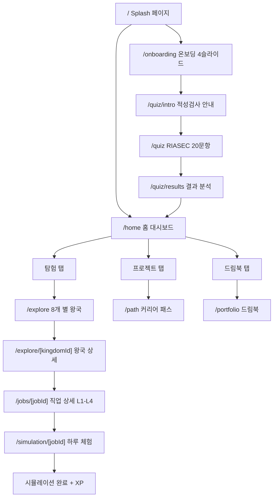
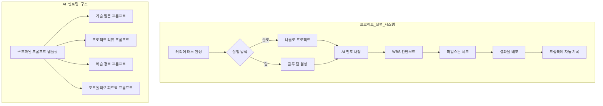
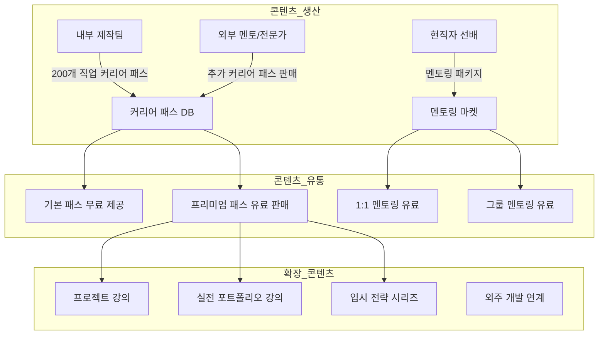
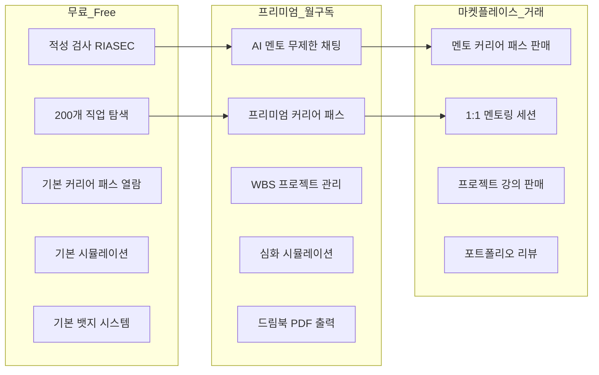
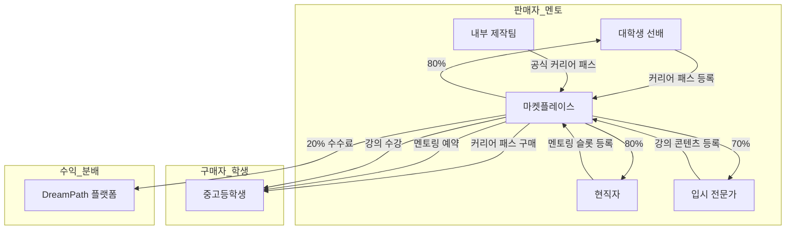
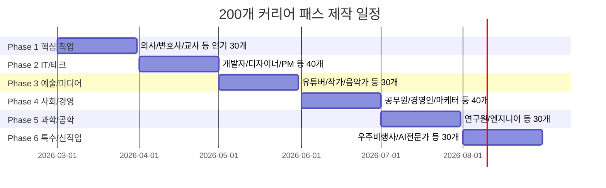

# DreamPath - 기획 및 개발 현황 (상)

> **프로젝트**: AI Career Path — 청소년 진로 탐색 RPG 앱  
> **테마**: 우주 탐험 x 직업 RPG  
> **최종 업데이트**: 2026-02-24

---

## 1. 앱 전체 구조

### 1-1. 현재 구현된 화면



### 1-2. 핵심 4개 탭바 구성

| 탭 | 경로 | 역할 | 현재 상태 |
|----|------|------|----------|
| **홈** | `/home` | XP 바, 일일 퀘스트, 추천 직업 성좌 | ✅ 구현 완료 |
| **탐험** | `/explore` | 8개 별(왕국) 탐험, 200개 직업 발견 | ✅ 구현 완료 |
| **프로젝트** | `/path` | 커리어 패스 + 프로젝트 관리 | ⚡ 기본 구현 |
| **드림북** | `/portfolio` | 여정/배지/통계 포트폴리오 | ✅ 구현 완료 |

### 1-3. 주요 화면 요약

| 화면 | 설명 | 핵심 기능 |
|------|------|----------|
| **Splash** | 로고 애니메이션 + 리다이렉트 | 우주 파티클 배경, 자동 전환 |
| **온보딩** | 4슬라이드 앱 소개 | 건너뛰기, 닉네임/학년 설정 |
| **적성 검사** | RIASEC 기반 20문항 | 상황형 질문, 결과 분석, 추천 직업 |
| **홈 대시보드** | 우주 정거장 메인 화면 | XP 바, 일일 퀘스트, 4개 퀵 메뉴, 추천 직업 |
| **왕국 탐험** | 8개 직업 분야 별 탐험 | 진입 시 왕국 등급 부여, 직업 리스트 |
| **직업 상세** | L1~L4 단계별 직업 정보 | 키워드, 일과표, 연봉, 성장경로 |
| **하루 체험** | 직업 시뮬레이션 게임 | 선택지 기반 스토리, XP 획득 |
| **커리어 패스** | 진로 로드맵 | 초등~대학 단계별 활동 가이드 |
| **드림북** | 포트폴리오 | 여정 지도, 뱃지 갤러리, 통계 차트 |

---

## 2. 핵심 가치 제안 (Value Proposition)

### 2-1. 1순위: 커리어 패스 — 입시 내비게이션

> **"특정 직업을 위해 중학교~고등학교에서 무엇을 준비해야 하는지 알려준다"**

```mermaid
graph LR
    subgraph 현재_입시_시장
        A[입시 컨설턴트] -->|1:1 상담 200만원+| B[학생]
        C[유학원] -->|패키지 1000만원+| B
        D[족보닷컴] -->|문제은행 위주| B
    end

    subgraph DreamPath_차별화
        E[AI 기반 적성 분석] --> F[200개 직업별 커리어 패스]
        F --> G[단계별 활동 가이드]
        G --> H[실행 + 포트폴리오]
        H --> I[멘토링 마켓플레이스]
    end

    style DreamPath_차별화 fill:#1a1a2e,stroke:#6C5CE7
```



#### 현재 구현된 커리어 패스 구조

```
직업 1개당 커리어 패스 데이터:
├── 초등학교 단계 (2개 활동)
│   ├── 호기심 키우기 (priority: medium)
│   └── 기초 체험 (priority: low)
├── 중학교 단계 (2개 활동)
│   ├── 기초 심화 (priority: high)
│   └── 관련 봉사/동아리 (priority: medium)
├── 고등학교 단계 (2개 활동)
│   ├── 내신/수능/특기 (priority: high)
│   └── 활동 포트폴리오 (priority: high)
├── 대학 단계 (1개 활동)
│   └── 전공 심화 + 인턴 (priority: high)
└── 지금 당장 해야 할 3가지 (priorityActions)
```

#### 비교표: 기존 서비스 vs DreamPath

| 항목 | 입시 컨설턴트 | 유학원 | 족보닷컴 | **DreamPath** |
|------|-------------|--------|---------|-------------|
| **가격** | 200만~1000만 | 1000만+ | 월 3~5만 | **기본 무료 + 프리미엄** |
| **직업 수** | 1~3개 상담 | 해외 한정 | 없음 | **200개 직업** |
| **커리어 패스** | 수동 작성 | 유학 경로만 | 없음 | **AI 기반 자동 생성** |
| **실행 관리** | 분기별 상담 | 원서 위주 | 시험 문제 | **실시간 프로젝트 관리** |
| **포트폴리오** | 수동 | 에세이 중심 | 없음 | **자동 누적 드림북** |
| **멘토링** | 1:1 대면 | 1:1 대면 | 없음 | **AI + 선배 멘토 마켓** |
| **확장성** | 지역 한정 | 지역 한정 | 전국 | **글로벌 확장 가능** |

---

### 2-2. 2순위: 프로젝트 실행 — AI 멘토링 + WBS 관리

> **"커리어 패스를 세웠다면, 이제 실행하라. 혼자 또는 팀으로."**



#### 솔로 vs 팀 프로젝트 비교

| 구분 | 나홀로 프로젝트 | 클루 팀 프로젝트 |
|------|---------------|----------------|
| **인원** | 1명 | 2~5명 |
| **관리** | 개인 칸반보드 | 팀 칸반보드 + 역할 분담 |
| **멘토링** | AI 멘토 1:1 | AI 멘토 + 팀 토론 |
| **기간** | 1~4주 | 2~8주 |
| **결과물** | 개인 포트폴리오 | 팀 배포 + 개인 포트폴리오 |
| **보상** | XP + 뱃지 | XP + 뱃지 + 팀 뱃지 |

#### AI 멘토링 프롬프트 구조 (계획)

| 카테고리 | 프롬프트 템플릿 예시 | 용도 |
|---------|-------------------|------|
| **기술 질문** | "이 직업에서 {기술}을 배우려면 어떤 순서로?" | 학습 경로 안내 |
| **프로젝트 리뷰** | "내 프로젝트 {설명}에 대해 피드백을 줘" | 결과물 개선 |
| **WBS 생성** | "{프로젝트}를 {기간}동안 하려면 WBS를 짜줘" | 일정 관리 |
| **포트폴리오** | "이 활동을 입시용 포트폴리오로 정리해줘" | 드림북 완성 |
| **면접 준비** | "{직업} 관련 면접 질문을 만들어줘" | 실전 대비 |

---

### 2-3. 3순위: 콘텐츠 마켓플레이스 — 사고 파는 커리어 패스

> **"내부에서 200개 커리어 패스를 직접 제작하고, 외부 멘토도 참여하는 마켓"**



---

## 3. 비즈니스 모델 설계

### 3-1. 수익 구조 종합



### 3-2. 가격 정책 (안)

| 티어 | 월 가격 | 주요 기능 | 대상 |
|------|--------|----------|------|
| **Free** | 0원 | 적성검사, 직업 탐색, 기본 패스 | 모든 학생 |
| **Explorer** | 9,900원 | AI 멘토 30회/월, 프리미엄 패스 5개 | 진로 탐색 중인 학생 |
| **Pioneer** | 19,900원 | AI 멘토 무제한, 전체 패스, WBS, 드림북 출력 | 적극적 준비 학생 |
| **Mentor** | 수수료 20% | 커리어 패스 판매, 멘토링 수입 | 대학생/현직자 멘토 |

### 3-3. 마켓플레이스 구조 (족보닷컴 + 크몽 하이브리드)



#### 마켓플레이스 상품 유형

| 상품 유형 | 설명 | 가격대 | 예시 |
|----------|------|--------|------|
| **커리어 패스** | 특정 직업의 상세 준비 가이드 | 5,000~30,000원 | "서울대 의대 합격 로드맵" |
| **멘토링 세션** | 1:1 화상/채팅 멘토링 | 10,000~50,000원/30분 | "현직 개발자와 30분 상담" |
| **프로젝트 강의** | 실전 프로젝트 따라하기 | 30,000~100,000원 | "AI 프로젝트 포트폴리오 완성" |
| **포트폴리오 리뷰** | 드림북 전문가 검토 | 20,000~80,000원 | "입시 포트폴리오 첨삭" |
| **학습 자료 팩** | 교과/비교과 활동 자료 | 3,000~15,000원 | "생명과학 탐구 보고서 템플릿" |

---

## 4. 내부 콘텐츠 제작 계획

### 4-1. 200개 직업 커리어 패스 로드맵



#### 커리어 패스 1개당 제작 사양

| 항목 | 내용 | 분량 |
|------|------|------|
| **초등학교 단계** | 흥미 발견 + 기초 체험 활동 | 2~3개 활동 |
| **중학교 단계** | 기초 심화 + 교과/비교과 연계 | 3~4개 활동 |
| **고등학교 단계** | 입시 전략 + 포트폴리오 구축 | 4~5개 활동 |
| **대학 단계** | 전공 + 인턴 + 자격증 | 2~3개 활동 |
| **즉시 실행 항목** | 지금 바로 할 수 있는 3가지 | 3개 |
| **추천 도서/강좌** | 단계별 학습 자료 | 5~10개 |
| **입시 실제 사례** | 합격 사례 (가상 합격자) | 2~3명 |
| **예상 소요 비용** | 학원/자격증/활동비 | 단계별 정리 |

#### 8개 별(왕국)별 직업 분배 (200개)

| 별(왕국) | RIASEC | 직업 수 | 예시 |
|---------|--------|--------|------|
| 탐구의 별 | I (탐구형) | 25개 | 의사, 연구원, 데이터과학자 |
| 창작의 별 | A (예술형) | 25개 | 디자이너, 작곡가, 영화감독 |
| 기술의 별 | R (실행형) | 25개 | 개발자, 엔지니어, 파일럿 |
| 자연의 별 | R+I | 25개 | 수의사, 환경운동가, 농업과학자 |
| 연결의 별 | S (사회형) | 25개 | 교사, 상담사, 사회복지사 |
| 질서의 별 | C (관습형) | 25개 | 변호사, 회계사, 공무원 |
| 소통의 별 | E (진취형) | 25개 | 마케터, 유튜버, 아나운서 |
| 도전의 별 | E+R | 25개 | 창업가, 프로게이머, 운동선수 |

---

## 5. 기술 현황 및 개발 로그

### 5-1. 현재 기술 스택

| 영역 | 기술 | 상태 |
|------|------|------|
| **프레임워크** | Next.js 16.1.6 (App Router, Turbopack) | ✅ |
| **언어** | TypeScript | ✅ |
| **스타일** | Tailwind CSS v4 | ✅ |
| **상태관리** | LocalStorage (클라이언트 전용) | ✅ |
| **차트** | Recharts | ✅ |
| **아이콘** | Lucide React | ✅ |
| **패키지** | pnpm | ✅ |
| **데이터** | JSON 파일 (정적) | ✅ |
| **백엔드** | 없음 (향후 필요) | ⏳ |
| **DB** | 없음 (향후 필요) | ⏳ |

### 5-2. 최근 버그 수정 (2026-02-24)

| 문제 | 원인 | 해결 | 파일 |
|------|------|------|------|
| Hydration 오류 | `Math.random()` SSR/CSR 불일치 | `useEffect`로 이동 | `page.tsx`, `home/page.tsx`, `portfolio/page.tsx` |
| 카드 Overflow | 아이콘/텍스트 크기 초과 | `truncate`, `overflow-hidden` | `home/page.tsx` |
| 빌드 캐시 오류 | `.next` 캐시 손상 | 캐시 삭제 + 서버 재시작 | `.next/` |

### 5-3. 최근 기능 추가 (2026-02-24)

#### 뱃지 시스템

| 파일 | 역할 |
|------|------|
| `lib/badge-system.ts` | 자동 획득 로직, XP 부스트, 진행률 |
| `hooks/use-badge-checker.ts` | 자동 체크 훅 |
| `components/badges-galaxy.tsx` | 뱃지 갤러리 (등급별 애니메이션) |
| `components/badge-toast.tsx` | 획득 토스트 알림 |

| 등급 | 수량 | XP | 시각 효과 |
|------|------|-----|----------|
| 일반 | 6개 | 50~150 | Float |
| 레어 | 3개 | 200~400 | Float + Orbit |
| 에픽 | 2개 | 500~800 | Float + Orbit + Pulse |
| 전설 | 1개 | 1000 | Float + Orbit + Pulse + Ping |

---

**(하편은 `CHANGES_SUMMARY_2.md`에 계속)**
