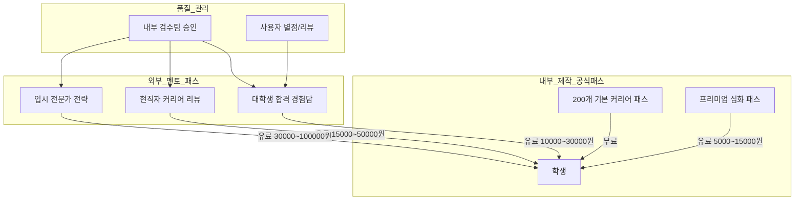
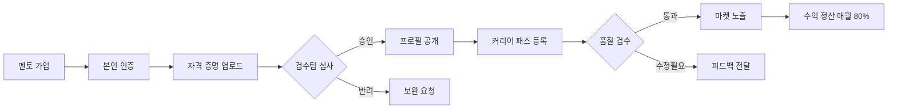
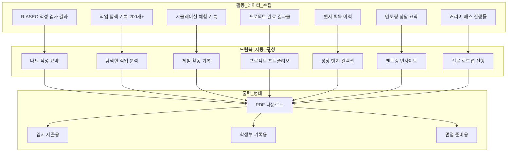
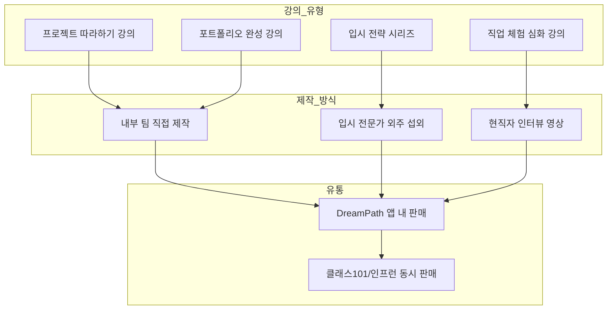
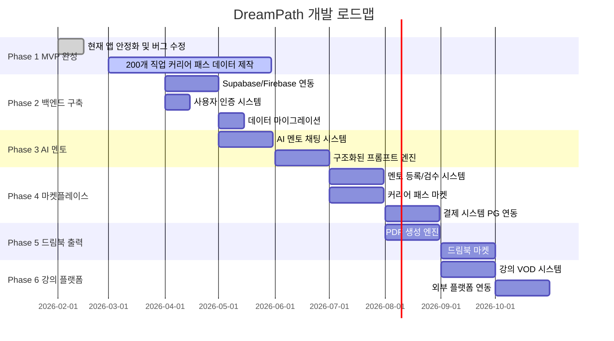

# DreamPath - 기획 및 개발 현황 (하)

> **이전 편**: `CHANGES_SUMMARY.md` (앱 구조, 핵심 가치, 비즈니스 모델, 기술 현황)  
> **이 문서**: 마켓플레이스 상세 설계, AI 멘토링, 드림북, 실행 로드맵

---

## 6. 마켓플레이스 상세 설계 — "커리어 패스를 사고 판다"

### 6-1. 콘셉트: 족보닷컴 x 크몽 x 클래스101

```
┌──────────────────────────────────────────────────────────┐
│                  DreamPath 마켓플레이스                     │
├──────────┬──────────┬──────────┬──────────────────────────┤
│ 커리어패스 │  멘토링   │   강의    │  프로젝트 외주             │
│ 마켓      │  마켓     │  마켓     │  연계                    │
├──────────┼──────────┼──────────┼──────────────────────────┤
│ 직업별     │ 1:1 세션  │ 프로젝트   │ 외부 제작사와             │
│ 입시 가이드 │ 그룹 세션  │ 입시 전략  │ 연계 강의 제작            │
│ 활동 템플릿 │ AI+선배   │ 포트폴리오 │ 수익 분배                │
└──────────┴──────────┴──────────┴──────────────────────────┘
```

### 6-2. 커리어 패스 마켓

#### 상품 구조



#### 커리어 패스 상품 비교표

| 티어 | 제작자 | 가격 | 콘텐츠 범위 | 품질 보증 |
|------|--------|------|-----------|----------|
| **Basic** (무료) | 내부 팀 | 0원 | 단계별 활동 가이드 (기본) | 공식 검수 |
| **Standard** (유료) | 내부 팀 | 5,000~15,000원 | 상세 활동 + 추천 자료 + 실제 사례 | 공식 검수 |
| **Expert** (유료) | 합격 선배 | 10,000~30,000원 | 실제 합격 경험 + 스펙 공개 + 노하우 | 내부 검수 + 리뷰 |
| **Master** (유료) | 현직자/전문가 | 30,000~100,000원 | 업계 인사이트 + 1:1 Q&A 포함 | 내부 검수 + 보증 |

#### 판매자(멘토) 등록 흐름



### 6-3. 멘토링 마켓

#### 멘토링 유형별 비교

| 유형 | 방식 | 시간 | 가격대 | 특징 |
|------|------|------|--------|------|
| **AI 멘토** | 채팅 | 무제한 | 월 구독 포함 | 24시간, 구조화된 프롬프트 |
| **선배 멘토 1:1** | 화상/채팅 | 30분~1시간 | 10,000~50,000원 | 실제 경험 기반 상담 |
| **그룹 멘토링** | 화상 | 1~2시간 | 5,000~15,000원/인 | 5~20명 소규모 세미나 |
| **기간 멘토링** | 채팅+화상 | 1~3개월 | 100,000~300,000원 | 장기 관리형 멘토링 |
| **입시 컨설팅** | 전문가 대면 | 2시간 | 50,000~200,000원 | 전문가 1:1 전략 수립 |

#### 기존 서비스 약점 분석 및 DreamPath 해법

| 기존 서비스 약점 | 구체적 문제 | DreamPath 해법 |
|----------------|-----------|---------------|
| **비용 장벽** | 입시 상담 1회 50만원+ | AI 멘토 무료 + 선배 멘토 1만원~ |
| **접근성** | 서울/수도권 편중 | 온라인 전국 접근 |
| **지속성** | 1회성 상담 후 방치 | 프로젝트 관리 + 정기 체크 |
| **실행력** | 상담받고 안 하는 문제 | 게임화 XP + 뱃지 + WBS 관리 |
| **포트폴리오** | 활동 기록 산발적 | 드림북 자동 누적 |
| **동기부여** | 어른이 시키는 느낌 | RPG 게임 + 우주 컨셉 재미 |
| **맞춤형** | 일반적 조언 | RIASEC 기반 개인 맞춤 |

---

## 7. AI 멘토링 시스템 상세

### 7-1. 구조화된 프롬프트 템플릿

```
┌──────────────────────────────────────────────────────┐
│              AI 멘토 프롬프트 엔진                       │
├─────────────┬────────────────────────────────────────┤
│ 컨텍스트     │ 사용자 RIASEC + 선택 직업 + 현재 단계     │
│ 주입        │ + 완료한 활동 + 드림북 데이터              │
├─────────────┼────────────────────────────────────────┤
│ 프롬프트     │ 카테고리별 구조화 템플릿                   │
│ 템플릿      │ (학습경로/프로젝트/포트폴리오/면접)          │
├─────────────┼────────────────────────────────────────┤
│ 출력 형식    │ 마크다운 / 체크리스트 / WBS 형식           │
│             │ 사용자 레벨에 맞춘 어투                    │
└─────────────┴────────────────────────────────────────┘
```

#### 프롬프트 카테고리별 상세

| # | 카테고리 | 프롬프트 의도 | 출력 형식 | 예시 질문 |
|---|---------|-------------|----------|----------|
| 1 | **학습 경로** | 다음에 뭘 공부할지 | 단계별 리스트 | "의사가 되려면 중2에서 뭘 해야해?" |
| 2 | **프로젝트 설계** | 프로젝트 기획 도움 | WBS + 마일스톤 | "과학 탐구 보고서 프로젝트를 짜줘" |
| 3 | **기술 질문** | 구체적 스킬 설명 | 설명 + 예시 | "생명과학2에서 유전 파트 공부 방법" |
| 4 | **포트폴리오** | 활동 정리 도움 | 입시용 포맷 | "봉사활동 경험을 자소서로 정리해줘" |
| 5 | **면접 준비** | 모의 면접 | 질문+모범답안 | "의대 면접 예상 질문 5개" |
| 6 | **동기부여** | 슬럼프 극복 | 격려 메시지 | "공부가 하기 싫어..." |
| 7 | **비교 분석** | 진로 선택 도움 | 비교표 | "의사 vs 약사 뭐가 나한테 맞아?" |

### 7-2. AI 멘토 사용료 체계 (안)

| 모드 | 포함 범위 | 제한 | 가격 |
|------|---------|------|------|
| **Free** | 기본 질문 5회/일 | 단순 답변만 | 0원 |
| **Explorer 구독** | 30회/월 | 구조화된 출력 | 9,900원/월 |
| **Pioneer 구독** | 무제한 | 전체 프롬프트 + WBS 생성 + 포트폴리오 정리 | 19,900원/월 |

---

## 8. 드림북(포트폴리오) — 입시 준비의 최종 산출물

### 8-1. 드림북 = 디지털 입시 포트폴리오

> **"DreamPath의 모든 활동이 자동으로 모여 입시 포트폴리오가 완성된다"**



### 8-2. 드림북 섹션 구성

| 섹션 | 자동 수집 데이터 | 입시 활용 | 제출 형태 |
|------|----------------|----------|----------|
| **1. 나의 적성** | RIASEC 결과 + 강점 분석 | 자소서 "나는 어떤 사람인가" | 차트 + 요약문 |
| **2. 직업 탐색 기록** | 방문한 별, 탐색한 직업 수 | 진로탐색 활동 증빙 | 활동 리스트 |
| **3. 체험 활동** | 시뮬레이션 기록 | 직업 체험 활동 기록 | 체험일지 형식 |
| **4. 프로젝트** | 완성된 프로젝트 결과물 | 비교과 활동 증빙 | 프로젝트 보고서 |
| **5. 성장 기록** | XP, 레벨, 뱃지 | 성취 이력 | 타임라인 차트 |
| **6. 멘토링 기록** | AI/선배 멘토 상담 요약 | 진로 상담 기록 | 상담일지 형식 |
| **7. 진로 로드맵** | 커리어 패스 진행 현황 | 장기 계획 증빙 | 로드맵 인포그래픽 |

### 8-3. 드림북 마켓 연계 — "완성된 드림북을 사고 판다"

| 판매 상품 | 설명 | 가격대 | 구매자 |
|----------|------|--------|--------|
| **드림북 템플릿** | 직업별 활동 가이드 템플릿 | 3,000~10,000원 | 드림북 작성 시작하는 학생 |
| **합격 드림북** | 실제 합격자의 드림북 사례 | 10,000~30,000원 | 벤치마킹하고 싶은 학생 |
| **드림북 리뷰** | 전문가가 드림북 첨삭 | 20,000~80,000원 | 입시 직전 학생 |
| **드림북 PDF 출력** | 디자인된 PDF 생성 | 구독자 무료 / 비구독 5,000원 | 제출 필요 시 |

---

## 9. 강의/외주 개발 확장

### 9-1. 내부 제작 강의 콘텐츠



#### 강의 제작 우선순위

| 순위 | 강의 | 대상 | 예상 가격 | 제작 방식 |
|------|------|------|----------|----------|
| 1 | 과학 탐구 보고서 프로젝트 | 중2~고1 | 39,000원 | 내부 제작 |
| 2 | 코딩 포트폴리오 완성 | 중2~고2 | 49,000원 | 내부 제작 |
| 3 | 의대/약대 입시 전략 | 고1~고3 | 69,000원 | 전문가 외주 |
| 4 | 자소서/면접 완전 정복 | 고2~고3 | 59,000원 | 전문가 외주 |
| 5 | 학생부 비교과 전략 | 중3~고2 | 49,000원 | 내부 제작 |
| 6 | 해외 대학 지원 가이드 | 고1~고3 | 89,000원 | 유학 전문가 외주 |

### 9-2. 외주 개발 연계 모델

| 분야 | 파트너 | 협업 내용 | 수익 분배 |
|------|--------|----------|----------|
| **강의 제작** | 영상 프로덕션 | 강의 촬영/편집 | 건당 계약 |
| **콘텐츠 작성** | 교육 콘텐츠 작가 | 커리어 패스 상세 작성 | 건당 계약 |
| **멘토 섭외** | 대학교 동아리 | 멘토 풀 확보 | 수수료 모델 |
| **입시 데이터** | 입시 전문 업체 | 합격 데이터 연동 | 데이터 제휴 |

---

## 10. 종합 로드맵

### 10-1. Phase별 개발 계획



### 10-2. Phase별 핵심 지표

| Phase | 기간 | 핵심 목표 | KPI |
|-------|------|---------|-----|
| **1. MVP** | 2026.02~03 | 앱 안정화 + 200개 패스 | 앱 크래시 0, 패스 200개 완성 |
| **2. 백엔드** | 2026.04~05 | 사용자 데이터 영속화 | 회원가입 1000명 |
| **3. AI 멘토** | 2026.05~06 | AI 멘토 채팅 런칭 | 일 평균 질문 500건 |
| **4. 마켓** | 2026.07~08 | 마켓플레이스 오픈 | 멘토 50명, 월 거래 100건 |
| **5. 드림북** | 2026.08~09 | PDF 출력 + 마켓 | PDF 생성 500건/월 |
| **6. 강의** | 2026.09~10 | 강의 5개 런칭 | 수강생 200명 |

### 10-3. 수익 성장 시나리오

| 시기 | 구독자 | 마켓 거래 | 강의 수강 | 월 매출 (예상) |
|------|--------|---------|----------|-------------|
| **3개월차** | 500명 | 50건 | - | 약 700만원 |
| **6개월차** | 2,000명 | 300건 | 100명 | 약 3,000만원 |
| **12개월차** | 8,000명 | 1,500건 | 500명 | 약 1.2억원 |
| **24개월차** | 30,000명 | 5,000건 | 2,000명 | 약 4억원 |

---

## 11. 현재 구현 현황 체크리스트

### 11-1. 완료된 기능

- [x] Splash 페이지 (우주 파티클 애니메이션)
- [x] 온보딩 4슬라이드
- [x] RIASEC 적성검사 20문항
- [x] 홈 대시보드 (XP, 일일 퀘스트, 추천 직업)
- [x] 탭바 (홈, 탐험, 프로젝트, 드림북)
- [x] 8개 별 왕국 탐험
- [x] 직업 상세 (L1~L4)
- [x] 직업 스와이프
- [x] 시뮬레이션 (하루 체험)
- [x] 커리어 패스 (기본 2개 직업)
- [x] 드림북 포트폴리오 (여정/배지/통계)
- [x] 뱃지 시스템 (12개, 자동 획득, 동적 UI)
- [x] XP/레벨 시스템
- [x] 설정 페이지

### 11-2. 다음 단계 (미구현)

- [ ] **200개 직업 커리어 패스 데이터 제작** (현재 2개 → 200개)
- [ ] 백엔드 구축 (Supabase/Firebase)
- [ ] 사용자 인증 (회원가입/로그인)
- [ ] AI 멘토 채팅 시스템
- [ ] 구조화된 프롬프트 엔진
- [ ] WBS 칸반보드 (프로젝트 관리)
- [ ] 멘토 등록/검수 시스템
- [ ] 커리어 패스 마켓플레이스
- [ ] 결제 시스템 (PG 연동)
- [ ] 드림북 PDF 생성 엔진
- [ ] 드림북 마켓
- [ ] 강의 VOD 시스템
- [ ] 멘토링 화상/채팅 시스템
- [ ] 관리자 대시보드

---

## 12. 결론: DreamPath의 핵심 공식

```
┌───────────────────────────────────────────────────────────┐
│                                                           │
│  나의 직업 찾기 (RIASEC 적성검사)                            │
│           ↓                                               │
│  직업 탐색하기 (200개 직업 × 8개 별)                         │
│           ↓                                               │
│  커리어 패스 세우기 (중학교 → 고등학교 → 대학 로드맵)           │
│           ↓                                               │
│  실행하기 (프로젝트 + AI 멘토 + 선배 멘토)                    │
│           ↓                                               │
│  드림북 완성하기 (자동 포트폴리오 → 입시 제출)                  │
│           ↓                                               │
│  사고 팔기 (커리어 패스 마켓 + 멘토링 마켓)                    │
│                                                           │
│  = 입시 컨설팅의 민주화                                      │
│                                                           │
└───────────────────────────────────────────────────────────┘
```

### 핵심 차별화 요약

| 구분 | 기존 방식 | DreamPath |
|------|---------|-----------|
| **진로 탐색** | 부모/교사 권유 | AI 적성검사 + 200개 직업 체험 |
| **입시 전략** | 200만원 컨설팅 | 커리어 패스 무료/저가 제공 |
| **실행 관리** | 학원 + 부모 관리 | 게임화 프로젝트 + AI 멘토 |
| **포트폴리오** | 수동 정리 | 드림북 자동 누적 |
| **멘토링** | 지역 한정 1:1 | 전국 온라인 AI+선배 멘토 |
| **동기부여** | 어른이 시킴 | RPG + XP + 뱃지 + 성취감 |
| **비용** | 수백만~수천만원 | 무료~월 19,900원 |

> **DreamPath = 입시 컨설팅의 민주화**  
> 200만원짜리 입시 상담을 게임처럼 재미있게, 누구나 접근할 수 있도록.  
> 내부에서 200개 직업 커리어 패스를 만들고,  
> 외부 멘토가 참여하는 마켓플레이스로 확장하며,  
> 학생들이 만든 드림북이 곧 입시 포트폴리오가 된다.
