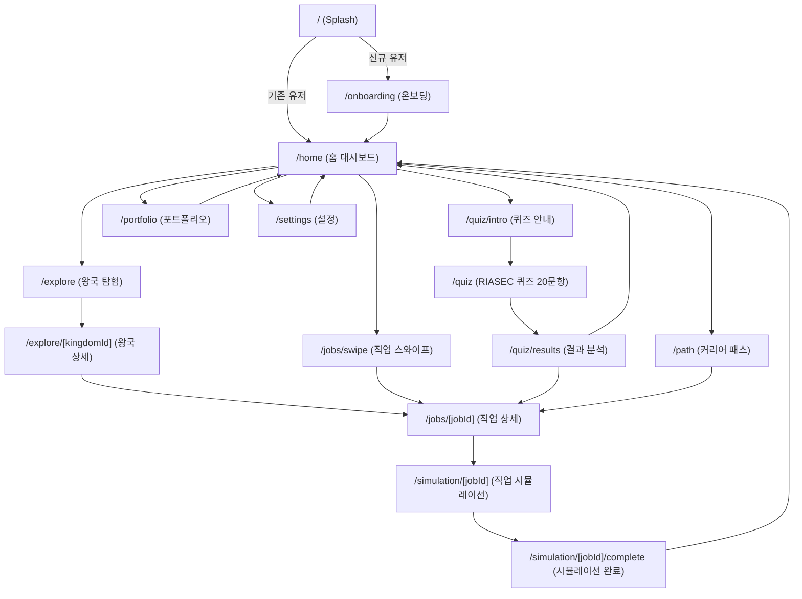
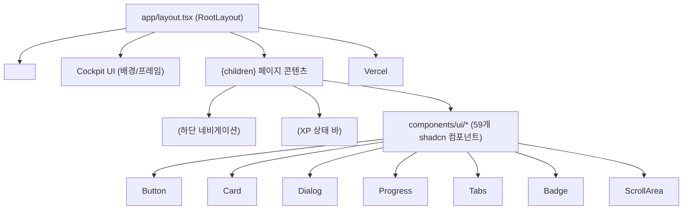
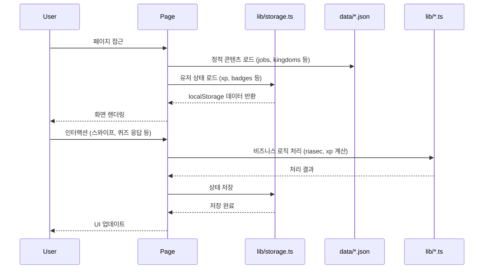

# AI Career Path — 사이트맵 & 페이지 구성도

> **프로젝트 개요**: 청소년 대상 AI 직업 탐색 RPG 앱 (Next.js App Router, 모바일 퍼스트 430px)  
> **테마**: 우주 탐험 × 직업 RPG  
> **최종 업데이트**: 2026-02-24

---

## 목차

1. [전체 사이트맵](#1-전체-사이트맵)
2. [라우팅 구조도](#2-라우팅-구조도)
3. [페이지별 구성도](#3-페이지별-구성도)
4. [컴포넌트 계층도](#4-컴포넌트-계층도)
5. [데이터 흐름도](#5-데이터-흐름도)
6. [상태 관리 구조](#6-상태-관리-구조)
7. [공통 레이아웃](#7-공통-레이아웃)

---

## 1. 전체 사이트맵



---

## 2. 라우팅 구조도

| 경로 | 페이지명 | 설명 | 접근 조건 |
|------|---------|------|----------|
| `/` | Splash | 로딩 애니메이션 + 리다이렉트 | 항상 접근 가능 |
| `/onboarding` | 온보딩 | 4슬라이드 앱 소개 | 신규 유저 |
| `/home` | 홈 대시보드 | XP바, 추천 직업, 일일 퀘스트 | 로그인 후 |
| `/quiz/intro` | 퀴즈 안내 | RIASEC 검사 소개 | 항상 접근 가능 |
| `/quiz` | 퀴즈 | 20문항 성향 분석 | `/quiz/intro` 이후 |
| `/quiz/results` | 퀴즈 결과 | RIASEC 유형 & 추천 직업 | 퀴즈 완료 후 |
| `/explore` | 왕국 탐험 | 8개 직업 왕국 목록 | 항상 접근 가능 |
| `/explore/[kingdomId]` | 왕국 상세 | 왕국 정보 + 소속 직업 목록 | 항상 접근 가능 |
| `/jobs/swipe` | 직업 스와이프 | 틴더식 직업 카드 스와이프 | 항상 접근 가능 |
| `/jobs/[jobId]` | 직업 상세 | L1~L4 탭별 직업 정보 | 항상 접근 가능 |
| `/simulation/[jobId]` | 시뮬레이션 | 직업 하루 체험 게임플레이 | 항상 접근 가능 |
| `/simulation/[jobId]/complete` | 시뮬레이션 완료 | 결과 요약 & XP 획득 | 시뮬레이션 완료 후 |
| `/path` | 커리어 패스 | 프로젝트 기반 진로 경로 | 항상 접근 가능 |
| `/portfolio` | 포트폴리오 | 여정·배지·통계 3탭 | 항상 접근 가능 |
| `/settings` | 설정 | 유저 정보 & 데이터 관리 | 항상 접근 가능 |

---

## 3. 페이지별 구성도

### 3-1. Splash Page `/`

```
┌────────────────────────────────────┐
│           [로고 애니메이션]           │
│         AI Career Path             │
│      [로딩 스피너 / 진행바]           │
│                                    │
│  → localStorage 확인               │
│     ├── 온보딩 완료 → /home         │
│     └── 신규 유저  → /onboarding   │
└────────────────────────────────────┘
```

**구성 요소**

| 영역 | 설명 |
|------|------|
| 로고 | 브랜드 로고 + 타이틀 텍스트 |
| 애니메이션 | CSS shimmer/float 효과 |
| 리다이렉트 로직 | `storage.user` 존재 여부로 분기 |

---

### 3-2. Onboarding Page `/onboarding`

```
┌────────────────────────────────────┐
│  [슬라이드 1/4] 우주 탐험 소개       │
│  [슬라이드 2/4] 직업 왕국 소개       │
│  [슬라이드 3/4] RIASEC 퀴즈 소개    │
│  [슬라이드 4/4] 포트폴리오 소개      │
│                                    │
│  ●○○○  [다음] / [시작하기]         │
└────────────────────────────────────┘
```

**구성 요소**

| 영역 | 설명 |
|------|------|
| 슬라이드 캐러셀 | 4단계 앱 기능 소개 |
| 페이지 인디케이터 | 현재 슬라이드 위치 표시 |
| CTA 버튼 | 다음 / 시작하기 |
| 완료 처리 | `storage.user` 초기화 후 `/home` 이동 |

---

### 3-3. Home Dashboard `/home`

```
┌────────────────────────────────────┐
│  [XP 바 컴포넌트]  Lv.3 ████░░ 70% │
│  안녕하세요, [이름]님!               │
├────────────────────────────────────┤
│  📌 오늘의 추천 직업                 │
│  ┌──────┐ ┌──────┐ ┌──────┐       │
│  │ 카드 │ │ 카드 │ │ 카드 │       │
│  └──────┘ └──────┘ └──────┘       │
├────────────────────────────────────┤
│  🎯 일일 퀘스트                      │
│  □ 직업 탐색 1개 완료                │
│  □ 시뮬레이션 1회 도전               │
│  □ 스와이프 5장 완료                 │
├────────────────────────────────────┤
│  📅 최근 활동 타임라인               │
│  [아이템1] [아이템2] [아이템3]...    │
└────────────────────────────────────┘
│  [홈]  [탐험]  [패스]  [포트폴리오] │  ← BottomTabBar
└────────────────────────────────────┘
```

**구성 요소**

| 영역 | 컴포넌트 | 데이터 소스 |
|------|---------|-----------|
| XP 바 | `<XpBar />` | `storage.xp` |
| 추천 직업 카드 | shadcn `<Card />` | `lib/recommendations.ts` |
| 일일 퀘스트 | `<Checkbox />` 리스트 | `storage.missions` |
| 활동 타임라인 | 커스텀 리스트 | `storage.timeline` |
| 하단 탭 | `<TabBar />` | 고정 라우트 |

---

### 3-4. Quiz Intro `/quiz/intro`

```
┌────────────────────────────────────┐
│  🔭 나를 알아가는 우주 탐험          │
│                                    │
│  RIASEC 검사란?                    │
│  [설명 텍스트 + 아이콘]             │
│                                    │
│  ⏱ 예상 소요시간: 5~10분            │
│  📋 총 20문항                       │
│                                    │
│      [지금 시작하기]                 │
└────────────────────────────────────┘
```

---

### 3-5. Quiz `/quiz`

```
┌────────────────────────────────────┐
│  [진행 바] ████████░░░░ 8/20       │
├────────────────────────────────────┤
│  Q8. 나는 새로운 아이디어를          │
│      떠올리는 것을 좋아한다.         │
├────────────────────────────────────┤
│  ① 매우 그렇다                      │
│  ② 그렇다                          │
│  ③ 보통이다                         │
│  ④ 그렇지 않다                      │
│  ⑤ 매우 그렇지 않다                 │
├────────────────────────────────────┤
│  [이전]              [다음] →      │
└────────────────────────────────────┘
```

**구성 요소**

| 영역 | 설명 |
|------|------|
| 진행 바 | `<Progress />` — 20문항 진행도 |
| 문항 표시 | `data/questions.json` 순서대로 |
| 선택지 | 5점 리커트 척도 라디오 버튼 |
| 저장 | 각 응답 `storage.riasec`에 누적 |
| 완료 | `lib/riasec.ts`로 점수 계산 → `/quiz/results` |

---

### 3-6. Quiz Results `/quiz/results`

```
┌────────────────────────────────────┐
│  🌟 당신의 유형: Artistic × Social  │
├────────────────────────────────────┤
│  [레이더 차트 - 6개 축 RIASEC]      │
├────────────────────────────────────┤
│  R ██░░ 45   A ████ 82             │
│  I ███░ 60   S ████ 78             │
│  E ██░░ 50   C █░░░ 30             │
├────────────────────────────────────┤
│  🎯 추천 직업 TOP 5                 │
│  ┌──────┐ ┌──────┐ ┌──────┐       │
│  │ 직업 │ │ 직업 │ │ 직업 │       │
│  └──────┘ └──────┘ └──────┘       │
├────────────────────────────────────┤
│  [직업 탐색하기]  [홈으로 돌아가기]  │
└────────────────────────────────────┘
```

**구성 요소**

| 영역 | 컴포넌트 | 설명 |
|------|---------|------|
| RIASEC 유형 | 텍스트 + 뱃지 | 상위 2개 유형 표시 |
| 레이더 차트 | `Recharts` RadarChart | 6개 축 점수 시각화 |
| 점수 바 | `<Progress />` | 각 유형별 점수 |
| 추천 직업 | `<Card />` 가로 스크롤 | `lib/recommendations.ts` 결과 |

---

### 3-7. Explore (왕국 탐험) `/explore`

```
┌────────────────────────────────────┐
│  🌌 직업 왕국 탐험                   │
├────────────────────────────────────┤
│  ┌──────┐  ┌──────┐  ┌──────┐     │
│  │ 🔭   │  │ 💻   │  │ 🎨   │     │
│  │과학   │  │기술   │  │예술   │     │
│  └──────┘  └──────┘  └──────┘     │
│  ┌──────┐  ┌──────┐  ┌──────┐     │
│  │ 🏥   │  │ ⚖️   │  │ 🏗️   │     │
│  │의료   │  │사회   │  │건축   │     │
│  └──────┘  └──────┘  └──────┘     │
│  ┌──────┐  ┌──────┐               │
│  │ 🎭   │  │ 🌿   │               │
│  │문화   │  │환경   │               │
│  └──────┘  └──────┘               │
└────────────────────────────────────┘
│  [홈]  [탐험]  [패스]  [포트폴리오] │
└────────────────────────────────────┘
```

**구성 요소**

| 영역 | 설명 |
|------|------|
| 왕국 그리드 | 8개 직업 왕국 카드 (2×4) |
| 왕국 카드 | 아이콘 + 이름 + 방문 여부 표시 |
| 데이터 | `data/kingdoms.json` |

---

### 3-8. Kingdom Detail `/explore/[kingdomId]`

```
┌────────────────────────────────────┐
│  ← 뒤로     💻 기술 왕국             │
├────────────────────────────────────┤
│  [왕국 배너 이미지]                  │
│  왕국 소개 텍스트...                 │
├────────────────────────────────────┤
│  🏰 이 왕국의 직업들                 │
│  ┌────────────────────────────┐    │
│  │ 👾 소프트웨어 개발자         │    │
│  │ 연봉 5,000~8,000만원        │    │
│  └────────────────────────────┘    │
│  ┌────────────────────────────┐    │
│  │ 🤖 AI 엔지니어              │    │
│  │ 연봉 6,000~1억원            │    │
│  └────────────────────────────┘    │
└────────────────────────────────────┘
```

---

### 3-9. Job Swipe `/jobs/swipe`

```
┌────────────────────────────────────┐
│  직업 탐색  [필터 ▼]               │
├────────────────────────────────────┤
│         ┌──────────────┐           │
│   ✕ ←  │  직업 카드    │  → ♡     │
│         │  [직업명]     │           │
│         │  [왕국 배지]  │           │
│         │  [한줄 설명]  │           │
│         └──────────────┘           │
│              [상세보기]              │
├────────────────────────────────────┤
│   [←관심없음]    [좋아요→]          │
└────────────────────────────────────┘
│  [홈]  [탐험]  [패스]  [포트폴리오] │
└────────────────────────────────────┘
```

**구성 요소**

| 영역 | 설명 |
|------|------|
| 스와이프 카드 | 드래그/버튼으로 좌우 스와이프 |
| 좋아요 | `storage.favorites`에 저장 |
| 관심없음 | `storage.swipes`에 기록 |
| 데이터 | `data/jobs.json` |

---

### 3-10. Job Detail `/jobs/[jobId]`

```
┌────────────────────────────────────┐
│  ← 뒤로   👾 소프트웨어 개발자  ♡  │
├────────────────────────────────────┤
│  [직업 대표 이미지]                  │
│  ┌─────────────────────────────┐   │
│  │ L1 │ L2 │ L3 │ L4          │   │  ← 탭 네비게이션
│  └─────────────────────────────┘   │
│  [탭 콘텐츠 영역]                   │
│  L1: 직업 기본 정보 (설명, 연봉 등)  │
│  L2: 필요 역량 & 자격증              │
│  L3: 하루 일과 타임라인             │
│  L4: 성장 경로 & 관련 학과          │
├────────────────────────────────────┤
│  [시뮬레이션 체험하기]               │
└────────────────────────────────────┘
```

**구성 요소**

| 탭 | 내용 |
|----|------|
| L1 기본 정보 | 직업명, 왕국, 연봉 범위, 핵심 업무 |
| L2 필요 역량 | 기술 스택, 자격증, 추천 역량 |
| L3 하루 일과 | 시간대별 업무 타임라인 |
| L4 성장 경로 | 신입→시니어 경로, 관련 학과 |

---

### 3-11. Simulation `/simulation/[jobId]`

```
┌────────────────────────────────────┐
│  🎮 [직업명] 체험 — Day 1           │
│  [시나리오 설명 텍스트]              │
├────────────────────────────────────┤
│  ┌────────────────────────────┐    │
│  │  [상황 카드]                │    │
│  │  "갑자기 버그가 발생했다.   │    │
│  │   어떻게 대처할까?"         │    │
│  └────────────────────────────┘    │
├────────────────────────────────────┤
│  선택지                             │
│  ① 즉시 코드를 수정한다            │
│  ② 팀장에게 보고한다               │
│  ③ 원인을 먼저 파악한다            │
│  ④ 사용자에게 양해를 구한다        │
├────────────────────────────────────┤
│  [진행] ████████░░░░ 3/8 시나리오  │
└────────────────────────────────────┘
```

**구성 요소**

| 영역 | 설명 |
|------|------|
| 시나리오 카드 | 상황 설명 텍스트 |
| 선택지 | 4개 분기 선택 |
| 진행 바 | 총 시나리오 수 대비 현재 진행도 |
| 결과 처리 | 선택에 따른 점수 누적 |
| 데이터 | `data/simulations.json` |

---

### 3-12. Simulation Complete `/simulation/[jobId]/complete`

```
┌────────────────────────────────────┐
│  🎉 시뮬레이션 완료!                │
│  [직업명] 하루 체험                 │
├────────────────────────────────────┤
│  📊 나의 결과                       │
│  적합도: ████████░░ 78%            │
│  의사결정: ██████░░░░ 65%          │
│  문제해결: █████████░ 85%          │
├────────────────────────────────────┤
│  🏆 획득 배지                       │
│  [배지 이미지] 초보 개발자           │
├────────────────────────────────────┤
│  +150 XP 획득!                      │
├────────────────────────────────────┤
│  [다시 하기]   [다른 직업 탐색]     │
└────────────────────────────────────┘
```

---

### 3-13. Path (커리어 패스) `/path`

```
┌────────────────────────────────────┐
│  🚀 나의 커리어 패스                │
│  [필터: 전체 / 관심 분야 / 추천]    │
├────────────────────────────────────┤
│  프로젝트 카드                      │
│  ┌────────────────────────────┐    │
│  │ 🛠 나만의 앱 만들기         │    │
│  │ 난이도: ★★★☆☆            │    │
│  │ 예상 기간: 4주              │    │
│  │ [시작하기]                  │    │
│  └────────────────────────────┘    │
│  ┌────────────────────────────┐    │
│  │ 🎨 포트폴리오 사이트 제작   │    │
│  │ 난이도: ★★☆☆☆            │    │
│  │ 예상 기간: 2주              │    │
│  │ [시작하기]                  │    │
│  └────────────────────────────┘    │
└────────────────────────────────────┘
│  [홈]  [탐험]  [패스]  [포트폴리오] │
└────────────────────────────────────┘
```

**구성 요소**

| 영역 | 설명 |
|------|------|
| 필터 탭 | 전체 / 관심 분야 / 추천 |
| 프로젝트 카드 | 제목, 난이도, 기간, CTA |
| 데이터 | `data/projects.json`, `data/career-paths.json` |

---

### 3-14. Portfolio `/portfolio`

```
┌────────────────────────────────────┐
│  📚 나의 포트폴리오                 │
│  ┌──────┬──────┬──────┐           │
│  │ 여정 │ 배지 │ 통계 │           │  ← 탭
│  └──────┴──────┴──────┘           │
├────────────────────────────────────┤
│  [여정 탭]                          │
│  탐색한 직업, 완료한 시뮬레이션 목록  │
│                                    │
│  [배지 탭]                          │
│  획득 배지 그리드 (잠금/해제)        │
│                                    │
│  [통계 탭]                          │
│  활동 차트, 탐색 분야 분포 파이차트  │
└────────────────────────────────────┘
│  [홈]  [탐험]  [패스]  [포트폴리오] │
└────────────────────────────────────┘
```

**구성 요소**

| 탭 | 내용 | 데이터 소스 |
|----|------|-----------|
| 여정 | 시간순 활동 로그 | `storage.timeline` |
| 배지 | 배지 달성 현황 | `storage.badges`, `data/badges.json` |
| 통계 | 활동 통계 차트 | `storage.xp`, `storage.simulations` |

---

### 3-15. Settings `/settings`

```
┌────────────────────────────────────┐
│  ⚙️ 설정                            │
├────────────────────────────────────┤
│  👤 프로필                          │
│  이름 변경, 아바타 선택              │
├────────────────────────────────────┤
│  🎨 테마                            │
│  다크 / 라이트 모드                 │
├────────────────────────────────────┤
│  🔔 알림                            │
│  일일 퀘스트 알림 ON/OFF            │
├────────────────────────────────────┤
│  📤 데이터 관리                      │
│  데이터 내보내기 / 초기화            │
├────────────────────────────────────┤
│  ℹ️ 앱 정보                          │
│  버전, 개인정보처리방침, 문의        │
└────────────────────────────────────┘
```

---

## 4. 컴포넌트 계층도



### 공통 컴포넌트 목록

| 컴포넌트 | 경로 | 사용 위치 |
|---------|------|---------|
| `<TabBar />` | `components/tab-bar.tsx` | Home, Explore, Path, Portfolio |
| `<XpBar />` | `components/xp-bar.tsx` | Home |
| `<ThemeProvider />` | `components/theme-provider.tsx` | RootLayout |
| `components/ui/*` | `components/ui/` | 전 페이지 |

---

## 5. 데이터 흐름도



---

## 6. 상태 관리 구조

> 전역 상태 관리 라이브러리 없이 `localStorage` 기반으로 동작

| 스토어 키 | 타입 | 설명 | 관련 페이지 |
|----------|------|------|-----------|
| `storage.user` | `User` | 유저 프로필, 이름 | Splash, Settings |
| `storage.riasec` | `RiasecResult` | 퀴즈 답변 & 결과 | Quiz, Quiz Results |
| `storage.xp` | `XpData` | 경험치, 레벨 | Home, Simulation |
| `storage.swipes` | `SwipeLog[]` | 스와이프 이력 | Job Swipe |
| `storage.favorites` | `string[]` | 좋아요한 직업 ID | Job Swipe, Portfolio |
| `storage.simulations` | `SimulationLog[]` | 시뮬레이션 완료 이력 | Simulation |
| `storage.kingdoms` | `KingdomProgress` | 왕국 탐험 진도 | Explore |
| `storage.badges` | `Badge[]` | 획득 배지 목록 | Portfolio |
| `storage.timeline` | `TimelineItem[]` | 활동 타임라인 | Home, Portfolio |
| `storage.careerPaths` | `CareerPath[]` | 저장된 커리어 경로 | Path |
| `storage.missions` | `Mission[]` | 일일 미션 상태 | Home |
| `storage.portfolio` | `PortfolioData` | 포트폴리오 데이터 | Portfolio |
| `storage.camp` | `CampProgress` | 위클리 캠프 진도 | Path |

---

## 7. 공통 레이아웃

### Root Layout 구조 (`app/layout.tsx`)

```
┌─── 최대 430px 컨테이너 ───────────────┐
│ ┌─ 코너 프레임 (좌상)                  │
│ │     우주 코드 파티클 배경             │
│ │  ┌─────────────────────────────┐   │
│ │  │                             │   │
│ │  │       {children}            │   │
│ │  │     (페이지 콘텐츠)          │   │
│ │  │                             │   │
│ │  └─────────────────────────────┘   │
│ └─ 코너 프레임 (우하)                  │
│   [사이드 상태 인디케이터]             │
│   [플로팅 별 애니메이션]               │
└────────────────────────────────────────┘
```

**레이아웃 특성**

| 속성 | 값 |
|------|-----|
| 최대 너비 | 430px (모바일 퍼스트) |
| 기본 테마 | 다크 모드 |
| 배경 | 우주/코드 파티클 애니메이션 |
| 폰트 | Pretendard |
| 분석 | Vercel Analytics |

---

## 파일 구조 요약

```
frontend/
├── app/                     # Next.js App Router 페이지
│   ├── layout.tsx           # 루트 레이아웃
│   ├── page.tsx             # / Splash
│   ├── globals.css          # 전역 스타일 & 애니메이션
│   ├── home/page.tsx        # /home 대시보드
│   ├── onboarding/page.tsx  # /onboarding
│   ├── quiz/
│   │   ├── page.tsx         # /quiz
│   │   ├── intro/page.tsx   # /quiz/intro
│   │   └── results/page.tsx # /quiz/results
│   ├── explore/
│   │   ├── page.tsx         # /explore
│   │   └── [kingdomId]/page.tsx
│   ├── jobs/
│   │   ├── swipe/page.tsx   # /jobs/swipe
│   │   └── [jobId]/page.tsx # /jobs/[jobId]
│   ├── simulation/
│   │   └── [jobId]/
│   │       ├── page.tsx     # /simulation/[jobId]
│   │       └── complete/page.tsx
│   ├── path/page.tsx        # /path
│   ├── portfolio/page.tsx   # /portfolio
│   └── settings/page.tsx   # /settings
├── components/
│   ├── tab-bar.tsx          # 하단 탭 네비게이션
│   ├── xp-bar.tsx           # XP 바
│   ├── theme-provider.tsx   # 테마 컨텍스트
│   └── ui/                  # shadcn/ui 컴포넌트 (59개)
├── lib/
│   ├── storage.ts           # localStorage API 래퍼
│   ├── types.ts             # TypeScript 타입 정의
│   ├── xp.ts                # XP/레벨 시스템
│   ├── riasec.ts            # RIASEC 점수 계산
│   ├── recommendations.ts   # 직업 추천 알고리즘
│   ├── project-storage.ts   # 프로젝트 스토리지
│   └── utils.ts             # 유틸리티 함수
├── hooks/
│   ├── use-mobile.ts        # 모바일 감지
│   └── use-toast.ts         # 토스트 알림
└── data/                    # 정적 JSON 데이터
    ├── jobs.json
    ├── kingdoms.json
    ├── questions.json
    ├── simulations.json
    ├── badges.json
    ├── career-paths.json
    ├── projects.json
    ├── levels.json
    ├── virtual-pass.json
    └── weekly-camp.json
```

커버된 페이지 (15개)
```
/ → /onboarding → /home → /quiz/intro → /quiz → /quiz/results → /explore → /explore/[kingdomId] → /jobs/swipe → /jobs/[jobId] → /simulation/[jobId] → /simulation/[jobId]/complete → /path → /portfolio → /settings
```