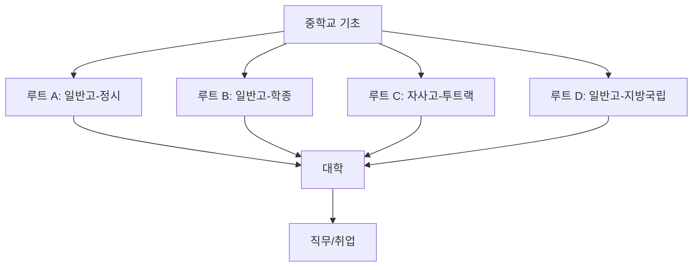

# 일반 루트 입시 전략 맵

중학생이 가장 많이 선택하는 일반 루트(A~D)를 빠르게 비교합니다.

## 루트 구조

## 루트별 요약

| 루트 | 강점 | 핵심 준비 | 리스크 |
| --- | --- | --- | --- |
| A 정시 | 수능 성적이 강하면 역전 가능 | 고1부터 기출·모평 루틴 | 정시 변동성 큼 |
| B 학종 | 내신/활동이 꾸준하면 유리 | 세특 스토리 일관성 | 활동만 많고 연결 약하면 불리 |
| C 투트랙 | 수시+정시 동시 대응 | 시간관리, 내신·수능 균형 | 둘 다 어중간해질 위험 |
| D 지방국립 | 안정적 진학·지역 정착 강점 | 내신 2~3등급 유지 | 상위권 수도권 진학은 제한 |

## 중학생 실행 체크

- 중1~중2: 국영수 기본기 + 탐구 독해 습관
- 중3 상반기: 희망 루트 1순위/2순위 확정
- 중3 하반기: 학교 유형 선택 기준(학습강도, 통학, 내신경쟁) 점검
