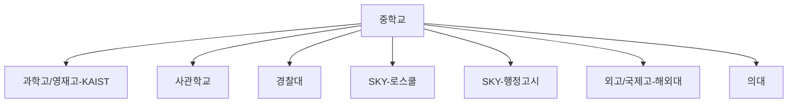

# 특수 루트 입시 전략 맵

소수 정예 루트(E~K)의 요구 역량과 준비 시점을 정리합니다.

## 루트 구조

## 특수 루트 공통 원칙

| 원칙 | 설명 |
| --- | --- |
| 조기 시작 | 중학교 단계에서 시험·면접·체력 기준 파악 |
| 증거 기반 기록 | 단순 활동 나열보다 결과물(보고서·수상·포트폴리오) |
| 리스크 플랜 | 1순위 실패 시 2순위 루트 동시 설계 |

## 루트별 핵심 관문

- **E 과학고/영재고**: 수학·과학 심화, R&E, 연구역량
- **F 사관학교**: 필기 + 체력 + 면접, 생활기록의 성실성
- **G 경찰대**: 필기·수능·체력·면접 복합 평가
- **H 로스쿨**: 학점, LEET, 영어성적, 자기소개서
- **I 행정고시**: PSAT·논문형 답안·면접 장기전
- **J 해외대**: GPA, SAT/TOEFL, 에세이·활동 스토리
- **K 의대**: 내신/수능 최상위권 + 면접 대비
