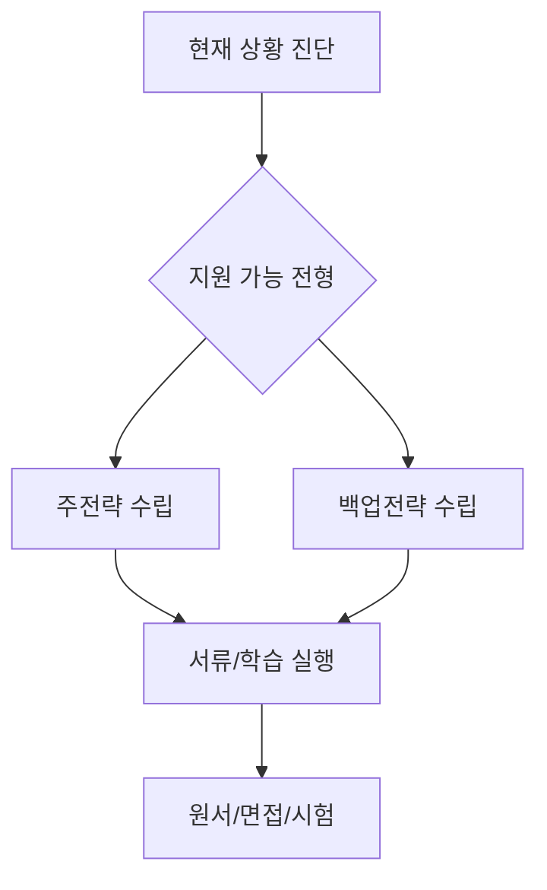

# 특수 상황 루트 가이드

재수/N수, 검정고시, 기회균형, 장애인 특별전형 상황별 대응 전략입니다.

## 상황별 핵심 대응

| 상황 | 우선 전략 | 보조 전략 |
| --- | --- | --- |
| 재수/N수 | 약점 과목 집중 + 모평 기반 수정 | 반수/편입 플랜 병행 |
| 검정고시 | 정시·논술 중심 설계 | 해외대 전형 병행 |
| 기회균형 | 자격요건/증빙 선확인 | 장학제도 동시 신청 |
| 장애인 특별전형 | 대학별 전형 방식 확인 | 면접 편의제공 신청 |

## 흐름도

## 실수 방지

- 자격 증빙 서류 마감일을 캘린더로 관리
- 전형명은 같아도 대학별 반영비율이 다름
