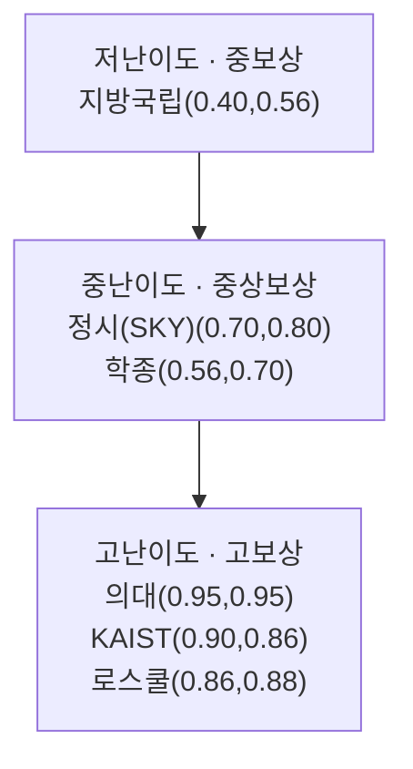

# 루트별 난이도·보상 비교

루트별 준비 난이도와 10년차 보상 수준을 비교해 선택 우선순위를 잡습니다.

## 난이도 × 보상 매트릭스

## 의사결정 표

| 루트 | 난이도 | 10년차 보상 | 안정성 |
| --- | --- | --- | --- |
| 의대 | 매우 높음 | 매우 높음 | 높음 |
| KAIST | 매우 높음 | 높음~매우 높음 | 중간 |
| 정시(SKY) | 높음 | 높음 | 중간 |
| 학종(중상위권) | 중간 | 중간~높음 | 중간 |
| 지방국립 | 중간 이하 | 중간 | 높음 |

## 활용 팁

- 1순위 루트 1개 + 2순위 백업 루트 1개를 동시에 설계하세요.
