# 학년별 실행 타임라인

중학교부터 고3까지 공통 실행 흐름을 한 번에 확인합니다.

```mermaid
gantt
  title 고입-대입 연결 실행 타임라인
  dateFormat X
  axisFormat 학년
  section 중학교
  기초역량 축적: 0, 3
  학교유형 탐색: 1, 3
  section 고등학교
  내신/활동 구축: 3, 3
  수능 심화 전환: 4, 2
  원서/면접/정시: 5, 1
```

## 실행 포인트

| 구간 | 핵심 행동 | 산출물 |
| --- | --- | --- |
| 중1~중2 | 기본기+독서 습관 | 월간 학습 리포트 |
| 중3 | 루트 선택 | 고교 선택 체크리스트 |
| 고1 | 내신/활동 구조화 | 세특 중심 기록 |
| 고2 | 루트별 심화 | 지원군(상향/적정/안정) |
| 고3 | 입시 실행 | 원서 전략표 |

## 운영 원칙

- 분기별로 목표를 1개만 핵심 KPI로 둡니다.
- 월말에 루트 유지/수정 결정을 내립니다.
