# 커리어 패스 (Career Path) — 기능 문서

> **경로**: `frontend/app/career/`  
> **프레임워크**: Next.js 16 App Router · TypeScript · Tailwind CSS v4 · Framer Motion

---

## 목차

1. [개요](#1-개요)
2. [전체 아키텍처](#2-전체-아키텍처)
3. [파일 구조](#3-파일-구조)
4. [데이터 구조 (TypeScript 타입)](#4-데이터-구조)
5. [커리어 패스 구축 알고리즘](#5-커리어-패스-구축-알고리즘)
6. [커뮤니티 시스템](#6-커뮤니티-시스템)
7. [댓글·코멘트 시스템](#7-댓글코멘트-시스템)
8. [신고 시스템](#8-신고-시스템)
9. [뱃지·시간 표시 시스템](#9-뱃지시간-표시-시스템)
10. [하트·즐겨찾기·리액션 시스템](#10-하트즐겨찾기리액션-시스템)
11. [공유 설정 시스템](#11-공유-설정-시스템)
12. [유저 시나리오](#12-유저-시나리오)
13. [순서도 (Mermaid)](#13-순서도-mermaid)
14. [컴포넌트 Props 명세](#14-컴포넌트-props-명세)
15. [설정 파일 & JSON 데이터](#15-설정-파일--json-데이터)
16. [localStorage 키 목록](#16-localstorage-키-목록)
17. [추후 백엔드 연동 포인트](#17-추후-백엔드-연동-포인트)

---

## 1. 개요

커리어 패스 기능은 학생이 자신의 진로 로드맵을 **직접 설계**하고, 학교 커뮤니티 안에서 **공유·탐색·소통**할 수 있는 핵심 기능입니다.

| 기능 | 설명 |
|------|------|
| 커리어 패스 만들기 | 왕국(별) → 직업 → 학년별 계획 4단계 위자드로 나만의 로드맵 생성 |
| 탐색 | 공식/커뮤니티 커리어 패스 템플릿 탐색 및 즐겨찾기 |
| 내 패스 | 내가 만든 커리어 패스를 타임라인으로 시각화·인라인 편집·전체 수정 |
| 커뮤니티 | 학교 공간 / 그룹에서 커리어 패스 공유·탐색·소통 |
| 댓글·대댓글 | 공유 패스에 트리 구조 댓글, 운영자/일반 역할 구분 |
| 신고 | 콘텐츠·댓글 3단계 신고 (사유 선택 → 상세 입력 → 완료) |
| 뱃지 | NEW (24h), 확인 필요 (1주일+), 수정됨 표시 |
| 리액션 | 좋아요·즐겨찾기 localStorage 영속, base+delta 카운트 |

---

## 2. 전체 아키텍처

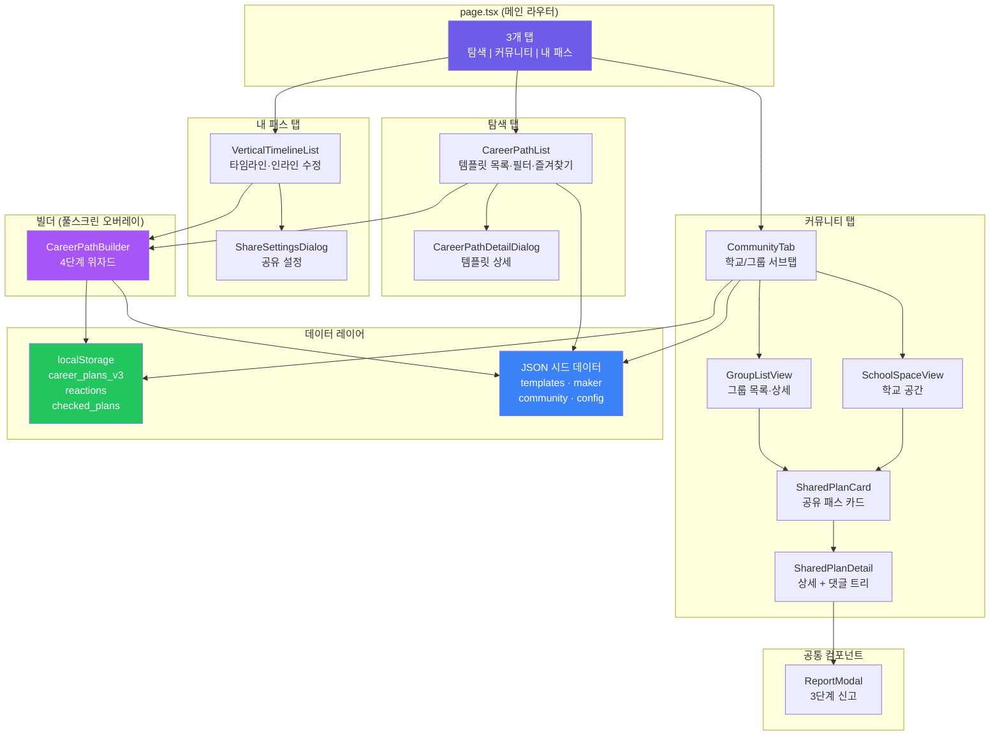
```mermaid
graph TB
    subgraph "page.tsx (메인 라우터)"
        TABS["3개 탭<br/>탐색 | 커뮤니티 | 내 패스"]
    end

    subgraph "탐색 탭"
        CPL["CareerPathList<br/>템플릿 목록·필터·즐겨찾기"]
        CPDD["CareerPathDetailDialog<br/>템플릿 상세"]
    end

    subgraph "커뮤니티 탭"
        CT["CommunityTab<br/>학교/그룹 서브탭"]
        SSV["SchoolSpaceView<br/>학교 공간"]
        GLV["GroupListView<br/>그룹 목록·상세"]
        SPCR["SharedPlanCard<br/>공유 패스 카드"]
        SPDD["SharedPlanDetail<br/>상세 + 댓글 트리"]
    end

    subgraph "내 패스 탭"
        VTL["VerticalTimelineList<br/>타임라인·인라인 수정"]
        SSD["ShareSettingsDialog<br/>공유 설정"]
    end

    subgraph "빌더 (풀스크린 오버레이)"
        CPB["CareerPathBuilder<br/>4단계 위자드"]
    end

    subgraph "공통 컴포넌트"
        RM["ReportModal<br/>3단계 신고"]
    end

    subgraph "데이터 레이어"
        LS["localStorage<br/>career_plans_v3<br/>reactions<br/>checked_plans"]
        JSON["JSON 시드 데이터<br/>templates · maker<br/>community · config"]
    end

    TABS --> CPL
    TABS --> CT
    TABS --> VTL
    CPL --> CPDD
    CT --> SSV
    CT --> GLV
    SSV --> SPCR
    GLV --> SPCR
    SPCR --> SPDD
    SPDD --> RM
    VTL --> SSD
    VTL --> CPB
    CPL --> CPB
    CPB --> LS
    CT --> LS
    CPL --> JSON
    CT --> JSON
    CPB --> JSON

    style TABS fill:#6C5CE7,color:#fff
    style CPB fill:#a855f7,color:#fff
    style LS fill:#22C55E,color:#fff
    style JSON fill:#3B82F6,color:#fff
```

---

## 3. 파일 구조

```
frontend/app/career/
├── page.tsx                                # 메인 페이지 (탭 라우팅, 빌더 관리)
├── config.ts                               # JSON 기반 설정 로더
├── README.md                               # 이 문서
├── 커뮤니티_학교공간_그룹_운영자_설계.md       # 커뮤니티 설계서
│
├── components/
│   ├── CareerPathList.tsx                  # 탐색 탭 (템플릿 목록 + 즐겨찾기)
│   ├── CareerPathBuilder.tsx               # 빌더 4단계 위자드
│   ├── CareerPathDetailDialog.tsx          # 템플릿 상세 다이얼로그
│   ├── CareerPathSelector.tsx              # 내 패스 선택 드롭다운
│   ├── CareerPathTimeline.tsx              # 단일 패스 타임라인 렌더러
│   ├── CareerPathTimelinePreview.tsx       # 빌더 Step4 미리보기
│   ├── VerticalTimelineList.tsx            # 내 패스 탭 (인라인/전체 수정)
│   ├── ItemDetailDialog.tsx                # 항목 상세 다이얼로그
│   ├── GoalTemplateSelector.tsx            # 목표 템플릿 선택 바텀시트
│   ├── ReportModal.tsx                     # 3단계 신고 모달
│   │
│   └── community/                          # 커뮤니티 서브시스템
│       ├── index.ts                        # barrel export
│       ├── types.ts                        # TypeScript 인터페이스
│       ├── formatTime.ts                   # 시간 포맷 유틸
│       ├── CommunityTab.tsx                # 학교/그룹 탭 + 상태 관리
│       ├── SchoolSpaceView.tsx             # 학교 공간 뷰
│       ├── GroupListView.tsx               # 그룹 목록·상세·생성
│       ├── SharedPlanCardWithReactions.tsx  # 공유 패스 카드 (뱃지 포함)
│       ├── SharedPlanDetailDialog.tsx       # 공유 패스 상세 + 댓글 트리
│       └── ShareSettingsDialog.tsx          # 공유 설정 바텀시트
```

### 데이터 파일 (`frontend/data/`)

| 파일 | 역할 | 사용 위치 |
|------|------|-----------|
| `career-path-templates.json` | 커리어 패스 템플릿 목록 | `CareerPathList`, `CareerPathDetailDialog` |
| `career-content.json` | UI 라벨·메시지 | `config.ts` → LABELS |
| `career-config.json` | 색상, itemTypes, gradeYears, starFilters, routes | `config.ts` |
| `career-maker.json` | 빌더용 왕국·직업·careerItems | `CareerPathBuilder` |
| `portfolio-items.json` | 왕국별 포트폴리오 추천 항목 | `CareerPathBuilder` (AddItemSheet) |
| `share-community.json` | 학교·그룹·공유 패스·댓글 시드 + meta.ui 라벨 | `CommunityTab`, `CareerPathList` |
| `goal-templates.json` | 목표 템플릿 목록 | `GoalTemplateSelector` |
| `report-reasons.json` | 신고 사유 (콘텐츠/댓글별) | `ReportModal` |

---

## 4. 데이터 구조

### 4-1. CareerPlan — 내 커리어 패스

```typescript
type CareerPlan = {
  id: string;
  starId: string;        // 왕국 ID (예: 'tech')
  starName: string;
  starEmoji: string;
  starColor: string;     // 왕국 테마 색상 (hex)
  jobId: string;
  jobName: string;
  jobEmoji: string;
  title: string;
  createdAt: string;     // ISO
  years: YearPlan[];
  isPublic?: boolean;
  shareType?: string;    // 'public' | 'operator'
  sharedAt?: string;
};

type YearPlan = {
  gradeId: string;       // 'elem4', 'mid1', 'high2' 등
  gradeLabel: string;
  goals: string[];
  items: PlanItem[];
  groups?: PlanGroup[];  // 1학기, 여름방학 등
};

type PlanItem = {
  id: string;
  type: 'activity' | 'award' | 'portfolio' | 'certification';
  title: string;
  months: number[];      // 다중 월 선택
  difficulty: number;    // 1~5
  cost: string;
  organizer: string;
  custom?: boolean;
};
```

### 4-2. SharedPlan — 커뮤니티 공유 패스

```typescript
interface SharedPlan {
  id: string;
  planId: string;
  ownerId: string;
  ownerName: string;
  ownerEmoji: string;
  ownerGrade: string;
  schoolId: string;
  shareType: 'public' | 'operator';
  title: string;
  jobEmoji: string;
  jobName: string;
  starName: string;
  starEmoji: string;
  starColor: string;
  yearCount: number;
  itemCount: number;
  sharedAt: string;
  updatedAt?: string;    // 코멘트·수정 시 갱신
  likes: number;
  bookmarks: number;
  years: SharedPlanYear[];
  operatorComments: OperatorComment[];
  groupIds: string[];
}
```

### 4-3. 댓글 타입 (트리 구조)

```typescript
interface OperatorComment {
  id: string;
  parentId?: string;     // 없으면 최상위, 있으면 대댓글
  authorId: string;
  authorName: string;
  authorEmoji: string;
  authorRole: 'operator' | 'peer';
  content: string;
  createdAt: string;
}

interface OperatorCommentNode extends OperatorComment {
  replies: OperatorCommentNode[];  // 재귀 트리
}
```

### 4-4. 커뮤니티 구조체

```typescript
interface School {
  id: string;
  name: string;
  code: string;          // 참여 코드 (예: FUTURE2024)
  operatorId: string;
  operatorName: string;
  operatorEmoji: string;
  grades: string[];
  memberCount: number;
  createdAt: string;
  updatedAt?: string;
}

interface CommunityGroup {
  id: string;
  name: string;
  emoji: string;
  description: string;
  color: string;
  creatorId: string;
  creatorName: string;
  memberCount: number;
  members: GroupMember[];
  sharedPlanCount: number;
  createdAt: string;
  updatedAt?: string;
}
```

---

## 5. 커리어 패스 구축 알고리즘

### 5-1. 4단계 빌더 위자드

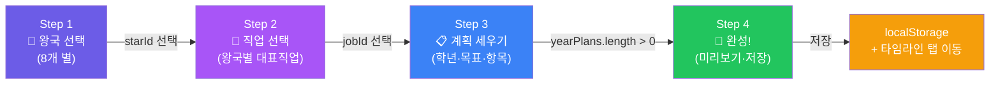
```mermaid
graph LR
    S1["Step 1<br/>🌟 왕국 선택<br/>(8개 별)"]
    S2["Step 2<br/>🎯 직업 선택<br/>(왕국별 대표직업)"]
    S3["Step 3<br/>📋 계획 세우기<br/>(학년·목표·항목)"]
    S4["Step 4<br/>🎉 완성!<br/>(미리보기·저장)"]

    S1 -->|"starId 선택"| S2
    S2 -->|"jobId 선택"| S3
    S3 -->|"yearPlans.length > 0"| S4
    S4 -->|"저장"| SAVE["localStorage<br/>+ 타임라인 탭 이동"]

    style S1 fill:#6C5CE7,color:#fff
    style S2 fill:#a855f7,color:#fff
    style S3 fill:#3B82F6,color:#fff
    style S4 fill:#22C55E,color:#fff
    style SAVE fill:#F59E0B,color:#fff
```

### 5-2. 진행 가능 조건

| Step | 조건 | 설명 |
|------|------|------|
| 1 | `!!starId` | 왕국 1개 선택 필수 |
| 2 | `!!jobId` | 직업 1개 선택 필수 |
| 3 | `yearPlans.length > 0` | 학년 1개 이상 추가 필수 |
| 4 | `true` | 항상 저장 가능 |

### 5-3. Step 3 — 학년별 계획 구조

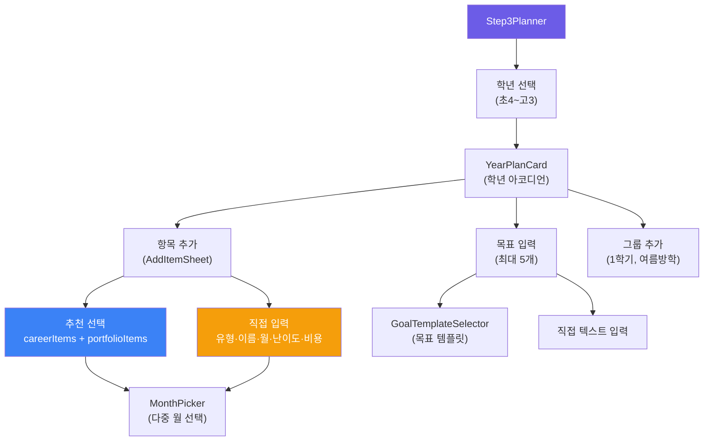
```mermaid
graph TD
    SP["Step3Planner"]
    GP["학년 선택<br/>(초4~고3)"]
    YPC["YearPlanCard<br/>(학년 아코디언)"]
    GOAL["목표 입력<br/>(최대 5개)"]
    ITEM["항목 추가<br/>(AddItemSheet)"]
    GRP["그룹 추가<br/>(1학기, 여름방학)"]

    SP --> GP
    GP --> YPC
    YPC --> GOAL
    YPC --> ITEM
    YPC --> GRP

    ITEM --> PICK["추천 선택<br/>careerItems + portfolioItems"]
    ITEM --> CUSTOM["직접 입력<br/>유형·이름·월·난이도·비용"]
    PICK --> MONTH["MonthPicker<br/>(다중 월 선택)"]
    CUSTOM --> MONTH

    GOAL --> TEMPLATE["GoalTemplateSelector<br/>(목표 템플릿)"]
    GOAL --> DIRECT["직접 텍스트 입력"]

    style SP fill:#6C5CE7,color:#fff
    style PICK fill:#3B82F6,color:#fff
    style CUSTOM fill:#F59E0B,color:#fff
```

### 5-4. 항목 추가 알고리즘 (AddItemSheet)

| 모드 | 데이터 소스 | 설명 |
|------|------------|------|
| 추천 선택 (`pick`) | `careerMaker.careerItems` + `portfolioItems` | 왕국별 추천 항목 병합 → 타입 필터 → 선택 → 월 지정 |
| 직접 입력 (`custom`) | 사용자 입력 | 유형·이름·월·난이도·비용·주관 직접 입력 |

### 5-5. 템플릿 → 패스 변환 알고리즘

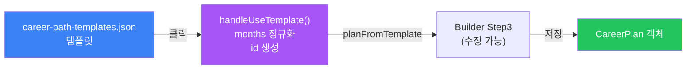
```mermaid
graph LR
    TPL["career-path-templates.json<br/>템플릿"]
    CONV["handleUseTemplate()<br/>months 정규화<br/>id 생성"]
    PLAN["CareerPlan 객체"]
    BUILD["Builder Step3<br/>(수정 가능)"]

    TPL -->|"클릭"| CONV
    CONV -->|"planFromTemplate"| BUILD
    BUILD -->|"저장"| PLAN

    style TPL fill:#3B82F6,color:#fff
    style CONV fill:#a855f7,color:#fff
    style PLAN fill:#22C55E,color:#fff
```

### 5-6. 수정 모드 비교

| 모드 | 트리거 | 진입 Step | 범위 |
|------|--------|----------|------|
| **부분 수정** (인라인) | VerticalTimelineList "수정하기" | - | 제목·항목 인라인 편집 |
| **전체 수정** (빌더) | "전체 수정" 버튼 | Step 3 | 왕국·직업·학년·항목 전체 |

### 5-7. 저장 알고리즘

```typescript
handleSave():
  // 학년 순서 정렬 (초4→초5→...→고3)
  gradeOrder = GRADE_YEARS.reduce((acc, g, i) => { acc[g.id] = i; ... })
  plan.years.sort((a, b) => gradeOrder[a.gradeId] - gradeOrder[b.gradeId])

  // 저장 → localStorage → 타임라인 탭 이동
  onSave(plan) → page.tsx savePlan()
```

---

## 6. 커뮤니티 시스템

### 6-1. 서브탭 구조

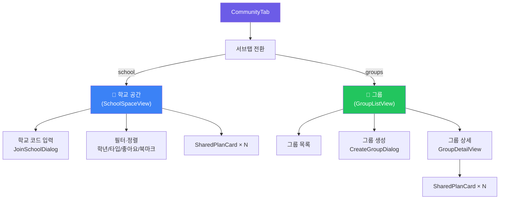
```mermaid
graph TB
    CT["CommunityTab"]
    ST["서브탭 전환"]
    SCHOOL["🏫 학교 공간<br/>(SchoolSpaceView)"]
    GROUP["👥 그룹<br/>(GroupListView)"]

    CT --> ST
    ST -->|"school"| SCHOOL
    ST -->|"groups"| GROUP

    SCHOOL --> JOIN["학교 코드 입력<br/>JoinSchoolDialog"]
    SCHOOL --> FILTER["필터·정렬<br/>학년/타입/좋아요/북마크"]
    SCHOOL --> CARDS["SharedPlanCard × N"]

    GROUP --> GLIST["그룹 목록"]
    GROUP --> GCREATE["그룹 생성<br/>CreateGroupDialog"]
    GROUP --> GDETAIL["그룹 상세<br/>GroupDetailView"]
    GDETAIL --> CARDS2["SharedPlanCard × N"]

    style CT fill:#6C5CE7,color:#fff
    style SCHOOL fill:#3B82F6,color:#fff
    style GROUP fill:#22C55E,color:#fff
```

### 6-2. 학교 공간 vs 그룹 비교

| 구분 | 학교 공간 (School Space) | 그룹 (Group) |
|------|--------------------------|--------------|
| **성격** | 인증·승인 기반 공간 | 자유 생성·참여 공간 |
| **참여 방식** | 학교 코드 입력 | 초대 코드/링크 |
| **운영자** | 진로 교사 (승인된 1명) | 그룹 생성자 |
| **공유 범위** | 같은 학교 학생 + 운영자 | 그룹 멤버만 |
| **운영자 공유** | 지원 (선생님만 열람) | 지원 (그룹 운영자만 열람) |
| **생성** | 플랫폼 승인 필요 | 누구나 즉시 생성 |

### 6-3. 학교 참여 알고리즘

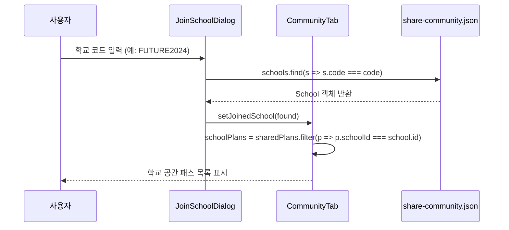
```mermaid
sequenceDiagram
    participant U as 사용자
    participant JSD as JoinSchoolDialog
    participant CT as CommunityTab
    participant JSON as share-community.json

    U->>JSD: 학교 코드 입력 (예: FUTURE2024)
    JSD->>JSON: schools.find(s => s.code === code)
    JSON-->>JSD: School 객체 반환
    JSD->>CT: setJoinedSchool(found)
    CT->>CT: schoolPlans = sharedPlans.filter(p => p.schoolId === school.id)
    CT-->>U: 학교 공간 패스 목록 표시
```

### 6-4. 학교 공간 필터·정렬

| 필터 | 옵션 |
|------|------|
| 정렬 | 최신 (`sharedAt`) · 갱신 (`updatedAt`) · 좋아요 · 북마크 |
| 공유 타입 | 전체 · 전체 공유 · 운영자 공유 |
| 학년 | 전체 · 초4~고3 |
| 검색 | 제목·직업명·소유자 이름 |

### 6-5. 그룹 시스템

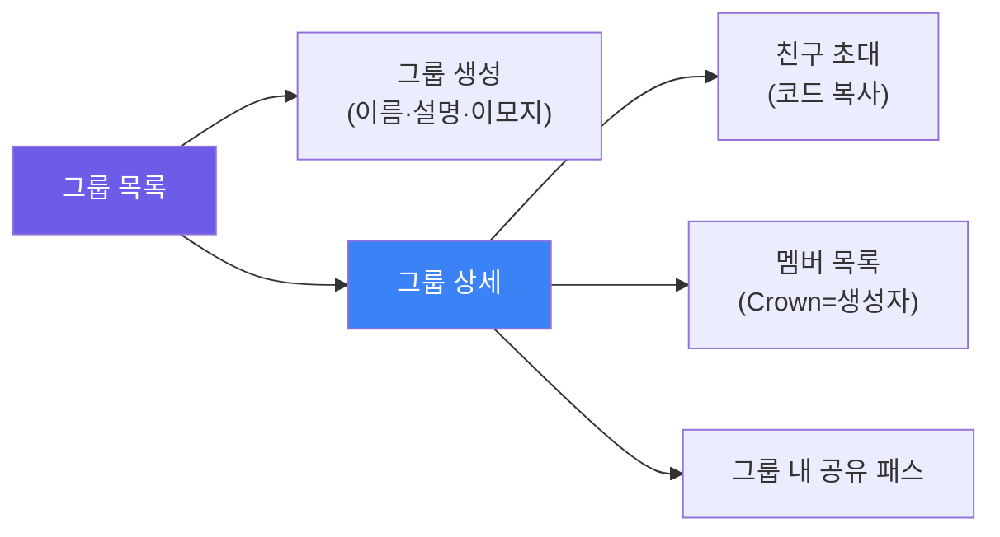
```mermaid
graph LR
    GL["그룹 목록"]
    GC["그룹 생성<br/>(이름·설명·이모지)"]
    GD["그룹 상세"]
    INV["친구 초대<br/>(코드 복사)"]
    MEM["멤버 목록<br/>(Crown=생성자)"]
    PLANS["그룹 내 공유 패스"]

    GL --> GC
    GL --> GD
    GD --> INV
    GD --> MEM
    GD --> PLANS

    style GL fill:#6C5CE7,color:#fff
    style GD fill:#3B82F6,color:#fff
```

**그룹 내 패스 필터링**:
```typescript
groupPlans = sharedPlans.filter(p => p.groupIds.includes(group.id))
```

---

## 7. 댓글·코멘트 시스템

### 7-1. 트리 구조 변환 알고리즘

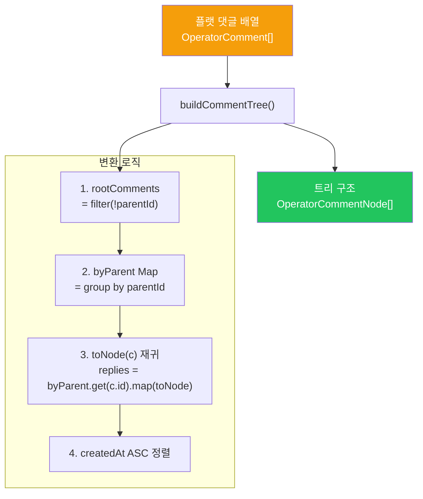
```mermaid
graph TD
    FLAT["플랫 댓글 배열<br/>OperatorComment[]"]
    BUILD["buildCommentTree()"]
    TREE["트리 구조<br/>OperatorCommentNode[]"]

    FLAT --> BUILD
    BUILD --> TREE

    subgraph "변환 로직"
        R["1. rootComments<br/>= filter(!parentId)"]
        M["2. byParent Map<br/>= group by parentId"]
        N["3. toNode(c) 재귀<br/>replies = byParent.get(c.id).map(toNode)"]
        S["4. createdAt ASC 정렬"]
    end

    BUILD --> R
    R --> M
    M --> N
    N --> S

    style FLAT fill:#F59E0B,color:#fff
    style TREE fill:#22C55E,color:#fff
```

### 7-2. 댓글 UI 구조 (CommentBubble — 재귀)

| 속성 | 운영자 (operator) | 일반 사용자 (peer) |
|------|-------------------|-------------------|
| 정렬 | 왼쪽 | 오른쪽 |
| 배경색 | 보라 (`rgba(108,92,231,0.1)`) | 파랑 (`rgba(59,130,246,0.08)`) |
| 뱃지 | "운영자" 표시 | 없음 |
| 대댓글 | `depth > 0` → 들여쓰기 + `CornerDownRight` 아이콘 |

### 7-3. 댓글 작성 흐름

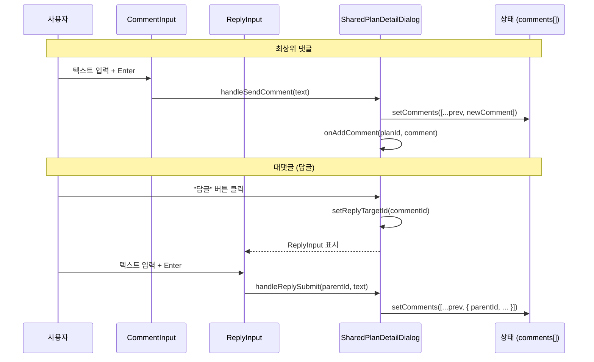
```mermaid
sequenceDiagram
    participant U as 사용자
    participant CI as CommentInput
    participant RI as ReplyInput
    participant D as SharedPlanDetailDialog
    participant S as 상태 (comments[])

    Note over U,S: 최상위 댓글
    U->>CI: 텍스트 입력 + Enter
    CI->>D: handleSendComment(text)
    D->>S: setComments([...prev, newComment])
    D->>D: onAddComment(planId, comment)

    Note over U,S: 대댓글 (답글)
    U->>D: "답글" 버튼 클릭
    D->>D: setReplyTargetId(commentId)
    D-->>RI: ReplyInput 표시
    U->>RI: 텍스트 입력 + Enter
    RI->>D: handleReplySubmit(parentId, text)
    D->>S: setComments([...prev, { parentId, ... }])
```

### 7-4. 댓글 데이터 예시

```json
{
  "id": "c1",
  "parentId": null,
  "authorRole": "operator",
  "authorName": "김진로",
  "content": "좋은 계획이에요!",
  "createdAt": "2025-04-20T10:00:00Z"
}
{
  "id": "c2",
  "parentId": "c1",
  "authorRole": "peer",
  "authorName": "이하늘",
  "content": "감사합니다 선생님!",
  "createdAt": "2025-04-20T11:30:00Z"
}
```

---

## 8. 신고 시스템

### 8-1. 3단계 플로우

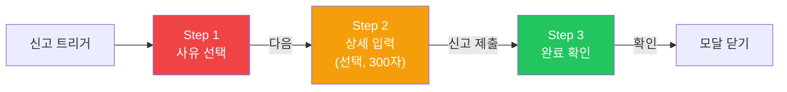
```mermaid
graph LR
    T["신고 트리거"]
    S1["Step 1<br/>사유 선택"]
    S2["Step 2<br/>상세 입력<br/>(선택, 300자)"]
    S3["Step 3<br/>완료 확인"]

    T --> S1
    S1 -->|"다음"| S2
    S2 -->|"신고 제출"| S3
    S3 -->|"확인"| CLOSE["모달 닫기"]

    style S1 fill:#ef4444,color:#fff
    style S2 fill:#F59E0B,color:#fff
    style S3 fill:#22C55E,color:#fff
```

### 8-2. 신고 대상 타입

| 대상 | 트리거 위치 | ReportTarget |
|------|------------|-------------|
| **콘텐츠** | 공유 패스 상세 헤더 `MoreVertical` → "콘텐츠 신고" | `{ kind: 'content', id, title }` |
| **댓글** | 각 댓글의 `Flag` 아이콘 | `{ kind: 'comment', id, author }` |

### 8-3. 신고 사유

| 구분 | 데이터 소스 | 예시 |
|------|------------|------|
| 콘텐츠 신고 | `report-reasons.json → content[]` | 허위 정보, 부적절한 내용, 저작권 침해 등 |
| 댓글 신고 | `report-reasons.json → comment[]` | 욕설/비방, 스팸, 개인정보 노출 등 |

---

## 9. 뱃지·시간 표시 시스템

### 9-1. 뱃지 종류

| 뱃지 | 조건 | 색상 | 사라지는 조건 |
|------|------|------|-------------|
| **NEW** | `isRecentlyUpdated(displayTime)` — 24시간 이내 | 초록 (`#22C55E`) | 24시간 경과 |
| **확인 필요** | `isOlderThanWeek(displayTime) && !isChecked` | 노랑 (`#FBBF24`) | 상세 조회 시 사라짐 |
| **운영자 공유** | `shareType === 'operator'` | 보라 (`#a78bfa`) | - |
| **전체 공유** | `shareType === 'public'` | 초록 (`#22C55E`) | - |
| **수정됨** | `isEdited(sharedAt, updatedAt)` | Clock 아이콘 | - |

### 9-2. 확인 필요 뱃지 알고리즘

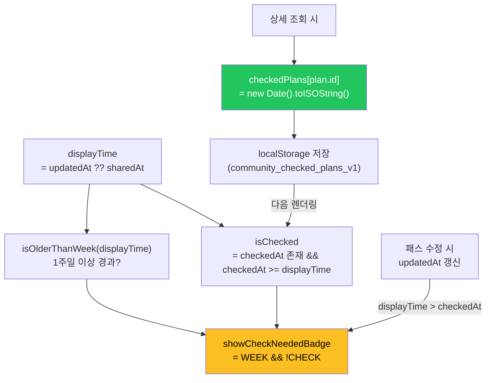
```mermaid
graph TD
    DT["displayTime<br/>= updatedAt ?? sharedAt"]
    WEEK["isOlderThanWeek(displayTime)<br/>1주일 이상 경과?"]
    CHECK["isChecked<br/>= checkedAt 존재 && checkedAt >= displayTime"]
    SHOW["showCheckNeededBadge<br/>= WEEK && !CHECK"]

    DT --> WEEK
    DT --> CHECK
    WEEK --> SHOW
    CHECK --> SHOW

    VIEW["상세 조회 시"]
    SAVE["checkedPlans[plan.id]<br/>= new Date().toISOString()"]
    LS["localStorage 저장<br/>(community_checked_plans_v1)"]

    VIEW --> SAVE
    SAVE --> LS
    LS -->|"다음 렌더링"| CHECK

    UPDATE["패스 수정 시<br/>updatedAt 갱신"]
    UPDATE -->|"displayTime > checkedAt"| SHOW

    style SHOW fill:#FBBF24,color:#000
    style SAVE fill:#22C55E,color:#fff
```

### 9-3. 시간 표시 유틸 (`formatTime.ts`)

| 함수 | 출력 예시 | 용도 |
|------|----------|------|
| `formatTimeAgo(iso)` | 방금 전, 5분 전, 2시간 전, 어제, 3일 전 | 카드 시간 표시 |
| `formatShortDate(iso)` | 3월 21일 | 7일 이상 경과 시 |
| `formatLongDate(iso)` | 2025년 4월 10일 | 상세 다이얼로그 |
| `isRecentlyUpdated(iso)` | `boolean` | NEW 뱃지 (24h) |
| `isEdited(sharedAt, updatedAt)` | `boolean` | 수정됨 표시 |
| `isOlderThanWeek(iso)` | `boolean` | 확인 필요 뱃지 |

---

## 10. 하트·즐겨찾기·리액션 시스템

### 10-1. 리액션 카운트 알고리즘

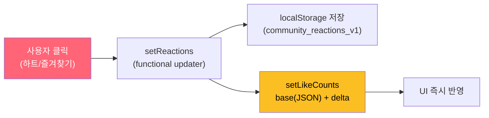
```mermaid
graph LR
    CLICK["사용자 클릭<br/>(하트/즐겨찾기)"]
    REACT["setReactions<br/>(functional updater)"]
    LS["localStorage 저장<br/>(community_reactions_v1)"]
    COUNT["setLikeCounts<br/>base(JSON) + delta"]
    UI["UI 즉시 반영"]

    CLICK --> REACT
    REACT --> LS
    REACT --> COUNT
    COUNT --> UI

    style CLICK fill:#FF6477,color:#fff
    style COUNT fill:#FBBF24,color:#000
```

### 10-2. 카운트 계산 방식

| 상황 | 표시 카운트 |
|------|------------|
| 사용자가 좋아요 안 함 | `plan.likes` (JSON 기본값) |
| 사용자가 좋아요 함 | `plan.likes + 1` |
| 사용자가 좋아요 취소 | `plan.likes` (원복) |

### 10-3. 즐겨찾기 저장 위치

| 위치 | 저장 키 | 대상 |
|------|---------|------|
| 탐색 탭 — 템플릿 카드 | `template_bookmarks_v1` | 템플릿 ID |
| 커뮤니티 — 학교/그룹 | `community_reactions_v1` | 공유 패스 ID |
| 탐색 탭 — 즐겨찾기 섹션 | 두 키 통합 표시 | 템플릿 + 공유 패스 |

---

## 11. 공유 설정 시스템

### 11-1. 공유 타입

| 타입 | 아이콘 | 설명 | 대상 |
|------|--------|------|------|
| `public` (전체 공유) | 🌐 Globe | 학교 친구 + 그룹 멤버 모두 열람 | 학교 공간 + 그룹 |
| `operator` (운영자 공유) | 🛡️ Shield | 진로 선생님(운영자)만 열람 | 학교 공간 운영자 전용 |

### 11-2. 공유 흐름

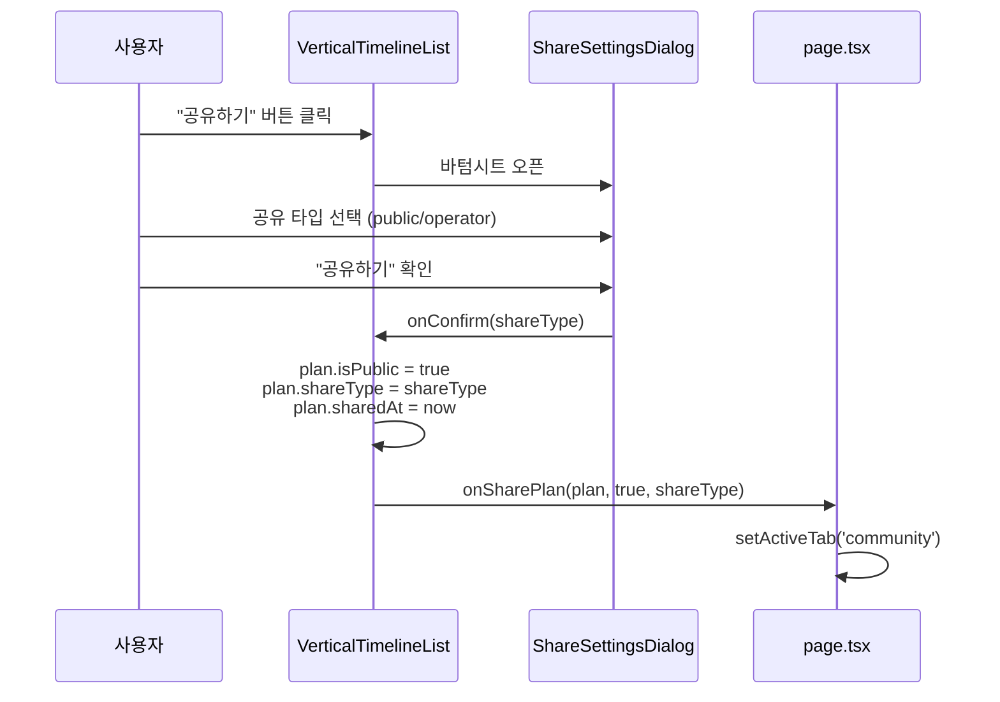
```mermaid
sequenceDiagram
    participant U as 사용자
    participant VTL as VerticalTimelineList
    participant SSD as ShareSettingsDialog
    participant PAGE as page.tsx

    U->>VTL: "공유하기" 버튼 클릭
    VTL->>SSD: 바텀시트 오픈
    U->>SSD: 공유 타입 선택 (public/operator)
    U->>SSD: "공유하기" 확인
    SSD->>VTL: onConfirm(shareType)
    VTL->>VTL: plan.isPublic = true<br/>plan.shareType = shareType<br/>plan.sharedAt = now
    VTL->>PAGE: onSharePlan(plan, true, shareType)
    PAGE->>PAGE: setActiveTab('community')
```

---

## 12. 유저 시나리오

### 시나리오 A: 신규 사용자 — 템플릿으로 시작

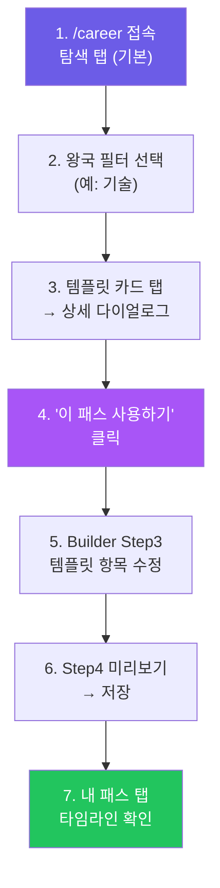
```mermaid
graph TD
    A1["1. /career 접속<br/>탐색 탭 (기본)"]
    A2["2. 왕국 필터 선택<br/>(예: 기술)"]
    A3["3. 템플릿 카드 탭<br/>→ 상세 다이얼로그"]
    A4["4. '이 패스 사용하기'<br/>클릭"]
    A5["5. Builder Step3<br/>템플릿 항목 수정"]
    A6["6. Step4 미리보기<br/>→ 저장"]
    A7["7. 내 패스 탭<br/>타임라인 확인"]

    A1 --> A2 --> A3 --> A4 --> A5 --> A6 --> A7

    style A1 fill:#6C5CE7,color:#fff
    style A4 fill:#a855f7,color:#fff
    style A7 fill:#22C55E,color:#fff
```

### 시나리오 B: 직접 만들기

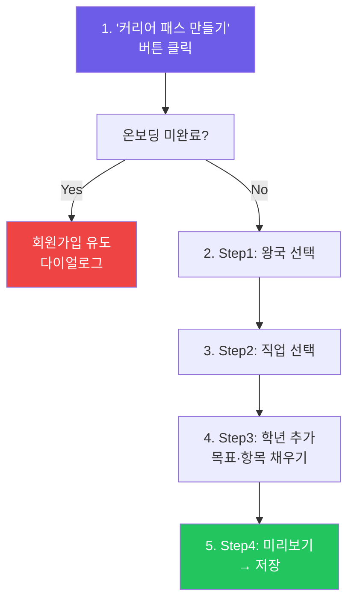
```mermaid
graph TD
    B1["1. '커리어 패스 만들기'<br/>버튼 클릭"]
    B1a["온보딩 미완료?"]
    B1b["회원가입 유도<br/>다이얼로그"]
    B2["2. Step1: 왕국 선택"]
    B3["3. Step2: 직업 선택"]
    B4["4. Step3: 학년 추가<br/>목표·항목 채우기"]
    B5["5. Step4: 미리보기<br/>→ 저장"]

    B1 --> B1a
    B1a -->|"Yes"| B1b
    B1a -->|"No"| B2
    B2 --> B3 --> B4 --> B5

    style B1 fill:#6C5CE7,color:#fff
    style B1b fill:#ef4444,color:#fff
    style B5 fill:#22C55E,color:#fff
```

### 시나리오 C: 커뮤니티 탐색 + 소통

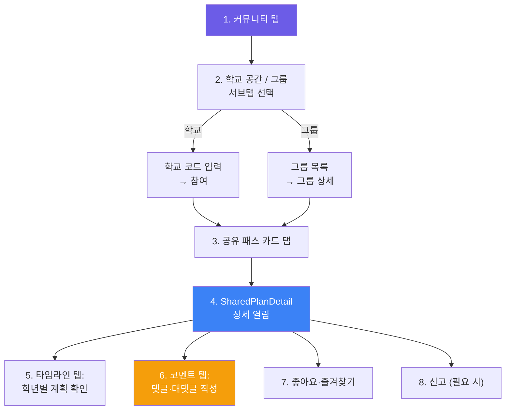
```mermaid
graph TD
    C1["1. 커뮤니티 탭"]
    C2["2. 학교 공간 / 그룹<br/>서브탭 선택"]

    C3a["학교 코드 입력<br/>→ 참여"]
    C3b["그룹 목록<br/>→ 그룹 상세"]

    C4["3. 공유 패스 카드 탭"]
    C5["4. SharedPlanDetail<br/>상세 열람"]
    C6["5. 타임라인 탭:<br/>학년별 계획 확인"]
    C7["6. 코멘트 탭:<br/>댓글·대댓글 작성"]
    C8["7. 좋아요·즐겨찾기"]
    C9["8. 신고 (필요 시)"]

    C1 --> C2
    C2 -->|"학교"| C3a
    C2 -->|"그룹"| C3b
    C3a --> C4
    C3b --> C4
    C4 --> C5
    C5 --> C6
    C5 --> C7
    C5 --> C8
    C5 --> C9

    style C1 fill:#6C5CE7,color:#fff
    style C5 fill:#3B82F6,color:#fff
    style C7 fill:#F59E0B,color:#fff
```

### 시나리오 D: 공유 & 피드백 루프

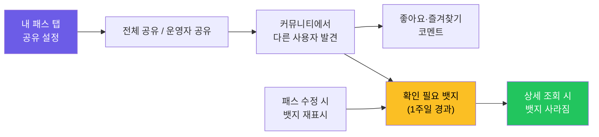
```mermaid
graph LR
    D1["내 패스 탭<br/>공유 설정"]
    D2["전체 공유 / 운영자 공유"]
    D3["커뮤니티에서<br/>다른 사용자 발견"]
    D4["좋아요·즐겨찾기<br/>코멘트"]
    D5["확인 필요 뱃지<br/>(1주일 경과)"]
    D6["상세 조회 시<br/>뱃지 사라짐"]
    D7["패스 수정 시<br/>뱃지 재표시"]

    D1 --> D2 --> D3 --> D4
    D3 --> D5 --> D6
    D7 --> D5

    style D1 fill:#6C5CE7,color:#fff
    style D5 fill:#FBBF24,color:#000
    style D6 fill:#22C55E,color:#fff
```

---

## 13. 순서도 (Mermaid)

### 13-1. 전체 시스템 흐름

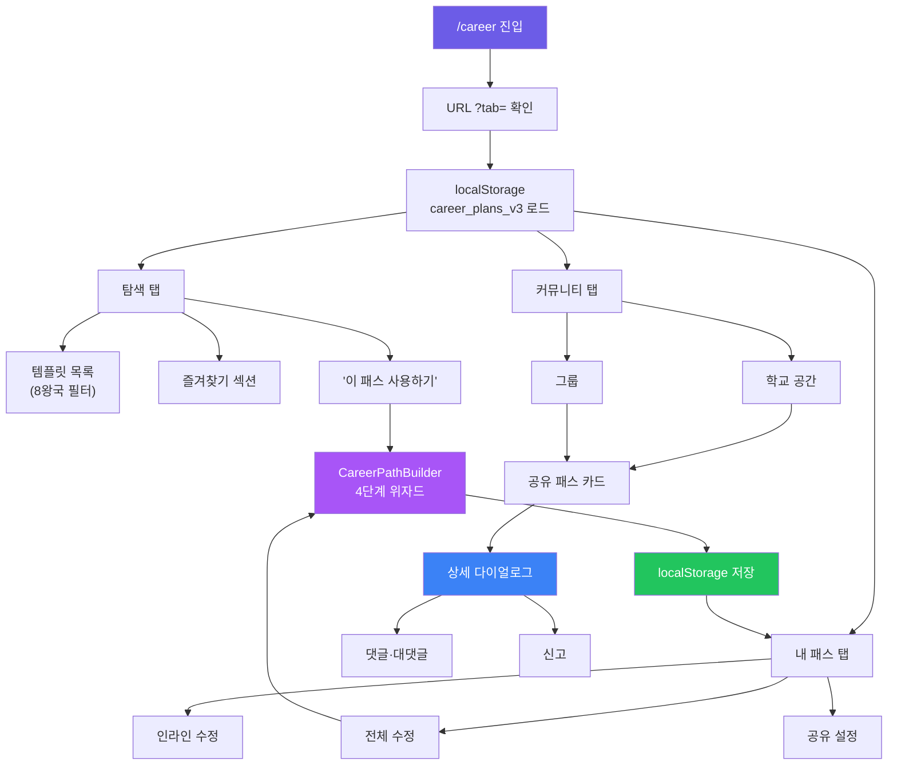
```mermaid
graph TB
    ENTRY["/career 진입"]
    URL["URL ?tab= 확인"]
    LS_LOAD["localStorage<br/>career_plans_v3 로드"]

    ENTRY --> URL
    URL --> LS_LOAD

    LS_LOAD --> EXPLORE["탐색 탭"]
    LS_LOAD --> COMMUNITY["커뮤니티 탭"]
    LS_LOAD --> TIMELINE["내 패스 탭"]

    EXPLORE --> TPL_LIST["템플릿 목록<br/>(8왕국 필터)"]
    EXPLORE --> BOOKMARK["즐겨찾기 섹션"]
    EXPLORE --> USE_TPL["'이 패스 사용하기'"]

    COMMUNITY --> SCHOOL["학교 공간"]
    COMMUNITY --> GROUP["그룹"]
    SCHOOL --> SHARED_CARD["공유 패스 카드"]
    GROUP --> SHARED_CARD
    SHARED_CARD --> DETAIL["상세 다이얼로그"]
    DETAIL --> COMMENT["댓글·대댓글"]
    DETAIL --> REPORT["신고"]

    TIMELINE --> INLINE["인라인 수정"]
    TIMELINE --> FULL_EDIT["전체 수정"]
    TIMELINE --> SHARE["공유 설정"]

    USE_TPL --> BUILDER["CareerPathBuilder<br/>4단계 위자드"]
    FULL_EDIT --> BUILDER
    BUILDER --> SAVE["localStorage 저장"]
    SAVE --> TIMELINE

    style ENTRY fill:#6C5CE7,color:#fff
    style BUILDER fill:#a855f7,color:#fff
    style SAVE fill:#22C55E,color:#fff
    style DETAIL fill:#3B82F6,color:#fff
```

### 13-2. 리액션 상태 흐름

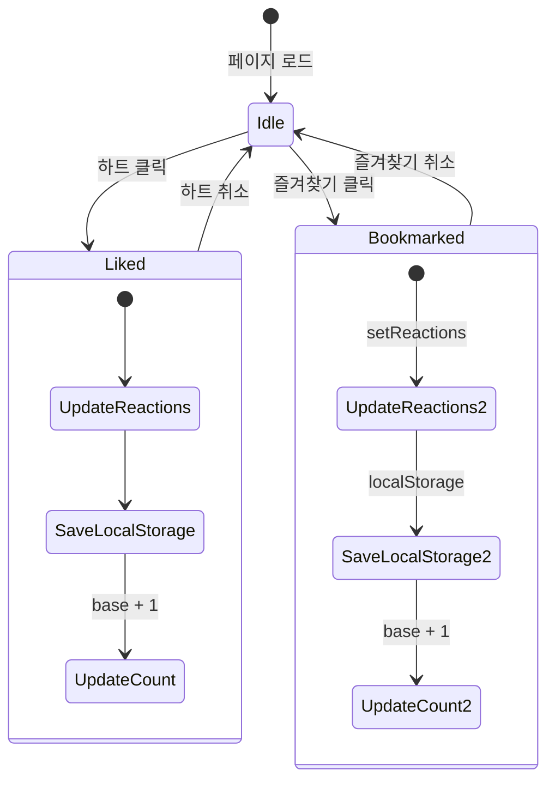
```mermaid
stateDiagram-v2
    [*] --> Idle: 페이지 로드
    Idle --> Liked: 하트 클릭
    Liked --> Idle: 하트 취소
    Idle --> Bookmarked: 즐겨찾기 클릭
    Bookmarked --> Idle: 즐겨찾기 취소

    state Liked {
        [*] --> UpdateReactions
        UpdateReactions --> SaveLocalStorage
        SaveLocalStorage --> UpdateCount: base + 1
    }

    state Bookmarked {
        [*] --> UpdateReactions2: setReactions
        UpdateReactions2 --> SaveLocalStorage2: localStorage
        SaveLocalStorage2 --> UpdateCount2: base + 1
    }
```

### 13-3. 댓글 트리 빌드

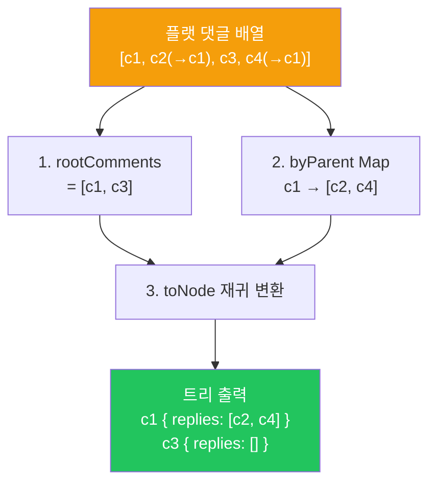
```mermaid
graph TD
    INPUT["플랫 댓글 배열<br/>[c1, c2(→c1), c3, c4(→c1)]"]
    STEP1["1. rootComments<br/>= [c1, c3]"]
    STEP2["2. byParent Map<br/>c1 → [c2, c4]"]
    STEP3["3. toNode 재귀 변환"]
    OUTPUT["트리 출력<br/>c1 { replies: [c2, c4] }<br/>c3 { replies: [] }"]

    INPUT --> STEP1
    INPUT --> STEP2
    STEP1 --> STEP3
    STEP2 --> STEP3
    STEP3 --> OUTPUT

    style INPUT fill:#F59E0B,color:#fff
    style OUTPUT fill:#22C55E,color:#fff
```

---

## 14. 컴포넌트 Props 명세

### 메인 페이지 컴포넌트

| 컴포넌트 | Props | 타입 |
|----------|-------|------|
| `CareerPathList` | `onUseTemplate`, `onNewPath`, `myPublicPlans`, `onViewMyPlan` | 함수·배열 |
| `CareerPathBuilder` | `initialPlan`, `initialStep`, `onSave`, `onClose` | `CareerPlan?`, `number?`, 함수 |
| `VerticalTimelineList` | `allPlans`, `onEdit`, `onUpdatePlan`, `onDeletePlan`, `onNewPlan`, `onSharePlan` | 배열·함수 |
| `CommunityTab` | `onNewPlan` | `() => void` |

### 커뮤니티 컴포넌트

| 컴포넌트 | Props |
|----------|-------|
| `SchoolSpaceView` | `school`, `sharedPlans`, `likedPlanIds`, `bookmarkedPlanIds`, `likeCounts`, `bookmarkCounts`, `checkedPlans`, `onToggleLike`, `onToggleBookmark`, `onViewPlanDetail`, `onJoinSchool` |
| `GroupListView` | `groups`, `sharedPlans`, `likedPlanIds`, `bookmarkedPlanIds`, `likeCounts`, `bookmarkCounts`, `checkedPlans`, `onToggleLike`, `onToggleBookmark`, `onViewPlanDetail` |
| `SharedPlanCardWithReactions` | `plan`, `isLiked`, `isBookmarked`, `likeCount`, `bookmarkCount`, `checkedAt?`, `onToggleLike`, `onToggleBookmark`, `onViewDetail` |
| `SharedPlanDetailDialog` | `plan`, `isLiked`, `isBookmarked`, `likeCount`, `bookmarkCount`, `onToggleLike`, `onToggleBookmark`, `onClose`, `onAddComment` |
| `ShareSettingsDialog` | `planTitle`, `currentShareType`, `onConfirm`, `onMakePrivate`, `onClose` |
| `ReportModal` | `target: ReportTarget`, `accentColor?`, `onClose` |

---

## 15. 설정 파일 & JSON 데이터

### `config.ts` exports

| export | 출처 | 설명 |
|--------|------|------|
| `LABELS` | `career-content.json` | 모든 UI 텍스트 (한국어) |
| `COLORS` | `career-config.json` | primary, activity, award, certification, portfolio, goal, background |
| `ITEM_TYPES` | `career-config.json` | 커리어 항목 타입 (value, label, color, emoji) |
| `GRADE_YEARS` | `career-config.json` | 학년 목록 (초4~고3, id, label, fullLabel, order) |
| `STAR_FILTERS` | `career-config.json` | 왕국(별) 필터 옵션 |
| `ROUTES` | `career-config.json` | 탭별 URL 경로 |

### JSON 파일 상세

| 파일 | 주요 필드 | 사용 컴포넌트 |
|------|----------|-------------|
| `career-path-templates.json` | `id`, `starId`, `jobName`, `years[]`, `likes`, `uses` | `CareerPathList` |
| `career-maker.json` | `kingdoms[].representativeJobs[]`, `kingdoms[].careerItems[]` | `CareerPathBuilder` |
| `portfolio-items.json` | `kingdoms.{starId}[].title`, `.months`, `.difficulty` | `AddItemSheet` |
| `share-community.json` | `schools[]`, `groups[]`, `sharedPlans[]`, `meta.ui` | `CommunityTab` |
| `report-reasons.json` | `content[]`, `comment[]` (각 `id`, `label`, `emoji`, `description`) | `ReportModal` |
| `goal-templates.json` | 목표 텍스트 목록 | `GoalTemplateSelector` |

---

## 16. localStorage 키 목록

| 키 | 값 타입 | 설명 |
|----|---------|------|
| `career_plans_v3` | `CareerPlan[]` | 내 커리어 패스 목록 |
| `community_reactions_v1` | `UserReactionState` | 공유 패스 좋아요·즐겨찾기 상태 |
| `community_checked_plans_v1` | `Record<string, string>` | 확인 필요 뱃지 조회 기록 (planId → ISO) |
| `template_bookmarks_v1` | `string[]` | 템플릿 ID 즐겨찾기 목록 |

> **탐색 탭과 커뮤니티 탭은 `community_reactions_v1`을 공유**하므로 두 탭 간 반응 상태가 자동 동기화됩니다.

---

## 17. 추후 백엔드 연동 포인트

| 기능 | 현재 (프론트 전용) | 백엔드 연동 시 |
|------|-------------------|---------------|
| 커리어 패스 저장 | `localStorage career_plans_v3` | `POST /api/career-plans` |
| 공유 패스 목록 | `share-community.json` | `GET /api/community/plans?schoolId=` |
| 하트 토글 | localStorage 카운트 | `POST /api/community/plans/:id/like` |
| 즐겨찾기 토글 | localStorage 카운트 | `POST /api/community/plans/:id/bookmark` |
| 코멘트 작성 | 로컬 상태 stub | `POST /api/community/plans/:id/comments` |
| 대댓글 작성 | 로컬 상태 stub | `POST /api/community/comments/:id/replies` |
| 학교 참여 | 코드 매칭 (JSON) | `POST /api/schools/join` |
| 그룹 생성 | 로컬 상태 | `POST /api/groups` |
| 그룹 초대 | 클립보드 복사 | `POST /api/groups/:id/invite` |
| 신고 제출 | `console.log` | `POST /api/reports` |
| 확인 필요 뱃지 | localStorage | `GET /api/community/plans/:id/checked` |
| 템플릿 목록 | `career-path-templates.json` | `GET /api/career-templates` |
| 추천 항목 | `career-maker.json`, `portfolio-items.json` | `GET /api/career-items?starId=` |

---

## 18. 핵심 알고리즘 요약

| 알고리즘 | 위치 | 핵심 로직 |
|----------|------|----------|
| 템플릿→패스 변환 | `page.tsx` `handleUseTemplate` | months 정규화 + id 생성 + Builder Step3 진입 |
| 학년 정렬 | `CareerPathBuilder` `handleSave` | GRADE_YEARS order 기반 정렬 |
| 댓글 트리 빌드 | `SharedPlanDetailDialog` `buildCommentTree` | parentId 기반 재귀 트리 변환 |
| 확인 필요 뱃지 | `SharedPlanCardWithReactions` | `isOlderThanWeek && !isChecked` |
| 리액션 카운트 | `CommunityTab` | base(JSON) + delta(localStorage) 패턴 |
| 시간 표시 | `formatTime.ts` | 방금→분→시간→어제→일→날짜 단계적 변환 |
| 학교 참여 | `CommunityTab` `handleJoinSchool` | 코드 매칭 → schoolId 필터링 |
| 공유 타입 | `ShareSettingsDialog` | public(전체) vs operator(운영자 전용) |
| 항목 추천 병합 | `AddItemSheet` | careerItems + portfolioItems 병합 → 타입 필터 |
| 그룹 내 패스 | `GroupListView` | `sharedPlans.filter(p => p.groupIds.includes(group.id))` |

---

*최종 업데이트: 2026-03-08*
