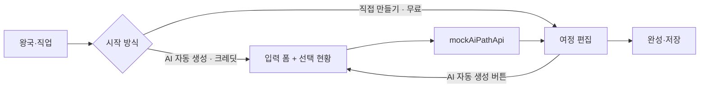

# 커리어 패스 AI 자동 생성 (더미 단계)

서버 없이 동작하는 1차 구현. 빌더 3단계(여정)에서 **AI 자동 생성(유료 크레딧)** 과 **직접 만들기(무료)** 를 고른다.

## 흐름

## 파일

| 파일 | 역할 |
|------|------|
| `data/career/ai-path/ai-path-generator.json` | 더미 설정 전체: 요금·질문·분량·테스트 예시·문구·왕국별 기초 세트 |
| `generateDraft.ts` | 직업 로드맵 + 추천 활동 + 기초 세트를 조합하는 순수 함수 |
| `balance.ts` | 활동 유형 균형 점검, 부족한 유형 목표 추가 |
| `mockAiPathApi.ts` | 서버 자리. 지연·크레딧 차감을 흉내 낸다 |
| `components/builder-ai/*` | 시작 방식 선택, 입력 폼, 선택 현황, 도구 막대, 교체·고정·재추천 |

## 데이터 출처

| 학년 | 출처 |
|------|------|
| 중2~고3·대학 | `data/jobs/*-kingdom-jobs.json`의 `careerTimeline.milestones` |
| 초3~중1, 로드맵에 없는 학년 | 설정 JSON의 `foundation` (왕국 8 × 단계 3) |
| 준비 방식 목표 | `data/goal-recommended-items.json` (설정 JSON `styleGoals`로 매핑) |

## 크레딧 (설정 JSON `pricing.costs`)

| 동작 | 크레딧 |
|------|--------|
| 생성, 전체 다시, 학년 다시 추천 | 1 |
| 자세히 채우기, 분량 조절, 활동 교체, 균형 목표 추가, 되돌리기 | 0 |

체험 크레딧은 `localStorage`의 `career-ai-path-credits-v1`에 저장된다.
`pricing.allowTestReset`이 true면 소진 안내에 "테스트용 크레딧 다시 받기"가 보인다. 결제 연동 시 false로 바꾼다.

## 서버 연동 시 바꿀 곳

1. `mockAiPathApi.ts`의 두 함수 본문을 `fetchWithAuthRetry` 호출로 교체한다. 요청·응답 타입은 `types.ts` 그대로 쓴다.
2. 크레딧은 응답의 `quota_remaining_after`를 그대로 쓰고 `localStorage` 읽기·쓰기를 제거한다.
3. 설정 JSON의 `testPresets`, `allowTestReset`을 끈다.
4. 저장 API가 `aiReason`·`locked`·`aiAlternatives`·`aiTheme` 필드를 보존하는지 확인한다.
