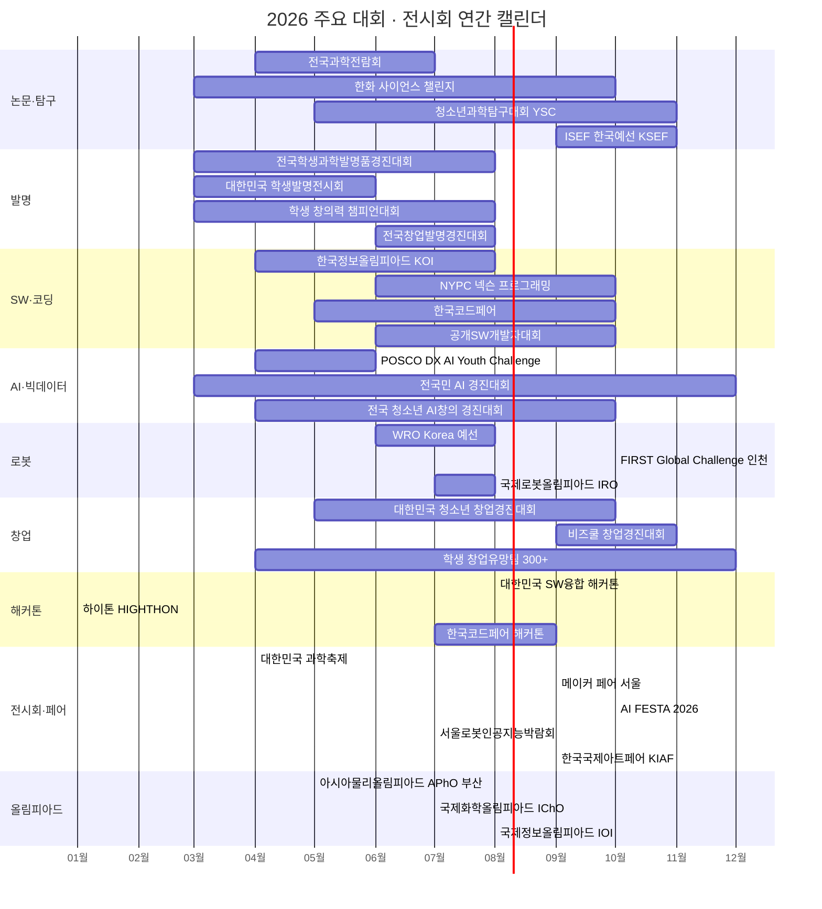
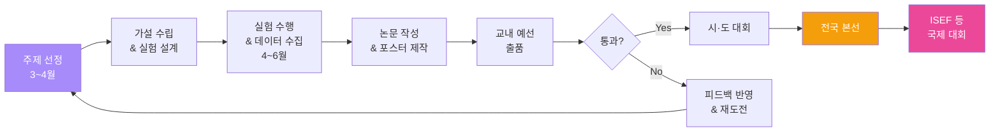
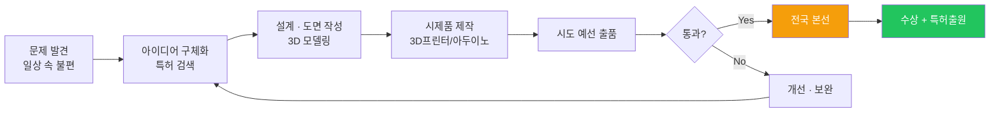
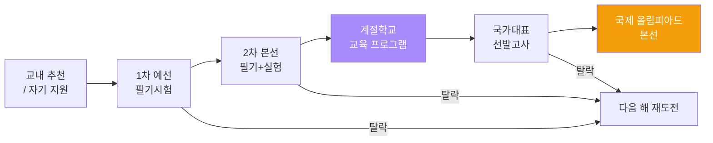
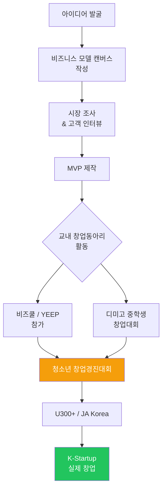
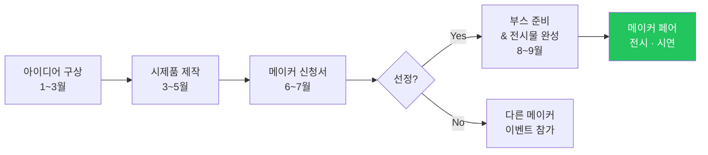
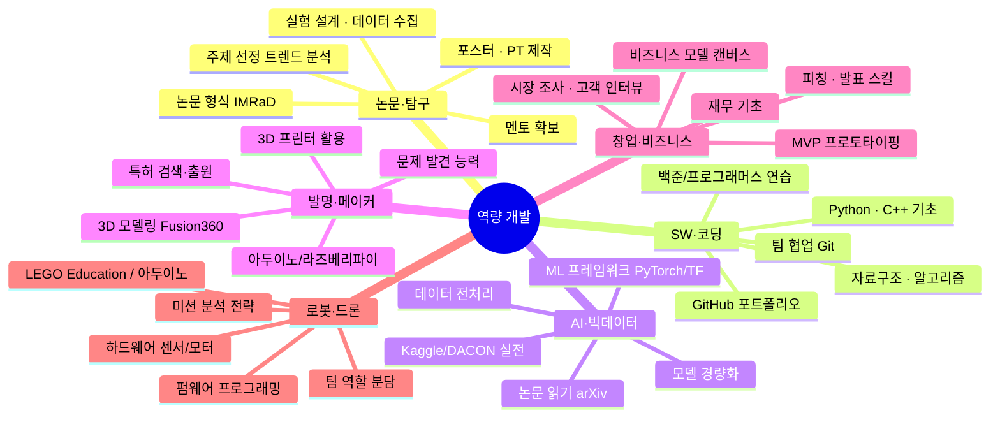

# AI 커리어 패스 — 대회 · 공모전 · 전시회 종합 가이드

> **최종 업데이트:** 2026-06-26  
> **데이터 출처:** `goal-recommended-items.json` + 각 대회 공식 웹사이트 + 60개 이상 리서치 에이전트 조사 결과

---

## 목차

1. [연간 일정 타임라인](#1-연간-일정-타임라인)
2. [논문 · 탐구 대회](#2-논문--탐구-대회)
3. [발명 대회](#3-발명-대회)
4. [SW · 코딩 · 알고리즘 대회](#4-sw--코딩--알고리즘-대회)
5. [AI · 빅데이터 대회](#5-ai--빅데이터-대회)
6. [로봇 · 드론 대회](#6-로봇--드론-대회)
7. [수학 경시대회](#7-수학-경시대회)
8. [과학 올림피아드](#8-과학-올림피아드)
9. [창업 · 비즈니스 대회](#9-창업--비즈니스-대회)
10. [메이커 대회 · 공모전](#10-메이커-대회--공모전)
11. [해커톤](#11-해커톤)
12. [영어 · 외국어 대회](#12-영어--외국어-대회)
13. [디자인 · 예술 · UCC 공모전](#13-디자인--예술--ucc-공모전)
14. [환경 · 사회 · 공익 공모전](#14-환경--사회--공익-공모전)
15. [정보보안 · CTF 대회](#15-정보보안--ctf-대회)
16. [독서 · 토론 · 논술 대회](#16-독서--토론--논술-대회)
17. [전시회 · 페어 · 축제](#17-전시회--페어--축제)
18. [역량 개발 로드맵](#18-역량-개발-로드맵)
19. [수상 등급 체계](#19-수상-등급-체계)
20. [공모전 정보 사이트 모음](#20-공모전-정보-사이트-모음)

---

## 1. 연간 일정 타임라인



---

## 2. 논문 · 탐구 대회

### 2.1 국내 논문 · 탐구 대회

| 대회명 | 주최/주관 | 공식 웹사이트 | 시기 | 참가 대상 | 출품 형태 | 수상/비고 |
|--------|-----------|--------------|------|-----------|-----------|-----------|
| **제72회 전국과학전람회** | 과기정통부 · 국립중앙과학관 | [science.go.kr](https://www.science.go.kr/) | 4~7월 | 초/중/고, 교원, 일반 | 연구 논문 + 전시 | 대통령상, 국무총리상 |
| **한화 사이언스 챌린지** | 한화그룹 | [sciencechallenge.or.kr](https://www.sciencechallenge.or.kr/) | 3~10월 | 고등학생 (팀) | 과학 연구 논문 발표 | 총상금 **2억원**, 대상 4,000만원 |
| **청소년과학탐구대회 (YSC)** | 한국과학창의재단 | [kosac.re.kr](https://www.kosac.re.kr/) | 5~11월 | 중·고등학생 (3~5명) | 과학탐구 프로젝트 | 과기정통부장관상 |
| **과학영재 R&E 발표대회** | 과기정통부 · 한국과학창의재단 | [rne.or.kr](http://www.rne.or.kr/) | 연중~12월 | 과학고, 영재학교 | 팀 연구 + 논문 발표 | ISEF 출전 자격 부여 |
| **STEAM R&E 성과발표회** | 한국과학창의재단 | [steam.kofac.re.kr](https://steam.kofac.re.kr/) | 하반기 | 과학중점학교 고등학생 | 융합 연구 발표 | 창의재단 이사장상 |
| **전국청소년과학탐구대회** | 과기정통부 · 한국과학창의재단 | [kosac.re.kr](https://www.kosac.re.kr/) | 11월 | 초/중/고등학생 | 융합과학, 과학토론, YSC 발표 | 과기정통부장관상 |
| **국제 청소년 소논문 대회** | 한국SW역량교육협회 · HOBY Korea | [hobykorea.com](https://www.hobykorea.com/) | ~11월 접수 | 중·고등학생 (7~12학년) | 영어 논문 제출 | 수상작 학술지 게재 |
| **ISEF 한국예선 (KSEF)** | 한국과학기술지원단 | - | 9~11월 | 고등학생 | 영문 연구 논문 + 포스터 | ISEF 본선 진출 |

### 2.2 국제 연구 대회

| 대회명 | 주최 | 공식 웹사이트 | 시기 | 참가 대상 | 특징 |
|--------|------|--------------|------|-----------|------|
| **ISEF** | Society for Science | [societyforscience.org](https://www.societyforscience.org/isef/) | 5월 (미국) | 고등학생 | 세계 최대 청소년 과학대회 |
| **Google Science Fair** | Google | - | 연중 | 13~18세 | 온라인 제출, 글로벌 |

### 논문 · 탐구 준비 플로우



---

## 3. 발명 대회

### 3.1 국내 발명 대회

| 대회명 | 주최/주관 | 공식 웹사이트 | 시기 | 참가 대상 | 참가 형태 | 수상/비고 |
|--------|-----------|--------------|------|-----------|-----------|-----------|
| **전국학생과학발명품경진대회** | 과기정통부 · 교육부 · 특허청 · 국립중앙과학관 | [science.go.kr](https://www.science.go.kr/) | 3~8월 (지역→전국) | 초/중/고 (지도교원 1인 필수) | 발명품 직접 제작 출품 | 국무총리상, 과기정통부장관상 |
| **대한민국 학생발명전시회** | 특허청 · 한국발명진흥회 | [ip-edu.net](https://www.ip-edu.net/) | 3~6월 접수 | 초/중/고등학생 | 발명 아이디어 + 작품 | 특허청장상 |
| **대한민국 학생 창의력 챔피언대회** | 특허청 · 한국발명진흥회 | [ip-edu.net](https://www.ip-edu.net/) | 3~8월 (시도예선→본선) | 초/중/고 (4~6인 팀) | 표현과제+즉석과제+제작과제 | 특허청장상 |
| **청소년 발명 페스티벌** | 특허청 · 한국발명진흥회 | [ip-edu.net](https://www.ip-edu.net/) | 10~11월 | 청소년 | 발명 전시 · 체험 행사 | - |
| **전국창업발명경진대회 (제18회)** | 삼양라운드스퀘어 · 한국과학창의재단 | [s-talk.or.kr](https://s-talk.or.kr/) | 6.9~8.27 | 초/중/고등학생 | 팀(1~4인), 발명+창업 | 재단상 |
| **착한 아이디어 경진대회** | 아름다운가게 · 한국발명진흥회 | [ipmarket.or.kr/idearo](https://www.ipmarket.or.kr/idearo/) | 6~7월 | 누구나 (14세 미만 보호자 동의) | 사회적기업 문제해결 아이디어 | 아이디어 거래 최대 300만원 |
| **대한민국 학생 창의력 올림피아드** | 한국학교발명협회 | [kasi.org](http://www.kasi.org/) | 9~11월 | 학생 | 창의적 과제 해결 | - |

### 3.2 발명 대회 준비 플로우



---

## 4. SW · 코딩 · 알고리즘 대회

### 4.1 청소년 대상

| 대회명 | 주최/주관 | 공식 웹사이트 | 시기 | 참가 대상 | 참가 형태 | 수상/비고 |
|--------|-----------|--------------|------|-----------|-----------|-----------|
| **한국정보올림피아드 (KOI)** | 과기정통부 · NIA | [koi.or.kr](https://www.koi.or.kr/) | 4~8월 | 초1~고3 | 개인, 알고리즘 | IOI 대표 선발 연계 |
| **NYPC (넥슨 청소년 프로그래밍 챌린지)** | NEXON | [nypc.co.kr](https://nypc.co.kr/) | 6~10월 | 초5~고3 | 개인, 프로그래밍 | - |
| **한국코드페어 SW공모전 (제8회)** | 과기정통부 · NIA | [kcf.or.kr](https://www.kcf.or.kr/) | 5~10월 | 중/고등학생 (3인 이하) | SW 공모전 | 국무총리상, ISEF 선발전 자격 |
| **전국 고교 동아리 SW 경진대회 (제10회)** | 과기정통부 · IITP · 충남대 등 | [highschool-swcontest.net](https://www.highschool-swcontest.net) | 7~8월 | 고등학생 동아리 (3~5인) | SW 프로젝트 | 금상 200만원, 은상 100만원 |
| **고등학생 SW 개발 공모전** | 한국SW산업협회 (KOSA) | [sw.or.kr](https://www.sw.or.kr/) | 8~10월 | 고등학생 (4인 이내) | 웹 & 앱 솔루션 | - |
| **청소년 SW동행 해커톤** | 과기정통부 · 한국과학창의재단 | [kosac.re.kr](https://www.kosac.re.kr/) | 6~7월 | 중/고교생 (3~5인) | 해커톤 | 총 450만원, ISEF 2026 참가 기회 |
| **전국 창의문제 해결능력 경진대회 (CPS)** | IT여성기업인협회 | [cpsfestival.org](https://www.cpsfestival.org/) | 6~8월 | 초/중/고/대학 | 개인, 알고리즘 | 과기정통부장관상 |

### 4.2 국제 SW 대회

| 대회명 | 주최 | 공식 웹사이트 | 시기 | 참가 대상 | 특징 |
|--------|------|--------------|------|-----------|------|
| **IOI (국제정보올림피아드)** | IOI | [ioinformatics.org](https://ioinformatics.org/) | 8월 | 고등학생 (국가대표) | KOI 경유 선발 |
| **USACO** | USACO | [usaco.org](https://usaco.org) | 12~3월 | 고등학생 | Bronze→Silver→Gold→Platinum |
| **Codeforces Round** | Codeforces | [codeforces.com](https://codeforces.com) | 연중 | 누구나 | 레이팅 기반 |
| **공개SW개발자대회** | 과기정통부 | [oss.kr](https://www.oss.kr/) | 6~10월 | 학생/일반 | 대상 **1,000만원** |

---

## 5. AI · 빅데이터 대회

| 대회명 | 주최/주관 | 공식 웹사이트 | 시기 | 참가 대상 | 상금 | 출품 형태 |
|--------|-----------|--------------|------|-----------|------|-----------|
| **전국민 AI 경진대회** | 과기정통부 | [aichallenge4all.or.kr](https://aichallenge4all.or.kr/) | 3~12월 (연중) | 청소년/일반/전문가 | **30억원** (15개 트랙) | AI 모델 + 보고서 |
| **POSCO DX AI Youth Challenge (제7회)** | 포스코DX · 교육부 | [aichallenge.poscodx.com](https://aichallenge.poscodx.com/) | 4.13~6.14 | 만 12~18세 | **1,600만원** | AI 솔루션 제안 |
| **DACON 데이터분석 대회** | 데이콘 | [dacon.io](https://dacon.io/competitions) | 연중 수시 | 누구나 | 대회별 상이 | 데이터 분석 노트북 |
| **Kaggle Competition** | Kaggle (Google) | [kaggle.com](https://www.kaggle.com/competitions) | 연중 | 누구나 | $100~$1,000,000 | ML 모델 |
| **AI/SW중심대학 디지털 경진대회** | 과기정통부 · IITP | [swuniv.kr](https://www.swuniv.kr/) | 5~8월 | AI/SW중심대학 재학생 | 대상 300만원 | SW/AI 부문 |
| **청소년 에너지 에듀페스타** | 한국에너지공단 | [contestkorea.com](https://www.contestkorea.com/) | 9~12월 | 초/중/고등학생 | **4,700만원** | 아이디어톤 |

---

## 6. 로봇 · 드론 대회

### 6.1 국내 로봇 대회

| 대회명 | 주최/주관 | 공식 웹사이트 | 시기 | 참가 대상 | 참가 형태 | 비고 |
|--------|-----------|--------------|------|-----------|-----------|------|
| **WRO Korea** | WRO Korea | [wrokorea.kr](https://www.wrokorea.kr/) | 6~8월 예선 | 초/중/고등학생 | LEGO 키트 로봇 미션 | WRO 국제대회 연계 |
| **청소년 SW동행 로보틱스 챌린지** | 한국과학창의재단 | [kosac.re.kr](https://www.kosac.re.kr/) | 하반기 | 중·고등학생 | 로봇 제작 + 프로그래밍 | - |

### 6.2 국제 로봇 대회

| 대회명 | 주최 | 공식 웹사이트 | 2026 개최지 | 시기 | 참가 대상 | 참가국 |
|--------|------|--------------|-------------|------|-----------|--------|
| **FIRST Global Challenge** | FIRST Global | [first.global](https://first.global/fgc/) | **인천, 한국** | 10.7~10.10 | 고등학생 | **190+국** |
| **WRO 국제대회** | WRO Association | [wro-association.org](https://wro-association.org/) | 푸에르토리코 | 12.8~12.10 | 초/중/고등학생 | 90+국 |
| **국제로봇올림피아드 (IRO)** | IROC | [iroc.kr](https://iroc.kr/) | 서울 | 7~8월 | 청소년 | 30+국 |
| **RoboCup** | RoboCup Federation | [robocup.org](https://www.robocup.org/) | 인천, 한국 (2026) | 7월 | 청소년/일반 | 40+국 |

### WRO 카테고리 구성

| 카테고리 | 대상 | 설명 |
|----------|------|------|
| RoboStarter | 초급 | 입문자용 기초 미션 |
| RoboMission | 초/중/고 | 자율 로봇 미션 수행 |
| RoboSports | 중/고 | 로봇 스포츠 경기 |
| Future Innovators | 중/고 | 창의적 솔루션 제안 |
| Future Engineers | 고등 | 자율주행 로봇 |

---

## 7. 수학 경시대회

| 대회명 | 주최/주관 | 공식 웹사이트 | 시기 | 참가 대상 | 비고 |
|--------|-----------|--------------|------|-----------|------|
| **한국수학올림피아드 (KMO)** | 대한수학회 | [kms.or.kr](https://www.kms.or.kr) | 5~8월 | 중/고등학생 | IMO 대표 선발 연계 |
| **한국수학경시대회 (KMC)** | 한국수학교육학회 | [kmc.or.kr](https://www.kmc.or.kr/) | 11월 | 초/중/고등학생 | - |
| **성대 경시대회** | 성균관대학교 | [matholympiad.skku.edu](http://matholympiad.skku.edu/) | 5월, 11월 | 초/중/고등학생 | - |
| **AMC (American Mathematics Competitions)** | MAA | [maa.org/amc](https://www.maa.org/math-competitions) | 11~2월 | 중/고등학생 | AMC 8/10/12 |
| **국제수리과학창의대회 (IMSCC)** | 융합과학문화재단 | [ngfsteam.org](https://ngfsteam.org/) | 7~10월 | 초/중/고/대학/일반 | 12개국 1,000명 참가 |

---

## 8. 과학 올림피아드

### 8.1 국내 예선

| 대회명 | 주최 | 공식 웹사이트 | 예선 | 본선 | 대상 |
|--------|------|--------------|------|------|------|
| **한국물리올림피아드 (KPhO)** | 한국물리학회 | [newkpho.kps.or.kr](https://newkpho.kps.or.kr/) | 4~5월 | 7월 | 중1~고2 |
| **한국화학올림피아드 (KChO)** | 대한화학회 | [olympiad.kchem.org](https://olympiad.kchem.org/) | 3~4월 | 7월 | 고1~고2 |
| **한국생물올림피아드 (KBO)** | 한국생물올림피아드위원회 | [kbo.bioedu.kr](https://kbo.bioedu.kr/) | 3~4월 | 7월 | 고1~고2 |
| **한국지구과학올림피아드 (KESO)** | 한국지구과학회 | [keso.or.kr](http://www.keso.or.kr/) | 5~6월 | 8월 | 중3~고2 |
| **한국천문올림피아드 (KAO)** | 한국천문학회 | [kasolym.org](http://www.kasolym.org/) | 4~5월 | 8월 | 중1~고2 |
| **한국정보올림피아드 (KOI)** | 과기정통부 | [koi.or.kr](https://www.koi.or.kr) | 6월 | 7~8월 | 초1~고3 |
| **한국중등과학올림피아드 (KJSO)** | - | [kjso.or.kr](https://kjso.or.kr/) | 4월 | - | 만 15세 이하 중학생 |
| **한국청소년물리토너먼트 (KYPT)** | 한국영재학회 · 한국물리학회 | [kypt.or.kr](https://kypt.or.kr/) | 8~11월 접수 | 2월 본선 | 고1~고3 (4~5인 팀) |
| **한국철학올림피아드 (KPO)** | 한국철학회 | [kpo.or.kr](https://www.kpo.or.kr/) | 1월 (IPO 예선) | 상·하반기 | 초5~고3 |
| **한국언어학올림피아드 (KLO)** | KLO 조직위 | [krlo.kr](https://krlo.kr/) | 11월 예선 | 3월 (APLO) | 초6~고2 |

### 8.2 2026 국제 올림피아드 일정

| 대회 | 약칭 | 개최지 | 일정 |
|------|------|--------|------|
| **아시아물리올림피아드** | APhO | **부산, 한국** | 5.17~5.25 |
| **국제화학올림피아드** | IChO | 타슈켄트, 우즈베키스탄 | 7.10~7.19 |
| **국제생물올림피아드** | IBO | 빌니우스, 리투아니아 | 7.12~7.19 |
| **국제물리올림피아드** | IPhO | 부카라만가, 콜롬비아 | TBD |
| **국제정보올림피아드** | IOI | 우즈베키스탄 | 8월 |
| **국제청소년물리토너먼트** | IYPT | 취리히, 스위스 | 7월 |
| **국제철학올림피아드** | IPO | 바르샤바, 폴란드 | 5.14~5.17 |
| **국제언어학올림피아드** | IOL | 루마니아 | 7~8월 |

### 올림피아드 진출 경로



---

## 9. 창업 · 비즈니스 대회

### 9.1 청소년 창업 대회

| 대회명 | 주최/주관 | 공식 웹사이트 | 시기 | 참가 대상 | 참가 형태 | 수상/비고 |
|--------|-----------|--------------|------|-----------|-----------|-----------|
| **대한민국 청소년 창업경진대회 (제11회)** | 교육부 · 17개 시도교육청 · 한국청년기업가정신재단 | [yeep.go.kr](https://yeep.go.kr/) | 5~10월 | 초/중/고 (2006년 이후 출생) | 창업동아리 2인 이상 + 지도교사 | 부총리겸교육부장관상, 대상 300만원 |
| **비즈쿨 창업경진대회** | 중소벤처기업부 · 창업진흥원 | [kised.or.kr](https://www.kised.or.kr/) | 9~11월 | 비즈쿨 지정학교 청소년 | 비즈니스 모델 발표 | 중기부장관상 |
| **학생 창업유망팀 300+ (U300+)** | 교육부 · 한국청년기업가정신재단 | [u300.kr](https://u300.kr/) | ~5월 접수 | 초/중/고~대학(원)생 | 팀 3~5인 (성장/도약 트랙) | K-Startup 2026 본선 진출, 시드투자 |
| **전국 중학생 창업아이디어 경진대회** | 한국디지털미디어고 (디미고) | [startup.dimigo.hs.kr](https://startup.dimigo.hs.kr/) | 6~7월 | 중2~중3 | 온라인 예선 + 현장 본선 | 금상 창업진흥원장상, 디미고 특별전형 자격 |
| **전국창업발명경진대회 (제18회)** | 삼양라운드스퀘어 · 한국과학창의재단 | [s-talk.or.kr](https://s-talk.or.kr/) | 6~8월 | 초/중/고등학생 | 팀 1~4인 (발명+창업) | - |
| **쎄이지(SAGE) 청소년 창업 아이디어 대회** | SAGE Korea | - | ~5월 | 만 15~18세 (6인 이내) | UN SDGs 연계 아이디어 | SAGE World Cup 참관, 국제대회 연계 |
| **JA Korea 창업 프로그램** | JA Korea | [jakorea.org](https://www.jakorea.org/) | 연중 | 중/고등학생 | 컴퍼니 프로그램 | 글로벌 JA 네트워크 |

### 9.2 대학생/일반 창업 대회

| 대회명 | 주최/주관 | 공식 웹사이트 | 시기 | 참가 대상 | 수상/비고 |
|--------|-----------|--------------|------|-----------|-----------|
| **K-Startup 2026** | 중소벤처기업부 | - | 연중 | 예비창업자/스타트업 | 정부 최대 창업 대회 |
| **도전! K-스타트업** | 중소벤처기업부 · 창업진흥원 | [k-startup.go.kr](https://www.k-startup.go.kr/) | 연중 | 예비/초기 창업자 | 중기부장관상, 사업화 지원금 |

### 창업 역량 개발 경로



---

## 10. 메이커 대회 · 공모전

### 10.1 메이커 대회

| 대회/행사명 | 주최/주관 | 공식 웹사이트 | 시기 | 참가 대상 | 참가 형태 | 비고 |
|------------|-----------|--------------|------|-----------|-----------|------|
| **메이커 페어 서울 2026** | 서울시립과학관 · Make Community | [science.seoul.go.kr](https://science.seoul.go.kr/) | 9.19~9.20 (DDP) | 기업·개인·학생·가족 | 부스 전시 + 시연 (100팀+) | **무료 입장**, 메이커 신청 6~7월 |
| **온라인 메이커톤** | 한국과학창의재단 | [kosac.re.kr](https://www.kosac.re.kr/) | 연중 | 중/고등학생 | 온라인 제작 + 발표 | - |
| **전국 청소년 메이커 경진대회** | 각 시도교육청 | - | 하반기 | 초/중/고등학생 | 메이킹 프로젝트 | 교육감상 |

### 10.2 다양한 공모전

| 분야 | 대회명 | 주최/주관 | 공식 웹사이트 | 시기 | 참가 대상 | 수상/비고 |
|------|--------|-----------|--------------|------|-----------|-----------|
| 공익광고 | **대한민국 공익광고제** | KOBACO | [psa2.kobaco.co.kr](https://psa2.kobaco.co.kr/) | 7~8월 접수, 11월 시상 | 청소년/대학생/일반 | 1등 **1,000만원** |
| 에너지 | **청소년 에너지 에듀페스타** | 한국에너지공단 | [contestkorea.com](https://www.contestkorea.com/) | 9~12월 | 초/중/고등학생 | 총 **4,700만원**, 교육부장관상 |
| 에너지 AI | **친환경 에너지 AI 창작 챌린지** | 충북에너지산학융합원 | [contestkorea.com](https://www.contestkorea.com/) | 6~7월 | 초/중/고~대학생 | 산업부장관상 |
| 환경 | **대한민국 환경사랑공모전** | 환경부 · 한국환경공단 | - | 6~7월 | 누구나 (학생부 별도) | 총 **6,000만원**, 69점 선정 |
| 물사랑 | **K-water 물사랑 공모전** | 한국수자원공사 | [kwater.or.kr](https://www.kwater.or.kr/) | 8~9월 | 누구나 | 대상 **500만원** |
| 해양 | **해양생물 콘텐츠 공모전 (제18회)** | 해양수산부 | [meis.go.kr](https://www.meis.go.kr/) | 5~9월 | 초/중학생(그림), 전국민(세밀화) | 총 930만원, 해수부장관상 |
| 산림 | **전국 청소년 숲사랑 작품공모전 (제35회)** | 산림청 · 한국숲사랑청소년단 | [greenranger.or.kr](https://greenranger.or.kr/) | 9~10월 | 초/중/고등학생 | 그림/글/웹툰/숏츠, 200점 선정 |
| 안전 | **생활안전 아이디어 공모전** | 행정안전부 | [mois.go.kr](https://mois.go.kr/) | 4~5월 | 누구나 | 행안부장관상 |
| 동물 | **동물사랑 사진 공모전 (제18회)** | 농림축산식품부 | [animallovecontest.kr](https://www.animallovecontest.kr/) | 6~7월 | 누구나 | 농림부장관상 |
| 멸종위기 | **멸종위기 야생생물 세밀화 공모전** | 환경부 · 국립생태원 | [nie.re.kr](https://www.nie.re.kr/) | 2~3월 | 16세 이상 | 대상 환경부장관상 + **200만원** |
| 국가유산 | **전국 학생 국가유산 외국어 해설대회** | 국제교류문화진흥원 | [k-culture-english.net](https://k-culture-english.net/) | 9월 접수 | 초/중/고/대학생 | 영어+다국어 부문 |
| 환경미디어 | **국제청소년환경미디어콘테스트 (YRE)** | FEE Korea | [fee-korea.org/yre](https://www.fee-korea.org/yre/) | 12~2월 | 만 8~25세 (그룹별) | 한국 대표→국제대회, 44개국 참가 |

### 메이커 페어 출품 준비



---

## 11. 해커톤

### 11.1 청소년(고등학생) 대상 해커톤

| 대회명 | 주최/주관 | 공식 웹사이트 | 시기 | 참가 대상 | 상금/비고 |
|--------|-----------|--------------|------|-----------|-----------|
| **하이톤 (HIGHTHON)** | 전국 소프트웨어/마이스터고 학생 자발 운영 | [github.com/highthon](https://github.com/highthon) | 매년 (무박 2일) | 고등학생 | JetBrains 후원, 11회째 |
| **SeoulHacks** | 학생 주도 | [seoulhacks.devpost.com](https://seoulhacks.devpost.com/) | 매년 | 고등학생 | 한국 프리미어 고등학생 해커톤 |
| **U/THON (유슬래시 해커톤)** | 유슬래시 · 호랑에듀 | [uslash.org](https://www.uslash.org/) | 7월 (2일) | 고등학생 | 80명 선발, 14팀 |
| **한국코드페어 해커톤** | 과기정통부 · NIA | [kcf.or.kr/hackathon](https://www.kcf.or.kr/) | 7~9월 | 중/고등학생 (3인 이하) | 청소년 최대 규모 |

### 11.2 대학생/일반 대상 해커톤

| 대회명 | 주최/주관 | 공식 웹사이트 | 시기 | 참가 대상 | 상금/비고 |
|--------|-----------|--------------|------|-----------|-----------|
| **대한민국 SW융합 해커톤 (제12회)** | 과기정통부 · NIPA | [swhackathon.kr](https://swhackathon.kr/) | 8월 (무박 3일, 42.195h) | 만 15세 이상 (2~5인) | 총 **4,800만원** |
| **스페이스 해커톤** | 우주항공청 · 한국항공우주연구원 | [space-hackathon.kr](http://space-hackathon.kr/) | 9~11월 | 위성정보+AI 관심 팀 | 총 **8,700만원** |
| **서울 AI 해커톤** | 서울AI재단 · AWS | [mediahub.seoul.go.kr](https://mediahub.seoul.go.kr/) | 8~10월 | 만 19세 이상 (2~3인) | 총 **5,700만원**, 서울시장상 |
| **K-디지털 트레이닝 해커톤 (제7회)** | 고용노동부 | [k-digitalhackathon.kr](http://www.k-digitalhackathon.kr/) | 연중 | K-디지털 훈련생/수료생 (3~6인) | 총 **6,580만원**, 국무총리상 |
| **새싹 해커톤 (SeSAC)** | 서울경제진흥원 | [sesac.seoul.kr](https://sesac.seoul.kr/) | 9~12월 | 만 15~39세 (2인 이상) | 대상 500만원 |
| **KISIA 정보보호 해커톤 (제3회)** | KISIA · 과기정통부 | [kisia.infosecdev.kr](https://kisia.infosecdev.kr/) | 6~8월 | 대학(원)생 (1~4인) | AI 보안 서비스 개발 |
| **DIVE 글로벌 데이터 해커톤** | 부산광역시 · 부산테크노파크 | [dxchallenge.co.kr](https://www.dxchallenge.co.kr/) | 7~8월 (BEXCO) | 국내외 (2~4인) | 대상 300만원 |
| **블록체인&AI 해커톤** | 한국디지털인증협회 · 행안부 후원 | [opendid.org/hackathon](https://opendid.org/hackathon/2025/) | 5~9월 | 개발자 | 총 **3,000만원**, 행안부장관상 |
| **경기 메타버스 해커톤** | 경기도 | [event-us.kr](https://event-us.kr/) | ~7월 | XR/AI 기획자·개발자 | 총 **1.5~2억원** |
| **크래프톤 AI R&D 해커톤** | KRAFTON | [kraftonai-hackathon.com](https://kraftonai-hackathon.com/) | 3~4월 | 누구나 (개인) | 총 900만원 + 채용 패스트트랙 |

---

## 12. 영어 · 외국어 대회

| 대회명 | 주최/주관 | 공식 웹사이트 | 시기 | 참가 대상 | 참가 형태 | 비고 |
|--------|-----------|--------------|------|-----------|-----------|------|
| **YTN-한국외대 청소년 영어토론대회** | YTN · 한국외대 | [englishdebatingchampionship.co.kr](https://www.englishdebatingchampionship.co.kr/) | 6~7월 접수 | 초등부/중고등부 | 영어 토론 | - |
| **IYF 영어말하기 대회** | 국제청소년연합 | [iyf.or.kr](https://iyf.or.kr/) | 8월 | 중/고등학생 | 영어 스피치 | - |
| **ESU Korea 영어토론대회** | ESU Korea | - | 상반기 | 고등학생 | 영어 토론 | 국제대회 연계 |
| **전국 학생 국가유산 외국어 해설대회** | 국제교류문화진흥원 | [k-culture-english.net](https://k-culture-english.net/) | 9월 | 초/중/고/대학생 | 영어+다국어 해설 영상 | 교육부·문화재청 후원 |
| **전국 중고등학생 일본어학력경시대회** | 한일협회 | [koja.or.kr](https://koja.or.kr/) | 3월 접수 | 중/고등학생 | 일본어 시험 | - |
| **중국교육부상 한국 중국어대회** | 주한중국대사관 | [cbcs.kr](https://cbcs.kr/) | 4월 접수 | 초~고등학생 | 중국어 | - |

---

## 13. 디자인 · 예술 · UCC 공모전

| 분야 | 대회명 | 주최/주관 | 공식 웹사이트 | 시기 | 참가 대상 | 비고 |
|------|--------|-----------|--------------|------|-----------|------|
| 디자인 | **대한민국 학생 디자인 전람회** | 산업부 · 한국디자인진흥원 | [award.kidp.or.kr](https://award.kidp.or.kr/) | 9~10월 | 학생 | 산업부장관상 |
| 글쓰기 | **대산청소년문학상** | 대산문화재단 | [daesan.or.kr](https://www.daesan.or.kr/) | 8~10월 | 청소년 | - |
| 인문 | **청소년 '일상 속 인문' 수기공모전** | 문화체육관광부 · 한국문화예술위원회 | [inmun360.culture.go.kr](https://inmun360.culture.go.kr/) | 9~10월 | 중/고등학생 | 대상 50만원 |
| 해양 웹툰 | **해양환경 웹툰/포스터 공모전 (제7회)** | 해양환경공단 | [koem.or.kr](https://www.koem.or.kr/) | 7~9월 | 초/중/고/대학/일반 | - |
| 환경 예술 | **대한민국 환경사랑공모전** | 환경부 · 한국환경공단 | - | 6~7월 | 누구나 (학생부 별도) | 총 6,000만원, 사진/에코아트/일러스트/AI |
| AI 포스터 | **해양환경공단 AI 포스터 공모전** | 해양환경공단 | [koem.or.kr](https://www.koem.or.kr/) | 4~5월 | 누구나 | AI 이미지생성 활용 |

---

## 14. 환경 · 사회 · 공익 공모전

| 대회명 | 주최/주관 | 공식 웹사이트 | 시기 | 참가 대상 | 수상/비고 |
|--------|-----------|--------------|------|-----------|-----------|
| **대한민국 공익광고제** | KOBACO | [psa2.kobaco.co.kr](https://psa2.kobaco.co.kr/) | 7~8월 접수 | 청소년/대학생/일반 | 1등 **1,000만원** |
| **전국 청소년 숲사랑 작품공모전** | 산림청 | [greenranger.or.kr](https://greenranger.or.kr/) | 9~10월 | 초/중/고등학생 | 200점, 농림부장관상 |
| **국제청소년환경미디어콘테스트 (YRE)** | FEE Korea | [fee-korea.org/yre](https://www.fee-korea.org/yre/) | 12~2월 | 만 8~25세 | 국제대회 연계 (44개국) |
| **물/에너지/AI 숏폼 공모전 (2026 신규)** | 기후에너지환경부 | - | 6~7월 | 9~18세 청소년 | 대구 엑스코 전시 |
| **청소년 해양영토 토론대회** | 해양수산부 · 한국해양재단 | [ocean.or.kr](https://ocean.or.kr/) | ~7월 접수, 8월 본선 | 중/고등학생 | 해수부장관상, 고등부 200만원 |
| **전국 고등학생 바이오안전성 토론대회 (제15회)** | 한국생명공학연구원 | [biosafety.or.kr](https://www.biosafety.or.kr/) | ~7월 접수, 8월 결선 | 고등학생 (2인 1팀) | 과기정통부장관상 |

---

## 15. 정보보안 · CTF 대회

| 대회명 | 주최/주관 | 공식 웹사이트 | 시기 | 참가 대상 | 비고 |
|--------|-----------|--------------|------|-----------|------|
| **코드게이트 (CODEGATE)** | 과기정통부 · KISA | [codegate.org](https://www.codegate.org/) | 8~9월 | 일반/대학생/주니어 | 국내 최대 CTF |
| **화이트햇 콘테스트** | 국가정보원 · 국방부 등 | [whitehatcontest.kr](https://whitehatcontest.kr/) | 10~11월 | 청소년/대학생/일반 | 청소년부 별도 |
| **사이버 가디언즈 (CCE)** | KISA | - | 연중 | 청소년/일반 | 사이버보안 챌린지 |
| **KISIA 정보보호 해커톤** | KISIA · 과기정통부 | [kisia.infosecdev.kr](https://kisia.infosecdev.kr/) | 6~8월 | 대학(원)생 | AI+보안 |

---

## 16. 독서 · 토론 · 논술 대회

| 대회명 | 주최/주관 | 공식 웹사이트 | 시기 | 참가 대상 | 비고 |
|--------|-----------|--------------|------|-----------|------|
| **대한민국 독서토론논술한마당 (제24회)** | 전국독서새물결모임 · 교육부 후원 | [readingkorea.org](http://www.readingkorea.org/) | 6~7월 | 초3~고등학생 + 재외동포 | 교육부장관상 |
| **대한민국 열린 토론대회** | 중앙선거방송토론위원회 | [debates.go.kr](https://www.debates.go.kr/) | 6~9월 | 고등학생부/대학생부 | 2인 1팀 |
| **전국 청소년 독서 토론대회** | 아산시청소년재단 | - | 연중 | 중/고등학생 | 대상 아산시장상 + 150만원 |
| **매일경제 NIE 경진대회 (제22회)** | 매일경제 · 청소년금융교육협의회 | - | 8~12월 | 중/고등학생 | 교육부장관상 |
| **한국신문협회 NIE 패스포트** | 한국신문협회 | [presskorea.or.kr](https://www.presskorea.or.kr) | 5~9월 | 초/중/고등학생 (선착순) | 총 880만원, 대상 100만원 |
| **청소년 극지논술 공모전** | 해양수산부 · 극지해양미래포럼 | - | 8~10월 | 중/고등학생 | 해수부장관상 |
| **전국 중학생 모의재판 경연대회** | 법무부 · 교육부 · 대한변호사협회 | [lawnorder.go.kr](http://www.lawnorder.go.kr/) | 하반기 | 중학생 (8~14인 팀) | 법의식 함양 |
| **오산시 전국학생 토론대회 (제10회)** | 오산시 · 오산교육재단 | [debate.osanedu.go.kr](https://debate.osanedu.go.kr/) | 연중 | 초등/고등학생 | 예선 ZOOM + 본선 현장 |

---

## 17. 전시회 · 페어 · 축제

### 17.1 AI · 기술 전시회

| 전시회명 | 주최/주관 | 공식 웹사이트 | 2026 일정 | 장소 | 입장료 |
|----------|-----------|--------------|-----------|------|--------|
| **AI FESTA 2026** | 한국과학창의재단 등 | [aifesta.kr](https://www.aifesta.kr/) | 10.6~10.8 | COEX Hall C, 서울 | 무료 |
| **AI EXPO KOREA** | 과기정통부 | [expo.koraia.org](https://expo.koraia.org/) | 5월 (예정) | COEX, 서울 | 무료/유료 |
| **서울 로봇·인공지능 박람회** | 서울시 | - | 7월 (예정) | COEX, 서울 | 무료 |
| **대한민국 과학기술대전** | 과기정통부 · 한국과학창의재단 | [scienceall.com](https://www.scienceall.com/) | 하반기 | COEX/기타 | 무료 |

### 17.2 과학 축제

| 축제명 | 주최/주관 | 2026 일정 | 장소 | 비고 |
|--------|-----------|-----------|------|------|
| **대한민국 과학축제 (제30회)** | 한국과학창의재단 | 4.11~12 | 부산 BEXCO | 부산→대전→경기→전북 순회 |
| | | 4.17~19 | 대전 DCC · 과학관 | |
| | | 4.24~26 | 일산 킨텍스 | |
| | | 10.16~18 | 전주대학교 | |
| **RoboCup 2026** | RoboCup Federation | 7월 | **인천, 한국** | 40개국 참가, 로봇 축구·구조·@Home |
| **FIRST Global Challenge 2026** | FIRST Global | 10.7~10.10 | **인천, 한국** | 190+국, 테마: Igniting Innovation |

### 17.3 메이커 페어

| 페어명 | 주최/주관 | 2026 일정 | 장소 | 비고 |
|--------|-----------|-----------|------|------|
| **메이커 페어 서울 2026** | 서울시립과학관 · Make Community | 9.19~9.20 | DDP (동대문디자인플라자) | 무료, 메이커 신청 6~7월 |

### 17.4 미술 · 아트 전시회

| 전시회명 | 주최/주관 | 2026 일정 | 장소 | 비고 |
|----------|-----------|-----------|------|------|
| **한국국제아트페어 (KIAF SEOUL)** | 한국화랑협회 | 9월 (예정) | COEX, 서울 | 한국 최대 아트페어 |
| **서울미디어아트 비엔날레** | 서울시 | 격년 | 서울시립미술관 등 | 미디어아트 |
| **광주비엔날레** | 광주비엔날레재단 | 격년 (2026 예정) | 광주 비엔날레 전시관 | 아시아 최대 현대미술축제 |
| **아트부산 (Art Busan)** | - | 5월 | BEXCO, 부산 | 아트페어 |
| **대한민국 학생 디자인 전람회** | 산업부 · 한국디자인진흥원 | 9~10월 | 서울 | 학생 디자인 공모 |

### 17.5 로봇 전시회

| 전시회명 | 시기 | 장소 | 비고 |
|----------|------|------|------|
| **서울 로봇·인공지능 박람회** | 7월 | COEX, 서울 | 서비스로봇, AI, 드론 |
| **RoboCup 2026** | 7월 | 인천 | 국제 로봇 대회+전시 |
| **FIRST Global Challenge 2026** | 10월 | 인천 | 190+국 로봇 축제 |
| **국제로봇올림피아드 (IRO)** | 7~8월 | 서울 | 30+국 참가 |
| **WRO Korea 본선** | 8월 | 국내 | 세계로봇올림피아드 예선 |

---

## 18. 역량 개발 로드맵

### 18.1 분야별 핵심 역량



### 18.2 월별 준비 체크리스트

| 월 | 논문·탐구 | SW·코딩 | AI·빅데이터 | 발명·메이커 | 창업 | 전시회 |
|----|-----------|---------|-------------|-------------|------|--------|
| **1~2월** | 주제 탐색, 선행연구 | Python 기초, 백준 풀이 시작 | Kaggle Learn, 기초 ML | 아이디어 발굴, 특허 검색 | 비즈니스 아이디어 구상 | - |
| **3~4월** | 가설 수립, 실험 설계 | KOI 접수, 알고리즘 트레이닝 | DACON 입문 대회 | 설계·도면, 시제품 제작 시작 | BMC 작성, 시장 조사 | 대한민국 과학축제 관람 |
| **5~6월** | 실험 수행, 데이터 수집 | NYPC 접수, 코드페어 접수 | AI Challenge 접수 | **발명품 경진대회** 출품 | **YEEP 접수**, 디미고 대회 | APhO 부산 관람 |
| **7~8월** | 논문 작성, 전람회 출품 | KOI 본선, USACO 준비 | 전국민 AI 경진대회 | 코딩캠프, 추가 발명 보완 | U300+ 활동 | **SW융합 해커톤** (8월) |
| **9~10월** | KSEF 출품, 학술제 | DACON/Kaggle 본격 참가 | AI FESTA 관람·참가 | **메이커 페어 서울** 전시 | **비즈쿨, 창업경진대회** | 메이커 페어, **KIAF**, AI FESTA |
| **11~12월** | 결과 정리, 포트폴리오 | AMC, USACO, KLO 예선 | 포트폴리오 정리 | 결과물 아카이빙 | 사업 계획 정리 | WRO 국제 본선 관전 |

### 18.3 역량별 추천 대회 매핑

| 개발하고 싶은 역량 | 추천 대회 |
|-------------------|-----------|
| **코딩 실력** | KOI, NYPC, CPS, USACO, Codeforces |
| **AI/ML 역량** | 전국민 AI 경진대회, POSCO DX, DACON, Kaggle |
| **연구·논문 능력** | 한화 사이언스 챌린지, 전국과학전람회, R&E, ISEF |
| **발명·창작 능력** | 전국학생과학발명품경진대회, 학생발명전시회, 메이커 페어 |
| **창업 마인드** | 청소년 창업경진대회 (YEEP), 비즈쿨, U300+, JA Korea |
| **로봇·하드웨어** | WRO, FIRST Global, IRO, RoboCup |
| **수학적 사고** | KMO, AMC, 성대 경시, IMSCC |
| **과학 심화** | KPhO, KChO, KBO, KESO, KAO (올림피아드) |
| **토론·발표** | 열린 토론대회, 영어토론대회, 바이오안전성 토론, 해양영토 토론 |
| **디자인·예술** | 학생 디자인 전람회, 환경사랑공모전, KIAF 관람 |
| **사회공헌** | 공익광고제, 숲사랑 공모전, YRE 환경미디어 |
| **보안·해킹** | 코드게이트, 화이트햇, KISIA 해커톤 |

---

## 19. 수상 등급 체계

### 대회별 수상 구조 비교

```mermaid
flowchart LR
    subgraph 전국과학전람회
        A1[대통령상] --> A2[국무총리상]
        A2 --> A3[특상]
        A3 --> A4[우수상]
        A4 --> A5[장려상]
    end

    subgraph 올림피아드
        B1[금메달] --> B2[은메달]
        B2 --> B3[동메달]
        B3 --> B4[장려상 HM]
    end

    subgraph AI·발명 대회
        C1[대상 Grand Prize] --> C2[최우수상]
        C2 --> C3[우수상]
        C3 --> C4[장려상]
    end

    subgraph Kaggle
        D1[Gold Medal] --> D2[Silver Medal]
        D2 --> D3[Bronze Medal]
    end

    style A1 fill:#F59E0B,color:#fff
    style B1 fill:#F59E0B,color:#fff
    style C1 fill:#F59E0B,color:#fff
    style D1 fill:#F59E0B,color:#fff
```

### 주요 상금 규모 비교

| 대회 | 최고 수상 | 총 상금 |
|------|-----------|---------|
| 전국민 AI 경진대회 | 트랙별 대상 | **30억원** |
| 한화 사이언스 챌린지 | 대상 4,000만원 | **2억원** |
| K-디지털 해커톤 | 국무총리상 1,000만원 | **6,580만원** |
| 서울 AI 해커톤 | 서울시장상 | **5,700만원** |
| SW융합 해커톤 | 대상 | **4,800만원** |
| 청소년 에너지 에듀페스타 | 교육부장관상 | **4,700만원** |
| POSCO DX AI Youth Challenge | 대상 | **1,600만원** |
| 공개SW개발자대회 | 대상 1,000만원 | - |
| 대한민국 공익광고제 | 1등 1,000만원 | - |
| ISEF | Grand Award $75,000+ | - |
| Kaggle | 대회별 상이 | $100~$1,000,000 |

---

## 20. 공모전 정보 사이트 모음

| 사이트 | URL | 설명 |
|--------|-----|------|
| **콘테스트코리아** | [contestkorea.com](https://www.contestkorea.com/) | 국내 최대 공모전 포털 |
| **올콘 (All-Con)** | [all-con.co.kr](https://www.all-con.co.kr/) | 공모전 · 대회 정보 |
| **위비티 (Wevity)** | [wevity.com](https://www.wevity.com/) | 공모전 · 대외활동 |
| **링커리어 (Linkareer)** | [linkareer.com](https://linkareer.com/) | 대외활동 · 공모전 |
| **씽굿 (Thinkgood)** | [thinkcontest.com](https://www.thinkcontest.com/) | 공모전 모음 |
| **DACON** | [dacon.io](https://dacon.io/) | AI/데이터 대회 전문 |
| **Kaggle** | [kaggle.com](https://www.kaggle.com/) | 글로벌 데이터사이언스 |
| **Devpost** | [devpost.com](https://devpost.com/) | 글로벌 해커톤 |
| **백준 Online Judge** | [acmicpc.net](https://www.acmicpc.net/) | 알고리즘 연습 |
| **프로그래머스** | [programmers.co.kr](https://programmers.co.kr/) | 코딩 테스트 연습 |
| **한국과학창의재단** | [kosac.re.kr](https://www.kosac.re.kr/) | 과학 대회 총괄 |
| **특허청 발명교육포털** | [ip-edu.net](https://www.ip-edu.net/) | 발명 대회 총괄 |
| **YEEP 플랫폼** | [yeep.go.kr](https://yeep.go.kr/) | 청소년 창업 플랫폼 |
| **한국발명진흥회** | [kipa.org](https://www.kipa.org/) | 발명 · 특허 정보 |
| **WRO Korea** | [wrokorea.kr](https://www.wrokorea.kr/) | 로봇 대회 |
| **FIRST Global** | [first.global](https://first.global/) | 국제 로봇 대회 |
| **한국정보올림피아드** | [koi.or.kr](https://www.koi.or.kr/) | 정보 올림피아드 |
| **대한수학회 KMO** | [kms.or.kr](https://www.kms.or.kr/) | 수학 올림피아드 |
