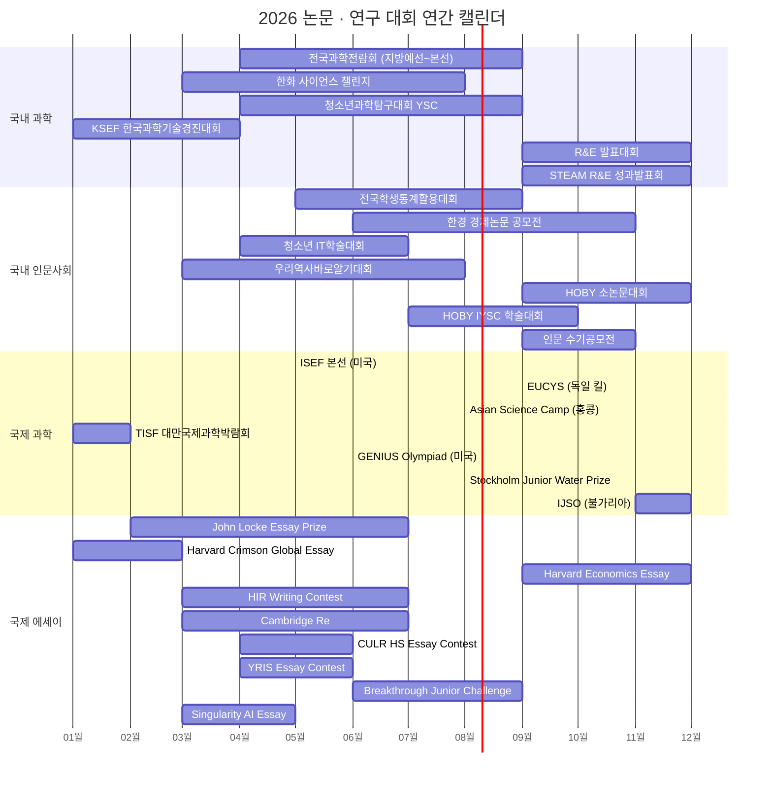
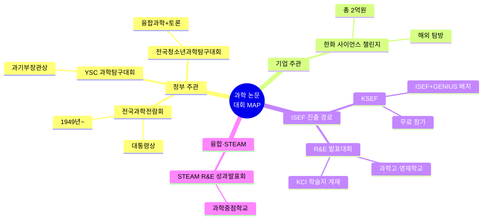
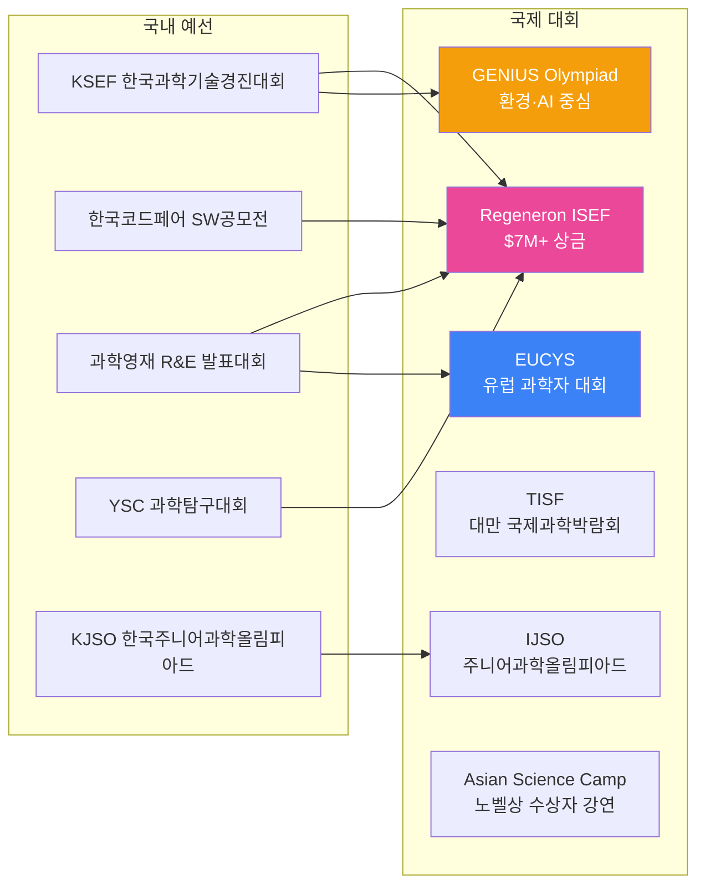
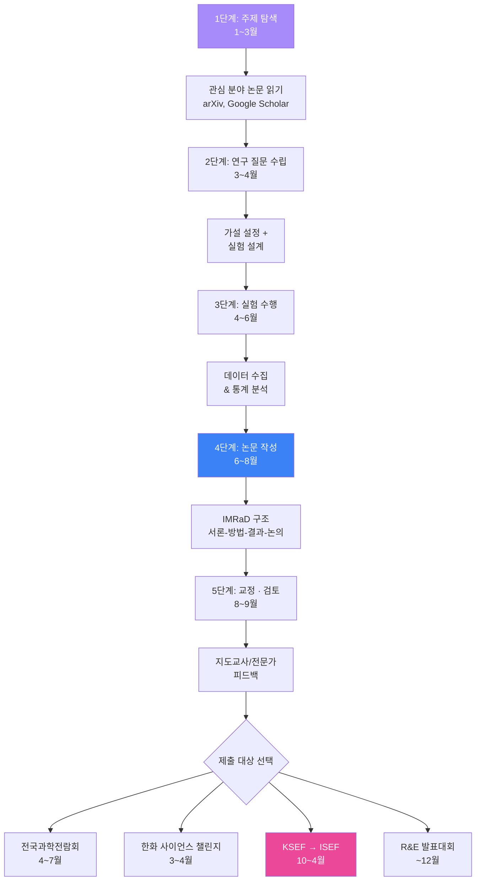
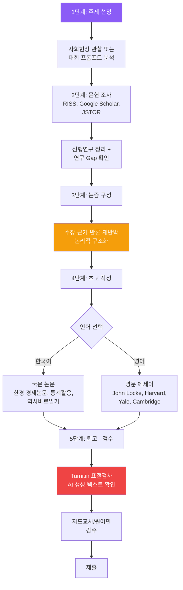
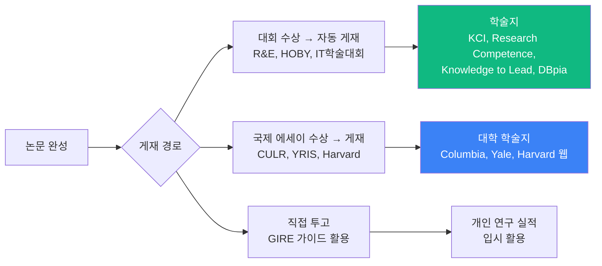

# 청소년 논문 · 연구 대회 종합 가이드

> **최종 업데이트:** 2026-06-26  
> **데이터 출처:** 각 대회 공식 웹사이트 + 리서치 에이전트 조사 결과

---

## 목차

1. [연간 일정 타임라인](#1-연간-일정-타임라인)
2. [국내 과학 논문 · 탐구 대회](#2-국내-과학-논문--탐구-대회)
3. [국내 인문 · 사회 · 경제 논문 대회](#3-국내-인문--사회--경제-논문-대회)
4. [국제 과학 연구 대회](#4-국제-과학-연구-대회)
5. [국제 에세이 · 논문 대회](#5-국제-에세이--논문-대회)
6. [논문 작성 로드맵](#6-논문-작성-로드맵)
7. [학술지 게재 경로](#7-학술지-게재-경로)
8. [분야별 · 역량별 추천 대회 매핑](#8-분야별--역량별-추천-대회-매핑)
9. [공모전 정보 사이트 모음](#9-공모전-정보-사이트-모음)

---

## 1. 연간 일정 타임라인



---

## 2. 국내 과학 논문 · 탐구 대회

### 2.1 주요 대회 일람

| 대회명 | 주최/주관 | 공식 웹사이트 | 시기 | 참가 대상 | 출품 형태 | 수상/비고 |
|--------|-----------|-------------|------|-----------|-----------|-----------|
| **제72회 전국과학전람회** | 과기정통부 · 국립중앙과학관 | [science.go.kr](https://www.science.go.kr/) | 지방예선 5~7월, 본선 8~9월 | 초/중/고, 교원, 일반 | 연구 논문 + 전시, 개인 또는 2~3인 팀 | **대통령상**, 국무총리상. 1949년부터 지속된 최고 역사 |
| **한화 사이언스 챌린지** | 한화그룹 | [sciencechallenge.or.kr](https://www.sciencechallenge.or.kr/) | 접수 3~4월, 본선 8월 | 고등학생 (2명+지도교사 1명) | 과학 연구 논문 발표 + 토론 | 총 상금 **2억원**, 대상 4,000만원. 은상 이상 해외 탐방 |
| **KSEF 한국과학기술경진대회** | 한국과학기술지원단 | [ksef.or.kr](http://www.ksef.or.kr/) | 1차 10월, 2차 ~4월 | 초(4학년+)~대학원생 | 논문/작품/포스터/PPT (3인 이내) | **ISEF · GENIUS Olympiad 진출 경로**. 참가비 무료 |
| **청소년과학탐구대회 (YSC)** | 과기정통부 · 한국과학창의재단 | [kosac.re.kr](https://www.kosac.re.kr/) | 지역 4~5월, 전국 8~9월 | 초/중/고 (2명 1팀) | 융합과학, 과학토론 | 과기정통부장관상. 약 600명 참가 |
| **과학영재 R&E 발표대회** | 과기정통부 · 한국과학창의재단 | [rne.or.kr](http://www.rne.or.kr/) | 연중 연구 → 12월 발표 | 과학고, 영재학교 (27개교) | 팀 연구 + 논문 발표 | 장관상 수상 시 KCI 학술지 게재 + **ISEF 진출 가능** |
| **STEAM R&E 성과발표회** | 교육부 · 한국과학창의재단 | [steam.kosac.re.kr](https://steam.kosac.re.kr/) | 연중 연구 → 11~12월 발표 | 과학중점학교 중/고등학생 | 융합 연구 발표 | 창의재단 이사장상 |
| **전국청소년과학탐구대회** | 과기정통부 · 한국과학창의재단 | [kosac.re.kr](https://www.kosac.re.kr/) | 지역 예선 → 11월 전국 | 초/중/고등학생 | 융합과학, 과학토론, YSC 발표 | 과기정통부장관상 |
| **GENIUS Olympiad Korea** | 한국과학기술지원단 (KSEF) | [ksef.or.kr](http://www.ksef.or.kr/) | 한국 모집 11~12월, 국제 6월 | 중/고등학생 | KSEF 국내대회 → 국제대회 배치 | 미국 뉴욕주 국제대회 금/은/동메달 |

### 2.2 과학 논문 대회 비교 차트



---

## 3. 국내 인문 · 사회 · 경제 논문 대회

### 3.1 주요 대회 일람

| 대회명 | 주최/주관 | 공식 웹사이트 | 시기 | 참가 대상 | 출품 형태 | 수상/비고 |
|--------|-----------|-------------|------|-----------|-----------|-----------|
| **한경 경제논문 공모전** (제23회) | 한국경제신문 · 한국경제학회 | [hkessay.co.kr](https://www.hkessay.co.kr/) | 접수 6~10월, 시상 11월 | 고등학생(07~09년생) + 대학생 | 국문 논문 A4 20매, 개인 또는 3인 이내 | 총 1,170만원 (대상 600만원). 지도교사 동반 필수 |
| **전국학생통계활용대회** (제28회) | 국가데이터처 · 교육부 | [통계활용대회.kr](https://www.xn--989a71jnrsfnkgufki.kr/) | 신청 5~6월, 시상 9월 | 초4~고3 (지도교사+학생 1~3명) | 통계 포스터 (데이터 수집·분석·시각화) | **교육부 장관상**, 장학금 최대 100만원 |
| **우리역사바로알기대회** (제23회) | 국사편찬위원회 · 교육부 | [history.go.kr](https://www.history.go.kr/) | 공고 3월, 예선 5월, 본선 7~8월 | 중/고등학생 (학교장 추천) | 문헌/현장 연구보고서 또는 영상 → 논술 시험 | 대상 1, 금상 3, 은상 5 등. 생기부 기재 가능 |
| **청소년 IT학술대회** (2026 하계) | 한국정보기술진흥원 (KITPA) | [kitpa.org](https://kitpa.org/) | 접수 4~7월 | 초3~고3 (최대 3인 팀) | 논문 10페이지 이내 (빅데이터·AI·디지털인문학 등) | 대상·금·은·동·장려상. **학술지·DBpia 게재** 혜택. 접수비 9만원 |
| **국제 청소년 소논문 대회** (HOBY) | HOBY Korea · 한국SW역량교육협회 | [hobykorea.com](https://www.hobykorea.com/) | 접수 ~11월 | 중1~고3 (개인 또는 3인 이내) | 영어/한국어 논문. 분야 무제한 | 대상·최우수·우수·장려상. Turnitin 표절검사. **Research Competence 저널 게재** |
| **HOBY IYSC 학술대회** (제6회) | HOBY Korea | [hobykorea.com/iysc](https://www.hobykorea.com/page/iysc) | 지원 ~9월, 학회 9~10월 | 중/고등학생 (발표 트랙은 대학 1~2학년 가능) | 3개 트랙: 발표($650)/연구역량($520)/Capstone($1,200). 영어 필수 | **Knowledge to Lead 저널 게재**. 교수진 심사·피드백 |
| **청소년 환경 에세이 대회** (HOBY) | HOBY Korea (교육부·환경부 후원) | [hobykorea.com](https://www.hobykorea.com/) | 접수 6~7월 (추정) | 중/고등학생 | 영어 800단어 / 한국어 2,000자. 탄소중립 주제 | 장관상·대사관상 등 50개 이상 수상. 42개국 참여. **무료** |
| **일상 속 인문 수기공모전** | 문화체육관광부 · 한국문화예술위원회 | [inmun360.culture.go.kr](https://inmun360.culture.go.kr/) | 접수 9~10월 | 중/고등학생 (만 13~18세) | 산문(수기) A4 2장 이내 | 대상 50만원, 최우수 25만원, 우수 15만원 |
| **YRE 환경미디어콘테스트** | 덴마크 FEE · 유네스코 | [fee-korea.org/yre](https://www.fee-korea.org/yre/) | 접수 1~2월 | 만 15~18세 (J그룹) | 기사/보고서/에세이/논문 + 사진·영상 | 국제 대회 한국 대표 선발. 44개국 참여. 등록비 2만원 |

### 3.2 인문사회 분야 논문 대회 특성 비교

```mermaid
flowchart TB
    subgraph 경제·통계
        A[한경 경제논문 공모전<br/>대상 600만원]
        B[전국학생통계활용대회<br/>교육부 장관상]
    end
    subgraph 역사·인문
        C[우리역사바로알기대회<br/>국사편찬위원회]
        D[일상 속 인문 수기공모전<br/>문화체육관광부]
    end
    subgraph IT·융합
        E[청소년 IT학술대회<br/>DBpia 게재]
    end
    subgraph 영어 논문·에세이
        F[HOBY 소논문대회<br/>저널 게재 기회]
        G[HOBY IYSC 학술대회<br/>교수진 심사]
        H[HOBY 환경에세이<br/>장관상·대사관상]
    end
    subgraph 환경
        I[YRE 환경미디어<br/>국제 대회 진출]
    end

    A --> |국문 논문| J{작성 언어}
    B --> |국문 포스터| J
    C --> |국문 보고서| J
    D --> |국문 수기| J
    E --> |국문 논문| J
    F --> |영어/국문| J
    G --> |영어 필수| J
    H --> |영어/국문| J
    I --> |국문/영문| J

    style A fill:#F59E0B,color:#fff
    style F fill:#8B5CF6,color:#fff
    style G fill:#8B5CF6,color:#fff
    style E fill:#10B981,color:#fff
```

---

## 4. 국제 과학 연구 대회

### 4.1 주요 대회 일람

| 대회명 | 주최 | 공식 웹사이트 | 시기 (2026) | 참가 대상 | 형태 | 수상/비고 |
|--------|------|-------------|------------|-----------|------|-----------|
| **Regeneron ISEF** | Society for Science | [societyforscience.org/isef](https://www.societyforscience.org/isef/) | 5월 9~15일 (피닉스) | 고등학생 (14~19세) | 22개 STEM 분야, 부스 전시+심사 | 총 **$7M+**. Innovator Award $100,000. 세계 최대 청소년 과학대회 |
| **EUCYS** | 유럽위원회 (EC) | [eucys2026](https://www.uni-kiel.de/en/eucys2026) | 9월 22~27일 (킬, 독일) | 14~20세, 국가대회 1등 | 연구 프로젝트+포스터+구술 | 1등 €7,000, 2등 €5,000. CERN·ESA 방문 특별상 |
| **Asian Science Camp** | 노벨상 수상자 공동 제안 | [asc2026.hku.hk](https://asc2026.hku.hk/) | 8월 2~8일 (홍콩대) | 17~22세 과학 전공 | 노벨상 수상자 강연+포스터 발표 | 교육적 가치 중심. 한국 국가대표단 파견 |
| **TISF 대만국제과학박람회** | 대만 국립과학교육관 (NTSEC) | [twsf.ntsec.gov.tw](https://twsf.ntsec.gov.tw/) | 1~2월 (타이베이) | 고등학생 (32개국 초청) | ISEF 표준 과학박람회 | Young Scientist Award 등. 2026년 667명 참가 |
| **GENIUS Olympiad** | Terra Science (미국) | [geniusolympiad.org](https://geniusolympiad.org/) | 6월 (로체스터, NY) | 고등학생 (9~12학년) | 과학·공학·예술·AI 등 환경 주제 | 금/은/동메달. 2026년 **AI 카테고리** 신설 |
| **Stockholm Junior Water Prize** | Stockholm Water Foundation | [stockholmwaterfoundation.org](https://stockholmwaterfoundation.org/stockholm-junior-water-prize/) | 국제 결선 8월 23~27일 (스톡홀름) | 15~20세, 물 관련 연구 | 국가 예선 → 국제 결선 | 국제 우승 **$15,000**. 40개국 참가 |
| **IJSO 국제주니어과학올림피아드** | IJSO Board | [ijsoweb.org](https://ijsoweb.org/) | 사전등록 6~7월, 대회 12월 (불가리아) | 16세 미만 | MCQ+이론+실험 | 금/은/동메달. 한국 정기 참가 (2015 주최국) |
| **Breakthrough Junior Challenge** | Breakthrough Prize Foundation | [breakthroughjuniorchallenge.org](https://breakthroughjuniorchallenge.org/) | 영상 제출 ~9월 15일 | 13~18세, 전 세계 | 2분 이내 과학 설명 영상 | 학생 **$250,000** 장학금 + 교사 $50,000 + 학교 $100,000 |
| **IRO 국제연구올림피아드** | IRO Organization | [internationalresearcholympiad.org](https://www.internationalresearcholympiad.org/) | 예선 → 결선 (하버드) | 13~18세 (6~12학년) | 3단계: MCQ → 연구제안서 → 대면 발표 | 금/은/동메달. 등록비 $25 |
| **CASTIC** | 중국 과학기술협회 | [eco4science.org](https://www.eco4science.org/castic.aspx) | 여름 (7~8월) | 12~20세 (초청) | 13개 과학 분야, 프로젝트 전시 | ISEF·EUCYS 진출 경로. 20개국 참가 |
| **I-SWEEEP** | Harmony Public Schools (미국) | [isweeep.org](http://isweeep.org/) | 4~5월 (휴스턴) | 고등학생 | 에너지·환경·공학 포스터 | 금/은/동메달. 현재 운영 여부 불확실 |

### 4.2 한국 학생의 국제 과학대회 진출 경로



---

## 5. 국제 에세이 · 논문 대회

### 5.1 주요 대회 일람

| 대회명 | 주최 | 공식 웹사이트 | 마감 (2026) | 참가 대상 | 형태 | 수상/비고 |
|--------|------|-------------|------------|-----------|------|-----------|
| **John Locke Essay Prize** | John Locke Institute (영국) | [johnlockeinstitute.com](https://www.johnlockeinstitute.com/essay-competition) | 등록 ~3/31, 제출 ~5/31 | 만 19세 미만 | 영어 2,000단어, 10개 분야 중 택1 | 분야별 1등 **$5,000**, 종합 최우수 **$10,000** + 런던 학술대회 초청. **세계 최고 권위** |
| **Harvard Crimson Global Essay** | The Harvard Crimson | [essaycomp.org](https://www.essaycomp.org/) | Early ~12/15, 정규 ~2/10 | 만 10~18세 | 영어 500단어, 3개 트랙 | 최대 **$8,000**. Harvard Crimson 인턴십·게재 기회 |
| **Harvard Economics Essay** (HIEEC) | Harvard 경제학회 (HUEA) | [thehuea.org](https://www.thehuea.org/general-8) | Fall (구체 일정 사이트 확인) | 고등학생 | 영어 1,500단어, 경제 주제 4개 중 택1 | 상위 3편 게재. **Harvard 경제학 교수 심사** (상위 10편) |
| **HIR Writing Contest** | Harvard International Review | [hir.harvard.edu/contest](https://hir.harvard.edu/contest/) | 제출 후 Defense Day | Grade 7~12 (Jr+Sr) | 영어 800~1,200단어, 국제관계 주제 | Gold/Silver/Bronze. **15분 구술심사** 포함 |
| **Cambridge Re:Think Essay** | Cambridge Centre for Intl Research | [cambridge-research.org](https://cambridge-research.org/essay-competition/) | 제출 ~5/10, 시상 7/31 | 만 11~18세 | 영어 에세이 | Gold $150 + $500 장학금. **Cambridge 대학교 시상식**. 노벨상 수상자 참석 |
| **CULR HS Essay Contest** | Columbia Law Review | [culawreview.org](https://www.culawreview.org/high-school-essay-contest) | 제출 ~6/26 | 고등학생 | 영어, 법학 주제 (2026: 이민법) | 우승작 CULR 게재. 법학·사회과학 관심 학생 적합 |
| **YRIS Essay Contest** | Yale Review of Intl Studies | [yris.yira.org](https://yris.yira.org/high-school-essay-contest/) | 제출 ~6/30 | 고등학생 | 영어 1,500단어, 국제관계 주제 | 1등 $250, 2등 $150, 3등 $100. YRIS 게재. **무료** |
| **YIRA Global Essay** | Yale Intl Relations Association | [learnwithleaders.com](https://www.learnwithleaders.com/competitions/the-yale-international-relations-essay-competition/) | Early ~12/10, 정규 ~12/30 | Grade 8~12 | 영어, 국제관계 | 상위 25% Finalist (학년별 10명). YIRA 인증서 |
| **Singularity AI Essay** | Veritas AI (MIT·Yale·Oxford) | [veritasai.com](https://www.veritasai.com/singularity-ai-essay-contest) | 제출 ~4/26 | 고등학생 | 영어 1,500단어, AI 주제 | 게재 기회 + 장학금. **완전 무료**. 이중맹검 심사 |
| **IRCYS 국제청소년연구대회** | IRCYS Organization | [ircys.eventbcs.com](https://ircys.eventbcs.com/) | Grand Final 8/13~16 | 청소년 | STEM+사회혁신, 12개 카테고리 | 40개국, ~1,200명 결선. 연구 코칭 제공 |
| **IARCO 국제학술연구대회** | IARCO | [iarco.org](https://iarco.org/) | Bootcamp 9월~, 제출 9~11월 | Junior: Grade 7~12 | 2페이지 연구제안서 → 영상 발표 | STEM·인문·경제 전 분야. 상위 100명 결선 |

### 5.2 국제 에세이 대회 난이도 · 인지도 매핑

```mermaid
quadrantChart
    title 국제 에세이 대회: 난이도 vs 입시 인지도
    x-axis "낮은 난이도" --> "높은 난이도"
    y-axis "낮은 인지도" --> "높은 인지도"

    John Locke Essay Prize: [0.85, 0.95]
    Harvard Crimson Global Essay: [0.70, 0.90]
    Harvard Economics Essay: [0.80, 0.85]
    HIR Writing Contest: [0.75, 0.80]
    Cambridge Re:Think Essay: [0.50, 0.65]
    YRIS Essay Contest: [0.55, 0.70]
    CULR HS Essay Contest: [0.65, 0.60]
    Singularity AI Essay: [0.45, 0.40]
    YIRA Global Essay: [0.40, 0.55]
```

### 5.3 국제 에세이 대회 분야별 분류

| 분야 | 해당 대회 | 비고 |
|------|----------|------|
| **경제학** | Harvard Economics Essay (HIEEC), John Locke (Economics 분야) | Harvard 교수 심사 |
| **국제관계** | HIR Writing Contest, YRIS, YIRA, John Locke (IR 분야) | Yale·Harvard 학술지 게재 |
| **법학** | CULR HS Essay Contest, John Locke (Law 분야) | Columbia Law Review 게재 |
| **철학** | John Locke (Philosophy 분야) | 세계 최고 권위 |
| **역사·정치** | John Locke (History/Politics 분야), Harvard Crimson | - |
| **과학기술·AI** | Singularity AI Essay, John Locke (Science & Technology 분야) | MIT·Oxford 심사 |
| **심리학** | John Locke (Psychology 분야) | - |
| **창작·저널리즘** | Harvard Crimson (Creative/Journalistic 트랙), Cambridge Re:Think | - |

---

## 6. 논문 작성 로드맵

### 6.1 과학 논문 (이공계) 작성 플로우



### 6.2 인문사회 논문 · 에세이 작성 플로우



### 6.3 논문 구조 비교

| 구분 | 과학 논문 (IMRaD) | 인문사회 논문 | 에세이 (Essay) |
|------|------------------|-------------|--------------|
| **구조** | 서론 → 방법 → 결과 → 논의 | 서론 → 이론적 배경 → 분석 → 결론 | 도입 → 본론(논증) → 결론 |
| **핵심** | 실험 데이터, 통계 분석 | 문헌 분석, 논리적 논증 | 명확한 주장, 창의적 관점 |
| **분량** | A4 10~20매 | A4 15~25매 | 500~2,000단어 |
| **참고문헌** | APA 또는 Vancouver | APA, Chicago, MLA | MLA, Chicago |
| **해당 대회** | 전국과학전람회, 한화, KSEF | 한경 경제논문, 통계활용, HOBY | John Locke, Harvard, Yale |

---

## 7. 학술지 게재 경로

| 경로 | 대상 학생 | 저널/게재처 | 조건 |
|------|----------|------------|------|
| **R&E 발표대회 수상** | 과학고·영재학교 | KCI 등재 학술지 "과학영재교육" | 장관상·혁신도전상 수상 |
| **HOBY 소논문대회 수상** | 중/고등학생 | Research Competence 저널 | 대상·최우수·우수상 |
| **HOBY IYSC 발표** | 중/고등학생 | Knowledge to Lead 저널 | IYSC 발표 트랙 참가자 |
| **청소년 IT학술대회 수상** | 초3~고3 | 학술지 + DBpia | 수상작 |
| **CULR Essay 우승** | 고등학생 | Columbia Law Review 웹사이트 | 우승 |
| **YRIS Essay 수상** | 고등학생 | Yale Review of Intl Studies 웹사이트 | 상위 3편 |
| **Harvard Economics Essay** | 고등학생 | HUEA 웹사이트 | 상위 3편 |
| **GIRE 개인 투고** | 중/고등학생 | 다양한 학술 플랫폼 | [gire.co.kr](https://gire.co.kr/) 가이드 참고 |



---

## 8. 분야별 · 역량별 추천 대회 매핑

### 8.1 관심 분야별 추천

| 관심 분야 | 국내 대회 | 국제 대회 |
|-----------|----------|----------|
| **물리·화학·생명과학** | 전국과학전람회, 한화 사이언스 챌린지, R&E 발표대회 | ISEF, EUCYS, TISF, GENIUS Olympiad |
| **환경·지속가능성** | HOBY 환경에세이, YRE 환경미디어 | Stockholm Junior Water Prize, GENIUS Olympiad, I-SWEEEP |
| **경제·금융** | 한경 경제논문 공모전 | Harvard Economics Essay (HIEEC), John Locke (Economics) |
| **국제관계·정치** | — | HIR Writing Contest, YRIS, YIRA, John Locke (Politics/IR) |
| **법학·사회정의** | — | CULR HS Essay Contest, John Locke (Law) |
| **역사** | 우리역사바로알기대회 | John Locke (History), Harvard Crimson |
| **통계·데이터과학** | 전국학생통계활용대회 | — |
| **AI·IT** | 청소년 IT학술대회, KSEF | Singularity AI Essay, GENIUS Olympiad (AI) |
| **철학·심리학** | — | John Locke (Philosophy/Psychology) |
| **창의적 글쓰기** | 일상 속 인문 수기공모전 | Harvard Crimson (Creative), Cambridge Re:Think |
| **종합 연구** | HOBY 소논문대회, HOBY IYSC | IRO, IRCYS, IARCO |

### 8.2 역량 수준별 추천

```mermaid
flowchart TD
    subgraph 입문 "🔰 입문 (처음 도전)"
        A1[일상 속 인문 수기공모전<br/>국문 A4 2장]
        A2[Cambridge Re:Think Essay<br/>영문, 초등~고등]
        A3[HOBY 환경에세이<br/>국문 2000자 / 영문 800단어]
    end

    subgraph 중급 "⭐ 중급 (연구 경험 1~2회)"
        B1[전국학생통계활용대회<br/>데이터 분석 포스터]
        B2[우리역사바로알기대회<br/>문헌·현장 보고서]
        B3[YRIS Essay Contest<br/>영문 1500단어]
        B4[Singularity AI Essay<br/>영문 1500단어, 무료]
    end

    subgraph 상급 "🏆 상급 (깊이 있는 연구)"
        C1[한경 경제논문 공모전<br/>A4 20매, 대상 600만원]
        C2[HOBY 소논문대회<br/>8000단어 영문 논문]
        C3[John Locke Essay Prize<br/>세계 최고 권위]
        C4[Harvard Economics Essay<br/>Harvard 교수 심사]
    end

    subgraph 최상급 "🌟 최상급 (전국+국제)"
        D1[전국과학전람회<br/>대통령상]
        D2[한화 사이언스 챌린지<br/>대상 4000만원]
        D3[KSEF → ISEF<br/>$7M+ 상금 풀]
        D4[R&E → ISEF<br/>KCI 논문 게재]
    end

    A1 --> B1
    A2 --> B3
    A3 --> B2
    B1 --> C1
    B3 --> C3
    B2 --> C2
    C1 --> D1
    C3 --> D3
    C2 --> D4
```

---

## 9. 공모전 정보 사이트 모음

| 사이트명 | URL | 특징 |
|----------|-----|------|
| **링커리어** | [linkareer.com](https://linkareer.com/) | 대학생·고등학생 공모전 종합 |
| **위비티** | [wevity.com](https://www.wevity.com/) | 공모전·대외활동 정보 |
| **콘테스트코리아** | [contestkorea.com](https://www.contestkorea.com/) | 국내 공모전 종합 |
| **올콘** | [all-con.co.kr](https://www.all-con.co.kr/) | 공모전·이벤트 정보 |
| **한국과학창의재단** | [kosac.re.kr](https://www.kosac.re.kr/) | 과학 대회 공식 |
| **KSEF** | [ksef.or.kr](http://www.ksef.or.kr/) | ISEF·GENIUS 진출 경로 |
| **HOBY Korea** | [hobykorea.com](https://www.hobykorea.com/) | 소논문·학술대회·에세이 |
| **GIRE** | [gire.co.kr](https://gire.co.kr/) | 고등학생 학술지 게재 가이드 |
| **RISS** | [riss.kr](https://www.riss.kr/) | 학술연구정보 검색 (논문 조사용) |
| **Google Scholar** | [scholar.google.com](https://scholar.google.com/) | 국제 학술논문 검색 |
| **arXiv** | [arxiv.org](https://arxiv.org/) | 이공계 프리프린트 서버 (선행연구 탐색) |

---

## 부록: 비활성 · 중단 확인 대회

| 대회명 | 상태 | 비고 |
|--------|------|------|
| Google Science Fair | **중단** (2019~) | 마지막 대회 2018-2019 |
| I-SWEEEP | **불확실** | 최근 활동 미확인, 축소 운영 가능 |
| 삼성 주니어 SW 창작대회 | **중단 추정** (2022~) | 8회 이후 개최 미확인 |
