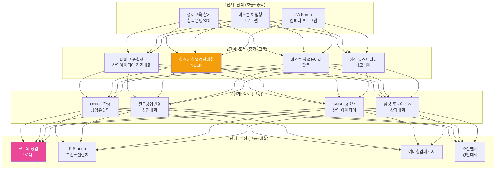
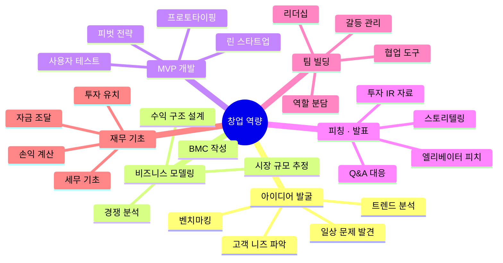
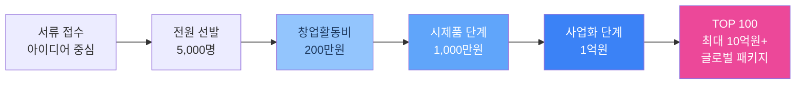
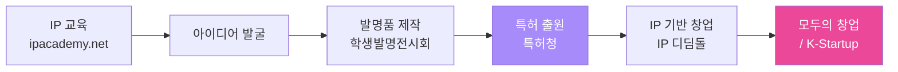
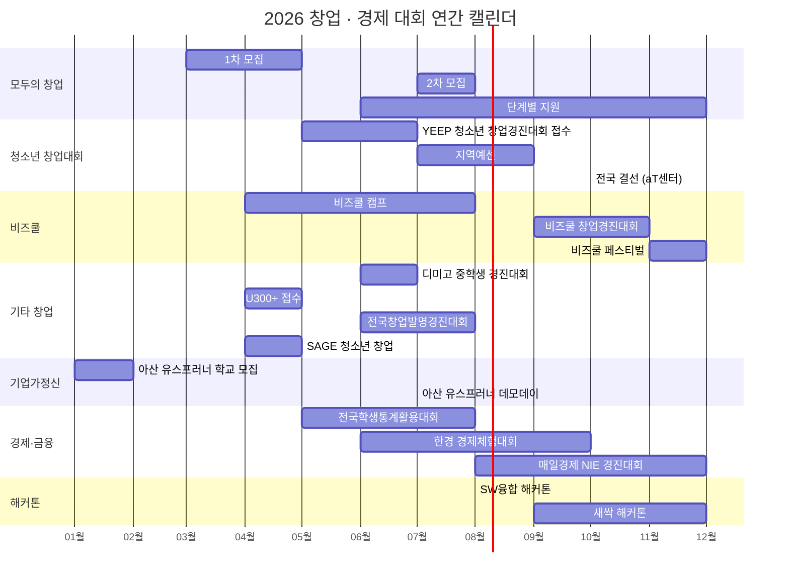

# 창업 · 비즈니스 · 경제 대회 종합 가이드

> **최종 업데이트:** 2026-06-26  
> **대상:** 초·중·고등학생 및 대학생  
> **목적:** 기업가정신 함양, 창업 역량 개발, 비즈니스 마인드 강화

---

## 목차

1. [창업 역량 개발 로드맵](#1-창업-역량-개발-로드맵)
2. [정부 주관 청소년 창업 대회](#2-정부-주관-청소년-창업-대회)
3. [모두의 창업 프로젝트](#3-모두의-창업-프로젝트)
4. [비즈쿨 프로그램](#4-비즈쿨-프로그램)
5. [대학 주관 청소년 창업 대회](#5-대학-주관-청소년-창업-대회)
6. [기업 후원 청소년 프로그램](#6-기업-후원-청소년-프로그램)
7. [기업가정신 교육 프로그램](#7-기업가정신-교육-프로그램)
8. [경제 · 금융 대회](#8-경제--금융-대회)
9. [IP(지식재산) · 발명 창업](#9-ip지식재산--발명-창업)
10. [소셜벤처 · 사회혁신 대회](#10-소셜벤처--사회혁신-대회)
11. [창업 해커톤 · 캠프](#11-창업-해커톤--캠프)
12. [연간 일정 타임라인](#12-연간-일정-타임라인)
13. [역량별 추천 대회 매핑](#13-역량별-추천-대회-매핑)
14. [공모전 · 지원 사이트 모음](#14-공모전--지원-사이트-모음)

---

## 1. 창업 역량 개발 로드맵

### 1.1 단계별 성장 경로

### 1.2 창업에 필요한 핵심 역량

---

## 2. 정부 주관 청소년 창업 대회

### 2.1 대한민국 청소년 창업경진대회

| 항목 | 내용 |
|------|------|
| **정식 명칭** | 대한민국 청소년 창업경진대회 (제12회, 2026) |
| **주최/주관** | 교육부 · 17개 시도교육청 / 한국청년기업가정신재단 |
| **공식 웹사이트** | [yeep.go.kr](https://yeep.go.kr/) |
| **접수 기간** | 2026년 5월 19일 ~ 7월 7일 |
| **지역 예선** | 서면 + 발표 심사 |
| **전국 예선** | 온라인 발표 심사 |
| **결선** | 10월, 서울 양재 aT센터 (오프라인) |
| **참가 대상** | 초·중·고 + 학교밖 청소년 (2006년 이후 출생) |
| **참가 형태** | 창업동아리 2인 이상 + 지도교사 1인 |
| **심사 기준** | 가치창출역량, 도전역량, 집단창의역량, 자기주도역량 |

#### 수상 내역

| 등급 | 상명 | 상금 | 인원 |
|------|------|------|------|
| 대상 | 부총리겸교육부장관상 | **300만원** | 1팀 |
| 최우수상 | 부총리겸교육부장관상 | 100만원 | 1팀 |
| 우수상 | 기관장상 | - | 3팀 |
| 한국청년기업가정신재단 이사장상 | 이사장상 | - | 1팀 |
| 장려상 | - | 50만원 | 15팀 |
| 입선상 | - | 30만원 | 29팀 |

> **특전:** 우수 수상팀에게 **모두의 창업 프로젝트** 서류 면제 혜택

---

### 2.2 학생 창업유망팀 300+ (U300+)

| 항목 | 내용 |
|------|------|
| **정식 명칭** | 학생 창업유망팀 300+ |
| **주최/주관** | 교육부 / 한국청년기업가정신재단 |
| **공식 웹사이트** | [u300.kr](https://u300.kr/) |
| **접수 마감** | ~5월 6일 (17:00) |
| **참가 대상** | 초·중·고·대학(원)생 (재학/휴학/수료) |
| **참가 형태** | 팀 3~5인 |
| **선발 규모** | 총 ~400팀 |

#### 트랙 구성

| 트랙 | 선발 | 대상 |
|------|------|------|
| 성장트랙 | 360팀 | 예비/초기 창업팀 |
| 도약트랙 | 40팀 | 투자 준비 단계 |
| 전문대 트랙 | 50팀 | 전문대학 학생 |
| 외국인 유학생 트랙 | 10팀 | 유학생 |

#### 혜택

- 상위 19팀 → **K-Startup 2026 본선 직행**
- 시드 투자 연계
- 오픈 이노베이션 · 국제 테크 엑스포 참가
- 멘토링, 창업 교육, 1:1 코칭

---

### 2.3 전국 중학생 창업아이디어 경진대회

| 항목 | 내용 |
|------|------|
| **정식 명칭** | 전국 중학생 창업아이디어 경진대회 |
| **주관** | 한국디지털미디어고등학교 (디미고) |
| **공식 웹사이트** | [startup.dimigo.hs.kr](https://startup.dimigo.hs.kr/) |
| **접수 기간** | 6월 9일 ~ 6월 30일 (17:00) |
| **대회 일시** | 7월 19일(토) 09:30 |
| **참가 대상** | 중2 · 중3 재학생 (중1, 휴학생 제외) |
| **참가 형태** | 온라인 예선 + 디미고 현장 본선 |

#### 수상 내역

| 등급 | 상명 | 비고 |
|------|------|------|
| 금상 | 창업진흥원장상 | 1명 |
| 은상 | 학교장상 | 1명 |
| 동상 | 학교장상 | 2명 |
| 장려상 | - | 수명 |

> **특전:** 수상자에게 **디미고 신입생 진로적성 특별전형** 지원 자격 부여

---

### 2.4 전국창업발명경진대회

| 항목 | 내용 |
|------|------|
| **정식 명칭** | 전국창업발명경진대회 (제18회) |
| **주최/주관** | 삼양라운드스퀘어, 삼양이건장학재단, 한국과학창의재단 |
| **공식 웹사이트** | [s-talk.or.kr](https://s-talk.or.kr/) |
| **접수** | 6월 9일 ~ 6월 27일 (17:00) |
| **1차 심사** | 7월 1일 |
| **발표 심사** | 7월 25일 |
| **시상식** | 8월 27일 |
| **참가 대상** | 초·중·고등학생 (발명/창업 관심) |
| **참가 형태** | 팀 1~4인, 지도교사 선택 |

---

## 3. 모두의 창업 프로젝트

> 2026년 중소벤처기업부 신설 — **전 국민 대상 창업 오디션**

| 항목 | 내용 |
|------|------|
| **정식 명칭** | 모두의 창업 프로젝트 |
| **주최/주관** | 중소벤처기업부 |
| **공식 웹사이트** | [modoo.or.kr](https://www.modoo.or.kr/) |
| **공고 근거** | 중소벤처기업부 공고 제2026-208호 |
| **1차 모집** | 2026.3.26 ~ 5.15 (약 6만명 지원) |
| **2차 모집** | 2026.7월 초 (선발 **1만명**으로 2배 확대) |
| **참가 대상** | 전 국민 (연령·직업 제한 없음) |
| **선발 규모** | 총 5,000명 → 2차 모집부터 10,000명 |
| **비수도권 비율** | **70% 이상** |

### 단계별 지원 체계

### 트랙 구성

| 트랙 | 대상 | 특징 |
|------|------|------|
| 일반/기술 트랙 | 예비창업자 또는 창업 3년 이내 | 기술·아이디어 기반 |
| 로컬 트랙 | 예비창업자 (사업자 미등록) | 지역 자원 기반 창업 |

### 추가 혜택

- 100여 개 전문 보육기관 연계 (프라이머, 퓨처플레이, 소풍커넥트, KAIST 등)
- 500여 명 선배 창업자 멘토링 (4회 이상 의무)
- 글로벌 진출 · 투자 연계
- 사무공간 지원

> **청소년 연계:** 청소년 창업경진대회 우수 수상팀에게 서류 면제 혜택 부여

---

## 4. 비즈쿨 프로그램

### 4.1 비즈쿨 개요

| 항목 | 내용 |
|------|------|
| **정식 명칭** | 청소년비즈쿨 (Bizcool) |
| **주최/주관** | 중소벤처기업부 · 창업진흥원 |
| **공식 웹사이트** | [kised.or.kr](https://www.kised.or.kr/) |
| **온라인 비즈쿨** | [ebizcool.com](https://ebizcool.com/) |
| **대상** | 초·중·고등학생 (비즈쿨 지정학교) |
| **목표** | 기업가정신 함양 + 창업 실무지식 습득 |

### 4.2 비즈쿨 하위 프로그램

| 프로그램 | 대상 | 내용 | 시기 |
|----------|------|------|------|
| **비즈쿨 캠프** | 초·중·고 | 체험형 창업 캠프 (1~3일) | 학기 중 / 방학 |
| **비즈쿨 창업동아리** | 중·고 | 학교 내 창업동아리 운영 지원 | 연중 |
| **비즈쿨 창업경진대회** | 비즈쿨 지정학교 | 비즈니스 모델 발표 + 시상 | 9~11월 |
| **비즈쿨 페스티벌** | 전체 | 전국 규모 창업 축제 | 11~12월 |
| **비즈쿨 우수기업 탐방** | 선발 학생 | 혁신 기업 현장 방문 | 수시 |
| **온라인 비즈쿨** | 누구나 | 온라인 창업 교육 콘텐츠 | 연중 |

### 4.3 비즈쿨 페스티벌 상세

| 항목 | 내용 |
|------|------|
| 규모 | 전국 비즈쿨 지정학교 참가 |
| 내용 | 창업 아이디어 발표, 마켓 체험, 기업가정신 특강 |
| 수상 | 중소벤처기업부장관상 |
| 참관 | 일반 참관객 상시 참여 가능 (별도 신청 불요) |

---

## 5. 대학 주관 청소년 창업 대회

| 대회명 | 주관 대학 | 시기 | 참가 대상 | 비고 |
|--------|-----------|------|-----------|------|
| **디미고 중학생 창업아이디어 경진대회** | 한국디지털미디어고 | 6~7월 | 중2~중3 | 디미고 특별전형 자격 |
| **춘천권 비즈쿨 창업경진대회** | 강원대 KNU 창업혁신원 | 6월 | 비즈쿨 참여 학생 | 2026 개최 확인 |
| **KAIST 창업캠프** | KAIST | 여름방학 | 고등학생 | 기업가정신 체험 |
| **서울대 HACK SNU** | 서울대 SNUSV.NET | 9~10월 | 서울대 구성원 | Primer 후원 |
| **ENACTUS Korea** | 각 대학 | 연중 | 대학생 | 사회적기업 프로젝트 |

---

## 6. 기업 후원 청소년 프로그램

| 프로그램명 | 후원 기업 | 공식 웹사이트 | 대상 | 내용 |
|-----------|-----------|--------------|------|------|
| **삼성 주니어 SW 창작대회** | 삼성전자 | [juniorsoftwarecup.com](https://www.juniorsoftwarecup.com/) | 초4~고3 (9~18세) | SW 창작물 경진대회, 교육부 후원 |
| **삼성 주니어 SW 아카데미** | 삼성전자 | [juniorsoftwareacademy.com](https://www.juniorsoftwareacademy.com/) | 중·고등학생 | SW 교육 프로그램 |
| **삼성 드림클래스** | 삼성전자 | [dreamclass.org](https://www.dreamclass.org/) | 중학생 | 진로·학습 멘토링 (대학생 멘토) |
| **POSCO DX AI Youth Challenge** | 포스코DX | [aichallenge.poscodx.com](https://aichallenge.poscodx.com/) | 만 12~18세 | AI 솔루션 창업 아이디어, 총 1,600만원 |
| **현대차 H-온드림 오디션** | 현대차 정몽구 재단 | [hyundai-dreamaudition.kr](https://www.hyundai-dreamaudition.kr/) | 사회적기업/소셜벤처 | 소셜벤처 지원 |

---

## 7. 기업가정신 교육 프로그램

### 7.1 아산 유스프러너

| 항목 | 내용 |
|------|------|
| **정식 명칭** | 아산 유스프러너 (Asan Youth-Preneur) |
| **주최/주관** | 아산나눔재단 |
| **공식 웹사이트** | [asan-nanum.org](https://asan-nanum.org/), [asanschool.org](https://asanschool.org/program/asanyouthpreneur/) |
| **2026 참여 학교** | 전국 중·고등학교 **130곳** 모집 |
| **운영 구조** | 일반운영학교 90곳 + 지역거점학교 40곳 |
| **데모데이** | 2026.7.21 서울 코엑스 D홀 (**약 3,000명** 참가) |
| **누적 실적** | 2016년 이후 960여 개 학교, 23,000여 명 교육 |

### 7.2 기타 기업가정신 프로그램

| 프로그램명 | 주최 | 대상 | 내용 |
|-----------|------|------|------|
| **JA Korea 컴퍼니 프로그램** | JA Korea | 중·고등학생 | 모의 회사 설립·운영, 글로벌 JA 네트워크 |
| **YEEP 온라인 창업체험교육** | 교육부 · 한국청년기업가정신재단 | 초·중·고 | 온라인 창업 시뮬레이션 |
| **한국청년기업가정신재단 교육** | 한국청년기업가정신재단 | 교사·학생 | 기업가정신 교원 연수, 교재 개발 |

| 사이트 | URL |
|--------|-----|
| JA Korea | [jakorea.org](https://www.jakorea.org/) |
| YEEP 플랫폼 | [yeep.go.kr](https://yeep.go.kr/) |
| 아산나눔재단 | [asan-nanum.org](https://asan-nanum.org/) |

---

## 8. 경제 · 금융 대회

### 8.1 경제 대회

| 대회명 | 주최/주관 | 공식 웹사이트 | 시기 | 참가 대상 | 비고 |
|--------|-----------|--------------|------|-----------|------|
| **한경 청소년 경제 체험대회** | 한국경제신문 | [event.all-con.co.kr](https://event.all-con.co.kr/) | 연중 | 중·고등학생 | 경제 체험 활동 |
| **전국학생통계활용대회 (제28회)** | 국가데이터처 (구 통계청) | [통계활용대회.kr](https://www.xn--989a71jnrsfnkgufki.kr/) | 5~8월 | 초4~고3 (팀 1~3인+교사) | 교육부장관상, 통계 포스터 |
| **한국경제신문 경제논문 공모전 (제23회)** | 한국경제신문 | [hkessay.co.kr](https://www.hkessay.co.kr/) | 연중 | 대학생 | 경제 논문 |
| **매일경제 NIE 경진대회 (제22회)** | 매일경제 · 청소년금융교육협의회 | - | 8~12월 | 중·고등학생 | 교육부장관상, 신문활용교육 |

### 8.2 전국학생통계활용대회 상세

| 항목 | 내용 |
|------|------|
| **접수 기간** | 2026.5.1 ~ 6.12 |
| **포스터 제출** | 2026.6.15 ~ 7.8 |
| **1차 심사 (서면)** | 7.16 |
| **2차 심사 (발표)** | 8.5~8.7 |
| **3차 심사 (면접)** | 8.19 |
| **참가 형태** | 지도교사 1인 + 학생 1~3명 |

#### 수상

| 등급 | 상명 |
|------|------|
| 대상 | **교육부 장관상** |
| 금상 | 국가데이터처장상 |
| 은상 | 시·도 교육감상 |
| 동상 | 국가데이터처장상 |

### 8.3 금융 교육 프로그램

| 프로그램명 | 주최 | 공식 웹사이트 | 대상 | 내용 |
|-----------|------|--------------|------|------|
| **1사1교 금융교육** | 금융감독원 | [fss.or.kr/edu](https://www.fss.or.kr/edu/) | 초·중·고 | 금융회사-학교 1:1 금융교육 |
| **금융감독원 e-금융교육센터** | 금융감독원 | [fss.or.kr/edu](https://www.fss.or.kr/edu/) | 누구나 | 온라인 금융교육 |
| **한국은행 청소년 경제강좌** | 한국은행 | [bok.or.kr](https://www.bok.or.kr/portal/main/contents.do?menuNo=200490) | 초4~고3 | 경제 기초 강좌 (본부·지역본부) |
| **한국은행 청소년 경제캠프** | 한국은행 | [bok.or.kr](https://www.bok.or.kr/portal/main/contents.do?menuNo=200491) | 중·고등학생 | 경제캠프 |
| **경제교육 포털** | 기획재정부 · KDI | [econedu.go.kr](https://www.econedu.go.kr/) | 전 국민 | 생애주기별 경제교육 |
| **청소년금융교육협의회** | 청소년금융교육협의회 | [fq.or.kr](https://fq.or.kr/) | 청소년 | 금융 이해력 향상 교육 |
| **한국신문협회 NIE 패스포트** | 한국신문협회 | [presskorea.or.kr](https://www.presskorea.or.kr) | 초·중·고 (선착순) | 총 880만원, 대상 100만원 |

---

## 9. IP(지식재산) · 발명 창업

| 프로그램/대회명 | 주최 | 공식 웹사이트 | 대상 | 내용 |
|---------------|------|--------------|------|------|
| **IP 아카데미 (지식재산 디지털 교육)** | 특허청 · 한국발명진흥회 | [ipacademy.net](https://www.ipacademy.net/) | 전 국민 | 무료 온라인 IP 교육 |
| **IP CAMPUS** | 한국발명진흥회 | [kipa.org/ipcampus](https://www.kipa.org/ipcampus/) | 학생·일반 | IP 교육 프로그램 |
| **IP 마이스터 프로그램** | 특허청 | [kipo.go.kr](https://www.kipo.go.kr/) | 특성화고·마이스터고 | 산업 이슈 → 아이디어 → 특허 |
| **IP 디딤돌 프로그램** | 특허청 | [kipo.go.kr](https://www.kipo.go.kr/) | 소상공인/예비창업자 | IP 기반 창업 지원 |
| **전국학생과학발명품경진대회** | 과기정통부·교육부·특허청 | [science.go.kr](https://www.science.go.kr/) | 초·중·고 | 국무총리상, 발명품 출품 |
| **대한민국 학생발명전시회** | 특허청 · 한국발명진흥회 | [ip-edu.net](https://www.ip-edu.net/) | 초·중·고 | 특허청장상, 발명 아이디어 |
| **학생 창의력 챔피언대회** | 특허청 · 한국발명진흥회 | [ip-edu.net](https://www.ip-edu.net/) | 초·중·고 (4~6인 팀) | 특허청장상, 표현+즉석+제작 과제 |
| **착한 아이디어 경진대회** | 한국발명진흥회 | [ipmarket.or.kr/idearo](https://www.ipmarket.or.kr/idearo/) | 누구나 | 아이디어 거래 최대 300만원 |

### IP 창업 연계 경로

---

## 10. 소셜벤처 · 사회혁신 대회

| 대회명 | 주최/주관 | 공식 웹사이트 | 시기 | 참가 대상 | 비고 |
|--------|-----------|--------------|------|-----------|------|
| **소셜벤처 혁신경연대회 (제8회)** | 고용노동부 · 한국사회적기업진흥원 | [bizinfo.go.kr](https://www.bizinfo.go.kr/) | 연중 | 소셜벤처/예비 사회적기업 | 고용노동부장관상 |
| **SAGE 청소년 창업 아이디어 대회** | SAGE Korea | - | ~5월 | 만 15~18세 (6인 이내 팀) | UN SDGs 연계, SAGE World Cup |
| **현대차 H-온드림 오디션** | 현대차 정몽구 재단 | [hyundai-dreamaudition.kr](https://www.hyundai-dreamaudition.kr/) | 연중 | 소셜벤처 | 사업화 지원금 |
| **경기도 청소년 사회혁신 아이디어 대회** | 경기도사회적경제원 | [gsic.or.kr](https://gsic.or.kr/) | ~9월 | 초·중·고 (경기도) | 지역 대회 |
| **국제청소년환경미디어콘테스트 (YRE)** | FEE Korea | [fee-korea.org/yre](https://www.fee-korea.org/yre/) | 12~2월 | 만 8~25세 | 환경 사회혁신, 44개국 |

---

## 11. 창업 해커톤 · 캠프

### 11.1 청소년 대상

| 대회/프로그램명 | 주최/주관 | 시기 | 참가 대상 | 비고 |
|---------------|-----------|------|-----------|------|
| **비즈쿨 캠프** | 중소벤처기업부 · 창업진흥원 | 학기 중/방학 | 비즈쿨 학교 학생 | 1~3일 체험형 |
| **아산 유스프러너 데모데이** | 아산나눔재단 | 7.21 (코엑스) | 참여 학교 학생 | 3,000명 규모 |
| **YEEP 창업 체험 교육** | 교육부 · 청년기업가정신재단 | 연중 | 초·중·고 | 온라인 시뮬레이션 |

### 11.2 대학생/일반 대상

| 대회명 | 주최/주관 | 공식 웹사이트 | 시기 | 참가 대상 | 상금 |
|--------|-----------|--------------|------|-----------|------|
| **대한민국 SW융합 해커톤 (제12회)** | 과기정통부 · NIPA | [swhackathon.kr](https://swhackathon.kr/) | 8월 (무박 3일) | 만 15세 이상 (2~5인) | **4,800만원** |
| **스타트업 위크엔드 서울** | Techstars | - | 분기별 | 누구나 | 창업 피칭 → 팀빌딩 → MVP |
| **K-디지털 트레이닝 해커톤 (제7회)** | 고용노동부 | [k-digitalhackathon.kr](http://www.k-digitalhackathon.kr/) | 연중 | K-디지털 훈련생 (3~6인) | **6,580만원** |
| **새싹 해커톤 (SeSAC)** | 서울경제진흥원 | [sesac.seoul.kr](https://sesac.seoul.kr/) | 9~12월 | 만 15~39세 (2인+) | 대상 500만원 |

---

## 12. 연간 일정 타임라인

---

## 13. 역량별 추천 대회 매핑

| 개발하고 싶은 역량 | 초·중학생 추천 | 고등학생 추천 | 대학생 추천 |
|-------------------|---------------|--------------|-------------|
| **아이디어 발굴** | 비즈쿨 캠프, JA Korea | YEEP 창업경진대회, SAGE | 모두의 창업, 스타트업 위크엔드 |
| **비즈니스 모델링** | 디미고 중학생 대회 | 비즈쿨 경진대회, U300+ | K-Startup, 예비창업패키지 |
| **기업가정신** | JA Korea 컴퍼니 | 아산 유스프러너 | ENACTUS |
| **피칭/발표** | 비즈쿨 페스티벌 | 청소년 창업경진대회 결선 | 모두의 창업 데모데이 |
| **기술 창업** | 삼성 주니어 SW | POSCO DX AI Challenge | SW융합 해커톤 |
| **사회혁신** | 경기도 사회혁신 | SAGE, YRE 환경미디어 | 소셜벤처 경연대회, H-온드림 |
| **발명·특허** | 학생발명전시회 | 발명품경진대회, 창의력챔피언 | IP 디딤돌, 착한 아이디어 |
| **경제·금융** | 한국은행 경제강좌 | 통계활용대회, NIE 경진대회 | 한경 경제논문 공모전 |
| **데이터 분석** | 통계활용대회 초등부 | 통계활용대회 고등부, DACON | Kaggle, 전국민 AI 경진대회 |

---

## 14. 공모전 · 지원 사이트 모음

### 14.1 창업 지원 플랫폼

| 사이트 | URL | 설명 |
|--------|-----|------|
| **모두의 창업** | [modoo.or.kr](https://www.modoo.or.kr/) | 중기부 창업 오디션 플랫폼 |
| **YEEP** | [yeep.go.kr](https://yeep.go.kr/) | 교육부 청소년 창업체험교육 |
| **K-Startup** | [k-startup.go.kr](https://www.k-startup.go.kr/) | 정부 통합 창업 포털 |
| **온라인 비즈쿨** | [ebizcool.com](https://ebizcool.com/) | 비즈쿨 온라인 교육 |
| **창업진흥원** | [kised.or.kr](https://www.kised.or.kr/) | 비즈쿨, 예비창업패키지 등 |
| **기업마당** | [bizinfo.go.kr](https://www.bizinfo.go.kr/) | 정부 창업지원사업 통합 검색 |
| **U300+** | [u300.kr](https://u300.kr/) | 학생 창업유망팀 |

### 14.2 기업가정신 교육

| 사이트 | URL | 설명 |
|--------|-----|------|
| **아산나눔재단** | [asan-nanum.org](https://asan-nanum.org/) | 아산 유스프러너 |
| **아산 기업가정신 스쿨** | [asanschool.org](https://asanschool.org/) | 교육 프로그램 |
| **JA Korea** | [jakorea.org](https://www.jakorea.org/) | 경제·창업 교육 |

### 14.3 경제·금융 교육

| 사이트 | URL | 설명 |
|--------|-----|------|
| **경제교육 포털** | [econedu.go.kr](https://www.econedu.go.kr/) | KDI 경제교육 |
| **한국은행 경제교육** | [bok.or.kr](https://www.bok.or.kr/) | 청소년 경제강좌·캠프 |
| **금융감독원 e-금융교육** | [fss.or.kr/edu](https://www.fss.or.kr/edu/) | 금융교육 |
| **청소년금융교육협의회** | [fq.or.kr](https://fq.or.kr/) | 금융 이해력 교육 |

### 14.4 IP·발명 교육

| 사이트 | URL | 설명 |
|--------|-----|------|
| **IP 아카데미** | [ipacademy.net](https://www.ipacademy.net/) | 지식재산 디지털 교육 |
| **IP CAMPUS** | [kipa.org/ipcampus](https://www.kipa.org/ipcampus/) | 발명·IP 교육 |
| **발명교육포털** | [ip-edu.net](https://www.ip-edu.net/) | 발명 대회 총괄 |
| **특허청** | [kipo.go.kr](https://www.kipo.go.kr/) | IP 마이스터, IP 디딤돌 |

### 14.5 공모전 정보 포털

| 사이트 | URL | 설명 |
|--------|-----|------|
| **콘테스트코리아** | [contestkorea.com](https://www.contestkorea.com/) | 국내 최대 공모전 포털 |
| **올콘** | [all-con.co.kr](https://www.all-con.co.kr/) | 공모전·대회 정보 |
| **위비티** | [wevity.com](https://www.wevity.com/) | 공모전·대외활동 |
| **링커리어** | [linkareer.com](https://linkareer.com/) | 대외활동·공모전 |
| **씽굿** | [thinkcontest.com](https://www.thinkcontest.com/) | 공모전 모음 |
