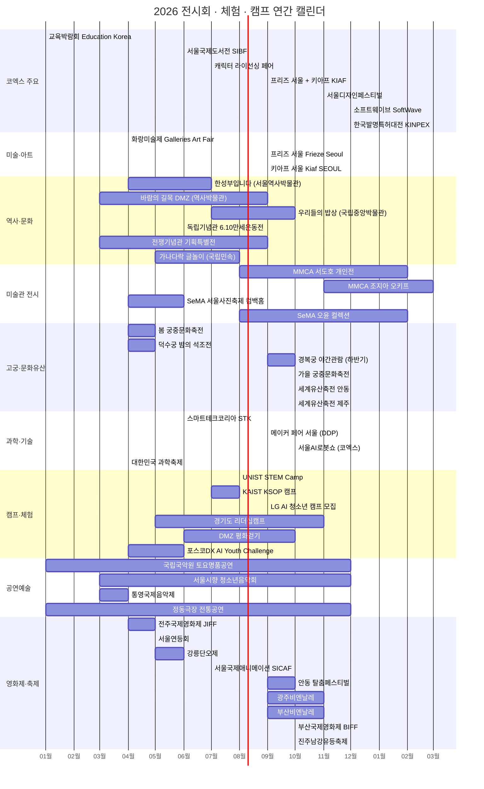
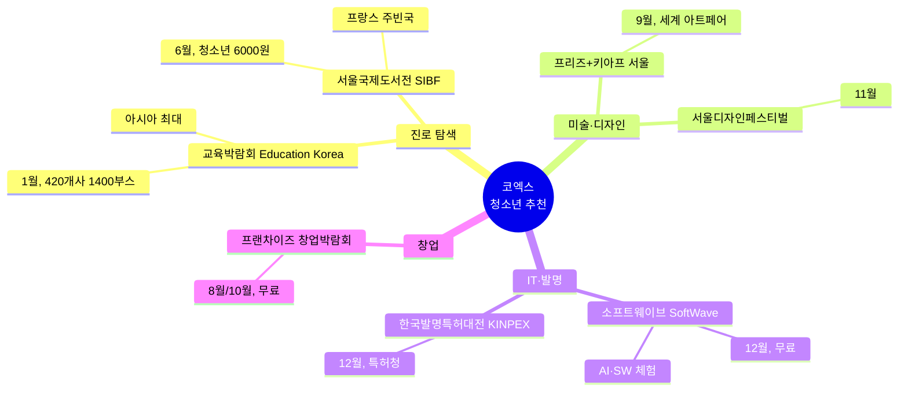
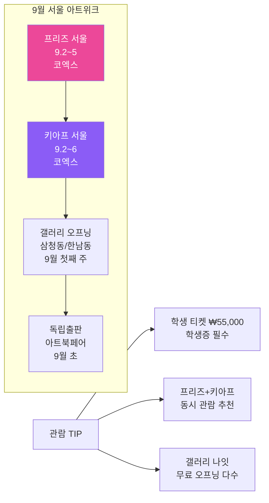
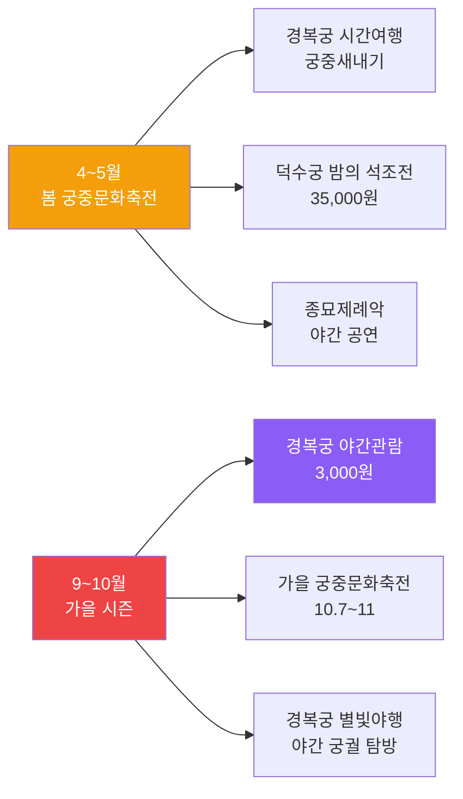
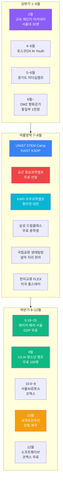
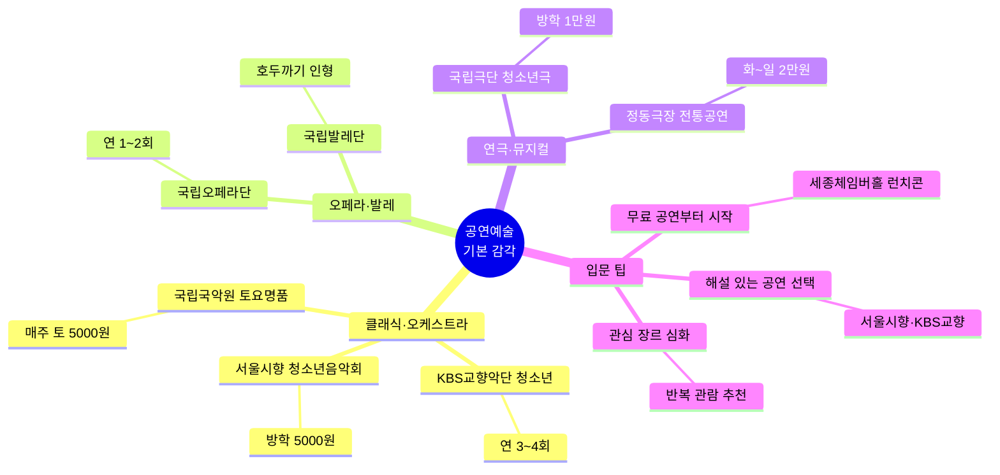

# 전시회 · 체험 · 캠프 종합 가이드

> **최종 업데이트:** 2026-06-26  
> **데이터 출처:** 코엑스 공식 캘린더 + 각 기관 공식 웹사이트 + 리서치 에이전트 조사 결과

---

## 목차

1. [연간 일정 타임라인](#1-연간-일정-타임라인)
2. [코엑스 전시회 · 박람회 일정](#2-코엑스-전시회--박람회-일정)
3. [미술 · 아트페어](#3-미술--아트페어) — 전국 주요 미술관 포함
4. [역사 · 문화 전시회](#4-역사--문화-전시회) — MMCA · SeMA 2026 전시 포함
5. [고궁 · 문화유산 체험](#5-고궁--문화유산-체험) — 세계유산축전 · 한글의 해 포함
6. [박물관 · 미술관 청소년 프로그램](#6-박물관--미술관-청소년-프로그램)
7. [과학 · 기술 전시회](#7-과학--기술-전시회) — 과학관 특별전 포함
8. [청소년 캠프 · 체험 프로그램](#8-청소년-캠프--체험-프로그램) — 기업·글로벌·항공우주·생태 캠프 포함
9. [정보 사이트 모음](#9-정보-사이트-모음)
10. [공연예술 · 음악](#10-공연예술--음악) — 클래식·연극·발레·국악
11. [영화제 · 미디어아트](#11-영화제--미디어아트) — BIFF·광주비엔날레·팀랩
12. [지역 전통 축제 · 문화행사](#12-지역-전통-축제--문화행사) — 전국 전통 축제
13. [감각 개발 캠프 · 창작 워크숍](#13-감각-개발-캠프--창작-워크숍) — 사진·영상·음악·인문·요리
14. [부록 A: 청소년 미술 공모전](#부록-a-청소년-미술-공모전)
15. [부록 B: 청소년 입장료 요약](#부록-b-청소년-입장료-요약)

---

## 1. 연간 일정 타임라인



---

## 2. 코엑스 전시회 · 박람회 일정

> 코엑스 공식 일정: [coex.co.kr/event/full-schedules](https://www.coex.co.kr/event/full-schedules/)

### 2.1 2026 하반기 코엑스 주요 행사 (7~12월)

| 월 | 행사명 | 날짜 | 홀 | 입장료 | 대상 | 주요 내용 |
|----|--------|------|----|--------|------|-----------|
| **7월** | **in-cosmetics Korea** | 7.1~3 | Hall C,D,E | B2B 사전등록 | 화장품 업계 | 퍼스널케어 원료 전문 전시 |
| | **InterCHARM Korea** | 7.1~3 | 코엑스 | B2B 사전등록 | 뷰티 업계 | 500개+ 전시업체, 40,000명 방문 |
| | **비건·클린뷰티페어** | 7.16~18 | Hall D | 미확인 | 일반/업계 | 비건·클린뷰티 제품 전시 |
| | **캐릭터 라이선싱 페어** | 7.16~19 | 코엑스 | 사전등록 무료 | 일반/업계 | 캐릭터 IP 라이선싱, 한국콘텐츠진흥원 |
| | **K-PET FAIR** | 7.17~ | 코엑스 | 미확인 | 반려인 | 반려동물 용품·서비스 |
| | **K-Display** | 7.22~24 | 코엑스 | B2B | 디스플레이 업계 | 디스플레이 기술·장비 |
| **8월** | **Korea Build Week** | 8.5~8 | 코엑스 | B2B/일반 | 건축/인테리어 | 한국 최대 건축·건설·인테리어 전시 |
| | **프리뷰 인 서울 PIS** | 8.19~21 | Hall A,E | B2B | 섬유/패션 | 제27회, 515개사 11개국 텍스타일 소재전 |
| | **CPHI / Hi Korea** | 8.25~27 | 코엑스 | B2B | 제약/바이오 | 건강소재 산업 전시 |
| | **프랜차이즈 창업박람회** | 8.25~27 | Hall D | 사전등록 무료 | 예비 창업자 | 프랜차이즈 창업 정보·상담 |
| | **EV TREND KOREA** | 8.25~27 | 코엑스 | 미확인 | 일반/업계 | 서울 유일 전기차 엑스포 |
| **9월** | **프리즈 서울 Frieze Seoul** | 9.2~5 | 코엑스 | 유료 | 미술 컬렉터/일반 | 30개국 125개+ 갤러리, 세계 3대 아트페어 |
| | **키아프 서울 Kiaf SEOUL** | 9.2~6 | 코엑스 | 유료 | 미술 컬렉터/일반 | 25주년, 18개국 175개 갤러리 |
| | **베페 베이비페어** (제50회) | 9.10~13 | 코엑스 | 회원 무료 | 부모/예비부모 | 국내 최대 임신·출산·육아 전시 |
| | **KOREA LIFE SCIENCE WEEK** | 9.21~22 | Hall D | B2B | 생명과학 | 7,000명+ 과학자·전문가 참여 |
| **10월** | **IFS 프랜차이즈 박람회** | 10.22~24 | Hall C | 사전등록 무료 | 예비 창업자 | 국내 최대 프랜차이즈 산업 박람회 |
| **11월** | **서울디자인페스티벌** | 11.26~29 | 코엑스 | 유료 | 디자이너/일반 | 서울 대표 디자인 축제 |
| | **인벤타리오 문구페어** | 11월 | 코엑스 | 미확인 | 문구 애호가 | 라이프스타일 문구 페어 |
| **12월** | **소프트웨이브 SoftWave** | 12.2~4 | Hall A | **무료** | IT/SW/AI | AI·SW 중심 B2B 플랫폼 |
| | **한국발명특허대전 KINPEX** | 12월 초 | 코엑스 | 미확인 | 발명가/일반 | 우수 발명품 전시·시상, 특허청 주최 |
| | **서울국제발명전시회** | 12월 | 코엑스 | 미확인 | 발명/특허 | 국제 발명 전시 |
| | **더 메종 The Maison** | 12월 | 코엑스 | 미확인 | 인테리어/리빙 | 프리미엄 리빙 페어 |

### 2.2 청소년 추천 코엑스 행사 TOP 7



### 2.3 이미 종료된 상반기 주요 행사 (참고)

| 행사명 | 날짜 | 비고 |
|--------|------|------|
| 스타트업 채용 박람회 | 1.10~11 | 80개사 참여 |
| 교육박람회 Education Korea | 1.21~23 | 아시아 최대 교육박람회 |
| 스마트공장·자동화산업전 AW | 3.4~6 | 로보틱스, AI 팩토리 |
| InterBattery Seoul | 3.11~13 | 배터리 산업전 |
| 화랑미술제 Galleries Art Fair | 4.8~12 | 국내 최초 아트페어 |
| ENVEX 국제환경기술전 | 5.20~22 | 제47회 환경기술 |
| 서울국제관광전 SITF | 6.4~7 | 40개국 423개 기관 |
| **스마트테크 코리아 STK** | 6.10~12 | 16개국 620개사 AI·로봇·빅데이터 |
| **서울국제도서전 SIBF** | 6.24~28 | 주빈국 프랑스 |

---

## 3. 미술 · 아트페어

### 3.1 주요 아트페어 일람

| 행사명 | 주최 | 공식 웹사이트 | 날짜 | 장소 | 입장료 | 특징 |
|--------|------|-------------|------|------|--------|------|
| **프리즈 서울 Frieze Seoul** (제4회) | Frieze | [frieze.com/fairs/frieze-seoul](https://www.frieze.com/fairs/frieze-seoul) | 9.2~5 | 코엑스 | 일반 ₩70,000+ / **학생 ₩55,000** | 30개국 125개+ 갤러리. **세계 3대 아트페어**. Material Practice·Spotlight 신규 섹션 |
| **키아프 서울 Kiaf SEOUL** (25주년) | 한국화랑협회 | [kiaf.org](https://kiaf.org/) | 9.2~6 | 코엑스 | 유료 | 18개국 175개 갤러리. 키아프 갤러리즈/키아프 플러스/솔로 부스 |
| **화랑미술제 Galleries Art Fair** | 한국화랑협회 | [galleriartfair.com](http://www.galleriartfair.com/) | 4.8~12 (종료) | 코엑스 Hall C,D | 유료 | 국내 최초 아트페어 |
| **서울디자인페스티벌** | — | [instagram: designfestival.kr](https://www.instagram.com/designfestival.kr/) | 11.26~29 (예상) | 코엑스 | 유료 | 서울 대표 디자인 축제 |

### 3.2 전국 주요 미술관 2026 기획전

| 미술관 | 2026 주요 기획전 | 기간 | 입장료 | 특징 |
|--------|----------------|------|--------|------|
| **리움미술관** (서울 한남) | 2026 컬렉션 하이라이트전 | 연중 | 성인 20,000원 / 청소년 10,000원 | 이건희 컬렉션·국보급 고미술+현대미술 동시 전시. [leeum.org](https://www.leeum.org/) |
| **아모레퍼시픽미술관 APMA** (서울 용산) | 2026 테마 기획전 | 하반기 | **무료** | 건축·디자인·공예·회화 복합 전시. [apma.or.kr](https://apma.or.kr/) |
| **서울공예박물관** | 공예 테마 특별전 | 연중 | **무료** | 조선~현대 공예 상설+기획전. [craftmuseum.seoul.go.kr](https://craftmuseum.seoul.go.kr/) |
| **국립아시아문화전당 ACC** (광주) | 아시아 창제작 레지던시 결과전 | 연중 | **무료** | 국내 최대 복합문화공간. 라이브러리·극장·전시관 통합. [acc.go.kr](https://www.acc.go.kr/) |
| **부산현대미술관 MoCA Busan** | 2026 국제 현대미술전 | 연중 | 청소년 **무료** | 을숙도 소재, 생태·자연·현대미술. [moca.busan.go.kr](https://www.moca.busan.go.kr/) |
| **대구미술관** | 근현대 한국화 특별전 | 연중 | 청소년 **무료** | 근현대 한국 미술사 주제 기획전. [daeguartmuseum.or.kr](https://www.daeguartmuseum.or.kr/) |
| **예술의전당 한가람미술관** (서울) | 세계 명화·특별전 | 연중 | 전시별 상이 | 대규모 해외 기획전 유치. [sac.or.kr](https://www.sac.or.kr/) |
| **DDP 동대문디자인플라자** | 서울디자인재단 기획전 | 연중 | 전시별 **무료~유료** | 디자인·패션·건축·기술 복합 전시. [ddp.or.kr](https://www.ddp.or.kr/) |

### 3.3 프리즈 + 키아프 서울 아트위크 안내



---

## 4. 역사 · 문화 전시회

### 4.1 주요 박물관 전시 일정

| 전시명 | 장소 | 날짜 | 입장료 | 주요 내용 |
|--------|------|------|--------|-----------|
| **BURTYNSKY: 추출/추상** | 서울역사박물관 기획전시실A | ~3.2 (종료) | 무료 | 한-캐나다 문화교류 기념 사진·미술 특별전 |
| **한글편지, 문안 아뢰옵고** | 서울역사박물관 기획전시실B | ~3.2 (종료) | 무료 | 기증유물 한글 편지 특별전 |
| **100년 전 그날을 보다: 6.10만세운동** | 독립기념관 제7전시관 (천안) | 6.10~ | **무료** | 1926년 6.10만세운동 100주년 기념 특별기획전 |
| **김구 탄생 150주년 AI영상 공모** | 독립기념관 | 4.10~ | 무료 | 유네스코 기념해 계기 AI영상 국민공모 |
| **VR탐험 - 고대 이집트, 쿠푸왕의 피라미드** | 전쟁기념관 특별전시실 | 2.14~3.14 (종료) | 유료 | 몰입형 VR 체험 |
| **전쟁기념관 기획특별전** | 전쟁기념관 특별전시실 | 3.17~9.30 | 유료 | 상세 미공개 |
| **한성부입니다** | 서울역사박물관 기획전시실A | 4.30~7.12 | **무료** | 조선시대 한성부 유물 90건 99종 전시 |
| **우리들의 밥상** | 국립중앙박물관 특별전시실2 | 7.1~10.25 | 무료 (7.1~5 개막기념) | 무령왕릉 출토 그릇 등 420여건. 매일 16시 문화해설 |
| **어메이징 타일랜드** | 국립중앙박물관 특별전시실1 | 6.23~9.6 | 유료 (청소년 할인) | 태국미술명품전 |
| **바람의 길목 DMZ** | 대한민국역사박물관 3층 | ~9.13 | **무료** | 6.25전쟁 후 73년 DMZ 사진 80여점 |
| **가나다락 — 글놀이 말놀이** | 국립민속박물관 기획전시실2 | 5.13~8.30 | **무료** | 한글날 100돌 기념. 20여 가지 체험 콘텐츠 |

### 4.2 국립현대미술관 (MMCA) 2026 전시

> 만 24세 미만 무료 / 수·토 야간(18~21시) 전 연령 무료 / [mmca.go.kr](https://www.mmca.go.kr/)

| 전시명 | 장소 | 기간 | 입장료 | 주요 내용 |
|--------|------|------|--------|-----------|
| **서도호 대규모 개인전** | MMCA 서울관 | 8월~2027.2 | 미정 | 한국 대표 설치미술가 사상 최대 회고전. 드로잉 국내 최초 공개 |
| **이것은 개념미술이 (아니)다** | MMCA 서울관 | 2026년 | 미정 | 1990년대 한국 현대미술 개념적 경향 조명 |
| **읽기의 기술: 종이에서 픽셀로** | MMCA 서울관 | 2026년 | 미정 | 그래픽디자인의 변천 |
| **파리의 이방인** | MMCA 덕수궁관 | 2026년 | 미정 | 한불수교 140주년 기념. 프랑스 이주 작가 조명 |
| **로드 무비: 1945년 이후 한일 미술** | MMCA | 2026년 | 미정 | 한일 국교 정상화 60주년 기념전 |
| **조지아 오키프와 미국 모던아트** | MMCA 과천관 | 11월~ | 미정 | 미국 모더니즘 회화 국제 교류전 |

### 4.3 서울시립미술관 (SeMA) 2026 전시

> [sema.seoul.go.kr](https://sema.seoul.go.kr/)

| 전시명 | 장소 | 기간 | 입장료 | 주요 내용 |
|--------|------|------|--------|-----------|
| **2026 서울사진축제 "컴백홈"** | 서울시립 사진미술관 | 4.9~6.14 | **무료** | 5년 만에 부활. 23명 작가, 서울 24곳 연계 |
| **조숙진 조각전** | 남서울미술관 | 7.29~11.15 | 미정 | 연례 조각가 개인전 |
| **오윤 컬렉션** | SeMA 미술아카이브 | 8.27~2027.2.21 | 미정 | 1980년대 민중미술 대표 작가 작고 40주기 |
| **린 허쉬만 리슨** | SeMA 서소문본관 | 10월~ | 미정 | 미국 원로 미디어아티스트 60년 작업 |
| **사운드는 언제나 살아있었다** | 북서울미술관 | 12월~ | 미정 | 한국·폴란드·독일 국제기획전 |

### 4.4 상설 전시 (연중 관람 가능)

| 장소 | 주요 전시 | 관람시간 | 입장료 | 웹사이트 |
|------|----------|---------|--------|----------|
| **국립중앙박물관** | 한국 역사·문화 상설전시 | 10:00~18:00 (수·토 ~21:00) | **무료** | [museum.go.kr](https://www.museum.go.kr/) |
| **서울역사박물관** | 서울의 역사 상설전시 | 09:00~18:00 | **무료** | [museum.seoul.go.kr](https://museum.seoul.go.kr/) |
| **전쟁기념관** | 한국전쟁실, 해외파병실, 호국추모실 | 09:30~18:00 | **무료** (상설) | [warmemo.or.kr](https://www.warmemo.or.kr:8443/) |
| **독립기념관** | 7개 전시관 독립운동 역사 | 09:30~18:00 (3~10월) | **무료** | [i815.or.kr](https://i815.or.kr/) |
| **국립민속박물관** | 한국인의 생활문화 | 09:00~18:00 | **무료** | [nfm.go.kr](https://www.nfm.go.kr/) |
| **대한민국역사박물관** | 근현대사 상설전시 | 10:00~18:00 (수·토 ~21:00) | **무료** | [much.go.kr](https://www.much.go.kr/) |
| **국립한글박물관** | 한글의 역사와 가치 | 10:00~18:00 | **무료** | [hangeul.go.kr](https://www.hangeul.go.kr/) |
| **국립고궁박물관** | 조선·대한제국 왕실 문화 | 10:00~18:00 (수·토 ~21:00) | **무료** | [gogung.go.kr](https://www.gogung.go.kr/) |

> 대부분의 국립/시립 박물관은 **청소년 무료 입장**입니다.

---

## 5. 고궁 · 문화유산 체험

### 5.1 경복궁 야간관람

| 항목 | 내용 |
|------|------|
| **행사명** | 2026 경복궁 야간관람 (하반기) |
| **날짜** | 9.1~10.30 (예정) |
| **시간** | 19:00~21:30 (입장마감 20:30) |
| **운영일** | 매주 수~일 (월/화 휴궁) |
| **입장료** | 3,000원 / **한복 착용 시 무료** / 만 6세 이하·만 65세 이상 무료 |
| **예매** | 8.15 오전 10시 오픈, 선착순 1일 3,000매 |
| **예매처** | [궁능유적본부 통합예약](https://royal.khs.go.kr/ROYAL/contents/R601000000.do) |
| **관람 권역** | 광화문~근정전~경회루~사정전~강녕전~교태전~아미산 |

### 5.2 덕수궁 밤의 석조전

| 항목 | 내용 |
|------|------|
| **행사명** | 2026 덕수궁 밤의 석조전 |
| **날짜** | 상반기: 4.8~5.17 (종료) / 하반기: 추후 공지 |
| **시간** | 1회차 18:00, 2회차 18:40, 3회차 19:15 |
| **입장료** | 35,000원 (1인 2매까지) |
| **예매처** | 티켓링크 (추첨제 → 잔여석 일반 예매) |
| **내용** | 석조전 내부 야간 탐방 + 클래식 연주 + 궁중병과·약차 + 창작 뮤지컬 |
| **주관** | [국가유산진흥원](https://www.kh.or.kr/) |

### 5.3 궁중문화축전

| 행사명 | 날짜 | 장소 | 주요 프로그램 |
|--------|------|------|-------------|
| **2026 봄 궁중문화축전** | 4.24~5.3 (종료) | 경복궁, 창덕궁, 덕수궁, 창경궁, 경희궁, 종묘 | 개막제, 궁중새내기, 효명세자와 달의 춤, 왕비의 취향, 100인의 태평지악, K-Heritage 마켓, 스탬프 투어 |
| **2026 가을 궁중문화축전** | 10.7~11 (예정) | 경복궁, 창덕궁, 덕수궁, 창경궁, 경희궁, 종묘 | 상세 프로그램 미공개 |

> 공식 웹사이트: [kh.or.kr/fest](https://www.kh.or.kr/fest)

### 5.4 세계유산축전 2026

| 행사명 | 날짜 | 장소 | 입장료 | 주요 내용 |
|--------|------|------|--------|-----------|
| **세계유산축전 — 안동 하회마을** | 10.9~25 | 안동 하회마을 일대 | **무료** (일부 유료) | 하회별신굿탈놀이 공연, 전통문화 체험, 야간 조명 탐방 |
| **세계유산축전 — 제주 거문오름** | 10.3~18 | 제주 거문오름·용천동굴 | **무료** (일부 유료) | 용암동굴 탐방, 제주 자연유산 체험, 야간 프로그램 |

> 국가유산진흥원 주관. 2026년은 전국 10곳 이상 세계유산 지역에서 순차 개최 예정.

### 5.5 한글의 해 2026 (한글날 100돌)

| 행사명 | 날짜 | 장소 | 입장료 | 주요 내용 |
|--------|------|------|--------|-----------|
| **가나다락 — 글놀이 말놀이** | 5.13~8.30 | 국립민속박물관 기획전시실2 | **무료** | 한글 20여 가지 체험 콘텐츠 |
| **한글날 100돌 특별전시** | 10월 | 국립한글박물관 | **무료** (예정) | 1926년 가갸날 지정 100주년 기념 대규모 전시 |
| **문화가 있는 날 확대** | 매주 수요일 (4월~) | 전국 박물관·미술관 | 무료 또는 할인 | 기존 매달 마지막 수요일 → **매주 수요일** 확대 운영 |

> "문화가 있는 날"은 2026년 4월부터 매주 수요일로 확대. 국립·시립 박물관·미술관 무료/할인 입장.

### 5.6 고궁 체험 프로그램 연간 플로우



---

## 6. 박물관 · 미술관 청소년 프로그램

### 6.1 국립민속박물관 청소년 교육 (4종)

> 운영 기간: 2026.3.1~12.31 / 신청: [nfm.go.kr](https://www.nfm.go.kr/user/eduPlan/home/85/dataView.do?eduPlanIdx=2988) / 문의: 02-3704-4518

| 프로그램 | 내용 | 대상 |
|----------|------|------|
| **박물관 속 직업 탐구 — 거꾸로 잡월드** | 시대별 직업 변화 탐색 진로 교육 + 직업 엑스포 활동 | 청소년 단체 |
| **교과서 속 민속 이야기 — 어쩌다 카페 사장** | 24절기·세시풍속 학습 → 카페 시즌 메뉴 레시피 개발 | 청소년 단체 |
| **맘잔잔 박물관 거닐기** | 박물관 산책형 힐링 프로그램 | 청소년 |
| **박물관 틴즈** | 청소년 참여형 프로그램 | 청소년 |

### 6.2 국립중앙박물관 교육

> 교육 플랫폼 '모두': [modu.museum.go.kr](https://modu.museum.go.kr/) / 교육일 7일 전까지 선착순 신청

| 프로그램 | 기간 | 대상 |
|----------|------|------|
| **공/감/각 전시 학습 공간 오감** | 7~8월 | 청소년 |
| **단체 관람 사전예약** | 연중 | 초중고 30명+ 단체 |
| **여름방학 교원 연수** | 7.8~29 | 교원 (연계 활용) |

### 6.3 전쟁기념관 프로그램

| 프로그램 | 내용 | 신청 |
|----------|------|------|
| **청소년 교육프로그램 공모** | 전쟁 역사 관련 창의 체험 교육 프로그램 기획 공모. 총 상금 550만원 | [warmemo.or.kr](https://www.warmemo.or.kr:8443/) |
| **용산특강 서포터즈** | 역사 특강 1일 서포터즈 활동 | [linkareer.com](https://linkareer.com/) |
| **상시 교육 예약** | 연중 교육 프로그램 | [교육예약 페이지](https://www.warmemo.or.kr:8443/Home/H30000/H30100/H30101/programList?p_type=P1) |

### 6.4 독립기념관 프로그램

| 프로그램 | 기간 | 대상 | 비고 |
|----------|------|------|------|
| **토요나들이** | 3,4,5,7,9월 둘째/넷째 토요일 (총 10회) | 초등생 30명/회 | 현장접수, 무료 추정 |
| **6.10만세운동 100주년 특별기획전** | 6.10~ | 전 연령 | 제7전시관, 무료 |
| **독립운동사 교육교재 보급** | 연중 | 초/중학교 | 전국 학교 배포 |

> 문의: 041-560-0267 / 독립기념관 전체 관람료 **무료**

---

## 7. 과학 · 기술 전시회

### 7.1 주요 과학·기술 전시 일정

| 행사명 | 주최/주관 | 날짜 | 장소 | 입장료 | 주요 내용 |
|--------|-----------|------|------|--------|-----------|
| **스마트테크 코리아 STK** | 코엑스 | 6.10~12 (종료) | 코엑스 Hall C | B2B/일반 | 16개국 620개사, 로보테크쇼, AI&빅데이터쇼 |
| **소프트웨이브 SoftWave** | SW 조직위 | 12.2~4 | 코엑스 Hall A | **무료** | AI·SW 중심, IT서비스/패키지SW/게임/콘텐츠 |
| **한국발명특허대전 KINPEX** | 특허청 | 12월 초 | 코엑스 | 미확인 | 우수 발명품 전시·시상, 특허기술 사업화 |
| **서울국제발명전시회** | — | 12월 | 코엑스 | 미확인 | 국제 발명 전시 |
| **EV TREND KOREA** | — | 8.25~27 | 코엑스 | 미확인 | 서울 유일 전기차 엑스포 |
| **대한민국 과학축제** (30주년) | 과기정통부 | 4월 (종료) | 부산·대전·경기 킨텍스·전북 | **무료** | 4개 권역 동시 개최. 체험·전시·강연·과학공연 |
| **메이커 페어 서울 2026** | Make Korea | **9.19~20** | **동대문디자인플라자(DDP)** | **무료** | 메이커 모집 ~7.15 마감. 만들기 체험·전시·워크숍 |
| **서울AI로봇쇼** | — | **10.6~8** | **코엑스** | 사전등록 무료 | AI·로봇 체험·데모·기술 전시 |

### 7.2 청소년 추천 과학·기술 행사

```mermaid
flowchart TD
    subgraph 무료 행사
        A[소프트웨이브 SoftWave<br/>12월, 코엑스<br/>AI·SW 체험]
        B[대한민국 과학축제 30주년<br/>4월, 전국 4개 권역]
    end
    
    subgraph 체험형 행사
        C[메이커 페어 서울<br/>9.19~20, DDP<br/>무료, 직접 만들기]
        D[서울AI로봇쇼<br/>10.6~8, 코엑스<br/>AI·로봇 데모]
    end
    
    subgraph 발명·특허
        E[한국발명특허대전 KINPEX<br/>12월, 코엑스<br/>특허청 주최]
        F[서울국제발명전시회<br/>12월, 코엑스]
    end

    A --> G{진로 연결}
    C --> G
    E --> G
    G --> H[SW·AI 개발자]
    G --> I[메이커·발명가]
    G --> J[로봇공학자]

    style A fill:#10B981,color:#fff
    style B fill:#10B981,color:#fff
    style E fill:#F59E0B,color:#fff
```

### 7.3 과학관 · 자연사 특별전시

| 전시명 | 장소 | 기간 | 입장료 | 주요 내용 |
|--------|------|------|--------|-----------|
| **인류의 기원 특별전** | 국립중앙과학관 (대전) | 2026년 상반기 | **무료** | 사람 진화·고인류학 유물·화석 전시 |
| **SF: 사이언스 픽션의 과학** | 국립과천과학관 | 2026년 | 청소년 2,000원 | 영화 속 과학 기술 원리 체험·전시 |
| **심해의 비밀** | 국립해양박물관 (부산 영도) | 2026년 | 청소년 **무료** | 심해 생물·잠수정·해양탐사 특별전. [knmm.or.kr](https://www.knmm.or.kr/) |
| **식물의 시간** | 국립수목원 (경기 포천) | 5~10월 | **무료** | 희귀·특산 식물 계절별 관찰 탐방 프로그램 |
| **멸종위기종 사진전** | 국립생태원 (충남 서천) | 연중 | 청소년 3,000원 | 국내외 멸종위기 야생동물 사진·생태 자료 전시. [nie.re.kr](https://www.nie.re.kr/) |
| **우주를 향해: 누리호 이후** | 국립중앙과학관 | 2026 여름 | **무료** | 한국형 발사체 누리호 개발사·미래 우주탐사 전시 |

---

## 8. 청소년 캠프 · 체험 프로그램

### 8.1 AI · 코딩 캠프

| 프로그램명 | 주최/주관 | 날짜 | 장소 | 참가비 | 대상 | 주요 내용 |
|-----------|-----------|------|------|--------|------|-----------|
| **LG AI 청소년 캠프** | LG디스커버리랩 · 서울대 | 모집 9월경, 캠프 2박3일 | 서울대학교 (서울) + 미국 | **무료** (전 과정) | 초6~중2 (100명 선발) | AI 기초, 비전AI, 디자인싱킹, 코딩. 서울대 교수진·대학원생 멘토. **최종 선발 시 미국 과정** 참여 |
| **포스코DX AI Youth Challenge** | 포스코DX | 접수 4.13~6.14 | 미정 (본선) | 무료 (상금 1,600만원) | 만 12~18세 (2~3인 팀) | AI로 일상/산업 문제 해결. 전문가 멘토링 + 프로토타입 제작비 지원 |
| **첨단산업 인재양성 부트캠프** | 교육부 | 연중 | 전국 88개 대학교 | 미확인 | 대학생 수준 | AI 37개교, 로봇 2개교 등 8개 분야. 참고용 |

### 8.2 과학 · STEM 캠프

| 프로그램명 | 주최/주관 | 날짜 | 장소 | 참가비 | 대상 | 주요 내용 |
|-----------|-----------|------|------|--------|------|-----------|
| **UNIST STEM Camp** | UNIST | 8.3~6 (3박4일) | UNIST (울산) | 미확인 | 고등학생 | 과학·기술·공학·수학 분야 대학 체험 캠프 |
| **UNIST 미래과학영재 캠프** | UNIST | 8.3~7 (4박5일) | UNIST (울산) | 미확인 | 중학생 | 과학영재 대상 심화 실험·연구 체험 |
| **KAIST KSOP 캠프** | KAIST | 7~8월 (여름) | KAIST (대전) | 미확인 | 중1~고1 | 과학 올림피아드 준비 및 과학 심화 교육 |
| **국립중앙과학관 과학캠프** | 국립중앙과학관 | 여름방학 | 대전 국립중앙과학관 | 미확인 | 초중고 | 실험·관측·탐구 체험 캠프 |

### 8.3 서울시 청소년 프로그램

| 프로그램명 | 주최/주관 | 날짜 | 장소 | 참가비 | 대상 | 주요 내용 |
|-----------|-----------|------|------|--------|------|-----------|
| **서울시 청소년 동행캠프** | 서울시 | 여름 (330개 활동) | 서울 각 구 | 무료~저렴 | 서울 청소년 | 330개 체험활동 (문화, 진로, 봉사, 캠프 등) |
| **Y교육박람회 2026** | — | 5.14~16 (종료) | 양천구 | **무료** | 청소년/학부모 | AI·코딩 체험, 진로 상담, 교육 정보 |
| **대한민국청소년박람회** | 여성가족부 | 5.28~30 (종료) | 여수 | 미확인 | 전국 청소년 | 체험·전시·공연·포럼 |
| **울릉도·독도 탐방** | — | 8.3~6 (3박4일) | 울릉도/독도 | 미확인 | 중학생 20명 | 독도 현장 탐방·해양 체험 |

### 8.4 창업 캠프

| 프로그램명 | 주최/주관 | 날짜 | 장소 | 대상 | 주요 내용 |
|-----------|-----------|------|------|------|-----------|
| **전국 중학생 창업아이디어 경진대회** | 한국디지털미디어고 | 연 1회 | 디미고 (안산) | 전국 중학생 | 창업 아이디어 온라인 예선 + 본선. [startup.dimigo.hs.kr](https://startup.dimigo.hs.kr/) |
| **서울 학교 밖 청소년 창업경진대회** | 서울시학교밖청소년지원센터 | 연 1회 | 디캠프 선릉 (서울) | 학교 밖 청소년 | 서류심사 → 10개 팀 본선, 다양한 분야 아이디어 발표 |
| **태백 청소년 창업캠프** | 태백교육지원청 | 5.9, 5.16 | 황지중 (태백) | 태백 관내 초/중/고 | 창업가정신, 모의 창업, 전문가 컨설팅 |

### 8.5 리더십 · 역사 · 문화 캠프

| 프로그램명 | 주최/주관 | 날짜 | 장소 | 참가비 | 대상 | 주요 내용 |
|-----------|-----------|------|------|--------|------|-----------|
| **경기도 학생자치 리더십 캠프** | 경기도교육청 학생교육원 | 5.11~11.3 (1박2일, 15기) | 양평 학생교육원 | 미확인 | 학생자치회 임원·대의원 (기수별 100명) | 'Self to Team' 성장리더십. 존중·배려·협력·책임 |
| **교보 체.인.지 아카데미** | 교보생명 · 교보교육재단 | 2월 (14기 종료), 한일교류 7월+1월 | 서울대학교 | 미확인 | 전국 청소년 30명 선발 | 창의성·리더십, 전문가 특강, 팀 프로젝트. [kbedu.or.kr](https://www.kbedu.or.kr/) |
| **경주 역사캠프** | 군포시청소년재단 | 2박3일 | 경주 (국립경주박물관, 불국사 등) | 미확인 | 학교 밖 청소년 16명 | 신라 역사·문화 현장 체험 |
| **청소년 문화관광 체험여행** | 한국관광공사 | 5.8~31 | 국내 각지 | 당일 7만원·숙박 20만원 **지원** | 청소년 4~24세 (4,000명) | [access.visitkorea.or.kr](https://access.visitkorea.or.kr/) |

### 8.6 기업 후원 STEM · 진로 캠프

| 프로그램명 | 주최/주관 | 날짜 | 장소 | 참가비 | 대상 | 주요 내용 |
|-----------|-----------|------|------|--------|------|-----------|
| **삼성 드림클래스 여름캠프** | 삼성전자 | 7~8월 (2박3일) | 전국 대학 캠퍼스 | **무료** | 중학생 (저소득층 우선) | 수학·영어·과학 집중 수업 + 대학생 멘토. [드림클래스](https://www.dreamclass.org/) |
| **현대자동차 청소년 캠프** | 현대자동차그룹 | 여름방학 | 현대·기아 R&D 센터 | **무료** | 고등학생 | 자동차 공학·미래모빌리티·자율주행 실습 체험 |
| **POSTECH 청소년 과학캠프** | 포항공대(POSTECH) | 7월 (2박3일) | POSTECH 캠퍼스 (포항) | 미확인 | 고등학생 | 물리·화학·생명과학 실험 + 연구실 탐방. [postech.ac.kr](https://www.postech.ac.kr/) |
| **성균관대 융합과학캠프** | 성균관대학교 | 여름방학 | 수원 자연과학캠퍼스 | 미확인 | 고등학생 | 반도체·나노·AI 융합 기초 실험 + 교수 특강 |
| **LG이노텍 사이언스캠프** | LG이노텍 | 7~8월 | 파주·구미 공장 | **무료** (선발) | 중고등학생 | 광학·기판·전장부품 제조공정 견학 + 이공계 진로 탐색 |
| **SK STEM 아카데미** | SK그룹 | 여름방학 | 서울·이천 | **무료** (선발) | 중고등학생 | 반도체·에너지·AI 분야 실습. SK하이닉스·이노베이션 연계 |

### 8.7 글로벌 · 해외교류 캠프

| 프로그램명 | 주최/주관 | 날짜 | 장소 | 참가비 | 대상 | 주요 내용 |
|-----------|-----------|------|------|--------|------|-----------|
| **청소년 해외문화탐방단** | 여성가족부·한국청소년활동진흥원 | 7~8월 | 미국·일본·동남아 등 | **국비 지원** | 만 14~18세 (경쟁 선발) | 해외 청소년 교류·문화 탐방. [youth.go.kr](https://youth.go.kr/) |
| **HOBY Korea 세계리더십포럼** | HOBY International | 7월 (3박4일) | 서울 | 미확인 | 고1 (1교당 1명 추천) | 미국 HOBY 연계 리더십 개발 프로그램. 봉사·리더십·팀빌딩 |
| **한미 청소년 교류 프로그램 FLEX** | 한미교육위원단 (풀브라이트) | 연중 | 미국 | **무료** (선발) | 고등학생 | 미국 가정 홈스테이 + 현지 고교 수업. [fulbright.or.kr](https://www.fulbright.or.kr/) |
| **한일 청소년 교류 프로그램** | 외교부·일본 외무성 | 7~8월 | 일본 (+ 상호방문) | **국비 지원** | 중고등학생 | 한일 청소년 문화교류·홈스테이. 한일국교정상화 60주년 확대 |
| **유네스코 청소년 글로벌캠프** | 유네스코한국위원회 | 8월 | 서울·경주 | 미확인 | 중고등학생 | 세계시민교육, SDGs, 문화다양성 워크숍 |

### 8.8 항공우주 · 해양 캠프

| 프로그램명 | 주최/주관 | 날짜 | 장소 | 참가비 | 대상 | 주요 내용 |
|-----------|-----------|------|------|--------|------|-----------|
| **공군 항공과학캠프** | 공군본부 | 7~8월 (2박3일 / 4박5일) | 청주 공군사관학교 | **무료** | 중고등학생 (선발) | 항공기 구조·비행원리·조종사 체험. 공사 생도 멘토링. [airforce.mil.kr](https://www.airforce.mil.kr/) |
| **KARI 우주과학캠프** | 한국항공우주연구원 | 7~8월 | 대전 항우연 | **무료** (선발) | 중고등학생 | 로켓·위성·발사체 실습. 연구원과 1:1 멘토링. [kari.re.kr](https://www.kari.re.kr/) |
| **한국해양소년단 여름 해양캠프** | 한국해양소년단 | 7~8월 | 전국 해양캠프장 | 유료 (기수별 상이) | 초중등학생 | 조선·항해·스쿠버다이빙·해양레저 교육. [kssf.or.kr](https://www.kssf.or.kr/) |
| **해군 청소년 해양캠프** | 해군본부 | 여름방학 (2박3일) | 진해 해군사관학교 | **무료** | 중고등학생 (선발) | 함정 승선 체험·해상 훈련·항해 실습 |
| **국립해양과학관 탐구캠프** | 국립해양과학관 (경북 울진) | 여름방학 | 울진 국립해양과학관 | 유료 | 초중학생 | 해양생물·해양지질·바다체험. [nms.or.kr](https://www.nms.or.kr/) |

### 8.9 국립공원 · 생태 · 환경 캠프

| 프로그램명 | 주최/주관 | 날짜 | 장소 | 참가비 | 대상 | 주요 내용 |
|-----------|-----------|------|------|--------|------|-----------|
| **국립공원 청소년 생태탐방** | 국립공원공단 | 연중 (주말·방학) | 설악·지리·한라·덕유 등 | **무료~저렴** | 초중고 | 자연해설·야생동물 관찰·생태 트레킹. [knps.or.kr](https://www.knps.or.kr/) |
| **기후변화 청소년 캠프** | 환경부·한국환경공단 | 7~8월 | 인천 국립환경과학원 | **무료** (선발) | 중고등학생 | 기후변화 원인·대응기술 실습. 기후과학자 멘토링 |
| **국립생태원 생태탐험 캠프** | 국립생태원 | 여름·가을 | 서천 국립생태원 | 유료 (캠프별 상이) | 초중고 | 서식지 복원·멸종위기종 보전 실습. [nie.re.kr](https://www.nie.re.kr/) |
| **산림청 숲 체험 교실** | 산림청·국립자연휴양림 | 연중 | 전국 국립자연휴양림 | 무료~소액 | 초중고 단체 | 숲 치유·목재문화 체험·수목 탐구 교육 |
| **DMZ 생태탐방 청소년 캠프** | 환경부·국립생태원 | 7~8월 | 경기북부 DMZ 일원 | **무료** (선발) | 중고등학생 | 비무장지대 생태계·야생동물 현장 탐사 |

### 8.10 DMZ · 평화 체험

| 프로그램명 | 주최 | 날짜 | 장소 | 참가비 | 주요 내용 |
|-----------|------|------|------|--------|-----------|
| **DMZ 평화걷기** | 통일부 | 6월부터 총 4회 (6박7일 / 12박13일) | DMZ 일원 (고성~강화, 510km) | **1만원** | DMZ 비무장지대 도보 탐방. [dmzpeace.co.kr](https://www.dmzpeace.co.kr/) |
| **DMZ 평화마라톤** | — | 4.19 (종료) | 임진각 평화누리 | 미확인 | 하프마라톤 / 10km 코스 |

### 8.11 캠프·체험 연간 로드맵



---

## 9. 정보 사이트 모음

| 사이트 | URL | 특징 |
|--------|-----|------|
| **코엑스 공식 일정** | [coex.co.kr/event/full-schedules](https://www.coex.co.kr/event/full-schedules/) | 코엑스 전시·행사 전체 캘린더 |
| **코엑스 전시 캘린더** | [coex.co.kr/event/exhibitions-calendar](https://www.coex.co.kr/event/exhibitions-calendar/) | 월별 전시 일정 |
| **한국전시산업진흥회 KEOA** | [keoa.org](http://www.keoa.org/directory/schedule) | 국내 전시회 종합 일정 |
| **궁능유적본부 통합예약** | [royal.khs.go.kr](https://royal.khs.go.kr/) | 경복궁·덕수궁 등 궁궐 예약 |
| **국가유산진흥원** | [kh.or.kr](https://www.kh.or.kr/) | 궁중문화축전·문화유산 행사 |
| **국립중앙박물관 교육 '모두'** | [modu.museum.go.kr](https://modu.museum.go.kr/) | 박물관 교육 프로그램 신청 |
| **국립민속박물관 교육** | [nfm.go.kr](https://www.nfm.go.kr/user/eduPlan/home/91/dataList.do) | 청소년 교육 프로그램 |
| **전쟁기념관 교육예약** | [warmemo.or.kr 교육](https://www.warmemo.or.kr:8443/Home/H30000/H30100/H30101/programList?p_type=P1) | 교육 프로그램 온라인 예약 |
| **독립기념관 교육** | [i815.or.kr/edu](https://i815.or.kr/2018/edu/programList.do) | 교육·체험 프로그램 |
| **국립현대미술관 MMCA** | [mmca.go.kr](https://www.mmca.go.kr/) | 만 24세 미만 무료, 수·토 야간 무료 |
| **서울시립미술관 SeMA** | [sema.seoul.go.kr](https://sema.seoul.go.kr/) | 서소문본관·남서울·북서울·사진미술관 |
| **서울문화포털** | [culture.seoul.go.kr](https://culture.seoul.go.kr/) | 서울시 문화행사 종합 |
| **링커리어** | [linkareer.com](https://linkareer.com/) | 대외활동·캠프 모집 정보 |
| **열린관광 모두의 여행** | [access.visitkorea.or.kr](https://access.visitkorea.or.kr/) | 한국관광공사 체험여행 지원 |

---

## 10. 공연예술 · 음악

> 미술·과학 못지않게 공연예술 감상은 기본 감각 개발의 핵심입니다.

### 10.1 청소년 추천 클래식 · 음악 공연

| 공연명 | 기관/단체 | 시기 | 장소 | 가격 | 특징 |
|--------|-----------|------|------|------|------|
| **서울시향 청소년음악회** | 서울시립교향악단 | 연 4~6회 (방학 중심) | 롯데콘서트홀 | 청소년 5,000~20,000원 | 지휘자·연주자 해설 포함. 고전~현대 레퍼토리. [seoulphil.or.kr](https://www.seoulphil.or.kr/) |
| **KBS 교향악단 청소년 음악회** | KBS교향악단 | 연 3~4회 | 롯데콘서트홀 | 청소년 5,000원~ | 음악 해설가 동행. 사전 악기 체험 코너 운영. [kbssym.or.kr](https://www.kbssym.or.kr/) |
| **국립국악원 토요명품공연** | 국립국악원 | 매주 토 14:00 | 예악당 (서울 서초) | **5,000원** | 국악 기초 해설 + 정악·민속악 매주 상이. [gugak.go.kr](https://www.gugak.go.kr/) |
| **세종체임버홀 런치콘서트** | 세종문화회관 | 격주 수요일 | 세종체임버홀 | **무료** (선착순) | 실내악·독주 30분 점심 공연. 직관적 입문용 |
| **예술의전당 SAC 청소년 기획공연** | 예술의전당 | 방학 시즌 | 오페라극장·콘서트홀 | 청소년 10,000~30,000원 | 오케스트라·오페라·발레 학생 특별 공연. [sac.or.kr](https://www.sac.or.kr/) |
| **국립오페라단 청소년 오페라** | 국립오페라단 | 연 1~2회 | 예술의전당 오페라극장 | 청소년 10,000~30,000원 | 주요 레퍼토리 한국어 자막·해설 상연. [nationalopera.or.kr](https://www.nationalopera.or.kr/) |
| **국립발레단 청소년 발레** | 국립발레단 | 연 1~2회 (방학 특별) | 예술의전당 오페라극장 | 청소년 20,000원~ | 호두까기 인형·백조의 호수 등 클래식 발레. [kballet.or.kr](https://www.kballet.or.kr/) |

### 10.2 연극 · 뮤지컬 · 퍼포먼스

| 공연명/장소 | 장르 | 시기 | 가격 | 특징 |
|------------|------|------|------|------|
| **국립극단 청소년극** | 연극 | 방학 시즌 | 청소년 10,000~15,000원 | 학교·사회 주제 청소년 전용 제작극. [nationaltheatre.or.kr](https://www.nationaltheatre.or.kr/) |
| **어린이 국립극장 별오름극장** | 연극/무용 | 연중 | 청소년 10,000원~ | 국립극장 내 청소년·가족 전용 소극장 |
| **정동극장 전통공연** | 국악·무용 | 화~일 20:00 | 청소년 20,000원 | 판소리·탈춤·사물놀이 레퍼토리 공연. 100분. [jeongdong.com](https://www.jeongdong.com/) |
| **명동예술극장 기획공연** | 연극 | 연중 | 청소년 10,000~20,000원 | 국립극단 직영. 고전문학 각색·현대극 교차 |

### 10.3 공연예술 감상 로드맵



---

## 11. 영화제 · 미디어아트

### 11.1 주요 영화제 일정

| 영화제명 | 날짜 | 장소 | 청소년 관람 | 특징 |
|---------|------|------|-----------|------|
| **전주국제영화제 JIFF** | 4.30~5.9 (종료) | 전주 (영화의거리) | 청소년 5,000원 | 독립·예술영화 중심. 국내외 280여편. [jiff.or.kr](https://www.jiff.or.kr/) |
| **서울국제애니메이션영화제 SICAF** | 7월 (예정) | 서울 DDP 일대 | 청소년 5,000원~ | 애니메이션 전문 국제영화제. 학생 단편 공모 병행. [sicaf.com](https://www.sicaf.com/) |
| **부산국제영화제 BIFF** (31회) | 10.1~10 | 부산 해운대·센텀시티 | 청소년 5,000원 | 아시아 최대 영화제. 300편+. 오픈 스크리닝 무료. [biff.kr](https://www.biff.kr/) |
| **서울독립영화제** | 11~12월 | 서울 인디스페이스 | 청소년 5,000원~ | 단편·장편 독립영화. 감독 GV(관객과의 대화) 다수 |
| **DMZ국제다큐멘터리영화제** | 9월 | 고양 메가박스 등 | 청소년 5,000원 | 다큐멘터리 전문. 평화·인권 테마. [dmzdocs.com](https://www.dmzdocs.com/) |
| **서울영화제 (아시아나국제단편영화제)** | 11월 | 서울 CGV·아트하우스 | 청소년 5,000원~ | 30분 이내 단편 집중. 국내외 감독 직접 소통 |

### 11.2 미디어아트 · 디지털 전시

| 전시명/기관 | 날짜 | 장소 | 입장료 | 주요 내용 |
|------------|------|------|--------|-----------|
| **팀랩(teamLab) 서울 상설** | 연중 | 더현대서울 지하 | 성인 20,000원 / 청소년 15,000원 | 일본 디지털아트 그룹 몰입형 인터랙티브 체험 |
| **아르떼뮤지엄 제주/여수** | 연중 | 제주 애월·여수 엑스포공원 | 청소년 12,000원 | 빛·색·소리 결합 몰입형 미디어아트. [artemuseum.com](https://www.artemuseum.com/) |
| **서울미디어시티비엔날레** | 격년 (2026 미개최) | 서울시립미술관 | 무료 | 국제 미디어아트 비엔날레 — 2027년 차회 예정 |
| **국립현대미술관 뉴미디어 상설** | 연중 | MMCA 서울관 6전시실 | 무료 | 비디오아트·인터랙티브·AI 생성 예술 상설 컬렉션 |
| **광주비엔날레** (16회) | 9.4~11.30 | 광주비엔날레 전시관 | 청소년 5,000원 | 아시아 최대 현대미술 비엔날레. 2년마다 개최. [gb.or.kr](https://www.gb.or.kr/) |

---

## 12. 지역 전통 축제 · 문화행사

### 12.1 전국 주요 전통 축제

| 축제명 | 날짜 | 장소 | 입장료 | 특징 |
|--------|------|------|--------|------|
| **서울 연등회** | 5.3~5 (종료) | 청계천~종로 | **무료** | 유네스코 인류무형유산. 연등 행진·전통 문화 공연 |
| **강릉단오제** | 5.28~6.4 | 강릉 단오장 | **무료** | 유네스코 인류무형유산. 굿·관노가면극·그네·씨름 |
| **전주한지문화축제** | 5월 | 전주 한옥마을 | **무료** | 전통 한지 제작 체험·한지 공예·설치 전시 |
| **남원 춘향제** | 5월 | 전북 남원 광한루원 | **무료** | 판소리·춘향 미인선발·고전 공연 |
| **통영국제음악제** | 3~4월 (종료) | 경남 통영 | 유료 (학생 50% 할인) | 윤이상 정신 계승. 세계 음악가 내한. [timf.or.kr](https://timf.or.kr/) |
| **안동국제탈춤페스티벌** | 9.25~10.4 | 경북 안동 탈춤공원 | **무료** | 세계 각국 탈춤단 참가. 하회탈춤 공연. [maskdance.com](https://www.maskdance.com/) |
| **진주남강유등축제** | 10.1~11 | 경남 진주 남강 | 유료 (청소년 5,000원) | 임진왜란 추모 유등 2만개 수상 점등. 야간 필수 |
| **부산불꽃축제** | 10월 말 | 부산 광안리해수욕장 | **무료** | 광안대교 배경 100만명 운집. 국내 최대 불꽃쇼 |
| **제주들불축제** | 3월 (종료) | 제주 새별오름 | **무료** | 오름 들불 점화·야간 불꽃 행진·제주 전통문화 |
| **한성백제문화제** | 9~10월 | 서울 올림픽공원·송파 | **무료** | 백제왕도 서울 역사 재현. 위례 행렬·전통 공연 |

### 12.2 지역 미디어·예술 축제

| 축제명 | 날짜 | 장소 | 입장료 | 특징 |
|--------|------|------|--------|------|
| **광주비엔날레** | 9.4~11.30 | 광주 비엔날레관 | 청소년 5,000원 | 아시아 최대 현대미술 비엔날레 — 기본 감각 필수 탐방 |
| **청주공예비엔날레** | 격년 (2025 종료, 2027 예정) | 청주 문화제조창 | — | 세계 최대 공예 비엔날레. 전통 공예~현대 공예 |
| **부산비엔날레** | 격년 (2026 개최) | 부산현대미술관·수영만 | 청소년 5,000원 | 바다·항구 도시 테마 현대미술. [busanbiennale.org](https://www.busanbiennale.org/) |
| **서울국제불꽃축제** | 10월 | 여의도 한강공원 | **무료** | 세계 3~4개국 불꽃 경연. 100만명 관람 |

### 12.3 감각 개발을 위한 지역 탐방 루트

```mermaid
flowchart TD
    subgraph 서울권
        A[국립현대미술관<br>만 24세 무료]
        B[리움미술관<br>고미술+현대]
        C[서울시향 음악회<br>5000원]
        D[정동극장 전통공연<br>2만원]
    end

    subgraph 경기·충청
        E[국립중앙과학관<br>대전 무료]
        F[통영국제음악제<br>3~4월]
        G[국립생태원<br>서천]
    end

    subgraph 영남·호남
        H[광주비엔날레<br>9~11월]
        I[안동 탈춤페스티벌<br>9~10월 무료]
        J[부산 BIFF<br>10월]
        K[부산비엔날레<br>2026년]
    end

    서울권 -->|봄 여름| 경기·충청
    경기·충청 -->|가을| 영남·호남

    style A fill:#EC4899,color:#fff
    style H fill:#8B5CF6,color:#fff
    style J fill:#3B82F6,color:#fff
    style I fill:#F59E0B,color:#fff
```

---

## 13. 감각 개발 캠프 · 창작 워크숍

### 13.1 사진 · 영상 · 디자인 캠프

| 프로그램명 | 주최/주관 | 날짜 | 장소 | 참가비 | 대상 | 주요 내용 |
|-----------|-----------|------|------|--------|------|-----------|
| **한국사진문화학교 여름캠프** | 한국사진작가협회 | 7~8월 | 서울 | 유료 | 중고등학생 | 필름·디지털 사진 기초. 촬영 실습·포트폴리오 제작 |
| **영화진흥위원회 단편영화 제작 캠프** | KOFIC 영화진흥위원회 | 8월 (1박2일) | 서울 KOFIC 영상미디어센터 | **무료** (선발) | 고등학생 | 시나리오→촬영→편집 단편 완성. 현직 감독 멘토. [kofic.or.kr](https://www.kofic.or.kr/) |
| **EBS 청소년 미디어 체험** | EBS한국교육방송공사 | 방학 중 | 일산 EBS 스튜디오 | **무료** | 중고등학생 | 뉴스 앵커·PD·아나운서 1일 체험 |
| **서울디자인재단 청소년 워크숍** | 서울디자인재단·DDP | 연중 (월별) | DDP 동대문디자인플라자 | **무료~저렴** | 초중고 | 타이포·패키지·공간디자인 기초 실습 |
| **국립현대미술관 창작 스튜디오** | MMCA | 방학 시즌 | MMCA 각 관 | **무료~소액** | 청소년 | 큐레이터와 함께하는 전시 해석·창작 워크숍 |
| **현대카드 스토리지 디자인 강좌** | 현대카드 | 연중 | 이태원 스토리지 | 유료 | 청소년~성인 | 건축·그래픽·타이포그래피 명사 초청 강연. [hyundaicardlibrary.com](https://library.hyundaicard.com/) |

### 13.2 음악 · 공연예술 캠프

| 프로그램명 | 주최/주관 | 날짜 | 장소 | 참가비 | 대상 | 주요 내용 |
|-----------|-----------|------|------|--------|------|-----------|
| **예술의전당 예술아카데미 여름캠프** | 예술의전당 | 7~8월 | 예술의전당 | 유료 (강좌별) | 중고등학생 | 클래식 기악·성악·연극·무용 특강·워크숍 |
| **국립극단 청소년 연극학교** | 국립극단 | 방학 (1~2주) | 명동예술극장 | **무료~소액** | 중고등학생 | 배우 훈련·즉흥극·앙상블 연기. 현직 배우 지도 |
| **세종문화회관 뮤직스쿨** | 세종문화회관 | 방학 | 세종문화회관 | 유료 | 초중등학생 | 오케스트라 악기 기초 + 합주 체험 집중 코스 |
| **국립국악원 청소년 국악연수** | 국립국악원 | 7~8월 (5일) | 국립국악원 (서초) | **무료** (선발) | 중고등학생 | 가야금·해금·대금·판소리·사물놀이 집중 연수 |
| **한국예술종합학교 영재교육원** | 한예종 | 연중 | 한국예술종합학교 | 일부 유료 | 초중등 예술영재 | 음악·연극·무용·영상 각 분야 영재 집중 교육 |

### 13.3 인문 · 독서 · 철학 · 토론 캠프

| 프로그램명 | 주최/주관 | 날짜 | 장소 | 참가비 | 대상 | 주요 내용 |
|-----------|-----------|------|------|--------|------|-----------|
| **파주 책읽는 도시 독서캠프** | 파주시·출판도시문화재단 | 7~8월 (1박2일) | 파주 출판도시 | 유료 | 중고등학생 | 출판사 투어·작가와의 만남·책 만들기 체험. [pajubookcity.org](https://www.pajubookcity.org/) |
| **서울 독서문화 축제 북페어** | 서울시 | 10~11월 | 서울도서관·광화문 | **무료** | 전 연령 | 독립출판·작가 강연·북토크 운집. 청소년 추천 도서 큐레이션 |
| **KSDC 전국학생토론대회** | 한국학생토론대회위원회 | 연 1~2회 | 전국 권역별 | 참가비 소액 | 중고등학생 | 퍼블릭 포럼·링컨더글러스·의회식 토론 형식 |
| **철학올림피아드 IPO 국내선발** | 한국철학올림피아드위원회 | 3~4월 | 서울 | **무료** | 고등학생 | 철학 에세이 작성 + 국제 대회 국내 예선. [ipo.kr](http://www.ipo.kr/) |
| **청소년 인문학 캠프** | 한국연구재단·대학 | 7~8월 | 전국 대학 | **무료** (선발) | 중고등학생 | 역사·철학·문학·사회학 교수 집중 강의. 인문학 기초 소양 |
| **책 읽는 청소년 작가와의 만남** | 국립어린이청소년도서관 | 연중 (월 1~2회) | 서울 국립어린이청소년도서관 | **무료** | 중학생 | 국내외 작가 초청 강연·독서 토론. [nlcy.go.kr](https://www.nlcy.go.kr/) |

### 13.4 요리 · 식문화 · 공예 체험

| 프로그램명 | 주최/주관 | 날짜 | 장소 | 참가비 | 대상 | 주요 내용 |
|-----------|-----------|------|------|--------|------|-----------|
| **한식 문화 청소년 캠프** | 한식진흥원 | 방학 | 서울 한식진흥원 | **무료~소액** (선발) | 중고등학생 | 전통 한식 조리·식재료 탐구·한식 세계화 교육. [hansik.or.kr](https://www.hansik.or.kr/) |
| **서울공예박물관 공예 워크숍** | 서울공예박물관 | 연중 | 안국 서울공예박물관 | **무료~소액** | 초중고 | 도자·자수·금속·목공 전통 공예 실습 체험 |
| **전주한옥마을 전통 공예 체험** | 전주시·전통문화전당 | 연중 | 전주 한옥마을 | 소액 | 전 연령 | 한지·부채·비빔밥·한복 체험. 1일~2박3일 패키지 |
| **국립민속박물관 파주 체험** | 국립민속박물관 | 연중 | 경기 파주 | **무료** | 초중고 | 박물관 야외 개방형 전시 + 세시풍속 체험 프로그램 |

---

## 부록 A: 청소년 미술 공모전

| 공모전명 | 주최 | 시기 | 대상 | 비고 |
|----------|------|------|------|------|
| **전국청소년미술공모전** | — | 전시: 7.9~12 | 전국 청소년 | 입상작 전시회 개최 |
| **국제 청소년 미술공모전** | — | 연 1회 | 국내외 청소년 | 국제 교류 미술전 |

---

## 부록 B: 청소년 입장료 요약

| 장소 | 상설전시 | 특별전시 | 청소년 혜택 |
|------|---------|---------|------------|
| **국립현대미술관 (MMCA)** | **무료** (만 24세 미만) | 전시별 상이 | **만 24세 미만 무료** / 수·토 야간(18~21시) 전 연령 무료 |
| 국립중앙박물관 | **무료** | 전시별 상이 | 만 24세 이하 상설 무료 |
| 서울역사박물관 | **무료** | **무료** | 전 연령 무료 |
| 전쟁기념관 | **무료** | 유료 (전시별) | 상설전시 전 연령 무료 |
| 독립기념관 | **무료** | **무료** | 전 연령 무료 |
| 국립민속박물관 | **무료** | **무료** | 전 연령 무료 |
| 국립고궁박물관 | **무료** | **무료** | 전 연령 무료 |
| 국립한글박물관 | **무료** | **무료** | 전 연령 무료 |
| 대한민국역사박물관 | **무료** | **무료** | 전 연령 무료 |
| 경복궁 (주간) | 3,000원 | — | 만 18세 이하 무료, 한복 무료 |
| 경복궁 (야간) | 3,000원 | — | 한복 착용 시 무료 |
| 덕수궁 밤의 석조전 | — | 35,000원 | 취학 연령 보호자 동반 |
| 프리즈 서울 | — | 학생 ₩55,000 | 학생증 필수 |

> **"문화가 있는 날"**: 2026년 4월부터 기존 매달 마지막 수요일 → **매주 수요일**로 확대. 국·공립 박물관·미술관 무료 또는 할인 입장.

> **참고 — 2027년 변경 예정**: 국립중앙박물관은 2027년부터 성인 유료화(5,000~10,000원) 검토 중. 청소년 무료 유지 여부 검토 중.
