# 고입 전략 종합 컨설팅 가이드

> **기준:** 2026년 6월 / **2028 수능 개편 + AI 시대** 완전 반영  
> **대상:** 중학생 및 학부모 (컨설팅용)  
> **출처:** `/frontend/data/high-school/` JSON 데이터 전수 반영

---

## 목차

1. [전체 학교 유형 지도](#1-전체-학교-유형-지도)
2. [2028 수능 개편 — 무엇이 바뀌나](#2-2028-수능-개편--무엇이-바뀌나)
3. [AI 시대 — 학교 선택이 달라지는 이유](#3-ai-시대--학교-선택이-달라지는-이유)
4. [유형별 핵심 비교표](#4-유형별-핵심-비교표)
5. [적성별 추천 트랙](#5-적성별-추천-트랙)
6. [과학고·영재고 🔬 상세](#6-과학고영재고--상세)
7. [외국어고 🌍 상세](#7-외국어고--상세)
8. [국제고 🌏 상세](#8-국제고--상세)
9. [자율형사립고 🏆 상세](#9-자율형사립고--상세)
10. [자율형공립고 🏫 상세](#10-자율형공립고--상세)
11. [갓반고 학군지 👑 상세](#11-갓반고-학군지--상세)
12. [마이스터고 🔧 상세](#12-마이스터고--상세)
13. [비즈니스고 💼 상세](#13-비즈니스고--상세)
14. [예술고·체육고 🎨 상세](#14-예술고체육고--상세)
15. [IB 인증학교 🎓 상세](#15-ib-인증학교--상세)
16. [특성화고 🛠️ 상세](#16-특성화고--상세)
17. [중학교 준비 로드맵](#17-중학교-준비-로드맵)
18. [의약학 진학 트랙 분석](#18-의약학-진학-트랙-분석)
19. [12개 유형 컨설팅 핵심 카드 — 특성·난이도·준비·AI전략](#19-12개-유형-컨설팅-핵심-카드--특성난이도준비ai전략)
20. [저비용·온라인 학습 특화 5개 유형 심층 가이드](#20-저비용온라인-학습-특화-5개-유형-심층-가이드)

---

## 1. 전체 학교 유형 지도

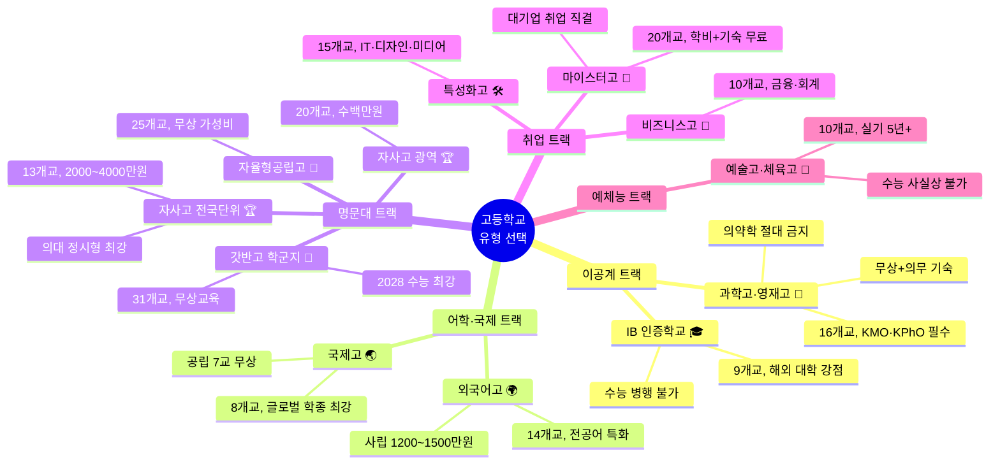

---

## 2. 2028 수능 개편 — 무엇이 바뀌나

### 2.1 핵심 변경 사항

| 변경 항목 | 현행 (2024) | 2028 개편 | 영향 |
|----------|-------------|----------|------|
| **내신 등급** | 9등급제 (상위 4%=1등급) | **5등급제 (상위 10%=1등급)** | 1등급 범위 2.5배 확대 → 일반고 유리 |
| **수능 선택과목** | 국·수·탐 선택과목 존재 | **통합형 (선택과목 폐지)** | 과목별 유불리 소멸 → 일반고 수능 부담 감소 |
| **세특 비중** | 30% 내외 | **35~40%** | 교과 탐구 활동 중요성 증대 |
| **면접 비중** | 학교별 상이 | **최대 40% 확대** | 발표·토론 능력 필수 |
| **수학** | 미적분/확률과통계 선택 | **통합 수학** | 심화수학 편중 학교 불리 |

### 2.2 학교 유형별 유불리

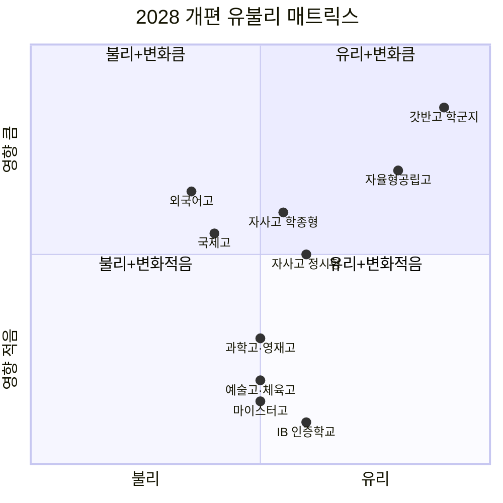

> **결론:** 2028 개편 최대 수혜자는 **갓반고(학군지)** — 내신 1등급 범위 확대 + 선택과목 유불리 소멸 + 수능 경쟁력 유지.

---

## 3. AI 시대 — 학교 선택이 달라지는 이유

### 3.1 AI 시대 생존 직무 vs 대체 직무

| 구분 | AI가 대체하는 직무 | AI 시대 생존 직무 |
|------|------------------|-----------------|
| **이공계** | 단순 코딩, 데이터 입력, 표 정리 | **새 문제 정의 + 실험 설계** 연구자 |
| **어문·국제** | 단순 번역, 문서 정리 | **문화 맥락 이해 + 크로스컬처 협상** |
| **기술직** | 반복 조립, 단순 검수 | **AI 장비 유지보수 + 데이터 기반 개선** |
| **예체능** | AI 생성 이미지/음악 | **"왜 인간이 만드는가"를 답하는 창작자** |
| **경영·금융** | 기초 분개, 보고서 작성 | **AI 도구 마스터 + 고객 신뢰 구축** |

### 3.2 학교 유형별 AI 시대 핵심 전략

| 학교 유형 | AI 시대 핵심 전략 | 구체적 행동 |
|----------|-----------------|-----------|
| **과학고·영재고** | AI를 "연구 조수"로 활용 | ChatGPT에 "답"이 아닌 "접근 방법"을 물어보기. AI 코드 한 줄씩 이해 후 사용 |
| **외국어고** | AI 번역을 "초안"으로, 문화 판단은 직접 | DeepL 번역 → 문화적 적절성 직접 확인. ChatGPT Advanced Voice로 매일 30분 회화 |
| **국제고** | AI로 뉴스 요약 → 맥락 분석은 직접 | Perplexity로 검색 → "왜 중요한가" 직접 판단. AI와 협상 시뮬레이션 |
| **자사고** | AI를 "튜터"로 활용 | "이 개념 이해했는지 확인해줘" 식으로 사용. AI 자소서는 참고만 |
| **마이스터고** | AI와 협업하는 기술자 | CAD에서 AI 설계 제안 받되 손기술 연마. AI 로봇 작동 원리 이해 |
| **IB 학교** | AI를 TOK 탐구 주제로 | "AI가 생성한 지식은 진짜인가?" TOK 탐구. EE에 AI 활용 방법론 섹션 추가 |
| **예술고** | AI를 "영감 도구"로 | AI 생성 작품으로 영감 → 최종은 본인 비전으로 완성 |

---

## 4. 유형별 핵심 비교표

| 학교 유형 | 내신 | 학종 | 수능 | 연 학비 | 의약학 | 기숙 | 2028 유불리 |
|----------|:----:|:----:|:----:|--------|:------:|:----:|:----------:|
| **과학고·영재고** 🔬 | ★5 | ★5 | ✗ | **무상** | ⛔ | 의무 | 중립 |
| **외국어고** 🌍 | ★4 | ★4 | ★3 | 1,200~1,500만 | ⚠️ | 일부 | 불리 |
| **국제고** 🌏 | ★4 | ★4 | ★3 | 공립 무상 | ⚠️ | 일부 | 불리 |
| **자사고 전국** 🏆 | ★5 | ★4 | ★4 | 2,000~4,000만 | ✅ | 의무 | 중립 |
| **자사고 광역** 🏆 | ★4 | ★3 | ★4 | 수백만 | ✅ | 없음 | 중립 |
| **자율형공립고** 🏫 | ★3 | ★3 | ★4 | **무상** | ✅ | 없음 | **유리** |
| **갓반고 학군지** 👑 | ★4 | ★3 | ★5 | **무상** | ✅최적 | 없음 | **최유리** |
| **마이스터고** 🔧 | ★3 | ✗ | ✗ | **무상+기숙** | ⛔ | 의무 | 중립 |
| **비즈니스고** 💼 | ★3 | ✗ | ✗ | **무상** | ⛔ | 없음 | 중립 |
| **예술고·체육고** 🎨 | ★3 | ★3 | ★1 | 공립무상/사립유료 | ⛔ | 일부 | 중립 |
| **IB 인증학교** 🎓 | ★4 | ★5 | ✗ | 공립무상/사립3,000만+ | ⚠️ | 일부 | 영향 적음 |
| **특성화고** 🛠️ | ★3 | ✗ | ✗ | **무상** | ⛔ | 일부 | 중립 |

---

## 5. 적성별 추천 트랙

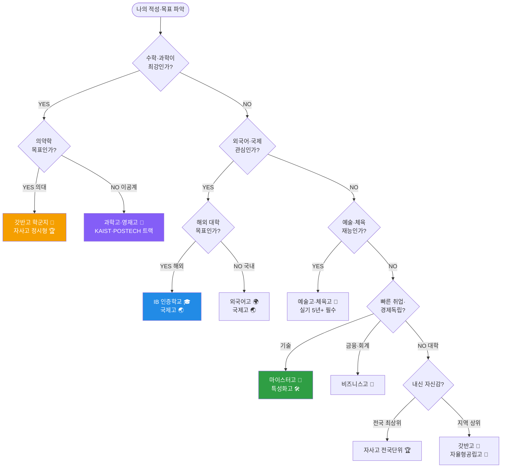

---

## 6. 과학고·영재고 🔬 상세

> **한 줄 요약:** 연구로 대학 가는 학교 — 의약학은 닫힘, 이공계 R&E 단일 트랙  
> **왜 별도 학교군인가:** 수학·과학 영재만 선발해 대학 수준 R&E 커리큘럼 운영. 대학 미적분·일반물리·일반화학 교재 사용, 고1부터 논문 작성.

### 6.1 핵심 정보

| 항목 | 내용 |
|------|------|
| **학비** | **무상** (국가 지원) — 의약학 진학 시 교육비 전액 환수 |
| **기숙사** | **100% 의무 기숙** (생활비 월 20~40만원) |
| **내신** | ★★★★★ — 전국 최상위 집결, 1등급 취득이 일반고의 10배 어려움 |
| **학종** | ★★★★★ — R&E 논문·올림피아드·세특이 학종 최강 자원 |
| **수능** | 불필요 (대부분 미응시, 학종 직행) |
| **의약학** | ⛔ **절대 불가** — 교육비 전액 환수 + 학교 추천 전면 배제 |
| **목표 대학** | 서울대·KAIST·POSTECH·연세대 이공계 |
| **목표 진로** | 반도체 엔지니어, AI 연구원, 물리학자, 바이오 연구원 |

### 6.2 2028 개편 대응 전략

> 내신 5등급제로 부담 완화 — 학종 비중 유지, 수능 기초 탄탄히

| 전략 | 구체적 행동 |
|------|-----------|
| 내신 5등급제 → 부담 완화 | 상위 10%=1등급으로 확대, 과학고 내신 스트레스 감소 |
| 심화수학 미포함 | 수능 수학 기초 개념 완성에 집중 |
| R&E 연구 질적 강화 | 논문 편수보다 **질적 완성도** — 1편의 깊은 연구가 3편의 얕은 연구보다 유리 |
| 면접 비중 최대 40% 확대 | 연구 과정 설명 훈련 필수. "실패 경험"과 "AI 활용 흔적"을 말로 설명 |

### 6.3 AI 시대 전략

> AI가 코딩·데이터 분석을 자동화하는 시대, 과학고생은 **"문제 정의"와 "연구 설계"** 능력으로 차별화

| 카테고리 | 실천 방법 |
|---------|----------|
| **AI 도구 활용** | ChatGPT에 "이 문제의 답은?"이 아니라 **"접근 방법은?"**을 물어보기. 최종 판단은 직접 |
| **데이터 분석** | AI가 작성한 Python 코드는 반드시 직접 실행·검증. 통계 분석 코드는 논리 이해 후 사용 |
| **논문 작성** | AI로 초안 구조 제안 → 직접 논리 전개 → AI로 문장 교정. 순서 중요 |
| **흔한 실수** | ❌ AI에게 R&E 주제를 물어보고 그대로 사용 → ✅ 여러 아이디어 받고 "왜 중요한가" 직접 판단 |
| **흔한 실수** | ❌ AI 코드 복사-붙여넣기 → ✅ 한 줄씩 읽고 이해. 면접에서 "왜 이렇게 작동하는가" 설명할 수 있어야 |

### 6.4 입시 전형

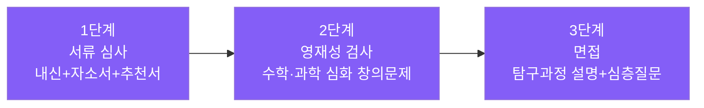

### 6.5 학교별 상세 (16개교)

| 학교명 | 지역 | 정원 | 유형 | 특징·강점 |
|--------|------|:----:|------|----------|
| **[한국과학영재학교](https://ksa.hs.kr/)** (KAIST 부설) | 부산 금정구 | 120 | 영재학교 | KAIST 운영. 대학·대학원 수준 교육, 전국 단위 선발 |
| **[서울과학고](https://sshs.sen.hs.kr/)** | 서울 종로구 | 120 | 영재학교 | 서울시 단위. 무학년제 수업 선택. 서울대·KAIST 부설 연계 |
| **[경기과학고](https://gs-h.goesw.kr/)** | 경기 수원 | 120 | 영재학교 | GIST 연계 연구 독보적. 창업 연계 교육 가장 활발 |
| **[세종과학예술영재학교](https://sasa.sjeduhs.kr/)** | 세종 | 120 | 영재학교 | **과학+예술 융합** 교육 모델. 수학·과학 외 예술 융합 가능 |
| **[대전과학고](https://djshs.djsch.kr/)** | 대전 유성구 | 80 | 과학고 | KAIST·ETRI 인접. 대덕연구단지 연계 수업 |
| **[부산과학고](http://bss.hs.kr/)** | 부산 부산진구 | 120 | 과학고 | 부산대·경상대 연계 R&E. AI·데이터 과학 특화 |
| **[광주과학고](http://gsa.gen.hs.kr/)** | 광주 북구 | 120 | 과학고 | **GIST 연계 R&E 전국 최고 수준**. 광주·전남 학생 대상 |
| **[대구과학고](http://ts.hs.kr/)** | 대구 달서구 | 120 | 과학고 | 경북대 연계 R&E. AI·로봇 특화 |
| **[인천과학고](https://i-science.icehs.kr/)** | 인천 연수구 | 120 | 과학고 | 송도 국제도시 소재. 인하대·인천대 연계. 바이오클러스터 연계 |
| **[울산과학고](http://ushs.hs.kr/)** | 울산 남구 | 100 | 과학고 | **UNIST 연계** 대학원 수준 탐구. 화학·에너지 분야 강점 |
| **[전북과학고](https://school.jbedu.kr/ejbs)** | 전북 전주 | 100 | 과학고 | 전북대·전북과기원 연계. 농생명 바이오·탄소섬유 특화 |
| **[강원과학고](https://kangwon-sh.gwe.hs.kr/)** | 강원 원주 | 100 | 과학고 | **환경·생태·기후 분야** 특화. 강원 자연환경 활용 탐구 |
| **[충남과학고](http://www.cnsh.cnehs.kr/)** | 충남 아산 | 100 | 과학고 | 삼성·현대 인접. 재료공학·반도체·전자 분야 연계 |
| **[충북과학고](https://school.cbe.go.kr/cbs-h/M01)** | 충북 청주 | 100 | 과학고 | **오송 바이오클러스터** 인접. 바이오·의약·생명공학 특화 |
| **[경남과학고](http://gshs-h.gne.go.kr/)** | 경남 진주 | 100 | 과학고 | **KAI(한국항공우주산업)** 인접. 항공우주·기계 특화 |
| **[제주과학고](https://school.jje.go.kr/jeju-s/main.do)** | 제주 | 80 | 과학고 | **해양·환경·기후** 분야 특화. 제주 자연환경 활용 |

---

## 7. 외국어고 🌍 상세

> **한 줄 요약:** 전공어 1개를 무기로 어문·국제 학종 최적화 — 이과·의대 목표라면 재고 필수  
> **vs 국제고:** 외고는 "특정 언어 깊이 학습", 국제고는 "국제 이슈 종합 학습"

### 7.1 핵심 정보

| 항목 | 내용 |
|------|------|
| **학비** | 사립 연 1,200~1,500만원 / **공립 무상** (명덕외고 등) |
| **기숙사** | 서울 4대 외고(대원·대일·명덕·한영)는 기숙 없음. 지방 외고 월 30~50만원 |
| **학종** | ★★★★☆ — 모의UN·영자신문·국제토론 등 인문·어문 학종 스토리텔링 풍부 |
| **수능** | ★★★☆☆ — 영어 절대평가로 이점 없음. 2028 통합형 도입으로 약화 |
| **의약학** | ⚠️ 수학·과학 심화 부족으로 이공계·의약학 구조적 한계 |

### 7.2 2028 개편 대응 전략

| 전략 | 행동 |
|------|------|
| 내신 5등급제 → 부담 완화 | 외고 내부 경쟁 다소 완화 |
| 통합사회·통합과학 수능 대비 | **탐구 과목 균형 학습 필수** — 어학 편중 위험 |
| 모의UN 대표 경험 강화 | 면접 비중 40% 확대에 대비 |
| 어학 역량 증명 | TOEIC 900+, OPIc AL 목표 |

### 7.3 AI 시대 전략

> AI 번역이 완벽해지는 시대, 외고생은 **"문화 맥락 이해"와 "크로스컬처 커뮤니케이션"**으로 차별화

| 실천 방법 | 구체적 행동 |
|----------|-----------|
| AI 번역 활용 | DeepL 번역을 "초안"으로만. **"이 표현이 이 문화권에서 자연스러운가?"** 직접 확인 |
| 회화 연습 | ChatGPT Advanced Voice로 매일 30분. 외교관 vs 기자 롤플레이 |
| 에세이 작성 | AI → 구조 제안 → 직접 논리 전개 → Grammarly 문법 교정 |
| ❌ 흔한 실수 | AI 번역 그대로 사용 → 문화적 부적절 표현. AI 에세이 그대로 제출 |

### 7.4 학교별 상세 (14개교)

| 학교명 | 지역 | 정원 | 특징·강점 |
|--------|------|:----:|----------|
| **[대원외국어고](http://www.dwfl.hs.kr/)** | 서울 광진구 | 360 | 전국 최대 규모. 10개+ 전공어, 주당 10시간 집중. SKY 진학 최상위 |
| **[한영외국어고](https://hyfl.sen.hs.kr/)** | 서울 강동구 | 280 | 서울 동부권 대표. 인문학 융합 수업·에세이 강화 |
| **[명덕외국어고](http://www.mdfh.or.kr/)** | 서울 중구 | 240 | **서울 유일 공립 외고 — 무상 교육**. 토론·에세이 탁월 |
| **[부산외국어고](http://www.pfl.hs.kr/)** | 부산 남구 | 240 | 해양도시 특성. 해양·국제무역 특화. 기숙사 있음 |
| **[대구외국어고](http://www.taegu-fh.hs.kr/)** | 대구 수성구 | 200 | 대구·경북 유일 공립 외고. 무상+기숙사. 경북대 연계 |
| **[인천외국어고](https://icf.icehs.kr/)** | 인천 연수구 (송도) | 200 | 송도 경제자유구역 내 위치. 글로벌 비즈니스 환경 |
| **[경남외국어고](https://knfl.supercampus.co.kr/)** | 경남 창원 | 160 | 방위산업·항공·기계 분야 글로벌 기술 통상 인재 |
| **[울산외국어고](https://school.use.go.kr/ufl-h/)** | 울산 남구 | 160 | 현대차·SK 글로벌 제조 연계. 비즈니스 외교 특화 |
| **[전북외국어고](https://school.jbedu.kr/jeonbuk-fl)** | 전북 군산 | 160 | K-문화·한류 외교 인재 양성 |
| **[대전외국어고](https://djflhs.djsch.kr/)** | 대전 유성구 | 160 | KAIST·ETRI 인접. **과학기술 외교 인재** 특화 |
| **[강원외국어고](https://gf.gwe.hs.kr/)** | 강원 춘천 | 140 | 동계올림픽 유산. 환경·관광·스포츠 외교 |
| **[충남외국어고](http://cnfl.cnehs.kr/)** | 충남 아산 | 140 | 삼성·현대 인접. 글로벌 비즈니스·기술 통상 |
| **[충북외국어고](https://school.cbe.go.kr/cfl-h/M01/)** | 충북 청주 | 140 | 오송 바이오클러스터. 바이오·반도체 글로벌 인재 |
| **[제주외국어고](https://jejufl.jje.hs.kr/)** | 제주 | 120 | 국제 관광도시. 관광·호텔·항공 서비스 외국어 특화 |

---

## 8. 국제고 🌏 상세

> **한 줄 요약:** 국제 이슈 전문성으로 글로벌 학종 최적화 — 이과·수능은 구조적 한계  
> **vs 외고:** 외고는 "어학 능통자", 국제고는 "글로벌 리더"

### 8.1 핵심 정보

| 항목 | 내용 |
|------|------|
| **학비** | 공립 7개교 **무상** / 청심(사립) 연 2,300~2,800만원 |
| **영어 몰입 수업(EMI)** | 50% 이상 — 사회·경제·역사를 영어로 학습 |
| **학종** | ★★★★☆ — 모의G20·UN봉사 등 글로벌 학종 자원 최강 |

### 8.2 학교별 상세 (8개교)

| 학교명 | 지역 | 정원 | 유형 | 특징·강점 |
|--------|------|:----:|------|----------|
| **[서울국제고](https://sghs.sen.hs.kr/)** | 서울 종로구 | 160 | 공립 | 공립 최초 IB DP 인증. SIHMUN(모의UN)+외교부 청소년외교아카데미 연계. **기숙사 없음** |
| **[인천국제고](https://ii.icehs.kr/)** | 인천 영종도 | 160 | 공립 | 인천공항·자유무역지역 인접. **항공·물류·관광 외교** 트랙 특화 |
| **[청심국제고](https://www.csia.hs.kr/)** | 경기 가평 | 200 | **사립** | 전국 유일 사립. **IB DP + AP 동시 운영**. 전원 의무 기숙, 24시간 영어 환경. 학비 최고 |
| **[고양국제고](https://ggg.hs.kr/)** | 경기 고양 일산 | 160 | 공립 | 경기 북부 거점. 영자신문·영미문학·미디어 활동. 파주·DMZ 평화교육 연계 |
| **[동탄국제고](https://dtg.hs.kr/)** | 경기 화성 동탄 | 160 | 공립 | **STEM+글로벌 융합**. 삼성전자 화성캠퍼스·판교 IT밸리 인접. 이공계 해외대 진학률 국제고 1위 |
| **[부산국제고](https://school.busanedu.net/)** | 부산 부산진구 | 160 | 공립 | 영남권 유일. 영어+제2외국어(중·일·러) 심화. 부산항·해양·일본/중화권 대학 트랙 |
| **[대구국제고](https://dhi.myapply.kr/)** | 대구 북구 | 140 | 공립 | 2021년 개교 신설. 경북대 인접. IB DP 인증. 영남권 수도권 이주 없이 국제고 교육 |
| **[세종국제고](https://sjgl.sjeduhs.kr/)** | 세종 도담동 | 120 | 공립 | **정부세종청사 도보권**. 외교·기재·과기·통일 부처 연계 정책 탐구 차별화 |

---

## 9. 자율형사립고 🏆 상세

> **한 줄 요약:** 최상위권의 각축장 — **학종형 vs 정시형 DNA가 완전히 다름**, 반드시 구분  
> **핵심 구분:** 전국단위 자사고(기숙 의무, 연 2,000~4,000만) ≠ 광역단위 자사고(통학, 수백만)

### 9.1 2028 개편 대응 전략

| 전략 | 행동 |
|------|------|
| 내신 5등급제 → 경쟁 완화되나 변별력 감소 | **세특으로 차별화 필수** |
| 통합형 수능 → 정시 비중 유지 | 자사고 수능 집중 인프라 활용 |
| 세특 비중 35~40% 증가 | **전 과목 탐구 활동 강화** |
| 면접 비중 최대 40% 확대 | 생기부 기반 심층 질문 대비 — 예상 질문 100개 연습 |

### 9.2 AI 시대 전략

> AI가 학습·분석을 보조하는 시대, 자사고생은 **"자기주도 학습"과 "메타인지"**로 차별화

| 행동 | ❌ 하지 말 것 | ✅ 해야 할 것 |
|------|-------------|-------------|
| AI 학습 | AI가 풀어준 문제를 이해 안 하고 넘어감 | AI 풀이 보고 **"이 논리를 내가 설명할 수 있는가?"** 확인 |
| 세특 | AI에게 탐구 주제 받아 그대로 사용 | AI 주제 아이디어 참고 → **"왜 중요한가"** 직접 판단 |
| 자소서 | AI 자소서 그대로 제출 | AI 초안 참고 → **본인 경험과 생각으로 재작성** |

### 9.3 학종형 vs 정시형 구분도

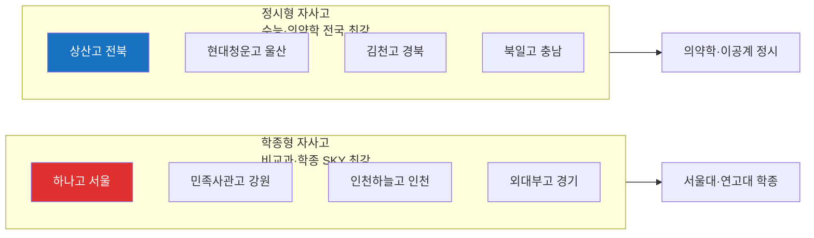

### 9.4 전국단위 자사고 학교별 상세 (13개교)

| 학교명 | 지역 | 정원 | 유형 | 특징·강점 |
|--------|------|:----:|------|----------|
| **[하나고](https://www.hana.hs.kr/)** | 서울 은평구 | 180 | 학종형 | 하나금융 후원. 전원 의무 기숙. 자기주도 학습·리더십·사회공헌 특화. SKY 학종 최강 |
| **[민족사관고](https://www.minjok.hs.kr/)** | 강원 횡성 | 140 | 학종형 | 연 1,500만원+. 영어 수업 50%+. 한국사+서양사 병행. **국제관계·인문 특화** |
| **[상산고](https://school.jbedu.kr/sangsan)** | 전북 전주 | 300 | 정시형 | **전국 의대 진학률 최상위**. 수능 중심 집중 교육. 기숙사 자습 시스템 |
| **[현대청운고](http://www.hcu.hs.kr/)** | 울산 북구 | 240 | 정시형 | 현대그룹 재단. 등록금 부담 상대적 낮음. 현대차·현대중공업 연계 |
| **[외대부고](https://hafs.hs.kr/)** (용인외고) | 경기 용인 모현 | 350 | 어학형 | 영·중·일·스페인어 등 외국어 특화. SKY·아이비리그 동시 진학 |
| **[인천하늘고](https://haneul.icehs.kr/)** | 인천 영종도 | 225 | 학종형 | 인천공항공사 후원. 사회배려대상자 지원 두터움. 글로벌 프로그램 |
| **[김천고](https://gimcheon.hs.kr/)** | 경북 김천 | 250 | 정시형 | 1931년 개교. 1인당 교육비 2,579만원. 영남권 수능 명문 |
| **[광양제철고](https://gwangcheol.hs.jne.kr/)** | 전남 광양 | 200 | 이공계 | 포스코교육재단. 임직원 자녀 전형. 이공계·산업현장 연계 |
| **[포항제철고](https://pocheol.hs.kr/)** | 경북 포항 | 200 | 이공계 | 포스코교육재단. **POSTECH 인접** 지리적 장점 |
| **[북일고](https://www.bugil.hs.kr/)** | 충남 천안 | 270 | 정시형 | 한화그룹 장학재단. 충청권 수능 명문 |
| **[양정고](http://www.yangchung.hs.kr/)** | 서울 양천구 | 300 | 균형형 | 서울 서남권 SKY 최상위. 기숙 없음, 통학 |
| **[이화여고](https://www.ewha.hs.kr/)** | 서울 중구 | 300 | 균형형 | 이화여대 재단 연계. 서울 여학생 최상위. 통학 |
| **[충남삼성고](https://www.cnsa.hs.kr/)** | 충남 아산 | — | IB형 | 삼성 운영. **IB DP 인증**. 해외 대학 진학 트랙 |

### 9.5 서울 광역단위 자사고 (주요 20개교)

| 권역 | 학교명 | 위치 |
|------|--------|------|
| **강남·서초** | [휘문고](https://www.whimoon.hs.kr/) / [세화고](https://sehwa.hs.kr/) / [세화여고](https://sehwags.sen.hs.kr/) / [중동고](https://www.joongdong.hs.kr/) / [현대고](https://hyundai.hs.kr/) | 강남 학원가 최근접 |
| **송파·강동** | [보인고](https://boin.hs.kr/) / [배재고](https://paichai.hs.kr/) | 송파·강동 학군 |
| **양천·서대문** | [양정고](http://www.yangchung.hs.kr/) / [이화금란고](https://edaebugo.sen.hs.kr/) | 목동 학원가 |
| **중구·종로** | [이화여고](https://www.ewha.hs.kr/) / [중앙고](https://choongang.sen.hs.kr/) | 서울 중심부 |
| **성동·동대문** | [한양대사대부고](http://hanyang-u.hs.kr/) / [경희고](https://www.kyungheeboy.hs.kr/) | |
| **강북·도봉** | [신일고](https://www.shin-il.hs.kr/) / [선덕고](https://sunduck.sen.hs.kr/) | |
| **부산** | [해운대고](http://haeundae.hs.kr/) | 부산 광역 |
| **대구** | [계성고](https://keisung.dge.hs.kr/) / [대건고](https://daegun.dge.hs.kr/) | 대구 광역 |
| **대전** | [대성고](https://daeseong.hs.kr/) / [대신고](https://www.dshs.kr/) | 대전 광역 |
| **인천·경기** | [인천포스코고](https://icpa.icehs.kr/) / [안산동산고](http://www.dsgo.kr/) | 수도권 광역 |

---

## 10. 자율형공립고 🏫 상세

> **한 줄 요약:** 무상교육 + 일반고 안정성 + 학교별 특색 심화과목 — 가성비 최상  
> **2028 전략:** 내신 5등급제 도입으로 **교과전형 진입 장벽 낮아짐** → 교과전형 집중 + 수능 병행

### 10.1 핵심 정보

| 항목 | 내용 |
|------|------|
| **학비** | **무상 (0원)** |
| **기숙** | 없음 (통학) |
| **2028 전략** | 교과전형 50% + 정시 50% 균형 전략 |
| **의약학** | ✅ 가능 (내신 관리 + 수능 준비 병행) |

### 10.2 자율형 공립고 2.0 (2025.8 지정, 2026.3 운영 시작) — 25개교

| 지역 | 학교명 | 비고 |
|------|--------|------|
| **부산** (2교) | [부산고](https://school.busanedu.net/) (1913년 개교) / [주례여고](http://jurye.hs.kr/) | |
| **인천** (3교) | [인천고](https://incheon.icehs.kr/) (1895년 개교) / [강화여고](https://ganghwagirls.icehs.kr/) / [선인고](https://sunin.icehs.kr/) | |
| **경기** (10교) | [남한고](https://namhan-h.goegh.kr/) / [백석고](https://baekseok-h.goegy.kr/) / [수주고](https://suju-h.goebc.kr/) / [연천고](https://yeoncheon-h.goeyc.kr/) / [의정부고](https://uigo-h.goeujb.kr/) / [의정부여고](https://ugh-h.goeujb.kr/) / **[이의고](https://iui-h.goesw.kr/)** / [저현고](https://jeohyeon-h.goegy.kr/) / [평내고](https://pyeongnae-h.goegn.kr/) / [포천일고](https://pocheonil-h.goepc.kr/) | 이의고는 광교 학군 |
| **충청** (2교) | [진천고](https://school.cbe.go.kr/jcg-h) / [충주예성여고](https://school.cbe.go.kr/yesung-h) | |
| **전라** (3교) | [남원고](https://school.jbedu.kr/namwon-h) / [이리여고](https://school.jbedu.kr/irigh/) / [보성고](https://boseong.hs.jne.kr/) | |
| **경상** (4교) | [북삼고](http://school.gyo6.net/buksam) / [영주여고](https://school.gyo6.net/yeongju-girl) / [김해고](http://gimhae-h.gne.go.kr/) / [삼천포중앙고](https://scpjungang-h.gne.go.kr/) | |
| **강원** (1교) | [도계고](http://dogye.gwe.hs.kr/) (삼척) | |

---

## 11. 갓반고 학군지 👑 상세

> **한 줄 요약:** 정시와 학종의 균형 — **2028 개편 최대 수혜자**, 1등급 인원이 가장 많은 유형  
> **학군지의 의미:** 학교 학비는 무상이지만, **학군지 집값이 실질적 "입학 비용"** — 대치동 기준 학원비 월 200~500만원

### 11.1 2028 개편 대응 전략

| 전략 | 행동 |
|------|------|
| 내신 5등급제 → 최대 수혜 | 상위 10%=1등급. 학군지 학생 수 많아 **절대 인원 최다** |
| 선택과목 폐지 → 수능 최강 | 통합형 수능으로 일반고 수능 준비 부담 감소 |
| 세특 35~40% | 수업 중 탐구 활동 적극 참여 |
| 면접 최대 40% | 발표·토론 능력 조기 훈련 |

### 11.2 AI 시대 전략

> 메타인지와 전략적 학습으로 차별화

| 실천 | 행동 |
|------|------|
| AI 약점 분석 | AI에게 오답 패턴 분석 → 약점 과목 집중 보완 |
| 세특 활용 | AI에게 탐구 주제 아이디어 → 탐구 설계는 직접 |

### 11.3 학군지별 상세 분석

#### 서울 학군지

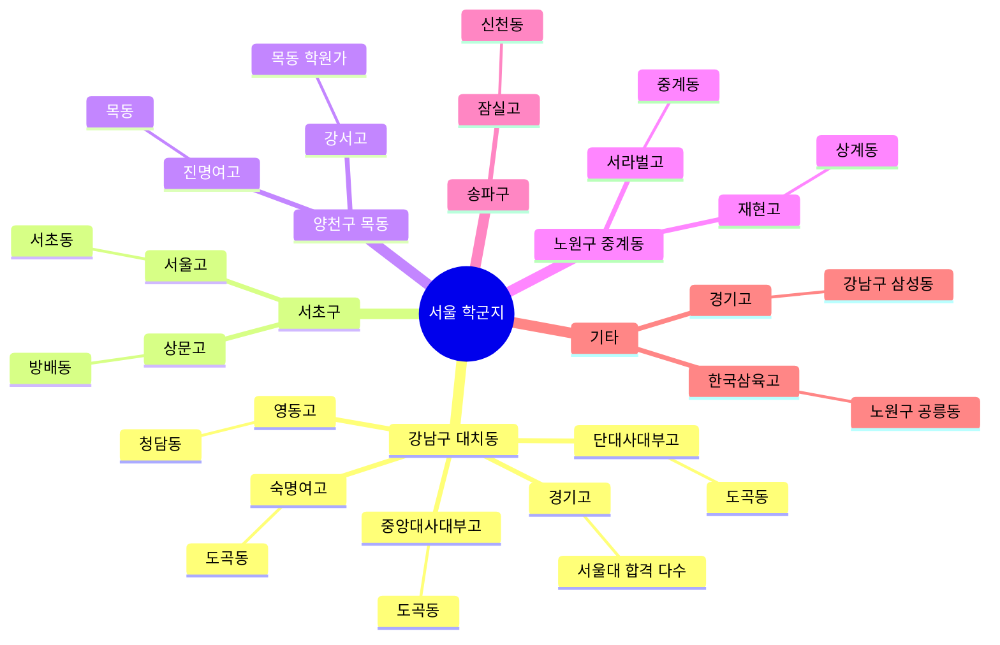

| 학군지 | 학교명 | 위치 | 특징 |
|--------|--------|------|------|
| **강남·대치** | [경기고](https://kyunggi.sen.hs.kr/) | 삼성동 | 서울대 합격자 최다 학군지 |
| | [단대사대부고](https://dan-kook.sen.hs.kr/) | 도곡동 | |
| | [숙명여고](https://sm.sen.hs.kr/) | 도곡동 | |
| | [중앙대사대부고](https://cau.sen.hs.kr/) | 도곡동 | |
| | [영동고](https://yd.sen.hs.kr/) | 청담동 | |
| **서초** | [서울고](https://seoul.sen.hs.kr/) | 서초동 | |
| | [상문고](https://sangmoon.sen.hs.kr/) | 방배동 | |
| **양천·목동** | [강서고](https://gangseo.sen.hs.kr/) | 목동 | 목동 학원가 인접 |
| | [진명여고](https://jm.sen.hs.kr/) | 목동 | |
| **노원·중계** | [서라벌고](https://sorabol.sen.hs.kr/) | 중계동 | 노원구 학원가 인접 |
| | [재현고](https://jaehyun.sen.hs.kr/) | 상계동 | |
| **송파** | [잠실고](https://jamsil.sen.hs.kr/) | 신천동 | |
| **기타** | [한국삼육고](https://sahmyook.sen.hs.kr/) | 공릉동 | |

#### 경기 학군지

| 학군지 | 학교명 | 위치 | 특징 |
|--------|--------|------|------|
| **분당** | [낙생고](https://naksaeng-h.goesn.kr/) | 분당구 | 분당 학원가 |
| | [보평고](https://bopyung-h.goesn.kr/) | **동판교** | 판교 신도시 |
| | [서현고](https://seohyun-h.goesn.kr/) | 서현동 | |
| **평촌** | [백영고](https://baekyoung-h.goeay.kr/) | 평촌동 | 평촌 학원가 |
| | [안양고](https://anyang-h.goeay.kr/) | 박달동 | |
| | [신성고](https://shinsung-h.goeay.kr/) | 안양동 | |
| **일산** | [백석고](https://baekseok-h.goegy.kr/) | 일산동구 | 일산 학원가 |
| | [대화고](https://daehwa-is-h.goegy.kr/) | 일산서구 | |
| **파주 운정** | [운정고](https://unjeong-h.goepj.kr/) | 운정 신도시 | 신도시 학군 |
| **남양주 다산** | [남양주다산고](https://nyjdasan-h.goegn.kr/) | 다산 신도시 | 신도시 학군 |
| **과천** | [과천고](https://gwacheon-h.goeay.kr/) | 별양동 | |

#### 광역시 학군지

| 학군지 | 학교명 | 위치 | 특징 |
|--------|--------|------|------|
| **대구 수성구** | [능인고](https://neungin.dge.hs.kr/) | 무학로 | 대구 최상위 학군 |
| | [경신고](https://gyeongsin.dge.hs.kr/) | 황금동 | |
| | [정화여고](http://www.junghwa.hs.kr/) | 범어동 | |
| **부산 해운대** | [양운고](http://yangwoon.hs.kr/) | 좌동 | 부산 최상위 학군 |
| | [센텀고](http://www.centum.hs.kr/) | 재송동 | |
| **광주 서구** | [광덕고](https://kwangdeok-h.goeas.kr/) | 화정동 | |
| **대전 서구** | [충남고](https://chungnamhs.djsch.kr/) | 둔산동 | |

---

## 12. 마이스터고 🔧 상세

> **한 줄 요약:** 취업 직결 + 학비 무상 + 재직자 후진학 — 경제적 독립 최우선이라면 최강 선택  
> **핵심:** AI 시대에 **"AI와 협업하는 기술자"**로 진화해야 함

### 12.1 2028 전략

| 전략 | 행동 |
|------|------|
| 취업 우선 | 졸업 후 대기업·공기업 입사 (재직자 취업률 80%+) |
| 후진학 정시 확대 | 재직 3년 후 특별전형 or 일반 정시. 실무 경력 가산점 |
| 사내 학위 연계 | 삼성·SK 사내 대학 학위 협약 확대 |
| 폴리텍·기술교육대 | 한국폴리텍·한국기술교육대 전공심화과정 |

### 12.2 AI 시대 전략

| 카테고리 | 실천 방법 |
|---------|----------|
| AI 도구 | AI는 "설계 보조", **실제 제작은 손으로 직접**. 손기술 꾸준히 연마 |
| AI 장비 | AI 로봇·AI 비전 검사 시스템의 **작동 원리 이해**. 단순 사용 넘어 "어떻게 작동하는가" 학습 |
| 데이터 | 생산 라인 데이터를 AI로 분석 → "어느 공정에서 불량률이 높은가" 찾기 |
| ❌ 실수 | AI가 모든 걸 해줄 거라 생각 → ✅ 손기술과 현장 감각이 핵심 경쟁력 |

### 12.3 분야별 학교 목록 (20개교)

| 분야 | 학교명 | 지역 | 정원 | 특징 |
|------|--------|------|:----:|------|
| **자동차·기계** | [현대공업고](http://hit.hs.kr/) | 울산 동구 | 240 | 현대차 직결 |
| | [부산자동차마이스터고](http://www.automotive.hs.kr/) | 부산 사하구 | 160 | |
| | [부산기계공업고](https://www.bmt.hs.kr/) | 부산 해운대 | 96 | |
| **전기·전자** | [수도전기공업고](https://sudo.sen.hs.kr/) | **서울 강남구** | 200 | 서울 유일 마이스터고 |
| | [인천전자마이스터고](https://intec.icehs.kr/) | 인천 미추홀구 | 160 | |
| | [구미전자공업고](https://gnet.hs.kr/) | 경북 구미 | 200 | 삼성·LG 전자 클러스터 |
| **철강·소재** | [포항제철공업고](http://school.gyo6.net/pocheoltechhs) | 경북 포항 | 160 | 포스코 직결 |
| | [광주자동화설비마이스터고](http://gat.gen.hs.kr/) | 광주 광산구 | 120 | |
| **SW·AI** | [대구SW마이스터고](http://www.dgsw.hs.kr/) | 대구 달성군 | 120 | |
| | [광주SW마이스터고](http://gsm.gen.hs.kr/) | 광주 광산구 | 120 | |
| | [대덕SW마이스터고](https://dsmhs.djsch.kr/) | 대전 유성구 | 100 | KAIST 인접 |
| **로봇** | **[서울로봇고](https://srobot.sen.hs.kr/)** | **서울 강남구** | 120 | 서울 최신 마이스터고 |
| **해양** | [부산해사고](http://maritime.hs.kr/) | 부산 영도구 | 120 | 해운·조선 |
| | [한국해양마이스터고](http://school.gyo6.net/haema) | 경북 포항 | 120 | |
| **에너지** | [한국에너지마이스터고](https://energy.gwe.hs.kr/) | 강원 삼척 | 120 | |
| **바이오** | [한국바이오마이스터고](https://kbmh.meistergo.co.kr/) | 충북 진천 | 100 | 오송 바이오 인접 |
| **스마트팩토리** | [아산스마트팩토리마이스터고](http://smart.cnehs.kr/) | 충남 아산 | 120 | |
| **국제통상** | [한국국제통상마이스터고](https://school.gyo6.net/kgbmhs/main.do) | 전북 | 120 | |
| **농생명** | [김제농생명마이스터고](https://school.jbedu.kr/gmhsas/) | 전북 김제 | 80 | |
| **대구일반** | [대구일마이스터고](http://dgmeister.dge.hs.kr/) | 대구 동구 | 160 | |

---

## 13. 비즈니스고 💼 상세

> **한 줄 요약:** 전산회계·금융 자격증으로 고졸 취업 직결 — 상경계 특성화고 전형 대학 진학 병행 가능

### 13.1 2028 전략

- 취업 우선 → 공기업·금융권 채용형 인턴 (졸업 후 정규직 전환률 70%+)
- 디지털 전환 대응 학과 신설 — **핀테크·이커머스·디지털마케팅·블록체인**
- 후진학 정시 확대로 일반대 진입 기회 증가

### 13.2 AI 시대 전략

- AI 도구를 적극 활용 → 회계·디자인·마케팅에서 AI 도구 마스터하면 취업 경쟁력 상승
- 고객 관계는 인간의 영역 → AI가 자동 응답해도 **신뢰 구축은 본인**

### 13.3 학교 목록 (10개교)

| 학교명 | 지역 | 정원 |
|--------|------|:----:|
| **경복비즈니스고** | 서울 강서구 | 240 |
| **서울금융고** | 서울 양천구 | 200 |
| 인천비즈니스고 | 인천 미추홀구 | 180 |
| 안산국제비즈니스고 | 경기 안산 | 200 |
| 신일비즈니스고 | 경기 고양 | 180 |
| 울산상업고 | 울산 울주군 | 240 |
| 해연여고 | 부산 수영구 | 200 |
| 광주여자상업고 | 광주 남구 | 180 |
| 대전여자상업고 | 대전 중구 | 140 |
| 전주여자상업고 | 전북 전주 | 160 |

---

## 14. 예술고·체육고 🎨 상세

> **한 줄 요약:** 예체능 실기 5년 이상 누적 시 단일 트랙 최강 — 일반 대입 포기가 전제

### 14.1 2028 전략

- 실기 비중 유지 (대학별 60~70%) — 5등급제 영향 최소
- 수능 최저 학력 기준 일부 대학 유지 → 통합사회·통합과학 기본기 필요
- **면접 비중 확대 40%** → 작품 의도·창작 과정·AI 도구 활용을 자기 언어로 설명
- **포트폴리오 + 디지털 전시** (인스타·유튜브 작품 채널)이 정성 평가에 영향

### 14.2 AI 시대 전략

- AI를 **"영감 도구"**로 활용. AI 생성 작품을 보고 영감 받되, 최종은 본인 비전으로 완성
- AI가 안무 패턴 제안해도, **무대에서의 감정 표현은 인간만 가능**
- AI 시대 핵심 질문: **"왜 인간이 만드는가?"** — 이 답을 가진 예술가만 생존

### 14.3 학교 목록 (10개교)

| 학교명 | 지역 | 정원 | 특징 |
|--------|------|:----:|------|
| **서울예술고** | 서울 서초구 | 400 | 국내 최대, 음악·미술·무용 |
| **서울체육고** | 서울 송파구 | 200 | 엘리트 체육 특화 |
| **경기예술고** | 경기 수원 | 180 | 경기권 대표 |
| 부산예술고 | 부산 부산진구 | 180 | |
| 인천체육고 | 인천 서구 청라 | 200 | |
| 광주예술고 | 광주 남구 | 150 | |
| 대전예술고 | 대전 서구 | 140 | |
| 강원체육고 | 강원 춘천 | 160 | |
| 울산스포츠과학고 | 울산 북구 | 180 | |
| 세종예술고 | 세종 | 120 | |

---

## 15. IB 인증학교 🎓 상세

> **한 줄 요약:** 서술·논술로 학종·해외 진학 — 정시는 불가, 수능 포기가 전제  
> **핵심:** IB과정과 수능은 출제 방식이 **완전히 다름** — 병행 극도로 어려움

### 15.1 2028 전략

| 전략 | 행동 |
|------|------|
| IB → 2028 영향 가장 적음 | IB 디플로마로 해외 명문대 직접 지원 가능 |
| 국내 대학 IB 반영 확대 | 연세대·고려대·서울대 일부 전형 IB 성적 반영 |
| 세특 35~40% | IB EE(소논문)·CAS 활동이 **세특 최강 소재** |
| 내신 5등급제 | IB 학교 내신 부담 다소 완화 |

### 15.2 AI 시대 전략

> IB 학생은 **"비판적 사고"와 "학제 간 융합"**으로 차별화

| 카테고리 | 실천 방법 |
|---------|----------|
| **TOK (지식론)** | AI를 TOK 탐구 주제로 삼기: "AI가 생성한 지식은 진짜인가?", "AI는 창의적일 수 있는가?" |
| **EE (소논문)** | AI 활용 시 투명 공개. "AI 활용 방법론" 섹션 추가 → **학문적 정직성 = IB 고평가** |
| **CAS (봉사)** | "AI 편향성 교육 캠페인", "AI 윤리 토론 동아리" → 해외 명문대 차별화 |
| ❌ 실수 | AI EE 초안 그대로 제출. AI 자료 검증 없이 인용 |

### 15.3 IB DP 구조

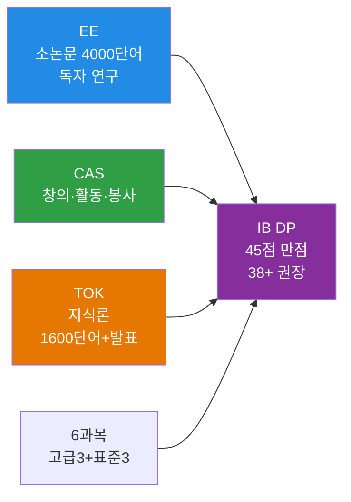

### 15.4 학교 목록 (9개교)

| 학교명 | 지역 | 유형 | 학비 | 특징 |
|--------|------|------|------|------|
| **[제주 표선고](https://jjps.jje.hs.kr/)** | 제주 서귀포 | 공립 | **무상** | 국내 최초 IB DP 월드스쿨 |
| **[대구국제고](https://dhi.myapply.kr/)** | 대구 북구 | 공립 | **무상** | 국제고+IB 결합 |
| **[경북대사대부설고](https://knu.dge.hs.kr/)** | 대구 중구 | 국립 | **무상** | 국립 사대부설 |
| **[대구외국어고](https://dgfl.dge.hs.kr/)** | 대구 달서구 | 공립 | **무상** | 외고+IB |
| **[대구서부고](https://seobu.dge.hs.kr/seobuh/main.do)** | 대구 서구 | 공립 | **무상** | 도심 공립 일반고 |
| **[포산고](https://posan.dge.hs.kr/)** | 대구 달성군 | 공립 | **무상** | 외곽 공립 |
| **[경기외국어고](https://www.gafl.hs.kr/)** | 경기 의왕 | 사립 | 유료 | 외고+IB |
| **[충남삼성고](https://www.cnsa.hs.kr/)** | 충남 아산 | 사립(삼성) | 유료 | 자사고+IB |
| **[죽산고](https://juksan-mh.goean.kr/)** | 경기 안성 | 공립 | **무상** | 소규모 농어촌고 |

> **가성비 TIP:** 대구권 공립 IB 학교 6개교 = **무상교육 + IB 디플로마**. 전국 IB 가성비 최우수.

---

## 16. 특성화고 🛠️ 상세

> **한 줄 요약:** 전문 기술 특화 취업 트랙 — 동일계 특성화고 전형으로 대학 진학도 가능

### 16.1 2028 전략

- **분야 진로 명확성** — 학과 선택이 평생 직업과 직결. 중2~중3 사이 분야 결정 필수
- IT: 정보처리기능사·코딩 대회 / 디자인: 작품 포트폴리오 / 조리: 한식·양식 기능사
- 후진학 정시 확대 → 재직 3년 후 특별전형 or 일반 정시

### 16.2 AI 시대 전략

- **분야 전문성 + AI 도구 활용** 통합 전문가가 되어야 함
- 자격증·포트폴리오에 **AI 활용 사례**를 함께 담으면 신입에서도 차별화
- AI로 만든 부분과 직접 만든 부분을 **분리 문서화** → 면접 강점

### 16.3 분야별 학교 목록 (15개교)

| 분야 | 학교명 | 지역 | 특징 |
|------|--------|------|------|
| **IT·SW** | **[선린인터넷고](https://sunrint.sen.hs.kr/)** | 서울 용산구 | IT 특성화고 최강. 프로그래밍·네트워크·보안 |
| **디지털미디어** | **[한국디지털미디어고](https://dimigo-h.goeas.kr/)** | 경기 안산 | 웹·앱·영상 디지털 콘텐츠 |
| **애니메이션** | **[한국애니메이션고](https://anigo-h.goegh.kr/)** | 경기 하남 | 애니메이션·만화·게임 아트 |
| **디자인** | [서울디자인고](https://seodi.sen.hs.kr/) | 서울 마포구 | 시각·제품·공간 디자인 |
| **영상** | [서울영상고](https://youngsang.sen.hs.kr/) (정원 350) | 서울 양천구 | 영상 제작·편집 |
| **게임** | [한국게임과학고](https://school.jbedu.kr/game) | 전북 완주군 | 게임 기획·프로그래밍 |
| **모바일** | [경기모바일과학고](https://gms-h.goeas.kr/) | 경기 안산 | 모바일 앱 개발 |
| **자동차** | [경기자동차과학고](http://www.ghas.hs.kr/) | 경기 시흥 | 자동차 정비·공학 |
| **조리·식품** | [한국조리과학고](https://kcas-h.goesh.kr/) | 경기 시흥 | 한식·양식·제과제빵 |
| **주얼리** | [한국주얼리고](https://hanjin.icehs.kr/) | 인천 서구 | 보석·귀금속 디자인 |
| **미디어** | [상일미디어고](https://sangilmedia.sen.hs.kr/) (정원 160) | 서울 강동구 | 미디어 콘텐츠 제작 |
| **컨벤션** | [서울컨벤션고](https://seoul-chs.sen.hs.kr/) (정원 160) | 서울 강동구 | 호텔·관광·MICE |
| **뷰티** | [한국뷰티고](https://school.jje.go.kr/kbeauty/main.do) | 제주 | 뷰티·헤어·메이크업 |
| **패션** | [세그루패션디자인고](https://sfd.sen.hs.kr/) | 서울 도봉구 | 패션 디자인·의상 |
| **디지털콘텐츠** | [서울디지털콘텐츠고](https://sdcont.sen.hs.kr/) | 서울 강서구 | 디지털 콘텐츠 제작 |

---

## 17. 중학교 준비 로드맵

### 17.1 준비 타임라인

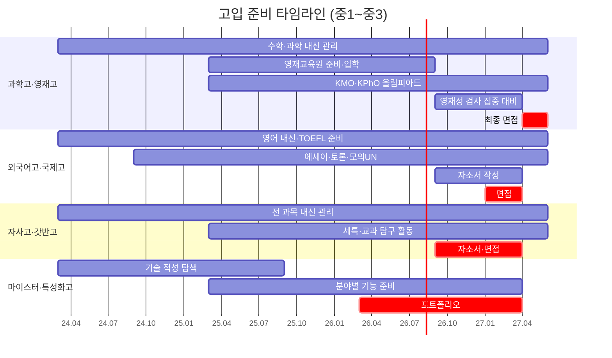

### 17.2 학년별 체크리스트

| 시기 | 전 유형 공통 | 과학고 추가 | 외고·국제고 추가 | 자사고·갓반고 추가 |
|------|------------|-----------|----------------|-----------------|
| **중1** | 전 과목 A 유지 + 진로 탐색 | KMO 입문 + 수학 선행 | TOEFL 시작 + 영어 토론 | 학습 습관 형성 + 세특 시작 |
| **중2** | 대외활동 시작 + 독서 기록 | 영재교육원 입학 + R&E 시작 | 에세이 대회 + 모의UN | 경시대회 참가 + 독서 포트폴리오 |
| **중3 상** | 자소서 초안 | 영재성 검사 대비 | 면접 준비 | 학교 리서치 |
| **중3 하** | 지원서 제출 | 영재성 검사 → 면접 | 면접 응시 | 면접 응시 |

---

## 18. 의약학 진학 트랙 분석

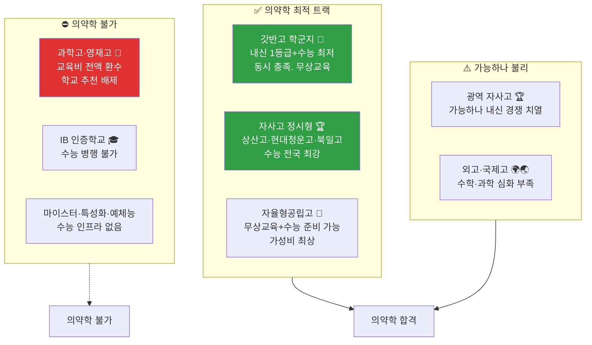

### 의약학 트랙 비교

| 트랙 | 내신 관리 | 수능 | 학원비 | 추천도 |
|------|:--------:|:----:|--------|:------:|
| **갓반고 학군지** | ★★★★☆ | ★★★★★ | 높음 (월 200~500만) | ⭐⭐⭐⭐⭐ |
| **자사고 정시형** | ★★★★★ | ★★★★★ | 학비 연 2,000~4,000만 | ⭐⭐⭐⭐ |
| **자율형공립고** | ★★★☆☆ | ★★★★☆ | 낮음 | ⭐⭐⭐⭐ |
| 광역 자사고 | ★★★★★ | ★★★★☆ | 중간 | ⭐⭐⭐ |
| 외고·국제고 | ★★★★☆ | ★★★☆☆ | 높음 | ⭐⭐ |
| **과학고·영재고** | ★★★★★ | ✗ | 무상 | **⛔ 절대 금지** |

---

---

## 19. 12개 유형 컨설팅 핵심 카드 — 특성·난이도·준비·AI전략

> **컨설턴트 활용법:** 상담 첫 10분에 이 섹션의 해당 카드를 펼쳐 부모·학생에게 보여주세요.  
> 특성 → 난이도 → 준비 → AI전략 순서로 읽으면 30분 상담 구조가 완성됩니다.

---

### 19-A. 과학고·영재고 🔬 — 연구자 트랙

#### 특성

| 항목 | 내용 |
|------|------|
| **핵심 정체성** | "왜?"를 끝까지 묻는 탐구자 — 정답보다 질문을 사랑하는 학생 |
| **적합 학생** | 수학·과학 최상위권(전 과목 A, KMO·KPhO 올림피아드 경험), 논리적·추상적 사고력 탁월 |
| **학습 스타일** | 자기주도 연구형 — R&E 심화탐구·논문 작성·세미나 발표가 일상. 대학 수준 교과(미적분·일반물리·일반화학) 소화 |
| **진로 목표** | KAIST·POSTECH·서울대 이공계 → 반도체 연구원, AI 연구원, 물리학자, 바이오 연구원 |
| **절대 금지** | 의약학 진학 → 국가 교육비 전액 환수 + 학교 추천 전면 배제 |
| **학비** | 무상 (기숙비 월 20~40만원만 부담) |
| **경쟁 강도** | 전국 상위 0.1% 집결. 번아웃 위험 30%대 |

#### 입학 난이도 ★★★★★ (전국 최최상위)

```
중학교 내신   ████████████████████ 전 과목 A 필수 (단 하나도 예외 없음)
올림피아드    ████████████████░░░░ KMO·KPhO 1차 이상 사실상 필수
R&E 경험      ████████████░░░░░░░░ 탐구 보고서 1건 이상
영재교육원    ████████████████░░░░ 대학/교육청 영재교육원 수료
면접          ████████████████████ 비중 최대 40% — 연구 과정 설명 필수
```

| 전형 단계 | 내용 | 핵심 포인트 |
|----------|------|-----------|
| **1단계** | 서류 심사 (내신+자소서+추천서) | 탐구 노트 + 올림피아드 실적 |
| **2단계** | 영재성 검사 (수학·과학 심화 창의문제) | 암기형 아닌 사고력 문제 — 준비 1년 이상 |
| **3단계** | 면접 (탐구과정 설명+심층질문) | "실패 경험"과 "AI 활용 흔적" 말로 설명 |

#### 입학 준비 로드맵

| 시기 | 필수 과제 |
|------|---------|
| **중1** | 수학·과학 선행 (고1 수준). 수학 경시 입문. 탐구 일지 시작 |
| **중2** | KMO·KPhO 1차 도전. 교육청/대학 영재교육원 입학. R&E 첫 주제 설정 |
| **중3 상** | 올림피아드 집중. 영재성 검사 유형 연습. R&E 탐구 완성 |
| **중3 하** | 자소서 작성 ("왜 이 연구를 했는가" 중심). 3단계 면접 집중 대비 |

> **컨설턴트 팁:** 과학고 vs 영재학교는 선발 방식이 다릅니다. 영재학교는 캠프·면접 중심, 과학고는 서류+면접. 둘 다 준비하되 중3 여름방학이 분기점.

#### AI 시대 전략

| 구분 | AI가 대체하는 것 | 인간이 해야 할 것 |
|------|---------------|----------------|
| **연구** | 기초 코딩, 데이터 전처리, 문헌 요약 | **연구 문제 정의** ("무엇이 중요한 문제인가?") |
| **실험** | 표준 프로토콜 작성, 데이터 시각화 | **실험 설계 및 변수 통제 전략** |
| **논문** | 초안 구조 제안, 문장 교정 | **논리 전개 + 결과 해석 + 의미 도출** |
| **코딩** | Python 기본 알고리즘 자동 생성 | **코드 한 줄씩 이해** (면접에서 설명 필수) |

**AI 활용 단계별 가이드:**
- **중1~중2:** ChatGPT에 "이 문제의 접근 방법은?"만 물어보기. 답은 직접 도출
- **중3:** GitHub Copilot으로 데이터 분석 코드 → 줄 단위로 읽고 이해 후 사용
- **고1~고2:** R&E에서 AI 문헌 리뷰 가속화 → 연구 질문 정의는 반드시 직접
- **주의:** AI 코드 복붙 후 면접에서 "왜 이렇게 작동하는가?" 설명 못 하면 탈락

---

### 19-B. 외국어고 🌍 — 어학·인문 트랙

#### 특성

| 항목 | 내용 |
|------|------|
| **핵심 정체성** | "두 문화의 충돌 지점을 발견하고 해석하는" 글로벌 커뮤니케이터 |
| **적합 학생** | 외국어 능력 탁월(영어 내신 최상위) + 인문·사회적 사고력 + 다문화 감수성 |
| **학습 스타일** | 언어 집중 학습 + 토론·발표·에세이 중심. 2028 통합형 수능 대비로 통합사회·통합과학 균형 필수 |
| **진로 목표** | 외교관, 통번역사, 국제기구, 글로벌 기업 해외영업, 문화콘텐츠 |
| **주의 사항** | 이공계·의약학 목표라면 구조적 한계 — 수학·과학 심화 과목 부족 |
| **학비** | 사립 연 1,200~1,500만원 / 공립(명덕외고 등) 무상 |

#### 입학 난이도 ★★★★☆ (상위권)

```
영어 내신     ████████████████████ 중1~중3 전 기간 최상위 필수
제2외국어     ████████████░░░░░░░░ 해당 전공어 기초 평가
자소서        ████████████████░░░░ 외국어 학습 동기 + AI 시대 어학 가치관
면접          ████████████████████ 자기 서사의 진정성이 합격 변수
```

| 지원 자격 | 내용 |
|----------|------|
| **내신** | 전 과목 A등급. 영어 내신 중1~중3 최상위 절대 기준 |
| **특기** | 제2외국어 기초 능력 (지원 전공어) |
| **서류** | 자소서: 외국어 학습 동기, 해외·문화 경험, AI 번역 시대에서의 어학 가치관 |

#### 입학 준비 로드맵

| 시기 | 필수 과제 |
|------|---------|
| **중1~중2** | 영어 내신 최상위 유지 + 제2외국어 조기 시작 + 해당 언어권 드라마·원서·뉴스 노출 |
| **중2~중3** | 모의UN 참가 + 영자신문 기고 + 국제 이슈 에세이 대회 |
| **중3 상** | TOEIC 준비 + OPIc AL 목표 설정 + 자소서 초안 (학습 동기 중심) |
| **중3 하** | 면접 준비 — "AI 번역 시대에 내가 어학을 공부하는 이유" 자기 서사 완성 |

> **컨설턴트 팁:** 2028 통합형 수능 도입으로 외고 이점이 약화됩니다. 수학·과학이 약한 학생이 외고에 갔다가 이공계로 진로 변경하면 치명적. 진로 방향을 먼저 명확히 한 후 외고 선택.

#### AI 시대 전략

| 구분 | AI가 대체하는 것 | 인간이 해야 할 것 |
|------|---------------|----------------|
| **번역** | 기본 문서 번역, 실시간 통역 | **문화 맥락 이해** ("이 표현이 이 문화권에서 적절한가?") |
| **학습** | 문법 교정(Grammarly), 어휘 학습 튜터 | **뉘앙스 판단** (외교·비즈니스 미묘한 어감 차이) |
| **에세이** | 초안 구조 제안, 문장 생성 | **논증·관점 형성 + 문화적 적절성 최종 판단** |
| **회화** | AI 음성 대화 (ChatGPT Advanced Voice) | **크로스컬처 협상** + 신뢰 기반 인간 네트워크 |

**AI 활용 단계별 가이드:**
- **중1~중2:** DeepL 번역 vs 내 번역 비교 프로젝트 — "문화적으로 적절한가?" 확인 습관
- **중3:** Perplexity로 국제 뉴스 수집 → "왜 중요한가" 직접 분석 → 모의UN 준비
- **고1~고2:** ChatGPT Advanced Voice로 매일 30분 외국어 회화 → 문화 판단은 직접
- **주의:** AI 번역 그대로 에세이 제출 → 문화적 부적절 표현으로 면접 감점

---

### 19-C. 국제고 🌏 — 글로벌 리더 트랙

#### 특성

| 항목 | 내용 |
|------|------|
| **핵심 정체성** | "세계 시민 의식 + 글로벌 리더십" — 국제 무대를 꿈꾸는 학생 |
| **적합 학생** | 글로벌 사고력 + 다문화 이해 + 사회·경제·국제관계 관심 + 영어 에세이 능력 |
| **학습 스타일** | 토론·발표·프로젝트 중심 + IB 또는 AP 과정. 에세이 작성 능력 필수 |
| **진로 목표** | 외교관, 국제기구, 글로벌 컨설팅, 해외 진학 |
| **vs 외고** | 외고 = "특정 언어 깊이 학습" / 국제고 = "국제 이슈 종합 학습 + 글로벌 리더십" |
| **학비** | 공립 7개교 무상 / 청심국제고(사립) 연 2,300~2,800만원 |

#### 입학 난이도 ★★★★☆ (상위권)

```
영어 에세이   ████████████████████ 구술·에세이 필수
내신          ████████████████░░░░ 전 과목 A등급 (영어·사회 최상위)
면접          ████████████████████ 국제 이슈 분석 5분 발표 형식 증가
리더십 활동   ████████████░░░░░░░░ 모의UN·봉사·국제 프로그램 경험
```

| 학교 유형 | 입학 방식 | 비고 |
|----------|----------|------|
| **공립 국제고** (7교) | 내신+면접 | 무상교육, 지역 거점 |
| **청심국제고** (사립) | 영어 평가+면접+캠프 | 전국 단위, 기숙 의무 |

#### 입학 준비 로드맵

| 시기 | 필수 과제 |
|------|---------|
| **중1~중2** | 영어 에세이 기초 + 국제 이슈 스크랩북 + 모의UN 입문 + 봉사·리더십 활동 시작 |
| **중2~중3** | 모의UN 대표 활동 + 해외 경험(교환·인턴·NGO) + 관심 국제 이슈 1개 3년 추적 |
| **중3 상** | 자소서 (글로벌 경험 + AI 시대 가치관) + 영어 에세이 완성도 높이기 |
| **중3 하** | 면접 — "본인이 직접 분석한 국제 이슈 1개를 5분 발표" 형식 집중 대비 |

> **컨설턴트 팁:** 동탄국제고는 STEM+글로벌 융합으로 이공계 해외대 진학률 국제고 1위. 세종국제고는 정부부처 연계 정책 탐구가 차별점. 목표 진로에 맞는 국제고 선택이 중요.

#### AI 시대 전략

| 구분 | AI가 대체하는 것 | 인간이 해야 할 것 |
|------|---------------|----------------|
| **정보 수집** | 국제 뉴스 요약, 기초 에세이 초안 | **"왜 이 사건이 중요한가?" 맥락 판단** |
| **분석** | 데이터 분석, 번역 | **문화 간 협상 + 글로벌 전략 수립** |
| **네트워크** | 자동 번역으로 소통 가능 | **신뢰 기반 국제 네트워크 구축** |

**AI 활용 단계별 가이드:**
- Perplexity로 국제 이슈 검색 → "왜 중요한가" + "어떤 파장이 오는가" 직접 판단
- ChatGPT로 국가별 입장 리서치 → 모의UN 전략 수립은 직접
- AI 협상 시뮬레이션으로 외교 전략 연습 → 실제 판단은 본인이

---

### 19-D. IB 인증학교 🎓 — 비판적 탐구 트랙

#### 특성

| 항목 | 내용 |
|------|------|
| **핵심 정체성** | "지식 탐구 자체를 즐기는 학생 — '왜?'를 끊임없이 묻고 스스로 답을 찾는 사람" |
| **적합 학생** | 비판적 사고력 + 에세이 작성 능력 + 자기주도 탐구 역량 + 영어 실력 + 다학문적 사고 |
| **학습 스타일** | 암기 중심 탈피 — EE(소논문)·IA(내부평가)·TOK(지식론)·CAS(봉사) 4대 핵심 과제 |
| **진로 목표** | 해외 명문대 진학 (IB 디플로마 직접 지원) + 국내 연세대·고려대·서울대 IB 반영 전형 |
| **수능 병행** | 극도로 어려움 — 수능 포기가 사실상 전제 조건 |
| **학비** | 대구권 공립 6교 무상 (전국 IB 가성비 최우수) / 사립(충남삼성고 등) 연 3,000만원+ |

#### 입학 난이도 ★★★★☆ (상위권, 공립은 ★★★☆☆)

```
영어 실력     ████████████████████ 에세이·토론 모두 영어
비판적 사고   ████████████████░░░░ TOK형 논리 사고력
내신          ████████████████░░░░ 전 과목 A등급 (영어 필수)
장기 과제 관리 ████████████████████ EE·CAS·IA 병행 가능 여부
```

**IB 디플로마 4대 구성 요소:**

| 요소 | 내용 | 핵심 |
|------|------|------|
| **EE (소논문)** | 4,000단어 독자 연구 | "나만의 질문"으로 주제 설정 |
| **TOK (지식론)** | 1,600단어 에세이 + 발표 | "AI가 생성한 지식은 진짜인가?" 탐구 |
| **CAS (봉사)** | 창의·활동·봉사 필수 운영 | 사회참여 + AI 윤리 캠페인 |
| **6과목** | HL(고급) 3개 + SL(표준) 3개 | HL 선택이 대학 진학에 직결 |

#### 입학 준비 로드맵

| 시기 | 필수 과제 |
|------|---------|
| **중1~중2** | 영어 에세이 기초 + 탐구 질문 생성 능력 + MYP Personal Project 준비 |
| **중3** | EE 주제 탐색 + TOK 에세이 아이디어 브레인스토밍 + CAS 프로젝트 설계 |
| **DP 선택** | HL 과목 3개 전략적 선택 (진학 목표 대학 요구 과목 역산) |

> **컨설턴트 팁:** 대구권 공립 IB 학교 6교 = 무상교육 + IB 디플로마. 비용 없이 IB를 원하면 대구 이주까지 고려할 만한 가치가 있습니다.

#### AI 시대 전략

| 구분 | AI가 대체하는 것 | 인간이 해야 할 것 |
|------|---------------|----------------|
| **정보 처리** | 문헌 리뷰 자동화, 에세이 초안 | **"이 주장이 정말 타당한가?" 비판적 검증** |
| **데이터** | 분석 및 시각화 | **학제 간 융합** (서로 다른 분야 연결 통찰) |
| **번역** | 번역 및 문법 교정 | **윤리적 판단** (AI 윤리, 생명윤리, 사회적 책임) |

**AI 활용 단계별 가이드:**
- **TOK:** "AI가 생성한 지식은 진짜인가?", "AI는 창의적일 수 있는가?" — IB TOK 탐구 주제로 직접 활용
- **EE:** AI 활용 시 "AI 활용 방법론" 섹션 반드시 추가 → 학문적 정직성 = IB 고평가
- **CAS:** "AI 편향성 교육 캠페인", "AI 윤리 토론 동아리" → 해외 명문대 차별화
- **주의:** AI EE 초안 그대로 제출 → 디플로마 박탈 위험 (IB 부정행위 처리)

---

### 19-E. 자율형사립고 🏆 — 명문대 집중 트랙

#### 특성

| 항목 | 내용 |
|------|------|
| **핵심 정체성** | "명문대 진학 목표 + 자기 주관 확립 — '왜 공부하는가'를 스스로 아는 학생" |
| **적합 학생** | 전 과목 최상위(내신 A등급 필수) + 수학·영어 탁월 + 자기주도 학습 능력 |
| **두 가지 DNA** | **학종형** (하나고·민사고·외대부고) vs **정시형** (상산고·현대청운고·북일고) — 반드시 구분 |
| **학비** | 전국단위 연 2,000~4,000만원 / 광역단위 수백만원 |
| **경쟁 강도** | 전국 최상위 집결. 학원 의존 학생 빠른 도태 |

#### 입학 난이도 ★★★★★ (전국단위) / ★★★★☆ (광역단위)

```
내신          ████████████████████ 전 과목 A등급 (수학·영어 최상위)
자기주도 학습 ████████████████████ 자소서에서 "스스로 한 것" 변별
면접          ████████████████████ AI 활용 경험 + 메타인지 질문 증가
수학 선행     ████████████████░░░░ 고1 수준 이상 필수
```

**학종형 vs 정시형 구분:**

| 구분 | 학교 | 강점 | 약점 |
|------|------|------|------|
| **학종형** | 하나고, 민족사관고, 인천하늘고, 외대부고 | SKY 학종 최강. 비교과·세특 풍부 | 수능 단독 의존 어려움 |
| **정시형** | 상산고, 현대청운고, 김천고, 북일고 | 의약학·이공계 정시 전국 최강 | 학종 스토리 부족 |
| **균형형** | 양정고, 이화여고, 광양제철고 | 수시+정시 균형 | 어느 쪽도 압도적 강점 없음 |

#### 입학 준비 로드맵

| 시기 | 필수 과제 |
|------|---------|
| **중1~중2** | 전 과목 내신 A등급 유지 + 수학 선행 (고1 수준) + 독서·탐구 포트폴리오 시작 |
| **중3 상** | AI 도구 활용 일지 (어떤 문제에 어떻게 썼고 무엇을 직접 했는가 기록) |
| **중3 하** | 자소서 작성 (학종형: "비교과 스토리" / 정시형: "수능 집중 의지") + 면접 예상 질문 100개 |

> **컨설턴트 팁:** 의약학이 목표라면 정시형 자사고(상산고·현대청운고·북일고) 강력 추천. 학종으로 SKY 인문·경영이 목표라면 학종형(하나고·민사고). 이 구분이 안 되면 3년이 낭비됩니다.

#### AI 시대 전략

| 행동 | 하지 말 것 | 해야 할 것 |
|------|----------|----------|
| **학습** | AI가 풀어준 문제를 이해 없이 넘김 | AI 풀이 보고 **"이 논리를 내가 설명할 수 있는가?"** 확인 |
| **세특** | AI에게 탐구 주제 받아 그대로 사용 | AI 주제 아이디어 참고 → **"왜 중요한가"** 직접 판단 |
| **자소서** | AI 자소서 그대로 제출 | AI 초안 참고 → **본인 경험과 생각으로 재작성** |
| **면접** | AI 면접 답변 암기 | AI 모의 면접 30회 → **자기 언어로 재구성** |

---

### 19-F. 자율형공립고 🏫 — 가성비 균형 트랙

#### 특성

| 항목 | 내용 |
|------|------|
| **핵심 정체성** | "비용 압박 없이 자기 색깔을 만드는 학교" |
| **적합 학생** | 전 과목 균형 잡힌 학업 능력 + 지역 내 상위권 (내신 1~2등급 목표) |
| **학습 스타일** | 내신 중심 학습 + 학교 자율 프로그램 적극 참여 + 수능 병행 |
| **강점** | 무상교육 + 자율 프로그램 + 2028 내신 5등급제 최대 수혜 |
| **학비** | 무상 (0원) |
| **2026 신설** | 자율형공립고 2.0 — 25개교 신규 지정, 2026.3 운영 시작 |

#### 입학 난이도 ★★★☆☆ (중상위 — 학교별 편차 있음)

```
내신          ████████████░░░░░░░░ 전 과목 A~B등급 (지역 상위 20%)
추첨 배정     ████░░░░░░░░░░░░░░░░ 별도 입학시험 없음 (일부 학교 면접)
자기주도 계획서 ████████░░░░░░░░░░░░ 일부 자공고만 운영
```

#### 입학 준비 로드맵

| 시기 | 필수 과제 |
|------|---------|
| **중1~중2** | 전 과목 균형 내신 관리 (A~B등급 유지) + 학습 습관 형성 |
| **중3 상** | 희망 자공고 특색 프로그램 조사 (학교별 심화 과목·동아리 확인) |
| **중3 하** | 자기주도 학습계획서(일부 학교) + 통학 거리·생활 리듬 고려 |

> **컨설턴트 팁:** 이의고(광교), 의정부고 등 학군지 인근 자공고는 실질적 명문고 역할. 자공고 2.0 신설로 2026년부터 선택지 확대. 지역별 자공고 목록 최신화 필수.

#### AI 시대 전략

| 구분 | 핵심 전략 |
|------|---------|
| **학습** | AI로 개념 이해 → 문제 풀이는 직접. AI는 오답 패턴 분석 코치로 활용 |
| **세특** | AI로 탐구 주제 아이디어 → 탐구 설계와 실행은 스스로 |
| **수능 병행** | 교과전형 50% + 정시 50% 균형 전략. AI 오답 분석으로 약점 집중 보완 |

---

### 19-G. 갓반고 (학군지) 👑 — 수능+내신 최강 트랙

#### 특성

| 항목 | 내용 |
|------|------|
| **핵심 정체성** | "공부 직진 속에서 자기 정체성을 잃지 않는 것 — 번아웃 예방이 핵심 전략" |
| **적합 학생** | 전 과목 균형 학업 능력 + 수능 최상위 목표 (내신 1~2등급 + 수능 1등급) |
| **학습 스타일** | 수능+내신 병행 + 학원 중심 학습 + 자기주도 학습 능력 중요 |
| **강점** | 2028 개편 최대 수혜자 — 내신 1등급 폭 확대 + 수능 선택과목 유불리 소멸 |
| **실질 비용** | 학비 무상이지만 학군지 집값 + 학원비 월 200~500만원 |
| **경쟁 강도** | 학원 경쟁 극심 (대치동 기준 전국 최고 수준). 번아웃 위험 높음 |

#### 입학 난이도 ★★☆☆☆ (별도 시험 없음 — 거주지 배정)

```
거주지 이전   ████████████████████ 학군지 이사가 실질 "입학 준비"
학원비 감당   ████████████████████ 월 200~500만원 현실적 준비 필요
내신 관리     ████████████████░░░░ 강한 모집단 속 1등급 유지
수능 준비     ████████████████████ 2028 통합형 수능 최강 트랙
```

#### 입학 준비 로드맵

| 시기 | 필수 과제 |
|------|---------|
| **중1~중2** | 전 과목 균형 내신 + 학습 습관 형성 + 자기주도 학습 시스템 구축 |
| **중3 상** | 학군지별 명문고 특성 조사 + 수능 준비 방향 설정 + 깊이 있는 자기 탐구 주제 1~2개 |
| **중3 하** | 내신 관리 마지막 점검 + AI 도구 활용 일지로 자기주도 학습 흔적 누적 |

> **컨설턴트 팁:** 학종 면접에서 "학원 외에 본인이 자기주도로 한 것"이 핵심 변별 요소. 학원만 다닌 학생은 면접에서 역설적으로 불리. AI 도구를 자기주도 학습 코치로 활용한 기록이 차별화 포인트.

#### AI 시대 전략

| 구분 | 핵심 전략 |
|------|---------|
| **학습** | AI에게 오답 패턴 분석 → 약점 과목 집중 보완. 학원 수업 복습에 AI 활용 |
| **세특** | AI로 탐구 주제 아이디어 → 탐구 설계는 직접 (학원에서 시키는 세특 ❌) |
| **면접 준비** | AI 모의 면접 코치로 활용 → "학원 없이 스스로 준비한 것" 강조 |
| **번아웃 방지** | AI 디지털 디톡스 루틴 — 비교 불안 차단. 1년에 한 번 "내 질문이 무엇인가" 점검 |

---

### 19-H. 마이스터고 🔧 — 기술 전문가 트랙

#### 특성

| 항목 | 내용 |
|------|------|
| **핵심 정체성** | "'AI를 도구로 부리는 기술 명장'을 꿈꾸는 학생" |
| **적합 학생** | 실무 기술 능력 + 손재주·공간 지각력 + 기술에 대한 열정 + AI/자동화 시대 대응 의지 |
| **학습 스타일** | 1~2학년: 공통교과 70% + 전공 기초 / 3학년: 전공 실습·현장 실습 위주. 자격증 병행 필수 |
| **진로 목표** | 대기업·공기업 기술직 직결 취업 (취업률 72.6%, 2024년) / 후진학 트랙 |
| **학비** | 무상 + 기숙사 무료 (전국 최강 가성비) |
| **후진학** | 재직 3년 후 수능 없이 특성화고졸 재직자 특별전형 or 삼성·SK 사내 대학 |

#### 입학 난이도 ★★☆☆☆ (기술 적성 우선)

```
기술 적성     ████████████████████ 해당 분야 기술 관심·손재주 필수
면접          ████████████░░░░░░░░ 취업 의지 + AI 시대 대응 의지
내신          ████████░░░░░░░░░░░░ 기본 유지 (최상위 불필요)
취업 의지     ████████████████████ 수능·대학 포기 결단 필요
```

| 자격증 경로 | 시기 |
|----------|------|
| **기능사** | 고등학교 재학 중 |
| **산업기사** | 취업 후 2년 |
| **기사** | 취업 후 4년 |
| **명장** | 경력 15년+ |

#### 입학 준비 로드맵

| 시기 | 필수 과제 |
|------|---------|
| **중1~중2** | 기술 분야 탐색 (Arduino·3D 모델링·전기회로 체험) + AI 기술 기초 이해 |
| **중3 상** | 희망 분야 마이스터고 특성 조사 + 기술 경진대회 참가 + 자기 프로젝트 1건 제작 |
| **중3 하** | 면접 준비 — "AI 시대에 기술자로서 어떻게 대응할 것인가" 자기 서사 완성 |

> **컨설턴트 팁:** 서울 학생이 마이스터고를 선택할 때는 수도전기공업고(강남), 서울로봇고(강남) 확인. 대기업 취업 후 삼성 사내 대학으로 학위 취득 → 30대에 대졸 엔지니어와 동등한 커리어 가능.

#### AI 시대 전략

| 구분 | AI가 대체하는 것 | 인간이 해야 할 것 |
|------|---------------|----------------|
| **생산** | 단순 반복 조립, AI 비전 품질 검사 | **복잡한 문제 진단** ("이 기계가 왜 고장났는가?") |
| **설계** | CAD 표준 도면 자동화, 코드 자동 생성 | **현장 맞춤형 솔루션** (비표준 문제 해결) |
| **유지보수** | AI 예측 정비(Predictive Maintenance) | **AI 장비 최적화 + 안전 관리 + 현장 판단** |

**AI 활용 단계별 가이드:**
- **중1~중2:** Arduino + AI 설명으로 기초 제작 → 실물 제작은 손으로 직접
- **중3:** Fusion 360 CAD AI 보조 설계 → "왜 이 형상인가?" 이해 필수
- **고1~고2:** AI 비전 검사·PLC 프로그래밍 + AI 최적화 실습. 작동 원리 이해 없이 사용 금지
- **주의:** "AI가 모든 걸 해줄 것"이라는 착각 → 손기술과 현장 감각이 핵심 경쟁력

---

### 19-I. 비즈니스고 💼 — 경영·금융 실무 트랙

#### 특성

| 항목 | 내용 |
|------|------|
| **핵심 정체성** | "'데이터+업무 도메인+자동화'를 통합하는 신실무 전문가" |
| **적합 학생** | 경영·회계·금융 적성 + 수리 능력 + 커뮤니케이션 능력 + 실무 지향적 사고 |
| **학습 스타일** | 1학년: 보통교과 중심 + 회계·경영 기초 / 2~3학년: 전공 실무 심화. 보통교과:전문교과 ≈ 50:50 |
| **자격증 경로** | 컴활→전산회계→ERP·SQLD (단계별 취득) |
| **진로 목표** | 금융·공기업 취업 (채용형 인턴 → 정규직 전환율 70%+) |
| **학비** | 무상 |

#### 입학 난이도 ★★☆☆☆ (경영·회계 적성 기반)

```
경영·회계 적성 ████████████████░░░░ 수리 능력 + 실무 지향성
면접          ████████████░░░░░░░░ 취업 의지 + 디지털 도구 학습 의지
내신          ████████░░░░░░░░░░░░ 기본 유지
```

#### 입학 준비 로드맵

| 시기 | 필수 과제 |
|------|---------|
| **중1~중2** | Excel 기초 + 경제·회계 개념 관심 + AI 비즈니스 도구 체험 |
| **중3 상** | 희망 학교 특성 조사 (핀테크·이커머스·디지털마케팅 학과 확인) |
| **중3 하** | 면접 준비 — "AI 시대 비즈니스 전문가로서의 비전" |

> **컨설턴트 팁:** 2025년 이후 AI 회계·AI 마케팅 도구가 기초 업무를 자동화하는 속도가 빠릅니다. "AI를 사용할 줄 아는 비즈니스 인재" 포지셔닝이 핵심. 전산회계+컴활+ERP+SQLD 자격증 조합이 2027년 이후 취업 시장에서 강력.

#### AI 시대 전략

| 구분 | AI가 대체하는 것 | 인간이 해야 할 것 |
|------|---------------|----------------|
| **회계** | 단순 데이터 입력, 기초 재무제표 자동화 | **예외 상황 처리 + 경영 전략 수립** |
| **마케팅** | 기초 시안 작업, 고객 문의 자동 응답 | **고객 신뢰 구축 + 브랜드 전략** |
| **금융** | 표준 보고서 작성, 리스크 스크리닝 | **비즈니스 의사결정 + 윤리 판단** |

**AI 활용 단계별 가이드:**
- Excel + ChatGPT 데이터 분석 → 비즈니스 인사이트 도출은 직접
- Canva AI로 디자인 초안 → 브랜드 전략 판단은 본인
- AI 회계 자동화 도구 숙달 → "AI가 놓친 예외 상황"을 찾는 감각 키우기
- **면접 강조 포인트:** "AI 도구 이렇게 활용했습니다" + "직접 판단한 것은 이것입니다"

---

### 19-J. 예술고·체육고 🎨 — 예체능 실기 트랙

#### 특성

| 항목 | 내용 |
|------|------|
| **핵심 정체성** | "'AI를 도구로 삼되 인간 고유의 영역을 지키는 창작자'" |
| **적합 학생** | 예술·체육 분야 탁월한 재능(전국 상위 수준) + 창의성·표현력 + 꾸준한 훈련 능력 |
| **학습 스타일** | 실기 중심 학습 (주당 실기 20시간 이상) + 이론·실기 병행 + 포트폴리오 구축 |
| **전제 조건** | 실기 5년 이상 누적 + 일반 대입 사실상 포기가 전제 |
| **학비** | 공립 무상 / 사립 유료 (서울예고 기준 연 수백만원) |
| **수능** | 대학별 실기 전형의 수능 최저 요건 사전 확인 필수 |

#### 입학 난이도 ★★★★☆ (실기 전국 수준 필수)

```
실기 수준     ████████████████████ 전국 상위 수준 필수 (5년 이상 훈련)
포트폴리오    ████████████████░░░░ 작품·연주·경기 실적 누적
면접          ████████████░░░░░░░░ 작품 의도 + 창작 과정 + AI 활용 경험
내신          ████████░░░░░░░░░░░░ 기본 유지 (3~4등급 이상)
```

#### 입학 준비 로드맵

| 시기 | 필수 과제 |
|------|---------|
| **초등~중1** | 전문 레슨 시작 (늦어도 중1) + 분야별 대회 참가 기록 시작 |
| **중1~중2** | AI 창작 도구 체험 (Midjourney, Suno, RunwayML) + "AI vs 본인 작품" 비교 일지 |
| **중3 상** | 포트폴리오 체계적 구축 + 실기 집중 훈련 강화 |
| **중3 하** | 실기 시험 집중 + 면접 준비 ("왜 인간이 만드는가?" 자기 서사) |

> **컨설턴트 팁:** AI 생성 이미지·음악이 범람하는 시대에 "왜 인간 예술가가 필요한가"를 스스로 답할 수 있어야 합격합니다. 2028년 이후 면접에서 "AI와 어떻게 협업했는가"를 묻는 학교가 증가 추세.

#### AI 시대 전략

| 구분 | AI가 대체하는 것 | 인간이 해야 할 것 |
|------|---------------|----------------|
| **시각** | AI 이미지 생성 (Midjourney·DALL-E) | **예술적 비전 + 컨셉 설정 + 의미 부여** |
| **음악** | AI 음악 생성 (Suno·Udio), 편곡 자동화 | **감정 표현 + 무대 퍼포먼스 + 관객 소통** |
| **영상** | 영상 편집 자동화 (RunwayML) | **스토리텔링 + 창의적 실험 + 예술적 맥락** |
| **체육** | 안무 패턴 생성, 전술 분석 | **신체성·즉흥성·현장 판단 + 팀 리더십** |

**AI 활용 단계별 가이드:**
- AI 생성 작품을 "출발점"으로만 → 본인의 비전으로 완전히 재해석
- "AI와 내가 협업한 졸업 작품" — AI 활용 과정을 예술적으로 표현
- 면접에서 "AI가 만든 부분"과 "내가 만든 부분"을 명확히 구분 설명
- **핵심 질문:** "왜 인간이 만드는가?" — 이 답을 가진 예술가만 AI 시대에 생존

---

### 19-K. 특성화고 🛠️ — 분야 전문 실무 트랙

#### 특성

| 항목 | 내용 |
|------|------|
| **핵심 정체성** | "'분야 깊이 + AI 도구 활용 + 포트폴리오로 증명'하는 실무 전문가" |
| **적합 학생** | 분야별 실무 적성·창의성·기술 능력 (학과별 차이 큼) |
| **학습 스타일** | 1학년 보통교과 50% + 전문교과 50% (균형). 3학년은 졸업 작품·취업 집중 |
| **진로 목표** | 분야별 취업 (IT·디자인·콘텐츠·조리·자동차) + 특성화고 특별전형 대학 진학 병행 가능 |
| **분야 결정** | 중2~중3 사이 반드시 결정 (학과 선택 = 평생 직업과 직결) |
| **학비** | 무상 |

#### 입학 난이도 ★★☆☆☆ (분야 적성 기반, 학교별 편차)

```
분야 관심도   ████████████████████ 해당 분야 실질적 관심 필수
서류·면접     ████████████░░░░░░░░ 학교별 상이 (서류·면접·실기 조합)
내신          ████████░░░░░░░░░░░░ 관련 과목 우수
포트폴리오    ████████████░░░░░░░░ 선린인터넷고·한국디지털미디어고 등 경쟁 높음
```

**분야별 대표 학교 및 자격증:**

| 분야 | 대표 학교 | 핵심 자격증 |
|------|---------|-----------|
| **IT·SW** | 선린인터넷고 (서울, 최강) | 정보처리기능사, SQLD, 네트워크관리사 |
| **디지털미디어** | 한국디지털미디어고 (경기 안산) | 웹디자인기능사, 영상편집기능사 |
| **애니메이션·게임** | 한국애니메이션고, 한국게임과학고 | 캐릭터디자인, Unity 자격 |
| **디자인** | 서울디자인고 (서울 마포) | 컴퓨터그래픽스운용기능사 |
| **영상·미디어** | 서울영상고, 상일미디어고 | 영상편집, 촬영기능사 |
| **자동차** | 경기자동차과학고 | 자동차정비기능사, 전기차 자격 |
| **조리·식품** | 한국조리과학고 | 한식·양식·제과·제빵 기능사 |

#### 입학 준비 로드맵

| 시기 | 필수 과제 |
|------|---------|
| **중1~중2** | 분야 탐색 (IT는 코딩 체험 / 디자인은 포트폴리오 / 조리는 요리 연습) |
| **중2~중3** | 분야 결정 + 해당 분야 AI 도구 체험 + 소규모 결과물 제작 |
| **중3 하** | 학교별 전형 분석 + 포트폴리오 정리 + "AI 활용 + 직접 한 것" 비교 일지 |

> **컨설턴트 팁:** 선린인터넷고·한국디지털미디어고는 특성화고 중에서도 경쟁이 자사고 수준. 사전에 반드시 확인. 협약기업·취업률·졸업생 진로를 학교 홈페이지에서 사전 비교하세요.

#### AI 시대 전략

| 구분 | AI가 대체하는 것 | 인간이 해야 할 것 |
|------|---------------|----------------|
| **IT** | 단순 반복 코딩, 기초 QA | **보안 아키텍처, 시스템 설계, 코드 리뷰** |
| **콘텐츠·디자인** | 표준 시안, 단순 편집 | **캐릭터 디자인, UX, 브랜드 아이덴티티** |
| **조리** | 표준 레시피 자동 계산, 1차 고객 응대 | **창작 메뉴 개발, 요리 철학, 고객 경험** |
| **자동차** | 내연기관 표준 정비 일부 | **전기차 진단, AI 자율주행 시스템 유지보수** |

**AI 활용 단계별 가이드:**
- 졸업 작품·포트폴리오에 "AI 활용 과정 문서화" 포함 → 면접 강점
- "AI로 만든 부분"과 "직접 만든 부분"을 분리 명시 → 주체성 증명
- **면접 핵심:** "AI를 이렇게 활용했고, 직접 한 부분은 이것"을 구체적으로 설명

---

### 19-L. 일반고 📖 — 자기주도 균형 트랙

#### 특성

| 항목 | 내용 |
|------|------|
| **핵심 정체성** | "학원 없이도 스스로 커리큘럼·노트·오답을 설계하는 능력이 무기" |
| **적합 학생** | 자기주도 학습 능력 + 교과 전반 균형. 학원·과외 없이도 목표를 끌고 가는 의지 |
| **학습 스타일** | 학교 수업 + 자습 + EBS·인강·AI 도구 혼합. "나만의 학습 시스템"을 만드는 방식 |
| **강점** | 2028 개편 최대 수혜 — 선택과목 폐지로 수능 부담 감소 + 5등급제로 내신 1등급 폭 확대 |
| **주의** | 학원·정보 비대칭이 가장 큰 스트레스 요인. AI 도구로 격차 해소 가능 |
| **학비** | 무상 |

#### 입학 난이도 ★☆☆☆☆ (거주지 배정 — 별도 시험 없음)

```
거주지 배정   ████░░░░░░░░░░░░░░░░ 시험·면접 없음
자기주도 학습 ████████████████████ 학종에서 "스스로 한 것"이 최대 변별
내신 관리     ████████████████░░░░ SKY 목표 시 1.0~1.5등급
수능 준비     ████████████████████ 2028 개편 최대 수혜자
```

**교과전형 목표 내신 기준 (2028 기준):**

| 목표 대학 | 목표 내신 | 비고 |
|----------|---------|------|
| **SKY 교과전형** | 1.0~1.5등급 | 지역균형 학교장 추천 포함 |
| **연고서성 하위** | 1.5~2.0등급 | |
| **중상위권 (한양·이화 등)** | 2.0~2.5등급 | |
| **지방거점 국립대** | 2.5~3.0등급 | 교과전형 강세 |

#### 입학 준비 로드맵

| 시기 | 필수 과제 |
|------|---------|
| **중1~중2** | 전 과목 균형 내신 + AI 학습 도구로 학원 격차 해소 시작 (ChatGPT/Claude 개념 첨삭) |
| **중3 상** | 희망 학군 일반고 특색 조사 + 수능 준비 방향 설정 |
| **중3 하** | 자기주도 학습 시스템 완성 + AI 도구 학습 일지 시작 |

> **컨설턴트 팁:** 비학군지 일반고 학생에게 AI는 학원비 격차를 메우는 결정적 도구입니다. ChatGPT/Claude 개념 첨삭 + Khan Academy 무료 선행 + EBS 인강 + AI 모의면접으로 학군지 대비 90% 준비 가능. "학원이 없다는 건 단점이 아니라 자기주도 흔적을 만들 기회"라는 서사가 학종 면접에서 강점.

#### AI 시대 전략

| 구분 | AI가 메우는 비학군지 약점 |
|------|----------------------|
| **학습** | 학원 1대1 첨삭 → ChatGPT/Claude 무제한 첨삭 |
| **면접** | 고가 모의면접 → AI 모의면접 (음성·텍스트) 30회 이상 |
| **탐구** | 컨설팅 필요 탐구 주제 → AI 브레인스토밍으로 자력 발굴 |
| **오답** | 강사 오답 해설 → AI 오답 패턴 분석 + 취약 개념 즉시 보강 |

**AI 활용 단계별 가이드:**
- 중학교: Khan Academy + EBS 무료 + AI 개념 첨삭으로 학군지 격차 추격
- 고등학교: AI 오답 분석 + 세특 주제 발굴 + AI 모의면접 30회 누적
- **핵심 서사:** "학원 없이 AI 도구로 스스로 준비했습니다" → 자기주도 학습의 증거

---

### 19-M. 12개 유형 한눈에 비교

#### 입학 난이도 × 비용 매트릭스

```mermaid
quadrantChart
    title 입학 난이도 vs 연간 비용
    x-axis 비용 낮음(무상) --> 비용 높음(4000만원+)
    y-axis 난이도 낮음 --> 난이도 높음
    quadrant-1 고비용·고난도
    quadrant-2 저비용·고난도
    quadrant-3 저비용·저난도
    quadrant-4 고비용·저난도

    과학고·영재고: [0.05, 0.97]
    자사고전국단위: [0.90, 0.90]
    IB(사립): [0.80, 0.75]
    외국어고(사립): [0.70, 0.75]
    청심국제고: [0.85, 0.72]
    자사고광역: [0.35, 0.70]
    외국어고(공립): [0.05, 0.68]
    IB(공립대구): [0.05, 0.65]
    국제고(공립): [0.05, 0.65]
    갓반고학군지: [0.45, 0.55]
    자율형공립고: [0.05, 0.40]
    예술고체육고: [0.20, 0.65]
    마이스터고: [0.05, 0.30]
    비즈니스고: [0.05, 0.25]
    특성화고: [0.05, 0.25]
    일반고: [0.05, 0.15]
```

#### 적성·목표별 최종 추천 매트릭스

| 학생 유형 | 1순위 추천 | 2순위 추천 | 절대 피할 것 |
|----------|----------|----------|-----------|
| **수학·과학 천재 + 연구자 꿈** | 과학고·영재고 | 자사고 이공계형 | 의약학 목표라면 과학고 금지 |
| **의약학 목표 + 내신+수능 자신** | 갓반고 (학군지) | 자사고 정시형 | IB·외고 (수능 인프라 없음) |
| **영어 최강 + 인문·외교 꿈** | 외국어고 | 국제고 | 수학 약하면 이공계 진로 금지 |
| **해외 대학 목표 + 에세이 강** | IB 인증학교 | 국제고 | 수능 병행 시도 |
| **SKY 학종 목표 + 비교과 강** | 자사고 학종형 | 갓반고 | 정시형 자사고 (학종 인프라 약함) |
| **빠른 취업 + 기술 열정** | 마이스터고 | 특성화고(IT) | 의약학·SKY 목표와 동시 추진 |
| **경영·금융 실무 + 빠른 독립** | 비즈니스고 | 특성화고(비즈) | 이공계·의약학 목표 동시 추진 |
| **예체능 재능 5년+** | 예술고·체육고 | 일반고+예술 병행 | 일반 대입 포기 각오 없으면 금지 |
| **무상교육 + 수능+내신 균형** | 자율형공립고 | 갓반고 | 학비 때문에 억지 자사고 선택 |
| **자기주도 강 + 정보 격차 걱정** | 일반고 + AI 도구 | 자율형공립고 | 불필요한 학원비 과다 지출 |

#### AI 시대 12개 유형 생존 지수

| 학교 유형 | AI 시대 강점 | AI 시대 위험 | 생존 전략 핵심 |
|----------|-----------|-----------|------------|
| **과학고·영재고** | 연구 문제 정의 능력 | AI 코딩 대체로 단순 역할 소멸 | 문제 정의 + 실험 설계 |
| **외국어고** | 문화 맥락 해석 | AI 번역 완벽화로 단순 통역 소멸 | 크로스컬처 협상 |
| **국제고** | 글로벌 전략 수립 | AI 뉴스 요약으로 정보 이점 소멸 | 현장 경험 + 국제 네트워크 |
| **IB 인증학교** | 비판적 사고·학제 융합 | AI 에세이 생성으로 작문 능력 평준화 | TOK 탐구 + AI 윤리 |
| **자율형사립고** | 자기주도 학습 + 메타인지 | AI 튜터로 학원 의존 대체 | 세특 스토리 + 면접 논리 |
| **자율형공립고** | 내신 관리 + 교과전형 | 정보 비대칭 | AI 학습 코치 적극 활용 |
| **갓반고 학군지** | 2028 수능 최강 | 학원 의존으로 자기주도 흔적 부족 | AI 자기주도 학습 일지 |
| **마이스터고** | AI 장비 유지보수 | 단순 기술직 자동화 | AI와 협업하는 기술명장 |
| **비즈니스고** | AI 도구 마스터 | 기초 회계·사무 자동화 | 고객 신뢰 + AI 활용 |
| **예술고·체육고** | 인간 고유 감정·신체성 | AI 생성 콘텐츠 범람 | "왜 인간이 만드는가" 철학 |
| **특성화고** | 분야 전문성 + AI 도구 통합 | 단순 반복 기술직 자동화 | 분야 기본기 + AI 협업 |
| **일반고** | 자기주도 학습 흔적 | 학원·정보 비대칭 | AI로 격차 해소 + 자기주도 |

---

---

## 20. 저비용·온라인 학습 특화 5개 유형 심층 가이드

> **이 섹션의 대상:** 사교육비 부담이 적고, EBS·유튜브·AI 도구 등 온라인 학습으로 고입을 준비하는 학생·학부모  
> **핵심 메시지:** 5개 유형 모두 **학비 무상 또는 최저**. 온라인 학습으로 충분히 준비 가능. 중요한 것은 "어떤 학교를 목표로 하느냐"가 아니라 **"내 아이의 적성과 진로 방향"**을 먼저 정하는 것.

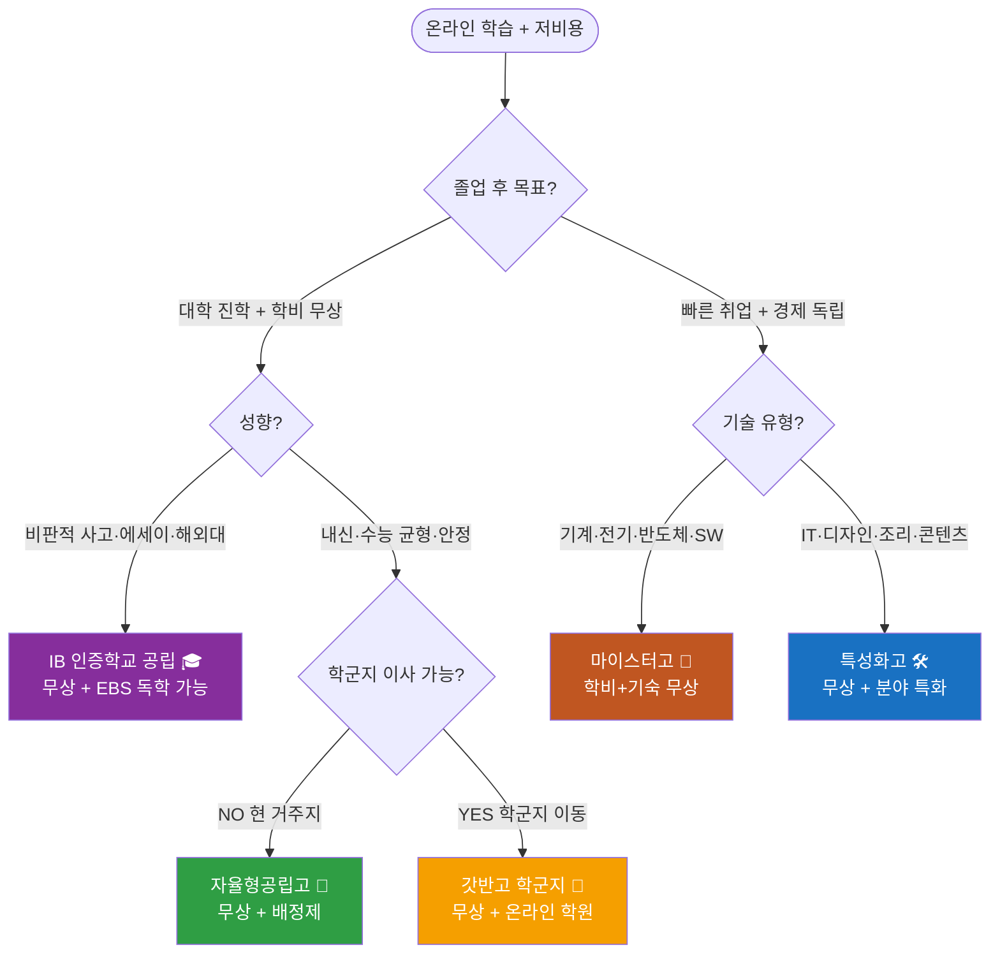

---

### 20-A. IB 인증학교 🎓 — 공립 무상 심층 가이드

> **온라인 학습자 핵심 메시지:** 공립 IB 학교 6개교는 **학비 완전 무상**. 사교육 없이 도전 가능한 가장 '글로벌한' 선택지. 단, 영어 에세이 실력이 전제.

#### 20-A-1. IB 과목 체계 완전 해설

IB 디플로마(DP)는 **6개 교과군 + 3개 핵심 요소**로 구성됩니다.

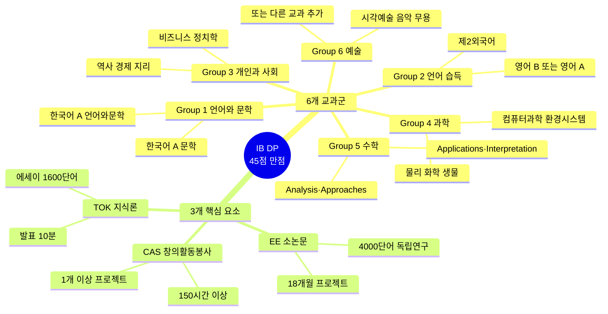

**HL(High Level) vs SL(Standard Level) 선택 전략:**

| 목표 진학처 | HL 3개 권장 조합 | 이유 |
|-----------|----------------|------|
| **이공계 국내 SKY** | 수학AA·물리·화학 HL | 이공계 심화 과목 시그널 |
| **인문·사회 국내 SKY** | 역사·경제·영어A HL | 사회과학 심화 |
| **미국 아이비리그** | 수학AA·과학·인문 중 강점 3개 HL | SAT 없이 IB 38+ 직접 지원 |
| **영국 옥브리지·LSE** | 해당 전공 관련 HL 3개 | 개인지도(Supervision) 기반 HL 요구 |
| **의대 목표 (국내)** | 화학·생물·수학 HL + 별도 수능 준비 | 수능 병행이 사실상 불가해 매우 어려움 |

#### 20-A-2. 공립 IB 학교별 상세 (6개교 — 전국 무상)

| 학교 | 지역 | IB 인증 | 입학 방식 | 경쟁률 | 웹사이트 | 온라인 준비 포인트 |
|------|------|--------|---------|------|--------|----------------|
| **제주 표선고** | 제주 서귀포 | DP 월드스쿨 (2021) | 내신 100% (면접 없음) | 약 1.4:1 | [표선고](https://jjps.jje.hs.kr/) | 기숙 가능. 제주 도내 거주 또는 이주 필요 |
| **대구국제고** | 대구 북구 | DP+국제고 | 내신+영어평가 | 2~3:1 | [대구국제고](https://dhi.myapply.kr/) | 대구권 최강 무상 IB |
| **경북대사대부설고** | 대구 중구 | DP | 내신+면접 | 2:1 내외 | [경북대사대부설고](https://knu.dge.hs.kr/) | 국립 사대부설, 대구 중심부 |
| **대구외국어고** | 대구 달서구 | DP+외고 | 영어평가+면접 | 3:1 내외 | [대구외국어고](https://dgfl.dge.hs.kr/) | 외고+IB 결합 |
| **대구서부고** | 대구 서구 | DP | 내신 중심 | 1~2:1 | [대구서부고](https://seobu.dge.hs.kr/seobuh/main.do) | 도심 공립, 접근성 좋음 |
| **포산고** | 대구 달성군 | DP | 내신 중심 | 1:1 내외 | [포산고](https://posan.dge.hs.kr/) | 소규모, 경쟁 낮음 |

> **저비용 전략:** 대구 이주 + 공립 IB 6교 중 선택 = **학비 0원 + IB 디플로마** 동시 달성. 대구는 광역시 중 집값이 낮아 실질 부담 최소.

#### 20-A-3. 입시 환경 분석

| 전형 요소 | 비중 | 온라인 준비 방법 |
|----------|------|---------------|
| **내신 성적** | 학교별 30~100% | EBSi 강의 + AI 개념 첨삭 (ChatGPT/Claude) |
| **영어 에세이** | 일부 학교 | BBC Learning English, TED-Ed + AI 첨삭 |
| **면접** | 일부 학교 | AI 모의면접 (ChatGPT 롤플레이) |
| **포트폴리오** | 없음 (공립) | — |

**2028 개편 영향 (IB):**
- 수능 5등급제·통합형 수능 → IB 학교는 **거의 영향 없음** (수능 응시 자체 안 함)
- 세특 35~40% 비중 확대 → IB EE·IA·CAS가 **세특 황금 소재**
- 면접 40% 확대 → TOK 훈련이 **면접 논리력에 직결**

#### 20-A-4. 온라인 학습 준비 로드맵 (사교육 0원 버전)

| 시기 | 과목 | 온라인 도구 | 목표 |
|------|------|-----------|------|
| **중1** | 영어 에세이 기초 | BBC Learning English, Grammarly 무료 | 영어 단락 쓰기 |
| **중1** | 비판적 사고 입문 | TED-Ed YouTube + 요약 노트 | "왜?" 묻는 습관 |
| **중2** | 영어 회화 | ChatGPT Advanced Voice 무료 (제한적) | 10분 영어 토론 |
| **중2** | 탐구 주제 발굴 | Claude·Perplexity 무료 | 관심 분야 1개 깊이 탐구 |
| **중2** | 수학 선행 | Khan Academy 완전 무료 | IB 수학AA SL 수준 |
| **중3** | EE 주제 탐색 | Elicit, Consensus (무료 버전) | 나만의 탐구 질문 1개 |
| **중3** | TOK 연습 | ChatGPT로 "AI가 생성한 지식은 진짜인가?" 토론 | TOK 에세이 구조 이해 |
| **중3** | 면접 준비 | AI 모의면접 + YouTube IB 합격 수기 | 자기 서사 완성 |

**추천 무료 온라인 자원 목록:**

| 자원 | 용도 | 비용 |
|------|------|------|
| Khan Academy (한국어) | 수학·과학 개념 | 완전 무료 |
| EBSi | 국어·수학·영어 | 무료 |
| BBC Learning English | 영어 에세이 | 무료 |
| ChatGPT Free (GPT-4o mini) | 개념 학습·에세이 첨삭·모의면접 | 무료 (제한적) |
| Claude Free | 한국어·영어 에세이 피드백 | 무료 |
| Perplexity Free | 논문·학술 자료 검색 | 무료 |
| YouTube (IB 채널) | IB 과목별 강의 | 완전 무료 |
| Notion Free | EE·CAS 기록 관리 | 무료 |
| Grammarly Free | 영어 문법 교정 | 무료 기본 |

#### 20-A-5. 추천 대회·수상 (입시 세특 활용)

> **원칙:** IB 입시에서 대회 수상이 결정적 요소는 아닙니다. **EE·TOK·IA 과정 자체**가 학종의 핵심. 대회는 "탐구 과정의 증거"로 활용.

| 대회명 | 주관 | 분야 | 비용 | 온라인 참가 가능 |
|--------|------|------|------|--------------|
| **국제청소년철학올림피아드 (IYPO)** | 한국철학교육학회 | TOK 연계 철학 | 무료 | 가능 |
| **전국학생환경탐구대회** | 환경부 | 과학·환경 IB EE 연계 | 무료 | 온라인 제출 |
| **청소년 사회참여 발표대회** | 행안부 | CAS 활동 증거 | 무료 | 온라인 발표 |
| **UCC·독후감 공모전** (학교별) | 각 시도교육청 | 인문·에세이 | 무료 | 온라인 제출 |
| **한국청소년글로벌리더십캠프** | 교육부 지원 | 국제 감각 | 저비용 | 일부 온라인 |
| **POSTECH·KAIST 온라인 수학캠프** | 대학 | 수학 HL 대비 | 무료 | 완전 온라인 |
| **국제모의유엔 (MUN)** | 각 학교·시도 | TOK·CAS 연계 | 무료~소액 | 온라인 MUN |

---

### 20-B. 자율형공립고 🏫 — 자공고 2.0 심층 가이드

> **온라인 학습자 핵심 메시지:** **학비 무상 + 배정제 (시험 없음)**. 2026.3부터 자공고 2.0 협약 프로그램이 시작돼 지역 대학·기업 연계 프로그램이 생깁니다. 거주지 근처 자공고를 먼저 확인하세요.

#### 20-B-1. 자공고 2.0 — 무엇이 달라지는가

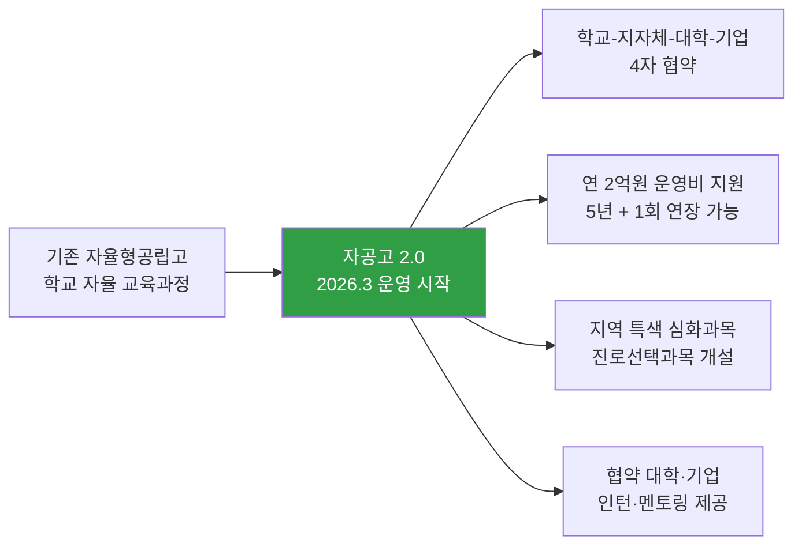

**자공고 2.0 핵심 변화:**
- 운영비 **연 2억원** 지원 (5년, 1회 연장) → 일반 공립고보다 프로그램 풍부
- 학교-지자체-대학-기업 **4자 협약** → 지역 대학 실험실·기업 인턴 연계
- **진로선택과목 신설** → 일반 공립고에 없는 심화 과목 개설 가능
- 입학 방식은 **기존 동일** (학구 배정/추첨, 별도 시험 없음)

#### 20-B-2. 25개교 전체 목록 (지역·웹사이트)

| 지역 | 학교명 | 웹사이트 | 특이사항 |
|------|--------|---------|---------|
| **부산** | 부산고등학교 | [부산고](https://school.busanedu.net/) | 1913년 개교 전통 명문 |
| **부산** | 주례여자고등학교 | [주례여고](http://jurye.hs.kr/) | 부산 사상구 |
| **인천** | 인천고등학교 | [인천고](https://incheon.icehs.kr/) | 1895년 개교 |
| **인천** | 강화여자고등학교 | [강화여고](https://ganghwagirls.icehs.kr/) | 농어촌 특별전형 가능 |
| **인천** | 선인고등학교 | [선인고](https://sunin.icehs.kr/) | 인천 미추홀구 |
| **경기** | 이의고등학교 (광교) | [이의고](https://iui-h.goesw.kr/) | 광교 신도시 — 내신 경쟁 강함 |
| **경기** | 백석고등학교 (일산) | [백석고](https://baekseok-h.goegy.kr/) | 일산 서구 |
| **경기** | 평내고등학교 (남양주) | [평내고](https://pyeongnae-h.goegn.kr/) | 남양주 호평·평내 |
| **경기** | 저현고등학교 (남양주) | [저현고](https://jeohyeon-h.goegy.kr/) | 남양주 와부읍 |
| **경기** | 의정부고등학교 | [의정부고](https://uigo-h.goeujb.kr/) | 의정부 시내 |
| **경기** | 의정부여자고등학교 | [의정부여고](https://ugh-h.goeujb.kr/) | 의정부 시내 |
| **경기** | 포천일고등학교 | [포천일고](https://pocheonil-h.goepc.kr/) | 포천 시내 |
| **경기** | 수주고등학교 (수원) | [수주고](https://suju-h.goebc.kr/) | 수원 권선구 |
| **경기** | 남한고등학교 (광주) | [남한고](https://namhan-h.goegh.kr/) | 경기 광주 |
| **경기** | 연천고등학교 | [연천고](https://yeoncheon-h.goeyc.kr/) | 농어촌 특별전형 가능 |
| **충북** | 진천고등학교 | [진천고](https://school.cbe.go.kr/jcg-h) | 소규모, 내신 경쟁 낮음 |
| **충북** | 충주예성여자고등학교 | [예성여고](https://school.cbe.go.kr/yesung-h) | 충주 시내 |
| **전북** | 남원고등학교 | [남원고](https://school.jbedu.kr/namwon-h) | 농어촌 특별전형 가능 |
| **전북** | 이리여자고등학교 | [이리여고](https://school.jbedu.kr/irigh/) | 익산 시내 |
| **전남** | 보성고등학교 | [보성고](https://boseong.hs.jne.kr/) | 농어촌 특별전형 가능 |
| **경북** | 북삼고등학교 | [북삼고](http://school.gyo6.net/buksam) | 구미 북삼 |
| **경북** | 영주여자고등학교 | [영주여고](https://school.gyo6.net/yeongju-girl) | 영주 시내 |
| **경남** | 김해고등학교 | [김해고](http://gimhae-h.gne.go.kr/) | 경남 중심부 |
| **경남** | 삼천포중앙고등학교 | [삼천포중앙고](https://scpjungang-h.gne.go.kr/) | 사천 삼천포 |
| **강원** | 도계고등학교 (삼척) | [도계고](http://dogye.gwe.hs.kr/) | 농어촌, 경쟁 거의 없음 |

> **온라인 학습자 포인트:** 이의고(광교) → 신도시 학군, 내신 경쟁 강함. 지방 자공고(남원고·보성고·도계고) → 내신 경쟁 낮고 농어촌 특별전형 가능. 서울 진학 목표라면 **농어촌 자공고 + 지역균형선발** 조합도 유효 전략.

#### 20-B-3. 과목 체계 및 교육과정

```
자공고 교육과정 구조 (일반고 동일 기반 + 자율 프로그램)

1학년: 공통교과 중심
  공통국어 / 공통수학 / 공통영어 / 통합사회 / 통합과학 / 한국사 / 체육 / 예술

2학년: 일반·진로선택과목 + 자공고 협약 심화과목
  (학교별 상이 — 협약 기관·지역 특성 반영)

3학년: 심화 선택 + 수능 대비 + 진로 탐구
  수능 준비 (정시 or 교과전형 병행 가능)
```

**2028 수능 개편과 자공고 교과 전략:**

| 변경 | 영향 | 자공고 대응 |
|------|------|-----------|
| 내신 5등급제 | **최대 수혜** — 1등급 폭 10%로 확대 | 교과전형 SKY 진입 장벽 완화 |
| 선택과목 폐지 | 수능 부담 균등 | 통합형 수능 집중 가능 |
| 세특 35~40% | 수업 탐구 중요성 증가 | 자공고 협약 프로그램 → 세특 소재 |
| 면접 40% | 발표·토론 능력 필요 | 학교 프로그램 적극 참여 |

#### 20-B-4. 입시 환경

| 전형 | 내용 | 준비 방법 |
|------|------|---------|
| **거주지 배정** | 대부분 추첨/학구 배정 | 거주지 학군 확인 (학교알리미) |
| **시험** | 없음 | — |
| **면접** | 일부 학교 운영 | AI 모의면접으로 준비 |
| **자기주도 학습계획서** | 일부 학교 운영 | 구체적 학습 계획 + 진로 탐구 |

**합격 후 내신 관리 — 교과전형 목표 내신:**

| 목표 대학 | 목표 내신 (2028 5등급제 기준) |
|----------|--------------------------|
| SKY 지역균형 | 1등급 (상위 10%) |
| 연고서성한 교과전형 | 1~2등급 |
| 지방 거점 국립대 | 2~3등급 |
| 지방 국립대 | 3등급 이내 |

#### 20-B-5. 온라인 학습 준비 로드맵

| 시기 | 내용 | 무료 도구 |
|------|------|---------|
| **중1~중2** | 전 과목 균형 내신 관리 | EBSi + 학교 수업 충실 |
| **중2** | 희망 자공고 특색 프로그램 조사 | 학교알리미 (schoolinfo.go.kr) |
| **중2~중3** | 세특 탐구 주제 2~3개 기획 | Claude/ChatGPT 브레인스토밍 |
| **중3 상** | 자기주도 학습계획서 (운영 학교) | Notion 무료로 작성·정리 |
| **중3 하** | 면접 준비 (면접 있는 학교) | AI 모의면접 30회 |

#### 20-B-6. 추천 대회·활동 (세특 강화용)

| 대회명 | 주관 | 특징 | 자공고 연계 |
|--------|------|------|-----------|
| **청소년 탐구올림픽** | 교육부 | 과학·사회 융합 탐구 | 협약 대학 연계 탐구 연장 |
| **전국학생통계활용대회** | 통계청 | 데이터 분석 (무료) | 수학·사회 세특 강화 |
| **청소년 환경탐구발표대회** | 환경부 | 온라인 제출 가능 | 과학·통합과학 세특 |
| **독서토론 대회** (학교별) | 시도교육청 | 교내 행사 | 국어·사회 세특 |
| **창업경진대회** (지역) | 지자체·창진원 | AI 창업 아이디어 | 자공고 협약 기업 연계 |
| **SW코딩경진대회** | 과기부 | 온라인 참가 | 정보·수학 세특 |

---

### 20-C. 갓반고 (학군지) 👑 — 비학원 온라인 준비 심층 가이드

> **온라인 학습자 핵심 메시지:** 학군지 일반고는 학비 무상이지만 학원비가 월 200~500만원. **온라인 학습으로 이 학원비를 대체하는 것이 핵심 전략**. 2028 개편은 이 전략의 타당성을 더욱 높임.

#### 20-C-1. 과목 체계 및 2028 수능 완전 이해

```
갓반고 교육과정 (일반고 기준)

1학년 공통교과:
  공통국어 1·2 / 공통수학 1·2 / 공통영어 1·2
  통합사회 1·2 / 통합과학 1·2 / 한국사 1·2 / 체육 / 예술 / 정보

2학년 일반선택 (2028부터):
  수학 → 대수 / 미적분 I / 확률과 통계
  국어 → 화법과 언어 / 독서와 작문 / 문학
  영어 → 영어 I / 영어 II / 영어 독해와 작문

3학년 진로선택:
  수학 → 미적분 II / 기하
  과학 → 물리학 / 화학 / 생명과학 / 지구과학
```

**2028 수능 개편 핵심 변화 (갓반고에 유리한 이유):**

| 항목 | 현행 | 2028 | 갓반고에게 미치는 효과 |
|------|------|------|-------------------|
| **내신 등급** | 9등급제 (상위 4%=1등급) | **5등급제 (상위 10%=1등급)** | 학생 수 많은 학군지에서 1등급 절대 인원 2.5배 증가 |
| **수능 선택과목** | 문·이과 분리 | **통합형 (선택 없음)** | 과목 유불리 소멸 → 학군지 수능 준비 표준화 가능 |
| **수학 범위** | 미적분/확률통계 선택 | **통합 수학 (필수)** | 모두 같은 범위 → 학원 없이도 EBS로 준비 가능 |
| **세특 비중** | 30% | **35~40%** | 탐구 활동 중요성 증대 → AI 도구 활용으로 대응 |

#### 20-C-2. 학군지별 특성과 비학원 준비 전략

| 학군지 | 대표 학교 | 내신 경쟁 | 비학원 생존 가능성 | 전략 포인트 |
|--------|---------|---------|----------------|-----------|
| **대치·도곡** | [경기고](https://kyunggi.sen.hs.kr/) / [단대부고](https://dan-kook.sen.hs.kr/) / [숙명여고](https://sm.sen.hs.kr/) | ★★★★★ | 어려움 (학원 의존도 최고) | 온라인 학습 + AI 오답 분석으로 최소화 |
| **목동** | [강서고](https://gangseo.sen.hs.kr/) / [진명여고](https://jm.sen.hs.kr/) | ★★★★☆ | 가능 | EBSi + 인강 조합으로 80% 대체 |
| **중계·노원** | [서라벌고](https://sorabol.sen.hs.kr/) / [재현고](https://jaehyun.sen.hs.kr/) | ★★★★☆ | 가능 | 학원 밀집도 낮아 온라인 학습 효과적 |
| **분당** | [낙생고](https://naksaeng-h.goesn.kr/) / [보평고](https://bopyung-h.goesn.kr/) / [서현고](https://seohyun-h.goesn.kr/) | ★★★★☆ | 가능 | 판교 IT 기업 인프라 — 온라인 자원 풍부 |
| **평촌** | [백영고](https://baekyoung-h.goeay.kr/) / [안양고](https://anyang-h.goeay.kr/) | ★★★☆☆ | 용이 | 경쟁 상대적 완화 — 온라인 학습으로 충분 |
| **대구 수성구** | [능인고](https://neungin.dge.hs.kr/) / [경신고](https://gyeongsin.dge.hs.kr/) | ★★★★☆ | 가능 | 대구 공립 IB와 거리 가까워 투트랙 검토 가능 |
| **광역시 학군** | [양운고](http://yangwoon.hs.kr/) / [광덕고](https://kwangdeok-h.goeas.kr/) | ★★★☆☆ | 용이 | 지방 학군지 — 온라인 학습으로 충분 |

#### 20-C-3. 온라인 학습 완전 대체 커리큘럼 (학원비 0원)

**수능 과목별 온라인 무료 자원:**

| 과목 | 최우선 자원 | 보조 자원 | AI 활용법 |
|------|-----------|---------|---------|
| **국어** | EBSi 수능 특강 (무료) | 유튜브 "남궁민 국어" | Claude에 지문 분석 요청 |
| **수학** | Khan Academy + EBSi | 유튜브 "수학의 신" | ChatGPT에 오답 원인 분석 |
| **영어** | EBSi 수능영어 | TED + BBC | AI 영작 첨삭 (ChatGPT) |
| **통합사회** | EBSi + 네이버 지식백과 | 유튜브 설민석·최태성 | Claude에 개념 질문 |
| **통합과학** | EBSi + 유튜브 "과학쿠키" | KOCW 무료 강의 | ChatGPT 실험 원리 설명 |
| **한국사** | EBSi + 유튜브 "큰별쌤" | 나무위키 | AI로 타임라인 정리 |
| **정보** | 코드잇 무료 + 생활코딩 | 유튜브 "노마드코더" | GitHub Copilot 무료 |

**월별 학습 플랜 (중3 기준):**

```
3월: 1학기 내신 집중 — EBSi 강의 + 학교 수업 중심
4월: 1학기 중간고사 대비 — AI 오답 분석
5월: 중간고사 후 세특 탐구 주제 설정 — Claude 브레인스토밍
6월: 1학기 기말고사 대비 — EBSi + AI 약점 집중
7월: 여름방학 — 수능 선행 + 탐구 프로젝트 완성
8월: 2학기 내신 준비 시작 + 자소서 소재 정리
9월: 2학기 중간고사 + 수능 모의고사 분석
10월: 고교 탐색 + 희망 학군 확정
11월: 2학기 기말고사 + AI 모의면접
12월: 고교 지원 + 최종 내신 점검
```

#### 20-C-4. 세특 탐구 주제 추천 (온라인 학습 기반)

> **원칙:** 세특은 수업 시간 중 탐구 활동. 온라인 자료를 활용해 "수업 내용을 더 깊이 파고든 기록"으로 작성.

| 과목 | 세특 주제 아이디어 | 온라인 자료 | 탐구 결과물 |
|------|----------------|-----------|-----------|
| **수학** | 인공지능 알고리즘의 수학적 원리 탐구 | Khan Academy + 유튜브 3Blue1Brown | 보고서 1~2쪽 |
| **통합과학** | 기후변화 데이터 분석 (기상청 공공데이터) | 기상청 기후변화시나리오 | 데이터 시각화 |
| **통합사회** | AI 시대 직업 변화 사회학적 분석 | 한국고용정보원 보고서 | 발표 자료 |
| **정보** | ChatGPT API 간단 웹앱 제작 | 생활코딩 + GitHub | GitHub 결과물 |
| **국어** | AI 생성 소설 vs 인간 소설 문체 비교 | 국립국어원 말뭉치 | 비교 에세이 |
| **영어** | 기후변화 국제협약 영어 문서 분석 | IPCC 보고서 영문 | 영어 요약 보고서 |

#### 20-C-5. 추천 대회·수상 (갓반고 내신 + 수능 균형 학생)

| 대회명 | 주관 | 분야 | 비용 | 온라인 가능 | 세특 활용도 |
|--------|------|------|------|-----------|-----------|
| **전국학생수학경시대회** | 수학교육학회 | 수학 | 소액 | 오프라인 | ★★★★★ |
| **한국수학올림피아드 (KMO)** | 대한수학회 | 수학 심화 | 무료 | 1차 지필 | ★★★★★ |
| **전국학생통계활용대회** | 통계청 | 수학·사회 | 무료 | 온라인 제출 | ★★★★☆ |
| **청소년 환경탐구발표대회** | 환경부 | 과학·사회 | 무료 | 온라인 | ★★★★☆ |
| **디지털 리터러시 경진대회** | 과기부 | 정보 | 무료 | 온라인 | ★★★☆☆ |
| **글로벌지속가능발전목표 탐구대회** | KOICA | 사회·영어 | 무료 | 온라인 | ★★★★☆ |
| **교내 교과 탐구보고서** | 학교 자체 | 전 과목 | 무료 | — | ★★★★★ |
| **독서토론·독서감상 대회** (교내) | 학교 자체 | 국어 | 무료 | — | ★★★★☆ |

> **컨설턴트 팁:** 갓반고 학생에게 대회는 "수상" 자체보다 **"수업 탐구의 연장선"**이라는 프레이밍이 중요. AI 도구로 탐구를 더 깊이 하고, 그 과정을 세특에 기록하는 것이 핵심. 대회 입상 여부보다 **세특 기술이 잘 되어 있는가**가 학종 합격을 결정.

---

### 20-D. 마이스터고 🔧 — 온라인 준비 + 분야별 자격증 심층 가이드

> **온라인 학습자 핵심 메시지:** 마이스터고는 **학비 + 기숙사 완전 무상**. 취업이 목표라면 대한민국에서 가성비 가장 높은 선택. 온라인으로 중학교 때 분야 기초를 쌓으면 입시에서 차별화 가능.

#### 20-D-1. 마이스터고 교육과정 완전 해설

```
마이스터고 학년별 교육과정 비중

1학년: 보통교과 70% + 전공 기초 30%
  공통국어·수학·영어 (각 6학점)
  통합사회·통합과학·한국사·체육·예술
  → 전공 기초 실습 시작

2학년: 전공 교과 62% 이상
  선택 보통교과 최소화 (대수·영어I 등)
  → 전공 실무 심화 집중

3학년: 전공 실습·현장 실습 위주
  협약 기업 현장 실습 (6개월~1년)
  자격증 취득 집중
  → 취업 직결
```

#### 20-D-2. 분야별 마이스터고 + 자격증 + 온라인 준비 상세

| 분야 | 대표 학교 | 취업처 | 중학생 온라인 준비 | 핵심 자격증 |
|------|---------|--------|----------------|-----------|
| **자동차·기계** | [현대공고](http://hit.hs.kr/) (울산) | 현대차·현대중공업 | 유튜브 기계공학 기초 + Tinkercad 3D | 기계가공기능사 → 기계기사 |
| **전기·전자** | [수도전기공고](https://sudo.sen.hs.kr/) (서울) | 한국전력·삼성전자 | 유튜브 전기기초 (전압·전류·회로) | 전기기능사 → 전기기사 |
| **SW·AI (대구)** | [대구SW마이스터고](http://www.dgsw.hs.kr/) | 카카오·네이버·라인 | 생활코딩 + 파이썬 코딩 → GitHub | 정보처리기능사 → 정보처리기사 |
| **SW·AI (광주)** | [광주SW마이스터고](http://gsm.gen.hs.kr/) | 스타트업·IT기업 | 생활코딩 + 프로젝트 GitHub | 정보처리기능사 |
| **SW·AI (대덕)** | [대덕SW마이스터고](https://dsmhs.djsch.kr/) | 대전 IT기업 | 생활코딩 + AI 도구 실습 | 정보처리기능사 |
| **로봇** | [서울로봇고](https://srobot.sen.hs.kr/) (서울) | 현대로보틱스·LG전자 | Arduino 유튜브 + 3D프린팅 | 생산자동화산업기사 |
| **전자** | [인천전자마이스터고](https://intec.icehs.kr/) | 삼성전자·LG | 전자회로 유튜브 + 시뮬레이터 | 전자기기기능사 |
| **해양** | [부산해사고](http://maritime.hs.kr/) | 한국선급·해운사 | 항해·기관 유튜브 | 항해사·기관사 면허 |
| **에너지** | [한국에너지마이스터고](https://energy.gwe.hs.kr/) (강원) | 한수원·한전 | 에너지 전환 뉴스 + 배터리 유튜브 | 전기기사·에너지관리기사 |
| **바이오** | [한국바이오마이스터고](https://kbmh.meistergo.co.kr/) | 셀트리온·한미약품 | 생명과학 유튜브 + 생물 기초 | 바이오화학제품제조기능사 |
| **스마트팩토리** | [아산스마트팩토리고](http://smart.cnehs.kr/) | 삼성·현대 스마트공장 | PLC 시뮬레이터 무료 소프트웨어 | 생산자동화산업기사 |
| **기계·철강** | [포항제철공업고](http://school.gyo6.net/pocheoltechhs) | 포스코·현대제철 | 금속·열처리 유튜브 | 기계가공기능사 |
| **자동차 (부산)** | [부산자동차마이스터고](http://www.automotive.hs.kr/) | 르노·기아 부산공장 | 자동차 정비 유튜브 | 자동차정비기능사 |
| **농생명** | [김제농생명마이스터고](https://school.jbedu.kr/gmhsas/) | 농협·농식품기업 | 스마트팜 유튜브 | 농업기계운전·정비기능사 |

#### 20-D-3. 입시 전형 단계별 완전 분석

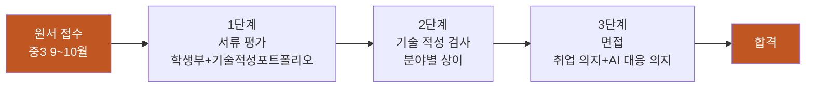

**단계별 온라인 준비 방법:**

| 단계 | 평가 내용 | 온라인 준비법 |
|------|---------|------------|
| **서류 — 학생부** | 내신 + 기술 관련 활동 | 기술 관련 교내 활동 기록 (정보 시간 코딩 등) |
| **서류 — 포트폴리오** | 기술 관심 증거 | GitHub 프로젝트 or Tinkercad 3D 모델 or YouTube 채널 |
| **적성 검사** | 분야별 기술 이해도 | 유튜브 분야 기초 + ChatGPT 개념 퀴즈 |
| **면접** | 취업 의지 + AI 시대 대응 | AI 모의면접 + "AI 시대 기술자의 역할" 자기 서사 |

**면접 예상 질문 10개 (온라인 준비):**
1. "왜 대학 대신 마이스터고를 선택했는가?"
2. "지원 분야에 관심을 갖게 된 계기는?"
3. "AI가 기술직을 대체한다는 말을 어떻게 생각하는가?"
4. "졸업 후 어떤 기업에 취업하고 싶은가?"
5. "손기술과 AI 도구를 어떻게 함께 활용할 것인가?"
6. "마이스터고 졸업 후 10년 뒤 자신의 모습은?"
7. "기술 관련 자신이 해본 프로젝트나 경험을 말해보라"
8. "선취업 후진학 트랙을 알고 있는가? 이를 어떻게 활용할 것인가?"
9. "스마트팩토리·AI 자동화 시대에 기술자가 해야 할 역할은?"
10. "가장 존경하는 기술 명장(또는 엔지니어)은 누구이고 왜인가?"

#### 20-D-4. 온라인 학습 준비 로드맵 (완전 무료)

| 시기 | 목표 | 무료 도구 | 결과물 |
|------|------|---------|--------|
| **중1** | 분야 탐색 | YouTube 기술 채널 탐방 (5개 분야 각 5시간) | 관심 분야 1개 결정 |
| **중1** | 기초 개념 | Khan Academy (수학·과학 기초) | 기초 수학·과학 확립 |
| **중2** | 분야 기초 실습 | Arduino (무료) / Tinkercad (무료) / 생활코딩 (무료) | 작은 프로젝트 1건 |
| **중2** | 포트폴리오 시작 | GitHub 무료 / Notion 무료 | 온라인 포트폴리오 |
| **중2~중3** | AI 도구 연계 | ChatGPT Free로 기술 개념 학습 | AI 활용 일지 |
| **중3 상** | 희망 학교 분석 | 학교알리미 + 각 학교 입학 요강 | 지원 학교 3개 선정 |
| **중3 하** | 면접 준비 | AI 모의면접 30회 이상 | 면접 답변 완성 |

**분야별 무료 온라인 학습 자원:**

| 분야 | 자원명 | URL/위치 | 비용 |
|------|--------|---------|------|
| **전기·전자** | All About Electronics (유튜브) | YouTube 검색 | 무료 |
| **SW·AI** | 생활코딩 | opentutorials.org | 무료 |
| **SW·AI** | 코드잇 무료 강의 | codeit.kr | 일부 무료 |
| **3D·기계** | Tinkercad | tinkercad.com | 무료 |
| **자동화·로봇** | Arduino 공식 튜토리얼 | arduino.cc | 무료 |
| **반도체** | 삼성반도체 공식 유튜브 | YouTube 검색 | 무료 |
| **바이오** | KOCW 생물학 강의 | kocw.net | 무료 |
| **에너지** | 한수원·한전 공식 유튜브 | YouTube 검색 | 무료 |

#### 20-D-5. 자격증 로드맵 (고교 재학 중 ~ 취업 후)

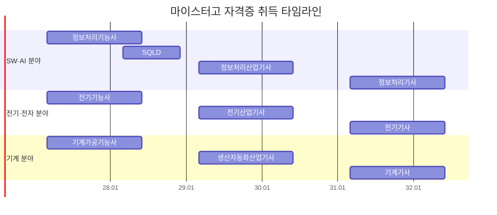

#### 20-D-6. 취업 후 커리어 트랙 (선취업 후진학)

| 단계 | 시기 | 내용 | 비용 |
|------|------|------|------|
| **취업** | 졸업 직후 | 대기업·공기업 기술직 (초봉 3,000~4,000만) | — |
| **자격증 업그레이드** | 취업 후 1~3년 | 기능사 → 산업기사 → 기사 | 응시료만 |
| **후진학 A** | 재직 3년 후 | 특성화고졸 재직자 특별전형 (수능 없음) | 등록금 일부 (야간) |
| **후진학 B** | 재직 중 | 삼성·SK 사내 대학 (협약 임직원 대상) | 회사 지원 |
| **후진학 C** | 재직 중 | 한국기술교육대·한국폴리텍 전공심화 | 국가 장학금 가능 |

---

### 20-E. 특성화고 🛠️ — 분야별 심층 가이드 + 온라인 준비

> **온라인 학습자 핵심 메시지:** 특성화고는 마이스터고보다 분야가 넓고 취업·진학 양 트랙 모두 가능. **중2~중3에 분야 결정이 핵심**. 온라인으로 관심 분야 포트폴리오를 미리 만들면 입시 차별화 가능.

#### 20-E-1. 마이스터고 vs 특성화고 완전 비교

| 항목 | 마이스터고 | 특성화고 |
|------|---------|--------|
| **법적 근거** | 시행령 §90 (특수목적고) | 시행령 §91 (일반 특성화고) |
| **기숙사** | 의무 기숙 (무상) | 대부분 통학 (일부 기숙) |
| **학비** | 무상 + 기숙·실습비 지원 | 무상 (실습비 소액) |
| **취업 연계** | 대기업·공기업 직결 (산업체 협약) | 학교별 편차 큼 |
| **진학** | 후진학 트랙 (수능 불필요) | 특성화고 특별전형 or 후진학 |
| **분야** | 국가 전략 산업 특화 | 다양 (IT·디자인·조리·자동차·공예 등) |
| **경쟁률** | 상대적으로 낮음 | 인기 분야(선린·한국애니) 높음 |

#### 20-E-2. 분야별 특성화고 상세 + 입시 + 온라인 준비

**[IT·SW 분야]**

| 항목 | 내용 |
|------|------|
| **대표 학교** | [선린인터넷고](https://sunrint.sen.hs.kr/) (서울 용산, 공립) / [경기모바일과학고](https://gms-h.goeas.kr/) (경기 안산) |
| **학과** | 정보보호과, 소프트웨어과, IT경영과, 콘텐츠디자인과 (학교별 상이) |
| **입시 전형** | 서류 (학생부+자소서) + 면접 |
| **선린 경쟁률** | 학과별 2~5:1 (전국 기준) |
| **핵심 자격증** | 정보처리기능사, SQLD, 네트워크관리사, 정보보안기사 |
| **온라인 준비** | Python 생활코딩 → GitHub 프로젝트 → ChatGPT 코딩 보조 → 정보올림피아드 |
| **면접 포인트** | "코딩 경험 + GitHub 결과물 + AI 도구 활용 방법" |
| **취업/진학** | 카카오·네이버·라인 (취업) / 한국디지털미디어고 전형 대학 (진학) |

```
선린인터넷고 온라인 준비 로드맵:

중1: Python 기초 (생활코딩 무료) → 간단 계산기 프로그램 완성
중2: 웹개발 기초 (HTML+CSS+JS) → GitHub 첫 커밋
중2: 정보올림피아드 응시 (한국정보올림피아드 — 무료)
중3: 포트폴리오 사이트 제작 + AI 도구 활용 일지
중3: 선린 면접 준비 — "정보보호·SW·IT경영 중 어느 학과, 왜?" 명확히
```

**[콘텐츠·애니메이션 분야]**

| 항목 | 내용 |
|------|------|
| **대표 학교** | [한국애니메이션고](https://anigo-h.goegh.kr/) (경기 하남) / [한국디지털미디어고](https://dimigo-h.goeas.kr/) (경기 안산) |
| **학과** | 만화창작과, 애니메이션과, 게임과, 영상과 (학교별 상이) |
| **입시 전형** | 서류 + 면접 + **실기 (포트폴리오 제출)** |
| **한국애니 경쟁률** | 5:1 이상 (전국 최고 수준) |
| **핵심 자격증** | 컴퓨터그래픽스운용기능사, 멀티미디어콘텐츠제작전문가 |
| **온라인 준비** | Krita (무료) / Blender (무료) → 작품 제작 → Behance 포트폴리오 |
| **포트폴리오** | 자신의 캐릭터·단편 애니·웹툰 5~10점. AI 도구 활용 과정 포함 |
| **AI 도구** | Midjourney / Stable Diffusion (레퍼런스용) → 최종 작품은 직접 제작 |

```
한국애니메이션고 온라인 준비:

중1: 손그림 기초 → 디지털 드로잉 (Krita 무료)
중2: 단편 애니메이션 제작 (1분 이내) → Behance 업로드
중2: AI 이미지 도구(Midjourney) 체험 → "AI vs 내 그림" 비교 일지
중3: 포트폴리오 10점 완성 + "나만의 IP 설계"
중3: 면접 준비 — "왜 이 작품을 만들었는가" 스토리 완성
```

**[디자인 분야]**

| 항목 | 내용 |
|------|------|
| **대표 학교** | [서울디자인고](https://seodi.sen.hs.kr/) (서울 마포) / [한국디지털미디어고](https://dimigo-h.goeas.kr/) (경기 안산) |
| **학과** | 시각디자인과, 제품디자인과, 공간디자인과 |
| **입시 전형** | 서류 + 면접 + 포트폴리오 |
| **핵심 자격증** | 컴퓨터그래픽스운용기능사, GTQ (그래픽기술자격) |
| **온라인 준비** | Canva (무료) → Figma (무료) → 디자인 포트폴리오 |
| **AI 도구** | Adobe Firefly (무료 체험) / Canva AI → 디자인 초안 → 직접 완성 |

**[조리·식품 분야]**

| 항목 | 내용 |
|------|------|
| **대표 학교** | [한국조리과학고](https://kcas-h.goesh.kr/) (경기 시흥) / [서울컨벤션고](https://seoul-chs.sen.hs.kr/) (서울 강동) |
| **학과** | 한식과, 양식과, 제과제빵과, 관광조리과 |
| **입시 전형** | 서류 + 면접 (요리 실기 없음 — 지원 동기 중심) |
| **핵심 자격증** | 한식조리기능사, 양식조리기능사, 제과기능사, 제빵기능사 |
| **온라인 준비** | 유튜브 요리 채널 (백종원·이연복) → 직접 조리 기록 → 포트폴리오 |
| **면접 포인트** | "조리를 통해 만든 경험 + 음식으로 무엇을 표현하고 싶은가" |

**[자동차 분야]**

| 항목 | 내용 |
|------|------|
| **대표 학교** | [경기자동차과학고](http://www.ghas.hs.kr/) (경기 시흥) / [부산자동차마이스터고](http://www.automotive.hs.kr/) |
| **학과** | 자동차과, 자동차전기전자과, 전기차·자율주행과 |
| **입시 전형** | 서류 + 면접 |
| **핵심 자격증** | 자동차정비기능사, 자동차차체수리기능사, 전기차정비 자격 (신설) |
| **온라인 준비** | 자동차 해체영상 유튜브 + 전기차 원리 유튜브 (테슬라·현대) |
| **AI 시대 핵심** | 내연기관 → 전기차 전환. 전기차·자율주행 공부가 미래 경쟁력 |

#### 20-E-3. 입시 환경 및 온라인 준비 핵심

| 전형 요소 | 내용 | 온라인 준비 |
|----------|------|----------|
| **학생부 (내신)** | 분야 관련 과목 우수 (정보·미술·기술) | EBSi + 학교 수업 + AI 학습 |
| **자기소개서** | 지원 분야 관심 동기 + 준비 활동 | Claude/ChatGPT 초안 → 본인 언어로 재작성 |
| **면접** | 진로 의지 + AI 도구 활용 경험 | AI 모의면접 20회 이상 |
| **포트폴리오** | 콘텐츠·디자인 학과 필수 | 무료 툴(Krita·Canva·GitHub)로 제작 |
| **실기** | 일부 학과만 (디자인·예술 관련) | 무료 소프트웨어 + 유튜브 튜토리얼 |

#### 20-E-4. 대학 진학 트랙 (특성화고 특별전형)

> **핵심:** 특성화고 특별전형은 **수능 최저 없는 대학이 많고**, 동일계열 지원이 필수.

**특성화고 특별전형 조건:**

| 조건 | 내용 |
|------|------|
| **동일계열 필수** | 지원 학과가 고교 전공과 동일 계열 |
| **전문교과 이수** | 전문교과 30단위 이상 이수 (고교 재학 중) |
| **수능 최저** | 대학별 상이 — 최저 없는 대학 多 |
| **제출 서류** | 학생부 + 자소서 + 경우에 따라 포트폴리오 |

**특성화고 특별전형 가능 대학 (예시):**

| 분야 | 지원 가능 대학 | 전형 |
|------|-------------|------|
| **IT·SW** | 한양대(ERICA)·성균관대·세종대·명지대 | 특성화고 특별 |
| **디자인** | 홍익대·국민대·건국대·경기대 | 특기자·특성화 |
| **조리** | 경희대(호텔·관광)·세종대·동명대 | 특성화고 특별 |
| **자동차** | 한양대(ERICA)·경기대·경일대 | 특성화고 특별 |

**선취업 후진학 트랙 (추천):**

```
졸업 → 취업 → 재직 3년 → 재직자 특별전형 (수능 불필요) → 대학 입학
                                           ↓
                              야간·온라인 수업으로 취업 유지 가능
```

#### 20-E-5. 온라인 학습 준비 핵심 로드맵

| 시기 | 행동 | 무료 도구 |
|------|------|---------|
| **중1** | 관심 분야 5개 체험 | YouTube 각 분야 채널 탐방 |
| **중2 초** | 분야 1개 확정 → 기초 학습 | 분야별 무료 온라인 강의 |
| **중2** | 소규모 결과물 제작 | Krita/Canva/GitHub/Tinkercad |
| **중2~중3** | AI 도구 활용 일지 | ChatGPT·Claude 무료 |
| **중3 상** | 포트폴리오 정리 | Behance(무료)/GitHub(무료)/Notion(무료) |
| **중3 하** | 자소서 + 면접 준비 | AI 모의면접 + 학교별 입학요강 분석 |

---

### 20-F. 5개 유형 최종 비교 — 온라인 학습자 결정 가이드

#### 실질 비용 비교 (연간)

| 유형 | 학비 | 기숙사 | 실질 추가 비용 | 총 연간 비용 |
|------|------|--------|-------------|-----------|
| **공립 IB** | 무상 | 일부 (소액) | 영어 도서 · 인터넷 | **10~30만원** |
| **자율형공립고** | 무상 | 없음 | 급식·교복 | **10~20만원** |
| **갓반고 (비학원)** | 무상 | 없음 | 온라인 강의 구독 | **20~50만원** |
| **마이스터고** | 무상 | **무상** | 거의 없음 | **0~10만원** |
| **특성화고** | 무상 | 없음 | 실습재료·자격증 응시료 | **20~50만원** |

#### 온라인 학습 효과 비교

| 유형 | 온라인 학습으로 대체 가능한 비율 | 남은 오프라인 필수 요소 |
|------|--------------------------|---------------------|
| **공립 IB** | 80% | 영어 에세이 첨삭 (온·오프 혼합) |
| **자율형공립고** | 90% | 학교 수업 참여 |
| **갓반고** | 70~80% | 학교 수업 + 교내 대회 참여 |
| **마이스터고** | 50% | 실기 실습 (학교 내 필수) |
| **특성화고** | 60% | 포트폴리오 제작 실기 |

#### 최종 추천 매트릭스 (온라인 학습자)

| 학생 유형 | 1순위 | 2순위 | 이유 |
|----------|------|------|------|
| **비판적 사고 강 + 영어 잘함 + 해외대 꿈** | 공립 IB (대구 이주 가능 시) | 갓반고 | IB 공립 = 학비 0원 + 글로벌 커리큘럼 |
| **내신·수능 균형 + 대학 진학 + 현 거주지** | 자율형공립고 | 갓반고 | 시험 없음 배정제 + 무상 |
| **대학 진학 + SKY 목표 + 학군지 이주 가능** | 갓반고 | 자율형공립고 | 2028 개편 최대 수혜 |
| **빠른 취업 + 대기업 기술직 + 가성비 최강** | 마이스터고 | 특성화고(IT) | 학비+기숙 0원 + 취업 직결 |
| **IT 코딩·SW 재능 + 대학 진학 병행** | 특성화고(선린) | 마이스터고(SW) | 특성화고 특별전형으로 대학 가능 |
| **그림·디자인·애니 재능** | 특성화고(한국애니·서울디자인고) | 예술고 | 포트폴리오 + 무상교육 |
| **조리·식품 재능 + 경제 독립** | 특성화고(한국조리과학고) | 마이스터고 | 자격증 → 취업 → 후진학 |

---

*데이터 출처: `/frontend/data/high-school/` JSON 전수 반영 / 최종 업데이트: 2026-06-26*
