# AI 시대 진로 탐험 완전 가이드
> 고등학생을 위한 직업 컨설턴트의 8개 왕국 심층 분석

**기준일**: 2026년 6월 | **대상**: 고등학생 진로 탐험 | **직업 수**: 242개 (8개 왕국)

---

## 1. 왜 지금 진로를 다시 설계해야 하는가

2024년부터 세상이 근본적으로 바뀌고 있습니다. ChatGPT가 등장한 지 불과 3년 만에, AI는 글을 쓰고, 그림을 그리고, 코드를 짜고, 법률 문서를 분석하고, 의료 영상을 판독합니다. 2026년 현재, Cursor AI를 쓰는 개발자는 혼자서 과거 5인 팀의 일을 해냅니다. Midjourney v8으로 누구나 전문 디자이너 수준의 이미지를 만들 수 있습니다. Harvey AI는 변호사의 판례 리서치 시간을 90% 줄였습니다.

이것은 무서운 이야기가 아닙니다. **기회의 이야기**입니다.

AI가 반복적인 일을 대신해주면, 인간은 더 본질적인 일에 집중할 수 있습니다. "코드를 치는 사람"이 아니라 "어떤 시스템을 설계할지 결정하는 사람"이 됩니다. "기사를 쓰는 사람"이 아니라 "어떤 이야기가 세상에 필요한지 판단하는 사람"이 됩니다.

**문제는 이겁니다**: 여러분이 지금 준비하는 진로가 5년 뒤에도 같은 모습일까요?

이 가이드는 여러분이 단순히 "어떤 직업이 있나"를 넘어서, **AI 시대에 어떤 역할이 커지고, 어떤 도구를 익혀야 하고, 어떤 역량이 나를 차별화해주는지**를 구체적으로 알려드립니다.

---

## 2. 진로 탐험 5단계 로드맵

고등학생이 진로를 설계하는 과정을 5단계로 나눕니다. 각 단계는 순서대로 진행하되, 언제든 이전 단계로 돌아갈 수 있습니다.

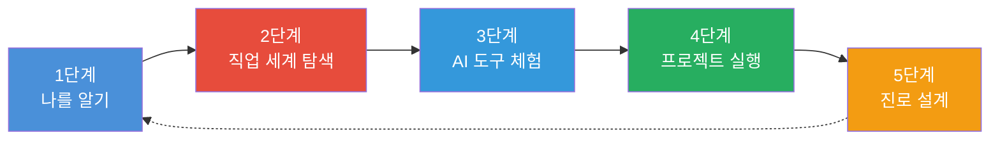

### 1단계: 나를 알기 — "나는 어떤 사람인가?"

진로의 출발점은 자기 이해입니다. RIASEC 직업 흥미 유형 검사를 통해 자신의 성향을 파악하고, 그에 맞는 왕국(직업군)을 찾습니다. 대부분의 사람은 2~3개 유형의 조합으로 나타납니다.

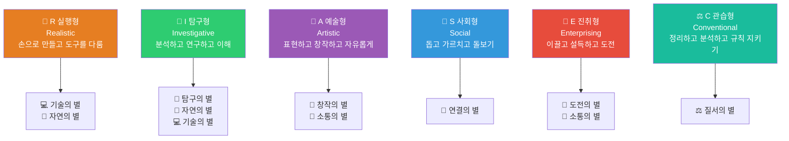

#### RIASEC 6가지 성격 유형별 역량 프로파일

---

**🔬 I형 (탐구형 · Investigative) — "왜? 어떻게? 정말?"**

탐구형은 6가지 유형 중 AI 시대에 **가장 수요가 급증하는 유형**입니다. AI가 데이터를 처리해주지만, "이 패턴이 진짜 의미 있는가"를 판단하는 비판적 사고는 인간 탐구형의 핵심 무기이기 때문입니다.

| 타고난 강점 | AI 시대 핵심 역량으로 진화하는 방법 | 주의할 점 |
|-----------|-------------------------------|---------|
| 집요한 호기심 — 답이 나올 때까지 파고드는 성향 | AI 결과를 그대로 믿지 않고 검증하는 습관으로 발전 | 완벽주의가 행동을 막지 않도록 주의 |
| 논리적 분석력 — 원인과 결과를 체계적으로 추론 | AI 알고리즘의 논리 오류·편향을 발견하는 능력 | 타인과 소통할 때 설명을 너무 어렵게 하지 않기 |
| 독립적 사고 — 권위보다 증거를 믿는 태도 | AI 권고를 맹신하지 않고 독자적 검증 수행 | 팀 협업보다 혼자 일하길 선호할 수 있으므로 협력 의식 키우기 |
| 체계적 방법론 — 가설-실험-검증의 과학적 접근 | 좋은 AI 프롬프트 설계 (좋은 질문 = 좋은 결과) | 실험 과정에서 멈추지 말고 결론까지 내리는 훈련 |
| 깊은 전문성 추구 — 넓게보다 깊게 아는 성향 | AI가 대답하지 못하는 틈새 영역의 전문가로 성장 | 변화하는 분야에서 넓은 시야도 병행 |
| 회의적 사고 — "정말 그런가"를 자동으로 묻는 반응 | AI 딥페이크·가짜 논문·잘못된 데이터를 가려내는 능력 | 지나친 회의주의로 팀의 결정이 늦어지지 않도록 |

**I형이 빛나는 직업군**: 탐구의 별(의사, AI 의료 감독관, 의료데이터사이언티스트, 생명공학연구원), 기술의 별(AI 연구원, 머신러닝 엔지니어), 자연의 별(기후과학자, 환경공학자)

---

**🔧 R형 (실행형 · Realistic) — "직접 해보면 알아"**

실행형은 추상적 개념보다 **눈에 보이고 손에 잡히는 결과물**을 만들 때 에너지가 솟습니다. AI 시대에 R형의 강점은 "AI가 설계한 것을 현실에서 구현하고 검증하는 능력"으로 빛을 발합니다.

| 타고난 강점 | AI 시대 핵심 역량으로 진화하는 방법 | 주의할 점 |
|-----------|-------------------------------|---------|
| 실용적 문제해결 — 이론보다 작동하는 해결책 선호 | AI 제안을 현실에서 테스트하는 프로토타입 제작자 | 문서화·기록을 소홀히 하지 않기 |
| 도구·기술 친화성 — 새 도구를 빨리 익히는 적응력 | AI 도구 습득 속도가 빠름 → 얼리어답터 우위 | 신기술에 매몰되어 깊이를 잃지 않기 |
| 구체적 사고 — 추상 개념을 물리적 프로세스로 전환 | AI 알고리즘을 실제 하드웨어·시스템에 구현 | 큰 그림 전략도 함께 보는 훈련 필요 |
| 결과 지향성 — 완성된 것을 보며 만족감 획득 | AI 협업 프로세스의 최종 구현·납품 담당자로 강점 | 과정의 학습도 중요히 여기기 |
| 현장 감각 — 실제 환경의 문제를 빠르게 파악 | AI가 시뮬레이션으로 놓친 현장 변수 발견 | 현장만 보고 데이터 기반 판단을 무시하지 않기 |

**R형이 빛나는 직업군**: 기술의 별(소프트웨어 엔지니어, 로봇공학자, DevOps), 자연의 별(재생에너지 엔지니어, 정밀농업 전문가)

---

**🎨 A형 (예술형 · Artistic) — "나답게, 아름답게"**

예술형은 **규칙보다 표현, 답보다 감성**을 추구합니다. AI가 콘텐츠를 대량 생산하는 시대에, 역설적으로 "진짜 인간의 감성"이 가장 희소해집니다. A형의 강점은 AI 결과물과 진짜 창작물을 구분하는 심미안입니다.

| 타고난 강점 | AI 시대 핵심 역량으로 진화하는 방법 | 주의할 점 |
|-----------|-------------------------------|---------|
| 심미적 감각 — 무엇이 아름다운지 직관적으로 앎 | AI 생성물 중 "진짜 좋은 것"을 고르는 큐레이션 능력 | 감각만으로는 부족, 왜 좋은지 설명할 수 있어야 함 |
| 독창성 추구 — 남과 같은 것을 거부하는 성향 | AI 평균을 거부하고 고유한 스타일을 만드는 능력 | 독창성을 위해 협업 기회를 놓치지 않기 |
| 감정 표현력 — 느끼는 것을 작품으로 변환 | AI가 모방하기 어려운 "경험에서 나온 감성" 표현 | 상업적 감각도 함께 키우기 |
| 자유로운 상상력 — 제약 없이 가능성 탐색 | AI 도구를 제약 없이 실험하는 창의적 활용 | 완성도와 마감 관리 훈련 필요 |
| 미적 완성도 집착 — 완벽한 결과물에 대한 집착 | AI 초안의 디테일을 인간 손길로 완성하는 능력 | 완벽주의가 생산성을 방해하지 않도록 |

**A형이 빛나는 직업군**: 창작의 별(크리에이티브 디렉터, 아트 디렉터, 경험 디자이너), 소통의 별(브랜드 스토리텔러, 위기소통 전문가)

---

**🤝 S형 (사회형 · Social) — "당신이 나아지는 게 내 보람"**

사회형은 AI 시대에 **가장 안전한 유형**입니다. 공감, 신뢰 형성, 감정적 지지는 AI가 흉내는 내도 진짜로 대체할 수 없는 인간 고유의 영역이기 때문입니다. 동시에 AI를 활용하면 더 많은 사람을 더 효과적으로 도울 수 있습니다.

| 타고난 강점 | AI 시대 핵심 역량으로 진화하는 방법 | 주의할 점 |
|-----------|-------------------------------|---------|
| 공감 능력 — 상대 감정을 직관적으로 이해 | AI 챗봇이 못하는 "진짜 들어주는 것"의 가치 극대화 | 공감 피로(Compassion Fatigue) 예방을 위한 자기 돌봄 |
| 대인관계 기술 — 신뢰 관계를 빠르게 형성 | AI 진단·분석 결과를 사람에게 전달하는 가교 역할 | 경계 설정 능력 (과도한 감정 소진 방지) |
| 교육·코칭 능력 — 복잡한 것을 쉽게 가르침 | AI 도구 사용법을 팀/학생에게 쉽게 설명 | 직접 해결하려다 상대의 자율성을 침해하지 않기 |
| 팀 화합 — 갈등을 조율하고 분위기를 만드는 능력 | AI 도입에 저항하는 팀원을 설득·지원하는 변화 관리 | 명확한 판단과 결정도 중요 (착한 게 전부가 아님) |
| 인내심 — 더디게 성장하는 사람도 포기하지 않음 | 장기적 AI 활용 교육·지원의 일관성 유지 | 성과 측정 능력도 키우기 |

**S형이 빛나는 직업군**: 연결의 별 (정신건강 상담사, 사회복지사, 학습경험 디자이너, 노인복지 전문가, 특수교사 등 전 직업)

---

**🚀 E형 (진취형 · Enterprising) — "내가 만들겠어, 내가 이끌겠어"**

진취형은 AI 시대의 **창업·리더십 분야에서 폭발적 기회**를 맞이합니다. AI 도구 덕분에 창업 진입장벽이 낮아졌고, AI 전환을 리드할 인재가 전 산업에서 부족하기 때문입니다.

| 타고난 강점 | AI 시대 핵심 역량으로 진화하는 방법 | 주의할 점 |
|-----------|-------------------------------|---------|
| 설득력 — 아이디어로 사람의 마음을 움직이는 능력 | AI 도입 필요성을 경영진·팀에 설득하는 리더십 | 데이터 없는 설득은 AI 시대에 약해짐, 근거 기반 화법 훈련 |
| 목표 지향성 — 결과를 위해 장애물을 극복 | AI 협업으로 목표 달성 속도를 극적으로 높임 | 속도보다 방향이 중요 — 옳은 목표인지 먼저 확인 |
| 리스크 감수성 — 불확실성 속에서도 결정 | AI 시대 불확실성에서 빠른 결정과 실행 | 과도한 리스크는 팀 전체에 영향, 팀원 의견 경청 |
| 경쟁 의식 — 더 잘하려는 내적 동기 | AI 도구 활용 경쟁에서 앞서나가는 에너지 | 협력도 경쟁만큼 중요한 시대 |
| 비전 수립 — 큰 그림을 그리고 스토리로 전달 | "AI로 이 산업을 어떻게 바꿀 것인가"의 전략 설계 | 세부 실행도 직접 이해하는 습관 |

**E형이 빛나는 직업군**: 도전의 별(창업가, AI 전환 컨설턴트, 전략 컨설턴트, 벤처캐피탈리스트), 소통의 별(PR 전문가, 마케터)

---

**⚖️ C형 (관습형 · Conventional) — "정확하게, 빈틈없이"**

관습형은 AI 시대에 **가장 역설적인 위치**에 있습니다. 반복적 데이터 처리는 AI에게 넘어가지만, AI 결과물을 **검증하고 감사하고 규정에 맞게 관리하는 역할**은 오히려 더 중요해졌습니다. C형의 꼼꼼함이 AI 시대의 감사(監査)·컴플라이언스·리스크 관리의 핵심이 됩니다.

| 타고난 강점 | AI 시대 핵심 역량으로 진화하는 방법 | 주의할 점 |
|-----------|-------------------------------|---------|
| 정확성 추구 — 오류를 용납하지 않는 성향 | AI 출력의 오류·편향을 꼼꼼히 검증하는 감사자 역할 | 모든 걸 직접 확인하려다 AI 활용 혜택을 포기하지 않기 |
| 규칙 준수 — 프로세스를 따르고 문서화하는 습관 | AI 시스템이 법규·윤리 기준을 지키는지 모니터링 | 규칙이 없는 새 상황에서의 판단력도 키우기 |
| 데이터 정리 능력 — 복잡한 정보를 체계화 | AI 학습 데이터의 품질 관리, 메타데이터 정리 | AI 도구로 단순 정리 작업은 자동화해 고부가 업무에 집중 |
| 꼼꼼한 기록 습관 — 과정을 남기고 추적 | AI 감사 로그 작성, 의사결정 근거 문서화 | 문서화보다 판단이 중요한 순간 구분하기 |
| 리스크 감지 능력 — 작은 이상 신호를 놓치지 않음 | AI 시스템의 드리프트(성능 저하)나 이상 패턴 발견 | 과도한 위험 회피가 혁신을 막지 않도록 |

**C형이 빛나는 직업군**: 질서의 별(컴플라이언스 담당자, 리걸테크 전문가, 재무분석가, 보험계리사, 감사)

---

#### 나의 RIASEC 조합 확인하기

현실에서 대부분의 사람은 단일 유형이 아닌 **2~3개 유형의 조합**으로 나타납니다. 아래 표에서 자주 나오는 강력한 조합을 확인해보세요.

| 유형 조합 | 이런 사람 | 추천 직업 |
|----------|---------|---------|
| **I + R** | "직접 실험해서 증명하는 사람" | 로봇공학자, 재생에너지 엔지니어, 정밀농업 전문가 |
| **I + A** | "아름다운 방식으로 문제를 분석하는 사람" | 의료데이터 시각화, UX 리서처, 바이오인포매틱스 |
| **I + E** | "연구로 무장한 리더" | AI 전환 컨설턴트, 전략 컨설턴트, 스타트업 창업가 |
| **I + S** | "사람을 깊이 이해하며 연구하는 사람" | 정신건강 상담사, 교육공학자, 학습경험 디자이너 |
| **I + C** | "데이터로 검증하는 꼼꼼한 탐구자" | AI 윤리 전문가, 컴플라이언스 담당자, 보험계리사 |
| **A + E** | "비전으로 사람을 움직이는 크리에이터" | 크리에이티브 디렉터, 브랜드 전략가, 마케터 |
| **A + S** | "사람 마음을 치유하는 예술가" | 예술치료사, 브랜드 스토리텔러, 학습 콘텐츠 디자이너 |
| **E + C** | "전략과 실행을 동시에 하는 리더" | 리걸테크 전문가, 재무전략가, 경영 컨설턴트 |
| **S + A** | "감성으로 연결하는 교육자" | 특수교사, 경험 디자이너, 커뮤니케이션 전략가 |

| RIASEC 유형 | 성향 | 해당 왕국 | 핵심 질문 |
|-------------|------|----------|----------|
| R (실행형) | 손으로 만들고, 도구를 다루고, 물리적으로 해결 | 기술·자연 | "직접 만들 때 신나는가?" |
| I (탐구형) | 궁금해하고, 분석하고, 연구하고, 이해 | 탐구·자연·기술 | "왜?를 자주 묻는가?" |
| A (예술형) | 표현하고, 창작하고, 자유롭게 만들기 | 창작·소통 | "나만의 방식으로 표현하고 싶은가?" |
| S (사회형) | 돕고, 가르치고, 함께하고, 돌보기 | 연결 | "사람이 나아지는 걸 볼 때 뿌듯한가?" |
| E (진취형) | 이끌고, 설득하고, 도전하고, 결정하기 | 도전·소통 | "주도적으로 결정하는 것이 좋은가?" |
| C (관습형) | 정리하고, 분석하고, 규칙 지키기 | 질서 | "정확하고 빈틈없이 일하는 게 좋은가?" |

### 2단계: 직업 세계 탐색 — "어떤 일을 하는 사람들이 있나?"

8개 왕국의 직업들을 둘러보며, 마음이 끌리는 직업 3~5개를 후보로 골라봅니다. 이 가이드의 3장에서 각 왕국을 심층 분석합니다.

### 3단계: AI 도구 체험 — "이 직업에서 AI를 어떻게 쓰나?"

후보 직업에서 실제로 사용하는 AI 도구를 직접 체험해봅니다. 대부분 무료 체험판이 있으므로, 학교 프로젝트에서 활용할 수 있습니다.

### 4단계: 프로젝트 실행 — "실제로 해보자"

AI 도구를 활용하여 후보 직업의 핵심 업무를 모의로 수행하는 프로젝트를 진행합니다. 이 과정에서 "내가 이 일을 즐기는지", "내 강점이 발휘되는지"를 몸으로 확인합니다.

### 5단계: 진로 설계 — "나의 길을 구체화하자"

프로젝트 경험을 바탕으로 대학 전공, 고교 활동, 자격증, 포트폴리오 전략을 구체적으로 수립합니다.

---

## 3. 8개 왕국 심층 분석

---

### 🔬 탐구의 별 — Explore Kingdom

> "궁금한 것이 생기면 끝까지 파고들어 진짜 이유를 찾는 사람들의 세계"

#### 마인드맵

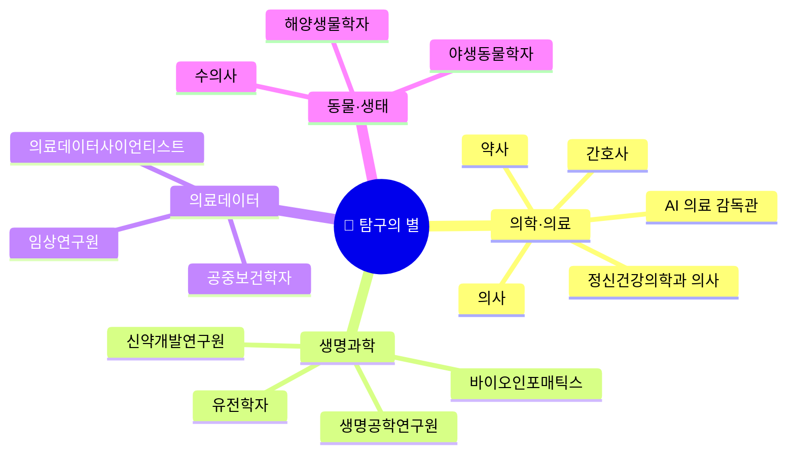

#### 이런 학생에게 맞습니다

탐구의 별은 "왜?"를 끊임없이 묻는 학생을 위한 세계입니다. 수업 시간에 선생님이 "이건 원래 그래"라고 말하면 오히려 더 궁금해지는 사람, 실험 결과가 예상과 다르면 "왜 다르지?"를 밤새 고민하는 사람이 여기에 속합니다. 과학 탐구 보고서를 쓸 때 단순히 결과만 쓰는 게 아니라 변수를 통제하고 가설을 세우는 과정 자체가 재미있다면, 탐구의 별이 당신의 왕국입니다.

AI 시대에 탐구형 인재는 더욱 가치가 높아집니다. AI가 방대한 데이터를 빠르게 분석해주지만, **"이 데이터가 무엇을 의미하는가"를 해석하는 것은 인간 전문가**의 몫이기 때문입니다. AI 영상 판독의 정확도가 99%에 가까워져도, 그 1%의 예외를 잡아내고 환자에게 설명하며 치료 방향을 결정하는 것은 의사만이 할 수 있습니다.

#### AI 시대 핵심 역량

| 역량 | 구체적 의미 | AI 시대에 왜 더 중요한가 |
|------|-----------|----------------------|
| **복합 판단력** | 여러 검사 결과·증상·환자 이력을 종합해 진단 내리기 | AI는 개별 데이터 분석은 뛰어나지만, "이 환자는 당뇨+심장+우울증이 동시에 있다"는 복합 판단은 인간 의사가 해야 합니다 |
| **AI 결과 검증** | AI가 내린 결론의 오류를 찾아내는 능력 | AI 진단 도구는 5~10%의 오류율이 있고, 이를 잡아내는 것이 의사의 핵심 역할로 부상 |
| **환자 공감** | 두려워하는 환자에게 진단을 설명하고 안심시키기 | "당신의 MRI 결과는…" 이 말을 기계가 아닌 인간이 해야 하는 이유는 분명합니다 |
| **연구 설계** | 올바른 질문을 세우고 검증 가능한 실험을 설계하기 | AI는 답을 빨리 구하지만, **좋은 질문을 만드는 것**은 여전히 인간의 영역 |
| **윤리 판단** | 생명·개인정보·사회적 영향을 고려한 결정 | AI에게 "이 환자의 치료를 중단해도 되는가?"를 맡길 수 없습니다 |

#### 유망 직종 직무 상세

**1. AI 의료 감독관 (AI Medical Supervisor)** — 완전 신규 직업

AI 의료 감독관은 2025년 이후 급부상하고 있는 직업입니다. 병원에서 사용하는 AI 진단 시스템이 내린 결과를 최종 검토하고 승인하는 역할을 합니다. AI가 "이 CT 영상에서 폐암 의심 소견이 있습니다"라고 보고하면, AI 의료 감독관이 해당 결과의 정확성을 확인하고, 오류가 없는지 검증한 뒤, 최종적으로 담당 의사에게 전달합니다. 동시에 AI 시스템 자체의 성능을 모니터링하고, 편향이 없는지 감사하며, 의료진에게 AI 도구 사용 교육을 담당합니다.

```
직무 프로세스 (하루 일과)
━━━━━━━━━━━━━━━━━━━━━━━━━━━━━━━━━━━━━━━━━━━━━━━━
오전 9시  │ AI 진단 결과 리뷰: 전날 밤 AI가 분석한 영상·혈액검사 결과 검토
오전 11시 │ 이상 케이스 정밀 분석: AI가 놓쳤거나 오판한 케이스 심층 검토
오후 1시  │ 의료진 교육: AI 도구 사용법·한계점 교육 세미나
오후 3시  │ AI 시스템 성능 감사: 정확도·편향 지표 분석, 개선 보고서 작성
오후 5시  │ 규제 대응: 의료 AI 관련 법규 변화 모니터링, 병원 정책 업데이트
```

- **연봉**: 7,000~15,000만원 | **전망**: ★★★★★ (의료 AI 확산으로 수요 폭증)
- **진입 경로**: 의대 졸업 + 임상 경험 3년 → AI 의료 감독관 전환, 또는 간호대 + 의료 데이터 분석 석사
- **필요 역량**: 의학 지식, 데이터 분석, AI 이해, 의료 윤리, 소통 능력
- **스트레스**: ★★★★☆ | **자유도**: ★★★☆☆ | **보람**: ★★★★★

**2. 의료데이터사이언티스트 (Medical Data Scientist)** — 의학 × 데이터의 교차점

의료데이터사이언티스트는 환자 데이터, 유전체 데이터, 임상시험 데이터를 분석하여 새로운 치료법을 발견하고, AI 진단 모델을 개발·검증하는 전문가입니다. 예를 들어, 수만 명의 당뇨 환자 데이터를 분석하여 "어떤 유전자 조합을 가진 환자에게 어떤 약이 가장 효과적인가"를 밝혀내는 일을 합니다. 정밀의학(Precision Medicine) 시대의 핵심 인력입니다.

- **연봉**: 6,000~18,000만원 | **전망**: ★★★★★
- **진입 경로**: 통계/컴퓨터과학/생명과학 전공 → 대학원 → 병원 연구소/제약사

**3. 생명공학연구원 (Biotechnology Researcher)** — AlphaFold와 함께 신약을 만든다

AI 도구 AlphaFold 3가 단백질 구조를 예측해주면서, 신약 개발 기간이 10년에서 3~5년으로 단축되고 있습니다. 생명공학연구원은 이 AI 예측 결과를 바탕으로 실제 실험을 설계하고, 약물 후보 물질을 검증하며, 임상시험을 준비합니다. AI가 "이 물질이 암세포에 결합할 가능성이 높다"고 예측하면, 연구원이 실험실에서 실제로 확인하는 것입니다.

- **연봉**: 4,000~9,000만원 | **전망**: ★★★★☆ (바이오/제약 R&D 투자 급증)
- **진입 경로**: 생명과학/생화학 전공 → 석박사 → 제약사/연구소

#### 최신 AI 도구 가이드 (2026년 6월 기준)

| AI 도구 | 용도 | 왜 배워야 하는가 | 접근성 |
|---------|------|----------------|--------|
| **AlphaFold 3** (DeepMind) | 단백질·DNA·약물 상호작용 예측 | 노벨상 수상 기술, 신약개발의 게임체인저. Isomorphic Labs가 이를 활용해 임상시험 진행 중 | 오픈소스 무료 |
| **Nuance DAX Copilot** (Microsoft) | 진료 중 대화를 자동으로 의료 기록으로 변환 | 150+ 병원 시스템에서 채택. 의사의 문서 작업 시간 80% 절감 | 병원 구독 |
| **Paige AI** | AI 암 병리 진단 | FDA 승인을 받은 전립선암 진단 AI. 병리학 전공 필수 도구 | 기관용 |
| **Lunit INSIGHT** | AI 흉부 X-ray·유방촬영 판독 | 한국 기업이 만든 세계적 의료 AI. 국내 병원에서 가장 많이 사용 | 기관용 |
| **Insilico Medicine** | AI 신약 발견 플랫폼 | 최초의 AI 설계 신약(ISM001-055)이 임상 2a상 통과. 개발 기간 60% 단축 | 기업용 |
| **NotebookLM** (Google) | AI 연구 노트북 | 논문 여러 편을 업로드하면 요약·비교·질의응답 가능. Gemini 3.5 기반으로 업그레이드 | 무료 |
| **Elicit** | AI 논문 검색·분석 | 1억 3,800만+ 논문에서 문장 수준 인용과 함께 답변. 200만+ 연구자 사용 | 무료 기본 |
| **Consensus** | AI 학술 검색 엔진 | 2억 5,000만+ 논문에서 "학계의 합의"를 측정해주는 Consensus Meter 기능. 170+ 대학 도서관 제휴 | 무료 기본 |

#### 프로젝트 수업 연계

**프로젝트: "AI 진단 vs 인간 진단 — 누가 더 정확한가?"**

이 프로젝트에서 학생들은 공개된 의료 데이터셋(Kaggle)을 활용해 AI 진단의 정확도와 한계를 직접 탐구합니다. AI가 특정 질환을 얼마나 정확하게 진단하는지 확인하고, AI가 놓치는 케이스의 패턴을 분석합니다. 최종적으로 "AI 의료 감독관이라면 어떤 체크리스트를 만들어야 하는가"를 설계합니다.

- **도구**: ChatGPT, NotebookLM, Python(pandas), Kaggle 의료 데이터셋
- **기간**: 3~4주
- **산출물**: AI 의료 진단 감독 체크리스트 + 분석 보고서

---

### 🎨 창작의 별 — Create Kingdom

> "머릿속 상상을 진짜로 만들어 내는 창작자들의 세계"

#### 마인드맵

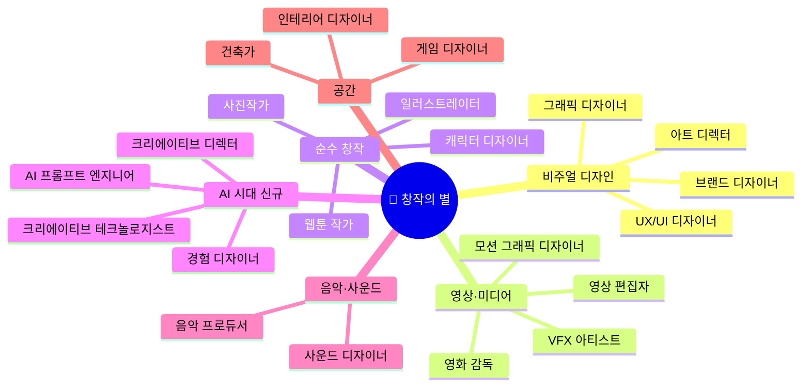

#### 이런 학생에게 맞습니다

창작의 별은 "나만의 것을 만들고 싶다"는 충동이 강한 학생을 위한 세계입니다. 노트 여백에 낙서를 하고, 인스타그램 피드를 디자인하고, 영상을 편집하며 시간 가는 줄 모르는 사람입니다. 단순히 "그림을 잘 그린다"가 아니라, **"이 포스터가 왜 멋있어 보이는지"를 설명할 수 있는 감각**이 중요합니다.

AI 시대에 창작의 별은 가장 극적으로 변하고 있는 왕국입니다. 2년 전만 해도 3D 캐릭터 하나를 만드는 데 전문가가 2주가 걸렸지만, 지금은 Meshy AI로 8초 만에 만들 수 있습니다. Midjourney v8로 누구나 전문 일러스트레이터 수준의 이미지를 생성합니다. 이 변화 속에서 살아남는 창작자는 **"AI에게 무엇을 만들라고 지시하고, 그 결과물 중 최선을 고르고, 전체 방향을 결정하는 사람"** — 즉 크리에이티브 디렉터입니다.

#### AI 시대 핵심 역량

| 역량 | 구체적 의미 | AI 시대에 왜 더 중요한가 |
|------|-----------|----------------------|
| **컨셉 & 방향 설계** | "무엇을 표현할 것인가"의 Why를 결정 | AI는 "어떻게" 만들지는 하지만, "왜" 이것을 만들어야 하는지는 인간이 결정 |
| **AI 프롬프트 설계** | AI 도구에 원하는 결과물을 정확히 지시 | 같은 Midjourney를 써도 프롬프트 실력에 따라 결과가 하늘과 땅 차이 |
| **큐레이션 & 선별** | AI가 만든 100개 결과물 중 최고를 고르기 | AI는 양을 만들고, 인간은 질을 판단. 이 판단력이 디렉터와 실무자를 가릅니다 |
| **브랜드 일관성** | 전체 비주얼이 하나의 이야기를 전달하도록 통합 | AI는 개별 이미지는 만들지만, 브랜드 전체의 통일된 세계관은 인간이 설계 |
| **인간 감성 터치** | 보는 사람의 마음에 닿는 고유한 표현 | AI 결과물과 진짜 아티스트의 차이 — 경험에서 우러나온 감성 |

#### 유망 직종 직무 상세

**1. 크리에이티브 디렉터 (Creative Director)** — AI 시대 창작의 총지휘관

크리에이티브 디렉터는 브랜드의 시각적 방향을 총괄하는 사람입니다. 광고 캠페인의 컨셉을 정하고, 디자이너·영상팀·카피라이터에게 방향을 지시하며, 최종 결과물의 품질을 승인합니다. AI 시대에는 "AI에게 무엇을 지시할지"를 결정하고, AI가 만든 수십 가지 시안 중 최적을 선택하며, 브랜드 전체의 일관성을 유지하는 역할이 핵심이 됩니다.

```
직무 프로세스
━━━━━━━━━━━━━━━━━━━━━━━━━━━━━━━━━━━━━━━━━━━━━━━━
1단계 │ 브랜드 전략 이해: 클라이언트와 미팅, 브랜드 핵심 가치 파악
2단계 │ 크리에이티브 방향 설정: 무드보드 제작, 톤앤매너 정의
3단계 │ AI 협업 제작: Midjourney·Runway로 시안 대량 생성
4단계 │ 큐레이션 & 판단: 수십 개 시안에서 최적 3개 선별
5단계 │ 팀 디렉팅: 디자이너·영상팀에 최종 방향 지시
6단계 │ 품질 승인: 최종 결과물 검수, 브랜드 일관성 확인
```

- **연봉**: 6,000~20,000만원 | **전망**: ★★★★★ | **AI 위험**: 🟢 낮음
- **진입 경로**: 디자인 전공 + 실무 5~8년 → 시니어 디자이너 → 아트 디렉터 → 크리에이티브 디렉터
- **스트레스**: ★★★★☆ | **자유도**: ★★★★★ | **보람**: ★★★★★

**2. 경험 디자이너 (Experience Designer)** — 물리+디지털 통합 설계

경험 디자이너는 사람들이 제품·서비스·공간을 사용할 때 느끼는 전체 경험을 설계합니다. 단순한 UI 디자인을 넘어, 오프라인 매장에 들어서는 순간부터 앱을 사용하고, 고객센터에 전화하는 순간까지의 전체 여정을 설계합니다. 디즈니랜드의 입장부터 퇴장까지의 경험이 치밀하게 설계되어 있듯이, 경험 디자이너는 모든 접점을 설계하는 총괄자입니다.

- **연봉**: 5,500~18,000만원 | **전망**: ★★★★★ | **AI 위험**: 🟢 낮음

**3. 크리에이티브 테크놀로지스트 (Creative Technologist)** — 기술과 예술의 교차점

프로그래밍과 디자인을 동시에 할 수 있는 사람입니다. AI 도구들을 직접 커스터마이징하고, 인터랙티브 아트 설치물을 만들고, AR/VR 경험을 설계합니다. 예를 들어, 나이키 매장에서 고객이 신발을 신으면 벽면에 가상 운동장이 펼쳐지는 경험을 만드는 사람이 크리에이티브 테크놀로지스트입니다.

- **연봉**: 5,500~18,000만원 | **전망**: ★★★★★ | **AI 위험**: 🟢 낮음

#### 최신 AI 도구 가이드 (2026년 6월 기준)

| AI 도구 | 용도 | 왜 배워야 하는가 | 접근성 |
|---------|------|----------------|--------|
| **Midjourney v8.1** | AI 이미지 생성 (2K+ 해상도, HD 모드) | 웹+모바일 앱 출시. 더 이상 Discord 전용이 아님. 창작 워크플로우의 핵심 | 유료 $10~/월 |
| **Adobe Firefly** | 저작권 안전한 AI 이미지 생성 | 유일하게 IP 안전성을 보장하는 상용 AI. 포트폴리오·상업 작업에 필수 | Adobe 구독 |
| **Runway Gen-4.5** | AI 영상 생성 (60초 연속 4K, 네이티브 오디오) | 영화 수준 AI 영상. 물리 법칙 기반 사실적 움직임. Adobe 연동 | 유료 $12~/월 |
| **Kling AI 3.0 Omni** (Kuaishou) | 시네마틱 AI 영상 + 5개 언어 립싱크 | 다국어 오디오 동기화, 멀티샷 스토리보드. 아시아 시장 1위 | 무료 기본 |
| **CapCut AI** | 올인원 영상 편집 (Sora 2·Veo 3.1 내장) | 데스크톱 앱에 Sora 2와 Veo 3.1을 직접 통합. 틱톡 영상 제작의 표준 도구 | 무료 기본 |
| **Freepik → Magnific** | 통합 크리에이티브 AI 플랫폼 | 2026년 5월 Magnific으로 리브랜딩. Flux 2, Imagen 4, Kling 모델을 하나의 플랫폼에서 | 무료 기본 |
| **Figma AI** | AI UI 디자인 + 코드 레이어 + 모션 | Config 2026에서 코드·셰이더·모션 추가. Fortune 500의 85%가 사용 | 무료 기본 |
| **Pika v2.5** | 숏폼 AI 영상 + 특수효과 | Pikascenes·Pikaswaps·Pikatwists 효과. 틱톡/릴스 크리에이터 필수 | 무료 기본 |
| **HeyGen Avatar IV** | AI 아바타 영상 + 175개 언어 번역 | 가장 사실적인 AI 아바타. 립싱크 영상 번역 | 무료 체험 |
| **Suno v5** | AI 음악 생성 | 24억 달러 기업가치. 200만 유료 구독자. 텍스트→풀송 생성 | 무료 기본 |
| **ElevenLabs Music v2** | AI 음성 합성 + 음악 생성 | 장르 전환, 섹션별 편집 가능. iOS 앱 출시 (2026.04) | 무료 기본 |
| **Leonardo AI** | 멀티모델 이미지 플랫폼 + 스케치→이미지 | Ideogram 3.0, Flux Kontext 통합. 스케치 변환 최강 | 무료 기본 |
| **Ideogram 3.0** | 텍스트가 들어간 이미지 생성 | 포스터·로고·라벨 등 텍스트가 필요한 이미지에서 업계 최고 정확도 | 무료 기본 |
| **Flux 2.0** (Black Forest Labs) | 오픈소스 이미지 생성 (24B 파라미터) | 3억 달러 시리즈B, 32.5억 달러 기업가치. 4MP 해상도, 8~10개 참조 이미지 동시 활용 | 오픈소스 |
| **Meshy** | 텍스트→3D 모델 + 자동 리깅 + 500+ 애니메이션 | 올인원 3D 에셋 생성. 자동 리깅으로 즉시 게임·영상에 활용 | 무료 기본 |
| **Tripo AI** | 텍스트/이미지→3D 변환 (8초) | 가장 빠른 3D 메쉬 생성. 빠른 프로토타이핑에 최적 | 무료 기본 |
| **Luma Dream Machine → Luma Agents** | AI 영상 생성 + 멀티모델 통합 | Ray 3.14, Veo 3.1, Kling 3.0, ElevenLabs를 하나의 크레딧 풀로 | 유료 |
| **Canva Magic Studio** | 비전문가용 통합 AI 디자인 | 43% 채택률로 AI 디자인 도구 중 1위. 텍스트→이미지, 배경 제거, 자동 리사이즈 | 무료 기본 |

> **2026년 핵심 트렌드**: 네이티브 오디오(대사·환경음·음악)가 영상 AI의 최대 차별 포인트. 시각 품질은 평준화되었고, 소리까지 동시에 생성하느냐가 경쟁의 핵심.

#### 프로젝트 수업 연계

**프로젝트: "AI 브랜드 스튜디오 — 가상 브랜드를 처음부터 끝까지 만들기"**

학생 4~5명이 팀을 이루어 가상 브랜드를 설계하고, AI 도구를 총동원하여 로고·홍보 영상·SNS 콘텐츠·음악까지 제작합니다. 핵심은 **"AI가 만든 것 vs 내가 판단한 것"을 명확히 구분**하는 것입니다. 최종 발표에서 "왜 이 시안을 골랐는가"를 설명할 수 있어야 합니다.

- **도구**: Midjourney, Canva AI, Runway Gen-4.5 or CapCut AI, Suno v5, Figma
- **기간**: 4주
- **산출물**: 브랜드 아이덴티티 패키지 + 30초 홍보 영상 + SNS 콘텐츠 3개

---

### 💻 기술의 별 — Tech Kingdom

> "컴퓨터와 코드로 세상에 필요한 것을 만드는 사람들의 세계"

#### 마인드맵

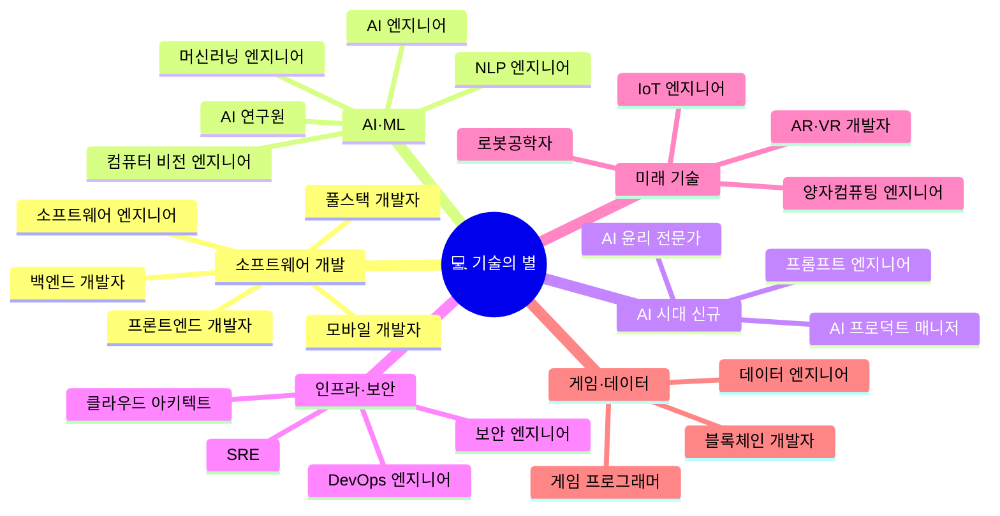

#### 이런 학생에게 맞습니다

기술의 별은 "이거 내가 만들어볼까?"라는 생각이 자연스럽게 드는 학생을 위한 세계입니다. 게임을 하다가 "이건 어떻게 만들었지?"가 궁금해지고, 불편한 것을 발견하면 "앱으로 만들면 되잖아"라고 생각하는 사람입니다. 수학적 논리에 거부감이 없고, 에러 메시지를 보고 포기하기보다는 "왜 안 되지?"를 파고드는 끈기가 있다면, 기술의 별이 당신의 왕국입니다.

AI 시대에 기술의 별은 **가장 큰 수혜를 받는 왕국**입니다. AI를 만드는 사람들이기 때문입니다. Cursor AI를 쓰면 혼자서 과거 5인 팀의 코드를 작성할 수 있지만, "어떤 시스템을 설계할지"를 결정하는 것은 여전히 인간 엔지니어의 몫입니다. AI 엔지니어의 2026년 신입 연봉은 6,000만원에서 시작해 시니어는 2억을 넘습니다. 이 트렌드는 최소 10년은 지속될 것입니다.

#### AI 시대 핵심 역량

| 역량 | 구체적 의미 | AI 시대에 왜 더 중요한가 |
|------|-----------|----------------------|
| **시스템 설계** | 전체 소프트웨어 구조를 설계하는 능력 | AI가 코드를 짜주지만, "마이크로서비스 vs 모놀리식" 같은 아키텍처 결정은 인간 |
| **AI 코드 검증** | AI가 생성한 코드의 버그·보안 취약점 발견 | Cursor AI가 쓴 코드에 SQL Injection 취약점이 있을 수 있음 → 잡아내는 게 핵심 역할 |
| **문제 정의** | 비즈니스 문제를 기술 문제로 번역 | PM이 "결제를 빠르게 해주세요"라고 하면, 이를 "API 응답 시간 200ms 이하" 같은 기술 요구로 변환 |
| **AI 도구 마스터** | Cursor, Claude Code, Copilot 등 능숙하게 활용 | AI 도구를 잘 쓰는 개발자와 못 쓰는 개발자의 생산성 차이가 5~10배 |

#### 유망 직종 직무 상세

**1. AI 엔지니어 (AI Engineer)** — AI 시대의 핵심 건축가

AI 엔지니어는 비즈니스 문제를 AI로 해결하는 시스템을 설계·구축·배포하는 전문가입니다. "고객 이탈을 예측하는 모델을 만들어주세요"라는 요청이 오면, 적절한 AI 모델을 선택하고, 데이터를 준비하고, 모델을 학습시키고, 실제 서비스에 배포합니다.

```
직무 프로세스
━━━━━━━━━━━━━━━━━━━━━━━━━━━━━━━━━━━━━━━━━━━━━━━━
1단계 │ 문제 정의: "비즈니스 문제"를 "AI 문제"로 번역
      │ → "고객 이탈 예측" = "6개월 내 해지 확률 예측 분류 모델"
2단계 │ 데이터 수집·전처리: 필요한 데이터 확보, 정제, 피처 엔지니어링
3단계 │ 모델 설계·학습: 적합한 모델 선택 (트랜스포머? CNN? XGBoost?)
4단계 │ 평가·최적화: 정확도·편향·공정성 검증, 하이퍼파라미터 튜닝
5단계 │ 배포·운영: API 서버 구축, 모니터링, 모델 재학습 파이프라인

커리어 경로
━━━━━━━━━━━━━━━━━━━━━━━━━━━━━━━━━━━━━━━━━━━━━━━━
주니어 (1~3년)  → 모델 구현, 데이터 전처리, 테스트
시니어 (4~7년)  → 아키텍처 설계, 기술 판단, 팀 리딩
리드 (8~12년)   → 기술 전략, 팀 빌딩, 비즈니스 전략 연계
수석/CTO (13년+) → 기업 AI 전략 총괄, 임원급
```

- **연봉**: 6,000~20,000만원 | **전망**: ★★★★★ (전 산업 AI 확산)
- **진입 경로**: 컴퓨터공학/AI 전공 → 대학원 (선택) → IT/스타트업

**2. 소프트웨어 엔지니어 (Software Engineer)** — AI와 함께 일하는 개발자

```
AI 협업 플레이북 (실제 업무 사이클)
━━━━━━━━━━━━━━━━━━━━━━━━━━━━━━━━━━━━━━━━━━━━━━━━
1단계 │ 요구사항 → 기술 명세 변환
       인간: PM과 미팅하여 비즈니스 의도 파악
       AI: Jira 티켓 분석 → 기술 명세 초안 생성

2단계 │ 아키텍처 설계
       인간: 팀 역량·비용·확장성 종합 판단 → 최종 결정
       AI: 3~5가지 아키텍처 옵션 생성, 장단점 비교 제시

3단계 │ 코드 구현
       인간: 핵심 비즈니스 로직 직접 작성, AI 코드 검증
       AI: CRUD·보일러플레이트 80% 자동 생성, 테스트 초안

4단계 │ 배포 판단
       인간: 프로덕션 리스크 최종 판단, 롤백 기준 결정
       AI: 코드 스타일·보안 패턴 자동 검토, 커버리지 보고
```

- **연봉**: 4,000~12,000만원 | **전망**: ★★★★★
- **진입 경로**: 컴퓨터공학 전공 + 실무 3년 → 시니어 전환

#### 최신 AI 도구 가이드 (2026년 6월 기준)

| AI 도구 | 용도 | 왜 배워야 하는가 | 접근성 |
|---------|------|----------------|--------|
| **Cursor v3.0** | AI 네이티브 코드 에디터 + 백그라운드/클라우드 에이전트 | Fortune 500의 절반이 사용. 코딩 속도 2~3배 향상의 핵심 도구 | 무료 기본 |
| **Claude Code** | CLI 기반 AI 코딩 에이전트 | Ultraplan, /ultrareview 플릿, 컴퓨터 사용 프리뷰. 터미널에서 바로 AI와 협업 | 유료 |
| **GitHub Copilot** | AI 페어 프로그래머 | 클라우드 에이전트 GA. 사용량 기반 과금으로 전환 (2026.06) | 학생 무료 |
| **Devin (Cognition)** | 자율 AI 소프트웨어 엔지니어 | v2.0에서 $20/월로 가격 인하. 83% 더 많은 태스크 완료. 골드만삭스 파일럿 | $20/월 |
| **Bolt.new** | 브라우저 기반 풀스택 앱 빌더 | V2 + Bolt Cloud 출시. 6개월 만에 ARR $4,000만 달성 | 무료 기본 |
| **v0.dev** (Vercel) | AI UI 컴포넌트 생성 | React/Next.js 프론트엔드 생성 최강. 비개발자도 웹 UI 즉시 구현 | 무료 기본 |
| **Lovable 2.0** | 대화형 풀스택 바이브 코딩 | Supabase 통합 Lovable Cloud. $66억 기업가치 | 무료 기본 |
| **Replit Agent 3** | 브라우저 내 자율 코딩 에이전트 | 200분 자율 실행. 이전 버전 대비 10배 성능 향상 (2026.01) | 무료 기본 |
| **TensorFlow / PyTorch** | 머신러닝 모델 개발 프레임워크 | AI/ML 엔지니어 필수. 산업 표준 | 오픈소스 |
| **Hugging Face** | 사전학습 AI 모델 허브 + Transformers 라이브러리 | LLM 기반 서비스 개발의 표준 플랫폼 | 무료 |
| **LangChain / LangGraph** | AI 에이전트·파이프라인 구축 프레임워크 | RAG·멀티에이전트 시스템 구축의 표준 | 오픈소스 |
| **Darktrace / CrowdStrike AI** | AI 보안 위협 탐지·대응 | 보안 엔지니어의 실시간 위협 탐지 핵심 도구 | 기업용 |

#### 프로젝트 수업 연계

**프로젝트: "AI와 함께 진짜 작동하는 웹앱 만들기"**

Cursor AI를 활용하여 실제 작동하는 미니 웹앱(학교 급식 추천, 시험 일정 관리 등)을 만듭니다. 핵심은 "AI가 짜준 코드에서 버그 3개를 찾아 직접 수정하기"입니다. AI 없이 코딩한 시간과 AI와 함께 코딩한 시간을 비교하여, 소프트웨어 엔지니어의 AI 협업 방식을 체험합니다.

- **도구**: Cursor AI, v0.dev 또는 Bolt.new, GitHub
- **기간**: 3~4주
- **산출물**: 실제 배포된 미니 웹앱 + "AI 코드 검증 일지" (수정한 버그와 이유 기록)

---

### 🤝 연결의 별 — Connect Kingdom

> "사람과 사람을 따뜻하게 이어주고, 누군가의 성장을 돕는 사람들의 세계"

#### 마인드맵

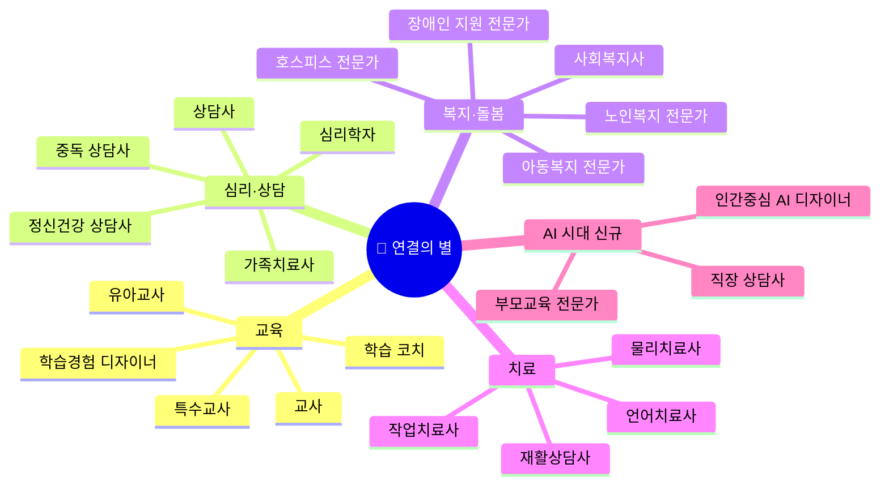

#### 이런 학생에게 맞습니다

연결의 별은 "사람이 성장하는 것을 보면 뿌듯하다"는 감정이 자연스러운 학생을 위한 세계입니다. 친구가 고민을 얘기하면 끝까지 들어주고, 동생에게 수학을 가르쳐줄 때 "아 그래서 이런 거였어!" 하는 순간에 보람을 느끼는 사람입니다. 중요한 것은 "착해서" 이 직업군을 선택하는 게 아니라, **진짜로 사람과의 깊은 연결에서 에너지를 얻는** 사람이어야 합니다. 감정 소모가 큰 영역이므로, 자기 돌봄(self-care) 능력도 필수입니다.

이 왕국은 **AI 시대에 가장 안전한 직업군**입니다. 고위험 직업이 0%입니다. AI가 24시간 정보를 제공하고 심리검사 결과를 분석해줘도, 누군가의 손을 잡고 눈을 마주치며 "괜찮아"라고 말해주는 것은 AI가 할 수 없습니다. 자살 위기 상담, 가족 갈등 중재, 아이의 발달 지원 — 이 모든 일에는 진짜 인간의 공감과 관계가 필수입니다.

#### 유망 직종 직무 상세

**1. 정신건강 상담사 (Mental Health Counselor)** — 외로움 시대의 필수 전문가

정신건강 상담사는 우울·불안·트라우마·번아웃 등 정신건강 문제를 겪는 내담자를 만나, 대화를 통해 치유를 돕는 전문가입니다. AI 챗봇(Woebot, Wysa)이 경증 관리를 보조하지만, 복잡한 심리 문제의 진단과 치료는 인간 상담사만이 할 수 있습니다.

```
직무 프로세스
━━━━━━━━━━━━━━━━━━━━━━━━━━━━━━━━━━━━━━━━━━━━━━━━
1단계 │ 접수·초기평가: 내담자 접수, AI 심리검사 실시·해석, 상담 계획
2단계 │ 상담·치료: 개인/집단 상담 진행 (인지행동치료, EMDR 등)
3단계 │ 사례관리·추적: AI 기록 요약 활용, 경과 관찰, 종결 평가
4단계 │ 교육·예방: 심리건강 교육, 위기 개입 (자살·자해 예방)
5단계 │ 자기개발: 최신 치료 기법 학습, 슈퍼비전 참여

커리어 경로
━━━━━━━━━━━━━━━━━━━━━━━━━━━━━━━━━━━━━━━━━━━━━━━━
수련상담사 → 상담사 → 전문상담사 → 수퍼바이저 → 상담센터장
```

- **연봉**: 3,000~7,000만원 | **전망**: ★★★★★ (정신건강 수요 폭발)
- **진입 경로**: 심리학 학사 이상 → 수련과정 수료 → 상담심리사 자격증
- **스트레스**: ★★★★☆ | **자유도**: ★★★★☆ | **보람**: ★★★★★

**2. 학습경험 디자이너 (Learning Experience Designer)** — AI 교육 시대의 설계자

Khan Academy AI(Khanmigo), ChatGPT 같은 AI 교육 도구가 폭발적으로 늘어나면서, "이 도구들을 어떻게 조합하여 최적의 학습 경험을 만들 것인가"를 설계하는 전문가의 수요가 급증하고 있습니다. 교사가 수업을 "진행"하는 사람이라면, 학습경험 디자이너는 수업 자체를 "설계"하는 사람입니다.

- **연봉**: 4,500~12,000만원 | **전망**: ★★★★★
- **진입 경로**: 교육공학/교육학 → 에듀테크 스타트업/기업 교육팀

#### 최신 AI 도구 가이드 (2026년 6월 기준)

| AI 도구 | 용도 | 왜 배워야 하는가 | 접근성 |
|---------|------|----------------|--------|
| **Khanmigo** (Khan Academy) | AI 맞춤형 개인 교사 | 2026년 여름 리디자인으로 학생이 묻기 전에 능동적으로 가이드. 교사용 수업 설계 기능 | 무료 (교사) |
| **Woebot / Wysa** | AI 정신건강 보조 챗봇 | 상담사가 경증 내담자 사전 스크리닝에 활용. 감독 하에 보조 도구로 사용 | 무료 기본 |
| **Duolingo Max** | GPT-4 기반 AI 언어 학습 | 라이브 AI 영상통화, 역할극 시나리오. "Explain My Answer" 기능 전 사용자 무료화 (2026.01) | 유료 |
| **NotebookLM** (Google) | AI 연구 노트북 | Gemini 3.5 기반. 코드 실행, 에이전틱 리서치, 차트·슬라이드 자동 생성 | 무료 |
| **ChatGPT** | 범용 AI 교육 보조 | 수업 자료 제작, 퀴즈 생성, 학생 질문 대응. 교사의 업무 시간 50% 절감 | 무료 기본 |
| **AI 심리검사 도구** | 심리 진단 보조 | 상담사가 검사 결과를 AI 분석 후 해석·검증하는 데 활용 | 기관용 |
| **감정인식 AI** | 표정·음성에서 감정 패턴 분석 | 상담 과정에서 보조 데이터로 활용 (윤리적 사용 필수) | 연구용 |

#### 프로젝트 수업 연계

**프로젝트: "AI 상담 vs 인간 상담 — 진짜 공감이란 무엇인가?"**

같은 고민을 AI 챗봇(ChatGPT, Woebot)에게 털어놓은 후, 친구와 직접 공감 대화를 나눕니다. 두 경험의 차이를 비교·분석하고, "AI 상담이 위험할 수 있는 상황"의 목록을 작성합니다. 최종적으로 "인간 상담사만이 할 수 있는 것은 무엇인가"를 정의하는 보고서를 작성합니다.

- **도구**: ChatGPT, Woebot, 공감 인터뷰 가이드
- **기간**: 2~3주
- **산출물**: AI 상담 vs 인간 상담 비교 분석 보고서

---

### 🌿 자연의 별 — Nature Kingdom

> "자연과 생명을 가까이서 보고 지키는 직업들의 세계"

#### 마인드맵

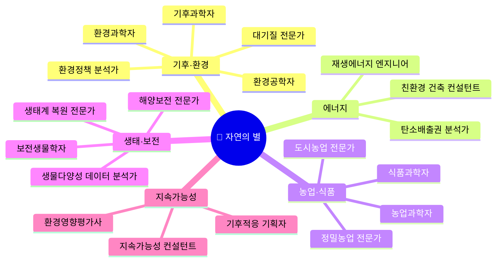

#### 이런 학생에게 맞습니다

자연의 별은 "지구가 아프다"는 뉴스에 마음이 아픈 학생을 위한 세계입니다. 산에 올라가면 마음이 편해지고, 바다가 오염되는 다큐를 보면 "내가 뭘 할 수 있을까" 생각이 드는 사람입니다. 단순히 자연을 좋아하는 것을 넘어, **과학적 분석과 현장 감각을 동시에 가진** 사람이 이 왕국에서 성공합니다. 기후 데이터를 분석하면서도 현장에서 토양을 채취하고, 정책 보고서를 쓰면서도 지역 주민에게 설명할 수 있어야 합니다.

이 왕국은 **AI 고위험 직업이 0%**인 안전한 직업군이며, 동시에 **기후위기로 인해 가장 빠르게 성장하는 분야**입니다. 2050년 탄소중립 목표를 향해 앞으로 25년간 지속적으로 수요가 증가합니다.

#### 유망 직종 직무 상세

**1. 기후적응 기획자 (Climate Adaptation Planner)** — 기후 재해에 강한 도시를 설계하는 사람

폭염·홍수·태풍이 갈수록 심해지는 시대, 도시가 이 극단적 기후에 어떻게 적응해야 하는지를 설계하는 완전히 새로운 직업입니다. "서울 강남이 2030년에 100년 빈도 홍수를 맞으면 어떻게 되는가?" 같은 시나리오를 AI로 시뮬레이션하고, 배수 시스템·건물 설계·대피 경로를 재설계합니다.

- **연봉**: 5,000~15,000만원 | **전망**: ★★★★★ | **AI 위험**: 🟢 낮음
- **진입 경로**: 환경/도시공학 전공 → 석사 → 환경부/연구소/컨설팅

**2. 정밀농업 전문가 (Precision Agriculture Specialist)** — AI+드론+센서 융합 농업

드론으로 농경지를 촬영하고, AI가 작물의 건강 상태·수분 부족·병해충을 분석하며, IoT 센서 데이터를 기반으로 물·비료를 최적으로 공급하는 시스템을 운영합니다. "농부"의 이미지가 완전히 바뀌는 직업입니다.

- **연봉**: 4,500~12,000만원 | **전망**: ★★★★★ | **AI 위험**: 🟢 낮음

#### 최신 AI 도구 가이드 (2026년 6월 기준)

| AI 도구 | 용도 | 왜 배워야 하는가 | 접근성 |
|---------|------|----------------|--------|
| **Google Earth Engine** | 위성 이미지 기반 지구 환경 분석 | 전 세계 환경 데이터를 무료로 분석. 환경과학자·기후과학자 필수 | 무료 |
| **ClimateAI** | 기후 리스크 예측·분석 | 기업·정부의 기후 전략 수립 핵심 도구 | 기업용 |
| **iNaturalist** | AI 생물 종 자동 인식 + 시민과학 데이터 | 사진 한 장으로 생물 종 식별. 생물다양성 모니터링 글로벌 표준 | 무료 |
| **GBIF** | 전 세계 생물다양성 데이터 플랫폼 | 생태 연구 데이터 접근의 출발점 | 무료 |
| **드론 AI** | 산림·농업·해양 원격 모니터링 | 사람이 접근 못하는 현장 데이터 수집. 정밀농업·산림 관리 핵심 | 장비 구매 |
| **스마트팜 AI** | 작물 생육 예측·최적화 | 정밀농업 전문가의 일상 업무 도구 | 플랫폼별 |
| **탄소 측정 AI** | 기업 탄소발자국 자동 계산 | 탄소중립 컨설팅 필수. ESG 보고서 작성의 핵심 데이터 | 기업용 |

#### 프로젝트 수업 연계

**프로젝트: "우리 학교 탄소중립 로드맵 만들기"**

학교의 전기 사용량, 급식 폐기물, 통학 교통수단 데이터를 수집하고, AI 탄소 측정 도구로 학교의 탄소발자국을 계산합니다. 감축 방안 3가지를 설계하고, 비용·효과를 분석한 뒤, 학교 관리자에게 프레젠테이션합니다. 지속가능성 컨설턴트의 실제 업무를 체험하는 프로젝트입니다.

- **도구**: ChatGPT, Google Earth Engine, 탄소 측정 AI, Canva, Gamma AI
- **기간**: 3~4주
- **산출물**: 학교 탄소중립 로드맵 + 실행 계획서

---

### ⚖️ 질서의 별 — Order Kingdom

> "법과 약속으로 사회의 질서를 지키고, 모두가 안전하게 살도록 하는 사람들의 세계"

#### 마인드맵

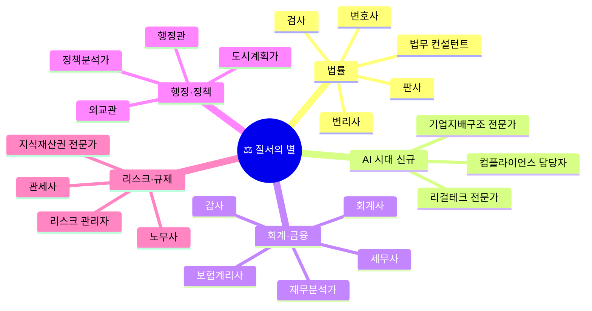

#### 이런 학생에게 맞습니다

질서의 별은 "이건 공정하지 않아"라는 생각이 강한 학생을 위한 세계입니다. 규칙을 지키는 것이 중요하다고 생각하고, 복잡한 규정을 읽는 것이 불편하지 않으며, 꼼꼼하고 빈틈없이 일하는 것에 만족감을 느끼는 사람입니다.

**⚠️ 이 왕국은 AI 시대에 가장 큰 변화를 겪고 있습니다.** 고위험 직업이 41%로 8개 왕국 중 가장 높습니다. 회계 분개·세금 계산·계약서 검토·판례 검색 같은 반복 분석 업무가 AI로 빠르게 자동화되고 있기 때문입니다. 하지만 "법 앞에서 가치를 판단하고 책임을 지는 것", "고객 앞에서 전략을 설명하고 설득하는 것"은 AI가 할 수 없습니다. 이 왕국의 생존 열쇠는 **"처리하는 사람"에서 "판단하는 사람"으로의 전환**입니다.

#### 유망 직종 직무 상세

**1. 리걸테크 전문가 (Legal Tech Specialist)** — 법률 × 기술의 교차점

리걸테크 전문가는 AI 법률 도구를 설계·운용하는 사람입니다. Harvey AI 같은 도구가 판례를 분석하고 법률 문서를 자동 생성하지만, 이 도구를 법률 실무에 적합하게 설정하고, 결과의 정확성을 보장하며, 법무팀에 도구 사용을 교육하는 역할을 합니다. 법학과 프로그래밍을 동시에 아는 희소한 인재입니다.

```
AI 협업 플레이북
━━━━━━━━━━━━━━━━━━━━━━━━━━━━━━━━━━━━━━━━━━━━━━━━
1단계 │ AI로 판례·계약서 초안 분석 (Harvey AI, LexisNexis AI)
2단계 │ 인간이 법적 판단 (법률 해석, 전략 수립)
3단계 │ AI로 법률 문서 자동 생성 (계약서, 소장, 의견서 초안)
4단계 │ 인간이 최종 검토 (리스크 확인, 클라이언트 맥락 반영)
```

- **연봉**: 5,000~11,000만원 | **전망**: ★★★★★ | **AI 위험**: 🟢 낮음
- **진입 경로**: 법학 + CS 복수전공 → 리걸테크 스타트업/대형 로펌

**2. 컴플라이언스 담당자 (Compliance Officer)** — AI 규제 시대의 파수꾼

EU AI Act, 한국 AI 기본법 등 AI 관련 규제가 폭발적으로 늘어나면서, 기업이 이 법규를 지키고 있는지 감시하는 전문가의 수요가 급증하고 있습니다. "우리 회사의 AI 채용 시스템이 성별 편향을 가지고 있지 않은가?"를 점검하고, 위반 시 리스크를 보고하는 역할입니다.

- **연봉**: 5,000~15,000만원 | **전망**: ★★★★★ | **AI 위험**: 🟡 중간

#### 최신 AI 도구 가이드 (2026년 6월 기준)

| AI 도구 | 용도 | 왜 배워야 하는가 | 접근성 |
|---------|------|----------------|--------|
| **Harvey AI** | AI 법률 문서 생성·분석 | $110억 기업가치 (2026.03). 1,300+ 조직의 10만+ 변호사 사용. 법조인 필수 도구 | 기관용 |
| **CoCounsel** (Thomson Reuters) | AI 법률 리서치 (Westlaw 통합) | Deep Research 멀티스텝 에이전트 출시. 판례 심층 분석 최강 | 기관용 |
| **LexisNexis AI** | AI 판례 검색·법률 분석 | 법조인 표준 리서치 플랫폼의 AI 업그레이드 | 기관용 |
| **Xero AI** | AI 회계 자동화 (21,000+ 은행 연동) | 가장 넓은 은행 연동 네트워크. 소규모 회계법인 표준 도구 | 유료 |
| **Ramp AI** | AI 경비 관리 에이전트 | $440억 기업가치 (2026.06). 자율 AI 에이전트가 영수증·승인·벤더 관리 | 기업용 |
| **컴플라이언스 모니터링 AI** | 기업 법규 준수 실시간 감시 | AI 규제 강화로 컴플라이언스 담당자 필수 도구 | 기업용 |

#### 프로젝트 수업 연계

**프로젝트: "우리 학교에 AI를 도입하면? — 컴플라이언스 보고서 작성"**

가상으로 학교에 AI 채점 시스템, AI 출결 관리 시스템을 도입한다고 가정합니다. EU AI Act와 국내 AI 기본법 핵심 내용을 조사하고, AI 도입 시 지켜야 할 규정 체크리스트를 작성합니다. "AI 채점이 특정 학생에게 불리할 수 있는 시나리오"를 설계하고, 대응 방안을 포함한 컴플라이언스 보고서를 제출합니다.

- **도구**: ChatGPT, 법제처 사이트, Notion, Gamma AI
- **기간**: 3주
- **산출물**: AI 도입 컴플라이언스 체크리스트 + 리스크 시나리오 보고서

---

### 📡 소통의 별 — Communicate Kingdom

> "글·말·영상·미디어로 세상에 이야기를 전하고 마음을 움직이는 사람들의 세계"

#### 마인드맵

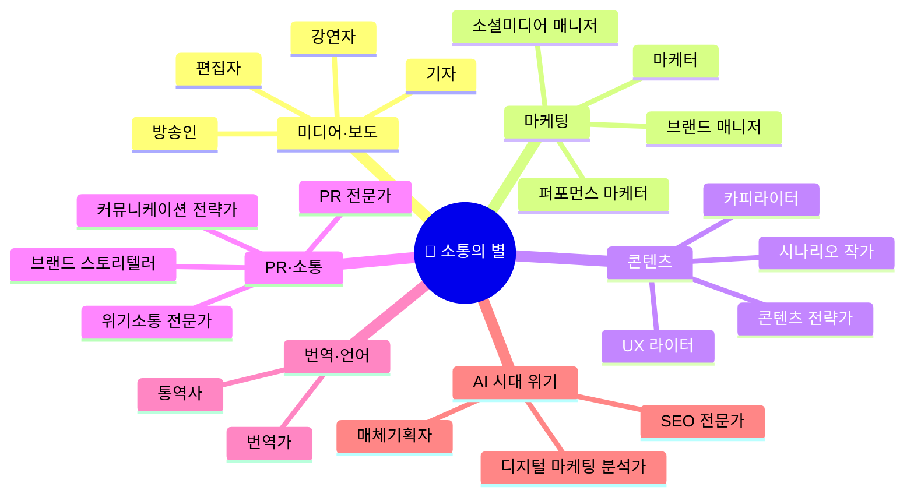

#### 이런 학생에게 맞습니다

소통의 별은 "내 이야기를 세상에 전하고 싶다"는 표현 욕구가 강한 학생을 위한 세계입니다. 글을 쓰거나 영상을 만들 때 시간 가는 줄 모르고, 트렌드에 민감하며, "이 광고는 왜 사람들 마음을 움직이는 걸까?"가 궁금한 사람입니다.

**⚠️ 이 왕국은 AI에 의해 가장 빠르게 변하는 곳입니다.** AI가 기사를 쓰고, 카피를 생성하고, SNS 콘텐츠를 자동화하고, 번역을 합니다. 2026년 현재 번역가·통역사는 AI 번역의 정확도가 95%를 넘으면서 전통적 역할이 급격히 축소되고 있습니다. 하지만 "어떤 메시지를 전달할 것인가"를 결정하고, "브랜드의 영혼을 지키고", "위기 상황에서 대중의 신뢰를 회복하는" 역할은 인간만이 할 수 있습니다. 콘텐츠를 만드는 사람이 아니라, **콘텐츠의 방향을 결정하는 사람**이 되어야 합니다.

#### 유망 직종 직무 상세

**1. 위기소통 전문가 (Crisis Communication Specialist)** — AI 딥페이크 시대의 브랜드 수호자

AI 딥페이크 영상이 확산되고, 가짜 뉴스가 실시간으로 퍼지는 시대에, 기업·정부가 위기 상황에서 대중과 소통하는 전략을 설계하고 실행하는 전문가입니다. "CEO의 딥페이크 영상이 SNS에 퍼졌다" 같은 상황에서, 1시간 내에 보도자료를 작성하고, 미디어에 대응하며, 대중의 신뢰를 회복하는 전략을 실행합니다.

- **연봉**: 5,500~22,000만원 | **전망**: ★★★★★ | **AI 위험**: 🟢 낮음

**2. 브랜드 스토리텔러 (Brand Storyteller)** — AI가 못하는 진정성

AI가 콘텐츠를 대량 생산하는 시대에, 사람들은 오히려 **"진짜 이야기"**에 더 목마릅니다. 브랜드 스토리텔러는 기업의 역사·가치관·비전을 감동적인 이야기로 만들어 소비자의 마음에 닿게 하는 전문가입니다. AI가 만든 천 편의 글보다, 인간이 쓴 한 편의 진정성 있는 이야기가 더 강력한 시대입니다.

- **연봉**: 5,000~18,000만원 | **전망**: ★★★★★ | **AI 위험**: 🟢 낮음

#### 최신 AI 도구 가이드 (2026년 6월 기준)

| AI 도구 | 용도 | 왜 배워야 하는가 | 접근성 |
|---------|------|----------------|--------|
| **Jasper AI** | 기업용 마케팅 카피 생성 (브랜드 일관성 유지) | 5인+ 팀 기준 최적. Pro $59/월~ | 유료 |
| **Copy.ai** | AI 카피라이팅 (무료 티어 있음) | 5인 기준 $49/월로 가장 경제적 | 무료 기본 |
| **Descript** | AI 팟캐스트·영상 편집 (텍스트처럼 편집) | 음성을 텍스트처럼 편집하는 혁신적 UX. 영상 프로듀서 필수 | 무료 기본 |
| **Hootsuite OwlyWriter AI** | AI SNS 캡션·해시태그·소셜 리스닝 | 5개+ 소셜 프로필 관리 팀 필수 | 유료 |
| **Perplexity** | AI 검색 엔진 (출처 인용) | 월 10억+ 쿼리. Comet 브라우저, M365 통합. 리서치 표준 | 무료 기본 |
| **Semrush AI (Semrush One)** | AI 마케팅·SEO 통합 | AI 플랫폼이 브랜드에 대해 말하는 것도 추적하는 새 기능 | 유료 |
| **미디어 모니터링 AI** | 실시간 브랜드 위기 감지 | 위기소통 전문가의 조기경보 시스템 | 기업용 |
| **팩트체크 AI** | 가짜뉴스·딥페이크 탐지 | 기자·PR 전문가의 정보 검증 필수 도구 | 다양 |
| **Gamma v3.0** | AI 프레젠테이션·웹사이트 빌더 | 7,000만 사용자. 네이티브 차트·AI 애니메이션. 기획서·제안서 필수 | 무료 기본 |
| **Napkin AI** | 텍스트→비주얼 다이어그램 자동 생성 | 10,000+ 아이콘, 브랜드 스타일 정렬. 500만+ 사용자 | 무료 기본 |

#### 프로젝트 수업 연계

**프로젝트: "가짜뉴스 탐정단 + 위기 PR 시뮬레이션"**

1주차에 AI로 가짜 뉴스 기사를 생성하고, 팩트체크를 통해 어떤 점이 잘못되었는지 분석합니다. 2주차에 "학교에서 AI 딥페이크 사건이 터졌다"는 가상 시나리오로, 위기 대응 보도자료를 작성하고 1분 기자회견 역할극을 합니다. 위기소통 전문가의 실제 업무를 체험합니다.

- **도구**: ChatGPT, 팩트체크 AI, Gamma, CapCut AI
- **기간**: 3주
- **산출물**: 가짜뉴스 탐지 가이드 + 위기 대응 보도자료 + 기자회견 영상

---

### 🚀 도전의 별 — Challenge Kingdom

> "한계를 넘어 새로운 길을 찾고, 혁신하고, 도전하는 사람들의 세계"

#### 마인드맵

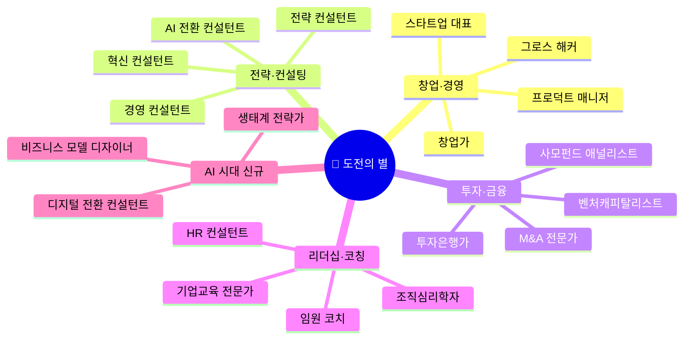

#### 이런 학생에게 맞습니다

도전의 별은 "남들이 안 한 것을 해보고 싶다"는 충동이 강한 학생을 위한 세계입니다. 학교 축제에서 부스를 기획하면 가장 신나고, 동아리 회장을 맡으면 "우리 이걸 해보자"라며 새로운 프로젝트를 추진하는 사람입니다. 결과가 실패해도 "왜 안 됐지? 다음엔 이렇게 하면 되겠다"로 바로 넘어가는 회복탄력성이 강점입니다.

AI 시대에 도전의 별은 **폭발적으로 기회가 커지는 왕국**입니다. AI 도구 덕분에 창업의 진입장벽이 극적으로 낮아졌기 때문입니다. 과거에는 앱 하나 만들려면 개발자 3명이 6개월이 필요했지만, 지금은 Bolt.new로 혼자 1주일이면 MVP를 만들 수 있습니다. ChatGPT로 시장 조사를 30분에 끝내고, Notion AI로 사업계획서를 하루 만에 완성합니다. **아이디어와 실행력만 있으면 누구나 창업할 수 있는 시대**가 된 것입니다.

#### 유망 직종 직무 상세

**1. AI 전환 컨설턴트 (AI Transformation Consultant)** — 모든 기업이 필요로 하는 전문가

모든 기업이 "AI를 도입해야 한다"는 것은 알지만, "어디서부터 시작하고, 어떤 도구를 쓰고, 조직을 어떻게 바꿔야 하는지"를 모릅니다. AI 전환 컨설턴트는 이 질문에 답하는 사람입니다. 기업의 현재 업무 프로세스를 분석하고, AI 도입이 가능한 영역을 식별하며, 3단계 로드맵을 설계하고, 직원 교육까지 담당합니다.

- **연봉**: 6,000~25,000만원 | **전망**: ★★★★★ | **AI 위험**: 🟢 낮음
- **진입 경로**: 경영/IT 전공 → 컨설팅 회사 3~5년 → AI 전환 전문 컨설턴트

**2. 창업가 (Startup Founder)** — AI가 진입장벽을 무너뜨린 시대

```
AI 시대 창업 프로세스 (과거 vs 현재)
━━━━━━━━━━━━━━━━━━━━━━━━━━━━━━━━━━━━━━━━━━━━━━━━
과거 (2020)                현재 (2026)
━━━━━━━━━━━━━━━━━━━━━━━━━━━━━━━━━━━━━━━━━━━━━━━━
시장 조사 2주              ChatGPT로 30분
사업계획서 1개월            Notion AI로 1일
MVP 개발 6개월·3명         Bolt.new로 1주·1명
디자인 1개월               Midjourney+Canva로 1일
마케팅 전문가 채용          Copy.ai+Hootsuite AI
투자 피칭 자료 2주          Gamma AI로 1일
```

- **연봉**: 0~무한대 | **전망**: ★★★★★ | **AI 위험**: 🟢 낮음
- **스트레스**: ★★★★★ | **자유도**: ★★★★★ | **보람**: ★★★★★

#### 최신 AI 도구 가이드 (2026년 6월 기준)

| AI 도구 | 용도 | 왜 배워야 하는가 | 접근성 |
|---------|------|----------------|--------|
| **ChatGPT** (GPT-5.2) | 전략 분석·문서 작성·아이디어 브레인스토밍 | 컨설턴트·창업가의 기본 협업 도구. 추론 모드 강화 | 무료 기본 |
| **Claude** (Anthropic) | 장문 분석·코드·200K 토큰 컨텍스트 | Microsoft 365 Copilot에 통합. 복잡한 전략 문서 분석에 최적 | 무료 기본 |
| **Perplexity** | AI 검색 엔진 + 딥 리서치 | 월 10억+ 쿼리. 시장 조사·경쟁사 분석의 새로운 표준 | 무료 기본 |
| **Notion AI** | 프로젝트 관리 + AI 문서 자동화 | 비즈니스/엔터프라이즈 한정. 사업계획·전략 문서 작성 | 유료 |
| **Gamma v3.0** | AI 프레젠테이션 자동 생성 | 7,000만 사용자. 투자 피칭 덱·제안서·보고서 제작 | 무료 기본 |
| **Beautiful.ai** | 디자인 규칙 기반 슬라이드 제작 | Context-Aware Workflow (2026.03). 브랜드 일관성 자동 유지 | 유료 |
| **Amplitude AI** | 제품 사용자 행동 분석 | 그로스 해커·PM 필수. A/B 테스트 자동화 | 무료 기본 |
| **Salesforce AI** | AI CRM·영업 자동화 | 사업개발 매니저·영업이사 필수 플랫폼 | 기업용 |
| **Glean** | 기업 AI 검색·지식 관리 | ARR $3억 (2026.05). 자율 에이전트가 Salesforce/Jira/GitHub 연동 | 기업용 |
| **Bolt.new V2** | AI 풀스택 앱 빌더 | 6개월 만에 ARR $4,000만. 비개발자 창업가의 MVP 제작 도구 | 무료 기본 |
| **Otter.ai** | AI 회의 자동 전사·요약 | ARR $1억 (2025.03). 회의록 자동화. AI 에이전트 스위트 출시 | 무료 기본 |
| **Fireflies.ai** | AI 미팅 녹음·대화 인텔리전스 | $10억 기업가치. 100개+ 언어 전사. AskFred (Perplexity 기반) | 무료 기본 |

#### 프로젝트 수업 연계

**프로젝트: "48시간 AI 스타트업 챌린지"**

2일간 AI 도구를 총동원하여 스타트업을 시뮬레이션합니다. Day 1: 문제 발견 → Perplexity로 시장 조사 → 비즈니스 모델 캔버스 작성 → Bolt.new로 MVP 프로토타입. Day 2: Midjourney+Canva로 브랜딩 → Gamma로 투자 피칭 덱 제작 → 3분 투자 피칭 발표. **핵심: AI로 "빠르게" 만들되, "왜 이 문제를 풀어야 하는가"는 인간이 결정.**

- **도구**: Perplexity, ChatGPT, Bolt.new, Midjourney, Canva, Gamma AI
- **기간**: 2일 (집중 워크숍)
- **산출물**: 비즈니스 모델 캔버스 + MVP 프로토타입 + 투자 피칭 덱

---

## 4. AI 시대 유망 직업 종합 TOP 20

아래 20개 직업은 **AI 대체 위험이 낮고, 전망이 밝으며, 직무가 명확한** 직업들을 직업 컨설턴트의 관점에서 종합적으로 선정한 것입니다.

| 순위 | 직업 | 왕국 | 연봉(만원) | 하는 일 (한 줄 직무) | 핵심 이유 |
|------|------|------|-----------|---------------------|----------|
| 1 | **AI 엔지니어** | 💻 | 6,000~20,000 | AI 모델을 설계·학습·배포하여 비즈니스 문제를 해결 | AI를 만드는 사람. 전 산업 수요 폭증 |
| 2 | **정신건강 상담사** | 🤝 | 3,000~7,000 | 우울·불안·트라우마를 겪는 사람을 대화로 치유 | 외로움 시대. AI 공감 불가. 수요 폭발 |
| 3 | **AI 전환 컨설턴트** | 🚀 | 6,000~25,000 | 기업의 AI 도입 전략을 설계하고 실행을 지원 | 모든 기업이 AI 전환 중. 희소 인재 |
| 4 | **크리에이티브 디렉터** | 🎨 | 6,000~20,000 | AI 창작물의 방향을 결정하고 브랜드 비주얼을 총괄 | AI가 실행, 인간이 방향. 가치 상승 |
| 5 | **기후과학자** | 🌿 | 4,500~9,000 | 기후 변화 데이터를 분석하고 대응 정책을 설계 | 기후위기 대응 필수. 30년 성장 보장 |
| 6 | **AI 의료 감독관** | 🔬 | 7,000~15,000 | AI 진단 결과를 검증·승인하고 의료 AI 시스템을 감사 | 완전 신규 직업. 의료 AI 확산 필수 |
| 7 | **리걸테크 전문가** | ⚖️ | 5,000~11,000 | AI 법률 도구를 설계·운용하고 법무팀에 도구 교육 | 법률 × 기술 교차점. Harvey AI 시장 폭발 |
| 8 | **노인복지 전문가** | 🤝 | 3,500~9,000 | 고령자의 건강·복지·일상을 종합적으로 지원 | 2025년 초고령 사회 진입. 대체 불가 |
| 9 | **재생에너지 엔지니어** | 🌿 | 5,000~15,000 | 태양광·풍력·수소 에너지 시설을 설계·구축 | 탄소중립 인프라 러시. 인력 부족 |
| 10 | **AI 윤리 전문가** | 💻 | 6,000~20,000 | AI 시스템의 편향·공정성·투명성을 감시하고 가이드라인 수립 | AI 규제 강화. 기업 필수 포지션 |
| 11 | **머신러닝 엔지니어** | 💻 | 6,000~22,000 | ML 모델을 훈련·튜닝·최적화하고 프로덕션에 배포 | AI 모델의 심장부. 수요 지속 증가 |
| 12 | **지속가능성 컨설턴트** | 🌿 | 5,000~15,000 | 기업 ESG 전략을 수립하고 지속가능성 보고서 작성 | ESG 공시 의무화. 모든 기업이 필요 |
| 13 | **위기소통 전문가** | 📡 | 5,500~22,000 | 기업·정부 위기 시 대중 소통 전략을 설계·실행 | AI 딥페이크 시대. 브랜드 수호자 |
| 14 | **학습경험 디자이너** | 🤝 | 4,500~12,000 | AI 교육 도구를 활용한 맞춤형 학습 경험을 설계 | AI 교육 시대의 설계자 |
| 15 | **기후적응 기획자** | 🌿 | 5,000~15,000 | 극단적 기후에 견디는 도시·인프라를 설계 | 완전 신규. 기후 재해 대응 필수 |
| 16 | **로봇공학자** | 💻 | 6,000~20,000 | AI 자율 로봇의 기구·제어·센서 시스템을 설계 | 제조·물류·의료 자동화 가속 |
| 17 | **탄소배출권 분석가** | 🌿 | 5,000~15,000 | 탄소 시장을 분석하고 기업 탄소 전략을 수립 | 탄소 시장 급성장. 새로운 금융 영역 |
| 18 | **인간중심 AI 디자이너** | 🤝 | 5,500~18,000 | AI와 인간이 자연스럽게 상호작용하는 경험을 설계 | AI 도구가 늘수록 UX 설계자 필수 |
| 19 | **양자컴퓨팅 엔지니어** | 💻 | 8,000~30,000 | 양자 알고리즘을 개발하고 양자 하드웨어를 활용 | 2028~2030 주류화 예상. 미래 투자 |
| 20 | **경험 디자이너** | 🎨 | 5,500~18,000 | 물리+디지털 통합 경험을 설계하고 전체 고객 여정을 관리 | 모든 기업이 "경험"을 판다 |

---

## 5. 프로젝트 수업 통합 가이드

### 고등학생을 위한 AI 도구 학습 로드맵

AI 도구를 처음 접하는 학생을 위한 4단계 로드맵입니다. 각 단계는 2~3주씩 총 8~12주 과정으로 설계되었습니다.

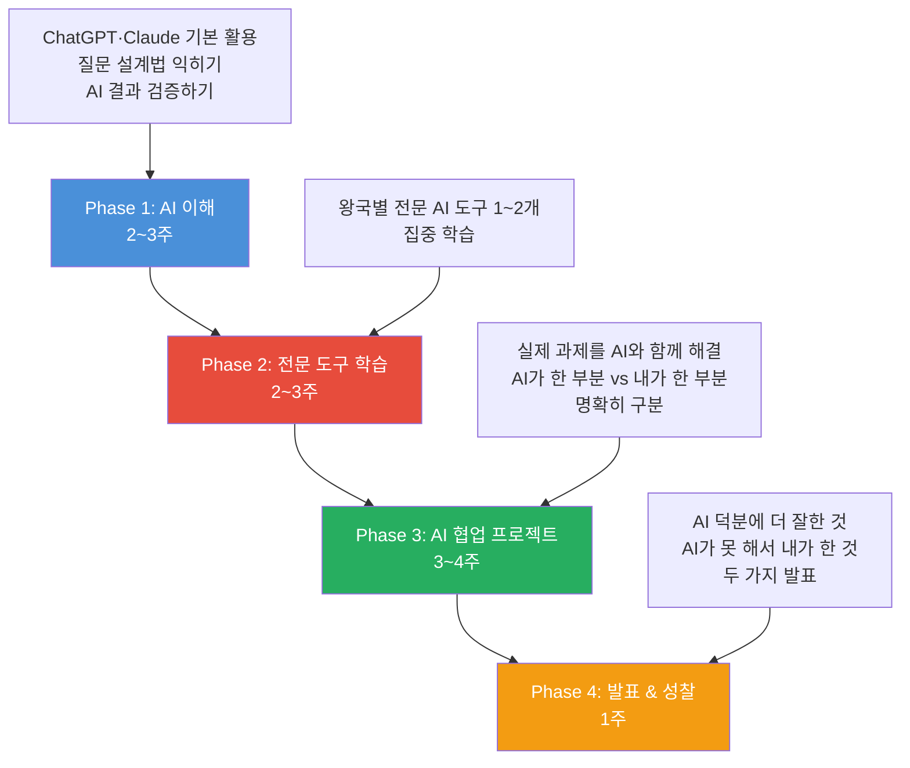

### Phase 1에서 모든 학생이 배워야 할 공통 도구

| 도구 | 용도 | 접근성 |
|------|------|--------|
| **ChatGPT** | 범용 AI 대화·분석·작문 | 무료 |
| **Claude** | 장문 분석·코드·논리적 사고 | 무료 기본 |
| **Perplexity** | AI 검색·리서치 (출처 인용) | 무료 |
| **NotebookLM** | 자료 업로드 후 AI 질의응답 | 무료 |
| **Canva AI (Magic Studio)** | 디자인·프레젠테이션 | 무료 기본 |
| **Gamma** | AI 프레젠테이션 자동 생성 | 무료 기본 |

### 통합 프로젝트: "AI 시대 우리 마을 미래 설계" (4주)

8개 왕국이 협업하는 융합 프로젝트입니다. 각 팀이 하나의 왕국 역할을 맡아, 실제 마을(또는 학교)의 문제를 AI를 활용하여 해결합니다.

```
Week 1: 문제 발견
━━━━━━━━━━━━━━━━━━━━━━━━━━━━━━━━━━━━━━━━━━━━━━━━
  탐구팀: 우리 마을 데이터 수집·분석 (NotebookLM, ChatGPT)
  자연팀: 환경 문제 조사 (Google Earth Engine, iNaturalist)
  연결팀: 주민 인터뷰·공감 조사 (인터뷰 가이드, ChatGPT)

Week 2: 솔루션 설계
━━━━━━━━━━━━━━━━━━━━━━━━━━━━━━━━━━━━━━━━━━━━━━━━
  기술팀: AI 솔루션 프로토타입 제작 (Bolt.new, v0.dev)
  질서팀: 관련 법규·규정 조사 (ChatGPT, 법제처)
  도전팀: 비즈니스 모델 설계 (Notion AI, Perplexity)

Week 3: 커뮤니케이션 전략
━━━━━━━━━━━━━━━━━━━━━━━━━━━━━━━━━━━━━━━━━━━━━━━━
  소통팀: 홍보 콘텐츠 제작 (CapCut AI, Canva, Copy.ai)
  창작팀: 시각화·디자인 (Midjourney, Figma AI)

Week 4: 발표
━━━━━━━━━━━━━━━━━━━━━━━━━━━━━━━━━━━━━━━━━━━━━━━━
  전 팀 합동: 지역 주민·학교 대상 발표
  핵심: AI를 어디서 활용했고, 인간이 어디서 판단했는지 명확히 구분
```

**산출물**: 마을 AI 활용 솔루션 제안서 + AI 협업 과정 기록 + 직업 역할 체험 포트폴리오

---

## 부록: 2026년 주요 AI 도구 변동 사항

> 이 가이드를 읽을 때 참고하세요. AI 도구 시장은 매우 빠르게 변합니다.

| 변동 사항 | 시기 | 영향 |
|----------|------|------|
| **DALL-E 3 서비스 종료** → GPT Image 1.5로 대체 | 2026.05 | OpenAI 이미지 생성은 ChatGPT 내장으로 |
| **Sora 서비스 종료** (API는 2026.09까지) | 2026.04 | OpenAI 영상 생성 사실상 중단 |
| **Freepik → Magnific 리브랜딩** | 2026.05 | Flux 2, Imagen 4, Kling 통합 플랫폼 |
| **Windsurf → Devin Desktop** (Cognition 인수) | 2026.06 | AI 코딩 도구 시장 통합 가속 |
| **Galileo AI → Google "Stitch"** (Google 인수) | 2025.05 | 독립 도구에서 Google Labs 통합 |
| **Amazon Q Developer 신규 가입 중단** → Kiro IDE 전환 | 2026.05 | AWS AI 코딩 도구 세대교체 |
| **Gemini Code Assist IDE 확장 종료** → Antigravity 전환 | 2026.06 | Google AI 코딩 도구 세대교체 |
| **GitHub Copilot 사용량 기반 과금 전환** | 2026.06 | Pro 신규 가입 일시 중단 |
| **Midjourney v8.1 출시** (웹+모바일 앱) | 2026.04 | Discord 전용 탈피. 네이티브 2K+ |
| **Figma AI Config 2026** (코드 레이어·모션) | 2026.06 | 디자인→개발 간극 대폭 축소 |
| **Suno v5 출시** | 2026 | $24.5억 기업가치, 200만 구독자 |
| **Harvey AI $110억 기업가치** | 2026.03 | 리걸테크 시장 폭발적 성장 확인 |

---

*이 가이드는 AI 커리어 패스 프로젝트 데이터(242개 직업, 8개 왕국)와 2026년 6월 기준 최신 AI 도구 시장 조사를 기반으로 제작되었습니다.*

*직업 상담 컨설턴트 관점에서 고등학생의 진로 탐험과 프로젝트 수업 연계를 목적으로 작성했습니다.*
