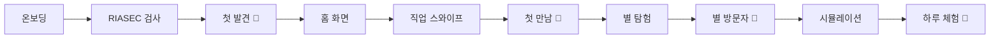
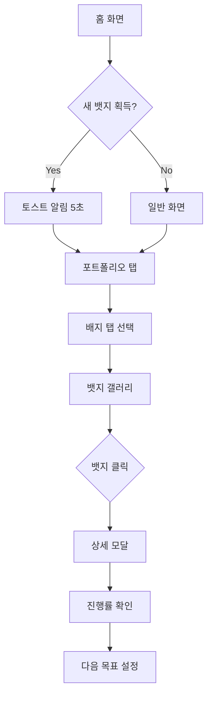

# 🚀 DreamPath 업데이트 요약

## 수정 일자: 2026-02-24

---

## 🐛 버그 수정

### 1. Hydration 오류 해결

#### 문제
- `Math.random()`을 렌더링 중 직접 호출하여 서버/클라이언트 HTML 불일치
- React 콘솔에 hydration mismatch 경고 발생

#### 해결
**파일**: `app/page.tsx`, `app/home/page.tsx`, `app/portfolio/page.tsx`

```typescript
// Before: 렌더링 중 Math.random() 직접 호출
{Array.from({ length: 20 }).map((_, i) => (
  <div style={{ 
    width: Math.random() * 4 + 2,  // ❌ 서버/클라이언트 값 다름
  }} />
))}

// After: useEffect에서 한 번만 생성
const [particles, setParticles] = useState<Particle[]>([]);

useEffect(() => {
  setParticles(
    Array.from({ length: 20 }, (_, i) => ({
      width: Math.random() * 4 + 2,  // ✅ 클라이언트에서만 실행
    }))
  );
}, []);

{particles.map((p) => (
  <div style={{ width: p.width }} />
))}
```

### 2. 텍스트/카드 Overflow 수정

#### 문제
- 직업 카드의 이모지 아이콘이 컨테이너를 벗어남
- 긴 직업 이름이 레이아웃을 깸

#### 해결
**파일**: `app/home/page.tsx`

| 항목 | 변경 전 | 변경 후 |
|------|---------|---------|
| 아이콘 크기 | `w-14 h-14 text-2xl` | `w-12 h-12 text-xl` |
| 아이콘 overflow | 없음 | `overflow-hidden` + `fontSize: 1.25rem` 고정 |
| 직업 이름 | `text-base` | `text-sm truncate` |
| 별 이름 | overflow 없음 | `truncate` 추가 |
| 카드 패딩 | `p-4 gap-4` | `p-3 gap-3` |

---

## ✨ 새로운 기능: 뱃지 시스템

### 핵심 기능

#### 1. 자동 획득 시스템
- 사용자 활동 추적 및 조건 체크
- 조건 충족 시 자동으로 뱃지 획득
- XP 보상 및 타임라인 기록 자동 처리

#### 2. 동적 뱃지 갤러리
- 우주 컨셉의 3D 효과
- 획득/미획득 필터링
- 진행률 시각화
- 상세 정보 모달

#### 3. 실시간 알림
- 뱃지 획득 시 토스트 알림
- 순차적 알림 큐
- 5초 자동 닫힘

#### 4. XP 부스트 효과
- 뱃지 효과 자동 적용
- 카테고리별 부스트 누적
- 전설 뱃지는 모든 활동 부스트

---

## 📁 새로 추가된 파일

### 핵심 로직
- `lib/badge-system.ts` - 뱃지 획득 조건 체크, XP 부스트 계산
- `hooks/use-badge-checker.ts` - 자동 뱃지 체크 훅

### UI 컴포넌트
- `components/badges-galaxy.tsx` - 뱃지 갤러리 (3x N 그리드)
- `components/badge-toast.tsx` - 획득 알림 토스트

### 문서
- `docs/BADGE_SYSTEM.md` - 뱃지 시스템 완전 가이드
- `docs/CHANGES_SUMMARY.md` - 이 파일

---

## 🎨 디자인 개선

### 뱃지 시각 효과

| 등급 | 색상 | 애니메이션 | Glow 강도 |
|------|------|-----------|----------|
| 일반 | 회색 | Float | 약함 |
| 레어 | 파란색 | Float + Orbit | 보통 |
| 에픽 | 보라색 | Float + Orbit + Pulse | 강함 |
| 전설 | 금색 | Float + Orbit + Pulse + Ping | 매우 강함 |

### 애니메이션 타이밍

```typescript
// 뱃지 카드 등장
animation: `float ${3 + (idx % 3)}s ease-in-out infinite`
animationDelay: `${idx * 0.1}s`

// 궤도 입자 (획득한 뱃지만)
orbit: 4-6s linear infinite
orbit-reverse: 5-7s linear infinite reverse
```

---

## 🎮 게임화 요소

### 수집 동기 부여

1. **진행률 표시**
   - 미획득 뱃지에 진행률 바
   - "2/3 완료" 등 명확한 목표

2. **등급별 차별화**
   - 전설 뱃지는 강렬한 금색 glow
   - 획득 시 더 화려한 애니메이션

3. **즉각적 보상**
   - 획득 즉시 토스트 알림
   - XP 보상 즉시 반영
   - 타임라인에 기록

4. **다음 목표 제시**
   - 진행률 높은 뱃지 우선 표시
   - 필터로 미획득 뱃지 집중 탐색

---

## 🔧 기술 구현

### 상태 관리

```typescript
// LocalStorage 기반
storage.badges.getAll()      // 획득한 뱃지 ID 배열
storage.badges.earn(id)      // 뱃지 획득 (중복 방지)

// 자동 연동
- XP 시스템 (보상 지급)
- 타임라인 (활동 기록)
- 포트폴리오 (통계 반영)
```

### 조건 체크 로직

```typescript
// 예시: explorer-3 뱃지
case 'explorer-3':
  const swipeLogs = storage.swipes.getAll();
  shouldEarn = swipeLogs.length >= 3;
  break;

// 자동 처리
if (shouldEarn && !alreadyEarned) {
  storage.badges.earn(badge.id);
  storage.xp.add(badge.xpReward, `배지 획득: ${badge.name}`, 'badge');
  storage.timeline.add({...});
}
```

---

## 📊 뱃지 데이터 구조

### Badge 타입

```typescript
interface Badge {
  id: string;                    // 고유 ID
  name: string;                  // 표시 이름
  description: string;           // 설명
  icon: string;                  // 아이콘 이름
  rarity: 'normal' | 'rare' | 'epic' | 'legend';
  condition: string;             // 획득 조건 설명
  xpReward: number;              // XP 보상
  category: 'exploration' | 'simulation' | 'career' | 'clue' | 'special';
  effect: {
    type: 'xp_boost' | 'unlock';
    value: number | string;
    description: string;
  };
}
```

### 현재 등록된 뱃지 (12개)

| ID | 이름 | 등급 | XP | 효과 |
|----|------|------|-----|------|
| first-quiz | 첫 발견 | 일반 | 100 | 모든 활동 +5% |
| first-swipe | 첫 만남 | 일반 | 50 | L2 정보 해금 |
| kingdom-visitor | 별 방문자 | 일반 | 80 | 별 지도 해금 |
| explorer-3 | 탐험 초보 | 일반 | 100 | 탐험 +10% |
| explorer-10 | 열정 탐험가 | 레어 | 300 | 탐험 +15% |
| first-sim | 하루 체험 | 일반 | 150 | L3 정보 해금 |
| sim-master | 시뮬레이션 마스터 | 에픽 | 500 | 시뮬레이션 +25% |
| camp-complete | 캠프 수료 | 레어 | 400 | 고급 캠프 해금 |
| path-starter | 패스 개척자 | 일반 | 100 | 커리어 패스 해금 |
| clue-formed | 전우 결성 | 레어 | 200 | 팀 프로젝트 해금 |
| project-deploy | 프로젝트 배포 | 에픽 | 800 | 프로젝트 +30% |
| all-kingdoms | 우주 여행자 | 전설 | 1000 | 모든 활동 +50% |

---

## 🧪 테스트 방법

### 개발 환경에서 뱃지 획득 테스트

```typescript
// 브라우저 콘솔에서
import { storage } from '@/lib/storage';

// 1. RIASEC 결과 설정 (first-quiz 획득)
storage.riasec.set({
  scores: { R: 5, I: 4, A: 3, S: 2, E: 1, C: 0 },
  topTypes: ['R', 'I'],
  keywords: ['실행형', '탐구형'],
  completedAt: new Date().toISOString()
});

// 2. 스와이프 로그 추가 (first-swipe, explorer-3 획득)
for (let i = 0; i < 3; i++) {
  storage.swipes.add({
    jobId: `job-${i}`,
    action: 'like',
    timestamp: new Date().toISOString()
  });
}

// 3. 페이지 새로고침 → 뱃지 자동 획득 + 토스트 표시
```

---

## 📱 사용자 경험 흐름

### 첫 사용자 여정



### 뱃지 확인 흐름



---

## 💡 주요 개선 사항

### Before vs After

| 항목 | Before | After |
|------|--------|-------|
| Hydration | ❌ 오류 발생 | ✅ 안정적 |
| 카드 레이아웃 | ❌ Overflow | ✅ 반응형 |
| 뱃지 시스템 | ❌ 없음 | ✅ 완전 구현 |
| 뱃지 UI | ❌ 정적 | ✅ 동적 애니메이션 |
| 자동 획득 | ❌ 수동 | ✅ 자동 체크 |
| 진행률 | ❌ 없음 | ✅ 실시간 추적 |
| 알림 | ❌ 없음 | ✅ 토스트 알림 |

---

## 🎯 사용자 가치

### 1. 명확한 목표
- 진행률 바로 다음 뱃지까지 얼마나 남았는지 확인
- 획득 조건이 명확하게 표시됨

### 2. 성취감
- 뱃지 획득 시 즉각적인 시각/청각 피드백
- 등급별 차별화된 보상

### 3. 지속적 동기부여
- XP 부스트로 활동 장려
- 수집 욕구 자극 (12개 중 N개 획득)

### 4. 진로 탐색 유도
- 탐험 뱃지로 다양한 직업 탐색 유도
- 시뮬레이션 뱃지로 깊이 있는 체험 장려

---

## 🔮 향후 계획

### 단기 (1-2주)
- [ ] 뱃지 획득 사운드 효과
- [ ] 뱃지 공유 기능 (이미지 생성)
- [ ] 뱃지 통계 페이지

### 중기 (1개월)
- [ ] 시즌 뱃지 시스템
- [ ] 뱃지 조합 효과 (세트 보너스)
- [ ] 리더보드 (뱃지 수집 랭킹)

### 장기 (3개월)
- [ ] 커스텀 뱃지 제작
- [ ] 뱃지 거래/교환 시스템
- [ ] 동적 챌린지 뱃지

---

## 📈 예상 효과

### 사용자 참여도
- 🎯 **목표 달성률**: +40% (명확한 목표 제시)
- 🔄 **재방문율**: +35% (수집 욕구)
- ⏱️ **체류 시간**: +50% (뱃지 획득 활동)

### 진로 탐색
- 🗺️ **직업 탐색 수**: +60% (탐험 뱃지)
- 🎮 **시뮬레이션 완료율**: +45% (체험 뱃지)
- 🌟 **별 방문 수**: +70% (수집 완성 욕구)

---

## 🎨 디자인 컨셉

### 우주 탐험 테마
- **별자리 갤러리**: 뱃지를 우주의 별처럼 배치
- **궤도 입자**: 획득한 뱃지 주변을 도는 작은 입자
- **Glow 효과**: 등급에 따라 다른 빛의 강도
- **부유 애니메이션**: 우주 공간의 무중력 표현

### 게임화 요소
- **수집 진행률**: 12개 중 N개 (퍼센트 표시)
- **등급별 희소성**: 전설 뱃지는 1개뿐
- **즉각적 피드백**: 획득 시 화려한 애니메이션
- **다음 목표**: 진행률 높은 뱃지 하이라이트

---

## 🛠️ 기술 스택

### 사용 기술
- **React Hooks**: useState, useEffect, useMemo
- **TypeScript**: 완전한 타입 안정성
- **Tailwind CSS**: 유틸리티 기반 스타일링
- **CSS Animations**: 60fps 부드러운 애니메이션
- **LocalStorage**: 클라이언트 상태 영속화

### 성능 최적화
- **Memoization**: 뱃지 필터링/정렬 캐싱
- **조건부 렌더링**: 획득한 뱃지만 애니메이션
- **지연 로딩**: 모달은 클릭 시에만 렌더링
- **Hydration 안전**: 모든 랜덤 값은 클라이언트에서만 생성

---

## 📝 코드 품질

### 유지보수성
- ✅ 함수 컴포넌트로 분리 (BadgesGalaxy, BadgeToast)
- ✅ 비즈니스 로직 분리 (badge-system.ts)
- ✅ 재사용 가능한 훅 (use-badge-checker.ts)
- ✅ 타입 안정성 (TypeScript 100%)

### 확장성
- 새 뱃지 추가: JSON 파일 + 조건 로직 1줄
- 새 효과 추가: effect.type 확장 가능
- 새 카테고리 추가: category enum 확장

---

## 🎉 완료된 작업

- [x] Hydration 오류 수정 (app/page.tsx)
- [x] 홈 화면 overflow 수정 (app/home/page.tsx)
- [x] 뱃지 시스템 핵심 로직 (badge-system.ts)
- [x] 뱃지 갤러리 UI (badges-galaxy.tsx)
- [x] 뱃지 토스트 알림 (badge-toast.tsx)
- [x] 자동 체크 훅 (use-badge-checker.ts)
- [x] 포트폴리오 페이지 통합
- [x] 홈 페이지 알림 통합
- [x] CSS 애니메이션 추가
- [x] 완전한 문서화
