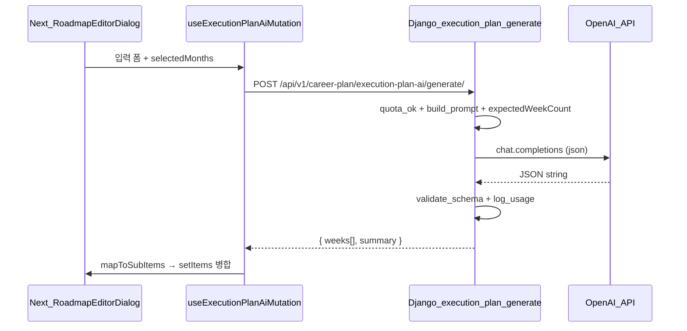

# 실행계획 AI 자동 생성 — 개발 설계서 (Django + Next.js)

**목적:** DreamMate「실행계획 수정하기」(`RoadmapEditorDialog` + WBS 주간 체크)에 맞춰, 최소 입력으로 **주·하위 항목**을 자동 생성한다. Cursor에서 **백엔드·프론트 폴더별로 바로 구현**할 수 있도록 API·알고리즘·파일 위치를 고정한다.

**레퍼런스 UX:** [AI R&D Simulator — Step1 입력](https://ai-research-simulator-development.vercel.app/workflow/step1-input)

---

## 0. 현재 레포 구조와의 연결

| 구분 | 경로 | 비고 |
|------|------|------|
| Django API 루트 | `backend/config/urls.py` → `api/v1/career-plan/` | `apps.career_plan` |
| DreamMate 라우터 | `backend/apps/career_plan/urls.py` | `DefaultRouter` + ViewSet |
| Next 프록시 | `frontend/next.config.mjs` | `/api/v1/:path*` → 백엔드 (로컬 `127.0.0.1:8000`) |
| 프론트 API 헬퍼 | `frontend/lib/config/api.ts` | `buildApiUrl`, `API_PATHS.dreamMateRoadmaps` |
| 주차 UI·상태 | `frontend/app/dreammate/components/RoadmapEditorDialog.tsx` | `createWeeklyGoalSubItem`, `buildSortedWeekGroups`, `normalizeSubItemsToAvailableMonths` |
| 타입 | `frontend/app/dreammate/types.ts` | `RoadmapItem`, `RoadmapTodoItem` |

---

## 1. 아키텍처 개요



- **API 키:** 서버 환경변수에만 둔다 (`OPENAI_API_KEY`). 브라우저에 서비스 키를 넣지 않는다.
- **쿼터:** 로그인 사용자 기준 **10회/계정(기간 단위는 설정으로)** — DB에 누적. (로컬만 쓸 때는 개발용 플래그로 우회 가능)

---

## 2. 백엔드 (Django)

### 2.1 폴더·신규 파일 (제안)

```
backend/apps/career_plan/
├── models.py                    # 기존 — 아래 모델 추가
├── migrations/                  # 새 마이그레이션
├── serializers_execution_plan_ai.py   # 요청/응답 Serializer (신규, 파일 분리 권장)
├── services/
│   └── execution_plan_ai_service.py   # 프롬프트·OpenAI·검증 (신규)
├── views_execution_plan_ai.py         # APIView 또는 ViewSet @action (신규)
└── urls.py                      # URL 등록 1줄 추가
```

**원칙:** `views.py`가 이미 크면 `views_execution_plan_ai.py`로 분리해 **400줄 규칙**과 맞춘다.

### 2.2 URL

- **경로 (제안):** `POST /api/v1/career-plan/execution-plan-ai/generate/`
- **등록 방식 (택 1):**
  - **A)** `career_plan/urls.py`에 `path('execution-plan-ai/generate/', ExecutionPlanAiGenerateView.as_view(), ...)` 추가
  - **B)** `RoadmapViewSet`에 `@action(detail=False, methods=['post'], url_path='execution-plan-ai/generate')` — REST 일관성은 A가 단순

### 2.3 모델 (쿼터·감사 로그)

```text
ExecutionPlanAiUsage (제안명)
- user: FK(User), on_delete=CASCADE
- period_key: CharField  # 예: "2026-04" 월 단위 리셋 또는 "all_time"
- call_count: PositiveIntegerField, default=0
- last_called_at: DateTimeField(null=True)
- unique_together: (user, period_key)
```

- **알고리즘 `check_and_increment_quota(user, limit=10, period='month')`:**
  1. `period_key` = 월이면 `timezone.now().strftime('%Y-%m')`, 전체 기간이면 `'all'`.
  2. `select_for_update()`로 행 잠금 후 `call_count` 조회.
  3. `call_count >= limit` → `429 Too Many Requests` + `{ "code": "QUOTA_EXCEEDED", "limit": 10 }`.
  4. 아니면 `call_count += 1`, `save()`, 성공.

### 2.4 요청·응답 Serializer (필드)

**요청 `ExecutionPlanAiGenerateRequestSerializer`**

| 필드 | 타입 | 필수 | 설명 |
|------|------|------|------|
| `title` | string | ✓ | 실행/프로젝트 제목 |
| `category_id` | string | ✓ | 프론트 enum과 동일 (admission, contest, …) |
| `level_label` | string | ✓ | 수준 (자유 텍스트 또는 enum) |
| `difficulty` | int 1–5 | ✓ | |
| `final_goal` | string | ✓ | 최종 목표 |
| `selected_months` | int[] | ✓ | 적용 월 1–12, 정렬됨 |
| `milestones` | `{ title, date_iso? }[]` | | 선택 |
| `constraints` | string | | 선택 |
| `previous_summary` | string | | 선택 — 히스토리 요약 주입 |

**응답 `ExecutionPlanAiGenerateResponseSerializer`**

| 필드 | 설명 |
|------|------|
| `schema_version` | int |
| `summary` | string |
| `assumptions` | string[] |
| `weeks` | 아래 스키마와 동일 |

### 2.5 서비스 레이어 — `execution_plan_ai_service.py` 주요 함수

| 함수 | 책임 |
|------|------|
| `compute_expected_week_count(selected_months: list[int], weeks_per_month: int = 4) -> int` | 적용 월 수 × 주당 기본 주차(4). UI에서 “5주차”까지 쓰는 경우 설정으로 5로 변경 가능 |
| `build_system_prompt() -> str` | 역할, JSON만 출력, 한국어, 금지 사항 |
| `build_user_prompt(payload: dict, expected_week_count: int) -> str` | 입력 직렬화 + `expected_week_count` 명시 |
| `call_openai_json(system: str, user: str) -> dict` | `openai` 공식 SDK 또는 `httpx` POST. `response_format` 지원 시 JSON 모드 |
| `validate_and_normalize_weeks(data: dict) -> dict` | `schemaVersion` 확인, `weeks` 길이가 `expected_week_count`와 다르면 **경고 로그만** 또는 재시도 트리거 |
| `repair_json_with_llm_once(raw: str, error: str) -> dict` | 파싱 실패 시 한 번만 수정 요청 (선택) |

**`compute_expected_week_count` 알고리즘 (기본안):**

```text
expected_week_count = len(selected_months) * weeks_per_month
최소 1, 최대 예: 52 (환경설정 EXECUTION_PLAN_AI_MAX_WEEKS)
```

### 2.6 출력 JSON 스키마 (서버·클라이언트 공유)

서버가 검증하는 필드명을 프론트 매핑과 일치시킨다.

```json
{
  "schemaVersion": 1,
  "summary": "string",
  "assumptions": ["string"],
  "weeks": [
    {
      "month": 9,
      "weekIndexInMonth": 1,
      "goal": "string",
      "deliverable": "string",
      "researchNoteOutline": {
        "whatToDo": "string",
        "howToVerify": "string",
        "reflectionPrompts": ["string"]
      },
      "subTasks": ["string"]
    }
  ]
}
```

### 2.7 뷰 — `ExecutionPlanAiGenerateView`

- `permission_classes = [IsAuthenticated]`
- 흐름: `serializer.is_valid()` → `check_and_increment_quota` → `build_*_prompt` → `call_openai_json` → `validate_and_normalize_weeks` → `Response(200)`
- 예외: OpenAI 타임아웃 → `504` 또는 `502`, 쿼터 → `429`

### 2.8 Django 설정

```env
# backend .env (예시)
OPENAI_API_KEY=sk-...
OPENAI_EXECUTION_PLAN_MODEL=gpt-4o
EXECUTION_PLAN_AI_WEEKS_PER_MONTH=4
EXECUTION_PLAN_AI_USER_MONTHLY_LIMIT=10
```

`settings.py`에서 `getattr(settings, 'OPENAI_API_KEY', '')` 로 읽기.

### 2.9 OpenAPI / 스펙

- `drf-spectacular` 사용 중이면 `@extend_schema`로 요청/응답 스키마 등록 → Postman import 용이.

---

## 3. 프론트엔드 (Next.js App Router)

### 3.1 폴더·신규 파일 (제안)

```
frontend/
├── lib/config/api.ts                          # API_PATHS 에 키 추가
├── lib/dreammate/
│   ├── executionPlanAiApi.ts                  # fetch 래퍼, 타입
│   └── executionPlanAiTypes.ts              # 요청/응답 Zod 또는 TS interface
├── app/dreammate/
│   ├── config/
│   │   └── executionPlanAiForm.json         # 라벨·플레이스홀더·카테고리 enum (기존 config 패턴)
│   ├── utils/
│   │   ├── computeExpectedWeekCountForExecutionPlanAi.ts
│   │   └── mapExecutionPlanAiWeeksToRoadmapTodoItems.ts
│   ├── hooks/
│   │   └── useExecutionPlanAiGenerate.ts      # React Query mutation
│   └── components/
│       └── execution-plan-ai/
│           ├── ExecutionPlanAiGenerateDialog.tsx   # Step1 유사 폼
│           └── ExecutionPlanAiApplyBar.tsx         # 미리보기 + 적용
```

**파일당 400줄 이하:** 폼·매핑·API를 분리한다.

### 3.2 `api.ts` 변경

```ts
// API_PATHS 에 추가 (예시)
executionPlanAiGenerate: '/api/v1/career-plan/execution-plan-ai/generate/',
```

`buildApiUrl` + 상대 경로는 `next.config.mjs` rewrite로 백엔드로 전달된다.

### 3.3 `computeExpectedWeekCountForExecutionPlanAi`

- 백엔드와 **동일 공식**을 쓴다 (`selectedMonths.length * weeksPerMonth`).
- 프롬프트에 넣을 `expectedWeekCount` 표시용으로만 쓰거나, 서버가 다시 계산하므로 **요청 본문에 `selected_months`만 보내고 주차 수는 서버만 신뢰**해도 된다. (이중 계산 불일치 방지: **서버 응답에 `expected_week_count_used` 필드를 넣는 편이 안전**)

### 3.4 핵심 알고리즘 — `mapExecutionPlanAiWeeksToRoadmapTodoItems`

**입력:** AI `weeks[]`, 대상 `RoadmapItem`의 `months`(또는 다이얼로그의 `selectedMonths`), 기존 `item.id`  
**출력:** `RoadmapTodoItem[]` — `RoadmapEditorDialog`가 기대하는 형태

**규칙 (기존 코드와 정합):**

1. 각 주차에 대해 **`entryType: 'goal'`** 인 항목 1개: `title = week.goal`, `weekLabel = f"{month}월 {weekIndexInMonth}주차"` (기존 `buildMonthWeekLabel`과 동일 패턴), `weekNumber = weekIndexInMonth`.
2. **`deliverable`** → 첫 번째 goal 또는 해당 주의 task 중 하나에 `outputRef`로 넣을지 정책 결정. **권장:** goal에 `outputRef = deliverable`, 하위 task는 순수 활동만.
3. **`subTasks[]`** 각각 **`entryType: 'task'`**, 동일 `month`/`week` 라벨, `title = subTask 텍스트`.
4. ID 생성: `draft-sub-item-${Date.now()}-${random}` 패턴은 `RoadmapEditorDialog`의 `createWeeklyGoalSubItem` / `createWeeklyTaskSubItem`과 동일하게 유지.
5. **`researchNoteOutline`:** `note`에 `whatToDo`, `reviewNote` 초안에 `reflectionPrompts`를 줄바꿈으로 합치거나, `note` 한 필드에 구조화 텍스트로 저장 (UI는 나중에 확장).

**의사코드:**

```text
todos = []
for w in weeks:
  todos.push goalTodo(month=w.month, week=w.weekIndexInMonth, title=w.goal, outputRef=w.deliverable)
  for s in w.subTasks:
    todos.push taskTodo(month=w.month, week=w.weekIndexInMonth, title=s)
return normalizeSubItemsToAvailableMonths(todos, selectedMonths)  // 다이얼로그와 동일 함수 재사용 권장
```

`normalizeSubItemsToAvailableMonths`는 `RoadmapEditorDialog.tsx` 내부에 있으므로 **공통 유틸로 한 파일 추출** (`app/dreammate/utils/roadmapSubItemMonthNormalization.ts` 등) 후 에디터와 AI 매핑이 같이 import 하도록 리팩터하는 것을 권장한다.

### 3.5 React Query — `useExecutionPlanAiGenerate`

- `useMutation`으로 POST 호출.
- 성공 시: 부모에 `onGenerated(weeks)` 또는 **직접 `setItems`에 병합** 콜백.
- `meta`: 에러 메시지 매핑 (`QUOTA_EXCEEDED` → 토스트).

### 3.6 로컬 히스토리 (이전 입력 참조)

| 키 | 값 |
|----|-----|
| `dreammate.executionPlanAi.history.v1` | `JSON.stringify({ entries: Array<{ at: string, input: object, summary: string }> })` |

- 최대 5건, FIFO.
- 다음 생성 시 `previous_summary`에 마지막 `summary` 또는 사용자가 선택한 항목의 요약을 넣는다.

### 3.7 UI 연결점

- `RoadmapEditorDialog.tsx` 상단 툴바 또는 각 활동 카드에 **「AI로 주간 계획 생성」** 버튼 → `ExecutionPlanAiGenerateDialog` 오픈.
- 생성 완료 후 **현재 선택된 활동 `RoadmapItem`의 `subItems`를 교체/병합** (정책: “덮어쓰기” 확인 모달 권장).

---

## 4. 에러 코드·HTTP 상태 (통일)

| HTTP | code | 의미 |
|------|------|------|
| 200 | — | 성공 |
| 400 | `VALIDATION_ERROR` | Serializer 실패 |
| 401 | — | 비로그인 |
| 429 | `QUOTA_EXCEEDED` | 월 10회 초과 |
| 502/504 | `OPENAI_ERROR` | 외부 API 실패 |

---

## 5. 보안·운영

- 로그에 **사용자 프롬프트 전문**을 남길지 여부는 개인정보 정책에 따름 (최소한 해시/마스킹 고려).
- Rate limit은 **IP + 사용자** 이중으로 nginx/게이트웨이에서 보강 가능.

---

## 6. Cursor 작업 쪼개기 (체크리스트)

1. [ ] Backend: `ExecutionPlanAiUsage` 모델 + 마이그레이션  
2. [ ] Backend: `services/execution_plan_ai_service.py` + 단위 테스트(주차 수, JSON 검증 mock)  
3. [ ] Backend: `views_execution_plan_ai.py` + `urls.py` 등록  
4. [ ] Frontend: `API_PATHS` + `executionPlanAiApi.ts`  
5. [ ] Frontend: `mapExecutionPlanAiWeeksToRoadmapTodoItems` + (선택) `normalize` 공통 추출  
6. [ ] Frontend: `ExecutionPlanAiGenerateDialog` + `RoadmapEditorDialog` 버튼 연결  
7. [ ] E2E: 로그인 → 생성 → 에디터에 주차 표시  

---

## 7. 기존 검토서 요약 (유지)

- **데이터 모델:** `RoadmapTodoItem`의 `goal`/`task` + `weekLabel` 형식 (`N월 M주차`) 유지.  
- **R&D Simulator Step1:** 필수·선택 필드 분리, 한 화면 입력 UX.  
- **AI 초안 배지:** 사용자에게 검증 책임 안내.

---

*스키마 버전(`schemaVersion`)을 올릴 때는 프론트 매핑과 Django 검증을 동시에 수정한다.*
