# 2028학년도 입시 개편 핵심 변화

> **최종 업데이트: 2026년 7월 기준**
> 2028학년도 대입은 현재 중3~고1 학생에게 직접 해당됩니다.
> 이 문서는 2028 대입 개편의 핵심 변화와 그에 따른 전략을 정리합니다.

---

## 목차

1. [2028 대입 개편 핵심 요약](#1-2028-대입-개편-핵심-요약)
2. [내신 평가 체계 변화: 5등급에서 9등급으로](#2-내신-평가-체계-변화)
3. [수능 개편 핵심 변화](#3-수능-개편-핵심-변화)
4. [고교학점제 전면 시행에 따른 영향](#4-고교학점제-전면-시행에-따른-영향)
5. [자기소개서 폐지와 학생부 변화](#5-자기소개서-폐지와-학생부-변화)
6. [정시 확대 트렌드와 학교별 영향](#6-정시-확대-트렌드와-학교별-영향)
7. [의대/약대/치대 입시 변화](#7-의대약대치대-입시-변화)
8. [중학생이 지금 해야 할 대비 전략](#8-중학생이-지금-해야-할-대비-전략)
9. [학교 유형별 2028 대입 유불리 분석](#9-학교-유형별-2028-대입-유불리-분석)
10. [종합 실행 계획](#10-종합-실행-계획)

---

## 1. 2028 대입 개편 핵심 요약

### 1-1. 전체 개편 타임라인

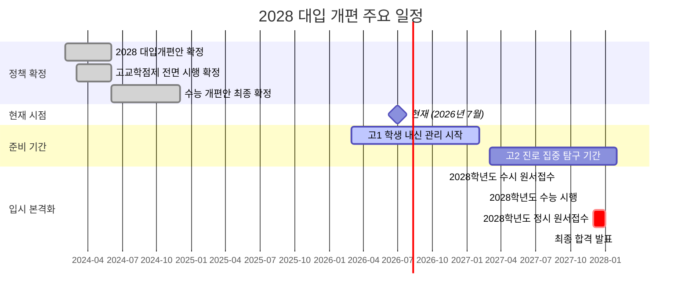

### 1-2. 2028 대입 개편 Before vs After 비교

| 구분 | 기존 (2024~2027학년도) | 변경 (2028학년도~) |
|------|----------------------|-------------------|
| **내신 등급** | 상대평가 9등급제 | 성취평가제 5등급 (A-B-C-D-E) + 9등급 병기 |
| **수능 체계** | 국어/수학 공통+선택 | 통합형 (선택과목 폐지 방향) |
| **수능 사탐/과탐** | 사회/과학 중 선택 2과목 | 통합사회/통합과학 기반 개편 |
| **고교학점제** | 부분 도입 | 전면 시행 |
| **자기소개서** | 일부 대학 요구 | 완전 폐지 |
| **학생부 기재** | 교사 서술 중심 | 핵심역량 중심 간소화 |
| **정시 비율** | 40% 내외 | 45~50% 확대 추세 |
| **의대 정원** | 기존 정원 유지 | 증원 (약 2,000명 규모) |
| **블라인드 평가** | 부분 적용 | 전면 확대 |
| **논술 전형** | 일부 대학 시행 | 축소 추세 |

### 1-3. 핵심 변화 흐름도

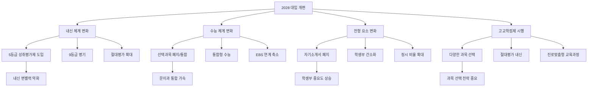

### 1-4. 학생별 해당 학년 정리

| 현재 학년 (2026년 기준) | 2028학년도 수능 응시 여부 | 비고 |
|------------------------|-------------------------|------|
| 현 중3 | 2028학년도 수능 응시 대상 (고3) | **직접 해당** |
| 현 고1 | 2028학년도 수능 응시 대상 (고3) | **직접 해당** (2025년 입학생) |
| 현 중2 | 2029학년도 수능 응시 대상 | 간접 해당 (유사 체계) |
| 현 중1 | 2030학년도 수능 응시 대상 | 간접 해당 (유사 체계) |
| 현 고2 | 2027학년도 수능 응시 대상 | 기존 체계 적용 |

---

## 2. 내신 평가 체계 변화

### 2-1. 성취평가제 5등급 vs 기존 9등급제 비교

| 항목 | 기존 9등급 상대평가 | 2028 성취평가제 5등급 |
|------|-------------------|---------------------|
| **평가 방식** | 상대평가 (석차 기반) | 절대평가 (성취 수준 기반) |
| **등급 구분** | 1~9등급 (고정 비율) | A-B-C-D-E (성취 기준) |
| **1등급 비율** | 상위 4% | 90점 이상 (비율 제한 없음) |
| **변별력** | 높음 (세밀한 구분) | 낮음 (넓은 등급 폭) |
| **경쟁 구조** | 같은 학교 내 경쟁 | 절대 기준 도달 여부 |
| **유리한 학교** | 학력 낮은 학교 | 학력 높은 학교 |
| **불리한 점** | 상위권 학교 불리 | 등급 인플레이션 우려 |

### 2-2. 등급 기준 상세

| 성취등급 | 원점수 기준 | 기존 9등급 환산 | 대학 반영 예상 |
|---------|-----------|---------------|--------------|
| **A** | 90점 이상 | 1~2등급 수준 | 최상위권 반영 |
| **B** | 80~89점 | 3~4등급 수준 | 상위권 반영 |
| **C** | 70~79점 | 5~6등급 수준 | 중위권 반영 |
| **D** | 60~69점 | 7등급 수준 | 하위권 반영 |
| **E** | 60점 미만 | 8~9등급 수준 | 최하위권 반영 |

### 2-3. 내신 변화가 미치는 영향

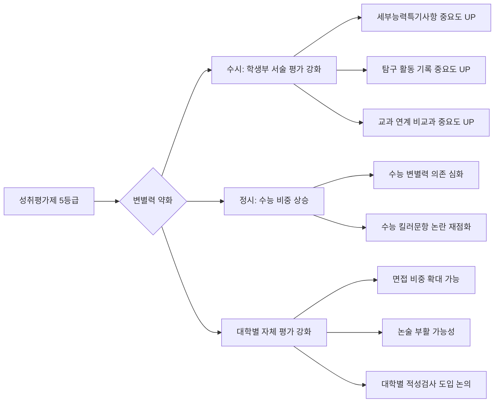

### 2-4. 학교 유형별 내신 영향도

| 학교 유형 | 기존 체계 유불리 | 2028 체계 유불리 | 변화 방향 |
|----------|---------------|----------------|----------|
| **일반고 (상위권)** | 불리 (내신 경쟁 치열) | 유리 (절대평가로 A 다수 가능) | 크게 개선 |
| **일반고 (중하위권)** | 유리 (내신 따기 쉬움) | 보통 (절대 기준 충족 필요) | 다소 불리 |
| **자사고** | 매우 불리 (내신 경쟁) | 유리 (절대평가 전환) | 크게 개선 |
| **외고/국제고** | 불리 (내신 경쟁) | 유리 (절대평가 전환) | 개선 |
| **과학고/영재학교** | 해당 없음 (조기졸업) | 해당 없음 | 변화 없음 |
| **특성화고** | 별도 체계 | 별도 체계 유지 | 변화 적음 |
| **자율형 공립고** | 보통 | 유리 (다양한 과목 개설) | 개선 |

---

## 3. 수능 개편 핵심 변화

### 3-1. 수능 과목 체계 변화

| 영역 | 기존 (2027학년도까지) | 2028학년도 | 비고 |
|------|---------------------|-----------|------|
| **국어** | 공통(독서+문학) + 선택(화작/언매) | 통합형 (선택 폐지) | 공통 출제 |
| **수학** | 공통(수I+수II) + 선택(확통/미적/기하) | 통합형 (대수+미적+통계) | 선택 폐지 |
| **영어** | 절대평가 9등급 | 절대평가 유지 | 변화 없음 |
| **탐구** | 사탐/과탐 중 최대 2과목 선택 | 통합사회/통합과학 기반 | 선택 축소 |
| **한국사** | 절대평가 필수 | 절대평가 필수 유지 | 변화 없음 |
| **제2외국어/한문** | 절대평가 | 절대평가 유지 | 변화 적음 |

### 3-2. 수능 변화 핵심 포인트

- **문이과 통합 완성**: 선택과목 폐지로 모든 수험생이 동일 시험 응시
- **수학 범위 변화**: 미적분이 공통 범위에 포함되어 이과생 유리 구도 완화
- **탐구 영역 개편**: 통합형 출제로 깊이보다 폭넓은 이해 요구
- **킬러문항 논란**: 변별력 확보를 위한 고난도 문항 출제 방식 변화 예상
- **EBS 연계율**: 50% 이하로 축소 예상

### 3-3. 수능 준비 전략 변화

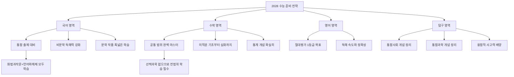

### 3-4. 수능 등급별 예상 인원 분포

| 등급 | 비율 | 예상 인원 (45만 기준) | 2028 변화 예상 |
|------|------|---------------------|---------------|
| 1등급 | 4% | 약 18,000명 | 통합형으로 변별 어려움 예상 |
| 2등급 | 7% | 약 31,500명 | 1~2등급 경계 치열 |
| 3등급 | 12% | 약 54,000명 | 중상위권 변별 중요 |
| 4등급 | 17% | 약 76,500명 | 주요 대학 커트라인 |
| 5등급 | 20% | 약 90,000명 | 중위권 |
| 6등급 | 17% | 약 76,500명 | - |
| 7등급 | 12% | 약 54,000명 | - |
| 8등급 | 7% | 약 31,500명 | - |
| 9등급 | 4% | 약 18,000명 | - |

---

## 4. 고교학점제 전면 시행에 따른 영향

### 4-1. 고교학점제란?

고교학점제는 학생이 자신의 진로와 적성에 따라 과목을 선택하여 이수하고, 일정 학점을 취득해야 졸업하는 제도입니다.

| 항목 | 기존 단위제 | 고교학점제 |
|------|-----------|-----------|
| **수업 단위** | 단위 (1단위 = 50분 x 17주) | 학점 (1학점 = 50분 x 16주) |
| **졸업 기준** | 출석일수 기반 | 192학점 이수 + 성취 기준 충족 |
| **과목 선택** | 제한적 | 학생 자율 선택 확대 |
| **미이수 제도** | 없음 | 도입 (성취율 40% 미달 시) |
| **평가 방식** | 상대평가 중심 | 성취평가제 (절대평가) |
| **교육과정** | 학교 지정 위주 | 학생 설계 교육과정 |

### 4-2. 고교학점제 교과 이수 구조

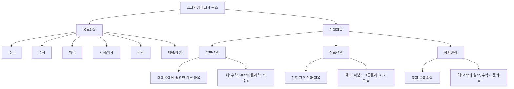

### 4-3. 과목 선택 시 고려사항

| 고려 요소 | 상세 내용 | 중요도 |
|----------|----------|--------|
| **대학 지원 계열과의 연관성** | 지원 학과와 관련된 과목 선택 | 매우 높음 |
| **수능 출제 범위와의 연계** | 수능 과목과 겹치는 과목 우선 | 높음 |
| **내신 성취등급 확보 가능성** | A등급을 받을 수 있는 과목 | 높음 |
| **학교 개설 과목 현황** | 학교에서 실제 개설하는 과목 확인 | 높음 |
| **공동교육과정 활용** | 우리 학교에 없는 과목 타교 이수 | 보통 |
| **온라인 교육과정 활용** | 온라인으로 이수 가능한 과목 | 보통 |
| **교과 세특 기재 가능성** | 탐구 활동 기록이 풍부한 과목 | 높음 |

### 4-4. 계열별 추천 선택과목

| 지원 계열 | 추천 일반선택 | 추천 진로선택 | 추천 융합선택 |
|----------|-------------|-------------|-------------|
| **인문/사회** | 사회문화, 생활과윤리, 정치와법 | 사회과제연구, 고전과윤리 | 여행지리, 사회와문화탐구 |
| **경영/경제** | 경제, 사회문화, 수학I/II | 경제수학, 국제경제 | 창업과경영, 금융과경제생활 |
| **자연/공학** | 물리학, 화학, 미적분 | 고급물리, 고급화학, 미적분II | 과학과기술, 융합과학탐구 |
| **의약학** | 생명과학I, 화학I, 물리학I | 생명과학II, 화학II, 고급생명과학 | 과학과철학, 생태와환경 |
| **교육** | 심리학, 교육학 | 교육과정과평가 | 교육과사회 |
| **예체능** | 미술/음악/체육 심화 | 전공 실기 관련 | 미술과매체, 음악과문화 |
| **IT/컴퓨터** | 정보, 수학I/II, 물리학 | 인공지능기초, 프로그래밍 | 데이터과학, 정보와통신 |

### 4-5. 고교학점제가 입시에 미치는 영향

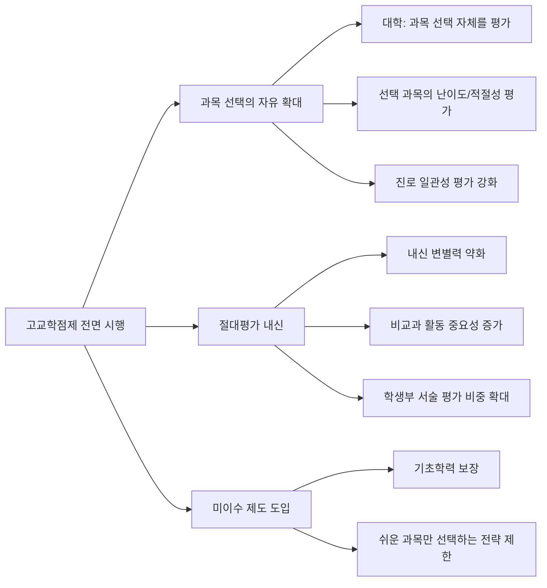

---

## 5. 자기소개서 폐지와 학생부 변화

### 5-1. 자기소개서 폐지 타임라인

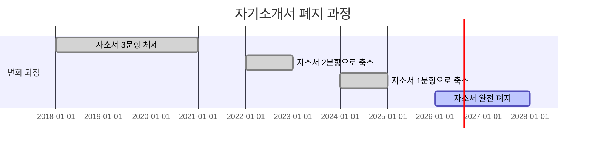

### 5-2. 자기소개서 폐지 전후 비교

| 항목 | 자소서 있을 때 | 자소서 폐지 후 |
|------|-------------|--------------|
| **자기표현 수단** | 자소서로 직접 서술 | 학생부 기록으로 대체 |
| **지원동기 전달** | 자소서에 상세 기술 | 면접에서 구술로 전달 |
| **활동 설명** | 자소서에서 맥락 설명 | 세특/행특 기록으로 판단 |
| **입학사정관 평가** | 자소서 + 학생부 종합 | 학생부 단독 + 면접 |
| **대필/표절 문제** | 상존 | 해소 |
| **사교육 영향** | 자소서 컨설팅 성행 | 관련 사교육 감소 |

### 5-3. 학생부 기재 항목 변화

| 학생부 항목 | 기존 기재 | 2028 변화 | 대입 반영 |
|-----------|----------|----------|----------|
| **인적사항** | 기본 정보 | 유지 | 블라인드 처리 |
| **학적사항** | 전학/편입 등 | 유지 | 반영 |
| **출결상황** | 출결 기록 | 유지 | 반영 |
| **수상경력** | 교내 수상 전체 | 대입 미반영 | **미반영** |
| **자격증/인증** | 취득 자격증 | 대입 미반영 | **미반영** |
| **창의적체험활동** | 자율/동아리/봉사/진로 | 축소 기재 | 부분 반영 |
| **교과학습발달상황** | 성적 + 세부능력특기사항 | 핵심 강화 | **핵심 반영** |
| **행동특성/종합의견** | 담임 종합 서술 | 유지 | 반영 |
| **독서활동** | 도서명 기재 | 대입 미반영 | **미반영** |

### 5-4. 학생부 핵심: 세부능력 및 특기사항 (세특)

자기소개서가 폐지된 2028 입시에서는 **세부능력 및 특기사항(세특)**이 학생의 역량을 보여주는 가장 핵심적인 요소입니다.

**세특 우수 기재 전략:**

1. **교과 연계 탐구 활동**: 수업 내용을 확장한 심화 탐구
2. **진로 연계성**: 희망 진로와 연결된 학습 활동
3. **주도적 학습 태도**: 스스로 질문하고 탐구하는 모습
4. **협업 능력**: 모둠 활동에서의 리더십과 협력
5. **성장 과정**: 학년별로 심화되는 탐구 깊이

### 5-5. 세특 기재 우수 사례 vs 부족 사례

| 구분 | 우수 사례 | 부족 사례 |
|------|---------|---------|
| **구체성** | "유전자 편집 기술 CRISPR의 윤리적 쟁점에 관해 논문 3편을 분석하고 발표" | "생명과학에 관심이 많음" |
| **진로 연계** | "의학 진로를 위해 면역학 심화 탐구를 수행하고 보고서 작성" | "수업에 열심히 참여함" |
| **성장 과정** | "1학기 기초 실험에서 2학기 독립 연구로 발전" | "꾸준히 노력함" |
| **차별성** | "AI를 활용한 신약 개발 모델 시뮬레이션 프로젝트 수행" | "과학 실험에 참여함" |
| **깊이** | "생태계 먹이사슬의 수학적 모델링을 통한 개체 수 예측 연구" | "환경 문제에 관심" |

---

## 6. 정시 확대 트렌드와 학교별 영향

### 6-1. 주요 대학 정시 비율 변화 추이

| 대학 | 2024학년도 | 2025학년도 | 2026학년도 | 2027학년도 | 2028학년도 (예상) |
|------|----------|----------|----------|----------|----------------|
| 서울대 | 40% | 40% | 42% | 42% | 45% 내외 |
| 연세대 | 40% | 42% | 43% | 44% | 45% 내외 |
| 고려대 | 40% | 42% | 43% | 44% | 45% 내외 |
| 성균관대 | 45% | 45% | 46% | 47% | 48% 내외 |
| 서강대 | 40% | 42% | 43% | 44% | 45% 내외 |
| 한양대 | 45% | 47% | 48% | 48% | 50% 내외 |
| 중앙대 | 40% | 42% | 43% | 44% | 45% 내외 |
| 경희대 | 38% | 40% | 42% | 43% | 45% 내외 |
| 한국외대 | 38% | 40% | 42% | 43% | 44% 내외 |
| 서울시립대 | 40% | 42% | 43% | 44% | 45% 내외 |

### 6-2. 정시 확대의 의미

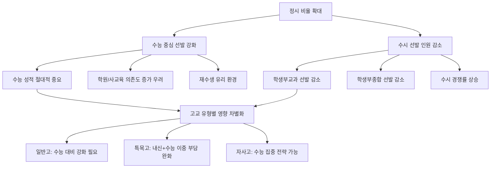

### 6-3. 정시 vs 수시 전략 비교

| 전략 요소 | 수시 중심 전략 | 정시 중심 전략 | 병행 전략 |
|----------|-------------|-------------|----------|
| **내신 관리** | 최우선 | 최소 유지 | 균형 유지 |
| **수능 준비** | 최저등급 충족 수준 | 최고 등급 목표 | 상위 등급 목표 |
| **비교과 활동** | 적극적 참여 | 최소 참여 | 선택적 참여 |
| **세특 관리** | 매우 중요 | 중요도 낮음 | 적정 수준 유지 |
| **학원 의존도** | 낮음~보통 | 높음 | 보통 |
| **적합 학생 유형** | 내신 관리 우수 + 활동 적극적 | 시험 능력 우수 | 두루 균형 잡힌 학생 |
| **리스크** | 수능 최저 미충족 | 내신 부족 시 수시 활용 불가 | 시간 분산 리스크 |

### 6-4. 학교 유형별 정시/수시 전략 적합도

| 학교 유형 | 수시 적합도 | 정시 적합도 | 추천 전략 |
|----------|-----------|-----------|----------|
| **일반고 (상위권 지역)** | 중간 | 높음 | 정시 중심 + 수시 병행 |
| **일반고 (중하위권 지역)** | 높음 | 중간 | 수시 중심 |
| **자사고** | 중간 (내신 불리) | 매우 높음 | 정시 중심 |
| **외고** | 높음 (특성 살림) | 중간 | 수시 중심 (인문계열) |
| **과학고** | 매우 높음 (과학 특기) | 해당 적음 | 수시 (과학특기자) |
| **국제고** | 높음 (글로벌 역량) | 중간 | 수시 중심 |
| **자율형 공립고** | 높음 | 높음 | 수시/정시 병행 |

---

## 7. 의대/약대/치대 입시 변화

### 7-1. 의대 정원 증원 현황

| 항목 | 기존 | 2025학년도~ | 2028학년도 예상 |
|------|------|-----------|---------------|
| **의대 정원** | 약 3,058명 | 약 4,567명 (+1,509명) | 약 5,000명 이상 (추가 증원 논의) |
| **약대 정원** | 약 1,700명 | 약 1,800명 | 약 2,000명 내외 |
| **치대 정원** | 약 630명 | 약 650명 | 약 700명 내외 |
| **한의대 정원** | 약 750명 | 약 750명 | 유지 예상 |

### 7-2. 의약학 계열 입시 경쟁률 변화 예상

| 전형 유형 | 2025학년도 경쟁률 | 2028학년도 예상 경쟁률 | 변화 방향 |
|----------|----------------|--------------------|---------| 
| **수시 학생부교과** | 15~25:1 | 12~20:1 | 소폭 하락 |
| **수시 학생부종합** | 20~40:1 | 15~30:1 | 하락 |
| **수시 논술** | 50~100:1 | 40~80:1 | 하락 |
| **정시 수능** | 5~10:1 | 4~8:1 | 하락 |

### 7-3. 의대 증원이 입시 지형에 미치는 영향

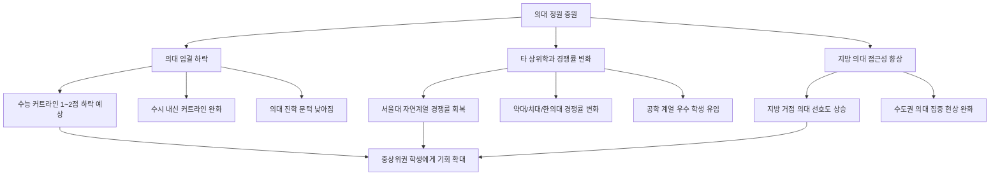

### 7-4. 의약학 계열 지원 전략

| 전략 항목 | 수시 지원 전략 | 정시 지원 전략 |
|----------|-------------|-------------|
| **내신 목표** | A등급 (90점 이상) 전과목 | B등급 이상 유지 |
| **수능 목표** | 최저등급 충족 (주로 3합 4~5) | 전영역 1~2등급 |
| **선택과목** | 생명과학II, 화학II 필수 | 과학탐구 고득점 과목 |
| **비교과** | 의학 관련 탐구 활동 필수 | 최소한의 활동 |
| **면접 준비** | MMI 면접 대비 필수 | 해당 없음 (일부 대학 제외) |
| **추천 학교** | 과학고, 자사고, 상위 일반고 | 재수학원, 반수 포함 |

### 7-5. 의대/약대/치대 과목 선택 가이드

| 과목군 | 필수 추천 과목 | 권장 추천 과목 | 선택하면 좋은 과목 |
|-------|-------------|-------------|----------------|
| **수학** | 미적분, 확률과통계 | 기하 | 경제수학 |
| **과학** | 생명과학I/II, 화학I/II | 물리학I | 고급생명과학, 고급화학 |
| **국어** | 독서, 문학 | 화법과작문 | 심화국어 |
| **사회** | 생활과윤리 | 사회문화 | 보건학 관련 |
| **기타** | 보건, 심리학 | 논리학 | 생명윤리, 과학사 |

---

## 8. 중학생이 지금 해야 할 대비 전략

### 8-1. 학년별 핵심 과제

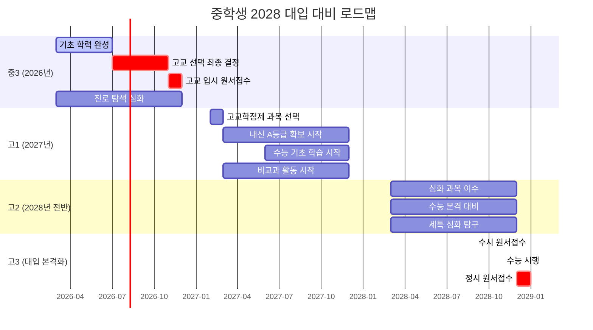

### 8-2. 현재 중3 학생의 즉시 실행 과제

| 우선순위 | 실행 과제 | 구체적 방법 | 완료 시기 |
|---------|----------|-----------|----------|
| 1 | **고교 유형 결정** | 일반고/자사고/외고/과학고 중 선택 | 2026년 8월까지 |
| 2 | **진로 방향 설정** | 관심 분야 3개 이내로 좁히기 | 2026년 9월까지 |
| 3 | **수학 선행 점검** | 고1 수학 범위 예습 상태 확인 | 2026년 12월까지 |
| 4 | **영어 기초 완성** | 수능 영어 1등급 기초 체력 만들기 | 2026년 12월까지 |
| 5 | **독서 습관 형성** | 주 1권 이상, 다양한 분야 독서 | 지속 |
| 6 | **학습 습관 점검** | 자기주도 학습 시간 확보 | 즉시 |
| 7 | **정보 수집** | 2028 대입 변화 사항 파악 | 지속 |

### 8-3. 고교 선택 의사결정 프로세스

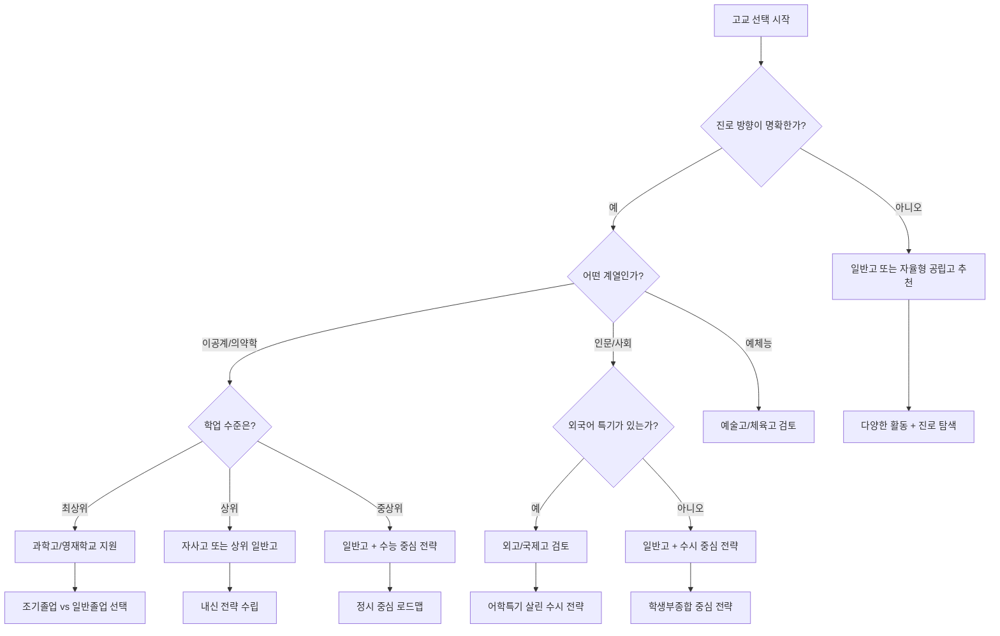

### 8-4. 과목별 중학교 때 갖춰야 할 기초

| 과목 | 고교 학습에 필수인 중학 개념 | 자가 점검 방법 | 보강 방법 |
|------|--------------------------|-------------|----------|
| **국어** | 비문학 독해, 문법 기초, 문학 감상 | 모의고사 비문학 지문 풀기 | 신문 사설 요약 연습 |
| **수학** | 함수, 방정식, 부등식, 기하 | 고1 수학 예비 문제집 풀기 | 개념서 반복 학습 |
| **영어** | 문법 체계, 독해력, 어휘력 | 수능 영어 기출 읽기 | 영어 원서 읽기 시작 |
| **과학** | 물리/화학/생물/지구과학 기초 | 중학 과학 종합 시험 | 과학 다큐멘터리 시청 |
| **사회** | 한국사 기초, 사회 기본 개념 | 한국사능력검정시험 도전 | 시사 뉴스 관심 |

### 8-5. 자기주도학습 역량 체크리스트

| 역량 영역 | 체크 항목 | 현재 수준 평가 기준 |
|----------|----------|------------------|
| **시간 관리** | 일일 학습 계획을 세우고 실행하는가? | 상: 매일 실행 / 중: 주 3회 / 하: 거의 안함 |
| **목표 설정** | 단기/중기/장기 학습 목표가 있는가? | 상: 구체적 목표 있음 / 중: 막연한 목표 / 하: 없음 |
| **집중력** | 연속 집중 학습이 가능한 시간은? | 상: 90분 이상 / 중: 60분 / 하: 30분 미만 |
| **복습 습관** | 정기적으로 복습하는가? | 상: 당일+주간 복습 / 중: 시험 전 / 하: 안함 |
| **노트 정리** | 효과적인 노트 정리를 하는가? | 상: 체계적 정리 / 중: 필기 수준 / 하: 안함 |
| **질문 능력** | 모르는 것을 질문하는가? | 상: 적극적 질문 / 중: 가끔 / 하: 안함 |
| **자기 평가** | 자신의 학습 상태를 객관적으로 파악하는가? | 상: 정확한 파악 / 중: 대략적 / 하: 모름 |

---

## 9. 학교 유형별 2028 대입 유불리 분석

### 9-1. 학교 유형별 종합 비교

| 평가 항목 | 일반고 | 자사고 | 외고 | 국제고 | 과학고 | 자율형공립고 |
|----------|-------|-------|------|-------|-------|-----------|
| **내신 유리도** | 보통→유리 | 불리→유리 | 불리→유리 | 불리→유리 | 해당없음 | 보통→유리 |
| **수능 대비** | 보통 | 우수 | 보통 | 보통 | 우수 | 보통 |
| **세특 풍부도** | 보통 | 우수 | 우수 | 우수 | 매우 우수 | 우수 |
| **과목 선택 폭** | 좁음 | 넓음 | 특화 | 특화 | 특화 | 넓음 |
| **비교과 활동** | 보통 | 풍부 | 풍부 | 매우 풍부 | 매우 풍부 | 풍부 |
| **교사 역량** | 편차 큼 | 우수 | 우수 | 우수 | 매우 우수 | 우수 |
| **학습 분위기** | 편차 큼 | 우수 | 우수 | 우수 | 매우 우수 | 우수 |
| **종합 유불리** | 개선 | 크게 개선 | 개선 | 개선 | 유지 | 개선 |

### 9-2. 학교 유형별 2028 입시 전략

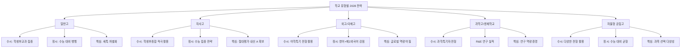

### 9-3. 일반고 학생을 위한 상세 전략

| 전략 영역 | 구체적 실행 방안 | 기대 효과 |
|----------|---------------|----------|
| **내신 관리** | 성취평가제 A등급 목표, 전과목 90점 이상 유지 | 수시 지원 자격 확보 |
| **세특 강화** | 매 과목 1개 이상 심화 탐구 수행 | 학생부종합 경쟁력 확보 |
| **수능 대비** | 고1부터 주당 10시간 이상 수능 학습 | 정시 대비 및 수시 최저 충족 |
| **비교과 활동** | 교내 대회, 동아리, 봉사 적극 참여 | 학생부 풍성화 |
| **진로 탐색** | 진로 관련 독서, 체험, 멘토링 | 진로 일관성 확보 |
| **학원 활용** | 취약 과목 중심 선별적 사교육 | 효율적 학습 보완 |

### 9-4. 자사고 학생을 위한 상세 전략

| 전략 영역 | 구체적 실행 방안 | 기대 효과 |
|----------|---------------|----------|
| **내신 관리** | 절대평가 전환으로 A등급 대량 배출 가능, 확실한 A 확보 | 수시 내신 약점 해소 |
| **학생부종합** | 풍부한 교내 프로그램 적극 활용 | 종합전형 경쟁력 극대화 |
| **수능 집중** | 학교 내 수능 대비 프로그램 + 자기주도 학습 | 정시 상위권 진입 |
| **연구 활동** | 자사고 특유의 심화 프로그램 참여 | 세특 차별화 |
| **멘토링** | 선배 네트워크 활용한 입시 정보 수집 | 전략적 지원 |

### 9-5. 외고/국제고 학생을 위한 상세 전략

| 전략 영역 | 구체적 실행 방안 | 기대 효과 |
|----------|---------------|----------|
| **어학 역량** | 전공 외국어 심화 학습 + 공인 인증 | 어학특기 전형 활용 |
| **글로벌 활동** | 국제 교류, MUN, 글로벌 이슈 탐구 | 국제계열 학과 지원 강점 |
| **인문학 탐구** | 외국 문학, 역사, 철학 심화 학습 | 인문계 학생부종합 경쟁력 |
| **수능 영어/제2외** | 영어 1등급 + 제2외국어 고득점 | 정시 가산점 확보 |
| **계열 전환 대비** | 인문→경영/경제 등 취업 유망 학과 검토 | 진로 유연성 확보 |

### 9-6. 과학고/영재학교 학생을 위한 상세 전략

| 전략 영역 | 구체적 실행 방안 | 기대 효과 |
|----------|---------------|----------|
| **R&E 연구** | 교수 지도 하에 연구 수행, 논문 작성 | 과학특기자 전형 핵심 |
| **올림피아드** | 수학/과학 올림피아드 참가 | 특기자 전형 실적 |
| **조기졸업 vs 정규졸업** | 진로에 따라 선택 (의대 지원 시 정규졸업 유리) | 입시 전략 최적화 |
| **AP/심화과목** | 대학 수준 과목 이수 | 학업 역량 증명 |
| **포트폴리오** | 연구 실적, 수상, 프로젝트 체계적 정리 | 종합전형 서류 강화 |

### 9-7. 학교 유형별 2028 대입 유불리 변화 요약

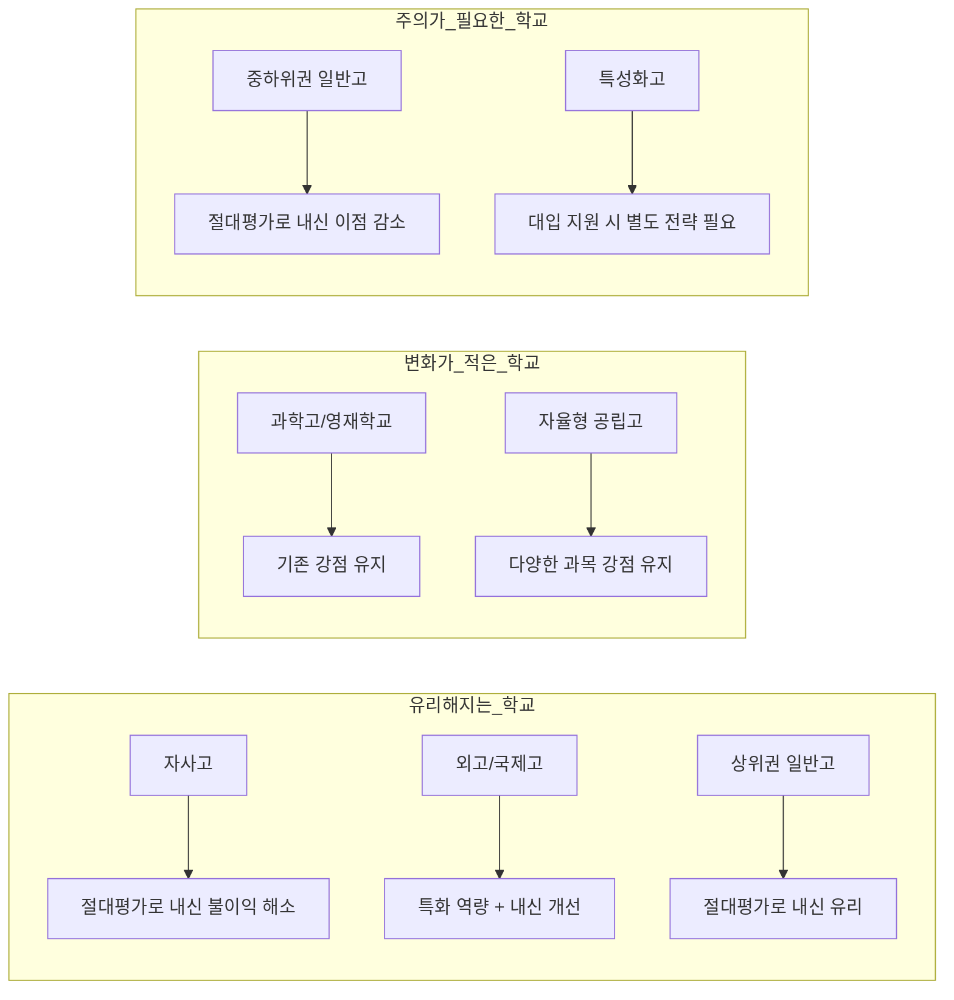

---

## 10. 종합 실행 계획

### 10-1. 학년별 월간 실행 로드맵

**현재 중3 (2026년 하반기)**

| 월 | 핵심 과제 | 세부 활동 | 체크포인트 |
|----|----------|----------|-----------|
| 7월 | 진로 방향 정리 | 관심 분야 탐색, 직업 조사 | 진로 희망 3순위 작성 |
| 8월 | 고교 유형 결정 | 학교 설명회 참석, 재학생 후기 조사 | 지원 학교 리스트 확정 |
| 9월 | 입시 준비 시작 | 자기소개서(고입용) 작성, 내신 관리 | 자소서 초안 완성 |
| 10월 | 고교 입시 준비 | 원서 작성, 면접 준비 | 원서 제출 완료 |
| 11월 | 고교 입시 마무리 | 면접 대비, 합격 후 준비 | 합격 발표 확인 |
| 12월 | 고교 진학 준비 | 고1 선행 학습, 과목 선택 계획 | 학습 계획서 작성 |

**고1 (2027년)**

| 월 | 핵심 과제 | 세부 활동 | 체크포인트 |
|----|----------|----------|-----------|
| 1~2월 | 입학 전 준비 | 고교학점제 과목 선택, 고1 수학 예습 | 수강 신청 완료 |
| 3~4월 | 학교 적응 | 내신 A등급 목표, 동아리 가입 | 1차 지필 평가 대비 |
| 5~6월 | 중간고사 대비 | 전과목 90점 이상 목표 | 중간고사 결과 분석 |
| 7~8월 | 여름 방학 활용 | 수능 기초 학습, 독서, 탐구 활동 | 탐구 보고서 1편 작성 |
| 9~10월 | 기말고사 대비 | 내신 관리, 비교과 활동 정리 | 기말고사 결과 분석 |
| 11~12월 | 1학년 마무리 | 학생부 기록 확인, 2학년 과목 선택 | 1학년 학생부 점검 |

**고2 (2028년)**

| 월 | 핵심 과제 | 세부 활동 | 체크포인트 |
|----|----------|----------|-----------|
| 1~2월 | 2학년 준비 | 심화 과목 수강 계획, 수능 모의고사 분석 | 수강 신청 완료 |
| 3~4월 | 심화 학습 시작 | 진로 관련 심화 탐구, 내신 관리 | 탐구 주제 선정 |
| 5~6월 | 중간고사 + 수능 대비 | 내신과 수능 병행 학습 | 6월 모의평가 분석 |
| 7~8월 | 여름 방학 집중 | 수능 취약 영역 보강, 세특 활동 | 심화 탐구 보고서 완성 |
| 9~10월 | 기말고사 + 수시 준비 | 내신 마무리, 지원 대학 리스트 작성 | 9월 모의평가 분석 |
| 11~12월 | 수시 지원 준비 | 학생부 최종 점검, 면접 준비 시작 | 지원 전략 확정 |

### 10-2. 입시 전략 수립 체크리스트

| 단계 | 체크 항목 | 완료 여부 확인 |
|------|----------|-------------|
| **1단계: 자기 분석** | 학업 수준 객관적 파악 | 모의고사 성적, 내신 등급 기록 |
| | 강점/약점 과목 분석 | 과목별 성취도 표 작성 |
| | 진로 희망 분야 확정 | 구체적 학과명까지 결정 |
| | 학습 스타일 파악 | 자기주도 vs 사교육 의존도 체크 |
| **2단계: 정보 수집** | 2028 대입 개편 내용 숙지 | 교육부 발표 자료 확인 |
| | 관심 대학 입시 요강 분석 | 최근 3개년 입시 결과 조사 |
| | 전형별 특징 파악 | 학생부교과/종합/정시 비교 |
| | 학교별 개설 과목 확인 | 교육과정 편성표 입수 |
| **3단계: 전략 수립** | 수시 vs 정시 비중 결정 | 내신/수능 성적 기반 판단 |
| | 지원 대학 6개교 리스트 작성 | 상향/적정/안정 2개씩 |
| | 과목 선택 계획 수립 | 진로 연계 과목 매핑 |
| | 비교과 활동 계획 수립 | 학기별 활동 계획서 작성 |
| **4단계: 실행** | 일일/주간/월간 학습 계획 수립 | 플래너 활용 |
| | 정기적 성적 분석 및 전략 수정 | 매 시험 후 분석 |
| | 멘토/입시 상담 활용 | 학기당 1회 이상 상담 |

### 10-3. 2028 대입 핵심 키워드 마인드맵

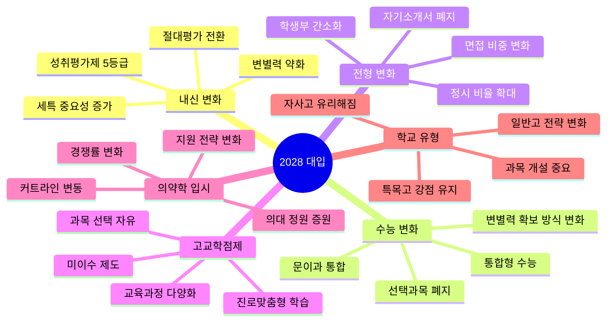

### 10-4. 최종 정리: 2028 입시에서 성공하기 위한 10가지 원칙

1. **내신은 절대평가 A등급이 기본**: 성취평가제에서 90점 이상 확보가 최우선
2. **수능 통합형에 대비하라**: 선택과목 없이 전범위 학습 필수
3. **세특이 자소서를 대체한다**: 교과 연계 심화 탐구 활동에 집중
4. **과목 선택이 곧 전략이다**: 진로와 연계된 과목 선택이 대학 평가의 핵심
5. **정시 비중 확대에 대응하라**: 수능 대비를 소홀히 하지 말 것
6. **진로 일관성을 보여라**: 학년별로 심화되는 탐구 과정이 중요
7. **의대 증원은 기회다**: 의약학 진학 문턱이 낮아지는 시기 활용
8. **학교 유형에 맞는 전략**: 자사고/외고는 절대평가 전환을 기회로 활용
9. **자기주도학습 역량이 핵심**: 고교학점제 시대에는 스스로 학습 설계 능력 필수
10. **정보력이 경쟁력**: 대입 제도 변화를 지속적으로 모니터링

---

### 부록: 핵심 용어 정리

| 용어 | 설명 |
|------|------|
| **성취평가제** | 절대 기준(90/80/70/60점)에 따라 A-B-C-D-E 등급을 부여하는 평가 방식 |
| **고교학점제** | 학생이 과목을 선택하여 이수하고, 일정 학점 취득 시 졸업하는 제도 |
| **세특 (세부능력 및 특기사항)** | 학생부에 교사가 기록하는 학생의 교과별 학습 활동 및 성취 서술 |
| **학생부종합전형** | 학생부를 중심으로 학생의 역량을 종합적으로 평가하는 수시 전형 |
| **학생부교과전형** | 내신 성적을 주요 평가 요소로 하는 수시 전형 |
| **정시 수능위주전형** | 수능 성적을 주요 평가 요소로 선발하는 전형 |
| **통합형 수능** | 문과/이과 구분 없이 모든 수험생이 동일 시험을 치르는 방식 |
| **블라인드 평가** | 학생의 인적 사항(이름, 출신 학교 등)을 가린 채 평가하는 방식 |
| **미이수 제도** | 성취율 40% 미달 시 해당 과목을 이수하지 못한 것으로 처리하는 제도 |
| **R&E (Research and Education)** | 과학고/영재학교에서 수행하는 연구 중심 교육 프로그램 |
| **MMI (Multiple Mini Interview)** | 의대 면접에서 사용하는 다중 미니 면접 방식 |
| **EBS 연계** | 수능 출제 시 EBS 교재의 내용과 연계하여 출제하는 방식 |

---

> **면책 조항**: 이 문서는 2026년 7월 기준 공개된 정보를 바탕으로 작성되었습니다. 2028학년도 대입 제도는 교육부 정책에 따라 변경될 수 있으므로, 최신 정보는 교육부 및 각 대학교 입학처 공식 발표를 확인하시기 바랍니다.
