# 일반 루트 입시 전략 맵

> 중학생이 가장 많이 선택하는 4가지 일반 루트를 체계적으로 분석합니다.
> 각 루트별 적합한 학생 유형, 준비 타임라인, 핵심 전략, 위험 요소를 상세히 다룹니다.

---

## 전체 루트 구조 개요

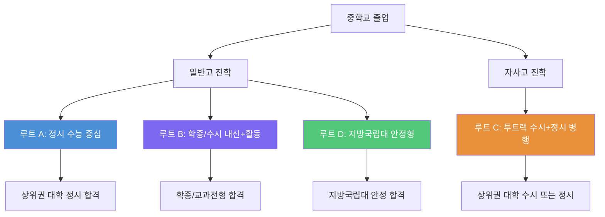

---

## 4가지 루트 한눈에 비교

| 비교 항목 | 루트 A: 정시 중심 | 루트 B: 학종/수시 | 루트 C: 자사고 투트랙 | 루트 D: 안정형 |
|:---:|:---:|:---:|:---:|:---:|
| **목표 대학** | SKY, 상위 10개 대학 | 상위 15개 대학 | SKY, 의대 등 최상위 | 지방거점국립대 |
| **핵심 무기** | 수능 성적 | 내신 + 비교과 활동 | 내신 + 수능 병행 | 내신 + 지역 전형 |
| **내신 중요도** | 중간 | 매우 높음 | 높음 | 높음 |
| **수능 중요도** | 매우 높음 | 낮음~중간 | 높음 | 중간 |
| **활동 중요도** | 낮음 | 매우 높음 | 높음 | 중간 |
| **스트레스 수준** | 높음 | 중간~높음 | 매우 높음 | 중간 |
| **비용 부담** | 사교육비 높음 | 중간 | 높음 (학비+사교육) | 낮음~중간 |
| **리스크 수준** | 높음 (수능 당일) | 중간 | 높음 | 낮음 |
| **적합 성격** | 집중력, 독립성 | 성실함, 다재다능 | 체력, 멀티태스킹 | 안정 추구형 |
| **난이도** | ★★★★☆ | ★★★☆☆ | ★★★★★ | ★★☆☆☆ |

---

## 루트 선택 의사결정 플로우

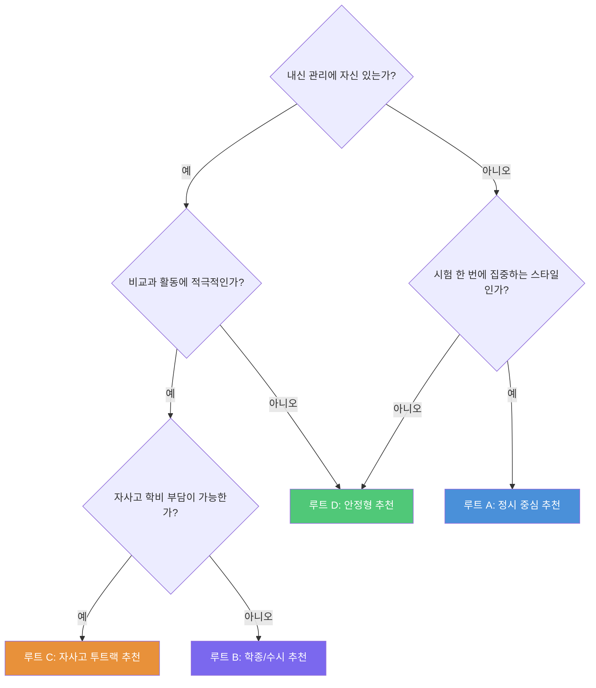

---

---

# 루트 A: 일반고 → 정시 (수능 중심)

## 루트 A 핵심 요약

> **한 줄 정리:** 고등학교 3년 동안 수능에 올인하여 정시로 상위권 대학에 진학하는 전략

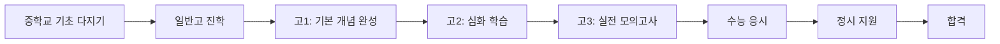

## 적합한 학생 유형

- **장시간 혼자 공부하는 것에 강한 학생**
- 내신 시험보다 수능형 문제에서 실력이 잘 드러나는 학생
- 학교 활동(동아리, 봉사 등)보다 교과 학습에 집중하고 싶은 학생
- 시험 한 번의 결과로 승부를 보는 것에 부담보다 동기부여를 느끼는 학생
- 킬러 문항 등 고난도 문제 풀이에 흥미를 느끼는 학생
- 자기주도학습 습관이 잘 잡혀 있는 학생

### 적합도 자가진단 체크리스트

| 번호 | 질문 | 예 | 아니오 |
|:---:|:---|:---:|:---:|
| 1 | 혼자 공부할 때 집중이 더 잘 된다 | ☐ | ☐ |
| 2 | 학교 내신 시험보다 전국 모의고사 성적이 더 좋다 | ☐ | ☐ |
| 3 | 장기 목표를 위해 꾸준히 노력할 수 있다 | ☐ | ☐ |
| 4 | 동아리, 대회 참가보다 문제 풀이가 더 재미있다 | ☐ | ☐ |
| 5 | 고난도 문제를 풀 때 성취감을 느낀다 | ☐ | ☐ |
| 6 | 하루 6시간 이상 자기주도학습이 가능하다 | ☐ | ☐ |
| 7 | 시험 당일 긴장을 잘 통제할 수 있다 | ☐ | ☐ |
| 8 | 수학, 과학, 영어 중 2과목 이상에 자신이 있다 | ☐ | ☐ |

**결과 해석:**
- 6개 이상 "예": 루트 A 매우 적합
- 4~5개 "예": 루트 A 가능, 보완 필요
- 3개 이하 "예": 다른 루트 검토 권장

## 중1~중3 준비 타임라인

### 중1 (기초 확립기)

| 월 | 학습 목표 | 구체적 실행 사항 | 체크 |
|:---:|:---|:---|:---:|
| 3~4월 | 중학 수학 기초 완성 | 정수, 유리수, 방정식 기본 개념 확실히 다지기 | ☐ |
| 5~6월 | 영어 기본기 강화 | 기본 문법 정리, 영단어 1000개 암기 시작 | ☐ |
| 7~8월 | 여름방학 선행학습 | 중2 수학 선행, 영어 독해 기초 | ☐ |
| 9~10월 | 국어 독해력 기르기 | 비문학 지문 읽기 훈련, 어휘력 확장 | ☐ |
| 11~12월 | 1학년 총정리 | 전 과목 복습, 약점 과목 보충 | ☐ |
| 1~2월 | 겨울방학 집중 학습 | 중2 전 범위 선행, 학습 습관 점검 | ☐ |

### 중2 (실력 확장기)

| 월 | 학습 목표 | 구체적 실행 사항 | 체크 |
|:---:|:---|:---|:---:|
| 3~4월 | 수학 심화 학습 | 함수, 부등식 심화 문제 풀이 | ☐ |
| 5~6월 | 영어 독해 확장 | 수능형 영어 지문 접하기 시작 | ☐ |
| 7~8월 | 여름방학 도약 | 중3 수학 선행, 영어 모의고사 체험 | ☐ |
| 9~10월 | 과학 기초 확립 | 물리/화학/생물/지구과학 기본 개념 정리 | ☐ |
| 11~12월 | 자기주도학습 루틴 확립 | 하루 학습 시간표 작성, 오답 노트 습관화 | ☐ |
| 1~2월 | 겨울방학 총력전 | 고등 수학(상) 선행, 국어 비문학 훈련 | ☐ |

### 중3 (전략 수립기)

| 월 | 학습 목표 | 구체적 실행 사항 | 체크 |
|:---:|:---|:---|:---:|
| 3~4월 | 고등 선행 본격화 | 수학(상)(하) 완성, 영어 절대평가 대비 | ☐ |
| 5~6월 | 모의고사 체험 | 고1 3월/6월 모의고사 기출 풀어보기 | ☐ |
| 7~8월 | 여름방학 결전 | 수학 I 선행, 국어 문학 기초 | ☐ |
| 9~10월 | 일반고 선택 전략 | 수능 강점 학교 리서치, 학교별 분위기 파악 | ☐ |
| 11~12월 | 고교 진학 준비 | 입학 전 학습 계획 수립 | ☐ |
| 1~2월 | 고등 입학 전 총정리 | 수학 II 선행 시작, EBS 교재 파악 | ☐ |

## 핵심 전략 3가지

### 전략 1: 수학을 최우선 과목으로 확보

수능에서 수학은 가장 변별력이 큰 과목이다. 정시에서 수학의 배점 비중은 대부분 대학에서 35~40%를 차지한다.

**실행 방안:**
1. 중학교 때부터 수학 선행학습을 꾸준히 진행
2. 단순 연산보다 **사고력 문제**에 비중을 둘 것
3. 고등학교 진학 전에 최소 수학(상)(하) 완성 목표
4. 매일 수학 학습 시간 최소 2시간 확보
5. 틀린 문제는 반드시 3회 이상 복습

**수학 학습 단계:**

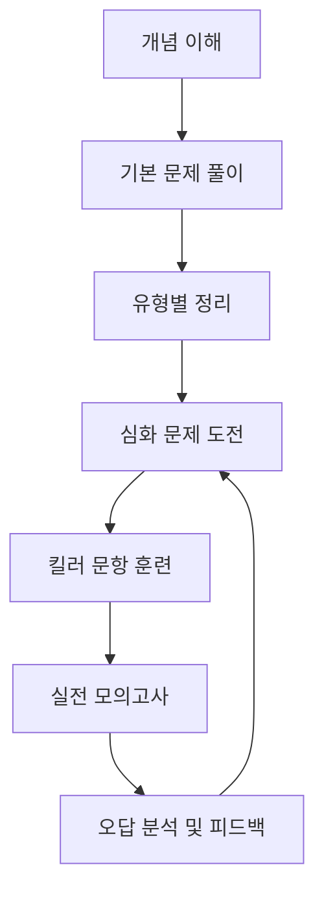

### 전략 2: 국어 비문학 독해력 조기 확보

수능 국어는 갈수록 어려워지고 있으며, 비문학(독서) 영역의 변별력이 매우 크다.

**실행 방안:**
1. 중학교 때부터 신문 사설, 과학 잡지 등 다양한 글 읽기
2. 독해 시 **핵심 논지 파악** 훈련 반복
3. EBS 연계 교재 미리 살펴보기
4. 문학 작품 기본 목록 정리 및 감상
5. 어휘력을 꾸준히 확장 (한자어, 전문 용어 포함)

### 전략 3: 영어 절대평가 1등급 조기 확정

영어는 절대평가이므로 1등급(90점 이상)을 빠르게 확정하고 다른 과목에 시간을 투자해야 한다.

**실행 방안:**
1. 중3까지 영어 기본 문법 완전 정복
2. 영어 어휘 3000개 이상 암기
3. 수능 영어 듣기는 고1 때 완벽하게 마무리
4. EBS 영어 교재 3회독 이상 반복
5. 영어는 매일 30분~1시간으로 유지 관리

## 위험 요소와 대비책

| 위험 요소 | 발생 확률 | 영향도 | 대비책 |
|:---|:---:|:---:|:---|
| 수능 당일 컨디션 난조 | 중간 | 매우 높음 | 모의고사를 실제 시험처럼 연습, 수면 패턴 관리 |
| 수학 킬러 문항 난이도 급등 | 높음 | 높음 | 킬러 문항 외 나머지 문제 만점 전략 병행 |
| 내신 GPA 급락으로 수시 백업 불가 | 중간 | 중간 | 최소 3~4등급 유지로 수시 안전망 확보 |
| 학습 번아웃 | 높음 | 높음 | 주 1회 완전 휴식일 설정, 운동 병행 |
| 선행학습 부담으로 기초 부실 | 중간 | 높음 | 선행보다 현행 완벽 이해 우선 |
| 사교육비 과다 지출 | 중간 | 중간 | 인강 활용, 자기주도학습 비중 높이기 |
| 수능 제도 변경 | 낮음 | 매우 높음 | 교육부 발표 정기 확인, 유연한 전략 수정 |

## 성공/실패 시나리오

### 성공 시나리오: "수능 1등급으로 SKY 합격"

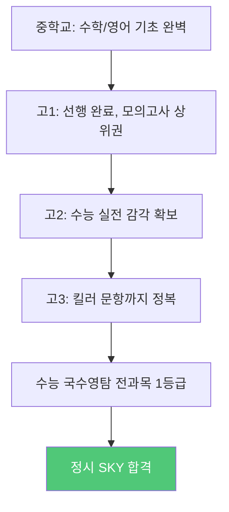

**성공 핵심 요인:**
- 중학교 때부터 꾸준한 자기주도학습 습관
- 수학 선행이 탄탄했음
- 고3 때 수능 집중 환경 조성
- 멘탈 관리 철저

### 실패 시나리오: "수능 당일 실수로 목표 하향"

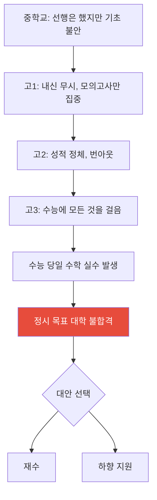

**실패 방지 포인트:**
- 내신을 완전히 버리면 수시 백업이 불가능해짐
- 기초 없이 선행만 하면 고2~3에서 무너짐
- 수능 한 번에 모든 것을 걸면 리스크가 너무 큼

---

---

# 루트 B: 일반고 → 학종/수시 (내신+활동 중심)

## 루트 B 핵심 요약

> **한 줄 정리:** 학교 내신 관리와 비교과 활동을 통해 학생부종합전형(학종) 또는 교과전형으로 대학에 진학하는 전략

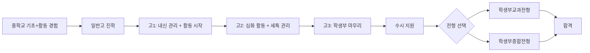

## 적합한 학생 유형

- **학교 시험에서 안정적으로 좋은 성적을 유지하는 학생**
- 수업 시간에 적극적으로 참여하고 발표하는 것을 좋아하는 학생
- 동아리, 봉사, 독서 등 다양한 활동에 관심이 많은 학생
- 자신의 진로에 대한 스토리를 만들어갈 수 있는 학생
- 꾸준하고 성실한 성격의 학생
- 선생님과의 소통이 원활한 학생

### 적합도 자가진단 체크리스트

| 번호 | 질문 | 예 | 아니오 |
|:---:|:---|:---:|:---:|
| 1 | 학교 내신 시험에서 꾸준히 상위권을 유지한다 | ☐ | ☐ |
| 2 | 수업 시간에 질문하거나 발표하는 것이 자연스럽다 | ☐ | ☐ |
| 3 | 동아리 활동이나 학교 행사에 적극적으로 참여한다 | ☐ | ☐ |
| 4 | 장래 희망이나 관심 분야가 비교적 뚜렷하다 | ☐ | ☐ |
| 5 | 독서를 즐기고 독후감 등 글쓰기를 잘한다 | ☐ | ☐ |
| 6 | 조별 활동에서 리더십을 발휘한 경험이 있다 | ☐ | ☐ |
| 7 | 매 시험 평균적으로 좋은 성적을 받는다 | ☐ | ☐ |
| 8 | 봉사활동이나 탐구활동에 시간 투자를 할 의향이 있다 | ☐ | ☐ |

**결과 해석:**
- 6개 이상 "예": 루트 B 매우 적합
- 4~5개 "예": 루트 B 가능, 활동 역량 보완 필요
- 3개 이하 "예": 다른 루트 검토 권장

## 중1~중3 준비 타임라인

### 중1 (탐색 및 기초기)

| 월 | 학습/활동 목표 | 구체적 실행 사항 | 체크 |
|:---:|:---|:---|:---:|
| 3~4월 | 학교 적응 및 학습 습관 형성 | 매일 예습/복습 루틴 만들기, 수업 노트 정리법 익히기 | ☐ |
| 5~6월 | 첫 중간고사 대비 | 시험 2주 전부터 체계적 준비, 암기 과목 전략 수립 | ☐ |
| 7~8월 | 여름방학 활동 탐색 | 관심 분야 독서 5권 이상, 봉사활동 시작 | ☐ |
| 9~10월 | 동아리 활동 참여 | 학교 동아리 가입, 외부 체험 활동 참여 | ☐ |
| 11~12월 | 1학년 성적 분석 | 강점/약점 과목 파악, 2학년 전략 수립 | ☐ |
| 1~2월 | 겨울방학 역량 강화 | 독서 포트폴리오 시작, 자기소개 글쓰기 연습 | ☐ |

### 중2 (방향 설정기)

| 월 | 학습/활동 목표 | 구체적 실행 사항 | 체크 |
|:---:|:---|:---|:---:|
| 3~4월 | 진로 탐색 본격화 | 커리어넷 진로검사, 직업 체험 참여 | ☐ |
| 5~6월 | 내신 관리 강화 | 전 과목 상위 20% 이내 목표, 오답 정리 습관화 | ☐ |
| 7~8월 | 여름방학 심화 활동 | 관심 분야 탐구 보고서 작성, 자유학기 발표 준비 | ☐ |
| 9~10월 | 리더십 경험 쌓기 | 학급 임원, 동아리 부장 등 도전 | ☐ |
| 11~12월 | 학생부 초안 점검 | 지금까지 활동 정리, 부족한 영역 파악 | ☐ |
| 1~2월 | 겨울방학 집중 보강 | 약점 과목 집중 보충, 고등 내신 전략 연구 | ☐ |

### 중3 (전략 확정기)

| 월 | 학습/활동 목표 | 구체적 실행 사항 | 체크 |
|:---:|:---|:---|:---:|
| 3~4월 | 고등 내신 대비 학습법 정립 | 일반고 내신 시험 특성 파악, 선배 조언 수집 | ☐ |
| 5~6월 | 활동 포트폴리오 정리 | 중학교 활동 총정리, 고교에서 이어갈 활동 계획 | ☐ |
| 7~8월 | 여름방학 전략 수립 | 고등 전 과목 예습, 세특(세부능력특기사항) 전략 연구 | ☐ |
| 9~10월 | 일반고 선택 | 내신 유리한 학교 리서치, 교육과정 확인 | ☐ |
| 11~12월 | 고교 입학 전 준비 | 학생부종합전형 이해, 합격 사례 분석 | ☐ |
| 1~2월 | 고등 입학 직전 정비 | 고1 교과서 미리 읽기, 세특 작성 가이드 숙지 | ☐ |

## 핵심 전략 3가지

### 전략 1: 내신 1~2등급 확보가 최우선

학종/교과전형 모두 내신이 핵심이다. 일반고에서 전 과목 평균 1~2등급을 유지하는 것이 가장 중요하다.

**내신 관리 핵심 원칙:**

| 원칙 | 설명 | 실행 방법 |
|:---|:---|:---|
| 수업 시간 100% 활용 | 수업 중 필기와 이해를 동시에 | 선생님 말씀 그대로 필기, 교과서에 표시 |
| 시험 범위 교과서 3회독 | 교과서가 출제의 근본 | 1회독: 이해, 2회독: 암기, 3회독: 적용 |
| 학교 프린트 완벽 정복 | 선생님 자체 제작 문제가 출제됨 | 프린트 문제 반복 풀이, 유사 문제 만들기 |
| 기출문제 분석 | 선생님의 출제 패턴 파악 | 최근 3년 기출 분석, 출제 경향 정리 |
| 약점 과목 집중 투자 | 전 과목 고른 성적이 중요 | 약점 과목에 전체 학습 시간의 40% 배정 |

### 전략 2: 진로 연계 활동 스토리 만들기

학종에서는 단순 활동 나열이 아니라, 진로와 연결된 일관된 스토리가 중요하다.

**활동 스토리 구성 흐름:**

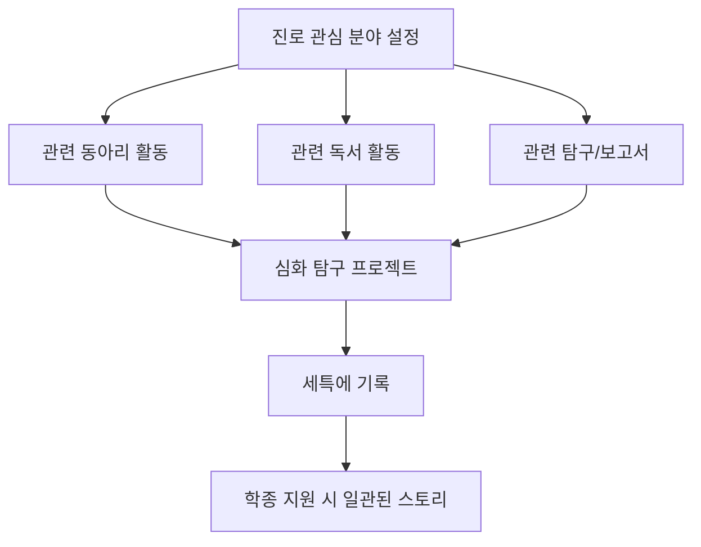

### 전략 3: 세특(세부능력특기사항) 전략적 관리

2024년 이후 학종에서 세특의 비중이 더욱 커졌다. 모든 과목에서 의미 있는 세특을 확보하는 것이 관건이다.

**세특 확보 전략:**
1. 수업 중 적극적으로 질문하고 발표하기
2. 수행평가에서 차별화된 주제 선택
3. 선생님께 추가 탐구 결과를 제출하여 기록 요청
4. 진로와 연계된 과목에서 특히 돋보이는 활동 수행
5. 보고서 작성 시 참고문헌 활용, 학술적 접근

## 위험 요소와 대비책

| 위험 요소 | 발생 확률 | 영향도 | 대비책 |
|:---|:---:|:---:|:---|
| 특정 과목 내신 급락 | 중간 | 매우 높음 | 모든 과목 균형 학습, 사전 대비 철저 |
| 같은 학교 내 경쟁 심화 | 높음 | 높음 | 학교 선택 시 내신 경쟁률 고려 |
| 비교과 활동 부족 | 중간 | 높음 | 중학교 때부터 활동 경험 축적 |
| 세특 기재 미흡 | 중간 | 높음 | 선생님과 소통, 활동 기록 습관화 |
| 학종 축소 트렌드 | 높음 | 중간 | 교과전형 병행 준비 |
| 면접 대비 부족 | 중간 | 중간 | 고3 여름부터 면접 연습 시작 |

## 성공/실패 시나리오

### 성공 시나리오: "내신 1등급 + 풍부한 세특으로 학종 합격"

**핵심 성공 요인:**
- 중학교 때부터 학교 활동에 적극 참여한 경험
- 고교 3년간 전 과목 내신 1.5등급 이내 유지
- 진로 방향과 일치하는 활동 스토리 완성
- 세특에서 탐구 역량을 인정받음

### 실패 시나리오: "내신은 좋지만 스토리가 없어 학종 불합격"

**실패 방지 포인트:**
- 내신만 좋다고 학종에 합격하는 것은 아님
- 활동의 양보다 **질과 일관성**이 중요
- 진로 방향이 자주 바뀌면 스토리가 약해짐

---

---

# 루트 C: 자사고 → 투트랙 (수시+정시 병행)

## 루트 C 핵심 요약

> **한 줄 정리:** 자율형사립고에 진학하여 우수한 교육 환경에서 수시와 정시를 동시에 준비하는 전략

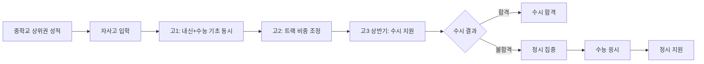

## 적합한 학생 유형

- **학업 능력이 전반적으로 뛰어나고 체력이 좋은 학생**
- 내신과 수능 모두에서 경쟁력이 있는 학생
- 경쟁이 치열한 환경에서 동기부여를 받는 학생
- 시간 관리 능력이 뛰어난 학생
- 가정의 경제적 지원이 가능한 학생 (자사고 학비 연 700~1000만 원)
- SKY 또는 의대 등 최상위 대학 목표가 명확한 학생

### 적합도 자가진단 체크리스트

| 번호 | 질문 | 예 | 아니오 |
|:---:|:---|:---:|:---:|
| 1 | 현재 전교 상위 5% 이내 성적을 유지한다 | ☐ | ☐ |
| 2 | 하루 8시간 이상 학습에 투자할 체력이 있다 | ☐ | ☐ |
| 3 | 경쟁이 치열한 환경에서 더 잘하는 편이다 | ☐ | ☐ |
| 4 | 여러 과목을 동시에 높은 수준으로 관리할 수 있다 | ☐ | ☐ |
| 5 | 가정에서 자사고 학비(연 700만 원 이상)를 부담할 수 있다 | ☐ | ☐ |
| 6 | 목표 대학이 SKY 또는 의대급이다 | ☐ | ☐ |
| 7 | 스트레스 관리에 자신이 있다 | ☐ | ☐ |
| 8 | 내신과 모의고사 성적 모두 상위권이다 | ☐ | ☐ |

## 중1~중3 준비 타임라인

### 중1 (기초 상위권 진입)

| 월 | 목표 | 실행 사항 | 체크 |
|:---:|:---|:---|:---:|
| 3~6월 | 전교 상위 5% 달성 | 전 과목 심화 학습, 내신 만점 도전 | ☐ |
| 7~8월 | 선행 + 심화 병행 | 중2 수학 선행, 영어 심화 | ☐ |
| 9~12월 | 학습 체력 확보 | 하루 6시간 자기주도학습 루틴 정착 | ☐ |
| 1~2월 | 겨울방학 집중 | 중2 전과정 선행 완료 | ☐ |

### 중2 (자사고 입시 대비 시작)

| 월 | 목표 | 실행 사항 | 체크 |
|:---:|:---|:---|:---:|
| 3~6월 | 내신 상위권 유지 + 활동 | 전교 1~3등 유지, 교내 대회 입상 | ☐ |
| 7~8월 | 자사고 입시 정보 수집 | 목표 자사고 리스트업, 입시 설명회 참석 | ☐ |
| 9~12월 | 자기소개서 소재 축적 | 의미 있는 활동 경험 정리, 독서 기록 | ☐ |
| 1~2월 | 자사고 입시 준비 본격화 | 자기소개서 초안 작성, 면접 연습 시작 | ☐ |

### 중3 (자사고 입시 결전)

| 월 | 목표 | 실행 사항 | 체크 |
|:---:|:---|:---|:---:|
| 3~6월 | 내신 최상위 유지 | 자사고 내신 반영 대비 최고 성적 | ☐ |
| 7~8월 | 자기소개서 완성 | 여러 차례 수정, 첨삭 받기 | ☐ |
| 9~10월 | 자사고 원서 접수 | 전략적 학교 선택, 지원 | ☐ |
| 11~12월 | 면접 준비 및 합격 발표 | 면접 실전 연습, 결과에 따른 대안 마련 | ☐ |
| 1~2월 | 고교 입학 전 준비 | 합격 시 고등 선행 전력 질주 | ☐ |

## 핵심 전략 3가지

### 전략 1: 내신과 모의고사 동시 관리 시스템 구축

자사고에서는 내신 경쟁이 치열하면서도 수능 대비를 소홀히 할 수 없다.

**시간 배분 전략:**

| 시기 | 내신 비중 | 수능 비중 | 비교과 비중 |
|:---:|:---:|:---:|:---:|
| 고1 1학기 | 50% | 30% | 20% |
| 고1 2학기 | 45% | 35% | 20% |
| 고2 1학기 | 40% | 40% | 20% |
| 고2 2학기 | 35% | 45% | 20% |
| 고3 1학기 | 30% | 50% | 20% |
| 고3 수시 이후 | 0% | 90% | 10% |

### 전략 2: 자사고 내신 불리함 극복

자사고는 우수한 학생들이 모여 있어 내신 경쟁이 매우 치열하다. 같은 실력이라도 일반고 대비 1~2등급 낮게 나올 수 있다.

**극복 방안:**
1. 자사고 내 등급 보정을 해주는 대학 파악
2. 교과전형보다 학종에서 자사고 경험이 유리한 대학 공략
3. 정시 백업을 반드시 준비하여 심리적 안정 확보
4. 자사고 특화 프로그램(해외 연수, 심화 수업) 적극 활용

### 전략 3: 수시 6장 카드 전략적 배분

수시 6개 지원 기회를 수시와 정시 투트랙에 맞게 전략적으로 배분해야 한다.

**수시 카드 배분 예시:**

| 카드 | 전형 | 대학 수준 | 전략 |
|:---:|:---|:---|:---|
| 1번 | 학종 | 상향 (SKY) | 도전 지원 |
| 2번 | 학종 | 상향 | 적정 상향 |
| 3번 | 학종 | 적정 | 안정 합격 목표 |
| 4번 | 교과 | 적정 | 내신 활용 안전판 |
| 5번 | 학종 | 적정~하향 | 안전 지원 |
| 6번 | 교과 | 안전 | 반드시 합격 보험 |

## 위험 요소와 대비책

| 위험 요소 | 발생 확률 | 영향도 | 대비책 |
|:---|:---:|:---:|:---|
| 자사고 내신 경쟁에서 밀림 | 높음 | 매우 높음 | 정시 백업 철저 준비 |
| 번아웃 및 정신건강 문제 | 높음 | 매우 높음 | 정기적 휴식, 상담 활용 |
| 수시 전멸 | 중간 | 높음 | 정시 전략 병행 필수 |
| 학비 부담 | 중간 | 중간 | 장학금 제도 적극 활용 |
| 자사고 폐지 정책 변동 | 낮음 | 높음 | 교육 정책 변화 모니터링 |

## 성공/실패 시나리오

### 성공 시나리오

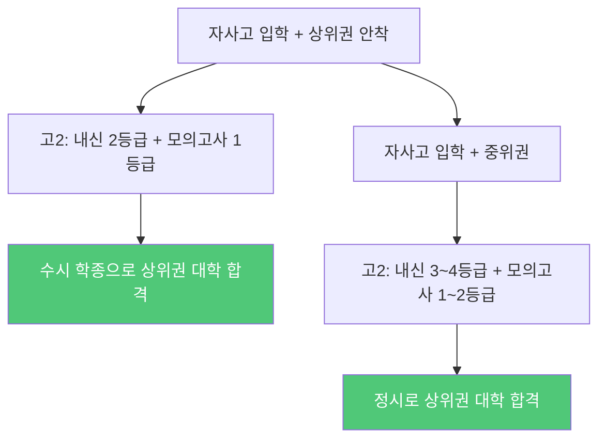

### 실패 시나리오

**핵심 실패 원인:**
- 자사고 내신 경쟁에서 지쳐 수능 준비도 부진
- 투트랙 전략이 "이도저도 아닌" 결과로 귀결
- 체력과 멘탈 관리 실패

---

---

# 루트 D: 일반고 → 지방국립대 (안정형)

## 루트 D 핵심 요약

> **한 줄 정리:** 일반고에서 안정적인 내신을 확보하여 지방거점국립대에 교과전형 또는 지역 전형으로 진학하는 전략

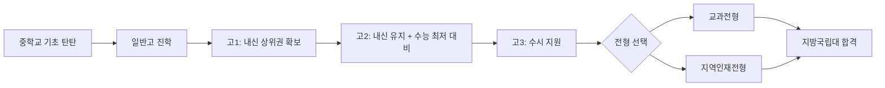

## 적합한 학생 유형

- **안정적이고 확실한 결과를 선호하는 학생**
- 지역에서의 학업과 생활에 만족하는 학생
- 극심한 경쟁보다 적당한 노력으로 원하는 결과를 얻고 싶은 학생
- 내신 관리에 꾸준한 학생
- 의대, 약대, 교대 등 지역인재전형이 유리한 학과 목표 학생
- 가정의 경제적 부담을 줄이고 싶은 학생

### 적합도 자가진단 체크리스트

| 번호 | 질문 | 예 | 아니오 |
|:---:|:---|:---:|:---:|
| 1 | 서울 수도권 대학이 아니어도 괜찮다 | ☐ | ☐ |
| 2 | 학교 내신 시험에서 꾸준히 상위권이다 | ☐ | ☐ |
| 3 | 안정적인 진학을 원한다 | ☐ | ☐ |
| 4 | 의대/약대/교대 등 특정 학과에 관심이 있다 | ☐ | ☐ |
| 5 | 과도한 사교육비 없이 진학하고 싶다 | ☐ | ☐ |
| 6 | 지역에서 생활하는 것에 거부감이 없다 | ☐ | ☐ |
| 7 | 국립대의 저렴한 등록금이 매력적이다 | ☐ | ☐ |
| 8 | 취업 시 지역 거점 국립대의 네트워크가 유용하다고 생각한다 | ☐ | ☐ |

## 중1~중3 준비 타임라인

### 중1 (기본기 확립)

| 월 | 목표 | 실행 사항 | 체크 |
|:---:|:---|:---|:---:|
| 3~6월 | 학교 적응 및 성적 안정화 | 전 과목 상위 30% 이내 목표 | ☐ |
| 7~8월 | 기초 보강 | 수학/영어 약점 보완, 독서 습관 형성 | ☐ |
| 9~12월 | 학습 습관 형성 | 매일 3~4시간 자기주도학습 루틴 | ☐ |
| 1~2월 | 겨울방학 보충 | 부족 과목 집중 보강 | ☐ |

### 중2 (내신 관리 본격화)

| 월 | 목표 | 실행 사항 | 체크 |
|:---:|:---|:---|:---:|
| 3~6월 | 내신 상위권 진입 | 전 과목 상위 20% 목표, 시험 전략 확립 | ☐ |
| 7~8월 | 진로 탐색 | 관심 학과 조사, 지방국립대 리서치 시작 | ☐ |
| 9~12월 | 학습 효율 향상 | 효과적인 시험 대비법 확립, 오답 관리 | ☐ |
| 1~2월 | 겨울방학 도약 | 고등 예습 시작, 진로 방향 구체화 | ☐ |

### 중3 (전략 확정 및 고교 준비)

| 월 | 목표 | 실행 사항 | 체크 |
|:---:|:---|:---|:---:|
| 3~6월 | 최종 내신 관리 | 전교 상위 15% 이내 유지 | ☐ |
| 7~8월 | 지방국립대 전형 분석 | 교과전형, 지역인재전형 요건 정리 | ☐ |
| 9~10월 | 일반고 선택 | 내신 관리 유리한 학교 선택 | ☐ |
| 11~12월 | 고교 진학 준비 | 내신 전략 수립, 수능 최저 기준 파악 | ☐ |
| 1~2월 | 고등 예습 | 고1 전과목 기본 개념 예습 | ☐ |

## 핵심 전략 3가지

### 전략 1: 교과전형 최적화를 위한 내신 올인

지방국립대 교과전형은 내신 성적이 거의 당락을 결정한다.

**내신 목표 설정:**

| 목표 대학 | 필요 내신 등급 | 학과 예시 |
|:---|:---:|:---|
| 서울대/연세대/고려대 | 1.0~1.5 | (지역인재 해당 없음) |
| 지방거점국립대 의대 | 1.0~1.5 | 의예과, 치의예과, 한의예과 |
| 지방거점국립대 인기학과 | 1.5~2.5 | 약학, 간호, 컴퓨터공학 |
| 지방거점국립대 일반학과 | 2.5~3.5 | 경영, 사회, 자연과학 |
| 지방 중소 국립대 | 3.0~4.5 | 다양한 학과 |

### 전략 2: 지역인재전형 적극 활용

지역인재전형은 해당 지역 고교 출신만 지원할 수 있어 경쟁률이 낮고 합격 가능성이 높다.

**지역인재전형 주요 사항:**
1. 해당 지역 소재 고교 3년 재학 조건 확인
2. 의대/약대/교대는 지역인재전형 비율이 높음 (40% 이상)
3. 수능 최저학력기준 충족이 필수인 경우 많음
4. 교과 성적 + 출결 등 기본 요소로 평가

### 전략 3: 수능 최저학력기준 전략적 대비

교과전형에서도 수능 최저학력기준이 있는 경우가 많다.

**수능 최저 기준 예시:**

| 대학 유형 | 최저 기준 예시 |
|:---|:---|
| 거점국립대 인문 | 국수영탐 중 2개 합 5 이내 |
| 거점국립대 자연 | 국수영탐 중 2개 합 5 이내 (수학 포함) |
| 거점국립대 의대 | 국수영탐 중 3개 합 4 이내 |
| 중소 국립대 | 국수영탐 중 2개 합 7~8 이내 |

## 위험 요소와 대비책

| 위험 요소 | 발생 확률 | 영향도 | 대비책 |
|:---|:---:|:---:|:---|
| 수능 최저 미충족 | 중간 | 매우 높음 | 고2부터 수능 기본 학습 병행 |
| 내신 등급 하락 | 중간 | 높음 | 전 과목 균형 학습 유지 |
| 지역인재전형 요건 미달 | 낮음 | 높음 | 전학/이사 시 자격 상실 주의 |
| 목표 학과 경쟁률 상승 | 중간 | 중간 | 복수 학과 지원 전략 마련 |
| 취업 시장에서 지방대 불리 | 중간 | 중간 | 재학 중 역량 강화, 대학원 진학 고려 |

## 성공/실패 시나리오

### 성공 시나리오: "내신 1등급으로 지역인재 의대 합격"

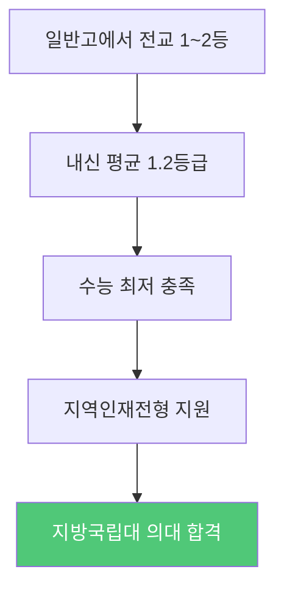

### 실패 시나리오: "수능 최저 미충족으로 불합격"

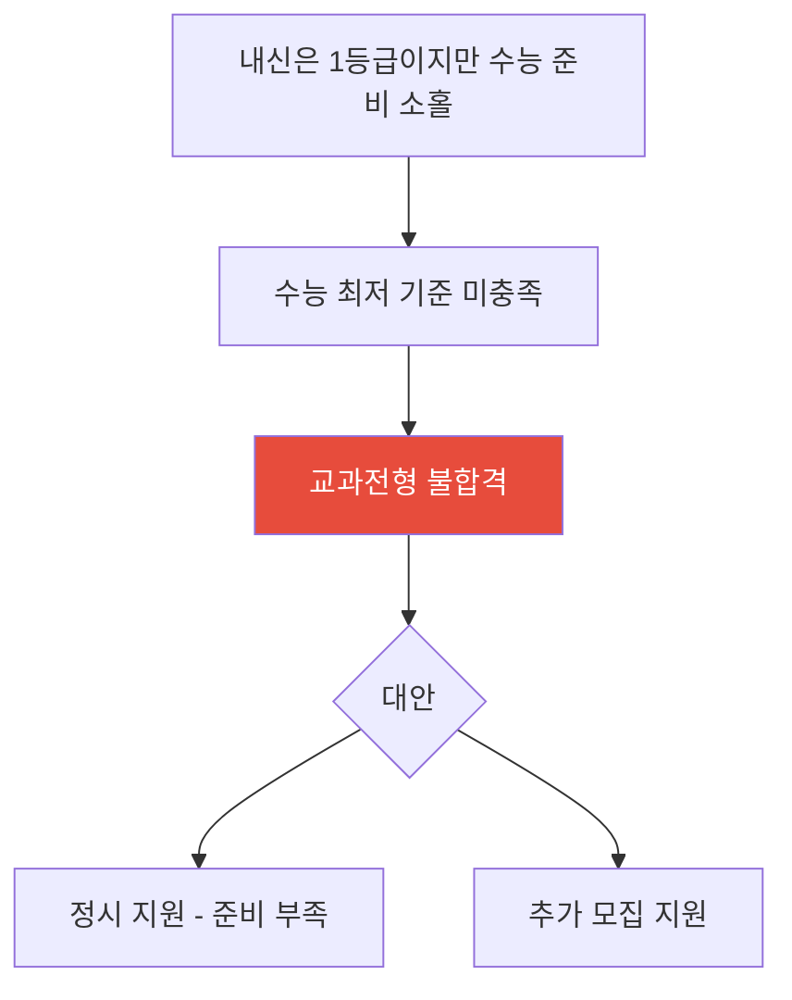

---

---

# 루트별 종합 비교 및 최종 조언

## 루트별 월간 학습시간 비교

| 학습 영역 | 루트 A | 루트 B | 루트 C | 루트 D |
|:---|:---:|:---:|:---:|:---:|
| 수능형 학습 | 매일 5시간 | 매일 1시간 | 매일 3시간 | 매일 1시간 |
| 내신 학습 | 매일 1시간 | 매일 4시간 | 매일 3시간 | 매일 4시간 |
| 비교과 활동 | 주 2시간 | 주 8시간 | 주 6시간 | 주 3시간 |
| 자유 시간 | 주 5시간 | 주 7시간 | 주 3시간 | 주 10시간 |
| 총 주간 학습 | 약 45시간 | 약 40시간 | 약 48시간 | 약 38시간 |

## 루트 전환 가능성

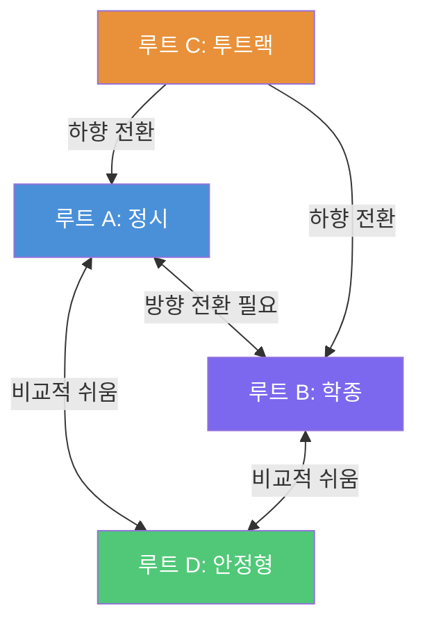

**전환 난이도:**

| 전환 방향 | 난이도 | 핵심 변경 사항 |
|:---|:---:|:---|
| A → B | 중간 | 내신 관리 + 활동 추가 필요 |
| A → D | 쉬움 | 목표 대학 하향 조정 |
| B → A | 어려움 | 수능 학습 시간 대폭 증가 필요 |
| B → D | 쉬움 | 목표 대학 조정 |
| C → A | 쉬움 | 수시 포기, 정시 집중 |
| C → B | 중간 | 자사고 내신 불리, 활동 강화 필요 |
| D → A | 어려움 | 수능 심화 학습 필요 |
| D → B | 중간 | 활동 추가 및 내신 상향 필요 |

## 중학교 시기별 핵심 체크리스트

### 중1 체크리스트 (모든 루트 공통)

- [ ] 자기주도학습 습관 형성 (매일 최소 3시간)
- [ ] 수학 기초 개념 완벽 이해
- [ ] 영어 기본 문법 및 어휘 1000개
- [ ] 독서 습관 형성 (월 2권 이상)
- [ ] 관심 분야 탐색 시작
- [ ] 학교 생활 성실히 참여

### 중2 체크리스트 (모든 루트 공통)

- [ ] 목표 루트 1~2개로 압축
- [ ] 수학 선행 시작 (루트에 따라 수준 조절)
- [ ] 영어 수능형 기초 접하기
- [ ] 진로 방향 구체화
- [ ] 고등학교 유형 리서치
- [ ] 학습 체력 강화

### 중3 체크리스트 (모든 루트 공통)

- [ ] 고등학교 최종 선택
- [ ] 선택한 루트에 맞는 집중 준비
- [ ] 고등 선행학습 (루트별 수준 상이)
- [ ] 멘탈 관리 및 체력 관리
- [ ] 대입 전형 기본 이해
- [ ] 고교 입학 후 첫 한 달 계획 수립

## 학부모 가이드: 자녀 루트 선택 시 고려사항

| 고려 사항 | 질문 | 관련 루트 |
|:---|:---|:---|
| 경제적 여건 | 사교육비와 학비를 어느 정도 감당할 수 있는가? | 루트 C는 고비용, 루트 D는 저비용 |
| 자녀 성향 | 자녀가 경쟁형인가, 안정형인가? | 경쟁형: A/C, 안정형: B/D |
| 거주 지역 | 수도권인가, 지방인가? | 지방: 루트 D 유리 |
| 목표 수준 | 최상위 대학인가, 안정적 진학인가? | 최상위: A/C, 안정: B/D |
| 자녀 체력 | 장시간 학습을 감당할 체력이 있는가? | 체력 좋으면: C, 보통이면: B/D |
| 진로 명확성 | 자녀의 진로 방향이 뚜렷한가? | 뚜렷: B/C, 탐색 중: A/D |

## 자주 하는 실수와 대비

| 순번 | 흔한 실수 | 올바른 접근 |
|:---:|:---|:---|
| 1 | 남들이 가는 루트를 따라감 | 자신의 강점과 성향에 맞는 루트 선택 |
| 2 | 너무 이른 시기에 루트를 확정 | 중2까지는 유연하게 탐색 |
| 3 | 한 가지 전형만 올인 | 최소 1개의 백업 루트 확보 |
| 4 | 내신과 수능 중 하나만 준비 | 비중은 다르지만 둘 다 기본은 유지 |
| 5 | 체력과 멘탈 관리 소홀 | 운동, 수면, 여가 시간 반드시 확보 |
| 6 | 사교육에만 의존 | 자기주도학습 능력이 궁극적 경쟁력 |
| 7 | 정보 없이 감으로 결정 | 데이터 기반 의사결정 (입결, 경쟁률 등) |

---

> **마무리 조언:** 어떤 루트를 선택하든, 가장 중요한 것은 **자기 자신을 정확히 아는 것**입니다.
> 남들과 비교하지 말고, 자신의 강점을 극대화할 수 있는 루트를 선택하세요.
> 중학교 시절은 아직 루트를 바꿀 수 있는 유연한 시기입니다. 다양한 경험을 통해 자신에게 맞는 길을 찾아가세요.
