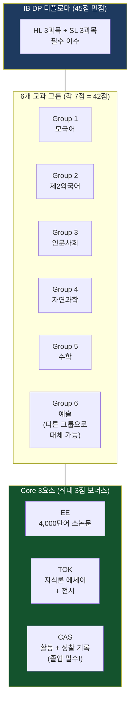
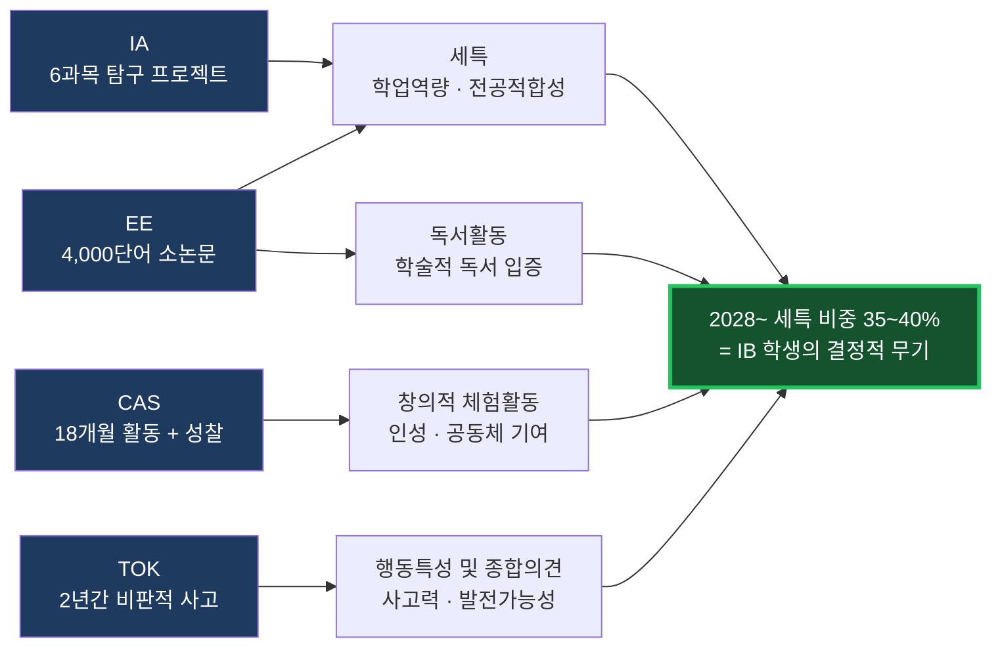
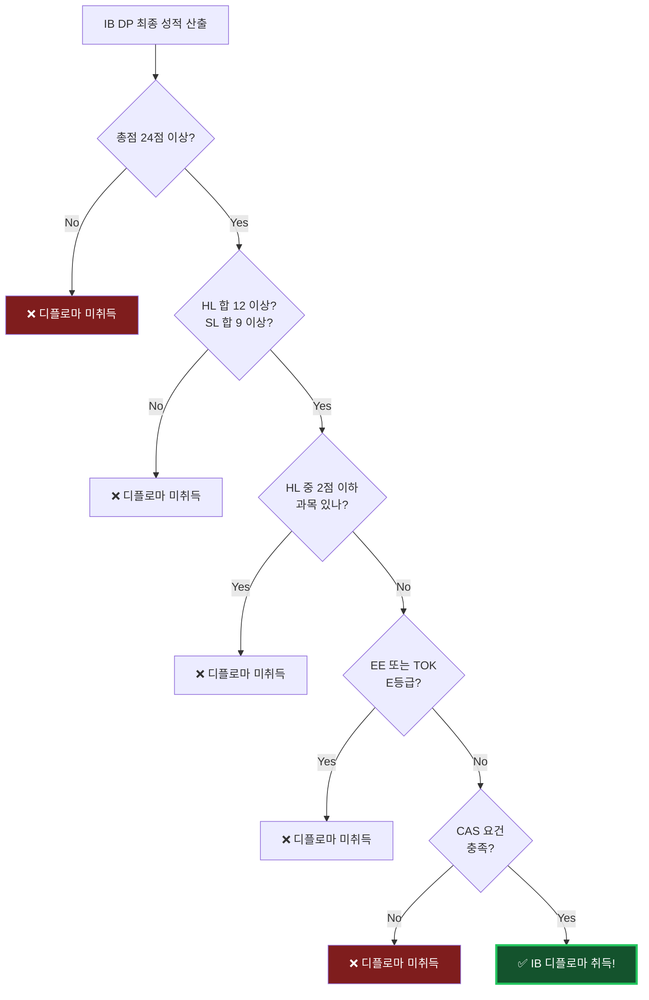
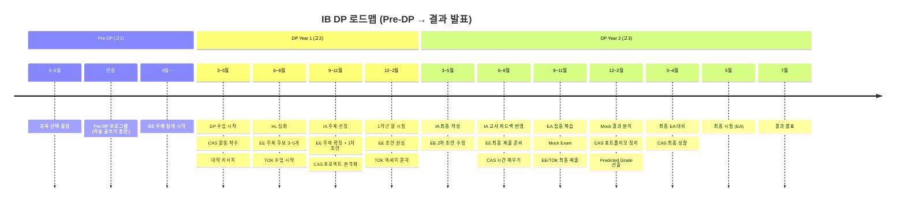
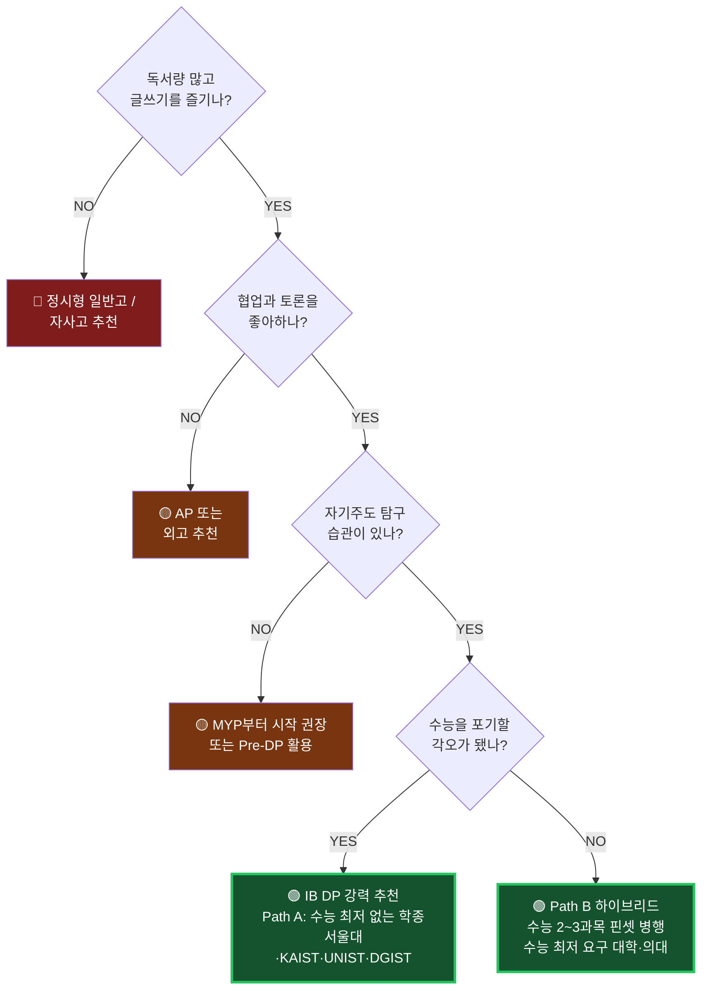

# 입학사정관은 IB 학생부에서 뭘 볼까? — 중학생이 지금 쌓을 것

> 📌 **이 문서는요**
> IB가 뭔지 궁금한 중학생과 학부모를 위한 안내서예요.
> 입학사정관이 IB 학생의 생기부를 볼 때 **실제로 무엇을 보는지**, 그리고 **중학생인 지금 뭘 쌓아야 하는지**를 정리했어요.
> 기준일은 **2026년 7월**이에요.

---

## 1. 왜 지금 IB인가 — "정답 아는 사람" vs "질문 던지는 사람"

> 💡 **한 줄 요약**: AI가 정답을 다 알아버린 시대예요. 이제 값이 나가는 건 **좋은 질문을 던지는 능력**이고, IB는 딱 그걸 훈련시켜요.

### 1.1 무슨 일이 벌어지고 있나요?

ChatGPT나 Claude 같은 AI한테 "임진왜란이 몇 년도야?"라고 물으면 0.5초 만에 답이 나와요.
그럼 그걸 외우느라 3시간 쓴 사람의 가치는 어떻게 될까요?

**암기, 빠른 계산, 4지선다 문제 풀이** — 이 세 가지는 AI가 가장 먼저 대체하는 영역이에요.

| 산업화 시대 교육 (AI가 대체 중) | AI 시대 교육 (인간 고유 영역) |
|---|---|
| 정해진 틀 안의 지식 암기 | 사회 정서 학습(SEL) |
| 빠른 계산 능력 | 복잡한 이해관계 조율 |
| 4지 선다형 문제 풀이 | 문제를 발견하고 해결하는 능력 |
| → ChatGPT, 투자 분석 알고리즘이 대체 | → AI를 도구로 쓰면서 세상을 이끄는 역량 |

### 1.2 지식 소비자 vs 지식 생산자

교육 이야기에서 요즘 제일 자주 나오는 표현이에요. 쉽게 말하면 이래요.

- **지식 소비자** = 남이 만들어 놓은 정답을 받아먹는 사람
- **지식 생산자** = 아무도 안 물어본 질문을 만들고, 스스로 답을 찾아내는 사람

| 구분 | 지식 소비자 | 지식 생산자 |
|---|---|---|
| **학습 방식** | 정해진 틀 안의 지식 암기 | 스스로 질문을 만들고 답을 찾는 탐구 |
| **평가 방식** | 4지 선다형, 정답 찾기 | 서술형, 에세이, 프로젝트 |
| **계산** | 빠른 계산 능력 | 데이터 해석과 의미 부여 |
| **AI와의 관계** | AI에 의해 대체됨 | AI를 도구로 활용해서 창조 |
| **핵심 역량** | 정확한 암기와 재현 | 비판적 사고 + 문제 해결 + SEL |
| **대표 교육** | 수능 중심 교육 | **IB 교육** |

> 💡 **팁**: "우리 애는 암기를 잘해요"는 이제 자랑이 아닐 수도 있어요. "우리 애는 이상한 질문을 많이 해요"가 훨씬 강력한 카드예요.

### 1.3 국제기구들도 같은 말을 하고 있어요

세계경제포럼(WEF)이 발표한 **Future of Jobs Report(2025)**는 2030년에 필요한 핵심 역량 Top 10을 뽑았는데요.
재밌는 건, **그중에 IB에서 훈련 안 되는 게 하나도 없다**는 거예요.

| 순위 | WEF 2030 핵심 역량 | IB에서 어떻게 훈련되나요? |
|---|---|---|
| 1 | 분석적 사고 | 모든 과목이 서술형 평가라서요 |
| 2 | 복원력·유연성·민첩성 | 2년간 과제 여러 개를 동시에 굴려야 해요 |
| 3 | 리더십·사회적 영향력 | CAS 프로젝트에서 리더 경험을 쌓아요 |
| 4 | 창의적 사고 | IA 주제를 스스로 정해야 해요 |
| 5 | 동기부여·자기 인식 | 성찰 일지를 계속 써요 |
| 6 | 기술 리터러시 | AI를 어디까지 쓸지 훈련해요 |
| 7 | 공감·적극적 경청 | 그룹 토론과 발표가 일상이에요 |
| 8 | 호기심·평생 학습 | 탐구 기반 학습이 기본이에요 |
| 9 | 다학문적 사고 | 6개 교과 그룹을 균형 있게 들어야 해요 |
| 10 | 시스템 사고 | 배운 걸 글로벌 이슈랑 연결해요 |

OECD가 만든 **Education 2030 프레임워크**도 마찬가지예요.

| OECD 2030 핵심 역량 | IB DP 대응 요소 |
|---|---|
| 새로운 가치 창조 | EE (4,000단어 소논문) |
| 긴장과 딜레마 조정 | TOK (지식론) |
| 책임감 | CAS (창의·활동·봉사) |
| 학생 주도성 | IA (과목별 자기주도 탐구) |
| 변혁적 역량 | IB 학습자상 10가지 |

---

## 2. IB 학습자상(Learner Profile) 10가지 — 중학생 언어로

> 💡 **한 줄 요약**: IB가 "이런 사람으로 키우겠다"고 못 박아둔 10가지 모습이에요. **면접에서 이걸 아는지 확인하면 학생의 IB 이해도가 바로 드러나요.**

IB에는 **Learner Profile(학습자상 — IB가 추구하는 이상적인 학습자의 10가지 특성)** 이라는 게 있어요.
초등(PYP)부터 고등(DP)까지 전부 관통하는 IB의 DNA예요.

| 학습자상 | 영문 | 중학생 언어로 하면 | IB에서 이렇게 훈련해요 |
|---|---|---|---|
| 탐구하는 사람 | Inquirers | "이거 왜 이래?"를 멈추지 않는 사람 | EE 주제 탐색, IA 연구 설계 |
| 지식이 풍부한 사람 | Knowledgeable | 한 분야만 파는 게 아니라 여러 분야를 깊게 아는 사람 | 6개 과목 그룹 균형 이수 |
| 사고하는 사람 | Thinkers | 남 말 그대로 안 믿고 따져보는 사람 | TOK 에세이, 서술형 시험 |
| 소통하는 사람 | Communicators | 내 생각을 남이 알아듣게 말하고 쓰는 사람 | 구술 평가, 프레젠테이션 |
| 원칙이 있는 사람 | Principled | 아무도 안 볼 때도 정직한 사람 | 학문적 정직성(Academic Integrity) 정책 |
| 열린 마음의 사람 | Open-minded | "내가 틀렸을 수도 있네"를 말할 수 있는 사람 | 글로벌 맥락 학습 |
| 배려하는 사람 | Caring | 남의 사정을 진짜로 궁금해하는 사람 | CAS 봉사 활동 |
| 도전하는 사람 | Risk-takers | 답이 없는 문제에도 뛰어드는 사람 | 소논문 독립 연구 |
| 균형 잡힌 사람 | Balanced | 공부만 하지 않는 사람 | CAS (창의·활동·봉사) |
| 성찰하는 사람 | Reflective | "내가 왜 그랬지?"를 돌아보는 사람 | CAS 성찰 일지, TOK |

> ⚠️ **주의**: 이 10가지를 **외워서 읊는 건 아무 의미 없어요.** 면접관은 "이 중에 본인이 제일 부족한 게 뭐예요?"처럼 물어봐요. 자기 경험으로 답할 수 있어야 해요.

---

## 3. DP 구조 한눈에 — 6과목 + Core, 45점 만점

> 💡 **한 줄 요약**: DP는 **6과목(42점) + Core 보너스(3점) = 45점 만점**이에요. 근데 3점짜리 Core가 45점 전체를 날려버릴 수도 있어요.

### 3.1 먼저 용어부터 풀고 갈게요

| 약어 | 풀네임 | 중학생 언어로 |
|---|---|---|
| **IB** | International Baccalaureate | 1968년 스위스 제네바에서 만든 국제 교육과정. 160개국 5,700개+ 학교가 써요 |
| **IBO** | International Baccalaureate Organization | 스위스에 있는 IB 본부. **여기서 직접 시험을 채점해요** |
| **DP** | Diploma Programme | 고등학교 11~12학년(16~19세)이 듣는 2년짜리 과정. 우리가 얘기하는 게 주로 이거예요 |
| **MYP** | Middle Years Programme | 중학교 과정(11~16세). DP 들어가기 전 탐구 근육을 키우는 단계 |
| **PYP** | Primary Years Programme | 초등학교 과정(3~12세) |
| **HL** | Higher Level | 심화 과목. 6과목 중 **반드시 3개**를 HL로. 240시간 수업 |
| **SL** | Standard Level | 표준 과목. 6과목 중 3개를 SL로. 150시간 수업 |

### 3.2 DP의 건축 구조

**점수 구성**
- 6과목 × 각 7점 = **42점**
- Core 가산점 (EE/TOK 조합) = **최대 3점**
- 합계 **45점 만점**

### 3.3 IB vs AP vs A-Level — 뭐가 다른가요?

| 비교 항목 | IB | AP | A-Level |
|---|---|---|---|
| **커리큘럼 특성** | 전인적 융합 교육 (필수 룰 있음) | 자유로운 단일 과목 선택 | 3~4과목 집중 심화 (영국식) |
| **평가 방식** | 100% 서술형 + 교내 프로젝트 | 4지선다 + 서술형, 시험 위주 | 거의 100% 필기시험 |
| **과목 수** | 6개 필수 + Core 3개 | 자유 선택 (보통 5~8개) | 3~4개 집중 |
| **만점** | 45점 | 과목당 5점 | 과목당 A* |
| **이런 학생에게** | 독서량 많고 글쓰기·협업 강하며 균형 있는 학생 | 미국 대학 최우선, GPA 관리 편함 | 특정 과목 압도적 강점, 영어 다소 약한 학생 |
| **한국 대입 활용** | 학종 + 해외 직행 (수능 불가) | 해외 대학 위주 + 일부 국내 | 영국/홍콩 대학 위주 |

> 💡 **팁**: 한 줄로 정리하면 — **AP는 넓이, A-Level은 깊이, IB는 넓이+깊이+사고력**이에요.

---

## 4. 입학사정관은 실제로 뭘 볼까? — 생기부에서 달라지는 것

> 💡 **한 줄 요약**: 일반고 생기부가 "**무엇을 했다**"의 나열이라면, IB 생기부는 "**왜 했고 어떻게 성장했나**"의 서사예요. 이게 결정적 차이예요.

### 4.1 같은 활동, 다른 기록

이게 이 문서에서 제일 중요한 표예요. 천천히 읽어보세요.

| 항목 | 일반고 생기부 | **IB/KB 생기부** |
|---|---|---|
| **세특** | "수업에 적극 참여함", "발표를 잘함" | "한국 근대 문학의 식민지 모더니즘을 **OPCVL 프레임워크**로 분석하여 8,000자 비평문 작성" |
| **행특** | "성실하고 모범적임" | "지역사회 문해력 격차 해소 독서 멘토링 프로젝트 **40시간 수행, 성찰 보고서 제출**" |
| **독서활동** | "『사피엔스』 읽음" | "『사피엔스』를 읽고 **에세이 주제('기술 발전이 인류의 자유를 확대하는가')와 연결**하여 비판적 서평 작성" |
| **동아리** | "토론 동아리 참여" | "소크라틱 세미나 동아리 **inner circle 진행자**, 학기당 4회 세미나 주도" |

차이가 보이나요? 왼쪽은 **누구나 쓸 수 있는 문장**이고, 오른쪽은 **그 학생만 쓸 수 있는 문장**이에요.
입학사정관 입장에서 왼쪽 문장 100개는 정보가 0이에요. 오른쪽 문장 1개가 훨씬 강력해요.

### 4.2 EE / IA / CAS / TOK가 생기부 어디로 흘러가나요?

여기서 핵심은 이거예요.

- **IA 6개 = 세특 6과목의 핵심 콘텐츠**예요. IB 학생은 세특 소재가 자동으로 생겨요.
- **2028 수능 개편 후 세특 비중이 35~40%로 확대**될 전망이에요.
- 서울대·KAIST·UNIST 같은 **수능 최저 없는 학종**에서 IB 학생이 유리해요.

> ⚠️ **주의**: IB를 한다고 생기부가 저절로 좋아지는 게 아니에요. **선생님과 협의해서 IA·EE·CAS를 세특에 제대로 기재**해야 해요. 이게 IB 학종 합격의 진짜 핵심이에요.

### 4.3 입학사정관이 IB 학생에게 던지는 속마음 질문

| 겉으로 보는 것 | 속으로 확인하는 것 |
|---|---|
| EE 주제가 뭐지? | 이 학생이 **스스로** 궁금해한 게 맞나? 부모나 학원이 짜준 건 아닌가? |
| IA 결과가 좋네 | 결과 말고 **과정**에서 뭘 배웠지? 실패한 지점을 인정하나? |
| CAS 시간을 다 채웠네 | 시간 채우기였나, 아니면 **진짜 문제의식**이 있었나? |
| TOK 등급이 A네 | 남의 논리를 인용한 건가, **자기 논리**를 만든 건가? |
| 6과목 균형이 좋네 | 편식 없이 **버텨낸 체력**이 있다는 뜻이지 |

> 💡 **팁**: 결론은 하나예요. **입학사정관은 결과물이 아니라 그 뒤에 있는 사람을 봐요.** 그래서 "성찰"이 IB 전체를 관통하는 거예요.

---

## 5. 100% 서술형의 세계 — 4지선다 0문제

> 💡 **한 줄 요약**: IB DP에는 **객관식 문제가 단 한 개도 없어요.** 전부 쓰는 시험이에요.

### 5.1 평가는 크게 두 덩어리예요

| 구분 | 풀네임 | 비중 | 누가 채점하나요? |
|---|---|---|---|
| **IA** | Internal Assessment (내부 평가 — 학교에서 하는 수행평가인데, 스위스 IBO가 점수를 다시 검증해요) | 20~30% | 학교 교사가 1차 채점 → **IBO 조정관이 전수 검토** |
| **EA** | External Assessment (외부 평가 — 2년차 5월에 치는 최종 필기시험) | 70~80% | **IBO가 직접 채점**. 답안지를 스캔해서 다른 나라 채점관이 교차 채점 |

> 💡 **팁**: **Moderation(외부 조정)**이라는 게 있어요. 우리 학교 선생님이 후하게 줘도, 짜게 줘도 IBO가 글로벌 기준으로 보정해요. 그래서 "우리 학교 선생님이 잘 주니까 유리해"가 안 통해요.

### 5.2 IA는 시험이 아니라 미니 연구 프로젝트예요

| 과목 | IA 형태 | 분량 | 실제 예시 |
|---|---|---|---|
| **수학** | 수학 탐구 보고서 | 12~20페이지 | 비닐하우스에 비·눈이 내릴 때 가장 빨리 굴러 내려오는 최적 형태를 쇠구슬 실험으로 검증 |
| **과학** | 가설 검증 실험 보고서 | 6~12페이지 | 직접 가설 세우고, 실험 환경 디자인하고, 결과를 통계적으로 분석 |
| **역사** | 역사 탐구 | 2,200단어 | 1차 사료와 2차 자료로 역사적 사건의 인과 분석 |
| **경제학** | 경제 논평 포트폴리오 | 800단어 × 3편 | 실제 경제 뉴스 기사에 경제 이론 적용 |
| **언어 A** | 구술 평가 | 15분 발표 | 문학 작품과 비문학 텍스트 연결 분석 |
| **예술** | 전시 | 작품 4~11점 | 제작 과정과 연구 과정 기록 포함 |

### 5.3 채점 기준은 미리 공개돼요

IB의 모든 평가는 **Criterion-referenced(기준 참조 평가)**예요.
옆 사람보다 잘하는 게 아니라, **미리 공개된 기준(루브릭)에 도달**하면 되는 거예요.

수학 IA 채점 기준(총 20점)을 예로 볼게요.

| 기준 | 배점 | 만점 받으려면 |
|---|---|---|
| **A: Presentation (표현)** | 0~4점 | 논리적 구조, 명확한 소개-본론-결론, 정확한 수학 표기 |
| **B: Mathematical Communication** | 0~4점 | 적절한 용어, 변수 정의, 그래프·표의 정확한 활용 |
| **C: Personal Engagement (개인적 관여)** | 0~3점 | **독창적 주제**, 개인적 관심이 뚜렷함, 창의적 접근 |
| **D: Reflection (성찰)** | 0~3점 | 결과 해석, **한계점 인식**, 확장 가능성 제시 |
| **E: Use of Mathematics** | 0~6점 | 수준에 맞는 수학 개념을 정확하고 정교하게 적용 |

> 💡 **팁**: C(개인적 관여)와 D(성찰)를 합치면 6점, 전체의 30%예요. **"내가 왜 이게 궁금했는지"와 "내 결론의 한계는 뭔지"를 쓰는 게 점수예요.** 이게 IB의 정체성이에요.

### 5.4 등급은 1~7점이에요

| 등급 | 수준 | 의미 |
|---|---|---|
| **7** | Excellent | 포괄적이고 뉘앙스 있는 이해, 통찰력 있는 분석과 독창적 관점 |
| **6** | Very Good | 광범위한 지식과 이해, 효과적인 분석에 약간의 한계 |
| **5** | Good | 확실한 지식과 이해, 적절한 분석이나 일관성이 아쉬움 |
| **4** | Satisfactory | 합리적인 지식, 기본 개념은 이해하나 깊이 부족 |
| **3** | Mediocre | 제한적 지식, 부분적 이해 |
| **2** | Poor | 매우 제한적 지식, 중대한 오해 존재 |
| **1** | Very Poor | 최소한의 지식 |

### 5.5 ⚠️ 디플로마를 못 받는 조건 (Failing Conditions)

여기가 제일 무서운 부분이에요. **24점을 넘겨도 아래 조건에 걸리면 자동 탈락**이에요.

| 번호 | 조건 | 발생 빈도 | 어떻게 막나요? |
|---|---|---|---|
| FC1 | **CAS 요건 미충족** | 매년 5~10% | 1학년부터 체계적 기록, 성찰 일지 관리 |
| FC2 | **EE 또는 TOK에서 E등급** | 매년 3~5% | EE 초안을 최소 3회 피드백 받기 |
| FC3 | 총점 24점 미만 | 글로벌 약 15% | HL 집중 투자, SL 최소 4점 확보 |
| FC4 | HL 중 1과목이라도 2점 이하 | 매년 2~3% | 약한 HL 과목 조기 진단·보강 |
| FC5 | SL 중 1과목이라도 1점 | 매년 1~2% | SL이라도 최소 3점 유지 |
| FC6 | HL 3과목 합산 12점 미만 | 매년 5~8% | HL 평균 4점 이상 유지 |
| FC7 | SL 3과목 합산 9점 미만 | 매년 3~5% | SL 평균 3점 이상 유지 |
| FC8 | **학문적 정직성 위반** (표절, AI 부정 사용) | 매년 1~2% | AI 사용 일지 관리, 인용 철저 |

> ⚠️ **주의**: IB에서 **가장 흔한 실패 원인은 점수 부족이 아니에요.** CAS 미충족(5~10%)과 EE 낙제(3~5%)예요. 공부를 아무리 잘해도 CAS 기록을 게을리하면 디플로마가 안 나와요.

### 5.6 Core 점수는 EE × TOK 조합으로 정해져요

|  | TOK: A | TOK: B | TOK: C | TOK: D | TOK: E (낙제) |
|---|---|---|---|---|---|
| **EE: A** | 3점 | 3점 | 2점 | 2점 | 낙제 → 디플로마 불가 |
| **EE: B** | 3점 | 2점 | 2점 | 1점 | 낙제 → 디플로마 불가 |
| **EE: C** | 2점 | 2점 | 1점 | 0점 | 낙제 → 디플로마 불가 |
| **EE: D** | 2점 | 1점 | 0점 | 0점 | 낙제 → 디플로마 불가 |
| **EE: E (낙제)** | 낙제 | 낙제 | 낙제 | 낙제 | 낙제 |

> ⚠️ **주의**: 이게 그 유명한 **"The Hidden Trap"**이에요. Core는 45점 중 겨우 3점인데, **E 하나 뜨면 나머지 42점이 통째로 날아가요.**

---

## 6. 진로별 과목 조합 + 골든 룰 + 목표 점수

> 💡 **한 줄 요약**: HL 3과목을 뭘 고르냐가 **대학 전공을 사실상 결정**해요. 이건 고1 때 정하는 인생 결정이에요.

### 6.1 이공계 진학 추천 조합

| 그룹 | 추천 과목 | 수준 | 왜요? |
|---|---|---|---|
| Group 1 | 한국어 A: 언어와 문학 | SL | 모국어 부담 줄이기 |
| Group 2 | English B | HL | 해외 진학 대비 |
| Group 3 | Economics | SL | 융합적 사고 |
| Group 4 | Physics 또는 Chemistry | **HL** | 전공 필수 |
| Group 5 | Math: Analysis and Approaches | **HL** | 이공계 필수 |
| Group 6 → G4 | Biology 또는 Computer Science | HL | 4 HL 승인 시 추가 |

### 6.2 인문·사회계 진학 추천 조합

| 그룹 | 추천 과목 | 수준 | 왜요? |
|---|---|---|---|
| Group 1 | 한국어 A: 언어와 문학 | **HL** | 모국어 심화 |
| Group 2 | English B | **HL** | 글쓰기 역량 강화 |
| Group 3 | History 또는 Economics | **HL** | 전공 연계 |
| Group 4 | Biology | SL | 과학 부담 최소화 |
| Group 5 | Math: Applications and Interpretation | SL | 수학 부담 최소화 |
| Group 6 | Visual Arts 또는 G3 추가 과목 | SL | 포트폴리오 또는 심화 |

### 6.3 의대 진학 추천 조합 (수능 병행 필요)

| 그룹 | 추천 과목 | 수준 | 비고 |
|---|---|---|---|
| Group 1 | 한국어 A | SL | 시간 확보 |
| Group 2 | English B | HL | |
| Group 3 | Psychology | SL | 의학 연계 |
| Group 4 | Chemistry | **HL** | **의대 필수** |
| Group 5 | Math: Analysis and Approaches | **HL** | **의대 필수** |
| Group 6 → G4 | Biology | **HL** | **의대 필수** |

> ⚠️ **주의**: 의대는 IB랑 수능을 **동시에** 해야 해서 부담이 극도로 커요. 수능 최저가 필요한 대학에 지원한다면 **수능 2~3과목(영어, 탐구)만 핀셋으로 병행**하는 전략이 필요해요.

### 6.4 수학은 AA냐 AI냐

| 구분 | Math AA (Analysis and Approaches) | Math AI (Applications and Interpretation) |
|---|---|---|
| **중심 내용** | 미적분·대수·삼각함수 등 순수 수학 | 통계·확률·모델링 등 응용 수학 |
| **강조점** | 증명과 논리적 추론 | 실생활 데이터 분석, 기술 활용 |
| **이런 진로에** | 이공계, 수학과, 물리학과, **의대 필수** | 경영학, 사회과학, 심리학 |

### 6.5 과목 선택의 3가지 골든 룰

| 룰 | 내용 | 왜 중요한가요? |
|---|---|---|
| **Rule 01** | 지망 대학·전공의 **필수 이수 과목** 최우선 확인 | 원하는 학과·국가가 요구하는 필수 과목을 빠뜨리면 **원서 접수 자체가 불가**해요 |
| **Rule 02** | 교내 오퍼링과 선생님의 **채점 성향** 분석 | 미국 대학은 GPA와 Predicted Grade가 생명이에요. 박하게 주는 선생님 과목은 피하는 것도 전략이에요 |
| **Rule 03-a** | **모국어 2개** 전략 | Group 2가 약하면 한국어(A) + 영어(A)를 골라서 리스크를 막아요 |
| **Rule 03-b** | **4 HL 승인** 전략 | 최상위권은 학교 승인 하에 HL 4과목을 들어요. 부담이 적은 English B HL을 끼워넣는 게 핵심이에요 |

### 6.6 점수 타겟 라인 — 몇 점이면 어디 가나요?

| 점수대 | 포지션 | 진학 타겟 |
|---|---|---|
| **42~45점** | Top 1% | 연고대 상경/이공계 프리패스, 옥스퍼드·캠브리지 전액 장학금 (경북대사대부고 42점 배출 사례) |
| **38점 전후** | Top 10% | 국내 상위 10개 대학, 미국 아이비리그 목표 라인 |
| **29~30.5점** | 세계 평균 | 전 세계 IB DP 응시생 평균 |
| **24점** | 최소 기준 | 디플로마 취득(졸업) 최소선 |

> 💡 **팁**: 세계 평균이 **29~30점**이에요. 38점은 상위 10%, 42점은 상위 1%예요. "IB 하면 45점 받겠지"가 아니라 **"38점을 목표로 2년을 설계한다"**가 현실적인 감각이에요.

---

## 7. DP 2년 로드맵 — 언제 뭘 하나요?

> 💡 **한 줄 요약**: IB의 진짜 함정은 **시간**이에요. Core는 3점짜리인데 작업량이 어마어마해서 과목 공부 시간을 잡아먹어요.

### 7.1 전체 타임라인

### 7.2 The Hidden Trap — 시간이 겹치는 지점

| 겹치는 것 | 왜 위험한가요? | 어떻게 피하나요? |
|---|---|---|
| **EE (4,000단어)** | 막판 몰아쓰기가 물리적으로 불가능해요 | 1년차부터 리서치와 초안을 **전략적으로 분산** |
| **TOK (철학 에세이)** | 정답이 없는 사고 과정 자체를 평가해요 | **조기 브레인스토밍** 필수 |
| **CAS + SAT 등 외부 시험** | DP 2년 중엔 시간이 절대 안 나와요 | SAT·공인 점수는 **IB 시작 전(10학년 이하)에 완료** |

> 💡 **팁**: 최상위권 학생의 공통점이 하나 있어요. **Year 1 여름방학까지 EE 초안을 완성**해요. 그래야 Year 2를 시험 공부에 통째로 쓸 수 있거든요.

---

## 8. MYP 없이 DP 들어가면 어떻게 되나요?

> 💡 **한 줄 요약**: 한국 학생 대부분이 MYP 없이 고등학교에서 바로 DP를 시작해요. **첫 6개월이 지옥**이에요. 근데 대비법이 있어요.

### 8.1 뭐가 힘든가요?

| 어려움 | 왜 생기나요? | 어떻게 대응하나요? |
|---|---|---|
| **학업 강도 급상승** | MYP와 DP의 깊이·속도 차이 | **Pre-DP 프로그램** 활용 (고1) |
| **평가 방식 충격** | 서술형 100%에 적응이 안 됨 | 에세이 작성 훈련을 **미리** 해두기 |
| **자기주도 학습 부족** | EE/TOK/IA는 독립 연구 능력이 필요 | **중학교 때부터** 자기주도 프로젝트 경험 |
| **언어·작문 수준 격차** | 학술적 글쓰기 경험이 없음 | 독서량 확대 + 글쓰기 연습 |
| **심리적 두려움** | 익숙하지 않은 수업 구조 | IB 졸업생 멘토링 연결 |

### 8.2 Pre-DP가 뭔가요?

**Pre-DP(Pre-Diploma Programme)**는 DP 들어가기 전 1년(보통 고1) 동안 운영하는 준비 과정이에요.
MYP를 안 거치고 DP에 바로 들어가는 학생을 위해 이런 걸 훈련해요.

- ✅ 에세이 작성법
- ✅ 학술적 글쓰기
- ✅ 탐구 방법론
- ✅ 비판적 사고 기초

한국 공교육 IB 학교는 대부분 Pre-DP를 운영해요.

> ⚠️ **주의**: MYP 없이 DP에 들어간다면 **Pre-DP 프로그램이 있는 학교를 고르세요.** 이 1년의 적응이 이후 2년 성적을 좌우해요.

### 8.3 IB가 우리 아이한테 맞나요? — 진단 플로우

### 8.4 자녀 적합성 체크리스트

| 항목 | 가중치 |
|---|---|
| 월 2권 이상 **자발적** 독서를 하나요? | ★★★ |
| 자기 의견을 **글로 표현**하는 걸 즐기나요? | ★★★ |
| **"왜?"라는 질문**을 자주 던지나요? | ★★★ |
| 정답이 없는 토론에 흥미를 느끼나요? | ★★☆ |
| 장기 프로젝트를 끈기 있게 해낸 경험이 있나요? | ★★☆ |
| 객관식 시험에서 상위 50% 이상을 유지하나요? | ★☆☆ |
| 새로운 학습 방식에 열려 있나요? | ★★☆ |

> **판정**: ★★★ 3개 모두 → **적극 추천** / ★★★ 2개 + ★★☆ 1개 → **추천, 전환기 지원 필요** / ★★★ 1개 이하 → **일반고에서 자기 훈련 후 재검토**

---

## 9. IB 학교 면접 — 자주 나오는 질문 Top 10

> 💡 **한 줄 요약**: 면접관은 **'정답'을 원하지 않아요.** "어떻게 생각하는가"와 "왜 그렇게 생각하는가"를 봐요. 그래서 면접 준비는 암기가 아니라 **사고 훈련**이에요.

| 순위 | 질문 | 뭘 보는 건가요? | 좋은 답변 방향 |
|---|---|---|---|
| 1 | "IB를 선택한 이유는 무엇인가요?" | IB 이해도 | 단순 "좋은 대학" 말고, **교육 철학** 이해 |
| 2 | "가장 관심 있는 학문 분야와 EE 주제 아이디어는?" | 탐구 의지 | 구체적 주제 + **왜 궁금한지** |
| 3 | "최근 읽은 책 중 가장 인상 깊었던 것은?" | 독서 습관 | 줄거리 말고 **비판적 감상** |
| 4 | "AI 시대에 교육은 어떻게 변해야 할까요?" | 비판적 사고 | 다각도 논증, 근거 제시 |
| 5 | "팀 프로젝트에서 갈등이 생겼을 때 어떻게 해결했나요?" | 사회성 | **과정 중심** 스토리텔링 |
| 6 | "자기 주도적으로 완수한 탐구나 프로젝트가 있나요?" | 자기주도성 | 과정 · 어려움 · **성찰** 포함 |
| 7 | "글로벌 이슈 중 가장 관심 있는 주제는?" | 국제적 시야 | 관심 + 자기 관점 + **행동 의지** |
| 8 | "IB DP는 매우 도전적입니다. 스트레스 관리는?" | 자기관리 | 구체적 방법 + **실천 경험** |
| 9 | "AI를 학습에 어떻게 활용하고, 어디서 멈추시겠습니까?" | AI 윤리 | 활용 기준 명확, **윤리적 판단** |
| 10 | "10년 후 어떤 사람이 되고 싶나요?" | 비전 | 구체적이고 진솔하게 |

> 🔮 **2028 예측**: 9번 질문 — **"AI를 학습에 어떻게 활용하고, 어디서 멈추시겠습니까?"** 가 입학 면접의 **표준 질문**이 될 거예요. 지금부터 자기 기준을 만들어 두세요.

### 9.1 답변 준비할 때 이것만은

- ❌ 외운 티 나는 모범 답안 → 면접관은 1초 만에 알아채요
- ❌ "저는 열심히 하겠습니다" 같은 다짐 → 정보가 0이에요
- ✅ 구체적인 **내 경험** 하나 + 그때 **뭘 느꼈는지** + 그래서 **뭐가 바뀌었는지**
- ✅ 실패한 경험도 좋아요. IB는 **Reflective(성찰하는 사람)**를 원해요

---

## 10. 중학생 실행 체크리스트

> 💡 **한 줄 요약**: IB는 고등학교 가서 시작하는 게 아니에요. **지금 쌓는 독서·글쓰기·질문 습관이 그대로 DP 점수**가 돼요.

### 10.1 학년별 로드맵 (2026년 기준)

| 학년 | 지금 해야 할 것 | 나중에 이렇게 쓰여요 |
|---|---|---|
| **초6 → 중1** | 독서 습관 형성 (**월 4권+**), 글쓰기 연습 (주 1회 일기 → 에세이) | IB 방식 학습의 **기초 체력** |
| **중1** | 토론 동아리 가입, 자기 의견 말하기 훈련 | TOK 대비, 면접 기초 |
| **중2** | 탐구 보고서 작성 연습 (**2,000자 목표**), 비판적 독서 시작 | EE 대비, 세특 작성 능력 |
| **중3** | **IB 학교 진학 검토**, 에세이 구조화 훈련 (주장-근거-반론-결론) | 고교 선택, 서술형 평가 적응 |
| **고1** | IB 학교 입학 or 일반고에서 자기 훈련, EE 주제 탐색 | 생기부 1차 기록, 방향 설정 |

### 10.2 매일 하는 딱 3가지

- [ ] **매일 30분 독서** — 만화도 괜찮아요, 일단 습관부터
- [ ] **주 1회 에세이** — 500자 → 1,000자 → 2,000자로 늘리기
- [ ] **가족 저녁 토론** — "오늘 뉴스에서 가장 놀라운 게 뭐였어?"

### 10.3 IB 학교가 없는 지역이라면

| 전략 | 실천 방법 | 기대 효과 |
|---|---|---|
| **다독 습관** | 한 주제에 **관점이 다른 책 2~3권** 비교 독서 | IB 수업 방식에 사전 적응 |
| **에세이 훈련** | 주 1회 500자+ 의견문 → 월 1회 1,000자 논증 에세이 | IA / EE 준비 |
| **토론 경험** | 가족 식탁 토론, 독서 토론 모임, 모의유엔(MUN) | 소크라틱 세미나 적응 |
| **자기주도 프로젝트** | 방학 중 관심 주제 탐구 프로젝트 1개 완수 (**보고서까지**) | IA 프로젝트 경험 |
| **성찰 일지** | 매일 "오늘 배운 것 / 궁금한 것 / 다음에 해 볼 것" **3줄** | CAS 성찰 포트폴리오 습관 |

### 10.4 중3이라면 — 지원 전 확인 체크리스트

- [ ] 지원하려는 학교의 **전형 유형**을 확인했나요? (자기주도학습전형 / 외국어특기전형 / 일반전형)
- [ ] 내신 기준을 충족하나요?

| 학교 | 내신 기준 | 전형 방식 |
|---|---|---|
| **표선고** | **내신 100% 정량 선발** (면접·자소서 **없음**) | 제주 도내 모집. 정원 150명, 경쟁률 약 1.39:1 |
| 대구외고 · 대구국제고 | **전 과목 A** (상위 10%) | 외국어특기전형 — 영어 증빙 + 면접 |
| **경북대사대부고** | **전 과목 A~B** (상위 20%) | 자기주도학습전형 — 자소서 + 면접 |
| 죽산고 | 경기도 내 중학생 | 자기주도학습전형 — 자소서 + 면접 |
| **경기외고** | — | 1차 서류·내신(160점) + 2차 면접(40점). 연 약 1,956만원 |
| 충남삼성고 | 전 과목 A (상위 10%) | 자소서 + 면접, 삼성 임직원 자녀 일부 우선. 연 2,500만원+ |

- [ ] 영어 요건을 확인했나요?

| 구분 | 요건 |
|---|---|
| **한국어 IB 학교** (표선고·경북대사대부고·죽산고·대구외고) | **영어 점수 요건 없음** |
| **영어 IB 학교** (경기외고·충남삼성고) | 최소 TOEFL 80+ / IELTS 6.0+, 권장 90+/6.5+, 이상적 100+/7.0+ |

- [ ] **Pre-DP 프로그램**이 있는 학교인지 확인했나요? (MYP 안 했다면 필수)
- [ ] 면접 질문 Top 10에 대해 **내 경험으로** 답할 준비가 됐나요?

> 💡 **팁**: SAT 같은 외부 공인 점수가 필요하다면 **반드시 IB 과정 시작 전(10학년 이하)에 끝내세요.** DP 2년은 그럴 시간이 진짜 없어요.

### 10.5 마지막으로 — 딱 3줄만 기억하세요

1. 🎯 입학사정관은 **결과물이 아니라 그 뒤의 사람**을 봐요. 그래서 "성찰"이 전부예요.
2. 🎯 IB의 가장 흔한 실패는 점수가 아니라 **CAS 미충족과 EE 낙제**예요. 시간 관리가 생사를 갈라요.
3. 🎯 지금 중학생이라면 무기는 딱 세 개 — **독서 · 글쓰기 · "왜?"라는 질문**이에요.
