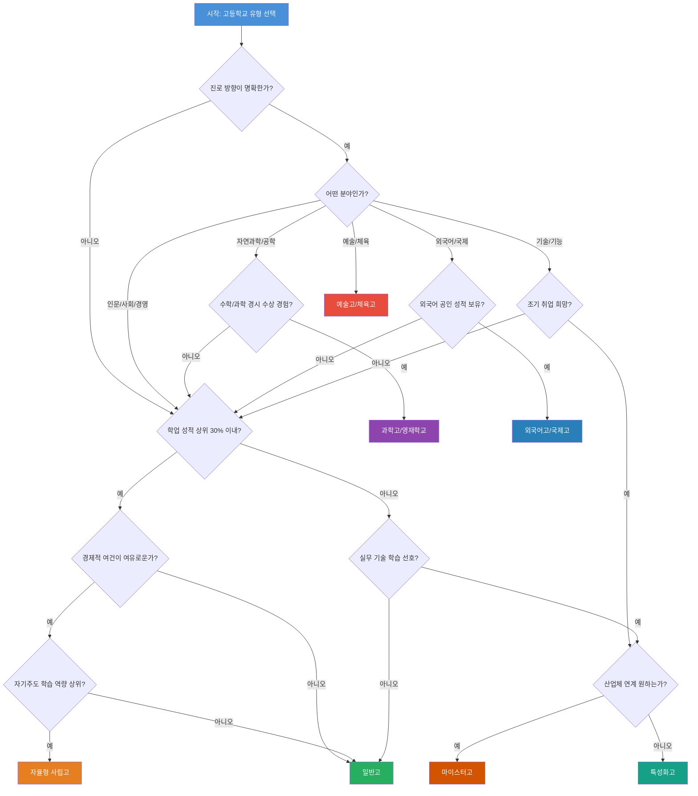
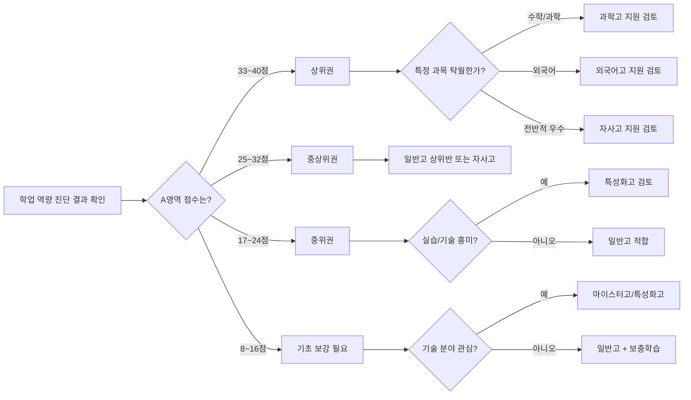
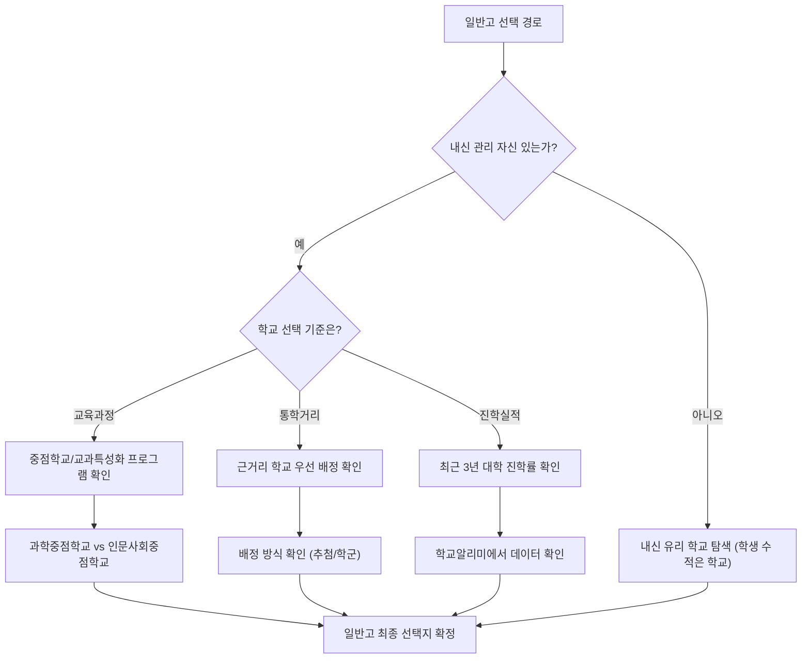
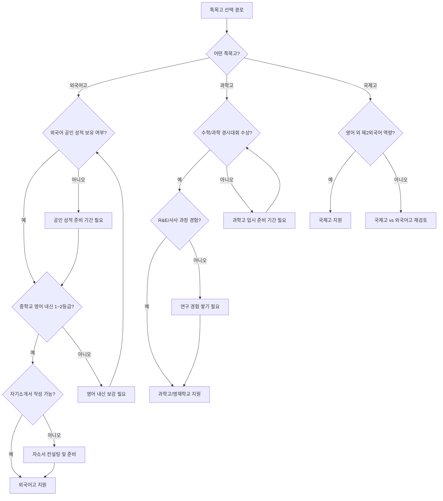
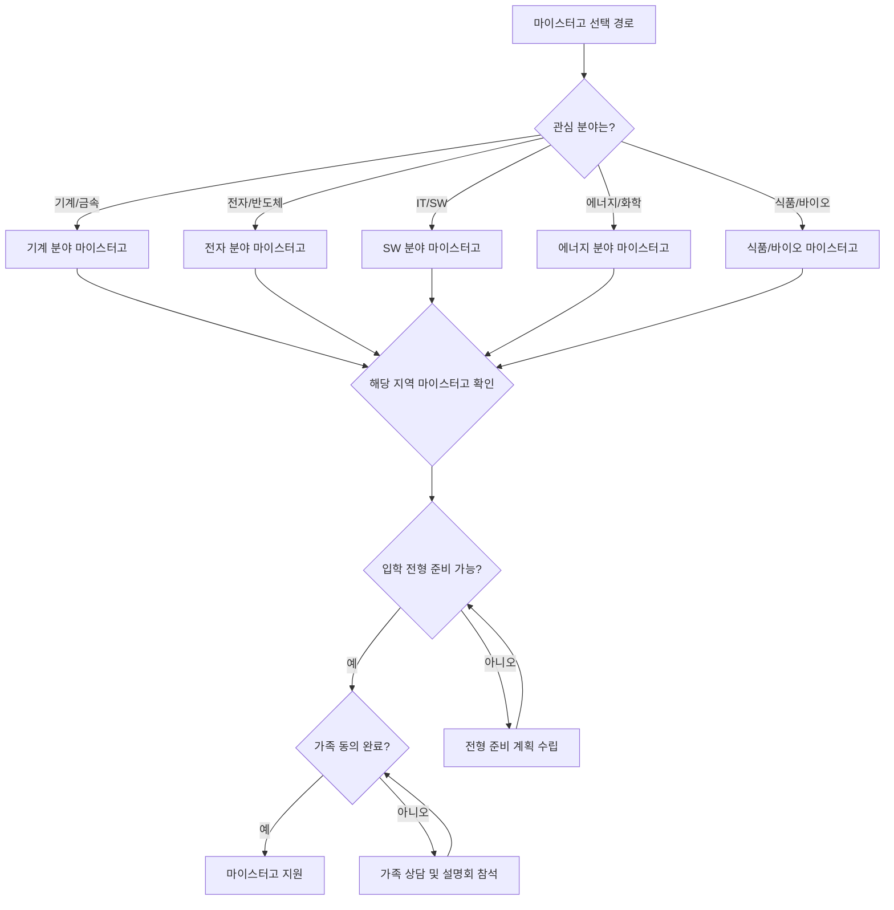
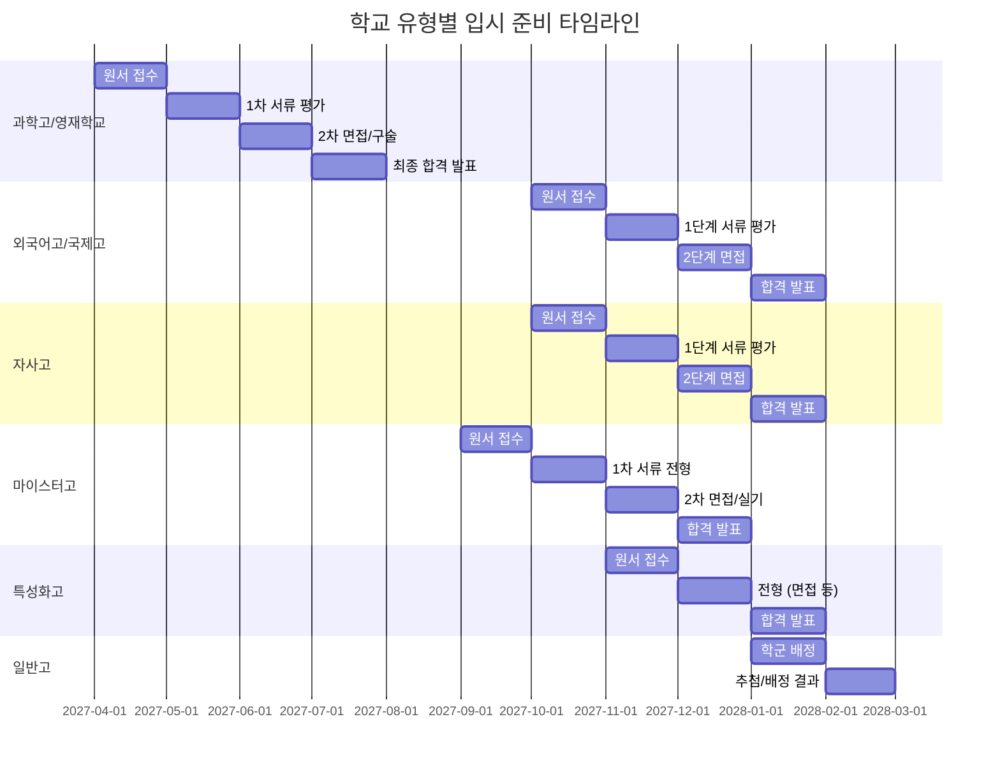
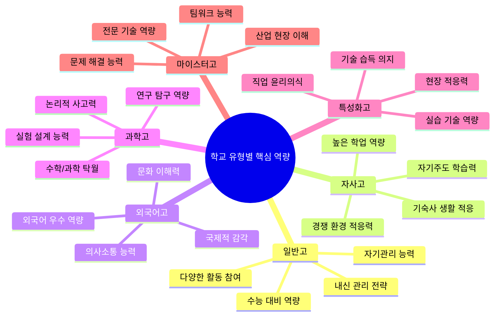

# 학교 유형 선택 의사결정 트리

> 중학생과 학부모를 위한 고등학교 유형 선택 종합 가이드

---

## 목차

1. [시작하기 전에](#시작하기-전에)
2. [자기진단 체크리스트](#자기진단-체크리스트)
3. [의사결정 트리 전체 흐름](#의사결정-트리-전체-흐름)
4. [유형별 의사결정 분기](#유형별-의사결정-분기)
5. [핵심 질문과 판단 기준](#핵심-질문과-판단-기준)
6. [학부모와 함께하는 의사결정 워크시트](#학부모와-함께하는-의사결정-워크시트)
7. [실수하기 쉬운 판단 오류 5가지](#실수하기-쉬운-판단-오류-5가지)
8. [유형 선택 후 검증 체크리스트](#유형-선택-후-검증-체크리스트)
9. [부록: 유형별 상세 비교표](#부록-유형별-상세-비교표)

---

## 시작하기 전에

고등학교 유형 선택은 단순히 "좋은 학교"를 고르는 것이 아닙니다. **나에게 맞는 학교**를 찾는 과정입니다. 이 의사결정 트리는 다음과 같은 순서로 진행됩니다.

1. **자기 이해** - 나는 어떤 학생인가?
2. **환경 파악** - 우리 가정의 여건은 어떤가?
3. **진로 탐색** - 나는 어디로 가고 싶은가?
4. **유형 매칭** - 어떤 학교가 나에게 맞는가?
5. **검증** - 이 선택이 정말 옳은가?

**이 가이드를 활용하는 방법:**

- 학생 혼자 먼저 체크리스트를 작성합니다
- 학부모와 함께 결과를 비교하고 토론합니다
- 의사결정 트리를 따라가며 최종 후보를 좁힙니다
- 검증 체크리스트로 선택을 재확인합니다

---

## 자기진단 체크리스트

### 1단계: 학업 성향 진단

아래 각 항목에 대해 **1점(전혀 아니다) ~ 5점(매우 그렇다)** 으로 자가 평가하세요.

#### A. 학업 기초 역량

| 번호 | 진단 항목 | 1점 | 2점 | 3점 | 4점 | 5점 |
|------|----------|-----|-----|-----|-----|-----|
| A1 | 중학교 내신 성적이 상위 30% 이내이다 | | | | | |
| A2 | 수학 과목에 자신감이 있다 | | | | | |
| A3 | 영어로 된 글을 읽고 이해하는 것이 어렵지 않다 | | | | | |
| A4 | 과학 실험이나 탐구 활동을 즐긴다 | | | | | |
| A5 | 책 읽기와 글쓰기를 좋아한다 | | | | | |
| A6 | 새로운 개념을 스스로 학습할 수 있다 | | | | | |
| A7 | 시험 기간이 아니어도 자발적으로 공부한다 | | | | | |
| A8 | 수업 시간에 집중하는 편이다 | | | | | |

**A영역 합계: ___ / 40점**

#### B. 학습 스타일

| 번호 | 진단 항목 | 1점 | 2점 | 3점 | 4점 | 5점 |
|------|----------|-----|-----|-----|-----|-----|
| B1 | 혼자 공부하는 것보다 함께 토론하며 배우는 것을 선호한다 | | | | | |
| B2 | 이론보다 실습을 통해 배우는 것이 효과적이다 | | | | | |
| B3 | 깊이 있는 한 분야 학습보다 여러 분야를 고루 배우고 싶다 | | | | | |
| B4 | 경쟁적인 환경에서 동기부여가 된다 | | | | | |
| B5 | 장시간 자율학습(하루 4시간 이상)이 가능하다 | | | | | |
| B6 | 프로젝트형 과제를 수행하는 것을 좋아한다 | | | | | |
| B7 | 정해진 커리큘럼보다 스스로 학습 계획을 세우는 편이다 | | | | | |
| B8 | 발표와 프레젠테이션에 자신이 있다 | | | | | |

**B영역 합계: ___ / 40점**

#### 학업 성향 결과 해석

| 합계 범위 | A영역 (기초 역량) | B영역 (학습 스타일) |
|-----------|-------------------|-------------------|
| **33~40점** | 상위권 학업 역량 - 특목고/자사고 도전 가능 | 자기주도적 학습자 - 자율성 높은 학교 적합 |
| **25~32점** | 중상위권 - 일반고 상위반 또는 자사고 검토 | 균형형 학습자 - 다양한 유형 적합 |
| **17~24점** | 중위권 - 일반고 또는 특성화고 검토 | 구조화 선호 학습자 - 체계적 교육과정 적합 |
| **8~16점** | 기초 보강 필요 - 맞춤형 교육 필요 | 실습 중심 학습자 - 특성화고/마이스터고 검토 |

---

### 2단계: 체력과 생활 습관 진단

| 번호 | 진단 항목 | 예 | 아니오 |
|------|----------|---|--------|
| C1 | 아침 6시 30분 이전에 기상하는 것이 가능하다 | | |
| C2 | 밤 11시 이후까지 집중력을 유지할 수 있다 | | |
| C3 | 기숙사 단체 생활에 적응할 자신이 있다 | | |
| C4 | 통학 시간 1시간 이상을 감당할 수 있다 | | |
| C5 | 주말에도 학교에서 보내는 것에 거부감이 없다 | | |
| C6 | 체력적으로 건강한 편이다 | | |
| C7 | 스트레스를 관리하는 나만의 방법이 있다 | | |
| C8 | 또래 친구들과의 갈등을 스스로 해결할 수 있다 | | |

**"예" 개수: ___ / 8개**

| "예" 개수 | 해석 |
|-----------|------|
| **7~8개** | 기숙형 학교(자사고/특목고) 생활 적응 가능성 높음 |
| **5~6개** | 통학형 학교 또는 기숙사 선택제 학교 적합 |
| **3~4개** | 가정과 가까운 통학 가능 학교 권장 |
| **0~2개** | 생활 습관 개선 후 재진단 필요 |

---

### 3단계: 경제적 여건 확인

| 항목 | 내용 | 해당 여부 |
|------|------|-----------|
| **연간 학비 부담 가능 범위** | 200만 원 이하 / 200~600만 원 / 600~1,000만 원 / 1,000만 원 이상 | |
| **사교육비 추가 지출 가능 여부** | 월 50만 원 이상 추가 가능 / 일부 가능 / 어려움 | |
| **기숙사비 부담 가능 여부** | 가능 / 어려움 | |
| **교육 관련 특별활동비** | 해외 연수, 캠프 등 참여 가능 / 어려움 | |
| **교육비 지원 제도 해당 여부** | 교육급여, 교육비 지원, 학비 감면 등 해당 / 비해당 | |

#### 학교 유형별 예상 비용 비교

| 비용 항목 | 일반고 | 자율형 사립고 | 외국어고 | 과학고 | 특성화고 | 마이스터고 |
|-----------|--------|-------------|---------|--------|---------|-----------|
| **연간 학비** | 약 150만 원 | 약 600~1,000만 원 | 약 600~900만 원 | 약 200~400만 원 | 무상~100만 원 | 무상 |
| **기숙사비 (연)** | 해당 없음 | 약 200~400만 원 | 약 200~300만 원 | 약 150~250만 원 | 일부 지원 | 전액 지원 |
| **교복/교재비** | 약 50만 원 | 약 70~100만 원 | 약 70만 원 | 약 60만 원 | 약 50~80만 원 | 지원 |
| **추가 사교육비 (예상)** | 월 50~150만 원 | 월 30~100만 원 | 월 50~120만 원 | 월 30~80만 원 | 최소 | 최소 |
| **3년 총비용 (추정)** | 약 2,500~7,000만 원 | 약 3,500~6,000만 원 | 약 3,500~5,500만 원 | 약 1,500~3,500만 원 | 약 500~1,500만 원 | 거의 무상 |

---

### 4단계: 진로 방향 탐색

아래에서 **가장 관심 있는 분야 3가지**를 선택하세요.

| 분야 코드 | 분야 | 관련 직업 예시 | 선택 |
|-----------|------|--------------|------|
| **P1** | 인문/사회과학 | 법조인, 외교관, 언론인, 사회학자 | |
| **P2** | 자연과학/공학 | 연구원, 엔지니어, 의사, 약사 | |
| **P3** | 외국어/국제관계 | 통번역사, 국제기구 직원, 무역 전문가 | |
| **P4** | 예술/체육 | 음악가, 미술가, 체육 전문인 | |
| **P5** | IT/소프트웨어 | 개발자, 데이터 분석가, AI 전문가 | |
| **P6** | 경영/경제 | CEO, 회계사, 금융 전문가, 마케터 | |
| **P7** | 기술/기능 | 기술 장인, 전문 기능인, 기술 창업자 | |
| **P8** | 교육/상담 | 교사, 상담사, 교육 컨설턴트 | |
| **P9** | 보건/의료 | 간호사, 물리치료사, 보건행정 | |
| **P10** | 아직 모르겠다 | 다양한 경험을 통해 탐색 중 | |

#### 진로 분야와 학교 유형 매칭표

| 선택 분야 | 1순위 추천 유형 | 2순위 추천 유형 | 참고 사항 |
|-----------|---------------|---------------|----------|
| **P1** 인문/사회 | 일반고 (인문계열) | 자사고 | 대학 진학 후 전공 심화 |
| **P2** 자연과학/공학 | 과학고 / 영재학교 | 자사고 / 일반고 (이공계열) | 수학/과학 역량 필수 |
| **P3** 외국어/국제 | 외국어고 / 국제고 | 자사고 | 외국어 능력 우수해야 함 |
| **P4** 예술/체육 | 예술고 / 체육고 | 일반고 (예체능 특기) | 실기 역량 중심 평가 |
| **P5** IT/소프트웨어 | 마이스터고 (IT) / 특성화고 | 과학고 / 일반고 | 실무 vs 이론 방향 결정 필요 |
| **P6** 경영/경제 | 일반고 / 자사고 | 특성화고 (상업계) | 대학 진학 여부에 따라 구분 |
| **P7** 기술/기능 | 마이스터고 / 특성화고 | 일반고 (직업반) | 조기 취업 가능 |
| **P8** 교육/상담 | 일반고 | 자사고 | 사범대/교육대 진학 필요 |
| **P9** 보건/의료 | 특성화고 (간호) / 일반고 | 과학고 | 진학 경로 다양 |
| **P10** 미정 | 일반고 | 자사고 | 다양한 선택지 유지 |

---

## 의사결정 트리 전체 흐름

### 전체 의사결정 흐름도

---

### 학업 역량 기반 분기도

---

## 유형별 의사결정 분기

### 분기 1: 일반고 선택 경로

**일반고가 적합한 학생의 핵심 특징:**

- 아직 진로가 확정되지 않아 다양한 가능성을 열어두고 싶은 학생
- 대학 입시를 통해 원하는 전공을 선택하고 싶은 학생
- 가정과 가까운 거리에서 통학하며 안정적으로 학업에 집중하고 싶은 학생
- 학비 부담을 최소화하면서 대학 진학을 준비하고 싶은 학생

#### 일반고 세부 유형 비교

| 구분 | 일반 일반고 | 과학중점학교 | 인문사회중점학교 | 교과특성화학교 |
|------|-----------|------------|---------------|-------------|
| **특징** | 일반적인 교육과정 | 과학/수학 심화 | 인문/사회 심화 | 특정 교과 집중 |
| **적합 학생** | 진로 미정 | 이공계 진학 희망 | 인문계 진학 희망 | 특기 교과 있음 |
| **교육과정 차이** | 표준 | 과학 과목 30% 이상 | 인문사회 과목 강화 | 해당 교과 집중 |
| **대학 진학** | 수시/정시 모두 | 이공계 수시에 유리 | 인문계 수시에 유리 | 해당 분야 유리 |
| **내신 경쟁** | 보통 | 보통~높음 | 보통 | 보통 |

---

### 분기 2: 자율형 사립고(자사고) 선택 경로

**자사고가 적합한 학생의 핵심 특징:**

- 내신 상위 20% 이내의 우수한 학업 역량을 갖춘 학생
- 자기주도적으로 학습 계획을 세우고 실행할 수 있는 학생
- 경쟁 환경에서 동기부여가 되는 학생
- 가정에서 연간 600만 원 이상의 학비를 부담할 수 있는 학생
- 기숙사 생활에 적응할 수 있는 학생

#### 자사고 지원 전 자가 점검표

| 점검 항목 | 상세 기준 | 충족 여부 |
|-----------|----------|-----------|
| **학업 성적** | 중학교 전 학년 내신 상위 20% 이내 | |
| **자기주도학습 경험** | 스스로 학습 계획을 세우고 실행한 경험이 있다 | |
| **독서량** | 연간 30권 이상 독서 습관이 있다 | |
| **체력** | 하루 14시간 이상 학업 스케줄을 소화할 체력이 있다 | |
| **정서적 안정** | 부모와 떨어져 기숙사 생활을 할 준비가 되었다 | |
| **경제적 여건** | 연간 800~1,200만 원의 교육비를 부담할 수 있다 | |
| **동기** | "남들이 가니까"가 아닌, 명확한 지원 동기가 있다 | |
| **스트레스 관리** | 높은 경쟁 환경에서 스트레스를 관리할 방법이 있다 | |

**충족 항목 7개 이상: 자사고 적극 검토**
**충족 항목 5~6개: 신중하게 검토, 부족한 영역 보완 계획 필요**
**충족 항목 4개 이하: 일반고 우선 검토 권장**

---

### 분기 3: 특목고(외국어고/과학고/국제고) 선택 경로

#### 특목고 유형별 입시 요건 비교

| 입시 요건 | 외국어고 | 과학고 | 국제고 | 예술고 | 체육고 |
|-----------|---------|--------|--------|--------|--------|
| **전형 방식** | 자기주도학습 전형 | 학교장추천 + 영재성 평가 | 자기주도학습 전형 | 실기 + 면접 | 실기 + 면접 |
| **내신 반영** | 영어 교과 중심 | 수학/과학 교과 중심 | 영어 + 사회 교과 | 일부 반영 | 일부 반영 |
| **서류** | 자기소개서 | 자기소개서 + 추천서 | 자기소개서 | 포트폴리오 | 경기 실적 |
| **면접** | 있음 | 있음 (구술 평가) | 있음 | 실기 면접 | 체력 측정 |
| **경쟁률 (평균)** | 약 1.5~3:1 | 약 3~8:1 | 약 2~4:1 | 약 2~5:1 | 약 2~4:1 |
| **준비 시작 시점** | 중2 하반기 | 중1~중2 | 중2 하반기 | 초등~중학 | 초등~중학 |

---

### 분기 4: 특성화고 선택 경로

**특성화고가 적합한 학생의 핵심 특징:**

- 특정 기술 분야(IT, 디자인, 요리, 간호 등)에 명확한 흥미가 있는 학생
- 이론보다 실습 중심의 교육을 선호하는 학생
- 고졸 취업 또는 재직자 전형 대학 진학을 계획하는 학생
- 경제적 부담을 줄이면서 전문 기술을 배우고 싶은 학생

#### 특성화고 계열별 상세 안내

| 계열 | 대표 학과 | 취득 가능 자격증 | 취업 분야 | 대학 진학 경로 |
|------|----------|-----------------|----------|-------------|
| **공업계** | 기계과, 전자과, 건축과, 자동차과 | 기능사/산업기사 | 제조업, 건설업, 자동차 산업 | 폴리텍, 전문대, 재직자 전형 |
| **상업계** | 경영정보과, 회계과, 유통과 | 전산회계, 컴활, ITQ | 사무직, 금융, 유통 | 전문대, 재직자 전형 |
| **가사/실업계** | 조리과, 미용과, 의상과 | 조리기능사, 미용사 | 외식업, 미용업, 패션 | 전문대, 재직자 전형 |
| **농업/수산계** | 농업과, 수산양식과, 식품과 | 관련 기능사 | 농수산업, 식품업 | 농/수산 계열 대학 |
| **정보통신계** | 소프트웨어과, 정보보안과, 통신과 | 정보처리기능사, CCNA | IT 기업, 통신사 | 전문대, 재직자 전형 |
| **간호/보건계** | 간호과 | 간호조무사 | 병원, 요양시설 | 간호대학 편입 |

---

### 분기 5: 마이스터고 선택 경로

**마이스터고가 적합한 학생의 핵심 특징:**

- 졸업 후 바로 취업하여 경력을 쌓고 싶은 학생
- 특정 산업 분야의 전문 기술인이 되고 싶은 학생
- 산업체 연계 교육과 현장 실습을 원하는 학생
- 학비 부담 없이 질 높은 직업 교육을 받고 싶은 학생
- 군 복무 관련 혜택(산업기능요원 등)을 고려하는 학생

#### 마이스터고 vs 특성화고 핵심 비교

| 비교 항목 | 마이스터고 | 특성화고 |
|-----------|----------|---------|
| **설립 목적** | 산업 수요 맞춤형 전문 기술인 양성 | 특정 분야 기초 직업 교육 |
| **학비** | 전액 무상 (국비 지원) | 저렴 (일부 무상) |
| **기숙사** | 전원 기숙사 (무상) | 일부 학교만 운영 |
| **교육과정** | 산업체 맞춤형, NCS 기반 | 일반 직업 교육과정 |
| **취업률** | 약 80~90% | 약 50~70% |
| **취업처** | 대기업/중견기업 위주 | 중소/중견기업 위주 |
| **대학 진학** | 제한적 (취업 의무 기간) | 비교적 자유로움 |
| **선발 경쟁률** | 높음 (3~10:1) | 보통 (1~3:1) |
| **산업체 연계** | 매우 강함 | 보통 |
| **군 특례** | 산업기능요원 배정 가능 | 일부 가능 |

---

## 핵심 질문과 판단 기준

### 유형 선택 시 반드시 물어야 할 10가지 핵심 질문

각 질문에 대한 답변을 기록하고, 해당하는 학교 유형을 확인하세요.

| 번호 | 핵심 질문 | 답변 기준 | 관련 유형 |
|------|----------|----------|----------|
| **1** | 나는 대학에 반드시 진학해야 한다고 생각하는가? | 반드시 / 가능하면 / 아니오 | 예: 일반고/자사고/특목고, 아니오: 특성화고/마이스터고 |
| **2** | 나의 중학교 내신 등급은 어느 수준인가? | 1~2등급 / 3~4등급 / 5등급 이하 | 1~2: 특목고/자사고, 3~4: 일반고, 5이하: 특성화고/마이스터고 |
| **3** | 특별히 잘하거나 좋아하는 교과목이 있는가? | 수학/과학 / 외국어 / 기술/실습 / 없음 | 수학과학: 과학고, 외국어: 외국어고, 기술: 특성화고 |
| **4** | 부모님이 감당할 수 있는 연간 교육비는 얼마인가? | 200만 원 이하 / 200~600만 원 / 600만 원 이상 | 200이하: 일반고/마이스터고, 600이상: 자사고 |
| **5** | 기숙사 생활을 할 준비가 되었는가? | 준비됨 / 불확실 / 어려움 | 준비됨: 자사고/특목고/마이스터고 |
| **6** | 경쟁적인 환경을 선호하는가? | 선호 / 보통 / 싫음 | 선호: 자사고/특목고, 싫음: 일반고/특성화고 |
| **7** | 졸업 후 바로 취업할 의향이 있는가? | 예 / 아니오 / 모르겠다 | 예: 마이스터고/특성화고 |
| **8** | 특정 기술이나 자격증을 취득하고 싶은가? | 예 / 아니오 | 예: 특성화고/마이스터고 |
| **9** | 하루 10시간 이상 학업에 투자할 수 있는가? | 가능 / 어려움 | 가능: 자사고/특목고, 어려움: 일반고 |
| **10** | 진로 변경 가능성을 열어두고 싶은가? | 예 / 아니오 | 예: 일반고, 아니오: 특목고/특성화고 |

---

### 판단 기준 종합 점수표

위 10가지 질문의 답변을 아래 점수표에 대입하세요.

| 질문 | 일반고 점수 | 자사고 점수 | 특목고 점수 | 특성화고 점수 | 마이스터고 점수 |
|------|-----------|-----------|-----------|-------------|-------------|
| **Q1** 대학 진학 | 반드시(3) / 가능하면(2) / 아니오(0) | 반드시(3) / 가능하면(2) / 아니오(0) | 반드시(3) / 가능하면(1) / 아니오(0) | 반드시(0) / 가능하면(2) / 아니오(3) | 반드시(0) / 가능하면(1) / 아니오(3) |
| **Q2** 내신 등급 | 1~2(2) / 3~4(3) / 5이하(1) | 1~2(3) / 3~4(1) / 5이하(0) | 1~2(3) / 3~4(0) / 5이하(0) | 1~2(1) / 3~4(2) / 5이하(3) | 1~2(2) / 3~4(3) / 5이하(1) |
| **Q3** 특기 교과 | 있음(2) / 없음(3) | 있음(2) / 없음(2) | 있음(3) / 없음(0) | 있음(3) / 없음(1) | 있음(3) / 없음(1) |
| **Q4** 교육비 | 200이하(3) / 200~600(2) / 600이상(1) | 200이하(0) / 200~600(1) / 600이상(3) | 200이하(1) / 200~600(2) / 600이상(2) | 200이하(3) / 200~600(2) / 600이상(1) | 200이하(3) / 200~600(3) / 600이상(3) |
| **Q5** 기숙사 | 준비됨(1) / 불확실(2) / 어려움(3) | 준비됨(3) / 불확실(1) / 어려움(0) | 준비됨(3) / 불확실(1) / 어려움(0) | 준비됨(1) / 불확실(2) / 어려움(3) | 준비됨(3) / 불확실(1) / 어려움(0) |

**각 유형별 합계를 계산한 뒤, 가장 높은 점수의 유형 2~3개를 최종 후보로 선정하세요.**

---

## 학부모와 함께하는 의사결정 워크시트

### 워크시트 1: 가치관 우선순위 맞추기

학생과 학부모가 **각각 독립적으로** 아래 항목의 우선순위를 1~10으로 매기세요. (1 = 가장 중요)

| 가치 항목 | 학생 순위 | 학부모 순위 | 차이 |
|-----------|----------|-----------|------|
| 명문대 진학 가능성 | | | |
| 자녀의 행복과 정서적 안정 | | | |
| 경제적 부담 최소화 | | | |
| 진로 탐색의 자유도 | | | |
| 전문 기술/자격증 취득 | | | |
| 학교 브랜드/평판 | | | |
| 통학의 편리함 | | | |
| 교우 관계의 질 | | | |
| 학업 스트레스 수준 | | | |
| 졸업 후 취업 가능성 | | | |

**차이 분석 방법:**

- **차이 0~1점:** 의견 일치 - 이 항목은 합의된 기준으로 활용
- **차이 2~3점:** 약간의 차이 - 짧은 대화로 조율 가능
- **차이 4점 이상:** 큰 차이 - 반드시 깊이 있는 대화 필요

---

### 워크시트 2: 학교 유형별 장단점 분석

각 유형에 대해 학생과 학부모가 **함께** 장단점을 적어보세요.

#### 일반고

| 관점 | 장점 | 단점 | 중요도 (상/중/하) |
|------|------|------|-----------------|
| 학업 | | | |
| 경제 | | | |
| 생활 | | | |
| 진로 | | | |
| 정서 | | | |

#### 자율형 사립고

| 관점 | 장점 | 단점 | 중요도 (상/중/하) |
|------|------|------|-----------------|
| 학업 | | | |
| 경제 | | | |
| 생활 | | | |
| 진로 | | | |
| 정서 | | | |

#### 특목고 (외국어고/과학고/국제고)

| 관점 | 장점 | 단점 | 중요도 (상/중/하) |
|------|------|------|-----------------|
| 학업 | | | |
| 경제 | | | |
| 생활 | | | |
| 진로 | | | |
| 정서 | | | |

#### 특성화고/마이스터고

| 관점 | 장점 | 단점 | 중요도 (상/중/하) |
|------|------|------|-----------------|
| 학업 | | | |
| 경제 | | | |
| 생활 | | | |
| 진로 | | | |
| 정서 | | | |

---

### 워크시트 3: 학부모-학생 토론 가이드

아래 질문을 가지고 학부모와 학생이 **최소 1시간 이상** 대화하세요.

**1라운드: 현재 상태 파악 (20분)**

1. 지금 학교생활에서 가장 즐거운 부분은 무엇인가?
2. 가장 힘든 부분은 무엇인가?
3. 스스로 생각하는 나의 강점 3가지는?
4. 개선하고 싶은 약점 2가지는?

**2라운드: 미래 비전 공유 (20분)**

5. 10년 후 어떤 사람이 되고 싶은가?
6. 대학 진학이 반드시 필요하다고 생각하는가? 그 이유는?
7. 어떤 종류의 일을 하며 살고 싶은가?
8. 고등학교 3년을 어떻게 보내고 싶은가?

**3라운드: 현실 조건 확인 (20분)**

9. 우리 가정의 교육비 지출 가능 범위에 대해 솔직하게 이야기하기
10. 통학 가능 거리와 기숙사 생활에 대한 서로의 생각 나누기
11. 학생의 체력과 스트레스 관리 능력에 대한 솔직한 평가
12. 현재 학업 수준에 대한 객관적 평가 (성적표 함께 보기)

---

### 워크시트 4: 최종 의사결정 매트릭스

후보 학교 유형을 최대 3개 선정하고, 각 기준에 대해 1~5점으로 평가하세요.

| 평가 기준 | 가중치 | 후보 1: _____ | 후보 2: _____ | 후보 3: _____ |
|-----------|--------|-------------|-------------|-------------|
| 학업 적합성 | x3 | 점수 x3 = | 점수 x3 = | 점수 x3 = |
| 진로 일치도 | x3 | 점수 x3 = | 점수 x3 = | 점수 x3 = |
| 경제적 현실성 | x2 | 점수 x2 = | 점수 x2 = | 점수 x2 = |
| 통학/기숙 가능성 | x2 | 점수 x2 = | 점수 x2 = | 점수 x2 = |
| 정서적 안정성 | x2 | 점수 x2 = | 점수 x2 = | 점수 x2 = |
| 졸업 후 전망 | x2 | 점수 x2 = | 점수 x2 = | 점수 x2 = |
| 학교 교육환경 | x1 | 점수 x1 = | 점수 x1 = | 점수 x1 = |
| 학생 본인 의지 | x3 | 점수 x3 = | 점수 x3 = | 점수 x3 = |
| **총점** | **/90** | **___점** | **___점** | **___점** |

---

## 실수하기 쉬운 판단 오류 5가지

### 오류 1: "명문고 = 명문대" 착각

**잘못된 생각:** "자사고나 특목고에 가면 좋은 대학에 갈 수 있다"

**현실:**
- 학교 간판보다 **그 학교에서의 내신 등급**이 대입에 더 큰 영향을 미침
- 자사고에서 내신 5등급을 받는 것보다 일반고에서 내신 1등급을 받는 것이 수시 전형에서 유리
- 2025학년도 기준 서울대 합격자 출신 학교 중 **일반고 비율이 가장 높음**

| 비교 상황 | 자사고 학생 A | 일반고 학생 B |
|-----------|-------------|-------------|
| **내신 등급** | 4등급 | 1등급 |
| **학교 브랜드** | 높음 | 보통 |
| **수시 학생부 종합** | 불리 | 유리 |
| **수시 학생부 교과** | 매우 불리 | 매우 유리 |
| **정시** | 수능 점수에 따라 결정 | 수능 점수에 따라 결정 |
| **스트레스 수준** | 높음 | 보통 |

**올바른 판단 기준:** "이 학교에서 내가 상위권 내신을 유지할 수 있는가?"

---

### 오류 2: "주변 분위기" 추종

**잘못된 생각:** "학원 선생님이 자사고를 추천했으니까" / "친구들이 다 외고를 준비하니까"

**현실:**
- 학원은 합격 실적이 중요하므로, 학생 개인의 적합성보다 합격 가능성을 우선시할 수 있음
- 친구의 선택이 나에게 맞는다는 보장이 없음
- **진로, 성적, 경제 여건, 성격**은 모두 개인마다 다름

**올바른 판단 기준:** "나의 객관적 데이터(성적, 성향, 여건)가 이 유형과 일치하는가?"

---

### 오류 3: "현재 성적" 과신

**잘못된 생각:** "지금 성적이 좋으니까 어디든 잘할 수 있다"

**현실:**
- 중학교 성적과 고등학교 성적의 상관관계는 **완벽하지 않음**
- 특목고/자사고에서는 중학교 상위권 학생들끼리 경쟁하므로 내신이 급격히 하락할 수 있음
- **고등학교 교육과정의 난이도**는 중학교와 차원이 다름

| 학교 유형 | 중학교 상위 10% 학생의 예상 내신 분포 |
|-----------|--------------------------------------|
| **일반고** | 상위 10~20% 유지 가능성 높음 |
| **자사고** | 상위 30~50%로 하락 가능성 있음 |
| **과학고** | 평균 이하로 떨어질 가능성도 있음 |
| **외국어고** | 영어 외 과목에서 하락 가능성 |

**올바른 판단 기준:** "이 학교의 학생 구성을 고려했을 때 나의 내신 경쟁력은?"

---

### 오류 4: "취업 = 실패" 편견

**잘못된 생각:** "특성화고/마이스터고는 대학 못 가는 아이들이 가는 곳이다"

**현실:**
- 마이스터고 졸업생의 **평균 초봉이 대졸 초봉의 80~90% 수준**에 달함
- 재직 중 대학 진학이 가능하며, **등록금 지원** 혜택도 있음
- 숙련 기술인은 **연봉 1억 원 이상**을 받는 경우도 많음
- 대기업 공채에서 마이스터고 졸업생 별도 전형을 운영하는 기업이 증가 추세

| 경로 비교 | 일반고 -> 4년제 대학 -> 취업 | 마이스터고 -> 취업 -> (재직자 대학) |
|-----------|---------------------------|----------------------------------|
| **첫 취업 나이** | 만 26~28세 | 만 18~19세 |
| **첫 취업까지 교육비** | 약 5,000~8,000만 원 | 거의 0원 |
| **초봉 (평균)** | 약 3,200~3,800만 원 | 약 2,800~3,400만 원 |
| **30세 시점 경력** | 신입~2년차 | 10년차 이상 |
| **30세 시점 총 수입 누적** | 약 5,000~7,000만 원 | 약 3억~3.5억 원 |

**올바른 판단 기준:** "대학 졸업장이 내 진로에 반드시 필요한가, 아니면 기술 역량이 더 중요한가?"

---

### 오류 5: "변경 불가" 오해

**잘못된 생각:** "한번 선택하면 절대 바꿀 수 없다"

**현실:**
- 자사고/특목고에서 일반고로 **전학이 가능**함 (단, 절차와 제한이 있음)
- 특성화고에서 대학 진학을 위한 **재직자 전형, 특별전형**이 있음
- 일반고에서도 **직업 교육 위탁과정**을 통해 기술을 배울 수 있음
- 중요한 것은 **완벽한 선택보다 선택 후 최선을 다하는 것**

| 변경 상황 | 가능 여부 | 절차 | 주의 사항 |
|-----------|----------|------|----------|
| 자사고/특목고 -> 일반고 전학 | 가능 | 전학 심사 | 내신 불이익 가능 |
| 일반고 -> 특성화고 전학 | 제한적 | 결원 보충 전형 | 시기 제한 있음 |
| 특성화고 -> 일반고 전학 | 제한적 | 전학 심사 | 교육과정 차이 큼 |
| 특성화고/마이스터고 -> 대학 진학 | 가능 | 재직자 전형, 특별전형 | 일정 기간 재직 필요 |
| 일반고에서 직업교육 이수 | 가능 | 위탁교육 신청 | 3학년부터 가능 |

**올바른 판단 기준:** "최악의 경우에도 대안 경로가 있는가?"

---

## 유형 선택 후 검증 체크리스트

학교 유형을 잠정 결정했다면, 아래 체크리스트로 선택의 타당성을 최종 검증하세요.

### 검증 1: 객관적 데이터 확인

| 검증 항목 | 확인 방법 | 결과 기록 | 판정 |
|-----------|----------|----------|------|
| 해당 유형 학교의 최근 3년 입시 결과 | 학교알리미 확인 | | 합격/불합격 |
| 나의 내신과 해당 학교 합격선 비교 | 입시 정보 사이트 활용 | | 가능/불가능 |
| 해당 학교 재학생/졸업생 후기 | 온라인 커뮤니티, 설명회 | | 긍정/부정 |
| 통학 경로와 소요 시간 측정 | 직접 방문하여 측정 | | 적정/부적정 |
| 가정 경제 상황과 학비 비교 | 가족 회의 | | 가능/불가능 |

### 검증 2: 감정적 확인

아래 질문에 **솔직하게** 답하세요.

| 질문 | 예 | 아니오 |
|------|---|--------|
| 이 학교에 다니는 나의 모습을 상상하면 설레는가? | | |
| 이 선택에 대해 부모님과 충분히 이야기를 나누었는가? | | |
| 다른 사람의 의견이 아닌, 내 스스로의 판단인가? | | |
| 이 학교의 단점도 충분히 알고 있는가? | | |
| 최악의 상황(적응 실패, 성적 하락 등)에 대한 대비책이 있는가? | | |
| 3년 뒤 이 선택을 후회하지 않을 자신이 있는가? | | |

**"아니오"가 2개 이상이면 선택을 재검토하세요.**

---

### 검증 3: 시나리오 분석

선택한 학교 유형에서 발생할 수 있는 **최선/최악/가능성 높은** 시나리오를 각각 작성하세요.

| 시나리오 | 구체적 상황 | 대응 방안 |
|----------|-----------|----------|
| **최선의 경우** | (예: 내신 1등급 유지, 원하는 대학 합격) | |
| **가능성 높은 경우** | (예: 내신 2~3등급, 적정 수준의 대학 진학) | |
| **최악의 경우** | (예: 적응 실패, 내신 급락, 전학 고려) | |

---

### 검증 4: 대안 계획 수립

| 항목 | 계획 내용 |
|------|----------|
| **플랜 A (1순위 선택)** | 학교 유형: / 구체적 학교명: |
| **플랜 B (대안 1)** | 학교 유형: / 구체적 학교명: |
| **플랜 C (대안 2)** | 학교 유형: / 구체적 학교명: |
| **전환 기준** | 어떤 상황이 되면 플랜 B로 전환할 것인가? |
| **전환 시점** | 언제까지 최종 결정을 내릴 것인가? |

---

## 부록: 유형별 상세 비교표

### 종합 비교표

| 비교 항목 | 일반고 | 자사고 | 외국어고 | 과학고 | 국제고 | 특성화고 | 마이스터고 |
|-----------|--------|--------|---------|--------|--------|---------|-----------|
| **학교 수 (전국)** | 약 1,500개 | 약 40개 | 약 30개 | 약 20개 | 약 7개 | 약 500개 | 약 50개 |
| **모집 단위** | 학군/광역 | 광역/전국 | 광역 | 광역/전국 | 광역 | 광역 | 전국 |
| **선발 방식** | 추첨/배정 | 자기주도학습 전형 | 자기주도학습 전형 | 영재성 평가 | 자기주도학습 전형 | 선착순/면접 | 면접/실기 |
| **교육과정** | 국가 교육과정 | 자율 편성 | 외국어 특화 | 과학 심화 | 국제 교육 | 직업 교육 | 산업 맞춤형 |
| **기숙사** | 대부분 없음 | 대부분 있음 | 대부분 있음 | 있음 | 있음 | 일부 있음 | 전원 기숙 |
| **대학 진학률** | 약 70% | 약 95% | 약 95% | 약 98% | 약 95% | 약 30~40% | 약 10~15% |
| **취업률** | 낮음 | 매우 낮음 | 매우 낮음 | 매우 낮음 | 매우 낮음 | 약 50~70% | 약 80~90% |
| **수능 평균** | 보통 | 높음 | 높음 | 매우 높음 | 높음 | 응시율 낮음 | 미응시 |

---

### 입시 일정 비교 (연간)

---

### 학교 유형별 하루 일과 비교

| 시간대 | 일반고 (통학) | 자사고 (기숙) | 과학고 (기숙) | 마이스터고 (기숙) |
|--------|-------------|-------------|-------------|----------------|
| **06:00~07:00** | 기상, 등교 준비 | 기상, 아침 운동 | 기상, 아침 운동 | 기상, 조회 |
| **07:00~08:00** | 등교 (통학) | 아침 자습 | 아침 자습 | 아침 자습 |
| **08:00~12:00** | 오전 수업 (4교시) | 오전 수업 (4교시) | 오전 수업 (4교시) | 이론 수업 |
| **12:00~13:00** | 점심시간 | 점심시간 | 점심시간 | 점심시간 |
| **13:00~16:00** | 오후 수업 (3교시) | 오후 수업 (3교시) | 실험/연구 | 실습 수업 |
| **16:00~18:00** | 방과후 활동/하교 | 방과후 심화 수업 | R&E/동아리 | 현장 실습 |
| **18:00~19:00** | 저녁 (가정) | 저녁 (기숙사) | 저녁 (기숙사) | 저녁 (기숙사) |
| **19:00~22:00** | 자율 학습 (가정/학원) | 야간 자율학습 | 야간 자율학습/연구 | 자격증 준비 학습 |
| **22:00~23:00** | 자유 시간 | 개인 정리 시간 | 개인 정리 시간 | 개인 정리 시간 |
| **23:00** | 취침 | 취침 | 취침 | 취침 |
| **총 학습 시간** | 약 8~10시간 | 약 12~14시간 | 약 12~14시간 | 약 10~12시간 |

---

### 유형별 핵심 역량 요구 수준

---

### 최종 의사결정 점검 요약표

모든 과정을 완료한 후, 아래 표에 최종 결과를 기록하세요.

| 항목 | 내용 |
|------|------|
| **학생 이름** | |
| **현재 학년** | 중학교 ___학년 |
| **자기진단 A영역 점수** | ___/40점 |
| **자기진단 B영역 점수** | ___/40점 |
| **체력/생활습관 점수** | "예" ___/8개 |
| **경제적 여건** | 연간 ___만 원 가능 |
| **진로 방향 (상위 3개)** | P___, P___, P___ |
| **1순위 학교 유형** | |
| **1순위 선택 이유** | |
| **2순위 학교 유형** | |
| **2순위 선택 이유** | |
| **검증 체크리스트 결과** | 통과/재검토 필요 |
| **학부모 동의 여부** | 동의/미동의/추가 논의 필요 |
| **최종 결정일** | 20___년 ___월 ___일 |
| **비고** | |

---

### 참고 자료 및 유용한 사이트

| 사이트명 | 주소 | 활용 방법 |
|----------|------|----------|
| **학교알리미** | schoolinfo.go.kr | 학교별 교육 정보, 진학률, 교육비 확인 |
| **고입정보포털** | hischool.go.kr | 고등학교 입시 일정, 전형 요강 확인 |
| **커리어넷** | career.go.kr | 적성 검사, 진로 탐색 |
| **마이스터고 포털** | meister.hrdkorea.or.kr | 마이스터고 정보, 취업 현황 |
| **특성화고 포털** | hifive.go.kr | 특성화고 정보, 취업 지원 |
| **대입정보포털** | adiga.kr | 대학 입시 정보 (진학 경로 참고) |

---

> **마지막으로 기억하세요:** 완벽한 선택은 없습니다. 중요한 것은 충분한 정보와 자기 이해를 바탕으로 **납득할 수 있는 선택**을 하는 것입니다. 어떤 학교를 선택하든, 그 안에서 최선을 다하는 것이 가장 중요합니다.
