# 특수 루트 입시 전략 맵

특수목적고등학교 및 특성화고등학교 진학을 위한 루트별 심층 전략 가이드입니다. 각 루트의 입학 전형 단계, 요구 역량, 학년별 준비 전략, 합격생 공통 특징, 불합격 시 대안까지 체계적으로 정리합니다.

---

## 전체 루트 구조 총괄

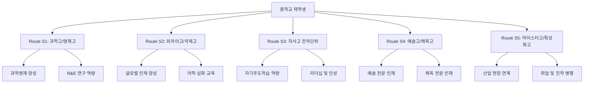

## 루트별 난이도 및 경쟁률 비교표

| 루트 | 대상 학교 유형 | 평균 경쟁률 | 준비 시작 권장 시점 | 난이도 | 전형 핵심 요소 |
|------|--------------|-----------|------------------|-------|-------------|
| **S1** | 과학고, 영재고 | 5:1 ~ 15:1 | 초등 5~6학년 | 최상 | 수학/과학 심화, 연구역량, 캠프 |
| **S2** | 외국어고, 국제고 | 3:1 ~ 8:1 | 중1 ~ 중2 | 상 | 영어/제2외국어, 자기소개서, 면접 |
| **S3** | 자사고(전국단위) | 3:1 ~ 6:1 | 중1 ~ 중2 | 상 | 자기주도학습, 내신, 면접 |
| **S4** | 예술고, 체육고 | 2:1 ~ 10:1 | 초등 저학년 | 중~상 | 실기, 포트폴리오, 수상 경력 |
| **S5** | 마이스터고, 특성화고 | 1.5:1 ~ 4:1 | 중2 ~ 중3 | 중 | 직무적성, 면접, 내신 |

---

## 공통 원칙

| 원칙 | 설명 | 적용 루트 |
|------|------|----------|
| **조기 시작** | 목표 학교의 전형 요소를 파악하고 역량을 미리 갖출 것 | 전 루트 |
| **증거 기반 기록** | 단순 활동 나열이 아닌 결과물(보고서, 포트폴리오, 수상) 확보 | S1, S2, S4 |
| **리스크 플랜** | 1순위 실패 시 2순위 루트를 동시에 설계 | 전 루트 |
| **자기주도학습 증빙** | 학원 의존이 아닌 스스로 학습한 과정을 보여줄 것 | S1, S2, S3 |
| **멘토 확보** | 합격 선배, 전문 교사, 학원 강사 등 조언자 네트워크 구축 | 전 루트 |

---

# Route S1: 과학고/영재고 루트

## S1 개요

과학고등학교와 영재학교는 수학과 과학 분야에서 뛰어난 재능을 가진 학생을 선발하여 심화 교육을 제공하는 특수목적고등학교입니다. 영재고는 전국 8개교(서울과학고, 경기과학고, 한국과학영재학교, 대전과학고, 대구과학고, 광주과학고, 세종과학영재고, 인천과학영재고)가 있으며, 과학고는 각 시도교육청 소속으로 운영됩니다.

## S1 입학 전형 단계별 설명

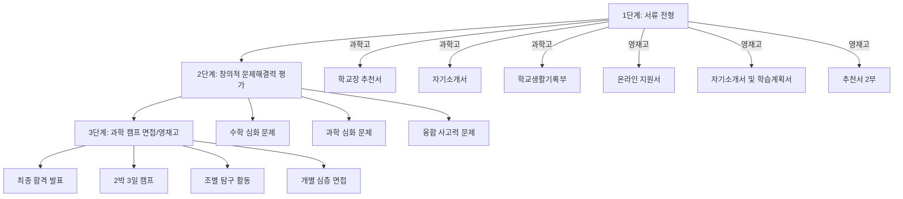

### 1단계: 서류 전형

- **자기소개서**: 수학/과학에 대한 열정과 탐구 경험을 구체적으로 서술
- **추천서**: 학교 교사 또는 외부 전문가의 추천 (영재고는 2부 필요)
- **학교생활기록부**: 수학/과학 교과 성적 및 수상 경력, 자율동아리 활동

### 2단계: 창의적 문제해결력 평가

- **수학 영역**: 교과 심화 수준을 넘어서는 창의적 문제 (정수론, 조합론, 기하 등)
- **과학 영역**: 물리, 화학, 생물, 지구과학 심화 실험 설계 및 해석
- **융합 영역**: 수학과 과학을 결합한 실생활 문제 해결

### 3단계: 과학 캠프 (영재고) / 면접 (과학고)

- **영재고 캠프**: 2박 3일간 합숙하며 조별 탐구 활동, 개별 발표, 심층 면접 실시
- **과학고 면접**: 구술 면접으로 과학적 사고력과 의사소통 능력 평가

## S1 요구 역량

| 역량 분류 | 세부 역량 | 평가 방식 | 중요도 |
|----------|---------|---------|-------|
| **수학 심화** | 정수론, 조합론, 기하, 대수 | 필기 평가 | 최상 |
| **과학 심화** | 물리/화학/생물/지구과학 심화 | 필기 + 실험 | 최상 |
| **연구 역량** | R&E 수행 능력, 실험 설계 | 캠프/면접 | 상 |
| **창의적 사고** | 비정형 문제 해결, 융합적 접근 | 필기 + 면접 | 상 |
| **의사소통** | 논리적 설명, 발표력, 토론 | 면접/캠프 | 중 |
| **자기주도성** | 스스로 학습 계획 수립 및 실행 | 서류/면접 | 중 |
| **협업 능력** | 조별 탐구 시 역할 수행 | 캠프 | 중 |

## S1 중학교 학년별 준비 전략

### 중1 준비 전략

1. **수학 기본기 완성**: 중학 수학 전 과정 선행 완료
2. **과학 탐구 습관 형성**: 과학 실험 노트 작성, 탐구 보고서 연습
3. **올림피아드 기초**: KMO(한국수학올림피아드) 기출문제 풀이 시작
4. **독서 습관**: 과학 교양서적 월 2권 이상 읽고 독서록 작성
5. **동아리 활동**: 과학 탐구 동아리 가입 및 활동 시작

### 중2 준비 전략

1. **수학 심화 학습**: 고등 수학(상) 선행 + KMO 1차 대비
2. **과학 심화 학습**: 물리/화학 중 1~2과목 고등 수준 심화
3. **R&E 경험**: 대학 부설 영재교육원 프로그램 참여
4. **자기소개서 소재 확보**: 탐구 활동 결과물 정리 및 포트폴리오 구축
5. **멘토링**: 과학고/영재고 합격 선배 멘토링 참여

### 중3 준비 전략 (지원 학년)

1. **전형 일정 파악**: 영재고(4~6월), 과학고(7~9월) 전형 일정 확인
2. **자기소개서 작성**: 3~4차 수정 후 전문가 첨삭
3. **면접/캠프 대비**: 모의 면접 최소 5회 이상 실시
4. **내신 관리**: 중3 1학기 내신 최상위권 유지
5. **심리 준비**: 캠프 환경(합숙, 경쟁) 적응 훈련

## S1 준비 타임라인

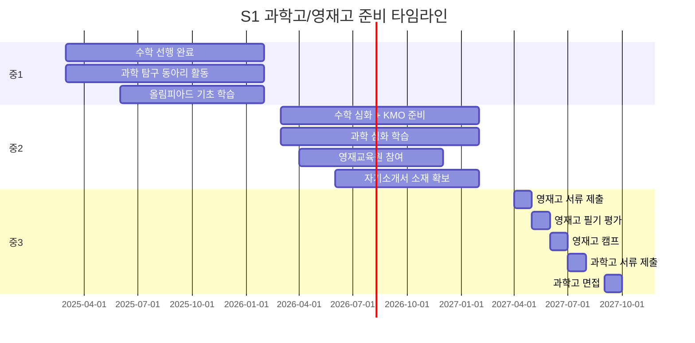

## S1 합격생 공통 특징

- **수학/과학 성적 최상위권**: 내신 전 과목 A 이상, 특히 수학/과학 만점 수준
- **올림피아드 수상 경력**: KMO, KPhO, KChO 등 1차 이상 통과 또는 수상
- **탐구 보고서 다수 보유**: 자발적 탐구 활동 결과물 3편 이상
- **영재교육원 수료**: 대학 부설 또는 교육청 영재교육원 1년 이상 수료
- **논리적 의사소통**: 면접에서 자신의 사고 과정을 명확하게 설명하는 능력
- **강한 지적 호기심**: "왜?"라는 질문에서 출발하여 스스로 답을 찾아가는 태도
- **실패에 대한 회복력**: 어려운 문제를 포기하지 않고 끝까지 도전하는 자세

## S1 불합격 시 대안 루트

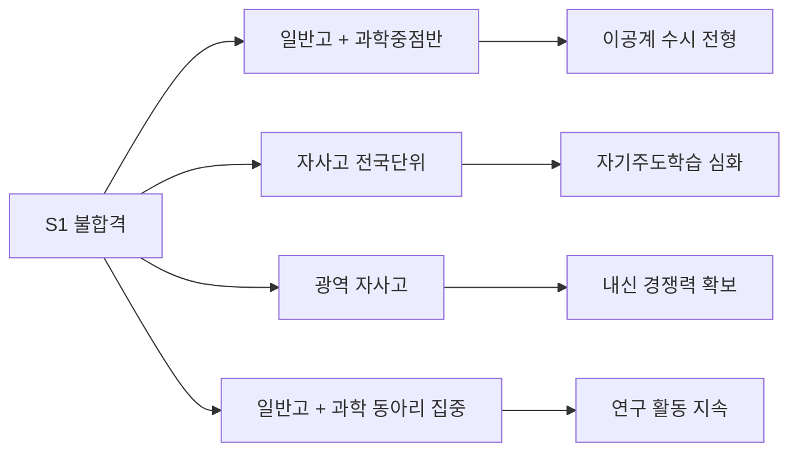

| 대안 루트 | 장점 | 단점 | 추천 대상 |
|----------|------|------|----------|
| **일반고 과학중점반** | 과학 심화 수업, 내신 유리 | 과학고 수준의 심화 부족 | 내신 경쟁력 높은 학생 |
| **자사고 전국단위** | 우수한 교육 환경 | 높은 경쟁률, 내신 불리 | 자기주도학습 강한 학생 |
| **광역 자사고** | 지역 내 우수 학생 집중 | 전국단위 대비 인지도 낮음 | 해당 지역 우수 학생 |
| **일반고 + 과학 동아리** | 내신 관리 용이 | 심화 교육 자체 확보 필요 | 대입 수시 목표 학생 |

---

# Route S2: 외국어고/국제고 루트

## S2 개요

외국어고등학교와 국제고등학교는 외국어 능력과 국제 감각을 갖춘 글로벌 인재 양성을 목표로 하는 특수목적고등학교입니다. 전국에 외국어고 약 30개교, 국제고 약 7개교가 운영되고 있습니다.

## S2 입학 전형 단계별 설명

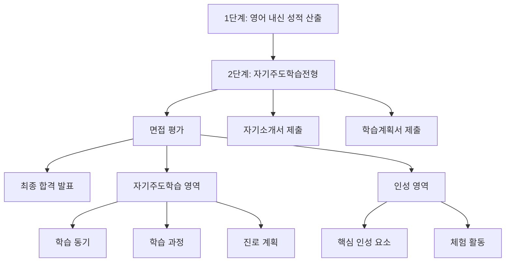

### 1단계: 내신 성적 산출

- **영어 내신**: 중2~중3 영어 교과 성적이 핵심 (배점 160점 내외)
- **기타 교과**: 국어, 수학, 사회 등 전 교과 성적 반영 (학교별 상이)
- **출결 사항**: 무단결석/지각 감점 적용

### 2단계: 자기주도학습전형

- **자기소개서**: 자기주도학습 경험, 지원 동기, 진로 계획 서술
- **학습계획서**: 고등학교 3년간 학습 목표 및 실천 방안 제시
- **유의사항**: 영어 인증시험(TOEFL, TOEIC 등) 점수, 교과 관련 교외 수상 실적 기재 금지

### 3단계: 면접 평가

- **자기주도학습 영역**: 학습 동기, 과정, 성과를 논리적으로 설명
- **인성 영역**: 배려심, 리더십, 봉사 정신 등 핵심 인성 요소 평가
- **추가 질문**: 시사 이슈, 독서 경험 관련 심층 질문

## S2 요구 역량

| 역량 분류 | 세부 역량 | 평가 방식 | 중요도 |
|----------|---------|---------|-------|
| **영어 능력** | 듣기, 읽기, 쓰기, 말하기 통합 | 내신 + 면접 | 최상 |
| **제2외국어** | 일본어, 중국어, 프랑스어 등 기초 | 면접 | 중 |
| **자기주도학습** | 스스로 학습 계획 수립 및 실행 증빙 | 서류 + 면접 | 최상 |
| **논리적 사고** | 자신의 의견을 체계적으로 정리 | 면접 | 상 |
| **글로벌 감각** | 국제 이슈에 대한 관심과 이해 | 면접 | 상 |
| **독서 역량** | 다양한 분야 독서 및 비판적 사고 | 서류 + 면접 | 중 |
| **인성** | 배려, 협업, 봉사 경험 | 면접 | 중 |

## S2 중학교 학년별 준비 전략

### 중1 준비 전략

1. **영어 기본기 강화**: 영어 문법 체계 정리, 원서 읽기 시작
2. **독서 습관 형성**: 인문/사회 분야 도서 월 3권 이상
3. **자기주도학습 습관**: 학습 플래너 작성, 오답 노트 정리 시작
4. **교내 활동 참여**: 영어 동아리, 토론 동아리 가입
5. **제2외국어 탐색**: 관심 있는 외국어 기초 학습 시작

### 중2 준비 전략

1. **영어 내신 최상위 유지**: 중2 영어 성적이 전형에 직접 반영
2. **영어 독서 심화**: 영어 원서 독서 및 독후감 영작 연습
3. **자기소개서 소재 확보**: 자기주도학습 성공 사례 구체적으로 정리
4. **글로벌 이슈 탐구**: 국제 뉴스 정기 구독, 시사 토론 참여
5. **봉사 활동**: 다문화 관련 봉사 등 인성 영역 소재 확보

### 중3 준비 전략 (지원 학년)

1. **중3 1학기 내신 올인**: 영어 만점 및 전 교과 최상위 목표
2. **자기소개서 작성**: 구체적 사례 중심, 3~5차 수정
3. **면접 대비**: 모의 면접 8회 이상, 예상 질문 100개 준비
4. **학습계획서 완성**: 고등학교 3년 학습 로드맵 구체화
5. **시사 이슈 정리**: 최근 6개월 주요 국제 이슈 정리

## S2 준비 타임라인

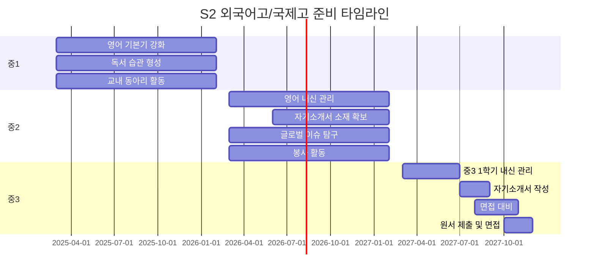

## S2 면접 평가 항목 세부 배점

| 평가 영역 | 세부 항목 | 배점 | 평가 기준 |
|----------|---------|------|---------|
| **자기주도학습** | 학습 동기 | 20점 | 지원 동기의 진정성, 구체성 |
| **자기주도학습** | 학습 과정 | 30점 | 학습 방법의 체계성, 실천 증거 |
| **자기주도학습** | 진로 계획 | 20점 | 진로 목표의 구체성, 실현 가능성 |
| **인성** | 핵심 인성 요소 | 15점 | 배려, 나눔, 협력, 타인 존중 |
| **인성** | 체험 활동 | 15점 | 봉사, 동아리, 체험 활동의 진정성 |

## S2 합격생 공통 특징

- **영어 내신 만점 또는 최상위**: 중2~중3 영어 전 학기 A 또는 최고 등급
- **풍부한 독서 이력**: 인문, 사회, 과학 분야 연간 30권 이상 독서
- **진정성 있는 자기소개서**: 학원 의존이 아닌 자기주도적 경험 중심 서술
- **유창한 면접 응답**: 긴장 상황에서도 논리적이고 자연스러운 답변
- **글로벌 관심**: 국제 이슈에 대한 자신만의 관점과 의견 보유
- **인성 활동 실적**: 봉사, 멘토링, 교내 리더십 경험 다수

## S2 불합격 시 대안 루트

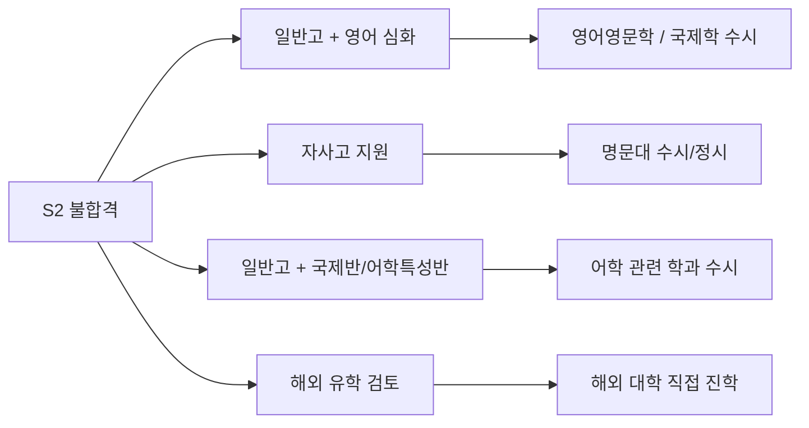

| 대안 루트 | 장점 | 단점 | 추천 대상 |
|----------|------|------|----------|
| **일반고 + 영어 심화** | 내신 관리 유리, 수시 경쟁력 | 어학 심화 환경 부족 | 내신 자신 있는 학생 |
| **자사고 지원** | 우수한 교육 환경 | 추가 전형 준비 필요 | 학업 역량 높은 학생 |
| **일반고 국제반** | 어학 교육 일부 제공 | 외고 수준에 미달 | 일반고 내 어학 강화 원하는 학생 |
| **해외 유학** | 글로벌 경험, 어학 완성 | 비용 부담, 적응 문제 | 경제적 여유 + 해외 관심 학생 |

---

# Route S3: 자사고(전국단위) 루트

## S3 개요

전국단위 자율형사립고등학교(자사고)는 민족사관고등학교, 상산고등학교, 현대청운고등학교, 포항제철고등학교, 김천고등학교, 광양제철고등학교, 북일고등학교, 인천하늘고등학교 등이 대표적입니다. 자기주도학습 능력과 높은 학업 역량을 갖춘 학생을 선발하며, 기숙사 생활을 기본으로 합니다.

## S3 입학 전형 단계별 설명

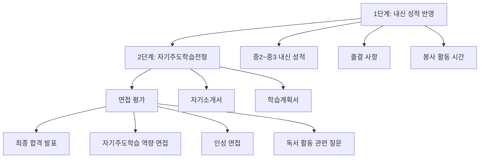

### 1단계: 내신 성적 반영

- **교과 성적**: 중2~중3 전 교과 성적 반영 (국어, 영어, 수학, 사회, 과학 중심)
- **출결 사항**: 무단결석 감점, 개근 가산점 (학교별 상이)
- **봉사 활동**: 연간 봉사시간 반영 (20시간 이상 권장)

### 2단계: 자기주도학습전형 서류

- **자기소개서**: 자기주도학습 경험, 학교생활 활동 경험 서술
- **학습계획서**: 입학 후 학습 목표 및 실천 계획
- **금지 사항**: 교외 수상 실적, 영어/수학 인증시험 점수 기재 금지

### 3단계: 면접 평가

- **자기주도학습 역량**: 학습 동기, 방법, 성과의 일관성
- **인성**: 공동체 의식, 리더십, 배려와 나눔
- **독서 활동**: 읽은 책에 대한 깊이 있는 이해와 비판적 사고

## S3 요구 역량

| 역량 분류 | 세부 역량 | 평가 방식 | 중요도 |
|----------|---------|---------|-------|
| **학업 역량** | 전 교과 상위권 성적 | 내신 | 최상 |
| **자기주도학습** | 주도적 학습 경험과 방법론 | 서류 + 면접 | 최상 |
| **인성** | 배려, 나눔, 공동체 의식 | 면접 | 상 |
| **독서 역량** | 폭넓은 독서와 비판적 사고 | 면접 | 상 |
| **리더십** | 학급/동아리 리더 경험 | 서류 + 면접 | 중 |
| **목표 의식** | 명확한 진로 목표와 계획 | 서류 + 면접 | 중 |
| **기숙사 적응력** | 단체 생활 적응 능력 | 면접 | 중 |

## S3 중학교 학년별 준비 전략

### 중1 준비 전략

1. **전 교과 균형 학습**: 특정 과목 편중 없이 전 교과 상위권 목표
2. **자기주도학습 시스템 구축**: 학습 플래너 작성, 주간/월간 목표 설정
3. **독서 습관 형성**: 인문, 사회, 과학, 문학 분야 월 4권 이상
4. **교내 활동 참여**: 학급 임원, 동아리 활동 시작
5. **봉사 활동 시작**: 정기적 봉사 활동 계획 수립

### 중2 준비 전략

1. **내신 최상위 유지**: 중2 내신이 전형에 직접 반영되므로 전 과목 A 목표
2. **자기주도학습 사례 축적**: 실패와 극복 경험, 학습 방법 개선 사례 정리
3. **리더십 경험 확보**: 학생회, 동아리 임원, 학급 반장 등 경험
4. **독서 심화**: 읽은 책에 대한 서평 작성, 토론 활동 참여
5. **목표 학교 탐색**: 전국단위 자사고 각 학교 특성 조사 및 방문

### 중3 준비 전략 (지원 학년)

1. **중3 1학기 내신 관리**: 최종 반영 내신이므로 최상위 성적 필수
2. **자기소개서 작성**: 진정성 있는 경험 위주, 첨삭 3회 이상
3. **면접 준비**: 예상 질문 준비, 모의 면접 실시
4. **독서 정리**: 면접에서 질문받을 수 있는 핵심 도서 5~10권 심층 정리
5. **기숙사 생활 대비**: 자립 생활 습관 훈련

## S3 전국단위 자사고 비교표

| 학교명 | 소재지 | 설립 유형 | 특징 | 경쟁률(최근) |
|--------|-------|---------|------|-----------|
| **민족사관고** | 강원 횡성 | 사립 | 한국학/글로벌 융합 교육 | 약 6:1 |
| **상산고** | 전북 전주 | 사립 | 학업 집중형, SKY 진학률 높음 | 약 4:1 |
| **현대청운고** | 울산 | 사립 | 현대 장학금 지원, 이공계 강점 | 약 3:1 |
| **포항제철고** | 경북 포항 | 사립 | POSCO 지원, 이공계 특화 | 약 3:1 |
| **김천고** | 경북 김천 | 사립 | 전통적 명문, 인문계 강점 | 약 3:1 |
| **광양제철고** | 전남 광양 | 사립 | POSCO 지원, 소규모 정원 | 약 2.5:1 |
| **북일고** | 충남 천안 | 사립 | 내신 관리 체계적 | 약 3:1 |
| **인천하늘고** | 인천 | 사립 | 항공우주 특성, 기숙형 | 약 4:1 |

## S3 합격생 공통 특징

- **전 교과 최상위 내신**: 중2~중3 전 과목 평균 A 이상
- **체계적 자기주도학습 이력**: 플래너 활용, 오답 노트, 학습 반성 일지 등 증빙 가능
- **폭넓은 독서**: 연간 40권 이상, 다양한 분야 포괄
- **교내 리더십 경험**: 학생회, 동아리 임원, 학급 반장 등 다수
- **진정성 있는 면접 태도**: 암기식이 아닌 자신의 경험을 바탕으로 자연스럽게 답변
- **명확한 진로 의식**: "왜 이 학교에 오고 싶은지"에 대한 구체적 답변

## S3 불합격 시 대안 루트

| 대안 루트 | 장점 | 단점 | 추천 대상 |
|----------|------|------|----------|
| **광역 자사고** | 지역 내 우수 교육, 내신 유리 | 전국단위 대비 학생 풀 작음 | 해당 지역 우수 학생 |
| **외국어고/국제고** | 어학 특화 교육 | 이공계 지망 시 불리 | 어학 역량 우수 학생 |
| **일반고 상위권** | 내신 경쟁력 극대화 | 학습 환경 자기 관리 필요 | 수시 전형 목표 학생 |
| **광역 자사고 + 학원 병행** | 심화 학습 보완 | 시간/비용 부담 | 자기관리 능력 높은 학생 |

---

# Route S4: 예술고/체육고 루트

## S4 개요

예술고등학교는 음악, 미술, 무용, 연극영화 등 예술 분야의 전문 인재를, 체육고등학교는 체육 분야의 전문 운동선수를 양성하는 특수목적고등학교입니다. 실기 능력이 전형의 핵심이며, 어린 시절부터의 꾸준한 훈련이 필수적입니다.

## S4 입학 전형 단계별 설명

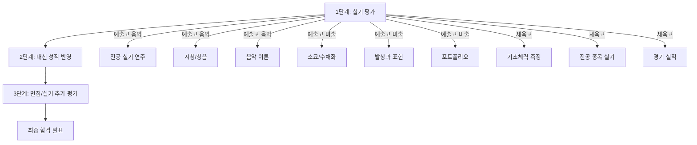

### 예술고 전형 세부

**음악과**
- **전공 실기**: 피아노, 바이올린, 첼로, 성악 등 전공 악기/성악 연주
- **시창/청음**: 악보를 보고 노래하기, 음정/리듬 받아쓰기
- **음악 이론**: 악전, 음악사 기초 지식 평가

**미술과**
- **소묘**: 석고상 또는 정물 소묘 (4~6시간)
- **수채화/발상과 표현**: 주어진 주제에 대한 창의적 표현
- **포트폴리오**: 개인 작품집 제출 (학교에 따라 선택)

**무용과**
- **기본기**: 발레/한국무용/현대무용 기본 동작
- **작품 발표**: 자유 창작 또는 지정 작품 실연
- **신체 조건**: 유연성, 체형 등 신체 조건 평가

### 체육고 전형 세부

- **기초체력**: 50m 달리기, 제자리멀리뛰기, 윗몸일으키기 등
- **전공 실기**: 해당 종목 기술 시험
- **경기 실적**: 전국/시도 대회 입상 실적 반영
- **내신**: 일정 기준 이상의 학교 성적 필요

## S4 요구 역량 (분야별)

| 분야 | 역량 | 평가 방식 | 준비 시작 시기 | 중요도 |
|------|------|---------|------------|-------|
| **음악** | 전공 악기 연주력 | 실기 시험 | 초등 저학년 | 최상 |
| **음악** | 시창/청음 능력 | 실기 시험 | 초등 고학년 | 상 |
| **음악** | 음악 이론 지식 | 필기 시험 | 중1 | 중 |
| **미술** | 소묘/수채화 실력 | 실기 시험 | 초등 고학년 | 최상 |
| **미술** | 창의적 표현력 | 실기 + 포트폴리오 | 초등 저학년 | 상 |
| **미술** | 미술사 지식 | 면접 | 중2 | 중 |
| **무용** | 신체 조건/유연성 | 실기 시험 | 유아기 | 최상 |
| **무용** | 기본기/테크닉 | 실기 시험 | 초등 저학년 | 최상 |
| **체육** | 전공 종목 기술 | 실기 시험 | 초등 저학년 | 최상 |
| **체육** | 기초 체력 | 체력 측정 | 초등 고학년 | 상 |
| **체육** | 대회 실적 | 서류 | 초등 고학년 | 상 |

## S4 중학교 학년별 준비 전략

### 중1 준비 전략

1. **전공 실기 집중 훈련**: 전공 교사/코치와 주 3회 이상 레슨
2. **기본기 강화**: 테크닉의 기초를 탄탄히 다지는 시기
3. **교내 대회 참여**: 교내 예술제, 체육대회 적극 참여 및 수상
4. **내신 최소 기준 확보**: 예술고/체육고의 내신 커트라인 파악 후 관리
5. **포트폴리오 시작**: 작품 아카이빙, 대회 결과 기록 시작

### 중2 준비 전략

1. **실기 수준 향상**: 전문 학원/개인 레슨 강도 높이기
2. **대회 참여 확대**: 시도 대회, 전국 대회 적극 참여
3. **목표 학교 탐색**: 서울예고, 국립국악고, 한국예술종합학교 부설 등 목표 학교 설정
4. **모의 실기 테스트**: 실전과 유사한 환경에서 실기 연습
5. **멘탈 관리**: 무대 공포증 극복, 시험 상황 적응 훈련

### 중3 준비 전략 (지원 학년)

1. **목표 학교 입시 설명회 참석**: 전형 세부 사항 확인
2. **실기 최종 점검**: 시험 곡목/주제 확정, 반복 연습
3. **내신 관리**: 커트라인 이상 성적 확보
4. **포트폴리오 완성**: 최종 작품집 정리 및 제출 준비
5. **실전 모의고사**: 실제 시험과 동일 조건으로 3회 이상 연습

## S4 예술고/체육고 전형 일정

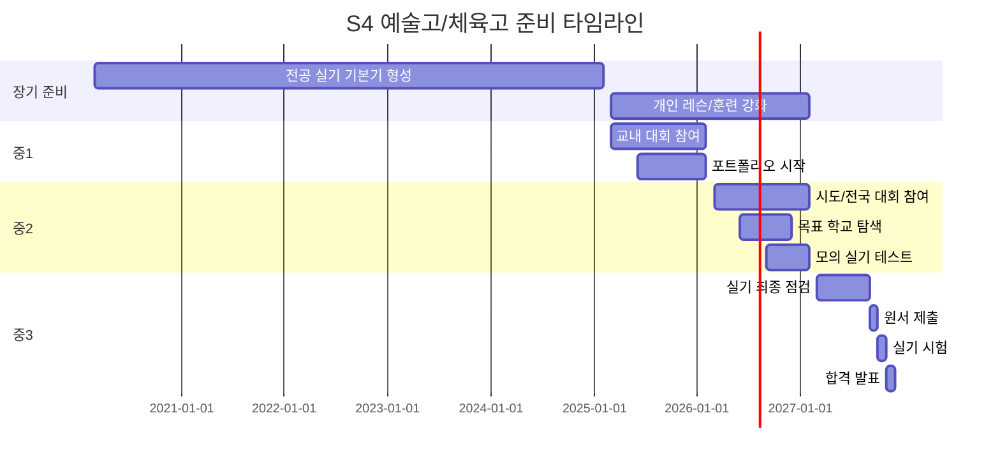

## S4 합격생 공통 특징

- **어린 시절부터의 꾸준한 훈련**: 최소 5~7년 이상의 전공 훈련 경력
- **대회 수상 실적**: 시도 또는 전국 단위 대회 입상 경험
- **전문 교사/코치의 지도**: 실력 있는 전문가에게 체계적 지도 받은 이력
- **강한 예술적/체육적 열정**: 힘든 훈련을 견딜 수 있는 내적 동기
- **무대/경기 경험 풍부**: 실전 경험이 많아 시험 상황에서 긴장하지 않음
- **기본 학업 능력 유지**: 내신 커트라인 이상의 학업 성적 확보

## S4 불합격 시 대안 루트

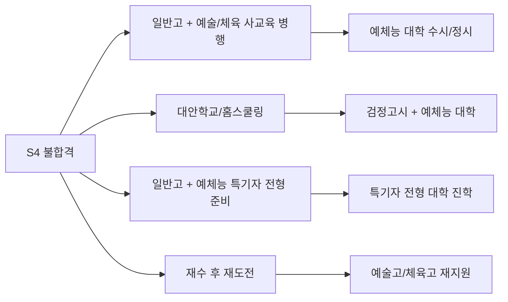

| 대안 루트 | 장점 | 단점 | 추천 대상 |
|----------|------|------|----------|
| **일반고 + 사교육 병행** | 학업과 예체능 병행 가능 | 시간 부족, 체력 소모 | 학업도 중시하는 학생 |
| **대안학교** | 유연한 커리큘럼 | 학력 인정 문제 | 자유로운 환경 선호 학생 |
| **일반고 + 특기자 준비** | 대학 진학 시 활용 가능 | 고교 수준 전문 교육 부족 | 대학 목표가 명확한 학생 |
| **재도전** | 실기 실력 향상 기회 | 1년 지연 | 실력 부족이 원인인 학생 |

---

# Route S5: 마이스터고/특성화고 루트

## S5 개요

마이스터고는 산업 수요와 연계한 맞춤형 교육과정을 운영하며 졸업 후 우수 기업 취업을 목표로 하는 고등학교입니다. 특성화고는 특정 분야(공업, 상업, 농업, 수산, 정보 등)의 전문 교육을 제공합니다. 두 유형 모두 취업과 진학을 병행할 수 있으며, 최근 선취업 후진학 정책의 활성화로 주목받고 있습니다.

## S5 입학 전형 단계별 설명

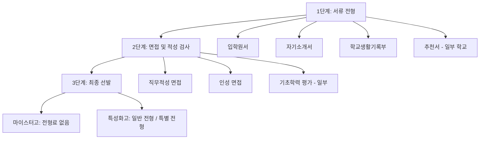

### 마이스터고 전형 세부

- **1단계 서류**: 자기소개서(직업 동기, 학습 계획), 학교생활기록부
- **2단계 면접**: 직무적성 면접(해당 분야 관심도, 기초 지식), 인성 면접
- **선발 기준**: 해당 분야에 대한 관심과 열정, 직업 의식, 기초 학력

### 특성화고 전형 세부

- **일반 전형**: 내신 성적 + 출결 + 봉사활동 시간 종합 평가
- **특별 전형**: 마이스터 인재 전형, 산업체 위탁 전형 등
- **자기주도학습전형**: 일부 특성화고에서 실시 (자기소개서 + 면접)

## S5 요구 역량

| 역량 분류 | 세부 역량 | 평가 방식 | 중요도 |
|----------|---------|---------|-------|
| **직업 의식** | 해당 분야 취업 의지, 직업관 | 서류 + 면접 | 최상 |
| **기초 학력** | 국어, 영어, 수학 기본 이해 | 내신 + 평가 | 상 |
| **분야 관심도** | 관련 분야 탐색 경험, 체험 활동 | 서류 + 면접 | 상 |
| **성실성** | 출결, 봉사활동, 교내 활동 참여 | 학생부 | 상 |
| **기술 적성** | 손재주, 논리적 사고, 창의성 | 적성 검사 + 면접 | 중 |
| **의사소통** | 자기 표현력, 면접 태도 | 면접 | 중 |
| **자립 의지** | 경제적 독립, 자기 관리 능력 | 면접 | 중 |

## S5 마이스터고/특성화고 분야별 분류

| 분야 | 대표 학교 | 주요 학과 | 졸업 후 진로 |
|------|---------|---------|-----------|
| **기계/자동차** | 수원하이텍고, 부산기계공업고 | 기계과, 자동차과 | 현대차, 삼성전기, 두산 등 |
| **전자/반도체** | 구미전자공업고, 반도체고 | 전자과, 반도체과 | 삼성전자, SK하이닉스 등 |
| **IT/소프트웨어** | 서울디지텍고, 한국디지털미디어고 | 소프트웨어과, 웹프로그래밍과 | 네이버, 카카오, NHN 등 |
| **바이오/화학** | 한국바이오마이스터고 | 바이오제약과, 바이오화학과 | 셀트리온, 삼성바이오 등 |
| **에너지** | 한국원자력마이스터고 | 원자력과, 방사선과 | 한수원, 한전 등 |
| **식품/조리** | 한국조리과학고 | 조리과, 제과제빵과 | 호텔, 외식 프랜차이즈 등 |
| **디자인** | 서울미디어고, 한국게임과학고 | 게임개발과, 디자인과 | 게임사, 디자인 에이전시 등 |
| **금융/회계** | 서울금융고 | 금융정보과, 회계과 | 은행, 증권사, 보험사 등 |

## S5 중학교 학년별 준비 전략

### 중1 준비 전략

1. **적성 탐색**: 다양한 직업 체험 프로그램 참여 (꿈길, 자유학기제 활용)
2. **기초 학력 확보**: 국어, 영어, 수학 기본 개념 확실히 정리
3. **관심 분야 탐색**: 관련 도서 읽기, 유튜브 채널 시청, 체험 활동
4. **출결 관리**: 무단결석/지각 없이 성실한 학교생활
5. **봉사 활동**: 정기적 봉사활동 시작 (연 20시간 이상)

### 중2 준비 전략

1. **목표 학교 결정**: 마이스터고/특성화고 중 목표 학교 3개 선정
2. **관련 분야 심화 탐구**: 코딩, 기계, 요리 등 관심 분야 실습 경험 확보
3. **내신 관리**: 중2 성적이 전형에 반영되므로 상위권 유지
4. **학교 설명회 참석**: 목표 학교 입시 설명회 및 캠퍼스 투어 참여
5. **자기소개서 소재 확보**: 분야 관련 활동 경험 정리

### 중3 준비 전략 (지원 학년)

1. **자기소개서 작성**: 직업 동기, 분야 관심 경험, 학습 계획 구체적 서술
2. **면접 준비**: 해당 분야 기초 지식, 직업관, 입학 후 계획 정리
3. **내신 마무리**: 중3 1학기 성적까지 반영되므로 끝까지 관리
4. **추천서 확보**: 담임 교사 또는 관련 교과 교사 추천서 의뢰
5. **동시 지원 전략**: 마이스터고(선 지원) + 특성화고(후 지원) 병행 전략

## S5 준비 타임라인

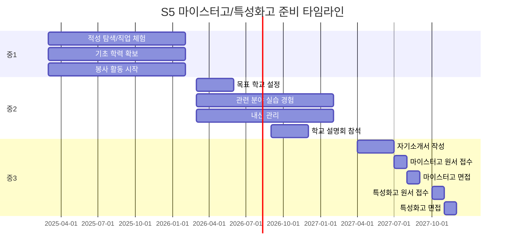

## S5 마이스터고 vs 특성화고 비교

| 비교 항목 | 마이스터고 | 특성화고 |
|----------|----------|---------|
| **설립 목적** | 산업 수요 맞춤형 인재 양성 | 특정 분야 전문 교육 |
| **학교 수** | 전국 약 50개교 | 전국 약 500개교 |
| **경쟁률** | 2:1 ~ 4:1 | 1:1 ~ 2:1 |
| **전형 방식** | 자기주도학습전형 (서류 + 면접) | 내신 + 출결 위주 |
| **교육과정** | 산업체 연계 실무 중심 | 이론 + 실습 병행 |
| **취업 지원** | 졸업 전 취업 연계 (높은 취업률) | 자체 취업 지도 |
| **대학 진학** | 선취업 후진학 제도 활용 | 수시/정시 지원 가능 |
| **장학금** | 전액 장학금 (대부분) | 학교별 상이 |
| **기숙사** | 전원 기숙사 (대부분) | 학교별 상이 |
| **졸업 후 급여** | 대기업 수준 초봉 | 중견기업 수준 |

## S5 합격생 공통 특징

- **명확한 직업 목표**: "나는 이 분야에서 일하고 싶다"는 확고한 의지
- **관련 분야 체험 경험**: 직업 체험, 동아리 활동, 독학 등 구체적 경험
- **성실한 학교생활**: 출결 우수, 봉사활동 적극 참여
- **기초 학력 확보**: 국/영/수 기본 개념 이해 수준 이상
- **자립 의지**: 경제적 독립, 사회 진출에 대한 적극적 태도
- **의사소통 능력**: 면접에서 자신의 의지를 명확히 전달하는 능력

## S5 불합격 시 대안 루트

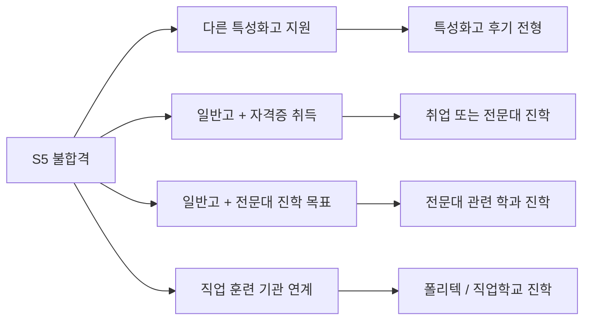

| 대안 루트 | 장점 | 단점 | 추천 대상 |
|----------|------|------|----------|
| **다른 특성화고** | 유사 분야 교육 가능 | 선호 학교 아닐 수 있음 | 분야 관심 확고한 학생 |
| **일반고 + 자격증** | 학업과 자격증 병행 | 실무 교육 부족 | 자기관리 능력 높은 학생 |
| **일반고 + 전문대 목표** | 대학 진학 폭 넓음 | 고교 전문 교육 부재 | 진학 목표 우선 학생 |
| **직업 훈련 기관** | 실무 중심 교육 | 학력 인정 문제 | 빠른 취업 원하는 학생 |

---

# 종합 비교 및 전략 가이드

## 전체 루트 핵심 비교표

| 비교 항목 | S1 과학고/영재고 | S2 외국어고/국제고 | S3 자사고(전국) | S4 예술고/체육고 | S5 마이스터고/특성화고 |
|----------|--------------|---------------|-------------|-------------|-----------------|
| **주요 선발 요소** | 수학/과학 심화 | 영어 내신 + 면접 | 내신 + 자기주도학습 | 실기 | 직무적성 + 면접 |
| **경쟁률** | 5:1~15:1 | 3:1~8:1 | 3:1~6:1 | 2:1~10:1 | 1.5:1~4:1 |
| **준비 시작 시기** | 초등 5~6학년 | 중1~중2 | 중1~중2 | 초등 저학년 | 중2~중3 |
| **학비 수준** | 국립 저렴 | 사립 다수 | 사립 (높음) | 중간 | 대부분 무상 |
| **기숙사** | 대부분 있음 | 학교별 상이 | 전원 기숙 | 학교별 상이 | 대부분 있음 |
| **대학 진학률** | 90% 이상 | 85% 이상 | 90% 이상 | 70~85% | 30~50% |
| **졸업 후 취업** | 거의 없음 | 거의 없음 | 거의 없음 | 일부 직업 활동 | 50~70% |

## 학생 유형별 추천 루트

| 학생 유형 | 1순위 추천 | 2순위 추천 | 핵심 판단 기준 |
|----------|----------|----------|-------------|
| **수학/과학 영재** | S1 과학고/영재고 | S3 자사고 | KMO/과학올림피아드 수준 |
| **어학 우수형** | S2 외국어고/국제고 | S3 자사고 | 영어 내신 + 글로벌 관심 |
| **전 과목 상위권** | S3 자사고 | S2 외국어고 | 자기주도학습 이력 |
| **예술/체육 재능** | S4 예술고/체육고 | 일반고 + 사교육 | 실기 수준 + 대회 실적 |
| **취업 목표형** | S5 마이스터고 | S5 특성화고 | 직업 의식 + 분야 관심 |
| **경제적 고려형** | S5 마이스터고 | S1 과학고(국립) | 장학금/무상교육 여부 |

## 전형 일정 총괄 (중3 기준)

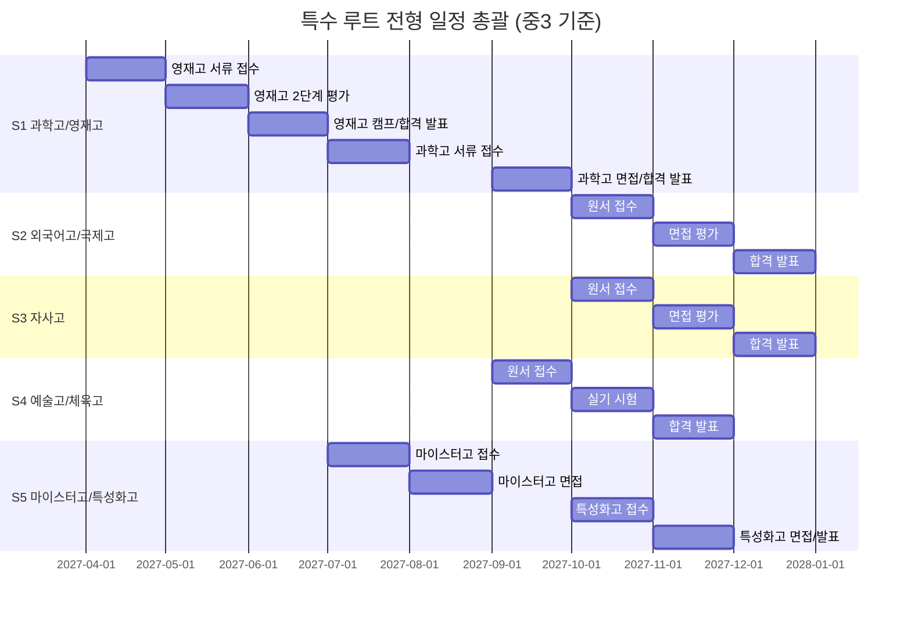

## 복수 지원 전략 마인드맵

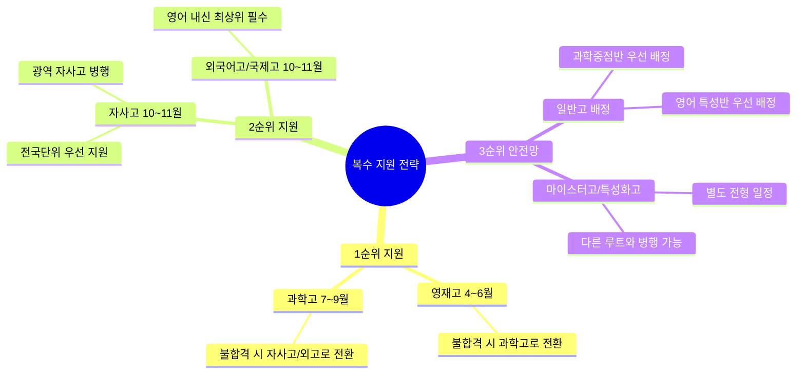

## 자기소개서 작성 핵심 가이드

| 항목 | 올바른 작성법 | 잘못된 작성법 |
|------|------------|------------|
| **학습 동기** | "중2 때 물리 수업에서 빛의 굴절 실험을 하다가..." (구체적 사례) | "어릴 때부터 과학을 좋아했습니다" (추상적) |
| **학습 과정** | "오답 노트를 만들어 매일 30분씩 복습하며..." (방법 구체화) | "열심히 공부했습니다" (구체성 부족) |
| **성장 경험** | "처음에는 수학 경시 예선에서 떨어졌지만..." (실패 후 극복) | "모든 대회에서 좋은 성적을 거두었습니다" (완벽한 이미지) |
| **진로 계획** | "고등학교에서 R&E를 통해 촉매 화학을 연구하고..." (구체적 계획) | "과학자가 되고 싶습니다" (막연한 목표) |
| **인성 영역** | "학급 친구가 수학을 어려워해서 매주 화요일..." (행동 증심) | "다른 사람을 잘 도와줍니다" (선언적) |

## 면접 준비 체크리스트

| 준비 항목 | 세부 내용 | 준비 기간 | 확인 |
|----------|---------|---------|------|
| **자기소개서 숙지** | 자소서 내용 완벽 숙지, 예상 질문 준비 | 면접 2주 전 | - |
| **학교 정보 파악** | 지원 학교 교육 과정, 특색 사업 조사 | 면접 3주 전 | - |
| **시사 이슈 정리** | 최근 3개월 주요 시사 이슈 10개 정리 | 면접 1개월 전 | - |
| **모의 면접 실시** | 교사/부모/학원 모의 면접 5회 이상 | 면접 1개월 전 | - |
| **복장/태도 점검** | 교복 착용, 인사법, 자세 연습 | 면접 1주 전 | - |
| **당일 준비물** | 수험표, 신분증, 필기구, 여분 서류 | 면접 전날 | - |
| **심리 안정** | 충분한 수면, 긍정적 마인드 유지 | 면접 전날 | - |

## 학부모 지원 가이드

| 지원 영역 | 구체적 행동 | 주의 사항 |
|----------|----------|---------|
| **정보 수집** | 학교 설명회 참석, 합격 사례 조사 | 과도한 정보에 흔들리지 말 것 |
| **환경 조성** | 학습 공간 확보, 적절한 교육비 투자 | 사교육 의존도 점검 |
| **심리 지원** | 격려와 응원, 스트레스 관리 | 과도한 기대 표현 자제 |
| **진로 상담** | 자녀와 진로 대화, 적성 탐색 지원 | 부모 희망 강요하지 말 것 |
| **행정 지원** | 원서 접수 일정 관리, 서류 준비 | 마감일 철저히 확인 |
| **건강 관리** | 규칙적 식사, 운동, 수면 관리 | 입시 스트레스로 인한 건강 악화 주의 |

## 최종 의사결정 플로우

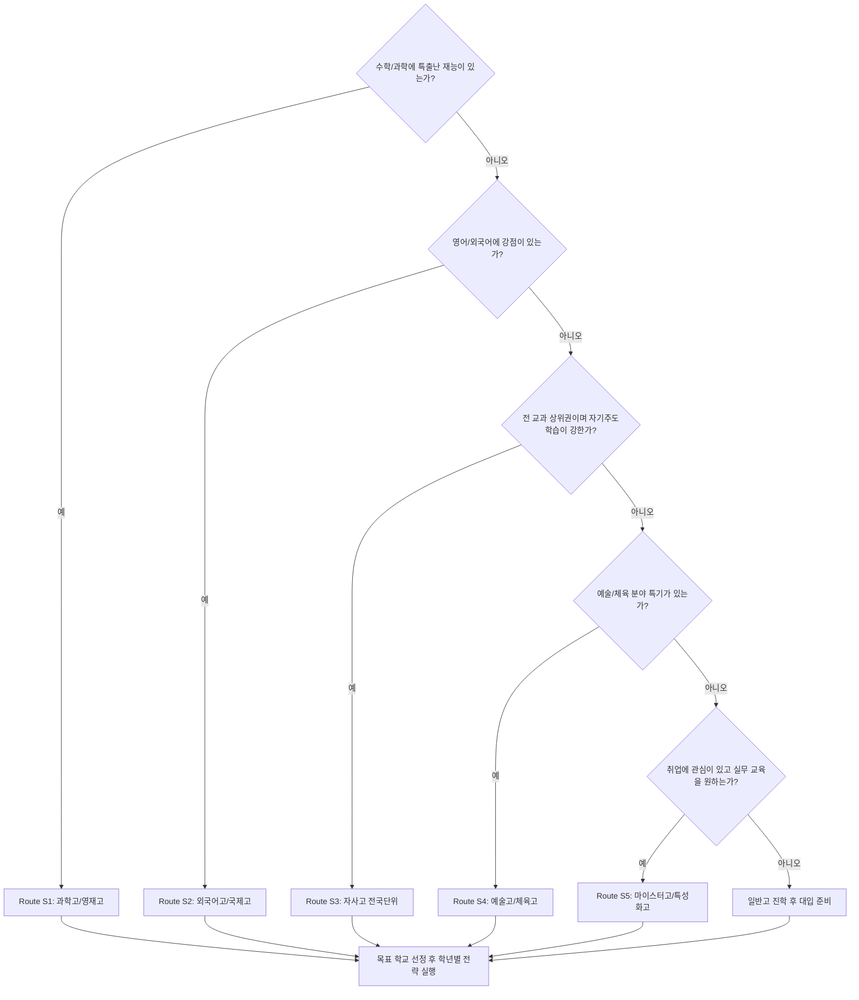

---

## 참고 사항

- 각 학교의 전형 요강은 매년 변경될 수 있으므로 반드시 해당 연도 모집 요강을 확인하세요.
- 전형 일정은 대략적인 기준이며, 학교별로 차이가 있습니다.
- 불합격 시 대안 루트를 미리 준비하되, 1순위 목표에 집중하는 것이 중요합니다.
- 학원이나 컨설팅에 과도하게 의존하기보다 자기주도적 준비가 핵심입니다.
- 학부모와 학생이 함께 충분히 대화하고 합의하여 루트를 결정하세요.
