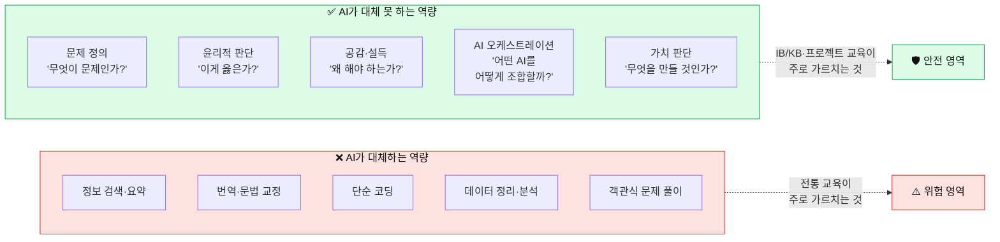
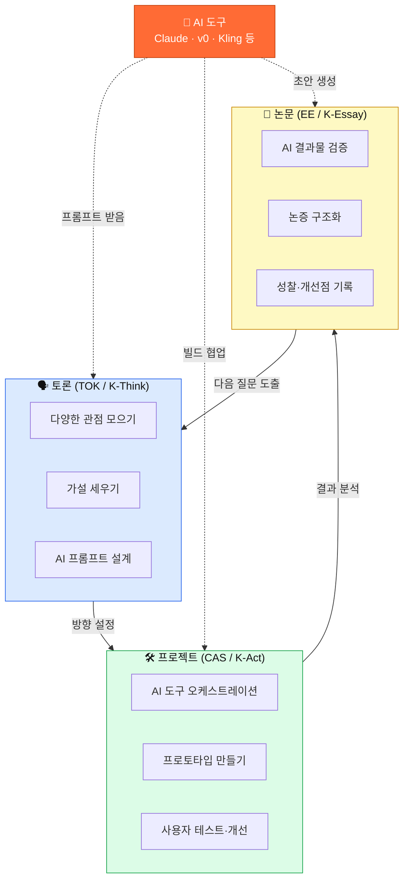
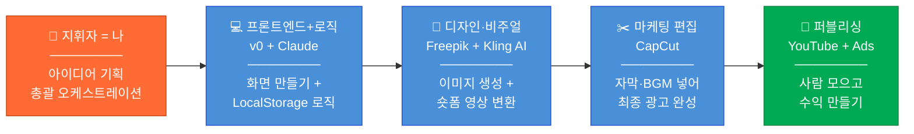
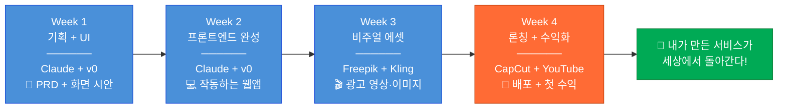
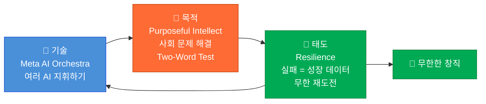

# AI 시대 미래 교육 — 방학 4주 프로젝트로 '창직' 해보기

> - **대상**: 중학생과 학부모 · **기준일**: 2026년 7월
> - **한 줄 소개**: 방학 4주 동안 AI를 지휘해서 **진짜 작동하는 앱 하나**를 만들고, 세상에 내놓아 보는 실전 가이드예요.

---

## 0. 30초 요약 — 이것만 알고 시작해요

| 질문 | 한 줄 답 |
|---|---|
| **이게 뭐 하는 거예요?** | 방학 4주 동안 AI 도구들을 지휘해서 **웹앱 하나를 만들고 실제로 배포**해보는 프로젝트예요. |
| **코딩 몰라도 되나요?** | 네. 코드는 AI가 써요. 학생은 **"무엇을 만들지" 정하고 AI에게 시키는 사람**이에요. |
| **돈이 드나요?** | 거의 안 들어요. 도구 대부분이 무료이고, 서버도 안 빌려요. |

| **왜 지금 해야 하나요?** | **2028 수능 개편**으로 세특 비중이 **35~40%**로 커져요. 이런 프로젝트가 그때 무기가 돼요. |
| **핵심 한 단어로?** | **창직(創職)** — 남이 만든 직업에 들어가는 게 아니라, 내가 직업을 만드는 것. |

> - 💡 **팁**: 원래 고1용으로 만들어진 프레임워크를 **중학생 눈높이로 다시 쓴 것**이에요. 
> - 어려우면 7장(4주 로드맵)부터 봐도 괜찮아요.

---

## 1. 왜 미래 교육이 바뀌어야 할까요?

> 💡 **한 줄 요약**: AI가 정답을 다 알려주는 시대예요. **"정답을 아는 사람"은 AI와 경쟁**하게 되고, **"좋은 질문을 던지는 사람"**만 대체되지 않아요.

### 1.1 30초로 이해하기

```
예전 교육: 정답 암기 → 시험 → 등급 → 취업          (BG 마인드)
AI 시대:   질문 설계 → 프로젝트 → 가치 창출 → 창직  (AG 마인드)
```

**BG** = Before Gen-AI(생성형 AI 이전) / **AG** = After Gen-AI(생성형 AI 이후, 지금!)

AI가 검색·요약·번역·코딩을 다 해주니, **정답을 외우는 능력**만으로는 AI를 이길 수 없어요.

### 1.2 BG vs AG — 마인드셋 비교표

| 구분 | 😴 BG (생성형 AI 이전) | 🚀 AG (생성형 AI 이후) |
|---|---|---|
| **목표** | 좋은 직장에 취업하기 | **직접 직업을 만들기 (창직)** |
| **무기** | 스펙 (학점, 자격증) | **포트폴리오 (직접 만들어 내놓은 것)** |
| **학습 방식** | 강의 듣기 → 암기 → 시험 | **문제 발견 → 만들기 → 내놓기** |
| **실패 해석** | 좌절, "나는 안 되나 봐" | **데이터 수집, "프롬프트 고쳐서 다시!"** |
| **AI 활용** | AI 하나한테 질문 (팔로워) | **여러 AI를 지휘 (오케스트레이터)** |
| **수익 구조** | 월급 (정해져 있음) | **내 프로덕트 수익 (커질 수 있음)** |
| **핵심 역량** | 지식 암기량 | **문제 정의력 + AI 오케스트레이션** |

> ⚠️ **주의**: BG가 나쁘고 AG가 좋다는 뜻이 아니에요. **BG 방식만 훈련하면 AI와 정면으로 경쟁하게 된다**는 뜻이에요.

---

## 2. 지식 소비자에서 지식 생산자로

> 💡 **한 줄 요약**: 지식을 **받아먹는 사람**에서 지식을 **만들어 내놓는 사람**으로 자리를 옮기는 게 핵심이에요.

### 2.1 세 가지 교육 비교

| 차원 | 전통 교육 (암기형) | IB/KB 교육 (탐구형) | AI 시대 교육 (창직형) |
|---|---|---|---|
| **학생 역할** | 수동적으로 받아적기 | 탐구하고 발표하기 | **AI 지휘자 · 가치 창출자** |
| **지식의 의미** | 외워야 할 정보 | 탐구해야 할 대상 | **조합·재구성할 원재료** |
| **평가 기준** | 정답률 | 논증의 깊이 | **만든 것의 가치** |
| **AI의 위치** | 없음 / 금지 | 보조 도구 | **핵심 협업 파트너** |
| **최종 산출물** | 시험 점수 | 에세이 · 발표 | **세상에 내놓은 프로덕트** |
| **실패 처리** | 감점 | 피드백 받고 수정 | **프롬프트 고쳐서 재시도** |

### 2.2 AI가 대체하는 능력 vs 대체 못 하는 능력



> 📌 **무릎을 칠 포인트**: 오른쪽 초록 박스(AI가 못 하는 것)는 전부 **토론·프로젝트·논문 쓰기**로 길러지는 능력이에요. 그래서 다음 장이 중요합니다.

> 💡 **이걸 "목적 있는 지성"(Purposeful Intellect)이라고 해요**: "어? 이거 불편한데" → "왜 아직 아무도 안 고쳤지?" → Two-Word Test(4장) → 4주 프로젝트로 해결. 순서는 이게 다예요.

---

## 3. IB/KB 교육이 왜 AI 시대의 필수 훈련인가

> 💡 **한 줄 요약**: **토론·프로젝트·논문** — IB/KB의 이 세 가지가 정확히 **AI가 대체 못 하는 능력**을 길러줘요. 우연이 아니에요.

### 3.1 먼저, IB랑 KB가 뭐예요?

| 용어 | 쉽게 말하면 |
|---|---|
| **IB**(International Baccalaureate — 국제 바칼로레아) | 스위스 IBO가 만든 **국제 교육과정**. 시험이 100% 서술형. 전국 공교육 고교 **18곳**에서 운영 중. |
| **KB**(K-Baccalaureate — 한국형 바칼로레아) | 한국 교육부·교육청이 만드는 **한국판 IB**. 영어 장벽과 비싼 인증비를 뺐어요. **2026년 9월 대구에서 평가 시스템 첫 가동.** |

> ⚠️ **주의**: KB는 **아직 대학이 공식 인정하는 제도가 아니에요.** 2026년 지금은 대구에서 막 시작하는 단계고, 고등교육법 개정은 2027년 목표로 추진 중이에요.

### 3.2 IB/KB의 3대 무기 — 토론·프로젝트·논문

| 교육 방법 | IB에서 | KB에서 | **AI 시대에 왜 필요한가** |
|---|---|---|---|
| 🗣️ **토론** | **TOK** (Theory of Knowledge — 지식론) | **K-Think** (사고와 논증) | 여러 관점을 종합하는 힘 → **AI에게 줄 프롬프트를 설계하는 능력**이 돼요 |
| 🛠️ **프로젝트** | **CAS** (창의·활동·봉사) | **K-Act** (실천과 성찰) | 실행력 + 결과물 → **실제로 내놓을 프로덕트**가 나와요 |
| 📝 **논문(에세이)** | **EE** (Extended Essay — 소논문) | **K-Essay** (탐구 논문, 4,000자 내외) | 논증을 구조화하는 힘 → **AI가 뱉은 결과물을 비판적으로 검증**할 수 있어요 |

### 3.3 이 셋이 AI와 어떻게 맞물리나요?



**보이시나요?** 토론 → 프로젝트 → 논문이 **돌고 도는 원**이고, AI는 그 원의 **모든 지점에 붙어요.**

### 3.4 왜 IB/KB 능력이 그대로 '창직' 능력인가

| IB/KB 역량 | 창직에 필요한 이유 | 놀라운 연결 |
|---|---|---|
| **EE / K-Essay** | 사업 제안서 · 투자 발표 능력 | 4,000자 소논문 구조 = **투자 발표 논증 구조와 동일** |
| **TOK / K-Think** | 시장 · 윤리 · 기술의 다관점 분석 | "이 서비스가 정말 필요한가?" 스스로 검증 |
| **CAS / K-Act** | 실행력 + 사회적 가치 | 프로젝트 런칭 = 창의 + 봉사 **동시 충족** |
| **IA (내부 평가)** | 데이터 기반 의사결정 | 사용자 데이터 분석 → 제품 개선 |
| **구술 평가** | 사람 설득하기 | 3분 안에 아이디어를 파는 능력 |

> 💡 **팁**: 학교에 IB/KB가 없어도 **토론·프로젝트·에세이는 혼자 훈련할 수 있어요.** 이 4주 프로젝트가 바로 그 훈련이에요.

---

## 4. Two-Word Test — 아이디어는 이렇게 찾아요

> 💡 **한 줄 요약**: **사회 문제 하나 × AI 기술 하나 = 아이디어 하나.** 이게 전부예요. 진짜로.

**공식**: `[내가 겪은 불편](Word 1) × [AI 기술 하나](Word 2) = 아이디어`

### 4.1 예시 표 — 이렇게 조합해요

| 사회 문제 (Word 1) | AI 기술 (Word 2) | 발견된 빈틈(Gap) | 프로젝트 아이디어 |
|---|---|---|---|
| 노인 고독 | 음성 AI | 말벗 서비스가 없음 | 🎯 AI 말벗 챗봇 앱 |
| 급식 잔반 | 이미지 인식 | 잔반 데이터가 아예 없음 | 🎯 급식 잔반 분석 앱 |
| 동네 소상공인 | 영상 생성 AI | 광고비가 부담됨 | 🎯 AI 광고 영상 자동 제작 |
| 반려동물 건강 | 자연어 처리 | 증상 판단이 어려움 | 🎯 펫 헬스 AI 챗봇 |
| 학교 폭력 | 감정 분석 AI | 미리 감지할 방법이 없음 | 🎯 익명 감정 일기 + 위기 알림 |

### 4.2 직접 해보는 순서

- [ ] **1단계**: 학기 중 겪은 불편 **5개** 그냥 적기 → **2단계**: 각 불편에 AI 기술 하나씩 붙이기
- [ ] **3단계**: **빈틈이 가장 큰 1개** 고르기 → **4단계**: Claude에게 "타겟 사용자와 핵심 가치는?" 물어보기

> ⚠️ **주의**: 세상을 구할 아이디어를 찾으려 하지 마세요. **내가 진짜 불편했던 것**이 제일 좋은 재료예요. 급식 잔반이 노벨상 주제는 아니지만, 4주 프로젝트로는 완벽해요.

---

## 5. 메타 AI 오케스트레이션 — 여러 AI를 지휘한다는 것

> 💡 **한 줄 요약**: AI 하나에 질문하는 건 **피아노 한 대 연주**. 여러 AI를 조합하는 건 **오케스트라 지휘**예요.

### 5.1 팔로워 vs 오케스트레이터

| 차원 | 😴 단일 AI 팔로워 | 🚀 메타 AI 오케스트레이터 |
|---|---|---|
| **사용 패턴** | ChatGPT에 질문 1개 | **Claude + v0 + Kling + CapCut 동시 지휘** |
| **결과물** | 텍스트 답변 | **작동하는 프로덕트 + 마케팅 영상** |
| **AI와의 관계** | 일문일답 (수동적) | **비교·교차검증 (능동적)** |
| **비유** | 피아노 한 대 | **오케스트라 지휘** |
| **핵심 역량** | 프롬프트 작성 | **프로세스 설계 + 멀티 AI 조율** |

### 5.2 1인 오케스트라 — 각 AI가 회사의 한 부서예요



### 5.3 AI 도구별 역할 매핑

| 회사로 치면 | AI 도구 | 하는 일 | 중학생 활용 예시 |
|---|---|---|---|
| **CEO / 기획** | **나 자신** | 문제 정의, 의사결정 | Two-Word Test로 아이디어 발굴 |
| **기획팀** | **Claude** | PRD 작성, 데이터 구조 설계 | "급식 잔반 앱 기능 명세서 만들어줘" |
| **개발팀** | **v0 + Claude** | 화면 생성 + 로직 구현 | "이 기획서대로 웹앱 만들어줘" |
| **디자인팀** | **Freepik** | 홍보 이미지, 썸네일, 로고 | "앱 홍보 포스터 이미지 만들어줘" |
| **영상팀** | **Kling AI** | 이미지를 영상으로 변환 | "이 이미지를 15초 광고 영상으로" |
| **마케팅팀** | **CapCut** | 영상 편집, 자막, BGM | 숏폼 + BGM + 자막 = 최종 광고 |
| **사업부** | **YouTube / Ads** | 배포 + 수익화 | 유튜브 업로드 + 앱에 광고 달기 |

> 📌 **PRD**(Product Requirements Document)란? 쉽게 말해 **"이 앱은 뭘 하는 앱인가" 설명서**예요. 기능·화면·데이터를 정리한 종이 한 장이라고 생각하세요.

---

## 6. 왜 백엔드 없이 LocalStorage인가

> 💡 **한 줄 요약**: 서버를 안 빌리면 **공짜고, 안전하고, 빨라요.** 첫 프로젝트는 무조건 서버 없이 만드세요.

### 6.1 용어부터 풀어요

- **백엔드(Backend)** — 앱 뒤에서 돌아가는 **서버 컴퓨터**. 돈이 들고, 해킹당할 수 있어요.
- **프론트엔드(Frontend)** — 사용자가 **눈으로 보고 만지는 화면** 부분.
- **LocalStorage** — **내 브라우저 안의 작은 저장 공간.** 서버 없이 데이터를 기억해요. (약 5MB)

### 6.2 백엔드 있을 때 vs 없을 때

| 항목 | 백엔드 포함 | ✅ 프론트엔드 Only |
|---|---|---|
| **보안 리스크** | 해킹, 인증 취약점, 데이터 유출 | **내 브라우저에만 저장 → 부담 최소** |
| **서버 비용** | 월 $5~$20+ (사람 늘면 더) | **0원** (Vercel 무료 배포) |
| **배워야 할 양** | 프론트 + 백 + DB + 인증 = **4배** | **프론트엔드만 → 2주면 완성 가능** |
| **배포 난이도** | 환경변수, 도메인, SSL, DB… | **명령어 한 줄** |
| **런칭 속도** | 기능은 많은데 **런칭이 늦음** | **빨리 내놓고 → 피드백 → 개선** |

> 💡 **팁**: 듀오링고 같은 유명 앱도 처음엔 단순한 프론트엔드에서 시작했어요. **먼저 내놓고, 사람이 모이면 그때 서버를 붙이는 게** 훨씬 똑똑한 순서예요.

### 6.3 코드는 이렇게 짧아요 (AI가 써줘요!)

```javascript
// 잔반 기록 하나 저장하기
const saveRecord = (record) => {
  const records = JSON.parse(localStorage.getItem('waste-records') || '[]');
  records.push({ ...record, id: Date.now(), date: new Date().toISOString() });
  localStorage.setItem('waste-records', JSON.stringify(records));
};
```

> 📌 이 코드를 **외울 필요 없어요.** Claude에게 "잔반 기록을 LocalStorage에 저장하는 컴포넌트 만들어줘"라고 하면 써줍니다. 학생이 할 일은 **"이게 맞나?"를 판단하는 것**이에요.

---

## 7. 4주 실행 로드맵 — 아이디어에서 첫 수익까지

> 💡 **한 줄 요약**: **1주 기획·UI → 2주 개발 → 3주 영상·이미지 → 4주 런칭·수익.** 주 5일, 하루 5~6시간이면 됩니다.



| 주차 | 테마 | 핵심 도구 | 핵심 산출물 | 기르는 역량 |
|---|---|---|---|---|
| **W1** | 뼈대와 외형 | Claude + v0 | PRD + UI 시안 | 문제 정의 + 기획력 |
| **W2** | 앱 완성 | Claude + v0 | 작동하는 웹앱 (서버 없이) | 개발 + 디버깅 |
| **W3** | 비주얼 에셋 | Freepik + Kling + CapCut | 광고 영상 + 이미지 | 마케팅 + 크리에이티브 |
| **W4** | 론칭 + 수익 | YouTube + Ads | 배포된 서비스 + 첫 수익 | 사업 운영 |

### 7.1 🗓️ Week 1 — 뼈대와 외형 만들기

> **목표**: 코딩을 몰라도 **내 기획이 곧바로 화면으로 변하는 경험** 해보기
> **도구**: Claude(기획자) + v0(디자이너)

| Day | 할 일 | 나오는 것 |
|---|---|---|
| **1-2** | 불편 5개 나열 → Two-Word Test → 1개 확정 | 아이디어 1문장 |
| **3-4** | Claude와 PRD(기능 설명서) 작성 | PRD 1페이지 |
| **5-7** | v0에게 화면 만들라고 시키기 | UI 시안 3~5개 화면 |

**Day 1-2에 Claude한테 이렇게 물어보세요**

```
나는 중학생이야. "학교 급식 잔반" 문제와 "이미지 인식 AI"를 합친 웹앱을
만들고 싶어. 서버 없이 LocalStorage로만 만들 거야.
1) 타겟 사용자는? 2) 이 앱의 핵심 가치는? 3) 꼭 있어야 할 기능 3가지는?
4) LocalStorage에 어떤 데이터를 어떻게 저장하면 좋을까?
```

**Day 5-7 v0 프롬프트 예시**: "급식 잔반 사진을 올리면 AI가 분석해주는 앱. 메인 화면에 카메라 버튼과 오늘의 잔반 통계 대시보드" → "모바일에 맞게 최적화해줘" → "색상을 초록 계열로, 폰트를 더 둥글게"

**✅ Week 1 산출물 체크리스트**
- [ ] Two-Word Test 결과표
- [ ] PRD(기능 설명서) 1페이지
- [ ] LocalStorage 데이터 구조 설계
- [ ] v0로 만든 UI 시안 3~5개 화면
- [ ] 앱 로고 초안

### 7.2 🗓️ Week 2 — 서버 없이 진짜 작동하는 앱 만들기

> **목표**: 시안에 **진짜 기능**을 붙여서 완전히 작동하는 웹앱 완성
> **도구**: v0(화면 고도화) + Claude(로직 + 디버깅)

| Day | 목표 | Claude에게 시킬 말 |
|---|---|---|
| **1** | 프로젝트 세팅 | "Next.js + Tailwind로 프론트엔드 전용 프로젝트 세팅해줘. 서버 없이 LocalStorage 쓸 거야" |
| **2** | 핵심 기능 1 — 입력·저장 | "잔반 정보를 입력하면 LocalStorage에 JSON으로 저장하는 컴포넌트 만들어줘" |
| **3** | 핵심 기능 2 — 조회·차트 | "LocalStorage에서 데이터를 읽어 주간 통계 차트를 보여주는 대시보드 만들어줘" |
| **4** | 핵심 기능 3 — 재미 요소 | "잔반을 줄이면 레벨업하는 시스템 만들어줘. 경험치랑 뱃지를 저장해" |
| **5** | 다듬기 | "이 앱을 PWA로 만들어서 홈 화면에 추가할 수 있게 해줘" |
| **6** | 버그 잡기 | "이 에러를 분석하고 해결 방안 3가지를 제시해줘" |
| **7** | 배포 | "Vercel로 정적 사이트 배포하는 법 알려줘" |

> 📌 **PWA**(Progressive Web App)란? 앱스토어에 안 올려도 **스마트폰 홈 화면에 아이콘으로 설치되는 웹앱**이에요. 무료예요.

**🔧 디버깅 오케스트레이션 — 이게 진짜 핵심 기술이에요**

```
😱 에러 발생 → Claude에게 에러 그대로 붙여넣기 → 해결 안 됨?
             → ChatGPT에 같은 에러 질문 → 다른 관점이 나오나?
             → 두 답변 비교 → 말이 되는 쪽 적용
             → 그래도 안 됨? → 검색 → 찾은 내용을 Claude에게 다시 질문
```

> 📌 **이게 왜 중요하냐면**: 이게 바로 **오케스트레이션**이에요. AI 하나를 믿는 게 아니라 **AI들을 서로 검증시키고 내가 판단**하는 것. 면접에서 이 얘기를 하면 눈이 반짝입니다.

**✅ Week 2 산출물 체크리스트**
- [ ] 작동하는 웹앱 (핵심 기능 3개)
- [ ] LocalStorage 저장·조회·수정·삭제 완성
- [ ] 통계 대시보드
- [ ] PWA 설정 (홈 화면 추가 가능)
- [ ] Vercel 테스트 배포 URL
- [ ] 버그 리스트 + 해결 로그 ← **세특 소재로 아주 좋아요!**

### 7.3 🗓️ Week 3 — 자본 0원으로 광고 영상 만들기

> **목표**: 이미지 한 장에서 **시네마틱 숏폼 광고**까지, 돈 안 들이고 제작
> **도구**: Freepik(이미지) → Kling AI(영상) → CapCut(편집)

**파이프라인**: ✍️ 텍스트 프롬프트 → 🖼️ Freepik(정지 이미지) → 🎬 Kling AI(15초 영상) → ✂️ CapCut(자막·BGM)

| Day | 할 일 | 나오는 것 |
|---|---|---|
| **1** | 마케팅 메시지 기획 (타겟 정의, 핵심 메시지 3개) | 마케팅 전략 1장 |
| **2** | 앱 화면 캡처 + Freepik으로 로고·배너 | 스크린샷 5장 |
| **3** | Freepik으로 SNS 광고 이미지 | 썸네일 3~5장 |
| **4** | Kling AI로 이미지 → 15초 영상 변환 | 영상 소스 3~5개 |
| **5** | CapCut으로 자막 + BGM 편집 | 30초 광고 영상 2편 |
| **6** | 클릭하고 싶어지는 썸네일 만들기 | 썸네일 + 제목 3세트 |
| **7** | 최종 검수·수정 | 모든 에셋 완성 |

**✅ Week 3 산출물 체크리스트**
- [ ] 마케팅 전략 1페이지
- [ ] 앱 스크린샷 5장
- [ ] SNS 광고 이미지 3~5장
- [ ] Kling AI 숏폼 영상 3~5개
- [ ] CapCut 편집 완료 광고 2편
- [ ] YouTube 썸네일 + 제목 3세트

### 7.4 🗓️ Week 4 — 세상에 내놓고 수익 만들기

> **목표**: 만든 걸 전부 합쳐서 **실제로 첫 수익**을 만들어보기
> **도구**: CapCut(최종 편집) + YouTube / AdSense(수익화)

| Day | 할 일 | 목표 지표 |
|---|---|---|
| **1** | 친구 5명 베타 테스트, 피드백 수집 | 치명적 버그 0개 |
| **2** | Vercel 정식 배포 | 배포 URL 확정 |
| **3** | YouTube 채널 개설 + 첫 영상 업로드 | 구독자 50명 |
| **4** | Shorts + Reels 배포 | 조회수 1,000 |
| **5** | 웹앱에 광고 배너 달기 | 광고 노출 시작 |
| **6** | 학교 커뮤니티·SNS 홍보, QR 배포 | 하루 사용자 30명 |
| **7** | 첫 수익 확인 + 회고록 작성 | **🎉 첫 수익 발생!** |

**💰 수익 채널 3가지**

| 채널 | 설명 | 예상 첫 달 수익 |
|---|---|---|
| **YouTube 광고** | 숏폼 조회수 기반 | 1,000~5,000원 |
| **웹앱 내 광고** | AdSense 배너 | 3,000~10,000원 |
| **확장 가능성** | 학교 간 랭킹·프리미엄 기능 | 향후 |

**✅ Week 4 산출물 체크리스트**
- [ ] 베타 테스트 피드백 정리
- [ ] 프로덕션 배포 URL
- [ ] YouTube 채널 + 영상 업로드
- [ ] 광고 탑재 완료
- [ ] 프로젝트 회고록

> ⚠️ **주의**: 금액에 실망하지 마세요. 5,000원이 목표가 아니에요. **"내가 만든 서비스로 진짜 돈이 1원이라도 들어왔다"**는 경험 자체가 학생부 기록, 면접, 미래 창업의 원천 자산이 돼요.

---

## 8. 학생부·2028 개편과 어떻게 연결되나

> 💡 **한 줄 요약**: **2028 수능 개편으로 세특 비중이 35~40%**로 올라가요. 이 프로젝트는 **세특 소재의 끝판왕**이에요.

### 8.1 2028 개편 — 무엇이 확정됐나

| 항목 | 현행 (2025) | **2028 개편** |
|---|---|---|
| 수능 등급 | 9등급 상대평가 | **5등급 (1등급 10%)** |
| **세특 비중** | 약 25~30% | **약 35~40%** ⬆️ |
| 내신 체제 | 상대평가 | 성취평가제 확대 |
| 변별력의 원천 | 수능 점수 | **세특 내용 + 면접** |

> 🔑 **핵심 한 문장**: 수능의 변별력이 줄어드는 만큼 **세특(세부능력특기사항)이 대입의 결정적 자료**가 돼요. 4주 프로젝트의 과정과 결과가 곧 세특 소재입니다.

### 8.2 4주 → 세특 기록 전환표

| 단계 | 세특 키워드 | 이렇게 기록될 수 있어요 |
|---|---|---|
| **W1 기획** | 문제 발견, 탐구 동기, 비판적 사고 | "학교 급식 잔반 문제에 관심을 갖고 AI 이미지 인식 기술과의 결합 가능성을 탐구함" |
| **W2 개발** | 자기주도학습, 융합적 사고, 문제해결 | "JavaScript를 자기주도적으로 학습하여 웹 애플리케이션을 개발하고 PWA로 배포함" |
| **W3 마케팅** | 창의성, 미디어 리터러시 | "AI 영상 생성 도구를 활용해 서비스 홍보 콘텐츠를 기획·제작함" |
| **W4 론칭** | 기업가 정신, 실행력, 사회 참여 | "개발한 서비스를 실제 배포하여 학교 커뮤니티에서 운영하며 사회적 가치를 실현함" |

### 8.3 IB/KB 학교에 가게 된다면

| 항목 | IB 학생이라면 | KB 학생이라면 |
|---|---|---|
| **EE / K-Essay** | 이 프로젝트를 소논문으로 발전 | K-Essay로 프로젝트 과정·성찰 논술 |
| **TOK / K-Think** | "AI가 지식 생산에서 하는 역할" 토론 | K-Think에서 AI 윤리 논의 |
| **CAS / K-Act** | 창의(앱) + 활동(마케팅) + 봉사(문제 해결) | K-Act 프로젝트로 정식 인정 |
| **IA** | 모은 데이터로 통계 분석 내부 평가 | 교과 연계 수행평가 소재 |

> 💡 **팁 (학부모님께)**: 중학생 때 이 프로젝트를 해두면 고교에서 IB/KB를 만났을 때 **적응 기간이 거의 없어요.** 이미 같은 근육을 써봤으니까요.

---

## 9. 회복탄력성 — 실패를 데이터로 바꾸기

> 💡 **한 줄 요약**: 이 프로젝트는 **무조건 여러 번 실패해요.** 실패하냐 마냐가 아니라 **실패를 어떻게 읽느냐**가 전부예요.

### 9.1 같은 상황, 다른 해석

| 상황 | 😴 BG 마인드 (좌절) | 🚀 AG 마인드 (성장) |
|---|---|---|
| 앱이 에러로 안 됨 | "나는 코딩에 소질이 없나 봐" | "에러 메시지를 Claude에 보여주고 다시 해보자" |
| 영상 조회수 10회 | "아무도 안 봐, 포기" | "썸네일 바꿔보고 제목도 다르게 테스트하자" |
| 수익 0원 | "시간 낭비였다" | "피드백 받아 개선하자. 런칭 경험 자체가 자산" |
| 친구들이 비웃음 | "창피해, 숨기자" | "1년 뒤에 포트폴리오로 보여주면 되지" |

### 9.2 AG 마인드의 실패 공식

> **실패 = 성장을 위한 데이터 수집 = 프롬프트를 고쳐서 다시 하면 되는 것**
> **≠ 경로 이탈, ≠ 내 능력이 부족하다는 증거**

### 9.3 창직 엔진 — 기술 × 목적 × 태도



---

## 10. 부록 — 바로 쓰는 참고 자료

> 💡 **한 줄 요약**: 아이디어 10개, 도구 표, 시간표, 일지 양식. **여기부터 열고 시작해도 돼요.**

### 10.1 프로젝트 아이디어 10선

| # | 사회 문제 | AI 기술 | 앱 아이디어 | 수익 모델 |
|---|---|---|---|---|
| 1 | 급식 잔반 | 이미지 인식 | 잔반 분석·절약 앱 | 광고 + 학교 계약 |
| 2 | 동네 소상공인 마케팅 | 영상 생성 AI | AI 광고 영상 자동 제작 | 건당 과금 |
| 3 | 학생 스트레스 | 감정 분석 | 감정 일기 + AI 상담 | 프리미엄 기능 |
| 4 | 분리수거 혼란 | 이미지 분류 | 쓰레기 분류 도우미 | 광고 + 환경 포인트 |
| 5 | 반려동물 건강 | 자연어 처리 | 펫 증상 AI 상담 | 병원 연계 수수료 |
| 6 | 학교 분실물 | 이미지 매칭 | 분실물 찾기 플랫폼 | 학교 구독 |
| 7 | 중고 교과서 | 가격 예측 AI | 교과서 중고 거래 | 거래 수수료 |
| 8 | 통학로 안전 | 위치 데이터 | 위험 구간 알림 앱 | 지자체 계약 |
| 9 | 외국인 관광객 | 번역 AI | 동네 맛집 가이드 | 음식점 광고 |
| 10 | 노인 디지털 소외 | 음성 AI | 시니어 스마트폰 도우미 | 복지관 계약 |

### 10.2 AI 도구 빠른 참조표

| 도구 | 용도 | 무료/유료 | 중학생 난이도 |
|---|---|---|---|
| **Claude** | 기획, 코딩, 디버깅, 글쓰기 | 무료 (일일 한도) | 🟢 쉬움 |
| **v0 (Vercel)** | 화면(UI) 자동 생성 | 무료 (기본) | 🟢 쉬움 |
| **Freepik** | AI 이미지 생성 | 무료 (일부) | 🟢 쉬움 |
| **Kling AI** | 이미지 → 영상 변환 | 무료 (크레딧) | 🟢 쉬움 |
| **CapCut** | 영상 편집 (자막·BGM) | 무료 | 🟢 쉬움 |
| **Vercel** | 웹앱 배포 (서버비 0원) | 무료 (기본) | 🟢 쉬움 |
| **YouTube** | 영상 배포 + 수익화 | 무료 | 🟢 쉬움 |
| **Google AdSense** | 웹 광고 수익 | 무료 | 🟡 보통 |
| **PWA** | 홈 화면 설치형 웹앱 | 무료 | 🟡 보통 |

> ⚠️ **주의 (학부모님께)**: 일부 AI 서비스는 **만 14세 미만 가입 제한이나 보호자 동의**가 필요해요. 가입 전에 함께 확인해 주세요. 보호자 계정으로 만들어 함께 쓰는 것도 좋은 방법이에요.

### 10.3 하루 시간 배분 추천 (방학 기준)

| 시간 | 활동 | 비고 |
|---|---|---|
| 09:00-10:00 | 어제 리뷰 + 오늘 목표 정하기 | Claude에게 "어제 한 것" 브리핑 |
| 10:00-12:00 | **핵심 작업 (개발/디자인)** | 폰 멀리 두고 집중 |
| 12:00-13:00 | 점심 + 휴식 | |
| 13:00-15:00 | **핵심 작업 계속** | |
| 15:00-15:30 | 디버깅 / 피드백 정리 | |
| 15:30-16:30 | 보조 작업 (문서화, 에셋) | |
| 16:30-17:00 | 하루 회고 + 내일 계획 | **프로젝트 일지 쓰기 ← 세특 소재!** |

> 💡 **팁**: **주 5일만 하고 주말 2일은 쉬세요.** 하루 5~6시간이면 충분해요. 4주를 완주하는 게 목표지, 3일 불태우고 지치는 게 목표가 아니에요.

### 10.4 프로젝트 일지 템플릿

매일 10분이면 써요. 그런데 이게 **4주 뒤에 가장 값비싼 기록**이 됩니다.

```markdown
## Day [N] 프로젝트 일지

**날짜**: 2026년 _월 _일
**주차**: Week [1/2/3/4]

### 오늘의 목표
- [ ]

### 한 일
1.

### 사용한 AI 도구
| 도구 | 용도 | 프롬프트 요약 | 결과 |
|------|------|------------|------|
|      |      |            |      |

### 어려웠던 점 + 해결 방법
- 문제 / 시도 / 해결:

### 내일 할 일
- [ ]

### 오늘의 배움 (딱 1문장)
>
```

---

## 마지막 한마디

> 이 4주가 끝나면 남는 건 앱 하나가 아니에요. **"나는 문제를 발견하고, AI를 지휘해서, 세상에 내놓을 수 있는 사람이다"**라는 증거가 남아요. 그 증거는 세특에도, 면접에도, 10년 뒤 진짜 창업에도 그대로 쓰입니다.
> 🚀 **수익 창출은 끝이 아니에요. 다음 질문을 향한 새로운 시작이에요.**
