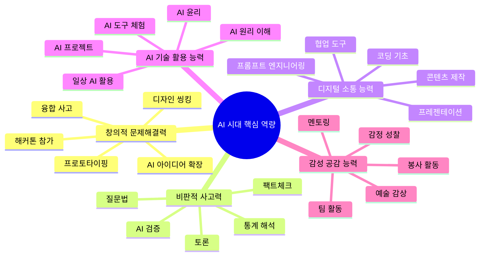
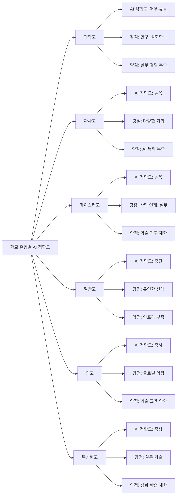
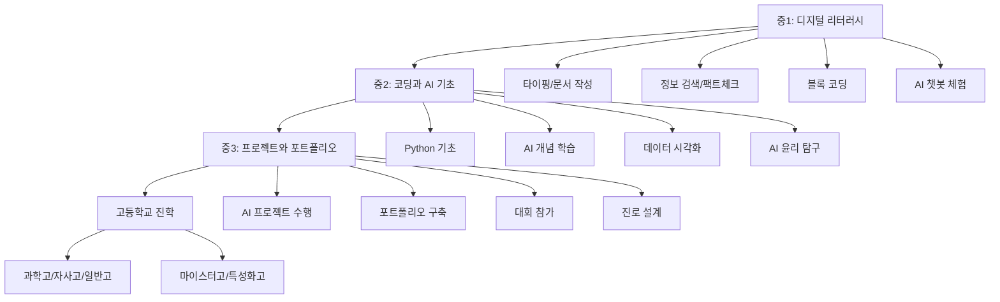
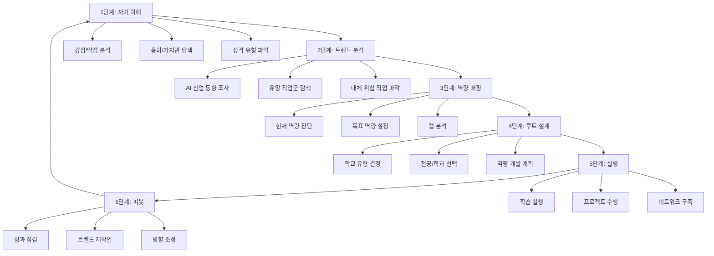

# AI 시대 진로 생존 지도

## 서론: AI 혁명의 현재와 미래

2025년을 기점으로 인공지능(AI)은 단순한 기술 트렌드를 넘어 사회 전반을 재편하는 핵심 동력이 되었다. ChatGPT, Claude, Gemini 등 생성형 AI의 등장은 교육, 의료, 법률, 금융, 예술 등 거의 모든 산업에 걸쳐 근본적인 변화를 촉발하고 있다. 이러한 변화 속에서 우리 아이들의 진로 선택은 과거와 완전히 다른 기준으로 이루어져야 한다.

과거에는 "안정적인 직업"이라 불리던 것들이 AI에 의해 대체되고 있으며, 반대로 10년 전에는 존재하지도 않았던 새로운 직업들이 등장하고 있다. 이 생존 지도는 AI 시대를 살아갈 중고등학생과 학부모를 위해, 어떤 직업이 사라지고, 어떤 직업이 생겨나며, 어떤 역량을 키워야 하는지를 종합적으로 안내한다.

**이 가이드가 필요한 이유:**

- AI 기술 발전 속도가 기하급수적으로 빨라지고 있다
- 현재 초등학생이 사회에 진출할 2035년경에는 직업의 60% 이상이 변화할 것으로 예측된다
- 기존의 진로 상담 방식으로는 AI 시대에 적합한 진로 설계가 어렵다
- 학교 유형 선택부터 전공 결정까지, AI 영향을 고려한 전략이 필요하다

---

## 1. AI가 바꾸는 직업 지형

### 1-1. 사라지는 직업

AI와 자동화 기술이 발전하면서 단순 반복적이고 규칙 기반인 업무를 수행하는 직업들이 점차 대체되고 있다. 아래는 향후 10~15년 내에 크게 축소되거나 소멸할 것으로 예상되는 직업들이다.

| 직업명 | 예상 대체 시기 | 대체 이유 | 대안 직업 |
|--------|--------------|----------|----------|
| 은행 창구 직원 | 2027~2030 | 디지털 뱅킹, AI 챗봇이 대부분의 업무 처리 | 디지털 금융 컨설턴트, 핀테크 기획자 |
| 단순 회계사 | 2028~2031 | AI 회계 소프트웨어가 자동 분류, 정산, 세금 계산 | 재무 전략 컨설턴트, AI 회계 감사관 |
| 콜센터 상담원 | 2026~2029 | AI 음성 봇과 챗봇이 대부분의 문의 처리 | AI 상담 시스템 관리자, 고급 CS 매니저 |
| 번역가 (일반 문서) | 2027~2030 | AI 번역 품질이 전문 번역가 수준에 근접 | 문화 컨설턴트, 로컬라이제이션 매니저 |
| 데이터 입력 사무원 | 2026~2028 | OCR과 AI가 데이터 추출 및 입력 자동화 | 데이터 품질 관리자, AI 학습 데이터 큐레이터 |
| 교통 단속 요원 | 2028~2032 | AI 카메라와 자동화 단속 시스템 확대 | 스마트시티 관제사, 교통 데이터 분석가 |
| 기본 법률 사무원 | 2028~2031 | AI 법률 분석 도구가 계약서 검토, 판례 검색 수행 | 법률 AI 전문가, 법률 테크 기획자 |
| 택배 분류 작업자 | 2027~2030 | 물류 로봇과 AI 분류 시스템 도입 확대 | 물류 로봇 관리자, 스마트 물류 기획자 |
| 단순 보험 심사원 | 2028~2031 | AI가 보험 청구서 분석 및 심사 자동 수행 | 보험 AI 윤리 감사관, 맞춤형 보험 설계사 |
| 기초 의료 영상 판독사 | 2029~2033 | AI 영상 진단이 높은 정확도 달성 | AI 의료 영상 전문가, 의료 AI 연구원 |
| 제조업 조립 라인 작업자 | 2027~2032 | 로봇과 AI 자동화 공정 확대 | 로봇 유지보수 기술자, 스마트팩토리 운영자 |
| 주차 관리원 | 2027~2030 | 자율주차 및 스마트 주차 시스템 보급 | 스마트 모빌리티 관제사 |

### 1-2. 새로 생기는 직업

AI 기술의 발전은 기존에 없던 완전히 새로운 직업들을 탄생시키고 있다. 이 직업들은 AI와 인간의 협업, AI 시스템의 관리와 윤리, 새로운 기술 활용에 초점을 맞추고 있다.

| 직업명 | 등장 시기 | 필요 역량 | 예상 연봉 (초봉 기준) |
|--------|----------|----------|---------------------|
| AI 프롬프트 엔지니어 | 2024~현재 | 자연어 처리 이해, 논리적 사고, 도메인 지식 | 5,000~7,000만 원 |
| AI 윤리 감사관 | 2025~2027 | 윤리학, AI 기술 이해, 법률 지식 | 6,000~8,000만 원 |
| 메타버스 공간 디자이너 | 2024~현재 | 3D 모델링, UX 디자인, 공간 설계 | 4,500~6,500만 원 |
| AI 학습 데이터 큐레이터 | 2024~현재 | 데이터 분석, 도메인 전문성, 품질 관리 | 4,000~5,500만 원 |
| 로봇 행동 디자이너 | 2026~2028 | 로봇공학, 심리학, 행동 과학 | 5,500~7,500만 원 |
| 디지털 트윈 엔지니어 | 2025~2027 | IoT, 시뮬레이션, 데이터 과학 | 5,500~7,000만 원 |
| AI 의료 코디네이터 | 2026~2028 | 의학 지식, AI 활용 능력, 환자 소통 | 5,000~6,500만 원 |
| 탄소 중립 전략가 | 2025~현재 | 환경 과학, 데이터 분석, 정책 이해 | 5,000~7,000만 원 |
| 사이버 보안 AI 전문가 | 2025~현재 | 보안 기술, AI/ML, 네트워크 분석 | 6,000~9,000만 원 |
| 합성 미디어 감별사 | 2026~2028 | 미디어 리터러시, AI 기술 이해, 포렌식 | 5,000~6,500만 원 |
| 인간-AI 인터랙션 디자이너 | 2025~2027 | UX 디자인, 인지 심리학, AI 이해 | 5,500~7,000만 원 |
| 우주 데이터 분석가 | 2027~2030 | 천문학, 빅데이터, AI 모델링 | 6,000~8,000만 원 |
| AI 튜터 설계자 | 2025~현재 | 교육학, AI 기술, 콘텐츠 설계 | 4,500~6,000만 원 |

### 1-3. 변화하는 직업

완전히 사라지지는 않지만, AI로 인해 업무 방식과 필요 역량이 크게 변화하는 직업들이다. 이 직업들은 AI를 도구로 활용하며 더 높은 차원의 업무에 집중하게 된다.

| 직업명 | 변화 내용 | AI 협업 방식 | 필요한 업스킬링 |
|--------|----------|-------------|---------------|
| 의사 | 진단 보조에서 의사결정 중심으로 역할 전환 | AI 진단 시스템과 협업하여 복합 진단 | AI 의료 도구 활용, 데이터 해석 능력 |
| 변호사 | 법률 리서치 자동화, 전략 수립에 집중 | AI 판례 분석 활용, 전략적 조언 강화 | 리걸테크 활용, AI 법률 도구 운용 |
| 교사 | 지식 전달에서 멘토링/코칭 역할로 전환 | AI 학습 분석으로 개인별 맞춤 교육 | AI 교육 도구 활용, 학습 설계 역량 |
| 기자/작가 | 단순 보도에서 심층 분석/기획으로 전환 | AI 초안 작성 후 편집 및 심층 취재 | AI 글쓰기 도구 활용, 팩트체크 역량 |
| 그래픽 디자이너 | 실행 중심에서 창의적 디렉션으로 전환 | AI 이미지 생성 활용, 크리에이티브 방향 설정 | AI 이미지 도구 활용, 아트 디렉션 |
| 마케터 | 데이터 기반 초개인화 마케팅으로 전환 | AI 고객 분석, 자동 캠페인 최적화 | AI 마케팅 도구, 데이터 분석 역량 |
| 건축가 | AI 설계 보조로 창의적 설계에 집중 | AI 구조 계산, 에너지 최적화 설계 | BIM-AI 통합, 지속가능 설계 역량 |
| 약사 | 조제 자동화, 약물 상호작용 상담 강화 | AI 약물 분석, 맞춤형 복약 지도 | AI 약학 도구, 환자 소통 역량 |
| 회계사 (고급) | 단순 기장에서 재무 전략 자문으로 전환 | AI 자동 분류/분석, 전략적 재무 설계 | AI 재무 분석 도구, 전략 컨설팅 역량 |
| 프로그래머 | 코딩에서 아키텍처/시스템 설계로 전환 | AI 코드 생성 활용, 코드 리뷰 및 설계 집중 | AI 코딩 도구 활용, 시스템 설계 역량 |
| 심리 상담사 | 초기 상담 자동화, 심층 상담에 집중 | AI 감정 분석, 상담 기록 자동화 | AI 심리 분석 도구, 디지털 치료 역량 |
| 물리치료사 | AI 진단 보조, 맞춤형 재활 프로그램 설계 | AI 동작 분석, 진도 추적 시스템 활용 | AI 재활 도구, 원격 치료 역량 |

---

## 2. AI 시대 핵심 역량 5가지

AI가 대체하기 어려운 인간 고유의 역량을 키우는 것이 미래 경쟁력의 핵심이다. 다음 5가지 역량은 어떤 직업을 선택하든 반드시 갖추어야 할 기본기이다.

### 2-1. 창의적 문제해결력

**정의:** 기존의 틀을 벗어나 새로운 관점에서 문제를 발견하고, 독창적인 해결책을 설계하는 능력이다. 단순히 "창의적 아이디어"를 떠올리는 것이 아니라, 실현 가능한 해결책으로 구체화하는 전 과정을 포함한다.

**왜 중요한가:** AI는 기존 데이터에서 패턴을 찾는 데 탁월하지만, 완전히 새로운 문제를 정의하거나 전에 없던 해결책을 만들어내는 것은 인간의 영역이다. 기업들이 가장 원하는 인재는 "정해진 문제를 잘 푸는 사람"이 아니라 "풀어야 할 문제를 발견하는 사람"이다.

**키우는 방법 5가지:**

1. **디자인 씽킹 프로젝트 참여:** 학교나 지역사회의 실제 문제를 발견하고, 사용자 중심으로 해결책을 설계하는 프로젝트에 참여한다. 예를 들어 통학 불편 해소, 급식 개선 등 실생활 문제에 도전한다.
2. **해커톤/메이커톤 참가:** 제한된 시간 안에 팀으로 문제를 해결하는 경험은 창의적 사고를 극대화한다. 중고등학생용 해커톤도 점점 늘어나고 있다.
3. **다양한 분야 독서와 융합 사고:** 과학, 예술, 철학, 역사 등 다양한 분야의 책을 읽고, 서로 다른 분야의 아이디어를 연결하는 습관을 기른다.
4. **실패를 허용하는 실험 문화:** 실패를 두려워하지 않고 아이디어를 빠르게 실험하고 개선하는 프로토타이핑 사고방식을 길러야 한다.
5. **AI 도구를 활용한 아이디어 확장:** ChatGPT나 Claude에게 아이디어에 대한 피드백을 요청하고, AI가 제시하는 다양한 관점을 바탕으로 자신의 아이디어를 발전시킨다.

### 2-2. 비판적 사고력

**정의:** 정보를 분석하고, 논리적 오류를 발견하며, 근거에 기반한 판단을 내리는 능력이다. AI가 생성한 정보의 정확성을 검증하고 편향을 식별하는 것도 포함된다.

**왜 중요한가:** AI가 생성하는 텍스트, 이미지, 데이터가 폭발적으로 증가하면서, 이를 검증하고 판단할 수 있는 비판적 사고력이 그 어느 때보다 중요해졌다. AI의 "환각(hallucination)" 현상, 편향된 데이터 학습 등의 문제를 인식하고 대응할 수 있어야 한다.

**키우는 방법 5가지:**

1. **뉴스 팩트체크 습관:** 하루에 하나의 뉴스를 선택하여 출처를 확인하고, 다른 관점의 보도와 비교하며, 사실과 의견을 구분하는 연습을 한다.
2. **AI 결과물 검증 실습:** AI에게 같은 질문을 여러 번, 다른 방식으로 물어보고 답변을 비교한다. AI가 틀린 답을 하는 경우를 찾아 기록한다.
3. **토론 동아리 활동:** 찬반 토론에서 양쪽의 논거를 분석하고, 논리적 오류를 찾는 훈련을 한다.
4. **통계와 데이터 읽기:** 그래프와 통계를 올바르게 해석하는 방법을 배우고, 데이터의 맥락을 이해하는 연습을 한다.
5. **소크라테스식 질문법 연습:** "왜?"를 반복적으로 물으며 문제의 근본 원인을 파고드는 습관을 기른다.

### 2-3. 디지털 소통 능력

**정의:** 디지털 도구와 플랫폼을 활용하여 효과적으로 소통하고, 협업하며, 자신의 아이디어를 전달하는 능력이다. 코딩, 데이터 시각화, 디지털 프레젠테이션 등을 포함한다.

**왜 중요한가:** AI 시대에는 인간 간의 소통뿐 아니라 인간과 AI 간의 소통도 핵심 역량이 된다. AI에게 정확한 지시를 내리고, AI의 결과물을 다른 사람에게 설명할 수 있어야 한다. 또한 원격 협업이 일상화되면서 디지털 도구를 통한 소통 능력이 필수가 되었다.

**키우는 방법 5가지:**

1. **프레젠테이션 역량 강화:** Canva, Google Slides 등을 활용하여 데이터와 아이디어를 시각적으로 전달하는 연습을 한다.
2. **블로그/유튜브 콘텐츠 제작:** 자신의 관심 분야에 대해 글이나 영상을 제작하며 디지털 소통 역량을 실전에서 기른다.
3. **온라인 협업 프로젝트 참여:** Notion, Figma, GitHub 등 협업 도구를 사용하는 팀 프로젝트에 참여한다.
4. **프롬프트 엔지니어링 연습:** AI와 효과적으로 소통하는 방법, 즉 명확하고 구체적인 지시를 작성하는 연습을 한다.
5. **코딩 기초 학습:** Python이나 JavaScript의 기초를 배워 디지털 도구를 직접 만들거나 활용하는 역량을 기른다.

### 2-4. AI 기술 활용 능력

**정의:** AI 도구와 서비스를 이해하고, 자신의 업무와 학습에 효과적으로 활용하는 능력이다. AI를 만드는 것이 아니라, AI를 제대로 사용하는 능력에 초점을 맞춘다.

**왜 중요한가:** 미래 사회에서는 AI를 활용할 줄 아는 사람과 그렇지 못한 사람 사이의 생산성 격차가 극대화될 것이다. AI를 도구로 활용하여 업무 효율을 높이고, AI의 한계를 이해하여 올바르게 사용할 줄 아는 것이 핵심이다.

**키우는 방법 5가지:**

1. **일상 학습에 AI 통합:** 과목 공부 시 AI를 활용하여 모르는 개념을 질문하고, AI의 답변을 교과서와 비교하며 학습한다.
2. **AI 도구 체험 로그 작성:** 새로운 AI 도구를 매주 하나씩 체험하고, 장단점과 활용법을 기록한다.
3. **AI 활용 프로젝트 수행:** AI를 활용하여 실제 문제를 해결하는 프로젝트를 수행한다. 예: AI로 학교 행사 포스터 제작, AI로 데이터 분석 보고서 작성 등.
4. **AI 기초 원리 이해:** 머신러닝, 딥러닝의 기본 개념을 이해하여 AI가 어떻게 작동하는지 파악한다.
5. **AI 윤리 감각 키우기:** AI의 편향, 개인정보 보호, 저작권 등 AI 윤리 이슈를 학습하고 토론한다.

### 2-5. 감성/공감 능력

**정의:** 다른 사람의 감정을 이해하고 공감하며, 효과적으로 관계를 형성하고 유지하는 능력이다. 리더십, 팀워크, 갈등 해결, 동기 부여 등을 포함한다.

**왜 중요한가:** AI가 아무리 발전해도 대체하기 가장 어려운 영역이 인간의 감정과 공감이다. 의료, 교육, 상담, 예술 등 사람과 사람의 연결이 핵심인 분야에서 감성 능력의 가치는 더욱 높아질 것이다.

**키우는 방법 5가지:**

1. **봉사 활동 참여:** 다양한 배경의 사람들과 교류하며 공감 능력을 키운다. 특히 노인, 장애인, 다문화 가정 등과의 교류가 도움이 된다.
2. **팀 스포츠나 동아리 활동:** 팀으로 목표를 달성하는 경험을 통해 소통, 갈등 해결, 리더십을 기른다.
3. **문학/예술 감상:** 소설, 영화, 음악, 미술 등을 감상하며 다양한 감정과 관점을 경험한다.
4. **감정 일기 쓰기:** 하루의 감정을 기록하고 성찰하는 습관을 통해 자기 인식과 감정 조절 능력을 키운다.
5. **멘토링/튜터링 참여:** 후배나 동생에게 가르치는 경험을 통해 다른 사람의 어려움을 이해하고 도움을 주는 방법을 배운다.

---

## 3. 학과/전공 선택 시 AI 영향 분석표

대학 진학 시 전공 선택은 미래 직업과 직결된다. AI가 각 전공 분야에 미치는 영향을 종합적으로 분석한 표이다.

| 전공명 | AI 영향도 | AI 대체 위험 | AI 활용 기회 | 미래 전망 | 추천 학교 유형 |
|--------|----------|-------------|-------------|----------|--------------|
| 컴퓨터공학 | 상 | 낮음 | 매우 높음 | 매우 밝음 | 과학고, 일반고(이과) |
| 인공지능학과 | 상 | 매우 낮음 | 매우 높음 | 매우 밝음 | 과학고, 일반고(이과) |
| 데이터사이언스 | 상 | 낮음 | 매우 높음 | 매우 밝음 | 과학고, 일반고 |
| 의학 | 상 | 낮음 | 높음 | 밝음 | 과학고, 일반고 |
| 간호학 | 중 | 낮음 | 중간 | 밝음 | 일반고, 특성화고 |
| 약학 | 중 | 중간 | 높음 | 보통 | 과학고, 일반고 |
| 법학 | 상 | 중간 | 높음 | 변화 중 | 일반고, 외고 |
| 경영학 | 상 | 중간 | 높음 | 변화 중 | 일반고, 자사고 |
| 회계학 | 상 | 높음 | 중간 | 축소 | 일반고, 특성화고 |
| 심리학 | 중 | 낮음 | 중간 | 밝음 | 일반고 |
| 교육학 | 중 | 중간 | 높음 | 변화 중 | 일반고 |
| 전기전자공학 | 상 | 낮음 | 높음 | 매우 밝음 | 과학고, 마이스터고 |
| 기계공학 | 중 | 중간 | 높음 | 밝음 | 과학고, 마이스터고 |
| 생명공학 | 상 | 낮음 | 매우 높음 | 매우 밝음 | 과학고 |
| 디자인 | 상 | 중간 | 높음 | 변화 중 | 예술고, 일반고 |
| 음악 | 중 | 낮음 | 중간 | 보통 | 예술고 |
| 영어영문학 | 상 | 높음 | 중간 | 축소 | 외고, 일반고 |
| 행정학 | 중 | 중간 | 중간 | 보통 | 일반고 |
| 건축학 | 상 | 중간 | 높음 | 밝음 | 일반고, 과학고 |
| 환경공학 | 중 | 낮음 | 높음 | 매우 밝음 | 과학고, 일반고 |
| 로봇공학 | 상 | 매우 낮음 | 매우 높음 | 매우 밝음 | 과학고, 마이스터고 |
| 철학/윤리학 | 중 | 매우 낮음 | 중간 | 밝음(AI윤리) | 일반고, 자사고 |
| 통계학 | 상 | 중간 | 매우 높음 | 밝음 | 과학고, 일반고 |

---

## 4. 고등학교 유형별 AI 시대 적합도

고등학교 유형에 따라 AI 시대 준비도가 크게 달라진다. 각 학교 유형별 AI 관련 역량 개발 환경을 비교한다.

| 비교 항목 | 일반고 | 과학고 | 외고 | 자사고 | 마이스터고 | 특성화고 |
|----------|--------|--------|------|--------|-----------|---------|
| AI 교육 인프라 | 보통 | 우수 | 보통 | 우수 | 우수 | 보통~우수 |
| 코딩 교육 수준 | 기초 | 심화 | 기초 | 중급 | 심화(실무) | 중급(실무) |
| AI 프로젝트 기회 | 적음 | 많음 | 적음 | 중간 | 많음(산업연계) | 중간(산업연계) |
| 산업체 연계 | 거의 없음 | 일부 | 거의 없음 | 일부 | 매우 많음 | 많음 |
| 연구 활동 기회 | 제한적 | 매우 많음 | 제한적 | 많음 | 실무 중심 | 실무 중심 |
| AI 관련 동아리 | 일부 | 다수 | 드묾 | 다수 | 일부 | 일부 |
| 대학 진학 연계 | 일반 | 이공계 특화 | 어문 특화 | 다양 | 취업 중심 | 취업 중심 |
| AI 시대 적합도 | 중 | 매우 높음 | 중하 | 높음 | 높음(실무) | 중상(실무) |
| 추천 진로 방향 | 다양 | AI/과학 연구 | 글로벌 AI 비즈니스 | 다양+AI | AI 산업 현장 | AI 기술 현장 |

---

## 5. AI 활용 능력을 키우는 중학교 시기 전략

중학교 3년은 AI 시대를 준비하는 골든타임이다. 학년별로 단계적으로 역량을 쌓아가는 전략을 제시한다.

### 중학교 1학년: 기초 디지털 리터러시

**목표:** 디지털 도구에 대한 기본적인 이해와 활용 능력을 갖춘다.

| 월 | 활동 내용 | 기대 성과 |
|----|----------|----------|
| 3~4월 | 컴퓨터 기본 활용: 타이핑, 문서 작성, 스프레드시트 기초 | 디지털 문해력 기초 확립 |
| 5~6월 | 인터넷 정보 검색과 팩트체크 방법 학습 | 정보 판별 능력 강화 |
| 7~8월 | 스크래치(Scratch)로 블록 코딩 체험 | 알고리즘적 사고 입문 |
| 9~10월 | AI 챗봇 체험과 활용 (학습 보조 용도) | AI 도구 기초 이해 |
| 11~12월 | 디지털 프레젠테이션 제작 (Canva, Google Slides) | 디지털 표현 능력 개발 |
| 1~2월 | 디지털 시민의식과 온라인 안전 교육 | 건전한 디지털 가치관 확립 |

### 중학교 2학년: 코딩과 AI 기초

**목표:** 프로그래밍의 기초를 익히고, AI의 원리를 이해한다.

| 월 | 활동 내용 | 기대 성과 |
|----|----------|----------|
| 3~4월 | Python 기초 문법 학습 (변수, 조건문, 반복문) | 텍스트 코딩 입문 |
| 5~6월 | Python으로 간단한 프로그램 만들기 (계산기, 퀴즈) | 프로그래밍 기초 역량 |
| 7~8월 | AI 기초 개념 학습: 머신러닝, 데이터의 역할 | AI 원리 이해 |
| 9~10월 | Teachable Machine으로 AI 모델 만들기 체험 | AI 활용 실전 경험 |
| 11~12월 | 데이터 수집과 시각화 프로젝트 (Excel, 간단한 Python) | 데이터 리터러시 개발 |
| 1~2월 | AI 윤리와 사회적 영향 탐구 보고서 작성 | 비판적 사고력 + AI 윤리 감각 |

### 중학교 3학년: 프로젝트와 포트폴리오

**목표:** 자기 주도적 프로젝트를 수행하고, 진로 탐색과 연결한 포트폴리오를 구축한다.

| 월 | 활동 내용 | 기대 성과 |
|----|----------|----------|
| 3~4월 | 관심 분야 AI 활용 프로젝트 기획 (팀 또는 개인) | 프로젝트 설계 능력 |
| 5~6월 | 프로젝트 실행: AI 도구 활용한 문제 해결 | 실전 AI 활용 역량 |
| 7~8월 | 프로젝트 결과물 정리 및 포트폴리오 제작 | 포트폴리오 구축 |
| 9~10월 | 고등학교 유형 탐색 및 AI 관련 진로 조사 | 진로 방향 설정 |
| 11~12월 | AI 관련 대회/공모전 참가 (SW 경진대회 등) | 실전 경험 + 수상 이력 |
| 1~2월 | 고등학교 생활 계획 수립 (AI 동아리, 수업 선택 등) | 고교 생활 전략 완성 |

---

## 6. 미래 유망 직업군 20선

AI 시대에 높은 수요가 예상되는 미래 유망 직업 20가지를 선별하였다.

| 순위 | 직업명 | 설명 | 필요 역량 | 관련 전공 | 예상 연봉 | AI와의 관계 | 추천 고교 유형 |
|------|--------|------|----------|----------|----------|------------|--------------|
| 1 | AI 엔지니어 | AI 모델 개발 및 최적화 | 수학, 프로그래밍, ML/DL | 컴퓨터공학, AI학과 | 7,000~1억+ | AI를 만드는 직업 | 과학고 |
| 2 | 데이터 사이언티스트 | 빅데이터 분석 및 인사이트 도출 | 통계, 프로그래밍, 도메인 지식 | 데이터사이언스, 통계학 | 6,000~9,000만 | AI 도구 적극 활용 | 과학고, 일반고 |
| 3 | 사이버 보안 전문가 | AI 기반 보안 위협 대응 | 네트워크, 보안, AI | 정보보안, 컴퓨터공학 | 6,000~1억 | AI로 보안 강화 | 과학고, 마이스터고 |
| 4 | AI 윤리 전문가 | AI 시스템의 공정성/투명성 감사 | 윤리학, AI 기술, 법률 | 철학, 법학, AI학과 | 6,000~8,000만 | AI를 감시하는 직업 | 일반고, 자사고 |
| 5 | 로봇 엔지니어 | 서비스/산업용 로봇 개발 | 기계공학, 전자, 프로그래밍 | 로봇공학, 기계공학 | 5,500~8,000만 | AI와 로봇 융합 | 과학고, 마이스터고 |
| 6 | 바이오인포매틱스 전문가 | 생명과학 데이터 AI 분석 | 생물학, 프로그래밍, 통계 | 생명공학, 바이오인포매틱스 | 5,500~8,000만 | AI로 생명과학 혁신 | 과학고 |
| 7 | 디지털 헬스케어 기획자 | AI 기반 건강관리 서비스 설계 | 의학지식, IT, UX | 의공학, 보건학 | 5,000~7,000만 | AI 헬스케어 설계 | 일반고, 과학고 |
| 8 | 클라우드 아키텍트 | 클라우드 인프라 설계/관리 | 클라우드, 네트워크, 보안 | 컴퓨터공학, 정보통신 | 7,000~1억+ | AI 인프라 구축 | 과학고, 마이스터고 |
| 9 | UX/UI 디자이너 | 사용자 경험 중심 디자인 | 디자인, 심리학, 프로토타이핑 | 디자인, HCI | 4,500~7,000만 | AI와 인간 인터페이스 설계 | 일반고, 예술고 |
| 10 | 지속가능 에너지 엔지니어 | 친환경 에너지 시스템 개발 | 에너지공학, 환경, 데이터 | 환경공학, 에너지공학 | 5,000~7,500만 | AI로 에너지 최적화 | 과학고, 마이스터고 |
| 11 | 프롬프트 엔지니어 | AI 시스템 최적 활용 설계 | 언어학, 논리적 사고, 도메인 지식 | 다양 (전공 불문) | 5,000~7,000만 | AI를 활용하는 핵심 직업 | 일반고, 외고 |
| 12 | 스마트팩토리 운영자 | AI 기반 제조 시스템 운영 | IoT, 로봇, 데이터 분석 | 산업공학, 기계공학 | 4,500~6,500만 | AI 제조 시스템 관리 | 마이스터고, 과학고 |
| 13 | 디지털 트윈 전문가 | 가상 시뮬레이션 시스템 구축 | 3D 모델링, IoT, 데이터 | 컴퓨터공학, 산업공학 | 5,500~7,500만 | AI 시뮬레이션 설계 | 과학고 |
| 14 | AI 법률 전문가 | AI 관련 법률/규제 자문 | 법학, AI 기술 이해 | 법학, AI학과 | 6,000~9,000만 | AI 규제와 법률 | 일반고, 자사고 |
| 15 | 메타버스 콘텐츠 크리에이터 | 가상공간 콘텐츠 기획/제작 | 3D, 스토리텔링, UX | 디자인, 콘텐츠학과 | 4,000~6,500만 | AI 생성 콘텐츠 활용 | 예술고, 일반고 |
| 16 | 자율주행 엔지니어 | 자율주행 시스템 개발 | 컴퓨터비전, 센서, AI | 컴퓨터공학, 전자공학 | 7,000~1억+ | AI 핵심 적용 분야 | 과학고 |
| 17 | 기후 데이터 분석가 | 기후변화 데이터 분석/예측 | 기후과학, 데이터분석, AI | 환경공학, 대기과학 | 5,000~7,000만 | AI로 기후 모델링 | 과학고, 일반고 |
| 18 | 에듀테크 개발자 | AI 교육 플랫폼 개발 | 교육학, 프로그래밍, UX | 교육공학, 컴퓨터공학 | 5,000~7,000만 | AI 교육 시스템 구축 | 일반고, 과학고 |
| 19 | 스마트 농업 기술자 | AI/IoT 기반 정밀 농업 운영 | 농학, IoT, 데이터분석 | 농생명공학, 스마트팜학과 | 4,000~6,000만 | AI로 농업 혁신 | 마이스터고, 특성화고 |
| 20 | 개인 건강관리 코치 | AI 데이터 기반 맞춤형 건강 코칭 | 건강과학, 소통, AI 활용 | 체육학, 보건학 | 4,000~6,000만 | AI 건강 데이터 해석 | 일반고 |

---

## 7. AI 시대 진로 설계 프레임워크

AI 시대에 적합한 진로를 설계하기 위한 단계별 프레임워크를 제시한다. 이 프레임워크는 한 번 정하고 끝나는 것이 아니라, 지속적으로 순환하며 업데이트해야 한다.

### 1단계: 자기 이해

진로 설계의 출발점은 자기 자신을 아는 것이다.

- **강점/약점 분석:** 어떤 과목을 잘하고, 어떤 활동에서 에너지를 얻는지 파악한다
- **흥미/가치관 탐색:** 무엇에 흥미를 느끼고, 인생에서 무엇을 중요하게 여기는지 탐색한다
- **성격 유형 파악:** MBTI, 홀랜드 검사 등을 참고하되 맹신하지 않고 참고 자료로 활용한다
- **AI 적성 체크:** AI 도구를 사용할 때 즐거움을 느끼는지, 기술에 대한 호기심이 있는지 확인한다

### 2단계: 트렌드 분석

세상이 어떻게 변하고 있는지 파악한다.

- **AI 산업 동향 조사:** 최신 AI 기술 발전과 산업 적용 사례를 주기적으로 조사한다
- **유망 직업군 탐색:** 새로 등장하는 직업, 성장하는 분야를 파악한다
- **대체 위험 직업 파악:** 자신이 관심 있는 분야에서 AI 대체 위험이 어느 정도인지 확인한다
- **글로벌 트렌드 파악:** 국내뿐 아니라 해외의 직업 시장 동향도 참고한다

### 3단계: 역량 매핑

자신의 현재 역량과 목표 직업이 요구하는 역량 사이의 간격을 파악한다.

- **현재 역량 진단:** 핵심 역량 5가지 (창의적 문제해결, 비판적 사고, 디지털 소통, AI 활용, 감성 공감) 수준을 자가 진단한다
- **목표 역량 설정:** 관심 직업이 요구하는 역량 수준을 조사하고 목표를 설정한다
- **갭 분석:** 현재와 목표 사이의 차이를 파악하고, 우선적으로 개발해야 할 역량을 결정한다

### 4단계: 루트 설계

목표에 도달하기 위한 구체적 경로를 설계한다.

- **학교 유형 결정:** AI 시대 적합도, 자신의 강점, 진로 방향을 종합 고려하여 고등학교 유형을 결정한다
- **전공/학과 선택:** AI 영향 분석표를 참고하여 미래 전망이 밝은 전공을 선택한다
- **역량 개발 계획:** 언제, 어떻게, 어떤 역량을 키울지 구체적 계획을 세운다

### 5단계: 실행

계획을 실제로 실행한다.

- **학습 실행:** 계획에 따라 학교 공부와 자기 주도 학습을 병행한다
- **프로젝트 수행:** AI 활용 프로젝트, 대회 참가 등 실전 경험을 쌓는다
- **네트워크 구축:** 멘토 찾기, 관심 분야 커뮤니티 참여 등 인적 네트워크를 구축한다

### 6단계: 피봇

정기적으로 점검하고 필요 시 방향을 조정한다.

- **성과 점검:** 6개월~1년 단위로 목표 달성 여부를 점검한다
- **트렌드 재확인:** AI 기술과 산업 트렌드가 변했는지 확인한다
- **방향 조정:** 필요 시 과감하게 방향을 수정한다. 피봇은 실패가 아니라 전략적 조정이다

---

## 8. 부모 세대와 다른 진로 선택 기준

부모님 세대가 직업을 선택할 때와 현재 학생들이 직업을 선택할 때의 기준이 어떻게 달라졌는지 비교한다.

| 기준 | 과거 (부모 세대) | 현재 (AI 시대) | 변화 이유 |
|------|----------------|---------------|----------|
| 안정성 | 대기업/공무원 = 평생직장 | 직업 수명 단축, 역량 기반 안정성 | AI 자동화로 기존 "안정적" 직업도 변화 |
| 연봉 | 초봉과 연차별 호봉 중시 | 역량 기반 연봉, 성과급 중심 | 성과와 역량에 따른 보상 체계로 전환 |
| 사회적 지위 | 의사/변호사/교수 등 전문직 선호 | 가치 창출 능력 기반 평가 | AI 시대에는 직업명보다 무엇을 만들어내는가가 중요 |
| 성장성 | 산업 성장률 중심 판단 | AI 대체 가능성과 융합 가능성 동시 고려 | 성장하는 산업이라도 AI 대체 위험이 있을 수 있음 |
| 워라밸 | 근무시간 = 성과라는 인식 | 효율 중심, 유연 근무, 원격 근무 | AI 도구로 생산성 향상, 결과 중심 문화 확산 |
| 글로벌 이동성 | 국내 취업 중심 사고 | 글로벌 원격 근무, 해외 취업 확대 | AI 기술은 국경 없이 활용 가능 |
| 전공 중요도 | 전공 = 직업이라는 인식 | 전공 + 부전공 + 자기계발 융합 | 융합 인재 수요 증가, 전공만으로는 경쟁력 부족 |
| 학벌 중요도 | 대학 브랜드 매우 중요 | 실력과 포트폴리오가 더 중요해지는 추세 | AI 시대에는 "무엇을 할 수 있는가"가 핵심 |
| 자기계발 방식 | 학원, 자격증 위주 | 온라인 학습, AI 도구 활용, 프로젝트 경험 | 학습 자원이 디지털화, 실전 경험 가치 상승 |
| 직업 전환 | 한 번 정한 직업을 유지 | 생애 3~5회 직업 전환이 보통 | 기술 변화 속도가 빨라 지속적 적응 필요 |

---

## 9. AI 시대 학교 선택 체크리스트

고등학교를 선택할 때 AI 시대를 대비하여 확인해야 할 10가지 항목이다. 각 항목을 1~5점으로 평가하여 총점을 산출해 보자.

| 번호 | 체크 항목 | 평가 기준 | 점수 (1~5) |
|------|----------|----------|-----------|
| 1 | 정보/AI 관련 교과목이 개설되어 있는가? | 정규 교과에 코딩, AI, 데이터 과목 포함 여부 | ___ |
| 2 | AI 관련 동아리가 활발히 운영되고 있는가? | 코딩 동아리, AI 동아리, 로봇 동아리 등의 활동 수준 | ___ |
| 3 | 컴퓨터실/메이커스페이스 등 인프라가 충분한가? | 최신 장비, 3D 프린터, 로봇 키트 등 보유 현황 | ___ |
| 4 | 산업체/대학과의 연계 프로그램이 있는가? | 기업 멘토링, 대학 연구실 탐방, 인턴십 기회 | ___ |
| 5 | 교사 중 AI/SW 전문성을 갖춘 분이 있는가? | 정보 교과 전담 교사, AI 관련 연수 이수 여부 | ___ |
| 6 | 프로젝트 기반 학습(PBL) 기회가 있는가? | 교과 수업에서 팀 프로젝트, 자기 주도 프로젝트 기회 | ___ |
| 7 | AI 관련 대회/공모전 참가를 지원하는가? | SW 경진대회, 해커톤, 과학전람회 등 참가 지원 | ___ |
| 8 | 온라인 학습 플랫폼을 활용한 수업이 있는가? | LMS, AI 학습 도구, 온라인 협업 도구 활용 수업 | ___ |
| 9 | 글로벌 교류 프로그램이 있는가? | 해외 학교 교류, 국제 대회 참가, 글로벌 프로젝트 | ___ |
| 10 | 진로/직업 교육에서 AI 시대를 반영하는가? | 진로 상담 시 AI 변화 반영, 미래 직업 탐색 기회 | ___ |

**총점 해석:**

- **40~50점:** AI 시대를 준비하기에 매우 적합한 학교. 적극 추천한다.
- **30~39점:** 양호한 수준. 학교 외 자기 주도 활동으로 보완하면 좋다.
- **20~29점:** 보통 수준. AI 역량은 외부 활동으로 적극 보완해야 한다.
- **10~19점:** AI 준비도가 낮은 학교. 다른 학교를 검토하거나 외부 프로그램에 적극 참여해야 한다.

---

## 10. AI 도구 활용 실전 가이드

학생들이 지금 바로 활용할 수 있는 AI 도구들과 그 활용법을 정리한다.

### 10-1. 학습 보조 AI 도구

| AI 도구 | 주요 용도 | 학습 효과 | 활용 팁 |
|---------|----------|----------|---------|
| ChatGPT | 개념 설명, 질문 답변, 글쓰기 보조 | 자기 주도 학습 능력 향상, 개념 이해 심화 | 교과서를 먼저 읽고, 이해 안 되는 부분을 AI에게 질문한다 |
| Claude | 분석적 사고, 논리적 글쓰기, 코드 리뷰 | 비판적 사고 강화, 논리적 표현력 향상 | 에세이 초안에 대한 피드백을 요청하고 논리 구조를 개선한다 |
| Perplexity AI | 최신 정보 검색, 출처 포함 답변 | 리서치 역량 강화, 팩트체크 습관 형성 | 탐구 보고서 작성 시 출처가 필요한 정보를 검색한다 |
| Wolfram Alpha | 수학 문제 풀이, 과학 계산 | 수학/과학 개념 이해, 문제 해결 과정 학습 | 풀이 과정을 확인하며 자신의 풀이와 비교한다 |
| Quillbot | 영작문 교정, 패러프레이징 | 영어 작문 능력 향상 | 영어 에세이를 작성 후 문법과 표현을 교정받는다 |

### 10-2. 창작/프로젝트 AI 도구

| AI 도구 | 주요 용도 | 학습 효과 | 활용 팁 |
|---------|----------|----------|---------|
| Midjourney/DALL-E | 이미지 생성, 비주얼 콘셉트 | 시각적 사고력, 프롬프트 엔지니어링 | 프로젝트 발표 자료의 삽화나 콘셉트 이미지를 제작한다 |
| Canva AI | 프레젠테이션, 포스터 디자인 | 디자인 감각, 시각적 커뮤니케이션 | 학교 행사 포스터나 수업 발표 자료를 전문적으로 제작한다 |
| Notion AI | 노트 정리, 프로젝트 관리 | 정보 체계화, 자기관리 능력 | 수업 노트를 체계적으로 정리하고, 학습 계획을 관리한다 |
| Gamma | 프레젠테이션 자동 생성 | 빠른 자료 구조화, 발표 능력 | 주제를 입력하면 슬라이드 구조를 자동으로 생성해 준다 |
| Suno AI | 음악 생성 | 음악적 감각, 창작 경험 | 학교 UCC나 프로젝트 영상의 배경음악을 만들어 본다 |

### 10-3. 코딩/개발 AI 도구

| AI 도구 | 주요 용도 | 학습 효과 | 활용 팁 |
|---------|----------|----------|---------|
| GitHub Copilot | 코드 자동 완성, 코드 생성 | 프로그래밍 학습 가속화, 코딩 패턴 학습 | AI가 생성한 코드를 이해하려고 노력하며, 무조건 복사하지 않는다 |
| Replit AI | 웹 기반 코딩 환경, AI 코딩 보조 | 설치 없이 코딩 체험, 빠른 프로토타이핑 | 간단한 웹 앱이나 게임을 만들어 보며 코딩을 배운다 |
| Teachable Machine | 노코드 AI 모델 학습 | AI 원리 체험, 프로젝트 아이디어 구현 | 이미지/소리/포즈 인식 AI 모델을 직접 만들어 본다 |
| Scratch + AI 확장 | 블록 코딩 + AI 기능 | AI 개념 이해, 논리적 사고 | 스크래치에 AI 확장 기능을 추가하여 AI 프로젝트를 만든다 |

### AI 도구 사용 시 주의사항

1. **검증 습관:** AI 답변을 그대로 믿지 말고, 반드시 교과서나 신뢰할 수 있는 출처와 비교 확인한다
2. **표절 주의:** AI가 생성한 글을 자기 글인 것처럼 제출하면 표절에 해당한다. AI를 참고 도구로 활용하되 자기 생각으로 재구성한다
3. **개인정보 보호:** AI 도구에 개인정보(이름, 주소, 전화번호 등)를 입력하지 않는다
4. **비판적 활용:** AI 도구의 한계를 인지하고, AI가 잘하는 것과 못하는 것을 구분하여 활용한다
5. **학습 목적 유지:** AI를 "대신 해주는 도구"가 아니라 "함께 배우는 도구"로 사용한다

---

## 11. FAQ: AI와 진로에 대한 자주 묻는 질문

### Q1. AI 때문에 정말로 많은 직업이 사라지나요?

완전히 사라지는 직업보다는, 업무 내용이 변화하는 직업이 더 많다. 단순 반복 업무 위주의 직업은 축소되지만, 대부분의 직업은 AI를 도구로 활용하는 방향으로 진화한다. 중요한 것은 특정 직업의 소멸 여부보다, 자신이 AI와 어떻게 협업할 수 있는가를 고민하는 것이다.

### Q2. 코딩을 반드시 배워야 하나요?

코딩을 배우면 분명히 도움이 되지만, 모든 사람이 프로그래머가 될 필요는 없다. 코딩의 기초 개념(알고리즘적 사고, 논리적 사고)을 이해하는 것이 중요하며, 이는 어떤 분야에서든 AI 도구를 효과적으로 활용하는 데 도움이 된다. 비전공자도 기본적인 데이터 처리나 자동화 스크립트 정도는 다룰 줄 알면 경쟁력이 높아진다.

### Q3. 문과 학생은 AI 시대에 불리한가요?

그렇지 않다. AI 시대에는 오히려 인문학적 소양이 더 중요해진다. AI 윤리, 사용자 경험 설계, 콘텐츠 기획, 법률/정책 등의 분야에서 인문/사회과학 역량이 필수적이다. 핵심은 문과/이과 구분이 아니라, 자신의 전문 분야에서 AI를 활용할 줄 아는 융합 역량을 갖추는 것이다.

### Q4. 어떤 대학, 어떤 학과를 가야 AI 시대에 유리한가요?

특정 대학이나 학과보다는, 해당 학교가 AI 교육과 실무 경험을 제공하는지가 더 중요하다. AI 관련 교양 과목이 개설되어 있는지, 산학 협력 프로그램이 있는지, 창업/프로젝트 지원이 있는지를 확인하자. 학과로는 컴퓨터공학, 데이터사이언스, AI학과가 직접적이지만, 어떤 전공이든 AI 복수전공이나 연계전공을 활용할 수 있다.

### Q5. 중학생 때부터 진로를 구체적으로 정해야 하나요?

구체적인 직업을 정할 필요는 없다. 오히려 넓은 탐색이 이 시기에 더 중요하다. 다양한 분야를 체험하고, 자신의 흥미와 강점을 파악하는 것이 우선이다. 다만 AI 도구 활용, 코딩 기초, 디지털 리터러시 등 기본 역량은 일찍 시작할수록 유리하다.

### Q6. AI가 발전하면 대학 교육이 필요 없어지나요?

대학의 역할은 변하겠지만, 사라지지는 않는다. 지식 전달 기능은 AI와 온라인 교육이 대체할 수 있지만, 연구 경험, 네트워크 구축, 비판적 사고 훈련, 협업 프로젝트 등 대학만의 가치는 여전하다. 다만 "어느 대학을 나왔는가"보다 "무엇을 할 수 있는가"가 더 중요해지는 방향으로 변하고 있다.

### Q7. 부모님이 추천하는 직업과 AI 시대 유망 직업이 다를 때 어떻게 해야 하나요?

부모님의 조언은 풍부한 경험에 기반하므로 존중하되, AI로 인한 직업 시장 변화에 대한 데이터를 공유하며 대화하는 것이 좋다. 이 가이드의 "부모 세대와 다른 진로 선택 기준" 표를 함께 보며 토론해 보자. 최종 결정은 자신의 흥미, 적성, 미래 전망을 종합적으로 고려하여 내려야 한다.

### Q8. AI 시대에 안전한 직업은 없나요?

"완전히 안전한" 직업은 없다고 봐야 한다. 하지만 인간의 창의성, 공감 능력, 복잡한 판단력이 필요한 직업은 AI 대체 위험이 상대적으로 낮다. 의료(특히 정신건강), 교육(멘토링/코칭), 예술(창작), 사회복지, 연구/개발 분야가 이에 해당한다. 핵심은 "AI에 대체되지 않는 직업"을 찾는 것보다 "AI와 함께 일할 수 있는 역량"을 키우는 것이다.

### Q9. AI 시대에 자격증이나 스펙은 여전히 중요한가요?

전통적인 자격증의 가치는 하락하는 추세이다. AI가 많은 자격증 시험의 내용을 즉시 수행할 수 있기 때문이다. 대신 실제 프로젝트 경험, 포트폴리오, AI 도구 활용 능력을 증명하는 것이 더 중요해지고 있다. 다만 의료, 법률 등 법적으로 자격증이 필수인 분야는 예외이다.

### Q10. 프로그래밍 AI가 발전하면 개발자도 필요 없어지나요?

코드를 단순히 타이핑하는 "코더"의 역할은 줄어들 수 있지만, 시스템을 설계하고, 문제를 정의하며, AI 도구를 감독하는 "개발자/아키텍트"의 역할은 오히려 더 중요해진다. AI 코딩 도구를 잘 활용하는 개발자의 생산성은 과거보다 훨씬 높아지고 있으며, 그 가치도 함께 상승하고 있다.

---

## 12. 부록: AI 시대 진로 용어 사전

| 용어 | 설명 |
|------|------|
| 생성형 AI | 텍스트, 이미지, 음악 등 새로운 콘텐츠를 만들어내는 AI 기술 |
| 프롬프트 엔지니어링 | AI에게 효과적으로 지시를 내리는 기술과 방법론 |
| 머신러닝 | 데이터에서 패턴을 학습하여 예측하는 AI의 한 분야 |
| 딥러닝 | 인공 신경망을 활용한 고급 머신러닝 기술 |
| 디지털 트윈 | 현실 세계의 물리적 시스템을 가상으로 복제한 것 |
| 메타버스 | 가상현실과 현실이 융합된 3차원 디지털 공간 |
| 핀테크 | 금융(Finance)과 기술(Technology)의 합성어, AI 기반 금융 서비스 |
| 에듀테크 | 교육(Education)과 기술(Technology)의 합성어, AI 기반 교육 서비스 |
| IoT | 사물인터넷, 다양한 기기가 인터넷으로 연결되어 데이터를 주고받는 기술 |
| 블록체인 | 분산형 데이터 저장 기술, 암호화폐와 스마트 계약에 활용 |
| 리걸테크 | 법률(Legal)과 기술(Technology)의 합성어, AI 기반 법률 서비스 |
| XR (확장현실) | VR, AR, MR을 아우르는 몰입형 기술 |
| AGI (범용 인공지능) | 인간 수준의 지능을 가진 AI, 아직 실현되지 않았으나 연구 진행 중 |
| 환각 (Hallucination) | AI가 사실이 아닌 정보를 사실처럼 생성하는 현상 |
| 업스킬링 | 기존 업무에 필요한 새로운 기술을 습득하는 것 |
| 리스킬링 | 완전히 새로운 분야의 기술을 배워 직업을 전환하는 것 |
| 피봇 | 기존 방향에서 전략적으로 방향을 전환하는 것 |

---

## 13. 마무리: AI 시대 진로 생존의 3원칙

AI 시대의 진로 설계를 한마디로 요약하면 다음 세 가지 원칙으로 정리할 수 있다.

**원칙 1. "평생 한 직업"이 아니라 "평생 학습"이다.**
기술 변화 속도가 빨라 한 가지 직업으로 평생을 보내기 어려운 시대이다. 중요한 것은 첫 직업이 아니라, 변화에 적응하며 지속적으로 배우는 능력이다.

**원칙 2. AI를 두려워하지 말고 도구로 활용하라.**
AI는 경쟁 상대가 아니라 강력한 도구이다. AI를 활용할 줄 아는 사람과 그렇지 못한 사람의 격차는 점점 벌어질 것이다. 지금부터 AI를 일상적으로 사용하며 친숙해지자.

**원칙 3. 인간만이 할 수 있는 것에 집중하라.**
창의성, 공감, 윤리적 판단, 복잡한 소통 등 AI가 대체하기 어려운 인간 고유의 역량을 키우는 것이 최고의 경쟁력이다. 기술은 도구이고, 인간의 가치는 도구를 넘어서는 곳에 있다.

---

> 이 가이드는 2026년 7월 기준으로 작성되었으며, AI 기술과 직업 시장의 변화에 따라 주기적으로 업데이트될 예정입니다. 진로에 대한 최종 결정은 반드시 학생 본인의 흥미, 적성, 가치관을 종합적으로 고려하여 내려야 합니다.
