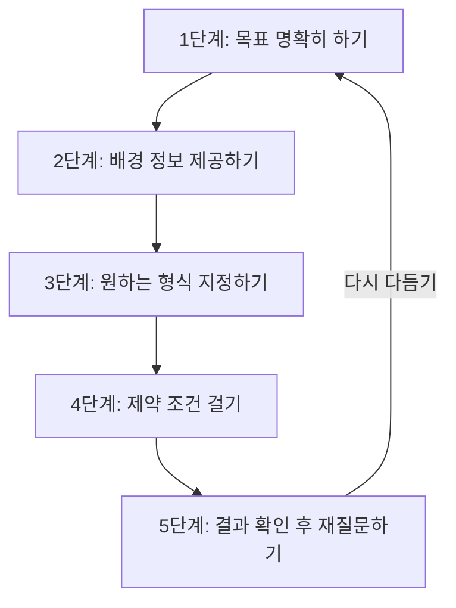
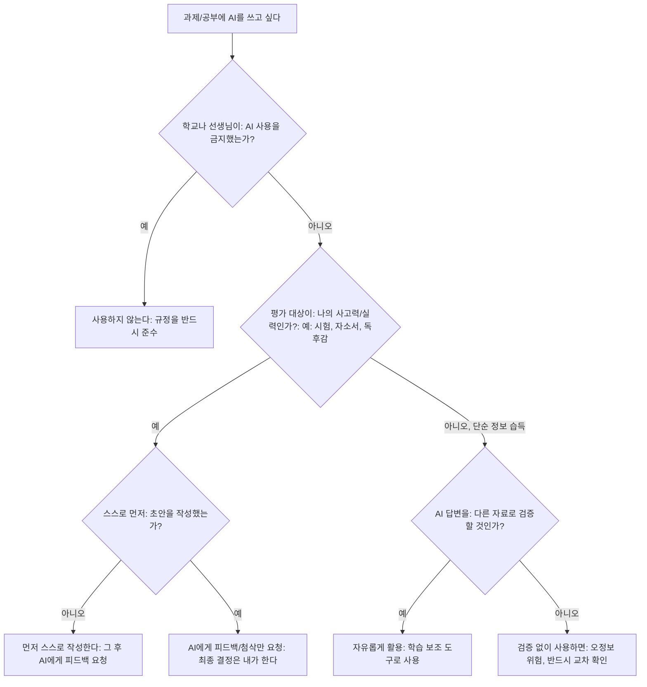
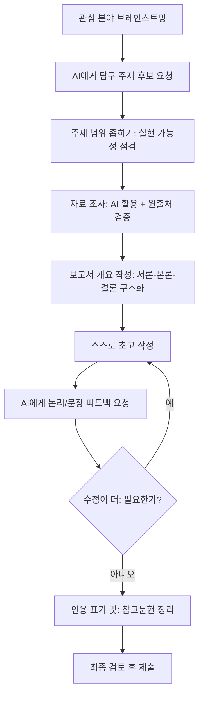
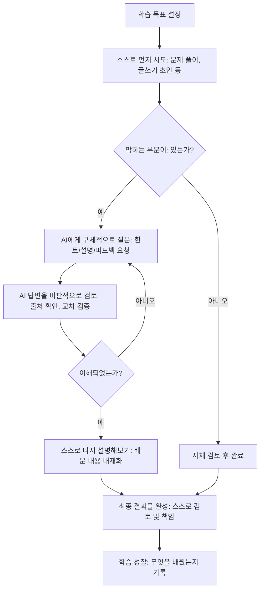

# AI 도구 학습 활용 가이드 (학생용)

> 이 가이드는 중·고등학생이 학습 과정에서 AI 도구를 올바르고 효과적으로 활용할 수 있도록 돕기 위해 작성되었습니다. AI는 훌륭한 학습 보조 도구이지만, 스스로 생각하는 힘을 대체할 수는 없습니다. "AI와 함께, AI에게 의존하지 않고" 공부하는 방법을 배워봅시다.

---

## 목차

1. [AI 학습 도구 종류와 특징](#1-ai-학습-도구-종류와-특징)
2. [과목별 AI 활용법](#2-과목별-ai-활용법)
3. [AI로 효율적으로 질문하는 법 (프롬프트 작성 기초)](#3-ai로-효율적으로-질문하는-법-프롬프트-작성-기초)
4. [AI 활용 DO and DON'T](#4-ai-활용-do-and-dont)
5. [AI로 탐구보고서 작성 돕기](#5-ai로-탐구보고서-작성-돕기)
6. [AI로 면접 연습하기](#6-ai로-면접-연습하기)
7. [AI로 자기소개서 검토하기](#7-ai로-자기소개서-검토하기)
8. [AI 의존 방지 전략](#8-ai-의존-방지-전략)
9. [학교에서 AI 사용 시 주의사항](#9-학교에서-ai-사용-시-주의사항)
10. [AI 시대 필수 디지털 리터러시](#10-ai-시대-필수-디지털-리터러시)
11. [마무리: AI를 나의 학습 파트너로](#11-마무리-ai를-나의-학습-파트너로)

---

## 1. AI 학습 도구 종류와 특징

AI 챗봇 서비스는 저마다 강점과 약점이 다릅니다. 하나의 도구만 맹신하기보다, 목적에 따라 여러 도구를 비교하며 사용하는 습관이 중요합니다.

### 1-1. ChatGPT (OpenAI)

**특징**
- 가장 대중적으로 알려진 생성형 AI 챗봇으로, 다양한 플러그인과 GPTs(맞춤형 챗봇) 생태계를 보유
- 이미지 생성(DALL-E 연동), 음성 대화, 코드 실행(Advanced Data Analysis) 등 멀티모달 기능 제공
- 방대한 학습 데이터로 일반 상식, 코딩, 작문 등 폭넓은 주제에 답변 가능

**장점**
- 다양한 형식(표, 코드, 목록 등)으로 정리된 답변 제공
- 플러그인/GPTs로 특정 과목(수학 풀이, 논문 요약 등)에 특화된 활용 가능
- 음성 모드로 영어 회화 연습에 활용 가능

**단점**
- 무료 버전은 응답 속도 제한 및 최신 모델 사용에 제약
- 한국어 문맥 이해나 한국 교육과정 관련 지식은 상대적으로 약할 수 있음
- 최신 정보나 통계는 별도 검색 기능을 켜지 않으면 부정확할 수 있음

**가격**
- 무료 플랜: 기본 모델 사용 가능, 사용량 제한 있음
- 유료 플랜(Plus 등): 월 약 20달러 수준, 최신 모델과 더 빠른 응답, 파일 업로드 확장

**학생용 활용법**
- 영어 에세이 초안 작성 후 문법·구조 피드백 요청
- 수학 문제 풀이 과정을 단계별로 질문
- 탐구보고서 아이디어 브레인스토밍 파트너로 활용

### 1-2. Claude (Anthropic)

**특징**
- 긴 문서(수십 페이지)를 한 번에 읽고 분석하는 데 강점
- 안전성과 사실 기반 답변을 중시하도록 설계됨
- 문서 요약, 첨삭, 논리적 글쓰기 지원에 특화

**장점**
- 긴 글의 맥락을 잘 유지하며 일관된 톤으로 첨삭 가능
- 불확실한 내용에 대해 "모른다"고 솔직히 답하는 경향이 상대적으로 강함
- 자기소개서, 탐구보고서처럼 긴 글 전체를 검토받기에 적합

**단점**
- 이미지 생성 기능이 없음 (이미지 이해는 가능)
- 실시간 웹 검색 연동이 버전/플랜에 따라 제한적일 수 있음
- 한국 대중적 인지도가 ChatGPT보다 낮아 참고 자료가 상대적으로 적음

**가격**
- 무료 플랜: 기본적인 대화 및 문서 업로드 가능, 사용량 제한
- 유료 플랜: 월 약 20달러 수준, 더 많은 사용량과 고급 기능 제공

**학생용 활용법**
- 자기소개서나 탐구보고서 전체를 업로드하여 구조적 피드백 받기
- 긴 지문(예: 국어 비문학 지문)을 붙여넣고 요약·해설 요청
- 여러 차례에 걸친 글쓰기 수정 과정에서 맥락을 유지한 첨삭 받기

### 1-3. Gemini (Google)

**특징**
- 구글 검색, 유튜브, 구글 문서(Docs), 지메일 등 구글 생태계와 긴밀하게 연동
- 실시간 정보 검색에 강점 (최신 뉴스, 시사 이슈 등)
- 이미지, 표, 그래프 등 시각 자료 해석 기능 우수

**장점**
- 구글 계정만 있으면 무료로 상당한 기능 이용 가능
- 실시간 정보 반영이 빨라 시사·사회 탐구에 유용
- 유튜브 영상 요약, 구글 문서 초안 작성 등 연계 작업 편리

**단점**
- 답변의 창의성이나 문체 다양성이 경쟁 서비스보다 다소 단조로울 수 있음
- 복잡한 논리적 추론에서 다른 모델과 비교해 편차가 있을 수 있음

**가격**
- 무료 플랜: 기본 기능 대부분 무료 이용 가능
- 유료 플랜(Advanced 등): 월 약 2만원대, 고급 모델과 대용량 저장공간 제공

**학생용 활용법**
- 최신 시사 이슈를 검색 기반으로 정리하여 사회 탐구 자료 수집
- 유튜브 강의 영상 요약받아 복습 자료로 활용
- 구글 슬라이드/문서와 연동하여 발표 자료 초안 작성

### 1-4. 뤼튼 (Wrtn)

**특징**
- 국내 기업이 개발한 한국어 특화 AI 서비스
- 챗봇뿐 아니라 이미지 생성, 다양한 글쓰기 템플릿(에세이, 자소서, 이메일 등) 제공
- 한국 교육과정, 한국 정서와 표현에 맞춘 답변 경향

**장점**
- 한국어 어감과 존댓말, 관용 표현 이해도가 높음
- 무료로 최신 모델 기반 기능을 상당 부분 이용 가능
- 학생용 글쓰기 템플릿(독후감, 자소서 등)이 미리 준비되어 있어 접근성이 좋음

**단점**
- 복잡한 수리적 추론이나 전문적 코딩 작업은 해외 모델 대비 약할 수 있음
- 글로벌 최신 기술 트렌드 반영 속도가 상대적으로 느릴 수 있음

**한국어 특화 포인트**
- 맞춤법, 띄어쓰기, 존댓말 사용에 대한 세밀한 교정 가능
- 한국 대입 제도, 학교생활기록부 용어 등에 대한 이해도가 높음
- 국내 뉴스, 트렌드 기반 소재 추천에 유리

### 1-5. 코파일럿 (Microsoft Copilot)

**특징**
- 마이크로소프트 엣지 브라우저, 오피스(Word, PowerPoint, Excel)와 통합
- 검색 엔진(Bing) 기반 실시간 정보 검색 기능 내장
- GPT 계열 모델을 기반으로 하되 마이크로소프트 서비스에 최적화

**장점**
- 워드/파워포인트 작업 중 바로 호출하여 문서 작성 지원
- 출처 링크를 함께 제시하는 경우가 많아 정보 검증에 유리
- 무료로 이용 가능한 범위가 넓음

**단점**
- 대화의 창의적 유연성이 낮다는 평가가 있음
- 한 번에 주고받을 수 있는 대화 길이에 제한이 있는 경우가 있음

### 1-6. 기타 도구들

| 도구명 | 개발사 | 주요 용도 |
|---|---|---|
| Perplexity | Perplexity AI | 출처 표기가 명확한 검색형 AI, 리포트 자료 조사에 유용 |
| 카카오톡 AI(에스터 등) | 카카오 | 메신저 기반 간편 질의응답 |
| Notion AI | Notion | 노트/문서 작성 중 요약, 정리, 번역 지원 |
| DeepL | DeepL | 고품질 번역 특화, 영어 문서 독해·작문에 유용 |
| Quizlet AI | Quizlet | 단어장, 퀴즈 자동 생성으로 암기 학습 지원 |
| Photomath | Photomath | 수학 문제 사진 촬영 후 풀이 과정 제공 |

### 1-7. 종합 비교표

| 항목 | ChatGPT | Claude | Gemini | 뤼튼 | 코파일럿 |
|---|---|---|---|---|---|
| 개발사 | OpenAI | Anthropic | Google | 뤼튼테크놀로지스 | Microsoft |
| 한국어 특화도 | 중 | 중 | 중 | 상 | 중 |
| 긴 문서 처리 | 중 | 상 | 중 | 중 | 중 |
| 실시간 검색 | 옵션 켜야 함 | 제한적 | 강함 | 강함 | 강함 |
| 이미지 생성 | 가능 | 불가 | 가능 | 가능 | 가능 |
| 무료 사용 범위 | 중간 | 중간 | 넓음 | 넓음 | 넓음 |
| 학생 추천 활용 | 브레인스토밍, 코딩 | 긴 글 첨삭, 탐구보고서 | 시사 조사, 구글 연동 | 자소서, 한국어 글쓰기 | 오피스 문서 작업 |
| 가격대(유료) | 약 2만원대/월 | 약 2만원대/월 | 약 2만원대/월 | 부분 무료+구독 | 부분 무료+구독 |

> 팁: 한 가지 도구에 익숙해지는 것도 좋지만, "긴 글 첨삭은 Claude, 최신 시사 자료는 Gemini, 한국어 글쓰기는 뤼튼"처럼 목적별로 나누어 쓰면 훨씬 효율적입니다.

---

## 2. 과목별 AI 활용법

### 2-1. 국어

| 활용 영역 | 구체적 방법 | 예시 질문 |
|---|---|---|
| 독해 연습 | 지문을 붙여넣고 문단별 요약, 주제 파악 훈련 | "이 지문의 문단별 핵심 내용을 한 줄씩 요약해줘. 답은 바로 알려주지 말고, 내가 먼저 정리한 걸 확인해줘." |
| 작문 첨삭 | 초고 작성 후 논리 흐름, 문단 구성 피드백 요청 | "이 글의 논리적 비약이 있는 부분을 지적해주고, 이유도 설명해줘." |
| 문법 질문 | 헷갈리는 문법 규칙에 대해 예문과 함께 질문 | "'되'와 '돼'의 구분법을 예문 5개로 설명해줘." |
| 어휘력 확장 | 유의어·반의어, 관용 표현 학습 | "'가늠하다'와 비슷한 뜻의 단어 5개와 예문을 알려줘." |
| 고전문학 이해 | 어려운 고어, 배경지식 설명 요청 | "이 고전시가에서 사용된 옛말의 현대어 뜻을 알려줘." |

**주의할 점**: 독후감이나 감상문을 AI가 대신 써주게 하면 자신의 생각이 담기지 않습니다. 먼저 스스로 초안을 쓰고, AI에게는 "다듬는 역할"만 맡기세요.

### 2-2. 영어

| 활용 영역 | 구체적 방법 | 예시 질문 |
|---|---|---|
| 번역 확인 | 스스로 번역한 문장을 AI가 검토하고 대안 제시 | "내가 번역한 문장이 자연스러운지 확인하고, 더 나은 표현을 제안해줘." |
| 작문 교정 | 문법 오류, 어색한 표현 교정 및 이유 설명 | "이 영작문에서 문법 오류를 찾아서 이유와 함께 고쳐줘." |
| 회화 연습 | 음성 모드나 텍스트로 특정 상황 롤플레이 | "네가 카페 직원 역할을 맡아줘. 나는 손님으로 영어 주문 연습을 할게." |
| 단어 학습 | 단어의 다양한 뜻과 예문, 어원 학습 | "'ambiguous'라는 단어의 뜻과 예문 3개, 유의어를 알려줘." |
| 리스닝 스크립트 | 영상 스크립트 요약 및 어려운 표현 설명 | "이 영어 스크립트에서 어려운 구문 5개를 뽑아 설명해줘." |

### 2-3. 수학

| 활용 영역 | 구체적 방법 | 예시 질문 |
|---|---|---|
| 풀이 과정 질문 | 답이 아니라 풀이 단계를 하나씩 설명받기 | "이 문제의 첫 번째 풀이 단계만 알려줘. 다음 단계는 내가 풀어볼게." |
| 개념 설명 | 공식의 원리, 유도 과정 이해 | "이차방정식의 근의 공식이 어떻게 유도되는지 단계별로 설명해줘." |
| 유사 문제 생성 | 같은 유형의 연습 문제 추가로 요청 | "방금 이 문제와 같은 유형이지만 숫자가 다른 문제 3개를 만들어줘. 답은 따로 알려줘." |
| 오답 분석 | 틀린 풀이 과정을 보여주고 어디서 틀렸는지 확인 | "내가 이렇게 풀었는데 답이 틀렸어. 어느 단계에서 실수했는지 짚어줘." |
| 실생활 응용 | 개념이 실생활에서 어떻게 쓰이는지 예시 요청 | "확률 개념이 실생활에서 쓰이는 예시 3가지를 알려줘." |

**주의할 점**: 수학은 특히 "답만 받는 습관"이 위험한 과목입니다. 반드시 풀이 과정을 단계별로 요청하고, 중간에 스스로 계산해보는 과정을 거치세요.

### 2-4. 과학

| 활용 영역 | 구체적 방법 | 예시 질문 |
|---|---|---|
| 실험 설계 도움 | 가설 설정, 변인 통제 방법 조언 | "이 가설을 검증하기 위한 실험 설계를 제안해줘. 독립변인과 종속변인을 구분해줘." |
| 개념 이해 | 어려운 과학 개념을 비유로 설명받기 | "삼투압 현상을 일상생활의 비유로 설명해줘." |
| 탐구 주제 탐색 | 관심 분야 관련 탐구 주제 브레인스토밍 | "화학 반응 속도와 관련된 탐구 주제 5가지를 추천해줘. 각각 실현 가능성도 알려줘." |
| 데이터 해석 | 실험 데이터의 경향성, 오차 원인 분석 도움 | "이 실험 데이터에서 나타나는 경향을 설명하고, 가능한 오차 원인을 알려줘." |
| 최신 연구 동향 | 관련 분야의 최근 연구 흐름 파악 | "최근 5년간 이 분야에서 주목받는 연구 주제는 무엇인지 알려줘." |

### 2-5. 사회

| 활용 영역 | 구체적 방법 | 예시 질문 |
|---|---|---|
| 시사 분석 | 최근 이슈의 배경, 쟁점 정리 | "이 시사 이슈의 배경과 찬반 쟁점을 정리해줘. 출처도 함께 알려줘." |
| 개념 정리 | 사회·경제·법 개념을 구조화하여 정리 | "수요와 공급의 법칙을 그래프 설명과 함께 정리해줘." |
| 토론 준비 | 찬반 논리, 예상 반박 논거 정리 | "이 주제에 대해 찬성 측 논거 3개와 반대 측 논거 3개를 정리해줘." |
| 지도/통계 해석 | 통계 자료, 지도 자료 해석 연습 | "이 통계표에서 읽을 수 있는 경향 3가지를 알려줘." |
| 역사적 맥락 이해 | 사건의 원인과 결과, 시대적 배경 설명 | "이 역사적 사건이 일어난 배경을 시대적 흐름과 함께 설명해줘." |

---

## 3. AI로 효율적으로 질문하는 법 (프롬프트 작성 기초)

AI의 답변 품질은 질문(프롬프트)의 질에 크게 좌우됩니다. 좋은 질문을 만드는 능력, 즉 "프롬프트 리터러시"는 AI 시대의 핵심 역량입니다.

### 3-1. 좋은 프롬프트 vs 나쁜 프롬프트

| 구분 | 나쁜 프롬프트 | 좋은 프롬프트 | 개선 포인트 |
|---|---|---|---|
| 국어 | "이 글 어때?" | "이 글의 논리적 흐름과 문단 구성을 중학교 3학년 수준에서 평가해줘. 개선할 점 3가지를 구체적으로 알려줘." | 평가 기준, 수준, 원하는 답변 형식 명시 |
| 영어 | "이거 번역해줘" | "이 문장을 자연스러운 구어체 영어로 번역하고, 왜 그렇게 번역했는지 이유를 설명해줘." | 문체, 이유 설명 요청 추가 |
| 수학 | "이 문제 풀어줘" | "이 문제의 풀이 힌트만 먼저 알려줘. 답은 아직 말하지 말고, 내가 시도한 후 확인받고 싶어." | 단계적 접근, 답 공개 시점 통제 |
| 과학 | "광합성 알려줘" | "광합성의 명반응과 암반응 과정을 고등학교 1학년 수준에서 순서대로 설명해줘. 표로 정리해줘." | 학년 수준, 형식(표) 지정 |
| 사회 | "이 뉴스 요약해줘" | "이 뉴스 기사를 3줄로 요약하고, 찬반 입장이 갈리는 이유를 각각 정리해줘." | 분량 제한, 관점 구분 요청 |

### 3-2. 프롬프트 작성 5단계

**단계별 설명**

1. **목표 명확히 하기**: "이 문제를 풀고 싶다"가 아니라 "이 문제의 풀이 원리를 이해하고 싶다"처럼 목적을 구체화합니다.
2. **배경 정보 제공하기**: 자신의 학년, 배우고 있는 단원, 현재 이해 수준을 알려주면 눈높이에 맞는 답변을 받을 수 있습니다.
3. **원하는 형식 지정하기**: 표, 단계별 목록, 예시 포함 여부 등을 미리 요청하면 정리된 답변을 받을 수 있습니다.
4. **제약 조건 걸기**: "답을 바로 알려주지 말고 힌트만 줘", "300자 이내로 요약해줘"처럼 조건을 걸면 원하는 방향으로 유도할 수 있습니다.
5. **결과 확인 후 재질문하기**: 첫 답변에 만족하지 말고 "이 부분을 더 자세히", "다른 예시로도 설명해줘"처럼 후속 질문을 이어가세요.

### 3-3. 과목별 프롬프트 템플릿

| 과목 | 템플릿 |
|---|---|
| 국어 | "[학년] 수준에서 [지문/글 제목]의 [분석 대상: 주제/구조/표현법]을 설명해줘. 답을 주기 전에 내가 이해한 내용을 먼저 말해볼게, 확인해줘." |
| 영어 | "다음 문장을 [격식체/구어체]로 교정해줘. 문법 오류가 있다면 이유와 함께 설명해줘: [문장 삽입]" |
| 수학 | "[단원명] 문제인데, 답은 알려주지 말고 첫 번째 풀이 단계만 힌트로 줘. 내가 풀어본 후 다시 물어볼게." |
| 과학 | "[개념명]을 [학년] 수준에서 비유를 들어 설명해줘. 이후 관련 탐구 주제도 2개 추천해줘." |
| 사회 | "[시사 이슈/개념]에 대해 찬성과 반대 입장을 각각 3가지 근거로 정리해줘. 출처가 있다면 함께 알려줘." |

### 3-4. 프롬프트 작성 시 자주 하는 실수

| 실수 유형 | 설명 | 해결 방법 |
|---|---|---|
| 너무 짧은 질문 | "설명해줘"처럼 맥락 없는 질문 | 배경, 목적, 수준을 함께 제공 |
| 답만 요구 | 풀이 과정 없이 정답만 요청 | "과정을 단계별로 설명해줘" 추가 |
| 한 번에 끝내기 | 첫 답변을 그대로 사용 | 후속 질문으로 검증하고 다듬기 |
| 출처 확인 생략 | AI의 답변을 그대로 신뢰 | "출처가 있는지", "확실한 정보인지" 재질문 |
| 모호한 형식 요청 | 원하는 결과물 형태를 말하지 않음 | 표, 목록, 글자 수 등 구체적으로 지정 |

---

## 4. AI 활용 DO and DON'T

### 4-1. 올바른 사용법 (DO)

- 스스로 먼저 문제를 풀거나 글을 써본 후, AI에게 검토·피드백을 요청한다
- AI의 답변을 교과서나 다른 자료와 비교하여 사실 여부를 확인한다
- 모르는 개념을 이해하기 위한 "설명 도구"로 활용한다
- 여러 유사 문제를 생성해 반복 연습하는 용도로 활용한다
- AI와의 대화를 통해 자신의 생각을 정리하고 발전시킨다
- 출처가 필요한 정보는 AI에게 근거 자료나 링크를 함께 요청한다
- 선생님이나 학교의 AI 사용 지침을 사전에 확인하고 따른다

### 4-2. 잘못된 사용법 (DON'T)

- 과제나 시험 답안을 AI가 작성한 그대로 제출한다
- 독후감, 자기소개서, 탐구보고서를 처음부터 끝까지 AI에게 맡긴다
- AI의 답변을 검증 없이 사실로 받아들인다
- 수학·과학 문제의 풀이 과정 없이 정답만 확인하고 넘어간다
- 학교 시험이나 수행평가 중 AI 사용이 금지된 상황에서 몰래 사용한다
- 타인의 글이나 과제를 AI로 살짝 바꿔서 자신의 것처럼 제출한다(표절)
- AI가 생성한 이미지·자료를 출처 표기 없이 그대로 사용한다

### 4-3. 구체적 시나리오별 가이드

| 상황 | 올바른 대응 | 피해야 할 대응 |
|---|---|---|
| 수행평가 에세이 작성 | 직접 초안 작성 후 AI에게 문법·구성 피드백 요청 | AI에게 주제만 주고 전체 글 작성 위임 |
| 수학 숙제 | 스스로 풀이 시도 후 막히는 부분만 힌트 요청 | 문제를 사진 찍어 AI가 푼 답을 그대로 베껴 씀 |
| 탐구보고서 자료 조사 | AI로 배경지식 정리 후 원출처 확인 및 인용 표기 | AI 답변을 그대로 복사해 보고서에 붙여넣기 |
| 영어 말하기 시험 준비 | AI와 롤플레이로 연습하되 실전은 스스로 준비 | AI가 만들어준 스크립트를 그대로 암기해 낭독 |
| 발표 자료(PPT) 제작 | AI로 구조 아이디어를 얻고 직접 슬라이드 구성 | AI 생성 이미지·텍스트를 검증 없이 전부 사용 |

### 4-4. AI 사용 판단 흐름도

---

## 5. AI로 탐구보고서 작성 돕기

탐구보고서(세특, 자율 탐구, 소논문 등)는 학생부종합전형에서 중요한 자료입니다. AI는 훌륭한 조력자가 될 수 있지만, 보고서의 핵심 주장과 결론은 반드시 학생 본인의 것이어야 합니다.

### 5-1. 주제 선정 단계

- 평소 관심 있던 교과 내용이나 시사 이슈에서 출발하기
- AI에게 "관심 키워드"를 주고 관련 탐구 주제 후보 5~10개를 요청하기
- 후보 주제 중 "실현 가능성"(자료 접근성, 실험 가능 여부)을 AI와 함께 점검하기
- 너무 광범위한 주제는 AI에게 "더 구체적으로 좁혀줘"라고 요청하여 범위 축소하기

예시 프롬프트: "환경 과학에 관심이 있는 고등학교 2학년이야. 미세플라스틱과 관련된 탐구 주제 5개를 추천해줘. 각 주제별로 학교에서 실현 가능한 난이도도 함께 알려줘."

### 5-2. 자료 조사 단계

- AI에게 주제 관련 배경지식을 요청하되, 반드시 원출처(논문, 기관 자료 등)를 함께 물어보기
- AI가 제시한 통계나 수치는 반드시 공식 기관 자료로 재확인하기
- 관련 선행 연구나 이론적 배경을 AI에게 정리받아 이해도 높이기
- 자료의 신뢰도를 스스로 판단하는 습관 기르기 (AI 답변도 100% 정확하지 않음)

### 5-3. 보고서 구성 단계

| 구성 요소 | AI 활용 방법 |
|---|---|
| 서론(연구 배경 및 목적) | 연구의 필요성을 논리적으로 서술하는 방법에 대한 조언 요청 |
| 이론적 배경 | 관련 개념을 정리하고 인용 형식을 안내받기 |
| 연구 방법 | 실험/조사 설계의 타당성 검토 요청 |
| 결과 및 분석 | 데이터 정리 방식, 그래프 표현 방법 조언 |
| 결론 및 제언 | 결론 문장의 논리적 비약 여부 점검 요청 |
| 참고문헌 | 인용 표기 형식(APA, MLA 등) 안내받기 |

### 5-4. 검토 및 수정 단계

- 초고 완성 후 AI에게 "논리적 허점"이나 "근거 부족한 부분" 점검 요청
- 문장 표현이 어색하거나 반복되는 부분 교정 요청
- 결론이 서론의 연구 목적과 일치하는지 AI와 함께 재확인
- 최종 제출 전 표절 검사 도구나 인용 표기를 다시 한번 점검

### 5-5. 탐구보고서 작성 전체 흐름도

### 5-6. 탐구보고서 작성 시 유의사항

- AI가 생성한 문장을 그대로 복사하지 말고, 반드시 자신의 언어로 재구성하기
- 실험 데이터는 AI가 아니라 실제 실험/조사를 통해 얻은 값을 사용하기
- 지도교사와의 상담 내용을 최우선으로 반영하고, AI는 보조 자료로만 활용하기
- 완성된 보고서는 반드시 스스로 소리 내어 읽어보며 자신의 목소리인지 점검하기

---

## 6. AI로 면접 연습하기

대입 면접, 자율동아리 면접, 특목고 입시 면접 등에서 AI는 훌륭한 연습 파트너가 될 수 있습니다.

### 6-1. 자기소개 연습

- AI에게 자신의 학교생활기록부 주요 활동을 요약해서 알려주고, 1분 자기소개 초안 작성 요청
- 초안을 스스로 다시 쓴 후, AI에게 "자연스러운 구어체로 다듬어줘" 요청
- 실제 말하는 속도로 읽어보며 시간(보통 1분 내외) 체크
- AI에게 "이 자기소개에서 강조가 부족한 부분"을 짚어달라고 요청

### 6-2. 예상 질문 생성

| 면접 유형 | AI 활용 프롬프트 예시 |
|---|---|
| 학생부종합전형 면접 | "다음 세특 내용을 보고, 면접관이 물어볼 만한 심화 질문 5개를 만들어줘: [세특 내용]" |
| 특목고 입시 면접 | "과학고 지원자 기준으로, 수학·과학 탐구 활동에 대해 나올 수 있는 꼬리 질문을 만들어줘." |
| 자기소개서 기반 면접 | "이 자기소개서 내용 중 더 검증하고 싶은 부분에 대한 질문을 만들어줘: [자소서 내용]" |
| 인성/가치관 면접 | "리더십 경험과 관련해 나올 수 있는 인성 면접 질문 5개를 만들어줘." |

### 6-3. 답변 피드백 받기

- 답변을 텍스트로 작성한 후 AI에게 "논리적으로 명확한지", "핵심이 잘 드러나는지" 평가 요청
- STAR 기법(상황-과제-행동-결과)에 맞게 답변이 구성되었는지 점검 요청
- 답변 길이가 적절한지(너무 길거나 짧지 않은지) 확인
- 같은 질문에 대해 여러 버전으로 답변해보고 AI와 비교하며 최적안 선택

### 6-4. 모의 면접 시뮬레이션

- AI에게 "면접관 역할"을 부여하고 실전처럼 질문-답변을 주고받기
- 예상치 못한 압박 질문(꼬리 질문)에도 대응하는 연습
- 면접 종료 후 AI에게 전체 대화에 대한 총평과 개선점 요청
- 가능하다면 음성 모드를 활용해 실제 말하기 톤과 속도까지 연습

예시 프롬프트: "너는 이제부터 특목고 입학 면접관이야. 내가 제출한 자기소개서를 참고해서 질문을 하나씩 던져줘. 나는 답변할 테니, 답변 후에는 다음 질문으로 자연스럽게 이어가줘. 모든 질문이 끝나면 총평을 해줘."

### 6-5. 면접 연습 시 주의할 점

- AI가 알려준 "모범 답안"을 그대로 암기하지 말 것 (면접관은 진정성을 중요하게 평가함)
- 실제 면접에서는 AI 없이 스스로 답변해야 하므로, 반드시 말로 연습하는 과정을 거칠 것
- 답변의 근거가 되는 활동 경험은 실제 자신의 경험이어야 함

---

## 7. AI로 자기소개서 검토하기

자기소개서는 학생의 진정성과 개별성이 가장 중요한 문서입니다. AI는 "검토자" 역할에 한정해서 활용해야 합니다.

### 7-1. 구조 검토

- 서론-본론-결론의 흐름이 자연스러운지 AI에게 점검 요청
- 각 문단이 하나의 핵심 메시지를 담고 있는지 확인
- 전체 글자 수 제한에 맞게 분량 배분이 적절한지 검토
- 첫 문장(도입부)이 시선을 끄는지에 대한 피드백 요청

예시 프롬프트: "이 자기소개서의 문단 구조를 분석해줘. 각 문단이 어떤 역할을 하는지 표로 정리해주고, 흐름상 어색한 부분이 있다면 알려줘."

### 7-2. 내용 보완

| 점검 항목 | AI 활용 방법 |
|---|---|
| 구체성 부족 | "이 경험을 더 구체적으로 서술하려면 어떤 정보가 추가되면 좋을지 질문해줘" |
| 진부한 표현 | "자주 쓰이는 상투적 표현이 있는지 찾아줘" |
| 일관성 | "지원 동기와 활동 경험이 논리적으로 연결되는지 확인해줘" |
| 차별성 | "이 글에서 나만의 개성이 드러나는 부분과 그렇지 않은 부분을 구분해줘" |
| 분량 조절 | "이 문단을 핵심만 남기고 20% 줄여줘. 단, 내용의 의미는 유지해줘" |

### 7-3. 맞춤법/문법 교정

- 띄어쓰기, 맞춤법 오류를 AI에게 점검받기
- 문장이 너무 길어 가독성이 떨어지는 부분을 짧게 나누는 제안 받기
- 존댓말/반말이 일관되게 사용되었는지 확인
- 같은 단어나 표현이 반복되지 않는지 점검

### 7-4. 자기소개서 검토 체크리스트

- [ ] 이 글이 정말 나의 경험과 생각을 담고 있는가?
- [ ] AI가 제안한 표현을 그대로 쓰지 않고, 나의 말투로 다시 다듬었는가?
- [ ] 구체적인 사례(숫자, 상황, 결과)가 포함되어 있는가?
- [ ] 지원 동기와 학교/학과의 특성이 연결되어 있는가?
- [ ] 글자 수 제한을 지켰는가?
- [ ] 맞춤법과 띄어쓰기를 최종 확인했는가?
- [ ] 다른 사람(선생님, 부모님)에게도 검토를 받았는가?

### 7-5. 절대 하지 말아야 할 것

- AI에게 활동 경험 자체를 지어내도록 요청하는 것 (허위 사실 기재는 입시 부정행위)
- AI가 작성한 문장을 그대로 복사해 제출하는 것 (자기소개서는 본인의 문체와 생각이 드러나야 함)
- 여러 학생이 같은 AI 프롬프트로 비슷한 자기소개서를 만드는 것 (유사도 검사에서 문제될 수 있음)

---

## 8. AI 의존 방지 전략

AI를 잘 활용하는 것과 AI에 의존하는 것은 다릅니다. 아래 전략을 통해 균형을 유지하세요.

### 8-1. 비판적 사고 유지 방법

- AI의 답변을 받은 후 "왜 그런 결론이 나왔을까?"를 스스로 질문해보기
- AI 답변에 반대되는 근거가 있는지 찾아보는 습관 기르기
- 같은 질문을 다른 AI 도구에 물어보고 답변을 비교하기
- AI가 제시한 근거의 출처를 직접 찾아 확인해보기

### 8-2. AI 답변 검증 방법

| 검증 방법 | 구체적 실천 |
|---|---|
| 교차 확인 | 교과서, 참고서, 다른 AI 도구와 답변 비교하기 |
| 출처 요청 | "이 정보의 출처가 뭐야?"라고 반드시 되묻기 |
| 최신성 확인 | 통계나 시사 정보는 발표 연도, 최신 여부 확인하기 |
| 논리 점검 | 답변의 근거와 결론 사이에 비약이 없는지 스스로 따져보기 |
| 전문가 확인 | 중요한 내용은 선생님이나 전문가에게 재확인하기 |

### 8-3. 스스로 먼저 생각하기 원칙

1. **먼저 시도, 나중에 확인**: 문제를 풀거나 글을 쓸 때 반드시 스스로 먼저 시도한 후 AI에게 확인받기
2. **막힌 지점만 질문**: 처음부터 끝까지 묻지 않고, 스스로 막힌 부분만 구체적으로 질문하기
3. **답이 아닌 과정 요청**: "정답이 뭐야"가 아니라 "어떻게 접근해야 할까"를 묻기
4. **시간 제한 두기**: AI에게 의존하기 전 5~10분은 스스로 고민하는 시간을 갖기
5. **주기적 점검**: 일주일에 한 번, AI 없이 스스로 문제를 풀어보는 시간을 가져 실력을 점검하기

### 8-4. AI 의존도 자가진단

다음 항목에 해당하는 것이 많을수록 AI 의존도가 높은 상태일 수 있습니다.

- [ ] 문제를 보자마자 AI부터 켠다
- [ ] AI 답변을 받으면 왜 그런지 이해하지 않고 그대로 사용한다
- [ ] AI 없이는 글을 시작하기 어렵다
- [ ] AI가 알려준 내용을 스스로 다시 설명하지 못한다
- [ ] 시험이나 AI를 쓸 수 없는 상황에서 평소보다 훨씬 어려움을 느낀다

위 항목에 3개 이상 해당한다면, 8-3의 원칙을 다시 점검하고 AI 사용 시간을 의도적으로 줄여보는 것을 권장합니다.

---

## 9. 학교에서 AI 사용 시 주의사항

### 9-1. 저작권 관련 규정

- AI가 생성한 텍스트, 이미지도 저작권 이슈에서 완전히 자유롭지 않을 수 있으므로 출처 표기 습관을 들이기
- AI가 학습한 원저작물의 내용을 그대로 재현하는 경우, 표절 시비가 생길 수 있음
- 보고서나 발표 자료에 AI 생성 이미지를 사용할 경우, "AI 생성 이미지"임을 명시하는 것이 안전함
- 학교 대회나 공모전 출품작의 경우, AI 사용 가능 여부를 반드시 사전 규정에서 확인하기

### 9-2. 표절 관련 주의사항

- AI가 작성한 문장을 그대로 제출하는 것은 표절/부정행위로 간주될 수 있음
- 여러 학생이 유사한 프롬프트로 비슷한 결과물을 제출하면 유사도 검사에서 적발될 위험이 있음
- 표절 검사 도구(카피킬러 등)는 AI 생성 텍스트도 일정 부분 탐지할 수 있음을 인지하기
- "AI 도움을 받았음"을 밝히는 것이 요구되는 과제라면 반드시 명시하기

### 9-3. 학교별 AI 정책 확인법

| 확인 대상 | 확인 방법 |
|---|---|
| 교내 수행평가 규정 | 학기 초 배부되는 평가 계획서, 가정통신문 확인 |
| 대회/공모전 규정 | 대회 요강의 "AI 사용 제한" 조항 확인 |
| 자기소개서/학생부 관련 | 담임교사, 진학상담 교사에게 직접 문의 |
| 교과별 세부 규정 | 각 교과 담당 선생님께 사전 질문 |
| 학교 전체 방침 | 학교 홈페이지 공지사항, 학칙 확인 |

> 학교마다, 과목마다, 심지어 선생님마다 AI 사용 허용 범위가 다를 수 있습니다. "당연히 되겠지"라고 짐작하지 말고, 애매하면 반드시 먼저 질문하세요.

### 9-4. 윤리적 사용 가이드라인

- 정직하게 사용하기: AI 도움을 받은 부분과 스스로 작성한 부분을 구분할 수 있어야 함
- 투명하게 밝히기: 요구되는 경우 AI 활용 사실을 명시하기
- 타인에게 피해 주지 않기: AI로 만든 정보를 근거로 타인을 비방하거나 허위사실을 유포하지 않기
- 개인정보 보호하기: 친구나 타인의 개인정보를 AI에게 입력하지 않기
- 자신의 이름으로 제출하는 모든 것에 책임지기: 최종 검토와 책임은 언제나 본인에게 있음

### 9-5. AI 사용 관련 자주 발생하는 문제 상황

| 상황 | 문제점 | 올바른 대처 |
|---|---|---|
| 수행평가에 AI가 쓴 글을 그대로 제출 | 부정행위로 간주되어 낮은 점수나 징계 가능 | 반드시 스스로 작성 후 AI는 검토용으로만 사용 |
| 친구와 같은 프롬프트로 비슷한 결과물 제출 | 표절/부정행위 의심을 받을 수 있음 | 각자 다른 관점과 표현으로 재구성 |
| AI가 알려준 잘못된 정보를 그대로 인용 | 보고서 신뢰도 하락, 감점 요인 | 반드시 원출처 확인 후 인용 |
| AI 사용이 금지된 시험에서 몰래 사용 | 부정행위로 심각한 징계 대상 | 규정을 반드시 준수, 애매하면 사전 질문 |

---

## 10. AI 시대 필수 디지털 리터러시

### 10-1. 정보 판별 능력

- AI가 제공하는 정보가 항상 정확하지 않다는 사실("환각" 현상)을 이해하기
- 여러 출처를 비교하여 정보의 신뢰도를 판단하는 습관 기르기
- 통계나 수치가 등장하면 원자료(공식 기관, 논문 등)를 직접 찾아보는 훈련하기
- 감정적이거나 자극적인 표현으로 작성된 정보는 한 번 더 의심해보기

### 10-2. 데이터 리터러시

- 그래프와 표를 읽을 때 "무엇을 기준으로", "어떤 범위에서" 작성되었는지 확인하는 습관
- AI에게 데이터 해석을 요청할 때도 원본 데이터를 함께 검토하기
- 통계의 함정(표본 편향, 상관관계와 인과관계 혼동 등)을 이해하기
- 데이터 시각화 도구(엑셀, 구글 스프레드시트 등)를 AI와 함께 활용해보기

### 10-3. 프롬프트 엔지니어링 기초

- 앞서 3장에서 다룬 프롬프트 작성 원칙을 다양한 상황에 응용해보기
- 복잡한 작업은 한 번에 요청하지 않고 단계별로 나누어 요청하는 "단계적 프롬프팅" 연습
- AI와의 대화를 이어가며 답변을 점진적으로 개선하는 "반복적 개선" 습관 기르기
- 나만의 프롬프트 템플릿을 과목별, 목적별로 정리해두고 재사용하기

### 10-4. 미래 역량과의 연결

| 디지털 리터러시 요소 | 관련 미래 역량 |
|---|---|
| 정보 판별 능력 | 비판적 사고력, 문제 해결력 |
| 데이터 리터러시 | 분석적 사고력, 의사결정 능력 |
| 프롬프트 작성 능력 | 명확한 의사소통 능력, 논리적 사고력 |
| AI 협업 경험 | 창의적 문제 해결, 협업 능력 |
| 윤리적 판단력 | 시민의식, 책임감 |

### 10-5. AI 학습 활용 전체 워크플로우

아래는 이 가이드에서 다룬 내용을 종합한, AI를 활용한 바람직한 학습 사이클입니다.

### 10-6. 디지털 리터러시 자가 점검표

- [ ] AI가 제시한 정보의 출처를 확인하는 습관이 있다
- [ ] 그래프나 통계를 볼 때 기준과 범위를 먼저 확인한다
- [ ] 목적에 맞게 프롬프트를 구체적으로 작성할 수 있다
- [ ] AI 답변이 틀릴 수도 있다는 것을 항상 염두에 둔다
- [ ] AI로 얻은 정보를 나만의 언어로 재구성할 수 있다
- [ ] 온라인에서 접하는 정보의 신뢰도를 스스로 판단할 수 있다

---

## 11. 마무리: AI를 나의 학습 파트너로

AI는 시험 문제를 대신 풀어주는 도구가 아니라, 학습의 과정을 함께하는 "파트너"입니다. 좋은 파트너와 함께하면 혼자일 때보다 더 멀리, 더 깊이 갈 수 있지만, 파트너에게 모든 것을 맡겨버리면 결국 나 자신의 성장 기회를 잃게 됩니다.

이 가이드에서 다룬 핵심 원칙을 다시 한번 정리하면 다음과 같습니다.

1. **스스로 먼저, AI는 그 다음**: 문제 풀이든 글쓰기든 항상 자신의 시도가 먼저입니다.
2. **질문의 질이 답의 질을 결정한다**: 구체적이고 명확한 프롬프트를 작성하는 연습을 꾸준히 하세요.
3. **검증 없는 신뢰는 위험하다**: AI의 답변은 항상 다른 자료와 교차 확인하는 습관을 기르세요.
4. **규정을 확인하고 정직하게 사용하기**: 학교와 대회의 AI 사용 규정을 반드시 사전에 확인하세요.
5. **AI 활용도 나의 역량이다**: AI를 잘 다루는 능력 자체가 미래 사회에서 중요한 경쟁력입니다.

AI 기술은 앞으로도 계속 발전할 것입니다. 지금부터 올바른 활용 습관을 기른다면, 여러분은 AI 시대를 두려워하지 않고 오히려 그 기술을 자신의 성장을 위한 강력한 도구로 활용할 수 있을 것입니다.

---

> 본 자료는 학생들의 건강한 AI 활용 습관 형성을 돕기 위한 참고 가이드이며, 학교별·전형별 세부 규정은 반드시 소속 학교와 각 기관의 공식 안내를 우선적으로 확인하시기 바랍니다.
