# 고입 → 대입 연결 FAQ — 2028·2032 대입과 고교 선택의 상관관계

> **시리즈 3/4** | 중학생·학부모를 위한 고입-대입 연결 가이드
>
> 고등학교 선택이 대입에 어떤 영향을 주는지, 2028 대입 개편과 2032 전망까지 한눈에 정리했어요.

---

## 목차

| 파트 | 질문 | 키워드 |
|------|------|--------|
| **2028 대입과 고입의 상관성** | Q1. 2028 대입이 바뀌면 고교 선택도 달라지나요? | 5등급제, 통합수능, 세특 |
| | Q2. 고교 선택이 세특에 어떤 영향을 주나요? | 세특 500자, 학교별 자원 |
| | Q3. 일반고 가면 정시에 불리한가요? | 통합수능, 정시 정성평가 |
| | Q4. 의대 가려면 어떤 고교가 유리한가요? | 의대 정원 확대, 학종 |
| **2032 대입 전망과 미래 교육** | Q5. 2032 대입은 어떻게 바뀔까요? | KB, AI 포트폴리오 |
| | Q6. AI 시대에 어떤 고교를 가야 살아남나요? | 메타 AI 오케스트레이터 |
| | Q7. 특성화고·마이스터고도 2032에 기회가 있나요? | 후진학, 재직자 전형 |
| **고입 시 대입까지 고려할 체크리스트** | Q8. 고입할 때 대입까지 역산해서 뭘 봐야 하나요? | 6년 역산, 전형 매칭 |
| | Q9. 적성과 지역이 왜 중요한가요? | 로컬, 현장 실습 |
| | Q10. 결국 어떤 학교를 가야 하나요? | 최종 의사결정 트리 |

---

## 2028 대입과 고입의 상관성 (Q1-Q4)

---

### Q1. "2028 대입이 바뀌면 고등학교 선택도 달라지나요?"

**한 줄 답변**: 네, 꽤 많이 달라집니다. 내신·수능·세특 세 가지가 동시에 바뀌기 때문이에요.

#### 핵심 변화 3가지

| 변화 | 내용 | 고교 선택에 미치는 영향 |
|------|------|------------------------|
| **① 내신 5등급제** | 기존 9등급 → 5등급으로 축소. 상위 10%가 1등급 | 자사고·특목고의 내신 불리함이 크게 줄어듦. 일반고에서도 1등급 확보가 이전보다 수월 |
| **② 통합형 수능** | 선택과목 폐지, 전 영역 공통 출제 | 자사고의 "심화 선택과목" 차별점이 약화됨 |
| **③ 세특 비중 35-40%** | 학생부종합전형에서 세특 반영 비중 대폭 상승 | 탐구 활동·프로젝트 경험이 핵심. 학교의 세특 지원 인프라가 중요해짐 |

#### 2028 변화가 학교 유형에 미치는 영향

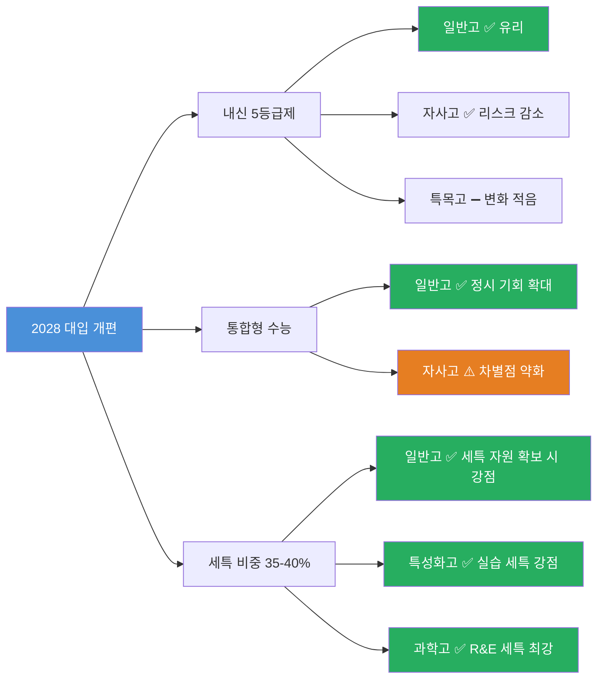

#### 학교 유형별 유불리 변화 종합

| 학교 유형 | 내신 5등급제 | 통합형 수능 | 세특 비중 상승 | 종합 판단 |
|-----------|-------------|-------------|----------------|-----------|
| **일반고** | ✅ 상위 10%면 1등급, 모집단 크기 유리 | ✅ 공통 수능으로 정시 기회 확대 | ⚠️ 학교별 편차 큼 | 세특 인프라 좋은 일반고가 가성비 최강 |
| **자사고** | ✅ 5등급제로 내신 리스크 대폭 감소 | ⚠️ 심화과목 차별점 약화 | ✅ 프로그램 풍부 | 내신 부담 줄었지만 비용 대비 효과 재검토 필요 |
| **외국어고** | ✅ 내신 리스크 감소 | ⚠️ 어학 특기 차별점 약화 | ✅ 외국어 활용 세특 가능 | 어학 특기 확실하면 여전히 유효 |
| **과학고** | ➖ 조기졸업·영재학교 트랙이라 큰 영향 없음 | ➖ 대부분 학종 진학 | ✅ R&E가 최강 세특 | 이공계 확고하면 최선, 진로 변경 시 리스크 |
| **특성화고** | ➖ 별도 내신 체계 | ➖ 수능 미응시 다수 | ✅ 실습·자격증이 세특 소재 | 취업 우선이면 최적, 후진학 경로도 열림 |
| **마이스터고** | ➖ 별도 내신 체계 | ➖ 수능 미응시 | ✅ 산업체 프로젝트가 세특 | 기술 분야 취업 목표 시 최강 |

> **핵심 메시지**: 2028 대입에서는 "어떤 학교에 갔느냐"보다 "그 학교에서 무엇을 탐구했느냐"가 더 중요해져요.

---

### Q2. "고교 선택이 세특(세부능력특기사항)에 어떤 영향을 주나요?"

**한 줄 답변**: 세특은 모든 고교에서 작성되지만, 학교가 제공하는 '탐구 자원'에 따라 내용의 깊이가 달라져요.

#### 세특이란?

세특은 수업 중 보여준 학생의 탐구 활동, 발표, 프로젝트 등을 선생님이 과목별로 기록하는 것이에요. 2028 대입에서 학종 평가의 **35-40%**를 차지할 만큼 중요합니다.

#### 좋은 세특의 3박자 (500자 제한)

| 요소 | 설명 | 예시 |
|------|------|------|
| **동기** | 왜 이 주제에 관심을 가졌는지 | "환경 다큐멘터리를 보고 미세플라스틱 문제에 의문을 품어..." |
| **활동** | 구체적으로 무엇을 했는지 | "생물 시간에 미세플라스틱 검출 실험을 설계하고 3회 반복 측정..." |
| **느낀 점** | 무엇을 배웠고, 어떻게 성장했는지 | "정량 분석의 한계를 인식하고 통계적 유의성 검증 방법을 추가 학습..." |

#### 학교 유형별 세특 자원 차이

| 항목 | 일반고 | 자사고 | 외고 | 과학고 | 특성화고 | 마이스터고 |
|------|--------|--------|------|--------|----------|------------|
| **교과 세특** | ✅ 기본 | ✅ 심화 | ✅ 어학 특화 | ✅ 과학 심화 | ✅ 실습 중심 | ✅ 산업체 연계 |
| **탐구 프로그램** | 학교별 편차 큼 | 풍부 | 어학 중심 | R&E·과학 탐구 | 기술 프로젝트 | 기업 프로젝트 |
| **외부 활동 연계** | 자기주도 필요 | 학교 주도 | 해외 교류 | 대학 연계 | 산업체 실습 | 취업 연계 실습 |
| **교사 1인당 학생 수** | 많음 | 적음 | 적음 | 매우 적음 | 보통 | 보통 |
| **세특 작성 밀도** | ⚠️ 학교별 차이 | ✅ 높음 | ✅ 높음 | ✅ 매우 높음 | ✅ 실습 기록 | ✅ 프로젝트 기록 |

#### 특성화고·마이스터고도 세특이 있나요?

**Yes!** 특성화고와 마이스터고에서도 세특은 작성돼요. 오히려 실습·자격증·프로젝트 경험이 세특의 훌륭한 소재가 됩니다.

| 소재 | 특성화고 예시 | 마이스터고 예시 |
|------|-------------|---------------|
| **실습** | 용접 기초 → 품질 검사까지 전 공정 체험 | 반도체 장비 운용 실습 |
| **자격증** | 정보처리기능사 취득 과정 | 전기기능사 실기 준비 |
| **프로젝트** | 교내 카페 운영 프로젝트 | 기업 연계 생산라인 개선 |

> **핵심 메시지**: 세특은 학교가 만들어주는 게 아니라 학생이 채우는 것. 단, 학교의 인프라가 채울 수 있는 폭을 결정해요.

---

### Q3. "일반고 가면 정시에 불리한가요? 자사고가 정시에 유리한가요?"

**한 줄 답변**: 2028 이후에는 통합형 수능으로 일반고와 자사고의 정시 차이가 크게 줄어들어요.

#### 2028 정시의 핵심 변화

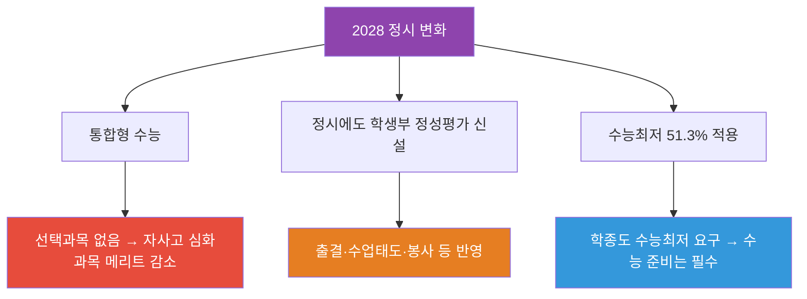

#### 정시 전략 비교

| 항목 | 일반고 | 자사고 | 특목고(외고·과학고) |
|------|--------|--------|---------------------|
| **수능 준비 환경** | 수능 중심 커리큘럼 | 내신+수능 병행 | 과목 특화 (과학고는 수능 비중 낮음) |
| **내신 부담** | 있음 (학종 병행 시) | 5등급제로 부담 감소 | 과학고는 학종 중심 |
| **정시 실적** | 학교별 편차 큼 | 상위권 쏠림 | 외고: 어문계열, 과학고: 이공계열 |
| **정시 정성평가** | ✅ 성실한 학교생활이 반영됨 | ✅ 동일 | ✅ 동일 |
| **사교육 의존도** | 높은 편 | 학교 보충 수업 | 학교 자체 프로그램 |
| **2028 이후 유불리** | ✅ 통합수능으로 기회 확대 | ➖ 차별점 약화 | ➖ 정시 비중 낮은 편 |

#### 정시 정성평가란?

2028 대입부터 정시에서도 수능 점수만이 아니라 학생부를 정성적으로 평가하는 대학이 늘어나요.

| 평가 요소 | 반영 내용 |
|-----------|-----------|
| 출결 | 무단결석·지각·조퇴 |
| 수업 태도 | 교사 기록 기반 |
| 봉사 활동 | 교내 봉사 시간·내용 |

> **핵심 메시지**: 2028 이후 정시는 "수능 한 방"이 아니에요. 어떤 고교를 가든 성실한 학교생활이 정시에서도 반영됩니다.

---

### Q4. "의대 가려면 어떤 고등학교가 유리한가요?"

**한 줄 답변**: 의대 정원 확대 + 학종 비중 상승으로, 세특이 풍부한 일반고 상위권이 의외로 유리할 수 있어요.

#### 의대 입시 핵심 변화 (2028~)

| 변화 | 내용 | 영향 |
|------|------|------|
| **의대 정원 확대** | 2028학년도부터 단계적 증원 | 경쟁률 완화, 학종 비중 상승 |
| **학종 세특 비중 상승** | 35-40% 반영 | 의학 관련 탐구 활동 중요 |
| **수능최저 유지** | 대부분 의대가 수능최저 적용 | 수능 준비도 병행 필수 |

#### 의대 희망 시 학교 선택 의사결정

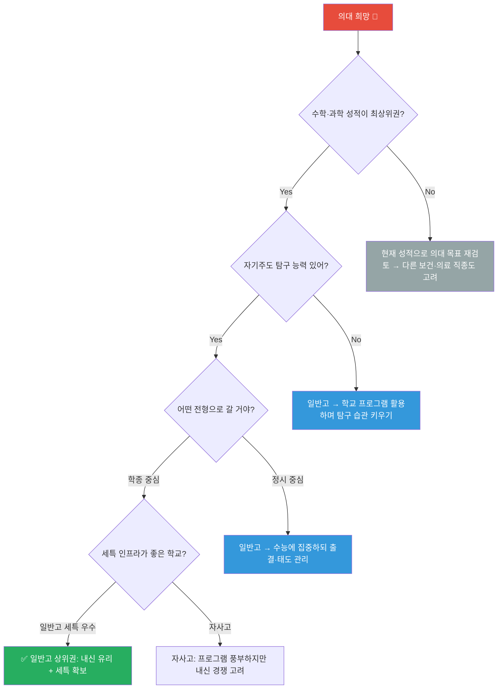

#### 과학고 → 의대, 가능한가요?

| 항목 | 현실 |
|------|------|
| **R&E 분야** | 물리·화학·수학·생물 기초과학 중심 → 의학과 직접 연결 약함 |
| **조기졸업** | 2년 만에 졸업 시 의대 지원 가능하지만, 탐구 기록 부족 우려 |
| **학종 적합성** | 과학고 세특이 "기초과학 연구자" 방향이라 의대 적합성 논란 |
| **결론** | 과학고 → 의대 경로는 존재하지만, 의대가 목표라면 비효율적일 수 있음 |

#### 일반고 상위권이 의대 학종에 유리할 수 있는 이유

1. **내신 5등급제**: 일반고 상위 10% = 1등급, 모집단이 커서 절대 등급 확보 용이
2. **세특 소재 다양성**: 생물·화학 교과 + 보건·윤리 융합 탐구 가능
3. **봉사·체험**: 지역 병원·보건소 연계 봉사가 세특 소재로 활용 가능
4. **비용 효율**: 자사고 등록금 없이 동일한 입시 성과 가능

> **핵심 메시지**: 의대 입시에서 "학교 이름"보다 "무엇을 탐구했는가"가 중요해지는 시대. 일반고에서도 충분히 의대에 갈 수 있어요.

---

## 2032 대입 전망과 미래 교육 (Q5-Q7)

---

### Q5. "2032 대입은 어떻게 바뀔 것으로 예측되나요?"

**한 줄 답변**: KB(한국형 바칼로레아)와 AI 포트폴리오 기반 평가가 확대될 가능성이 높지만, 아직 확정은 아니에요.

#### 대입 변화 타임라인

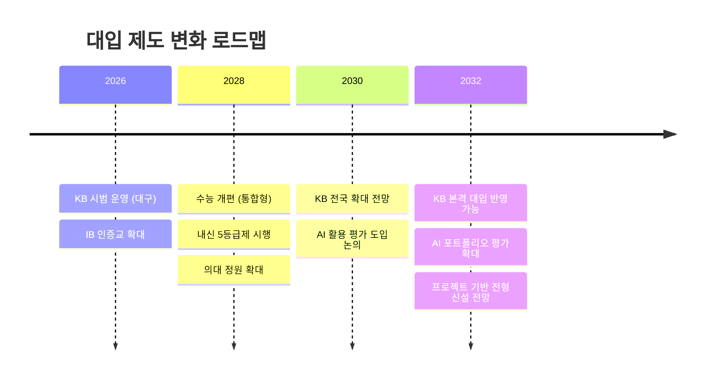

#### KB(한국형 바칼로레아)란?

| 항목 | 내용 |
|------|------|
| **정의** | 한국형 바칼로레아 — 논술·구술 중심의 고교 졸업 자격 시험 |
| **시범 시작** | 2026년 9월, 대구에서 최초 시행 |
| **목표** | 암기식 → 사고력·표현력 중심 평가로 전환 |
| **대입 반영** | 아직 대학 공식 인정 제도 아님 (고등교육법 개정 2027 목표) |
| **전망** | 2030년대 대입에서 수능과 병행 또는 대체 가능성 |

#### 2032 대입 예측 변화

| 영역 | 현재 (2025) | 2028 | 2032 전망 |
|------|------------|------|-----------|
| **시험** | 수능 (선택과목제) | 통합형 수능 | KB + 수능 병행? |
| **학생부** | 세특 중심 | 세특 비중 35-40% | AI 포트폴리오 추가? |
| **평가 방식** | 정량 + 정성 | 정성 비중 확대 | 프로젝트 기반 평가 확대 |
| **AI 활용** | 제한적 | 일부 대학 도입 | AI 채점·분석 보편화 전망 |

> **주의**: 2032 대입은 아직 확정된 제도가 아니에요. 위 내용은 현재 정책 방향과 전문가 전망을 바탕으로 한 예측입니다.

---

### Q6. "AI 시대에 어떤 고등학교를 가야 살아남나요?"

**한 줄 답변**: 학교 간판보다 "무엇을 만들었는가"가 변별력이 되는 시대. 어떤 학교든 '지식 생산자'가 되는 연습이 핵심이에요.

#### 패러다임 전환: 지식 소비자 → 지식 생산자

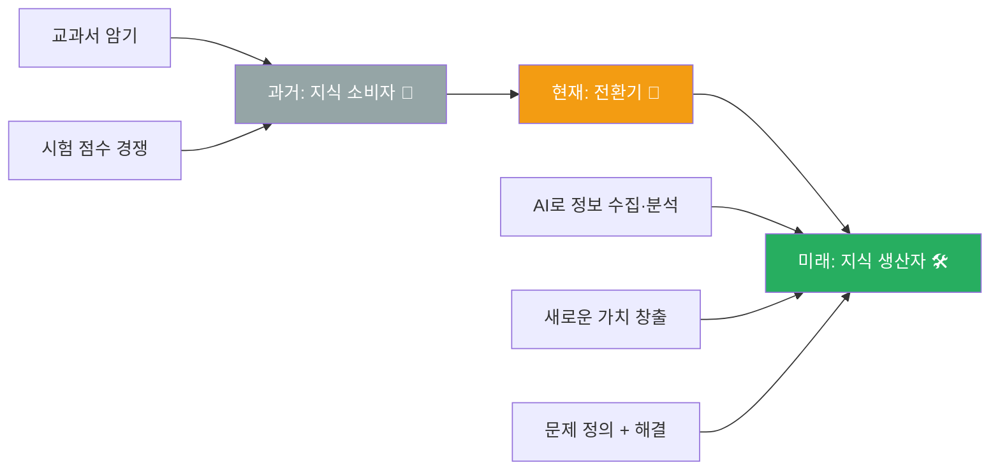

#### BG vs AG 마인드셋

| 항목 | BG (Before Gen-AI) | AG (After Gen-AI) |
|------|--------------------|--------------------|
| **공부 목표** | 지식 암기·재현 | 지식 활용·창조 |
| **경쟁력** | 얼마나 많이 아는가 | 얼마나 빨리 문제를 해결하는가 |
| **도구** | 교과서·인강·학원 | AI 도구 + 비판적 사고 |
| **평가** | 시험 점수 | 포트폴리오·프로젝트 결과물 |
| **진로** | 정해진 직업 선택 | 창직(創職) — 직업을 만듦 |
| **학교의 역할** | 지식 전달 | 탐구 환경·멘토링 제공 |
| **스킬** | 단일 전문성 | 다중 AI 오케스트레이션 |

#### 메타 AI 오케스트레이터란?

하나의 AI만 쓰는 게 아니라, 여러 AI 도구를 조합해서 복잡한 문제를 해결하는 능력이에요.

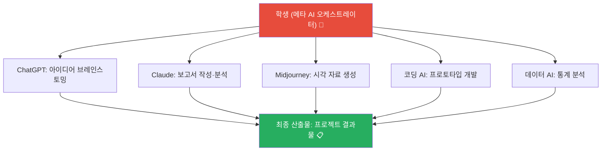

#### 학교 유형별 AI 시대 적응력 비교

| 학교 유형 | AI 도구 접근성 | 프로젝트 기회 | 창직 역량 개발 | AI 시대 적응력 |
|-----------|---------------|--------------|----------------|----------------|
| **일반고** | ⚠️ 학교별 편차 | ⚠️ 자기주도 필요 | ⚠️ 개인 노력 | ✅ 자기주도 역량 키우면 최적 |
| **자사고** | ✅ 인프라 우수 | ✅ 풍부 | ✅ 다양한 프로그램 | ✅ 활용하면 유리 |
| **외고** | ✅ 글로벌 도구 활용 | ✅ 국제 교류 | ⚠️ 어학에 편중 가능 | ✅ 글로벌 네트워크 강점 |
| **과학고** | ✅ 최고 수준 | ✅ R&E 중심 | ✅ 연구 역량 | ✅ 이공계 AI 융합 최강 |
| **특성화고** | ⚠️ 분야별 차이 | ✅ 실무 프로젝트 | ✅ 기술+AI 융합 | ✅ 실용 AI 활용 강점 |
| **마이스터고** | ✅ 산업체 연계 | ✅ 기업 프로젝트 | ✅ 산업 AI 경험 | ✅ 현장 AI 적용 최강 |

> **핵심 메시지**: AI 시대에는 학교 유형보다 "그 학교에서 AI를 활용해 무엇을 만들었는가"가 중요해요. 어떤 학교를 가든 '만드는 연습'을 하세요.

---

### Q7. "특성화고·마이스터고 출신도 2032 대입에서 기회가 있나요?"

**한 줄 답변**: 네, 오히려 기회가 늘어나요. 후진학 경로 확대 + AI 포트폴리오 시대가 특성화고·마이스터고에 유리하게 작용해요.

#### 후진학 경로란?

취업 먼저 → 경력 쌓기 → 대학 진학하는 경로예요. 재직자 특별전형이 대표적입니다.

| 경로 | 내용 | 대상 |
|------|------|------|
| **재직자 특별전형** | 3년 이상 재직 후 대학 진학 | 특성화고·마이스터고 졸업 취업자 |
| **학점은행제** | 온라인·학원 수강으로 학점 취득 → 학위 | 누구나 |
| **사이버대학** | 온라인 대학으로 학사 취득 | 직장인 |
| **전문대 → 4년제 편입** | 전문대 졸업 후 4년제 편입 | 전문대 졸업자 |

#### 특성화고·마이스터고의 2032 진로 트리

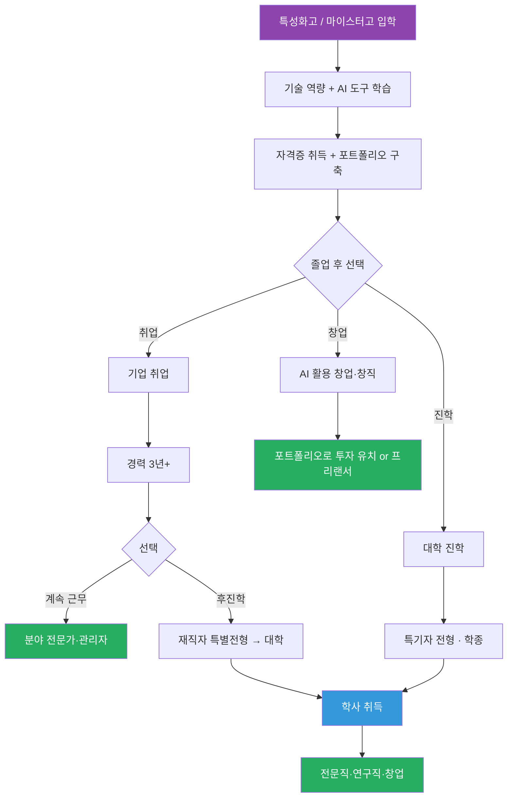

#### AI 포트폴리오가 학력보다 중요해지는 시대

| 과거 | 미래 (2032~) |
|------|-------------|
| "어느 대학 나왔어?" | "무엇을 만들었어?" |
| 학벌이 채용 기준 | 포트폴리오·실력이 채용 기준 |
| 4년제 학위 필수 | 역량 증명 방식 다양화 |
| 특성화고 = 대학 못 간 사람 | 특성화고 = 실무 경험 풍부한 인재 |

#### 특성화고 출신이 AI 시대에 만들 수 있는 포트폴리오 예시

| 분야 | 포트폴리오 예시 | AI 도구 활용 |
|------|---------------|-------------|
| **IT** | 웹앱 개발 → 배포 → 사용자 피드백 반영 | GitHub Copilot, Claude |
| **디자인** | 브랜딩 프로젝트 → 실제 클라이언트 작업 | Midjourney, Figma AI |
| **제조** | 생산라인 개선 → 데이터 분석 → 보고서 | 데이터 분석 AI |
| **요리** | 레시피 개발 → 원가 분석 → 마케팅 | 비용 분석 AI, SNS 자동화 |
| **농업** | 스마트팜 데이터 → 수확량 예측 모델 | IoT + AI 분석 |

> **핵심 메시지**: 2032년에는 "어떤 학교를 졸업했느냐"보다 "무엇을 만들어봤느냐"가 더 중요해질 거예요. 특성화고·마이스터고의 실무 경험은 강력한 포트폴리오가 됩니다.

---

## 고입 시 대입까지 고려해야 할 체크리스트 (Q8-Q10)

---

### Q8. "고입할 때 대입까지 역산해서 뭘 봐야 하나요?"

**한 줄 답변**: 6년을 역산해서 보세요. 고입은 대입의 출발점이에요.

#### 6년 역산 타임라인

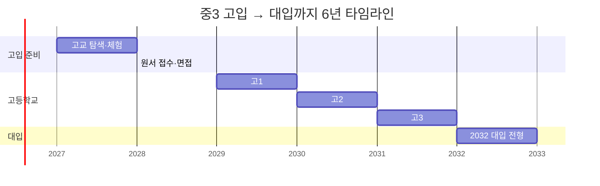

#### 6년 역산 체크리스트

| 시기 | 해야 할 일 | 체크 포인트 |
|------|-----------|------------|
| **중3 (고입 준비)** | 학교 유형별 장단점 파악, 학교 방문 | ☐ 대입 전형과 연결해서 학교 선택했는가? |
| **고1** | 교과 기초 다지기, 진로 탐색, 동아리 선택 | ☐ 세특에 쓸 탐구 활동을 시작했는가? |
| **고1 여름** | 진로 방향 1차 설정 | ☐ 관심 분야 3개 이내로 좁혔는가? |
| **고2** | 심화 탐구, 세특 핵심 기록, 수능 기초 | ☐ 세특 스토리라인이 일관성 있는가? |
| **고2 겨울** | 대입 전형 분석, 목표 대학 리스트 | ☐ 학종/정시/특기자 중 주력 전형 결정했는가? |
| **고3 상반기** | 학종 자소서·포트폴리오 준비 | ☐ 3년간의 세특이 하나의 스토리를 만드는가? |
| **고3 하반기** | 수능, 면접 준비 | ☐ 수능최저 충족 가능한가? |

#### 학교 유형별 대입 주요 전형 매칭

| 학교 유형 | 주력 전형 | 보조 전형 | 주의 사항 |
|-----------|----------|----------|-----------|
| **일반고** | 학종 (세특 중심) | 정시 (수능) | 세특 인프라 확인 필수 |
| **자사고** | 학종 (프로그램 풍부) | 정시 | 내신 경쟁률 확인 |
| **외고** | 학종 (어학 특기) | 특기자 | 어문계열 외 진로 시 불리 |
| **과학고** | 학종 (R&E) | 과학 특기자 | 이공계 외 진로 변경 어려움 |
| **특성화고** | 특성화고 특별전형 | 학종 | 후진학 경로도 고려 |
| **마이스터고** | 취업 → 후진학 | 재직자 전형 | 취업 우선, 진학은 3년 후 |

> **핵심 메시지**: 고입은 단독 이벤트가 아니라 6년 대입 프로젝트의 1단계예요. 역산해서 계획하세요.

---

### Q9. "적성과 지역(로컬)이 학교 선택에서 왜 중요한가요?"

**한 줄 답변**: AI가 대체 못하는 것은 열정·문제정의·창의적 융합이에요. 적성에 맞는 학교, 지역에 뿌리내린 학교가 최선입니다.

#### AI가 대체 못하는 3가지

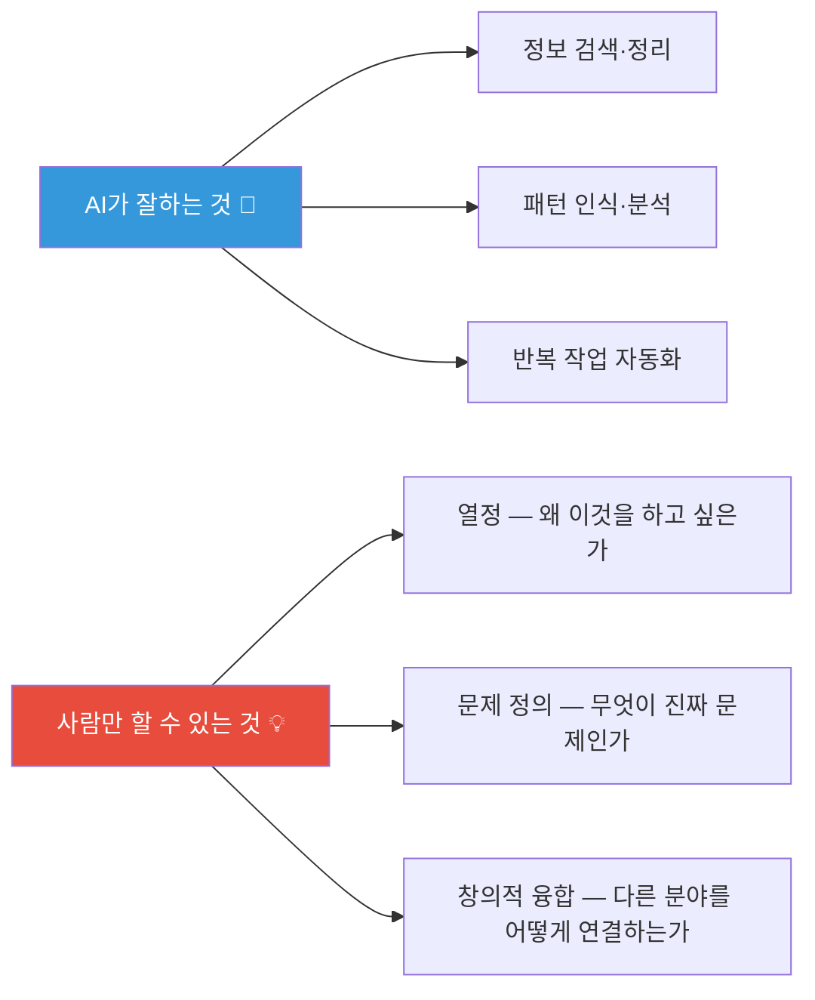

> 적성 = 열정의 원천. 적성에 맞지 않는 학교에 가면 3년간 열정 없이 버텨야 해요.

#### 로컬(지역)이 중요한 이유

| 요소 | 설명 | 예시 |
|------|------|------|
| **현장 실습** | 학교 근처 기업·기관에서 실습 기회 | 대구 마이스터고 → 대구 산업단지 연계 |
| **지역 산업 연계** | 지역 특화 산업과 학교 커리큘럼 일치 | 창원 기계 마이스터고 → 창원 기계 산업 |
| **네트워크** | 선배·졸업생·기업 인사 네트워크 | 지역 동문 네트워크가 취업에 직결 |
| **지역 인재 전형** | 지역 고교 출신 우대 전형 | 지방 국립대 지역 인재 전형 (30% 의무) |

#### 마이스터고·특성화고는 지역이 곧 취업

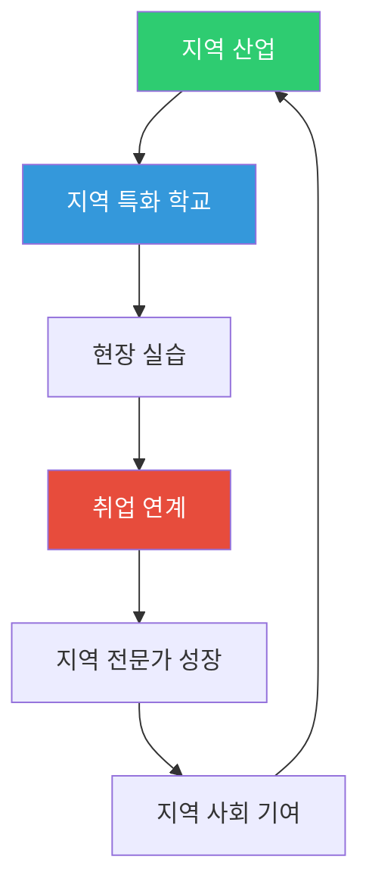

#### 통학 시간 vs 교육 품질 트레이드오프

| 통학 시간 | 장점 | 단점 | 권장 상황 |
|-----------|------|------|-----------|
| **30분 이내** | 체력·시간 여유, 자기주도 학습 시간 확보 | 선택지 제한 | 일반고·특성화고 |
| **30~60분** | 적당한 선택 범위 | 피로 누적 주의 | 자사고·외고 고려 시 |
| **60분 이상** | 좋은 학교 갈 수 있음 | 통학 피로 → 학습 효율 저하 | 기숙사 학교가 아니라면 재고 |
| **기숙사** | 통학 시간 0, 자기관리 훈련 | 가족과 분리, 적응 스트레스 | 과학고·마이스터고·일부 자사고 |

> **핵심 메시지**: "좋은 학교"보다 "나에게 맞는 학교"를 찾으세요. 적성과 지역은 학교 선택의 숨은 변수예요.

---

### Q10. "결국 어떤 학교를 가야 하나요? — 최종 의사결정 가이드"

**한 줄 답변**: 정답은 없지만, 당신의 답은 있어요. 아래 의사결정 트리를 따라가 보세요.

#### 학생 유형별 학교 추천 의사결정 트리

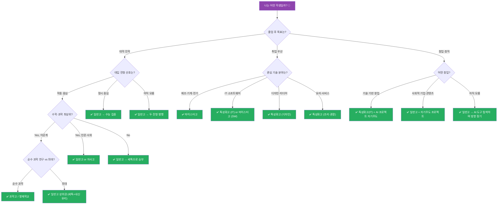

#### 30초 결론

| 학생 유형 | 추천 학교 | 핵심 이유 |
|-----------|----------|-----------|
| 대학 진학 (학종) | **일반고** (세특 우수) 또는 **자사고** | 내신 5등급제 + 세특 35-40%로 일반고 유리 |
| 대학 진학 (정시) | **일반고** | 통합형 수능으로 정시 기회 확대 |
| 의대 목표 | **일반고 상위권** | 내신+세특+수능최저 모두 커버 |
| 이공계 연구 | **과학고·영재학교** | R&E 세특 최강 |
| 기술직 취업 | **마이스터고** | 산업체 연계 취업률 최고 |
| IT·디자인 취업 | **특성화고** (IT/디자인) | 실무 포트폴리오 구축 가능 |
| 창업·창직 | **일반고** + 자기주도 or **특성화고** (IT) | AI 도구 활용 프로젝트 경험 |
| 아직 모르겠음 | **일반고** | 가장 넓은 선택지 유지 |

> **최종 메시지**: 학교는 도구예요. 어떤 학교를 가든 중요한 건 **"그 학교에서 내가 무엇을 탐구하고, 무엇을 만들어냈는가"**입니다. 2028·2032 대입이 바뀌어도 이 원칙은 변하지 않아요. 학교 선택에 정답은 없지만, **자기 자신을 아는 것**이 최고의 전략입니다.

---

## 부록: 용어 사전

| 용어 | 뜻 |
|------|-----|
| **세특** | 세부능력특기사항. 교과 수업에서 보여준 학생의 탐구·발표·프로젝트 등을 교사가 기록 |
| **학종** | 학생부종합전형. 학생부(교과+비교과+세특)를 종합적으로 평가하는 대입 전형 |
| **정시** | 정시모집. 주로 수능 성적으로 선발하는 대입 전형 |
| **수능최저** | 수능최저학력기준. 학종에서도 수능 일정 등급 이상을 요구하는 조건 |
| **5등급제** | 2028 대입부터 적용되는 내신 등급 체계 (기존 9등급 → 5등급) |
| **통합형 수능** | 선택과목 없이 전 영역 공통으로 출제하는 수능 (2028~) |
| **KB** | 한국형 바칼로레아. 논술·구술 중심 고교 졸업 자격 시험 (2026 시범) |
| **R&E** | Research & Education. 과학고·영재학교의 연구 프로그램 |
| **후진학** | 취업 먼저 → 경력 후 → 대학 진학하는 경로 |
| **재직자 특별전형** | 3년 이상 재직자를 위한 대학 입학 특별전형 |
| **창직(創職)** | 기존에 없던 직업을 스스로 만들어내는 것 |
| **메타 AI 오케스트레이터** | 여러 AI 도구를 조합·지휘하여 복잡한 문제를 해결하는 역할 |

---

> **다음 편 예고**: 파트 4에서는 고입 면접·자기소개서 실전 전략을 다룹니다.
>
> **시리즈 전체 보기**: 파트 1 (기본 Q&A) → 파트 2 (특수 상황) → **파트 3 (고입→대입 연결)** → 파트 4 (면접·자소서)
