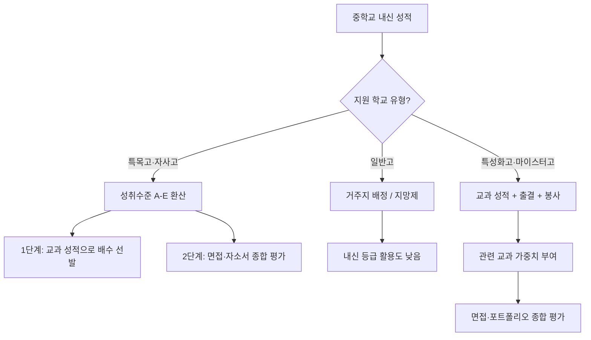
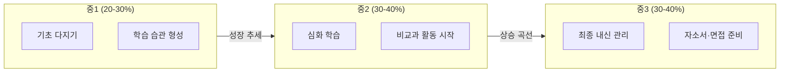
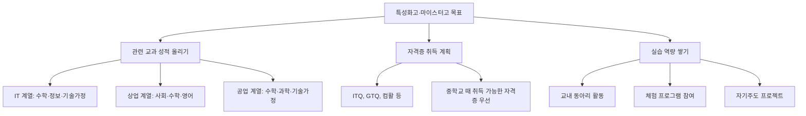
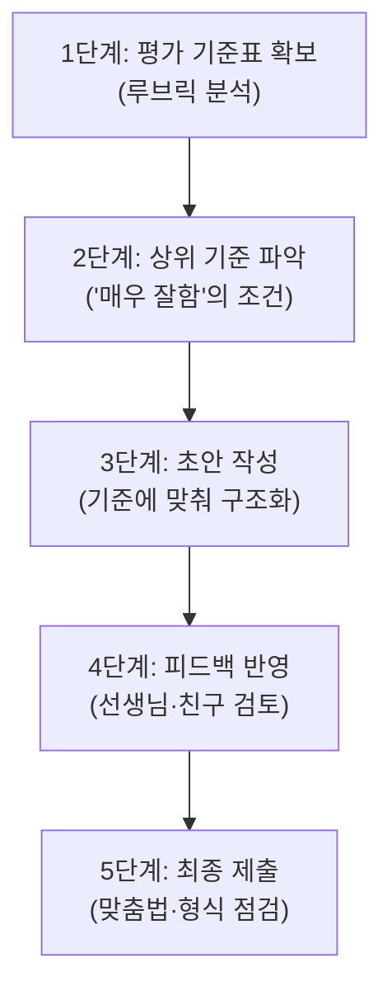
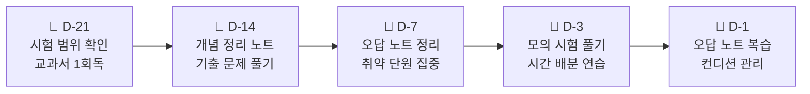
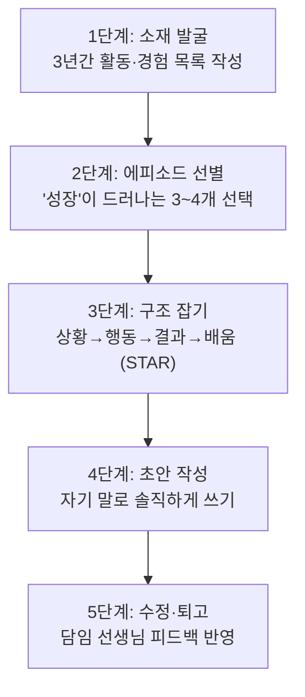
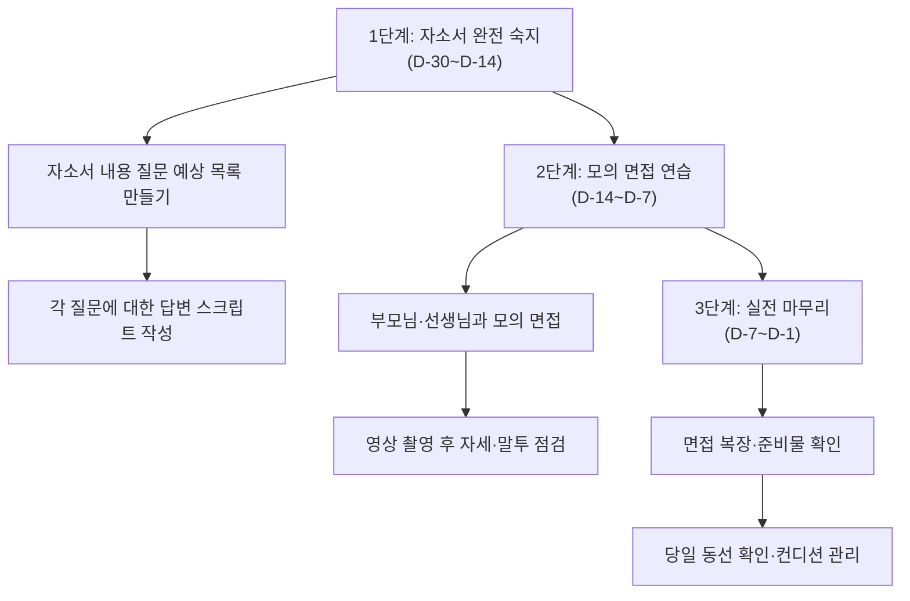
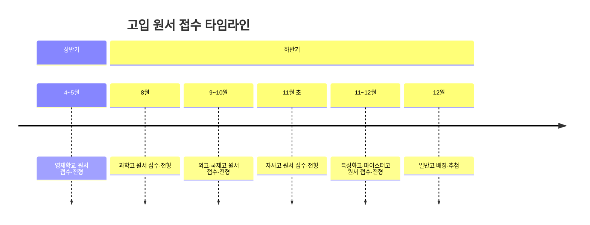
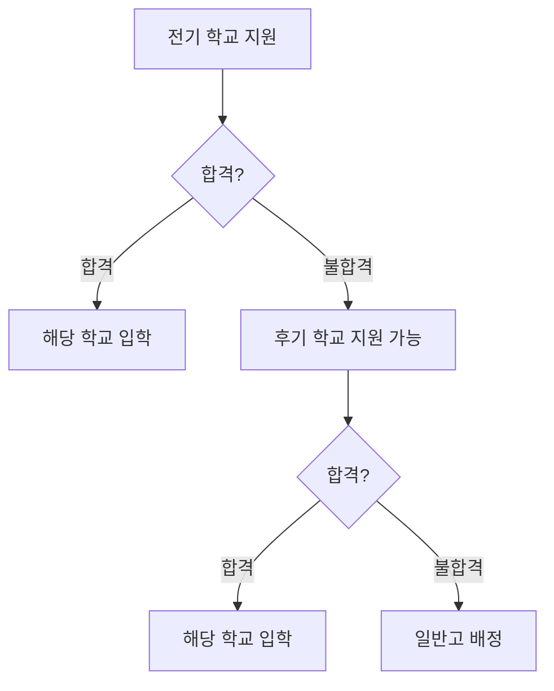
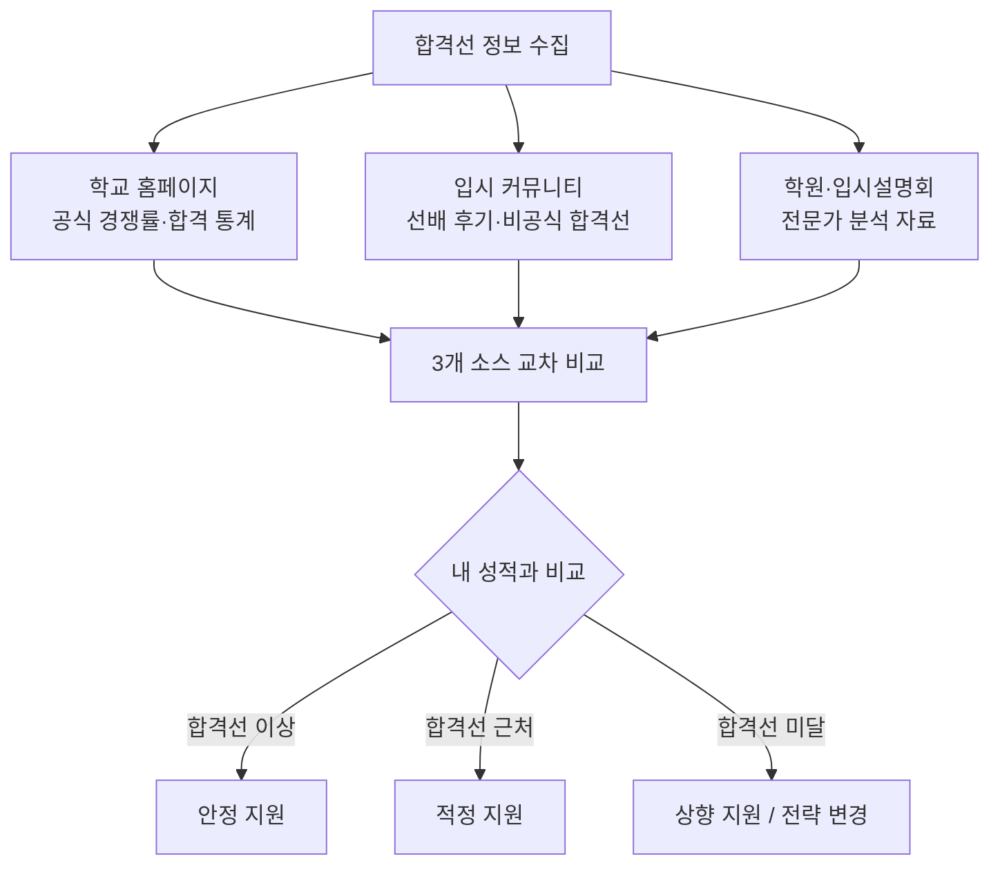

# 내신·전형·원서 FAQ — 성적 관리부터 원서 접수까지

> **시리즈 2/4** | 중학생과 학부모를 위한 고입 준비 가이드
>
> 이 문서는 내신 성적 산출 방식, 수행평가 전략, 자기소개서·면접 준비, 원서 접수 절차까지 한 번에 정리했어요.

---

## 목차

| 번호 | 질문 | 키워드 |
|------|------|--------|
| Q1 | 고입에서 내신은 어떻게 산출되나요? | 내신 산출, 성취수준 |
| Q2 | 중3 성적이 가장 중요한가요? | 학년별 반영 비중 |
| Q3 | 과목별 내신 전략은? | 과목 중요도, 학교 유형 |
| Q4 | 수행평가 비중이 높아졌는데 어떻게 대비? | 수행평가, 고득점 |
| Q5 | 서술형 시험과 오답 분류법 | 오답 분석, 시험 대비 |
| Q6 | 자기소개서 작성법 | 자소서, 구성 |
| Q7 | 면접 준비법 | 면접, 빈출 질문 |
| Q8 | 원서 접수 일정과 절차 | 일정, 타임라인 |
| Q9 | 여러 학교 동시 지원 가능? | 전기/후기, 중복 지원 |
| Q10 | 합격선 분석과 지원 자격 확인법 | 합격선, 자격 체크 |

---

## 내신/성적 FAQ

---

### Q1. 고입에서 내신은 어떻게 산출되나요?

내신은 학교 유형에 따라 반영 방식이 달라요. 아래 흐름도로 한눈에 확인해 보세요.

#### 성취수준 기준표

| 성취수준 | 원점수 범위 (일반적) | 성취율 | 설명 |
|----------|---------------------|--------|------|
| **A** | 90점 이상 | 90% 이상 | 해당 과목을 매우 우수하게 이해 |
| **B** | 80~89점 | 80~89% | 우수한 수준의 이해 |
| **C** | 70~79점 | 70~79% | 보통 수준의 이해 |
| **D** | 60~69점 | 60~69% | 기초 수준의 이해 |
| **E** | 59점 이하 | 60% 미만 | 기초 미달 |

#### 학교 유형별 내신 반영 차이

| 구분 | 특목고 (외고·과학고) | 자사고 | 일반고 | 특성화고·마이스터고 |
|------|---------------------|--------|--------|---------------------|
| **내신 반영** | 성취수준 A-E 활용 | 성취수준 A-E 활용 | 추첨/지망 배정 | 교과 성적 + 출결 |
| **반영 과목** | 영어/수학 등 주요 교과 | 전 교과 | - | 관련 교과 가중 |
| **반영 학년** | 중2~중3 중심 | 중1~중3 | - | 중1~중3 |
| **내신 외 요소** | 자소서·면접·수상 | 자소서·면접 | - | 면접·포트폴리오·자격증 |

> **핵심 포인트**: 특목고·자사고는 A를 많이 받을수록 유리하고, 특성화고·마이스터고는 관련 교과에서 좋은 성적을 받는 것이 중요해요!

---

### Q2. 중3 성적이 가장 중요한가요? 중1부터 다 반영되나요?

결론부터 말하면, **학년이 올라갈수록 반영 비중이 커지지만 중1도 무시할 수 없어요.**

#### 학년별 반영 비중

| 학년 | 일반적 반영 비중 | 특목고·자사고 | 특성화고·마이스터고 | 비고 |
|------|-----------------|--------------|---------------------|------|
| **중1** | 20~30% | 20~25% | 25~30% | 기초 학습 습관 형성기 |
| **중2** | 30~40% | 30~35% | 30~35% | 심화 학습 본격화 |
| **중3** | 30~40% | 40~50% | 35~40% | 최종 지원 직전 학기 |

#### 성장 추세의 힘

| 유형 | 중1 | 중2 | 중3 | 평가 |
|------|-----|-----|-----|------|
| 꾸준형 | A | A | A | 안정적, 긍정 평가 |
| **성장형** | B | A | A | **성장 추세 → 매우 긍정** |
| 하락형 | A | A | B | 우려 요인 |
| 급성장형 | C | B | A | 노력 인정, 긍정 평가 |

> **팁**: 중1 때 성적이 조금 부족했더라도 걱정하지 마세요. 중2~중3에서 **꾸준한 상승 곡선**을 보여주면 "성장 가능성이 높은 학생"으로 긍정 평가를 받을 수 있어요.

---

### Q3. 과목별 내신 전략은?

지원하려는 학교 유형에 따라 집중해야 할 과목이 달라요.

#### 목표별 과목 중요도

| 과목 | 외고·국제고 | 과학고·영재학교 | 일반고 학종 | 특성화고·마이스터고 | 자사고 |
|------|------------|----------------|-------------|---------------------|--------|
| **국어** | ★★★★ | ★★★ | ★★★★ | ★★★ | ★★★★ |
| **영어** | ★★★★★ | ★★★ | ★★★★ | ★★★ | ★★★★ |
| **수학** | ★★★ | ★★★★★ | ★★★★ | ★★★ | ★★★★ |
| **과학** | ★★ | ★★★★★ | ★★★ | ★★~★★★★ | ★★★ |
| **사회** | ★★★★ | ★★ | ★★★ | ★★ | ★★★ |
| **기술·가정** | ★ | ★★ | ★★ | ★★★★★ | ★★ |
| **정보** | ★ | ★★★★ | ★★ | ★★★★ | ★★ |
| **예체능** | ★ | ★ | ★★ | ★★ | ★★ |

> ★★★★★ = 최우선, ★ = 참고

#### 특성화고·마이스터고 지원 시 특별 전략

| 계열 | 핵심 과목 | 추천 자격증 | 강조 포인트 |
|------|----------|------------|-------------|
| IT·SW | 수학, 정보, 기술가정 | ITQ, DIAT, 코딩 자격증 | 프로그래밍 프로젝트 경험 |
| 상업·경영 | 사회, 수학, 영어 | ITQ, 컴활, 한국사 | 경제 관련 독서·탐구 활동 |
| 공업·기계 | 수학, 과학, 기술가정 | 3D프린팅, CAD 관련 | 만들기·설계 경험 |
| 디자인·미디어 | 미술, 기술가정, 정보 | GTQ, 영상 편집 관련 | 포트폴리오 |

---

### Q4. 수행평가 비중이 높아졌는데 어떻게 대비하나요?

최근 수행평가 비중이 크게 늘었어요. 과목별 비중을 확인하고 전략적으로 준비하세요.

#### 과목별 수행평가 비중

| 과목 | 수행평가 비중 | 주요 유형 | 대비 핵심 |
|------|-------------|----------|----------|
| **국어** | 50~60% | 글쓰기, 발표, 토론, 독서록 | 논리적 글쓰기 연습 |
| **영어** | 40~50% | 에세이, 말하기, 듣기 | 매일 영어 일기 쓰기 |
| **수학** | 30~40% | 탐구보고서, 서술형, 포트폴리오 | 풀이 과정 서술 연습 |
| **과학** | 40~50% | 실험보고서, 탐구활동 | 실험 과정 꼼꼼히 기록 |
| **사회** | 40~50% | 조사보고서, 발표, 토론 | 시사 이슈 정리 습관 |

#### 수행평가 고득점 전략 5단계

| 단계 | 핵심 행동 | 꿀팁 |
|------|----------|------|
| **1단계** | 선생님이 나눠주신 평가 기준표를 꼼꼼히 읽기 | 기준표에 밑줄 치면서 읽어요 |
| **2단계** | "매우 잘함(A)" 기준의 핵심 키워드 뽑기 | 예: "논리적", "구체적 사례", "독창성" |
| **3단계** | 키워드를 포함한 개요 먼저 작성 | 바로 본문 쓰지 말고 뼈대부터! |
| **4단계** | 제출 2~3일 전에 다른 사람에게 보여주기 | 혼자 보면 못 보는 부분이 있어요 |
| **5단계** | 맞춤법 검사기 돌리고 형식 통일 | 한글 맞춤법 검사기 활용 |

> **주의**: 수행평가는 "제출 기한"이 생명이에요. 하루라도 늦으면 감점이 크니까 **캘린더에 마감일 D-3을 표시**해 두세요!

---

### Q5. 서술형 시험과 오답 분류법

서술형 시험 비중도 계속 늘고 있어요. 오답을 체계적으로 분류하면 같은 실수를 반복하지 않을 수 있어요.

#### 오답 분류 체계

| 오답 유형 | 설명 | 예시 | 해결법 |
|----------|------|------|--------|
| **개념 오류** | 개념 자체를 잘못 이해 | "밀도 = 부피 ÷ 질량"으로 외움 | 교과서 개념 다시 정리 |
| **적용 실패** | 개념은 아는데 문제에 적용 못함 | 공식은 아는데 어디에 쓸지 모름 | 유형별 문제 반복 풀기 |
| **계산 실수** | 단순 연산 오류 | 부호 실수, 자릿수 착각 | 검산 습관, 중간 과정 쓰기 |
| **시간 초과** | 풀 수는 있지만 시간 부족 | 뒷부분 문제 못 품 | 타이머 맞춰 연습 |
| **문제 해석 오류** | 문제가 묻는 것을 잘못 파악 | "아닌 것"을 고르라는데 "맞는 것" 고름 | 문제 핵심어에 밑줄 긋기 |

#### 내신 시험 대비 타임라인

#### 시험 대비 단계별 상세

| 시기 | 할 일 | 목표 | 체크 |
|------|-------|------|------|
| **D-21** | 시험 범위 확인, 교과서 1회독 | 전체 그림 파악 | ☐ |
| **D-14** | 개념 정리 노트 작성, 기출 풀기 | 핵심 개념 정리 | ☐ |
| **D-7** | 오답 노트 작성, 취약 단원 보강 | 약점 보완 | ☐ |
| **D-3** | 실전 모의 시험 (타이머 켜고) | 시간 관리 연습 | ☐ |
| **D-1** | 오답 노트만 복습, 일찍 취침 | 컨디션 최적화 | ☐ |

> **서술형 시험 꿀팁**: 답안을 쓸 때 **"왜냐하면 ~ 때문이다"** 형식으로 근거를 꼭 포함하세요. 부분 점수를 받을 확률이 훨씬 높아져요!

---

## 전형/원서 FAQ

---

### Q6. 자기소개서 작성법

자기소개서(자소서)는 특목고·자사고·특성화고·마이스터고 입시에서 핵심 서류예요.

#### 좋은 자소서 vs 나쁜 자소서

| 구분 | 좋은 자소서 | 나쁜 자소서 |
|------|-----------|-----------|
| **도입** | "과학 실험에서 실패를 반복하며…" (구체적 에피소드) | "저는 성실하고 열정적인 학생입니다" (추상적) |
| **내용** | 활동 → 배움 → 성장 순서로 전개 | 활동 나열만 (배움 없음) |
| **표현** | 자기만의 언어로 솔직하게 | 인터넷 예시 복붙한 느낌 |
| **분량** | 항목별 기준 분량 충실히 채움 | 너무 짧거나 초과 |
| **결론** | 지원 학교에서 하고 싶은 구체적 계획 | "열심히 하겠습니다" |

#### 자소서 작성 5단계

#### STAR 기법 예시

| 요소 | 설명 | 예시 |
|------|------|------|
| **S** (상황) | 어떤 상황이었나? | "중2 과학 탐구 대회에서 팀장을 맡았다" |
| **T** (과제) | 무엇이 어려웠나? | "팀원 간 의견 충돌이 심했다" |
| **A** (행동) | 어떻게 해결했나? | "각자 의견을 정리한 후 투표로 결정했다" |
| **R** (결과) | 무엇을 배웠나? | "경청의 중요성과 민주적 의사결정을 배웠다" |

#### 특성화고·마이스터고 자소서 특별 포인트

| 포인트 | 내용 | 구체적으로 쓸 것 |
|--------|------|-----------------|
| **실무 관심** | 해당 분야에 관심을 갖게 된 계기 | "아버지의 자동차 정비소에서 엔진 구조에 호기심을 느꼈다" |
| **직업 비전** | 졸업 후 구체적 진로 계획 | "OO 기업 취업 → 기술사 자격 취득 → 마이스터" |
| **자격증 계획** | 재학 중 취득할 자격증 | "1학년 기능사 → 2학년 산업기사 도전" |
| **실습 경험** | 관련 체험·활동 경험 | "메이커 스페이스에서 3D프린팅 작품 제작" |

---

### Q7. 면접 준비법

면접은 자소서 내용을 바탕으로 진행돼요. 충분한 연습이 핵심이에요.

#### 빈출 질문 TOP 10

| 순위 | 질문 | 출제 의도 |
|------|------|----------|
| 1 | 우리 학교에 지원한 동기는? | 지원 동기·학교 이해도 |
| 2 | 중학교 때 가장 의미 있던 활동은? | 자기주도성·성장 |
| 3 | 자신의 장점과 단점은? | 자기 인식·솔직함 |
| 4 | 입학 후 어떤 활동을 하고 싶은가? | 목표 의식·계획성 |
| 5 | 최근 읽은 책과 인상 깊었던 점은? | 독서 습관·사고력 |
| 6 | 친구와 갈등이 생기면 어떻게 해결하나? | 대인관계·문제 해결 |
| 7 | 학업적으로 어려웠던 경험과 극복 방법? | 회복 탄력성 |
| 8 | 장래 희망과 그 이유는? | 진로 인식·비전 |
| 9 | 우리 학교에 대해 아는 것은? | 학교 관심도·조사력 |
| 10 | 마지막으로 하고 싶은 말은? | 열정·간절함 |

#### 면접 대비 3단계

#### 면접 기본 매너 체크리스트

| 항목 | 체크 |
|------|------|
| 노크 후 "들어가겠습니다" 인사 | ☐ |
| 면접관 눈을 보며 대답 | ☐ |
| "~입니다", "~했습니다" 존댓말 사용 | ☐ |
| 질문을 끝까지 듣고 대답 (끊지 않기) | ☐ |
| 모르는 질문은 솔직히 "잘 모르지만 ~ 생각합니다" | ☐ |
| 퇴장 시 "감사합니다" 인사 | ☐ |

#### 특성화고·마이스터고 면접 특이점

| 일반 면접 | 특성화고·마이스터고 면접 |
|----------|----------------------|
| 학업 의지 중심 | **기술 관심도** 중심 |
| 독서·탐구 경험 | **실습·만들기 경험** |
| 추상적 진로 계획 OK | **구체적 직업·기술 비전** 필요 |
| 학교생활 전반 | **해당 분야 직업 인식** 확인 |
| - | 자격증 취득 계획 질문 빈출 |

> **면접 꿀팁**: 면접관은 "정답"을 원하는 게 아니에요. **자기 경험을 자기 말로 진솔하게** 이야기하는 학생에게 높은 점수를 줘요.

---

### Q8. 원서 접수 일정과 절차

고입 원서 접수는 학교 유형별로 시기가 다르고, **먼저 접수하는 학교에 떨어지면 다음 단계로 넘어가는 구조**예요.

#### 고입 전형 타임라인 (연간)

#### 전형 유형별 일정 요약

| 학교 유형 | 접수 시기 | 전형 구분 | 주요 전형 요소 |
|----------|----------|----------|---------------|
| **영재학교** | 4~5월 | 별도 | 서류 + 캠프 + 면접 |
| **과학고** | 8월 | 전기 | 서류 + 면접 + 캠프 |
| **외고·국제고** | 9~10월 | 전기 | 내신 + 자소서 + 면접 |
| **자사고** | 11월 초 | 전기 | 내신 + 자소서 + 면접 |
| **특성화고** | 11~12월 | 전기/후기 | 내신 + 면접 + 포트폴리오 |
| **마이스터고** | 11~12월 | 전기 | 내신 + 면접 + 적성검사 |
| **일반고** | 12월 | 후기 | 거주지 배정/추첨 |

#### 원서 접수 체크리스트

| 순서 | 할 일 | 시기 | 체크 |
|------|-------|------|------|
| 1 | 지원 학교 목록 확정 | 중3 1학기 | ☐ |
| 2 | 학교별 전형 요강 다운로드 | 공고 즉시 | ☐ |
| 3 | 필요 서류 목록 작성 | 요강 확인 후 | ☐ |
| 4 | 자기소개서 초안 작성 | 접수 2개월 전 | ☐ |
| 5 | 추천서 요청 (필요 시) | 접수 1개월 전 | ☐ |
| 6 | 온라인 접수 사이트 가입·확인 | 접수 2주 전 | ☐ |
| 7 | 서류 최종 점검·제출 | 접수 기간 | ☐ |
| 8 | 접수 확인서 출력·보관 | 접수 직후 | ☐ |

---

### Q9. 여러 학교에 동시 지원할 수 있나요?

**같은 시기(전기/후기)에는 1개 학교만 지원 가능**해요. 하지만 전기에서 떨어지면 후기로 넘어갈 수 있어요.

#### 전기·후기 지원 구조

#### 전기·후기 학교 분류

| 구분 | 전기 학교 | 후기 학교 |
|------|----------|----------|
| **해당 학교** | 영재학교, 과학고, 외고, 국제고, 자사고(전국), **마이스터고**, 일부 특성화고 | 일반고, 자율형 공립고, 일부 자사고(광역), 일부 특성화고 |
| **지원 개수** | 1개교만 | 1개교만 (지역에 따라 지망제) |
| **시기** | 8월~11월 (유형별 상이) | 12월 |

> **특성화고·마이스터고의 위치**: 마이스터고는 **전기**에 해당하므로 과학고·외고 등과 동시 지원이 불가해요. 특성화고는 학교에 따라 전기 또는 후기이므로 **반드시 해당 학교 요강을 확인**하세요.

#### 지원 조합 예시

| 시나리오 | 전기 지원 | 후기 지원 | 가능 여부 |
|----------|----------|----------|----------|
| A | 과학고 | 일반고 | ✅ 가능 |
| B | 외고 | 일반고 | ✅ 가능 |
| C | 외고 + 과학고 동시 | - | ❌ 불가 |
| D | 마이스터고 | 일반고 | ✅ 가능 |
| E | 마이스터고 + 외고 동시 | - | ❌ 불가 |
| F | 전기 특성화고 | 일반고 | ✅ 가능 |

> **전략 팁**: 전기에서 "도전 지원"을 하더라도, 후기 일반고 배정은 보장되므로 너무 걱정하지 않아도 돼요. 단, 전기 학교 지원을 포기하면 되돌릴 수 없으니 신중하게 결정하세요.

---

### Q10. 합격선 분석과 지원 자격 확인법

지원 전에 합격 가능성을 미리 가늠해 보는 것이 중요해요.

#### 합격선 교차 검증 방법

#### 정보 소스별 신뢰도

| 정보 소스 | 신뢰도 | 장점 | 주의점 |
|----------|--------|------|--------|
| **학교 홈페이지** | ★★★★★ | 공식 데이터, 정확 | 최신 연도만 공개되는 경우 |
| **교육청 발표** | ★★★★★ | 통계 자료 신뢰 | 세부 학교별 정보 부족 |
| **입시 설명회** | ★★★★ | 전문가 해석 포함 | 학원 홍보 목적 주의 |
| **입시 커뮤니티** | ★★★ | 실시간 정보, 후기 풍부 | 부정확한 정보 혼재 |
| **선배 후기** | ★★★ | 생생한 경험담 | 개인 차이 큼 |

#### 지원 자격 체크리스트

| 확인 항목 | 확인 방법 | 체크 |
|----------|----------|------|
| **거주지 요건** | 학교 요강 → 지원 자격란 확인 | ☐ |
| **내신 기준** | 성취수준 A 비율 확인 | ☐ |
| **출결 요건** | 미인정 결석·지각 횟수 확인 | ☐ |
| **추천서 필요 여부** | 담임 선생님 사전 요청 | ☐ |
| **어학 능력** (외고) | 영어 성취수준 확인 | ☐ |
| **관련 활동** (특목고) | 교내 대회·동아리 실적 정리 | ☐ |
| **자격증** (특성화고·마이스터고) | 보유 자격증 목록 정리 | ☐ |
| **신체 조건** (일부 특성화고) | 건강검진 결과 확인 | ☐ |

#### 나의 지원 적합도 자가 진단

| 평가 항목 | 배점 | 내 점수 |
|----------|------|---------|
| 내신 성적 (A 비율) | 30점 | __/30 |
| 관련 비교과 활동 | 20점 | __/20 |
| 자기소개서 완성도 | 20점 | __/20 |
| 면접 준비도 | 15점 | __/15 |
| 출결·봉사 | 10점 | __/10 |
| 자격증·수상 | 5점 | __/5 |
| **합계** | **100점** | **__/100** |

| 합계 점수 | 지원 판단 |
|----------|----------|
| 80점 이상 | 안정 지원 — 자신 있게 도전! |
| 60~79점 | 적정 지원 — 면접·자소서로 승부 |
| 40~59점 | 도전 지원 — 후기 학교 준비도 병행 |
| 40점 미만 | 전략 수정 — 다른 학교 유형 고려 |

---

## 마무리

> 이 FAQ에서 다룬 10가지 질문을 한 장으로 정리하면:

| 영역 | 핵심 메시지 |
|------|-----------|
| **내신 산출** | 성취수준 A-E 기반, 학교 유형마다 반영 방식이 달라요 |
| **학년별 비중** | 중3이 가장 크지만 중1부터 차곡차곡 쌓아야 해요 |
| **과목 전략** | 지원 학교 유형에 맞춰 핵심 과목에 집중하세요 |
| **수행평가** | 루브릭(평가 기준표) 분석이 고득점의 시작이에요 |
| **오답 분류** | 5가지로 분류해서 같은 실수를 반복하지 마세요 |
| **자기소개서** | STAR 기법으로 "성장 이야기"를 쓰세요 |
| **면접** | 자소서 숙지 + 모의 면접 3회 이상이 기본이에요 |
| **원서 일정** | 전기→후기 순서, 같은 시기 1개교만 가능해요 |
| **중복 지원** | 전기 탈락 시 후기 지원 가능, 동시 지원은 불가 |
| **합격선 분석** | 3개 이상 소스를 교차 검증하고 자가 진단하세요 |

---

> **다음 편 예고**: 시리즈 3편에서는 **비교과 활동, 동아리, 봉사활동** 관련 FAQ를 다룰 예정이에요. 기대해 주세요!
