# 학부모·비교과·멘탈 FAQ — 부모 역할부터 활동 관리, 멘탈 케어까지

> **시리즈 4/4** | 중학생과 학부모를 위한 고입 준비 종합 FAQ
>
> 비교과 활동 전략, 학부모 역할, 그리고 입시 과정에서의 멘탈 관리까지 — 성적 외의 모든 것을 다룹니다.

---

## 목차

| 영역 | 질문 | 핵심 키워드 |
|------|------|-------------|
| 비교과/활동 | Q1. 봉사활동 시간과 유형 | 질 > 양, 지속성 |
| | Q2. 독서 기록 관리법 | 독서 노트 4요소 |
| | Q3. 동아리 활동 선택 | 목표 학교별 전략 |
| | Q4. 대회 수상·자격증 | 교내 vs 교외, 자격증 활용 |
| 학부모 | Q5. 학원비 부담 줄이기 | 무료 자원 활용 |
| | Q6. 자녀와 소통법 | 데이터 기반 대화 |
| | Q7. 입시 정보 수집 채널 | 공식 vs 비공식 |
| | Q8. 학교 설명회 체크리스트 | 7가지 필수 확인 |
| 멘탈 관리 | Q9. 자녀 멘탈 관리 | 5대 원칙, 위험 신호 |
| | Q10. 사회적 시선 대처 | 편견 vs 현실 데이터 |

---

## 비교과/활동 FAQ (Q1-Q4)

---

### Q1. 봉사활동은 몇 시간 필요? 어떤 봉사가 좋은가요?

#### 핵심 원칙: 시간보다 질과 지속성

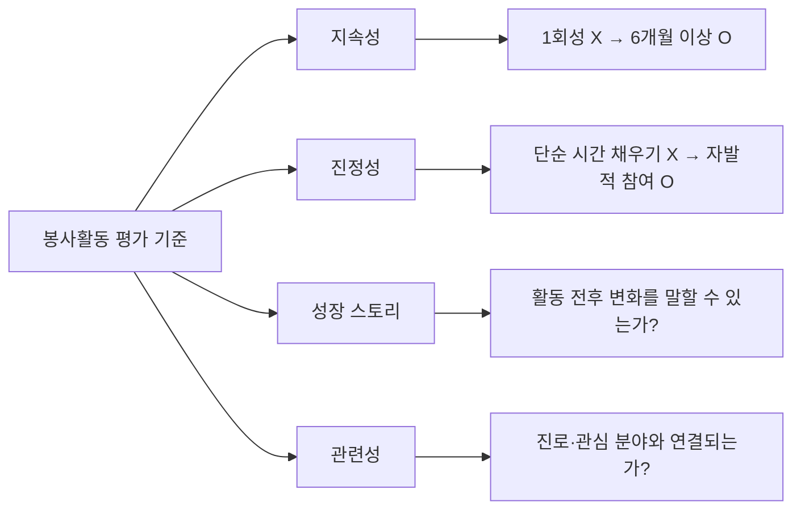

#### 봉사 유형별 비교

| 봉사 유형 | 시간 인정 | 평가 효과 | 추천 대상 | 예시 |
|-----------|----------|----------|----------|------|
| 교내 또래 멘토링 | O (학교 인정) | ★★★★★ | 전 유형 | 학습 부진 친구 도움, 다문화 학생 한국어 지도 |
| 지역 복지관 정기 봉사 | O (1365 등록) | ★★★★☆ | 일반고, 자사고 | 주 1회 어르신 말벗, 장애인 활동 보조 |
| 환경 봉사 (정화 활동) | O (1365 등록) | ★★★☆☆ | 전 유형 | 하천 정화, 분리수거 캠페인 |
| IT 봉사 / 코딩 교육 | O (학교/기관) | ★★★★★ | 특성화고, 마이스터고 (IT) | 어르신 스마트폰 교육, 초등학생 코딩 지도 |
| 기술 봉사 (수리·제작) | O (학교/기관) | ★★★★★ | 특성화고, 마이스터고 (기술) | 독거노인 가전 수리, 지역 시설 보수 |
| 단기 캠페인 참여 | △ (인정 여부 확인) | ★★☆☆☆ | — | 1회성 행사 도우미 |

#### 학교 유형별 봉사 전략

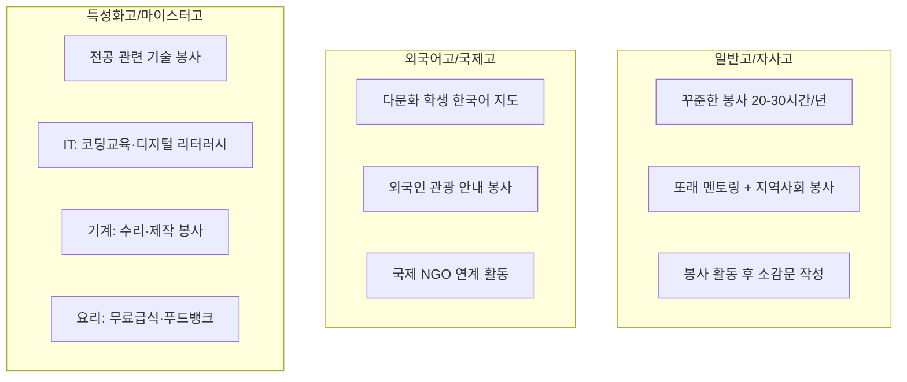

> **Tip**: 특성화고·마이스터고 지원 시, 관련 분야 봉사가 "이 학생은 이 분야에 진심"이라는 메시지를 줍니다. IT 분야 지원자가 코딩 교육 봉사를 한 것과 단순 환경 미화를 한 것은 면접관에게 전혀 다른 인상을 줍니다.

---

### Q2. 독서 기록 관리법

#### 독서 노트 4요소

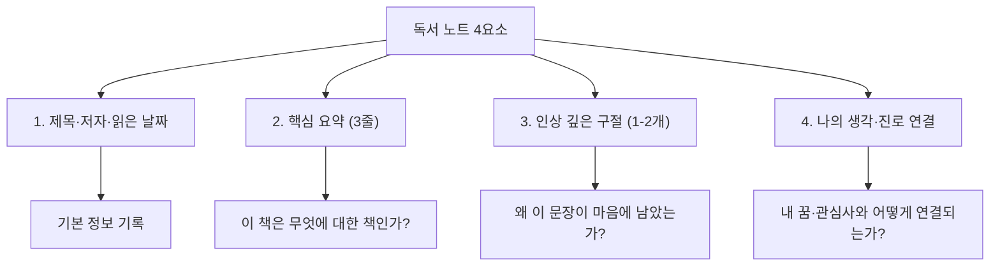

#### 독서 목표와 관리

| 항목 | 권장 기준 | 비고 |
|------|----------|------|
| 월간 목표 | 2-3권 | 무리하지 않는 선에서 꾸준히 |
| 연간 목표 | 24-36권 | 3년 누적 70-100권 |
| 진로 관련 비율 | 50% 이상 | 나머지는 교양·문학 |
| 독서 노트 작성 | 매 권 | 면접 대비 핵심 자료 |

#### 진로별 추천 독서 방향

| 진로 계열 | 추천 분야 | 도서 예시 (유형) |
|-----------|----------|-----------------|
| 이공계 | 과학 교양, 수학 이야기, 기술 발전사 | 과학 에세이, 발명 이야기 |
| 인문·사회 | 역사, 철학 입문, 사회 문제 | 청소년 인문학, 시사 에세이 |
| 상경 계열 | 경제 입문, 기업가 이야기 | 청소년 경제학, 창업 스토리 |
| 기술직 (특성화·마이스터) | 기술 입문서, 직업 탐구, 장인 정신 | 메이커 문화, 기술자 자서전 |
| 예체능 | 예술사, 창작 에세이 | 디자인 씽킹, 예술가 이야기 |

#### 독서 기록 관리 흐름

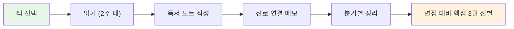

> **Tip**: 면접에서 "최근에 읽은 책이 뭐예요?"라는 질문은 거의 100% 나옵니다. 독서 노트를 쓰면 그 자리에서 "이 책에서 이런 점이 인상 깊었고, 제 진로와 이렇게 연결됩니다"라고 자연스럽게 말할 수 있습니다.

---

### Q3. 동아리 활동은 어떤 것이 유리?

#### 목표 학교별 추천 동아리

| 목표 학교 | 추천 동아리 | 활동 포인트 |
|-----------|------------|------------|
| 외국어고 | 영어 토론, 모의 UN, 영자 신문, 다국어 동아리 | 언어 활용 능력 + 글로벌 관심 어필 |
| 과학고/영재학교 | 과학 실험, 수학 탐구, 로봇, 코딩 | 연구 보고서 작성 경험이 핵심 |
| 자율형사립고 | 학술 동아리, 독서 토론, 시사 토론 | 폭넓은 지적 호기심 보여주기 |
| 일반고 (상위권) | 학과 관련 동아리 + 봉사 동아리 | 내신 관리와 병행 가능한 수준 |
| 특성화고 | 메이커 동아리, 기술 동아리, 자격증 스터디, 창업 동아리 | 손으로 만들고 기록하기 |
| 마이스터고 | 현장 실습 동아리, 산업체 견학, 기능 대회 준비반 | 실무 경험·산업 이해도 |

#### 동아리 선택 의사결정 흐름

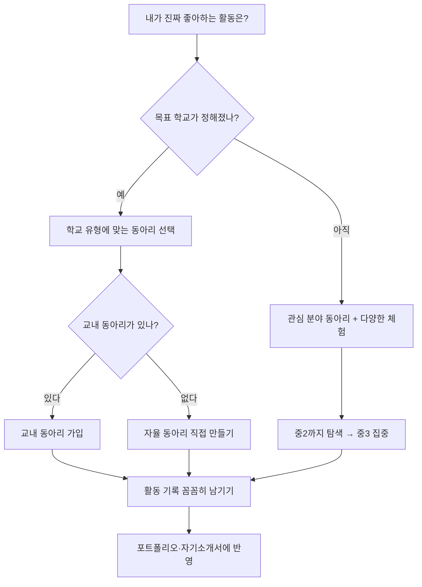

#### 특성화고·마이스터고 지원자를 위한 동아리 팁

| 전공 분야 | 추천 동아리/활동 | 포트폴리오 요소 |
|-----------|-----------------|----------------|
| IT·소프트웨어 | 코딩 동아리, 앱 개발, 웹 제작 | 직접 만든 프로그램·앱 |
| 기계·자동차 | 로봇 동아리, 3D 프린팅, RC카 제작 | 제작물 사진·설계 과정 |
| 전기·전자 | 아두이노, IoT 프로젝트 | 회로 설계·작동 영상 |
| 디자인 | 미술 동아리, 영상 제작, 웹디자인 | 작품 포트폴리오 |
| 조리·제과 | 요리 동아리, 식품 연구 | 레시피 개발·대회 참가 |
| 건축·토목 | 건축 모형 제작, 도시 탐구 | 모형·도면·탐구 보고서 |

---

### Q4. 대회 수상·자격증은 얼마나 중요?

#### 교내 vs 교외 대회

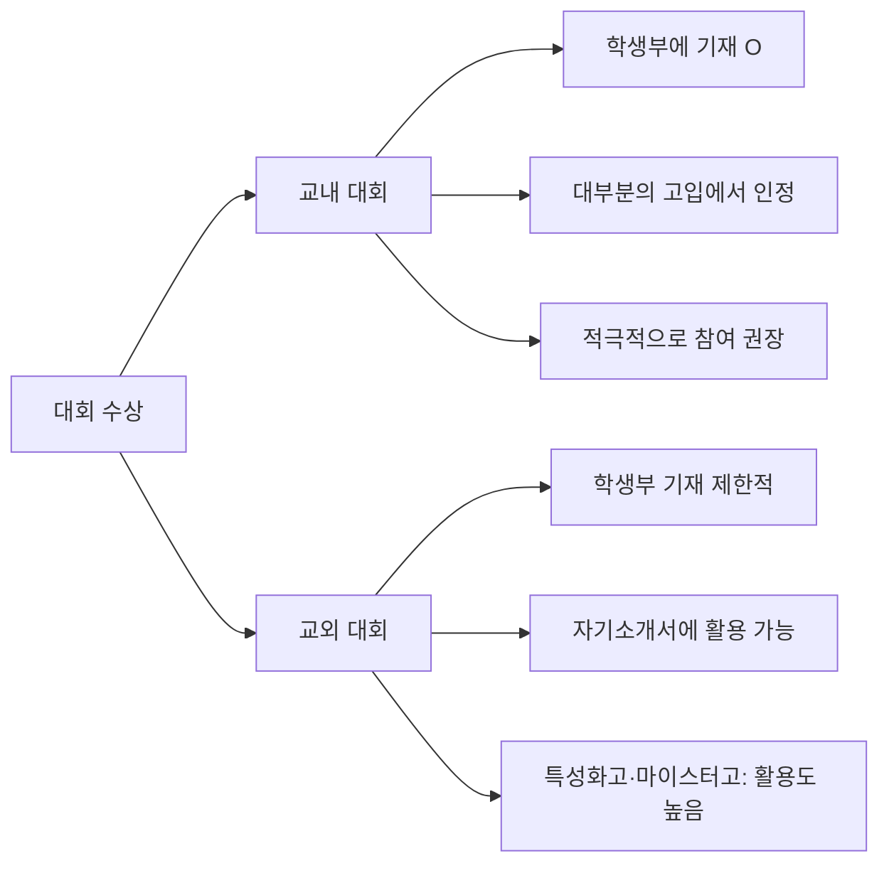

#### 중학생 취득 가능 자격증과 고입 활용도

| 자격증 | 취득 난이도 | 고입 활용도 | 주 활용 학교 |
|--------|-----------|-----------|-------------|
| 컴퓨터활용능력 2급 | ★★★☆☆ | ★★★★☆ | 특성화고(IT), 마이스터고 |
| ITQ (한글·엑셀·파워포인트) | ★★☆☆☆ | ★★★☆☆ | 특성화고 |
| 정보처리기능사 | ★★★★☆ | ★★★★★ | 특성화고(IT), 마이스터고(IT) |
| 한국사능력검정시험 | ★★★☆☆ | ★★★☆☆ | 전 유형 (교양) |
| DELF A1-A2 / HSK 1-3급 | ★★★☆☆ | ★★★★☆ | 외국어고 |
| 토셀(TOSEL) / 펠트(PELT) | ★★★☆☆ | ★★★☆☆ | 외국어고, 국제고 |
| 전기기능사 | ★★★★☆ | ★★★★★ | 마이스터고(전기), 특성화고 |
| 제과기능사 / 한식조리기능사 | ★★★☆☆ | ★★★★★ | 특성화고(조리) |
| 워드프로세서 | ★★☆☆☆ | ★★★☆☆ | 특성화고(상업) |

> **특성화고·마이스터고 지원자 필독**: 관련 분야 자격증은 합격에 직접적 영향을 줍니다. "이 학생은 이미 기본기가 있구나"라는 인상을 면접관에게 줄 수 있으며, 일부 학교는 자격증 보유자에게 가산점을 부여합니다.

#### 자격증 취득 전략 타임라인

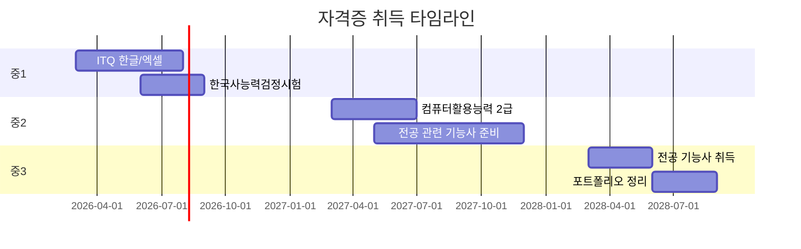

---

## 학부모 FAQ (Q5-Q8)

---

### Q5. 학원비 부담이 크면 어떻게 준비?

#### 무료/저비용 학습 자원

| 자원 | 비용 | 내용 | 접근 방법 |
|------|------|------|----------|
| EBS 중학 강의 | 무료 | 전 과목 인강, 교재(별도 구매) | ebs.co.kr |
| 꿈길 (진로 체험) | 무료 | 진로 체험 프로그램 매칭 | ggoomgil.go.kr |
| 지역 도서관 프로그램 | 무료 | 독서 토론, 진로 특강, 자격증 강좌 | 관할 도서관 문의 |
| 교육청 방과후학교 | 무료~저가 | 교과 보충, 특기적성 | 학교 공지 확인 |
| 커리어넷 | 무료 | 진로 적성 검사, 직업 정보 | career.go.kr |
| e-학습터 / 디지털 교과서 | 무료 | 교과 학습 콘텐츠 | cls.edunet.net |
| 한국직업방송 (워크넷TV) | 무료 | 직업 다큐, 현장 인터뷰 | work.go.kr |
| 지역 교육복지센터 | 무료 | 학습 멘토링, 정서 지원 | 교육청 문의 |

#### 학원 없이도 가능한 학습 루틴

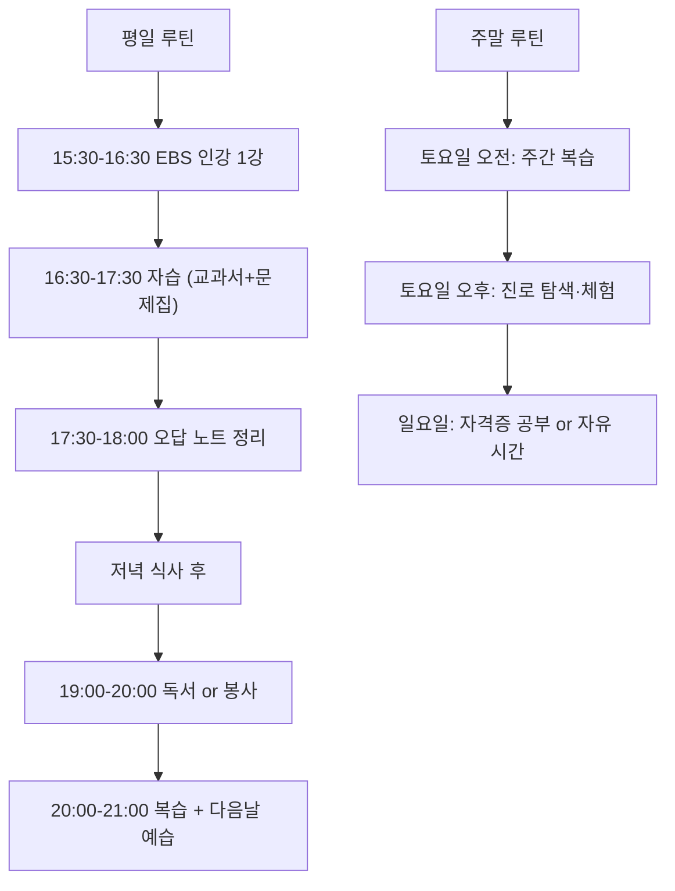

> **핵심 메시지**: 특성화고·마이스터고는 모든 고입 유형 중 사교육 부담이 가장 낮습니다. 내신 + 면접 + 포트폴리오 중심이기 때문에, 학원보다 실제 활동 경험이 훨씬 중요합니다. 비싼 학원비 대신 직접 만들고, 해보고, 기록하세요.

---

### Q6. 자녀와 고입에 대해 어떻게 소통?

#### 효과적 소통 방법 5가지

| 순서 | 방법 | 구체적 행동 | 피해야 할 말 |
|------|------|-----------|-------------|
| 1 | 먼저 들어주기 | "네가 어떤 학교에 가고 싶은지 얘기해볼래?" | "넌 여기 가야 해" |
| 2 | 정보를 함께 탐색 | 학교 홈페이지·설명회를 같이 보기 | "내가 다 알아봤으니 따라와" |
| 3 | 데이터로 대화 | 취업률·진학률·연봉 데이터 공유 | "그 학교는 안 좋대" (근거 없는 소문) |
| 4 | 선택지를 열어두기 | "A도 좋고 B도 좋아, 같이 비교해보자" | "무조건 일반고" |
| 5 | 결정을 존중하기 | "네가 결정하면 엄마/아빠가 도와줄게" | "네가 뭘 안다고" |

#### 상황별 대화 전략

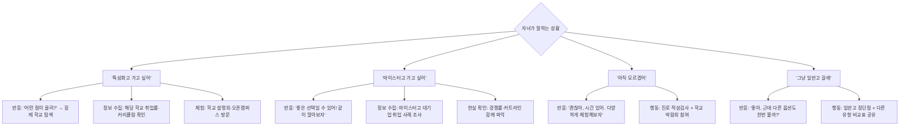

#### "절대 안 돼"라고 하기 전에

| 부모의 걱정 | 데이터로 확인할 것 | 확인 방법 |
|------------|------------------|----------|
| "특성화고 가면 대학 못 가" | 특성화고 후진학률 (재직자 특별전형 등) | 학교알리미 진학 현황 |
| "마이스터고는 공부 못하는 애들이 가는 곳" | 마이스터고 입학 경쟁률·커트라인 | 고입정보포털 경쟁률 |
| "취업해봤자 연봉이 낮을 텐데" | 마이스터고 초봉·대기업 취업률 | 학교 공개 취업 현황 |
| "나중에 후회하면 어떡해" | 전환 경로 (후진학·편입·자격증) | 커리어넷 경로 탐색 |

---

### Q7. 입시 정보 수집 채널

#### 공식 vs 비공식 채널

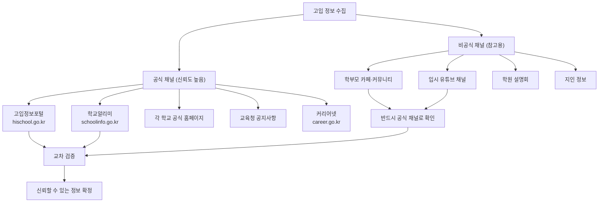

#### 정보 수집 월별 일정표

| 시기 | 할 일 | 활용 채널 |
|------|------|----------|
| 3-4월 | 올해 입시 요강 초안 확인 | 교육청, 고입정보포털 |
| 5-6월 | 관심 학교 리스트업, 학교알리미 데이터 분석 | 학교알리미, 학교 홈페이지 |
| 7-8월 | 학교 설명회·오픈캠퍼스 참석 | 학교 공지, 교육청 일정 |
| 9월 | 입시 요강 확정판 확인, 지원 전략 수립 | 고입정보포털 |
| 10-11월 | 원서 접수, 서류 준비 | 고입정보포털, 학교 홈페이지 |
| 12월 | 면접 준비, 결과 확인 | 학교 공지 |
| 1-2월 | 합격 후 준비, 불합격 시 대안 | 후기 일반고 배정 |

#### 교차 검증 체크리스트

| 정보 항목 | 1차 확인 | 2차 확인 | 비고 |
|----------|---------|---------|------|
| 입시 일정 | 고입정보포털 | 학교 홈페이지 | 날짜 불일치 시 학교에 직접 문의 |
| 경쟁률 | 고입정보포털 | 교육청 발표 | 전년도 대비 추이도 확인 |
| 커리큘럼 | 학교 홈페이지 | 학교알리미 | 설명회에서 직접 질문 |
| 취업률/진학률 | 학교알리미 | 학교 공개 자료 | 최근 3년 추이 확인 |

---

### Q8. 학교 설명회에서 꼭 확인할 것

#### 7가지 필수 체크리스트

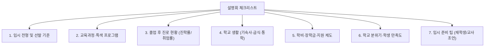

#### 직접 물어볼 질문 리스트

| 영역 | 질문 예시 |
|------|----------|
| 입시 | "올해 전형에서 가장 중요하게 보는 요소는 무엇인가요?" |
| 입시 | "면접은 어떤 형식으로 진행되나요? (개별/집단/발표)" |
| 교육과정 | "이 학교만의 특색 있는 수업이나 프로그램이 있나요?" |
| 진로 | "졸업생들이 주로 어디로 진학/취업하나요?" |
| 생활 | "기숙사 생활 규칙과 외출/외박 규정은 어떤가요?" |
| 비용 | "입학 후 추가로 드는 비용 (교재·활동비)은 어느 정도인가요?" |
| 지원 | "학습 부진이나 적응 어려움이 있을 때 어떤 지원이 있나요?" |

#### 특성화고·마이스터고 설명회 추가 확인 사항

| 확인 항목 | 왜 중요한가 | 질문 예시 |
|----------|-----------|----------|
| 취업률 (최근 3년) | 학교의 실질적 성과 지표 | "최근 3년 취업률과 주요 취업처는?" |
| 협약 기업 목록 | 취업 연계의 질 | "어떤 기업과 MOU를 맺고 있나요?" |
| 자격증 취득률 | 교육 실효성 지표 | "재학 중 취득 가능한 자격증과 평균 취득률은?" |
| 현장 실습 프로그램 | 실무 경험 기회 | "현장 실습은 몇 학년 때, 어떻게 진행되나요?" |
| 후진학 지원 | 대학 진학 가능성 | "졸업 후 대학 진학을 원하면 어떤 지원이 있나요?" |
| 기숙사 여부 | 통학 부담 | "기숙사 수용 인원과 비용은?" |

---

## 멘탈 관리 FAQ (Q9-Q10)

---

### Q9. 자녀의 멘탈 관리법

#### 멘탈 관리 5대 원칙

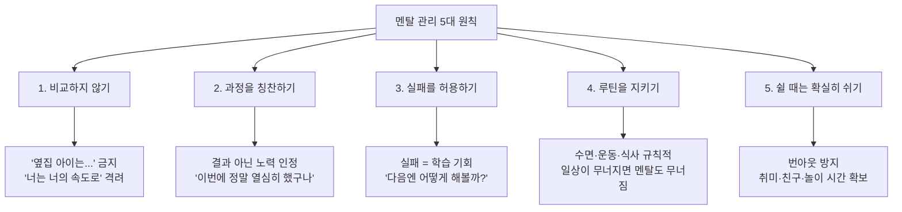

#### 위험 신호 리스트

| 신호 | 증상 | 부모의 대응 |
|------|------|-----------|
| 수면 변화 | 잠을 못 자거나 과도하게 잔다 | 대화 시도, 심하면 상담 연계 |
| 식욕 변화 | 갑자기 안 먹거나 폭식 | 스트레스 원인 파악 |
| 성적 급변 | 갑작스러운 성적 하락 | 학습 방법 점검, 압박 줄이기 |
| 사회적 고립 | 친구를 만나지 않음, 방에만 있음 | 강요하지 말고 옆에 있어주기 |
| 감정 폭발 | 사소한 일에 화를 내거나 울음 | 감정을 인정해주고 원인 탐색 |
| 무기력 | "뭘 해도 안 될 것 같아" | 작은 성취 경험 만들어주기 |
| 자해/자살 언급 | 직간접적 표현 | **즉시 전문 상담 연계 (1393, 1388)** |

#### AI 시대 특유의 불안 대응

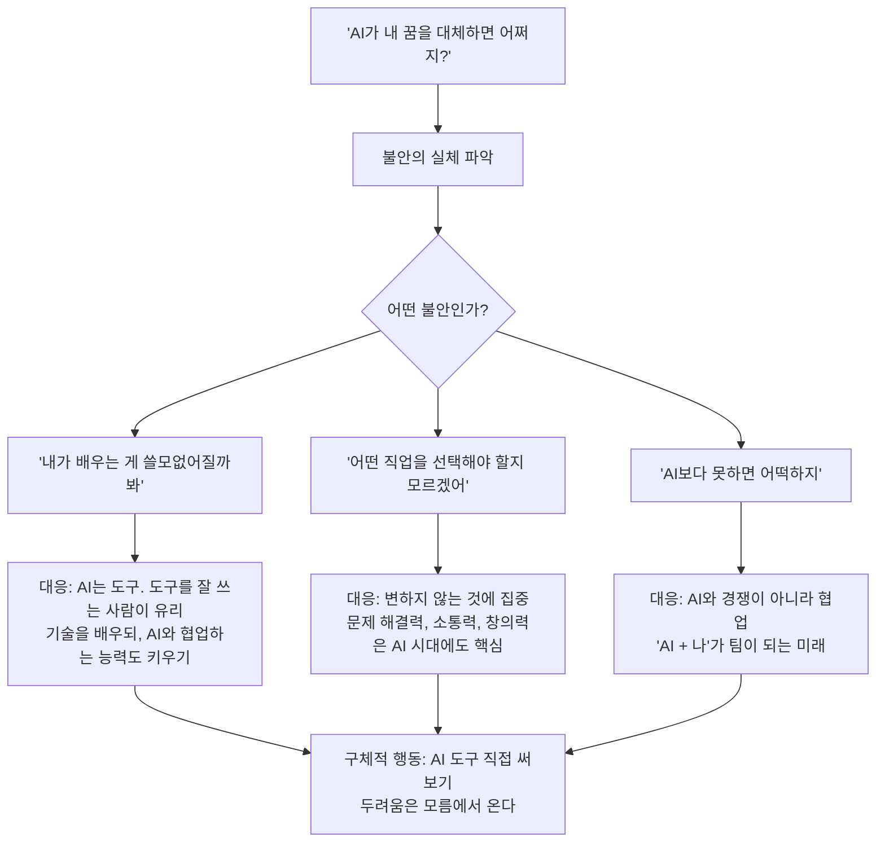

| 자녀의 말 | 부모의 대응 (O) | 부모의 대응 (X) |
|----------|---------------|---------------|
| "AI 때문에 프로그래머 안 될 거래" | "AI가 코딩을 도와주니까 오히려 더 많은 걸 만들 수 있어" | "그러니까 공부를 더 해야지" |
| "어차피 다 자동화될 텐데" | "자동화 못하는 일도 많아. 같이 찾아볼까?" | "그런 걱정 말고 수학이나 해" |
| "미래가 불안해" | "불안한 게 당연해. 같이 준비하자" | "쓸데없는 걱정 하지 마" |

---

### Q10. "특성화고 간다고 하면 주변에서 뭐라 하는데..." — 사회적 시선 대처법

#### 편견의 실체 vs 현실 데이터

| 편견 | 현실 데이터 |
|------|-----------|
| "특성화고는 공부 못하는 애들이 가는 곳" | 마이스터고 경쟁률 3:1~10:1, 성적 우수자 다수 지원 |
| "취업해봤자 월급이 적다" | 마이스터고 졸업 초봉 2,800~3,500만 원 (대기업 기준), 대졸 초봉과 격차 축소 |
| "대학을 안 가면 인생이 막힌다" | 재직자 특별전형으로 일하면서 대학 진학 가능 (등록금 지원) |
| "나중에 후회한다" | 4년제 졸업 후 취업난 vs 특성화고 졸업 후 4년 경력 + 후진학 |
| "학벌이 없으면 승진 못 한다" | 기술직·전문직은 역량·자격증 기반 승진 체계 |

#### 마이스터고·특성화고 성공 경로

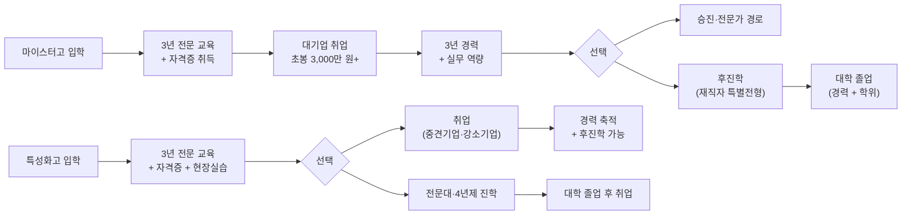

#### 주변 시선에 대응하는 법

| 상황 | 주변의 말 | 데이터 기반 대응 |
|------|---------|----------------|
| 친척 모임 | "왜 특성화고를 보내?" | "이 학교 취업률이 90%이고, 삼성·현대 협약 기업이에요" |
| 학부모 모임 | "대학은 어떻게 하려고?" | "재직자 특별전형으로 일하면서 대학 갈 수 있어요" |
| 자녀 친구들 | "너 거기 가?" | "내가 좋아하는 걸 배우는 거야. 3년 후에 포트폴리오로 보여줄게" |
| 담임 선생님 | "성적이 아까운데" | "아이가 이 분야에 적성이 맞고, 관련 활동도 했어요" |

#### 부모가 할 수 있는 것

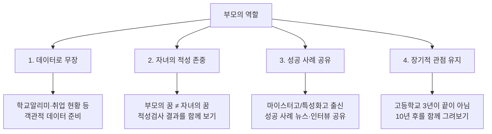

> **"3년 후에 포트폴리오로 보여주면 된다"** — 지금 주변의 시선에 흔들리지 마세요. 특성화고·마이스터고 3년 동안 쌓은 자격증, 실무 경험, 포트폴리오는 어떤 편견보다 강력한 증거가 됩니다.

---

## 종합 정리

### 고입 준비 핵심 로드맵

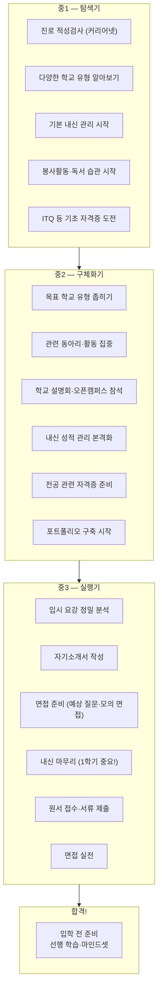

### 30초 결론 6가지

| 번호 | 핵심 메시지 |
|------|-----------|
| 1 | **봉사는 시간보다 질과 지속성** — 진로와 연결된 봉사를 꾸준히 |
| 2 | **독서 노트를 쓰면 면접이 쉬워진다** — 월 2-3권, 4요소 기록 |
| 3 | **학원비 걱정 말고 무료 자원을 활용하라** — EBS, 꿈길, 도서관이면 충분 |
| 4 | **자녀와 데이터로 대화하라** — 편견이 아닌 숫자로 학교를 비교 |
| 5 | **멘탈이 무너지면 모든 준비가 무너진다** — 비교 금지, 과정 칭찬, 쉼 보장 |
| 6 | **"3년 후 포트폴리오로 보여주면 된다"** — 지금의 선택을 믿고 밀어주기 |

### 참고 자원 모음

| 사이트 | URL | 주요 기능 |
|--------|-----|----------|
| 학교알리미 | schoolinfo.go.kr | 학교 정보 공개 (취업률, 진학률, 교육과정) |
| 고입정보포털 | hischool.go.kr | 고입 전형 요강, 경쟁률, 일정 |
| EBS 중학 | ebs.co.kr | 무료 인강, 교재 |
| 커리어넷 | career.go.kr | 진로 적성검사, 직업 정보, 학과 정보 |
| 꿈길 | ggoomgil.go.kr | 진로 체험 프로그램 매칭 |
| e-학습터 | cls.edunet.net | 디지털 교과서, 학습 콘텐츠 |
| 워크넷 | work.go.kr | 직업 정보, 채용 정보 |
| 한국장학재단 | kosaf.go.kr | 장학금·학자금 정보 |
| 자격증 정보 (Q-net) | q-net.or.kr | 국가 자격증 시험 일정·접수 |

---

> **이 FAQ 시리즈를 통해 고입 준비의 A to Z를 다뤘습니다.**
> 모르는 것이 있으면 공식 채널에서 확인하고, 자녀와 함께 탐색하세요.
> 가장 좋은 학교는 "가장 유명한 학교"가 아니라 "우리 아이에게 가장 맞는 학교"입니다.
