# 학교 유형·선택 FAQ — 특성화고·비즈니스고·마이스터고까지 완전 정복

> **시리즈**: 고입 FAQ 4부작 중 **Part 1 — 학교 유형과 선택**
> **대상**: 중학생 및 학부모
> **최종 업데이트**: 2026-07-16

---

## 목차

1. [전체 학교 유형 한눈에 보기](#전체-학교-유형-한눈에-보기)
2. [Q1. 일반고 vs 특목고 vs 자사고, 어떤 기준으로 선택?](#q1-일반고-vs-특목고-vs-자사고-어떤-기준으로-선택)
3. [Q2. 자사고 전국단위와 광역단위 차이](#q2-자사고-전국단위와-광역단위-차이)
4. [Q3. 외고 vs 국제고 차이](#q3-외고-vs-국제고-차이)
5. [Q4. 과학고 vs 영재학교 차이](#q4-과학고-vs-영재학교-차이)
6. [Q5. 특성화고는 공부 못하는 애들이 가는 곳 아닌가요?](#q5-특성화고는-공부-못하는-애들이-가는-곳-아닌가요)
7. [Q6. 비즈니스고는 뭐가 다른가요?](#q6-비즈니스고옛-상업고는-뭐가-다른가요-갈-만한가요)
8. [Q7. 마이스터고는 진짜 좋은가요?](#q7-마이스터고는-진짜-좋은가요-취업이-보장되나요)
9. [Q8. 특성화고·마이스터고 가면 대학 못 가나요?](#q8-특성화고마이스터고-가면-대학-못-가나요)
10. [Q9. AI 시대에 어떤 분야가 유망한가요?](#q9-ai-시대에-어떤-특성화고마이스터고-분야가-유망한가요)
11. [Q10. 적성과 로컬(지역)이 왜 중요한가요?](#q10-미래-교육에서-적성과-로컬지역이-왜-중요한가요)
12. [Q11. 학교 분위기와 문화는 어떻게 미리 파악하나요?](#q11-학교-분위기와-문화는-어떻게-미리-파악하나요)
13. [Q12. 통학 거리는 학교 선택에 얼마나 중요한가요?](#q12-통학-거리는-학교-선택에-얼마나-중요한가요)
14. [30초 결론](#30초-결론)

---

## 전체 학교 유형 한눈에 보기

고등학교는 **생각보다 종류가 많아요!** 대부분 "일반고 아니면 특목고"만 떠올리지만, **특성화고·비즈니스고·마이스터고**도 훌륭한 선택지입니다. 특히 AI 시대에는 "실무 능력 + 기술력"을 일찍 갖춘 사람이 유리해지는 분야가 점점 늘고 있어요.

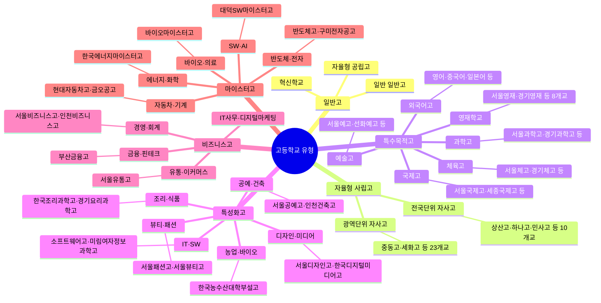

> **잠깐!** 특성화고·비즈니스고·마이스터고는 "공부를 못해서 가는 곳"이 아닙니다. AI 시대에는 오히려 **실무 기술 + 현장 경험**이 빛을 발하는 분야가 많아요. 아래 FAQ에서 하나씩 알아볼게요!

---

## 일반고·특목고·자사고 관련 FAQ

---

### Q1. 일반고 vs 특목고 vs 자사고, 어떤 기준으로 선택?

**한 줄 답변**: 내 **학업 수준·적성·가정 경제 상황·통학 거리** 네 가지를 먼저 따져보세요.

#### 비교표

| 항목 | 일반고 | 특목고 (외고·과학고·국제고) | 자사고 (전국/광역) |
|------|--------|---------------------------|-------------------|
| **내신 경쟁** | 다양한 학력 → 상위권 유리 | 상위권끼리 경쟁 → 내신 치열 | 상위권 집중 → 매우 치열 |
| **교육과정** | 국가 교육과정 + 학교 재량 | 특화 심화 (외국어/과학/국제) | 자율 편성 (AP·심화·IB 등) |
| **학비 (연간)** | 약 150~200만 원 | 약 200~400만 원 | 약 600~1,200만 원 |
| **대입 유리점** | 내신 유리, 학종 다양 | 특기 살려 수시 지원 | 수시·정시 모두 준비 가능 |
| **통학** | 집 근처 배정 | 전국 또는 광역 모집 | 전국/광역 모집 (기숙사 多) |
| **추천 학생** | 내신 관리가 중요한 학생 | 특정 분야 뚜렷한 재능 | 자기주도학습 능력 뛰어난 학생 |

#### 선택 플로차트

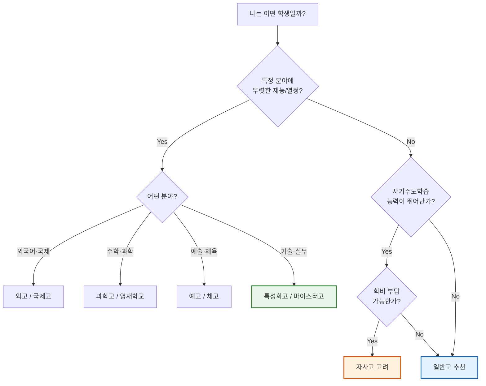

> **Tip**: "특목고나 자사고에 떨어지면 일반고로 배정된다"는 건 맞지만, 그렇다고 무조건 도전하라는 뜻은 아니에요. **내신 관리가 더 중요한 학생**이라면 일반고에서 상위권을 유지하는 전략이 훨씬 유리할 수 있습니다.

---

### Q2. 자사고 전국단위와 광역단위 차이

**한 줄 답변**: 전국단위는 **전국 어디서든** 지원 가능, 광역단위는 **해당 시·도 학생만** 지원 가능해요.

| 구분 | 전국단위 자사고 | 광역단위 자사고 |
|------|----------------|----------------|
| **학교 수** | 약 10개교 | 약 23개교 |
| **대표 학교** | 상산고, 하나고, 민족사관고, 북일고, 광양제철고, 김천고, 현대청운고, 포항제철고, 인천하늘고, 용인외대부고 | 중동고, 세화고, 이대부고, 숭문고, 배재고, 대전대신고, 해운대고, 현대고 등 |
| **지원 자격** | 전국 중학교 졸업(예정)자 | 해당 시·도 거주 중학교 졸업(예정)자 |
| **기숙사** | 대부분 전원 기숙 | 일부 기숙사 운영 |
| **학비 (연간)** | 약 800~1,200만 원 | 약 600~900만 원 |
| **선발 방식** | 자기주도학습전형 + 면접 | 자기주도학습전형 + 면접 |
| **경쟁률** | 3:1 ~ 5:1 | 2:1 ~ 4:1 |
| **특징** | 전국 인재 모집 → 학생 수준 매우 높음 | 지역 우수 학생 모집, 통학 가능 |

> **주의사항**: 2025년 기준 자사고 재지정 평가가 진행 중이에요. 일부 학교는 일반고로 전환될 수 있으니 **최신 정보를 꼭 확인**하세요. 교육청 홈페이지나 학교알리미(schoolinfo.go.kr)를 활용하세요.

---

### Q3. 외고 vs 국제고 차이

**한 줄 답변**: 외고는 **특정 외국어 심화**, 국제고는 **국제학·사회과학 중심**이에요.

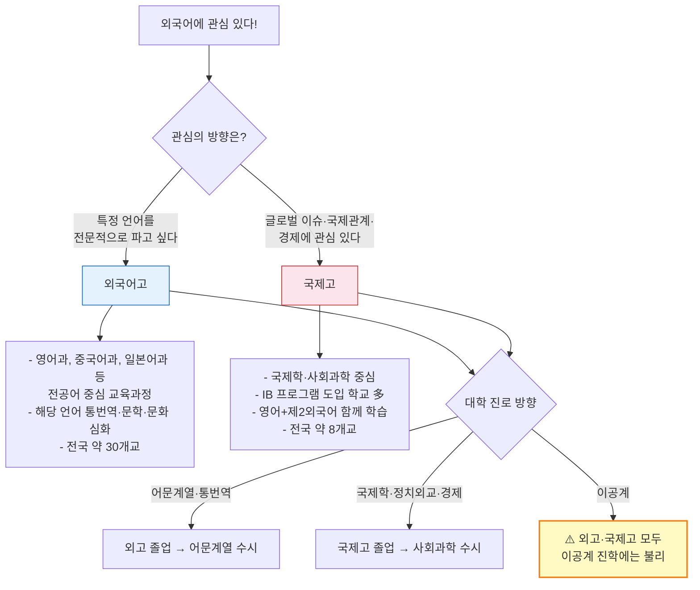

| 항목 | 외국어고 | 국제고 |
|------|---------|--------|
| **교육 초점** | 특정 외국어 전문성 | 국제학·사회과학 전반 |
| **언어 교육** | 전공어 1개 집중 | 영어 + 제2외국어 |
| **IB 도입** | 일부 학교 | 다수 학교 |
| **학교 수** | 약 30개교 | 약 8개교 |
| **대입 강점** | 어문·인문계열 수시 | 국제학·사회과학 수시 |
| **주의점** | 수학·과학 과목 부족 가능 | 경쟁률 높음 (서울국제고 5:1+) |

> **꿀팁**: "영어를 잘한다"와 "외국어고에 가야 한다"는 다른 이야기예요. 영어는 도구일 뿐, **그 도구로 뭘 하고 싶은지**가 더 중요합니다. 국제 이슈·경제에 관심 있으면 국제고, 언어 자체가 좋으면 외고!

---

### Q4. 과학고 vs 영재학교 차이

**한 줄 답변**: 과학고는 **시·도 교육청 소속** 특목고, 영재학교는 **과기부·대학 소속** 특수학교예요.

| 항목 | 과학고 | 영재학교 |
|------|--------|---------|
| **설립 근거** | 초중등교육법 (특수목적고) | 영재교육진흥법 (특수학교) |
| **관할** | 시·도 교육청 | 과기부 / 대학 |
| **학교 수** | 전국 약 20개교 | 전국 8개교 |
| **대표 학교** | 서울과학고, 경기과학고, 대전과학고 | 서울과학영재, 경기과학영재, KAIST부설 한국과학영재, 대구과학영재, 광주과학영재, 세종과학예술영재, 인천과학예술영재, 대전과학영재 |
| **선발 시기** | 후기 모집 (11~12월) | 선발 먼저 (4~8월) |
| **선발 방식** | 서류 + 면접 (자기주도학습전형) | 지필평가 + 캠프 + 면접 (다단계) |
| **조기졸업** | 가능 (2년 수료 후) | 가능 (2년 수료 후) |
| **R&E 연구** | 대학 연계 연구 | 대학 수준 심화 연구 |
| **학비** | 일반고 수준 (저렴) | 무상 ~ 일부 지원 |
| **난이도** | 상위 1~3% 수준 | 상위 0.1~1% 수준 |
| **대입** | 수시 중심 (과학 특기) | 수시 + 조기졸업 → 대학 입학 |
| **분위기** | 과학 심화 + 내신 경쟁 | 자유 연구 + 학문 탐구 |

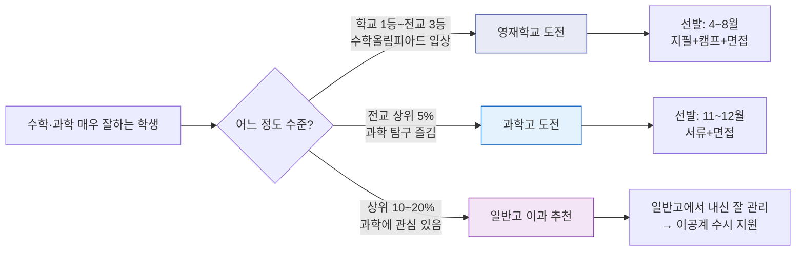

> **현실 조언**: 영재학교는 정말 소수의 학생만 갈 수 있어요 (전국 8개교, 각 100~120명). "우리 아이가 수학을 잘하니까 영재학교"라고 생각하기보다, **정말 수학·과학 탐구 자체를 즐기는지** 확인해보세요. 합격 후에도 극도로 치열한 환경이에요.

---

## 특성화고·비즈니스고·마이스터고 심화 FAQ

> 이 섹션은 많은 분들이 잘 모르지만, **AI 시대에 점점 더 중요해지는** 학교 유형들을 다룹니다. 편견 없이 읽어주세요!

---

### Q5. 특성화고는 공부 못하는 애들이 가는 곳 아닌가요?

**한 줄 답변**: **절대 아닙니다.** 이건 10~20년 전 이야기예요. 지금의 특성화고는 완전히 달라졌습니다.

#### 편견 vs 현실

| 편견 | 현실 (2024~2025 기준) |
|------|----------------------|
| "공부 못하는 학생이 간다" | IT·디자인 특성화고 경쟁률 **3:1~5:1** (인기 학교는 7:1) |
| "취업밖에 못 한다" | 선취업 후진학으로 **서울시립대·한양대** 등 진학 가능 |
| "연봉이 낮다" | 마이스터고 초봉 2,800~3,500만 원 (대졸 평균과 비슷) |
| "미래가 없다" | AI 시대 **실무+기술 인력** 수요 급증 |
| "사회적으로 무시당한다" | 삼성·현대·SK 등 **대기업 기술직** 채용 확대 |

#### 실제로 경쟁률이 높은 특성화고 분야

| 분야 | 대표 학교 | 경쟁률 (2024) | AI 시대 유망도 |
|------|----------|--------------|---------------|
| **IT·SW** | 미림여자정보과학고, 선린인터넷고, 한국디지털미디어고 | 3:1 ~ 7:1 | 매우 높음 |
| **디자인·미디어** | 서울디자인고, 서울미디어고 | 3:1 ~ 5:1 | 높음 |
| **요리·제과제빵** | 한국조리과학고, 서울관광고 | 2:1 ~ 4:1 | 보통 (AI 영향 적음) |
| **뷰티·패션** | 서울패션고, 서울뷰티고 | 2:1 ~ 3:1 | 보통 |
| **전기·전자** | 서울전자고, 인천전자공고 | 1.5:1 ~ 3:1 | 높음 |
| **건축·토목** | 서울건축고, 인천건축고 | 1.5:1 ~ 2:1 | 보통~높음 |
| **농업·바이오** | 한국농수산고 | 1.5:1 ~ 2:1 | 높음 (스마트팜 등) |

#### 특성화고 출신 성공 사례

- **삼성전자 반도체 기술직**: 마이스터고 졸업 → 삼성 입사 → 3년 재직 후 대학 진학 → 현재 공정 엔지니어
- **네이버 UI/UX 디자이너**: 디자인 특성화고 졸업 → 스타트업 인턴 → 포트폴리오 구축 → 네이버 입사
- **카카오 서버 개발자**: SW 특성화고 졸업 → 개발 실무 3년 → 재직자 전형 대학 진학 → 카카오 이직
- **자기 브랜드 운영 파티시에**: 조리 특성화고 → 프랑스 연수 → 개인 베이커리 운영 (인스타 팔로워 10만+)

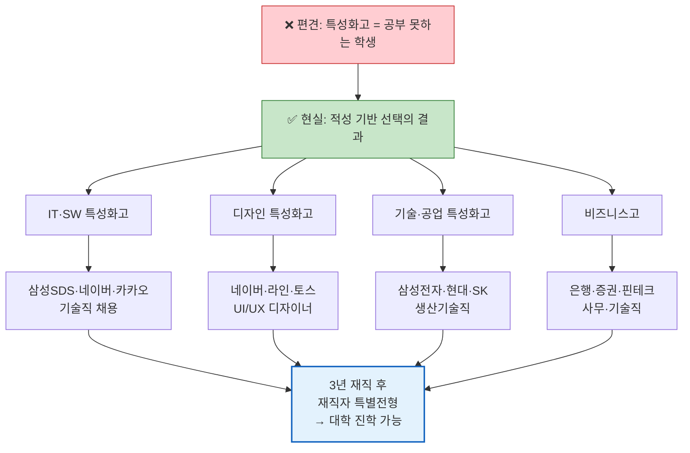

> **핵심**: 특성화고는 "성적이 낮아서"가 아니라 **"실무를 빨리 배우고 싶어서"** 가는 곳이에요. AI 시대에는 대학 졸업장보다 **무엇을 할 수 있는가(실력)**가 더 중요해지고 있습니다.

---

### Q6. 비즈니스고(옛 상업고)는 뭐가 다른가요? 갈 만한가요?

**한 줄 답변**: 비즈니스고는 **경영·회계·금융·유통·IT사무**를 배우는 특성화고예요. 과거 상업고에서 이름도 내용도 완전히 바뀌었습니다.

#### 옛날 상업고 vs 지금 비즈니스고

| 항목 | 옛 상업고 (2000년대) | 현재 비즈니스고 (2024~) |
|------|---------------------|----------------------|
| **교육 내용** | 주산·부기·타자 | AI회계·핀테크·디지털마케팅·이커머스 |
| **기술 도구** | 엑셀 기초 | Python, ERP, SAP, Google Analytics, AI 도구 |
| **취업 분야** | 은행 창구·일반 사무직 | 핀테크·이커머스·데이터분석·디지털마케팅 |
| **이미지** | "여상" 고정관념 | 비즈니스 전문인 양성 |

#### 비즈니스고에서 취득 가능한 자격증과 진로

| 자격증 | 분야 | 취업 가능 직종 | 초봉 범위 |
|--------|------|---------------|----------|
| 전산회계 1·2급 | 회계 | 기업 경리·회계팀, 세무사무소 | 2,400~3,000만 원 |
| 컴퓨터활용능력 1급 | IT사무 | 일반 사무직, 데이터 관리 | 2,400~2,800만 원 |
| 유통관리사 2급 | 유통 | 이커머스 MD, 물류관리 | 2,600~3,200만 원 |
| 금융투자분석사 (준비) | 금융 | 증권사·은행 사무직 | 2,800~3,500만 원 |
| ITQ (한글·엑셀·파워포인트) | IT사무 | 기업 사무직 전반 | 2,400~2,800만 원 |
| SQLD (데이터분석 준전문가) | 데이터 | 데이터 분석 보조, IT기업 | 2,800~3,500만 원 |
| 디지털마케팅 관련 자격 | 마케팅 | 디지털마케팅 에이전시, 스타트업 | 2,600~3,200만 원 |

#### 비즈니스고 신설 학과 트렌드 (2024~2026)

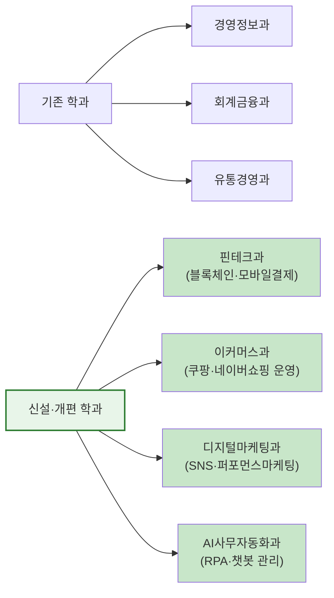

#### AI 시대, 비즈니스고의 변화

과거에는 "단순 회계 입력"이 주 업무였지만, 이제는 **AI 회계 어시스턴트를 운영하는 사람**이 필요해요.

| AS-IS (과거) | TO-BE (AI 시대) |
|-------------|-----------------|
| 수기 장부 기록 | AI 자동 분개 시스템 운영 |
| 엑셀 수작업 | Python 기반 데이터 분석 |
| 은행 창구 업무 | 핀테크 서비스 기획·운영 |
| 종이 마케팅 자료 | 디지털 퍼포먼스 마케팅 |
| 수동 재고 관리 | AI 기반 수요예측·자동발주 |

> **결론**: 비즈니스고는 **경영+기술**을 동시에 배울 수 있는 실용적인 학교예요. "상업고"라는 옛 이미지에 갇히지 마세요!

---

### Q7. 마이스터고는 진짜 좋은가요? 취업이 보장되나요?

**한 줄 답변**: **취업 "보장"은 아니지만, 직업계고 중 최고 수준의 취업률(72.6%)과 대기업·공기업 채용 연계 프로그램이 있습니다.**

#### 마이스터고 핵심 혜택

| 혜택 | 내용 |
|------|------|
| **학비** | 완전 무상 (등록금·교과서 전액 지원) |
| **기숙사** | 무료 (전원 기숙) |
| **장학금** | 우수 학생 별도 장학금 |
| **취업 연계** | 삼성·SK·현대·포스코·LG·한국전력 등 대기업·공기업 채용 협약 |
| **취업률** | 2024 기준 72.6% (직업계고 최고) |
| **초봉** | 2,800~3,500만 원 (대기업 기준 3,000만 원+) |
| **후진학** | 3년 재직 후 재직자 특별전형으로 대학 진학 가능 |

#### 전국 마이스터고 분야별 분류

| 분야 | 대표 학교 | 연계 기업 | 핵심 기술 |
|------|----------|----------|----------|
| **반도체·전자** | 반도체고(용인), 구미전자공고 | 삼성전자, SK하이닉스 | 반도체 공정, 회로 설계, 테스트 |
| **자동차·기계** | 현대자동차마이스터고, 금오공고 | 현대차, 기아, 한국GM | 전기차 정비, 스마트팩토리, CNC |
| **에너지·화학** | 한국에너지마이스터고, 여수석유화학고 | 한국전력, GS칼텍스, SK에너지 | 신재생에너지, 배터리, 화학공정 |
| **SW·AI** | 대덕SW마이스터고 | 삼성SDS, 네이버, 카카오 | 앱개발, AI모델관리, 보안 |
| **바이오·의료** | 바이오마이스터고 | 삼성바이오로직스, 셀트리온 | 바이오의약품, 실험분석 |
| **조선·해양** | 거제공고(마이스터), 울산마이스터고 | HD현대중공업, 삼성중공업 | 선박 설계, 해양플랜트 |
| **식품·제과** | 한국식품마이스터고 | CJ, 풀무원, SPC | 식품가공, HACCP, 스마트팜 |
| **항공·로봇** | 항공마이스터고, 로봇마이스터고 | 대한항공, 현대로보틱스 | 항공정비, 로봇제어 |

#### 취업률 비교 (2024)

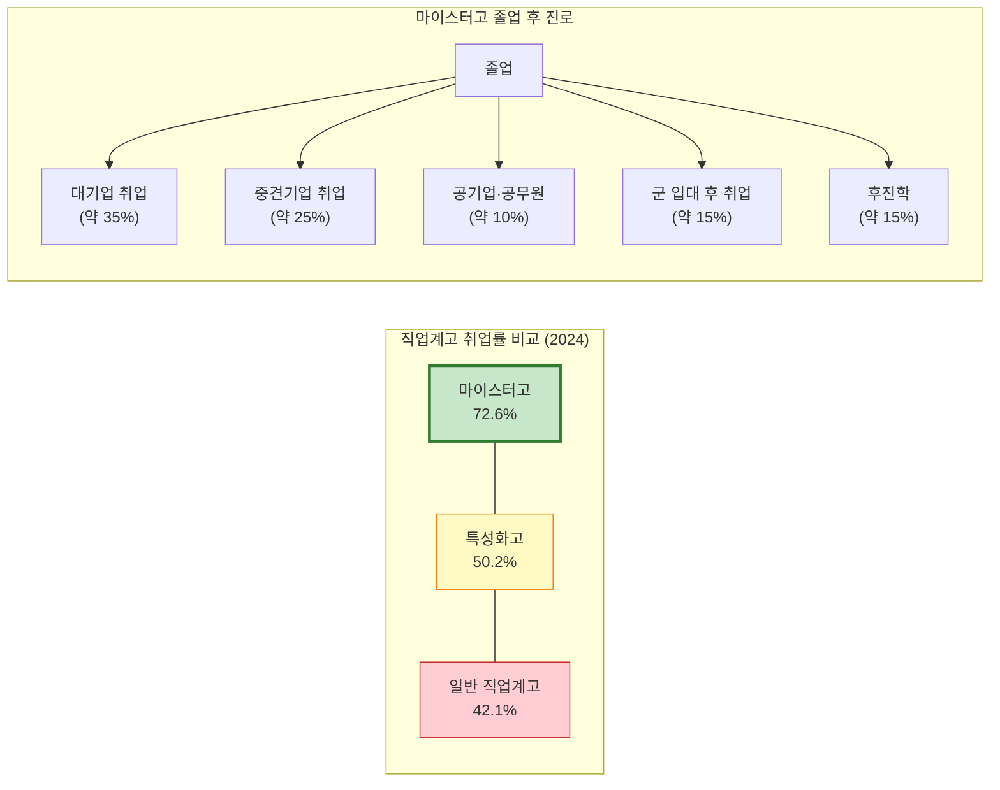

#### 마이스터고 후진학 경로

3년 재직 후 **재직자 특별전형**으로 대학에 갈 수 있어요. 이건 일반 수시·정시와 완전 다른 전형이라, 경쟁이 훨씬 적습니다.

| 단계 | 내용 | 기간 |
|------|------|------|
| 1단계 | 마이스터고 졸업 + 취업 | 3년 (고교 과정) |
| 2단계 | 재직 (경력 쌓기) | 최소 3년 |
| 3단계 | 재직자 특별전형 지원 | 재직 중 야간/주말 대학 |
| 4단계 | 대학 졸업 | 4년 (야간) 또는 2년 (전문대) |

> **현실 조언**: "취업 보장"이라는 말에 너무 기대하지는 마세요. 마이스터고도 **본인이 열심히 해야** 좋은 기업에 갈 수 있어요. 하지만 일반고 → 대학 → 취업 루트보다 **시간과 비용을 아낄 수 있다**는 건 분명한 장점입니다.

---

### Q8. 특성화고·마이스터고 가면 대학 못 가나요?

**한 줄 답변**: **아니요!** 오히려 특성화고·마이스터고 출신만 지원할 수 있는 **특별전형**이 있어서, 경쟁이 덜 치열합니다.

#### 대학 진학 루트 3가지

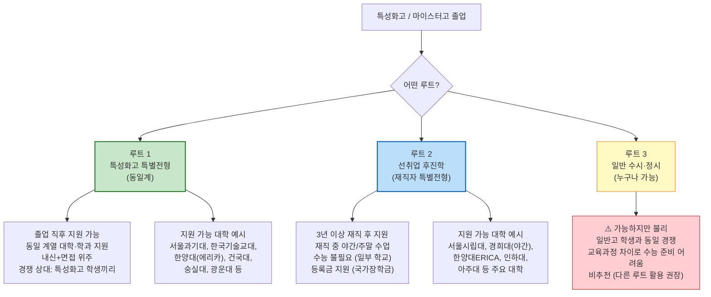

#### 루트별 비교

| 항목 | 특성화고 특별전형 | 재직자 특별전형 | 일반 수시·정시 |
|------|-----------------|---------------|--------------|
| **지원 시기** | 졸업 직후 (수시) | 재직 3년 후 | 졸업 직후 |
| **지원 자격** | 특성화고 졸업(예정)자 | 3년+ 재직자 | 누구나 |
| **전형 방법** | 내신 + 면접 + 실기 | 서류 + 면접 | 수능/내신/면접 |
| **경쟁 대상** | 특성화고 학생끼리 | 재직자끼리 | 전체 수험생 |
| **경쟁률** | 2:1 ~ 4:1 | 1.5:1 ~ 3:1 | 학교마다 다름 |
| **수능 필요** | 일부 학교 반영 | 대부분 불필요 | 필수 |
| **장점** | 빠른 대학 진학 | 직장+학업 병행 | 학교 선택 폭 넓음 |
| **단점** | 동일계열만 지원 가능 | 3년 기다려야 함 | 교육과정 차이 불리 |

#### 선취업 후진학 타임라인

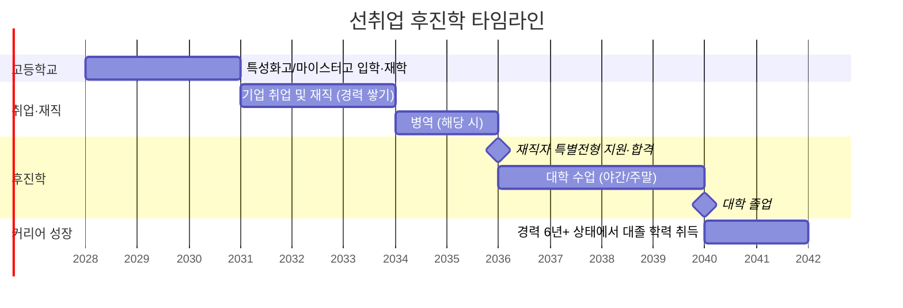

> **핵심 메시지**: 특성화고·마이스터고는 "대학을 포기하는 선택"이 아니라, **"대학 가는 시기와 방법을 바꾸는 선택"**이에요. 오히려 경제적 부담 없이, 실무 경험을 가진 채로 대학에 갈 수 있는 길이 열려 있습니다.

---

### Q9. AI 시대에 어떤 특성화고·마이스터고 분야가 유망한가요?

**한 줄 답변**: **사라지는 직무, 살아남는 직무, 새로 생기는 직무**를 구분해서 보면 답이 보여요.

#### 분야별 AI 영향도 종합 분석

| 분야 | 사라지는 직무 | 살아남는 직무 | 새로 생기는 직무 | AI 시대 유망도 |
|------|-------------|-------------|----------------|--------------|
| **IT·SW** | 단순 코딩, 매뉴얼 테스트 | 시스템 설계, 보안 | MLOps, 프롬프트엔지니어, AI안전 | 매우 높음 |
| **반도체** | 단순 조립·검사 | 공정 분석, 이상 진단, 장비 유지보수 | AI 공정 최적화, 첨단 패키징 | 매우 높음 |
| **디자인·콘텐츠** | 단순 시안 제작, 보정 | 크리에이티브 디렉션, UX리서치 | AI 디렉터, 생성AI 프롬프트 디자이너 | 높음 |
| **자동차·기계** | 단순 조립 라인 | 전기차 정비, 자율주행 센서 캘리브레이션 | EV 배터리 관리, 자율주행 안전 검증 | 높음 |
| **에너지·환경** | 단순 계량·검침 | 신재생에너지 설비 관리 | 스마트그리드 운영, 탄소중립 관리 | 높음 |
| **바이오·의료** | 단순 시료 정리 | 실험 분석, 품질 관리 | AI 신약 데이터 관리, 바이오인포매틱스 보조 | 매우 높음 |
| **회계·금융** | 단순 전표 입력, 장부 기록 | 재무 분석, 세무 컨설팅 | AI 회계시스템 운영, 핀테크 서비스 기획 | 보통~높음 |
| **조리·식품** | 패스트푸드 단순 조리 | 창작 요리, 메뉴 개발 | 스마트팜 운영, 푸드테크 R&D | 보통 |
| **뷰티·패션** | 단순 시술 반복 | 고급 시술, 맞춤 디자인 | AI 뷰티 컨설팅, 가상 피팅 기술 | 보통 |

#### IT·SW 분야 심화

- **사라지는 것**: "코드를 그냥 치는 사람" — AI가 코드를 대신 써줌
- **살아남는 것**: "시스템을 설계하고 보안을 책임지는 사람" — AI가 못 하는 판단과 책임
- **새로 생기는 것**:
  - **MLOps 엔지니어**: AI 모델을 배포하고 관리하는 사람
  - **프롬프트 엔지니어**: AI에게 정확한 지시를 내리는 전문가
  - **AI 보안 전문가**: AI 시스템의 취약점을 찾고 방어하는 사람
  - **데이터 라벨러 관리자**: AI 학습 데이터의 품질을 관리하는 사람

#### 반도체 분야 심화

- **자동화가 확대되지만**: 공정 라인의 60~70%는 이미 자동화
- **그럼에도 사람이 필수인 이유**: 공정 이상 진단, 장비 유지보수, 신공정 개발은 인간만 가능
- **AI가 가져올 변화**: AI가 공정 데이터를 분석해 불량률을 예측 → **AI 분석 결과를 해석할 수 있는 기술 인력** 수요 폭증

#### 분야별 5~10년 전망

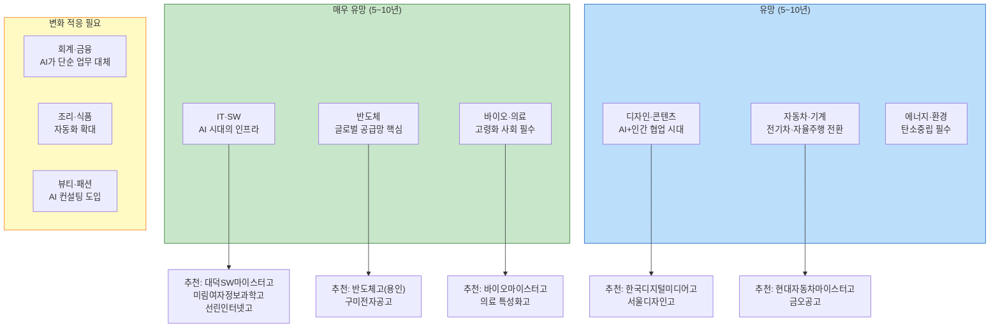

#### 분야 선택 체크리스트

어떤 분야를 선택할지 고민된다면, 아래 질문에 답해보세요:

| 질문 | IT·SW | 반도체 | 디자인 | 자동차 | 바이오 | 비즈니스 |
|------|-------|--------|--------|--------|--------|---------|
| 컴퓨터 앞에 오래 앉아있어도 괜찮다 | O | - | O | - | - | O |
| 손으로 무언가 만드는 걸 좋아한다 | - | O | O | O | O | - |
| 숫자와 데이터를 다루는 게 재미있다 | O | O | - | - | O | O |
| 사람들과 소통하는 걸 좋아한다 | - | - | O | - | - | O |
| 과학 실험이 재미있다 | - | O | - | - | O | - |
| 새로운 기술에 관심이 많다 | O | O | - | O | O | - |

> **최종 조언**: "유망하니까" 가는 게 아니라, **"내가 좋아하면서 유망한"** 분야를 찾으세요. AI가 대체 못하는 건 결국 **열정·문제 정의 능력·창의성**이에요. 좋아하는 일을 할 때 이 세 가지가 가장 강해집니다.

---

## 미래 교육과 학교 선택

---

### Q10. 미래 교육에서 적성과 로컬(지역)이 왜 중요한가요?

**한 줄 답변**: AI 시대에 학교를 고르는 기준은 **"간판"이 아니라 "내가 거기서 뭘 배울 수 있는가"**가 되어야 해요.

#### 왜 적성 기반 선택이 AI 시대 최고의 전략인가?

AI가 대체하기 어려운 것 3가지:

1. **열정 (Passion)** — "이 일이 재미있어서 끝까지 파고드는 힘"은 AI에게 없어요
2. **문제 정의 (Problem Defining)** — "무엇이 문제인지 찾는 능력"은 인간만 가능해요
3. **창의적 융합 (Creative Fusion)** — "서로 다른 분야를 섞어 새로운 걸 만드는 것"은 AI가 못 해요

이 세 가지는 **적성에 맞는 일을 할 때** 극대화됩니다!

#### 로컬(지역)의 중요성

| 온라인·메타버스가 해결하는 것 | 로컬(현장)이 필수인 것 |
|----------------------------|---------------------|
| 강의 수강 | **현장 실습** (공장, 실험실, 주방) |
| 이론 학습 | **멘토링** (선배·교사와의 직접 대화) |
| 과제 제출 | **네트워킹** (같은 분야 친구들과의 관계) |
| 온라인 시험 | **장비 실습** (CNC, 반도체 장비, 조리 도구) |
| 화상 면접 | **기업 견학·인턴십** (현장 체험) |

> 원격 학습이 아무리 발달해도, **현장에서 손으로 배우는 것**은 대체할 수 없어요. 특히 특성화고·마이스터고는 **현장 실습이 핵심**이기 때문에, 학교가 위치한 지역의 산업 생태계가 중요합니다.

#### 적성 유형별 추천 학교 유형

| 적성 유형 | 좋아하는 활동 | 추천 학교 유형 | 추천 이유 |
|----------|-------------|-------------|----------|
| **탐구형** (연구·분석) | 실험, 데이터 분석, 보고서 작성 | 과학고, 영재학교, 바이오마이스터고 | 연구 환경 제공 |
| **예술형** (창작·표현) | 그림, 음악, 영상, 디자인 | 예고, 디자인특성화고, 미디어고 | 창작 활동 중심 교육 |
| **사회형** (소통·봉사) | 토론, 봉사활동, 팀 프로젝트 | 일반고, 국제고, 비즈니스고 | 다양한 사람과 교류 |
| **진취형** (도전·리더십) | 대회 참가, 기획, 프레젠테이션 | 자사고, 국제고, 마이스터고 | 도전적 환경 |
| **현실형** (실용·기술) | 조립, 코딩, 요리, 만들기 | 특성화고, 마이스터고 | 실습 중심 교육 |
| **관습형** (정리·관리) | 정리정돈, 계산, 문서 작성 | 비즈니스고, 일반고 | 체계적 업무 교육 |

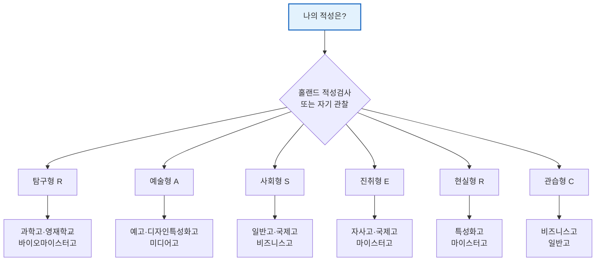

---

### Q11. 학교 분위기와 문화는 어떻게 미리 파악하나요?

**한 줄 답변**: **5단계 조사법**을 따라하면 학교 분위기를 꽤 정확하게 파악할 수 있어요.

#### 학교 분위기 파악 5단계

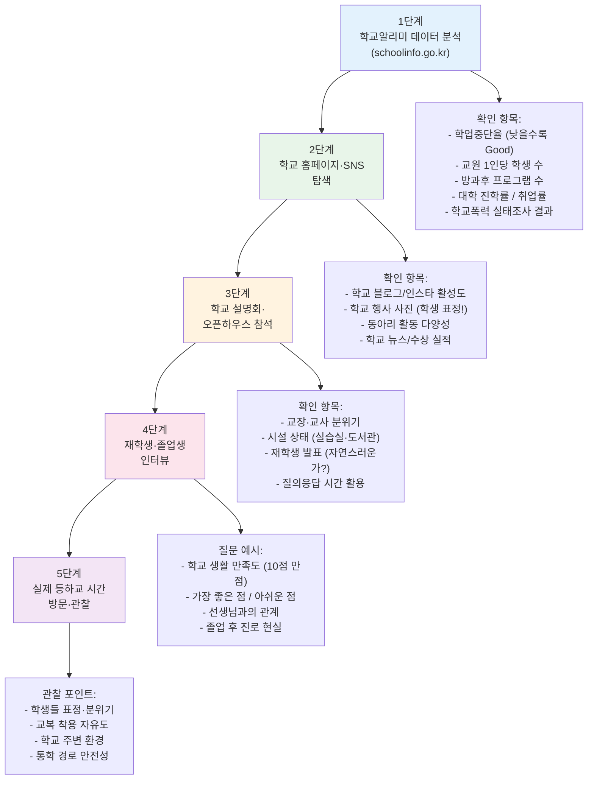

#### 학교알리미에서 꼭 확인할 데이터

| 데이터 항목 | 좋은 신호 | 나쁜 신호 |
|------------|----------|----------|
| 학업중단율 | 1% 이하 | 3% 이상 |
| 교원 1인당 학생 수 | 15명 이하 | 25명 이상 |
| 방과후 프로그램 | 20개 이상 | 5개 이하 |
| 학교폭력 피해 응답률 | 1% 이하 | 3% 이상 |
| 졸업생 진로 현황 | 뚜렷한 진로(취업/진학) | 미상 비율 높음 |

> **꿀팁**: 학교 설명회에서 **"이 학교의 단점은 뭔가요?"**라고 물어보세요. 솔직하게 답해주는 학교가 신뢰할 수 있는 학교입니다!

---

### Q12. 통학 거리는 학교 선택에 얼마나 중요한가요?

**한 줄 답변**: **매우 중요합니다.** 통학 시간이 길면 학습 시간이 줄어들고, 체력이 떨어지고, 수면 부족으로 이어져요.

#### 통학 시간별 학습 시간 손실

| 통학 시간 (편도) | 하루 왕복 | 연간 손실 시간 | 영향 |
|----------------|----------|-------------|------|
| **30분 이하** | 1시간 | 약 200시간/년 | 최적. 충분한 자율학습 시간 확보 |
| **30분~1시간** | 1~2시간 | 약 200~400시간/년 | 양호. 버스/지하철에서 암기 과목 학습 가능 |
| **1시간~1시간 30분** | 2~3시간 | 약 400~600시간/년 | 주의. 체력 소모 큼, 수면 시간 부족 위험 |
| **1시간 30분 이상** | 3시간+ | 약 600시간+/년 | 위험. 학습 효율 크게 저하, 건강 문제 |

> 연간 600시간이면 **매일 2시간씩 300일 자습하는 것**과 같아요. 이 시간을 통학에 쓸 건지, 공부에 쓸 건지 생각해보세요.

#### 기숙사 vs 통학 판단 기준

| 판단 기준 | 통학 추천 | 기숙사 추천 |
|----------|----------|-----------|
| **통학 시간** | 편도 40분 이내 | 편도 1시간 이상 |
| **자기관리 능력** | 집에서 공부 잘 되는 학생 | 환경이 바뀌어야 집중하는 학생 |
| **가정 환경** | 조용한 공부 공간 있음 | 공부 공간 부족 |
| **건강** | 체력 좋은 학생 | 수면 시간 확보 필요 |
| **성격** | 혼자 있는 시간 필요 | 친구들과 함께 지내는 게 좋음 |
| **경제적 상황** | 기숙사비 부담될 때 | 마이스터고 (기숙사 무료!) |
| **부모님 관리** | 부모님 도움이 필요한 학생 | 자립심 키우고 싶은 학생 |

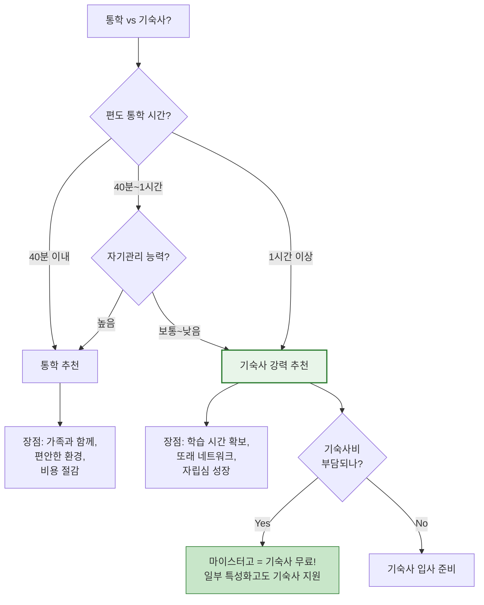

> **현실 팁**: 기숙사 생활이 모든 학생에게 맞는 건 아니에요. **주말에 집에 오면 아무것도 안 하는 학생**이라면, 기숙사에서 규칙적으로 생활하는 게 더 나을 수 있어요. 반대로 **혼자만의 시간이 꼭 필요한 학생**이라면, 기숙사 4인실 생활이 스트레스가 될 수 있습니다.

---

## 30초 결론

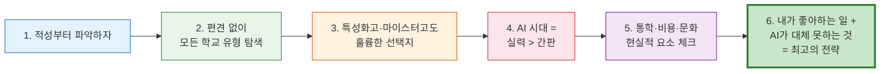

**요약 한 마디**: 학교 선택은 "어디가 좋은 학교인가?"가 아니라 **"나에게 맞는 학교는 어디인가?"**를 묻는 것이에요.

- 공부가 좋고 대입이 목표라면 → **일반고·특목고·자사고**
- 기술을 빨리 배우고 싶다면 → **특성화고·마이스터고**
- 경영·금융·IT사무에 관심 있다면 → **비즈니스고**
- AI 시대에 살아남는 비결 → **적성에 맞는 분야에서 실력을 쌓는 것**

대학은 유일한 길이 아니에요. **선취업 후진학**이라는 멋진 대안이 있으니까요!

---

> **다음 편 예고**: Part 2에서는 **입시 일정·전형 절차 FAQ**를 다룹니다. 자기주도학습전형, 면접 준비, 원서 작성법 등을 자세히 알아볼게요!

---

*이 문서는 AI Career Path 프로젝트의 고입 FAQ 시리즈 Part 1입니다.*
*최종 업데이트: 2026-07-16*
