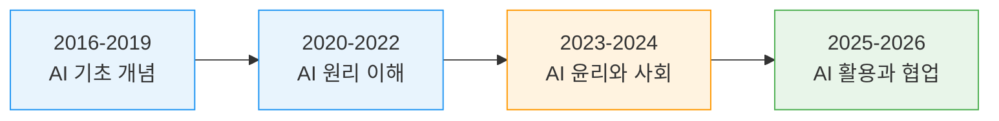
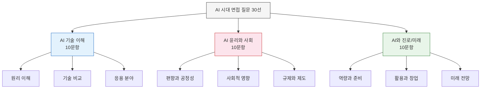
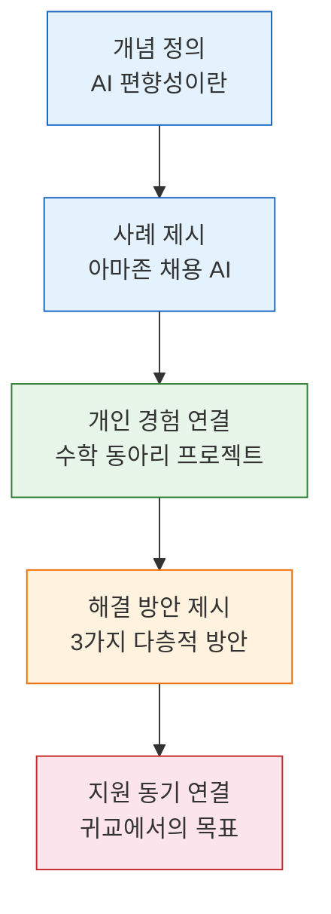

# AI 시대 면접 질문 30선 + 합격생 답변 프레임

AI 기술이 일상과 산업 전반을 변화시키는 시대, 대입 면접에서도 AI 관련 질문이 급증하고 있습니다. 이 가이드는 실제 출제된 AI 면접 질문 30개를 유형별로 분류하고, 각 질문에 대한 출제 의도, 답변 전략, 모범 답변 골격, 금기 답변까지 완벽하게 정리합니다.

---

## 1. AI 관련 면접 질문이 늘어나는 이유

### 1-1. 시대적 배경

2022년 ChatGPT 출시 이후, AI는 더 이상 공학 전공자만의 영역이 아닙니다. 문과, 이과, 예체능을 불문하고 모든 분야에서 AI 리터러시(AI Literacy)가 필수 역량으로 부상했습니다.

| 연도 | 주요 사건 | 면접 영향 |
| --- | --- | --- |
| 2016 | 알파고 vs 이세돌 | AI 관련 질문 최초 등장 |
| 2020 | GPT-3 공개 | 자연어처리 관련 질문 증가 |
| 2022 | ChatGPT 출시 | AI 질문 전 학교 유형으로 확산 |
| 2023 | GPT-4, 생성형 AI 대중화 | AI 윤리 질문 급증 |
| 2024 | AI 규제법 논의, Sora 등장 | AI와 사회 영향 질문 다양화 |
| 2025 | AI 에이전트, 멀티모달 AI 보편화 | AI 활용 경험 질문 본격화 |
| 2026 | AI 교육과정 도입, AI 리터러시 필수화 | AI를 활용한 문제 해결 역량 평가 핵심 |

### 1-2. 출제 트렌드 변화

### 1-3. 왜 면접관은 AI를 묻는가

면접관이 AI 질문을 하는 근본적 이유는 세 가지입니다.

1. **시사 감각 확인**: AI는 현재 가장 중요한 사회 이슈이므로, 지원자가 세상 변화에 얼마나 관심을 가지고 있는지 확인할 수 있습니다.
2. **논리적 사고력 평가**: AI 관련 주제는 정답이 없는 열린 질문이 많아, 지원자의 논리 구조와 비판적 사고를 평가하기에 적합합니다.
3. **미래 적응력 측정**: AI 시대에 어떻게 적응하고 성장할 것인지에 대한 비전과 태도를 확인할 수 있습니다.

### 1-4. 학교별 AI 질문 출제 비율 추이

| 학교 유형 | 2022 출제 비율 | 2024 출제 비율 | 2026 예상 비율 | 주요 질문 영역 |
| --- | --- | --- | --- | --- |
| 과학고/영재고 | 35% | 55% | 70% | AI 기술 원리, AI 연구 |
| 자율형사립고 | 20% | 40% | 60% | AI 윤리, AI와 사회 |
| 외국어고/국제고 | 15% | 35% | 55% | AI와 글로벌 이슈, AI 규제 |
| 일반고 자기주도학습전형 | 10% | 25% | 45% | AI 활용 경험, AI와 진로 |
| 사관학교/경찰대 | 25% | 45% | 65% | AI 국방/보안, AI 윤리 |

---

## 2. 질문 유형 분류

AI 면접 질문은 크게 네 가지 유형으로 분류됩니다. 각 유형은 평가하려는 역량이 다르므로, 유형에 맞는 답변 전략이 필요합니다.

### 2-1. 유형 분류 다이어그램

### 2-2. 유형별 평가 역량

| 유형 | 핵심 평가 역량 | 필요 준비 | 답변 시간 목표 |
| --- | --- | --- | --- |
| AI 기술 이해 | 과학적 사고력, 개념 이해력 | 기술 원리 학습, 용어 정리 | 90초 - 120초 |
| AI 윤리와 사회 | 비판적 사고력, 가치관 | 사회 이슈 분석, 다양한 관점 정리 | 120초 - 150초 |
| AI와 진로/미래 | 자기 이해, 비전 설정 | 진로 탐색, AI 활용 경험 정리 | 90초 - 120초 |

### 2-3. 답변 공통 프레임 (STAR-E)

모든 AI 면접 질문에 적용 가능한 통합 답변 프레임입니다.

| 단계 | 약어 | 설명 | 예시 |
| --- | --- | --- | --- |
| 상황 | S (Situation) | 질문 맥락을 정의하고 핵심 개념 제시 | "AI의 편향성 문제는 학습 데이터에서 비롯됩니다" |
| 과제 | T (Task) | 해당 주제에서 해결해야 할 과제 제시 | "이를 해결하기 위해 세 가지 접근이 필요합니다" |
| 행동 | A (Action) | 본인의 경험이나 구체적 사례 제시 | "저는 데이터 분석 프로젝트에서 이 문제를 직접 경험했습니다" |
| 결과 | R (Result) | 배운 점과 결론 제시 | "이 경험으로 기술과 윤리의 균형이 중요함을 깨달았습니다" |
| 확장 | E (Extend) | 진로/학교 지원 동기와 연결 | "귀교에서 이 분야를 더 깊이 탐구하고 싶습니다" |

---

## 3. 30개 질문 상세 가이드

---

### 유형 A: AI 기술 이해 (10문항)

---

#### Q01. AI와 머신러닝의 차이를 설명해 보세요

**출제 의도**: AI 기술의 기본 개념 체계를 이해하고 있는지, 상위-하위 개념을 명확히 구분할 수 있는지 평가합니다.

**답변 전략**: AI를 큰 우산 개념으로 설명하고, 머신러닝과 딥러닝을 포함 관계로 설명합니다. 단순 암기가 아닌 비유를 활용하면 효과적입니다.

**모범 답변 골격**:
- AI는 인간의 지능을 모방하는 기술 전체를 포괄하는 상위 개념입니다
- 머신러닝은 AI의 하위 분야로, 데이터를 통해 스스로 학습하는 기술입니다
- 비유: AI가 "지능적 기계"라는 목표라면, 머신러닝은 그 목표를 달성하는 핵심 방법론입니다
- 규칙 기반 AI(전통 AI)와 데이터 기반 AI(머신러닝)의 차이를 예시로 제시합니다
- 스팸 메일 필터를 예로 들면: 규칙 기반은 사람이 "이 단어가 포함되면 스팸"이라고 직접 규칙을 짜지만, 머신러닝은 수많은 메일 데이터에서 스스로 패턴을 학습합니다

**금기 답변**:
- "같은 건데 이름만 다릅니다" (개념 혼동)
- 지나치게 전문적인 수학 공식만 나열 (소통 능력 부족)
- "잘 모르겠지만 ChatGPT 같은 거 아닌가요" (준비 부족)

---

#### Q02. ChatGPT는 어떤 원리로 작동하나요

**출제 의도**: 생성형 AI의 작동 원리에 대한 기본 이해를 평가합니다. 일상에서 사용하는 기술을 얼마나 깊이 이해하고 있는지 확인합니다.

**답변 전략**: 트랜스포머 구조, 사전학습, 미세조정, RLHF 등 핵심 키워드를 자연스럽게 포함하되, 쉬운 비유로 설명합니다.

**모범 답변 골격**:
- ChatGPT는 대규모 언어 모델(LLM)로, 트랜스포머(Transformer) 아키텍처를 기반으로 합니다
- 인터넷의 방대한 텍스트 데이터로 사전학습하여 언어 패턴을 학습합니다
- "다음에 올 단어를 예측하는 방식"으로 문장을 생성합니다
- RLHF(인간 피드백 강화학습)을 통해 사람이 선호하는 답변을 학습합니다
- 비유: 수만 권의 책을 읽은 뒤 "이 맥락에서 다음에 올 가장 적절한 단어"를 계속 선택하는 과정입니다

**금기 답변**:
- "AI가 스스로 생각해서 답을 만듭니다" (의인화 오류)
- "인터넷을 실시간 검색해서 답합니다" (작동 원리 오해)
- "원리는 모르지만 잘 써봤습니다" (탐구심 부족)

---

#### Q03. 딥러닝이란 무엇이고, 일반 머신러닝과 어떻게 다른가요

**출제 의도**: AI 기술 계층 구조에 대한 심화 이해를 평가합니다. 신경망 개념을 설명할 수 있는지 확인합니다.

**답변 전략**: 인공신경망의 개념을 뇌의 뉴런에 비유하고, "깊은(Deep)" 의미를 층(Layer) 개념으로 설명합니다.

**모범 답변 골격**:
- 딥러닝은 머신러닝의 하위 분야로, 인공신경망을 여러 층으로 쌓아 학습하는 기술입니다
- "딥(Deep)"은 신경망의 층이 깊다(많다)는 뜻입니다
- 일반 머신러닝은 사람이 특징(Feature)을 직접 설계하지만, 딥러닝은 데이터에서 특징을 스스로 추출합니다
- 이미지 인식 예시: 전통 머신러닝은 "코 크기, 눈 간격" 등을 사람이 지정하지만, 딥러닝은 사진만 주면 스스로 중요한 특징을 찾습니다
- 장점은 복잡한 패턴 인식이 뛰어나다는 것이고, 단점은 대량의 데이터와 컴퓨팅 자원이 필요하다는 것입니다

**금기 답변**:
- "딥러닝이 머신러닝보다 무조건 좋습니다" (편향적 이해)
- 수학 공식만 줄줄 나열 (면접 맥락에 부적합)
- "딥러닝은 사람 뇌와 같습니다" (과도한 단순화)

---

#### Q04. 빅데이터와 AI의 관계를 설명해 주세요

**출제 의도**: AI가 작동하기 위한 필수 조건인 데이터의 역할을 이해하는지 평가합니다.

**답변 전략**: 데이터-알고리즘-컴퓨팅파워의 삼각 관계를 설명하고, "데이터는 AI의 연료"라는 핵심 비유를 활용합니다.

**모범 답변 골격**:
- 빅데이터는 AI 학습의 핵심 재료입니다. AI가 엔진이라면 빅데이터는 연료에 해당합니다
- AI 성능의 3요소: 양질의 데이터, 효과적인 알고리즘, 강력한 컴퓨팅 파워
- 빅데이터의 3V 특성(Volume: 규모, Velocity: 속도, Variety: 다양성)을 설명합니다
- 데이터 양만 중요한 것이 아니라 데이터의 질(정확성, 편향 제거)도 매우 중요합니다
- 예시: 의료 AI는 수백만 건의 진단 데이터를 학습해야 정확한 진단이 가능합니다

**금기 답변**:
- "빅데이터가 많으면 AI가 알아서 잘 합니다" (단순화 오류)
- "빅데이터와 AI는 같은 것입니다" (개념 혼동)
- 데이터 품질 문제를 전혀 언급하지 않는 경우

---

#### Q05. 자율주행 자동차는 어떤 AI 기술로 작동하나요

**출제 의도**: AI 기술이 실제 산업에 어떻게 적용되는지, 복합 기술 시스템을 이해하는지 평가합니다.

**답변 전략**: 인식-판단-제어의 3단계 프로세스로 설명하고, 각 단계에 사용되는 AI 기술을 매핑합니다.

**모범 답변 골격**:
- 자율주행은 인식, 판단, 제어의 3단계로 작동합니다
- 인식: 카메라, 라이다, 레이더 센서로 주변 환경을 파악합니다. 컴퓨터 비전과 객체 인식 AI가 사용됩니다
- 판단: 수집된 정보를 바탕으로 주행 경로를 결정합니다. 딥러닝과 강화학습이 활용됩니다
- 제어: 판단 결과에 따라 가속, 제동, 조향을 실행합니다
- 자율주행 레벨(0~5단계)을 간략히 설명하고, 현재 기술 수준(레벨 3~4)을 언급합니다
- 안전성과 윤리적 딜레마(트롤리 문제 등)에 대한 자신의 견해를 추가합니다

**금기 답변**:
- "AI가 알아서 운전합니다" (구체성 부족)
- 기술 낙관론만 제시하고 한계/윤리 문제를 무시하는 경우
- "위험하니까 하면 안 됩니다" (비건설적 부정)

---

#### Q06. AI 추천 알고리즘은 어떤 원리인가요

**출제 의도**: 일상에서 접하는 AI 기술의 원리를 이해하는지, 기술의 양면성을 인식하는지 평가합니다.

**답변 전략**: 협업 필터링과 콘텐츠 기반 필터링을 설명하고, 필터 버블 문제까지 연결합니다.

**모범 답변 골격**:
- 추천 알고리즘은 크게 두 가지 방식으로 작동합니다
- 협업 필터링: "나와 비슷한 취향의 사람들이 좋아한 것"을 추천합니다 (예: "이 상품을 산 사람들이 함께 구매한 상품")
- 콘텐츠 기반 필터링: "내가 이전에 좋아한 것과 비슷한 속성을 가진 것"을 추천합니다
- 현대 추천 시스템은 두 방식을 결합한 하이브리드 방식을 사용합니다
- 장점은 개인화된 경험 제공이지만, 단점으로 필터 버블(Filter Bubble)과 에코 챔버 현상이 발생할 수 있습니다
- 예시: 유튜브 추천 알고리즘이 점점 더 자극적인 콘텐츠를 추천하는 현상

**금기 답변**:
- "AI가 내 마음을 읽는 것 같습니다" (비과학적 표현)
- 추천 알고리즘의 부정적 측면만 강조하는 경우
- 기술 원리 설명 없이 경험만 나열하는 경우

---

#### Q07. 자연어처리(NLP)란 무엇인가요

**출제 의도**: AI의 핵심 분야인 자연어처리에 대한 이해를 평가합니다. 언어와 기술의 교차점에 대한 관심도 확인합니다.

**답변 전략**: 자연어의 정의부터 시작해 NLP의 주요 과제를 설명하고, 실생활 적용 사례를 제시합니다.

**모범 답변 골격**:
- 자연어는 사람이 일상적으로 사용하는 언어(한국어, 영어 등)이고, 자연어처리는 컴퓨터가 이를 이해하고 생성하는 기술입니다
- NLP의 주요 과제: 기계 번역, 감성 분석, 질의 응답, 텍스트 요약, 챗봇 등
- 과거에는 규칙 기반이었으나, 현재는 트랜스포머 모델 기반의 딥러닝 방식이 주류입니다
- 한국어 NLP의 특수한 어려움: 교착어 특성, 조사/어미 변화, 띄어쓰기 불규칙 등
- 실생활 예시: 음성인식 비서(시리, 빅스비), 자동 번역, 맞춤법 검사기

**금기 답변**:
- "AI가 사람처럼 언어를 이해합니다" (과도한 의인화)
- 영어 NLP만 언급하고 한국어 특수성을 무시하는 경우
- "NLP가 뭔지 모르겠습니다" (기본 개념 미준비)

---

#### Q08. 컴퓨터 비전이란 무엇이며 어디에 활용되나요

**출제 의도**: AI의 시각 정보 처리 능력에 대한 이해를 평가합니다. 다양한 적용 분야에 대한 지식을 확인합니다.

**답변 전략**: 컴퓨터 비전의 정의와 핵심 기술을 설명하고, 다양한 산업 분야의 활용 사례를 제시합니다.

**모범 답변 골격**:
- 컴퓨터 비전은 컴퓨터가 이미지나 영상에서 의미 있는 정보를 추출하고 이해하는 기술입니다
- 핵심 기술: 이미지 분류, 객체 탐지(Object Detection), 이미지 분할(Segmentation), 얼굴 인식
- CNN(합성곱 신경망)이 컴퓨터 비전의 핵심 알고리즘입니다
- 활용 분야: 의료 영상 진단(X-ray, MRI 분석), 자율주행, 품질 검사, 보안 CCTV, 증강현실(AR)
- 최근 트렌드: 멀티모달 AI(텍스트+이미지를 함께 이해하는 AI)의 등장

**금기 답변**:
- "사진 찍는 기술입니다" (핵심 개념 오해)
- 활용 사례를 하나도 제시하지 못하는 경우
- 감시 사회에 대한 공포만 부각하는 경우

---

#### Q09. AI 반도체란 무엇이고 왜 중요한가요

**출제 의도**: AI 기술의 하드웨어 기반에 대한 이해를 평가합니다. 반도체 산업과 AI의 관계를 아는지 확인합니다.

**답변 전략**: GPU, NPU, TPU 등 AI 전용 칩의 역할을 설명하고, 대한민국 반도체 산업과의 연관성을 강조합니다.

**모범 답변 골격**:
- AI 반도체는 AI 연산에 최적화된 반도체 칩으로, AI 학습과 추론에 필수적입니다
- CPU(범용) vs GPU(병렬 연산) vs NPU(AI 전용)의 차이를 설명합니다
- AI 모델이 커질수록 더 강력한 반도체가 필요합니다 (GPT-4 학습에 수만 개의 GPU 사용)
- 엔비디아(NVIDIA), 구글(TPU), 삼성, SK하이닉스 등 주요 기업을 언급합니다
- 대한민국은 메모리 반도체 강국이므로 AI 반도체 시장에서 큰 기회를 가지고 있습니다
- HBM(고대역폭 메모리) 등 AI에 필수적인 반도체 분야에서 한국 기업이 선두입니다

**금기 답변**:
- "반도체는 이과 분야라 잘 모릅니다" (소극적 태도)
- 반도체 기업명만 나열하고 기술 원리를 설명하지 못하는 경우
- AI와 반도체의 관계를 전혀 연결하지 못하는 경우

---

#### Q10. 양자컴퓨팅이 AI에 어떤 영향을 미칠까요

**출제 의도**: 차세대 기술에 대한 관심과 이해를 평가합니다. 미래 기술 트렌드에 대한 통찰력을 확인합니다.

**답변 전략**: 양자컴퓨팅의 기본 개념(큐비트, 중첩, 얽힘)을 간략히 설명하고, AI 발전에 미칠 잠재적 영향을 제시합니다.

**모범 답변 골격**:
- 양자컴퓨팅은 양자역학 원리를 이용한 차세대 컴퓨팅 기술입니다
- 기존 컴퓨터의 비트(0 또는 1)와 달리, 큐비트는 0과 1을 동시에 가질 수 있어 병렬 연산이 가능합니다
- AI에 미칠 영향: 현재 수년 걸리는 AI 모델 학습을 수시간으로 단축할 수 있습니다
- 양자머신러닝이라는 새로운 분야가 연구되고 있습니다
- 다만 현재는 초기 단계이며, 오류 보정, 극저온 환경 유지 등 해결해야 할 기술적 과제가 많습니다
- "아직 먼 미래"와 "곧 실현"의 균형 잡힌 시각을 제시합니다

**금기 답변**:
- "양자컴퓨터가 나오면 AI가 의식을 가집니다" (비과학적 비약)
- "양자컴퓨팅은 너무 어려워서 모릅니다" (도전 의지 부족)
- SF 영화 내용을 사실처럼 언급하는 경우

---

### 유형 B: AI 윤리와 사회 (10문항)

---

#### Q11. AI의 편향성 문제를 어떻게 해결할 수 있을까요

**출제 의도**: AI 기술의 한계와 사회적 영향을 인식하는지, 비판적 사고가 가능한지 평가합니다.

**답변 전략**: 편향성의 원인(데이터, 알고리즘, 사회 구조)을 분석하고, 다층적 해결 방안을 제시합니다.

**모범 답변 골격**:
- AI 편향성은 학습 데이터에 내재된 사회적 편견이 AI 시스템에 반영되는 현상입니다
- 대표적 사례: 채용 AI가 여성 지원자에게 불리한 판정을 내린 아마존 사례, 얼굴 인식 AI의 인종별 정확도 차이
- 원인 분석: 편향된 학습 데이터, 알고리즘 설계의 한계, 개발팀의 다양성 부족
- 해결 방안: 다양한 데이터셋 구축, 알고리즘 공정성 검증 도구 개발, 개발팀 다양성 확보, AI 윤리 위원회 운영
- "기술적 해결"과 "제도적 해결"을 모두 포함합니다
- 개인적으로 이 문제에 관심을 가지게 된 계기를 추가하면 좋습니다

**금기 답변**:
- "AI는 기계니까 편향이 없습니다" (핵심 개념 오해)
- "사람이 편향적이니 AI도 어쩔 수 없습니다" (해결 의지 부재)
- 특정 인종이나 성별을 비하하는 발언

---

#### Q12. 딥페이크 기술의 문제점과 대응 방안은 무엇인가요

**출제 의도**: 생성형 AI의 악용 가능성에 대한 인식과 해결 의지를 평가합니다.

**답변 전략**: 딥페이크의 기술 원리를 간략히 설명하고, 피해 사례와 다각적 대응 방안을 제시합니다.

**모범 답변 골격**:
- 딥페이크는 딥러닝을 이용해 가짜 이미지, 영상, 음성을 생성하는 기술입니다
- GAN(생성적 적대 신경망) 등의 기술로 점점 정교해지고 있습니다
- 문제점: 명예 훼손, 허위 정보 유포, 보이스피싱, 선거 조작 위험
- 특히 학교 현장에서의 딥페이크 악용 문제가 심각합니다
- 대응 방안: 딥페이크 탐지 기술 개발, 법적 규제 강화, 디지털 리터러시 교육, 콘텐츠 출처 인증 기술(워터마크, C2PA 표준)
- "기술의 양면성"을 인정하면서도 적극적 대응의 필요성을 강조합니다

**금기 답변**:
- "재미있는 기술이라고 생각합니다" (윤리 의식 부족)
- "모든 영상을 금지해야 합니다" (비현실적 극단)
- 딥페이크의 긍정적 활용(영화, 교육)을 완전히 무시하는 경우

---

#### Q13. AI가 만든 작품의 저작권은 누구에게 있나요

**출제 의도**: AI와 법, 창작의 교차점에 대한 사고력을 평가합니다. 정답이 없는 문제에 대한 논리적 의견 제시를 확인합니다.

**답변 전략**: 현행 법률과 논쟁 지점을 설명하고, 다양한 이해관계자의 입장을 분석한 뒤 자신의 견해를 제시합니다.

**모범 답변 골격**:
- 현행 저작권법은 "인간의 사상 또는 감정을 표현한 창작물"만 보호하므로, AI 생성물은 저작권 보호 대상이 아닙니다
- 주요 논쟁: AI 개발자, AI 사용자(프롬프트 작성자), AI 학습에 사용된 원작자 중 누가 권리를 가지는가
- 각국 대응: 미국(저작권 불인정), EU(AI법 제정 중), 한국(논의 중)
- 학습 데이터로 사용된 원작자의 권리 보호 문제도 중요합니다
- 자신의 견해: "AI는 도구이므로 도구를 사용한 인간에게 일정 부분 권리를 인정하되, 원작자 보호도 병행해야 한다" 등

**금기 답변**:
- "AI도 창작자이므로 AI에게 저작권을 줘야 합니다" (법적 근거 부족)
- "저작권 같은 건 중요하지 않습니다" (법적 감수성 부족)
- 한쪽 입장만 고려하고 반론을 전혀 제시하지 않는 경우

---

#### Q14. AI가 인간의 일자리를 대체할까요

**출제 의도**: 기술 변화에 대한 균형 잡힌 시각과 적응 의지를 평가합니다.

**답변 전략**: "대체"보다 "변화"의 관점에서 접근하고, 새로 생기는 직업과 필요 역량을 함께 제시합니다.

**모범 답변 골격**:
- 역사적으로 모든 기술 혁명은 일부 일자리를 없애고 새로운 일자리를 만들었습니다
- AI로 대체될 가능성이 높은 직업: 단순 반복적, 규칙 기반의 업무
- AI로 대체하기 어려운 직업: 창의성, 공감 능력, 복잡한 의사결정이 필요한 업무
- 새로 생기는 직업: AI 트레이너, 프롬프트 엔지니어, AI 윤리 전문가, 데이터 큐레이터 등
- 핵심은 "AI에 의해 대체되는 것"이 아니라 "AI를 활용하는 사람에 의해 대체되는 것"입니다
- 본인이 AI 시대에 어떤 역량을 키울 것인지 구체적으로 제시합니다

**금기 답변**:
- "AI가 모든 일자리를 없앨 것입니다" (공포 조장)
- "AI가 절대 인간을 대체할 수 없습니다" (비현실적 낙관)
- "저는 상관없습니다" (무관심)

---

#### Q15. AI 시대의 개인정보 보호는 어떻게 해야 할까요

**출제 의도**: 디지털 시대의 프라이버시 문제에 대한 인식과 해결 역량을 평가합니다.

**답변 전략**: AI가 수집하는 개인정보의 범위를 설명하고, 기술적/제도적 보호 방안을 제시합니다.

**모범 답변 골격**:
- AI 시스템은 학습과 서비스를 위해 대량의 개인정보를 수집합니다
- 위험 요소: 과도한 데이터 수집, 동의 없는 데이터 활용, 데이터 유출, 프로파일링
- 기술적 보호: 차등 프라이버시(Differential Privacy), 연합학습(Federated Learning), 동형암호
- 제도적 보호: GDPR(유럽), 개인정보보호법(한국), AI 규제법
- 개인 차원의 노력: 정보 제공 범위 인식, 개인정보 설정 관리, 디지털 리터러시 함양
- "편리함"과 "프라이버시" 사이의 균형점에 대한 자신의 견해를 제시합니다

**금기 답변**:
- "개인정보는 이미 다 노출되었으니 상관없습니다" (방관적 태도)
- "AI를 안 쓰면 됩니다" (비현실적 해결책)
- 법률이나 제도적 측면을 전혀 언급하지 않는 경우

---

#### Q16. AI 무기(자율살상무기)에 대해 어떻게 생각하나요

**출제 의도**: 기술의 극단적 활용에 대한 윤리적 판단력과 논리적 사고력을 평가합니다. 특히 사관학교에서 자주 출제됩니다.

**답변 전략**: 기술적 가능성과 윤리적 문제를 분리하여 논의하고, 국제적 규제 움직임을 포함합니다.

**모범 답변 골격**:
- 자율살상무기(LAWS: Lethal Autonomous Weapons Systems)는 인간의 개입 없이 스스로 목표물을 선택하고 공격하는 무기입니다
- 기술적으로는 이미 가능하지만, "생사 결정을 기계에 맡겨도 되는가"라는 근본적 윤리 문제가 있습니다
- 찬성 논거: 아군 희생 최소화, 인간의 감정적 오판 방지
- 반대 논거: 책임 소재 불분명, 오작동 위험, 전쟁 진입 장벽 낮춤, 인간 존엄성 훼손
- 국제적 대응: UN에서 자율살상무기 규제 논의 진행 중
- 자신의 견해: "최종 결정은 반드시 인간이 내려야 한다"는 인간-온-더-루프(Human-on-the-loop) 원칙 등

**금기 답변**:
- "강한 무기를 만들어야 이깁니다" (윤리 의식 부재)
- "무기 관련 질문은 답하고 싶지 않습니다" (회피)
- 군사 기밀에 대한 추측성 발언

---

#### Q17. AI 판사가 재판하는 것에 대해 어떻게 생각하나요

**출제 의도**: 사법 정의와 기술의 관계에 대한 깊이 있는 사고를 평가합니다.

**답변 전략**: AI의 사법 활용 현황을 설명하고, "보조"와 "대체"를 구분하며 균형 잡힌 견해를 제시합니다.

**모범 답변 골격**:
- 현재 일부 국가에서 AI가 양형 예측, 보석 결정 보조 등에 활용되고 있습니다
- AI 판사의 장점: 일관성 있는 판결, 인간 판사의 편견 제거 가능성, 사법 효율성 향상
- AI 판사의 한계: 맥락 이해 부족, 정상참작 판단 어려움, 학습 데이터의 편향 반영 위험
- 미국 COMPAS 시스템의 인종 편향 사례를 예시로 들 수 있습니다
- 자신의 견해: "AI는 판사를 보조하는 도구로 활용하되, 최종 판단은 인간 판사가 내려야 한다" 등
- 법의 본질(정의, 형평성, 인간 존엄)과 기술의 관계를 성찰합니다

**금기 답변**:
- "AI가 더 공정하니까 판사를 전부 AI로 바꿔야 합니다" (극단적 주장)
- "법을 모르니까 답하기 어렵습니다" (준비 부족)
- 구체적 사례나 근거 없이 감정적으로만 반대하는 경우

---

#### Q18. 소셜미디어 알고리즘이 사회에 미치는 영향은 무엇인가요

**출제 의도**: 일상에서 경험하는 AI 기술의 사회적 영향을 분석하는 능력을 평가합니다.

**답변 전략**: 알고리즘의 작동 원리를 설명하고, 정보 편향과 민주주의에 미치는 영향을 분석합니다.

**모범 답변 골격**:
- 소셜미디어 알고리즘은 사용자의 관심사와 행동 데이터를 분석해 맞춤형 콘텐츠를 제공합니다
- 긍정적 영향: 관심 분야 정보의 효율적 탐색, 개인화된 경험
- 부정적 영향: 필터 버블(자신의 관점만 강화), 에코 챔버(반향실 효과), 확증 편향 강화
- 가짜뉴스 확산 문제: 자극적 콘텐츠가 더 많이 추천되는 알고리즘 특성
- 청소년 정신건강에 미치는 영향: 비교 의식, 중독성
- 해결 방안: 알고리즘 투명성 요구, 미디어 리터러시 교육, 다양한 정보원 의식적 탐색

**금기 답변**:
- "SNS 안 하면 됩니다" (비현실적 회피)
- "알고리즘은 다 나쁩니다" (일방적 부정)
- 본인의 SNS 사용 습관을 과도하게 노출하는 경우

---

#### Q19. AI 의료 진단의 윤리적 문제는 무엇인가요

**출제 의도**: 의료 분야 AI 적용의 윤리적 쟁점을 이해하는지 평가합니다. 의대/약대 지원자에게 특히 중요합니다.

**답변 전략**: AI 의료의 현황과 장점을 인정하면서, 구체적 윤리 쟁점을 다각적으로 분석합니다.

**모범 답변 골격**:
- AI 의료 진단의 현황: 피부암 진단, 안저 검사, 병리 분석 등에서 전문의 수준의 정확도
- 윤리 쟁점 1: 오진 시 책임 소재 (AI 개발사? 사용 의사? 병원?)
- 윤리 쟁점 2: AI가 접근 가능한 환자 의료 데이터의 프라이버시
- 윤리 쟁점 3: AI 의료의 접근 격차 (선진국 vs 개도국, 대형병원 vs 소형의원)
- 윤리 쟁점 4: 의사-환자 관계의 변화 (신뢰, 소통, 공감의 문제)
- 자신의 견해: "AI는 의사의 진단을 보조하는 강력한 도구이지만, 환자와의 소통과 최종 판단은 의사의 역할"

**금기 답변**:
- "AI가 의사보다 정확하니까 의사가 필요 없습니다" (극단적 주장)
- "AI 진단은 위험하니까 쓰면 안 됩니다" (기술 발전 부정)
- 의료 윤리의 기본 원칙(자율성, 선행, 악행금지, 정의)을 전혀 모르는 경우

---

#### Q20. AI 시대에 교육은 어떻게 변해야 할까요

**출제 의도**: 교육의 본질에 대한 사고와 AI 시대의 교육 변화에 대한 비전을 평가합니다.

**답변 전략**: 현재 교육의 한계를 분석하고, AI가 가져올 교육 변화와 교사의 역할 변화를 제시합니다.

**모범 답변 골격**:
- AI 시대에 암기 중심 교육의 가치가 감소하고 있습니다
- AI 시대에 더 중요해지는 역량: 비판적 사고, 창의성, 협업 능력, 문제 정의 능력
- AI를 활용한 개인 맞춤형 교육(적응형 학습)의 가능성
- 교사의 역할 변화: 지식 전달자에서 학습 촉진자, 멘토, 코치로
- AI 리터러시 교육의 필수화 필요성
- "AI가 교사를 대체하는 것이 아니라, AI를 활용하는 교사가 활용하지 않는 교사를 대체할 것"
- 본인이 경험한 AI 활용 학습 사례를 추가합니다

**금기 답변**:
- "AI가 있으니 공부할 필요 없습니다" (학습 동기 부정)
- "학교가 필요 없어집니다" (교육 기관 자체를 부정)
- 교사 앞에서 교사 불필요론을 주장하는 경우 (면접관이 교사임을 인식)

---

### 유형 C: AI와 진로/미래 (10문항)

---

#### Q21. AI 시대에 가장 필요한 역량은 무엇이라고 생각하나요

**출제 의도**: 미래 역량에 대한 인식과 자기 계발 의지를 평가합니다.

**답변 전략**: 기술 역량과 인문 역량을 모두 포함하고, 본인이 해당 역량을 키우기 위해 어떤 노력을 하고 있는지 연결합니다.

**모범 답변 골격**:
- 기술 역량: AI 리터러시, 데이터 분석 능력, 코딩 기초 역량
- 인문 역량: 비판적 사고, 창의성, 공감 능력, 윤리적 판단력
- 협업 역량: 인간-AI 협업 능력, 프롬프트 엔지니어링, 다학제 소통 능력
- 가장 중요한 것은 "AI가 잘하는 것"과 "인간이 잘하는 것"을 구분하고, 인간 고유의 강점을 발전시키는 것입니다
- 구체적 노력: 코딩 학습, AI 프로젝트 참여, 독서를 통한 인문학적 소양 쌓기 등 본인 사례

**금기 답변**:
- "코딩만 잘하면 됩니다" (편향된 역량관)
- "AI가 다 해주니까 역량이 필요 없습니다" (성장 의지 부재)
- 구체적 노력 없이 추상적 답변만 하는 경우

---

#### Q22. AI로 해결하고 싶은 사회 문제가 있나요

**출제 의도**: 사회 문제에 대한 관심과 기술을 활용한 문제 해결 의지를 평가합니다. 자소서와 연계 가능한 핵심 질문입니다.

**답변 전략**: 구체적인 사회 문제를 선택하고, AI로 어떻게 해결할 수 있는지 실현 가능한 아이디어를 제시합니다.

**모범 답변 골격**:
- 선택한 사회 문제와 그 문제에 관심을 갖게 된 계기를 설명합니다
- 현재 이 문제가 해결되지 않는 이유를 분석합니다
- AI를 활용한 구체적 해결 방안을 제시합니다
- 예시 1: "독거노인 돌봄 문제를 AI 감정 인식과 IoT 센서로 해결"
- 예시 2: "소방관 안전을 위한 AI 기반 화재 예측 시스템"
- 예시 3: "농촌 인력 부족을 해결하는 AI 스마트팜"
- 이 문제를 해결하기 위해 대학에서 어떤 공부를 하고 싶은지 연결합니다

**금기 답변**:
- "세계 평화를 AI로 이루겠습니다" (비현실적 거대 목표)
- "특별히 없습니다" (관심과 열정 부족)
- 아이디어만 있고 실현 가능성을 전혀 고려하지 않은 경우

---

#### Q23. AI와 인간은 어떻게 협업해야 할까요

**출제 의도**: 인간-AI 관계에 대한 성숙한 시각과 협업 능력을 평가합니다.

**답변 전략**: "대체"가 아닌 "보완"의 관점에서 각자의 강점을 분석하고, 협업 모델을 제시합니다.

**모범 답변 골격**:
- AI의 강점: 대량 데이터 처리, 패턴 인식, 24시간 작동, 일관성
- 인간의 강점: 창의성, 공감, 윤리적 판단, 맥락 이해, 직관
- 이상적 협업 모델: AI가 데이터 분석과 초안 작성을 담당하고, 인간이 최종 판단과 창의적 의사결정을 담당합니다
- 의료 분야 예시: AI가 영상 데이터를 분석하고, 의사가 환자 상담과 치료 결정을 내립니다
- 교육 분야 예시: AI가 학생 수준을 진단하고 맞춤 문제를 제공하며, 교사가 동기 부여와 정서 지도를 합니다
- 본인이 경험한 AI 협업 사례를 추가합니다

**금기 답변**:
- "AI가 하위 직원이고 사람이 상사입니다" (수직적 사고)
- "협업할 필요 없이 AI가 다 하면 됩니다" (인간 역할 부정)
- "AI는 도구일 뿐이니까 시키는 대로만 하면 됩니다" (AI 역량 과소평가)

---

#### Q24. 10년 후 AI가 바꿀 세상은 어떤 모습일까요

**출제 의도**: 미래에 대한 상상력과 기술 트렌드 이해를 평가합니다.

**답변 전략**: 구체적인 분야별 변화를 예측하되, 낙관과 우려를 균형 있게 제시합니다.

**모범 답변 골격**:
- 일상 생활: 개인 AI 비서가 일정, 건강, 학습을 관리하고, 자율주행이 보편화됩니다
- 의료: AI가 질병을 조기 발견하고, 개인 맞춤 치료가 일반화됩니다
- 교육: AI 튜터가 학생별 맞춤 교육을 제공하고, 교사는 인성 교육에 집중합니다
- 산업: 대부분의 공장이 AI로 자동화되고, 인간은 기획과 관리에 집중합니다
- 우려 사항: 디지털 격차 심화, 일자리 구조 변화, 프라이버시 문제
- "기술의 발전 자체보다 그 기술을 어떻게 활용하느냐가 더 중요합니다"
- 그 세상에서 본인이 어떤 역할을 하고 싶은지 비전을 제시합니다

**금기 답변**:
- "터미네이터 같은 세상이 될 것입니다" (SF적 공포)
- "다 좋아질 것입니다" (비판 없는 낙관)
- 구체적 예측 없이 막연한 답변만 하는 경우

---

#### Q25. AI가 절대 할 수 없는 것은 무엇이라고 생각하나요

**출제 의도**: AI의 본질적 한계에 대한 이해와 인간 고유 가치에 대한 인식을 평가합니다.

**답변 전략**: AI의 기술적 한계와 철학적 한계를 구분하여 제시하고, 인간만의 가치를 강조합니다.

**모범 답변 골격**:
- 기술적 한계: 상식 추론의 어려움, 새로운 상황에 대한 적응(일반화), 인과관계 이해
- 철학적 한계: 의식(Consciousness), 주관적 경험(Qualia), 진정한 감정
- AI가 "모방"할 수는 있지만 "경험"할 수 없는 것: 사랑, 기쁨, 슬픔, 감동
- 인간만의 강점: 공감을 통한 위로, 윤리적 책임감, 의미 부여, 예술적 영감
- 다만 "AI가 절대 못한다"는 단정보다 "현재 기술로는 어렵고, 본질적으로 다른 방식"이라는 표현이 더 적절합니다
- AI 시대에 인간이 더 주목해야 할 가치가 무엇인지 성찰합니다

**금기 답변**:
- "AI는 아무것도 못합니다" (기술 발전 부정)
- "AI가 결국 다 할 수 있게 될 것입니다" (인간 가치 경시)
- "바둑에서 졌으니까 인간이 이길 수 없습니다" (논리 비약)

---

#### Q26. AI 시대에 인문학은 왜 중요한가요

**출제 의도**: 기술과 인문학의 융합적 사고를 평가합니다. 특히 인문계 학과 지원자에게 핵심 질문입니다.

**답변 전략**: "AI가 무엇을 할 수 있는가"보다 "무엇을 해야 하는가"를 결정하는 데 인문학이 필요함을 논증합니다.

**모범 답변 골격**:
- AI는 "어떻게(How)" 해결하는 데 뛰어나지만, "왜(Why)" 해결해야 하는지, "무엇을(What)" 해결해야 하는지는 인간의 영역입니다
- 인문학의 역할 1: AI 윤리 기준 수립 (철학)
- 인문학의 역할 2: AI 시대의 인간 존엄성 탐구 (윤리학)
- 인문학의 역할 3: AI 기술의 사회적 영향 분석 (사회학, 역사학)
- 인문학의 역할 4: AI와 소통하는 언어 능력 (언어학, 문학)
- 스티브 잡스의 "기술과 인문학의 교차점" 철학을 예시로 들 수 있습니다
- 본인이 인문학을 통해 얻은 통찰과 AI 시대에의 적용을 연결합니다

**금기 답변**:
- "인문학은 취업이 안 되니까 중요하지 않습니다" (가치 경시)
- "인문학이 AI보다 중요합니다" (이분법적 사고)
- 인문학과 AI의 연결점을 전혀 제시하지 못하는 경우

---

#### Q27. 나만의 AI 활용법이 있다면 소개해 주세요

**출제 의도**: AI를 실제로 활용해 본 경험과 능동적 학습 태도를 평가합니다.

**답변 전략**: 단순 사용이 아닌, 주체적이고 창의적인 활용 경험을 구체적으로 제시합니다.

**모범 답변 골격**:
- 학습 활용: "ChatGPT로 소크라테스식 문답을 하며 개념 이해 깊이를 확인합니다"
- 프로젝트 활용: "AI 코딩 도구를 활용해 학교 급식 만족도 분석 프로그램을 만들었습니다"
- 창작 활용: "AI 이미지 생성으로 아이디어를 시각화한 후, 직접 수정하며 작품을 완성했습니다"
- AI 활용 시 주의점: 결과물을 비판적으로 검증하고, AI의 한계를 인지한 상태에서 사용합니다
- AI를 "대신 해주는 도구"가 아닌 "함께 생각하는 파트너"로 활용한다는 점을 강조합니다
- 활용 과정에서 겪은 한계나 실패 경험도 포함하면 진정성이 높아집니다

**금기 답변**:
- "숙제를 AI에게 시킵니다" (학습 윤리 위반)
- "AI는 안 씁니다" (시대 변화 인식 부족)
- "유튜브 요약에만 씁니다" (활용 깊이 부족)

---

#### Q28. AI 관련 창업 아이디어가 있나요

**출제 의도**: 기업가 정신, 문제 발견 능력, 실행력을 평가합니다.

**답변 전략**: 실현 가능한 구체적 아이디어를 제시하고, 사회적 가치와 비즈니스 모델을 연결합니다.

**모범 답변 골격**:
- 문제 발견: 주변에서 겪는 불편함이나 사회 문제를 먼저 제시합니다
- 아이디어: AI 기술을 활용한 구체적 해결 방안을 제안합니다
- 예시 1: "청각장애인을 위한 실시간 AI 수어 번역 앱"
- 예시 2: "중소기업 맞춤형 AI 마케팅 자동화 플랫폼"
- 예시 3: "AI 기반 학습 장애 조기 진단 시스템"
- 차별화 포인트: 기존 서비스와 어떻게 다른지 설명합니다
- 실현을 위해 필요한 기술과 대학에서 공부하고 싶은 분야를 연결합니다

**금기 답변**:
- "ChatGPT 같은 걸 만들겠습니다" (비현실적 규모)
- "돈을 많이 벌 수 있는 걸 만들겠습니다" (가치 부재)
- 기술적 실현 가능성을 전혀 고려하지 않은 아이디어

---

#### Q29. AI와 예술(창작)의 관계를 어떻게 보나요

**출제 의도**: 창작의 본질에 대한 사고와 기술-예술의 융합 관점을 평가합니다. 예술 관련 학과 지원자에게 핵심 질문입니다.

**답변 전략**: AI 창작물의 가치에 대한 다양한 관점을 소개하고, "도구로서의 AI"와 "창작자로서의 AI"를 구분합니다.

**모범 답변 골격**:
- 현황: AI가 그림, 음악, 소설, 영상 등 다양한 예술 분야에서 작품을 생성하고 있습니다
- AI 창작의 특성: 기존 작품의 패턴을 학습하여 새로운 조합을 만들어내는 것
- 논쟁: "AI 작품에 예술적 가치가 있는가?" "AI는 창작자인가 도구인가?"
- 긍정적 관점: AI가 인간 예술가의 창작 영역을 확장하는 도구가 될 수 있습니다
- 비판적 관점: 진정한 예술은 인간의 감정과 경험에서 비롯되므로, AI 생성물은 "생성"이지 "창작"이 아닙니다
- 자신의 견해: "AI는 새로운 붓이며, 중요한 것은 붓을 잡은 인간의 의도와 감정입니다" 등

**금기 답변**:
- "AI가 더 잘 그리니까 사람은 그림을 그릴 필요 없습니다" (예술 가치 부정)
- "AI 그림은 예술이 아닙니다" (기술 발전 무시)
- 예술의 정의에 대한 고민 없이 단정적으로 답변하는 경우

---

#### Q30. AI 규제는 어떤 방향으로 이루어져야 할까요

**출제 의도**: 기술과 규제의 균형에 대한 사고력과 정책적 감각을 평가합니다.

**답변 전략**: 규제의 필요성을 인정하면서도, 혁신을 저해하지 않는 균형점을 제시합니다. 각국의 사례를 비교합니다.

**모범 답변 골격**:
- AI 규제의 필요성: 안전성 확보, 인권 보호, 공정성 보장, 책임 소재 명확화
- 각국 접근: EU(AI법 - 위험 기반 규제), 미국(자율 규제 중심), 중국(국가 주도 규제), 한국(AI 기본법 논의 중)
- 규제의 딜레마: 과도한 규제는 혁신 저해, 부족한 규제는 안전 위협
- 바람직한 방향: 위험 수준에 따른 차등 규제, 기술 발전 속도에 맞는 유연한 규제, 국제 협력을 통한 글로벌 기준 마련
- "사후 규제"보다 "사전 예방적 원칙"과 "적응적 규제"의 균형이 필요합니다
- 자신이 생각하는 규제의 핵심 원칙을 제시합니다

**금기 답변**:
- "규제하면 발전이 멈춥니다" (규제 필요성 부정)
- "AI를 전부 금지해야 합니다" (극단적 주장)
- 각국 사례에 대한 지식 없이 막연한 답변만 하는 경우

---

## 4. 학교 유형별 AI 질문 경향

### 4-1. 유형별 비교표

| 구분 | 과학고/영재고 | 자율형사립고 | 외국어고/국제고 | 일반고 | 사관학교/경찰대 |
| --- | --- | --- | --- | --- | --- |
| 주요 질문 영역 | AI 기술 원리, 수학적 기초 | AI 윤리, 사회적 영향 | AI 국제 규범, 글로벌 이슈 | AI 활용 경험, 진로 연계 | AI 국방 활용, AI 윤리 |
| 난이도 | 상 | 중상 | 중상 | 중 | 상 |
| 기술 깊이 요구 | 매우 높음 | 보통 | 보통 | 낮음 | 높음 |
| 윤리 관점 요구 | 보통 | 매우 높음 | 높음 | 보통 | 매우 높음 |
| 글로벌 시각 요구 | 보통 | 보통 | 매우 높음 | 낮음 | 높음 |
| 자주 출제되는 질문 | Q01-Q10 | Q11-Q20 | Q13,Q15,Q30 | Q21-Q28 | Q05,Q16,Q21 |
| 답변 시 강조할 점 | 과학적 정확성 | 다양한 관점 | 국제 비교 | 실제 경험 | 국가 안보 관점 |

### 4-2. 학교 유형별 기출 AI 질문 예시

| 학교 유형 | 기출 질문 예시 | 평가 핵심 |
| --- | --- | --- |
| 과학고 | "트랜스포머 모델의 어텐션 메커니즘을 설명하세요" | 기술 원리의 정확한 이해 |
| 과학고 | "신경망의 역전파 알고리즘 개념을 설명하세요" | 수학적 사고력 |
| 영재고 | "AI 모델의 과적합 문제와 해결 방법은?" | 문제 해결 접근법 |
| 자사고 | "AI 면접관이 채용을 결정해도 될까요?" | 윤리적 판단력 |
| 자사고 | "생성형 AI 사용이 학습에 도움이 될까요?" | 균형 잡힌 시각 |
| 외고 | "EU AI법과 한국 AI 정책의 차이는?" | 국제 비교 능력 |
| 외고 | "AI 번역이 외국어 학습을 대체할까요?" | 언어 학습 본질 이해 |
| 일반고 | "AI를 활용한 자기주도학습 경험을 말해보세요" | 실제 활용 역량 |
| 사관학교 | "AI 드론 전투의 윤리적 한계는?" | 국가 안보와 윤리의 균형 |

### 4-3. 학교 유형별 답변 전략 요약

```mermaid
graph TD
    START[학교 유형 확인] --> SCI[과학고/영재고]
    START --> AUTO[자사고]
    START --> LANG[외고/국제고]
    START --> GEN[일반고]
    START --> MIL[사관학교/경찰대]
    
    SCI --> SCI1[기술 원리 정확히 설명]
    SCI --> SCI2[수학적 근거 포함]
    SCI --> SCI3[연구 경험 연결]
    
    AUTO --> AUTO1[다양한 관점 제시]
    AUTO --> AUTO2[사회적 영향 분석]
    AUTO --> AUTO3[가치관 명확히]
    
    LANG --> LANG1[국제 비교 사례]
    LANG --> LANG2[글로벌 규범 언급]
    LANG --> LANG3[다국어 자료 참고]
    
    GEN --> GEN1[실제 경험 구체적]
    GEN --> GEN2[진로 연계 명확]
    GEN --> GEN3[성장 과정 강조]
    
    MIL --> MIL1[국가 안보 관점]
    MIL --> MIL2[윤리와 효용 균형]
    MIL --> MIL3[리더십 연결]
    
    style START fill:#f5f5f5,stroke:#333
    style SCI fill:#e3f2fd,stroke:#1565c0
    style AUTO fill:#f3e5f5,stroke:#7b1fa2
    style LANG fill:#e8f5e9,stroke:#2e7d32
    style GEN fill:#fff3e0,stroke:#ef6c00
    style MIL fill:#fce4ec,stroke:#c62828
```

---

## 5. AI 키워드 정리 (면접 전 암기용)

### 5-1. AI 기술 핵심 키워드

| 키워드 | 영문 | 정의 | 면접 활용 팁 |
| --- | --- | --- | --- |
| 인공지능 | Artificial Intelligence | 인간의 지능을 모방하여 학습, 추론, 판단하는 컴퓨터 시스템 | AI의 상위 개념으로 항상 출발점 |
| 머신러닝 | Machine Learning | 데이터에서 패턴을 학습하여 예측하는 AI의 하위 분야 | AI와의 포함 관계를 명확히 |
| 딥러닝 | Deep Learning | 다층 인공신경망을 이용한 머신러닝의 하위 분야 | "깊은 = 층이 많은" 핵심 포인트 |
| 신경망 | Neural Network | 뇌의 뉴런 구조를 모방한 알고리즘 구조 | 생물학적 뉴런과의 비유 활용 |
| 트랜스포머 | Transformer | 자연어처리의 핵심 아키텍처, 어텐션 메커니즘 기반 | ChatGPT 원리 설명 시 필수 |
| 대규모 언어 모델 | LLM (Large Language Model) | 방대한 텍스트로 학습한 초대형 언어 AI 모델 | GPT, Claude 등의 기반 기술 |
| 생성형 AI | Generative AI | 텍스트, 이미지, 음성 등을 새로 생성하는 AI | 2023년 이후 가장 핵심 키워드 |
| 강화학습 | Reinforcement Learning | 보상을 통해 최적 행동을 학습하는 방법 | 알파고, 자율주행 설명 시 활용 |
| 컴퓨터 비전 | Computer Vision | 이미지/영상에서 정보를 추출하는 AI 분야 | 의료 진단, 자율주행 연결 |
| 자연어처리 | NLP (Natural Language Processing) | 인간 언어를 이해하고 생성하는 AI 분야 | 번역, 챗봇, 검색 연결 |
| CNN | Convolutional Neural Network | 이미지 인식에 특화된 합성곱 신경망 | 컴퓨터 비전의 핵심 알고리즘 |
| GAN | Generative Adversarial Network | 생성자와 판별자가 경쟁하며 학습하는 모델 | 딥페이크 원리 설명 시 필수 |
| 프롬프트 | Prompt | AI에게 주는 입력 텍스트(질문, 지시) | AI 활용 경험 답변 시 사용 |
| 파인튜닝 | Fine-tuning | 사전학습 모델을 특정 목적에 맞게 추가 학습 | AI 커스터마이징 설명 시 활용 |
| RLHF | Reinforcement Learning from Human Feedback | 인간 피드백으로 AI 응답 품질을 개선하는 학습법 | ChatGPT의 핵심 학습 방법 |
| 멀티모달 | Multimodal | 텍스트, 이미지, 음성 등 여러 형태의 데이터를 함께 처리 | 최신 AI 트렌드 설명 시 필수 |
| 에이전트 | AI Agent | 자율적으로 목표를 수행하는 AI 시스템 | 2025-2026 최신 트렌드 |

### 5-2. AI 윤리/사회 핵심 키워드

| 키워드 | 영문 | 정의 | 면접 활용 팁 |
| --- | --- | --- | --- |
| AI 편향성 | AI Bias | AI 시스템이 특정 집단에 불공정한 결과를 내는 현상 | 아마존 채용 AI 사례 활용 |
| 설명 가능한 AI | XAI (Explainable AI) | AI 판단 근거를 사람이 이해할 수 있도록 설명하는 기술 | AI 신뢰성 문제 답변에 필수 |
| 필터 버블 | Filter Bubble | 알고리즘이 사용자 취향만 보여주는 정보 편향 현상 | 소셜미디어 문제 답변에 활용 |
| 딥페이크 | Deepfake | AI로 만든 가짜 이미지, 영상, 음성 | 사회 문제 답변에 핵심 사례 |
| AI 윤리 | AI Ethics | AI 개발과 활용에서의 도덕적 원칙과 기준 | 모든 윤리 질문의 기본 프레임 |
| 차등 프라이버시 | Differential Privacy | 개인 데이터 보호하면서 전체 통계를 활용하는 기술 | 개인정보 보호 답변에 활용 |
| 연합학습 | Federated Learning | 데이터를 한곳에 모으지 않고 분산 학습하는 기술 | 프라이버시 보호 기술 사례 |
| 자율살상무기 | LAWS | 인간 개입 없이 작동하는 치명적 무기 시스템 | 사관학교 면접 핵심 키워드 |
| 트롤리 딜레마 | Trolley Problem | 도덕적 선택의 딜레마를 다루는 사고 실험 | 자율주행 윤리 답변에 활용 |
| AI 거버넌스 | AI Governance | AI의 개발과 운영을 관리하는 체계와 원칙 | AI 규제 답변의 전문 용어 |
| EU AI법 | EU AI Act | EU의 세계 최초 포괄적 AI 규제 법률 | AI 규제 국제 비교 시 필수 |
| 알고리즘 투명성 | Algorithmic Transparency | AI 의사결정 과정을 공개하는 원칙 | 공정성 문제 답변에 활용 |

### 5-3. AI 산업/미래 핵심 키워드

| 키워드 | 영문 | 정의 | 면접 활용 팁 |
| --- | --- | --- | --- |
| AI 반도체 | AI Chip | AI 연산에 최적화된 반도체 (GPU, NPU, TPU) | 한국 산업 경쟁력과 연결 |
| 양자컴퓨팅 | Quantum Computing | 양자역학 원리를 이용한 차세대 컴퓨팅 | 미래 기술 전망에 활용 |
| AI 리터러시 | AI Literacy | AI를 이해하고 활용하는 기본 소양 | 교육 변화 답변에 핵심 |
| 프롬프트 엔지니어링 | Prompt Engineering | AI에서 원하는 결과를 얻기 위한 입력 설계 기술 | 신규 직업 사례로 활용 |
| 적응형 학습 | Adaptive Learning | AI가 학습자 수준에 맞춰 콘텐츠를 조정하는 교육 방식 | AI 교육 변화 답변에 활용 |
| 디지털 트윈 | Digital Twin | 현실 세계의 디지털 복제본 | 스마트시티, 제조업 AI 활용 |
| 엣지 AI | Edge AI | 클라우드가 아닌 기기 자체에서 AI를 처리하는 기술 | IoT, 자율주행과 연결 |
| AGI | Artificial General Intelligence | 인간 수준의 범용 인공지능 | 미래 전망 답변에 사용 (주의 필요) |
| HBM | High Bandwidth Memory | AI 학습에 필수적인 고대역폭 메모리 반도체 | 한국 반도체 산업 연결 |
| 스마트팜 | Smart Farm | AI, IoT 기술을 활용한 지능형 농업 | AI 사회 문제 해결 사례 |

---

## 6. 합격생 실제 답변 분석 (구조 분해)

### 6-1. 사례 1: 과학고 합격생 - "AI 편향성 문제"

**질문**: "AI의 편향성 문제에 대해 어떻게 생각하며, 어떻게 해결할 수 있을까요?"

**합격 답변 전문 (요약)**:

> AI 편향성은 학습 데이터에 내재된 사회적 편견이 AI에 반영되는 문제입니다. 대표적으로 2018년 아마존의 채용 AI가 남성 지원자를 선호하는 편향을 보여 폐기된 사례가 있습니다. 저는 학교 수학 동아리에서 데이터 분석 프로젝트를 하며, 설문 응답자의 편향이 결과에 미치는 영향을 직접 경험했습니다. 이를 해결하려면 다양한 배경의 데이터를 수집하고, 알고리즘 공정성을 검증하는 프로세스가 필요하며, 궁극적으로는 다양한 배경의 개발자가 참여해야 합니다. 저는 귀교에서 수학과 데이터 과학을 깊이 공부하여, 공정한 AI를 만드는 데 기여하고 싶습니다.

**구조 분해**:

**분석 포인트**:

| 요소 | 평가 | 설명 |
| --- | --- | --- |
| 개념 정의 | 우수 | 핵심 개념을 첫 문장에서 명확히 정의 |
| 사례 활용 | 우수 | 구체적이고 실제적인 사례 (아마존) |
| 개인 경험 | 탁월 | 동아리 활동과 자연스럽게 연결 |
| 해결 방안 | 우수 | 기술적, 제도적, 인적 측면을 모두 포함 |
| 지원 동기 | 적절 | 학교 선택 이유와 자연스럽게 연결 |
| 답변 시간 | 적절 | 약 90초 분량으로 적정 |

### 6-2. 사례 2: 외고 합격생 - "AI 시대 인문학의 중요성"

**질문**: "AI 시대에 인문학은 왜 중요하다고 생각하나요?"

**합격 답변 전문 (요약)**:

> AI가 '어떻게'를 해결한다면, 인문학은 '왜'와 '무엇을'을 결정합니다. 예를 들어 AI 번역기가 외국어를 번역하는 것은 '어떻게'에 해당하지만, 번역 시 어떤 문화적 맥락을 살릴 것인지, 원작자의 의도를 어떻게 존중할 것인지는 인문학적 판단입니다. 저는 영어 원서를 읽으며 AI 번역과 비교하는 활동을 했는데, AI가 문법적으로는 정확하지만 문화적 뉘앙스를 놓치는 경우가 많았습니다. 이 경험으로 언어의 본질은 단순 정보 전달이 아니라 문화와 감정의 소통임을 깨달았고, AI 시대에 언어와 문화를 깊이 이해하는 인문학이 더욱 중요해질 것이라 확신합니다.

**구조 분해**:

| 단계 | 내용 | 답변 시간 |
| --- | --- | --- |
| 핵심 명제 | "어떻게 vs 왜, 무엇을" 대비 | 15초 |
| 구체 예시 | AI 번역과 문화적 맥락 | 20초 |
| 개인 경험 | 영어 원서와 AI 번역 비교 활동 | 25초 |
| 깨달음 | 언어의 본질 = 문화와 감정의 소통 | 15초 |
| 확장 | AI 시대 인문학의 가치 확신 | 10초 |

**분석 포인트**:

| 요소 | 평가 | 설명 |
| --- | --- | --- |
| 핵심 명제 | 탁월 | "어떻게 vs 왜" 대비가 강력하고 기억에 남음 |
| 전공 연결 | 우수 | 외국어고 지원에 맞는 언어/번역 소재 선택 |
| 개인 경험 | 탁월 | 직접 비교 활동으로 진정성 확보 |
| 논리 전개 | 우수 | 일반론에서 개인 경험으로, 다시 확장으로 자연스럽게 연결 |
| 결론 | 적절 | 확신을 보이되 단정적이지 않은 어조 |

### 6-3. 사례 3: 자사고 합격생 - "AI로 해결하고 싶은 문제"

**질문**: "AI로 해결하고 싶은 사회 문제가 있나요?"

**합격 답변 전문 (요약)**:

> 저는 AI로 독거노인 고독사 문제를 해결하고 싶습니다. 뉴스에서 혼자 사시는 할머니가 며칠간 발견되지 못했다는 기사를 보고 큰 충격을 받았습니다. 현재 복지 인력만으로는 전국 167만 독거노인을 모두 돌보는 것이 불가능합니다. 저는 IoT 센서와 AI 감정 인식 기술을 결합한 '스마트 돌봄 시스템'을 구상했습니다. 생활 패턴을 AI가 분석하여 이상 징후를 감지하면 즉시 보호자와 복지사에게 알리는 시스템입니다. 단순한 움직임 감지를 넘어, 음성 분석으로 감정 상태까지 파악하여 정서적 돌봄도 가능하도록 하고 싶습니다. 이를 위해 대학에서 컴퓨터공학과 복지 정책을 함께 공부하고 싶습니다.

**구조 분해**:

| 단계 | 전략 | 이 답변의 실현 |
| --- | --- | --- |
| 문제 선택 | 구체적이고 공감 가능한 문제 | 독거노인 고독사 (사회적 공감도 높음) |
| 관심 계기 | 개인적 동기 제시 | 뉴스 기사를 통한 충격 |
| 현황 분석 | 데이터 기반 문제 규모 제시 | 167만 독거노인 통계 |
| 해결 방안 | 구체적이고 실현 가능한 아이디어 | IoT + AI 감정 인식 스마트 돌봄 |
| 차별화 | 기존 방안과의 차이 | 움직임 감지를 넘어 감정 분석까지 |
| 연결 | 대학 학업 계획과 연결 | 컴퓨터공학 + 복지 정책 융합 |

---

## 7. 면접 실전 체크리스트

### 7-1. 면접 전 준비 사항

| 순서 | 항목 | 세부 내용 | 체크 |
| --- | --- | --- | --- |
| 1 | AI 키워드 암기 | 5-1, 5-2, 5-3 표의 핵심 키워드 30개 이상 숙지 | - |
| 2 | 최신 AI 뉴스 정리 | 면접 1주일 전 AI 관련 주요 뉴스 5건 이상 정리 | - |
| 3 | 개인 경험 정리 | AI 활용 경험 3가지 이상을 STAR-E 구조로 정리 | - |
| 4 | 모범 답변 연습 | 30개 질문 중 지원 학교 유형에 맞는 15개 집중 연습 | - |
| 5 | 금기 답변 확인 | 각 질문의 금기 답변을 확인하고 실수 방지 | - |
| 6 | 시간 연습 | 각 답변을 90-150초 내로 말하는 연습 | - |
| 7 | 모의 면접 | 가족이나 친구와 2회 이상 모의 면접 실시 | - |

### 7-2. 면접 당일 핵심 원칙

1. **질문 의도를 먼저 파악**: 기술 이해를 묻는지, 윤리적 판단을 묻는지, 개인 경험을 묻는지 구분합니다
2. **핵심 2문장으로 시작**: 결론을 먼저 말하고 근거를 이어갑니다
3. **구체적 사례 포함**: 추상적 답변보다 구체적 경험이나 사례가 설득력 있습니다
4. **균형 잡힌 시각**: 기술의 긍정면과 부정면을 모두 인정합니다
5. **지원 동기 연결**: 마지막에 반드시 학교/학과 지원 동기와 연결합니다
6. **모르면 솔직히**: "정확히는 모르지만, 제가 이해한 바로는..."이라고 솔직하게 말합니다
7. **과도한 전문 용어 지양**: 아는 것을 과시하기보다 쉽게 설명하는 능력을 보여줍니다

### 7-3. 답변 시간 배분 가이드

| 단계 | 배분 | 90초 답변 | 120초 답변 |
| --- | --- | --- | --- |
| 핵심 명제 (S) | 15% | 13초 | 18초 |
| 근거/사례 (T+A) | 55% | 50초 | 66초 |
| 결론/확장 (R+E) | 30% | 27초 | 36초 |

---

## 8. 자주 하는 실수와 교정

### 8-1. 답변에서 피해야 할 10가지 실수

| 순번 | 실수 유형 | 잘못된 예시 | 교정 방법 |
| --- | --- | --- | --- |
| 1 | AI 의인화 | "AI가 스스로 생각합니다" | "AI가 학습된 패턴을 기반으로 결과를 생성합니다" |
| 2 | 극단적 낙관 | "AI가 모든 문제를 해결할 것입니다" | "AI가 많은 문제 해결에 기여하되 한계도 있습니다" |
| 3 | 극단적 비관 | "AI 때문에 인류가 멸망합니다" | "위험 요소를 관리하며 발전시켜야 합니다" |
| 4 | 준비 부족 노출 | "잘 모르겠습니다" | "제가 이해한 바로는... (자신이 아는 만큼 답변)" |
| 5 | 일방적 주장 | "무조건 찬성/반대입니다" | "긍정적 측면과 우려 사항이 모두 있습니다" |
| 6 | 경험 부재 | "해본 적은 없지만..." | 사전에 AI 활용 경험을 만들어 둡니다 |
| 7 | 과도한 전문 용어 | "백프로파게이션의 그래디언트..." | 비유를 활용한 쉬운 설명으로 변환합니다 |
| 8 | 윤리 감수성 부족 | "효율적이면 상관없습니다" | "효율성과 윤리적 가치의 균형이 필요합니다" |
| 9 | 지원 동기 미연결 | 질문에만 답하고 끝냄 | "이런 관심으로 귀교에서... 하고 싶습니다" |
| 10 | 시간 초과 | 5분 이상 장황한 답변 | 핵심 메시지 2-3개로 압축합니다 |

---

## 9. 면접 직전 최종 정리

### 9-1. 30초 핵심 정리표

| 질문 번호 | 키워드 3개 | 핵심 한 줄 |
| --- | --- | --- |
| Q01 | AI, 머신러닝, 포함관계 | AI가 우산, 머신러닝은 그 아래 핵심 방법론 |
| Q02 | LLM, 트랜스포머, 다음단어예측 | 방대한 텍스트를 학습해 다음 단어를 예측하는 원리 |
| Q03 | 인공신경망, 층, 자동특징추출 | 여러 층의 신경망으로 스스로 특징을 학습하는 기술 |
| Q04 | 데이터, 연료, 3V | 빅데이터는 AI의 연료이며 양과 질 모두 중요 |
| Q05 | 인식, 판단, 제어 | 센서로 인식하고 AI로 판단하며 시스템이 제어 |
| Q06 | 협업필터링, 개인화, 필터버블 | 비슷한 취향 분석으로 추천하되 편향 주의 |
| Q07 | 자연어, 트랜스포머, 한국어특수성 | 컴퓨터가 사람 언어를 이해하고 생성하는 기술 |
| Q08 | 이미지인식, CNN, 다분야활용 | 이미지에서 의미를 추출하는 기술로 의료부터 보안까지 |
| Q09 | GPU, NPU, 한국반도체 | AI 연산 전용 칩으로 한국의 핵심 경쟁력 |
| Q10 | 큐비트, 병렬연산, 초기단계 | 양자역학 기반 차세대 컴퓨팅으로 AI 학습 가속 가능 |
| Q11 | 데이터편향, 공정성, 다양성 | 학습 데이터의 편견이 AI에 반영되는 문제와 해결책 |
| Q12 | GAN, 가짜영상, 탐지기술 | AI로 만든 가짜 콘텐츠의 위험과 기술적 사회적 대응 |
| Q13 | 저작권법, 프롬프트, 원작자보호 | AI 생성물의 권리 귀속 논쟁과 다각적 이해관계 |
| Q14 | 일자리변화, 새직업, 적응력 | 대체가 아닌 변화의 관점으로 새로운 기회 포착 |
| Q15 | 프라이버시, 연합학습, 규제 | 기술적 보호와 제도적 보호의 병행이 핵심 |
| Q16 | LAWS, 인간통제, 국제규범 | 생사 결정의 최종 권한은 반드시 인간에게 |
| Q17 | 보조도구, 공정성, 맥락이해 | AI는 판사를 보조하되 최종 판단은 인간이 |
| Q18 | 필터버블, 에코챔버, 미디어리터러시 | 알고리즘 편향 인식과 다양한 정보원 탐색이 해법 |
| Q19 | 오진책임, 데이터프라이버시, 접근격차 | AI 보조 진단의 장점을 살리되 의사의 역할 유지 |
| Q20 | 맞춤교육, 역할변화, AI리터러시 | 암기에서 사고력으로 교육 패러다임 전환 필요 |
| Q21 | 기술역량, 인문역량, 협업역량 | AI와 차별화된 인간 고유 역량 개발이 핵심 |
| Q22 | 사회문제, 기술해결, 실현가능성 | 구체적 문제에 AI 기술을 적용한 해결 아이디어 |
| Q23 | 보완, 강점분업, 협업모델 | 각자의 강점을 살린 보완적 협업이 이상적 |
| Q24 | 분야별변화, 균형시각, 나의비전 | 구체적 분야 예측과 그 안에서의 자신의 역할 |
| Q25 | 의식, 감정, 공감 | AI가 모방할 수 있어도 경험할 수 없는 인간 고유 영역 |
| Q26 | 왜와무엇, 윤리기준, 융합사고 | AI가 How를 해결하면 인문학은 Why와 What을 결정 |
| Q27 | 주체적활용, 비판적검증, 학습도구 | AI를 대신이 아닌 함께 생각하는 파트너로 활용 |
| Q28 | 문제발견, 실현가능, 사회적가치 | 주변 문제에서 출발한 구체적이고 실현 가능한 아이디어 |
| Q29 | 도구vs창작자, 새로운붓, 인간의도 | AI는 새로운 도구이며 예술의 본질은 인간의 감정과 의도 |
| Q30 | 차등규제, 국제협력, 혁신균형 | 위험 수준별 차등 규제와 글로벌 기준의 유연한 적용 |

---

**이 가이드의 활용법**: 지원 학교 유형에 맞는 질문을 우선 연습하고, STAR-E 프레임을 체화한 뒤, 본인만의 경험과 에피소드로 답변을 개인화하세요. AI 면접 질문에서 가장 중요한 것은 "정답"이 아니라 "사고의 깊이"와 "균형 잡힌 시각"입니다.
