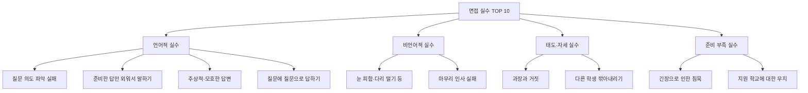
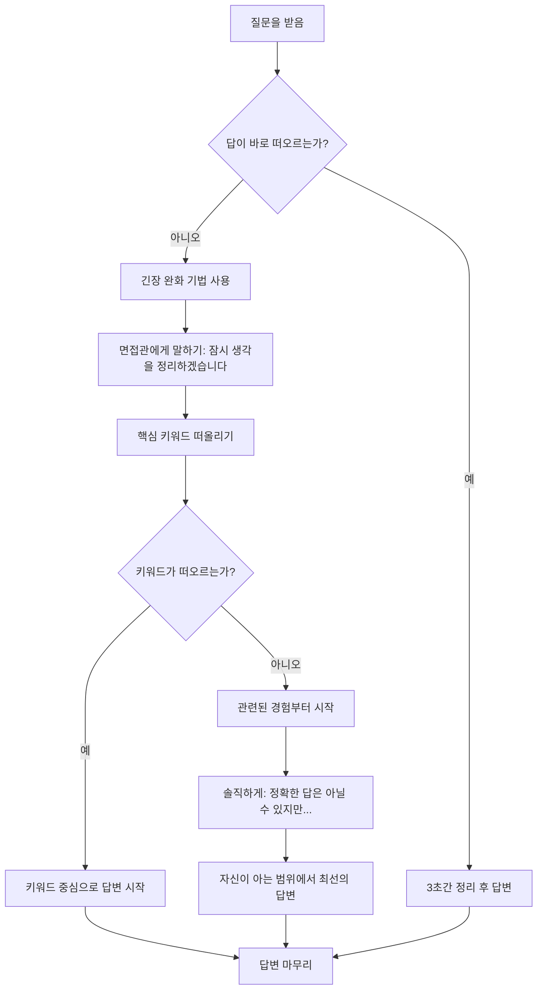
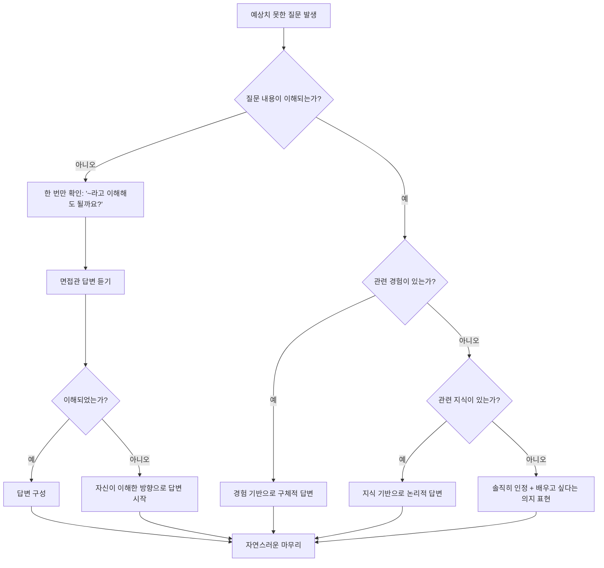
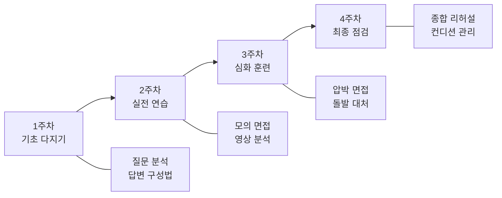

# 면접 실수 TOP 10과 대처법

> 면접은 단 10~20분 안에 합격과 불합격이 결정되는 중요한 관문입니다. 아무리 내신과 비교과가 훌륭해도 면접에서의 실수 하나가 모든 노력을 물거품으로 만들 수 있습니다. 이 가이드에서는 수험생들이 가장 자주 저지르는 10가지 면접 실수를 분석하고, 각 실수에 대한 구체적인 대처법과 연습 방법을 제시합니다.

---

## 목차

1. [실수 1: 질문 의도 파악 실패](#실수-1-질문-의도-파악-실패)
2. [실수 2: 준비한 답만 외워서 말하기](#실수-2-준비한-답만-외워서-말하기)
3. [실수 3: 추상적·모호한 답변](#실수-3-추상적모호한-답변)
4. [실수 4: 과장과 거짓](#실수-4-과장과-거짓)
5. [실수 5: 긴장으로 인한 침묵](#실수-5-긴장으로-인한-침묵)
6. [실수 6: 지원 학교에 대한 무지](#실수-6-지원-학교에-대한-무지)
7. [실수 7: 비언어적 실수](#실수-7-비언어적-실수)
8. [실수 8: 질문에 질문으로 답하기](#실수-8-질문에-질문으로-답하기)
9. [실수 9: 다른 학생 깎아내리기](#실수-9-다른-학생-깎아내리기)
10. [실수 10: 마무리 인사 실패](#실수-10-마무리-인사-실패)
11. [면접관이 실제로 보는 5가지 포인트](#면접관이-실제로-보는-5가지-포인트)
12. [실수 예방 훈련 프로그램 (4주 플랜)](#실수-예방-훈련-프로그램-4주-플랜)
13. [면접 시뮬레이션 체크시트](#면접-시뮬레이션-체크시트)

---

## 면접 실수 전체 구조도

---

## 실수 1: 질문 의도 파악 실패

### 실수 설명

면접관의 질문이 표면적으로 묻고 있는 것과 실제로 알고 싶은 것이 다른 경우가 많습니다. 질문의 겉뜻만 파악하고 답변하면, 면접관이 원하는 핵심 정보를 전달하지 못하게 됩니다. 예를 들어 "가장 좋아하는 과목이 무엇인가요?"라는 질문은 단순히 과목명을 묻는 것이 아니라, 학습에 대한 열정과 깊이 있는 탐구 경험을 확인하려는 의도입니다.

### 왜 감점되는가

면접관은 제한된 시간 안에 지원자의 역량을 파악해야 합니다. 질문 의도를 파악하지 못한 답변은 다음과 같은 이유로 감점됩니다.

- 의사소통 능력 부족으로 판단됨
- 질문을 분석하는 사고력이 부족하다는 인상을 줌
- 핵심을 파악하지 못하면 학업 수행 능력도 의심받음
- 면접관이 추가 질문으로 시간을 낭비하게 됨

### 실제 사례

**시나리오:** 외국어고 면접에서 면접관이 "최근에 읽은 영어 원서 중 기억에 남는 것이 있나요?"라고 질문했습니다.

- **잘못된 대응:** "해리포터를 읽었습니다. 재미있었습니다." (단순 사실 나열)
- **문제점:** 면접관은 영어 독해력, 문학적 감수성, 자기주도적 학습 태도를 보고 싶었으나, 지원자는 책 제목과 단순 감상만 전달함

### Before/After 비교

| 구분 | 나쁜 예 | 좋은 예 |
|------|---------|---------|
| 답변 | "해리포터를 읽었습니다. 재미있었습니다." | "To Kill a Mockingbird를 읽었습니다. 인종 차별이라는 무거운 주제를 어린아이의 시선으로 풀어낸 점이 인상적이었고, 원서로 읽으면서 시대적 맥락이 담긴 표현들을 이해하기 위해 1930년대 미국 남부의 역사도 함께 공부했습니다." |
| 의도 파악 | 질문 표면만 파악 | 영어 능력 + 분석력 + 자기주도 학습 모두 전달 |
| 면접관 반응 | 추가 질문 필요 | 후속 질문으로 깊이 탐색 가능 |
| 예상 점수 | 하 | 상 |

### 대처법

1. **질문을 들으면 3초간 생각하기:** 바로 답하지 말고, "이 질문의 숨겨진 의도가 무엇일까?"를 먼저 파악합니다.
2. **키워드 분석법 활용:** 질문에서 핵심 키워드를 추출하고, 그 키워드와 관련된 역량이 무엇인지 연결합니다.
3. **WHAT-WHY-HOW 프레임:** 무엇을(WHAT), 왜(WHY), 어떻게(HOW) 했는지를 포함하여 답변을 구성합니다.

### 연습 방법

- 기출 면접 질문 50개를 모아서 각 질문의 "표면적 의미"와 "숨겨진 의도"를 표로 정리합니다.
- 가족이나 친구에게 질문을 받고, 답변 전에 의도를 먼저 말해보는 연습을 합니다.
- 녹음하여 자신의 답변이 질문 의도에 부합하는지 검토합니다.

---

## 실수 2: 준비한 답만 외워서 말하기

### 실수 설명

면접을 준비하면서 예상 질문에 대한 답변을 통째로 외우는 학생들이 많습니다. 이렇게 암기한 답변은 자연스럽지 못하고, 면접관이 조금만 다른 각도로 질문해도 대응하지 못하게 됩니다. 면접관은 수백 명의 학생을 면접하기 때문에, 외운 답변은 즉시 구분할 수 있습니다.

### 왜 감점되는가

- 진정성이 없다고 느껴짐
- 변형 질문에 대응하지 못해 사고력 부족으로 판단됨
- 로봇처럼 말하면 감정적 교감이 불가능
- 예상치 못한 질문에서 급격히 답변 품질이 떨어져 준비 편차가 드러남

### 실제 사례

**시나리오:** 과학고 면접에서 지원자가 "과학을 좋아하게 된 계기"에 대해 완벽하게 외운 답변을 했습니다. 면접관이 "그 실험에서 예상과 다른 결과가 나왔을 때 어떻게 했나요?"라는 후속 질문을 하자, 지원자는 당황하며 아무 말도 하지 못했습니다.

- **문제점:** 답변의 내용은 좋았지만, 그것이 진짜 자신의 경험인지 의심받게 됨
- **결과:** 진정성 항목에서 큰 감점을 받음

### Before/After 비교

| 구분 | 나쁜 예 | 좋은 예 |
|------|---------|---------|
| 말투 | "저는 초등학교 3학년 때 과학관을 방문하여 물리 실험을 관람한 후 과학에 대한 열정을 갖게 되었습니다." (문어체, 경직됨) | "초등학교 3학년 때 과학관에서 전자석 실험을 봤는데요, 전기를 넣으니까 쇠못이 붙는 게 정말 신기했어요. 그때부터 집에서도 비슷한 실험을 해보기 시작했습니다." (구어체, 자연스러움) |
| 후속 질문 대응 | 당황하며 침묵 | 실제 경험을 바탕으로 자연스럽게 이어감 |
| 눈빛 | 허공을 보며 암기한 내용 떠올림 | 면접관과 자연스럽게 눈을 맞추며 대화 |
| 전체 인상 | "이 학생, 답을 외웠구나" | "이 학생, 진짜 경험이구나" |

### 대처법

1. **키워드 메모법:** 전체 문장을 외우지 말고, 핵심 키워드 3~5개만 기억합니다.
2. **경험 기반 답변:** 실제 경험을 떠올리며 그때의 감정과 생각을 함께 전달합니다.
3. **구어체로 연습:** 쓸 때와 말할 때의 문체를 구분합니다. 면접은 대화이므로 말하듯이 답변합니다.
4. **변형 질문 대비:** 하나의 주제에 대해 5가지 이상의 각도에서 질문을 만들어 연습합니다.

### 연습 방법

- 답변을 글로 쓴 후, 그 글을 보지 않고 같은 내용을 자신의 말로 다시 설명하는 연습을 합니다.
- 친구와 함께 서로 예상치 못한 후속 질문을 던지는 연습을 합니다.
- 같은 질문에 대해 매번 다른 표현으로 답변하는 훈련을 합니다.

---

## 실수 3: 추상적·모호한 답변

### 실수 설명

"열심히 했습니다", "많은 것을 배웠습니다", "좋은 경험이었습니다"와 같은 추상적인 표현은 면접관에게 어떤 구체적인 정보도 전달하지 못합니다. 면접관은 지원자만의 고유한 경험과 구체적인 성과를 듣고 싶어 합니다.

### 왜 감점되는가

- 다른 지원자와 차별화되지 않음
- 실제로 경험했는지 의심받음
- 면접관이 지원자의 역량을 평가할 수 있는 근거가 없음
- 사고의 깊이가 부족하다는 인상을 줌

### 실제 사례

**시나리오:** 자율형 사립고 면접에서 "봉사활동 경험에서 무엇을 배웠나요?"라는 질문을 받았습니다.

- **잘못된 답변:** "봉사활동을 통해 나눔의 가치를 배웠고, 많은 것을 느꼈습니다. 앞으로도 꾸준히 봉사를 하겠습니다."
- **문제점:** "나눔의 가치", "많은 것을 느꼈다"는 누구나 할 수 있는 말이며, 이 학생만의 이야기가 없음

### Before/After 비교

| 구분 | 나쁜 예 | 좋은 예 |
|------|---------|---------|
| 봉사활동 답변 | "봉사를 통해 나눔의 소중함을 배웠습니다." | "요양원에서 6개월간 매주 토요일 어르신들께 책을 읽어드렸는데, 처음엔 반응이 없으시던 할머니 한 분이 3개월 뒤에는 제가 오면 먼저 어떤 책을 가져왔는지 물어보셨어요. 그때 꾸준함이 관계를 만든다는 걸 직접 느꼈습니다." |
| 구체성 | 추상적, 일반론 | 기간, 장소, 구체적 에피소드 포함 |
| 차별성 | 누구나 할 수 있는 답변 | 이 학생만의 고유한 경험 |
| 설득력 | 낮음 | 높음 |

### 대처법

1. **STAR 기법 활용:**
   - **S(Situation):** 상황을 구체적으로 설명
   - **T(Task):** 자신의 역할과 과제
   - **A(Action):** 실제로 한 행동
   - **R(Result):** 결과와 배운 점
2. **숫자와 사실로 뒷받침:** "여러 번"이 아니라 "6개월간 24회", "많이"가 아니라 "3배"처럼 구체적인 수치를 사용합니다.
3. **오감 활용:** 그때의 장면, 소리, 감정을 떠올리며 생생하게 전달합니다.

### 연습 방법

- 자기소개서에 쓴 모든 경험을 STAR 기법으로 재정리합니다.
- "추상적 표현 금지 게임": 연습할 때 "열심히", "많이", "좋았다" 등의 표현을 사용하면 처음부터 다시 답변합니다.
- 각 경험에 대해 구체적인 숫자 3개 이상을 포함하여 답변하는 훈련을 합니다.

---

## 실수 4: 과장과 거짓

### 실수 설명

자신을 돋보이게 하려는 마음에 경험을 과장하거나, 하지 않은 활동을 한 것처럼 말하는 경우입니다. 면접관은 학생부와 자기소개서를 면밀히 검토한 상태에서 면접을 진행하므로, 제출 서류와 답변 사이의 불일치를 즉시 감지합니다.

### 왜 감점되는가

- 인성 영역에서 치명적인 감점 요인
- 한 번이라도 거짓이 드러나면 다른 모든 답변의 신뢰도가 무너짐
- 학교 공동체에서 신뢰받지 못할 사람이라는 인상을 줌
- 과장이 드러날 경우 불합격의 직접적 원인이 됨

### 실제 사례

**시나리오:** 영재학교 면접에서 지원자가 "수학 경시대회에서 독자적으로 새로운 풀이법을 고안했다"고 말했습니다. 면접관이 그 풀이법을 칠판에 써보라고 요청하자, 지원자는 제대로 설명하지 못했습니다.

- **결과:** 면접관은 그 풀이법이 본인의 것이 아님을 확인하고, 해당 지원자의 모든 답변에 대해 의문을 품게 되었습니다.
- **교훈:** 과장은 단기적 이익보다 장기적 손해가 훨씬 큽니다.

### Before/After 비교

| 구분 | 나쁜 예 (과장) | 좋은 예 (솔직) |
|------|---------------|---------------|
| 역할 서술 | "팀 프로젝트를 제가 혼자 이끌었습니다." | "팀 프로젝트에서 자료 조사 파트를 맡았는데, 처음 맡은 역할이라 시행착오가 있었지만 3주간의 조사를 통해 팀 발표의 근거 자료를 완성했습니다." |
| 성과 표현 | "전교 1등을 했습니다." | "수학 성적이 중1 때 반에서 중위권이었는데, 매일 1시간씩 문제를 풀고 오답노트를 작성한 결과 중3에는 상위 10%까지 올랐습니다." |
| 면접관 반응 | "정말요? 좀 더 자세히 말해보세요." (의심) | "꾸준히 노력했군요. 어떤 방법이 가장 효과적이었나요?" (관심) |
| 신뢰도 | 낮음 (후속 질문에서 무너짐) | 높음 (일관된 답변 가능) |

### 대처법

1. **자기 경험의 진짜 가치를 찾기:** 작은 경험이라도 거기서 배운 진짜 교훈이 있다면, 그것이 과장된 큰 경험보다 훨씬 값집니다.
2. **성장 서사 활용:** 처음부터 잘한 이야기보다, 부족했던 점을 인정하고 성장한 과정이 더 설득력 있습니다.
3. **검증 가능한 내용만 말하기:** "면접관이 확인할 수 있을까?"를 기준으로 답변을 점검합니다.

### 연습 방법

- 학생부의 모든 활동에 대해 "내가 실제로 한 것"과 "다른 사람이 한 것"을 명확히 구분하는 표를 작성합니다.
- 부모님이나 선생님에게 자신의 면접 답변을 들려주고, 과장된 부분이 있는지 피드백을 받습니다.
- 모든 답변에 대해 "면접관이 추가 질문을 3번 더 하면 일관성 있게 답할 수 있는가?"를 검증합니다.

---

## 실수 5: 긴장으로 인한 침묵

### 실수 설명

면접장에서 긴장하여 머릿속이 백지가 되고, 아무 말도 하지 못한 채 긴 침묵이 이어지는 경우입니다. 적절한 사고 시간(3~5초)은 자연스럽지만, 10초 이상의 침묵은 면접 분위기를 어색하게 만들고 시간을 낭비하게 됩니다.

### 왜 감점되는가

- 제한된 면접 시간 중 상당 부분을 침묵으로 소비하게 됨
- 스트레스 상황에서의 대처 능력이 부족하다고 평가됨
- 해당 주제에 대한 이해가 부족하다고 판단될 수 있음
- 면접관과의 소통 자체가 원활하지 않다는 인상을 줌

### 실제 사례

**시나리오:** 국제고 면접에서 "최근 국제 뉴스 중 관심 있는 이슈에 대해 말해보세요"라는 질문을 받았습니다. 지원자는 뉴스를 준비하지 않아 15초간 아무 말도 하지 못했고, 면접관이 "천천히 생각해봐도 됩니다"라고 말해줬으나 결국 "잘 모르겠습니다"라고만 답했습니다.

- **문제점:** 준비 부족과 긴장이 겹쳐 최악의 상황이 발생
- **결과:** 시사 관심도와 위기 대처 능력 모두에서 낮은 점수를 받음

### 긴장 대처 흐름도

### Before/After 비교

| 구분 | 나쁜 예 | 좋은 예 |
|------|---------|---------|
| 모르는 질문 | (15초 침묵) "잘 모르겠습니다." | "잠시 생각을 정리하겠습니다. (3초 후) 정확한 답은 아닐 수 있지만, 제가 관심 있게 본 관련 주제로 말씀드려도 될까요?" |
| 긴장 표현 | 말을 더듬고 시선을 피함 | "조금 긴장이 되지만, 최선을 다해 답변드리겠습니다." (솔직한 인정) |
| 분위기 | 어색한 침묵이 지속 | 자연스러운 대화 흐름 유지 |
| 면접관 인상 | 준비 부족, 대처 능력 부족 | 솔직하고 유연한 태도 |

### 대처법

1. **"잠시 생각을 정리하겠습니다" 공식:** 침묵 대신 이 말로 시간을 벌 수 있습니다.
2. **호흡 조절법:** 긴장이 오면 코로 4초 들이쉬고, 입으로 6초 내쉽니다.
3. **앵커링 기법:** 손가락을 가볍게 쥐는 등 미리 정해둔 동작으로 안정감을 찾습니다.
4. **최악의 시나리오 대비:** 정말 모르는 질문이 나왔을 때의 답변 공식을 미리 준비합니다.

### 연습 방법

- 일부러 모르는 주제에 대한 질문을 받고, 침묵 없이 대응하는 연습을 합니다.
- 면접 시뮬레이션에서 타이머를 사용하여 침묵 시간을 측정합니다.
- 매일 아침 무작위 주제(뉴스 헤드라인, 사물 등)에 대해 30초간 즉흥 발표하는 훈련을 합니다.

---

## 실수 6: 지원 학교에 대한 무지

### 실수 설명

지원한 학교의 교육 철학, 특색 프로그램, 인재상 등에 대해 전혀 모르거나 잘못 알고 있는 경우입니다. "왜 우리 학교에 지원했나요?"는 거의 모든 면접에서 나오는 질문이며, 이때 학교에 대한 이해도가 드러납니다.

### 왜 감점되는가

- 학교에 대한 관심과 지원 동기의 진정성이 의심됨
- "아무 학교나 지원했구나"라는 인상을 줌
- 학교의 교육 프로그램과 자신의 진로가 연결되지 않으면, 입학 후 적응 가능성에 의문이 생김
- 기본적인 사전 조사도 하지 않은 것은 성실성 부족의 신호

### 실제 사례

**시나리오:** 외국어고 면접에서 "우리 학교의 어떤 프로그램에 관심이 있나요?"라는 질문에 지원자가 "국제 교류 프로그램이 좋다고 들었습니다"라고 답했으나, 면접관이 "구체적으로 어떤 국제 교류 프로그램을 말하는 건가요?"라고 물었을 때 "잘은 모르지만 외국 학교와 교류하는 것으로 알고 있습니다"라고 답했습니다.

- **문제점:** 학교 홈페이지에 상세히 안내된 프로그램을 제대로 조사하지 않음
- **결과:** 지원 동기의 진정성에서 큰 감점

### Before/After 비교

| 구분 | 나쁜 예 | 좋은 예 |
|------|---------|---------|
| 지원 동기 | "외국어를 잘 배울 수 있을 것 같아서 지원했습니다." | "학교의 Dual Diploma 프로그램을 통해 국내 학위와 해외 학위를 동시에 취득할 수 있다는 점에 매력을 느꼈고, 특히 2학년 때 참여할 수 있는 자매학교 교환학생 프로그램에서 직접 현지 문화를 체험하며 언어 능력을 키우고 싶습니다." |
| 프로그램 이해 | "프로그램이 좋다고 들었습니다." | "학교의 Creative Research 프로그램에서 학생이 직접 주제를 선정하고 1년간 연구하는 방식이 제가 추구하는 자기주도 학습과 잘 맞습니다." |
| 구체성 | 막연하고 피상적 | 프로그램명, 내용, 자신과의 연결 모두 구체적 |
| 면접관 판단 | "이 학생은 우리 학교를 잘 모르는구나" | "이 학생은 정말 우리 학교에 관심이 있구나" |

### 대처법

1. **학교 홈페이지 완전 정복:** 교육 과정, 특색 프로그램, 동아리, 행사, 졸업생 진로 등을 모두 파악합니다.
2. **학교 인재상과 나의 연결:** 학교가 추구하는 인재상과 자신의 역량을 구체적으로 연결합니다.
3. **재학생/졸업생 인터뷰:** 가능하다면 재학생이나 졸업생에게 학교 생활에 대해 직접 물어봅니다.
4. **학교 뉴스 검색:** 최근 학교가 언론에 보도된 내용을 파악합니다.

### 연습 방법

- 학교 정보 노트를 만들어 교육 철학, 프로그램, 인재상, 교훈 등을 정리합니다.
- "왜 우리 학교인가?"에 대한 답변을 5가지 이상의 구체적 근거로 준비합니다.
- 학교 홈페이지의 주요 프로그램을 자신의 진로와 연결하는 표를 작성합니다.

---

## 실수 7: 비언어적 실수

### 실수 설명

면접에서 말의 내용만큼 중요한 것이 비언어적 커뮤니케이션입니다. 눈을 피하거나, 다리를 떨거나, 손을 만지작거리거나, 고개를 숙이거나, 목소리가 너무 작은 것 등이 대표적인 비언어적 실수입니다. 면접관은 지원자의 자신감, 성실성, 소통 능력을 비언어적 신호를 통해서도 평가합니다.

### 왜 감점되는가

- 자신감이 없다는 인상을 줌
- 답변의 신뢰도가 떨어짐 (말과 행동이 불일치)
- 학교생활에서의 발표, 토론 등 소통 능력에 의문이 생김
- 불안정한 태도는 면접관도 불편하게 만듦

### 실제 사례

**시나리오:** 과학고 면접에서 지원자의 답변 내용은 우수했으나, 면접 내내 시선이 바닥을 향해 있었고, 양손으로 계속 볼펜을 돌리고 있었습니다. 면접관 3명 중 2명이 비언어적 평가에서 낮은 점수를 주었습니다.

- **문제점:** 좋은 답변도 비언어적 실수로 인해 진정성과 자신감이 의심됨
- **교훈:** 내용과 태도가 모두 갖춰져야 높은 점수를 받을 수 있음

### 주요 비언어적 실수와 교정법

| 비언어적 실수 | 면접관의 해석 | 교정 방법 |
|--------------|-------------|-----------|
| 눈을 피함 | 자신감 부족, 거짓말 가능성 | 면접관의 미간~코 사이를 보는 연습 |
| 다리 떨기 | 불안, 집중력 부족 | 양발을 바닥에 단단히 붙이고 앉는 자세 훈련 |
| 손 만지작거림 | 불안, 산만함 | 양손을 무릎 위에 자연스럽게 올려놓기 |
| 고개 숙임 | 소극적, 자존감 부족 | 턱을 약간 들어 정면을 바라보는 자세 |
| 목소리 너무 작음 | 자신감 부족, 준비 부족 | 면접장 맨 뒷줄에도 들릴 정도의 성량 연습 |
| 말 속도 너무 빠름 | 긴장, 조급함 | 한 문장 끝날 때마다 숨 쉬기 |
| 표정 경직 | 불편함, 방어적 태도 | 거울 앞에서 미소 연습, 자연스러운 표정 훈련 |
| 팔짱 끼기 | 방어적, 거부감 | 열린 자세 유지 |

### Before/After 비교

| 구분 | 나쁜 예 | 좋은 예 |
|------|---------|---------|
| 시선 | 바닥 또는 천장을 바라봄 | 면접관과 자연스럽게 눈을 맞추되, 3명이면 골고루 시선 분배 |
| 자세 | 등을 구부리고 움츠린 자세 | 등을 펴고 의자에 약간 기대지 않은 상태로 앉음 |
| 손 | 볼펜 돌리기, 손톱 뜯기 | 양손을 자연스럽게 무릎 위에 올리거나 가볍게 제스처 사용 |
| 목소리 | 기어들어가는 목소리 | 적절한 크기로 또렷하게, 강조할 부분에서는 약간의 억양 변화 |

### 대처법

1. **거울 면접법:** 거울 앞에서 답변 연습을 하며 자신의 표정과 자세를 관찰합니다.
2. **영상 촬영 분석:** 모의 면접을 영상으로 촬영하여 비언어적 습관을 객관적으로 파악합니다.
3. **파워 포즈:** 면접 직전 화장실에서 2분간 가슴을 펴고 양손을 허리에 대는 자세를 취하면 자신감이 높아집니다.
4. **미소 연습:** 면접 시작과 끝에 자연스러운 미소를 짓는 연습을 합니다.

### 연습 방법

- 매일 거울 앞에서 3분간 자기소개를 하며 비언어적 요소를 체크합니다.
- 가족 앞에서 모의 면접을 하고 비언어적 습관에 대한 피드백을 받습니다.
- 스마트폰으로 모의 면접 영상을 촬영하고, 음소거 상태에서 시청하여 비언어적 요소만 집중적으로 분석합니다.

---

## 실수 8: 질문에 질문으로 답하기

### 실수 설명

면접관의 질문에 답하지 않고, 되묻거나 질문의 의미를 다시 물어보는 행위를 반복하는 것입니다. 물론 질문이 정말로 이해되지 않을 때 한 번 정도 확인하는 것은 자연스럽지만, 이것이 습관적으로 반복되면 문제가 됩니다.

### 왜 감점되는가

- 질문 이해력이 부족하다고 판단됨
- 시간을 회피하려는 전략으로 보일 수 있음
- 면접 흐름이 끊기고 분위기가 어색해짐
- 자신감이 없어 답변을 회피하는 것으로 해석됨

### 실제 사례

**시나리오:** 자율형 사립고 면접에서 다음과 같은 상황이 발생했습니다.

- **면접관:** "학교생활에서 갈등을 겪었던 경험이 있나요?"
- **지원자:** "갈등이요? 어떤 종류의 갈등을 말씀하시는 건가요?"
- **면접관:** "친구와의 갈등이든, 학업에서의 갈등이든 자유롭게 말해도 됩니다."
- **지원자:** "아, 그러니까 친구 사이의 갈등을 말하는 건가요, 아니면 내면의 갈등을 말하는 건가요?"
- **결과:** 질문을 두 번이나 되물어 시간을 낭비했고, 면접관은 답변 회피로 판단

### Before/After 비교

| 구분 | 나쁜 예 | 좋은 예 |
|------|---------|---------|
| 반응 | "그게 무슨 말씀이신지 정확히 모르겠는데요?" | "네, 학교생활에서 겪은 갈등으로 말씀드리면, 2학년 때 조별 과제에서 역할 분담 문제로 친구와 의견이 충돌한 적이 있었습니다." |
| 횟수 | 여러 번 반복하여 되물음 | 질문이 불명확할 때 한 번만 짧게 확인 |
| 인상 | 답변 회피, 이해력 부족 | 즉각적이고 구체적인 답변 |
| 시간 활용 | 질문에 시간 낭비 | 답변에 시간 집중 |

### 대처법

1. **포괄적으로 답변하기:** 질문이 넓게 열려 있다면, 자신에게 유리한 방향을 골라서 답변합니다.
2. **한 번만 확인하기:** 정말 이해가 안 되면 한 번만 짧게 확인하고, 그 이상은 되묻지 않습니다.
3. **"~로 이해하고 답변드리겠습니다" 공식:** 질문의 범위를 스스로 좁혀서 답변을 시작합니다.

### 연습 방법

- 연습 때 일부러 애매한 질문을 받고, 되묻지 않고 즉시 답변하는 훈련을 합니다.
- "질문에 질문으로 답하면 벌칙" 규칙으로 모의 면접을 진행합니다.
- 열린 질문에 대해 자신에게 유리한 방향을 빠르게 선택하는 의사결정 훈련을 합니다.

---

## 실수 9: 다른 학생 깎아내리기

### 실수 설명

자신을 돋보이게 하기 위해 다른 지원자나 같은 학교 학생들을 비하하거나 비교하며 깎아내리는 행위입니다. "다른 학생들은 이런 경험이 없을 텐데 저는 했습니다"와 같은 발언이 대표적입니다.

### 왜 감점되는가

- 인성과 협동심에서 심각한 감점
- 학교 공동체에서 갈등을 일으킬 수 있는 인물로 평가됨
- 겸손함과 배려심이 부족하다는 인상을 줌
- 면접관이 함께 교육할 학생을 선발하는 입장에서, 이런 태도의 학생은 기피 대상

### 실제 사례

**시나리오:** 그룹 면접(집단토론)에서 지원자 A가 자신의 의견을 말하면서 "방금 옆의 학생이 말한 것은 완전히 틀렸고, 제가 제대로 된 답을 말씀드리겠습니다"라고 했습니다.

- **문제점:** 다른 학생의 의견을 존중하지 않고 직접적으로 부정함
- **결과:** 내용이 맞더라도 인성 평가에서 큰 감점

**시나리오 2:** 개별 면접에서 "저희 학교 학생들은 대부분 공부에 관심이 없는데, 저만 유일하게 열심히 했습니다"라고 답한 경우.

- **문제점:** 자신이 다니는 학교와 동급생들을 비하함으로써, 오히려 자신의 환경 적응력과 리더십에 의문이 생김

### Before/After 비교

| 구분 | 나쁜 예 | 좋은 예 |
|------|---------|---------|
| 비교 방식 | "다른 학생들과 달리 저는..." | "저는 이런 경험을 했고, 이를 통해 이런 점을 배웠습니다." (비교 없이 자기 이야기에 집중) |
| 토론 시 | "그건 틀린 의견이고, 제 의견이 맞습니다." | "그 의견도 일리가 있습니다. 거기에 더해서 저는 이런 관점도 있다고 생각합니다." |
| 학교 언급 | "우리 학교 수준이 낮아서..." | "제가 다니는 학교에서 다양한 활동을 했고, 특히 선생님들의 지도 덕분에 많이 성장했습니다." |
| 전체 인상 | 이기적, 비협조적 | 협동적, 겸손한 |

### 대처법

1. **자기 이야기에만 집중하기:** 다른 사람과 비교하지 않고, 순수하게 자신의 경험과 성장만 이야기합니다.
2. **토론에서는 "더하기" 전략:** "그건 틀렸다"가 아니라 "거기에 더해서"로 시작합니다.
3. **학교와 환경에 감사 표현:** 자신이 속한 공동체를 긍정적으로 언급합니다.

### 연습 방법

- 모의 면접에서 다른 학생을 언급하지 않고 자신만의 이야기로 답변하는 훈련을 합니다.
- 토론 연습에서 상대 의견을 인정하는 문장으로 시작하는 규칙을 적용합니다.
- 답변에 비교 표현("다른 학생들과 달리", "유일하게" 등)이 포함되어 있으면 수정합니다.

---

## 실수 10: 마무리 인사 실패

### 실수 설명

면접이 끝날 때의 마무리 인사를 소홀히 하거나, 갑자기 일어나서 나가거나, 어색하게 끝내는 경우입니다. 마지막 인상은 첫인상만큼 중요하며, 초두 효과(첫인상)와 함께 최신 효과(마지막 인상)가 면접 평가에 큰 영향을 미칩니다.

### 왜 감점되는가

- 면접의 마무리가 어색하면 전체적인 인상이 나빠짐
- 예의와 매너가 부족하다는 인상을 줌
- 면접에 대한 감사함과 진정성이 전달되지 않음
- 최신 효과로 인해 마지막 인상이 전체 평가에 큰 영향을 미침

### 실제 사례

**시나리오:** 면접이 끝나고 면접관이 "수고했어요"라고 말하자, 지원자가 "네"라고만 하고 고개를 숙인 채 급히 문을 열고 나갔습니다. 의자도 정리하지 않았고, 문을 닫을 때도 뒤돌아보지 않았습니다.

- **문제점:** 아무리 면접 내용이 좋았어도, 마지막 이미지가 좋지 않으면 전체 인상이 하락함
- **비교:** 같은 날 면접을 본 다른 지원자는 일어나서 허리를 숙여 인사하고, "좋은 질문들 감사했습니다. 앞으로도 열심히 하겠습니다"라고 말한 후 조용히 문을 닫고 나갔습니다.

### Before/After 비교

| 구분 | 나쁜 예 | 좋은 예 |
|------|---------|---------|
| 인사 | "네, 감사합니다." (앉은 채) | (일어서서 바른 자세로) "면접 기회를 주셔서 감사합니다. 좋은 질문들 덕분에 저도 많이 생각할 수 있었습니다." |
| 자세 | 급히 일어나 나감 | 의자를 정리하고, 허리를 숙여 인사 후 차분하게 퇴장 |
| 문 닫기 | 뒤돌아보지 않고 쿵 닫음 | 문 앞에서 한 번 더 가볍게 인사하고 조용히 닫음 |
| 전체 인상 | 급하고 무례함 | 차분하고 예의 바름 |

### 대처법

1. **마무리 인사 공식을 준비:**
   - "면접 기회를 주셔서 감사합니다."
   - "좋은 질문 덕분에 많이 생각할 수 있었습니다."
   - "꼭 입학해서 열심히 하고 싶습니다."
2. **퇴장 동선 연습:** 일어서기 - 의자 정리 - 인사 - 문으로 이동 - 문 앞 인사 - 조용히 닫기
3. **마지막까지 집중:** 면접이 끝났다고 방심하지 않고, 면접장을 나설 때까지 바른 태도를 유지합니다.

### 연습 방법

- 실제 면접장 환경을 세팅하고(의자, 문 등) 입장부터 퇴장까지 전 과정을 리허설합니다.
- 마무리 인사를 3가지 버전으로 준비하고, 상황에 맞게 선택할 수 있도록 연습합니다.
- 가족에게 면접관 역할을 맡기고, 퇴장 과정에 대한 피드백을 받습니다.

---

## 예상치 못한 질문 대응 의사결정 트리

---

## 면접관이 실제로 보는 5가지 포인트

면접관은 지원자를 평가할 때 단순히 답변의 내용만 보는 것이 아닙니다. 다음 5가지 포인트를 종합적으로 평가합니다.

### 1. 진정성 (Authenticity)

지원자가 말하는 내용이 진심에서 우러나온 것인지를 평가합니다. 외운 답변, 과장된 경험, 거짓된 열정은 경험 많은 면접관에게 쉽게 간파됩니다. 진정성은 구체적인 에피소드, 실패를 인정하는 솔직함, 감정이 담긴 표현 등에서 드러납니다.

**평가 포인트:**
- 경험을 말할 때 구체적인 장면이 떠오르는가
- 실패와 부족함을 솔직히 인정하는가
- 후속 질문에 일관된 답변을 하는가
- 말투가 자연스럽고 진심이 느껴지는가

### 2. 사고력 (Critical Thinking)

질문의 의도를 파악하고, 논리적으로 생각을 정리하여 답변하는 능력을 평가합니다. 단순 암기식 답변이 아니라, 자신만의 관점과 분석이 담긴 답변을 높이 평가합니다.

**평가 포인트:**
- 질문의 핵심을 파악하고 있는가
- 논리적 구조로 답변을 전개하는가
- 자신만의 관점이 있는가
- 복합적 질문에서 다양한 측면을 고려하는가

### 3. 인성 (Character)

학교 공동체의 일원으로서 적합한 인성을 갖추고 있는지를 평가합니다. 다른 사람에 대한 존중, 겸손함, 협동심, 감사하는 마음 등이 핵심입니다.

**평가 포인트:**
- 다른 사람을 존중하는 태도가 보이는가
- 감사와 배려의 마음이 있는가
- 갈등 상황에서 성숙한 대처를 하는가
- 공동체 의식이 있는가

### 4. 성장 가능성 (Growth Potential)

현재의 완벽함보다는, 앞으로 얼마나 성장할 수 있는 잠재력이 있는지를 평가합니다. 자기주도적 학습 능력, 목표 의식, 좌절에서 회복하는 힘 등이 평가됩니다.

**평가 포인트:**
- 명확한 목표와 계획이 있는가
- 어려움을 극복한 경험이 있는가
- 자기주도적으로 학습하는 습관이 있는가
- 피드백을 수용하고 개선하는 태도가 있는가

### 5. 소통 능력 (Communication)

자신의 생각을 명확하게 전달하고, 상대방의 말을 경청하는 능력을 평가합니다. 언어적 표현뿐 아니라 비언어적 소통(눈 맞춤, 표정, 자세)도 포함됩니다.

**평가 포인트:**
- 자신의 생각을 논리적으로 전달하는가
- 적절한 어휘와 문장 구조를 사용하는가
- 비언어적 소통이 자연스러운가
- 면접관의 질문을 경청하고 있는가

### 면접 평가 배점표 (일반적 기준)

| 평가 영역 | 배점 | 상 (90점 이상) | 중 (70~89점) | 하 (70점 미만) |
|-----------|------|---------------|-------------|---------------|
| 진정성 | 25점 | 구체적 경험, 솔직한 태도, 후속 질문에 일관된 답변 | 대체로 진실하나 일부 과장 | 외운 답변, 과장이 눈에 띔, 후속 질문에서 모순 |
| 사고력 | 25점 | 질문 의도 정확히 파악, 논리적 구조, 독창적 관점 | 기본적 이해와 논리 구조 있으나 깊이 부족 | 질문 의도 파악 실패, 비논리적, 피상적 답변 |
| 인성 | 20점 | 타인 존중, 겸손, 감사, 배려가 자연스럽게 드러남 | 기본적인 예의 있으나 적극적 배려 부족 | 타인 비하, 무례한 태도, 이기적 발언 |
| 성장 가능성 | 15점 | 명확한 목표, 자기주도 학습, 회복탄력성 | 목표는 있으나 구체성 부족 | 목표 불명확, 수동적 태도 |
| 소통 능력 | 15점 | 명확한 전달, 적절한 비언어적 소통, 경청 | 기본적 전달 가능하나 비언어적 소통 부족 | 전달력 부족, 비언어적 실수 많음 |

### 면접관 유형별 주의사항

| 면접관 유형 | 특징 | 주의할 점 |
|------------|------|-----------|
| 학교장/교감 | 인성과 학교 적합성 중시 | 학교 교육 철학과의 연결, 공동체 의식 강조 |
| 교과 담당 교사 | 학업 역량과 지적 호기심 확인 | 교과 관련 구체적 경험과 탐구 과정 강조 |
| 외부 면접관 | 전반적 인성과 소통 능력 평가 | 자연스러운 대화 흐름, 겸손한 태도 |
| 집단토론 면접관 | 협동심과 리더십 평가 | 경청과 존중, 건설적 의견 제시 |

---

## 실수 예방 훈련 프로그램 (4주 플랜)

4주간의 체계적인 훈련을 통해 면접 실수를 예방하고, 최상의 컨디션으로 면접에 임할 수 있습니다.

### 훈련 프로그램 전체 흐름

### 1주차: 기초 다지기

| 요일 | 오전 활동 (30분) | 오후 활동 (30분) | 저녁 활동 (30분) |
|------|----------------|----------------|----------------|
| 월 | 면접 기출 질문 20개 수집 및 의도 분석 | STAR 기법으로 자기 경험 5개 정리 | 거울 앞 자기소개 연습 (3분) |
| 화 | 지원 학교 홈페이지 정독 및 노트 정리 | "왜 우리 학교?" 답변 5가지 버전 작성 | 거울 앞 지원 동기 발표 연습 |
| 수 | 학생부 기반 예상 질문 10개 작성 | 각 질문에 대한 키워드 카드 제작 | 키워드만 보고 답변 연습 (녹음) |
| 목 | 시사 이슈 5개 정리 (찬반 분석) | 각 이슈에 대한 자기 의견 정리 | 시사 이슈 관련 즉흥 발표 연습 |
| 금 | 비언어적 소통 체크리스트 작성 | 바른 자세와 시선 처리 연습 | 가족 앞 종합 연습 (피드백 수집) |
| 토 | 1주차 녹음 파일 리뷰 및 개선점 정리 | 약점 부분 집중 보완 | 주간 복습 및 2주차 계획 수립 |
| 일 | 휴식 및 가벼운 독서 | 관심 분야 뉴스 읽기 | 내일 준비 및 마인드 정리 |

### 2주차: 실전 연습

| 요일 | 오전 활동 (30분) | 오후 활동 (30분) | 저녁 활동 (30분) |
|------|----------------|----------------|----------------|
| 월 | 모의 면접 1회 (부모님과, 기본 질문) | 영상 촬영 분석 - 비언어적 요소 체크 | 개선점 기록 및 재연습 |
| 화 | 추상적 표현 금지 훈련 (구체적 답변만) | 과장 없이 솔직한 답변 연습 | 후속 질문 3단계 대응 연습 |
| 수 | 모의 면접 2회 (선생님과, 심화 질문) | 면접 영상 음소거 시청 (비언어적 분석) | 음소거 해제 후 언어적 분석 |
| 목 | 돌발 질문 20개 준비하여 즉답 훈련 | "잠시 생각을 정리하겠습니다" 공식 연습 | 모르는 질문 대응 패턴 연습 |
| 금 | 모의 면접 3회 (친구와, 교차 질문) | 서로의 면접에 대한 피드백 교환 | 피드백 반영하여 약점 보강 |
| 토 | 2주차 영상 전체 리뷰 | 가장 많이 한 실수 TOP 3 분석 | 개선 전략 수립 |
| 일 | 휴식 | 관심 분야 심화 독서 | 3주차 계획 수립 |

### 3주차: 심화 훈련

| 요일 | 오전 활동 (30분) | 오후 활동 (30분) | 저녁 활동 (30분) |
|------|----------------|----------------|----------------|
| 월 | 압박 면접 시뮬레이션 (빠른 연속 질문) | 스트레스 상황 호흡법 훈련 | 압박 속 침착 답변 연습 |
| 화 | 집단토론 연습 (3~4명 그룹) | 경청과 존중 표현 연습 | 토론 영상 리뷰 |
| 수 | 완전히 모르는 주제 즉흥 답변 훈련 | 답변 회피하지 않는 연습 | 솔직한 인정 + 학습 의지 공식 연습 |
| 목 | 면접관 역할 바꾸기 (면접관 입장 체험) | 다른 사람 면접에서 좋은 점/나쁜 점 분석 | 관찰자 시선으로 자기 면접 재분석 |
| 금 | 풀 시뮬레이션 (입장~퇴장 전 과정) | 마무리 인사 및 퇴장 연습 집중 | 전 과정 영상 촬영 및 분석 |
| 토 | 3주차 전체 리뷰 | 남은 약점 집중 보강 | 자신감 훈련 (파워 포즈, 자기 암시) |
| 일 | 가벼운 산책, 휴식 | 면접 준비 총정리 노트 작성 | 마인드 컨트롤 연습 |

### 4주차: 최종 점검

| 요일 | 오전 활동 (30분) | 오후 활동 (30분) | 저녁 활동 (30분) |
|------|----------------|----------------|----------------|
| 월 | 최종 모의 면접 (실제 환경 재현) | 영상 분석 및 최종 피드백 | 미세 조정 및 보완 |
| 화 | 예상 질문 전체 리뷰 (키워드 카드) | 답변 흐름 최종 점검 | 자신감 있는 태도 연습 |
| 수 | 비언어적 요소 최종 점검 | 마무리 인사 최종 리허설 | 면접 준비물 챙기기 (복장, 서류) |
| 목 | 가벼운 복습 (과도한 연습 금지) | 컨디션 관리 (산책, 스트레칭) | 일찍 취침 (7시간 이상 수면) |
| 금 (면접일) | 기상 후 가벼운 스트레칭 | 핵심 키워드 카드 빠르게 훑기 | 면접장 도착 30분 전 |

---

## 면접 시뮬레이션 체크시트

다음 체크시트를 활용하여 모의 면접 후 자가 평가 및 타인 평가를 실시합니다.

### 입장 및 첫인상 평가

| 평가 항목 | 매우 좋음 (5) | 좋음 (4) | 보통 (3) | 미흡 (2) | 매우 미흡 (1) | 점수 |
|-----------|-------------|---------|---------|---------|-------------|------|
| 노크 후 입장 시 태도 | 자연스럽고 당당하게 입장 | 적절한 입장 | 약간 어색하지만 무난 | 긴장이 눈에 띔 | 문을 닫지 않거나 매우 어색 | /5 |
| 첫인사 (목소리, 인사말) | 밝고 또렷한 인사 | 적절한 인사 | 기본적인 인사 | 작은 목소리, 형식적 | 인사 누락 또는 매우 부적절 | /5 |
| 앉을 때의 자세 | 바른 자세로 안정감 있게 | 적절한 자세 | 약간 불안정 | 구부정하거나 불안정 | 자세가 매우 나쁨 | /5 |
| 첫인상 종합 | 호감과 자신감 | 대체로 긍정적 | 중립적 | 다소 부정적 | 매우 부정적 | /5 |

### 답변 내용 평가

| 평가 항목 | 매우 좋음 (5) | 좋음 (4) | 보통 (3) | 미흡 (2) | 매우 미흡 (1) | 점수 |
|-----------|-------------|---------|---------|---------|-------------|------|
| 질문 의도 파악 정확성 | 핵심 의도를 정확히 파악 | 대체로 파악 | 표면적 의미만 파악 | 의도를 잘못 파악 | 완전히 엇나감 | /5 |
| 답변의 구체성 | STAR 기법 활용, 매우 구체적 | 구체적 에피소드 포함 | 일부 구체적 | 추상적 표현 많음 | 전혀 구체적이지 않음 | /5 |
| 답변의 논리성 | 체계적이고 논리적 구조 | 대체로 논리적 | 기본적 구조 있음 | 논리적 비약 있음 | 비논리적, 산만함 | /5 |
| 답변의 진정성 | 진심이 느껴지고 일관적 | 대체로 진정성 있음 | 보통 | 외운 느낌 있음 | 명백히 외우거나 과장됨 | /5 |
| 답변의 독창성 | 자신만의 독특한 관점 | 신선한 요소 있음 | 무난함 | 진부하거나 일반적 | 차별성 없음 | /5 |
| 후속 질문 대응력 | 자연스럽고 일관된 답변 | 대체로 잘 대응 | 약간 당황하나 대응 | 크게 당황 | 답변 불가 또는 모순 | /5 |
| 돌발 질문 대처력 | 침착하고 유연하게 대처 | 약간 당황하나 잘 대응 | 보통의 대처 | 장시간 침묵 후 답변 | 대처 불가 | /5 |

### 비언어적 소통 평가

| 평가 항목 | 매우 좋음 (5) | 좋음 (4) | 보통 (3) | 미흡 (2) | 매우 미흡 (1) | 점수 |
|-----------|-------------|---------|---------|---------|-------------|------|
| 시선 처리 | 면접관과 자연스러운 눈 맞춤 | 대체로 적절 | 때때로 시선 회피 | 자주 시선 회피 | 거의 눈을 맞추지 않음 | /5 |
| 표정 | 자연스럽고 밝은 표정 | 대체로 밝음 | 약간 경직 | 무표정 또는 긴장 | 매우 경직되거나 부적절 | /5 |
| 목소리 크기 | 적절하고 또렷함 | 대체로 적절 | 약간 작거나 큼 | 알아듣기 어려움 | 거의 들리지 않음 | /5 |
| 말 속도 | 자연스럽고 적절한 속도 | 대체로 적절 | 약간 빠르거나 느림 | 지나치게 빠르거나 느림 | 알아듣기 어려운 속도 | /5 |
| 자세 | 바르고 안정감 있는 자세 | 대체로 바름 | 약간 불안정 | 구부정하거나 흐트러짐 | 자세가 매우 나쁨 | /5 |
| 손 처리 | 자연스러운 제스처 또는 안정 | 대체로 안정 | 약간의 불안 동작 | 자주 만지작거림 | 지속적인 불안 행동 | /5 |
| 다리/발 | 안정적으로 바닥에 붙임 | 대체로 안정 | 가끔 흔들림 | 자주 떨거나 움직임 | 지속적으로 떨림 | /5 |

### 마무리 및 퇴장 평가

| 평가 항목 | 매우 좋음 (5) | 좋음 (4) | 보통 (3) | 미흡 (2) | 매우 미흡 (1) | 점수 |
|-----------|-------------|---------|---------|---------|-------------|------|
| 마무리 인사말 | 감사와 포부를 담은 인사 | 적절한 감사 인사 | 기본적 인사 | 형식적이고 간단 | 인사 누락 | /5 |
| 일어서는 태도 | 차분하고 안정감 있게 | 적절하게 | 약간 어색 | 급하게 일어남 | 매우 어색하거나 부적절 | /5 |
| 의자 정리 | 자연스럽게 의자 정리 | 정리함 | 대충 정리 | 정리하지 않음 | 의자를 밀어서 소음 발생 | /5 |
| 퇴장 동선 | 자연스럽고 차분한 퇴장 | 적절한 퇴장 | 약간 어색 | 급히 나감 | 매우 어색하거나 부적절 | /5 |
| 문 닫기 | 조용하고 자연스럽게 | 적절하게 | 약간 소리 남 | 세게 닫음 | 매우 부적절 | /5 |

### 종합 점수표

| 평가 영역 | 항목 수 | 만점 | 획득 점수 | 비율 |
|-----------|--------|------|----------|------|
| 입장 및 첫인상 | 4 | 20 | /20 | % |
| 답변 내용 | 7 | 35 | /35 | % |
| 비언어적 소통 | 7 | 35 | /35 | % |
| 마무리 및 퇴장 | 5 | 25 | /25 | % |
| **총점** | **23** | **115** | **/115** | **%** |

### 등급 기준

| 등급 | 점수 범위 | 판정 | 권장 행동 |
|------|----------|------|----------|
| S | 104~115점 (90% 이상) | 면접 준비 완료 | 컨디션 관리에 집중, 자신감 유지 |
| A | 92~103점 (80~89%) | 거의 준비됨 | 약점 1~2개만 보강하면 충분 |
| B | 81~91점 (70~79%) | 보통 수준 | 약점 분석 후 집중 연습 필요 |
| C | 69~80점 (60~69%) | 미흡 | 전반적인 보강 훈련 필요, 2주 이상 추가 연습 권장 |
| D | 69점 미만 (60% 미만) | 준비 부족 | 기초부터 다시 시작, 전문가 도움 권장 |

---

## 면접 당일 최종 체크리스트

면접 당일 아침에 확인할 항목을 정리합니다.

| 카테고리 | 체크 항목 | 확인 |
|---------|----------|------|
| 복장 | 교복 또는 단정한 복장 준비 완료 | |
| 복장 | 구두/깨끗한 신발 준비 | |
| 서류 | 수험표 지참 | |
| 서류 | 신분증 지참 | |
| 컨디션 | 7시간 이상 수면 | |
| 컨디션 | 가벼운 아침 식사 | |
| 컨디션 | 화장실 미리 다녀오기 | |
| 준비물 | 핵심 키워드 카드 | |
| 마인드 | 심호흡 3회 | |
| 마인드 | 긍정적 자기 암시 | |
| 이동 | 면접장 30분 전 도착 | |
| 이동 | 교통편 확인 (대중교통 또는 자가용) | |

---

## 면접 실수 심각도 분류

각 실수가 면접 결과에 미치는 영향의 정도를 정리합니다.

| 실수 | 심각도 | 회복 가능성 | 영향 영역 | 핵심 대처 |
|------|--------|-----------|-----------|----------|
| 질문 의도 파악 실패 | 중 | 높음 | 사고력 | 3초 생각 후 답변 |
| 준비한 답만 외워서 말하기 | 중상 | 보통 | 진정성 | 키워드 중심 답변 |
| 추상적·모호한 답변 | 중 | 높음 | 사고력, 진정성 | STAR 기법 활용 |
| 과장과 거짓 | 상 | 낮음 | 진정성, 인성 | 솔직한 답변 원칙 |
| 긴장으로 인한 침묵 | 중 | 높음 | 소통 능력 | "생각 정리" 공식 |
| 지원 학교에 대한 무지 | 중상 | 보통 | 진정성, 성장 가능성 | 학교 사전 조사 |
| 비언어적 실수 | 중 | 높음 | 소통 능력 | 거울/영상 연습 |
| 질문에 질문으로 답하기 | 중하 | 높음 | 소통 능력, 사고력 | 즉시 답변 원칙 |
| 다른 학생 깎아내리기 | 상 | 낮음 | 인성 | 자기 이야기에만 집중 |
| 마무리 인사 실패 | 중하 | 보통 | 소통 능력 | 마무리 공식 암기 |

---

## 면접 유형별 실수 빈도와 대비 전략

면접 유형에 따라 자주 발생하는 실수가 다릅니다. 자신의 면접 유형에 맞게 집중적으로 대비하세요.

| 면접 유형 | 가장 빈번한 실수 (1위) | 빈번한 실수 (2위) | 빈번한 실수 (3위) | 핵심 대비 전략 |
|-----------|---------------------|-----------------|-----------------|--------------|
| 개별 면접 | 준비한 답만 외우기 | 추상적 답변 | 긴장 침묵 | 자연스러운 구어체 연습, 구체적 사례 준비 |
| 집단 면접 | 다른 학생 깎아내리기 | 질문에 질문으로 답하기 | 비언어적 실수 | 경청과 존중 연습, 토론 에티켓 숙지 |
| 구술 면접 | 질문 의도 파악 실패 | 추상적 답변 | 긴장 침묵 | 교과 심화 학습, 논리적 사고 훈련 |
| 발표 면접 | 비언어적 실수 | 준비한 답만 외우기 | 마무리 인사 실패 | 발표 자세 연습, 자연스러운 전달 훈련 |
| 상황 면접 | 질문 의도 파악 실패 | 추상적 답변 | 과장과 거짓 | 다양한 상황 시뮬레이션 연습 |

---

## 면접 후 자기 성찰 기록표

면접이 끝난 후 기억이 생생할 때 바로 작성하는 성찰 기록표입니다.

| 성찰 항목 | 기록 내용 |
|-----------|----------|
| 면접 일시 | |
| 면접 학교 | |
| 면접 유형 | |
| 면접관 수 | |
| 받은 질문 목록 | |
| 잘 답변한 질문과 이유 | |
| 아쉬웠던 질문과 이유 | |
| 비언어적으로 잘한 점 | |
| 비언어적으로 아쉬운 점 | |
| 마무리 인사는 어떻게 했는가 | |
| 다시 한다면 바꾸고 싶은 점 | |
| 전체적인 자기 평가 (S/A/B/C/D) | |

---

## 마무리: 면접 성공의 핵심 원칙

1. **진정성이 최고의 전략이다:** 외우지 말고, 진짜 경험을 자기 말로 전달하세요.
2. **구체적으로 말하라:** 추상적 표현을 버리고, 숫자와 사실로 뒷받침하세요.
3. **면접은 대화다:** 일방적 발표가 아니라, 면접관과의 자연스러운 대화를 목표로 하세요.
4. **실수해도 괜찮다:** 한 번의 실수로 모든 것이 끝나지 않습니다. 침착하게 회복하세요.
5. **준비는 배신하지 않는다:** 체계적인 준비와 반복 연습이 자신감의 원천입니다.

> 면접은 완벽함을 보여주는 자리가 아니라, 성장하는 자신의 모습을 보여주는 자리입니다. 실수를 두려워하지 말고, 진심을 담아 자신의 이야기를 전하세요.
