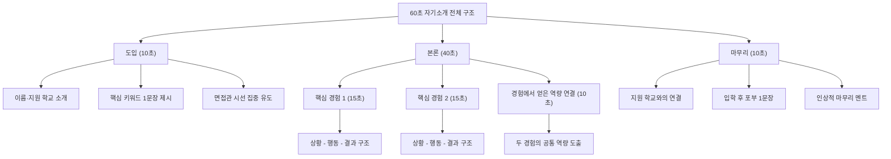
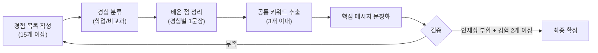
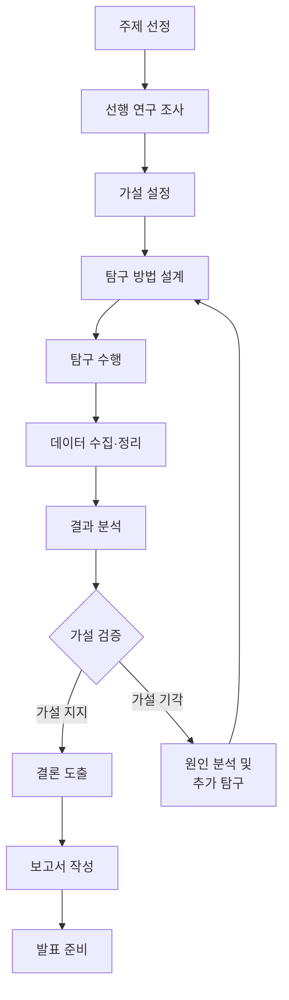
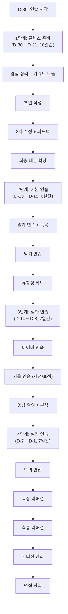

# 자기소개·포트폴리오 템플릿

면접 자기소개와 포트폴리오 준비를 위한 종합 가이드입니다. 60초 자기소개 설계부터 포트폴리오 구성, 연습 스케줄까지 체계적으로 정리했습니다.

---

## 목차

1. 60초 자기소개 설계법
2. 학교 유형별 자기소개 템플릿 5종
3. 자기소개서 작성 가이드
4. 활동 포트폴리오 구성법
5. 탐구 보고서 포트폴리오 양식
6. 봉사·동아리 활동 기록 양식
7. 독서 활동 기록 양식
8. 포트폴리오 디자인 팁
9. 실제 합격생 자기소개 분석
10. 자기소개 연습 스케줄 (D-30 ~ D-1)

---

## 1. 60초 자기소개 설계법

면접에서 가장 먼저 요구되는 60초 자기소개는 첫인상을 결정짓는 핵심 요소입니다. 제한된 시간 안에 자신의 강점과 지원 동기를 효과적으로 전달해야 합니다.

### 1-1. 60초 자기소개 구조

60초 자기소개는 크게 세 부분으로 나뉩니다. 도입 10초, 본론 40초, 마무리 10초로 구성하며, 각 파트별 역할이 명확해야 합니다.

### 1-2. 파트별 상세 가이드

| 파트 | 시간 | 분량 (글자) | 핵심 목표 | 주의사항 |
| --- | --- | --- | --- | --- |
| 도입 | 10초 | 약 50~70자 | 면접관의 시선을 사로잡는 첫 문장 | 이름만 말하지 않기, 키워드 포함 |
| 본론 경험 1 | 15초 | 약 80~100자 | 가장 강력한 경험 제시 | 구체적 수치·사례 포함 |
| 본론 경험 2 | 15초 | 약 80~100자 | 보완적 경험 제시 | 경험 1과 다른 영역 선택 |
| 본론 역량 연결 | 10초 | 약 50~70자 | 경험에서 역량 도출 | 학교 인재상과 연결 |
| 마무리 | 10초 | 약 50~70자 | 입학 후 비전 제시 | 막연한 포부 금지, 구체적으로 |

### 1-3. 핵심 메시지 도출법

자기소개의 성패는 핵심 메시지에 달려 있습니다. 다음 단계를 따라 핵심 메시지를 도출하세요.

**단계 1: 경험 목록 작성**
- 중학교 3년간의 학업, 비교과, 수상, 프로젝트, 봉사 활동을 모두 나열합니다.
- 최소 15개 이상의 경험을 적어 봅니다.

**단계 2: 경험 분류**
- 학업 관련 경험과 비교과 관련 경험으로 분류합니다.
- 각 경험에서 배운 점, 성장한 점을 한 문장으로 정리합니다.

**단계 3: 공통 키워드 추출**
- 여러 경험에서 반복되는 키워드를 3개 이내로 추출합니다.
- 예시: "탐구심", "문제 해결력", "협업 능력", "자기주도성"

**단계 4: 핵심 메시지 문장화**
- 추출한 키워드를 포함하여 자신을 한 문장으로 정의합니다.
- 예시: "끊임없는 탐구심으로 과학적 문제를 해결해 나가는 학생입니다."

**단계 5: 검증**
- 핵심 메시지가 지원 학교의 인재상과 부합하는지 확인합니다.
- 핵심 메시지를 뒷받침할 수 있는 경험이 2개 이상 있는지 확인합니다.

### 1-4. 핵심 메시지 도출 과정 흐름도

### 1-5. 연습법

효과적인 자기소개를 위해서는 반복적인 연습이 필수입니다.

**녹음 연습법**
- 스마트폰 녹음 기능을 활용하여 자기소개를 녹음합니다.
- 녹음 후 재생하여 발음, 속도, 톤, 강세를 체크합니다.
- 매일 최소 3회 녹음하여 비교하며 개선점을 찾습니다.
- 녹음 파일에 날짜를 기록하여 발전 과정을 추적합니다.

**거울 연습법**
- 전신 거울 앞에서 자기소개를 연습합니다.
- 시선 처리: 거울 속 자신의 눈을 바라보며 말합니다.
- 표정 관리: 자연스러운 미소를 유지하며 연습합니다.
- 자세 점검: 어깨를 펴고 바른 자세를 유지합니다.
- 손동작: 과도한 손동작을 자제하되, 강조할 부분에서 적절히 활용합니다.

**타이머 연습법**
- 스톱워치를 활용하여 정확히 55~60초에 맞춥니다.
- 처음에는 글을 읽으며 시간을 재고, 점차 보지 않고 연습합니다.
- 55초 미만이면 내용을 보강하고, 65초 이상이면 축약합니다.
- 목표: 어떤 상황에서도 58~62초 내에 완료하는 것

| 연습 방법 | 횟수/일 | 체크 포인트 | 효과 |
| --- | --- | --- | --- |
| 녹음 연습 | 3회 이상 | 발음·속도·톤·강세 | 청각적 피드백, 객관적 평가 |
| 거울 연습 | 2회 이상 | 시선·표정·자세·손동작 | 비언어적 커뮤니케이션 교정 |
| 타이머 연습 | 5회 이상 | 시간 편차 5초 이내 | 시간 감각 체득 |
| 모의 면접 | 1회 이상 | 긴장감 속 안정성 | 실전 감각 체득 |
| 영상 촬영 | 1회 이상 | 종합적 점검 | 시각+청각 동시 점검 |

---

## 2. 학교 유형별 자기소개 템플릿 5종

학교 유형에 따라 면접관이 중시하는 역량이 다릅니다. 각 학교 유형별로 최적화된 자기소개 템플릿을 제공합니다.

### 2-1. 과학고용 자기소개 템플릿

과학고 면접에서는 과학적 탐구심, 수학·과학 심화 학습 능력, 실험·연구 경험을 중시합니다.

| 구간 | 시간 | 핵심 내용 | 예시 문구 |
| --- | --- | --- | --- |
| 도입 | 10초 | 이름, 과학 분야 핵심 키워드 | "안녕하십니까, 실험실에서 질문을 찾는 학생, 000입니다." |
| 경험 1 (학업) | 15초 | 수학·과학 심화 학습 경험 | "중학교 2학년 때 미적분 선행을 넘어서 직접 수학적 증명 과정을 탐구했습니다. 페르마의 소정리를 스스로 증명하며 수학적 사고력을 키웠습니다." |
| 경험 2 (탐구) | 15초 | 실험·연구·탐구 경험 | "교내 과학 탐구 대회에서 '지역 하천의 수질 변화와 미생물 군집 상관관계'를 주제로 3개월간 연구하여 최우수상을 수상했습니다." |
| 역량 연결 | 10초 | 과학적 탐구 자세 강조 | "이러한 경험을 통해 가설을 세우고 검증하는 과학적 사고 방법을 체득했습니다." |
| 마무리 | 10초 | 과학고 입학 후 목표 | "과학고에서 심화된 연구 환경 속에서 물리학 분야의 탐구를 이어가고 싶습니다." |

**과학고 자기소개 핵심 키워드**: 탐구심, 실험, 연구, 가설 검증, 과학적 사고, 심화 학습, 융합적 접근

**주의할 점**
- 단순 선행 학습 자랑은 피하고, "왜" 깊이 공부했는지를 강조합니다.
- 탐구 경험은 과정과 결과를 모두 언급합니다.
- 과학고에서 하고 싶은 구체적인 연구 주제를 제시합니다.

### 2-2. 외고용 자기소개 템플릿

외고 면접에서는 외국어 능력, 글로벌 감각, 국제 이슈에 대한 관심, 다문화 이해력을 중시합니다.

| 구간 | 시간 | 핵심 내용 | 예시 문구 |
| --- | --- | --- | --- |
| 도입 | 10초 | 이름, 외국어·국제 관련 키워드 | "안녕하십니까, 언어를 통해 세계를 연결하고 싶은 학생, 000입니다." |
| 경험 1 (어학) | 15초 | 외국어 학습 과정과 성과 | "영어 원서 읽기를 시작으로 3년간 CNN 뉴스 청취를 습관화했고, 교내 영어 에세이 대회에서 2년 연속 수상하며 영어 작문 능력을 키웠습니다." |
| 경험 2 (국제) | 15초 | 국제 이슈·다문화 관련 경험 | "학교 모의유엔 동아리에서 난민 문제를 다루며, 다양한 국가의 입장을 조사하고 영어로 결의안을 작성한 경험이 있습니다." |
| 역량 연결 | 10초 | 글로벌 역량 강조 | "외국어 실력과 국제적 시각을 결합하여 글로벌 소통 능력을 길렀습니다." |
| 마무리 | 10초 | 외고 입학 후 목표 | "외고에서 심화된 어학 교육을 받으며 국제기구에서 활동할 역량을 쌓겠습니다." |

**외고 자기소개 핵심 키워드**: 어학 능력, 글로벌 소통, 다문화 이해, 국제 이슈, 외교, 협상, 다양성 존중

**주의할 점**
- 단순히 시험 점수나 자격증 나열은 피합니다.
- 외국어를 "도구"로서 어떻게 활용했는지를 보여줍니다.
- 국제적 이슈에 대한 자신만의 관점을 제시합니다.

### 2-3. 자사고용 자기소개 템플릿

자사고 면접에서는 자기주도 학습 능력, 리더십, 다양한 분야에 대한 균형 잡힌 관심을 중시합니다.

| 구간 | 시간 | 핵심 내용 | 예시 문구 |
| --- | --- | --- | --- |
| 도입 | 10초 | 이름, 자기주도성 키워드 | "안녕하십니까, 스스로 질문을 만들고 답을 찾아가는 학생, 000입니다." |
| 경험 1 (학업) | 15초 | 자기주도 학습 사례 | "교과서 개념을 넘어서 관련 논문을 찾아 읽으며 교과 심화 학습을 진행했고, 이를 바탕으로 학급 친구들을 위한 스터디 그룹을 운영했습니다." |
| 경험 2 (리더십) | 15초 | 리더십·협업 경험 | "학급 회장으로서 친구들의 의견을 수렴하여 자율적 학습 문화를 만들었고, 학급 학업 성취도 향상에 기여했습니다." |
| 역량 연결 | 10초 | 자기주도성 + 리더십 강조 | "자기주도적으로 학습하고 그 과정에서 타인과 함께 성장하는 방법을 배웠습니다." |
| 마무리 | 10초 | 자사고 입학 후 목표 | "자사고의 자율적 교육 환경에서 학문적 깊이와 리더십을 동시에 키우겠습니다." |

**자사고 자기소개 핵심 키워드**: 자기주도 학습, 리더십, 자율성, 협업, 균형 잡힌 역량, 주체적 성장

**주의할 점**
- 사교육에 의존한 학습 경험은 언급하지 않습니다.
- 자기주도적으로 계획하고 실행한 과정을 구체적으로 보여줍니다.
- 리더십은 지시형이 아닌 서번트 리더십(섬김의 리더십) 사례를 선택합니다.

### 2-4. 예술고용 자기소개 템플릿

예술고 면접에서는 예술적 감수성, 전공 분야의 열정과 노력, 창의적 표현력을 중시합니다.

| 구간 | 시간 | 핵심 내용 | 예시 문구 |
| --- | --- | --- | --- |
| 도입 | 10초 | 이름, 예술 분야 키워드 | "안녕하십니까, 음악으로 사람의 마음을 움직이고 싶은 학생, 000입니다." |
| 경험 1 (전공) | 15초 | 전공 분야 학습·훈련 경험 | "초등학교 3학년부터 피아노를 시작하여 매일 3시간 이상 연습하며, 지역 음악 콩쿠르에서 3회 입상한 경험이 있습니다." |
| 경험 2 (성장) | 15초 | 예술적 성장·깨달음 경험 | "첫 독주회에서 실수한 뒤 좌절하지 않고 감정 표현에 집중하는 연습 방법으로 바꾸었고, 이후 관객과 소통하는 연주를 할 수 있게 되었습니다." |
| 역량 연결 | 10초 | 예술적 감수성과 성장 의지 | "기술적 완성도와 함께 음악이 전하는 감정의 깊이를 추구하는 연주자로 성장했습니다." |
| 마무리 | 10초 | 예술고 입학 후 목표 | "예술고에서 체계적인 교육을 받으며 세계적인 연주자로의 첫걸음을 내딛겠습니다." |

**예술고 자기소개 핵심 키워드**: 예술적 감수성, 꾸준한 훈련, 열정, 표현력, 창의성, 감정 소통, 성장 스토리

**주의할 점**
- 수상 경력 나열보다 예술에 대한 진정한 열정을 보여줍니다.
- 실패와 극복 스토리를 통해 진정성을 전달합니다.
- 기술적 능력뿐 아니라 예술적 철학이나 가치관을 표현합니다.

### 2-5. 특성화고용 자기소개 템플릿

특성화고 면접에서는 진로 명확성, 실무 관심도, 취업 의지, 해당 분야에 대한 구체적 관심을 중시합니다.

| 구간 | 시간 | 핵심 내용 | 예시 문구 |
| --- | --- | --- | --- |
| 도입 | 10초 | 이름, 직업·기술 분야 키워드 | "안녕하십니까, 코드 한 줄로 세상을 편리하게 만들고 싶은 학생, 000입니다." |
| 경험 1 (실무) | 15초 | 해당 분야 실습·체험 경험 | "독학으로 파이썬을 학습하여 학교 급식 메뉴 알림 챗봇을 만들었고, 전교생 200명이 실제로 사용하는 서비스를 운영했습니다." |
| 경험 2 (직업관) | 15초 | 진로 탐색·직업 체험 경험 | "IT 기업 견학과 소프트웨어 캠프를 통해 개발자의 실무를 체험했고, 팀 프로젝트에서 앱을 기획하고 개발하는 전 과정을 경험했습니다." |
| 역량 연결 | 10초 | 실무 역량과 직업 의식 | "직접 만들고 사용자의 피드백을 반영하며 실무적 문제 해결 능력을 키웠습니다." |
| 마무리 | 10초 | 특성화고 입학 후 목표 | "특성화고에서 전문 기술을 익혀 졸업 후 바로 현장에서 활약하는 개발자가 되겠습니다." |

**특성화고 자기소개 핵심 키워드**: 진로 명확성, 실무 관심, 기술 열정, 취업 의지, 현장 적용, 자격증 목표

**주의할 점**
- 진로 선택의 이유를 구체적으로 설명합니다.
- 해당 분야에 대한 자발적 학습 경험을 반드시 포함합니다.
- 취업 후 성장 계획까지 제시하면 차별화됩니다.

---

## 3. 자기소개서 작성 가이드

면접 자기소개와 별도로, 서류 전형에서 제출하는 자기소개서 작성법을 안내합니다.

### 3-1. 서론 작성법

서론은 자기소개서의 첫인상입니다. 읽는 사람의 관심을 끌어야 합니다.

**관심 끌기 전략**
- 인상적인 에피소드로 시작: 독자가 "이 학생이 궁금하다"고 느끼게 합니다.
- 질문형 도입: "왜 하늘은 파란색일까?"와 같은 질문으로 호기심을 유발합니다.
- 핵심 키워드 선제시: 자신을 정의하는 키워드를 첫 문장에 배치합니다.

**서론 작성 공식**

| 유형 | 구조 | 예시 |
| --- | --- | --- |
| 에피소드형 | 경험 장면 묘사 + 핵심 메시지 연결 | "현미경 너머로 세포가 분열하는 순간, 저는 생명의 신비에 매료되었습니다." |
| 질문형 | 호기심 유발 질문 + 답을 찾아가는 여정 예고 | "빛은 왜 굴절할까? 이 단순한 질문이 저를 물리학의 세계로 이끌었습니다." |
| 선언형 | 핵심 가치관·목표 선언 + 근거 예고 | "저는 기술로 사회 문제를 해결하는 사람이 되고자 합니다." |
| 대비형 | 과거와 현재 대비 + 성장 예고 | "수학을 싫어하던 학생이 수학 올림피아드에 도전하기까지의 이야기입니다." |

**피해야 할 서론**
- "저는 00중학교 3학년 000입니다." (평범한 자기 소개)
- "어릴 때부터 꿈이 있었습니다." (진부한 시작)
- "부모님의 영향으로..." (주체성이 드러나지 않음)

### 3-2. 본론 작성법

본론은 자기소개서의 핵심입니다. 경험, 역량, 성장 스토리를 구체적으로 서술합니다.

**경험 서술 STAR 기법**

| 요소 | 설명 | 작성 팁 | 분량 비중 |
| --- | --- | --- | --- |
| Situation (상황) | 어떤 상황이었는지 배경 설명 | 구체적 시기, 장소, 계기를 명시 | 15% |
| Task (과제) | 어떤 문제 또는 목표가 있었는지 | 스스로 설정한 목표 강조 | 15% |
| Action (행동) | 어떤 행동을 했는지 구체적으로 | "나"의 역할과 행동을 중심으로 | 50% |
| Result (결과) | 어떤 결과를 얻었는지 | 정량적 성과 + 정성적 성장 병기 | 20% |

**역량 연결법**
- 경험에서 자연스럽게 역량을 도출합니다.
- 지원 학교의 인재상과 역량을 연결합니다.
- 한 가지 경험에서 한 가지 핵심 역량을 도출하는 것이 효과적입니다.

**성장 스토리 구성**
- 실패 또는 어려움을 솔직하게 기술합니다.
- 극복 과정에서의 구체적 노력을 서술합니다.
- 성장한 점을 이전과 이후를 대비하여 보여줍니다.

### 3-3. 결론 작성법

결론은 자기소개서의 마지막 인상입니다. 포부와 학교와의 연결고리를 명확히 합니다.

**포부 제시 원칙**
- 막연한 "열심히 하겠습니다"는 피합니다.
- 입학 후 구체적으로 하고 싶은 활동, 공부를 명시합니다.
- 장기적 목표(진로)와 단기적 목표(고교 활동)를 모두 제시합니다.

**학교와의 연결 방법**
- 해당 학교만의 특색 있는 프로그램, 동아리, 교육 과정을 언급합니다.
- 자신의 경험과 학교 프로그램의 연결점을 구체적으로 제시합니다.
- "이 학교에서만 가능한 성장"을 어필합니다.

### 3-4. 단락별 분량 가이드

| 단락 | 권장 분량 (글자수) | 비중 | 핵심 요소 | 작성 시 체크 포인트 |
| --- | --- | --- | --- | --- |
| 서론 | 150~200자 | 15% | 관심 유발, 핵심 키워드 | 첫 문장이 인상적인가? |
| 본론 1 (주요 경험) | 300~400자 | 30% | STAR 기법 적용, 핵심 경험 | 구체적 사례가 있는가? |
| 본론 2 (보완 경험) | 250~350자 | 25% | 다른 영역의 경험, 역량 확장 | 본론 1과 차별화되는가? |
| 본론 3 (성장 스토리) | 200~300자 | 20% | 실패 극복, 성장 증거 | 변화가 드러나는가? |
| 결론 | 100~150자 | 10% | 포부, 학교 연결 | 구체적 계획이 있는가? |
| 전체 | 1,000~1,400자 | 100% | 통일감 있는 스토리 라인 | 키워드가 일관되는가? |

---

## 4. 활동 포트폴리오 구성법

포트폴리오는 자신의 중학교 활동을 시각적으로 정리한 자료입니다. 체계적 구성이 중요합니다.

### 4-1. 커버 디자인 가이드

**커버에 포함할 요소**
- 포트폴리오 제목: "000의 활동 포트폴리오" 또는 창의적 제목
- 이름 및 소속 학교
- 지원 학교명
- 포트폴리오 기간 (예: 2024년 3월 ~ 2026년 12월)
- 핵심 키워드 또는 슬로건 (선택 사항)

**디자인 원칙**
- 깔끔하고 전문적인 인상을 주는 디자인
- 과도한 장식이나 색상 사용 자제
- 학교 유형에 맞는 톤앤매너 유지
- A4 세로 방향, 여백 충분히 확보

### 4-2. 목차 구성 예시

| 순번 | 항목 | 포함 내용 | 페이지 수 |
| --- | --- | --- | --- |
| 1 | 자기소개 | 핵심 키워드, 프로필, 진로 목표 | 1~2 |
| 2 | 학업 활동 | 교과 심화 학습, 수상 실적 | 3~5 |
| 3 | 탐구 활동 | 탐구 보고서, 실험 기록 | 3~5 |
| 4 | 비교과 활동 | 동아리, 봉사, 체험 활동 | 3~5 |
| 5 | 독서 활동 | 독서 기록, 서평 | 2~3 |
| 6 | 수상 및 자격 | 수상 내역, 자격증 | 1~2 |
| 7 | 성장 기록 | 학년별 성장 과정, 반성과 다짐 | 1~2 |
| 8 | 부록 | 활동 사진, 증빙 자료 | 2~3 |

### 4-3. 활동별 정리 양식

각 활동은 다음 양식에 맞추어 일관되게 정리합니다.

| 항목 | 작성 내용 | 작성 예시 |
| --- | --- | --- |
| 활동명 | 활동의 공식 명칭 | "교내 과학 탐구 대회" |
| 활동 기간 | 시작일 ~ 종료일 | "2025년 4월 ~ 2025년 6월" |
| 활동 유형 | 학업/탐구/봉사/동아리/체험 | "탐구 활동" |
| 나의 역할 | 개인 또는 팀 내 역할 | "팀장 (4인 팀)" |
| 활동 동기 | 왜 이 활동에 참여했는지 | "교과서에서 배운 산·염기 반응을 실제로 검증하고 싶었다" |
| 활동 내용 | 구체적으로 무엇을 했는지 | "지역 하천의 pH 변화를 3개월간 측정하고 분석" |
| 결과 및 성과 | 정량적·정성적 결과 | "최우수상 수상, 연구 보고서 작성 능력 향상" |
| 배운 점 | 이 활동에서 얻은 교훈 | "가설 설정과 실험 설계의 중요성 체득" |
| 증빙 자료 | 첨부 가능한 자료 | "수상장 사본, 연구 보고서 요약본" |

---

## 5. 탐구 보고서 포트폴리오 양식

탐구 보고서는 학생의 학문적 깊이와 탐구 능력을 보여주는 핵심 자료입니다.

### 5-1. 탐구 보고서 기본 양식

| 항목 | 세부 내용 | 작성 가이드 | 분량 |
| --- | --- | --- | --- |
| 탐구 주제 | 연구 주제명 (구체적으로) | "의문형 또는 서술형으로 작성" | 1~2줄 |
| 탐구 동기 | 이 주제를 선택한 이유 | "교과 학습 중 생긴 의문이나 관찰에서 출발" | 5~8줄 |
| 탐구 목적 | 이 연구를 통해 알고자 하는 것 | "검증하고자 하는 가설이나 해결하고자 하는 문제 명시" | 3~5줄 |
| 선행 연구 조사 | 기존에 알려진 정보 정리 | "교과서, 논문, 관련 서적 참고 내용 요약" | 10~15줄 |
| 탐구 방법 | 실험 설계, 조사 방법 | "재료, 도구, 절차를 단계별로 기술" | 10~15줄 |
| 탐구 과정 | 실제 수행한 내용 기록 | "날짜별 실험 기록, 관찰 내용, 사진" | 15~20줄 |
| 탐구 결과 | 데이터, 분석 결과 | "표, 그래프를 활용한 결과 정리" | 10~15줄 |
| 결론 및 논의 | 결과 해석, 가설 검증 여부 | "예상과 다른 결과에 대한 분석도 포함" | 8~12줄 |
| 한계점 및 후속 연구 | 연구의 한계와 발전 방향 | "부족했던 점, 향후 개선할 방법 제시" | 5~8줄 |
| 참고 문헌 | 인용한 자료 목록 | "저자, 제목, 출처, 연도 순서로 기록" | 3~5줄 |
| 느낀 점 | 탐구를 통한 개인적 성장 | "학문적 성장과 태도 변화 중심" | 5~8줄 |

### 5-2. 탐구 보고서 작성 흐름도

### 5-3. 탐구 주제 선정 가이드

| 분야 | 좋은 주제 예시 | 피해야 할 주제 | 선정 기준 |
| --- | --- | --- | --- |
| 물리 | "고무줄 탄성 계수와 온도의 관계 탐구" | "아인슈타인 상대성 이론 연구" | 직접 실험 가능, 변인 통제 가능 |
| 화학 | "천연 지시약의 pH 측정 정확도 비교" | "신약 개발 연구" | 안전한 실험, 중학교 수준 |
| 생물 | "빛의 파장에 따른 식물 성장 속도 비교" | "유전자 편집 실험" | 윤리적 문제 없음, 관찰 가능 |
| 지구과학 | "미세먼지 농도와 기상 조건의 상관관계" | "지진 예측 모델 개발" | 데이터 수집 가능 |
| 수학 | "피보나치 수열이 자연에서 나타나는 패턴 탐구" | "리만 가설 증명" | 수학적 도구 활용 가능 |
| 사회 | "지역 소상공인 매출과 프랜차이즈 입점의 관계" | "국가 경제 정책 수립" | 설문·인터뷰 가능 |

---

## 6. 봉사·동아리 활동 기록 양식

봉사활동과 동아리 활동은 학생의 인성, 사회성, 열정을 보여주는 중요한 자료입니다.

### 6-1. 봉사활동 기록 양식

| 항목 | 작성 내용 | 작성 예시 |
| --- | --- | --- |
| 봉사 활동명 | 활동의 공식 명칭 | "지역 도서관 학습 도우미 봉사" |
| 봉사 기관 | 봉사를 수행한 기관명 | "00구립 도서관" |
| 봉사 기간 | 활동 기간 (시작일 ~ 종료일) | "2025년 3월 ~ 2025년 12월 (매주 토요일)" |
| 총 봉사 시간 | 누적 봉사 시간 | "총 48시간 (주 2시간, 24주)" |
| 봉사 동기 | 이 봉사활동을 시작한 이유 | "수학을 어려워하는 초등학생을 돕고 싶어서" |
| 활동 내용 | 구체적으로 한 일 | "초등학교 3~4학년 학생 대상 수학 학습 지도" |
| 나의 역할 | 봉사에서의 구체적 역할 | "학습 교재 제작, 개별 맞춤 지도" |
| 어려웠던 점 | 봉사 중 겪은 어려움 | "집중력이 낮은 학생의 참여 유도가 어려웠음" |
| 해결 방법 | 어려움을 극복한 방법 | "게임 요소를 도입한 수학 퀴즈 활동 기획" |
| 배운 점 | 봉사를 통해 얻은 교훈 | "눈높이를 맞추는 소통 능력, 교육적 보람" |
| 봉사 확인서 | 증빙 자료 유무 | "1365 봉사 인증서 첨부" |
| 후속 계획 | 향후 봉사 계획 | "고등학교에서도 교육 봉사 지속 예정" |

### 6-2. 동아리 활동 기록 양식

| 항목 | 작성 내용 | 작성 예시 |
| --- | --- | --- |
| 동아리명 | 동아리의 공식 명칭 | "탐구나래 (과학 탐구 동아리)" |
| 동아리 유형 | 교내 정규/자율/학교 밖 | "교내 정규 동아리" |
| 활동 기간 | 활동 시작일 ~ 종료일 | "2025년 3월 ~ 현재" |
| 나의 역할 | 동아리 내 직책 및 역할 | "부장 (2학기)" |
| 활동 목표 | 동아리 참여의 목적 | "과학 탐구 역량 강화, 실험 능력 향상" |
| 주요 활동 내용 | 핵심 활동 3~5개 기술 | "월 1회 실험, 탐구 보고서 발표, 교내 과학전 참가" |
| 대표 프로젝트 | 가장 의미 있었던 프로젝트 | "교내 과학전시회 출품작: 자정 작용 수질 정화 장치" |
| 기여한 점 | 동아리에 기여한 내용 | "실험 안전 매뉴얼 제작, 신입 부원 교육" |
| 성과 | 동아리 활동의 결과 | "교내 과학전 금상, 탐구 보고서 3편 작성" |
| 배운 점 | 활동을 통해 성장한 점 | "팀워크와 과학적 사고력 동시 성장" |
| 증빙 자료 | 활동 증빙 자료 | "활동 사진, 탐구 보고서, 수상장" |

---

## 7. 독서 활동 기록 양식

독서 활동은 학생의 지적 호기심과 사고력을 보여주는 중요한 자료입니다. 단순 감상이 아닌, 깊이 있는 독서 기록을 작성합니다.

### 7-1. 독서 기록 양식

| 항목 | 작성 내용 | 작성 가이드 | 작성 예시 |
| --- | --- | --- | --- |
| 도서명 | 책 제목 (원제 포함) | 정확한 제목 기입 | "코스모스 (Cosmos)" |
| 저자 | 작가명 | 원서 저자와 역자 모두 기입 | "칼 세이건 (홍승수 역)" |
| 분야 | 도서 분류 | 교과 연계 분야 명시 | "과학 (천문학)" |
| 독서 기간 | 읽은 기간 | 시작일 ~ 완독일 | "2025년 7월 1일 ~ 7월 20일" |
| 독서 동기 | 이 책을 선택한 이유 | 교과 연계 또는 관심 분야와 연결 | "우주의 기원에 대한 궁금증" |
| 핵심 내용 요약 | 책의 주요 내용 3~5문장 | 줄거리가 아닌 핵심 주제 요약 | "우주의 탄생부터 인류의 미래까지..." |
| 인상 깊은 구절 | 가장 기억에 남는 문장 | 페이지 번호와 함께 기록 | "'우주는 우리 안에 있다' (p.132)" |
| 비판적 사고 | 책에 대한 나의 의견 | 동의·반박·의문점 제시 | "저자의 외계 생명체 가능성 주장에 대해..." |
| 교과 연계 | 교과 내용과의 연결점 | 어떤 교과의 어떤 단원과 연결되는지 | "중3 과학 '태양계' 단원과 연계" |
| 후속 활동 | 독서 이후의 탐구 활동 | 추가 독서, 탐구, 발표 등 | "관련 논문 2편 추가 조사" |
| 진로 연결 | 진로와의 연결점 | 독서가 진로 탐색에 미친 영향 | "천문학자의 삶에 대한 관심 확대" |
| 별점 | 1~5점 평가 | 개인적 평가 | "5/5" |

### 7-2. 학기별 독서 포트폴리오 구성

| 학기 | 권장 독서량 | 분야 배분 | 심화 독서 기록 |
| --- | --- | --- | --- |
| 중1-1학기 | 6~8권 | 다양한 분야 탐색 중심 | 최소 2권 |
| 중1-2학기 | 6~8권 | 관심 분야 집중 시작 | 최소 3권 |
| 중2-1학기 | 8~10권 | 진로 관련 분야 비중 확대 | 최소 4권 |
| 중2-2학기 | 8~10권 | 진로 관련 심화 독서 | 최소 5권 |
| 중3-1학기 | 6~8권 | 지원 학교 관련 집중 독서 | 최소 4권 |
| 중3-2학기 | 4~6권 | 면접 대비 핵심 독서 | 최소 3권 |

---

## 8. 포트폴리오 디자인 팁

포트폴리오의 내용만큼 시각적 완성도도 중요합니다. 깔끔하고 전문적인 인상을 주는 디자인 원칙을 안내합니다.

### 8-1. 시각적 구성 원칙

**일관성 유지**
- 전체 포트폴리오에서 동일한 글꼴, 색상 체계, 레이아웃을 유지합니다.
- 제목 서식, 본문 서식, 표 서식을 미리 정의하고 일관되게 적용합니다.
- 페이지 번호, 머리글/바닥글을 통일합니다.

**가독성 우선**
- 충분한 여백을 확보합니다 (상하좌우 최소 20mm).
- 본문 글꼴 크기는 11~12pt를 권장합니다.
- 제목과 본문의 크기 차이를 명확히 합니다.
- 줄 간격은 1.5~1.8배를 적용합니다.

**정보의 위계 표현**
- 대제목, 중제목, 소제목의 크기와 굵기를 차별화합니다.
- 중요한 내용은 굵은 글씨 또는 색상 강조로 표시합니다.
- 표와 도표를 활용하여 정보를 구조화합니다.

### 8-2. 색상 활용 가이드

학교 유형에 따라 적절한 색상 톤을 선택합니다.

| 학교 유형 | 메인 컬러 | 보조 컬러 | 배경 컬러 | 느낌 |
| --- | --- | --- | --- | --- |
| 과학고 | 짙은 파랑 (#1B3A5C) | 하늘색 (#5BA4CF) | 연한 회색 (#F5F5F5) | 지적, 탐구적 |
| 외고 | 짙은 남색 (#1A237E) | 금색 (#C9A94E) | 아이보리 (#FAFAF0) | 격식, 글로벌 |
| 자사고 | 짙은 녹색 (#2E5930) | 연한 녹색 (#7CB97C) | 흰색 (#FFFFFF) | 안정, 균형 |
| 예술고 | 짙은 보라 (#4A148C) | 연한 보라 (#B39DDB) | 연한 회색 (#F8F8F8) | 창의, 감성 |
| 특성화고 | 짙은 주황 (#E65100) | 연한 주황 (#FFB74D) | 흰색 (#FFFFFF) | 활동적, 실용적 |

**색상 사용 원칙**
- 전체에서 3가지 이내의 색상만 사용합니다.
- 메인 컬러는 제목, 강조 부분에만 사용합니다.
- 본문은 검정 또는 짙은 회색을 사용합니다.
- 과도한 색상 사용은 산만한 인상을 줍니다.

### 8-3. 레이아웃 팁

**페이지 구성**
- 한 페이지에 하나의 활동 또는 주제만 배치합니다.
- 텍스트와 이미지의 비율을 7:3 정도로 유지합니다.
- 사진은 선명하고 활동의 핵심을 보여주는 것만 선별합니다.

**표 디자인**
- 표 머리행(헤더)은 메인 컬러 배경 + 흰 글씨로 구분합니다.
- 행 간 구분을 위해 줄무늬 배경을 적용합니다.
- 표 테두리는 얇은 선으로 깔끔하게 처리합니다.

**여백과 정렬**
- 왼쪽 정렬을 기본으로 합니다.
- 숫자 데이터는 오른쪽 정렬합니다.
- 제목은 가운데 정렬할 수 있습니다.
- 페이지 간 여백을 통일합니다.

---

## 9. 실제 합격생 자기소개 분석

실제 합격생들의 자기소개 구조를 분석하여 성공 요인을 파악합니다. 아래 사례는 실제 합격 사례를 바탕으로 재구성한 것입니다.

### 9-1. 사례 1: 과학고 합격생 (물리 분야)

**자기소개 전문 구조 분해**

| 구간 | 시간 | 실제 내용 구조 | 분석 |
| --- | --- | --- | --- |
| 도입 | 8초 | "안녕하십니까, 빛의 성질에 매료된 학생, 000입니다." | 짧고 강렬한 키워드 "빛의 성질에 매료된"으로 시선 집중 |
| 경험 1 | 16초 | 교내 과학 탐구 대회에서 "빛의 굴절과 분산" 주제로 직접 실험을 설계하고 수행한 경험 서술 | STAR 기법 적용, 구체적 주제 명시 |
| 경험 2 | 14초 | 수학 교과 심화 학습으로 미분을 자기주도적으로 학습하고, 물리 현상을 수학적으로 해석한 경험 | 교과 융합적 사고 강조 |
| 역량 연결 | 12초 | 실험과 수학을 결합하여 현상을 깊이 이해하는 탐구 능력 도출 | 두 경험을 하나의 역량으로 통합 |
| 마무리 | 10초 | 과학고에서 광학 분야 심화 연구를 이어가고 싶다는 구체적 포부 | 명확한 연구 분야 제시 |

**성공 요인**: 핵심 키워드 "빛"을 중심으로 전체 스토리가 통일되어 있음. 실험 경험과 수학적 사고를 연결하여 융합적 역량을 보여줌.

### 9-2. 사례 2: 외고 합격생 (영어 전공)

**자기소개 전문 구조 분해**

| 구간 | 시간 | 실제 내용 구조 | 분석 |
| --- | --- | --- | --- |
| 도입 | 9초 | "안녕하십니까, 영어라는 다리로 세계와 소통하고 싶은 000입니다." | 비유적 표현 "영어라는 다리"로 차별화 |
| 경험 1 | 15초 | 영어 원서 독서 모임을 직접 기획하고 1년간 운영한 경험, 12명의 친구와 함께 월 1권 읽기 진행 | 자기주도성 + 리더십 동시 강조 |
| 경험 2 | 15초 | 교내 다문화 가정 학생 한국어 멘토링 봉사를 하며 문화적 차이를 이해하고 소통한 경험 | 다문화 이해력을 실제 경험으로 증명 |
| 역량 연결 | 11초 | 언어를 통한 소통 능력과 다양한 문화에 대한 이해력 강조 | 외고 인재상과 정확히 부합 |
| 마무리 | 10초 | 외고에서 제2외국어를 추가로 학습하고 국제 토론 대회에 참가하겠다는 구체적 계획 | 입학 후 계획이 구체적 |

**성공 요인**: 영어 "능력"이 아닌 영어를 "활용"한 경험 중심. 봉사 경험을 통해 인성도 함께 어필.

### 9-3. 사례 3: 자사고 합격생 (인문 사회 분야)

**자기소개 전문 구조 분해**

| 구간 | 시간 | 실제 내용 구조 | 분석 |
| --- | --- | --- | --- |
| 도입 | 9초 | "안녕하십니까, 물음표를 느낌표로 바꾸는 학생, 000입니다." | 비유적 표현으로 호기심 강조 |
| 경험 1 | 16초 | 사회 교과에서 배운 민주주의를 교내 학생회 활동에서 실천한 경험, 학생 의견 수렴 시스템 구축 | 교과 학습을 실천으로 연결한 점 강조 |
| 경험 2 | 14초 | 역사 탐구 보고서 3편 작성, 특히 지역 역사 유적지 현장 조사를 통해 살아있는 역사를 경험 | 자기주도적 탐구 활동 증명 |
| 역량 연결 | 11초 | 학습한 지식을 현실에 적용하는 실천적 지식인의 자세 강조 | 자사고의 "자기주도적 인재" 인재상과 연결 |
| 마무리 | 10초 | 자사고에서 인문 사회 심화 과목을 이수하고 사회 문제 해결 프로젝트를 진행하겠다는 포부 | 구체적 교과과정 언급으로 학교 이해도 어필 |

**성공 요인**: "물음표를 느낌표로"라는 인상적 도입. 학습과 실천의 연결고리가 명확.

### 9-4. 합격 사례 성공 요인 종합 분석

| 성공 요인 | 사례 1 (과학고) | 사례 2 (외고) | 사례 3 (자사고) | 공통점 |
| --- | --- | --- | --- | --- |
| 핵심 키워드 일관성 | "빛" 중심 통일 | "소통" 중심 통일 | "실천" 중심 통일 | 하나의 키워드로 전체 관통 |
| 도입부 차별화 | 전공 분야 직접 제시 | 비유적 표현 활용 | 비유적 표현 활용 | 첫 문장에서 시선 사로잡기 |
| 경험의 구체성 | 실험 주제, 과정 명시 | 인원, 기간 명시 | 보고서 편수, 활동 명시 | 숫자와 사실로 구체화 |
| 두 경험의 연결 | 실험 + 수학 융합 | 영어 + 다문화 이해 | 사회 참여 + 탐구 | 두 경험이 하나의 역량으로 수렴 |
| 마무리 구체성 | 연구 분야 명시 | 대회 참가 계획 | 교과과정 언급 | 입학 후 구체적 계획 제시 |
| 시간 배분 | 총 60초 준수 | 총 60초 준수 | 총 60초 준수 | 55~62초 이내 완료 |

### 9-5. 합격생 vs 불합격생 자기소개 비교

| 비교 항목 | 합격 사례 특징 | 불합격 사례 특징 |
| --- | --- | --- |
| 도입부 | 핵심 키워드가 포함된 인상적 첫 문장 | "안녕하세요, 000입니다"로 시작 |
| 경험 서술 | 구체적 사례, 숫자, 결과 포함 | "열심히 공부했습니다" 등 추상적 표현 |
| 역량 도출 | 경험에서 자연스럽게 역량 도출 | 경험과 역량이 분리되어 나열 |
| 학교 연결 | 학교의 특색 프로그램과 연결 | "이 학교에서 열심히 하겠습니다" |
| 시간 관리 | 55~62초 내 완료 | 시간 초과 또는 30초 미만 |
| 스토리 통일성 | 하나의 키워드로 전체 관통 | 서로 관련 없는 경험 나열 |
| 마무리 | 구체적 포부와 계획 | 막연한 다짐 |

---

## 10. 자기소개 연습 스케줄 (D-30 ~ D-1)

면접 30일 전부터 체계적으로 준비하는 일자별 연습 스케줄입니다.

### 10-1. 전체 연습 흐름

```mermaid
gantt
    title 자기소개 연습 스케줄 (D-30 ~ D-1)
    dateFormat X
    axisFormat %s

    section 1단계: 콘텐츠 준비
    경험 정리 및 핵심 메시지 도출     :a1, 0, 5
    초안 작성 및 수정                 :a2, 5, 10

    section 2단계: 기본 연습
    읽기 연습 (대본 보며)             :b1, 10, 14
    암기 연습 (대본 없이)             :b2, 14, 18

    section 3단계: 심화 연습
    시간 맞추기 연습                  :c1, 18, 22
    비언어적 요소 교정                :c2, 22, 25

    section 4단계: 실전 연습
    모의 면접 실전 연습               :d1, 25, 28
    최종 점검 및 컨디션 조절          :d2, 28, 30
```

### 10-2. 일자별 세부 활동

| 일차 | 단계 | 활동 내용 | 목표 | 체크 포인트 |
| --- | --- | --- | --- | --- |
| D-30 | 1단계 | 중학교 3년간 경험 목록 작성 (15개 이상) | 소재 확보 | 빠뜨린 경험이 없는가? |
| D-29 | 1단계 | 경험 분류 및 핵심 키워드 추출 | 키워드 3개 선정 | 학교 인재상과 부합하는가? |
| D-28 | 1단계 | 핵심 경험 2개 선정 및 STAR 분석 | 경험 구조화 | 구체적 사실과 수치가 있는가? |
| D-27 | 1단계 | 핵심 메시지 문장화, 도입·마무리 설계 | 전체 골격 완성 | 60초 구조에 맞는가? |
| D-26 | 1단계 | 자기소개 초안 작성 (글자 수 300~350자) | 초안 완성 | 각 파트 시간 배분이 적절한가? |
| D-25 | 1단계 | 초안 수정 1차 (불필요한 표현 삭제) | 간결성 확보 | 군더더기 표현이 없는가? |
| D-24 | 1단계 | 초안 수정 2차 (키워드 강화, 표현 다듬기) | 임팩트 강화 | 핵심 키워드가 2회 이상 등장하는가? |
| D-23 | 1단계 | 초안 수정 3차 (선생님/부모님 피드백 반영) | 외부 검증 | 제3자가 이해할 수 있는가? |
| D-22 | 1단계 | 최종 대본 확정 | 대본 확정 | 모든 수정사항이 반영되었는가? |
| D-21 | 1단계 | 대본 필사 3회 (손으로 쓰며 익히기) | 내용 숙지 | 주요 흐름을 기억하는가? |
| D-20 | 2단계 | 대본을 보며 소리 내어 읽기 (5회) | 발음 확인 | 어색한 발음이 없는가? |
| D-19 | 2단계 | 대본을 보며 녹음 연습 (3회) | 속도·톤 조절 | 적절한 속도인가? |
| D-18 | 2단계 | 핵심 문장 중심 암기 시작 | 부분 암기 | 도입·마무리를 외웠는가? |
| D-17 | 2단계 | 대본 보지 않고 말하기 시도 (틀려도 계속) | 흐름 파악 | 전체 흐름을 기억하는가? |
| D-16 | 2단계 | 대본 없이 녹음 (3회), 녹음 비교 분석 | 완전 암기 | 빠뜨린 내용이 없는가? |
| D-15 | 2단계 | 대본 없이 유창하게 말하기 (5회 반복) | 유창성 확보 | 막히는 부분이 없는가? |
| D-14 | 3단계 | 타이머 맞춰 연습 (10회), 시간 기록 | 시간 맞추기 | 55~62초 이내인가? |
| D-13 | 3단계 | 속도 조절 연습 (빠르게/천천히/보통) | 완급 조절 | 강조 부분에서 속도가 느려지는가? |
| D-12 | 3단계 | 거울 보며 연습 (시선 처리 중점) | 시선 교정 | 눈을 자연스럽게 맞추는가? |
| D-11 | 3단계 | 거울 보며 연습 (표정·자세 중점) | 비언어 교정 | 자연스러운 미소를 유지하는가? |
| D-10 | 3단계 | 영상 촬영 후 셀프 분석 | 종합 점검 | 개선할 점을 3가지 이내로 정리 |
| D-9 | 3단계 | 영상 분석 기반 수정 연습 (5회) | 약점 보완 | 지적 사항이 개선되었는가? |
| D-8 | 3단계 | 다양한 환경에서 연습 (서서/앉아서/걸으며) | 상황 적응력 | 어떤 자세에서도 자연스러운가? |
| D-7 | 4단계 | 가족 앞에서 모의 발표 (피드백 수집) | 청중 앞 연습 | 긴장 시 변하는 점은 무엇인가? |
| D-6 | 4단계 | 친구/선생님과 모의 면접 (질문 포함) | 실전 감각 | 자기소개 후 후속 질문에 대응 가능한가? |
| D-5 | 4단계 | 실제 면접 복장 착용 후 전체 연습 | 실전 환경 | 복장이 불편하지 않은가? |
| D-4 | 4단계 | 낯선 사람(이웃, 친척) 앞에서 발표 | 긴장 극복 | 낯선 청중 앞에서도 안정적인가? |
| D-3 | 4단계 | 최종 리허설 (전체 과정 시뮬레이션) | 최종 점검 | 입장부터 퇴장까지 자연스러운가? |
| D-2 | 4단계 | 가벼운 복습 (3회), 컨디션 관리 | 안정화 | 과도한 연습으로 지치지 않았는가? |
| D-1 | 4단계 | 핵심 키워드만 복습, 충분한 수면 | 컨디션 최적화 | 마음의 여유가 있는가? |

### 10-3. 단계별 체크리스트

**1단계 완료 체크 (D-30 ~ D-21)**
- 핵심 메시지가 학교 인재상과 연결되어 있는가
- 두 가지 경험이 하나의 역량으로 수렴하는가
- 대본이 300~350자 이내인가
- 외부 피드백을 최소 1회 받았는가
- 대본이 최종 확정되었는가

**2단계 완료 체크 (D-20 ~ D-15)**
- 대본을 보지 않고 전체를 말할 수 있는가
- 발음이 명확하고 속도가 적절한가
- 녹음을 들었을 때 자연스러운가
- 막히거나 더듬는 부분이 없는가

**3단계 완료 체크 (D-14 ~ D-8)**
- 55~62초 이내에 완료하는가
- 시선이 안정적이고 자연스러운가
- 표정이 밝고 자신감이 있는가
- 영상으로 확인했을 때 만족스러운가

**4단계 완료 체크 (D-7 ~ D-1)**
- 청중 앞에서도 안정적으로 발표하는가
- 후속 질문에 대한 준비가 되어 있는가
- 면접 복장에서 불편함이 없는가
- 심리적으로 안정되어 있는가

### 10-4. 연습 단계별 흐름도

---

## 부록: 자기소개 자가 진단표

면접 전 최종 점검을 위한 자가 진단표입니다.

| 점검 항목 | 확인 (O/X) | 미달 시 조치 방법 |
| --- | --- | --- |
| 핵심 키워드가 명확한가 | | 경험 목록을 다시 정리하고 공통 키워드 추출 |
| 도입이 인상적인가 | | 비유, 에피소드, 질문 중 하나로 변경 |
| 경험이 구체적인가 | | 숫자, 사실, 결과를 추가 |
| 두 경험이 연결되는가 | | 공통 역량을 찾아 연결 문장 추가 |
| 학교 인재상과 부합하는가 | | 학교 홈페이지에서 인재상 재확인 |
| 마무리가 구체적인가 | | 입학 후 구체적 계획으로 수정 |
| 시간이 55~62초인가 | | 분량 조절 (늘리거나 줄이기) |
| 발음이 명확한가 | | 문제 단어를 쉬운 표현으로 교체 |
| 시선이 안정적인가 | | 거울 연습 추가 |
| 표정이 자연스러운가 | | 영상 촬영 후 확인, 미소 연습 |
| 자세가 바른가 | | 어깨 펴기, 바른 자세 의식 |
| 긴장해도 할 수 있는가 | | 청중 앞 연습 횟수 증가 |

---

## 부록: 자주 하는 실수와 교정법

| 실수 유형 | 구체적 사례 | 교정 방법 |
| --- | --- | --- |
| 시간 초과 | 70초 이상 말함 | 핵심 내용만 남기고 부수적 내용 삭제 |
| 시간 부족 | 40초 미만 | 경험의 구체적 디테일 추가 |
| 암기 티 | 로봇처럼 외운 내용을 읊음 | 키워드 중심으로 자연스럽게 말하는 연습 |
| 미사여구 과다 | "위대한", "놀라운" 등 과장 표현 | 사실 중심의 담백한 표현으로 교체 |
| 경험 나열 | 연결 없이 여러 경험을 나열 | 2개 경험을 하나의 역량으로 통합 |
| 시선 불안정 | 바닥이나 천장을 바라봄 | 면접관의 미간~코 사이를 바라보는 연습 |
| 말 끝 흐림 | 문장 끝이 점점 작아짐 | 문장 끝을 명확하게 끊는 연습 |
| 불필요한 추임새 | "음...", "그...", "어..." 반복 | 추임새 대신 짧은 멈춤(쉼표) 활용 |
| 손동작 과다 | 손을 계속 움직임 | 양손을 가지런히 모으고 강조 시에만 사용 |
| 자세 불안정 | 몸을 앞뒤로 흔듦 | 두 발을 어깨 너비로 벌리고 고정 |

---

이 가이드를 활용하여 체계적으로 자기소개와 포트폴리오를 준비하세요. D-30부터 시작하면 면접 당일 자신감 있는 자기소개를 할 수 있습니다.
