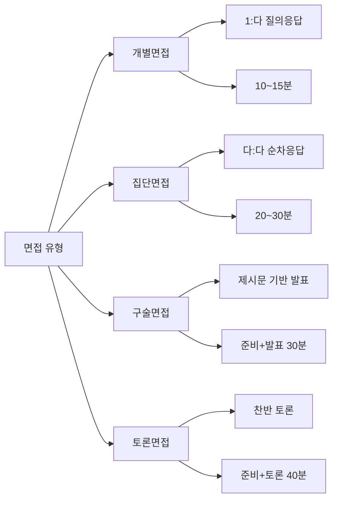
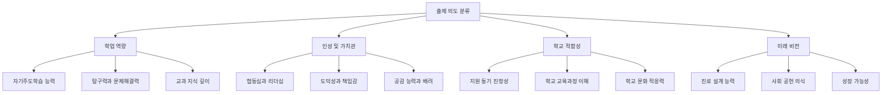
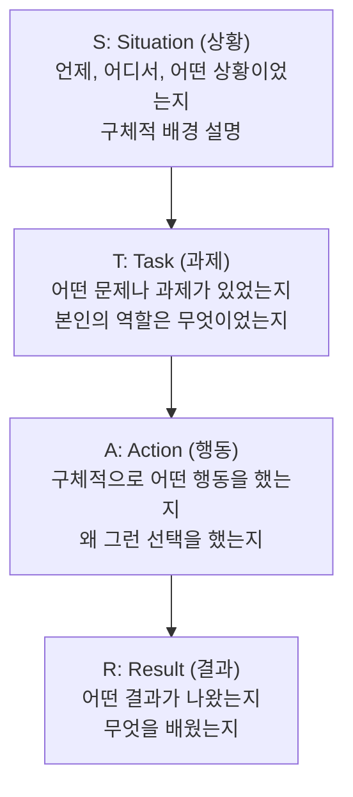
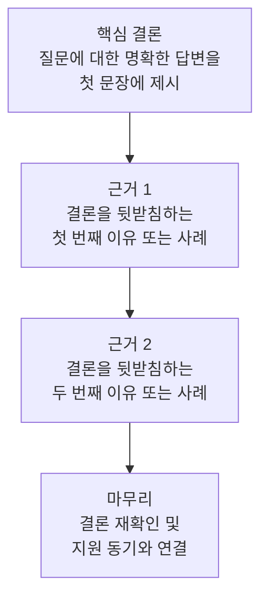
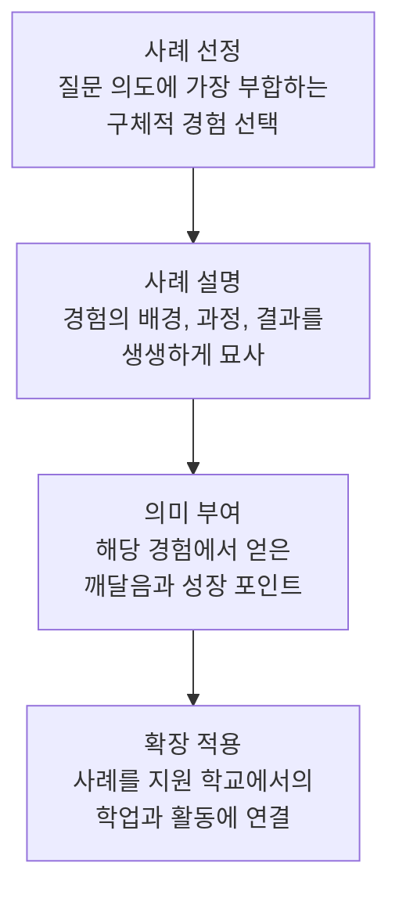

# 특수학교 면접 대비 질문집

과학고, 외국어고, 자율형 사립고 등 특수목적고등학교 면접을 체계적으로 준비할 수 있도록 구성한 종합 가이드입니다. 면접 유형 분류부터 빈출 질문, 모범 답변 프레임워크, 압박 면접 대처법, 면접 복장과 태도, 체크리스트까지 실전에 필요한 모든 내용을 담았습니다.

---

## 1. 면접 유형 분류

특수목적고등학교 면접은 학교와 전형에 따라 다양한 형태로 진행됩니다. 각 유형의 특징과 평가 기준을 정확히 이해해야 효과적으로 대비할 수 있습니다.

### 1-1. 개별면접

개별면접은 지원자 1명이 면접관 2~3명 앞에서 질의응답을 진행하는 가장 기본적인 면접 형태입니다.

**특징**
- 면접 시간: 보통 10~15분
- 지원자 개인의 역량과 인성을 깊이 있게 평가
- 자기소개서와 학교생활기록부를 기반으로 질문 구성
- 지원자의 답변에 따라 추가 질문(꼬리 질문)이 이어짐

**평가 기준**
- 자기주도학습 능력과 학업 의지
- 논리적 사고력과 표현력
- 인성 및 가치관
- 해당 학교에 대한 이해도와 지원 동기의 진정성

| 구분 | 내용 |
| --- | --- |
| 장점 | 개인별 맞춤 질문이 가능하여 자신의 강점을 충분히 어필할 수 있음 |
| 장점 | 면접관과 깊이 있는 대화가 가능함 |
| 장점 | 자기소개서 내용을 구체적으로 설명할 기회가 주어짐 |
| 단점 | 면접관의 시선이 자신에게만 집중되어 긴장감이 높음 |
| 단점 | 꼬리 질문에 대한 즉각적인 대응력이 요구됨 |
| 단점 | 답변 시간 관리가 어려울 수 있음 |

### 1-2. 집단면접

집단면접은 3~5명의 지원자가 동시에 면접에 참여하는 형태입니다.

**특징**
- 면접 시간: 보통 20~30분
- 동일한 질문에 대해 순서대로 답변
- 다른 지원자의 답변을 들으면서 자신의 답변을 조정해야 함
- 협동성, 배려심, 리더십 등 대인관계 역량도 평가

**평가 기준**
- 다른 지원자와의 차별화된 답변 능력
- 경청 태도와 타인 존중
- 제한된 시간 내 핵심 전달 능력
- 자신감과 침착성

| 구분 | 내용 |
| --- | --- |
| 장점 | 다른 지원자의 답변을 참고하여 자신의 답변을 보완할 수 있음 |
| 장점 | 면접관의 시선이 분산되어 긴장감이 상대적으로 낮음 |
| 장점 | 협동 능력과 리더십을 보여줄 기회가 있음 |
| 단점 | 앞 순서 지원자가 좋은 답변을 하면 심리적 압박이 커짐 |
| 단점 | 발언 시간이 제한적이어서 충분한 어필이 어려움 |
| 단점 | 다른 지원자와 비교 평가가 직접적으로 이루어짐 |

### 1-3. 구술면접

구술면접은 제시문이나 문제를 읽고 자신의 생각을 논리적으로 발표하는 형태입니다.

**특징**
- 면접 시간: 준비 시간 10~20분 + 발표 및 질의응답 10~15분
- 수학, 과학, 사회 등 교과 관련 제시문이 주어짐
- 문제 해결 과정과 사고의 흐름을 평가
- 과학고에서 특히 많이 활용

**평가 기준**
- 제시문 이해력과 분석력
- 논리적 사고 전개 능력
- 창의적 문제 해결 능력
- 수학/과학적 원리 적용 능력

| 구분 | 내용 |
| --- | --- |
| 장점 | 사전 준비 시간이 주어져 답변을 정리할 수 있음 |
| 장점 | 학업 역량을 직접적으로 보여줄 수 있음 |
| 장점 | 암기가 아닌 사고력 중심 평가이므로 실력 있는 학생에게 유리 |
| 단점 | 제시문 유형을 예측하기 어려움 |
| 단점 | 교과 지식의 깊이가 부족하면 대응이 어려움 |
| 단점 | 발표력과 설명 능력이 함께 요구됨 |

### 1-4. 토론면접

토론면접은 주어진 주제에 대해 찬반 또는 다양한 입장에서 토론하는 형태입니다.

**특징**
- 면접 시간: 준비 시간 10~15분 + 토론 20~30분
- 4~6명이 한 조로 구성
- 사회적 이슈나 윤리적 딜레마 등이 주제로 제시
- 외국어고와 자사고에서 주로 활용

**평가 기준**
- 논리적 주장과 근거 제시 능력
- 경청과 반박 능력
- 협력적 토론 태도
- 다양한 관점 수용 능력

| 구분 | 내용 |
| --- | --- |
| 장점 | 토론 능력과 리더십을 동시에 보여줄 수 있음 |
| 장점 | 다양한 관점에서의 사고력을 어필할 수 있음 |
| 장점 | 의사소통 능력을 자연스럽게 드러낼 수 있음 |
| 단점 | 토론 경험이 부족하면 발언 기회를 잡기 어려움 |
| 단점 | 감정적으로 대응하면 큰 감점 요인이 됨 |
| 단점 | 배정된 입장이 자신의 의견과 다를 수 있음 |

### 면접 유형별 비교 종합

---

## 2. 학교 유형별 빈출 질문 30선

### 2-1. 과학고 빈출 질문 10선

과학고 면접은 수학/과학에 대한 열정과 탐구 능력, 자기주도학습 역량을 중점적으로 평가합니다.

| 번호 | 질문 | 출제 의도 | 평가 포인트 |
| --- | --- | --- | --- |
| 1 | 수학이나 과학 분야에서 가장 깊이 탐구한 주제는 무엇이며, 그 과정에서 무엇을 배웠나요? | 자기주도적 탐구 경험과 학습 깊이 확인 | 탐구 과정의 구체성, 학습 내용의 깊이, 스스로 문제를 발견하고 해결한 경험 |
| 2 | 일상생활에서 과학적 원리를 발견한 경험이 있다면 이야기해 주세요. | 과학적 호기심과 관찰력 평가 | 일상 현상에 대한 과학적 해석 능력, 호기심의 자발성, 탐구 연결 능력 |
| 3 | 과학 실험 중 예상과 다른 결과가 나온 경험이 있나요? 그때 어떻게 대처했나요? | 과학적 사고방식과 실험 태도 평가 | 오류 분석 능력, 가설 수정 과정, 실패에서 배우는 자세 |
| 4 | 가장 존경하는 과학자는 누구이며, 그 이유는 무엇인가요? | 과학사에 대한 관심도와 가치관 확인 | 과학자의 업적에 대한 이해도, 자신의 목표와 연결짓는 능력, 진정성 |
| 5 | 과학고에 진학한 후 어떤 연구를 하고 싶나요? | 진학 후 구체적 학업 계획 확인 | 연구 주제의 구체성, 실현 가능성, 과학고 교육과정에 대한 이해 |
| 6 | 수학 문제를 풀 때 자신만의 풀이 방법을 개발한 경험이 있나요? | 창의적 문제 해결 능력 평가 | 독창적 접근법, 논리적 사고 과정, 수학적 직관력 |
| 7 | 팀 프로젝트에서 의견 충돌이 있었을 때 어떻게 해결했나요? | 협업 능력과 갈등 해결 역량 평가 | 소통 능력, 타협과 조율 경험, 팀워크에 대한 이해 |
| 8 | 최근 가장 인상 깊게 읽은 과학 관련 도서는 무엇이며 어떤 점이 인상 깊었나요? | 과학적 관심의 범위와 깊이 확인 | 독서의 깊이, 비판적 사고 능력, 읽은 내용을 자기 것으로 소화하는 능력 |
| 9 | 과학고의 빠른 학습 속도와 높은 난이도에 어떻게 적응할 계획인가요? | 학업 스트레스 관리 능력과 자기인식 평가 | 자기 학습 전략의 구체성, 현실적 계획 수립 능력, 도전 의지 |
| 10 | 과학 기술의 발전이 사회에 미치는 영향에 대해 어떻게 생각하나요? | 과학과 사회의 관계에 대한 통찰력 평가 | 균형 잡힌 시각, 윤리적 고려, 사회적 책임감 |

### 2-2. 외국어고 빈출 질문 10선

외국어고 면접은 언어에 대한 열정, 국제적 감각, 다문화 이해 능력을 중점적으로 평가합니다.

| 번호 | 질문 | 출제 의도 | 평가 포인트 |
| --- | --- | --- | --- |
| 1 | 외국어를 공부하면서 가장 보람을 느낀 순간은 언제인가요? | 외국어 학습에 대한 진정한 열정 확인 | 구체적 경험의 진정성, 외국어 학습의 내재적 동기, 지속적 노력의 증거 |
| 2 | 지원한 전공 언어를 선택한 이유는 무엇인가요? | 전공 선택의 합리성과 깊이 확인 | 해당 언어권 문화에 대한 관심도, 진로와의 연계성, 선택 과정의 논리성 |
| 3 | 다른 나라의 문화를 체험하거나 이해하기 위해 노력한 경험이 있나요? | 다문화 이해 능력과 국제적 감각 평가 | 문화 체험의 구체성, 타문화 존중 태도, 국제적 시야의 폭 |
| 4 | 외국어 능력을 활용하여 사회에 어떻게 기여하고 싶나요? | 장기적 비전과 사회 공헌 의식 확인 | 구체적 진로 계획, 외국어의 도구적 가치 이해, 사회적 책임감 |
| 5 | 외국어 학습 중 슬럼프를 겪은 적이 있나요? 어떻게 극복했나요? | 학습 의지와 자기관리 능력 평가 | 어려움에 대한 솔직한 인정, 극복 전략의 구체성, 회복 탄력성 |
| 6 | 영어 이외의 외국어를 배워야 하는 이유에 대해 어떻게 생각하나요? | 다언어 학습의 가치에 대한 인식 확인 | 다양한 관점 제시 능력, 언어와 문화의 관계 이해, 논리적 설득력 |
| 7 | 외국어고 졸업 후 어떤 분야에서 일하고 싶나요? | 진로 설계의 구체성과 연계성 평가 | 외고 교육과 진로의 연결성, 진로 탐색 노력, 현실적 계획 |
| 8 | 글로벌 이슈 중 가장 관심 있는 주제는 무엇이며 왜인가요? | 국제 사회에 대한 관심도와 문제 의식 평가 | 이슈에 대한 이해 깊이, 다각적 분석 능력, 문제 해결 의지 |
| 9 | 외국어 능력이 뛰어난 사람과 그렇지 않은 사람의 차이는 무엇이라고 생각하나요? | 언어 학습에 대한 성찰과 메타인지 확인 | 학습 방법론에 대한 고민, 노력과 재능에 대한 균형 있는 시각, 자기 객관화 |
| 10 | 번역이나 통역에서 AI가 인간을 대체할 수 있다고 생각하나요? | 기술 변화에 대한 적응력과 비판적 사고 평가 | 기술의 한계와 가능성 인식, 인간 언어의 본질적 가치 이해, 미래 전망 능력 |

### 2-3. 자사고 빈출 질문 10선

자사고 면접은 자기주도학습 능력, 인성, 리더십, 그리고 학교 교육 철학에 대한 이해를 중점적으로 평가합니다.

| 번호 | 질문 | 출제 의도 | 평가 포인트 |
| --- | --- | --- | --- |
| 1 | 자기주도학습을 실천한 구체적인 사례를 이야기해 주세요. | 자기주도학습 능력의 실체 확인 | 학습 계획 수립과 실행의 구체성, 스스로 동기를 부여한 경험, 학습 결과의 실질적 성과 |
| 2 | 우리 학교에 지원한 동기는 무엇인가요? | 지원 동기의 진정성과 학교 이해도 확인 | 학교 교육 철학에 대한 이해, 자신의 목표와 학교의 연결성, 사전 조사의 깊이 |
| 3 | 리더십을 발휘한 경험이 있다면 구체적으로 말씀해 주세요. | 리더십 역량과 공동체 기여 의식 평가 | 리더십의 구체적 발휘 상황, 조직에 미친 긍정적 영향, 봉사적 리더십 여부 |
| 4 | 학교생활 중 가장 어려웠던 순간은 언제이며, 어떻게 극복했나요? | 회복 탄력성과 문제 해결 능력 평가 | 어려움에 대한 솔직한 인정, 극복 과정의 구체성, 성장과 배움 |
| 5 | 봉사활동이나 동아리 활동에서 가장 의미 있었던 경험은 무엇인가요? | 인성과 공동체 의식 평가 | 활동의 진정성, 타인에 대한 배려와 공감, 지속적 참여 의지 |
| 6 | 10년 후 자신의 모습을 이야기해 주세요. | 장기적 비전과 목표 설정 능력 확인 | 비전의 구체성, 현재 노력과의 연결성, 진로에 대한 진지한 고민 |
| 7 | 친구들 사이에서 갈등이 생겼을 때 어떻게 중재했나요? | 대인관계 능력과 갈등 해결 역량 평가 | 공감 능력, 합리적 중재 과정, 관계 회복을 위한 노력 |
| 8 | 자신의 가장 큰 단점은 무엇이며, 이를 개선하기 위해 어떤 노력을 하고 있나요? | 자기인식과 성장 의지 확인 | 솔직한 자기 분석, 구체적 개선 노력, 성장 마인드셋 |
| 9 | 우리 학교의 교육 프로그램 중 가장 참여하고 싶은 것은 무엇이며 왜인가요? | 학교 교육과정에 대한 이해도와 학습 의지 확인 | 프로그램에 대한 구체적 이해, 자신의 관심 분야와의 연결, 적극적 참여 의지 |
| 10 | 독서를 통해 자신의 가치관이 변화한 경험이 있나요? | 독서 습관과 사고력의 깊이 평가 | 책 내용에 대한 깊은 이해, 자기 성찰 능력, 가치관 형성 과정 |

---

## 3. 각 질문별 출제 의도 분석

면접 질문에는 반드시 출제 의도가 있습니다. 표면적인 질문 뒤에 숨어 있는 진짜 평가 요소를 파악해야 높은 점수를 받을 수 있습니다.

### 출제 의도 분류 체계

### 질문 유형별 출제 의도 상세 분석

**학업 역량 관련 질문의 핵심 의도**

학업 역량 질문은 단순히 성적이 좋은지를 묻는 것이 아닙니다. 면접관이 진정으로 확인하고 싶은 것은 다음과 같습니다.

- 스스로 학습 목표를 설정하고 달성한 경험이 있는가
- 단편적 지식이 아닌 깊이 있는 이해를 추구하는가
- 실패에서 배우고 성장하는 태도를 갖추고 있는가
- 교과 지식을 실생활이나 심화 탐구에 연결할 수 있는가

**인성 관련 질문의 핵심 의도**

인성 질문은 학생의 인간적 면모를 확인하기 위한 것입니다.

- 타인과의 관계에서 갈등을 건설적으로 해결할 수 있는가
- 공동체의 일원으로서 책임감을 가지고 있는가
- 자신의 단점을 인지하고 개선하려는 노력을 하는가
- 봉사와 나눔의 가치를 체험적으로 이해하고 있는가

**학교 적합성 관련 질문의 핵심 의도**

학교 적합성 질문은 해당 학교와 지원자의 적합도를 평가합니다.

- 해당 학교의 교육 철학과 특색을 정확히 이해하고 있는가
- 학교의 교육 프로그램을 적극적으로 활용할 의지가 있는가
- 학교 공동체에 긍정적인 영향을 미칠 수 있는가
- 입학 후 학교 환경에 잘 적응할 수 있는가

**미래 비전 관련 질문의 핵심 의도**

미래 비전 질문은 학생의 성장 가능성과 잠재력을 평가합니다.

- 구체적이고 현실적인 목표를 가지고 있는가
- 현재의 노력이 미래 목표와 일관성 있게 연결되는가
- 사회에 기여하겠다는 공공 의식이 있는가
- 변화하는 환경에 유연하게 대응할 수 있는가

---

## 4. 모범 답변 프레임워크

면접에서 높은 평가를 받으려면 답변을 구조화하는 프레임워크를 활용하는 것이 효과적입니다. 아래 세 가지 프레임워크를 상황에 맞게 선택하여 사용하세요.

### 4-1. STAR 기법

STAR 기법은 경험 기반 질문에 가장 효과적인 답변 구조입니다. 상황-과제-행동-결과의 흐름으로 답변을 구성합니다.

**STAR 기법 활용 요령**

| 단계 | 핵심 포인트 | 주의 사항 |
| --- | --- | --- |
| Situation | 시간, 장소, 맥락을 간결하게 제시 | 너무 긴 배경 설명은 피할 것 |
| Task | 본인이 해결해야 했던 과제를 명확히 | 과제의 난이도나 중요성을 부각 |
| Action | 자신이 직접 취한 구체적 행동 중심 | 팀 전체의 행동이 아닌 개인의 역할 강조 |
| Result | 수치화 가능한 성과 또는 구체적 변화 | 배운 점과 성장 포인트도 반드시 포함 |

**적합한 질문 유형**: 경험 기반 질문, 문제 해결 질문, 리더십 관련 질문, 갈등 해결 질문

### 4-2. 두괄식 답변법

두괄식 답변법은 결론을 먼저 말하고 근거를 뒤에 제시하는 구조입니다. 시간이 제한된 면접에서 핵심 메시지를 효과적으로 전달할 수 있습니다.

**두괄식 답변법 활용 요령**

| 단계 | 핵심 포인트 | 예시 |
| --- | --- | --- |
| 핵심 결론 | 질문의 핵심을 한 문장으로 답변 | "저는 이 문제의 핵심이 소통의 부재에 있다고 생각합니다." |
| 근거 1 | 가장 강력한 근거를 먼저 제시 | "첫째, 제가 동아리에서 경험한 바로는..." |
| 근거 2 | 보조적 근거로 설득력 보강 | "둘째, 이러한 관점은 제가 읽은 도서에서도..." |
| 마무리 | 지원 동기나 미래 계획과 연결 | "이런 경험을 바탕으로 귀교에서 더욱 성장하고 싶습니다." |

**적합한 질문 유형**: 의견을 묻는 질문, 가치관 관련 질문, 지원 동기 질문, 찬반형 질문

### 4-3. 사례 중심 답변법

사례 중심 답변법은 구체적인 경험 사례를 중심으로 답변을 구성하여 진정성과 설득력을 높이는 방법입니다.

**사례 중심 답변법 활용 요령**

| 단계 | 핵심 포인트 | 주의 사항 |
| --- | --- | --- |
| 사례 선정 | 질문 의도에 정확히 부합하는 사례 | 억지로 끼워 맞추는 사례는 역효과 |
| 사례 설명 | 감각적이고 구체적인 묘사 | 과장이나 거짓은 금물 |
| 의미 부여 | 경험에서 얻은 진정한 깨달음 | 교훈적이되 지나치게 거창하지 않게 |
| 확장 적용 | 해당 학교에서의 구체적 활용 | 학교의 실제 프로그램과 연결 |

**적합한 질문 유형**: 인성 관련 질문, 성장 경험 질문, 봉사활동 질문, 독서 관련 질문

---

## 5. 질문별 모범 답변 예시

### 예시 1: 자기주도학습 경험

**질문**: "자기주도학습을 실천한 구체적인 사례를 이야기해 주세요."

| 구분 | 답변 내용 |
| --- | --- |
| 좋은 답변 | "중학교 2학년 때 수학 함수 단원에서 어려움을 겪은 적이 있습니다. 그래서 저는 먼저 교과서의 개념을 3번 반복 정독한 후, 제가 이해한 내용을 노트에 저만의 언어로 정리했습니다. 이해가 안 되는 부분은 인터넷 강의를 참고하되, 풀이 과정을 보기 전에 반드시 30분간 스스로 고민하는 규칙을 세웠습니다. 2개월간 이 방법을 유지한 결과, 기말고사에서 함수 관련 문제를 모두 맞힐 수 있었습니다. 이 경험을 통해 어려운 내용도 체계적으로 접근하면 극복할 수 있다는 것을 배웠습니다." |
| 나쁜 답변 | "저는 항상 자기주도학습을 합니다. 매일 학원에 다니면서 복습도 하고 예습도 합니다. 성적도 잘 나옵니다. 자기주도학습을 잘한다고 생각합니다." |

**분석**: 좋은 답변은 STAR 기법을 활용하여 구체적인 상황, 행동, 결과를 포함하고 있습니다. 나쁜 답변은 추상적이고 학원 의존적이며, 자기주도학습의 본질을 이해하지 못한 것으로 보입니다.

### 예시 2: 지원 동기

**질문**: "우리 학교에 지원한 동기는 무엇인가요?"

| 구분 | 답변 내용 |
| --- | --- |
| 좋은 답변 | "저는 귀교의 '글로벌 리더십 프로그램'에 큰 매력을 느꼈습니다. 중학교 때 모의유엔 동아리에서 활동하면서 국제 문제에 대한 깊은 관심을 갖게 되었는데, 귀교의 해외 교류 프로그램과 원어민 수업 시스템이 제가 꿈꾸는 외교관의 길에 가장 적합한 환경이라고 판단했습니다. 특히 귀교 졸업생의 후기에서 소규모 토론 수업이 비판적 사고력 향상에 큰 도움이 되었다는 내용을 읽고, 이런 교육 환경에서 배우고 싶다는 확신이 들었습니다." |
| 나쁜 답변 | "부모님께서 추천해 주셨고, 이 학교가 좋은 대학에 많이 보낸다고 들었습니다. 주변에서도 이 학교가 좋다고 해서 지원했습니다." |

**분석**: 좋은 답변은 학교의 구체적 프로그램을 언급하며 자신의 경험 및 진로와 연결합니다. 나쁜 답변은 외부 요인에 의한 지원으로 진정성이 느껴지지 않습니다.

### 예시 3: 과학적 탐구 경험

**질문**: "일상생활에서 과학적 원리를 발견한 경험이 있다면 이야기해 주세요."

| 구분 | 답변 내용 |
| --- | --- |
| 좋은 답변 | "여름에 아이스크림이 녹는 속도가 장소마다 다르다는 것을 관찰한 적이 있습니다. 같은 아이스크림인데 실내와 실외, 그늘과 양지에서 녹는 속도가 달랐습니다. 이것이 궁금해서 온도뿐만 아니라 복사열, 대류 현상이 영향을 미친다는 것을 알게 되었습니다. 더 나아가 간단한 실험을 설계하여 풍속에 따른 아이스크림 용해 속도를 측정해 보았고, 대류에 의한 열전달이 생각보다 큰 영향을 미친다는 것을 확인했습니다. 이 경험을 통해 일상에서 당연하게 여기는 현상에도 과학적 원리가 숨어 있다는 것을 체감했습니다." |
| 나쁜 답변 | "무지개를 보고 빛의 굴절에 대해 알게 되었습니다. 과학 시간에 배운 내용이 실제로 일어나는 것을 보니 신기했습니다." |

**분석**: 좋은 답변은 관찰에서 출발하여 탐구 과정을 구체적으로 보여줍니다. 나쁜 답변은 단순히 교과서 지식을 확인한 수준에 머물러 탐구력이 드러나지 않습니다.

### 예시 4: 갈등 해결 경험

**질문**: "팀 프로젝트에서 의견 충돌이 있었을 때 어떻게 해결했나요?"

| 구분 | 답변 내용 |
| --- | --- |
| 좋은 답변 | "과학 탐구 대회를 준비할 때 실험 주제를 두고 팀원들 사이에서 의견이 갈린 적이 있습니다. 한 친구는 식물 성장 실험을, 다른 친구는 물의 정화 실험을 원했습니다. 저는 각자의 의견을 충분히 들은 뒤, 두 주제의 장단점을 표로 정리하여 비교해 보자고 제안했습니다. 실현 가능성, 실험 기간, 준비물 등을 기준으로 분석한 결과, 물의 정화 실험이 우리 팀의 여건에 더 적합하다는 데 합의할 수 있었습니다. 이 과정에서 객관적 기준을 세워 토론하면 감정 없이 합리적으로 결정할 수 있다는 것을 배웠습니다." |
| 나쁜 답변 | "저는 항상 친구들의 의견을 존중합니다. 다수결로 빠르게 결정하고 넘어갔습니다. 팀워크가 좋아서 별다른 갈등은 없었습니다." |

**분석**: 좋은 답변은 구체적인 갈등 상황, 해결 방법, 배운 점을 모두 포함합니다. 나쁜 답변은 갈등을 직접 해결한 경험이 없어 보이며 피상적입니다.

### 예시 5: 10년 후 비전

**질문**: "10년 후 자신의 모습을 이야기해 주세요."

| 구분 | 답변 내용 |
| --- | --- |
| 좋은 답변 | "10년 후 저는 환경공학 연구원으로서 미세먼지 저감 기술 개발에 참여하고 있을 것입니다. 과학고에서 화학과 물리의 기초를 탄탄히 다진 후, 대학에서 환경공학을 전공하고 대학원에서 대기오염 분야를 심화 연구할 계획입니다. 중학교 때 미세먼지가 심한 날 친구가 천식으로 고생하는 것을 보며 이 문제를 해결하는 데 기여하고 싶다는 목표를 세웠습니다. 이를 위해 현재 환경 관련 도서를 읽고, 학교 환경 동아리에서 대기질 모니터링 프로젝트를 진행하고 있습니다." |
| 나쁜 답변 | "좋은 대학에 가서 좋은 직장에 취직하고 싶습니다. 10년 후에는 안정적인 생활을 하고 있을 것 같습니다." |

**분석**: 좋은 답변은 구체적 진로 계획과 현재의 노력이 연결됩니다. 나쁜 답변은 목표가 추상적이며 해당 학교와의 연관성이 전혀 없습니다.

---

## 6. 압박 면접 대처법

압박 면접은 의도적으로 지원자에게 심리적 부담을 주어 스트레스 상황에서의 대처 능력을 평가하는 방식입니다. 특수목적고에서는 드물지만, 꼬리 질문이 이어지거나 답변에 반박하는 형태로 나타날 수 있습니다.

### 압박 면접의 유형과 대응 전략

| 압박 유형 | 예시 상황 | 대응 전략 |
| --- | --- | --- |
| 답변 반박형 | "방금 말한 내용에 논리적 모순이 있는데 알고 있나요?" | 당황하지 말고 자신의 논리를 재점검한 후, 부족한 부분은 솔직히 인정하고 보완 설명 |
| 침묵형 | 답변 후 면접관이 아무 반응 없이 바라봄 | 추가 설명이 필요한지 정중히 여쭈거나, 핵심을 한 문장으로 요약하여 마무리 |
| 난이도 상승형 | 점점 어려운 꼬리 질문이 이어짐 | 모르는 것은 솔직히 모른다고 말하되, 알고 있는 범위 내에서 최선의 답변 시도 |
| 비교형 | "다른 지원자는 이렇게 답했는데 어떻게 생각해요?" | 다른 지원자의 답변을 존중하면서도 자신의 관점을 논리적으로 설명 |
| 가치관 도전형 | "그렇게 생각하는 건 편견 아닌가요?" | 감정적 반응 대신 근거를 제시하며, 다른 관점도 수용할 수 있음을 보여줌 |

### 압박 면접 대처의 핵심 원칙

1. **침착함 유지**: 깊은 호흡을 하고 2~3초간 생각을 정리한 후 답변합니다
2. **솔직한 인정**: 모르는 것은 모른다고 솔직히 인정합니다. 거짓말은 더 큰 위기를 초래합니다
3. **논리적 재구성**: 반박을 받았을 때, 감정적으로 방어하지 말고 논리적으로 보완합니다
4. **긍정적 마무리**: 어떤 상황에서도 배우겠다는 자세로 마무리합니다

### 압박 상황 시나리오별 대응 예시

**시나리오 1: 답변에 대한 반박**

- 면접관: "수학을 좋아한다고 했는데, 수학 성적이 그렇게 높지는 않네요?"
- 대응: "네, 말씀하신 대로 2학년 1학기에 수학 성적이 다소 낮았습니다. 당시 심화 과정으로 넘어가면서 어려움을 겪었으나, 이후 기본 개념을 다시 정리하는 시간을 가졌고 2학기부터 꾸준히 상승했습니다. 어려움을 겪은 경험이 오히려 기초의 중요성을 깨닫게 해주었고, 이후 학습 방법을 크게 개선하는 계기가 되었습니다."

**시나리오 2: 예상 밖의 도전적 질문**

- 면접관: "과학고에 떨어지면 어떻게 할 건가요?"
- 대응: "물론 귀교에 합격하는 것이 첫 번째 목표이지만, 혹시 기대와 다른 결과가 나오더라도 제가 과학을 사랑하는 마음은 변하지 않을 것입니다. 어떤 학교에 가더라도 과학 탐구 활동을 이어갈 것이며, 귀교에서 배우고 싶었던 내용을 스스로 찾아 공부하겠습니다. 다만, 귀교에서 함께 성장하고 싶다는 저의 강한 의지는 변함없습니다."

---

## 7. 예상치 못한 질문 대응 전략

면접에서는 준비하지 못한 질문이 반드시 나옵니다. 당황하더라도 체계적인 대응 절차를 익혀두면 좋은 답변을 만들 수 있습니다.

### 단계별 대응 전략

| 단계 | 행동 | 구체적 방법 |
| --- | --- | --- |
| 1단계: 수용 | 질문을 듣고 당황하는 감정을 인정 | 속으로 "예상 못한 질문이 나왔다"고 인정하고 받아들임 |
| 2단계: 시간 확보 | 생각할 시간을 자연스럽게 확보 | "좋은 질문 감사합니다. 잠시 생각을 정리하겠습니다."라고 말함 |
| 3단계: 핵심 파악 | 질문의 핵심 키워드와 의도 파악 | 질문 속 핵심 단어를 찾고, 면접관이 알고 싶어하는 것이 무엇인지 추론 |
| 4단계: 연결 고리 | 자신의 경험이나 가치관과 연결 | 직접적 답이 없어도 관련 경험이나 생각을 연결하여 답변 구성 |
| 5단계: 구조화 | 두괄식으로 답변 구조화 | 결론을 먼저 말하고, 1~2가지 근거를 제시하며, 마무리로 연결 |
| 6단계: 솔직함 | 모르는 부분은 솔직히 인정 | "정확히 알지는 못하지만, 제 생각에는..."으로 시작 |

### 예상 밖 질문의 유형별 대응법

**창의적 사고형 질문**
- 예: "만약 당신이 교장 선생님이라면 학교를 어떻게 바꾸고 싶나요?"
- 대응법: 자신의 학교생활 경험에서 느꼈던 개선점을 떠올리고, 구체적이고 현실적인 제안을 합니다

**딜레마형 질문**
- 예: "친한 친구가 시험 중 부정행위를 하는 것을 발견했다면 어떻게 하겠나요?"
- 대응법: 한쪽 입장만 택하기보다 양쪽의 가치를 모두 고려하는 균형 잡힌 답변을 합니다

**시사 이슈형 질문**
- 예: "AI가 인간의 일자리를 대체하는 것에 대해 어떻게 생각하나요?"
- 대응법: 찬반 양쪽의 논거를 간략히 제시한 후 자신의 입장을 명확히 밝힙니다

**자기성찰형 질문**
- 예: "인생에서 가장 후회하는 일은 무엇인가요?"
- 대응법: 진솔하게 후회 경험을 공유하되, 그 경험에서 얻은 교훈과 변화에 초점을 맞춥니다

---

## 8. 면접 복장과 태도 가이드

면접에서 첫인상은 매우 중요합니다. 복장과 태도가 면접 평가에 직접적인 영향을 미치지는 않지만, 전반적인 인상에 큰 차이를 만듭니다.

### 남학생 복장 체크리스트

| 항목 | 권장 사항 | 피해야 할 사항 |
| --- | --- | --- |
| 교복 상의 | 깨끗하게 세탁하고 다림질한 상태 | 구김이 심하거나 얼룩이 있는 교복 |
| 교복 하의 | 적절한 길이의 깔끔한 바지 | 너무 짧거나 헐렁한 바지 |
| 신발 | 깨끗한 단화 또는 운동화 | 슬리퍼, 샌들, 지나치게 화려한 운동화 |
| 머리 스타일 | 단정하게 정리된 자연스러운 머리 | 염색, 과도한 헤어 스타일링 |
| 액세서리 | 착용하지 않는 것이 바람직 | 귀걸이, 목걸이, 팔찌 등 |
| 가방 | 깔끔한 학생용 가방 | 화려하거나 캐릭터가 그려진 가방 |
| 겉옷 | 단정한 외투, 면접장에서는 벗기 | 후드티, 패딩 등을 입은 채 면접 진행 |

### 여학생 복장 체크리스트

| 항목 | 권장 사항 | 피해야 할 사항 |
| --- | --- | --- |
| 교복 상의 | 깨끗하게 세탁하고 다림질한 상태 | 구김이 심하거나 장식이 과한 교복 |
| 교복 하의 | 적절한 길이의 치마 또는 바지 | 너무 짧은 치마, 규정 외 하의 |
| 신발 | 깨끗한 단화 또는 낮은 굽 구두 | 하이힐, 슬리퍼, 지나치게 화려한 신발 |
| 머리 스타일 | 단정하게 묶거나 정리한 머리 | 염색, 과도한 헤어 액세서리 |
| 화장 | 하지 않거나 최소한의 기초 화장 | 눈에 띄는 색조 화장 |
| 액세서리 | 착용하지 않는 것이 바람직 | 화려한 귀걸이, 목걸이 등 |
| 가방 | 깔끔한 학생용 가방 | 명품 가방, 화려한 디자인 |

### 면접 태도 체크리스트

| 항목 | 구체적 행동 |
| --- | --- |
| 입장 | 문을 가볍게 노크한 후 "들어가겠습니다" 인사 후 입장 |
| 인사 | 면접관을 향해 허리를 30도 정도 숙이며 "안녕하십니까" 인사 |
| 착석 | "앉겠습니다"라고 말한 후 의자에 깊이 앉지 않고 등을 곧게 |
| 시선 | 답변 시 질문한 면접관의 눈을 바라보되, 다른 면접관에게도 적절히 시선 분배 |
| 손 위치 | 양손을 무릎 위에 가지런히 놓기 |
| 목소리 | 적당한 크기로 또박또박 발음, 너무 빠르지 않은 속도 |
| 경청 | 질문을 끝까지 듣고, 중간에 끊지 않기 |
| 표정 | 자연스러운 미소를 유지하되, 진지한 질문에는 진지한 표정 |
| 퇴장 | "감사합니다"라고 인사한 후 의자를 정리하고 퇴장 |

---

## 9. 면접 전날/당일 체크리스트

### 면접 일주일 전 준비 사항

| 날짜 | 준비 항목 | 세부 내용 |
| --- | --- | --- |
| D-7 | 면접 장소 확인 | 학교 위치, 교통편, 소요 시간 사전 파악 |
| D-7 | 교복 점검 | 교복 세탁, 다림질, 단추와 지퍼 확인 |
| D-6 | 자기소개서 복습 | 자기소개서 내용을 완벽히 숙지하고, 예상 꼬리 질문 준비 |
| D-6 | 학교 정보 재확인 | 지원 학교의 교육 철학, 특색 프로그램, 최근 뉴스 확인 |
| D-5 | 예상 질문 연습 | 빈출 질문 30선에 대한 답변 연습 시작 |
| D-5 | 모의 면접 1차 | 가족이나 선생님과 모의 면접 실시 |
| D-4 | 답변 보완 | 모의 면접에서 부족했던 답변 수정 및 보완 |
| D-4 | 시사 이슈 정리 | 최근 1개월간 주요 시사 이슈 3~5개 정리 |
| D-3 | 모의 면접 2차 | 실전과 동일한 환경에서 모의 면접 실시 |
| D-3 | 태도 연습 | 입장, 인사, 착석, 퇴장 등 기본 예절 연습 |
| D-2 | 최종 점검 | 준비물 최종 확인, 교통편 재확인 |
| D-2 | 컨디션 관리 | 일찍 취침, 과격한 운동이나 늦은 외출 자제 |

### 면접 전날 체크리스트

| 시간대 | 해야 할 일 | 주의 사항 |
| --- | --- | --- |
| 오전 | 핵심 답변 최종 복습 (1~2시간만) | 새로운 내용 학습은 피하고 정리 위주로 |
| 오후 | 가벼운 산책이나 스트레칭으로 긴장 해소 | 과격한 운동은 피하기 |
| 저녁 | 소화가 잘 되는 가벼운 식사 | 기름진 음식, 새로운 음식은 피하기 |
| 밤 8시 | 준비물 최종 확인 및 가방 정리 | 수험표, 신분증, 필기도구, 여분의 마스크 |
| 밤 9시 | 알람 설정 후 취침 | 면접 시간 2시간 전에 도착 목표로 알람 설정 |

### 면접 당일 타임라인

| 시간 | 행동 | 체크 포인트 |
| --- | --- | --- |
| 기상 | 알람에 맞춰 일어나기 | 충분한 수면 확인 |
| 기상 후 30분 | 세면, 양치, 복장 갖추기 | 교복 상태 최종 확인 |
| 기상 후 1시간 | 간단한 아침 식사 | 속이 편한 음식으로 가볍게 |
| 출발 전 | 준비물 최종 확인 | 수험표, 신분증, 물, 간식 |
| 이동 중 | 핵심 키워드만 가볍게 복습 | 새로운 내용 학습은 절대 금지 |
| 도착 후 | 면접장 위치 확인, 화장실 방문 | 도착 시간: 면접 시작 30분 전 |
| 대기 중 | 심호흡, 긍정적 자기 암시 | 다른 지원자와 불필요한 비교 자제 |
| 면접 직전 | 마지막 심호흡, 미소 연습 | 자신감 있는 표정과 자세 준비 |
| 면접 후 | 감사 인사 후 차분하게 퇴장 | 면접 내용 간략히 메모(자기 평가용) |

---

## 10. 면접 후 자기 평가 시트

면접이 끝난 후 자기 평가를 통해 강점과 약점을 파악하면, 이후 면접이나 다른 전형에서 더 나은 성과를 낼 수 있습니다. 면접 직후 기억이 선명할 때 작성하는 것이 좋습니다.

### 종합 평가 루브릭

| 평가 항목 | 5점 (매우 우수) | 4점 (우수) | 3점 (보통) | 2점 (미흡) | 1점 (매우 미흡) |
| --- | --- | --- | --- | --- | --- |
| 답변 내용의 구체성 | 모든 답변에 구체적 사례와 수치 포함 | 대부분 구체적이나 일부 추상적 | 절반 정도 구체적 | 대부분 추상적이고 막연함 | 구체적 사례가 전혀 없음 |
| 논리적 구조 | 모든 답변이 체계적으로 구조화됨 | 대부분 논리적이나 일부 산만 | 절반 정도 구조화 | 대부분 두서없이 답변 | 논리적 구조 전혀 없음 |
| 자신감과 태도 | 당당하고 자연스러운 태도 유지 | 약간의 긴장은 있었으나 안정적 | 때때로 긴장이 드러남 | 상당히 긴장하여 답변에 영향 | 극심한 긴장으로 답변 불가 |
| 시선 처리 | 면접관과 자연스러운 눈 맞춤 | 대체로 적절한 시선 처리 | 간혹 시선 회피 | 자주 시선 회피 | 면접관과 눈을 마주치지 못함 |
| 목소리와 발음 | 또렷하고 적절한 속도와 음량 | 대체로 명확하나 일부 작은 소리 | 때때로 발음이 불명확 | 자주 웅얼거리거나 너무 빠름 | 거의 알아들을 수 없음 |
| 질문 이해도 | 모든 질문의 의도를 정확히 파악 | 대부분 질문 의도를 잘 파악 | 일부 질문에서 의도 파악 실패 | 자주 질문 의도를 오해 | 질문을 거의 이해하지 못함 |
| 시간 관리 | 모든 답변이 적절한 길이로 마무리 | 대부분 적절하나 일부 과다 또는 과소 | 절반 정도 시간 관리 성공 | 자주 답변이 너무 길거나 짧음 | 시간 관리 전혀 안 됨 |
| 예의와 매너 | 완벽한 면접 예절을 보여줌 | 대부분 예의 바르나 사소한 실수 | 기본적 예절은 지킴 | 일부 예절에서 부적절한 행동 | 기본적 예절도 지키지 못함 |

### 질문별 자기 평가표

면접에서 받은 각 질문에 대해 아래 항목을 기록합니다.

| 평가 요소 | 평가 기준 |
| --- | --- |
| 받은 질문 | 면접에서 받은 질문을 정확히 기록 |
| 나의 답변 요약 | 내가 실제로 한 답변의 핵심을 기록 |
| 질문 의도 파악 여부 | 질문의 진짜 의도를 파악했는지 자가 평가 |
| 답변 만족도 | 5점 만점으로 자가 채점 |
| 잘한 점 | 답변에서 좋았던 부분 기록 |
| 아쉬운 점 | 답변에서 부족했던 부분 기록 |
| 더 좋은 답변 | 지금 생각해보면 이렇게 답했어야 했다는 개선안 기록 |

### 면접 전체 성찰 항목

| 성찰 항목 | 기록 내용 |
| --- | --- |
| 가장 잘 답변한 질문 | 어떤 질문이었고 왜 잘 답했는지 |
| 가장 아쉬운 답변 | 어떤 질문이었고 왜 아쉬웠는지 |
| 예상 밖의 질문 | 예상하지 못했던 질문과 나의 대응 |
| 면접 분위기 | 면접관의 태도, 면접장 분위기 등 |
| 다음에 개선할 점 | 구체적인 개선 방법 3가지 이상 |
| 전체 자기 평가 점수 | 100점 만점 기준 자가 채점 |

---

## 부록: 면접 준비 핵심 요약

### 면접 유형별 핵심 대비 전략 요약

| 면접 유형 | 핵심 대비 전략 | 연습 방법 |
| --- | --- | --- |
| 개별면접 | 자기소개서 기반 예상 질문 30개 이상 준비 | 거울 앞에서 혼자 연습, 가족과 모의면접 |
| 집단면접 | 타인 답변에 영향받지 않는 자기 답변 확보 | 친구들과 조를 짜서 모의 집단면접 실시 |
| 구술면접 | 교과 심화 문제 풀이 연습, 사고 과정 말로 설명하기 | 수학/과학 문제를 풀고 풀이 과정을 소리 내어 설명 |
| 토론면접 | 시사 이슈에 대한 찬반 논거 정리, 경청 연습 | 가족과 식사 시간에 토론 연습, 뉴스 시청 후 의견 정리 |

### 학교 유형별 면접 핵심 키워드

| 학교 유형 | 핵심 평가 키워드 | 반드시 준비할 내용 |
| --- | --- | --- |
| 과학고 | 탐구력, 창의성, 과학적 사고, 실험 정신 | 자기주도 탐구 경험 2~3개, 과학 관련 독서 목록, 진학 후 연구 계획 |
| 외국어고 | 언어 열정, 국제 감각, 다문화 이해, 소통 능력 | 외국어 학습 경험, 글로벌 이슈 3~5개 정리, 진로와 언어의 연결점 |
| 자사고 | 자기주도성, 리더십, 인성, 학교 이해도 | 자기주도학습 사례, 리더십 발휘 경험, 학교 교육 프로그램 조사 |

---

면접은 암기가 아닌 소통의 과정입니다. 이 가이드를 바탕으로 충분히 연습하되, 면접장에서는 준비한 답변을 그대로 외우지 말고 면접관과 진정성 있는 대화를 나누세요. 자신의 경험과 생각을 솔직하고 논리적으로 전달하는 것이 가장 좋은 면접 전략입니다.
