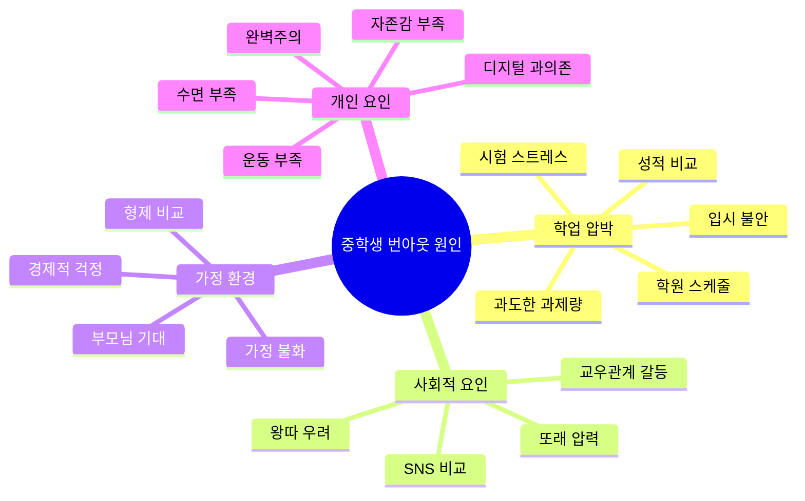
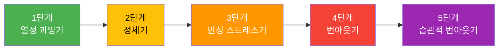
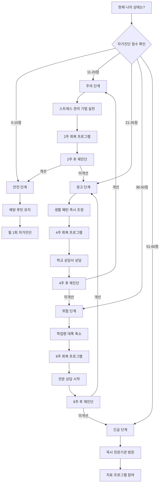
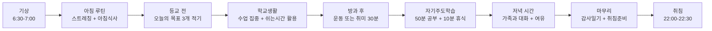
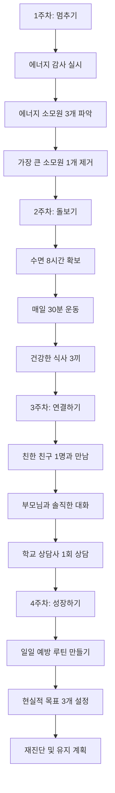
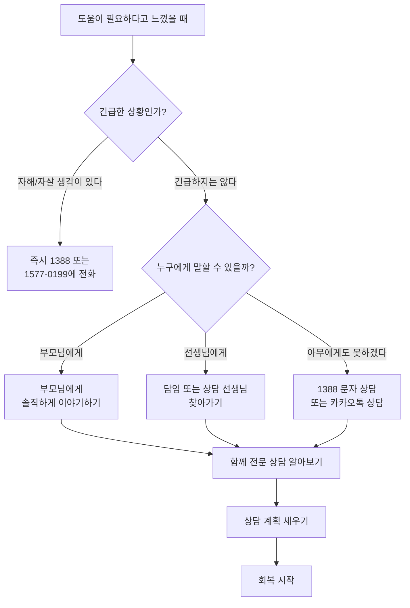

# 번아웃 예방 & 회복 가이드

> 지치고 힘든 너에게 전하는 실전 회복 매뉴얼

---

## 목차

1. [번아웃이란?](#1-번아웃이란)
2. [중학생 번아웃 자가진단 테스트](#2-중학생-번아웃-자가진단-테스트)
3. [번아웃 5단계 모델과 대처법](#3-번아웃-5단계-모델과-대처법)
4. [번아웃 예방 루틴](#4-번아웃-예방-루틴)
5. [학업 스트레스 관리 기법 10가지](#5-학업-스트레스-관리-기법-10가지)
6. [번아웃 회복 프로그램](#6-번아웃-회복-프로그램)
7. [수면 운동 식단 관리법](#7-수면-운동-식단-관리법)
8. [디지털 디톡스 실천법](#8-디지털-디톡스-실천법)
9. [전문 도움이 필요한 신호와 상담 안내](#9-전문-도움이-필요한-신호와-상담-안내)
10. [시험 기간 멘탈 관리 특별편](#10-시험-기간-멘탈-관리-특별편)
11. [부모님과 함께하는 번아웃 예방](#11-부모님과-함께하는-번아웃-예방)

---

## 1. 번아웃이란?

### 1-1. 번아웃의 정의

번아웃(Burnout)은 장기간에 걸친 과도한 스트레스로 인해 신체적, 정서적, 정신적으로 완전히 지쳐버린 상태를 말합니다. 세계보건기구(WHO)는 2019년 번아웃을 "만성적인 직장 스트레스가 성공적으로 관리되지 않아 발생하는 증후군"으로 공식 분류했습니다.

중학생에게 번아웃은 학업, 교우관계, 가정환경, 진로 고민 등 여러 스트레스가 겹치면서 나타납니다. "공부가 하기 싫다"는 단순한 귀찮음과 달리, 번아웃은 아무리 노력해도 회복되지 않는 깊은 피로감이 특징입니다.

### 1-2. 번아웃의 3가지 핵심 증상

| 증상 영역 | 구체적 증상 | 중학생 예시 |
|-----------|------------|------------|
| 정서적 고갈 | 감정이 메마르고 무기력함 | "아무것도 하고 싶지 않아" |
| 비인격화(냉소) | 주변 사람이나 활동에 대한 부정적 태도 | "공부해봤자 뭐 하나", "학교 가기 싫어" |
| 성취감 저하 | 자신의 능력에 대한 의심과 좌절 | "난 아무리 해도 안 돼" |

### 1-3. 번아웃과 일반 피로의 차이

| 구분 | 일반 피로 | 번아웃 |
|------|----------|--------|
| 회복 시간 | 하루 쉬면 회복됨 | 며칠 쉬어도 나아지지 않음 |
| 감정 상태 | 피곤하지만 희망이 있음 | 무기력하고 희망이 없음 |
| 동기 부여 | 쉬고 나면 다시 의욕 생김 | 쉬어도 의욕이 생기지 않음 |
| 수면 영향 | 잠을 자면 개운함 | 아무리 자도 피곤함 |
| 집중력 | 일시적 저하 | 만성적 저하 |
| 대인관계 | 크게 영향 없음 | 친구, 가족에게 짜증이 남 |
| 신체 증상 | 가벼운 피로감 | 두통, 소화불량, 면역력 저하 |

### 1-4. 중학생 번아웃의 주요 원인

---

## 2. 중학생 번아웃 자가진단 테스트

아래 20문항을 읽고, 최근 2주간 자신의 상태에 해당하는 점수를 체크해 보세요.

**점수 기준**
- 0점: 전혀 그렇지 않다
- 1점: 가끔 그렇다
- 2점: 자주 그렇다
- 3점: 항상 그렇다

### 자가진단 문항

| 번호 | 문항 | 0 | 1 | 2 | 3 |
|------|------|---|---|---|---|
| 1 | 아침에 일어나기가 너무 힘들고 학교에 가기 싫다 | | | | |
| 2 | 공부를 시작하려고 하면 머리가 아프거나 배가 아프다 | | | | |
| 3 | 전에는 좋아하던 활동(취미, 운동 등)이 더 이상 재미없다 | | | | |
| 4 | 친구들과 어울리는 것이 귀찮고 혼자 있고 싶다 | | | | |
| 5 | 잠을 충분히 자도 계속 피곤하다 | | | | |
| 6 | 작은 일에도 짜증이 나고 화가 난다 | | | | |
| 7 | 공부를 해도 성적이 오르지 않아 포기하고 싶다 | | | | |
| 8 | 미래에 대해 생각하면 막막하고 불안하다 | | | | |
| 9 | 집중력이 떨어져서 같은 내용을 여러 번 읽어야 한다 | | | | |
| 10 | 밤에 잠이 잘 오지 않거나 자주 깬다 | | | | |
| 11 | 식욕이 줄거나 반대로 폭식을 한다 | | | | |
| 12 | "나는 능력이 부족하다"는 생각이 자주 든다 | | | | |
| 13 | 해야 할 일이 너무 많아서 어디서부터 시작해야 할지 모르겠다 | | | | |
| 14 | 핸드폰이나 게임에 시간을 많이 쓰지만 그마저도 재미없다 | | | | |
| 15 | 두통, 어지러움, 소화불량 등 몸이 자주 아프다 | | | | |
| 16 | 부모님이나 선생님의 기대가 부담스럽다 | | | | |
| 17 | "지금 이 시간이 빨리 지나갔으면 좋겠다"는 생각을 자주 한다 | | | | |
| 18 | 계획을 세워도 실행하지 못하고 자책한다 | | | | |
| 19 | 나보다 잘하는 친구를 보면 의욕이 사라진다 | | | | |
| 20 | 웃거나 즐거운 감정을 느끼는 일이 줄었다 | | | | |

### 점수 해석표

| 총점 | 상태 | 설명 | 권장 조치 |
|------|------|------|----------|
| 0-10점 | 안전 (초록) | 전반적으로 건강한 상태입니다 | 현재 루틴 유지, 예방 습관 만들기 |
| 11-20점 | 주의 (노랑) | 가벼운 스트레스 상태입니다 | 스트레스 관리 기법 실천 시작 |
| 21-35점 | 경고 (주황) | 번아웃 초기 단계에 진입했습니다 | 즉시 생활 패턴 조정 필요, 주변에 도움 요청 |
| 36-50점 | 위험 (빨강) | 심각한 번아웃 상태입니다 | 전문 상담 권장, 학업량 조절 필수 |
| 51-60점 | 긴급 (검정) | 즉각적인 도움이 필요합니다 | 반드시 전문가 상담, 충분한 휴식 필수 |

### 영역별 세부 분석

| 영역 | 해당 문항 | 소계 점수 계산 |
|------|----------|---------------|
| 신체적 고갈 | 1, 2, 5, 10, 11, 15 | 합계 ___ / 18 |
| 정서적 고갈 | 3, 6, 14, 17, 20 | 합계 ___ / 15 |
| 학업 효능감 저하 | 7, 9, 12, 13, 18 | 합계 ___ / 15 |
| 사회적 위축 | 4, 8, 16, 19 | 합계 ___ / 12 |

**특히 주의해야 할 문항**: 문항 8, 17, 20에서 3점(항상 그렇다)에 체크했다면, 총점과 관계없이 신뢰할 수 있는 어른(부모님, 선생님, 상담사)과 이야기하는 것을 권합니다.

---

## 3. 번아웃 5단계 모델과 대처법

### 3-1. 번아웃 진행 단계

### 3-2. 각 단계별 상세 설명과 대처법

#### 1단계: 열정 과잉기 (Honeymoon Phase)

**특징**
- 새 학년, 새 목표에 대한 높은 의욕
- "이번엔 진짜 열심히 해야지!" 하는 다짐
- 자발적으로 학원을 늘리거나 공부 시간을 과도하게 잡음
- 수면을 줄여가며 공부함

**위험 신호**
- 하루 공부 시간이 8시간 이상
- 취미나 운동 시간을 "시간 낭비"로 여김
- 쉬는 시간에도 불안함

**대처법**

| 전략 | 구체적 실천 방법 |
|------|----------------|
| 현실적 목표 설정 | 하루 최대 집중 공부 시간을 4-5시간으로 제한 |
| 쉬는 시간 확보 | 50분 공부 후 반드시 10분 휴식 |
| 취미 유지 | 주 3회 이상 좋아하는 활동 하기 |
| 수면 보장 | 최소 8시간 수면 사수 |
| 목표 점검 | 매주 일요일 목표가 현실적인지 검토 |

#### 2단계: 정체기 (Onset of Stress)

**특징**
- 처음의 열정이 사라지기 시작
- 계획대로 되지 않아 조바심
- 가끔 집중이 안 되는 날이 생김
- 약간의 두통이나 피로를 느낌

**위험 신호**
- "왜 나만 안 되지?" 하는 생각
- 계획표를 계속 수정하게 됨
- 친구와의 약속을 미루기 시작

**대처법**

| 전략 | 구체적 실천 방법 |
|------|----------------|
| 완벽주의 내려놓기 | 80% 달성을 목표로 하기 |
| 작은 성취 기록 | 매일 잘한 점 3가지 적기 |
| 비교 줄이기 | SNS 사용 시간 줄이기 |
| 사회적 연결 | 일주일에 한 번 친구와 만나기 |
| 자기 대화 점검 | 부정적 혼잣말을 긍정적으로 바꾸기 |

#### 3단계: 만성 스트레스기 (Chronic Stress)

**특징**
- 무기력감이 일상화됨
- 신체 증상이 자주 나타남(두통, 소화불량)
- 짜증과 분노가 잦아짐
- 성적이 정체되거나 하락

**위험 신호**
- 학교 지각이나 결석이 늘어남
- 부모님이나 친구와 자주 다툼
- 공부 시작 전 핸드폰을 1시간 이상 함
- 몸이 자주 아픔

**대처법**

| 전략 | 구체적 실천 방법 |
|------|----------------|
| 일정 축소 | 학원 1-2개 줄이기 |
| 전문 상담 | 학교 상담사 또는 Wee센터 방문 |
| 신체 활동 | 매일 30분 걷기나 가벼운 운동 |
| 감정 표현 | 일기 쓰기 또는 신뢰하는 사람과 대화 |
| 구조화된 휴식 | 매일 최소 2시간 "아무것도 안 하는 시간" 확보 |

#### 4단계: 번아웃기 (Burnout)

**특징**
- 심각한 무기력과 우울감
- 학업에 대한 완전한 흥미 상실
- 대인관계 회피
- 신체 건강 악화 (면역력 저하, 만성 피로)

**위험 신호**
- 학교를 갈 수 없을 정도의 무기력
- "모든 게 의미없다"는 생각
- 울음이 잦거나 감정이 없음
- 자해나 자살에 대한 생각

**대처법**

| 전략 | 구체적 실천 방법 |
|------|----------------|
| 즉시 도움 요청 | 부모님, 선생님에게 현재 상태 알리기 |
| 전문가 상담 | 청소년 상담 전화 1388, 정신건강 복지센터 |
| 학업 중단 고려 | 일시적 학원 중단 및 학업량 대폭 축소 |
| 기본 생활 회복 | 먹기, 자기, 움직이기에만 집중 |
| 안전한 환경 | 스트레스 요인에서 물리적으로 거리 두기 |

#### 5단계: 습관적 번아웃기 (Habitual Burnout)

**특징**
- 번아웃이 삶의 일부가 된 상태
- 만성적 우울감
- 학습된 무기력
- 자존감 극도로 저하

**대처법**: 이 단계에서는 반드시 전문가의 도움이 필요합니다. 가까운 청소년 정신건강 전문기관을 방문하세요.

### 3-3. 번아웃 단계별 회복 흐름도

---

## 4. 번아웃 예방 루틴

### 4-1. 일일 루틴

**이상적인 하루 시간표**

| 시간 | 활동 | 포인트 |
|------|------|--------|
| 06:30 | 기상 | 알람 1개만, 바로 이불 개기 |
| 06:30-07:00 | 스트레칭 + 세면 | 5분 스트레칭으로 몸 깨우기 |
| 07:00-07:30 | 아침 식사 | 반드시 먹기, 단백질 포함 |
| 07:30-08:00 | 등교 준비 | 오늘의 목표 3개 수첩에 적기 |
| 08:00-15:30 | 학교 생활 | 수업 집중, 쉬는 시간에 친구와 대화 |
| 15:30-16:00 | 하교 후 간식 | 건강한 간식 + 잠깐의 멍때리기 |
| 16:00-16:30 | 운동/산책 | 몸을 움직이는 활동 |
| 16:30-18:30 | 자기주도학습 | 50분 공부 + 10분 휴식 x 2세트 |
| 18:30-19:30 | 저녁 식사 + 가족 시간 | 핸드폰 내려놓고 대화하기 |
| 19:30-21:00 | 자유 시간/학원 | 학원 또는 취미 활동 |
| 21:00-21:30 | 내일 준비 + 감사일기 | 오늘 감사한 점 3가지 적기 |
| 21:30-22:00 | 취침 준비 | 핸드폰 충전함에 놓기, 독서 |
| 22:00 | 취침 | 8.5시간 수면 확보 |

### 4-2. 주간 루틴

| 요일 | 특별 활동 | 목적 |
|------|----------|------|
| 월요일 | 이번 주 목표 설정 (3개 이하) | 방향 설정 |
| 화요일 | 친구와 함께하는 활동 1가지 | 사회적 연결 |
| 수요일 | 중간 점검 - 무리한 일정 조정 | 유연한 계획 |
| 목요일 | 새로운 것 하나 시도하기 | 호기심 유지 |
| 금요일 | 이번 주 잘한 점 기록 | 성취감 확인 |
| 토요일 | 자유의 날 - 하고 싶은 것 하기 | 자율성 회복 |
| 일요일 | 다음 주 준비 + 충분한 휴식 | 재충전 |

**주간 번아웃 예방 체크리스트**

| 항목 | 월 | 화 | 수 | 목 | 금 | 토 | 일 |
|------|---|---|---|---|---|---|---|
| 8시간 이상 수면 | | | | | | | |
| 30분 이상 운동/산책 | | | | | | | |
| 친구와 대화 | | | | | | | |
| 취미 활동 | | | | | | | |
| 감사일기 작성 | | | | | | | |
| 핸드폰 사용 2시간 이내 | | | | | | | |
| 건강한 식사 3끼 | | | | | | | |

### 4-3. 월간 루틴

| 주차 | 활동 | 세부 내용 |
|------|------|----------|
| 1주차 | 자가진단 테스트 실시 | 20문항 자가진단으로 현재 상태 체크 |
| 2주차 | 목표 중간점검 | 이번 달 목표 달성률 확인 및 조정 |
| 3주차 | 보상의 날 | 한 달 동안 노력한 자신에게 선물하기 |
| 4주차 | 되돌아보기 | 이번 달 좋았던 점, 힘들었던 점 기록 |

---

## 5. 학업 스트레스 관리 기법 10가지

### 기법 1: 뽀모도로 기법 (Pomodoro Technique)

**방법**: 25분 집중 공부 + 5분 휴식을 4세트 한 후, 15-30분 긴 휴식

| 세트 | 공부 시간 | 휴식 시간 | 휴식 활동 예시 |
|------|----------|----------|--------------|
| 1세트 | 25분 | 5분 | 스트레칭 |
| 2세트 | 25분 | 5분 | 물 마시기 + 창밖 보기 |
| 3세트 | 25분 | 5분 | 심호흡 |
| 4세트 | 25분 | 15-30분 | 산책, 간식, 대화 |

**효과**: 집중력 유지, 뇌 과부하 방지, 학습 효율 30% 이상 향상

### 기법 2: 4-7-8 호흡법

시험 전 긴장될 때, 잠이 안 올 때 효과적입니다.

1. 코로 4초 동안 숨을 들이쉽니다
2. 7초 동안 숨을 참습니다
3. 입으로 8초 동안 천천히 내쉽니다
4. 이것을 4회 반복합니다

**활용 장면**

| 상황 | 횟수 | 기대 효과 |
|------|------|----------|
| 시험 직전 긴장 | 3-4회 | 심박수 안정, 집중력 회복 |
| 수업 중 불안감 | 2-3회 | 마음 진정 |
| 취침 전 | 4-5회 | 수면 유도 |
| 친구와 다툰 후 | 3-4회 | 감정 조절 |

### 기법 3: 5-4-3-2-1 그라운딩 기법

불안할 때 현재에 집중하는 방법입니다.

| 감각 | 방법 | 예시 |
|------|------|------|
| 시각 (5개) | 주변에서 보이는 것 5가지 말하기 | "책상, 창문, 연필, 시계, 가방" |
| 촉각 (4개) | 만질 수 있는 것 4가지 느끼기 | "책상의 차가움, 옷의 부드러움..." |
| 청각 (3개) | 들리는 소리 3가지 듣기 | "새소리, 시계 소리, 바람 소리" |
| 후각 (2개) | 냄새 2가지 맡기 | "종이 냄새, 지우개 냄새" |
| 미각 (1개) | 맛 1가지 느끼기 | "물의 맛, 사탕의 맛" |

### 기법 4: 브레인 덤프 (Brain Dump)

머릿속이 복잡할 때 모든 생각을 종이에 쏟아내는 기법입니다.

**방법**
1. 빈 종이와 펜을 준비합니다
2. 타이머를 10분으로 맞춥니다
3. 머릿속에 떠오르는 모든 것을 적습니다 (맞춤법, 순서 무시)
4. 다 적은 후 3가지로 분류합니다

| 분류 | 의미 | 행동 |
|------|------|------|
| 지금 할 수 있는 것 | 즉시 실행 가능한 일 | 바로 시작 |
| 나중에 할 것 | 당장은 아닌 일 | 날짜를 정해 캘린더에 기록 |
| 내가 바꿀 수 없는 것 | 걱정만 되는 일 | 의식적으로 내려놓기 |

### 기법 5: 성장 마인드셋 전환

| 고정 마인드셋 (위험) | 성장 마인드셋 (건강) |
|---------------------|---------------------|
| "나는 수학을 못해" | "수학을 아직 잘 못하지만 연습하면 나아질 거야" |
| "이건 너무 어려워" | "이건 도전적이지만 시도해볼 가치가 있어" |
| "실패했어, 끝이야" | "실패에서 배울 게 있어" |
| "다른 애들은 다 잘하는데" | "각자의 속도가 다른 거야" |
| "노력해도 안 돼" | "다른 방법을 찾아보자" |

### 기법 6: 감사 일기

매일 자기 전에 오늘 감사한 것 3가지를 적습니다.

**예시 주간 감사일기**

| 요일 | 감사한 것 1 | 감사한 것 2 | 감사한 것 3 |
|------|-----------|-----------|-----------|
| 월 | 친구가 빌려준 필기 | 맛있었던 급식 | 일찍 끝난 수학 수업 |
| 화 | 엄마가 싸준 도시락 | 체육시간 축구 | 문제 하나 맞힌 것 |
| 수 | 좋은 날씨 | 선생님의 칭찬 | 좋아하는 노래 발견 |

### 기법 7: 타임 블로킹

하루를 블록 단위로 나누어 계획하는 방법입니다.

| 시간 블록 | 유형 | 설명 |
|----------|------|------|
| 집중 블록 | 학습 | 방해 없이 공부하는 시간 (최대 50분) |
| 전환 블록 | 휴식 | 블록 사이 전환 시간 (10-15분) |
| 회복 블록 | 재충전 | 운동, 산책, 취미 (30-60분) |
| 자유 블록 | 자율 | 하고 싶은 것을 마음대로 하는 시간 |

### 기법 8: 마인드풀 이팅 (Mindful Eating)

급하게 먹지 않고, 음식에 집중하며 천천히 먹는 연습입니다.

**실천법**
- 식사 시간 최소 20분 확보하기
- 핸드폰과 책을 치우고 음식에만 집중하기
- 한 입 넣을 때마다 30번 씹기
- 음식의 맛, 질감, 온도를 느끼기

### 기법 9: 긍정적 자기 대화

스트레스 상황에서 나에게 하는 말을 바꿉니다.

| 상황 | 부정적 자기 대화 | 긍정적 자기 대화 |
|------|-----------------|-----------------|
| 시험 망했을 때 | "난 바보야" | "이번에 배운 걸로 다음엔 더 잘할 수 있어" |
| 발표할 때 | "창피당할 거야" | "긴장되지만 준비한 만큼 잘할 수 있어" |
| 과제가 많을 때 | "절대 못 끝내" | "하나씩 차근차근 하면 돼" |
| 친구 문제 | "다 내 탓이야" | "관계에는 양쪽 모두의 역할이 있어" |
| 비교할 때 | "나는 뒤처졌어" | "나만의 속도로 가고 있어" |

### 기법 10: 마이크로 브레이크 (Micro Break)

공부 중간중간 1-3분의 아주 짧은 휴식을 갖는 것입니다.

| 시간 | 활동 | 효과 |
|------|------|------|
| 1분 | 눈 감고 심호흡 3회 | 눈 피로 해소, 마음 안정 |
| 1분 | 목, 어깨 스트레칭 | 근육 긴장 해소 |
| 2분 | 창밖 먼 곳 바라보기 | 눈 근육 이완, 기분 전환 |
| 2분 | 제자리에서 가볍게 움직이기 | 혈액 순환, 졸음 방지 |
| 3분 | 좋아하는 노래 1곡 듣기 | 기분 전환, 도파민 분비 |

---

## 6. 번아웃 회복 프로그램

### 6-1. 2주 회복 프로그램 (경미한 번아웃)

자가진단 점수 11-20점(주의 단계)인 경우 추천합니다.

**1주차: 인식과 조정**

| 날짜 | 주요 과제 | 세부 활동 |
|------|----------|----------|
| 1일차 | 현재 상태 인식 | 자가진단 실시, 결과 기록 |
| 2일차 | 스트레스 요인 파악 | 스트레스 목록 작성, 상위 3개 선정 |
| 3일차 | 일정 조정 | 불필요한 일정 1-2개 삭제 |
| 4일차 | 수면 습관 개선 시작 | 취침 시간 30분 앞당기기 |
| 5일차 | 운동 시작 | 20분 산책 시작 |
| 6일차 | 감사 일기 시작 | 매일 감사한 것 3가지 적기 |
| 7일차 | 1주차 점검 | 변화 기록, 다음 주 계획 |

**2주차: 실천과 정착**

| 날짜 | 주요 과제 | 세부 활동 |
|------|----------|----------|
| 8일차 | 뽀모도로 기법 도입 | 공부에 뽀모도로 적용 시작 |
| 9일차 | 사회적 연결 | 친구와 함께하는 활동 1가지 |
| 10일차 | 디지털 디톡스 | 핸드폰 사용 1시간 줄이기 |
| 11일차 | 호흡법 연습 | 4-7-8 호흡법 아침, 저녁 실천 |
| 12일차 | 자기 대화 점검 | 부정적 혼잣말 기록 및 전환 |
| 13일차 | 보상의 날 | 2주간 노력한 자신에게 선물 |
| 14일차 | 재진단 | 자가진단 재실시, 변화 비교 |

### 6-2. 4주 회복 프로그램 (중간 번아웃)

자가진단 점수 21-35점(경고 단계)인 경우 추천합니다.

| 주차 | 테마 | 핵심 과제 | 구체적 활동 |
|------|------|----------|------------|
| 1주차 | 멈추기 | 에너지 소모원 제거 | 학원 1개 줄이기, 불필요한 약속 정리, 수면 시간 확보 |
| 2주차 | 돌보기 | 기본 생활 회복 | 규칙적 식사, 30분 운동, 취미 활동 재개 |
| 3주차 | 연결하기 | 관계 회복 | 친구와 만남, 부모님과 대화, 상담사 상담 |
| 4주차 | 성장하기 | 새로운 패턴 정착 | 예방 루틴 만들기, 장기 목표 재설정 |

**4주 프로그램 진행 흐름**

### 6-3. 8주 회복 프로그램 (심한 번아웃)

자가진단 점수 36점 이상(위험/긴급 단계)인 경우 추천하며, 반드시 전문가 상담과 병행해야 합니다.

| 주차 | 테마 | 핵심 과제 | 주의사항 |
|------|------|----------|---------|
| 1주차 | 완전한 휴식 | 모든 학원 중단, 학업량 최소화 | 무리하지 않기 |
| 2주차 | 신체 회복 | 수면, 식사, 산책에만 집중 | 성과를 기대하지 않기 |
| 3주차 | 감정 인식 | 감정 일기 쓰기, 상담 시작 | 억지로 긍정적이려 하지 않기 |
| 4주차 | 작은 즐거움 | 좋아했던 활동 하나 다시 시작 | 의무감 없이 즐기기 |
| 5주차 | 사회적 연결 | 소수의 친한 친구와 만남 | 에너지 소모적인 관계 피하기 |
| 6주차 | 가벼운 학습 | 좋아하는 과목 하나만 조금씩 | 성적 걱정하지 않기 |
| 7주차 | 일상 구조화 | 느슨한 일과표 만들기 | 완벽한 계획 세우지 않기 |
| 8주차 | 재진단과 계획 | 자가진단 재실시, 향후 계획 | 천천히, 한 걸음씩 |

**주차별 에너지 회복 목표**

| 주차 | 에너지 수준 목표 | 활동 강도 |
|------|-----------------|----------|
| 1-2주차 | 20-30% | 일상생활 유지만 |
| 3-4주차 | 30-50% | 가벼운 활동 추가 |
| 5-6주차 | 50-70% | 사회적 활동 + 가벼운 학습 |
| 7-8주차 | 70-80% | 일상 복귀 준비 |

### 6-4. 회복 프로그램 비교표

| 항목 | 2주 프로그램 | 4주 프로그램 | 8주 프로그램 |
|------|-------------|-------------|-------------|
| 대상 | 주의 단계 (11-20점) | 경고 단계 (21-35점) | 위험/긴급 단계 (36점 이상) |
| 학원 조정 | 유지 | 1-2개 축소 | 전면 중단 |
| 전문 상담 | 선택 | 권장 | 필수 |
| 학업량 | 약간 축소 | 50% 축소 | 최소한으로 축소 |
| 운동 | 매일 20분 | 매일 30분 | 매일 산책부터 시작 |
| 핵심 초점 | 습관 교정 | 생활 패턴 재설계 | 완전한 휴식과 회복 |
| 재진단 | 2주 후 | 4주 후 | 2주마다 |

---

## 7. 수면 운동 식단 관리법

### 7-1. 수면 관리

**중학생 적정 수면 시간: 8-10시간**

| 학년 | 권장 취침 시간 | 권장 기상 시간 | 수면 시간 |
|------|--------------|--------------|----------|
| 중1 | 21:30-22:00 | 06:30-07:00 | 9시간 |
| 중2 | 22:00-22:30 | 06:30-07:00 | 8.5시간 |
| 중3 | 22:00-22:30 | 06:30-07:00 | 8.5시간 |

**수면 위생 체크리스트**

| 항목 | 실천 방법 | 이유 |
|------|----------|------|
| 일정한 취침 시간 | 매일 같은 시간에 자고 일어나기 | 생체리듬 안정화 |
| 취침 1시간 전 스크린 차단 | 핸드폰, 태블릿, 노트북 끄기 | 블루라이트가 멜라토닌 분비 억제 |
| 침실 환경 | 어둡고, 시원하고, 조용하게 | 최적 수면 환경 조성 |
| 카페인 제한 | 오후 2시 이후 커피, 콜라, 에너지드링크 금지 | 카페인 반감기 6시간 |
| 취침 전 루틴 | 독서, 스트레칭, 명상 | 뇌에 "잠잘 시간"이라는 신호 |
| 낮잠 제한 | 낮잠은 20분 이내, 오후 3시 이전 | 밤 수면 방해 방지 |

**잠이 안 올 때 해보세요**

| 순서 | 방법 | 소요 시간 |
|------|------|----------|
| 1 | 4-7-8 호흡법 4회 반복 | 2분 |
| 2 | 근육 이완법 (발끝부터 머리까지) | 5분 |
| 3 | 머릿속으로 좋아하는 장소 상상하기 | 5분 |
| 4 | 그래도 안 오면 일어나서 10분 독서 | 10분 |

### 7-2. 운동 관리

**운동이 번아웃 예방에 좋은 이유**

| 효과 | 설명 |
|------|------|
| 엔도르핀 분비 | 자연적인 기분 개선 효과 |
| 코르티솔 감소 | 스트레스 호르몬 수치 낮춤 |
| 수면 질 향상 | 깊은 잠을 잘 수 있게 됨 |
| 집중력 향상 | 뇌 혈류 증가로 인지 기능 개선 |
| 자존감 향상 | 몸을 움직이는 성취감 |

**중학생 주간 운동 계획**

| 요일 | 운동 종류 | 시간 | 강도 |
|------|----------|------|------|
| 월 | 걷기/조깅 | 30분 | 가벼움 |
| 화 | 스트레칭/요가 | 20분 | 가벼움 |
| 수 | 축구/농구/배드민턴 등 | 40분 | 중간 |
| 목 | 걷기 + 줄넘기 | 30분 | 가벼움-중간 |
| 금 | 체육 수업으로 대체 가능 | 수업시간 | 중간 |
| 토 | 좋아하는 운동 자유롭게 | 40-60분 | 자유 |
| 일 | 가벼운 산책 | 20분 | 가벼움 |

**집에서 할 수 있는 5분 스트레칭 루틴**

| 순서 | 동작 | 시간 | 효과 |
|------|------|------|------|
| 1 | 목 좌우로 천천히 돌리기 | 30초 | 목 긴장 해소 |
| 2 | 어깨 으쓱하고 내리기 x10 | 30초 | 어깨 뭉침 해소 |
| 3 | 팔 위로 뻗어 기지개 | 30초 | 전신 스트레칭 |
| 4 | 허리 좌우로 비틀기 | 30초 | 허리 유연성 |
| 5 | 앉아서 앞으로 구부리기 | 30초 | 허벅지 뒤쪽 스트레칭 |
| 6 | 발목 돌리기 양쪽 | 30초 | 하체 혈액 순환 |
| 7 | 심호흡 3회 | 30초 | 마무리 안정 |

### 7-3. 식단 관리

**뇌에 좋은 음식 vs 피해야 할 음식**

| 뇌에 좋은 음식 | 효과 | 피해야 할 음식 | 이유 |
|---------------|------|---------------|------|
| 등 푸른 생선 (고등어, 연어) | 오메가3로 뇌 기능 향상 | 과도한 설탕 | 혈당 급등락으로 집중력 저하 |
| 견과류 (호두, 아몬드) | 비타민E로 뇌 보호 | 패스트푸드 | 트랜스지방이 뇌 기능 저하 |
| 달걀 | 콜린으로 기억력 향상 | 탄산음료 | 과도한 당분, 카페인 |
| 블루베리 | 항산화 물질로 뇌 노화 방지 | 라면만 먹기 | 영양 불균형 |
| 바나나 | 세로토닌 생성 도움 | 에너지드링크 | 과도한 카페인, 설탕 |
| 시금치/브로콜리 | 철분, 엽산으로 뇌 건강 | 야식 | 수면 방해, 소화 부담 |

**시험 기간 두뇌 부스팅 식단 예시**

| 식사 | 메뉴 예시 | 포인트 |
|------|----------|--------|
| 아침 | 달걀후라이 + 현미밥 + 된장국 + 과일 | 단백질 + 복합 탄수화물로 에너지 지속 |
| 점심 (급식) | 골고루 먹기, 남기지 않기 | 편식하지 않기 |
| 간식 | 견과류 한 줌 + 바나나 | 건강한 간식으로 두뇌 충전 |
| 저녁 | 생선구이 + 나물 + 밥 | 오메가3 + 채소로 영양 보충 |
| 야식 (꼭 먹어야 한다면) | 따뜻한 우유 한 잔 | 트립토판이 수면 유도 |

---

## 8. 디지털 디톡스 실천법

### 8-1. 왜 디지털 디톡스가 필요한가?

| 문제 | 영향 | 관련 통계 |
|------|------|----------|
| 스크린 과다 노출 | 수면 질 저하, 두통 | 중학생 평균 스마트폰 사용 3.5시간/일 |
| SNS 비교 | 자존감 저하, 불안 | SNS 사용이 많을수록 우울감 증가 |
| 알림 스트레스 | 집중력 분산, 불안감 | 알림 확인에 하루 평균 96회 핸드폰 확인 |
| 디지털 피로 | 눈 건조, 거북목 | 청소년 시력 저하 연간 증가 추세 |

### 8-2. 단계별 디지털 디톡스

| 단계 | 기간 | 실천 내용 | 난이도 |
|------|------|----------|--------|
| 1단계 | 1주차 | 취침 1시간 전 핸드폰 내려놓기 | 쉬움 |
| 2단계 | 2주차 | 공부 시간에 핸드폰 다른 방에 두기 | 보통 |
| 3단계 | 3주차 | SNS 알림 끄기 | 보통 |
| 4단계 | 4주차 | 하루 핸드폰 사용 2시간 이내 유지 | 어려움 |
| 5단계 | 5주차 이후 | 주말 반나절 핸드폰 없이 보내기 | 어려움 |

### 8-3. 스마트폰 사용 규칙 만들기

| 규칙 | 구체적 방법 | 대안 활동 |
|------|-----------|----------|
| 아침 30분 핸드폰 없이 | 알람 시계 따로 사용 | 스트레칭, 아침 식사에 집중 |
| 식사 시간 핸드폰 없이 | 식탁에 핸드폰 바구니 비치 | 가족과 대화 |
| 공부할 때 핸드폰 없이 | 다른 방에 두거나 비행기 모드 | 타이머는 시계 사용 |
| 잠자리에 핸드폰 없이 | 충전기를 거실에 설치 | 독서, 명상 |

### 8-4. SNS 건강하게 사용하기

| 건강한 사용법 | 불건강한 사용법 |
|-------------|---------------|
| 시간을 정해두고 사용 (하루 30분) | 무한 스크롤하며 시간 보내기 |
| 나에게 좋은 영향을 주는 계정만 팔로우 | 비교하게 만드는 계정 계속 보기 |
| 직접 소통하기 (댓글, DM) | 남의 일상을 구경만 하기 |
| 불편한 콘텐츠가 있으면 뮤트/차단 | 부정적 콘텐츠를 억지로 보기 |
| 오프라인 만남으로 이어가기 | 온라인 관계에만 의존하기 |

---

## 9. 전문 도움이 필요한 신호와 상담 안내

### 9-1. 이런 신호가 있다면 반드시 도움을 요청하세요

**즉시 도움이 필요한 긴급 신호**

| 신호 | 설명 |
|------|------|
| 자해 충동 | 자신을 다치게 하고 싶은 생각 |
| 자살 생각 | "사라지고 싶다", "없어지면 좋겠다"는 생각 |
| 극심한 불안 | 호흡 곤란, 심장 두근거림, 공황 증상 |
| 2주 이상 일상생활 불가 | 학교에 갈 수 없을 정도의 무기력 |

위 신호가 있다면 아래 긴급 연락처로 즉시 연락하세요.

### 9-2. 전문 상담 안내

**무료 상담 연락처**

| 기관 | 연락처 | 운영 시간 | 대상 |
|------|--------|----------|------|
| 청소년 상담 전화 | 1388 | 24시간 | 청소년 누구나 |
| 정신건강 위기상담 전화 | 1577-0199 | 24시간 | 누구나 |
| 자살예방 상담전화 | 1393 | 24시간 | 누구나 |
| 학교폭력 신고센터 | 117 | 24시간 | 학생, 학부모 |
| Wee센터 | 지역별 상이 | 평일 09:00-18:00 | 초중고 학생 |

**상담 유형 비교**

| 상담 유형 | 장점 | 어떤 경우에 적합한지 |
|----------|------|-------------------|
| 학교 상담실 | 접근이 쉬움, 무료 | 가벼운 고민, 진로 상담 |
| Wee센터 | 전문 상담사, 무료 | 학업 스트레스, 교우관계 |
| 청소년 상담복지센터 | 다양한 프로그램, 무료 | 장기적 상담 필요 시 |
| 정신건강 복지센터 | 전문의 연계 가능, 무료/저렴 | 우울, 불안 증상이 심할 때 |
| 개인 심리상담소 | 1:1 맞춤, 깊은 상담 | 비용 여유가 있을 때 |

### 9-3. 상담이 처음인 학생을 위한 안내

**상담은 이런 것입니다**

| 오해 | 사실 |
|------|------|
| "정신과에 가면 미친 사람 취급 받아" | 마음이 아프면 병원에 가는 것은 자연스러운 일입니다 |
| "상담 내용이 부모님이나 선생님께 전달돼" | 비밀 보장이 원칙입니다 (자해/타해 위험 제외) |
| "상담사가 내 문제를 해결해 줘" | 함께 방법을 찾아가는 과정입니다 |
| "한 번 가면 계속 가야 해" | 횟수와 기간은 자유롭게 결정할 수 있습니다 |
| "성적 좋은 애들은 상담 안 받아" | 누구나 힘들 수 있고, 도움을 요청하는 것은 용기입니다 |

### 9-4. 도움 요청 방법 안내

---

## 10. 시험 기간 멘탈 관리 특별편

### 10-1. 시험 기간 스트레스 단계

| 시기 | 주요 스트레스 | 흔한 감정 |
|------|-------------|----------|
| 시험 3-4주 전 | "아직 시간 있어" 안일함 | 여유, 약간의 불안 |
| 시험 2주 전 | 범위가 넓다는 걸 깨달음 | 초조함, 후회 |
| 시험 1주 전 | 벼락치기 시작 | 극심한 불안, 수면 부족 |
| 시험 당일 | 긴장, "다 까먹었어" 공포 | 패닉, 자기 의심 |
| 시험 직후 | 결과에 대한 걱정 | 후회, 안도, 불안 |
| 성적 발표 후 | 결과에 따른 감정 | 기쁨/좌절/자책 |

### 10-2. 시험 기간 멘탈 관리 전략

**시험 3-4주 전**

| 전략 | 실천 방법 |
|------|----------|
| 현실적 계획 세우기 | 과목별 범위 확인, 하루 학습량 배분 |
| 우선순위 정하기 | 취약 과목에 더 많은 시간 배분 |
| 기본 루틴 유지 | 수면, 운동, 식사 패턴 유지 |

**시험 1-2주 전**

| 전략 | 실천 방법 |
|------|----------|
| 수면 지키기 | 절대 밤새지 않기, 최소 7시간 |
| 복습 중심 | 새로운 내용보다 배운 것 복습 |
| 자기 격려 | "할 수 있는 만큼 최선을 다하자" |
| 전략적 포기 | 완벽은 불가능, 중요한 것 먼저 |

**시험 당일**

| 상황 | 대처법 |
|------|--------|
| 시험 전 극도의 긴장 | 4-7-8 호흡법 3회 + "충분히 준비했어" 자기 대화 |
| 문제를 보고 머리가 하얘질 때 | 눈을 감고 5초 심호흡 후, 쉬운 문제부터 풀기 |
| 시간이 부족할 때 | 패닉하지 말고, 아는 문제 먼저 빠르게 답안 작성 |
| 옆 친구가 빨리 풀 때 | "내 속도로 가면 돼" 마음속으로 말하기 |

**시험 후**

| 상황 | 건강한 대처 | 피해야 할 행동 |
|------|-----------|---------------|
| 시험 직후 | 충분히 쉬기, 보상 활동 | 바로 답 맞춰보며 자책하기 |
| 성적 발표 전 | 결과와 나의 가치는 별개라는 것 기억 | 계속 걱정하며 불안해하기 |
| 성적이 좋을 때 | 노력한 자신 칭찬하기 | 자만하거나 남에게 자랑하기 |
| 성적이 나쁠 때 | 원인 분석 후 다음 계획 세우기 | "나는 바보야" 자책하기 |

### 10-3. 시험 기간 하루 일과표

| 시간 | 활동 | 주의사항 |
|------|------|---------|
| 06:30-07:00 | 기상 + 스트레칭 | 절대로 알람 여러 개 맞추고 늦잠 자지 않기 |
| 07:00-07:30 | 아침 식사 | 반드시 먹기, 두뇌 활동에 필수 |
| 07:30-08:00 | 오늘 공부할 내용 간단 확인 | 부담 없이 가볍게 |
| 08:00-15:30 | 학교 | 수업 집중, 시험 관련 질문하기 |
| 15:30-16:00 | 간식 + 잠깐 휴식 | 머리 비우기 |
| 16:00-17:30 | 집중 공부 1 (취약 과목) | 뽀모도로 2세트 |
| 17:30-18:00 | 휴식 + 가벼운 움직임 | 스트레칭, 산책 |
| 18:00-19:00 | 저녁 식사 + 여유 | 핸드폰 대신 가족과 대화 |
| 19:00-20:30 | 집중 공부 2 (다른 과목) | 뽀모도로 2세트 |
| 20:30-21:00 | 오늘 배운 것 정리 | 가볍게 복습 |
| 21:00-21:30 | 자유 시간 | 좋아하는 것 하기 |
| 21:30-22:00 | 취침 준비 | 핸드폰 멀리 두기 |
| 22:00 | 취침 | 충분한 수면이 성적의 비결 |

### 10-4. 시험 불안 극복 5단계

| 단계 | 방법 | 소요시간 |
|------|------|---------|
| 1. 인식 | "지금 나는 불안하구나" 인정하기 | 10초 |
| 2. 호흡 | 4-7-8 호흡법 3회 | 1분 |
| 3. 그라운딩 | 5-4-3-2-1 기법으로 현재에 집중 | 2분 |
| 4. 전환 | "이건 연습이야, 최선을 다하면 돼" 자기 대화 | 30초 |
| 5. 행동 | 가장 쉬운 것부터 시작하기 | 즉시 |

---

## 11. 부모님과 함께하는 번아웃 예방

### 11-1. 부모님이 알아야 할 번아웃 신호

| 신호 카테고리 | 구체적 행동 변화 | 주의 수준 |
|-------------|----------------|----------|
| 학업 변화 | 성적 급락, 숙제 안 함, 공부 거부 | 주의 |
| 감정 변화 | 잦은 짜증, 울음, 무표정 | 주의 |
| 생활 변화 | 수면 패턴 변화, 식욕 변화 | 경고 |
| 사회적 변화 | 친구 만남 거부, 방에만 있음 | 경고 |
| 신체 변화 | 자주 아프다고 함, 두통, 복통 | 경고 |
| 극단적 변화 | 자해 흔적, "사라지고 싶다"는 말 | 긴급 |

### 11-2. 부모님이 할 수 있는 대화법

**도움이 되는 대화 vs 도움이 안 되는 대화**

| 상황 | 도움이 안 되는 말 | 도움이 되는 말 |
|------|-----------------|--------------|
| 성적이 떨어졌을 때 | "왜 성적이 이 모양이야?" | "요즘 공부하면서 힘든 점이 있어?" |
| 공부를 안 할 때 | "매일 핸드폰만 하니까 그렇지" | "요즘 의욕이 안 나는 것 같은데, 무슨 일 있어?" |
| 학교 가기 싫다고 할 때 | "다른 애들은 다 잘 가" | "학교에서 어떤 점이 힘들어?" |
| 짜증을 부릴 때 | "사춘기라고 다 그러는 거 아니야" | "많이 지친 것 같구나. 이야기하고 싶으면 들을게" |
| 진로 고민할 때 | "일단 공부나 해" | "어떤 것에 관심 있어? 같이 알아볼까?" |

### 11-3. 가정에서 실천하는 번아웃 예방법

| 실천 항목 | 구체적 방법 | 빈도 |
|----------|-----------|------|
| 가족 식사 시간 | 하루 최소 한 끼 함께, 핸드폰 금지 | 매일 |
| 1:1 대화 시간 | 아이와 단둘이 이야기하는 시간 | 주 1회 이상 |
| 가족 활동 | 산책, 보드게임, 영화 관람 등 | 주 1회 |
| 스트레스 체크 | "요즘 에너지 레벨이 몇 점이야?" 물어보기 | 주 2-3회 |
| 칭찬과 격려 | 결과가 아닌 과정과 노력을 칭찬하기 | 매일 |
| 적절한 기대 | 아이의 능력과 상황에 맞는 기대치 설정 | 상시 |
| 모델링 | 부모도 스트레스 관리하는 모습 보여주기 | 상시 |

### 11-4. 부모-자녀 함께하는 주간 체크인

매주 일요일 저녁, 10분 동안 함께 체크인하는 시간을 가져보세요.

**체크인 질문 목록**

| 순서 | 질문 | 목적 |
|------|------|------|
| 1 | "이번 주 가장 좋았던 순간은?" | 긍정적 경험 공유 |
| 2 | "이번 주 가장 힘들었던 순간은?" | 어려움 나누기 |
| 3 | "다음 주에 기대되는 것이 있어?" | 미래 지향적 사고 |
| 4 | "엄마/아빠가 도와줄 수 있는 게 있어?" | 지지 확인 |
| 5 | "지금 에너지가 1-10 중 몇이야?" | 번아웃 수준 체크 |

### 11-5. 학원/학업량 적정선 판단 기준

| 항목 | 건강한 수준 | 위험한 수준 |
|------|-----------|-----------|
| 학원 개수 | 2-3개 | 5개 이상 |
| 하루 공부 시간 (학교 제외) | 2-4시간 | 6시간 이상 |
| 자유 시간 | 하루 2시간 이상 | 거의 없음 |
| 수면 시간 | 8시간 이상 | 7시간 미만 |
| 주말 활동 | 공부 + 놀이 반반 | 주말도 학원 스케줄 |
| 아이의 태도 | 자발적으로 공부함 | 억지로, 짜증 내며 함 |

---

## 마무리: 기억해두세요

번아웃은 나약한 사람에게만 오는 것이 아닙니다. 오히려 열심히 하려는 사람, 책임감이 강한 사람에게 더 자주 찾아옵니다.

**번아웃 예방의 핵심 원칙**

| 원칙 | 설명 |
|------|------|
| 나를 아는 것 | 내 한계를 인정하고 무리하지 않기 |
| 쉬는 것도 실력 | 휴식은 시간 낭비가 아니라 투자 |
| 완벽하지 않아도 괜찮다 | 80%면 충분히 잘한 것 |
| 도움을 요청하는 용기 | 혼자 해결하려 하지 않기 |
| 비교는 독약 | 어제의 나와만 비교하기 |
| 몸이 먼저 | 건강 없이는 아무것도 할 수 없음 |

**긴급 연락처 한눈에 보기**

| 상황 | 연락처 | 비고 |
|------|--------|------|
| 마음이 힘들 때 | 1388 | 24시간, 전화/문자/카카오톡 |
| 위기 상황 | 1577-0199 | 24시간 |
| 자살/자해 생각 | 1393 | 24시간 |
| 학교폭력 | 117 | 24시간 |

지금 이 글을 읽고 있는 너에게: 힘들다고 느끼는 것은 잘못이 아닙니다. 지치면 쉬어도 됩니다. 도움을 요청하는 것은 약함이 아니라 용기입니다. 너는 혼자가 아닙니다.
